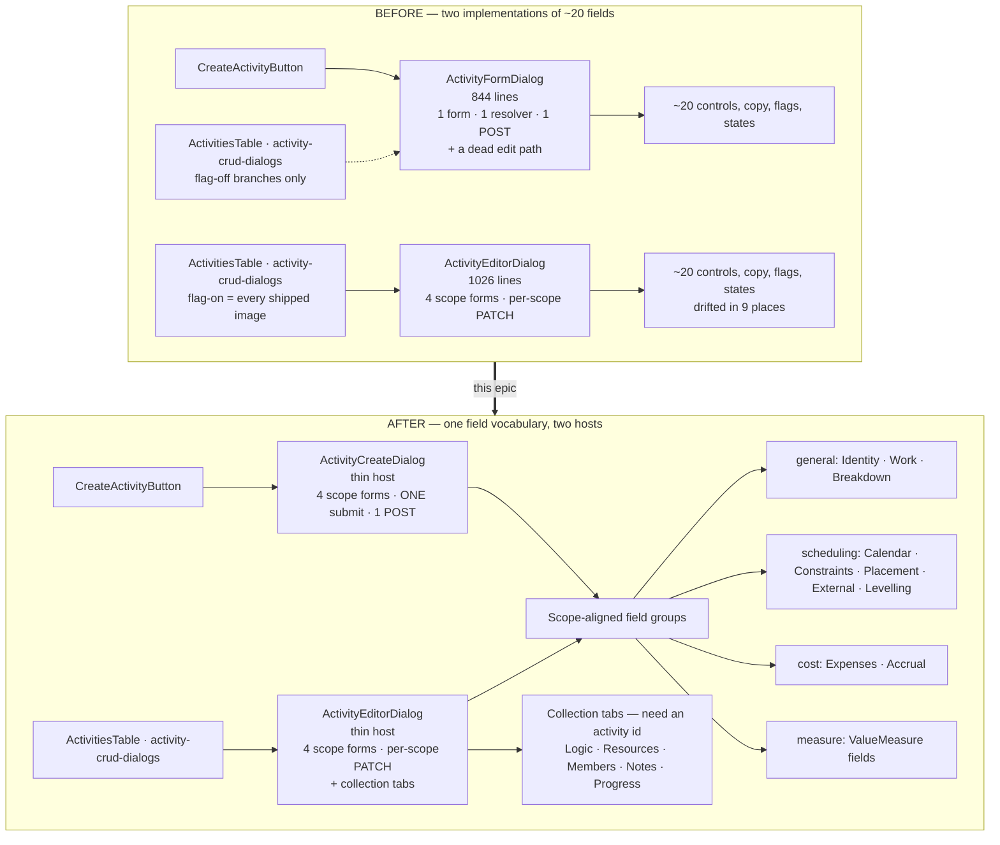
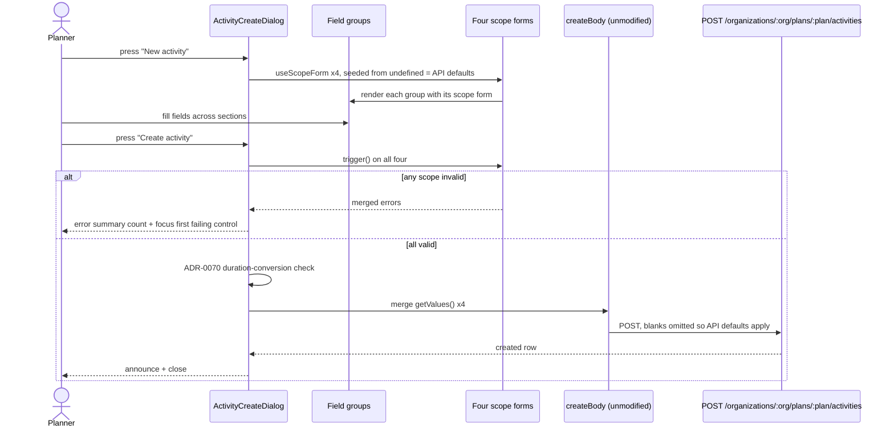

# Feature Spec: Activity dialog unification — one field vocabulary for create and edit

- **Status:** Draft — **awaiting approval**
- **Author(s):** feature-analyst
- **Date:** 2026-08-11
- **Tracking issue / epic:** TBD
- **Roadmap link:** maintainability / drift control (`docs/TECH_DEBT.md` #122)
- **Related ADR(s):** amends **ADR-0060** (§2, §3), **ADR-0061**, **ADR-0062**; consumes
  **ADR-0088** D1–D4 and **ADR-0084** D5; draft **ADR-0089** outlined in §4.7.

---

## 0. Evidence key, and what I checked

Per ADR-0076 §19.10 and `docs/PROCESS.md` "Decision-bearing claims carry their evidence", every
load-bearing claim below carries one of:

- **[V]** — verified by reading the named file at the named lines, in this session.
- **[R]** — reasoned from code I read, but the _consequence_ has not been executed. Flagged for a
  characterisation test before anything is designed around it.
- **[I]** — inherited from the brief and **not** independently confirmed.

**The brief was checked like any other source, and three of its claims moved.** Two were wrong in a
way that changes the design; one was right and stronger than stated. They are in §1.2.

---

## 1. Business understanding

### 1.1 Problem

An activity's ~20 definition fields are rendered **twice**, by two components that share no code:

|        | File                                                                   | Lines     | Role                                     |
| ------ | ---------------------------------------------------------------------- | --------- | ---------------------------------------- |
| Create | `apps/web/src/features/activities/components/ActivityFormDialog.tsx`   | **844**   | one form, one `zodResolver`, one submit  |
| Edit   | `apps/web/src/features/activities/components/ActivityEditorDialog.tsx` | **1,026** | tabbed, four scope forms, per-scope save |

**[V]** Line counts read directly from both files. **[V]** `ActivityEditorDialog.tsx:154` states it in
its own docblock: _"This editor is edit-only; creation stays with `ActivityFormDialog`."_

Every feature that adds an activity field has had to add it to both, and **they have already drifted**
— not hypothetically, but in nine measurable places catalogued in §1.3, at least two of which are
live defects in the shipped product.

**Why now.** `docs/TECH_DEBT.md` #122 (filed during the ADR-0088 batch-2 retirement) is a standing
`deferredUntil` marker on the Class A flag `VITE_ACTIVITY_EDITOR_TABS`, with the trigger
`epic-touch: activity editor` **[V]** `scripts/flag-retirement.json:128-139`. This epic is that
trigger. The register's own correction says the receipts belong to create and edit being two
components, not to the flag — so retiring the flag first collects nothing, and this is the work that
collects it.

**And it completes a decision that was made and not finished.** ADR-0060 §2 reads, verbatim:
_"`ActivityFormDialog` **becomes** `ActivityEditorDialog`, with four tabs"_ **[V]**
`docs/adr/0060-tabbed-activity-editor-and-per-scope-save.md:93`. That is not what shipped. The
editor was built beside the form dialog rather than replacing it, and ADR-0060 §8 — _"The superseded
dialogs are not deleted at the flip"_ **[V]** line 191–194 — deferred the tidy-up without noticing
that the _create_ surface had been left behind entirely. **This epic is not overturning ADR-0060. It
is finishing §2.**

### 1.2 Three corrections to the brief

**(a) "Field overlap is near-total" is understated — it is _exact_, and it is _gated_. [V]**

`apps/web/src/features/activities/schemas/activity-scope-schemas.structural.test.ts:52-53` computes
the union of the four scope shapes and asserts it **equals `activityFormSchema`'s keys in both
directions**, with a second assertion (`:56-59`) that no key is in two scopes. So there is **no field
asymmetry at all** between the two dialogs. The schema layer is _already_ unified and already has a
computed gate.

This changes the design materially: **the schema is not the problem, and unifying it is not the
prize.** The duplication is entirely in the **JSX** — ~20 controls, their labels, hints, flag guards,
type-conditional visibility, loading/error states and honest-option fallbacks, written twice.

**(b) Brief question 5 — `percentCompleteType` / `physicalPercentComplete` on create but not the
editor — has a false premise. [V]** Both fields exist on both surfaces. They are the **`measure`
scope** (`activity-scope-schemas.ts:115-126`), rendered by `ValueMeasurePanel` on the editor's
**Progress** tab (`ActivityProgressPanels.tsx:241,286,317`). This is a deliberate ADR-0060 §2
decision — _"`% complete type` moves out of 'Cost & earned value' and onto Progress, beside what it
selects between"_ **[V]** ADR-0060:101.

It is therefore **not drift in field coverage**. It _is_ drift in **placement and gating**: create
shows both under a "Cost & earned value" section gated `!isDurationDerivedType(type)`
(`ActivityFormDialog.tsx:625,631-659`); the editor shows them on Progress with no type gate. That
divergence is row D9 in §1.3.

**(c) "Ten `ActivityFormDialog.*.test.tsx` suites" is eleven. [V]** Globbed
`apps/web/src/features/activities/components/*.test.tsx`: `activity-types`,
`advanced-constraints`, `calendar`, `cost-accrual`, `duration-types`, `earned-value`,
`inter-project-dates`, `levelling`, `scope`, `sub-day`, **and the base `ActivityFormDialog.test.tsx`**.
`docs/TECH_DEBT.md:2004` says eleven and is right. Five `ActivityEditorDialog.*.test.tsx` suites, as
the brief says. **[V]**

**And one thing the brief got right that is worth more than it says.** Two of the three
`ActivityFormDialog` render sites are **flag-off branches**:

- `ActivitiesTable.tsx:950` — `{ACTIVITY_EDITOR_TABS_ENABLED ? null : (<ActivityFormDialog …>)}` **[V]**
- `activity-crud-dialogs.tsx:143,210` — `{ACTIVITY_EDITOR_TABS_ENABLED ? <ActivityEditorDialog…> : <ActivityFormDialog…>}` **[V]**

The flag is `flagDefaultOn` **[V]** `env.ts:948`, and ADR-0088 D1 established that a `VITE_` flag
cannot be switched off on a deployed container. So **in every published image, `ActivityFormDialog`
is reachable only as the create surface** — one live mount site, `CreateActivityButton.tsx:47` **[V]**.
Its 844 lines contain an entire edit implementation that no user can reach, and eleven test suites
that exercise it in both modes.

### 1.3 The divergence audit — what "they have drifted" means concretely

Read line-by-line across both files. Each row is a real difference in what a planner sees or what is
saved. **Every row is [V] on the code; the marked ones are [R] on the user-visible consequence.**

| #   | Field group                  | Create (`ActivityFormDialog`)                                                                                                                         | Edit (`ActivityEditorDialog`)                                                                                                                                                                        | Verdict                                                                                                                                                                                                                              |
| --- | ---------------------------- | ----------------------------------------------------------------------------------------------------------------------------------------------------- | ---------------------------------------------------------------------------------------------------------------------------------------------------------------------------------------------------- | ------------------------------------------------------------------------------------------------------------------------------------------------------------------------------------------------------------------------------------ |
| D1  | Calendar picker              | inlines its own `Combobox`, `disabled={resourceDependent}` (`:550-576`)                                                                               | uses the shared `ActivityCalendarField`, `readOnly={shaded}` + `FieldGateLock` (`ActivityCalendarField.tsx:106,92`)                                                                                  | **Editor wins.** Create never received ADR-0083 D1/D4. Note `ActivityCalendarField.tsx:18-19` claims it is _"shared by `ActivityFormDialog`"_ — **that docblock is false**: `ActivityFormDialog` does not import it. Live doc drift. |
| D2  | WBS parent picker            | honest "Unavailable"/"Loading…" option for a seeded parent absent from the list, plus loading/error states and a "no summaries yet" hint (`:504-536`) | plain `<option>` list, no fallback, no loading/error (`:575-586`)                                                                                                                                    | **Create wins.** **[R]** In the editor a stored `parentId` whose summary is not in the list renders the select with nothing selected — which reads as "None (top level)". Confirm by characterisation test before fixing.            |
| D3  | Constraint pickers           | injects an honest option for a parked `MANDATORY_*` value (`:306-312,738-740,769-773`)                                                                | **no such option** — `isParkedConstraintType` and `PARKED_CONSTRAINT_LABELS` appear nowhere in `ActivityEditorDialog.tsx` **[V]** (grepped the whole feature: only `ActivityFormDialog.tsx` matches) | **Create wins.** **[R]** In the editor, an imported activity carrying `MANDATORY_START` shows a constraint select whose value matches no option. Highest-risk row; characterise first.                                               |
| D4  | Type picker honest option    | fed the **live watched** `type` (`:246,414`)                                                                                                          | fed the **saved** `activity?.type` (`:532`)                                                                                                                                                          | Create wins (the option must follow the live selection).                                                                                                                                                                             |
| D5  | Work-section explanations    | three paragraphs for LOE, WBS summary and `RESOURCE_DEPENDENT` (`:420-465`)                                                                           | none — the duration field simply disappears                                                                                                                                                          | Create wins.                                                                                                                                                                                                                         |
| D6  | `scheduleAsLateAsPossible`   | inside Constraints, gated `ADVANCED_CONSTRAINTS_ENABLED` (`:750,783`)                                                                                 | in "Placement & targets", **ungated** (`:700`)                                                                                                                                                       | Divergent flag semantics. Default: adopt create's gate (see §4.6).                                                                                                                                                                   |
| D7  | Levelling priority           | hidden for duration-derived types (`:602`)                                                                                                            | always shown (`:742`)                                                                                                                                                                                | Create wins — levelling never moves those types.                                                                                                                                                                                     |
| D8  | Money fields                 | `step="any"`, `min={0}` (`:663,675`)                                                                                                                  | `step="0.01"`, no `min` (`:909,918`)                                                                                                                                                                 | Union: `step="0.01"` + `min={0}`.                                                                                                                                                                                                    |
| D9  | Cost / EV placement + gating | one section, gated `!isDurationDerivedType(type)` (`:625`)                                                                                            | split Cost tab + Progress tab, **no type gate**                                                                                                                                                      | Editor wins. A payment milestone is exactly an activity with a cost and no duration; create hiding the section for it is a defect.                                                                                                   |

Nine divergences, in code that ADR-0060 §10 says exists so that _"behaviour cannot drift between
hosts because there is nothing left to drift"_. That claim was true of the three **edit** hosts and
was never true of create.

### 1.4 Users

| Role                                               | Stake                                                                                                                                                                                                                     |
| -------------------------------------------------- | ------------------------------------------------------------------------------------------------------------------------------------------------------------------------------------------------------------------------- |
| **Planner** (`activity:update` + the ADR-0028 pen) | Creates and edits activities. Meets both surfaces daily, and meets every divergence in §1.3.                                                                                                                              |
| **Org Admin**                                      | As Planner, plus pen override.                                                                                                                                                                                            |
| **Contributor**                                    | Reads the editor, writes only Progress/Notes. **Cannot create** — `CreateActivityButton` renders only under `model.canEditSchedule` **[V]** `plan-detail.tsx:330-331`. Unaffected by design; must be _proven_ unaffected. |
| **Viewer / External Guest**                        | No write surface. Guest never loads this code.                                                                                                                                                                            |
| **This repository's engineers**                    | The real beneficiary: one place to add the next field.                                                                                                                                                                    |

### 1.5 Primary use cases

1. A Planner creates an activity and sets any definition field the product supports.
2. A Planner edits an existing activity, per write scope, exactly as today.
3. An engineer adds a new activity field in **one** component and both surfaces gain it.
4. The `VITE_ACTIVITY_EDITOR_TABS` Class A flag retires, deleting the legacy trio with it.

### 1.6 Expected outcomes

- `ActivityFormDialog` (844 lines) is replaced by a thin `ActivityCreateDialog` composing shared
  groups; its embedded edit implementation is deleted.
- `ActivityEditorDialog` (1,026 lines) keeps its save model and loses its field markup to the same
  groups.
- The nine §1.3 divergences are closed, each with a regression test.
- `classACap` in `scripts/flag-retirement.json` ratchets **2 → 1**.

### 1.7 Success criteria

| Criterion               | Measure                                                                                                                                                        |
| ----------------------- | -------------------------------------------------------------------------------------------------------------------------------------------------------------- |
| One rendering per field | A structural test asserts each of the ~20 field names appears in exactly one group component.                                                                  |
| No coverage lost        | The 11 create suites have a **named destination per assertion** (§2.6 table); no assertion is deleted without a twin.                                          |
| No permission change    | `deriveActivityEditorGating` is not modified; the existing gate-identity tests still pass unchanged.                                                           |
| No API change           | `createBody` / `updateBody` / `generalBody` / `schedulingBody` / `costBody` / `measureBody` are **unmodified** — asserted by key-set tests that already exist. |
| Parity gate untouched   | No `apps/web` file imports the CPM engine (§3.2).                                                                                                              |
| Flag retired            | `VITE_ACTIVITY_EDITOR_TABS` moves to `retired[]`; `pnpm check:flags` green.                                                                                    |

### 1.8 Open questions

Three are **critical** — they change scope or design. Everything else has a stated default in §4.6.

> **CQ-1 (scope). Does the create dialog keep every definition field, or become a lean
> identity-and-work form with the rest deferred to the editor?**
> Today create carries all ~20 fields. A lean create — name, code, description, type, duration,
> WBS parent — would cut this epic's surface by roughly 40% and is a defensible product position
> ("create it, then tune it"). It is also a **capability removal** for anyone who currently sets a
> constraint at create time.
> **Default if unanswered: keep every field.** Removing a capability is not a refactor, and this
> epic's licence is that it changes no capability.

> **CQ-2 (scope). Is `VITE_ACTIVITY_EDITOR_TABS` retired inside this epic (M6), including
> converting the two flag-off Playwright harnesses that pin it?**
> `playwright.sub-day.config.ts:75` and `playwright.assignment-lag.config.ts:74` pin it `'false'`
> **[V]**; ADR-0084 D5 forbids retiring before that coverage is replaced. Converting them is real
> work — and both configs **also** pin `VITE_CANVAS_WORKSPACE: 'false'` **[V]**
> (`sub-day.config.ts:68`, `assignment-lag.config.ts:73`), so the conversion is shared with the
> _other_ deferred Class A flag and is worth more than it costs here.
> **Default if unanswered: yes, M6 is in scope.** #122 exists because retiring the flag alone
> collects nothing; unifying and _not_ retiring leaves the flag pointing at a payoff already taken.

> **CQ-3 (risk posture). Are the nine §1.3 divergences folded inside the extraction PRs, or landed
> separately afterwards so each extraction is a provable no-op?**
> Folding makes each milestone independently valuable and is what makes M2–M4 worth shipping on
> their own. Not folding makes each extraction reviewable as "the tests did not change", which is
> the ADR-0061 unflagged-refactor argument at its strongest.
> **Default if unanswered: fold, one divergence per group PR, each with a regression test verified
> red first.** But note the cost honestly: it means the extraction PRs are _not_ pure refactors and
> the M7 review gate is load-bearing rather than ceremonial.

Non-critical, defaults stated in §4.6: create's layout (flat, not the ADR-0061 rail); D6's flag
gating; whether `activityFormSchema` is derived or retired outright.

---

## 2. Functional requirements

### 2.1 User stories & acceptance criteria

> **US-1** — As a **Planner**, I want the create dialog and the edit dialog to ask for a field the
> same way, so that what I learn on one surface is true on the other.
>
> - **Given** an activity type of `RESOURCE_DEPENDENT`, **when** I open create **and** when I open
>   the editor's Scheduling tab, **then** both show the calendar control shaded with the identical
>   sentence and both keep the bound calendar visible (closes D1).
> - **Given** a stored WBS parent whose summary is not in the loaded list, **when** I open the
>   editor, **then** the picker shows an honest "Unavailable" option and never reads as "None (top
>   level)" (closes D2).
> - **Given** an imported activity carrying `MANDATORY_START`, **when** I open the editor's
>   Scheduling tab, **then** the constraint picker shows that value under its own label (closes D3).

> **US-2** — As a **Planner**, I want to create an activity with any definition the product
> supports, so that I do not have to create-then-edit for a constraint or a cost.
>
> - **Given** the create dialog, **when** I fill any field the editor offers, **then** it is sent on
>   the `POST` and persisted.
> - **Given** a milestone type, **when** I create it, **then** the cost fields are available
>   (closes D9) and the duration field is not.
> - **Given** an invalid field in any section, **when** I submit, **then** the error summary counts
>   every failing section and focus lands on the first failing control.

> **US-3** — As a **Contributor**, I want my ability to report progress to be exactly what it was,
> so that a refactor of somebody else's surface does not take a capability from me.
>
> - **Given** a Contributor, **when** the editor opens, **then** the Progress tab is writable and
>   every definition scope is shaded with its reason — identical to today.
> - **Given** a Contributor, **when** the plan-detail screen renders, **then** no create button
>   appears.

> **US-4** — As an **engineer**, I want to add an activity field once.
>
> - **Given** a new field added to one scope shape and one group component, **when** I run the
>   suite, **then** both surfaces render it and the structural gate passes with no second edit.
> - **Given** a field added to a scope shape but to no group, **then** a structural test **fails**
>   naming the field.

> **US-5** — As an **engineer**, I want the legacy edit surfaces gone, so that the next feature
> cannot be added to a dead branch.
>
> - **Given** M6 is merged, **when** I grep for `ACTIVITY_EDITOR_TABS_ENABLED`, **then** there are
>   no matches in `apps/web/src` and `pnpm check:flags` is green.

### 2.2 Workflows

**Create.** Press **New activity** → dialog opens with API defaults seeded → planner fills any
section → **Create activity** → all four scope forms validate → a single merged values object feeds
the **unmodified** `createBody` → one `POST` → announce → close.

**Edit.** Unchanged. Row/canvas action builds an `ActivityEditorIntent` → tabbed editor → per-scope
Save → `PATCH` with that scope's keys plus the **live** `version`.

### 2.3 Edge cases

| Case                                                  | Expected                                                                                                                                               |
| ----------------------------------------------------- | ------------------------------------------------------------------------------------------------------------------------------------------------------ |
| Calendar list still loading when the dialog opens     | Picker says "Loading…", keeps the bound value; the duration field degrades to whole working days (the ADR-0070 rule, unchanged).                       |
| Calendar list fails to load                           | Picker says "Unavailable" with the existing error sentence; create is still submittable with inherit.                                                  |
| Duration typed before the calendar resolves           | `useDurationSeed`'s `readDuration()` getter still owns this (TECH_DEBT #83, closed). **Must not regress** — it is a named characterisation case in M0. |
| A parked `MANDATORY_*` constraint on an edited row    | Shown under its own label, round-trips unchanged.                                                                                                      |
| A stored `parentId` absent from the list              | Shown as "Unavailable"; saving does not un-nest.                                                                                                       |
| Duration-derived type (milestone / LOE / WBS summary) | Duration + duration type + levelling hidden; cost **shown** (D9); explanations shown (D5).                                                             |
| Two scopes invalid on create                          | Error summary counts both; focus goes to the first in document order.                                                                                  |
| Create submitted twice (double-click)                 | Submit is `disabled`-free per ADR-0060 M6 — the button uses `aria-busy` + pending label. Preserve today's behaviour.                                   |
| Contributor reaches the editor                        | Definition scopes shaded with reasons; Progress writable. Unchanged.                                                                                   |

### 2.4 Permissions

**Nothing changes.** Mapped to ADR-0012 RBAC + organisation scope, and to the ADR-0028 pen:

| Surface                                                                              | Permission                 | Pen    | Source                                                                                                 |
| ------------------------------------------------------------------------------------ | -------------------------- | ------ | ------------------------------------------------------------------------------------------------------ |
| Create                                                                               | `activity:update`          | yes    | `plan-detail.tsx:330` gates on `model.canEditSchedule`, which already fuses role + pen **[V]**         |
| Editor — general / scheduling / cost / measure / steps / logic / resources / members | `activity:update`          | yes    | `deriveActivityEditorGating` `:101-125` — **one `definition` object reused**, not re-expressed **[V]** |
| Editor — progress                                                                    | `activity:update_progress` | **no** | `:111-113` **[V]**                                                                                     |
| Editor — notes                                                                       | `activity:update_progress` | **no** | `:129-131` **[V]**                                                                                     |

`activity-editor-gating.ts` is **not modified by this epic**. The existing identity assertions
(`gating.logic === gating.general`) are the gate that says so.

### 2.5 Validation rules

Unchanged, and that is the point. The four scope schemas stay the client-side authority; all three
cross-field refinements are **scheduling-internal** (`constraintDate`, `secondaryConstraintDate`,
`externalLateFinish`) **[V]** `activity-scope-schemas.ts:76-95`, so running validation per scope on
create loses no rule. `activity-scope-schemas.structural.test.ts:75-80` already asserts every
refinement path resolves inside its own shape.

The one check no schema can make — whether a duration text converts on _this_ activity's calendar —
stays a submit-time `setError` in both hosts **[V]** `ActivityFormDialog.tsx:318-323`,
`ActivityEditorDialog.tsx:475-484`.

The server remains the sole trust boundary.

### 2.6 Test-coverage migration — the destination table

ADR-0084 D5's rule, applied as ADR-0088 applied it: **coverage moves with a named destination, never
deleted for convenience.** Each of the 11 create suites splits in two.

| Source suite                                       | Field-level assertions →                                            | Submit/body assertions →                             |
| -------------------------------------------------- | ------------------------------------------------------------------- | ---------------------------------------------------- |
| `ActivityFormDialog.activity-types.test.tsx`       | `ActivityWorkFields.test.tsx`                                       | `ActivityCreateDialog.activity-types.test.tsx`       |
| `ActivityFormDialog.advanced-constraints.test.tsx` | `ActivityConstraintFields.test.tsx`                                 | `ActivityCreateDialog.advanced-constraints.test.tsx` |
| `ActivityFormDialog.calendar.test.tsx`             | `ActivityCalendarField.test.tsx` (exists)                           | `ActivityCreateDialog.calendar.test.tsx`             |
| `ActivityFormDialog.scope.test.tsx`                | `ActivityCalendarField.test.tsx`                                    | `ActivityCreateDialog.scope.test.tsx`                |
| `ActivityFormDialog.cost-accrual.test.tsx`         | `ActivityAccrualField.test.tsx`                                     | `ActivityCreateDialog.cost-accrual.test.tsx`         |
| `ActivityFormDialog.duration-types.test.tsx`       | `ActivityWorkFields.test.tsx`                                       | `ActivityCreateDialog.duration-types.test.tsx`       |
| `ActivityFormDialog.earned-value.test.tsx`         | `ActivityMeasureFields.test.tsx` + `ActivityExpenseFields.test.tsx` | `ActivityCreateDialog.earned-value.test.tsx`         |
| `ActivityFormDialog.inter-project-dates.test.tsx`  | `ActivityExternalDatesFields.test.tsx`                              | `ActivityCreateDialog.inter-project-dates.test.tsx`  |
| `ActivityFormDialog.levelling.test.tsx`            | `ActivityLevellingField.test.tsx`                                   | `ActivityCreateDialog.levelling.test.tsx`            |
| `ActivityFormDialog.sub-day.test.tsx`              | `ActivityWorkFields.test.tsx`                                       | `ActivityCreateDialog.sub-day.test.tsx`              |
| `ActivityFormDialog.test.tsx` (base)               | spread across the above                                             | `ActivityCreateDialog.test.tsx`                      |

**The group suites land first and green before the host suite is thinned**, in the same PR. A
counting check (`it(` blocks before vs after, per source suite) is recorded in the PR body — crude,
but it makes a silent drop visible, which is the failure mode ADR-0084 D5 exists for.

### 2.7 Error scenarios

| Scenario                               | Detection                         | User-facing result                                                                            | Status |
| -------------------------------------- | --------------------------------- | --------------------------------------------------------------------------------------------- | ------ |
| Create rejected — calendar wrong scope | server 422 `CALENDAR_WRONG_SCOPE` | `calendarScopeErrorMessage()` sentence, as today **[V]** `ActivityFormDialog.tsx:371`         | 422    |
| Create rejected — pen not held         | `assertHoldsPen`                  | server sentence verbatim                                                                      | 423    |
| Edit rejected — stale version          | optimistic lock                   | scoped error + **Refresh this section**, unchanged **[V]** `ActivityEditorDialog.tsx:309-322` | 409    |
| Duration text unconvertible            | client submit check               | inline `DURATION_NEEDS_WHOLE_DAYS`, focused                                                   | —      |
| Any scope invalid on create            | resolver                          | error summary count + focus first                                                             | —      |

---

## 3. Technical analysis

| Area           | Impact                                  | Notes                                                                                                                                                            |
| -------------- | --------------------------------------- | ---------------------------------------------------------------------------------------------------------------------------------------------------------------- |
| Frontend       | **high**                                | ~11 new group components; two hosts rewritten; 16 test suites re-homed; 2 Playwright harnesses converted.                                                        |
| Backend        | **none**                                | No module, service or endpoint touched.                                                                                                                          |
| Database       | **none**                                | No model, column, index, constraint or migration. **The database-architect agent is therefore not triggered** — see §3.1.                                        |
| API            | **none**                                | `createBody`/`updateBody` and the four scope bodies are unmodified; their existing key-set tests are the gate.                                                   |
| Security       | **none by design, proven not asserted** | `activity-editor-gating.ts` untouched; the server remains the only trust boundary. security-reviewer still runs at M7.                                           |
| Performance    | **low**                                 | Create moves from one `useForm` to four. Four small resolvers on a dialog opened by hand; no render-path cost. Measure only if the M7 performance reviewer asks. |
| Infrastructure | **low**                                 | M6 edits two `playwright.*.config.ts` files and `scripts/flag-retirement.json`.                                                                                  |
| Observability  | **none**                                | No log, metric or audit event. Activity CRUD is `PENDING_COVERAGE`-free and unchanged.                                                                           |
| Testing        | **high**                                | The bulk of the work. See §2.6 and each milestone.                                                                                                               |

### 3.1 Frontend-only — and what would change that

**No API or schema change is expected. [V]** Both body builders already exist, already carry every
field, and the epic does not alter them:

- `createBody` **omits** blank fields so the API default applies (`use-activities.ts:122-157`).
- `updateBody` **sends explicit nulls** so a cleared field is cleared (`:160-213`).

That asymmetry is correct and must survive: it is why create and edit cannot share a body builder,
and it is _not_ duplication. The unified value object feeds whichever builder its host owns.

**If any of these appear, stop and escalate loudly:** a field the API accepts that neither builder
sends; a new field; a validation rule that needs a server change; a permission that needs splitting.
The first would be a real finding (an ADR-0067/0070-shaped "storage exists, nothing can author it"
gap) and would need its own slice. **Any schema change routes to the database-architect agent
unconditionally (CLAUDE.md §19.3) — no self-assessment of significance.**

### 3.2 The ADR-0034 recalculation parity gate — structurally untouched

**The claim, with its evidence.** The CPM engine lives in `apps/api/src/modules/schedule/engine/`;
`apps/web` does not depend on `@repo/api` and nothing under `apps/web/src` imports `computeSchedule`.
Grepping `computeSchedule|schedule/engine` across `apps/web/src` returns nine files, **all** of which
are route strings, TanStack query keys or toolbar labels (`use-plan-workspace-model.ts`,
`hierarchy-keys.ts`, `tsld-toolbar-items.tsx`, `use-float-paths.ts`, …) **[V]**.

More strongly: this epic **adds no scheduling input and alters none**. The same values reach the same
endpoints through the same unmodified body builders. There is nothing new for `computeSchedule` to
receive, so the parity gate is untouched **by construction**, not by care.

### 3.3 Dependencies

- **Must land first:** nothing external. M0 (characterisation) must precede every extraction.
- **Affected features:** `dependencies` (Logic tab), `resources`, `wbs`, `notes`, `cross-plan-dependencies` — all reached through the editor's slots, all **untouched**; their tabs are collections, not field groups.
- **Interacts with:** ADR-0083 (Proposed **[V]** `0083-shaded-form-fields.md:3`, yet `FieldGateProvider` / `useFieldGate` / `readOnly` are **already in the code** — `ActivityCalendarField.tsx:69,106`). The groups adopt the ADR-0083 pattern; this epic is a large second consumer and should be cited when ADR-0083 moves to Accepted.
- **Blocks:** #122's `VITE_ACTIVITY_EDITOR_TABS` half; partially unblocks #122's `VITE_CANVAS_WORKSPACE` half (shared harness conversion).

---

## 4. Solution design

### 4.1 The load-bearing idea

> **The save model belongs to the _host_. The field rendering belongs to the _group_. They are
> orthogonal, and ADR-0060 only ever decided the first.**

ADR-0060 §3 decides _who saves what, under which permission, to which endpoint_ — because the scopes
carry different permissions and one merged Save would remove a Contributor's ability to report
progress **[V]** ADR-0060:104-125. It says nothing about who renders the Name field. Unifying the
rendering **does not merge the saves**, and this design does not propose merging them.

The corollary that answers brief question 1: **what is unified is the field groups.** Not the schema
(already unified and gated, §1.2a), not the dialog shell beyond what is genuinely shared, and
emphatically not the save model.

**The constraint that fixes the group boundaries.** The editor wraps each scope's form in a single
`<FieldGateProvider gate={gating.X}>` **[V]** `ActivityEditorDialog.tsx:496,616,899`. A group
spanning two scopes could not be placed inside exactly one provider. So: **a group belongs to
exactly one write scope.** That is not an aesthetic rule — it is forced, and it is already satisfied,
because the scopes partition the fields (§1.2a). The result is a three-level structure each level of
which is gated by a computed test:

```
field  →  scope shape  →  group component
        (partition proved by            (partition to be proved by
     activity-scope-schemas.structural)  a new field-group structural test)
```

### 4.2 Architecture — before and after



### 4.3 The group inventory

Eleven components, each over exactly one scope. One already exists.

| Group                         | Scope      | Fields                                                        | Status                                                                                            |
| ----------------------------- | ---------- | ------------------------------------------------------------- | ------------------------------------------------------------------------------------------------- |
| `ActivityIdentityFields`      | general    | `name`, `code`, `description`                                 | new                                                                                               |
| `ActivityWorkFields`          | general    | `type`, `duration`, `durationType` + the D5 explanations      | new                                                                                               |
| `ActivityBreakdownField`      | general    | `parentId` + honest-option fallback + loading/error           | new                                                                                               |
| `ActivityCalendarField`       | scheduling | `calendarId`                                                  | **exists** — reuse verbatim                                                                       |
| `ActivityConstraintFields`    | scheduling | `constraintType`/`Date`, `secondary*` + parked honest options | new                                                                                               |
| `ActivityPlacementFields`     | scheduling | `scheduleAsLateAsPossible`, `expectedFinish`                  | new                                                                                               |
| `ActivityExternalDatesFields` | scheduling | `externalEarlyStart`, `externalLateFinish`                    | new                                                                                               |
| `ActivityLevellingField`      | scheduling | `levelingPriority`                                            | new                                                                                               |
| `ActivityExpenseFields`       | cost       | `budgetedExpense`, `actualExpense`                            | new                                                                                               |
| `ActivityAccrualField`        | cost       | `accrualType`                                                 | new                                                                                               |
| `ActivityMeasureFields`       | measure    | `percentCompleteType`, `physicalPercentComplete`              | new — **extracted from** `ValueMeasurePanel`, which keeps its steps-rollup logic and its own save |

Each group: is presentational; takes its scope's `UseFormReturn<TScopeValues>` plus the few facts it
needs (`calendars`, `parentOptions`, `hoursPerDay`, `activityType`); owns its own `FormSection`,
labels, hints and flag guards; and reads the ambient gate through `useFieldGate()` — **optional**, so
a host without a provider (create) is not shaded. That optionality already works and is proven:
`ActivityCalendarField.tsx:69` uses `useFieldGate()?.writable === false` **[V]**.

### 4.4 The create host — four forms, one submit

This is the design decision most worth challenging, so here is why it is not the obvious alternative.

**Why not one `useForm<ActivityFormValues>` on create?** Because a group typed over a _narrow_ scope
form is not consumable from a _wide_ one. RHF's `register` is `<N extends FieldPath<T>>`, and
`FieldPath<T>` on a generic `T extends ActivityGeneralValues` is opaque to the compiler — so a
generic group cannot call `form.register('name')` without a cast. Writing groups over the wide type
instead makes them unusable by the editor. Either way one host gets casts, and casts are how a field
silently stops being registered. **[R]** — this is reasoned from RHF's type signatures; **M0 carries
a five-line spike that compiles the generic group against both form types, and the result may
overturn this.** Say so rather than discovering it in M2.

**So the create host runs `useScopeForm` four times — the same hook the editor uses — and submits
once:**

```
validate  →  await Promise.all([general, scheduling, measure, cost].map(f => f.trigger()))
merge     →  { ...general.getValues(), ...scheduling.getValues(), ...measure.getValues(), ...cost.getValues() }
check     →  the ADR-0070 duration-conversion check (unchanged)
send      →  createBody(merged)  →  one POST
```

Three properties fall out, and they are the argument:

1. **The groups are byte-identical in both hosts** — same component, same form type, same props.
2. **The difference between the hosts is exactly the save layer**, which is the thesis made
   structural rather than asserted.
3. **`useScopeForm` already anticipated this.** `activity-editor-seeds.ts:23` says, verbatim: _"A
   create seeds the API defaults, so an unopened tab saves exactly what the server would default."_
   **[V]** The seeds were written to serve a create path that was never built.

One thing this owes the user: **an error summary that spans four forms.** `FormErrorSummary` takes
one `errors` object, so the create host merges the four and passes the union — and per ADR-0077 M8,
it shows a **count** from two problems up rather than restating each sentence. Focus goes to the
first failing control in document order, which four independent `handleSubmit` calls would not give
for free. This is a named risk in the plan.

### 4.5 The editor host — what changes and what does not

**Unchanged:** the tabs, the per-scope forms, `saveScope`, the live-`version` read, the scoped error

- **Refresh this section**, the discard confirmation, `ScopeSaveBar`, every collection tab, the
  gating object, the intent model.

**Changed:** the JSX inside each definition tab becomes `<Group form={scope.form} … />` calls.

**Answering brief question 2 explicitly: neither host absorbs the other.**

- Create does **not** become a tab-less mode of the editor. The editor's tabs _are_ its write scopes,
  and scopes exist because saves differ. Creation has one save, so tabs would be navigation cost with
  no meaning behind it.
- The editor does **not** gain a create mode. Five of its tabs — Logic, Resources, Members, Notes,
  Progress — render `activity.id` into queries and mutations **[V]** `ActivityEditorDialog.tsx:783,
798-805, 811-835, 846-883`. A create mode ships those either absent or dead, which is ADR-0081's
  defect class by construction.
- A single host with an `isCreate` prop would be a component whose every other branch reads "not in
  create" — the second product ADR-0088 D2 is about, relocated into one file.

**Shared where it is genuinely shared:** `Dialog`, `FieldGridContainer`, `FormErrorSummary`,
`FormSection`/`FieldGrid` (ADR-0061), and the **section order**, which both surfaces already claim to
follow — `ActivityFormDialog.tsx:375-377` says its sections _"mirror the tabbed editor's"_ **[V]**.
After this they do, because there is one set.

### 4.6 Stated defaults for the non-critical questions

| Question                                  | Default                                                                                                                                   | Reason                                                                                                                                                                                                                                                                    |
| ----------------------------------------- | ----------------------------------------------------------------------------------------------------------------------------------------- | ------------------------------------------------------------------------------------------------------------------------------------------------------------------------------------------------------------------------------------------------------------------------- |
| Create's layout                           | Flat sections at `size="lg"`, today's shape                                                                                               | ADR-0061 gave the editor the rail _because its scopes carry different permissions_. Create has one. The rail's reason for existing does not apply.                                                                                                                        |
| D6 — `scheduleAsLateAsPossible` gating    | Adopt create's `ADVANCED_CONSTRAINTS_ENABLED` gate                                                                                        | A flag's off-branch should be coherent; an ALAP control with the advanced-constraints section hidden is the incoherent side. Zero user-visible effect — the flag is compiled on in every image (ADR-0088 D1).                                                             |
| `activityFormSchema`'s future             | **Retire it** at M5 with its last consumer, rather than deriving it                                                                       | Deriving it makes `activity-scope-schemas.structural.test.ts`'s first assertion trivially true, which quietly removes the gate. Retiring it is honest; the structural test re-points at the **group partition** instead (§4.1), which is the invariant that then matters. |
| Where the duration-conversion check lives | Both hosts, on the `general` form                                                                                                         | Unchanged from today; it is a host concern, not a group one.                                                                                                                                                                                                              |
| `ValueMeasurePanel`                       | Keeps its save, its steps rollup and its "steps are overriding this" reason; loses only its two field controls to `ActivityMeasureFields` | The rollup is progress-tab logic, not a field.                                                                                                                                                                                                                            |

### 4.7 Is this ADR-worthy? Yes — draft ADR-0089

**Yes, plainly.** It amends an Accepted ADR's §2 and §3 reading, it establishes a house rule for the
whole product, and it retires a Class A flag. Next free number is **0089** **[V]** (`docs/adr/` runs
to `0088-flag-classification.md`).

> **ADR-0089 — One activity field vocabulary: the scope-aligned field group.**
>
> **Context.** ADR-0060 §2 decided `ActivityFormDialog` _becomes_ `ActivityEditorDialog`; the
> implementation built the editor beside it and left create on the old component. Nine features
> then added fields to both. The two surfaces have drifted in nine places (spec §1.3), two of them
> live defects. `docs/TECH_DEBT.md` #122 correctly attributes the cost to the two-component split
> rather than to the flag that was suspected of it.
>
> **D1. A field is rendered by exactly one component.** Groups partition the scope shapes, which
> partition the field set. A structural test computes the partition in both directions; a field in
> a scope with no group fails CI.
>
> **D2. A group belongs to exactly one write scope.** Forced, not chosen: the editor wraps each
> scope in one `FieldGateProvider`, so a two-scope group has nowhere to sit.
>
> **D3. The save model belongs to the host; ADR-0060 §3 is affirmed and scoped.** Per-scope save is
> a statement about _permissions_, and it binds the editor. **Creation is one act with one
> permission, so it is one scope by construction** — a single submit over four scope forms, which
> is not a merged save because there is nothing to merge.
>
> **D4. Neither host absorbs the other.** Five editor tabs require an activity id; a create mode
> would ship them dead (ADR-0081).
>
> **D5. No feature flag.** ADR-0061's reasoning (a structural refactor gated means two copies in one
> file) plus ADR-0088 D1 (a `VITE_` flag cannot be switched off on a deployed container, so there
> has never been an operator rollback) plus ADR-0088 D2/D3 (a new flag here would be **Class A**,
> and `classACap` is 2 and ratchets _down_ — proposing one means arguing to raise a cap this epic
> exists to lower). The rollback is a commit boundary: one revertible commit per milestone, the
> ADR-0077 M6 precedent.
>
> **D6. `VITE_ACTIVITY_EDITOR_TABS` retires with this epic**, which is #122's named trigger. The two
> flag-off harnesses are **converted, not deleted** (ADR-0084 D5). `classACap` ratchets 2 → 1.
>
> **Consequences.** Positive: one place to add a field; nine divergences closed; the 844-line
> monolith and the legacy trio deleted. Negative: a large diff across a high-traffic surface, whose
> only real protection is the M7 specialist gate and the flag-on journey — this epic has no unit
> flag-off suite to fall back on, and ADR-0088 D7 records that unit flag-off suites have caught
> exactly one defect in this project's history anyway. New debt: none intended; anything found is
> filed rather than rushed.
>
> **The CPM engine is not imported and the ADR-0034 parity gate is untouched** (spec §3.2). No
> migration runs.

### 4.8 Data flow — create



### 4.9 User flow


### 4.10 Database changes

**None.** No model, column, index, constraint or data migration. The database-architect agent is
therefore not engaged — and if that assessment turns out to be wrong at any point, it becomes
engaged **unconditionally**, with no judgement about whether the change is big enough
(CLAUDE.md §19.3, §20).

### 4.11 API changes

**None.** No endpoint, DTO, status code or OpenAPI change. The six body builders are unmodified and
their existing key-set assertions are the proof.

### 4.12 Component changes

New, all under `apps/web/src/features/activities/components/fields/`: the ten new groups in §4.3,
plus `ActivityCreateDialog.tsx`. `ActivityCalendarField.tsx` moves into that folder unchanged (a
barrel-preserving move, ADR-0078's rule) and **its false docblock line is corrected** — it will then
be true.

Deleted at M5: `ActivityFormDialog.tsx`. Deleted at M6: `ActivityProgressDialog.tsx`,
`ActivityStepsDialog.tsx` and the flag-off Logic/Resources dialog mounts in `plan-dialogs.tsx`
**[V]** `plan-dialogs.tsx:165,184`.

No new design-system primitive. `FormSection`, `FieldGrid`, `FieldGridFull`, `ContextStrip`,
`ScopeSaveBar`, `FieldGateProvider`, `Combobox`, `SelectField`, `TextField`, `CheckboxField`,
`TextareaField` all already exist and are reused. **No one-off styling.**

### 4.13 Alternatives considered

| Alternative                                                     | Why not                                                                                                                                                                     |
| --------------------------------------------------------------- | --------------------------------------------------------------------------------------------------------------------------------------------------------------------------- |
| **Unify the schema only** (brief Q1)                            | Already done and already gated (§1.2a). Collects nothing.                                                                                                                   |
| **Create becomes a tab-less editor mode**                       | Five tabs need an id; a create mode ships them dead (ADR-0081). And tabs encode scopes, which encode differing saves — create has one save.                                 |
| **Editor gains a create mode via `isCreate`**                   | A second product inside one file (ADR-0088 D2), with every branch reading "not in create".                                                                                  |
| **Merge the save models**                                       | Rejected by ADR-0060 §3 on the Contributor regression and the two-phase steps/PATCH write. Not proposed, and this design does not require it.                               |
| **Retire the flag first, unify later**                          | Exactly what #122 says buys nothing: it deletes three mount sites and leaves the monolith alive as the create surface.                                                      |
| **Ship behind a new flag**                                      | ADR-0061 + ADR-0088 D1/D2/D3 — see ADR-0089 D5.                                                                                                                             |
| **Groups as controlled components** (values + onChange, no RHF) | Loses `register`'s uncontrolled performance and rewrites every field rather than moving it; the comments in these files record defects and should move verbatim (ADR-0078). |

---

## 5. Links

- Implementation plan: [`./implementation-plan.md`](./implementation-plan.md)
- Docs this change will update: `docs/adr/0089-*.md` (new), `docs/adr/README.md`,
  `docs/TECH_DEBT.md` (#122 — the `VITE_ACTIVITY_EDITOR_TABS` half closes; #114/#64 re-checked),
  `scripts/flag-retirement.json`, `apps/web/src/config/env.ts`, `CLAUDE.md` (§16 ADR list, and the
  stage-banner counts — `pnpm check:counts` will fail otherwise), `docs/DESIGN_SYSTEM.md`
  ("Form layout" gains the field-group rule).
