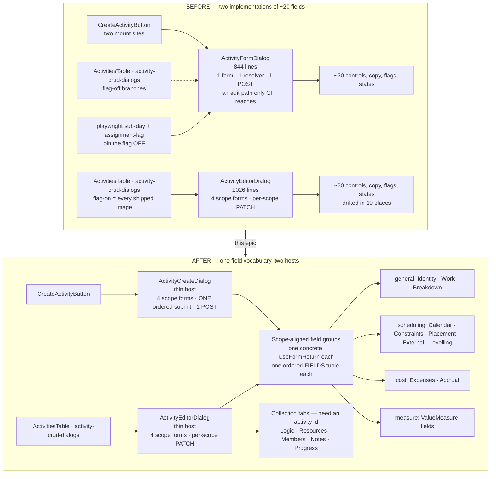
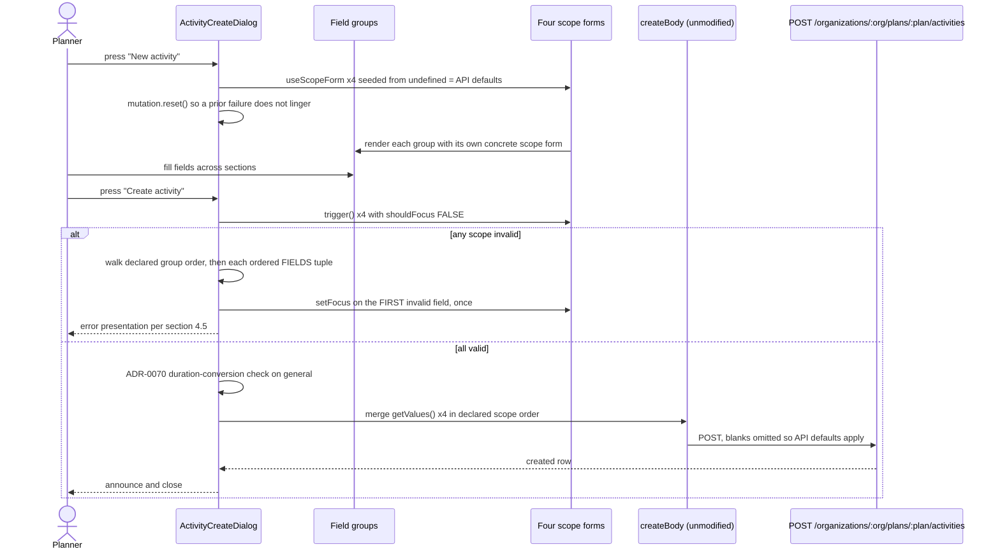
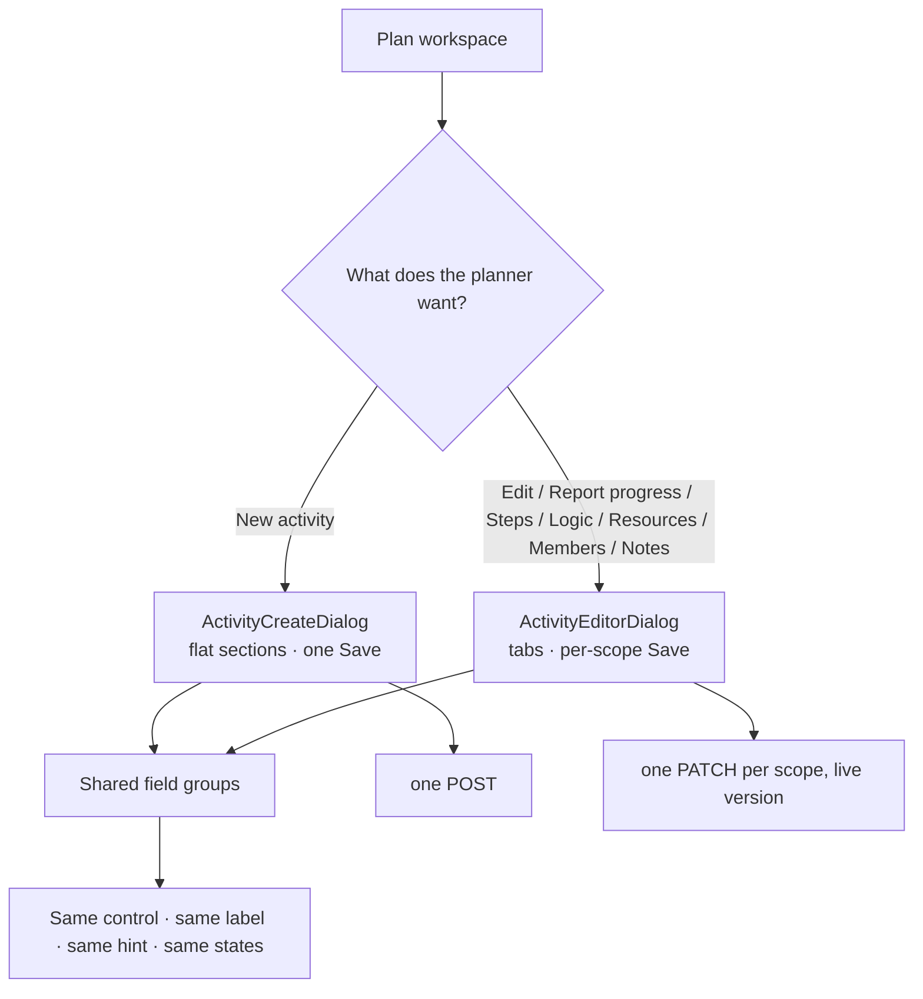

# Feature Spec: Activity dialog unification — one field vocabulary for create and edit

- **Status:** Draft **rev 3** — **awaiting approval**
- **Author(s):** feature-analyst
- **Date:** 2026-08-11
- **Tracking issue / epic:** TBD
- **Roadmap link:** maintainability / drift control (`docs/TECH_DEBT.md` #122)
- **Related ADR(s):** amends **ADR-0060** (§2, §3), **ADR-0061**, **ADR-0062**; consumes
  **ADR-0088** D1–D4, **ADR-0084** D5, **ADR-0083**, **ADR-0077** §9; draft **ADR-0089** in §4.8.

---

## Revision history

**rev 2 (2026-08-11)** — after `ui-architect` returned AGREE WITH CONDITIONS (twelve, several
blocking). Ten conditions were corrections to claims rev 1 made about code the architect read; all
ten were re-verified against the source here and **all ten hold**. The largest is that rev 1's
stated enforcement mechanism was false — see §4.1, which now records the retraction rather than
quietly replacing it (ADR-0071's rule: noticing drift and stepping over it leaves the record as
wrong as not noticing).

**rev 3 (2026-08-11)** — after re-review returned AGREE WITH CONDITIONS (five, mechanical; the seam,
the thesis and converge-then-extract unchanged). The sharpest is that **rev 2's replacement mechanism
had a hole one layer up**: `FIELDS` was checked for _spelling_, not for _rendering_. That is the
second time in this spec's history that a stated enforcement mechanism has been weaker than claimed,
which is itself the finding — so §4.1 now states, for each gate, **what it does not catch**. Full
changelog at §6.

---

## 0. Evidence key

Per ADR-0076 §19.10 and `docs/PROCESS.md`:

- **[V]** — verified by reading the named file at the named lines, in this session.
- **[R]** — reasoned from code read, consequence **not** executed. Must be characterised before
  anything is designed on it.
- **[I]** — inherited from the brief or the review and **not** independently confirmed. **rev 2
  contains no [I] claims**: every review finding was re-read at source before folding.

Two rev-1 claims were **retracted** as false. They are marked **[RETRACTED]** in place rather than
deleted.

---

## 1. Business understanding

### 1.1 Problem

An activity's ~20 definition fields are rendered **twice**, by two components sharing no code:

|        | File                                                                   | Lines     | Role                                     |
| ------ | ---------------------------------------------------------------------- | --------- | ---------------------------------------- |
| Create | `apps/web/src/features/activities/components/ActivityFormDialog.tsx`   | **844**   | one form, one `zodResolver`, one submit  |
| Edit   | `apps/web/src/features/activities/components/ActivityEditorDialog.tsx` | **1,026** | tabbed, four scope forms, per-scope save |

**[V]** Line counts read from both files. **[V]** `ActivityEditorDialog.tsx:154`: _"This editor is
edit-only; creation stays with `ActivityFormDialog`."_

Nine features have added fields to both, and **they have drifted in ten measurable places** (§1.3),
two of which look like live defects.

**Why now.** `docs/TECH_DEBT.md` #122 is a standing `deferredUntil` marker on the Class A flag
`VITE_ACTIVITY_EDITOR_TABS`, trigger `epic-touch: activity editor` **[V]**
`scripts/flag-retirement.json:128-139`. This epic is that trigger, and the register's own correction
says the receipts belong to the two-component split rather than to the flag.

**It also completes a decision that was made and not finished.** ADR-0060 §2 reads, verbatim:
_"`ActivityFormDialog` **becomes** `ActivityEditorDialog`, with four tabs"_ **[V]**
`docs/adr/0060-...md:93`. The editor was built beside it instead. **This epic is not overturning
ADR-0060; it is finishing §2.**

### 1.2 Corrections to the brief

**(a) "Field overlap is near-total" is understated — it is exact, and gated. [V]**
`activity-scope-schemas.structural.test.ts:52-53` asserts the union of the four scope shapes
**equals** `activityFormSchema`'s keys in both directions; `:56-59` asserts no key sits in two
scopes. **The schema layer is already unified and already gated.** The duplication is entirely in
the JSX. This redirects the whole design.

**(b) Brief question 5 has a false premise. [V]** Both fields exist on both surfaces. They are the
**`measure` scope** (`activity-scope-schemas.ts:115-126`), rendered by `ValueMeasurePanel` on the
editor's Progress tab (`ActivityProgressPanels.tsx:241,286,317`) — a deliberate ADR-0060 §2 decision
**[V]** ADR-0060:101. Not drift in coverage. It **is** drift in placement (D9) and in visibility
rule (D10).

**(c) Eleven create suites, not ten. [V]** The base `ActivityFormDialog.test.tsx` was omitted.
`docs/TECH_DEBT.md:2004` says eleven and is right.

**(d) Both `ActivityFormDialog` edit mount sites are flag-off branches. [V]**
`ActivitiesTable.tsx:950`, `activity-crud-dialogs.tsx:143,210`; the flag is `flagDefaultOn`
(`env.ts:948`) and per ADR-0088 D1 cannot be switched off on a deployed container. **So no _user_
can reach that edit path.**

> **rev 2 correction — "844 lines nobody can reach" was right about users and wrong about the
> repository.** `playwright.sub-day.config.ts:75` and `playwright.assignment-lag.config.ts:74` pin
> `VITE_ACTIVITY_EDITOR_TABS: 'false'` **[V]**, so **two live CI harnesses drive that edit path on
> every run.** This is not a footnote: it decides the milestone order (§5, and plan M5/M6 are
> swapped in rev 2). Code exercised by two green suites cannot simply be deleted.

### 1.3 The divergence audit

Read line by line across both files. **rev 2 adds D10**, found by the architect while reading two
screens for an unrelated reason — which is the finding that matters more than the row:

> **The list is no longer presumed complete.** rev 1 found nine by reading; a reviewer found a tenth
> incidentally. So M0-T1 is re-scoped from _pin the nine_ to **re-derive the divergence set from
> code**, field by field across both surfaces, and the plan budgets for eleven or twelve. Completeness
> is this epic's licence: an unlisted divergence gets silently resolved by whichever host the
> extractor started from.

| #       | Group                                | Create                                                                                               | Edit                                                                                                                                                   | Verdict                                                                                                                                                                                                                                                                                                                                                                                                                                                                                                                                                                                                                    |
| ------- | ------------------------------------ | ---------------------------------------------------------------------------------------------------- | ------------------------------------------------------------------------------------------------------------------------------------------------------ | -------------------------------------------------------------------------------------------------------------------------------------------------------------------------------------------------------------------------------------------------------------------------------------------------------------------------------------------------------------------------------------------------------------------------------------------------------------------------------------------------------------------------------------------------------------------------------------------------------------------------- |
| D1      | Calendar                             | inlines its own `Combobox`, `disabled={resourceDependent}` (`:550-576`)                              | shared `ActivityCalendarField`, `readOnly` + `FieldGateLock` (`ActivityCalendarField.tsx:106,92`)                                                      | **Editor wins.** Create never received ADR-0083. **Not an extraction** — see §4.7. `ActivityCalendarField.tsx:18-19` claims `ActivityFormDialog` as a caller; **that docblock is false** — no such import.                                                                                                                                                                                                                                                                                                                                                                                                                 |
| D2      | WBS parent                           | honest "Unavailable"/"Loading…" option, loading + error states, "no summaries yet" hint (`:504-536`) | plain `<option>` list, no fallback, no states (`:575-586`)                                                                                             | **Create wins. [R]** A stored `parentId` outside the list appears to render as nothing selected, reading as "None (top level)".                                                                                                                                                                                                                                                                                                                                                                                                                                                                                            |
| D3      | Constraints                          | honest option for a parked `MANDATORY_*` (`:306-312,738-740,769-773`)                                | **none** — `isParkedConstraintType`/`PARKED_CONSTRAINT_LABELS` appear nowhere in the editor **[V]** (feature-wide grep: only `ActivityFormDialog.tsx`) | **Create wins. [R]** Highest consequence: what a Scheduling save then sends is the half that matters.                                                                                                                                                                                                                                                                                                                                                                                                                                                                                                                      |
| D4      | Type picker                          | fed the **live watched** `type` (`:246,414`)                                                         | fed the **saved** `activity?.type` (`:532`)                                                                                                            | **Editor wins — this verdict REVERSED at M2-T2 commit A1.** The row above said "create wins"; the M0 characterisation case written to pin it (`activity-dialog-divergence.characterisation.test.tsx`) recorded the opposite and is the evidence. The live value makes the honest option a **one-way door** — it is in the list only because the stored row carries it, so selecting anything else removes it with no way back. The saved value cannot lose an option (a live value is always one just picked from the list), and create’s real create path has no out-of-set type to keep. Corrected rather than followed. |
| D5      | Work explanations                    | three paragraphs (LOE, WBS summary, `RESOURCE_DEPENDENT`) (`:420-465`)                               | none                                                                                                                                                   | Create wins — an **addition** to the editor.                                                                                                                                                                                                                                                                                                                                                                                                                                                                                                                                                                               |
| D6      | `scheduleAsLateAsPossible`           | in Constraints, gated `ADVANCED_CONSTRAINTS_ENABLED` (`:750,783`)                                    | in "Placement & targets", **ungated** (`:700`)                                                                                                         | Create wins (§4.7). No shipped image differs (ADR-0088 D1).                                                                                                                                                                                                                                                                                                                                                                                                                                                                                                                                                                |
| D7      | Levelling priority                   | hidden for duration-derived types (`:602`)                                                           | always shown (`:742`)                                                                                                                                  | Create wins.                                                                                                                                                                                                                                                                                                                                                                                                                                                                                                                                                                                                               |
| D8      | Money inputs                         | `step="any"`, `min={0}` (`:663,675`)                                                                 | `step="0.01"`, no `min` (`:909,918`)                                                                                                                   | Union.                                                                                                                                                                                                                                                                                                                                                                                                                                                                                                                                                                                                                     |
| D9      | Cost/EV placement                    | one section, gated `!isDurationDerivedType(type)` (`:625`)                                           | Cost tab + Progress tab, no type gate                                                                                                                  | Editor wins — a payment milestone is exactly an activity with cost and no duration.                                                                                                                                                                                                                                                                                                                                                                                                                                                                                                                                        |
| **D10** | `physicalPercentComplete` visibility | rendered **only** when `percentCompleteType === 'PHYSICAL'` (`:645`)                                 | rendered **unconditionally**, shaded with a reason when weighted steps override it (`ActivityProgressPanels.tsx:295-320`) **[V]**                      | **Editor wins** — hiding a field that holds a stored value is the ADR-0060 §6 error ("shading implies a value is there"; hiding claims there is none).                                                                                                                                                                                                                                                                                                                                                                                                                                                                     |

Ten divergences, in code whose own ADR says _"behaviour cannot drift between hosts because there is
nothing left to drift"_ **[V]** ADR-0060:206-208. That was true of the three **edit** hosts and never
true of create.

### 1.4 Users

| Role                                           | Stake                                                                                                                                                                                                                                                                     |
| ---------------------------------------------- | ------------------------------------------------------------------------------------------------------------------------------------------------------------------------------------------------------------------------------------------------------------------------- |
| **Planner** (`activity:update` + ADR-0028 pen) | Meets both surfaces daily, and every divergence.                                                                                                                                                                                                                          |
| **Org Admin**                                  | As Planner, plus pen override.                                                                                                                                                                                                                                            |
| **Contributor**                                | Reads the editor; writes Progress/Notes only. **Cannot create** — both create mount sites gate on `model.canEditSchedule` **[V]** `plan-detail.tsx:330-331`, `activity-bottom-panel.tsx:55-56`. Unaffected by design; must be **proven** unaffected at both sites (§2.4). |
| **Viewer / External Guest**                    | No write surface.                                                                                                                                                                                                                                                         |
| **This repository's engineers**                | One place to add the next field.                                                                                                                                                                                                                                          |

### 1.5 Primary use cases

1. A Planner creates an activity and sets any definition field the product supports.
2. A Planner edits an existing activity, per write scope, exactly as today.
3. An engineer adds a field in **one** component and both surfaces gain it.
4. `VITE_ACTIVITY_EDITOR_TABS` retires, taking the legacy trio with it.

### 1.6 Expected outcomes

- `ActivityFormDialog` (844 lines) replaced by a thin `ActivityCreateDialog`; its dead edit path gone.
- `ActivityEditorDialog` (1,026 lines) keeps its save model, loses its field markup.
- Ten divergences closed, each with a regression test verified red first.
- `classACap` ratchets **2 → 1**.

### 1.7 Success criteria

| Criterion               | Measure                                                                                                                           |
| ----------------------- | --------------------------------------------------------------------------------------------------------------------------------- |
| One rendering per field | Each group exports a `FIELDS` tuple `satisfies readonly (keyof TScopeValues)[]`; a structural test computes the partition (§4.1). |
| No coverage lost        | Named destination per assertion (§2.6); group suites green **before** host suites thin.                                           |
| No permission change    | `activity-editor-gating.ts` unmodified; its identity assertions are the oracle.                                                   |
| No API change           | The six body builders unmodified; key-set assertions pin them.                                                                    |
| Parity gate untouched   | No `apps/web` file imports the CPM engine (§3.2).                                                                                 |
| Flag retired            | Moved to `retired[]`; `pnpm check:flags` green.                                                                                   |

### 1.8 Open questions

Three critical. Everything else has a stated default in §4.7.

> **CQ-1 (scope). Does create keep every definition field, or become a lean identity-and-work form?**
> **Default: keep every field**, and `ui-architect` says it would defend this harder than rev 1 did.
> A lean create is a **capability removal** for anyone who sets a constraint or a cost at creation
> time, and this epic's licence is that it changes no capability. Removing one is a product decision
> with its own spec, not a refactor's side effect.

> **CQ-2 (scope). Is `VITE_ACTIVITY_EDITOR_TABS` retired inside this epic, including converting the
> two flag-off harnesses that pin it?**
> **Default: yes.** rev 2 note: those harnesses also pin `VITE_CANVAS_WORKSPACE: 'false'` **[V]**
> (`sub-day:68`, `assignment-lag:73`) and `VITE_ACTIVITY_EDITOR_CONVERGENCE: 'false'` **[V]**
> (`sub-day:76`, `assignment-lag:75`) — so the conversion is shared with the _other_ deferred Class A
> flag and must handle a third. §4.7 decides the third pin.

> **CQ-3 (method). Extract-first, or converge-then-extract?**
> **Default, changed in rev 2: converge-then-extract.** rev 1 proposed folding each divergence
> inside its extraction PR and justified it by analogy to ADR-0078's barrel-preserving move. The
> architect corrected the analogy and is right: **that pattern works because the extracted module has
> one behaviour. Here it has two, one per host.** So no extraction is a no-op for both — extract-first
> must pick a winner, which is a behaviour change wearing a refactor's clothes.
> **So: commit A converges the losing host in place** (one divergence, one regression test verified
> red, 10–30 lines, revertible alone); **commit B extracts**, and now genuinely is a no-op with both
> hosts' suites as a real oracle. Cost: ~10 extra small PRs across M2–M4. M2–M4 keep their user
> value; it arrives in commit A.

---

## 2. Functional requirements

### 2.1 User stories & acceptance criteria

> **US-1** — As a **Planner**, I want both surfaces to ask for a field the same way, so what I learn
> on one is true on the other.
>
> - **Given** a `RESOURCE_DEPENDENT` type, **when** I open create **and** the editor's Scheduling
>   tab, **then** both shade the calendar control with the identical sentence and keep the bound
>   calendar visible (D1).
> - **Given** a stored WBS parent absent from the loaded list, **when** I open the editor, **then**
>   an honest "Unavailable" option shows and it never reads as "None (top level)" (D2).
> - **Given** an imported activity carrying `MANDATORY_START`, **when** I open the editor's
>   Scheduling tab **and save that scope**, **then** the value is displayed under its own label and
>   round-trips unchanged (D3).
> - **Given** any `percentCompleteType`, **when** I open either surface, **then**
>   `physicalPercentComplete` is present — shaded with its reason where it does not apply, never
>   hidden (D10).

> **US-2** — As a **Planner**, I want to create an activity with any definition the product
> supports, so I need not create-then-edit.
>
> - **Given** the create dialog, **when** I fill any field the editor offers, **then** it is sent on
>   the `POST` and persisted.
> - **Given** a milestone type, **when** I create it, **then** the cost fields are available (D9) and
>   the duration field is not.
> - **Given** invalid fields in two different sections, **when** I submit, **then** exactly one
>   control receives focus, and it is the first invalid field in the **declared group order** (§4.4).

> **US-3** — As a **Contributor**, I want my capabilities to be exactly what they were.
>
> - **Given** a Contributor, **when** the editor opens, **then** Progress is writable and every
>   definition scope is shaded with its reason — identical to today.
> - **Given** a Contributor, **when** `plan-detail` renders **and** when the canvas bottom panel
>   renders, **then** no create button appears **at either site**. (The gating identity tests prove
>   the _object_; they do not prove the _absent surface_. Both sites are asserted.)

> **US-4** — As an **engineer**, I want to add an activity field once.
>
> - **Given** a field added to one scope shape and one group, **when** I run the suite, **then** both
>   surfaces render it with no second edit.
> - **Given** a field named in a group's `FIELDS` that is not in that scope's values type, **then**
>   it is a **compile error**, not a test failure (§4.1).
> - **Given** a field in a scope shape with no group, **then** the partition test fails naming it.

> **US-5** — As an **engineer**, I want the legacy edit surfaces gone.
>
> - **Given** the flag milestone is merged, **when** I grep `ACTIVITY_EDITOR_TABS_ENABLED` in
>   `apps/web/src`, **then** there are no matches and `pnpm check:flags` is green.

### 2.2 Workflows

**Create.** **New activity** → dialog opens with API defaults seeded → planner fills any section →
**Create activity** → four scope forms validate with focus suppressed → the host makes **one** ordered
focus decision → on success a merged values object feeds the **unmodified** `createBody` → one `POST`
→ announce → close.

**Edit.** Unchanged. Intent → tabbed editor → per-scope Save → `PATCH` with that scope's keys and the
**live** `version`.

### 2.3 Edge cases

| Case                                        | Expected                                                                                                                                                                                                                    |
| ------------------------------------------- | --------------------------------------------------------------------------------------------------------------------------------------------------------------------------------------------------------------------------- |
| Calendar list loading / failed              | Picker says "Loading…"/"Unavailable", keeps the bound value; duration degrades to whole working days (ADR-0070, unchanged).                                                                                                 |
| Duration typed before the calendar resolves | `useDurationSeed`'s `readDuration()` getter owns this (TECH_DEBT #83, closed). Named characterisation case in M0 — **must not regress**.                                                                                    |
| A failed create, then reopen                | The error banner must **not** survive. `ActivityFormDialog.tsx:241` calls `mutation.reset()` on open **[V]**; `useScopeForm` has no equivalent, so the host keeps this explicitly (M1).                                     |
| Re-seed on reopen                           | `useScopeForm` re-seeds on `[open, activity?.id]` **[V]** `useScopeForm.ts:48-57`. On create `activity` is always `undefined`, so this works **only because the dialog stays mounted and toggles `open`**. Pinned in M0-T3. |
| Parked `MANDATORY_*` constraint             | Displayed under its own label; round-trips unchanged through a scope save.                                                                                                                                                  |
| Stored `parentId` absent from the list      | Shown as "Unavailable"; saving does not un-nest.                                                                                                                                                                            |
| Duration-derived type                       | Duration, duration type, levelling hidden; cost **shown** (D9); explanations shown (D5).                                                                                                                                    |
| Two scopes invalid on create                | One focus move, ordered; the error presentation follows §4.5.                                                                                                                                                               |
| Double submit                               | Preserve today's `aria-busy` + pending label; **never** native `disabled` (ADR-0060 M6, ADR-0063 M6).                                                                                                                       |

### 2.4 Permissions

**Nothing changes**, and that is checkable rather than asserted.

| Surface                                                                              | Permission                 | Pen    | Source                                             |
| ------------------------------------------------------------------------------------ | -------------------------- | ------ | -------------------------------------------------- |
| Create                                                                               | `activity:update`          | yes    | both mount sites gate on `canEditSchedule` **[V]** |
| Editor — general / scheduling / measure / cost / steps / logic / resources / members | `activity:update`          | yes    | `activity-editor-gating.ts:101-125` **[V]**        |
| Editor — progress                                                                    | `activity:update_progress` | **no** | `:111-113` **[V]**                                 |
| Editor — notes                                                                       | `activity:update_progress` | **no** | `:129-131` **[V]**                                 |

`deriveActivityEditorGating` is **not modified**. Its identity assertions
(`gating.logic === gating.general`) are the oracle.

**Two docblock corrections to make while in these files** (both false today):

- `ActivityCalendarField.tsx:18-19` names `ActivityFormDialog` as a caller. It is not one.
- `activity-editor-gating.ts:122-125` calls re-parenting _"the `parentId` edit already on the
  **Scheduling** tab"_. `parentId` is in `activityGeneralShape` **[V]** and rendered on the
  **General** tab **[V]** `ActivityEditorDialog.tsx:570-588`.

### 2.5 Validation rules

Unchanged. The four scope schemas stay the client-side authority; all three cross-field refinements
are **scheduling-internal** **[V]** `activity-scope-schemas.ts:76-95`, so validating per scope on
create loses no rule. The one check no schema can make — whether a duration text converts on _this_
activity's calendar — stays a submit-time `setError` on the `general` form in both hosts. The server
remains the sole trust boundary.

### 2.6 Test-coverage migration — the destination table

ADR-0084 D5: coverage moves with a named destination, never deleted for convenience.

> **rev 2 correction. [V]** rev 1 sent two rows to "`ActivityCalendarField.test.tsx` (exists)". **It
> does not exist** — globbing `components/*.test.tsx` returns 37 files and none is that one. The one
> table whose job is "no assertion is deleted without a twin" named a non-existent twin, twice. It is
> now marked **(new — must be created first)**, and creating it is a task, not an assumption.

| Source suite                         | Field-level assertions →                                                                | Submit/body assertions →                             |
| ------------------------------------ | --------------------------------------------------------------------------------------- | ---------------------------------------------------- |
| `…activity-types.test.tsx`           | `fields/ActivityWorkFields.test.tsx` (new)                                              | `ActivityCreateDialog.activity-types.test.tsx`       |
| `…advanced-constraints.test.tsx`     | `fields/ActivityConstraintFields.test.tsx` (new)                                        | `ActivityCreateDialog.advanced-constraints.test.tsx` |
| `…calendar.test.tsx`                 | `fields/ActivityCalendarField.test.tsx` **(new — must be created first)**               | `ActivityCreateDialog.calendar.test.tsx`             |
| `…scope.test.tsx`                    | `fields/ActivityCalendarField.test.tsx` **(new)**                                       | `ActivityCreateDialog.scope.test.tsx`                |
| `…cost-accrual.test.tsx`             | `fields/ActivityAccrualField.test.tsx` (new)                                            | `ActivityCreateDialog.cost-accrual.test.tsx`         |
| `…duration-types.test.tsx`           | `fields/ActivityWorkFields.test.tsx`                                                    | `ActivityCreateDialog.duration-types.test.tsx`       |
| `…earned-value.test.tsx`             | `fields/ActivityMeasureFields.test.tsx` + `fields/ActivityExpenseFields.test.tsx` (new) | `ActivityCreateDialog.earned-value.test.tsx`         |
| `…inter-project-dates.test.tsx`      | `fields/ActivityExternalDatesFields.test.tsx` (new)                                     | `ActivityCreateDialog.inter-project-dates.test.tsx`  |
| `…levelling.test.tsx`                | `fields/ActivityLevellingField.test.tsx` (new)                                          | `ActivityCreateDialog.levelling.test.tsx`            |
| `…sub-day.test.tsx`                  | `fields/ActivityWorkFields.test.tsx`                                                    | `ActivityCreateDialog.sub-day.test.tsx`              |
| `ActivityFormDialog.test.tsx` (base) | spread across the above                                                                 | `ActivityCreateDialog.test.tsx`                      |

Group suites land **first and green**; host suites thin in the same PR; `it(`-counts before/after
recorded per source suite in the PR body.

### 2.7 Error scenarios

| Scenario                               | Detection                         | User-facing result                                                                 | Status |
| -------------------------------------- | --------------------------------- | ---------------------------------------------------------------------------------- | ------ |
| Create rejected — calendar wrong scope | server                            | `calendarScopeErrorMessage()` sentence **[V]** `ActivityFormDialog.tsx:371`        | 422    |
| Create rejected — pen not held         | `assertHoldsPen`                  | server sentence verbatim                                                           | 423    |
| Edit rejected — stale version          | optimistic lock                   | scoped error + **Refresh this section** **[V]** `ActivityEditorDialog.tsx:309-322` | 409    |
| Duration text unconvertible            | client submit check               | inline `DURATION_NEEDS_WHOLE_DAYS`, focused                                        | —      |
| Any scope invalid on create            | four resolvers, one ordered focus | §4.5                                                                               | —      |

---

## 3. Technical analysis

| Area           | Impact                                  | Notes                                                                                                                                                          |
| -------------- | --------------------------------------- | -------------------------------------------------------------------------------------------------------------------------------------------------------------- |
| Frontend       | **high**                                | ~11 group components; two hosts rewritten; 16 suites re-homed; 2 Playwright harnesses converted.                                                               |
| Backend        | **none**                                | No module, service or endpoint touched.                                                                                                                        |
| Database       | **none**                                | No model, column, index, constraint or migration — **database-architect not triggered**; §3.1 says what would change that.                                     |
| API            | **none**                                | The six body builders unmodified; existing key-set tests are the gate.                                                                                         |
| Security       | **none by design, proven not asserted** | `activity-editor-gating.ts` untouched; server remains the trust boundary. **One disclosure path is closed by the mechanism in §4.1** and must not be reopened. |
| Performance    | **low**                                 | Create moves to four resolvers on a hand-opened dialog. `useWatch` standardisation (§4.7) keeps a keystroke in Identity from re-rendering Constraints.         |
| Infrastructure | **low**                                 | Two `playwright.*.config.ts` files, `scripts/flag-retirement.json`, `scripts/dependency-claims.json`.                                                          |
| Observability  | **none**                                | No log, metric or audit event.                                                                                                                                 |
| Testing        | **high**                                | The bulk of the work.                                                                                                                                          |

### 3.1 Frontend-only — and what would change that

**[V]** Both body builders exist, carry every field, and are not altered:
`createBody` **omits** blanks so the API default applies (`use-activities.ts:122-157`); `updateBody`
**sends explicit nulls** (`:160-213`). That asymmetry is correct, is why create and edit cannot share
a body builder, and is **not** duplication.

**If any of these appear, stop and escalate loudly:** a field the API accepts that neither builder
sends; a new field; a validation rule needing a server change; a permission needing a split. **Any
schema change routes to the database-architect agent unconditionally (CLAUDE.md §19.3)** — no
self-assessment of significance.

### 3.2 The ADR-0034 parity gate — structurally untouched

The engine lives in `apps/api/src/modules/schedule/engine/`; `apps/web` does not depend on
`@repo/api`. Grepping `computeSchedule|schedule/engine` across `apps/web/src` returns nine files, all
route strings, TanStack query keys or toolbar labels **[V]**. More strongly: this epic **adds no
scheduling input and alters none** — the same values reach the same endpoints through the same
unmodified builders. Untouched **by construction**.

### 3.3 Dependencies

- **Must land first:** nothing external. M0 precedes every extraction.
- **Affected features:** `dependencies`, `resources`, `wbs`, `notes`, `cross-plan-dependencies` —
  reached through the editor's slots, all **untouched**; their tabs are collections, not field groups.
- **Interacts with ADR-0083** (Proposed **[V]** `0083-shaded-form-fields.md:3`, while
  `FieldGateProvider`/`useFieldGate`/`readOnly` are already in the code — `ActivityCalendarField.tsx:69,106`).
  This epic is a large second consumer; cite it when ADR-0083 moves to Accepted.
- **Interacts with ADR-0077 §9** — see §4.5.
- **New dependency-claim registrations required** (`scripts/dependency-claims.json`): the
  `react-hook-form` citations in §4.4/§4.5. The file currently registers `better-auth`,
  `better-call`, `zod`, `nodemailer`, `@better-fetch/fetch`, `@nestjs/throttler` — **no
  `react-hook-form` entry exists [V]**, so `pnpm check:claims` fails without one (ADR-0076 Class 2).
- **Blocks:** #122's `VITE_ACTIVITY_EDITOR_TABS` half; partially unblocks its `VITE_CANVAS_WORKSPACE`
  half (shared harness conversion).

---

## 4. Solution design

### 4.1 The thesis, and what actually enforces it

> **The save model belongs to the _host_. The field rendering belongs to the _group_. They are
> orthogonal, and ADR-0060 only ever decided the first.**

ADR-0060 §3 decides _who saves what, under which permission, to which endpoint_, because the scopes
carry different permissions **[V]** ADR-0060:104-125. It says nothing about who renders the Name
field. Unifying the rendering **does not merge the saves**, and this design does not propose it.
`ui-architect` endorsed this thesis.

The corollary answering brief question 1: **what is unified is the field groups.** Not the schema
(already unified and gated), not the save model.

#### [RETRACTED] rev 1's enforcement claim was false

rev 1 §4.1 said a group must belong to one scope because _"the editor wraps each scope's form in a
single `FieldGateProvider`, so a two-scope group could not be placed inside exactly one provider"_,
and ADR-0089 D2 called it _"forced, not chosen"_. **Both are false, and the mechanism fails in a way
nothing would catch.**

**[V]** `activity-editor-gating.ts:101-125` returns **one `definition` object** — by identity,
deliberately, with an identity test pinning it — for `general`, `scheduling`, `measure`, `steps`,
`logic`, `resources` and `members`. So a group spanning two definition scopes, placed inside
**either** provider, renders identically in every reachable state: same `writable`, same reason, same
lock. No compile error, no runtime error, nothing for a reviewer to see.

And it is worse in one direction. `cost` is `canReadCost ? definition : { writable: false, reason:
null, readable: false }` **[V]** `:109` — the **only** definition scope that is sometimes a different
object. So a hypothetical `general`+`cost` group placed in the general provider would **render cost
fields to a role whose `gating.cost.readable === false`**: a disclosure path, not merely an
unenforced convention.

rev 1's supporting citation was also incomplete: it named three providers on the definition tabs,
while the Progress tab carries **three more** **[V]** (`ActivityProgressPanels.tsx:137`, `:272`,
`:553`) — six in total, so the evidence covered half the cases.

#### What actually enforces it: the compiler, through the form type

A group declares one concrete form prop:

```ts
function ActivityIdentityFields({ form }: { form: UseFormReturn<ActivityGeneralValues> });
```

`form.register('constraintType')` then does not compile, because `FieldPath<ActivityGeneralValues>`
does not contain it. This is a **compile error at the point of the mistake**, and it closes the
disclosure path above for free: a cost field cannot be registered on a general form at all.

**Three gates sit on top of that, and each is stated with what it does NOT catch** — rev 3 adds this
discipline because a stated mechanism has now been weaker than claimed twice in this document's
history, and the second time it was the mechanism introduced to fix the first.

1. **`export const FIELDS = [...] as const satisfies readonly (keyof ActivityGeneralValues)[]`.**
   A foreign field name is a **compile error**. The tuple is **ordered**, which §4.4 reuses for focus.
   **What it does not catch: whether any of those names is actually rendered.** `satisfies` proves
   _spelling_, not _behaviour_ — a group may export `['name','code','description']` and register only
   two. The partition test then passes while `description` stops rendering **on both hosts at once**,
   which is strictly worse than today: the hosts are currently independent, so a drop in one is
   visible against the other. That is the scope-schema docblock's own "silent field drop" relocated
   one layer up **by the mechanism introduced to prevent it**. Hence gate 2.
2. **Each group's suite loops its own `FIELDS` tuple and asserts a rendered control per name** — one
   `it.each`, not eleven hand-written cases — **and asserts that tuple order matches render order**,
   which is free once the loop exists and which §4.4 makes load-bearing. This is what makes the tuple
   a _specification_ rather than a declaration.
   **What it does not catch:** a field rendered but wired to the wrong scope form — which is gate 0's
   job (it would not compile).
3. **A shared `GroupProps<T extends FieldValues> = { form: UseFormReturn<T> } & …` that every group
   satisfies.** rev 2 proposed a _structural test_ asserting one `UseFormReturn` per module; that was
   wrong, because **a Vitest structural test cannot read a TypeScript type**. It would be a regex over
   source with real false negatives — props declared in a sibling file, or a
   `UseFormReturn<A> | UseFormReturn<B>` union. (Elsewhere in this repository "structural test" has
   meant reflecting a live tree, which is not available here.) A shared type is the better instrument.
   **What it does not catch, stated rather than overclaimed a third time: this is not a hard gate.**
   `GroupProps<T> & { other: UseFormReturn<U> }` still compiles. It makes the one-form shape the
   default and any deviation visible in a props declaration at review time; **the real gate on
   cross-scope registration remains gate 0** — a second form prop only buys you the ability to
   register out-of-scope fields, which is the thing D2b exists to make unnecessary. Residual risk:
   accepted and named.

**D2b — a group receives derived facts as props and never reaches across scopes.** The duration
field's `hoursPerDay` is read from the **scheduling** scope's live calendar selection and feeds the
**general** scope's seed **[V]** `ActivityEditorDialog.tsx:242-263`. rev 1 called this "the one place
the group boundary does not hold". It is not an exception — it is **the rule**: a cross-scope fact is
resolved by the **host**, which is the only thing that can see both scopes, and handed down as a
plain prop. Stating it as the rule is what stops the next such fact being solved by a second form prop.

The result is three levels, each gated:

```
field  →  scope shape  →  group FIELDS tuple
        (partition anchored to the           (partition anchored to
         body builders — §4.7)                the scope shapes)
```

### 4.2 Architecture — before and after



### 4.3 The group inventory, and who owns the section

Eleven components, each over exactly one scope. One exists.

| Group                         | Scope      | Fields                                               | Status                                   |
| ----------------------------- | ---------- | ---------------------------------------------------- | ---------------------------------------- |
| `ActivityIdentityFields`      | general    | `name`, `code`, `description`                        | new                                      |
| `ActivityWorkFields`          | general    | `type`, `duration`, `durationType` + D5 explanations | new                                      |
| `ActivityBreakdownField`      | general    | `parentId` + honest option + states                  | new                                      |
| `ActivityCalendarField`       | scheduling | `calendarId`                                         | **exists** — move + correct its docblock |
| `ActivityConstraintFields`    | scheduling | both constraint pairs + parked honest options        | new                                      |
| `ActivityPlacementFields`     | scheduling | `scheduleAsLateAsPossible`, `expectedFinish`         | new                                      |
| `ActivityExternalDatesFields` | scheduling | `externalEarlyStart`, `externalLateFinish`           | new                                      |
| `ActivityLevellingField`      | scheduling | `levelingPriority`                                   | new                                      |
| `ActivityExpenseFields`       | cost       | `budgetedExpense`, `actualExpense`                   | new                                      |
| `ActivityAccrualField`        | cost       | `accrualType`                                        | new                                      |
| `ActivityMeasureFields`       | measure    | `percentCompleteType`, `physicalPercentComplete`     | new — extracted from `ValueMeasurePanel` |

#### Section ownership — decided (rev 2)

rev 1 contradicted itself: §4.3 said each group owns its `FormSection`, §4.6 said create keeps
"today's shape". Those cannot both hold, because **create renders ONE `Cost & earned value` section
holding `measure`-scope _and_ `cost`-scope fields** **[V]** `ActivityFormDialog.tsx:625-711`, which
the editor splits across two tabs.

**Decision: the group owns its `FormSection`.** A section is part of how a field group reads —
heading, description, `aside` — and splitting ownership means the next divergence is a heading. The
consequence is named rather than left as fallout:

> **Create is re-sectioned.** Today's single "Cost & earned value" section becomes two — an expense/
> accrual section (cost scope) and a value-measure section (measure scope). This is a **listed,
> decided, user-visible change**, it is in the acceptance criteria, and it is the subject of a
> converge commit of its own (plan M4).

### 4.4 The create host — four forms, one **ordered** submit

**Why not one wide `useForm<ActivityFormValues>`?** A group takes a concrete narrow form; a wide
`UseFormReturn<ActivityFormValues>` is not assignable to `UseFormReturn<ActivityGeneralValues>`
(RHF's generic is used in both argument and return position). **[R]** — and because that proposition
is the _entire_ justification for the M1 milestone, it is spiked before M1 is built, not assumed
(plan M0-T2). If it turns out to be assignable, M1 is cancelled.

**The submit shape — rev 2 rewrote this; the naive version is actively broken.**

`react-hook-form@^7.84.0` **[V]** `apps/web/package.json:66`. Two facts about its behaviour decide
the design, and both are now **registered** in `scripts/dependency-claims.json` against
`react-hook-form@7.84.0`, so a Dependabot bump fails CI and someone re-reads them — which is the
point, because a bump is exactly when a behavioural claim needs re-checking (ADR-0076 Class 2):

- `dist/index.esm.mjs`, lines **2751-2753** — `trigger`'s focus is guarded by `options.shouldFocus`,
  so it is **opt-in** and does nothing at its default.
- `dist/index.esm.mjs`, lines **3007-3009** — `handleSubmit`'s `_focusError` is guarded by
  `_options.shouldFocusError`, which **defaults to `true`**, so today's create submit already focuses
  the first invalid control.

- `trigger(name?, { shouldFocus })` — focus is **opt-in**. Left at its default, the naive
  `Promise.all(forms.map(f => f.trigger()))` focuses **nothing**, which is _worse than today_:
  today `handleSubmit` focuses the first invalid field.
- Turning `shouldFocus` on for four forms issues up to **four competing focus calls**, and the winner
  is whichever promise settles last — nondeterministic.

So neither branch of the naive version is acceptable. The correct shape:

```
validate  →  await Promise.all(forms.map(f => f.trigger(undefined, { shouldFocus: false })))
focus     →  ONE host-owned decision: walk the DECLARED GROUP ORDER, and within each group its
             ORDERED `FIELDS` tuple; the first name present in that group's `errors` gets
             form.setFocus(name)
check     →  the ADR-0070 duration-conversion check on `general`
merge     →  { ...general.getValues(), ...scheduling.getValues(), ...measure.getValues(), ...cost.getValues() }
send      →  createBody(merged)  →  one POST
```

**Merge and focus order is _not_ document order.** Create's sections interleave scheduling fields
both before and after the cost/measure ones, so "first in the DOM" and "first in scope order" differ.
The host therefore needs an explicit ordered field list — which the ordered `FIELDS` tuples plus a
declared group order supply for free. That is the second job those tuples do, and it is why they are
tuples rather than sets.

Three properties fall out, and they are the argument:

1. **The groups are byte-identical in both hosts** — same component, same form type, same props.
2. **The only difference between the hosts is the save layer** — the thesis made structural.
3. **`useScopeForm` already anticipated this.** `activity-editor-seeds.ts:23`: _"A create seeds the
   API defaults, so an unopened tab saves exactly what the server would default."_ **[V]**

**Two host responsibilities `useScopeForm` does not carry**, both named because dropping either is
silent:

- `mutation.reset()` on open **[V]** `ActivityFormDialog.tsx:241` — without it a failed create's
  error banner survives into the next open.
- The `[open, activity?.id]` re-seed works on create **only because the dialog stays mounted and
  toggles `open`** **[V]** `useScopeForm.ts:48-57`. Pinned by a test (plan M0-T3), because a future
  host that conditionally mounts the dialog would break it with nothing failing.

### 4.5 Error presentation — one decision, both hosts, its own commit

**rev 2 adds this section; rev 1 conflated two different components.**

**[V]** They are not the same thing:

- `FormErrorSummary` (`form.tsx:424-446`) **lists every message**.
- `FormProblemCount` (`form.tsx:470-491`) renders **a count, and nothing below two problems**. Its
  docblock says it is _"The alternative to `FormErrorSummary`"_, introduced by ADR-0077 §9 because
  listing restated what each field already said.

**The activities feature uses the listing one in nine places, seven of which survive this epic. [V]**
rev 2 named five; that was wrong, and the miscount mattered because one omitted site sits inside a
panel another milestone promised not to touch.

| Site                                                                                                    | Fate                                |
| ------------------------------------------------------------------------------------------------------- | ----------------------------------- |
| `ActivityFormDialog.tsx:366`                                                                            | becomes `ActivityCreateDialog` (M6) |
| `ActivityEditorDialog.tsx:493` general, `:613` scheduling, `:896` cost                                  | live                                |
| `ActivityProgressPanels.tsx:139` reported progress, **`:277` value measure**, **`:554` weighted steps** | live                                |
| `ActivityProgressDialog.tsx:117`, `ActivityStepsDialog.tsx:190`                                         | deleted with the legacy trio (M5)   |

So ADR-0077 §9's rule — _a field's problem belongs to the field; the alert belongs to the form_ —
implies all seven live sites are currently wrong, and rev 1 was quietly proposing to change create's
presentation in passing with no acceptance criterion behind it.

**Decision: M0.5 covers all seven.** Leaving one panel on the listing component while its six
siblings move is precisely the divergence class this epic exists to remove, reintroduced by the
milestone that decides presentation. Two consequences, both named rather than discovered later:

- **M4-T3's bar is re-worded.** rev 2 required `WeightedStepsPanel.test.tsx` and the progress suites
  to pass _unchanged_, which is impossible once M0.5 touches `:554`. The bar becomes **"unchanged by
  M4"** — they were last touched at M0.5, deliberately, and M4 must not touch them again.
- **The ~20 `FormErrorSummary` callers outside this feature are explicitly out of scope**, with a
  written reason rather than silence: they are not this epic's subject, and pulling them in turns a
  field-vocabulary epic into an app-wide error-presentation change. `server-error.test.tsx:68`
  already records _"its twenty other callers outside the auth screens"_ **[V]**, so this is a
  pre-existing known state, not new drift. It becomes a named `docs/TECH_DEBT.md` row at M7, because
  "consistent inside the activities feature and not with the rest of the app" is a state somebody
  should be able to find deliberately.

**And there is a coupling rev 1 could not have seen, which makes this non-obvious.**
`FormProblemCount`'s docblock justifies its "silence below two problems" threshold explicitly on RHF's
`shouldFocusError` defaulting to `true` under **`handleSubmit`** — _"focus has already done the job"_
**[V]** `form.tsx:460-468`. **A host that validates via `trigger()` does not get that focus.** So
adopting `FormProblemCount` on the create host while validating with `trigger()` would make a
one-problem submit **silent and unfocused** — a real WCAG 4.1.3 regression, arrived at by combining
two individually-reasonable choices.

**Decision:** the create host's explicit ordered `setFocus` (§4.4) is what keeps `FormProblemCount`'s
threshold lawful, so **the two decisions ship together or neither ships.** Which component both
dialogs should use is decided **once, for both hosts, in its own commit with its own test**, before
any group extraction — so it is never fallout from a refactor. Default recommendation:
`FormProblemCount` on both, _conditional on_ the ordered-focus host behaviour landing in the same
commit.

### 4.6 The editor host, and why neither absorbs the other

**Unchanged:** tabs, per-scope forms, `saveScope`, the live-`version` read, scoped errors +
**Refresh this section**, the discard confirmation, `ScopeSaveBar`, every collection tab, gating, intent.

**Changed:** the JSX inside each definition tab becomes `<Group form={scope.form} … />`.

**Answering brief question 2: neither host absorbs the other.**

- Create does **not** become a tab-less editor mode. Tabs _are_ write scopes, and scopes exist
  because saves differ. Creation has one save.
- The editor does **not** gain a create mode. Five tabs render `activity.id` into queries **[V]**
  `ActivityEditorDialog.tsx:783,798-805,811-835,846-883`; a create mode ships them dead — ADR-0081's
  defect class by construction.
- A single host with `isCreate` would be a component whose every other branch reads "not in create":
  the second product of ADR-0088 D2, relocated into one file.

### 4.7 Stated defaults for the non-critical questions

| Question                                                            | Default                                                                                                                                                                                                                                                                                            | Reason                                                                                                                       |
| ------------------------------------------------------------------- | -------------------------------------------------------------------------------------------------------------------------------------------------------------------------------------------------------------------------------------------------------------------------------------------------- | ---------------------------------------------------------------------------------------------------------------------------- |
| Create's layout                                                     | Flat sections at `size="lg"`                                                                                                                                                                                                                                                                       | ADR-0061 gave the editor the rail _because its scopes carry different permissions_. Create has one.                          |
| D6 gating                                                           | Adopt create's `ADVANCED_CONSTRAINTS_ENABLED` gate                                                                                                                                                                                                                                                 | A flag's off-branch should be coherent. Zero effect in any shipped image (ADR-0088 D1) — stated as such, not as "no change". |
| D1's classification                                                 | **Not an extraction.** Create adopting `ActivityCalendarField` swaps `disabled` for `readOnly` + `FieldGateLock` — a real ADR-0083 behaviour change, so it is a converge commit with an a11y assertion, never folded into a "move".                                                                |
| D5 / D9 / D10                                                       | Additions to one host; converge-first handles them naturally (add to the losing host in place, then extract). Brief, deliberate copy duplication between commit A and commit B is accepted and short-lived.                                                                                        |
| `activityFormSchema`'s future                                       | **Retire it — but anchor its replacement elsewhere first.** See below.                                                                                                                                                                                                                             |
| The third harness pin (`VITE_ACTIVITY_EDITOR_CONVERGENCE: 'false'`) | **Remove it in the same conversion.** See below.                                                                                                                                                                                                                                                   |
| Watch API                                                           | Standardise **both** hosts on `useWatch`. The editor is itself inconsistent — `ActivityEditorDialog.tsx:623` uses `scheduling.form.watch('calendarId')` while its siblings use `useWatch` **[V]**. On a four-form create host `form.watch` would re-render Constraints on a keystroke in Identity. |
| `ValueMeasurePanel`                                                 | Keeps its save, its steps rollup and its "Weighted steps are setting this to N%" reason — that reason is a **panel** fact and stays a prop into the group, not part of it. Only the two controls move.                                                                                             |

**Retiring `activityFormSchema` removes more gate than rev 1 admitted.** Today
`activity-scope-schemas.structural.test.ts` anchors the four scope shapes to an **independent** list.
A group↔scope partition test is **self-referential**: delete a field from a scope shape _and_ from its
group and both stay green — the field silently stops being validated **and** rendered, which is
precisely what that file's docblock exists to prevent. So the replacement anchor is the **body
builders** (`use-activities.ts:163-212`), which are external to the group/scope pair and are what the
server actually receives. **Both partitions are asserted before `activityFormSchema` goes.**

**The third harness pin.** `VITE_ACTIVITY_EDITOR_CONVERGENCE` is Class B and derived from the
retiring parent **[V]** `env.ts:991`. When the conjunct drops (ADR-0084 D4) the pin **still
functions**, and the converted suite would drive the tabbed editor **without** its Logic/Resources/
Notes tabs — a configuration no shipped image can produce, which is verbatim ADR-0088's own criticism
of the base config (`docs/TECH_DEBT.md` #121). **Remove `sub-day:76` and `assignment-lag:75` in the
same conversion**, and remove **only those lines** — both files also pin `VITE_CANVAS_WORKSPACE` for
a different, still-deferred flag.

### 4.8 Draft ADR-0089

Next free number **0089** **[V]** (`docs/adr/` runs to `0088-flag-classification.md`).

> **ADR-0089 — One activity field vocabulary: the scope-aligned field group.**
>
> **Context.** ADR-0060 §2 decided `ActivityFormDialog` _becomes_ `ActivityEditorDialog`; the
> implementation built the editor beside it. Nine features then added fields to both, and the two
> surfaces have drifted in ten places (spec §1.3) — a tenth found incidentally by a reviewer, which
> is why the audit is re-derived from code rather than trusted.
>
> **D1. A field is rendered by exactly one component.** Groups partition the scope shapes, which
> partition the field set.
>
> **D2. A group takes exactly one concrete `UseFormReturn`, and the compiler is the enforcement.**
> A group over `ActivityGeneralValues` cannot `register('constraintType')`. On top of that sit three
> gates, **each recorded with what it does not catch** (§4.1): an ordered
> `FIELDS ... as const satisfies readonly (keyof TScopeValues)[]` (catches spelling, **not
> rendering**); a per-group `it.each` over that tuple asserting a rendered control per name **and
> that tuple order matches render order** (this is what makes the tuple a specification rather than
> a declaration, and it closes the "declared but never registered" hole the tuple alone opens —
> which would drop a field on **both** hosts at once, strictly worse than today's independent
> hosts); and a shared `GroupProps<T>` type, which is **not a hard gate** — `GroupProps<T> & { other:
UseFormReturn<U> }` still compiles — but is the right instrument, because a Vitest structural test
> cannot read a TypeScript type and a regex over source has real false negatives.
> **Two earlier drafts of this decision overclaimed their mechanism, and both are recorded.** The
> first claimed the `FieldGateProvider` forced it. That was false —
> `activity-editor-gating.ts:101-125` returns one shared `definition` object for seven scopes, so a
> two-scope group would render identically in either provider with nothing to catch it, and a
> `general`+`cost` group would have been a **disclosure path** for a role with
> `gating.cost.readable === false`. The second — its replacement — claimed `FIELDS` closed the gap
> when it checked only spelling, and asserted a structural test that could not have been written.
> Both recorded rather than replaced, because the pattern is the point: **a mechanism is stated with
> its blind spot, or it will be overclaimed again.**
>
> **D2b. A cross-scope fact is resolved by the host and passed down as a plain prop.** The duration
> field's `hoursPerDay` comes from the scheduling scope's calendar and feeds the general scope's seed.
> This is the rule, not an exception — it is what stops the next such fact being solved with a second
> form prop, which is D2's only erosion path.
>
> **D3. The save model belongs to the host; ADR-0060 §3 is affirmed and scoped.** Per-scope save is a
> statement about _permissions_. **Creation is one act with one permission, so it is one scope by
> construction** — a single submit over four scope forms, which is not a merged save because there is
> nothing to merge.
>
> **D4. Neither host absorbs the other.** Five editor tabs require an activity id (ADR-0081).
>
> **D5. A group owns its `FormSection`.** Consequence, accepted and listed: create is re-sectioned,
> because its single "Cost & earned value" section spans two scopes.
>
> **D6. The create submit validates with focus suppressed and makes one ordered focus decision.**
> Four `trigger()` calls with `shouldFocus: false`, then one host-owned `setFocus` walking the
> declared group order and each group's ordered `FIELDS`. Merge/focus order is not document order.
> This is coupled to D7 and ships with it.
>
> **D7. Error presentation is decided once for all seven live sites, in its own commit.**
> `FormProblemCount`'s below-two-problems silence is justified on `handleSubmit`'s
> `shouldFocusError`, which a `trigger()`-based host does not get — so adopting it without D6 is a
> WCAG 4.1.3 regression. **The coupling binds at M1, not at M0.5**: at M0.5 the create host still
> validates through `handleSubmit`, so the count is lawful there for free and the regression only
> becomes reachable when M1 swaps to `trigger()`. "They ship together" is therefore an **M1
> acceptance gate with a named assertion**, not a property of the milestone boundary. Callers
> outside the activities feature are out of scope with a written reason (§4.5).
>
> **D8. No feature flag.** ADR-0061 (gating a structural refactor means two copies in one file),
> ADR-0088 D1 (a `VITE_` flag cannot be switched off on a deployed container — there has never been
> an operator rollback), ADR-0088 D2/D3 (a new flag here would be **Class A**, and `classACap` is 2
> and ratchets _down_; proposing one means arguing to raise a cap this epic exists to lower).
> **The rollback unit is one revertible commit per _behaviour change_** — not per milestone, which is
> only true under the converge-then-extract ordering (D9).
>
> **D9. Converge, then extract.** ADR-0078's barrel-preserving move is a no-op because the extracted
> module has **one** behaviour; here it has two, one per host, so no extraction is a no-op for both
> and extract-first must silently pick a winner. Commit A converges the losing host in place with one
> regression test; commit B extracts and is then genuinely a no-op, with both hosts' suites as the
> oracle.
>
> **D10. `VITE_ACTIVITY_EDITOR_TABS` retires with this epic** — #122's named trigger. The two
> flag-off harnesses are **converted, not deleted** (ADR-0084 D5), including their third pin
> (§4.7). `classACap` ratchets 2 → 1. **The retirement precedes the deletion of
> `ActivityFormDialog`**, because those harnesses are what keep its edit path alive.
>
> **Consequences.** Positive: one place to add a field; ten divergences closed; the monolith and the
> legacy trio deleted; a disclosure path closed by construction. Negative: a large diff on a
> high-traffic surface whose only real protection is the M7 gate and the flag-on journey — ADR-0088
> D7 records that unit flag-off suites have caught exactly one defect in this project's history, so
> they are not the safety net here and are not budgeted as one.
>
> **The CPM engine is not imported and the ADR-0034 parity gate is untouched** (§3.2). No migration.

### 4.9 Data flow — create



### 4.10 User flow



### 4.11 Database changes

**None.** If that assessment turns out wrong at any point, the database-architect agent becomes
engaged **unconditionally**, with no judgement about whether the change is big enough (CLAUDE.md
§19.3, §20).

### 4.12 API changes

**None.** No endpoint, DTO, status code or OpenAPI change.

### 4.13 Component changes

New under `apps/web/src/features/activities/components/fields/`: ten groups plus
`ActivityCreateDialog.tsx`. `ActivityCalendarField.tsx` moves there unchanged (barrel-preserving,
ADR-0078) and **its false docblock line is corrected**.

Deleted: `ActivityFormDialog.tsx`; then `ActivityProgressDialog.tsx`, `ActivityStepsDialog.tsx` and
the flag-off Logic/Resources mounts **[V]** `plan-dialogs.tsx:165,184`.

No new design-system primitive — `FormSection`, `FieldGrid`, `FieldGridFull`, `ScopeSaveBar`,
`FieldGateProvider`, `Combobox`, `SelectField`, `TextField`, `CheckboxField`, `TextareaField` all
exist and are reused. **No one-off styling.**

### 4.14 Alternatives considered

| Alternative                                               | Why not                                                                                                                                                |
| --------------------------------------------------------- | ------------------------------------------------------------------------------------------------------------------------------------------------------ |
| **Unify the schema only**                                 | Already done and gated (§1.2a). Collects nothing.                                                                                                      |
| **Create as a tab-less editor mode**                      | Five tabs need an id (ADR-0081); tabs encode scopes, which encode differing saves.                                                                     |
| **Editor gains `isCreate`**                               | A second product inside one file (ADR-0088 D2).                                                                                                        |
| **Merge the save models**                                 | Rejected by ADR-0060 §3; not proposed and not required.                                                                                                |
| **Retire the flag first, unify later**                    | #122 says it buys nothing — deletes three mount sites, leaves the monolith as the create surface.                                                      |
| **A new feature flag**                                    | ADR-0089 D8.                                                                                                                                           |
| **Generic groups over `T extends ActivityGeneralValues`** | `FieldPath<T>` is opaque on a generic `T`, so `register('name')` needs a cast — and a cast is how a field silently stops being registered.             |
| **Extract first, converge later**                         | ADR-0089 D9: no extraction is a no-op for both hosts, so it silently picks a winner.                                                                   |
| **Groups as controlled components**                       | Loses `register`'s uncontrolled performance and rewrites rather than moves; these comments record shipped defects and should move verbatim (ADR-0078). |

---

## 5. Sequencing consequence of §1.2(d)

`playwright.sub-day.config.ts` and `playwright.assignment-lag.config.ts` drive `ActivityFormDialog`'s
edit path on every CI run. **Therefore the flag retirement precedes the deletion of the monolith**,
and the plan's milestones are ordered accordingly (M5 retires, M6 deletes). rev 1 left this open as a
note in a task; it is decided here.

## 6. Changelog — rev 1 → rev 2

| #   | Change                                                                                                                                                                                                                                                                                     | Status       |
| --- | ------------------------------------------------------------------------------------------------------------------------------------------------------------------------------------------------------------------------------------------------------------------------------------------ | ------------ |
| 1   | §4.1 enforcement mechanism replaced: `FieldGateProvider` → the compiler + `FIELDS satisfies` + a one-form-prop structural assertion. Retraction recorded in place; disclosure path named.                                                                                                  | **folded**   |
| 2   | ADR-0089 D2 rewritten; **D2b added** (cross-scope facts are host-resolved props — the rule, not an exception).                                                                                                                                                                             | **folded**   |
| 3   | §4.3 section ownership decided (the group owns it); create's re-sectioning listed as a user-visible change. New ADR-0089 D5.                                                                                                                                                               | **folded**   |
| 4   | §4.4 create submit rewritten: `shouldFocus: false` ×4, then one ordered host `setFocus`; merge/focus order from ordered `FIELDS` + declared group order. RHF citations flagged for `dependency-claims.json`. New ADR-0089 D6.                                                              | **folded**   |
| 5   | §4.5 added: `FormErrorSummary` vs `FormProblemCount` decided once for both hosts, own commit. New ADR-0089 D7.                                                                                                                                                                             | **folded**   |
| 6   | **D10 added** to the audit; M0-T1 re-scoped to _re-derive_ the divergence set rather than pin nine.                                                                                                                                                                                        | **folded**   |
| 7   | §2.6 corrected — `ActivityCalendarField.test.tsx` does not exist; marked "must be created first".                                                                                                                                                                                          | **folded**   |
| 8   | §4.7 `activityFormSchema` retirement re-anchored to the **body builders** (the group↔scope test is self-referential).                                                                                                                                                                      | **folded**   |
| 9   | §5 M5/M6 order decided: retirement precedes deletion, because two live harnesses drive the edit path.                                                                                                                                                                                      | **folded**   |
| 10  | §4.7 third harness pin (`VITE_ACTIVITY_EDITOR_CONVERGENCE`) decided explicitly.                                                                                                                                                                                                            | **folded**   |
| 11  | CQ-3 default changed to **converge-then-extract**; ADR-0078 analogy corrected; D1 reclassified as not-an-extraction; D8 rollback unit now per **behaviour change**. New ADR-0089 D9.                                                                                                       | **folded**   |
| 12  | Folds as written: Contributor no-create at **both** mount sites; two stale docblocks corrected; `useWatch` standardisation (**extended to the editor**, which is itself inconsistent at `:623`); `mutation.reset()` and the `[open, activity?.id]` re-seed named as host responsibilities. | **folded**   |
| 13  | **Addition, not in the review:** `FormProblemCount`'s <2 threshold is justified on `handleSubmit`'s `shouldFocusError`, which a `trigger()` host does not get — so §4.5 and §4.4 are **one coupled decision**, not two.                                                                    | **added**    |
| 14  | **Partial pushback:** M0-T2 re-scoped as directed, **plus a fourth claim** re-aimed at the proposition that actually justifies M1. See plan M0-T2.                                                                                                                                         | **modified** |

Nothing in the review was rejected.

## 6b. Changelog — rev 2 → rev 3

| #   | Change                                                                                                                                                                                                                                                                                                         | Status       |
| --- | -------------------------------------------------------------------------------------------------------------------------------------------------------------------------------------------------------------------------------------------------------------------------------------------------------------- | ------------ |
| 1   | **§4.1 rewritten as three gates, each stated with what it does NOT catch.** `FIELDS` checks spelling, not rendering — a group could declare a field and never register it, dropping it on **both** hosts at once. Closed by a per-group `it.each` over the tuple asserting a rendered control per name.        | **folded**   |
| 2   | **Tuple order must match render order**, asserted in the same loop — free, and §4.4 already makes tuple order load-bearing for focus.                                                                                                                                                                          | **folded**   |
| 3   | **rev 2's "structural assertion of one `UseFormReturn` per module" withdrawn** — a Vitest test cannot read a TS type; it would be a regex with real false negatives. Replaced by a shared `GroupProps<T>`, **explicitly recorded as not a hard gate**.                                                         | **folded**   |
| 4   | **§4.5 corrected from five sites to nine (seven live). [V]** `ActivityProgressPanels.tsx:277` and `:554` were omitted. Decision: M0.5 covers all seven; M4-T3's bar re-worded to "unchanged by M4"; the ~20 callers outside this feature are out of scope **with a written reason** and a TECH_DEBT row at M7. | **folded**   |
| 5   | **ADR-0089 D7: the coupling binds at M1, not M0.5** — at M0.5 the create host still uses `handleSubmit`, so the count is lawful for free there. Now an M1 acceptance gate with a named assertion.                                                                                                              | **folded**   |
| 6   | **ADR-0089 D2 records both overclaimed mechanisms**, not just the first, and states the rule that produced the fix: a mechanism is stated with its blind spot or it will be overclaimed again.                                                                                                                 | **added**    |
| 7   | **Pushback retained, consequence softened:** M0-T2 claim 4's consequence changes from "M1 is cancelled" to "**M1 re-opens as a decision**", gated on an empirical probe — see plan M0-T2.                                                                                                                      | **modified** |

Nothing in the re-review was rejected. One condition (the `GroupProps` type) is folded **with its
limitation stated**, which the condition itself did not claim.

## 7. Links

- Implementation plan: [`./implementation-plan.md`](./implementation-plan.md)
- Docs this change will update: `docs/adr/0089-*.md` (new), `docs/adr/README.md`,
  `docs/TECH_DEBT.md` (#122, #121), `scripts/flag-retirement.json`,
  `scripts/dependency-claims.json`, `apps/web/src/config/env.ts`, `CLAUDE.md` (§16 and the
  stage-banner counts — `pnpm check:counts` fails otherwise), `docs/DESIGN_SYSTEM.md` ("Form layout"
  gains the field-group rule).
