# Implementation Plan: Activity dialog unification

- **Feature spec:** [`./feature-spec.md`](./feature-spec.md) (rev 2)
- **Status:** Draft **rev 3** — **awaiting approval**
- **Owner:** TBD
- **Draft ADR:** ADR-0089 (spec §4.8; written at M7)

> **rev 2** folded twelve `ui-architect` conditions. Three changed the plan's shape: **M5 and M6
> swapped** (the flag retires before the monolith is deleted, because two live CI harnesses drive its
> edit path); **M2–M4 became converge-then-extract commit pairs**; and **M1's value claim was false
> and was withdrawn**.
>
> **rev 3** folds five mechanical conditions from the re-review. None changes the seam, the thesis or
> converge-then-extract. Two change a milestone's **acceptance bar** rather than its content (M1, and
> M4-T3's "unchanged" promise), and one adds two local e2e runs at M6 that rev 2 omitted one
> milestone downstream of where it already guards against exactly that. Changelog at the end.

---

## Breakdown

```mermaid
flowchart LR
  E["Epic: one activity field vocabulary"] --> M0["M0 characterise + spike · dark"]
  M0 --> MA["M0.5 error presentation + ordered focus · one commit"]
  MA --> M1["M1 create host - four scope forms · dark · zero user value"]
  M1 --> M2["M2 general groups · converge then extract"]
  M2 --> M3["M3 scheduling groups · converge then extract"]
  M3 --> M4["M4 cost + measure groups · converge then extract"]
  M4 --> M5["M5 retire VITE_ACTIVITY_EDITOR_TABS + convert harnesses"]
  M5 --> M6["M6 ActivityCreateDialog · delete the monolith"]
  M6 --> M7["M7 gate pass · ADR-0089 · docs"]
```

### Epic

**One activity field vocabulary** — collect the payoff `docs/TECH_DEBT.md` #122 identified: make an
activity's ~20 definition fields exist once, rendered by scope-aligned group components consumed by
both hosts, then retire the Class A flag wrongly blamed for the cost.

### Two forced orderings

**(1) The create host converts to four scope forms before any group is extracted.** A group takes a
concrete `UseFormReturn<TScopeValues>`; the create host today runs one wide
`useForm<ActivityFormValues>`, which is not assignable to it. Otherwise every extraction ships a cast,
and a cast is how a field silently stops being registered.

**(2) The flag retires before the monolith is deleted.** **[V]**
`playwright.sub-day.config.ts:75` and `playwright.assignment-lag.config.ts:74` pin
`VITE_ACTIVITY_EDITOR_TABS: 'false'`, so two live CI harnesses drive `ActivityFormDialog`'s edit
path on every run. rev 1 left this as an open note inside a task; it is decided here. "844 lines
nobody can reach" is true of users and false of the repository.

### Value per milestone — stated honestly

| Milestone | Value if the epic stopped here                                                                                    |
| --------- | ----------------------------------------------------------------------------------------------------------------- |
| M0        | The divergence set is re-derived from code and the two suspected defects are settled by execution. Standalone.    |
| M0.5      | The error-presentation inconsistency ADR-0077 §9 implies across five call sites is decided and fixed. Standalone. |
| M1        | **None.** Structural prerequisite, dark. See the withdrawal note in M1.                                           |
| M2–M4     | Each converge commit is a user-visible fix; each extract commit removes one scope's duplication.                  |
| M5        | A Class A flag, the legacy trio and two stale harness configurations gone; `classACap` 2 → 1.                     |
| M6        | The 844-line monolith and its edit path deleted.                                                                  |

---

## Milestone M0 — Re-derive what exists, and settle the type question

**Outcome:** the divergence set is derived **from code** rather than trusted; the two [R] rows are
confirmed or dismissed by execution; the one proposition that could cancel M1 is settled.
**Ships dark** — no production file changes.
**Journey:** none, dark by declaration (ADR-0081 §1).

#### Feature: Divergence re-derivation, seam pins, and the type spike

> **Complexity:** M · **Dependencies:** none
> **Risks:** a characterisation test that encodes a defect as correct → every case is labelled
> `correct` or `defect (Dn)` in its name, so a later fix flips a named assertion.
> **Testing requirements:** this milestone _is_ the testing.

##### Task M0-T1 — Re-derive the divergence set (re-scoped in rev 2)

- **Description:** Walk the ~20 field names across **both** surfaces and record, per field: control
  type, label, hint, flag guard, type-conditional visibility, loading/error states, honest-option
  fallbacks, and shading mechanism. Produce the divergence table; pin each row.
- **Complexity:** M
- **Dependencies:** none
- **Risks:** **rev 1 found nine by reading; a reviewer found a tenth (D10) incidentally while reading
  two screens for an unrelated reason.** So the list is not presumed complete and the task is _derive_,
  not _pin the nine_. **Budget for eleven or twelve.** An unlisted divergence gets silently resolved
  by whichever host the extractor happened to start from — which is the failure this epic exists to
  stop, occurring inside the epic.
- **Testing:** `components/activity-dialog-divergence.characterisation.test.tsx`
- **Development steps:**
  1. Editor with a `parentId` absent from `planActivities` → assert what the picker displays (D2).
  2. Editor with `constraintType: 'MANDATORY_START'` → assert what the select displays **and what a
     Scheduling save then sends** (D3 — the second half is the one that matters).
  3. Editor and create with each `percentCompleteType` → assert `physicalPercentComplete` visibility
     on both (D10).
  4. Pin the remaining rows on both surfaces.
  5. Record every result — including any rev-2 row that fails to reproduce — in the PR body, and
     correct the spec rather than bending the test.

- **RESULT (M0-T1 executed 2026-08-11 — `[V]`):**
  `components/activity-dialog-divergence.characterisation.test.tsx`, 42 cases, green.
  **All ten listed rows reproduce. Sixteen further measurable differences were found** — fourteen
  genuinely new, two (autocomplete on `Name`, the external-dates `aside`) named elsewhere in this
  plan but absent from the §1.3 table. At row granularity the honest count is **~26, not ten**. Rev
  2's "budget for eleven or twelve" was low, and the instruction to _derive_ rather than _pin_ is
  what found the difference.

  **Two of this plan's risk framings are now known to be wrong, both in the safe direction:**

  - **D3 is a legibility defect, NOT a data defect.** M3-T2 said "a save that clears a mandatory
    constraint is a data defect". Measured: with `constraintType: 'MANDATORY_START'` the editor's
    select shows nothing selected while the paired Constraint date sits below it filled in — but a
    Scheduling save after dirtying an unrelated field re-sends `constraintType` and `constraintDate`
    **unchanged**, because RHF submits `_formValues`, not the DOM. Verified red by perturbing the
    expected value. The residual hazard is user-initiated: a planner reading the blank select as
    "None" and confirming it clears both sides. **M3-T2's changeset and release-note framing must be
    revised accordingly** — this is a UX fix, not a data fix.
  - **D2 is likewise display-only.** An unresolvable `parentId` leaves the editor's select at
    `selectedIndex === -1` reading back `''` — indistinguishable from "None (top level)" — but a
    General save re-sends `parentId` unchanged. One extra finding pinned: with an empty activity
    list _and_ a stored parent, the Breakdown `aside` asserts "No summaries in this plan" about an
    activity that is nested under one.

  **D10 reproduces exactly and is a live defect on the create side** (ADR-0060 §6: hiding a field
  that holds a stored value claims there is none).

  **D4's "create wins" is a choice with a cost, not a defect fix.** Create reads the live `type`, so
  once a planner changes away from an out-of-set value the honest option **disappears with no way
  back** — a one-way door, pinned. The editor reads the saved value and stays reversible. Record the
  cost in M2-T2 rather than presenting the convergence as a straight improvement.

  **Two notes the extractions must carry:** create hard-codes nine DOM ids where the editor uses
  `useId` — the extracted groups must not inherit the fixed ids; and `setValueAs` differs on three
  numeric fields (create guards `v == null`, the editor does not), which is **not observable through
  the DOM** and must therefore be resolved by reading during extraction, not by test.

##### Task M0-T2 — The type spike (re-scoped in rev 2, with one addition)

- **Description:** A compile-only file settling four propositions, then deleted.
- **Complexity:** S
- **Dependencies:** none
- **Risks:** **rev 1 aimed this at the wrong question** — whether a _generic_ group could consume a
  narrow and a wide form. That design was already rejected, so the answer could not have cancelled
  M1, and rev 1's "if it succeeds M1 is unnecessary" was a false alternative. Re-scoped as directed,
  **plus a fourth claim** (see step 4): the review's three claims are all about the _chosen_ design
  and none of them can cancel M1, but the proposition that actually **justifies** M1 was left
  untested. If it fails, M1 is genuinely unnecessary and the plan shortens.
- **Testing:** `pnpm typecheck` is the test. Record results in the PR body and in M1's description.
- **Development steps:**
  1. A concrete `{ form: UseFormReturn<ActivityGeneralValues> }` group accepts
     `useForm<ActivityGeneralValues>()` with **no cast**, under `strict` + `noUncheckedIndexedAccess`.
  2. The four-way `getValues()` spread is assignable to `ActivityFormValues` with **no cast**.
  3. `FIELDS = [...] as const satisfies readonly (keyof ActivityGeneralValues)[]` **rejects** a
     foreign field name (verified by adding `'constraintType'` and expecting a compile error).
  4. **Added in rev 2, consequence softened in rev 3:** `UseFormReturn<ActivityFormValues>` is
     **not** assignable to `UseFormReturn<ActivityGeneralValues>`. This is the claim M1 exists
     because of, it is marked **[R]** in spec §4.4, and RHF's generic is not obviously invariant to
     a reader.
     **If it compiles, M1 does _not_ auto-cancel — it re-opens as a decision**, because a green
     result may be a soundness artefact rather than a safety guarantee: RHF declares `register`,
     `setValue`, `trigger` and `setFocus` as **method-shorthand** members, which TypeScript checks
     **bivariantly even under `strictFunctionTypes`**.
     **That last sentence is an unverified dependency-internals claim** (ADR-0076 Class 2) — I have
     not opened RHF's `.d.ts`. So the decision must **not** rest on it. Step 5 settles the question
     empirically instead, which is decisive without needing the claim at all; if the claim is
     nonetheless cited in ADR-0089, it must first be registered in
     `scripts/dependency-claims.json` or `pnpm check:claims` fails.
  5. **The decisive probe:** on the wide-typed form, does `setValue('constraintType', …)` /
     `reset({ constraintType: … })` **reject at the call site**, or silently accept? If it accepts,
     assignability is a **hole, not a licence** — and cancelling M1 on it would put the silent
     mis-wiring risk back at **eleven call sites forever** rather than paying for it once. Default
     on an accepting result: **keep M1.**
  6. Delete the spike file.

- **RESULT (M0-T2 executed 2026-08-11 — `[V]`, this replaces every `[R]` marker on §4.4):**

  | #   | Proposition                                                                                                         | Outcome                                                                                                                                                           |
  | --- | ------------------------------------------------------------------------------------------------------------------- | ----------------------------------------------------------------------------------------------------------------------------------------------------------------- |
  | 1   | A concrete `{ form: UseFormReturn<ActivityGeneralValues> }` accepts `useForm<ActivityGeneralValues>()` with no cast | **compiles** — holds                                                                                                                                              |
  | 2   | The four-way `getValues()` spread is assignable to `ActivityFormValues` with no cast                                | **compiles** — holds                                                                                                                                              |
  | 3   | `FIELDS ... satisfies readonly (keyof T)[]` rejects a foreign name                                                  | **RED** — `TS2322: Type '"constraintType"' is not assignable to type '"type" \| "name" \| "code" \| "durationType" \| "duration" \| "parentId" \| "description"'` |
  | 4   | `UseFormReturn<ActivityFormValues>` is **not** assignable to `UseFormReturn<ActivityGeneralValues>`                 | **RED — the generic is invariant** (`TS2322`)                                                                                                                     |
  | 5   | A narrow form rejects an out-of-scope `setValue` at the call site                                                   | **RED** — `TS2345`, `'constraintType'` not in the general `FieldPath`                                                                                             |

  **M1 is required, not chosen, and does not re-open.** Claim 4 was the proposition M1 exists
  because of, and it holds: a wide create form structurally _cannot_ feed the narrow groups. So the
  rev-2 concern — that a green claim 4 might be a soundness artefact of RHF's method-shorthand
  bivariance — **is moot and needs no `dependency-claims.json` entry**, because the empirical
  result decided it without the claim. That unverified dependency-internals assertion is therefore
  dropped rather than registered (ADR-0076 Class 2: do not cite what you did not need).

  Claim 5 is the other half worth keeping: the protection M1 buys is real at the call site, not
  merely at the prop boundary — a group handed its own scope's form **cannot** write a field outside
  it, and the compiler says so where the mistake is made.

##### Task M0-T3 — Pin the seam invariants nothing currently holds

- **Complexity:** S · **Dependencies:** none · **Risks:** none
- **Testing:** additions to `activity-scope-schemas.structural.test.ts`; new
  `activity-body-builders.structural.test.ts`.
- **Development steps:**
  1. `createBody` **omits** blank optional keys; `updateBody` **sends null** for them. Verify red by
     inverting one. This becomes the external anchor M6 needs when `activityFormSchema` retires.
  2. The ADR-0070 `useDurationSeed` race fix still holds on both hosts (TECH_DEBT #83).
  3. **`useScopeForm`'s `[open, activity?.id]` re-seed on a create host** — it works today because
     the dialog stays mounted and toggles `open` **[V]** `useScopeForm.ts:48-57`.

     **CORRECTED at M0-T3 (executed):** rev 3 said "a future host that conditionally mounts would
     break it with nothing failing". That is **false**, and asserting it rather than repeating it is
     what showed so — `defaultValues: seed(activity)` (`useScopeForm.ts:44`) seeds at **mount**, so a
     `{open && <Dialog/>}` host re-seeds on every opening. The real precondition is narrower and M1
     must not lean on the wrong one: **a host that mounts once and never toggles `open`** carries one
     draft into the next create.

  4. Confirm the gating identity assertions (`gating.logic === gating.general`,
     `gating.members === gating.general`) and leave them as this epic's "no permission moved" oracle.
  5. **Contributor sees no create button at _both_ mount sites** — `plan-detail.tsx:331` and
     `activity-bottom-panel.tsx:56` **[V]**. The gating tests prove the _object_, not the _absent
     surface_.

---

## Milestone M0.5 — Error presentation and ordered focus (one commit, both hosts)

**Outcome:** the **seven live** `FormErrorSummary` call sites in the activities feature are decided
once, and the create host's ordered-focus behaviour lands with them.
**Entry point:** any activity dialog or progress panel with an invalid field — the error region above
the form.
**Journey:** none yet; asserted by unit tests. The journey arrives at M2.

> **Why this is its own milestone.** rev 1 proposed changing create's error presentation as a
> side effect of M1, with no divergence row and no acceptance criterion. **[V]**
> `FormErrorSummary` (`form.tsx:424-446`) lists messages; `FormProblemCount` (`:470-491`) is a count
> and its docblock calls itself _the alternative to_ it. That is a decision, not fallout.
>
> **rev 3 correction — nine sites in this feature, seven live, not five. [V]**
> `ActivityFormDialog.tsx:366`; `ActivityEditorDialog.tsx:493,613,896`;
> **`ActivityProgressPanels.tsx:139, 277, 554`** (rev 2 named only `:139` from that file); plus
> `ActivityProgressDialog.tsx:117` and `ActivityStepsDialog.tsx:190`, which M5 deletes.
> **M0.5 covers all seven live sites** — `:554` included, which is why M4-T3's bar changes below.
> Leaving one panel on the listing component while its six siblings move would reintroduce, inside
> the milestone that decides presentation, exactly the divergence class this epic removes.
> The ~20 `FormErrorSummary` callers **outside** this feature are out of scope with a written reason
> (spec §4.5) and get a `docs/TECH_DEBT.md` row at M7 — not silence.

#### Feature: One error-presentation rule, and the focus that makes it lawful

> **Complexity:** M · **Dependencies:** M0
> **Risks:** **[V]** `FormProblemCount`'s "silence below two problems" is justified explicitly on
> RHF's `shouldFocusError` under **`handleSubmit`** (`form.tsx:460-468`). The create host will
> validate with `trigger()`, which does **not** focus. Adopting the count without the ordered focus
> makes a one-problem submit silent **and** unfocused — a WCAG 4.1.3 regression assembled from two
> individually-reasonable choices.
> **rev 3: the coupling binds at M1, not here.** At M0.5 the create host still validates through
> `handleSubmit`, so `FormProblemCount` is lawful at this milestone **for free**; the regression only
> becomes reachable when M1 swaps to `trigger()`. rev 2's "they ship together or neither ships" was
> _asserted_ by the milestone boundary and not _achieved_ by it. It is therefore an **M1 acceptance
> gate with a named assertion** (M1-T2 step 2), not a property of ordering.
> **Testing requirements:** one-problem and two-problem cases on every touched site; an a11y
> assertion that exactly one control receives focus.

##### Task M0.5-T1 — Decide and apply the presentation across all seven live sites

- **Complexity:** M (rev 3: was S — seven sites, not five)
- **Dependencies:** M0
- **Risks:** `ActivityProgressPanels.tsx:139` is a **Contributor-facing** surface (reported progress
  is never pen-gated, ADR-0028 Q-C) — assert it separately from the Planner-facing ones. `:554` is
  inside `WeightedStepsPanel`, whose suite M4-T3 must then leave alone; that bar is re-worded there
  rather than being discovered as a conflict.

  **CORRECTED at M0.5 (executed):** this said `:139` **and `:554`** were Contributor-facing. `:554`
  is **not** — `WeightedStepsPanel` receives `gating.steps` (`ActivityEditorDialog.tsx:874`), and
  `steps` is the pen-gated `definition` object (`activity-editor-gating.ts:115`), which ADR-0060 §5
  and its M0 server change put there deliberately. Only `:139` is never pen-gated. All three panels
  are nonetheless asserted against a **literal gate prop** rather than through
  `deriveActivityEditorGating`, which is the substance of the risk: routing this coverage through the
  derivation is how a change to the pen rule takes progress coverage with it silently.

- **FINDING — `:554` can never render the count, and no production change is permitted to fix it.**
  `WeightedStepsPanel` is the one site whose form is a `useFieldArray`. Two blank step names produce
  `errors.steps[0].name` and `errors.steps[1].name`; the **top-level** `errors` object holds a single
  `steps` entry — an array carrying no `message` — and `FormProblemCount` counts entries that carry
  one. So the count is **0**, not merely below the threshold. Measured, not reasoned: a probe against
  the real panel returned `count: 0` with two row errors, and the case stayed silent with the
  threshold temporarily lowered to `< 1`.
  **This is not a regression** — `FormErrorSummary` read `Object.values(errors)` identically and was
  equally silent, so the M0.5 swap changed nothing observable there. It is pinned as a **named gap**
  rather than as the rule, so a later fix flips a named assertion instead of quietly making a passing
  test wrong.

- **FINDING — two further reachability facts M1 should know before it rearranges these forms.**
  `:277` (`ValueMeasurePanel`) has only one field that can fail — the other is a `<select>` over its
  own enum, which cannot be driven to a value it does not offer — so its silence is asserted
  behaviourally rather than commented, and adding a third validated field turns that silence into a
  visible failure. And an object-level `.refine()` **never runs while any field error exists** (Zod
  short-circuits), so a two-problem case must be two field errors or two refines, never one of each.
- **Testing:** new cases on each of the seven live sites.
- **Development steps:** decide (recommended: `FormProblemCount` on all seven) → apply → assert one
  problem and two problems on each surface → confirm `WeightedStepsPanel.test.tsx` is updated **here**
  and not again at M4.

##### Task M0.5-T2 — Register the RHF dependency claims

- **Complexity:** S
- **Dependencies:** M0.5-T1
- **Risks:** **[V]** `scripts/dependency-claims.json` registers `better-auth`, `better-call`, `zod`,
  `nodemailer`, `@better-fetch/fetch`, `@nestjs/throttler` — **no `react-hook-form` entry**. Without
  one `pnpm check:claims` fails (ADR-0076 Class 2), and a Dependabot bump of RHF must re-open these
  citations, which is the intended cost.
- **Testing:** `pnpm check:claims`.
- **Development steps:** register `trigger`'s `shouldFocus` option, `handleSubmit`'s
  `shouldFocusError` default and `setFocus`, each with package@version + path + anchor
  (`react-hook-form@^7.84.0`, **[V]** `apps/web/package.json:66`).

---

## Milestone M1 — The create host runs four scope forms

**Outcome:** `ActivityFormDialog` internally uses `useScopeForm` × 4 with one ordered submit.
**Ships dark. Zero user value — stated, not dressed up.**
**Journey:** none, dark by declaration.

> **rev 2 withdraws rev 1's value claim.** rev 1 said M1 delivers ADR-0060 §4's benefit ("stops
> re-sending fields it never showed"). **[V]** ADR-0060:127-130 is explicitly about **updates** — _"a
> scope that shows five fields now sends five fields, so it cannot overwrite something it never
> displayed"_. On create there is nothing to overwrite, `createBody` already omits blanks, and M1
> keeps one submit merging all four scopes, so it still sends everything. An honest zero-value
> prerequisite is fine; a false value claim inside a plan written under ADR-0076 is Class 3.
> **Acceptance = all 11 create suites pass unchanged, plus the new focus/summary tests.**

> **rev 3 — M1 carries the M0.5 coupling as an explicit acceptance gate.** M1 is the milestone that
> makes `FormProblemCount` unlawful-without-focus, because it is where validation moves from
> `handleSubmit` (which focuses) to `trigger()` (which does not). **M1 does not merge unless a
> one-problem submit on the create host moves focus to that control.** Stated as a gate because the
> milestone boundary cannot enforce it and rev 2 wrongly implied it could.

#### Feature: Scope-form create host

> **Complexity:** L · **Dependencies:** M0-T2 step 4 (may cancel this milestone), M0.5
> **Risks:** a field registered against the wrong scope form compiles and silently stops validating.
> **Testing requirements:** the 11 existing suites pass **unchanged** — do not edit them.

##### Task M1-T1 — Four forms, one ordered submit

- **Complexity:** L · **Dependencies:** M0, M0.5
- **Risks:** the naive `Promise.all(trigger())` is broken in both configurations (spec §4.4) — with
  focus off nothing focuses; with focus on, four calls race. Neither is acceptable.
- **Testing:** the 11 suites unchanged; M1-T2's new suite.
- **Development steps:**
  1. `useScopeForm` × 4, seeded with `activity` (`undefined` on create — the seeds already handle it,
     `activity-editor-seeds.ts:23`).
  2. Re-point every `register` / `errors` / watch to its scope's form. **Use `useWatch`, not
     `form.watch`** — on a four-form host `watch` re-renders Constraints on a keystroke in Identity.
  3. Submit: four `trigger(undefined, { shouldFocus: false })` → one host-owned ordered `setFocus`
     walking the declared group order → the ADR-0070 duration check on `general` → merge
     `getValues()` → `createBody` / `updateBody` **unmodified**.
  4. **Keep `mutation.reset()` on open** **[V]** `ActivityFormDialog.tsx:241` — `useScopeForm` has no
     equivalent, so a failed create's error banner would otherwise survive into the next open.

##### Task M1-T2 — Multi-scope submit regression tests

- **Complexity:** S · **Dependencies:** M1-T1 · **Risks:** none
- **Testing:** new `ActivityFormDialog.multi-scope-submit.test.tsx`, verified red against a
  deliberately-broken merge.
- **Development steps:**
  1. Invalid fields in **two** scopes → assert **exactly one** control focused, and that it is first
     in **declared group order**, not document order.
  2. **rev 3 — the assertion rev 2 omitted.** Invalid field in **one** scope → assert **focus moves
     to that control**. rev 2 said only "assert the M0.5 presentation" here, which is precisely the
     case `FormProblemCount` is **silent** for: with the count showing nothing and `trigger()` not
     focusing, a one-problem submit would report nothing at all through any channel. This is the
     M1 acceptance gate above, and it is verified red against the naive
     `Promise.all(trigger())`.
  3. Failed create, then reopen → assert no stale banner (`mutation.reset()`).

##### Task M1-T3 — Standardise the editor on `useWatch` too

- **Complexity:** S · **Dependencies:** M1-T1
- **Risks:** low. **[V]** The editor is itself inconsistent — `ActivityEditorDialog.tsx:623` uses
  `scheduling.form.watch('calendarId')` while its siblings use `useWatch`. rev 2 extends the review's
  create-only fold to the editor, because leaving one host inconsistent is how the next divergence
  starts.
- **Testing:** existing editor suites unchanged.

---

## Milestones M2–M4 — The groups, converge then extract

**Every group is two commits** (ADR-0089 D9):

- **Commit A — converge.** The losing host is changed **in place** to match the winner. One
  divergence, one regression test verified red first, 10–30 lines, revertible alone. **This is where
  the user value is.**
- **Commit B — extract.** The now-identical markup moves into the group and both hosts consume it.
  Genuinely a no-op, with **both** hosts' suites as a real oracle.

Brief, deliberate copy duplication between A and B is accepted and short-lived.

### Milestone M2 — The general-scope groups

**Outcome:** identity, work and breakdown exist once. **D2, D4, D5 close.**
**Entry point:** **New activity** on the plan-detail Activities header (`plan-detail.tsx:331`) and the
canvas bottom panel (`activity-bottom-panel.tsx:56`); and **Edit** on any row → the editor's
**General** tab.
**Journey:** `apps/web/e2e-activity-editor/activity-create.spec.ts` — **new**, run by the existing
`pnpm --filter @repo/web test:e2e:activity-editor` harness with its own CI step. Opens **New
activity**, types a name and a duration, saves, then opens the created row's editor **General** tab
and asserts the same labels and hints. Lands **here, not at M7** (ADR-0081 §2).

> **Complexity:** L · **Dependencies:** M1
> **Risks:** copy resolved in the wrong direction; comments recording past defects lost in the move.
> **Testing:** group suites land **first and green**; host suites thin in the same PR; `it(`-counts
> recorded (spec §2.6).

##### Task M2-T1 — `ActivityIdentityFields` (two commits, like every other group)

- **Complexity:** S · **Dependencies:** M1 · **Risks:** low.
- **Testing:** `fields/ActivityIdentityFields.test.tsx` including the `FIELDS` `it.each` render loop
  and the tuple-order assertion; both hosts' suites green.
- **Risks (process):** **rev 3 splits this.** rev 2 wrote it as "align `autoComplete` (converge) →
  extract" in **one** commit, three lines below the two-commit rule and immediately above M2-T2 doing
  it correctly as A1/A2/B. The content is trivial; modelling the exception directly under the rule is
  not — it is how the rule stops being followed by task four.
- **Development steps:**
  1. **Commit A (converge):** align the `autoComplete` attributes on the losing host, with a
     regression test verified red.
  2. **Commit B (extract):** move the markup, comments **verbatim** (ADR-0078: they record shipped
     defects), export the ordered `FIELDS` tuple, add the render loop, thin the host suites.

##### Task M2-T2 — `ActivityWorkFields` (converge D4 + D5, then extract)

- **Complexity:** M · **Dependencies:** M2-T1
- **Risks:** the duration field is the most-defected control in this feature (ADR-0070 M4–M6,
  TECH_DEBT #83). Label, hint, `inputProps` and seeding must move as one unit. **`useDurationSeed`
  stays at the host** — its `hoursPerDay` comes from the _scheduling_ scope's calendar and feeds the
  _general_ scope's seed **[V]** `ActivityEditorDialog.tsx:242-263`. **rev 2: this is ADR-0089 D2b,
  the rule, not the exception rev 1 called it.**
- **Testing:** `fields/ActivityWorkFields.test.tsx`; field assertions from `sub-day`,
  `duration-types`, `activity-types` land here.
- **Development steps:** commit A1 — editor's type picker reads the live watched value (D4); commit
  A2 — editor gains the three explanations (D5), each verified absent first; commit B — extract.

##### Task M2-T3 — `ActivityBreakdownField` (converge D2, then extract)

- **Complexity:** M · **Dependencies:** M2-T1
- **Risks:** **D2 is [R] until M0-T1 runs.** If dismissed, this becomes extract-only.
- **Testing:** `fields/ActivityBreakdownField.test.tsx`, including the M0-T1 case flipped.
- **Development steps:** thread `planActivitiesLoading` / `planActivitiesError` into the editor,
  which does not receive them today (a prop addition on `ActivityEditorDialog` and its two hosts) →
  commit A adds the honest option and states → commit B extracts.

### Milestone M3 — The scheduling-scope groups

**Outcome:** calendar, constraints, placement, external dates and levelling exist once. **D1, D3, D6,
D7 close.**
**Entry point:** **New activity** → Working time / Constraints / External interfaces; **Edit** → the
**Scheduling** tab.
**Journey:** extend `activity-create.spec.ts` — set a constraint at create time and assert it
round-trips through the editor's Scheduling tab against the real API.

> **Complexity:** L · **Dependencies:** M2
> **Risks:** D3 is the highest-consequence row — a save that clears a mandatory constraint is a data
> defect, not a cosmetic one.

##### Task M3-T1 — Create adopts `ActivityCalendarField` (D1 — **a converge, not an extraction**)

- **Complexity:** M · **Dependencies:** M2
- **Risks:** **rev 2 reclassification.** This looks like an extraction and is not: create swaps
  native `disabled` for `readOnly` + `FieldGateLock`, a real ADR-0083 behaviour change. It gets a
  converge commit with an **a11y assertion**, never folded into a "move".
- **Testing:** **create `fields/ActivityCalendarField.test.tsx` first — it does not exist today**
  **[V]** (spec §2.6 named it as existing; that was wrong). Then add create-host cases; thin `scope`
  and `calendar`.
- **Development steps:** create the missing suite against the current component → move the component
  into `fields/` (barrel-preserving) → **correct its docblock at `:18-19`**, which claims
  `ActivityFormDialog` as a caller and is false → converge create onto it → assert the
  `RESOURCE_DEPENDENT` sentence is byte-identical on both surfaces.

##### Task M3-T2 — `ActivityConstraintFields` (converge D3, then extract)

- **Complexity:** M · **Dependencies:** M3-T1
- **Risks:** **[R] until M0-T1.** If the editor really drops a parked value on save, that is a defect
  fix deserving its own changeset line and a release note.
- **Testing:** `fields/ActivityConstraintFields.test.tsx`; the M0-T1 D3 case flipped; a
  `MANDATORY_START` row round-trips through an editor Scheduling save unchanged.

##### Task M3-T3 — `ActivityPlacementFields` (D6) and `ActivityLevellingField` (D7)

- **Complexity:** S · **Dependencies:** M3-T1
- **Risks:** D6 changes which flag hides ALAP. **Zero effect in any shipped image** (ADR-0088 D1) —
  say that in the PR rather than claiming "no change".
- **Testing:** two group suites; `levelling` and `advanced-constraints` thinned.

##### Task M3-T4 — `ActivityExternalDatesFields` (extract only)

- **Complexity:** S · **Dependencies:** M3-T1 · **Risks:** low.
- **Testing:** `fields/ActivityExternalDatesFields.test.tsx`; `inter-project-dates` thinned. Keep the
  editor's `externalDriven` aside **and** create's longer section description.

### Milestone M4 — The cost and measure groups

**Outcome:** expenses, accrual and the value measure exist once. **D8, D9, D10 close, and create is
re-sectioned** (ADR-0089 D5).
**Entry point:** **New activity** → the cost and value-measure sections; **Edit** → the **Cost** tab
and the **Progress** tab's value measure.
**Journey:** extend `activity-create.spec.ts` — create a **finish milestone with a budgeted expense**
and assert it persists. This is D9's proof and is only provable against a real API.

> **Complexity:** M · **Dependencies:** M3
> **Risks:** `ValueMeasurePanel` must keep its steps-rollup override reason; only its two controls
> move.

##### Task M4-T1 — Re-section create (converge, user-visible, on its own)

- **Complexity:** S · **Dependencies:** M3
- **Risks:** **[V]** `ActivityFormDialog.tsx:625-711` renders ONE "Cost & earned value" section
  spanning the **cost** and **measure** scopes; the editor splits them. Since a group owns its
  section, create gains a second section. **Listed and decided, not fallout** — this task exists so
  it is reviewed as a copy/IA change rather than discovered in an extraction diff.
- **Testing:** heading assertions on create; the ADR-0061 `FormSection` semantics preserved.

##### Task M4-T2 — `ActivityExpenseFields` + `ActivityAccrualField` (converge D8, D9, then extract)

- **Complexity:** M · **Dependencies:** M4-T1
- **Risks:** D9 makes cost fields appear on create for milestone / LOE / WBS types — intended, the
  payment-milestone case being the justification. **Confirm the API accepts an expense on a
  `FINISH_MILESTONE` before merging** (Supertest or a `curl` against the seed catalogue) and record
  what was run. If it does not, D9 reverses and the **editor** gains create's gate instead.
- **Testing:** two group suites; `cost-accrual` and `earned-value` thinned; the API check recorded.

##### Task M4-T3 — `ActivityMeasureFields` (converge D10, then extract)

- **Complexity:** S · **Dependencies:** M4-T2
- **Risks:** the "Weighted steps are setting this to N%" reason is a **panel** fact, not a field
  fact — it stays a prop into the group, not part of it. D10 makes create render
  `physicalPercentComplete` always, shaded when it does not apply.
- **Testing:** `fields/ActivityMeasureFields.test.tsx`; `earned-value` thinned; `WeightedStepsPanel`
  and the progress suites pass **unchanged by M4**.
- **rev 3 — the bar is re-worded, because rev 2's was unsatisfiable.** rev 2 required those suites to
  pass _unchanged_, full stop. M0.5 touches `ActivityProgressPanels.tsx:554`, which is inside
  `WeightedStepsPanel`, so they were **already** changed — deliberately, one milestone earlier. The
  bar is therefore "M4 does not touch them", and the check is that their last modification is M0.5's
  commit.

---

## Milestone M5 — Retire `VITE_ACTIVITY_EDITOR_TABS` (rev 2: moved before the deletion)

**Outcome:** the Class A flag, its 11 production references, its two derived children's conjuncts and
the legacy trio are deleted. `classACap` ratchets 2 → 1. #122's named trigger, fired.
**Entry point:** none new. **This milestone deliberately changes nothing a user can see**, and says so.
**Journey:** the two converted harnesses plus the existing `test:e2e:activity-editor` and
`test:e2e:wbs`.

> **Gated on CQ-2.** If deferred, this milestone is dropped, M6 becomes impossible as written (the
> harnesses still drive the monolith), and #122's `VITE_ACTIVITY_EDITOR_TABS` entry is **updated** —
> its stated reason would now be wrong, because the payoff has been collected.

> **Complexity:** L · **Dependencies:** M4
> **Risks:** ADR-0084 batch 1 retired two flags and CI put them straight back, because a whole
> `playwright*.config.ts` can **be** a flag-off harness. That exact failure is available here.
> **Testing:** both converted journeys run **locally** via `scripts/e2e-local.sh` before pushing —
> not optional (CLAUDE.md §19.8).

##### Task M5-T1 — Convert `playwright.sub-day.config.ts` and its specs

- **Complexity:** M · **Dependencies:** M4
- **Risks:** the config pins **three** relevant flags. **Remove exactly two lines, not the env block.**
  - `:75` `VITE_ACTIVITY_EDITOR_TABS: 'false'` — **remove** (the target).
  - `:76` `VITE_ACTIVITY_EDITOR_CONVERGENCE: 'false'` — **remove** (rev 2 addition). It is Class B
    and derived from the retiring parent **[V]** `env.ts:991`; when the conjunct drops the pin still
    functions, and the suite would drive the tabbed editor **without** its Logic/Resources/Notes tabs
    — a configuration no shipped image can produce, which is verbatim ADR-0088's criticism of the
    base config (TECH_DEBT #121).
  - `:68` `VITE_CANVAS_WORKSPACE: 'false'` — **keep**. A different, still-deferred Class A flag. The
    ADR-0088 `playwright.library.config.ts` note records this mistake being nearly made.
- **Testing:** `scripts/e2e-local.sh web:sub-day`, run and reported.
- **The assumption this conversion rests on, stated rather than left to a failing run (rev 3):**
  converting the edit half against the **tabbed editor** works while `VITE_CANVAS_WORKSPACE: 'false'`
  keeps the **legacy stacked plan page**, because that page renders `ActivitiesTable`, which mounts
  `ActivityEditorDialog` itself when the tabs flag is on **[V]** `ActivitiesTable.tsx:931-946`. The
  two flags are independent here; an implementer who assumed the editor needs the canvas workspace
  would conclude this conversion is blocked on the _other_ deferred Class A flag, and it is not.
- **Development steps:** rewrite the edit half against the editor's General tab (create's duration
  field is unaffected by the flag) → remove the two pins, keeping `:68` → run locally.

##### Task M5-T2 — Convert `playwright.assignment-lag.config.ts` and its specs

- **Complexity:** M · **Dependencies:** M5-T1
- **Risks:** same rule — `:74` and `:75` go, `:73` stays. **[V]** The config's own comment at `:69-72`
  records that the Resources **panel is the same component either way** (ADR-0062), which is what
  makes the conversion mostly a question of how the panel is _reached_.
- **Testing:** `scripts/e2e-local.sh web:assignment-lag`.

##### Task M5-T3 — Delete the flag and the legacy trio

- **Complexity:** L · **Dependencies:** M5-T2
- **Risks:** the derived children `ACTIVITY_EDITOR_CONVERGENCE_ENABLED` (`env.ts:991`) and
  `WBS_IMPROVEMENTS_ENABLED` (`env.ts:1030`) are `ACTIVITY_EDITOR_TABS_ENABLED && …`. A retired parent
  **drops its conjunct** (ADR-0084 D4) and its `derivedFrom` edge — the precedent is already recorded
  for `VITE_CANVAS_AUTHORING`.
- **Testing:** `pnpm typecheck` after deleting the constant is the real backstop — the ADR-0088
  `VITE_LIBRARY_SCOPING` lesson is that the surface detector under-reports. Plus `pnpm check:flags`.
- **Development steps:**
  1. Delete the constant from `env.ts`; let typecheck find every reference (11 known:
     `activity-crud-dialogs.tsx:143`; `ActivitiesTable.tsx:336,878,918,931,950`;
     `plan-dialogs.tsx:165,184`; `use-plan-workspace-model.ts:250,310,353`).
  2. Move any assertion `ActivityProgressDialog` / `ActivityStepsDialog` suites **uniquely** hold onto
     the editor's Progress-tab suites **before** deleting them (ADR-0084 D5), then delete both
     components and their flag-off mounts.
  3. Drop the conjunct from the two derived constants; update `env.test.ts:156`.
  4. `flag-retirement.json`: move to `retired[]` with a note recording what was deleted and why the
     payoff was real this time; `classACap: 1`; drop the two `derivedFrom` edges.
  5. Update `docs/TECH_DEBT.md` #122 — close the `VITE_ACTIVITY_EDITOR_TABS` half; keep the
     `VITE_CANVAS_WORKSPACE` half and record that two of its seven harnesses were converted here.
  6. `pnpm check:counts` — deleting files moves the `CLAUDE.md` stage-banner figures and that gate
     fails otherwise (ADR-0076).

---

## Milestone M6 — `ActivityCreateDialog` replaces the monolith

**Outcome:** `ActivityFormDialog.tsx` (844 lines) deleted; its create path becomes a thin host
composing the eleven groups; `activityFormSchema` retires with its last consumer.
**Entry point:** **New activity** — unchanged control, new component behind it.
**Journey:** `activity-create.spec.ts` runs unchanged and is the proof the swap is safe.

> **Complexity:** L · **Dependencies:** M5 (the harnesses no longer drive the edit path)
> **Risks:** retiring `activityFormSchema` removes a gate unless its replacement lands first.

##### Task M6-T1 — Both partition tests land **before** the schema goes

- **Complexity:** M · **Dependencies:** M5
- **Risks:** **rev 2 correction.** A group↔scope partition test alone is **self-referential**: delete
  a field from a scope shape _and_ its group and both stay green — the field silently stops being
  validated **and** rendered, which is exactly what
  `activity-scope-schemas.structural.test.ts`'s docblock exists to prevent. So the replacement anchor
  is **external**: the body builders (`use-activities.ts:163-212`), which are what the server actually
  receives.
- **Testing:** `fields/activity-field-groups.structural.test.ts`. Verify red twice — once by deleting
  a field from a group, once by deleting the same field from **both** the group and its scope shape
  (which the self-referential version would pass).
- **Development steps:** each group exports its ordered `FIELDS` → assert scope↔group partition →
  assert scope-union↔body-builder-key-set partition (M0-T3's assertions extended) → assert one
  `FIELDS` and one `UseFormReturn` prop per group module, verified red by adding a second form prop.

##### Task M6-T2 — `ActivityCreateDialog`; delete `ActivityFormDialog`

- **Complexity:** L · **Dependencies:** M6-T1
- **Risks:** the largest-blast-radius PR in the epic. Its protection is that every group already ships
  and every converge already landed, so this PR moves composition only.
- **Testing:** every re-homed suite; `pnpm typecheck` as the completeness oracle; and **three** local
  journeys, not one:
  - `scripts/e2e-local.sh web:activity-editor` (the epic's own journey), **plus**
  - `scripts/e2e-local.sh web:sub-day` **and** `web:assignment-lag`.
    **rev 3 adds the latter two.** M6 deletes `ActivityFormDialog` and repoints
    `CreateActivityButton`; both converted harnesses still drive **create-side** flows and were last
    touched at M5 **against the old component**. Omitting them here is the ADR-0084 batch-1 shape one
    milestone downstream of where this plan already guards against it — a retirement that passed its
    own milestone and broke a harness in the next one.
- **Development steps:** compose → rename → update the barrel exports and `CreateActivityButton` →
  delete `ActivityFormDialog.tsx` → delete `activityFormSchema` and re-point
  `activity-scope-schemas.structural.test.ts` → update `docs/DESIGN_SYSTEM.md` "Form layout".

---

## Milestone M7 — The gate pass, ADR-0089, and the documentation

**Outcome:** five specialist reviews over the combined diff, every blocking finding folded with a
regression test verified red first; ADR-0089 written and registered; docs in lock-step.
**Entry point:** none new. **Ships as a quality gate**, in the shape ADR-0060 M6, ADR-0062 M6,
ADR-0063 M6, ADR-0064 §7 and ADR-0067 M4 all took.
**Journey:** the full `activity-create.spec.ts` plus every converted harness, run locally.

##### Task M7-T1 — Specialist reviews

- **Reviewers:** **component-reviewer** (the group contract is a new house pattern — primary),
  **accessibility-reviewer** (the four-form error summary and single ordered focus are the specific
  risks), **ux-reviewer** (ten copy/placement decisions plus create's re-sectioning),
  **security-reviewer** (that no permission moved, and that the §4.1 disclosure path stayed closed).
  **performance-reviewer** only if the four-resolver host shows measurable cost.
- **Testing:** every blocking finding gets a regression test verified red against the pre-fix code.
- **Risks:** treating the gate as ceremony. Five of the last six epics found blocking defects here.

##### Task M7-T2 — ADR-0089 and the documentation

- **Development steps:** write ADR-0089 from spec §4.8 — **including the retracted enforcement claim
  and M0's actual findings on D2/D3/D10, whichever way they went** → register in
  `docs/adr/README.md` **and** `CLAUDE.md` §16 (ADR-0078 found seven ADRs missing from the index) →
  `docs/DESIGN_SYSTEM.md` gains the field-group rule → `pnpm check:counts`, `check:flags`,
  `check:claims`, `check:doc-links` → changeset (**minor**, pre-1.0; user-visible: ten behaviour
  changes plus a re-sectioning).

---

## Definition of Done (per task)

Each PR satisfies the Feature Completion Criteria in [`docs/PROCESS.md`](../../PROCESS.md). Two are
called out because they are the ones most often skipped:

- **The pre-push gate is run, not written.** `pnpm lint && pnpm typecheck && pnpm test`, plus
  `scripts/e2e-local.sh web:activity-editor` on any milestone touching the journey and
  `web:sub-day` / `web:assignment-lag` at M5. CI is the second opinion, never the first.
- **No `apps/api` change is expected.** If one appears, the task stops and escalates (spec §3.1); a
  schema change routes to **database-architect** unconditionally.

## Risks & assumptions (rollup)

| Risk / assumption                                   | Likelihood | Impact     | Mitigation                                                                                                                                                                                                                                                                                                                                                                                                                                                               |
| --------------------------------------------------- | ---------- | ---------- | ------------------------------------------------------------------------------------------------------------------------------------------------------------------------------------------------------------------------------------------------------------------------------------------------------------------------------------------------------------------------------------------------------------------------------------------------------------------------ |
| The divergence set is still incomplete after M0     | med        | **high**   | M0-T1 derives field-by-field rather than pinning a list; budget for 11–12. The tenth was found incidentally, which is the evidence for this row.                                                                                                                                                                                                                                                                                                                         |
| D2 / D3 / D10 do not reproduce as reasoned          | med        | med        | M0-T1 runs before any fix is designed; the spec row is corrected, never the test bent.                                                                                                                                                                                                                                                                                                                                                                                   |
| M0-T2 step 4 shows the wide form _is_ assignable    | low        | low (good) | M1 is cancelled and the plan shortens.                                                                                                                                                                                                                                                                                                                                                                                                                                   |
| Coverage silently lost in the 11-suite migration    | med        | **high**   | Named-destination table (spec §2.6, with the missing-file correction); group suites green **before** hosts thin; `it(`-counts per PR.                                                                                                                                                                                                                                                                                                                                    |
| A field is declared in `FIELDS` but never rendered  | med        | **high**   | **rev 3.** `satisfies` checks spelling, not rendering — and a drop here lands on **both** hosts at once, worse than today's independent hosts. Closed by each group suite's `it.each` over its own tuple asserting a rendered control per name, plus a tuple-order-equals-render-order assertion (spec §4.1 gate 2).                                                                                                                                                     |
| A field stops being registered during an extraction | med        | **high**   | Gate 0 (the compiler on `register`); M6-T1's two partition tests; M0-T3's body-builder assertions.                                                                                                                                                                                                                                                                                                                                                                       |
| A two-form group erodes the scope rule              | low        | **high**   | **rev 3: no hard gate exists, and that is recorded rather than overclaimed a third time.** A shared `GroupProps<T>` makes one form the default and a deviation visible in review; `GroupProps<T> & { other: UseFormReturn<U> }` still compiles. The real protection is gate 0 — a second form prop only buys the ability to register out-of-scope fields, which D2b makes unnecessary. The failure it prevents is a **disclosure** path, not a tidiness one (spec §4.1). |
| Flag retirement strands a pinned config             | med        | **high**   | ADR-0084 batch 1, verbatim. `check:flags`' fifth assertion; harnesses converted first; **remove named lines, never the env block**; the third pin decided explicitly.                                                                                                                                                                                                                                                                                                    |
| A permission moves unnoticed                        | low        | **high**   | `activity-editor-gating.ts` unmodified; identity tests as the oracle; security-reviewer at M7.                                                                                                                                                                                                                                                                                                                                                                           |
| Error presentation regresses a11y                   | med        | med        | **rev 3: the coupling binds at M1, not M0.5** — at M0.5 the create host still uses `handleSubmit`, so the count is lawful for free and nothing there would fail. Enforced as an **M1 acceptance gate** with the one-problem focus assertion (M1-T2 step 2), verified red against the naive `Promise.all(trigger())`.                                                                                                                                                     |
| Large diff, no unit rollback contract               | high       | med        | One revertible commit per **behaviour change** (only true under converge-then-extract). ADR-0088 D7 records unit flag-off suites catching one defect in this project's history — so the journey and the gate pass are the protection, and are budgeted as such.                                                                                                                                                                                                          |
| `pnpm check:counts` / `check:claims` fail           | high       | low        | Named as explicit steps (M5-T3, M0.5-T2).                                                                                                                                                                                                                                                                                                                                                                                                                                |

## Changelog — rev 1 → rev 2

| #   | Change                                                                                                                                                                               |
| --- | ------------------------------------------------------------------------------------------------------------------------------------------------------------------------------------ |
| 1   | **M5 and M6 swapped.** The flag retires before the monolith is deleted; rev 1's open "decide at planning" note is closed with the evidence (two live harnesses drive the edit path). |
| 2   | **M2–M4 restructured as converge-then-extract commit pairs** (ADR-0089 D9); rev 1's extract-and-fold is withdrawn.                                                                   |
| 3   | **M1's value claim withdrawn** — ADR-0060 §4 is about updates. M1 is now stated as dark, zero user value.                                                                            |
| 4   | **M0.5 added** — error presentation and ordered focus, decided once for both hosts, coupled, before any extraction.                                                                  |
| 5   | **M0-T1 re-scoped** from "pin the nine" to "re-derive from code"; D10 added; budget 11–12.                                                                                           |
| 6   | **M0-T2 re-scoped** to three concrete claims, **plus a fourth** re-aimed at the proposition that justifies M1 and can still cancel it.                                               |
| 7   | **M0-T3 extended** — the `useScopeForm` re-seed precondition and the Contributor no-create case at **both** mount sites.                                                             |
| 8   | **M3-T1 reclassified** — create adopting `ActivityCalendarField` is a converge, not an extraction, and its suite **must be created first because it does not exist**.                |
| 9   | **M4-T1 added** — create's re-sectioning is a listed, reviewed change, not extraction fallout.                                                                                       |
| 10  | **M5-T1/T2 specify the third pin** (`VITE_ACTIVITY_EDITOR_CONVERGENCE`) and which lines must be kept.                                                                                |
| 11  | **M6-T1 anchors the replacement gate to the body builders**, and is verified red twice — the self-referential failure mode is now an explicit test case.                             |
| 12  | **M1-T3 added** — `useWatch` standardisation extended to the editor, which is itself inconsistent. `mutation.reset()` folded into M1-T1.                                             |
| 13  | **M0.5-T2 added** — register the `react-hook-form` claims; the file has no RHF entry today.                                                                                          |

## Changelog — rev 2 → rev 3

| #   | Change                                                                                                                                                                                                                                                                                                                                                            |
| --- | ----------------------------------------------------------------------------------------------------------------------------------------------------------------------------------------------------------------------------------------------------------------------------------------------------------------------------------------------------------------- |
| 1   | **Every group suite gains an `it.each` loop over its own `FIELDS` tuple**, asserting a rendered control per name and that tuple order matches render order. Closes the hole rev 2's own mechanism opened — `satisfies` checks spelling, not rendering, and an unrendered declared field drops on **both** hosts at once. New risk row.                            |
| 2   | **rev 2's "structural assertion of one `UseFormReturn` per module" withdrawn** — a Vitest test cannot read a TS type. Replaced by a shared `GroupProps<T>`, **recorded as not a hard gate**; the risk row now says so rather than overclaiming a third time.                                                                                                      |
| 3   | **M0.5 corrected from five sites to seven live [V]** (`ActivityProgressPanels.tsx:277`, `:554` omitted in rev 2); complexity S → M; the ~20 callers outside this feature are out of scope with a written reason plus a TECH_DEBT row at M7.                                                                                                                       |
| 4   | **M4-T3's bar re-worded** from "pass unchanged" to "**unchanged by M4**" — unsatisfiable once M0.5 touches `:554` inside `WeightedStepsPanel`.                                                                                                                                                                                                                    |
| 5   | **The M0.5 coupling moved to an M1 acceptance gate**, because it binds where validation becomes `trigger()`, not where the count is chosen. **M1-T2 gains the one-problem focus assertion** rev 2 omitted — the exact case the count is silent for.                                                                                                               |
| 6   | **M0-T2 claim 4's consequence softened** from "M1 is cancelled" to "**M1 re-opens as a decision**", gated on a decisive empirical probe (does `setValue`/`reset` reject an out-of-scope field on the wide form?), default "keep M1" if it accepts. The supporting bivariance claim is marked **unverified dependency-internals** and must be registered if cited. |
| 7   | **M2-T1 split into commit A / commit B**, so the two-commit rule is not broken by the first task under it.                                                                                                                                                                                                                                                        |
| 8   | **M5-T1's unstated assumption written down [V]** — the tabbed editor is reachable on the legacy stacked page (`ActivitiesTable.tsx:931-946` mounts it); the two flags are independent.                                                                                                                                                                            |
| 9   | **M6-T2's local e2e gate extended** to `web:sub-day` and `web:assignment-lag` — both drive create-side flows and were last touched at M5 against the component M6 deletes.                                                                                                                                                                                        |
