# Implementation Plan: Activity dialog unification

- **Feature spec:** [`./feature-spec.md`](./feature-spec.md)
- **Status:** Draft — **awaiting approval**
- **Owner:** TBD
- **Draft ADR:** ADR-0089 (outlined in spec §4.7; written at M7)

---

## Breakdown

```mermaid
flowchart LR
  E["Epic: one activity field vocabulary"] --> M0["M0 characterise · dark"]
  M0 --> M1["M1 create host - four scope forms · dark"]
  M1 --> M2["M2 general groups"]
  M2 --> M3["M3 scheduling groups"]
  M3 --> M4["M4 cost + measure groups"]
  M4 --> M5["M5 ActivityCreateDialog · delete the monolith"]
  M5 --> M6["M6 retire VITE_ACTIVITY_EDITOR_TABS"]
  M6 --> M7["M7 gate pass · ADR-0089 · docs"]
```

### Epic

**One activity field vocabulary** — collect the payoff `docs/TECH_DEBT.md` #122 identified: make an
activity's ~20 definition fields exist once, rendered by scope-aligned group components consumed by
both the create host and the tabbed editor, then retire the Class A flag that was wrongly blamed for
the cost. Roadmap theme: maintainability / drift control.

### Sequencing principle

**The ordering is forced, not preferred.** A group is typed over one scope's form
(`UseFormReturn<ActivityGeneralValues>`). The create host today runs **one wide**
`useForm<ActivityFormValues>` — which cannot supply a narrow-typed group without casts (spec §4.4).
So the create host converts to four scope forms **before** any group is extracted, or every
extraction ships a cast, and a cast is how a field silently stops being registered.

Every milestone is independently revertible (one squash-merge each) and independently valuable:

| Milestone | Value if the epic stopped here                                                                                   |
| --------- | ---------------------------------------------------------------------------------------------------------------- |
| M0        | The nine divergences are pinned by tests and two suspected defects are confirmed or dismissed. Standalone value. |
| M1        | The create host stops re-sending all 22 fields it never showed, gaining ADR-0060 §4's benefit.                   |
| M2–M4     | Each removes one scope's duplication **and** closes its divergences — real user-visible fixes.                   |
| M5        | 844-line monolith and its dead edit path deleted.                                                                |
| M6        | A Class A flag, the legacy trio and two stale harnesses gone; `classACap` 2 → 1.                                 |

---

## Milestone M0 — Characterise what exists, and test the type assumption

**Outcome:** today's behaviour of both dialogs is pinned by tests, the two suspected live defects
(D2, D3) are confirmed or dismissed **by execution rather than by reading**, and the design's one
[R]-marked claim is settled before anything is built on it.
**Ships dark:** no production file changes. Nothing is reachable because nothing is added. M2 is the
first milestone that claims user-facing capability.
**Journey:** none — dark by declaration (ADR-0081 §1 permits exactly this, stated here rather than
omitted).

#### Feature: Characterisation suite + the RHF generics spike

> **Description:** A whole-dialog behaviour log for both surfaces, plus a compile-only spike that
> settles whether a generic group can consume both a narrow and a wide RHF form.
> **Complexity:** M
> **Dependencies:** none
> **Risks:** a characterisation test that encodes a defect as correct → each of the nine rows is
> labelled `correct` or `defect (Dn)` in the test name, so a later fix flips a named assertion
> rather than silently rewriting one.
> **Testing requirements:** this milestone _is_ the testing.

##### Task M0-T1 — Characterisation tests for the nine divergences

- **Description:** One test per §1.3 row, asserting **today's** behaviour on both surfaces, named
  `D1 … D9` and labelled with the verdict.
- **Complexity:** M
- **Dependencies:** none
- **Risks:** D2/D3 are marked **[R]** in the spec — the consequence is reasoned, not observed. If
  either turns out **not** to reproduce, the fix is dropped from M2/M3 and the spec row is corrected
  rather than the test being bent to match. Record the outcome either way.
- **Testing:** `apps/web/src/features/activities/components/activity-dialog-divergence.characterisation.test.tsx`
- **Development steps:**
  1. Mount `ActivityEditorDialog` with a row carrying `parentId` absent from `planActivities`;
     assert what the picker displays (D2).
  2. Mount it with `constraintType: 'MANDATORY_START'`; assert what the constraint select displays
     **and what a Scheduling save then sends** (D3 — the second half is the one that matters).
  3. Pin D1, D4–D9 on both surfaces.
  4. Record each result in the PR body as confirmed / dismissed.

##### Task M0-T2 — The RHF generics spike

- **Description:** A compile-only file proving (or disproving) that
  `function F<T extends ActivityGeneralValues>({ form }: { form: UseFormReturn<T> })` can call
  `form.register('name')` and be consumed by both `useForm<ActivityGeneralValues>` and
  `useForm<ActivityFormValues>`.
- **Complexity:** S
- **Dependencies:** none
- **Risks:** **If the spike succeeds, M1 may be unnecessary** and the plan shortens by a milestone.
  That is a good outcome and the reason the spike is first. If it fails (expected), M1 proceeds as
  written.
- **Testing:** `pnpm typecheck` is the test. Delete the spike file in the same PR; record the
  result in the PR body and in the M1 task description.
- **Development steps:**
  1. Write the generic component and both call sites.
  2. Run `pnpm typecheck`.
  3. Record; delete.

##### Task M0-T3 — Pin the seam invariants that no test currently holds

- **Description:** Three invariants the epic must not break, none of which is asserted today.
- **Complexity:** S
- **Dependencies:** none
- **Risks:** none.
- **Testing:** new assertions in `activity-scope-schemas.structural.test.ts` and a new
  `activity-body-builders.structural.test.ts`.
- **Development steps:**
  1. Assert `createBody` **omits** blank optional keys and `updateBody` **sends null** for them —
     the asymmetry spec §3.1 says must survive. Verify red by inverting one.
  2. Assert the ADR-0070 `useDurationSeed` race fix still holds on both hosts (TECH_DEBT #83).
  3. Assert `deriveActivityEditorGating`'s identity invariants (`gating.logic === gating.general`,
     `gating.members === gating.general`) — already covered; confirm and leave in place as this
     epic's "no permission changed" oracle.

---

## Milestone M1 — The create host runs four scope forms

**Outcome:** `ActivityFormDialog` internally uses `useScopeForm` × 4 with one submit. No visible
change; every existing suite passes **unchanged**, which is the acceptance bar (ADR-0078's
before/after-oracle argument).
**Ships dark:** no user-visible difference. The value is structural — and one real benefit lands:
the create body is assembled from four scoped value objects rather than one 22-field form.
**Journey:** none — dark by declaration.

#### Feature: Scope-form create host

> **Description:** Replace one `useForm<ActivityFormValues>` + `zodResolver(activityFormSchema)`
> with four `useScopeForm` calls and a merged submit.
> **Complexity:** L
> **Dependencies:** M0-T2 (may cancel this milestone entirely)
> **Risks:** (a) error-summary regression across four forms; (b) focus-first-error regression;
> (c) the ADR-0070 duration seed hooks into `general.form` and could be mis-wired.
> **Testing requirements:** all 11 create suites pass **unchanged** — that is the whole gate.

##### Task M1-T1 — Four forms, one submit

- **Description:** Swap the form plumbing; JSX untouched except for `register`/`errors` sources.
- **Complexity:** L
- **Dependencies:** M0
- **Risks:** a field registered against the wrong scope form compiles and silently stops validating
  → the M0-T3 body-builder assertions plus the unchanged suites catch it.
- **Testing:** the 11 existing suites, unchanged; do not edit them.
- **Development steps:**
  1. Instantiate `useScopeForm` for general / scheduling / measure / cost, seeded with `activity`
     (which is `undefined` on create — the seeds already handle it, `activity-editor-seeds.ts:23`).
  2. Re-point every `register`/`errors`/`useWatch` to its scope's form.
  3. Submit: `Promise.all(trigger())` → merge `getValues()` → the ADR-0070 duration check on
     `general` → `createBody` / `updateBody` unchanged.
  4. Merge the four `errors` objects for `FormErrorSummary`; show a **count** from two problems up
     (ADR-0077 M8), not four restated banners.
  5. Focus the first failing control in document order — assert it.

##### Task M1-T2 — Error-summary and focus regression tests

- **Description:** The two behaviours a four-form submit is most likely to lose.
- **Complexity:** S
- **Dependencies:** M1-T1
- **Risks:** none.
- **Testing:** new `ActivityFormDialog.multi-scope-submit.test.tsx`; verified red against a
  deliberately-broken merge.
- **Development steps:** invalid fields in two scopes → assert the count and the focused control;
  invalid field in one scope → assert the single sentence, not a count.

---

## Milestone M2 — The general-scope groups

**Outcome:** identity, work and breakdown fields exist once. **Three divergences close** — the
editor gains the honest WBS-parent fallback (D2) and the type explanations (D5); its type picker
follows the live selection (D4).
**Entry point:** **New activity** button on the plan-detail Activities header
(`plan-detail.tsx:331`) and the canvas bottom panel; and **Edit** on any activity row → the editor's
**General** tab. Both surfaces render the same three groups after this milestone.
**Journey:** `apps/web/e2e-activity-editor/activity-create.spec.ts` — new, run by the existing
`pnpm --filter @repo/web test:e2e:activity-editor` harness with its own CI step. First step opens
**New activity**, types a name and a duration, saves, then opens the created row's editor **General**
tab and asserts the same labels and hints. This lands **here, not at M7** (ADR-0081 §2).

#### Feature: `ActivityIdentityFields`, `ActivityWorkFields`, `ActivityBreakdownField`

> **Description:** Three components under `components/fields/`, each over the `general` scope,
> consumed by both hosts.
> **Complexity:** L
> **Dependencies:** M1
> **Risks:** copy divergence resolved in the wrong direction; comments recording past defects lost
> in the move.
> **Testing requirements:** new group suites land **first and green**; then the host suites are
> thinned per the spec §2.6 table, in the same PR, with an `it(`-count note in the PR body.

##### Task M2-T1 — `ActivityIdentityFields`

- **Description:** `name`, `code`, `description`. The union of both surfaces' attributes —
  `autoComplete="off"` on both name and code.
- **Complexity:** S
- **Dependencies:** M1
- **Risks:** low.
- **Testing:** `fields/ActivityIdentityFields.test.tsx`; both hosts' suites still green.
- **Development steps:** extract → consume in both hosts → move comments **verbatim** (ADR-0078:
  these comments record shipped defects) → thin the host assertions.

##### Task M2-T2 — `ActivityWorkFields` (folds D4, D5)

- **Description:** `type`, `duration`, `durationType`, plus the LOE / WBS-summary /
  `RESOURCE_DEPENDENT` explanations the editor lacks.
- **Complexity:** M
- **Dependencies:** M2-T1
- **Risks:** the duration field is the most-defected control in this feature (ADR-0070 M4–M6,
  TECH_DEBT #83). Its label, hint, `inputProps` and seed hook must move as one unit → the group owns
  `durationLabel`/`durationInputProps`/`durationHelp`; `useDurationSeed` stays at the **host**,
  because it needs `hoursPerDay` from the _scheduling_ scope's calendar selection, which is a
  cross-scope fact only a host can hold. **Name this explicitly in the PR — it is the one place the
  group boundary does not hold, and it holds for a reason.**
- **Testing:** `fields/ActivityWorkFields.test.tsx`; the `sub-day`, `duration-types` and
  `activity-types` suites' field assertions move here.
- **Development steps:** extract → fold D4 (live watched type) → fold D5 (three paragraphs, verified
  red on the editor first) → consume in both hosts → thin.

##### Task M2-T3 — `ActivityBreakdownField` (folds D2)

- **Description:** `parentId`, with the honest missing-parent option, loading and error states, and
  the "no summaries yet" hint.
- **Complexity:** M
- **Dependencies:** M2-T1
- **Risks:** **D2 is the epic's first real defect fix and is [R] until M0-T1 runs.** If M0 dismisses
  it, this task extracts only.
- **Testing:** `fields/ActivityBreakdownField.test.tsx`, including the M0-T1 characterisation
  flipped to the fixed expectation.
- **Development steps:** extract create's version → thread `planActivitiesLoading`/`Error` into the
  editor, which does not currently receive them (a prop addition on `ActivityEditorDialog` and its
  two hosts) → fold D2 → thin.

---

## Milestone M3 — The scheduling-scope groups

**Outcome:** calendar, constraints, placement, external dates and levelling exist once. **Four
divergences close** — create adopts the shared calendar field and its ADR-0083 `readOnly` treatment
(D1); the editor gains the parked-constraint honest option (D3); D6 and D7 are settled.
**Entry point:** **New activity** → the Constraints / Working time / External interfaces sections;
and **Edit** → the editor's **Scheduling** tab.
**Journey:** extend `activity-create.spec.ts` — set a constraint at create time and assert it
round-trips through the editor's Scheduling tab against the real API.

#### Feature: five scheduling groups

> **Description:** `ActivityCalendarField` (move + correct its false docblock),
> `ActivityConstraintFields`, `ActivityPlacementFields`, `ActivityExternalDatesFields`,
> `ActivityLevellingField`.
> **Complexity:** L
> **Dependencies:** M2
> **Risks:** D3 is the highest-consequence row in the audit — a save that clears a mandatory
> constraint would be a data defect, not a cosmetic one.
> **Testing requirements:** group suites first; the `advanced-constraints`, `inter-project-dates`,
> `levelling`, `calendar` and `scope` suites re-homed per §2.6.

##### Task M3-T1 — Move `ActivityCalendarField`; create adopts it (folds D1)

- **Description:** Barrel-preserving move into `components/fields/`; delete create's inline
  `Combobox`; correct the docblock at `:18-19`, which currently claims a sharing that does not exist.
- **Complexity:** M
- **Dependencies:** M2
- **Risks:** create loses `disabled` and gains `readOnly` + `FieldGateLock` — a real, intended
  behaviour change; a11y assertion required.
- **Testing:** `ActivityCalendarField.test.tsx` gains create-host cases; `scope` + `calendar` suites
  thinned.
- **Development steps:** move → consume in create → fold D1 → assert the `RESOURCE_DEPENDENT`
  sentence is identical on both surfaces (one string, one component — the point).

##### Task M3-T2 — `ActivityConstraintFields` (folds D3)

- **Description:** Both constraint pairs in one group, with the parked honest options.
- **Complexity:** M
- **Dependencies:** M3-T1
- **Risks:** **[R] until M0-T1.** If the editor really does drop a parked value on save, that is a
  defect fix worth its own changeset line and should be called out in the release notes.
- **Testing:** `fields/ActivityConstraintFields.test.tsx`; the M0-T1 D3 test flipped.
- **Development steps:** extract create's version including `isParkedConstraintType` and
  `PARKED_CONSTRAINT_LABELS` → consume in both → assert a `MANDATORY_START` row round-trips through
  an editor Scheduling save unchanged.

##### Task M3-T3 — `ActivityPlacementFields` (settles D6) and `ActivityLevellingField` (settles D7)

- **Description:** `scheduleAsLateAsPossible` + `expectedFinish`; `levelingPriority`.
- **Complexity:** S
- **Dependencies:** M3-T1
- **Risks:** D6 changes which flag hides ALAP. Zero effect in any shipped image (ADR-0088 D1); say
  so in the PR rather than claiming "no change".
- **Testing:** two group suites; `levelling` and `advanced-constraints` thinned.
- **Development steps:** extract → apply the spec §4.6 defaults → thin.

##### Task M3-T4 — `ActivityExternalDatesFields`

- **Description:** `externalEarlyStart` / `externalLateFinish`, keeping the editor's
  `externalDriven` aside **and** create's longer section description.
- **Complexity:** S
- **Dependencies:** M3-T1
- **Risks:** low.
- **Testing:** `fields/ActivityExternalDatesFields.test.tsx`; `inter-project-dates` thinned.

---

## Milestone M4 — The cost and measure groups

**Outcome:** expenses, accrual and the value measure exist once. **Two divergences close** — money
inputs take the union of both surfaces' constraints (D8); create stops hiding cost for a
duration-derived type, so a payment milestone can carry its cost at creation (D9).
**Entry point:** **New activity** → the Cost section; **Edit** → the **Cost** tab and the
**Progress** tab's value measure.
**Journey:** extend `activity-create.spec.ts` — create a **finish milestone with a budgeted
expense** and assert it persists. This is D9's proof and it is only provable against a real API.

#### Feature: `ActivityExpenseFields`, `ActivityAccrualField`, `ActivityMeasureFields`

> **Description:** Three groups over the `cost` and `measure` scopes.
> **Complexity:** M
> **Dependencies:** M3
> **Risks:** `ValueMeasurePanel` must keep its steps-rollup override reason; only its two controls
> move.
> **Testing requirements:** `earned-value` and `cost-accrual` suites re-homed;
> `WeightedStepsPanel.test.tsx` and the progress suites must pass **unchanged**.

##### Task M4-T1 — `ActivityExpenseFields` + `ActivityAccrualField` (folds D8, D9)

- **Complexity:** M · **Dependencies:** M3 · **Risks:** D9 makes cost fields appear on create for
  milestone/LOE/WBS types — intended, and the payment-milestone case is the justification. Confirm
  the API accepts an expense on a `FINISH_MILESTONE` **before** merging (a Supertest or a manual
  `curl` against the seed catalogue), and record what was run. If it does not, D9 is reversed and
  the _editor_ gains create's gate instead.
- **Testing:** two group suites; `cost-accrual` and `earned-value` thinned; the API check recorded.

##### Task M4-T2 — `ActivityMeasureFields`

- **Complexity:** S · **Dependencies:** M4-T1 · **Risks:** the "Weighted steps are setting this to
  N%" reason is a `ValueMeasurePanel` fact, not a field fact — it must stay a prop into the group,
  not move with it.
- **Testing:** `fields/ActivityMeasureFields.test.tsx`; `earned-value` thinned; progress suites
  unchanged.

---

## Milestone M5 — `ActivityCreateDialog` replaces the monolith

**Outcome:** `ActivityFormDialog.tsx` (844 lines) is deleted. Its create path becomes a thin
`ActivityCreateDialog` composing the eleven groups; its dead edit path goes with it.
`activityFormSchema` retires with its last consumer, and the structural gate re-points at the group
partition.
**Entry point:** **New activity** — unchanged control, new component behind it.
**Journey:** `activity-create.spec.ts` runs unchanged and is the proof the swap is safe.

#### Feature: The create host, and retiring the wide schema

> **Complexity:** L
> **Dependencies:** M4
> **Risks:** the highest-blast-radius PR in the epic; and retiring `activityFormSchema` removes an
> existing gate unless its replacement lands first.
> **Testing requirements:** all re-homed suites green; the journey green; a new structural test
> passing **before** the old one is removed.

##### Task M5-T1 — The group-partition structural test (lands first)

- **Description:** Compute, in both directions, that the union of the eleven groups' declared field
  names equals the union of the four scope shapes' keys, with no field in two groups.
- **Complexity:** M
- **Dependencies:** M4
- **Risks:** a "declared field names" list maintained by hand is a lie waiting to happen → each
  group **exports** its own `FIELDS` tuple and the test reads those, so the list and the component
  are edited together or the test fails.
- **Testing:** `fields/activity-field-groups.structural.test.ts`. Verify red by deleting a field
  from one group.
- **Development steps:** add `FIELDS` to each group → write the test → verify red → green.

##### Task M5-T2 — `ActivityCreateDialog`; delete `ActivityFormDialog`

- **Complexity:** L
- **Dependencies:** M5-T1
- **Risks:** the two flag-off mount sites reference `ActivityFormDialog` and must be handled — they
  are dead in every shipped image but must still compile until M6. Point them at
  `ActivityCreateDialog` in **edit** shape? **No** — that would resurrect the dead edit path. Instead
  M5 deletes them and _brings M6's flag retirement forward for those two sites only_, or M6 merges
  first. **Decide at planning: the cleanest order is to swap M5 and M6.** Flagged rather than
  guessed — see "Sequencing note" below.
- **Testing:** every re-homed suite; the journey; `pnpm typecheck` as the completeness oracle.
- **Development steps:** compose → rename → update the three barrel exports and
  `CreateActivityButton` → delete `ActivityFormDialog.tsx` → delete `activityFormSchema` and rewrite
  `activity-scope-schemas.structural.test.ts` to assert the scope↔group partition instead → update
  `docs/DESIGN_SYSTEM.md` "Form layout".

---

## Milestone M6 — Retire `VITE_ACTIVITY_EDITOR_TABS`

**Outcome:** the Class A flag, its 11 production references, its two derived children's conjuncts,
and the legacy trio (`ActivityProgressDialog`, `ActivityStepsDialog`, the flag-off Logic/Resources
mounts) are deleted. `classACap` ratchets 2 → 1. This is `docs/TECH_DEBT.md` #122's named trigger,
fired.
**Entry point:** none new — the surface is already what every shipped image renders. **This
milestone deliberately changes nothing a user can see**, and says so.
**Journey:** the two converted harnesses (`test:e2e:sub-day`, `test:e2e:assignment-lag`) are the
proof, plus the existing `test:e2e:activity-editor` and `test:e2e:wbs`.

> **Gated on CQ-2.** If the answer is "defer", this milestone is dropped, `#122`'s
> `VITE_ACTIVITY_EDITOR_TABS` entry is **updated** (its stated reason is now wrong — the payoff has
> been collected) rather than left as-is, and the sequencing note below is moot.

#### Feature: Flag retirement and harness conversion

> **Complexity:** L
> **Dependencies:** M5 (or M5 depends on this — see the sequencing note)
> **Risks:** ADR-0084 batch-1 retired two flags and CI put them straight back, because a whole
> `playwright*.config.ts` can **be** a flag-off harness. That exact failure is available here.
> **Testing requirements:** the two converted journeys must be run **locally** via
> `scripts/e2e-local.sh web:sub-day` and `web:assignment-lag` before pushing. Not optional
> (CLAUDE.md §19.8).

##### Task M6-T1 — Convert `playwright.sub-day.config.ts` and its specs

- **Description:** The suite drives the **create** and **edit** duration fields; rewrite its edit
  half against the tabbed editor's General tab and drop the `VITE_ACTIVITY_EDITOR_TABS: 'false'` pin
  (`:75`).
- **Complexity:** M
- **Dependencies:** M5-T2
- **Risks:** the config **also** pins `VITE_CANVAS_WORKSPACE: 'false'` (`:68`), for the _other_
  deferred Class A flag. **Remove only the one pin.** The ADR-0088 `playwright.library.config.ts`
  note records exactly this mistake being nearly made — deleting the env block wholesale silently
  disarms a live harness for a different flag.
- **Testing:** `scripts/e2e-local.sh web:sub-day`, run and reported.

##### Task M6-T2 — Convert `playwright.assignment-lag.config.ts` and its specs

- **Complexity:** M · **Dependencies:** M6-T1 · **Risks:** same one-pin rule (`:73` is
  `VITE_CANVAS_WORKSPACE`, `:74` is the target).
- **Testing:** `scripts/e2e-local.sh web:assignment-lag`.

##### Task M6-T3 — Delete the flag and the legacy trio

- **Complexity:** L
- **Dependencies:** M6-T2
- **Risks:** the derived children `ACTIVITY_EDITOR_CONVERGENCE_ENABLED` (`env.ts:991`) and
  `WBS_IMPROVEMENTS_ENABLED` (`env.ts:1030`) are `ACTIVITY_EDITOR_TABS_ENABLED && …`. A retired
  parent **drops its conjunct** (ADR-0084 D4) and its `derivedFrom` entry in the register — the
  precedent is already recorded for `VITE_CANVAS_AUTHORING`.
- **Testing:** `pnpm typecheck` after deleting the constant from `env.ts` is the real backstop (the
  ADR-0088 `VITE_LIBRARY_SCOPING` lesson: the surface detector under-reports). Plus `pnpm check:flags`.
- **Development steps:**
  1. Delete the constant from `env.ts`; let typecheck find every reference (11 known:
     `activity-crud-dialogs.tsx:143`, `ActivitiesTable.tsx:336,878,918,931,950`,
     `plan-dialogs.tsx:165,184`, `use-plan-workspace-model.ts:250,310,353`).
  2. Delete `ActivityProgressDialog.tsx`, `ActivityStepsDialog.tsx` and their flag-off mounts; move
     any assertion those suites uniquely held onto the editor's Progress tab suites **before**
     deleting them (ADR-0084 D5).
  3. Drop the conjunct from the two derived constants; update `env.test.ts:156`.
  4. `scripts/flag-retirement.json`: move to `retired[]` with a note recording what was deleted and
     why the payoff was real this time; set `classACap: 1`; drop the two `derivedFrom` edges.
  5. Update `docs/TECH_DEBT.md` #122 — close the `VITE_ACTIVITY_EDITOR_TABS` half, keep the
     `VITE_CANVAS_WORKSPACE` half and record that two of its seven harnesses were converted here.
  6. Run `pnpm check:counts` — deleting files moves the `CLAUDE.md` stage-banner figures, and that
     gate fails otherwise (ADR-0076).

### Sequencing note — M5 and M6 may need to swap

M5 deletes `ActivityFormDialog`, whose two remaining references are M6's flag-off branches. Either
M6 runs first (delete the branches, then the component has one reference), or M5 deletes both
branches early and M6 is thinner. **M6-first is cleaner and is the recommended order** — but it
means the flag retires while `ActivityFormDialog` is still the create surface, which is exactly what
#122 warns collects nothing _if done alone_. Done at this point in the epic the payoff is already
banked, so the warning does not apply. **This is a decision to take at approval, not during
implementation.**

---

## Milestone M7 — The gate pass, ADR-0089, and the documentation

**Outcome:** five specialist reviews over the combined diff, every blocking finding folded with a
regression test verified red first; ADR-0089 written and registered; docs in lock-step.
**Entry point:** none new. **Ships as a quality gate**, in the shape ADR-0060 M6, ADR-0062 M6,
ADR-0063 M6, ADR-0064 §7 and ADR-0067 M4 all took — each of which found defects that had passed a
human read.
**Journey:** the full `activity-create.spec.ts` plus every converted harness, run locally.

#### Feature: Review, decide, record

> **Complexity:** M
> **Dependencies:** M6
> **Risks:** treating the gate as ceremony. Five of the last six epics found blocking defects here;
> budget for fixes, not for a sign-off.

##### Task M7-T1 — Specialist reviews

- **Reviewers:** **component-reviewer** (the group API is a new house pattern — this is the primary
  review), **accessibility-reviewer** (WCAG 2.2 AA over both dialogs; the four-form error summary and
  focus order are the specific risks), **ux-reviewer** (nine copy/placement decisions), and
  **security-reviewer** (that no permission moved — the identity assertions are the evidence to
  check). **performance-reviewer** only if the four-resolver create dialog shows measurable cost.
- **Testing:** every blocking finding gets a regression test verified red against the pre-fix code.

##### Task M7-T2 — ADR-0089 and the documentation

- **Development steps:** write ADR-0089 from spec §4.7 (recording M0's actual findings on D2/D3 —
  including any the spec got wrong) → register it in `docs/adr/README.md` **and** `CLAUDE.md` §16
  (the ADR-0078 finding: seven ADRs were once missing from the index) → `docs/DESIGN_SYSTEM.md`
  gains the field-group rule → `pnpm check:counts`, `check:flags`, `check:doc-links` → changeset
  (**minor**, pre-1.0, user-visible: nine behaviour changes).

---

## Definition of Done (per task)

Each task's PR satisfies the Feature Completion Criteria in [`docs/PROCESS.md`](../../PROCESS.md).
Two are called out because they are the ones most often skipped:

- **The pre-push gate is run, not written.** `pnpm lint && pnpm typecheck && pnpm test`, plus
  `scripts/e2e-local.sh web:activity-editor` on any milestone touching the journey and
  `web:sub-day` / `web:assignment-lag` at M6. CI is the second opinion, never the first.
- **No `apps/api` change is expected in this epic.** If one appears, the task stops and escalates
  (spec §3.1); a schema change routes to **database-architect** unconditionally.

## Risks & assumptions (rollup)

| Risk / assumption                                                   | Likelihood | Impact     | Mitigation                                                                                                                                                                                                                                              |
| ------------------------------------------------------------------- | ---------- | ---------- | ------------------------------------------------------------------------------------------------------------------------------------------------------------------------------------------------------------------------------------------------------- |
| D2/D3 do not reproduce — the spec's two [R] claims are wrong        | med        | med        | M0-T1 runs before either fix is designed; the spec row is corrected rather than the test bent.                                                                                                                                                          |
| The RHF generics spike succeeds, making M1 unnecessary              | low        | low (good) | M0-T2 is the first task; the plan shortens.                                                                                                                                                                                                             |
| Coverage silently lost in the 11-suite migration                    | med        | **high**   | Named-destination table (spec §2.6); group suites land green **before** host suites are thinned; `it(`-counts recorded per PR.                                                                                                                          |
| A field stops being registered during an extraction                 | med        | **high**   | `FIELDS` tuples + the M5-T1 partition test; `createBody`/`updateBody` key-set assertions from M0-T3.                                                                                                                                                    |
| Flag retirement strands a pinned Playwright config                  | med        | **high**   | The ADR-0084 batch-1 failure, verbatim. `check:flags`' fifth assertion refuses it; harnesses converted first; **remove one pin line, never the env block**.                                                                                             |
| A permission moves without anybody noticing                         | low        | **high**   | `activity-editor-gating.ts` is not modified; the gate-identity tests are this epic's oracle; security-reviewer at M7.                                                                                                                                   |
| M5/M6 ordering thrash                                               | med        | low        | Decided at approval, not during implementation.                                                                                                                                                                                                         |
| The four-form create submit regresses error reporting or focus      | med        | med        | M1-T2 tests, verified red; accessibility review at M7.                                                                                                                                                                                                  |
| Large diff on a high-traffic surface with no unit rollback contract | high       | med        | One revertible commit per milestone (ADR-0077 M6 precedent); ADR-0088 D7 records that unit flag-off suites have caught exactly one defect in this project's history, so the journey and the gate pass are the real protection and are budgeted as such. |
| `pnpm check:counts` fails on the deletions                          | high       | low        | Named as an explicit step in M6-T3.                                                                                                                                                                                                                     |
