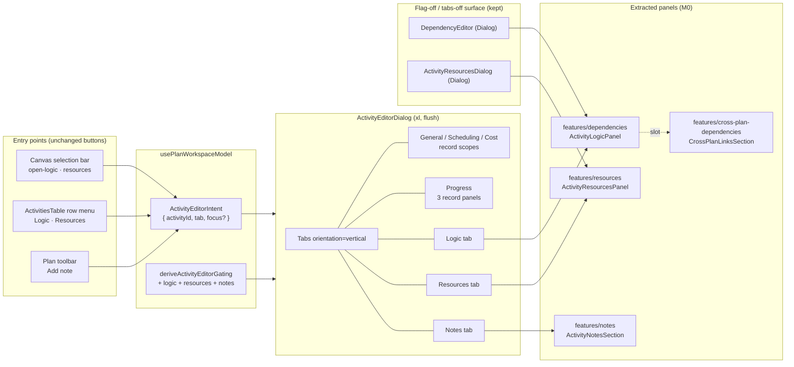
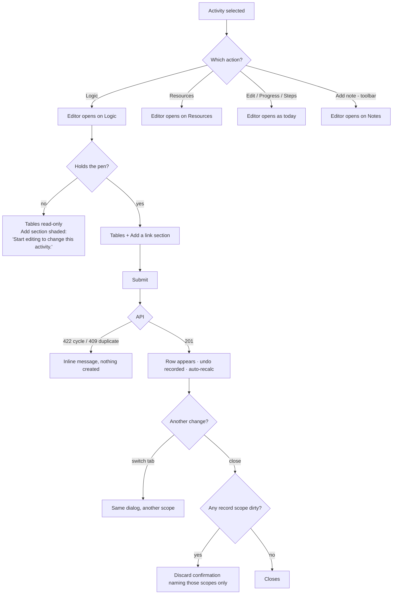

# Feature Spec: Converging Logic and Resources into the activity editor

- **Status:** Draft — awaiting approval
- **Author(s):** feature-analyst
- **Date:** 2026-07-29
- **Tracking issue / epic:** _(to be created)_
- **Roadmap link:** authoring-surface convergence (follows ADR-0060 / ADR-0061)
- **Related ADR(s):** amends **ADR-0060** (intent set + scope taxonomy) and **ADR-0061**
  (archetype table); relocates surfaces owned by **ADR-0046** (activity notes) and **ADR-0045**
  (cross-plan links); clarifies **ADR-0032/0052** (the canvas Link tool). Proposed new
  **ADR-0062** — see §4.

---

## 0. What was verified before designing

The brief's premises were checked against the code rather than assumed. Results, because two of
them change the design:

| Claim                                                                        | Verdict                     | Evidence                                                                                                                                                          |
| ---------------------------------------------------------------------------- | --------------------------- | ----------------------------------------------------------------------------------------------------------------------------------------------------------------- |
| Six selection actions; three converge on `ActivityEditorDialog`              | **Confirmed**               | `selection-actions.tsx` defines `open-logic`/`progress`/`resources`/`steps`/`edit`/`delete`; `openActivityEditor` maps only `edit`/`progress`/`steps`             |
| `DependencyEditor` references `Dialog` nine times                            | **Confirmed** (literally)   | imports + `<Dialog>` + `AddDependencyDialog` + `EditDependencyDialog` + `ConfirmDialog`                                                                           |
| A straight port gives **three layers** of modal                              | **Wrong — it gives two**    | `AddDependencyDialog` opens over the Logic **dialog** today, so the stack is already 2. A Logic **tab** is not a layer. Depth is unchanged; see §4.6              |
| `ActivityResourcesDialog` is 994 lines and takes `canWrite`                  | **Confirmed** (1,005 lines) | `ActivityResourcesDialog.tsx`                                                                                                                                     |
| Both surfaces' writes are pen-gated                                          | **Confirmed at the API**    | `dependencies.service.ts:179/227/259` and `resource-assignment.service.ts:115/245/353` each call `assertHoldsPen`                                                 |
| Both surfaces' gates already equal the editor's definition gate              | **Confirmed, exactly**      | `canManageLogic = canEditSchedule` (`use-plan-workspace-model.ts:282`); `ActivityResourcesDialog` receives `canWrite={model.canEditSchedule}` from **both** hosts |
| `ActivityResourcesDialog` needs restructuring into the list/manage archetype | **Already done** (ADR-0061) | it is already `FormSection "Assigned"` → `FormSection "Assign a resource"` with **no nested dialogs**                                                             |
| ADR-0060 anticipated this work                                               | **Yes, explicitly**         | "`ActivityResourcesDialog` is 994 lines … a master/detail problem tabs do not touch — and gets its own spec" (ADR-0060, Alternatives)                             |

Three further facts found while reading, none of them in the brief, all of which the design has to
answer:

1. **The Logic dialog is not only logic.** It hosts the `crossPlanSlot` (ADR-0045 cross-plan links)
   and the `notesSlot` (ADR-0046 activity notes), and the toolbar's **Add note** command opens it
   with `revealNotes` so it scrolls and focuses the Notes heading. Moving Logic moves all three.
2. **Adding a dependency from the Logic panel is not undoable, but linking on the canvas is.**
   `onTsldLink` records `dependencyAddCommand`; `AddDependencyDialog` calls `useCreateDependency`
   with no recording seam. `DependencyEditor` already records **removes** (`onRemoved`). So the
   undo stack is asymmetric today (ADR-0048). Same for a lag edit: the canvas drag records
   `lagDragCommand`, `EditDependencyDialog` records nothing.
3. **Per-assignment cost fields are not gated on cost-read.** The editor **hides** its Cost tab when
   the role cannot read cost (ADR-0060 §6), but `AssignmentCostFields` renders budgeted/actual cost
   behind `EARNED_VALUE_ENABLED` and `canWrite` alone. Latent today (`canReadCost === canWrite`,
   TECH_DEBT #62); visible the moment both live in one editor.

---

## 1. Business understanding

### Problem

An activity's properties are split across two kinds of surface for no reason a planner can see.
**Edit**, **Report progress** and **Steps** open one tabbed editor (ADR-0060). **Logic** and
**Resources** open their own pop-out dialogs from the same five-button bar, one pixel away. Which
properties of an activity live in "the activity editor" is therefore an accident of which epic
shipped when.

That is precisely the drift ADR-0060 set out to remove, and it named the remaining half in its own
Alternatives section. The specific costs today:

- **Two dialogs cannot be open at once.** Changing a duration and then checking whether the change
  broke a successor's tie means closing one modal and opening another, from a bar that only appears
  while the bar is selected on the canvas.
- **The permission story is invisible.** The rail exists to say "General 🔒 / Scheduling 🔒 /
  Progress" on arrival. Logic and Resources carry the _same_ pen gate as General and Scheduling —
  and say nothing until a planner clicks Add and finds no button.
- **Two entry-point mechanisms coexist.** Three actions build an `ActivityEditorIntent`; two set
  their own id state. `ActivitiesTable` and the canvas each carry a copy of the second mechanism,
  which is exactly the arrangement that let the table and the workspace disagree about a
  Contributor's reach before ADR-0060 collapsed them.

### Users

| Role                      | Need from this change                                                                                                                   |
| ------------------------- | --------------------------------------------------------------------------------------------------------------------------------------- |
| **Planner** (with pen)    | Reads and edits an activity's logic, resources, dates, progress and notes in one place, without closing and re-opening modals           |
| **Planner** (without pen) | Sees, on arrival, that logic and resources are readable but not writable, and why — the same sentence the other definition scopes carry |
| **Contributor**           | Reads logic and assignments to understand what they are reporting against; keeps their un-pen-gated progress write untouched            |
| **Viewer**                | Reads logic, assignments and notes; sees no write affordance (as today)                                                                 |
| **Org Admin**             | As Planner                                                                                                                              |
| **External Guest**        | **Out of scope** — the guest share surface (ADR-0051) is a separate read-only route and does not mount this editor                      |

### Primary use cases

1. Open an activity, read its predecessors and successors, and add a predecessor **without leaving
   the editor**.
2. Open an activity, change its duration on **Scheduling**, then check on **Logic** which link is
   now driving it — one dialog, two tabs.
3. Assign a resource and set its budgeted units and rate, beside the duration type on **General**
   that determines what that rate does.
4. Arrive as a Contributor and understand, before clicking anything, which sections are readable
   and which are shut.
5. Read an activity's notes from the same place as everything else about it.

### User journeys

**Happy path.** Planner selects a bar on the TSLD → the floating selection bar shows
`Logic · Report progress · Resources · Steps · Edit · Delete` (unchanged) → clicks **Logic** → the
tabbed editor opens on the **Logic** tab → the predecessor and successor tables are there, with an
**Add a link** section below them → fills direction/activity/type/lag → **Add link** → the row
appears, the coalesced auto-recalc redraws the canvas behind the dialog → the planner switches to
**Resources** in the same session → assigns a crew → closes. No modal was opened over another
except to edit or confirm-remove a single row.

**Alternate — no pen.** Same entry point. The rail reads `General 🔒 · Scheduling 🔒 · Logic 🔒 ·
Resources 🔒 · Progress · Notes`. The Logic tab shows both tables read-only; the **Add a link**
section is shaded with "Start editing to change this activity." Progress remains writable.

**Alternate — cycle rejection.** The planner picks a predecessor that would close a cycle. The API
answers 422 (ADR-0021), the message renders inline in the add section, nothing is created, the tab
stays open and no other tab's state is disturbed.

**Alternate — flag off.** Everything above is unreachable; **Logic** and **Resources** open exactly
the dialogs they open today.

### Expected outcomes

- One editor is the answer to "where do I change something about this activity?", for every
  property except deletion.
- Two of the five per-activity dialogs stop being reachable from plan surfaces (they remain mounted
  for the `VITE_ACTIVITY_EDITOR_TABS`-off path).
- The `ActivityEditorIntent` becomes the **only** way any host opens a per-activity surface, so a
  new entry point cannot invent a sixth behaviour.
- Two latent defects close: a gap in the undo stack and an ungated cost read.

### Success criteria

| Criterion                                                                                           | How measured                                                           |
| --------------------------------------------------------------------------------------------------- | ---------------------------------------------------------------------- |
| Every per-activity entry point resolves to one `ActivityEditorIntent`                               | Structural test asserting no host holds a per-purpose id (flag-on)     |
| Zero permission change: `gating.logic` and `gating.resources` are **identical** to today's booleans | Table test over the gating matrix + flag-off parity suites             |
| A planner completes "open activity → add a predecessor" without a second modal                      | Playwright journey, flag-on, against a real API with the pen enforced  |
| Flag-off is the prior surface                                                                       | Parity suites on both dialogs, both hosts, `vi.mock` of `@/config/env` |
| `computeSchedule` is untouched                                                                      | No file under `apps/api/src/modules/schedule/engine/` in the diff      |
| The editor pane is not narrower than the dialogs it absorbs                                         | Measured: see §3 "Width"                                               |

### Open questions

**CRITICAL — answers change the design or scope.** Listed in full with defaults in §6.

1. **Do activity notes get their own tab, or stay inside Logic?** _Default: own tab._
2. **Is Resources in scope, or is this Logic-only?** _Default: both, Resources as a separately
   abandonable milestone._
3. **Does the rail show an item count for the collection tabs?** _Default: no — the count goes in
   the section's `aside`, and `TabMarker` is not extended._

**Non-critical (defaults stated, proceeding).**

- A half-filled **add** form does **not** count as unsaved work on close (matches today; §2).
- `EditDependencyDialog` and the remove `ConfirmDialog` stay **nested** (§4.6).
- The `AddDependencyDialog` component is **deleted** when its last caller goes (§4.6, M1).
- The canvas **Link tool-mode is unchanged** (§4.9).
- The standalone `DependencyEditor` / `ActivityResourcesDialog` **are not retired** by this epic —
  they are the `VITE_ACTIVITY_EDITOR_TABS`-off surface.

---

## 2. Functional requirements

### User stories & acceptance criteria

> **US-1** — As a **Planner holding the pen**, I want the activity's logic inside the activity
> editor, so that I can change a duration and check its links without closing a dialog.
>
> **Acceptance criteria**
>
> - **Given** the flag is on **and** I select an activity on the canvas **when** I activate **Logic**
>   **then** the tabbed editor opens with the **Logic** tab selected and no other dialog opens.
> - **Given** the Logic tab is open **then** it shows a **Predecessors** section and a **Successors**
>   section, each with the columns it has today (Activity, Type, Lag, Driving, actions).
> - **Given** the plan has cross-plan links **and** `VITE_PROGRAMME_SCHEDULING` is on **then** the
>   cross-plan links section appears in the Logic tab, below Successors, exactly as it does today.
> - **Given** I add a link **then** the row appears in the correct table, the auto-recalc fires, and
>   the editor stays open on the Logic tab.
> - **Given** I switch to **Scheduling**, edit the duration and save **then** returning to **Logic**
>   shows the tables with no loss of state.

> **US-2** — As a **Planner holding the pen**, I want to add a predecessor or successor **inline**,
> so that I am not opening a modal on top of the editor to fill four fields.
>
> **Acceptance criteria**
>
> - **Given** the Logic tab **then** an **Add a link** `FormSection` renders **below** both tables
>   (the list/manage archetype, `docs/DESIGN_SYSTEM.md` §Form layout).
> - **Given** that section **then** it carries: direction (predecessor / successor), the other
>   activity, dependency type, lag calendar and lag — the same fields `AddDependencyDialog` carries.
> - **Given** the plan has no other activity **then** the section shows today's empty-state sentence
>   instead of the form.
> - **Given** I submit a link that would close a cycle, duplicate an existing edge, or point at
>   itself **then** the API's message renders inline in the section and nothing is created.
> - **Given** a successful add **then** the form resets to its defaults, the announcement is made,
>   and focus remains in the section.

> **US-3** — As a **Planner holding the pen**, I want an activity's resource assignments inside the
> editor, so that units and rates sit beside the duration type that governs them.
>
> **Acceptance criteria**
>
> - **Given** the flag is on **when** I activate **Resources** **then** the editor opens on a
>   **Resources** tab showing the **Assigned** list and the **Assign a resource** form, identical in
>   fields and behaviour to today's dialog.
> - **Given** an assignment row **then** its per-field Saves (budgeted units, rate, cost) behave as
>   today, including the derived-duration preview and the N20 block.
> - **Given** a driving toggle change **then** the announcement naming the displaced driver is
>   unchanged.
> - **Given** the activity is a milestone **then** the loading-curve control is hidden (TECH_DEBT
>   #44b), as today.

> **US-4** — As a **Planner without the pen** (or a Contributor / Viewer), I want to see which
> sections I cannot change **before** I try, so that I am not hunting for a missing button.
>
> **Acceptance criteria**
>
> - **Given** I do not hold the pen **then** the Logic and Resources rail entries carry the
>   `locked` marker with the accessible label "read-only".
> - **Given** the Logic tab **then** both tables render read-only (no Edit / Remove / lag-nudge) and
>   the **Add a link** section is shaded with **"Start editing to change this activity."**, linked to
>   the disabled control via `aria-describedby`.
> - **Given** the Resources tab **then** the **Assign a resource** section is shaded with the same
>   sentence, and each row renders its read-only summary line (as today's `canWrite === false` path).
> - **Given** my role cannot edit activities at all **then** the reason is **"Your role cannot edit
>   activity details."** — the existing sentence, not a new one.

> **US-5** — As any member, I want the discard-on-close prompt to be truthful, so that it never
> claims a link I already created is unsaved.
>
> **Acceptance criteria**
>
> - **Given** I add a link or an assignment **and** no record scope is dirty **when** I press Escape
>   **then** the editor closes with **no** confirmation.
> - **Given** General is dirty **and** I have added a link **when** I press Escape **then** the
>   confirmation names **General** only.
> - **Given** a half-filled add form and no dirty record scope **when** I press Escape **then** the
>   editor closes with no confirmation (today's behaviour; §2 "Save model").

> **US-6** — As a Contributor, I want to read an activity's notes from the editor, so that the
> reasoning behind its dates is where everything else about it is.
>
> **Acceptance criteria** _(subject to CRITICAL question 1)_
>
> - **Given** `VITE_NOTES` is on **then** the editor shows a **Notes** tab with the thread and, for a
>   writer, the composer.
> - **Given** the toolbar **Add note** command **when** activated **then** the editor opens on the
>   **Notes** tab with focus in the section — replacing today's scroll-and-focus plumbing.
> - **Given** I do not hold the pen **then** the Notes tab is **not** marked `locked` — notes are
>   not pen-gated (ADR-0046), and a padlock there would be a lie in the same way it would on
>   Progress.

> **US-7** — As a maintainer, I want a rollback that is a real surface, not a promise.
>
> **Acceptance criteria**
>
> - **Given** `VITE_ACTIVITY_EDITOR_CONVERGENCE` is off **then** **Logic** and **Resources** open
>   their standalone dialogs from every entry point, and no Logic/Resources/Notes tab is registered.
> - **Given** the flag is off **then** the editor's rail is General / Scheduling / Progress / (Cost)
>   — byte-for-byte its current tab set.

### Workflows

**Add a link (flag-on).**

1. Entry point builds `openActivityEditor(activity, 'logic')` → `{ activityId, tab: 'logic' }`.
2. The host resolves the row from the live activities query and opens the editor.
3. The Logic tab mounts `ActivityLogicPanel`, which fires `usePredecessors` / `useSuccessors`
   (enabled while the editor is open on that tab).
4. The planner fills the inline add form and submits → `useCreateDependency` → `POST
/api/v1/orgs/:slug/dependencies`.
5. Server: RBAC → org scope → `assertHoldsPen` → DAG guard (ADR-0021) → create.
6. Client: invalidate the dependency queries; the panel's tables refetch; `onAdded` records the
   `dependencyAddCommand` on the undo stack; the workspace's `structureSignature` changes and the
   coalesced auto-recalc fires (ADR-0032).

**Remove a link.** Row **Remove** → nested `ConfirmDialog` → `useDeleteDependency` → on success,
`onRemoved` records the inverse (unchanged from today) → focus returns to the panel region.

**Edit a link.** Row **Edit** → nested `EditDependencyDialog` (type / lag calendar / lag) →
`useUpdateDependency` with the row's live version → 409 surfaces inline.

**Assign a resource.** Unchanged from today's dialog, rendered in the tab.

### Edge cases

| Case                                                            | Expected behaviour                                                                                                                                                     |
| --------------------------------------------------------------- | ---------------------------------------------------------------------------------------------------------------------------------------------------------------------- |
| Plan has exactly one activity                                   | Add-a-link section shows the existing empty-state sentence, no form                                                                                                    |
| Activity is deleted while the editor is open                    | The intent's row resolves to `undefined`; the editor closes (existing behaviour, unchanged)                                                                            |
| Pen is taken over mid-session                                   | Every definition scope, now including Logic and Resources, flips to read-only; the rail markers flip to `locked`; TECH_DEBT #64 applies                                |
| A dependency is removed elsewhere while its Edit dialog is open | The target re-derives by id from the live query and becomes `undefined`; the nested dialog closes (existing behaviour)                                                 |
| 409 on a per-field assignment Save                              | Existing inline error on the row; unchanged                                                                                                                            |
| WBS summary activity                                            | Summaries carry no logic (ADR-0038) — the Logic tab renders both tables empty with their existing empty sentences. **No new rule is added; the API is the guarantee.** |
| Milestone activity                                              | Resources tab hides the loading curve (TECH_DEBT #44b), as today                                                                                                       |
| `VITE_RESOURCES` off                                            | No Resources tab, and no Resources entry point (matching today's flag gating of the selection item and the row action)                                                 |
| `VITE_PROGRAMME_SCHEDULING` off                                 | No cross-plan section inside the Logic tab                                                                                                                             |
| `VITE_NOTES` off                                                | No Notes tab                                                                                                                                                           |
| Narrow viewport (< `md`)                                        | The rail becomes the horizontal strip (existing `useMediaQuery` switch); 6–7 tabs scroll horizontally, which the tablist already supports                              |
| Cost-read denied                                                | Cost tab hidden (existing) **and** the assignment cost fields hidden (new — §4.8)                                                                                      |

### Permissions

No new permission and **no change to any existing gate**. Mapped to ADR-0012 RBAC + organisation
scope, and to the ADR-0028 pen:

| Scope in the editor              | Endpoint(s)                                      | Permission                  | Pen?    | Today's equivalent                 |
| -------------------------------- | ------------------------------------------------ | --------------------------- | ------- | ---------------------------------- |
| Logic (write)                    | `POST/PATCH/DELETE …/dependencies…`              | `dependency:*`              | **yes** | `DependencyEditor.canManageLogic`  |
| Resources (write)                | `POST/PATCH/DELETE …/activities/:id/assignments` | `resource:assign`           | **yes** | `ActivityResourcesDialog.canWrite` |
| Notes (write)                    | `POST/PATCH/DELETE …/notes`                      | `note:write` (Contributor+) | **no**  | `ActivityNotesSection.canWrite`    |
| Logic / Resources / Notes (read) | the `GET`s                                       | org membership              | n/a     | unchanged                          |

`deriveActivityEditorGating` gains `logic` and `resources` mapped to the **existing `definition`
gate** — one expression, no new branch — because `canManageLogic === canEditSchedule` and the
Resources dialog is already fed `canEditSchedule` by both hosts. `notes` is gated on the role only,
like `progress`. The API remains the sole trust boundary; the tabs shade, they do not protect.

### Validation rules

All existing, all unchanged, all shared client↔server:

- Dependency: `otherActivityId` required; `type ∈ {FS, SS, FF, SF}`; `lagDays` integer within the
  DTO's bounds; `lagCalendar ∈ LagCalendarSource` (`dependency-schemas.ts` Zod ↔ `class-validator`
  DTOs). Self-link, duplicate edge and cycle are **server** rejections (ADR-0021/0035) surfaced
  inline — never pre-empted client-side.
- Assignment: `budgetedUnits ≥ 0`; `unitsPerHour > 0` when set (N19/N20); money entered in major
  units and stored as minor; MATERIAL may never drive; GROUP is never offered; archived resources
  are never offered for a **new** assignment (ADR-0053 §4).

### Error scenarios

| Scenario                                | Detection              | User-facing result                                                 | Status |
| --------------------------------------- | ---------------------- | ------------------------------------------------------------------ | ------ |
| Link would close a cycle                | service DAG guard      | inline message in the add section; nothing created                 | 422    |
| Duplicate edge                          | unique constraint      | inline message in the add section                                  | 409    |
| Pen not held (write attempted anyway)   | `assertHoldsPen`       | shared pen banner via `pen.onWriteRejected`; the section re-shades | 423    |
| Stale version on a link/assignment edit | optimistic lock        | inline "changed since you opened it"; never re-sent                | 409    |
| Role cannot write                       | RBAC guard             | the section was already shaded; a 403 is a defensive backstop      | 403    |
| Activity or dependency gone             | 404 / empty query      | the row disappears; a nested dialog closes                         | 404    |
| Assignment resource archived            | `RESOURCE_ARCHIVED`    | existing inline message                                            | 422    |
| Resource is a GROUP                     | `GROUP_NOT_ASSIGNABLE` | never offered; server backstop                                     | 422    |

### The save model — the third shape, resolved

The brief asks what it means that Logic and Resources are "immediate list mutations with no Save
button". The honest answer is that they are **not a third shape**; they are a second **kind of
scope**, and naming it resolves all three sub-questions at once.

**Record scopes** (General, Scheduling, Cost, How-value-is-measured, Weighted steps) are one form
over one row. They have a dirty state, a validation-error count, and exactly one Save. ADR-0060's
per-scope rule is about these.

**Collection scopes** (Logic, Resources, Notes) are a **list of independently-persisted rows plus a
create form**. Every row is already durable; the create form's submit **is** its Save — it is
labelled "Add link" / "Assign resource" / "Post note" because a create is not an edit. There is
nothing to fuse and nothing to lose.

That gives three answers:

1. **`TabMarker`.** A collection scope can never be `dot` (nothing is dirty) and never `count`
   (`count` is defined as _validation errors_, rendered in the destructive badge — overloading it
   with an item count would repeat exactly the inference bug the discriminated union fixed). It
   **can** be `locked`, and this is a genuinely new and valuable use: it tells a pen-less planner
   on arrival that the links are readable and not writable. Unlike Progress — where `locked` would
   be false — `locked` on Logic and Resources is **true**. The item count belongs in the section's
   `aside` ("3 on this activity"), which `ActivityResourcesDialog` already does and which needs no
   primitive change. See CRITICAL question 3 if the count is wanted on the rail instead.
2. **`dirtyScopeNames`.** Collection scopes contribute **nothing**. This is automatic, not a special
   case: they hold no RHF form whose `isDirty` could be read. The confirmation therefore cannot
   claim an added dependency is unsaved.
3. **Is the inline add form a dirty scope?** **No — by decision, matching today.** Closing the Add
   dialog or the Resources dialog with a half-filled create form discards it silently today, and
   prompting on every abandoned picker would train planners to dismiss the prompt that protects
   three genuinely dirty record scopes. The trade-off is real and stated: a planner who has filled
   six assignment fields and presses Escape loses them, exactly as they do now. If planners report
   it, the cheap fix is to add a non-empty create form to `dirtyScopeNames` under the name "New
   link" / "New assignment" — a follow-up, not a blocker.

This is the sibling of **TECH_DEBT #63** (the Progress tab carries no marker for its three panels).
The convergence does not fix #63, but it makes the taxonomy explicit, which is the prerequisite: the
three Progress panels are _record_ scopes whose state simply is not lifted, whereas Logic and
Resources have no such state to lift. The distinction should be written into #63 so the next reader
does not "fix" the collection tabs by inventing a dirty state for them.

---

## 3. Technical analysis

| Area           | Impact   | Notes                                                                                                                                                                                                                                             |
| -------------- | -------- | ------------------------------------------------------------------------------------------------------------------------------------------------------------------------------------------------------------------------------------------------- |
| Frontend       | **high** | Two panel extractions, three new tabs, two new intent purposes, entry-point retargeting in four hosts, one new flag, one inline form replacing a dialog                                                                                           |
| Backend        | **none** | No new endpoint, no DTO change, no service change. One **optional** OpenAPI-decorator-only fix (TECH_DEBT #61) may ride along                                                                                                                     |
| Database       | **none** | No model, migration, index or constraint                                                                                                                                                                                                          |
| API            | **none** | Same endpoints, same bodies, same status codes. Only the _caller's location_ changes                                                                                                                                                              |
| Security       | **low**  | Zero permission change by construction (§2). One **tightening**: assignment cost fields gain the cost-read gate. IDOR surface unchanged — every call still carries org scope                                                                      |
| Performance    | **low**  | Two queries (`usePredecessors`/`useSuccessors`) and one (`useAssignments`) become tab-scoped instead of dialog-scoped. **Must stay `enabled`-gated on the active tab**, or opening the editor on General would fire five queries it does not need |
| Infrastructure | **none** | No new service, env var beyond the `VITE_` flag, container or CI service. One new CI step for the flag-on e2e already exists (`test:e2e:activity-editor`)                                                                                         |
| Observability  | **none** | No new logs, metrics or traces; the client-side `useAnnounce` calls are preserved verbatim                                                                                                                                                        |
| Testing        | **high** | Panel-extraction proof (existing suites unchanged), flag-off parity suites, new unit suites, extended flag-on Playwright journey                                                                                                                  |

### Width — the measurement that decides whether a tab is big enough

ADR-0061 chose `xl` (`max-w-4xl`, 896 px) and a `w-52` (208 px) rail. The pane's usable width is
therefore ≈ 896 − 208 − 48 (`p-6` both sides) = **640 px**.

The dialogs being absorbed are both `size="lg"` (`max-w-2xl`, 672 px) with `p-6` → **624 px**
usable. So a converged tab is **16 px wider** than the dialog it replaces, not narrower. The
`AssignmentRow`'s `flex-wrap` of units / rate / driving / curve / unassign therefore wraps no
earlier than it does today, and the `DirectionTable`'s five columns keep their room. Below `md`
the rail collapses to a strip and the pane takes the full width, which is strictly better than
today.

This is the objection that would have killed Resources-in-a-tab, and it does not hold.

### Dependencies

**Must be true before this starts** (all are):

- ADR-0060 landed and `VITE_ACTIVITY_EDITOR_TABS` is default-on.
- ADR-0061's `FormSection` / `FieldGrid` / `ContextStrip` and `Tabs orientation="vertical"` exist.
- `ActivityResourcesDialog` is already in the list/manage archetype.
- The pen is asserted on both dependency and assignment writes at the API.

**Affected features:** dependencies, resources, notes, cross-plan-dependencies, activities, tsld
(toolbar + selection bar), undo-redo, plan-lock.

**Nothing must land first.** Nothing in this epic blocks other work.

---

## 4. Solution design

### 4.1 The shape in one sentence

Extract each pop-out's **body** into a panel component, render that panel in a tab, and retarget
the entry points to the existing `ActivityEditorIntent` — behind a flag, with the dialogs left
standing as the rollback surface.

### 4.2 Architecture overview



The load-bearing move is that **the dialog and the tab render the same panel**. There is no second
copy to drift, and the flag-off path is not "the old code" but "the same code in a `<Dialog>`" —
which is a stronger rollback contract than a parallel branch, because both halves are exercised by
every test.

### 4.3 Data flow — adding a predecessor from the Logic tab

```mermaid
sequenceDiagram
  actor P as Planner (holds pen)
  participant Bar as Selection bar
  participant M as usePlanWorkspaceModel
  participant Ed as ActivityEditorDialog
  participant LP as ActivityLogicPanel
  participant API as POST /dependencies
  participant DB as Postgres
  participant RC as Coalesced auto-recalc

  P->>Bar: activate "Logic"
  Bar->>M: openActivityEditor(activity, 'logic')
  M->>Ed: intent { activityId, tab: 'logic' } + gating
  Ed->>LP: render (gate = gating.logic)
  LP->>API: GET predecessors / successors
  P->>LP: fill "Add a link", submit
  LP->>API: POST { planId, predecessorId, successorId, type, lagDays, lagCalendar }
  API->>API: RBAC → org scope → assertHoldsPen → DAG guard (ADR-0021)
  alt cycle / duplicate
    API-->>LP: 422 / 409
    LP-->>P: inline message; nothing created
  else created
    API->>DB: insert
    API-->>LP: 201
    LP->>M: onAdded(dependency)  %% NEW — closes the ADR-0048 gap
    M->>M: record dependencyAddCommand (VITE_UNDO_REDO)
    LP->>LP: invalidate + refetch both tables
    M->>RC: structureSignature changed → notify()
    RC->>API: POST …/schedule/recalculate
    RC-->>P: canvas redraws behind the editor
  end
```

`computeSchedule` receives exactly the inputs it receives today, from exactly the same endpoint, in
the same transaction. Nothing in this diagram is new except the `onAdded` seam.

### 4.4 User flow



### 4.5 Database changes

**None.** No model, column, index or constraint. Nothing in this epic reaches `apps/api/prisma/`.

### 4.6 The nested-dialog question — assessed

The brief proposes the share-links pattern (list first, then an inline add section, deleting
`AddDependencyDialog`). **I agree with the conclusion and reject one of its premises.**

**The premise that is wrong.** A straight port does not give three modal layers. Today
`AddDependencyDialog` already opens _over_ the Logic dialog — two layers. A Logic **tab** is not a
layer, so a straight port gives two as well. Depth is unchanged, and the `Dialog` `closeIfSelf`
guard (TECH_DEBT #50) already makes the nesting correct. If depth were the only argument, "keep
nesting" would win on cost.

**The reasons that do hold**, in order of weight:

1. **Consistency inside one rail.** Resources already inlines its create form (ADR-0061 applied the
   list/manage archetype to it). If Logic launched a modal for the same job from the tab beside it,
   the epic whose purpose is removing drift would ship a new instance of it, visible in one glance.
2. **The design system says so.** `docs/DESIGN_SYSTEM.md` §Form layout, "List / manage: what exists
   **first**, then a `New …` section below it." `DependencyEditor` is the one list/manage dialog
   ADR-0061 did not convert. This is that conversion.
3. **The width objection is gone.** 448 px was why the add form was a pop-out; the pane is 640 px.
4. **Focus and announcement get simpler.** An inline add needs no focus-restore choreography across
   a modal boundary and no second `useAnnounce` context.

**What stays nested, and why.**

- **`EditDependencyDialog`** — three fields (type, lag calendar, lag) on an existing row, with
  immutable endpoints. ADR-0061 deliberately left the simple record forms alone; nesting a small
  focused editor over a large one is the existing, tested behaviour, and it keeps the row's action
  affordance a plain button rather than an in-row edit state with its own dirty/save lifecycle.
  Inlining it is a **defensible future change, not this one.**
- **The remove `ConfirmDialog`** — a confirmation nested in a dialog is explicitly supported
  (`closeIfSelf`) and is the house pattern (share-link revoke, baseline delete). Keep.

So the rule the epic establishes is legible: **create is inline; edit-one-row is a focused modal;
destroy is a confirm.**

**Alternatives rejected.**

| Alternative                           | Why not                                                                                                                                                                                                                                                                                          |
| ------------------------------------- | ------------------------------------------------------------------------------------------------------------------------------------------------------------------------------------------------------------------------------------------------------------------------------------------------ |
| Keep nesting the add dialog           | Costs the design-system rule and puts two idioms for one job in adjacent tabs. Cheapest, and wrong for the epic's stated purpose                                                                                                                                                                 |
| A `Sheet` for the add form            | A sheet over a modal `<dialog>` has no precedent here and worse focus semantics than modal-over-modal; `Sheet` carries its own `closeIfSelf` copy, so it is a second overlay stack to reason about                                                                                               |
| Two-pane master/detail inside the tab | Measured: the pane is 640 px. Splitting it gives two ~300 px columns — the 448 px problem that started ADR-0061, reintroduced one level down                                                                                                                                                     |
| In-row editing for dependencies       | Needs per-row dirty/save state and focus management on collapse; a bigger change than the epic, and it would make Logic _less_ like Resources, not more (Resources' in-row saves exist because the units/rate fields carry a live derived-duration preview that must sit next to the row's data) |

**A non-convergence, recorded rather than papered over.** Logic edits a row through a modal;
Resources edits a row in place with per-field Saves. That is two idioms in adjacent tabs. The
justification is the derived-duration preview above; it is a real reason, not a good one, and it
should be re-examined the next time either panel is touched. It is deliberately **not** harmonised
here, because harmonising means either regressing the assignment row to a modal or rebuilding the
dependency row with three inline Saves, and both are larger than this epic.

### 4.7 Component changes

**New / moved**

| Component                                  | Location                                                   | Notes                                                                                                                                |
| ------------------------------------------ | ---------------------------------------------------------- | ------------------------------------------------------------------------------------------------------------------------------------ |
| `ActivityLogicPanel`                       | `features/dependencies/components/ActivityLogicPanel.tsx`  | The current `DependencyEditor` body: both `DirectionTable`s, the lag-nudge hint, the `crossPlanSlot`, and the new inline add section |
| `DependencyTable` (was `DirectionTable`)   | `features/dependencies/components/DependencyTable.tsx`     | Unchanged behaviour; extracted so the panel file stays readable                                                                      |
| `DependencyEditor`                         | unchanged path                                             | Becomes a thin `<Dialog>` wrapper around `ActivityLogicPanel` — the flag-off / tabs-off surface                                      |
| `ActivityResourcesPanel`                   | `features/resources/components/ActivityResourcesPanel.tsx` | The current dialog body: `Assigned` list + `Assign a resource` form                                                                  |
| `AssignmentRow` (+ `AssignmentCostFields`) | `features/resources/components/AssignmentRow.tsx`          | Moved out of the 1,005-line file; unchanged behaviour                                                                                |
| `ActivityResourcesDialog`                  | unchanged path                                             | Thin `<Dialog>` wrapper around `ActivityResourcesPanel`                                                                              |

**Where the 1,005 lines should live:** the brief's expectation is right — its own panel component,
as the three Progress panels already are, not inlined into the editor file. One refinement: after
the `<Dialog>` wrapper leaves, the body is still ~900 lines, so the row (and its cost sub-panel)
moves to its own file too. Target: `ActivityResourcesPanel.tsx` ≈ 350 lines, `AssignmentRow.tsx` ≈
480, `ActivityResourcesDialog.tsx` ≈ 40.

**Changed**

- `ActivityEditorDialog` — three new tab branches, each rendering an imported panel; `TabKey` and
  `ActivityEditorTab` gain `'logic' | 'resources' | 'notes'`; the tabs array gains three
  flag-conditional entries; `marker()` is **not** called for collection scopes — they use a small
  `collectionMarker(gate)` that returns `locked` or nothing.
- `activity-editor-intent.ts` — `ActivityEditorPurpose` gains `'logic' | 'resources' | 'notes'`;
  `openActivityEditor` gains three cases. The `focusSteps` flag stays; **no new focus flag is
  needed for notes**, because a Notes tab _is_ the reveal that `logicRevealNotes` was emulating.
- `activity-editor-gating.ts` — `ActivityWritePath` gains `'logic' | 'resources' | 'notes'`;
  `logic` and `resources` reuse the existing `definition` gate object, `notes` takes a role-only
  gate mirroring `progress` (its input `canWriteNotes` is already computed in the model).
- `selection-actions.tsx` — `onOpenLogic` / `onResources` unchanged in signature; the **model's**
  openers change. The items stay ungated (read is open), which is correct and is now _expressed_ by
  the rail's `locked` marker rather than by a missing button.
- `ActivitiesTable` — `openFor` gains `'logic' | 'resources'`; flag-on it stops mounting
  `ActivityResourcesDialog` and stops calling `onOpenLogic`. Flag-off both paths are untouched.
  **Also rename its `canWrite` prop to `canEditSchedule`** — ADR-0060's own follow-up ("the name is
  a trap that has now misled two documents; rename it during M5's convergence"). This is that
  convergence.
- `plan-dialogs.tsx` — flag-on, stops mounting `DependencyEditor` and `ActivityResourcesDialog`;
  passes the cross-plan and notes slots to the editor instead, via one grouped `slots` prop.
- `use-plan-workspace-model.ts` — `onOpenLogic` / `onResourcesActivity` / `revealActivityNotes`
  become intent builders flag-on, keeping their legacy id state flag-off (exactly the pattern
  `onEditActivity` / `onProgressActivity` / `onStepsActivity` already use). Adds
  `recordDependencyAdd` beside the existing `recordDependencyRemove`.
- `ScopeSaveBar` — gains optional `dirtyMessage` / `savedMessage` overrides so a **create** button
  ("Add link", "Assign resource") can carry the same `aria-disabled` + `aria-describedby` reason
  treatment without saying "Unsaved changes in this section." A prop, not a second component — the
  ADR-0060 lesson (one component, seven callers) applies.

**Slots.** The editor imports `ActivityLogicPanel` and `ActivityResourcesPanel` **directly**: the
`features/activities → features/resources` edge already exists (`ActivitiesTable` imports
`ActivityResourcesDialog`), and it is acyclic — neither dependencies nor resources imports
activities. The **cross-plan** and **notes** sections stay **slots**, passed by the composition root
through one grouped prop, because they are flag-gated composition concerns and already work that
way. Rendering-wise the cross-plan slot lands inside `ActivityLogicPanel` exactly where it is
today; the editor forwards it.

**States.** Every panel keeps its existing loading / empty / error / success states verbatim. The
`DataTable` query states, the "No predecessors — nothing has to finish before this activity."
sentence, the assignment loading/error text and the `useAnnounce` calls move unchanged. That is the
extraction's contract and the reason the existing suites are the proof.

### 4.8 Two defects the convergence should close

Both are inside the blast radius, both are cheap, both are separately revertable.

1. **The undo gap (ADR-0048).** Adding a dependency from the panel is not recorded; linking on the
   canvas is. Add an `onAdded` seam mirroring the existing `onRemoved`, wired by the composition
   root to a `dependencyAddCommand`. This is a **behaviour change** — a panel-add becomes undoable —
   and it makes the stack consistent with the canvas. The sibling gap (a lag/type edit through
   `EditDependencyDialog` is not recorded while the canvas lag drag is) is **recorded as debt**, not
   fixed here: its inverse needs the pre-edit row snapshot and a coalescing key, which is a bigger
   change than the add.
2. **Ungated assignment cost.** Gate `AssignmentCostFields` (and the create form's three cost
   fields) on `gating.cost.readable`, so one editor does not hide a Cost tab while showing cost on
   the tab beside it. No live exposure today (TECH_DEBT #62), which is why this is a tightening
   rather than a vulnerability.

Optionally riding along, because it is a one-decorator change in the same feature area:
**TECH_DEBT #61** — the resource-assignment routes assert the pen but never declare
`@ApiLockedResponse`, so their 423 is undocumented. This is the only `apps/api` diff in the epic and
is OpenAPI-only.

### 4.9 The Logic tab and the canvas Link tool — complement, not duplicate

They answer different questions and should both exist. Stated here because it will be asked:

|           | Canvas Link tool (ADR-0032 two-click, ADR-0052) | Logic tab                                                                                                                                                                      |
| --------- | ----------------------------------------------- | ------------------------------------------------------------------------------------------------------------------------------------------------------------------------------ |
| Selection | Spatial — pick two bars you can see             | By name or code, from the whole plan, including off-screen and unplotted activities                                                                                            |
| Type      | FS only (the drawn default)                     | FS / SS / FF / SF                                                                                                                                                              |
| Lag       | 0, `PROJECT_DEFAULT` (then draggable)           | Any lag, any lag calendar, at creation                                                                                                                                         |
| Audience  | Mouse/pen, fast, in flow                        | Keyboard and AT users — the canvas listbox lists **activities**, so this panel is the app's only per-dependency keyboard surface (it is where the `Shift+←/→` lag nudge lives) |
| Shows     | The edge you just drew                          | The complete predecessor **and** successor set, driving flags, and cross-plan links                                                                                            |

Both write through `useCreateDependency` and both feed the same undo stack (once §4.8 lands). **No
change to the canvas tool is proposed.**

### 4.10 Flag and rollout — recommended: a flag

ADR-0061 shipped unflagged and was right to: it was a structural refactor of dialog bodies with no
behavioural difference, where a flag would have meant two copies of nine bodies in one file.

**This is not that.** It moves surfaces, changes entry points, and makes two dialogs unreachable.
Every comparable epic (ADR-0051 through 0056, 0059, 0060) shipped behind a `VITE_` flag with
flag-off parity suites as the rollback contract, and the house rule in this repository is that a
user-visible surface lands default-off with the flip as its own decision.

**Recommendation: a new `VITE_ACTIVITY_EDITOR_CONVERGENCE`, default off, layered on
`VITE_ACTIVITY_EDITOR_TABS`.**

- Flag-off ⇒ the editor's rail is General / Scheduling / Progress / (Cost), and **Logic** and
  **Resources** open their standalone dialogs. Byte-for-byte today's surface.
- Flag-on ⇒ six or seven tabs and no plan surface routes to those dialogs.
- The flip is a separate milestone (M6) after the deferred specialist gates run over the combined
  diff — the ADR-0053 M6 / ADR-0059 M6 / ADR-0060 M6 rhythm, which has caught a real defect on
  every epic that used it.

**Two honest costs.**

- A **third layered flag** (`VITE_ENTRY_ROUTES` → `VITE_ACTIVITY_EDITOR_TABS` →
  `VITE_ACTIVITY_EDITOR_CONVERGENCE`). This is the complexity TECH_DEBT #31 already complains about.
  Mitigated by flipping inside the same epic so the layering is short-lived, not by pretending it is
  free.
- **The panel restructure lands unflagged** (M0–M1), so flag-off after this epic is "the same
  dialogs, with the add form inlined" rather than the exact July surface. That is deliberate: it
  splits the change along its honest seam — **restructuring a dialog body is unflagged (ADR-0061's
  own precedent); relocating a surface is flagged** — and it means the rollback target is a surface
  that has shipped and soaked, not one nobody has run for a month.

The standalone dialogs are **not deleted** at the flip. They are still the
`VITE_ACTIVITY_EDITOR_TABS`-off surface, and their retirement is governed by that flag's existing
`TECH_DEBT` retirement condition.

### 4.11 The rail, after

| Order | Tab            | Kind       | Marker when un-writable | Condition                        |
| ----- | -------------- | ---------- | ----------------------- | -------------------------------- |
| 1     | **General**    | record     | `locked`                | always                           |
| 2     | **Scheduling** | record     | `locked`                | always                           |
| 3     | **Logic**      | collection | `locked`                | flag on                          |
| 4     | **Resources**  | collection | `locked`                | flag on **and** `VITE_RESOURCES` |
| 5     | **Progress**   | record ×3  | never (not pen-gated)   | always                           |
| 6     | **Cost**       | record     | `locked`                | `gating.cost.readable`           |
| 7     | **Notes**      | collection | never (not pen-gated)   | flag on **and** `VITE_NOTES`     |

Order: definition → network → means → status → money → commentary. Six or seven entries in a
vertical rail is unremarkable for this domain — P6's activity details carries about ten — and the
rail already scrolls.

### 4.12 The recalc parity gate

Frontend-only. `computeSchedule` is not imported, no scheduling input is added or altered, and the
same bodies go to the same endpoints from a different component. No file under
`apps/api/src/modules/schedule/engine/` appears in the diff (the one optional `apps/api` change is
a Swagger decorator). **The ADR-0034 parity gate is structurally untouched** — there is nothing new
for the engine to receive, so there is nothing to compare.

### 4.13 ADR — proposed ADR-0062

Architecturally significant: it changes the editor's scope taxonomy, moves two surfaces and two
sub-surfaces, and adds a flag. Outline:

- **Title.** Converging the collection scopes into the activity editor.
- **Context.** ADR-0060 collapsed three of five per-activity entry points; the other two were named
  in its Alternatives and deferred. The pen gate on all three definition-class scopes is already
  identical, so convergence is a relocation, not a permission change.
- **Decision.**
  1. **Record scopes and collection scopes** — the taxonomy, and what it implies for `TabMarker`
     and `dirtyScopeNames`. **Amends ADR-0060 §3** (one Save per write scope) by naming the case
     where the scope's unit of save is a row, not a form.
  2. **The dialog and the tab render one panel.** The extraction is the rollback contract.
  3. **Create is inline; edit-one-row is a focused modal; destroy is a confirm.** **Amends
     ADR-0061's archetype table** — a multi-scope editor may host a list/manage archetype inside a
     tab, and the `md`-width premise that justified the add pop-out no longer holds at 640 px.
  4. **Notes get their own tab** (subject to Q1), relocating the ADR-0046 surface out of the Logic
     panel and retiring the `revealNotes` plumbing flag-on.
  5. **Cross-plan links stay inside the Logic panel** (ADR-0045's surface moves with its host).
  6. **The canvas Link tool is unchanged** and complements the tab.
  7. **Behind `VITE_ACTIVITY_EDITOR_CONVERGENCE`, default off**, with parity suites; the flip is
     its own decision.
  8. **Frontend-only**; the recalc parity gate is structurally untouched.
- **Alternatives.** Keep nesting; a sheet; master/detail in the tab; in-row dependency editing;
  Logic-only convergence; no flag. (All argued in §4.6 / §4.10 / §6.)
- **Consequences.** One editor for every activity property except deletion; a third layered flag;
  two idioms for row editing recorded as a known non-convergence; TECH_DEBT #63 re-scoped to record
  scopes only; the undo stack becomes symmetric for dependency adds.

---

## 5. Where I think the brief is wrong, and what else it should know

Set out plainly, as requested.

1. **"Three layers deep" is not what a straight port produces.** It produces two, which is what
   exists today. The case for inlining is consistency, the design-system rule and the new width —
   not depth. Making the argument on depth would leave it vulnerable to a reviewer who counts.
2. **`ActivityResourcesDialog` is not a restructure problem.** ADR-0061 already converted it to the
   list/manage archetype with no nested dialogs. The Resources milestone is therefore _smaller_
   than the Logic one, not larger — it is an extraction and a tab, with no form redesign. The 1,005
   lines are a file-size problem, not a structural one.
3. **The Logic dialog is three surfaces, not one.** Cross-plan links and activity notes ride inside
   it, and the toolbar's **Add note** opens it with a scroll-and-focus reveal. Any plan that says
   "move Logic" and does not say what happens to those two is incomplete — which is why Q1 exists
   and why `logicRevealNotes` / `notesHeadingRef` appear in the task list.
4. **Convergence is right for both, but the reason for Resources is different.** Logic converges
   because it is an activity property that a planner reads while editing dates. Resources converges
   because its assignment fields (units, rate, duration type) are _coupled to the General tab's
   duration type_ by the ADR-0040 triad, and today those two halves of one decision live in
   different modals. That is a stronger argument than symmetry, and it should be the one in the ADR.
5. **Partial convergence (Logic yes, Resources no) is coherent and I recommend against it**, but it
   is a real option and the plan is sequenced so it can be taken as late as M3 without waste. The
   only argument for it that survived scrutiny — that the assignment row needs more width than a tab
   gives — is false by 16 px (§3).
6. **Two defects are in the blast radius** (§4.8). Neither is caused by this change; both are
   cheapest to fix while the files are open, and both should be separately revertable commits so the
   epic's diff can still be read as "relocation".
7. **The `ActivitiesTable` `canWrite` prop should be renamed here.** ADR-0060 named this follow-up
   and named this epic as its home.

---

## 6. Critical questions

Three. Everything else has a stated default and is proceeding.

> **Q1 — Do activity notes get their own tab, or stay inside the Logic panel?**
>
> Notes move either way (they live inside the Logic dialog's body today). The question is whether
> they become the seventh tab.
>
> - **Own tab (default, recommended).** Notes are not logic; they landed there because the Logic
>   dialog was the only per-activity panel with room. A tab lets the **Add note** toolbar command
>   open the editor directly instead of opening Logic and scrolling, which deletes the
>   `logicRevealNotes` / `notesHeadingRef` plumbing. It also expresses the permission honestly —
>   notes are Contributor-writable and **not** pen-gated, which the rail can show by carrying no
>   padlock beside two neighbours that do.
> - **Stay in Logic.** One fewer tab; a smaller diff; ADR-0046's surface is unmoved. Costs: the
>   reveal plumbing survives, and a Notes heading sits under two dependency tables it has nothing to
>   do with.

> **Q2 — Is Resources in scope, or is this Logic-only?**
>
> - **Both (default, recommended).** The assignment fields are coupled to General's duration type by
>   the ADR-0040 triad, so splitting them across two modals splits one decision. Sequenced as its own
>   milestone (M3) so it can be dropped without rework if the Logic tab disappoints.
> - **Logic only.** Halves the epic. Leaves one pop-out on the selection bar — i.e. leaves the exact
>   inconsistency this feature exists to remove, with a smaller numerator.

> **Q3 — Does the rail show an item count for the collection tabs?**
>
> e.g. `Logic 5` / `Resources 2` on arrival.
>
> - **No (default, recommended).** `TabMarker`'s `count` variant is defined as _validation errors_
>   and renders in the destructive badge; overloading it would repeat the inference bug ADR-0061's
>   discriminated union fixed. The count belongs in the section's `aside` ("3 on this activity"),
>   which `ActivityResourcesPanel` already renders and which costs nothing.
> - **Yes.** Genuinely useful at a glance, and P6-like. Requires a fourth `TabMarker` variant
>   (`{ kind: 'total', count, label }`) with a neutral badge, its precedence rule versus `locked`,
>   and an amendment to ADR-0061 §3. A small primitive change with a real design question inside it
>   (does a locked tab still show its count? — yes, they are orthogonal).

---

## 7. Links

- Implementation plan: [`./implementation-plan.md`](./implementation-plan.md)
- Docs this change updates: `docs/DESIGN_SYSTEM.md` (§Form layout — the list/manage archetype inside
  a tab), `docs/FRONTEND_ARCHITECTURE.md` (the panel/dialog split), `CLAUDE.md` §16 (ADR-0062),
  `docs/TECH_DEBT.md` (#63 re-scoped; #61 closed if the optional task is taken; the dependency-edit
  undo gap added), `docs/adr/0062-*.md` (new), and the flag comment in `apps/web/src/config/env.ts`.
