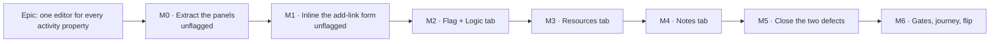

# Implementation Plan: Converging Logic and Resources into the activity editor

- **Feature spec:** [`./feature-spec.md`](./feature-spec.md)
- **Status:** Draft — awaiting approval
- **Owner:** _(to be assigned)_
- **Flag:** `VITE_ACTIVITY_EDITOR_CONVERGENCE` (new, default off), layered on
  `VITE_ACTIVITY_EDITOR_TABS` (default on)

## Breakdown

Seven milestones. **M0 and M1 are unflagged and behaviour-preserving** — they restructure the
existing dialogs per ADR-0061 and leave them working. **M2 onward are behind the flag.** Each
milestone leaves `main` releasable, and the epic can honourably stop after M2 (Logic only) or M3
(no Notes tab) if the critical questions land differently.

### Epic

**One editor for every activity property.** Finishes what ADR-0060 started: the two per-activity
surfaces it deferred — Logic and Resources — join the tabbed editor through the same
`ActivityEditorIntent`, so which properties of an activity live "in the editor" stops being an
accident of shipping order. Roadmap theme: authoring-surface convergence.

---

## Milestone M0 — Extract the panels (unflagged)

**Outcome:** nothing changes for any user. Each pop-out's body becomes a panel component that the
dialog renders; the existing suites pass **unchanged**, which is the proof the extraction is
faithful and the reason the rest of the epic is additive.

---

#### Feature: The panel/dialog split

> **Description:** `DependencyEditor` and `ActivityResourcesDialog` become thin `<Dialog>` wrappers
> around `ActivityLogicPanel` and `ActivityResourcesPanel`. No behaviour, copy, query, announcement
> or class name changes.
> **Complexity:** M
> **Dependencies:** none
> **Risks:** an accidental behaviour change hidden inside a large move → the mitigation is that the
> existing suites must pass with **no edits** except import paths; any test that needs changing is a
> behaviour change and must be justified in review.
> **Testing requirements:** all existing `DependencyEditor.*`, `AddDependencyDialog.*`,
> `EditDependencyDialog.*` and `ActivityResourcesDialog.*` suites green with import-path-only diffs;
> plus one new render test per panel proving it mounts outside a `Dialog`.

##### Task M0.1 — Extract `ActivityLogicPanel`

- **Description:** move the `DependencyEditor` body (the two `DirectionTable`s, the lag-nudge hint,
  the `crossPlanSlot` and `notesSlot` render points, the add/edit/remove state and handlers) into
  `features/dependencies/components/ActivityLogicPanel.tsx`. `DirectionTable` moves to
  `DependencyTable.tsx` and is renamed. `DependencyEditor.tsx` keeps the `<Dialog>`, the title and
  description, and forwards every prop.
- **Complexity:** M
- **Dependencies:** none
- **Risks:** the `regionRef` focus target after a remove, and the `flushSync` ordering, are subtle
  and load-bearing → move them verbatim and keep the comment that explains why.
- **Testing:** existing suites unchanged; add `ActivityLogicPanel.test.tsx` mounting the panel
  standalone (loading / empty / error / read-only / writer states).
- **Development steps:**
  1. Create `DependencyTable.tsx` (the current `DirectionTable`, exported).
  2. Create `ActivityLogicPanel.tsx` with the current body and every current prop except `open` /
     `onClose` / dialog chrome; keep `enabled` for query gating.
  3. Reduce `DependencyEditor.tsx` to the `<Dialog>` + panel + the three nested dialogs it owns.
  4. Update the dependencies barrel to export both.
  5. Run the four suites; fix only import paths.

##### Task M0.2 — Extract `ActivityResourcesPanel` and `AssignmentRow`

- **Description:** split the 1,005-line `ActivityResourcesDialog.tsx` into
  `ActivityResourcesPanel.tsx` (the `Assigned` list + the `Assign a resource` form),
  `AssignmentRow.tsx` (`AssignmentRow` + `AssignmentCostFields` + `DerivedDurationNote` +
  `seedMoney`), and a thin `ActivityResourcesDialog.tsx`.
- **Complexity:** M
- **Dependencies:** none
- **Risks:** the `closeButtonRef` focus-restore on unassign lives in the dialog but is used by the
  row → replace with an `onRowRemoved` callback the panel owns, defaulting to focusing the panel's
  own region (matching the Logic panel's `regionRef` idiom); the dialog passes its close button.
- **Testing:** the four existing `ActivityResourcesDialog.*` suites unchanged; new
  `ActivityResourcesPanel.test.tsx` mounting standalone.
- **Development steps:**
  1. Move the row + cost sub-panel to `AssignmentRow.tsx`.
  2. Move the body to `ActivityResourcesPanel.tsx`; introduce the focus-target callback.
  3. Reduce the dialog to a wrapper.
  4. Update the resources barrel.
  5. Run the suites.

##### Task M0.3 — Query-gating audit

- **Description:** confirm each panel's queries are `enabled`-gated on a prop the host controls
  (`enabled`), not on a hard-coded `open`, so a tab can gate them on **being the active tab**.
- **Complexity:** S
- **Dependencies:** M0.1, M0.2
- **Risks:** a missed gate means opening the editor on General fires the dependency and assignment
  queries for every activity a planner clicks → the test below is a real gate, not a formality.
- **Testing:** a unit test asserting each panel fires **no** query when `enabled={false}`.
- **Development steps:**
  1. Thread `enabled` through both panels.
  2. Add the no-fetch test for each.
  3. Update docs where the query lifetime is described.

---

## Milestone M1 — Inline the add-link form (unflagged)

**Outcome:** the Logic dialog stops opening a modal to add a link. It becomes the list/manage
archetype the design system already prescribes and `ActivityResourcesDialog` already follows. This
lands **before** the flag, in the existing dialog, because restructuring a dialog body is the
unflagged ADR-0061 precedent and relocating a surface is the flagged part.

---

#### Feature: Add a link, inline

> **Description:** replace `AddDependencyDialog` with an **Add a link** `FormSection` below the two
> tables, carrying direction, other activity, type, lag calendar and lag. Delete
> `AddDependencyDialog.tsx` once nothing renders it.
> **Complexity:** M
> **Dependencies:** M0.1
> **Risks:** (a) the flag-off surface after this epic is no longer byte-for-byte the pre-epic
> surface → accepted and stated in the spec §4.10, mitigated by landing it early so it soaks;
> (b) losing the dialog's on-open reset semantics → the section resets on successful submit and on
> activity change, tested; (c) losing the "no other activities" empty state → moved verbatim.
> **Testing requirements:** the `AddDependencyDialog` suite's assertions migrate into
> `ActivityLogicPanel.test.tsx` rather than being deleted; a11y check that the section's controls are
> reachable and labelled; error paths (cycle 422, duplicate 409) render inline.

##### Task M1.1 — Build the inline section

- **Description:** an RHF form inside a `FormSection title="Add a link"`, using `FieldGrid` for the
  pairs that are one decision (lag calendar + lag; direction + other activity), and the shared
  `SelectField` / `TextField` primitives. Direction becomes a field (it was a dialog title before).
- **Complexity:** M
- **Dependencies:** M0.1
- **Risks:** the direction concept was carried by _which button you pressed_; as a field it needs a
  clear label ("This activity is the…" / predecessor-of vs successor-of) → copy reviewed with the
  ux reviewer, not invented in code.
- **Testing:** unit — submit builds the correct `predecessorId`/`successorId` for both directions;
  reset after success; empty-plan state; inline API errors.
- **Development steps:**
  1. Move `dependencyFormSchema` usage into the panel; add a `direction` field to the form values.
  2. Render the section, gated on the writer prop.
  3. Wire `useCreateDependency`, the announcement and the reset.
  4. Port the empty-state branch.
  5. Migrate the `AddDependencyDialog` test assertions.

##### Task M1.2 — Gate the create button with a reason

- **Description:** the section's submit uses the `aria-disabled` + `aria-describedby` reason
  treatment (`ScopeSaveBar`'s contract) instead of a bare `disabled`, so a pen-less planner is told
  why. Add optional `dirtyMessage` / `savedMessage` overrides to `ScopeSaveBar` so a **create**
  button does not say "Unsaved changes in this section."
- **Complexity:** S
- **Dependencies:** M1.1
- **Risks:** a second save-bar component appearing → forbidden; extend the existing one (ADR-0060's
  stated lesson).
- **Testing:** unit — the reason is `aria-describedby`-linked, not merely adjacent; the button stays
  in the tab order when inert.
- **Development steps:**
  1. Add the two optional props to `ScopeSaveBar` with defaults preserving today's copy.
  2. Use it for the add section.
  3. Assert the association in a test.

##### Task M1.3 — Delete `AddDependencyDialog`

- **Description:** remove the component and its now-migrated test file. Git remembers; CLAUDE.md §5
  forbids dead code.
- **Complexity:** S
- **Dependencies:** M1.1, M1.2
- **Risks:** an unnoticed second caller → grep before deleting (verified today: the only caller is
  `DependencyEditor`).
- **Testing:** typecheck + full web suite.
- **Development steps:** delete the two files; update the barrel; run `pnpm lint && pnpm typecheck
&& pnpm test`; add a changeset (minor — a user-visible surface changed shape).

---

## Milestone M2 — The flag and the Logic tab

**Outcome:** with the flag on, **Logic** opens the tabbed editor on a Logic tab; with it off,
everything is exactly M1's surface. This is the milestone that proves the whole idea; if it
disappoints, the epic stops here at no cost.

---

#### Feature: Logic as a tab

> **Description:** the flag, the intent purpose, the gating entry, the tab, the entry-point
> retargeting in all four hosts, and the flag-off parity suite.
> **Complexity:** L
> **Dependencies:** M0, M1
> **Risks:** (a) an entry point retargeted in one host and not another → mitigated by the
> `openActivityEditor` helper being the only route and a structural test asserting no host holds a
> per-purpose id flag-on; (b) queries firing on the wrong tab → M0.3's gate; (c) the cross-plan slot
> losing its home → it moves with the panel and is forwarded through one grouped `slots` prop.
> **Testing requirements:** unit (intent table, gating table, tab render, marker), flag-off parity
> suites for the selection bar, the row menu and `plan-dialogs`; a11y check on the extended rail.

##### Task M2.1 — Add the flag

- **Description:** `VITE_ACTIVITY_EDITOR_CONVERGENCE` in `apps/web/src/config/env.ts` (default off,
  `flagDefaultOff`), with the house docblock: what it turns on, what flag-off means, what it rides
  on, and how to roll back. Add it to `.env.example` and the deployment docs.
- **Complexity:** S
- **Dependencies:** none
- **Risks:** flag-name drift between code, docs and CI → one grep-able constant.
- **Testing:** none directly; the parity suites consume it.

##### Task M2.2 — Extend the intent and the gating

- **Description:** `ActivityEditorTab` and `ActivityEditorPurpose` gain `'logic'`;
  `openActivityEditor` gains the case. `ActivityWritePath` gains `'logic'`, mapped to the existing
  `definition` gate object.
- **Complexity:** S
- **Dependencies:** M2.1
- **Risks:** inventing a new gate expression instead of reusing `definition` → the whole
  "zero permission change" claim depends on reuse; assert it with an identity test
  (`gating.logic === gating.general`).
- **Testing:** the pure table tests in `activity-editor-intent` and `activity-editor-gating`.

##### Task M2.3 — Render the Logic tab

- **Description:** `ActivityEditorDialog` gains a flag-conditional `logic` tab rendering
  `ActivityLogicPanel` with `gate={gating.logic}`, `enabled={open && active === 'logic'}`, and the
  forwarded cross-plan slot. Add `collectionMarker(gate)` returning `locked` or nothing — **never**
  `dot` or `count` (spec §2 "Save model").
- **Complexity:** M
- **Dependencies:** M2.2
- **Risks:** the panel's own `Dialog`-era assumptions (focus targets, announcements) leaking →
  covered by M0's standalone render tests.
- **Testing:** unit — the tab renders; the marker is `locked` without the pen and absent with it;
  `dirtyScopeNames` never names Logic; the discard confirmation after adding a link does not appear.

##### Task M2.4 — Retarget the entry points

- **Description:** flag-on, `model.onOpenLogic` builds `openActivityEditor(a, 'logic')`;
  `ActivitiesTable.openFor` gains `'logic'`; `plan-dialogs.tsx` stops mounting `DependencyEditor`
  and passes the cross-plan slot to the editor. Flag-off every path is untouched, using the same
  conditional shape `onEditActivity` already uses.
- **Complexity:** M
- **Dependencies:** M2.3
- **Risks:** the `onNudgeLag` and `recordDependencyRemove` seams are wired in `plan-dialogs` today →
  they must be threaded to the editor's panel, or the keyboard lag nudge and dependency-remove undo
  silently die. **Both need an explicit regression test.**
- **Testing:** unit per host (canvas bar, row menu, toolbar); regression tests for the lag nudge and
  the remove-undo recording under the flag.

##### Task M2.5 — Flag-off parity suite

- **Description:** `activity-editor-convergence.flag-off.test.tsx` — with `vi.mock` of
  `@/config/env` setting the flag false, assert: the rail has exactly its current tabs; **Logic**
  opens `DependencyEditor`; the row menu's **Logic** calls `onOpenLogic`. Kept, not weakened, when
  it becomes inconvenient (ADR-0053 M6).
- **Complexity:** S
- **Dependencies:** M2.4
- **Risks:** a parity suite that asserts implementation rather than surface → assert by role and
  label.
- **Testing:** itself.

##### Task M2.6 — Rename `ActivitiesTable.canWrite`

- **Description:** rename to `canEditSchedule` (ADR-0060's named follow-up, which named this epic as
  its home). Mechanical across the component, its suites and both call sites.
- **Complexity:** S
- **Dependencies:** none (do it in this milestone while the file is open)
- **Risks:** a large mechanical diff obscuring the real change → its own commit.
- **Testing:** typecheck + existing suites.

---

## Milestone M3 — The Resources tab

**Outcome:** **Resources** opens the same editor on a Resources tab. _(Droppable if CRITICAL
question 2 is answered "Logic only" — nothing in M4–M6 depends on it except its own tests.)_

---

#### Feature: Resources as a tab

> **Description:** the mirror of M2 for resources. Smaller, because ADR-0061 already restructured
> the body — this is an extraction (done in M0) plus a tab plus retargeting.
> **Complexity:** M
> **Dependencies:** M0.2, M2
> **Risks:** (a) the tab is gated on **two** flags (`VITE_RESOURCES` **and** the convergence flag) —
> a missed combination shows a tab whose entry point is hidden, or the reverse (the exact
> flag-parity gap the ADR-0060 security review caught on the steps panel); (b) `ActivitiesTable`
> mounts its own copy of the dialog, so retargeting must remove that mount flag-on **and** keep it
> flag-off.
> **Testing requirements:** a flag-matrix test over the four combinations; the four existing
> `ActivityResourcesDialog.*` suites still green; flag-off parity for both hosts.

##### Task M3.1 — Intent, gating and tab

- **Description:** `'resources'` joins the purpose/tab/write-path unions; the tab renders
  `ActivityResourcesPanel` with `gate={gating.resources}` (the same `definition` object) and
  `enabled` on the active tab. Registered only when both flags are on.
- **Complexity:** M
- **Dependencies:** M2
- **Risks:** as above → the flag-matrix test.
- **Testing:** unit + the matrix test.

##### Task M3.2 — Retarget both hosts

- **Description:** flag-on, `model.onResourcesActivity` builds the intent and `plan-dialogs` stops
  mounting the dialog; `ActivitiesTable.openFor` gains `'resources'` and stops mounting its copy.
- **Complexity:** M
- **Dependencies:** M3.1
- **Risks:** the table's `isMilestone` / `activityDurationType` derivation lives at the call site →
  the editor already holds the row, so it derives them itself; assert the milestone curve-hiding
  still works from the tab.
- **Testing:** unit per host; milestone curve-hiding regression.

##### Task M3.3 — Flag-off parity extension

- **Description:** extend M2.5's suite to Resources.
- **Complexity:** S
- **Dependencies:** M3.2
- **Testing:** itself.

---

## Milestone M4 — The Notes tab

**Outcome:** notes get their own tab and the **Add note** command opens it directly, retiring the
scroll-and-focus plumbing. _(Droppable — or reshaped — by CRITICAL question 1. If notes stay inside
Logic, this milestone becomes a two-line forwarding of the existing `notesSlot` into the Logic tab
and the reveal plumbing survives.)_

---

#### Feature: Notes as a tab

> **Description:** a seventh rail entry rendering `ActivityNotesSection`, gated on `VITE_NOTES` and
> the convergence flag; `'notes'` joins the intent purposes; `revealActivityNotes` becomes an intent
> builder; `logicRevealNotes` / `notesHeadingRef` / `revealNotes` are removed from the flag-on path.
> **Complexity:** M
> **Dependencies:** M2
> **Risks:** the reveal plumbing is used by the flag-off path too → it must be kept, not deleted,
> until `VITE_ACTIVITY_EDITOR_TABS` retires. Removing it from `DependencyEditor` would break
> flag-off **Add note**.
> **Testing requirements:** unit — the toolbar **Add note** opens the editor on Notes with focus in
> the section; the Notes tab carries **no** `locked` marker without the pen (notes are not
> pen-gated); flag-off, **Add note** still opens the Logic dialog and reveals its Notes section.

##### Task M4.1 — The tab and the intent

- **Complexity:** S · **Dependencies:** M2 · **Testing:** unit as above.
- **Steps:** extend the unions; add the role-only `notes` gate mirroring `progress`; render the tab
  with the forwarded slot; move initial focus to the section heading on open-by-intent.

##### Task M4.2 — Retarget **Add note** and retire the reveal (flag-on only)

- **Complexity:** S · **Dependencies:** M4.1
- **Risks:** as above — the flag-off reveal must keep working.
- **Testing:** both flag states, both entry points.

---

## Milestone M5 — Close the two defects in the blast radius

**Outcome:** the undo stack is symmetric for dependency adds, and one editor no longer hides a Cost
tab while showing cost beside it. Separately revertable so the epic's diff still reads as
"relocation".

---

#### Feature: Undo parity for panel adds

> **Description:** an `onAdded` seam on `ActivityLogicPanel` mirroring the existing `onRemoved`,
> wired by the composition root to `dependencyAddCommand`.
> **Complexity:** S
> **Dependencies:** M2
> **Risks:** double-recording when the canvas link and the panel add share a code path → they do
> not; assert exactly one command per add.
> **Testing:** unit — one command recorded per add; undo removes the edge; redo re-creates it;
> nothing recorded with `VITE_UNDO_REDO` off.

##### Task M5.1 — Wire `onAdded`

- **Complexity:** S · **Steps:** add the prop, add `recordDependencyAdd` to the model beside
  `recordDependencyRemove`, wire both hosts, test.

##### Task M5.2 — Record the sibling gap as debt

- **Complexity:** S · **Description:** a `TECH_DEBT.md` row: a lag/type edit through
  `EditDependencyDialog` is not recorded while the canvas lag drag is; what would close it (the
  pre-edit snapshot + a coalescing key).

#### Feature: Gate assignment cost on cost-read

> **Description:** `AssignmentCostFields` and the create form's three cost fields render only when
> `gating.cost.readable`.
> **Complexity:** S
> **Dependencies:** M3
> **Risks:** none live today (`canReadCost === canWrite`, TECH_DEBT #62); this is a tightening that
> becomes load-bearing the day those sets diverge.
> **Testing:** unit — a role without cost-read sees the assignment row without money fields; the
> panel still renders standalone in the dialog (where the gate must be passed in, not assumed).

##### Task M5.3 — Thread the cost gate into the resources panel

- **Complexity:** S · **Steps:** add a `canReadCost` prop (defaulting to today's behaviour for the
  dialog path), consume it in the row and the form, test both hosts, update TECH_DEBT #62's row to
  note the second consumer.

#### Feature _(optional)_: Declare the assignment routes' 423

> **Description:** TECH_DEBT #61 — add `@ApiLockedResponse` to the three resource-assignment routes.
> The only `apps/api` diff in the epic; OpenAPI-only, no behaviour change.
> **Complexity:** S
> **Dependencies:** none
> **Risks:** none — a decorator.
> **Testing:** the OpenAPI snapshot / API suite; delete the TECH_DEBT row.

---

## Milestone M6 — Gates, journey, flip

**Outcome:** the deferred specialist reviews run over the combined M0–M5 diff, their blocking
findings are folded with regression tests, the flag-on Playwright journey proves the permission
model against a real API, and the flag flips default-on.

This is the ADR-0053 M6 / ADR-0059 M6 / ADR-0060 M6 rhythm, and it has found a real defect on every
epic that used it — including the epic that invented it.

---

#### Feature: The review pass

> **Description:** run **ux-reviewer**, **accessibility-reviewer**, **component-reviewer** and
> **security-reviewer** over the combined diff; fold every blocking finding with a regression test;
> record the non-blocking ones in `TECH_DEBT.md` rather than rushing them.
> **Complexity:** M
> **Dependencies:** M2–M5
> **Risks:** treating the reviews as a formality → ADR-0060's M6 found six defects in code that had
> already passed a human read; budget for remediation, not just for running them.
> **Testing requirements:** a regression test per folded finding.
>
> **What to point each reviewer at:**
>
> - **accessibility** — the seven-entry rail and its `locked` markers; the inline add section's
>   error association; focus return from the nested `EditDependencyDialog` and the remove confirm;
>   the horizontal strip below `md` with seven tabs; TECH_DEBT #64 (fields still natively
>   `disabled`) now applies to two more scopes.
> - **ux** — the direction field's copy (it replaced a dialog title); whether "Add a link" reads
>   right below two tables; the two idioms for row editing (§4.6's recorded non-convergence);
>   whether seven tabs needs grouping.
> - **component** — the panel/dialog split's prop surfaces; the `ScopeSaveBar` overrides; that no
>   one-off styling entered the extracted files.
> - **security** — the flag matrix (a tab reachable when its entry point is hidden, or vice versa);
>   the cost gate; that no gate was re-expressed rather than reused.

##### Task M6.1 — Run the gates and fold the blockers

- **Complexity:** M · **Dependencies:** M5

##### Task M6.2 — Extend the flag-on Playwright journey

- **Description:** add to `apps/web/e2e-activity-editor/activity-editor.spec.ts` (its own CI step
  already exists), against a real API **with the pen enforced** — the only place these claims can be
  tested honestly, since a mocked fetch accepts any version and never asserts a lock.
- **Complexity:** M
- **Dependencies:** M6.1
- **Risks:** e2e flake from the auto-recalc → assert on the row, not on a redraw.
- **Testing:** the journey itself, plus an axe check on the extended editor.
- **Development steps:**
  1. A planner **holding the pen** opens Logic from the canvas, adds a predecessor inline, and the
     row appears in the Predecessors table.
  2. The same planner **releases the pen**: the Logic tab's marker becomes `locked`, the add section
     shades with "Start editing to change this activity.", and a direct write is refused **423** by
     the server.
  3. A link that would close a **cycle** is rejected with the API's message inline and nothing
     created (ADR-0021 — untestable against a mock).
  4. Assign a resource from the Resources tab and see the budgeted units persist.
  5. Two scopes in one session: edit Scheduling, then add a link, then close with **no** discard
     prompt (the save-model claim, end to end).

##### Task M6.3 — Write ADR-0062 and flip the flag

- **Description:** write the ADR (spec §4.13 outline), update `CLAUDE.md` §16, `DESIGN_SYSTEM.md`
  §Form layout, `FRONTEND_ARCHITECTURE.md` and the flag docblock; flip
  `VITE_ACTIVITY_EDITOR_CONVERGENCE` to `flagDefaultOn`; keep the flag-off parity suites.
- **Complexity:** M
- **Dependencies:** M6.2
- **Risks:** flipping before the gates are folded → the flip is the **last** step, and the ADR
  records what the gates found, not just what was built.
- **Testing:** full suite green in both flag states; Docker build; a changeset (minor, pre-1.0).

---

## Sequencing & slices

| Slice  | Ships                                    | Flag      | User-visible?                          | Abandonable after? |
| ------ | ---------------------------------------- | --------- | -------------------------------------- | ------------------ |
| **M0** | Panel extraction                         | unflagged | no                                     | yes                |
| **M1** | Inline add-link in the Logic dialog      | unflagged | yes — the add modal becomes a section  | yes                |
| **M2** | Logic tab + flag + retargeting           | off       | no (until the flip)                    | yes                |
| **M3** | Resources tab                            | off       | no                                     | yes                |
| **M4** | Notes tab                                | off       | no                                     | yes                |
| **M5** | Undo parity + cost gate (+ optional 423) | mixed     | undo parity yes; cost gate no (latent) | yes                |
| **M6** | Gates, journey, **flip**                 | **on**    | **yes — the whole convergence**        | rollback = flag    |

Each slice is one or a few PRs, each keeping `main` releasable. M1 is the only unflagged
user-visible change before the flip, and it is deliberate (spec §4.10).

## Definition of Done (per task)

Each task's PR satisfies the Feature Completion Criteria in [`docs/PROCESS.md`](../../PROCESS.md):
code, tests (≥ 80% on changed code; the coverage ratchets of ADR-0058 must not regress), docs, ADR
updates, security review, performance consideration, accessibility (WCAG 2.2 AA), Docker build, CI
green, a changeset for user-visible change, and version impact assessed.

## Risks & assumptions (rollup)

| Risk / assumption                                                                                                | Likelihood  | Impact | Mitigation                                                                                                       |
| ---------------------------------------------------------------------------------------------------------------- | ----------- | ------ | ---------------------------------------------------------------------------------------------------------------- |
| The panel extraction quietly changes behaviour                                                                   | med         | high   | Existing suites must pass with import-path-only diffs; any test edit is a reviewed behaviour change              |
| A seam wired in `plan-dialogs` (lag nudge, remove-undo, cross-plan slot, notes slot) is dropped when retargeting | **high**    | high   | Named in M2.4 with explicit regression tests per seam; the reviewers are pointed at it                           |
| Flag-matrix gap — a tab reachable without its entry point, or vice versa                                         | med         | med    | The four-combination matrix test in M3; the security reviewer is pointed at it (this exact class shipped once)   |
| Tab-scoped queries fire on every open                                                                            | med         | med    | M0.3's no-fetch test; `enabled` gated on the active tab                                                          |
| Seven tabs is too many                                                                                           | low         | med    | Q1 can cut Notes; Q2 can cut Resources; the rail scrolls and the domain's own tools carry ten                    |
| Flag-off is no longer the exact pre-epic surface (M1)                                                            | **certain** | low    | Deliberate and stated; M1 ships early and soaks; the rollback target is a live, tested surface                   |
| A third layered `VITE_` flag                                                                                     | certain     | low    | Flip inside the epic (M6) so the layering is short-lived; recorded in the ADR rather than glossed                |
| Undo-parity change surprises someone (a panel add becomes undoable)                                              | low         | low    | Its own commit, its own changeset line; it makes the stack consistent with the canvas                            |
| Two idioms for row editing persist across adjacent tabs                                                          | certain     | low    | Recorded as a known non-convergence with its reason (spec §4.6), not papered over                                |
| **Assumption:** dependency and assignment writes stay pen-gated at the API                                       | —           | high   | Verified in code (`dependencies.service.ts`, `resource-assignment.service.ts`); the M6 journey re-proves it live |
| **Assumption:** `computeSchedule` is never reached                                                               | —           | high   | Structural: no file under `apps/api/src/modules/schedule/engine/` in the diff                                    |
