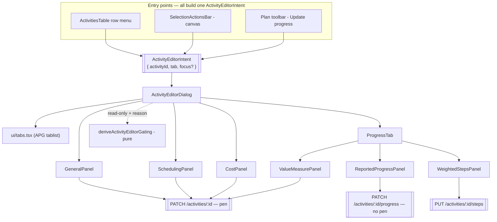
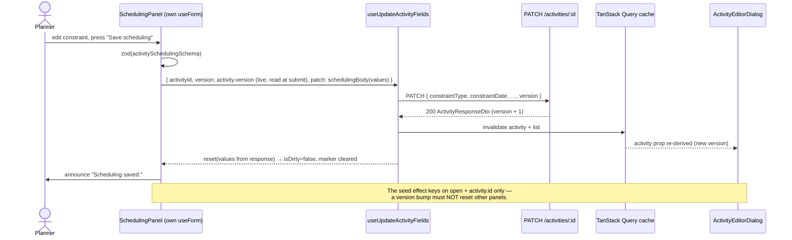
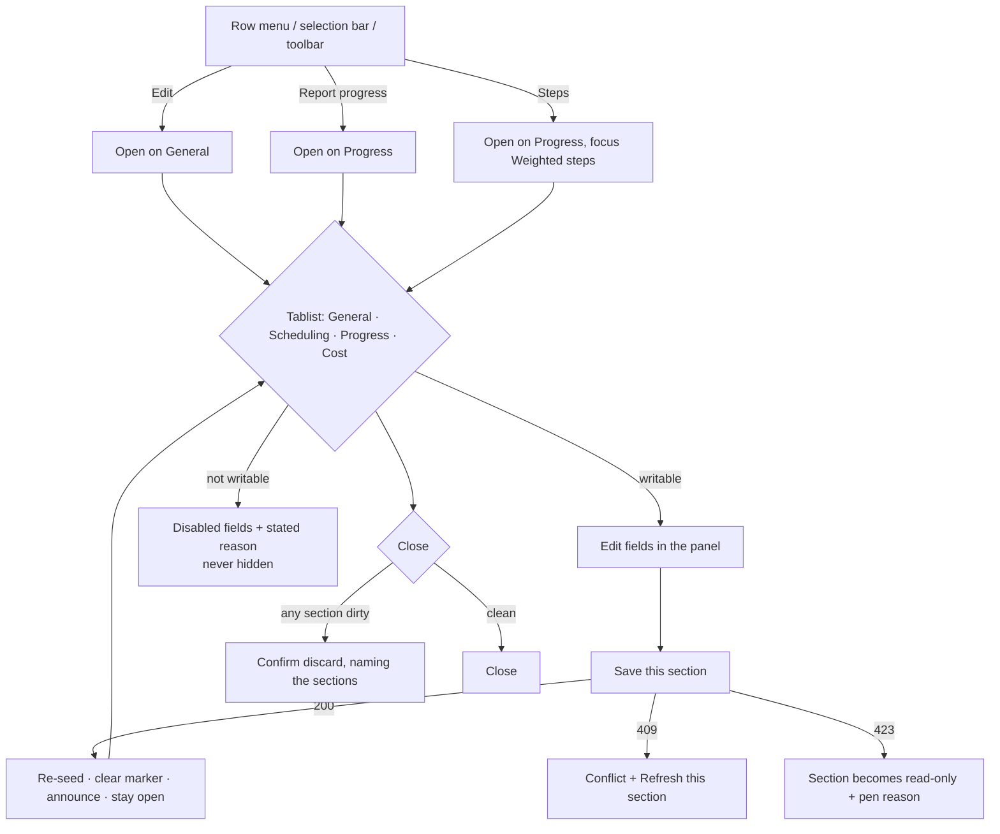

# Feature Spec: Activity editor restructure (tabbed editor, per-scope save)

- **Status:** Draft — critical questions answered 2026-07-28 (§1 "Resolved decisions"); awaiting
  approval of the revised plan
- **Author(s):** feature-analyst (Product Owner / Solution Architect / Technical Lead hats)
- **Date:** 2026-07-28
- **Tracking issue / epic:** _(none yet)_
- **Roadmap link:** none. This is a quality/ergonomics change to an existing surface; it adds no
  Must-have from [`PROJECT_BRIEF.md`](../../PROJECT_BRIEF.md) §8 and no new capability.
- **Related ADR(s):** **ADR-0060** (draft, Proposed — beside this spec). Constrained by ADR-0028
  (the pen), ADR-0042/0044 (%-complete types, weighted steps), ADR-0012/0016 (RBAC + tenancy),
  ADR-0034 (recalc parity gate), ADR-0048 (undo), ADR-0057 (implementation standard).

---

## 1. Business understanding

### Problem

`ActivityFormDialog` asks a planner for **22 fields** in one scrolling modal with **one** Save
button. That is not a subjective "it feels long": the next-largest dialog in the app has 8 fields
and the median is 3 (audit, 2026-07-28, read out of the code at `75805f0`). It is the only dialog
in nineteen with a size problem, and it has three specific, verifiable defects:

1. **Ten of 22 fields are in no group at all** — an eight-field ungrouped preamble, and
   `Description` stranded after the last fieldset.
2. **The primary constraint is orphaned from the secondary.** `Constraint` / `Constraint date`
   (lines 615, 642) sit _between_ the Cost fieldset's close and the Advanced fieldset's open, while
   `Secondary constraint` sits _inside_ `Advanced scheduling`. Two halves of one concept in two
   different grouping states.
3. **The progress model is scattered across four surfaces** and one of them is
   **lit but inert**. `rollupPhysicalPercent` (`apps/api/src/modules/schedule/engine/earned-value.ts:56`)
   makes weighted steps **win** over the manual `Physical % complete` whenever total weight > 0 —
   yet that field stays enabled, editable and unexplained in the Edit dialog whenever steps exist.
   This is the same defect class as the Gantt zoom preset (ADR-0059 M6) and the
   `RESOURCE_DEPENDENT` calendar picker: a control that saves a value with no effect.

**One thing that is _not_ a defect, recorded because two documents claimed it was.** The dialog's
three `<legend>`s are `sr-only` (lines 533, 653, 712) — but each is immediately followed by a
**visible** `<p className="text-sm font-medium" aria-hidden="true">` carrying the same text (lines
534–536, 654–656, 713–715). Sighted users **do** see "Cost & earned value", "Advanced scheduling"
and "External dates". That pairing is the standard workaround for `<legend>` being near-impossible
to lay out inside a flex column; it is equivalent for both audiences, and it survived review
because it is fine. The dialog audit and the first draft of this spec both called it an
inverted-affordance accessibility defect, having read the `sr-only` and stopped there — the
ADR-0058 rule ("verify the claim; do not trust the document") biting two documents that cite it.
**There is no WCAG benefit to claim here and it is not a reason to do this work.**

What survives is a small consistency wart, tidied on its own merits while we are in the file: two
sibling dialogs (`CalendarFormDialog`, `AddCrossPlanLinkDialog`) use a real visible `<legend>`, and
the workaround duplicates every heading string across two nodes that can drift apart. The
requirement below is therefore **"one source of truth per section heading"** — a real visible
`<legend>` where the panel's layout allows it, and the `sr-only` + `aria-hidden` pairing derived
from a single constant where flex layout still forces it. Not "remove `sr-only`".

The scatter is worth naming precisely, because it is what the restructure fixes:

| Surface                   | Holds                                                      | Effect                                                               |
| ------------------------- | ---------------------------------------------------------- | -------------------------------------------------------------------- |
| `ActivityProgressDialog`  | % complete, actual start/finish, remaining, suspend/resume | **schedule** % — drives the CPM remaining, moves dates               |
| `ActivityFormDialog`      | `% complete type`, `Physical % complete`                   | the **selector** + the physical measure — earns value, moves nothing |
| `ActivityStepsDialog`     | weighted steps                                             | rolls up to **physical** %                                           |
| `ActivityResourcesDialog` | budgeted units, units/time                                 | feeds the `UNITS` measure                                            |

`% complete type` chooses among DURATION / UNITS / PHYSICAL and **none of the three measures is on
the same screen as the chooser.**

**Why now.** The dialog has absorbed one field per accepted ADR for a year (ADR-0037 calendar,
ADR-0038 WBS, ADR-0040 duration type, ADR-0041 levelling priority, ADR-0042 EV, ADR-0043 external
dates, ADR-0044 accrual). The growth is not going to stop — resource-loading curves and physical
%-complete already have follow-on fields — and there is no structure to absorb it.

### Users

All organisation-scoped (ADR-0012/0016). The restructure changes what each role _sees_, never what
it may _do_ through the web — the one contract change (M0's 423 on the steps `PUT`) removes no
affordance any user can see, because every web path to that write already requires the pen:

- **Planner / Org Admin** — the primary user. Holds `activity:update`, `activity:update_progress`
  and `cost:read`; a definition write additionally needs the **pen** (ADR-0028). Today they run
  three dialogs to change one activity.
- **Contributor** — holds `activity:update_progress` only, and **never needs the pen**. Reports
  progress from the field. This role is the load-bearing constraint on the whole design.
- **Viewer** — read-only; has no entry point into any of these dialogs today and gains none.
- **External Guest** (ADR-0051) — unaffected. The guest surface is a fixed read-only
  `SCHEDULE_READ` scope with no editor at all.

### Primary use cases

1. Change one thing about an activity (its name, its calendar, its constraint) without reading past
   the other twenty fields.
2. Report progress against an activity and, in the same place, see and set the measure that earns
   its value — with the manual physical % honestly disabled when steps are driving it.
3. Set up an activity's scheduling behaviour — calendar, both constraints, ALAP, expected finish,
   external dates — as one coherent decision rather than three fragments in different grouping
   states.
4. As a Contributor, open an activity, report progress, and see _why_ the rest is read-only.

### User journeys

**Happy path (Planner, holds the pen).** Selects an activity → **Edit** → the editor opens on
**General** → changes the duration → **Save general** → the section is announced saved and its
"unsaved" dot clears; the dialog stays open → switches to **Scheduling** → sets a constraint →
**Save scheduling** → **Close**.

**Contributor path.** Row menu → **Report progress** → the editor opens on **Progress** with the
tablist showing four tabs → the _Reported progress_ panel is live → enters 40% and an actual start
→ **Save progress** → succeeds with no pen and no permission error. Moving to **General** shows the
fields disabled behind a stated reason: "Read-only — reporting progress doesn't include changing an
activity's definition."

**Planner without the pen.** Opens the editor from the canvas selection bar → every definition
scope is read-only with "Start editing to take the plan's edit lock", exactly as the toolbar
already shades pen-gated commands. Progress remains writable.

**Alternate — concurrent edit.** Saves _General_, then _Scheduling_, without closing. The second
save carries the **bumped** version because the version is read from the live row at submit time
(§4). If somebody else changed the row, the failing scope shows "This activity changed elsewhere"
with a **Refresh this section** action — abort-and-refetch, never a silent merge (ADR-0048).

### Expected outcomes

- One entry point ("open the activity") replaces three, with the tab as the addressing scheme.
- Every field is inside a named, **visible** group. Zero ungrouped fields.
- The physical-% model becomes legible in one place, and the inert manual field is shaded with a
  stated reason instead of quietly ignored.
- The Contributor progress path keeps its own write, its own endpoint and its own permission —
  provably, by request-body assertion, not by inspection.

### Success criteria

- **Zero ungrouped fields** in the editor, and **every section heading rendered from one string**
  (structural test). Not "zero `sr-only` legends" — the existing pairing is not a defect (§1).
- A per-scope save's request body contains **only that scope's keys plus `version`** (unit test per
  scope). This is the anti-regression proof, not a claim.
- A Contributor can save progress from the editor **without holding the pen**, proven in a real
  browser with a real session (Playwright, M6).
- Flag-off renders the three existing dialogs **byte-for-byte** (parity suites).
- No schema or engine change, and no change to any endpoint's contract except the **423 the steps
  route gains in M0**: `computeSchedule` is not imported, called or influenced, so the ADR-0034
  recalc parity gate is **structurally** untouched.
- Fields per visible screen drops from 22 to ≤ 10; the tallest tab (Scheduling) holds 10.

### Resolved decisions (the three critical questions, answered 2026-07-28)

**Q1 — the Progress tab's saves. CONFIRMED as proposed.** Three labelled panels, three Saves:
_Reported progress_ (`PATCH …/progress`, no pen) · _How value is measured_ (`PATCH …/:activityId`,
pen) · _Weighted steps_ (`PUT …/steps`, pen from M0). Each panel states what it saves. The reasons
they cannot share a button are in §4, "Why not one Save per tab, literally".

**Q2 — steps gating. A THIRD OPTION was chosen, and it changes the shape of the work.** Both
UI-only options were rejected. **The pen is enforced properly, at the API**: `assertHoldsPen` is
added to `activity-steps.service.ts` so client and server agree, rather than having the UI police a
boundary the server does not. This lands as **Milestone M0 — a standalone, front-loaded PR that
ships before any tabs code and is not behind `VITE_ACTIVITY_EDITOR_TABS`** (a server-side gate
cannot be feature-flagged per client, and flagging it would recreate the divergence it fixes). It
carries an OpenAPI 423 declaration and a Supertest e2e. See §2 "US-8", §3, and the plan's M0.

**One claim from the first draft is corrected here.** The draft said "the two hosts already
disagree — `ActivitiesTable` gates Steps on role only". **That is wrong at runtime.** Both real
call sites pass the pen-gated boolean into that prop: `plan-detail.tsx:351` and
`activity-bottom-panel.tsx:84` both render `<ActivitiesTable canWrite={model.canEditSchedule} …>`.
The prop is merely _named_ `canWrite`. So **the web already requires the pen for steps everywhere**,
and there is **no capability narrowing on the web at all**. The genuine divergence is
**client-vs-server**: the client has always required the pen; the server has never checked it. That
makes the chosen option better-founded than the one it replaced — it closes a real hole rather than
harmonising two client surfaces that were already harmonised.

**Q3 — after a save. CONFIRMED as proposed.** The editor stays open, and the result is announced
through the existing `useAnnounce()` live region, named by section ("Scheduling saved."). This
changes muscle memory: two of the three dialogs it replaces (`ActivityFormDialog`,
`ActivityProgressDialog`) close on save today; `ActivityStepsDialog` already stays open. Closing
would strand the other tabs, so staying open is the only coherent behaviour for per-scope save.

Defaults taken without asking (state, don't ask): the flag name `VITE_ACTIVITY_EDITOR_TABS`
default-off; four tabs (General / Scheduling / Progress / Cost); create mode is tabbed with a
single `Create activity` action and no Progress tab; automatic tab activation (arrow selects);
`ActivityResourcesDialog` stays a separate dialog.

---

## 2. Functional requirements

### User stories & acceptance criteria

> **US-1** — As a **Planner**, I want the activity's fields grouped into named sections I can move
> between, so that changing one thing does not mean reading twenty-two.
>
> **Acceptance criteria**
>
> - **Given** the flag is on **when** I open an activity for editing **then** I see a tablist
>   `General · Scheduling · Progress · Cost` and the **General** panel, and every field in every
>   panel sits inside a fieldset whose heading is **visible** and rendered from a single string
>   (a real `<legend>` where layout allows; otherwise the existing `sr-only` + `aria-hidden` pairing
>   driven from one constant).
> - **Given** a tab whose every field is hidden by feature flags **then** that tab is not rendered
>   at all (an empty tab is a dead end, not a section).
> - **Given** the flag is off **then** the three existing dialogs render exactly as today.

> **US-2** — As a **Planner**, I want each section to save on its own, so that a save means what the
> section says and nothing else moves.
>
> **Acceptance criteria**
>
> - **Given** I change a field in _Scheduling_ **when** I press **Save scheduling** **then** the
>   request body contains only the scheduling keys and `version` — no name, no cost, no progress.
> - **Given** the save succeeds **then** the section re-seeds from the server row, its unsaved
>   marker clears, the result is announced by name ("Scheduling saved."), and the dialog stays open.
> - **Given** I saved _General_ and then save _Scheduling_ without closing **then** the second save
>   carries the version bumped by the first and succeeds.
> - **Given** the server returns 409 **then** that section shows "This activity changed elsewhere"
>   with a **Refresh this section** action; no other section is touched, and nothing auto-retries.

> **US-3** — As a **Contributor**, I want to report progress from the same editor without holding
> the plan edit-lock, so that reporting from site is unchanged.
>
> **Acceptance criteria**
>
> - **Given** I hold `activity:update_progress` but not `activity:update` **when** I open the editor
>   from **Report progress** **then** it opens on **Progress**, the _Reported progress_ panel is
>   writable, and **Save progress** calls `PATCH …/activities/:id/progress` only.
> - **Given** the same context **then** General / Scheduling / Cost render **disabled with a stated
>   reason**, never hidden, and their Save buttons are disabled with the same reason.
> - **Given** the plan edit-lock is enforced and I do not hold the pen **then** no progress save is
>   refused (progress is never pen-gated, ADR-0028).

> **US-4** — As a **Planner**, I want the three progress measures in one place, labelled by what
> each does, so that I can tell what moves dates from what earns value.
>
> **Acceptance criteria**
>
> - **Given** the Progress tab **then** it shows _Reported progress — moves the dates_, _How value
>   is measured — earns value, changes no dates_, and _Weighted steps_ as three labelled panels.
> - **Given** the activity has steps with total weight > 0 **then** the rolled-up physical % is
>   shown **read-only**, and the manual `Physical % complete` field is **disabled with the reason**
>   "Steps are driving this — the rolled-up value (62%) is used. Remove every step to enter it by
>   hand." (WCAG 1.4.1: the reason is text, not styling.)
> - **Given** total weight is 0 or there are no steps **then** the manual field is writable and the
>   read-only rollup shows the manual value's effect.
> - **Given** `% complete type` is `UNITS` **then** the panel states that units come from the
>   activity's resource assignments and offers a control that opens `ActivityResourcesDialog`.
> - **Given** any of this **then** no date, float or CPM output changes: steps never drive the
>   schedule (ADR-0042 §1, ADR-0044 §33). Explicitly out of scope.

> **US-5** — As any user, I want unsaved work to survive moving between tabs, and to be warned
> before I throw it away.
>
> **Acceptance criteria**
>
> - **Given** I type in _General_ and switch to _Cost_ and back **then** my text is still there and
>   _General_ shows an "unsaved changes" marker (a dot **and** sr-only text — never colour alone).
> - **Given** any section is dirty **when** I press Cancel, ✕ or Escape **then** a confirmation
>   names the dirty sections and asks me to discard; Escape from that confirmation returns me to the
>   editor with everything intact (the nested-dialog guard in `Dialog` already handles this,
>   TECH_DEBT #50).
> - **Given** no section is dirty **then** closing is immediate with no prompt.

> **US-6** — As a keyboard or screen-reader user, I want the tabs to behave like tabs.
>
> **Acceptance criteria**
>
> - **Given** focus is on a tab **then** ←/→ move and select, Home/End jump to first/last, selection
>   wraps, and only the selected tab is in the Tab sequence (roving `tabindex`).
> - **Given** the editor opens **then** focus lands on the **selected tab**, not the close button.
> - **Given** a panel scrolls **then** the panel itself is focusable (`tabindex="0"`) so a keyboard
>   user can scroll it (WCAG 2.1.1) — a deliberate departure from the APG's "only when the panel has
>   no focusable children", justified by the scroll container.
> - **Given** a section has validation errors or a failed save and I switch away **then** its tab
>   shows an error marker whose text is in the accessible name ("Scheduling, 3 problems").

> **US-7** — As a **Planner**, I want the editor to behave identically wherever I open it from.
>
> **Acceptance criteria**
>
> - **Given** the activities table, the canvas selection bar, or the plan toolbar **when** I open the
>   editor **then** it is the same component with the same tabs, the same gating and the same save
>   behaviour; only the **initially selected tab** differs by entry point.
> - **Given** the Steps entry point **then** the editor opens on **Progress** with focus moved to
>   the Weighted-steps panel heading.

> **US-8** (Milestone M0 — ships first, independently, unflagged) — As the **system**, I want the
> weighted-steps write to enforce the plan edit-lock, so that the client and the server agree about
> who may change an activity's steps.
>
> **Acceptance criteria**
>
> - **Given** the plan edit-lock is enforced (`PLAN_EDIT_LOCK_ENFORCED=true`) and I hold
>   `activity:update` but **not** the pen **when** I `PUT …/activities/:id/steps` **then** I get
>   **423** and no step row changes.
> - **Given** the same, but I **do** hold the pen **then** the write succeeds exactly as today.
> - **Given** enforcement is off (the default) **then** `assertHoldsPen` is inert and behaviour is
>   unchanged — the same contract every other pen-gated service has.
> - **Given** the OpenAPI document **then** the steps `PUT` declares its 423, like the activity
>   `PATCH` does (`@ApiLockedResponse`).
> - **Given** the existing checks **then** 403 (permission) and 404 (scope) still **precede** the
>   423, matching the assertion already pinned in `plan-lock-write-gate.e2e-spec.ts`.
> - **Given** the Contributor progress path **then** it is still never gated, at any enforcement
>   setting (the existing e2e case must stay green).

### Workflows

```
Open editor(intent) → seed each scope from the live activity row → render tabs (flag/role filtered)
  → user edits scope S → S.isDirty = true → tab marker
  → user presses Save S → validate S (zod) → build S's body → mutate S's endpoint with live version
      → success: reset S from response, clear marker, announce "S saved"
      → 409:     inline conflict + Refresh this section
      → 423:     S becomes read-only with the pen reason
      → 422/4xx: inline error at the top of S's panel (FormErrorSummary + server message)
  → user closes → any dirty? confirm discard : close
```

### Edge cases

| Case                                        | Behaviour                                                                                                                                                                                                                                                                                                                                        |
| ------------------------------------------- | ------------------------------------------------------------------------------------------------------------------------------------------------------------------------------------------------------------------------------------------------------------------------------------------------------------------------------------------------ |
| Every field on a tab is flag-hidden         | The tab is not rendered. With `VITE_EARNED_VALUE` and `VITE_COST_ACCRUAL` both off, **Cost** disappears entirely.                                                                                                                                                                                                                                |
| Activity is a milestone / LOE / WBS summary | Duration, duration type, expected finish, levelling priority, EV inputs and cost stay hidden exactly as today (`isDurationDerivedType`); if that empties Cost, the tab goes with it.                                                                                                                                                             |
| `RESOURCE_DEPENDENT` type                   | The calendar picker stays disabled with its existing reason, now inside the Scheduling tab. No change to the rule.                                                                                                                                                                                                                               |
| Caller lacks `cost:read`                    | Cost fields come back `null` and are indistinguishable from unset. The Cost tab renders with the stated reason "Cost is visible to Planners and Org Admins" and is never submittable. Verified: `cost:read` is granted to exactly Planner + Org Admin, the same set as `activity:update`, so this coincides with the definition read-only state. |
| Steps list fails to load                    | The Weighted-steps panel shows its existing error + retry; the other panels are unaffected (three independent queries, three independent states).                                                                                                                                                                                                |
| Activity deleted while the editor is open   | The host re-derives the target from the live query (both hosts already do); the target becomes `undefined` and the editor closes — today's behaviour, preserved.                                                                                                                                                                                 |
| Two scopes dirty, one saved                 | Only the saved scope re-seeds. The other keeps its edits and its marker.                                                                                                                                                                                                                                                                         |
| Create mode                                 | Tabs render as grouping only; one `Create activity` action in the dialog footer; **no Progress tab** (there is no activity to report against, no steps endpoint to call).                                                                                                                                                                        |
| Very narrow viewport                        | The tablist scrolls horizontally; each tab keeps the ≥24px target (WCAG 2.5.8). No wrapping, no overflow menu — four items.                                                                                                                                                                                                                      |

### Permissions

Deny-by-default, mapped to ADR-0012 permissions and org scope. **Nothing new is granted.**

| Save scope                       | Endpoint                                   | Permission                                      | Pen (ADR-0028)?        | Roles                           |
| -------------------------------- | ------------------------------------------ | ----------------------------------------------- | ---------------------- | ------------------------------- |
| General                          | `PATCH /organizations/:org/activities/:id` | `activity:update`                               | **Yes** (423)          | Planner, Org Admin              |
| Scheduling                       | same                                       | `activity:update`                               | **Yes**                | Planner, Org Admin              |
| Cost                             | same                                       | `activity:update` (+ `cost:read` to see values) | **Yes**                | Planner, Org Admin              |
| Progress → Reported progress     | `PATCH …/activities/:id/progress`          | `activity:update_progress`                      | **No**                 | Contributor, Planner, Org Admin |
| Progress → How value is measured | `PATCH …/activities/:id`                   | `activity:update`                               | **Yes**                | Planner, Org Admin              |
| Progress → Weighted steps        | `PUT …/activities/:id/steps`               | `activity:update`                               | **Yes, from M0** (423) | Planner, Org Admin              |

The client gate is advisory; the API remains the sole trust boundary. Every scope's write already
re-resolves the org from the caller's memberships (anti-IDOR) and re-checks its permission.

**The steps row is the one thing this feature changes about the API.** Until M0, the steps `PUT`
asserted `activity:update` and nothing else, while every web surface that reaches it has always
required the pen — the client enforced a boundary the server did not. M0 closes that by adding
`assertHoldsPen` in the service, following the resource-assignment precedent
(`resource-assignment.service.ts:115, 245, 353`, TECH_DEBT #39: "an assignment write can persist
the owning activity's derived duration, so it must hold the plan's edit-lock like the activity
write path"). The same argument applies here and is arguably stronger — a steps `PUT` **bumps the
parent activity's `version`**, which is a write on the activity by any reading.

### Validation rules

Client validation is Zod at the scope boundary, mirroring the server's `class-validator` DTO as it
does today. `activityFormSchema` is **split**, not rewritten:

| Scope schema                     | Fields                                                                                                                                                   | Cross-field rules it owns                                                 |
| -------------------------------- | -------------------------------------------------------------------------------------------------------------------------------------------------------- | ------------------------------------------------------------------------- |
| `activityGeneralSchema`          | name, code, type, durationType, durationDays, parentId, description                                                                                      | —                                                                         |
| `activitySchedulingSchema`       | calendarId, constraintType/Date, secondaryConstraintType/Date, scheduleAsLateAsPossible, expectedFinish, externalEarlyStart/LateFinish, levelingPriority | constraint pairing (×2), `externalLateFinish >= externalEarlyStart` (N26) |
| `activityCostSchema`             | budgetedExpense, actualExpense, accrualType                                                                                                              | —                                                                         |
| `activityMeasureSchema`          | percentCompleteType, physicalPercentComplete                                                                                                             | —                                                                         |
| `progressFormSchema` (unchanged) | percentComplete, actual start/finish, remaining, suspend/resume                                                                                          | four existing refinements                                                 |
| `stepsFormSchema` (unchanged)    | steps[]                                                                                                                                                  | —                                                                         |

**A refinement must live in the scope that owns both of its fields.** Both constraint pairings and
the external-date ordering do; nothing straddles a scope boundary. This is enforced, not asserted:
a **structural test** proves the union of the four definition-scope schemas' keys equals
`activityFormSchema`'s keys, so a field cannot be silently dropped by the split, and each
refinement's `path` must resolve inside its own scope.

### Error scenarios

| Scenario                                                            | Detection                                       | User-facing result                                                                                                   | Status |
| ------------------------------------------------------------------- | ----------------------------------------------- | -------------------------------------------------------------------------------------------------------------------- | ------ |
| Missing/invalid field in a scope                                    | Zod on that scope                               | `FormErrorSummary` at the top of that panel + per-field message; RHF focuses the first invalid field in the panel    | —      |
| Not a member / no permission                                        | server authz                                    | Scope is read-only with a stated reason before submit; a raced 403 shows the server message inline                   | 403    |
| No pen held                                                         | `assertHoldsPen`                                | Scope read-only with "Start editing to take the plan's edit lock"; a raced 423 flips the scope read-only and says so | 423    |
| Stale `version`                                                     | optimistic lock                                 | "This activity changed elsewhere." + **Refresh this section**; no auto-retry, no merge                               | 409    |
| Name/code collision in the plan                                     | unique constraint                               | Inline error in the General panel                                                                                    | 409    |
| Calendar wrong scope / archived                                     | ADR-0053 guard                                  | The existing `calendarScopeErrorMessage` sentence, in the Scheduling panel                                           | 422    |
| Step % out of range / negative weight                               | DTO boundary                                    | Inline error in the Weighted-steps panel                                                                             | 422    |
| Steps saved without the pen (**new in M0**, when enforcement is on) | `assertHoldsPen` in `activity-steps.service.ts` | The Weighted-steps panel becomes read-only with the pen reason — the same handling as every other pen-gated scope    | 423    |
| Steps query fails                                                   | TanStack Query                                  | Panel-local error + retry; other panels unaffected                                                                   | —      |

---

## 3. Technical analysis

| Area           | Impact                                | Notes                                                                                                                                                                                                                                                                                                                                                                                                                                                                                                                               |
| -------------- | ------------------------------------- | ----------------------------------------------------------------------------------------------------------------------------------------------------------------------------------------------------------------------------------------------------------------------------------------------------------------------------------------------------------------------------------------------------------------------------------------------------------------------------------------------------------------------------------- |
| Frontend       | **high**                              | One new `components/ui/tabs.tsx` primitive; one new `ActivityEditorDialog` composing scope panels; scope schemas + body builders; one new partial-update hook; entry-point convergence in `ActivitiesTable`, `activity-crud-dialogs.tsx`, `plan-dialogs.tsx`, `selection-actions.tsx`, `use-plan-workspace-model.ts`.                                                                                                                                                                                                               |
| Backend        | **low, and confined to M0**           | The tabs work needs no backend change — verified: `UpdateActivityDto` documents "Every field is optional; send only what changes", and partial PATCHes are already in production (`useSetActivityVisualStart`, `useRepositionLane` send two or three keys). **M0 is the exception**: one `assertHoldsPen` call + its DI in `activity-steps.service.ts`, one OpenAPI decorator, one service spec, one e2e case. Nothing else under `apps/api/`.                                                                                      |
| Database       | **none**                              | No model, column, index or constraint.                                                                                                                                                                                                                                                                                                                                                                                                                                                                                              |
| API            | **low, M0 only**                      | No new endpoint and no request/response shape change. One **contract** change: `PUT …/activities/:id/steps` gains a documented **423** (`@ApiLockedResponse`), matching the activity `PATCH`. `docs/API.md` and the OpenAPI document are updated in the same PR.                                                                                                                                                                                                                                                                    |
| Security       | **low — and M0 is a net improvement** | No new permission, no new endpoint, no new data reaching the client. M0 **closes** a gap: a definition-class write (it bumps the parent activity's `version`) that skipped the single-editor gate every sibling write asserts. Per-scope bodies also **reduce** blast radius — a scope can no longer overwrite a field it does not show, the class of bug where a hidden-but-seeded field is re-sent on every save. **api-reviewer and security-reviewer are applicable** to M0 (they were ruled out while this was frontend-only). |
| Performance    | **low**                               | One extra query mounted (steps) only when the Progress tab is present; the steps query already exists and is bounded/unpaginated by design. No canvas draw path is touched, so ADR-0026's ≤4 ms budget is not in play.                                                                                                                                                                                                                                                                                                              |
| Infrastructure | **low**                               | One `VITE_` flag; one new Playwright project + CI step (`e2e-activity-editor`), following the `e2e-library` / `e2e-gantt` precedent.                                                                                                                                                                                                                                                                                                                                                                                                |
| Observability  | **none**                              | No new logs, metrics or traces.                                                                                                                                                                                                                                                                                                                                                                                                                                                                                                     |
| Testing        | **high**                              | Unit + structural + flag-off parity + a11y + one flag-on journey, plus **M0's Supertest e2e** (a new case in `apps/api/test/plan-lock-write-gate.e2e-spec.ts`, beside the resource-assignment one) and a service spec. See the plan.                                                                                                                                                                                                                                                                                                |

**The recalc parity gate (ADR-0034).** This feature introduces **no scheduling input**. It does not
import the engine, does not call `POST …/schedule/recalculate`, and changes no persisted column's
meaning; it sends the same field values to the same endpoints, in smaller bodies. `computeSchedule`
therefore receives byte-identical input for byte-identical data, by construction rather than by
test. The parity argument is structural and needs no new golden suite.

**Behaviour change and release impact (M0).** Adding `assertHoldsPen` makes a previously-accepted
request return **423** for a Planner or Org Admin who does not hold the pen. Two qualifications,
both verified rather than assumed:

- **It is inert by default.** `PLAN_EDIT_LOCK_ENFORCED` defaults to `false`
  (`apps/api/src/config/env.validation.ts:51-54`), and `assertHoldsPen` no-ops while it is off — the
  same contract every other pen-gated service already has. So in a default deployment **no user
  sees a new 423 today**; what changes is that when an operator flips enforcement, steps are covered
  instead of being the one hole in the gate.
- **It is still a user-visible contract change** in any deployment that has enforcement on, so it
  ships with a **changeset**; pre-1.0 that is a **minor** bump (CLAUDE.md §10). The web needs no
  change to accommodate it — every web surface that reaches the steps write already requires the pen
  — so no user loses an affordance they can see.

### Dependencies

- **Nothing must land first.** Every endpoint, permission and flag it composes already exists, and
  **M0 depends on nothing in this epic** — it is a standalone defect fix (see the plan's M0 for the
  independence argument).
- **Affected features:** `features/activities` (the three dialogs), `features/tsld/toolbar`
  (selection actions + toolbar context), `components/layout/workspace` (model + dialog hosts),
  `features/resources` (referenced by the UNITS pointer, not modified).
- **Interacts with ADR-0048 (undo):** the definition scopes keep firing `onSaved(before, after)`, so
  a definition edit is still recorded as an undo command. Consequence to accept: a user who saves
  two scopes records **two** undo entries where the merged form recorded one. That is a more honest
  history, and each inverse still rides the unchanged pen/RBAC/optimistic gates.
- **Third parties:** none. The `Tabs` primitive is hand-rolled on the APG, like `menu.tsx`,
  `combobox.tsx` and `segmented-control.tsx`. Adding a component library remains an ADR-level
  decision (CLAUDE.md §5) and is not proposed.

---

## 4. Solution design

### Architecture overview



Nothing below the dialog knows where it was opened from, and nothing above it knows which tab is
selected. `deriveActivityEditorGating` is a pure function in the shape of the existing
`derivePlanGating` (`features/plan-lock/lib/plan-gating.ts`) so the permission matrix is testable
without mounting a screen.

### Data flow — one scope save



**The version trap, named.** Two scopes PATCH the same row. If a scope captured `version` when the
dialog opened, the second save would 409 every time. Requirement **V1**: every scope reads
`version` from the **live** `activity` prop **at submit time**. Both hosts already re-derive the
activity from the live query by id (`ActivitiesTable.tsx:173`,
`activity-crud-dialogs.tsx:24`), so the value is fresh; the rule is that the panel must not cache
it. Pinned by a test: _save General, then Scheduling, without closing — both succeed._

**The re-seed trap, named.** Today's seed effect runs on `open` / `activity?.id`. It must **stay**
keyed that way. If it were widened to react to the activity object (which now changes on every
scope save), saving one panel would silently wipe unsaved edits in another. Pinned by a test.

### User flow



### Database changes

**None.**

### API changes

**None.** For the record, the three endpoints consumed, unchanged:

- `PATCH /api/v1/organizations/:orgSlug/activities/:activityId` — `UpdateActivityDto`, every field
  optional, `version` required. Pen-gated (`assertHoldsPen`, 423). Returns `ActivityResponseDto`.
- `PATCH /api/v1/organizations/:orgSlug/activities/:activityId/progress` —
  `UpdateActivityProgressDto`, `activity:update_progress`, **not** pen-gated. May return
  `{ data, meta.warnings }` for server-side repairs (ADR-0035 §6), which the panel surfaces as
  today.
- `GET|PUT /api/v1/organizations/:orgSlug/activities/:activityId/steps` — `ReplaceStepsDto`, bulk
  replace, optimistic-locked on the **parent activity's** version, which it bumps.

### Component changes

**New — `apps/web/src/components/ui/tabs.tsx`** (design-system primitive, hand-rolled on the APG
Tabs pattern, in the lineage of `menu.tsx` / `combobox.tsx` / `segmented-control.tsx`):

```tsx
export interface TabDescriptor<T extends string> {
  value: T;
  label: string;
  /** A state marker after the label. Text + icon, never colour alone; srText joins the accessible name. */
  marker?: { kind: 'unsaved' | 'error' | 'readOnly'; srText: string };
}

export function Tabs<T extends string>(props: {
  /** Accessible name for the tablist — required; an unnamed tablist is unnameable. */
  label: string;
  tabs: ReadonlyArray<TabDescriptor<T>>;
  value: T;
  onChange: (value: T) => void;
  children: (active: T) => React.ReactNode;
}): React.ReactElement;
```

The primitive owns **both halves** of the wiring — `role="tablist"`, per-tab `role="tab"` +
`aria-selected` + `aria-controls` + roving `tabindex`, and the single `role="tabpanel"` +
`aria-labelledby` + `tabindex="0"` wrapper, with ids from `useId()`. The consumer cannot mis-wire
the relationship because it never writes the aria attributes. Keyboard: ←/→ (wrapping), Home/End,
**automatic activation** (selection follows focus, matching `SegmentedControl` and appropriate here
because every panel's state already exists in a hook — arrowing past a tab costs nothing and loses
nothing). Justified for **one consumer today**: `ActivityFormDialog` is the only dialog in nineteen
with the problem tabs solve, and the ADR says so plainly rather than implying a rollout.

**New — `features/activities/components/ActivityEditorDialog.tsx`** and its panels
(`GeneralPanel`, `SchedulingPanel`, `ProgressTab` → `ReportedProgressPanel` / `ValueMeasurePanel` /
`WeightedStepsPanel`, `CostPanel`). Each panel owns **one** `useForm` and **one** mutation. The
forms are created in the dialog (not the panel) so state survives a panel unmount; RHF v7's default
`shouldUnregister: false` keeps values, and that is pinned by a test rather than trusted.

**New — `features/activities/schemas/activity-scope-schemas.ts`** (the split) and
`features/activities/api/scope-bodies.ts` (pure `generalBody` / `schedulingBody` / `costBody` /
`measureBody` builders — the unit under the request-body key-set assertions).

**New — `useUpdateActivityFields(orgSlug, planId)`**: `{ activityId, version, patch }` →
`PATCH`. Added **beside** `useUpdateActivity`, which is left untouched so the flag-off path stays
byte-identical.

**Changed —** `ActivitiesTable`, `activity-crud-dialogs.tsx`, `plan-dialogs.tsx`,
`selection-actions.tsx`, `use-plan-workspace-model.ts`: three ids (`editActivityId`,
`progressActivityId`, `stepsActivity`) collapse into one `editorIntent`, constructed by one helper.
Behaviour cannot drift between hosts because there is one component, one intent type and one gating
function; a parity test mounts all three hosts and asserts the same tab set and the same gating for
the same role/pen state.

**Unchanged and explicitly out of scope:** `ActivityResourcesDialog` (994 lines, but that is a
list-manager plus an inline form with three mutations — a master/detail problem; tabs do not touch
it, and it deserves its own spec), the other 17 dialogs (median 3 fields — tabs would add
navigation cost for no benefit), `DependencyEditor` (a panel, not a form).

#### Tab set and field allocation — all 22 fields placed

| Tab            | Visible fieldset                                          | Fields                                                                                                                                           | Save scope                        |
| -------------- | --------------------------------------------------------- | ------------------------------------------------------------------------------------------------------------------------------------------------ | --------------------------------- |
| **General**    | Identity                                                  | Name, Code, Type                                                                                                                                 | `PATCH :id` (pen)                 |
|                | Duration                                                  | Duration (working days), Duration type                                                                                                           |                                   |
|                | Structure                                                 | WBS summary                                                                                                                                      |                                   |
|                | Notes                                                     | Description ← _no longer trailing after the last fieldset_                                                                                       |                                   |
| **Scheduling** | Calendar                                                  | Calendar                                                                                                                                         | `PATCH :id` (pen)                 |
|                | Constraints                                               | Constraint, Constraint date, **Secondary constraint, Secondary constraint date** ← _the orphan reunited_                                         |                                   |
|                | Placement & targets                                       | Schedule as late as possible, Expected finish                                                                                                    |                                   |
|                | External dates                                            | External early start, External late finish (+ the existing explainer)                                                                            |                                   |
|                | Resource levelling                                        | Levelling priority ← _it delays activities, so it lives with what decides dates_                                                                 |                                   |
| **Progress**   | Reported progress — **moves the dates**                   | Percent complete, Actual start, Actual finish, Remaining duration, Suspend date, Resume date, derived Status preview                             | `PATCH :id/progress` (**no pen**) |
|                | How value is measured — **earns value, changes no dates** | % complete type, Physical % complete (+ read-only rollup; disabled-with-reason when steps win; a pointer to Resources when the measure is UNITS) | `PATCH :id` (pen)                 |
|                | Weighted steps — _where physical % comes from_            | the step rows + live rollup                                                                                                                      | `PUT :id/steps` (pen, from M0)    |
| **Cost**       | Cost                                                      | Budgeted expense, Actual expense, Cost accrual                                                                                                   | `PATCH :id` (pen)                 |

All 22 original fields are placed; nothing is dropped, nothing is ungrouped, and every section
heading is visible and rendered from one string. `% complete type` moves out of "Cost & earned
value" and onto **Progress**, beside the three measures it selects between — the third defect in §1.

#### Why not one Save per tab, literally

The settled decision is per-tab save, and the rule it protects is: **never fuse two writes with
different permission gates behind one button.** On three of the four tabs that is exactly one Save.
The Progress tab spans three endpoints, and three arguments say they must stay three buttons:

1. **Permission.** Fusing _Reported progress_ with _How value is measured_ would put a Contributor
   write behind a pen-gated Planner write — a capability regression for the exact role the pen
   model exists to protect (ADR-0028's progress carve-out).
2. **Atomicity.** `PUT …/steps` and `PATCH …/:id` both bump the same `version`. One button firing
   both is a two-phase write: the second call needs the version the first returned, and a partial
   failure leaves half the panel saved with no honest way to report it.
3. **Honesty.** Two buttons that save different things should not look like one thing.

So the design states the rule as **one Save per _write scope_, and a tab holds one scope unless the
system genuinely has more.** Only the Progress tab does. Each panel's Save is labelled by what it
saves ("Save progress", "Save measure", "Save steps"), and each shades independently with its own
reason.

#### Read-only presentation (the house pattern)

Never hide. A scope the user cannot write renders: a **leading reason banner** (before the fields in
DOM order, so a screen-reader user meets the reason before the controls), fields `disabled`, and the
Save button disabled with the same reason via `aria-describedby`. Reasons are specific:

- no pen → "Start editing to take the plan's edit lock, then you can change this."
- no `activity:update` → "Reporting progress doesn't include changing an activity's definition."
- no `cost:read` → "Cost is visible to Planners and Org Admins."
- steps driving physical % → "Steps are driving this — the rolled-up value (62%) is used."

This is the RD-1 / ADR-0059 M6 precedent: a disabled control with no reason reads as a bug; a
control with an effect elsewhere must say so.

### Implementation approach & alternatives

**Chosen:** one small **unflagged API fix that ships first** (M0 — `assertHoldsPen` on the steps
`PUT`, so client and server agree about the pen), then a **flagged, otherwise frontend-only** tabbed
editor composing the three existing endpoints, with one Save per write scope, a new hand-rolled APG
`Tabs` primitive, and the progress model co-located and honestly shaded. Behind
`VITE_ACTIVITY_EDITOR_TABS`, **default off**, with flag-off parity suites pinning the three current
dialogs as the rollback contract (the ADR-0053 M6 / ADR-0059 M6 precedent). Delivered as thin
slices: **steps pen-gate (unflagged, standalone)** → primitive (dark) → pure schemas + gating (dark)
→ definition tabs (flagged) → Progress co-location (flagged) → entry-point convergence → review
gates + e2e → flip.

**Alternatives considered**

- **Gate steps in the UI only** — either pen-gate the editor's Steps panel, or leave it role-only to
  match the API. **Both rejected** (Q2). The first has the client policing a boundary the server
  does not enforce, which is how the divergence arose; the second would have the editor offer a
  write the rest of the web has always required the pen for. Fixing the server is smaller than
  either, and it is a defect fix in its own right rather than a consequence of this epic — which is
  why it is sequenced first and shipped separately.
- **Feature-flag the steps pen-gate** behind `VITE_ACTIVITY_EDITOR_TABS`. Rejected as incoherent: a
  `VITE_` flag is a client build-time constant and cannot gate a server check, so this would
  recreate exactly the client/server divergence it is meant to remove. The gate rides
  `PLAN_EDIT_LOCK_ENFORCED` like every other pen assertion — that is the switch it belongs to.
- **One merged form with an accordion.** Cheaper; no primitive. Rejected: an accordion with one
  submit re-creates the fused-gate problem, and the fields-per-screen win evaporates the moment two
  sections are open.
- **A wizard.** Fits create, not edit — nobody wants five steps to change a duration.
- **A right-hand properties panel** instead of a modal (P6/MSP style). Genuinely attractive and
  probably where this ends up, but it is an ADR-0030 workspace-layout change (panel budget, pen
  banner, responsive single-pane rules) and would rewrite the canvas selection model. Out of
  proportion to fixing a dialog. Recorded as the natural successor.
- **Merge everything behind one Save.** Rejected on the audit's load-bearing finding: it fuses a
  non-pen-gated Contributor write with a pen-gated one.
- **Make steps drive the schedule** so the model needs less explaining. Rejected as a deliberate P6
  departure requiring its own ADR, ADR-0035 conformance scenarios and a recalc-parity argument
  (ADR-0042 §1). Explicitly out of scope.
- **No feature flag.** Rejected: it replaces the primary authoring surface for the app's central
  entity, and the repo's rollback contract is a parity suite behind a flag. Every comparable epic
  (0051, 0052, 0053, 0054, 0055, 0056, 0059) shipped this way.

---

## 5. Links

- Implementation plan: [`./implementation-plan.md`](./implementation-plan.md)
- Draft ADR: [`../../adr/0060-tabbed-activity-editor-and-per-scope-save.md`](../../adr/0060-tabbed-activity-editor-and-per-scope-save.md)
- Docs this change updates: `docs/API.md` + the OpenAPI document (M0's 423 on the steps route),
  `docs/COMPONENT_LIBRARY.md` (the `Tabs` primitive), `docs/DESIGN_SYSTEM.md` (tab tokens/states if
  any are added), `docs/UX_STANDARDS.md` (dialog sectioning + the "one Save per write scope" rule),
  `CLAUDE.md` §16 (ADR-0060), `docs/TECH_DEBT.md` (the eventual retirement of the superseded
  dialogs; the client-derived `canReadCost`; the missing `@ApiLockedResponse` on the
  resource-assignment routes found while checking M0's precedent),
  `.github/workflows` (the new e2e step).
