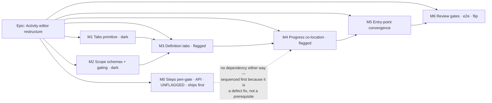

# Implementation Plan: Activity editor restructure (tabbed editor, per-scope save)

- **Feature spec:** [`./feature-spec.md`](./feature-spec.md)
- **Draft ADR:** [`ADR-0060`](../../adr/0060-tabbed-activity-editor-and-per-scope-save.md) (Proposed)
- **Status:** Draft — critical questions answered 2026-07-28 (spec §1 "Resolved decisions");
  **awaiting approval before any code is written**
- **Owner:** _(unassigned)_
- **What the answers changed:** Q1 (three Saves on the Progress tab) and Q3 (the editor stays open,
  announcing each save by section) were confirmed as drafted. **Q2 was answered with a third
  option** — pen-gate the steps write at the **API** — which adds **Milestone M0** below: a
  standalone, unflagged, API-side PR that ships **before** any tabs code.

## Breakdown

### Epic

**Activity editor restructure** — replace the app's 22-field single-submit activity dialog with a
four-tab editor whose Save follows the write scope, and co-locate the progress model that is
currently spread across four surfaces. Frontend-only **except M0**, one small API fix that closes
a client/server disagreement about the plan edit-lock and ships on its own. No roadmap Must-have;
this serves authoring ergonomics and closes three verified defects in the app's most-used authoring
surface.

**Epic-level invariants — true at the end of every task:**

- **Only M0 touches `apps/api/`.** Every other task's diff is confined to `apps/web/` (plus docs and
  changesets). If a later task finds itself editing the API, the design has drifted and the spec
  needs revisiting.
- No schema or engine change, ever. `computeSchedule` is not imported or called.
- `VITE_ACTIVITY_EDITOR_TABS` **off** renders the three existing dialogs byte-for-byte, pinned by
  parity suites that are kept, never weakened. **M0 is not behind that flag** — a `VITE_` constant
  is a client build-time value and cannot gate a server check.
- No new permission and no widening of an existing one. M0 **narrows** one, deliberately.
- `main` stays releasable after every task.

---

### Milestone M0 — The steps write joins the edit-lock (API, unflagged, ships first)

**Outcome:** `PUT …/activities/:activityId/steps` asserts the plan edit-lock like every sibling
structural write, so the client and the server finally agree about who may change an activity's
steps. Independent of the rest of the epic in both directions.

**Why it is here at all, and why first.** The client has always required the pen for steps; the
server never checked. That is a defect on its own terms — it is not a consequence of adding tabs,
and it should not wait on a flagged UI epic to be fixed. It is also small: one assertion, one
decorator, two tests.

**Can it genuinely ship before any tabs code? Yes — and here is the check, not the assertion.**

- **No web change is needed.** Both real `ActivitiesTable` call sites already pass the pen-gated
  boolean into the prop that gates the Steps row action: `plan-detail.tsx:351` and
  `activity-bottom-panel.tsx:84` both render `canWrite={model.canEditSchedule}`. The prop is merely
  _named_ `canWrite`. `plan-dialogs.tsx:156` gates the same dialog on `model.canEditSchedule`
  directly. So there is no lit-but-doomed button to fix, and **the first draft of this plan was
  wrong to say the two hosts disagreed** — they agree; it is the server that dissents.
- **No import, DI or ordering dependency on M1–M6.** `ActivityStepsService` already receives
  services by constructor injection in `ActivitiesModule`; adding the edit-lock service is the same
  wiring `ActivitiesService` and `ResourceAssignmentService` already have.
- **Nothing in M1–M6 depends on M0 landing.** The tabs work would function identically against the
  un-gated endpoint; M0 only means the Weighted-steps panel's 423 path is real rather than
  theoretical. Sequencing is a judgement about value and blast radius, not a constraint.

**Release impact.** A previously-accepted request can now return 423 — a user-visible contract
change, so it carries a **changeset** (minor, pre-1.0, CLAUDE.md §10). Two honest qualifications:
`PLAN_EDIT_LOCK_ENFORCED` **defaults to `false`** (`config/env.validation.ts:51-54`) and
`assertHoldsPen` no-ops while it is off, so a default deployment sees no behaviour change today;
and no user loses a visible affordance, because every web path to the write already required the
pen. The change matters at the moment an operator enables enforcement — which is precisely when a
missed gate would be worst to discover.

---

#### Feature: `assertHoldsPen` on the weighted-steps write

> **Description:** bring the steps `PUT` under the ADR-0028 single-editor write-gate, document its
> 423, and prove both branches.
> **Complexity:** S
> **Dependencies:** none — nothing in this epic, and nothing outside it.
> **Risks:** (a) placing the assertion before the 403/404 checks would leak existence to a
> non-member → put it **after** them, matching `activities.service.ts:334` and the assertion already
> pinned by the e2e ("403 and 404 still precede the 423 gate"); (b) an import path that reaches the
> steps service through a non-pen context (interchange, restore) 423-ing unexpectedly → checked:
> `activity-steps.service.ts` has no internal callers, only the controller.
> **Testing requirements:** service spec (both branches, mocked lock) + a new case in the existing
> `plan-lock-write-gate.e2e-spec.ts`; the existing "never gates the Contributor progress path" case
> must stay green.

##### Task 0.1 — Gate the write and declare the 423 (≈ one PR)

- **Description:** inject the edit-lock service into `ActivityStepsService`; in `replace()`, after
  `assertCan('activity:update', …)` and after the activity is loaded (which gives `planId`), call
  `await this.editLock.assertHoldsPen(principal, activity.planId, organization.id)`. Add
  `@ApiLockedResponse(...)` to the `PUT` in `activity-steps.controller.ts` and update the route's
  description. Follow the resource-assignment precedent verbatim
  (`resource-assignment.service.ts:111-115`), including the comment style that says _why_ the write
  is structural — here: **a steps `PUT` bumps the parent activity's `version`**, so it is an
  activity write by any reading, and it feeds the ADR-0044 §33 physical-% rollup.
- **Complexity:** S
- **Dependencies:** none
- **Risks:** the `GET` must stay ungated (reads are member-level, `activity:read`) → assert it in
  the e2e, not just in review.
- **Testing:**
  - Service spec: holder → proceeds; non-holder → `LockedError`; enforcement off → inert.
  - E2e in `apps/api/test/plan-lock-write-gate.e2e-spec.ts`, beside the resource-assignment case:
    non-holder `PUT` → **423** and the step rows are unchanged; holder → **200**; `GET` steps → 200
    for a non-holder; 403/404 still precede the 423.
  - Re-run `activity-steps.service.spec.ts` and the steps API e2e unchanged.
- **Development steps:**
  1. DI + assertion + comment.
  2. `@ApiLockedResponse` + route description; regenerate/verify the OpenAPI document.
  3. Service spec + e2e case.
  4. `docs/API.md`; a `TECH_DEBT.md` line for the gap found while checking the precedent — the
     resource-assignment routes assert the pen but **do not** declare `@ApiLockedResponse`
     (verified: no match for that decorator under `modules/resources/`), so their 423 is undocumented.
  5. Changeset (minor): "the weighted-steps write now requires the plan edit-lock when enforcement
     is enabled".
  6. Review with **api-reviewer** and **security-reviewer** before merge.

---

### Milestone M1 — The `Tabs` primitive (dark)

**Outcome:** the design system gains an APG Tabs primitive with no consumer. Nothing user-visible
changes; the flag does not exist yet.

---

#### Feature: `components/ui/tabs.tsx`

> **Description:** a hand-rolled, controlled WAI-ARIA APG Tabs primitive that owns both halves of
> the aria wiring, in the lineage of `menu.tsx` / `combobox.tsx` / `segmented-control.tsx`.
> **Complexity:** M
> **Dependencies:** none
> **Risks:** a primitive built for a hypothetical second consumer grows options nobody needs →
> mitigation: build exactly for `ActivityEditorDialog`, and say in the ADR that it has one consumer.
> A `renderControl`-style escape hatch is explicitly not added (`form.tsx` records why one was
> removed the day it shipped).
> **Testing requirements:** unit (RTL) for roving tabindex, aria wiring, keyboard, markers; axe on a
> rendered tablist; no snapshot tests of markup.

##### Task 1.1 — The primitive (≈ one PR)

- **Description:** `Tabs<T extends string>` + `TabDescriptor<T>`; renders `role="tablist"` with an
  `aria-label`, one `role="tab"` per descriptor (`aria-selected`, `aria-controls`, roving
  `tabIndex`), and one `role="tabpanel"` (`aria-labelledby`, `tabIndex={0}`) rendered from a
  `children: (active: T) => ReactNode` render prop. Ids from `useId()` so two instances can coexist.
- **Complexity:** M
- **Dependencies:** none
- **Risks:** `tabIndex={0}` on the panel departs from the APG's "only when the panel has no
  focusable children" → mitigation: the panel is a scroll container, so WCAG 2.1.1 wins; the reason
  goes in the file's docblock and in the ADR, not in a commit message.
- **Testing:**
  - ←/→ move **and** select (automatic activation), wrapping at both ends; Home/End jump.
  - Only the selected tab has `tabIndex=0`; the rest are `-1`.
  - `aria-controls` on each tab resolves to the rendered panel's `id`; `aria-labelledby` resolves
    back to the selected tab.
  - Two mounted `Tabs` do not share ids.
  - A `marker` renders visible text/icon **and** joins the tab's accessible name
    ("Scheduling, 3 problems") — never colour alone (WCAG 1.4.1), name-in-label preserved (2.5.3).
  - Each tab meets the ≥24px target (WCAG 2.5.8); the tablist scrolls horizontally without wrapping.
  - axe: no violations.
- **Development steps:**
  1. Write the failing tests first (this primitive is pure UI; the tests are the spec).
  2. Implement the tablist, roving focus and the panel wrapper; tokens only, no colour literals
     (the ADR-0055 lint rule rejects them).
  3. Document it in `docs/COMPONENT_LIBRARY.md`, including the `tabIndex` departure and the
     one-consumer justification.
  4. Changeset: patch (no user-visible change yet).

---

### Milestone M2 — Scope schemas, body builders and the gating matrix (dark, pure)

**Outcome:** the pure layer the editor will stand on exists and is proved, with no UI attached.
Shipping this alone changes nothing.

---

#### Feature: The split of `activityFormSchema` and its structural gate

> **Description:** four scope schemas + four pure body builders + one pure gating function.
> **Complexity:** M
> **Dependencies:** none
> **Risks:** the split silently drops a field or a refinement — the highest-consequence risk in the
> epic, because it would weaken validation invisibly → mitigation: a structural test that computes
> the key union and compares it to `activityFormSchema`.
> **Testing requirements:** unit + structural. No UI.

##### Task 2.1 — Scope schemas + the key-union structural test

- **Description:** `activity-scope-schemas.ts` exporting `activityGeneralSchema`,
  `activitySchedulingSchema`, `activityCostSchema`, `activityMeasureSchema`. Refinements move with
  the scope owning **both** their fields: constraint pairing ×2 and the N26 external-date ordering
  all land in Scheduling. `progressFormSchema` and `stepsFormSchema` are untouched.
- **Complexity:** M
- **Dependencies:** none
- **Risks:** a refinement whose `path` points outside its scope would throw at runtime, not compile
  time → mitigation: assert every refinement path resolves inside its own scope's shape.
- **Testing:**
  - `union(keys of the four scope schemas) === keys of activityFormSchema` — exact, both directions.
  - No key appears in two scopes.
  - Each existing refinement still rejects its case (port the existing dialog tests' cases).
- **Development steps:**
  1. Extract the four schemas from `activityFormSchema` without editing any rule.
  2. Add the structural test and the per-refinement tests.
  3. Leave `activityFormSchema` in place — the flag-off path still uses it.

##### Task 2.2 — Pure body builders + the partial-update hook

- **Description:** `scope-bodies.ts` with `generalBody`, `schedulingBody`, `costBody`, `measureBody`
  (values → the exact PATCH slice, reusing today's null/empty-string and money-major→minor rules),
  plus `useUpdateActivityFields(orgSlug, planId)` taking `{ activityId, version, patch }`. Added
  **beside** `useUpdateActivity`, which is not modified.
- **Complexity:** S
- **Dependencies:** Task 2.1
- **Risks:** a builder emitting a key from another scope is the capability-regression vector →
  mitigation: assert the **exact key set** of every builder's output, not just its values.
- **Testing:** per-builder key-set assertions; the money and empty-string→null mappings preserved
  (port from the existing `updateBody` tests); the hook's `onSettled` invalidations match
  `useUpdateActivity`'s.
- **Development steps:**
  1. Builders + tests. 2. Hook + test. 3. No caller yet.

##### Task 2.3 — `deriveActivityEditorGating` (pure)

- **Description:** `(role capabilities, pen state, canReadCost, flags) → per-scope { writable,
reason }`, in the shape of `derivePlanGating`. One place decides every scope's read-only state and
  its sentence.
- **Complexity:** S
- **Dependencies:** none
- **Risks:** `canReadCost` is derived client-side from role because the DTO returns `null` for both
  "unset" and "not permitted" → mitigation: today `cost:read` and `activity:update` are granted to
  exactly the same roles (verified in `org-permissions.ts`), so the derivation is sound; add a
  `TECH_DEBT.md` entry saying that if those sets ever diverge the API must expose the flag.
- **Testing:** a full matrix table test — {Viewer, Contributor, Planner, Org Admin} ×
  {pen held, pen not held, pen layer off} × {flag on/off} → the expected writable/reason per scope,
  including the Q2 decision for Steps.
- **Development steps:** 1. Table test first. 2. Implement. 3. Export from the feature index.

---

### Milestone M3 — The tabbed editor, definition scopes only (flagged)

**Outcome:** behind `VITE_ACTIVITY_EDITOR_TABS`, the **Edit** action opens a three-tab editor
(General / Scheduling / Cost) with per-scope save, dirty markers, discard-on-close and read-only
shading. Progress and Steps still open their existing dialogs. Flag off: nothing changes.

---

#### Feature: `ActivityEditorDialog` — definition tabs

> **Description:** the dialog shell, three panels, per-scope save, dirty/version/conflict semantics.
> **Complexity:** L
> **Dependencies:** M1, M2
> **Risks:** the two named traps (version capture; re-seed) → each has a dedicated regression test
> written before the code.
> **Testing requirements:** unit + flag-off parity + axe.

##### Task 3.1 — The flag and the fork

- **Description:** add `ACTIVITY_EDITOR_TABS_ENABLED = flagDefaultOff(import.meta.env.VITE_ACTIVITY_EDITOR_TABS)`
  to `config/env.ts` with the usual docblock (what it gates, what off means, what the flip
  condition is); document it in `.env.example` and `docs/FRONTEND_ARCHITECTURE.md`'s flag list.
- **Complexity:** S
- **Dependencies:** none
- **Risks:** a flag with no documented flip condition never flips → state the condition (M6's gates).
- **Testing:** the existing env unit test pattern.

##### Task 3.2 — Dialog shell + General panel

- **Description:** `ActivityEditorDialog` (size `lg`) hosting `Tabs`; forms created in the dialog,
  panels receive them; `GeneralPanel` with **visible** legends (Identity / Duration / Structure /
  Notes) and a `Save general` in the panel footer.
- **Complexity:** L
- **Dependencies:** 3.1
- **Risks:** RHF value retention across panel unmount is a library default, not a guarantee →
  mitigation: pin it with a test rather than trust it.
- **Testing:**
  - Edit General, switch to Cost and back → the value is still there; the General tab shows the
    unsaved marker.
  - `Save general` calls `useUpdateActivityFields` with **only** General's keys + `version`.
  - Success → panel re-seeds from the response, marker clears, `useAnnounce` says "General saved.",
    the dialog stays open, `onSaved(before, after)` still fires (ADR-0048 undo).
  - Focus lands on the selected tab on open (not the close button).
  - Every section heading is visible **and rendered from one string** (a structural query over the
    panel's headings). NB this is a de-duplication/consistency requirement, **not** an accessibility
    fix — the existing `sr-only` `<legend>` + visible `aria-hidden` paragraph pairing is equivalent
    for both audiences and is not a defect (spec §1).
- **Development steps:**
  1. Shell + tab set derivation (a tab with no visible field is not rendered).
  2. General panel with visible section headings from single constants; move `Description` into it.
  3. Save wiring, announcement, `onSaved`.
  4. Tests, including the two trap regressions where applicable.

##### Task 3.3 — Scheduling panel (the grouping fixes)

- **Description:** Calendar / **Constraints (primary + secondary together)** / Placement & targets /
  External dates / Resource levelling, each a fieldset with a visible heading. Keeps every existing
  conditional rule verbatim: the constraint date appears once a type is chosen, the
  `RESOURCE_DEPENDENT` calendar picker stays disabled with its reason, expected finish hides for
  duration-derived types, `calendarScopeErrorMessage` still maps the ADR-0053 rejections.
- **Complexity:** L
- **Dependencies:** 3.2
- **Risks:** re-homing the primary constraint could drop the parked-`MANDATORY_*` honest-option rule
  → mitigation: port the existing `ActivityFormDialog.advanced-constraints` tests onto the panel
  unchanged before touching markup.
- **Testing:** port every existing `ActivityFormDialog.*.test.tsx` behaviour that belongs to this
  scope (advanced constraints, calendar, calendar scope, inter-project dates, levelling); add the
  key-set assertion for `Save scheduling`.

##### Task 3.4 — Cost panel + read-only presentation + conflict handling

- **Description:** the Cost panel (Budgeted / Actual expense / Cost accrual); the shared
  read-only presentation (leading reason banner → disabled fields → disabled Save with the reason
  via `aria-describedby`); 409 → "This activity changed elsewhere" + **Refresh this section**;
  423 → the scope flips read-only with the pen reason.
- **Complexity:** M
- **Dependencies:** 3.3, Task 2.3
- **Risks:** a raced 423 leaving a stale writable panel → mitigation: the panel's gating re-derives
  from the live pen state, and the 423 handler sets a local override until the next successful read.
- **Testing:** the gating matrix rendered (one mount per row of Task 2.3's table); 409 shows the
  refresh action and re-seeds only its own scope; 423 shades only its own scope; a caller without
  `cost:read` sees the reason, not blank zeroes, and cannot submit.

##### Task 3.5 — Dirty semantics, discard confirmation, and the Edit entry point

- **Description:** per-tab markers; close (Cancel / ✕ / Escape) with any dirty scope raises a
  `ConfirmDialog` naming the dirty sections; the **Edit** row action / selection-bar item forks on
  the flag to open `ActivityEditorDialog` on General.
- **Complexity:** M
- **Dependencies:** 3.4
- **Risks:** the nested-dialog close guard (TECH_DEBT #50) — a confirm inside the editor must not
  tear down the editor → mitigation: `Dialog`'s `closeIfSelf` already handles this; add a test that
  pins it for this dialog specifically.
- **Testing:** dirty → confirm names the sections; Escape from the confirm keeps the editor and its
  edits; clean → closes immediately. Flag-off parity: `ActivityFormDialog` and its call sites
  unchanged (`vi.mock('@/config/env', { ACTIVITY_EDITOR_TABS_ENABLED: false })`).

---

### Milestone M4 — The Progress tab (co-location)

**Outcome:** the Progress tab exists with its three panels; **Report progress** and **Steps** open
the editor at the right place. The four-surface scatter is closed and the lit-but-inert manual
physical % is shaded with a reason.

---

#### Feature: Progress tab — three panels, three write scopes

> **Description:** the load-bearing milestone. It must not fuse a Contributor write with a pen-gated
> one, and it must not make steps drive dates.
> **Complexity:** L
> **Dependencies:** M3
> **Risks:** (a) capability regression for Contributors → request-body key-set tests + the M6 e2e;
> (b) three Save buttons reading as clutter → each labelled by what it saves, each in its own
> panel footer with its own heading; (c) scope creep into "steps should drive the schedule" →
> the ADR names it out of scope.
> **Testing requirements:** unit per panel + the gating matrix + a11y + the flag-off parity of the
> two dialogs it supersedes.

##### Task 4.1 — Reported progress panel (Contributor path)

- **Description:** port `ActivityProgressDialog`'s fields, the `PROGRESS_INGESTION_ENABLED` block,
  the live derived-status preview and the `meta.warnings` surfacing, into a panel with
  **Save progress** → `PATCH …/progress`.
- **Complexity:** M
- **Dependencies:** M3
- **Risks:** losing the server-repair warnings (ADR-0035 §6) in the port → mitigation: port that
  dialog's tests first.
- **Testing:** `Save progress` calls **only** the progress endpoint with **only** progress keys; a
  user with `activity:update_progress` and no pen can save; warnings still reach the announcement.

##### Task 4.2 — Value-measure panel + the steps-win shading

- **Description:** `% complete type` + `Physical % complete` + a **read-only** rolled-up physical %,
  saved by **Save measure** → `PATCH …/:id` (pen-gated). When the activity's steps carry total
  weight > 0, the manual field is disabled with the reason and the rollup value is named in it.
  When the measure is `UNITS`, the panel states that units come from resource assignments and offers
  a control that opens `ActivityResourcesDialog`.
- **Complexity:** M
- **Dependencies:** 4.1
- **Risks:** the client rollup drifting from the server's `rollupPhysicalPercent` → mitigation: the
  web already has `rollupPhysicalPercent` in `schemas/step-schemas`; reuse it, and add a test for
  the N27 all-zero-weights fallback so the two agree at the boundary.
- **Testing:** steps present → manual field disabled + reason text asserted; steps removed (weight 0)
  → writable; `Save measure` key set is exactly `{percentCompleteType, physicalPercentComplete,
version}`; the UNITS pointer opens the resources dialog.

##### Task 4.3 — Weighted-steps panel

- **Description:** port `ActivityStepsDialog`'s field array (add/remove/reorder, its careful focus
  management, its loading/error states, the live rollup) into a panel with **Save steps** →
  `PUT …/steps`. **Pen-gated** (Q2, resolved), which is what both existing web hosts already do and
  what M0 makes the server agree with; the panel shades with the standard pen reason and handles a
  raced 423 like every other pen-gated scope.
- **Complexity:** M
- **Dependencies:** 4.2. **Not** M0 — the panel behaves identically against a gated or un-gated
  endpoint; M0 only makes its 423 path reachable in practice.
- **Risks:** the existing focus choreography after add/remove is subtle and easy to lose in a port →
  mitigation: port its tests verbatim first, then move the markup.
- **Testing:** the ported focus/announce tests pass unchanged; a steps save bumps the version and
  the **other** panels' next save still succeeds (the version trap, again, across endpoints); a
  mocked 423 shades the panel with the pen reason.

##### Task 4.4 — Progress/Steps entry points fork on the flag

- **Description:** **Report progress** (row menu, selection bar, toolbar) opens the editor on
  Progress; **Steps** opens it on Progress with focus moved to the Weighted-steps heading. Flag off:
  the old dialogs open exactly as today.
- **Complexity:** S
- **Dependencies:** 4.3
- **Risks:** the toolbar's `openProgress` currently sets `progressActivityId` in the workspace model
  — forking here and converging in M5 risks two code paths briefly coexisting → accepted for one
  milestone; M5 removes it.
- **Testing:** each entry point opens the right tab with the right focus; flag-off parity for all
  three.

---

### Milestone M5 — Entry-point convergence

**Outcome:** one intent type, one piece of state, one component. Behaviour cannot drift between the
table, the canvas and the toolbar because there is nothing to drift.

---

#### Feature: `ActivityEditorIntent` and the single host

> **Description:** collapse `editActivityId` / `progressActivityId` / `stepsActivity` into one
> `editorIntent` in `use-plan-workspace-model.ts`, constructed by one helper, consumed by one host.
> **Complexity:** M
> **Dependencies:** M4
> **Risks:** the workspace model is large and widely consumed; a state rename touches many tests →
> mitigation: keep the old setters as thin deprecated wrappers for one PR, then delete.
> **Testing requirements:** a parity test that mounts all three hosts and asserts identical tab set
> and gating for the same role/pen inputs.

##### Task 5.1 — The intent type and helper

- **Description:** `ActivityEditorIntent = { activityId: string; tab: ActivityEditorTab; focus?: 'steps' }`
  plus `openActivityEditor(activity, purpose)` mapping a purpose (`'edit' | 'progress' | 'steps'`)
  to an intent. Pure, unit-tested.
- **Complexity:** S · **Dependencies:** M4 · **Testing:** purpose→intent table test.

##### Task 5.2 — Model + hosts converge

- **Description:** `use-plan-workspace-model` exposes `editorIntent` / `setEditorIntent`;
  `activity-crud-dialogs.tsx` hosts the single editor; `plan-dialogs.tsx` drops the progress and
  steps dialogs under the flag; `ActivitiesTable` uses the same helper;
  `selection-actions.tsx` item callbacks build intents.
- **Complexity:** M · **Dependencies:** 5.1
- **Risks:** the `ActivitiesTable` prop named `canWrite` is fed `model.canEditSchedule` at both call
  sites (`plan-detail.tsx:351`, `activity-bottom-panel.tsx:84`), so it is **already** the pen-gated
  boolean despite its name. An earlier draft of this plan read the name and claimed the hosts
  diverged; they do not. The risk is therefore the opposite of what was written: a refactor that
  "fixes" the naming could silently change the value being passed → mitigation: rename the prop to
  `canEditSchedule` in the same PR as the convergence, with the parity test asserting the gating
  outcome rather than the prop name.
- **Testing:** the three-host parity test; flag-off parity for every touched screen.

---

### Milestone M6 — Review gates, e2e, and enablement

**Outcome:** the flag flips default-on with the specialist gates folded and a browser-level proof of
the Contributor path. The flag-off suites stay as the rollback contract.

---

#### Feature: Gates and the flag flip

> **Description:** the deferred specialist reviews over the combined M1–M5 diff, a flag-on Playwright
> journey with its own CI step, then the flip — the ADR-0053 M6 / ADR-0059 M6 pattern.
> **Complexity:** M
> **Dependencies:** M5
> **Risks:** flipping before the a11y findings are folded (the epic's whole premise is that the
> current surface passed human review while being wrong) → mitigation: the flip is its own PR and
> its own decision, after the findings.
> **Testing requirements:** all of the below.

##### Task 6.1 — Specialist reviews

- **Description:** run **accessibility-reviewer** (tab semantics, focus on open and on change, the
  disabled-with-reason trade-off, marker naming), **ux-reviewer** (tab labels, three-Save legibility,
  copy of every reason sentence, and the **stay-open-after-save** change — two of the three replaced
  dialogs close on save today, so this is the epic's most likely muscle-memory complaint),
  **component-reviewer** (the `Tabs` API, token usage, no one-off
  styling), **security-reviewer** (per-scope bodies, no widened gate, the client-derived
  `canReadCost`). Fold every blocking finding. **api-reviewer + security-reviewer already ran on M0**
  (its own PR) — they are applicable to this epic because of that milestone, and were wrongly ruled
  out while it was described as frontend-only.
- **Complexity:** M · **Dependencies:** M5 · **Testing:** the findings' own regression tests.

##### Task 6.2 — Playwright journey `apps/web/e2e-activity-editor/`

- **Description:** a flag-on journey with its own CI step (the `e2e-library` / `e2e-gantt`
  precedent), proving in a real browser what jsdom cannot: **a Contributor with no pen opens the
  editor from Report progress, saves progress successfully, and finds the definition tabs read-only
  with a stated reason.** Plus: keyboard-only tab navigation; per-scope save leaves the other tabs'
  edits intact; discard-on-close.
- **Complexity:** M
- **Dependencies:** 6.1
- **Risks:** a journey that only exercises the Planner path would prove the easy half → mitigation:
  the Contributor assertion is the reason the journey exists; it is written first.
- **Testing:** this _is_ the test. `pnpm --filter @repo/web test:e2e:activity-editor`.

##### Task 6.3 — Flip the flag, and the documentation pass

- **Description:** `flagDefaultOff` → `flagDefaultOn` with a dated docblock recording the gates that
  passed; update `CLAUDE.md` §16 with ADR-0060, `docs/COMPONENT_LIBRARY.md`,
  `docs/UX_STANDARDS.md` (the "one Save per write scope" rule), `docs/TECH_DEBT.md` (the
  client-derived `canReadCost`; the undocumented 423 on the resource-assignment routes; the
  retirement of the superseded dialogs — the steps-PUT asymmetry itself is **closed by M0**, not
  registered as debt); changeset (minor, pre-1.0 user-visible).
- **Complexity:** S
- **Dependencies:** 6.2
- **Risks:** deleting the superseded dialogs at the flip would destroy the rollback contract →
  they stay until the flag is retired; that retirement is a `TECH_DEBT.md` item with a stated
  condition, not a vague "later".
- **Testing:** flag-off parity suites still green **after** the flip (that is the point of them).

---

## Sequencing & slices

0. **M0 ships first and alone** — one PR, API-side, **unflagged**, with its own changeset. It is
   sequenced first because it is a standing defect (the server never checked a lock the client has
   always required), not because anything downstream needs it. It could equally ship after M6; it
   should not, because "we found a hole in the edit-lock" is not a thing to hold behind a UI epic.
   If the epic were cancelled tomorrow, M0 should still land.
1. **M1** and **M2** are dark and independent of each other — they can land in either order or in
   parallel. Neither changes a pixel.
2. **M3** is the first user-visible slice, and only behind the flag, and only for **Edit**. If it
   stopped here it would still be releasable and coherent.
3. **M4** is the slice that pays off the audit's headline finding. It is deliberately after M3 so
   the tab machinery is already proved before the three-write-scope tab is built on it.
4. **M5** is a refactor with no new user-facing behaviour — small, reviewable, and after the
   surfaces it converges are all built.
5. **M6** flips. The flip is its own PR and its own decision.

Feature flag: `VITE_ACTIVITY_EDITOR_TABS`, default off from M3 until M6. Every milestone from M3 on
adds or extends a flag-off parity suite for the screens it touches. **M0 is deliberately not behind
it** — a `VITE_` constant is a client build-time value and cannot gate a server check; flagging it
would recreate the very client/server divergence it removes. It rides `PLAN_EDIT_LOCK_ENFORCED`,
the switch every other pen assertion already rides.

## Definition of Done (per task)

Each task's PR must satisfy the Feature Completion Criteria in
[`docs/PROCESS.md`](../../PROCESS.md) — code, tests (≥ 80% on changed code; the API 74% / web 87%
ratchets in ADR-0058 must not regress), docs, security, performance, accessibility, Docker build,
CI green, changeset, version impact.

Additional per-PR checks specific to this epic:

- **Outside M0**, the diff touches **no** file under `apps/api/` or `packages/` (except test
  fixtures). If it does, the ADR's premise has changed and the spec needs revisiting. **M0's** diff
  is the mirror image: `apps/api/` only, plus docs and its changeset.
- Any new save path has a **request-body key-set assertion**.
- Any new fieldset renders a **visible heading from a single string** (not "a real `<legend>`" — the
  `sr-only` + `aria-hidden` pairing is a legitimate layout workaround, spec §1).
- No colour literal in `className`/`style` (the ADR-0055 lint rule).
- **M0 only:** reviewed by **api-reviewer** and **security-reviewer**; the OpenAPI 423 is declared;
  `docs/API.md` updated in the same PR.

## Risks & assumptions (rollup)

| Risk / assumption                                                                                   | Likelihood                           | Impact   | Mitigation                                                                                                                                                          |
| --------------------------------------------------------------------------------------------------- | ------------------------------------ | -------- | ------------------------------------------------------------------------------------------------------------------------------------------------------------------- |
| A scope save carries another scope's keys → a capability regression or a silent overwrite           | med                                  | **high** | Exact key-set assertions per builder; per-scope hook; the M6 Contributor e2e                                                                                        |
| A scope captures `version` at open → 409 on the second save                                         | **high** if unguarded                | high     | Requirement V1 (read at submit from the live row) + the "save two scopes in a row" regression test                                                                  |
| The seed effect is widened to react to the activity object → saving one panel wipes another's edits | med                                  | high     | Keep the effect keyed on `open` + `activity.id`; dedicated test                                                                                                     |
| The schema split silently drops a field or a refinement                                             | med                                  | high     | Structural key-union test + per-refinement tests, written before the split                                                                                          |
| RHF stops retaining values across panel unmount (library default change)                            | low                                  | med      | Pinned by an explicit test, not trusted                                                                                                                             |
| Three Save buttons on the Progress tab read as clutter                                              | med                                  | med      | Each in its own captioned panel, labelled by what it saves; ux-reviewer gate in M6                                                                                  |
| M0 makes a previously-accepted steps `PUT` return 423 for a non-holder                              | **certain, where enforcement is on** | low      | Inert while `PLAN_EDIT_LOCK_ENFORCED=false` (the default); no visible web affordance is lost (every web path already required the pen); changeset (minor) states it |
| M0's assertion placed before the 403/404 checks would leak existence to a non-member                | low                                  | high     | Place it after them, matching `activities.service.ts:334`; the e2e already pins "403 and 404 precede the 423"                                                       |
| A non-controller caller of the steps service starts 423-ing (import, restore)                       | low                                  | med      | Verified: `activity-steps.service.ts` has no internal callers, only its controller                                                                                  |
| `canReadCost` derived client-side from role drifts if the permission sets diverge                   | low                                  | med      | True today (verified in `org-permissions.ts`); TECH_DEBT entry to expose a server flag if they ever separate                                                        |
| Flag-off parity suites get weakened to make a change easy                                           | low                                  | high     | They are the rollback contract; the ADR says so and the M6 gate re-runs them after the flip                                                                         |
| Scope creep into "steps should drive dates"                                                         | med                                  | high     | Named out of scope in the spec and the ADR; it would need its own ADR + ADR-0035 conformance scenarios + a recalc-parity argument                                   |
| Scope creep into `ActivityResourcesDialog`                                                          | med                                  | med      | Out of scope with a stated reason; recommended as its own spec (master/detail, not tabs)                                                                            |
