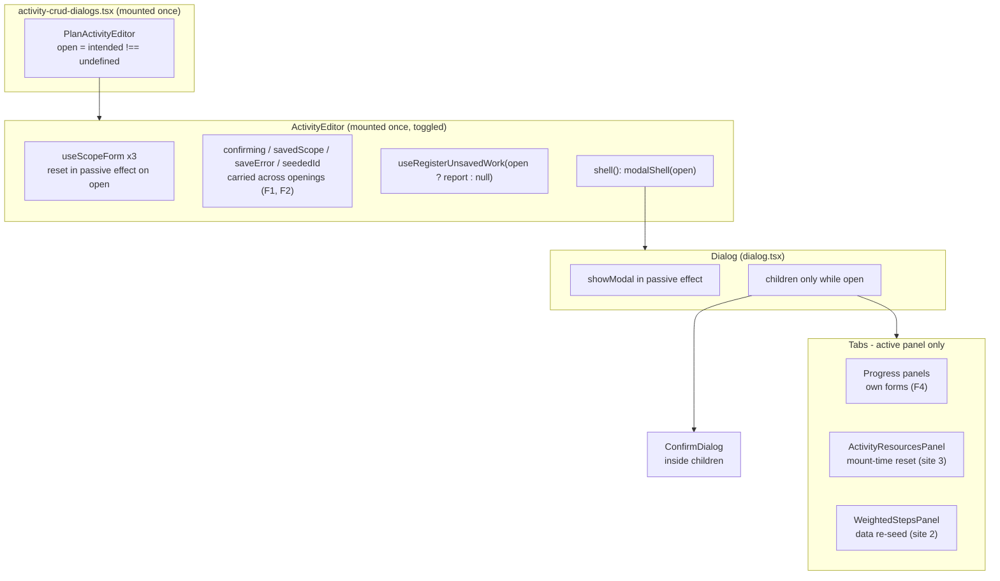
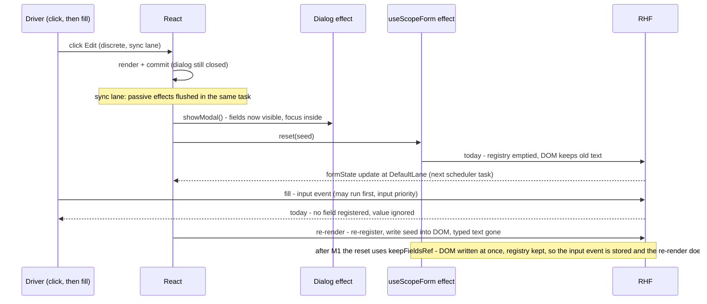
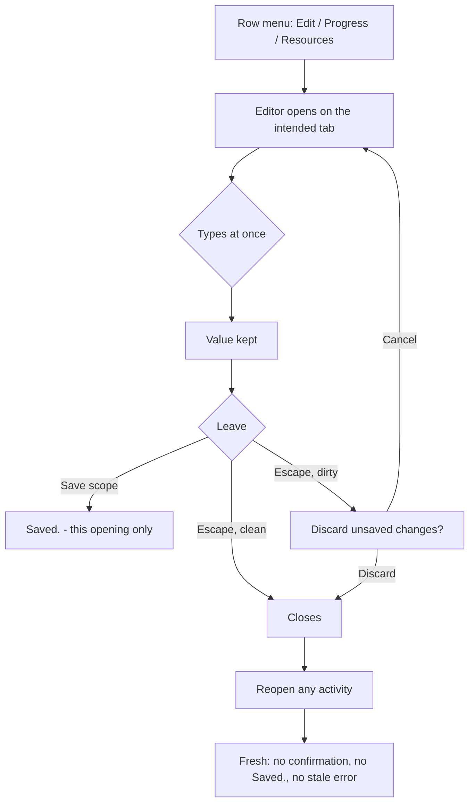

# Feature Spec: Activity editor seeding — the last three `docs/TECH_DEBT.md` #420 sites

- **Status:** Draft — awaiting the product owner's answers to CQ-1 to CQ-3 (§1, "Open questions").
- **Author(s):** feature-analyst (for the product owner)
- **Date:** 2026-10-01
- **Tracking issue / epic:** `docs/TECH_DEBT.md` #420, "Left, and why — not converted", items 1–3.
- **Roadmap link:** none. A defect class, not a roadmap capability.
- **Related ADR(s):** ADR-0060 (tabbed editor, per-scope save), ADR-0061 (two-pane dialog), ADR-0062
  (Logic/Resources/Notes as tabs), ADR-0101 (the editor is a dialog, not a drawer), ADR-0108 (the
  unsaved-work guard; D7 "what a modal actually guards"), ADR-0135 (focus hand-back), ADR-0088 D1 (no
  flag), ADR-0081 (entry point and journey), ADR-0105 (when a row needs a spec). **No new ADR is
  needed** under any option (§4.8).

**Why a spec.** The product owner asked for one (2026-10-01). #420 itself said a spec was needed
because remounting the editor's forms per opening "means lifting that guard through a seam, which is a
change to the editor's shell contract" (ADR-0105). §0 finds that premise does not hold for the
recommended fix: the window #420 describes can be closed **inside `useScopeForm`** without touching the
shell, the editor's props or any component contract, so no ADR-0105 trigger fires under CQ-1 (a). It
does fire under CQ-1 (b), which is why that option is costed here rather than left to a register row.

**Evidence convention (CLAUDE.md §19.11).** Every decision-bearing claim names the file and line read.
Claims about a dependency's internals are registered in `scripts/dependency-claims.json` (react-dom
19.3.0, react-hook-form 7.88.0, playwright-core 1.63.0). Claims marked **(read, not observed)** were
derived by reading and have not been reproduced; M0 reproduces them before anything is built on them.

---

## 0. Verdict first

### 0.1 The mechanism, restated precisely

#420's description — "a `reset()` in a passive effect keyed on open … runs after the field is on
screen, so it can wipe what a fast typist has already entered" — is **not quite** what the code does,
and the difference decides the fix.

1. **Typing before the effect is impossible.** `Dialog` calls `showModal()` in its **own** passive effect
   (`apps/web/src/components/ui/dialog.tsx:67-72`); until then the `<dialog>` is closed and its contents
   are not displayed. `Dialog` is a child of the component whose effect resets the form, React runs
   passive mount effects child-before-parent, so `showModal()` and the `reset()` run **back to back in
   one flush**. When the opening is a click or key press (every entry point here is: row menu, canvas
   bar, toolbar), that flush is synchronous at the end of the commit, inside the same task as the click
   — `react-dom-client.production.js:13204` flushes pending passive effects when the committed lanes
   include the sync lane. No input event can be dispatched in between.
2. **The real window opens _after_ the reset.** react-hook-form's `reset()` (without `keepFieldsRef`)
   empties its field registry — `_fields = {}` at `index.esm.mjs:3320-3327` — and does **not** write the
   new values into the DOM. Fields re-register on the next render, and the ref callback then writes the
   stored value into the input (`index.esm.mjs:2285-2297`, `setFieldValue`). Until that render, an
   `input` event finds no field and is **ignored** (`index.esm.mjs:2710-2717`: `onChange` does nothing
   when `get(_fields, name)` is undefined). The re-render then overwrites the DOM with the seed.
3. **That re-render is one task later, not immediate.** State updates made inside a passive-effect flush
   are given at most default priority — `react-dom-client.production.js:13238` floors the update
   priority at 32 (`DefaultLane`) — so RHF's `formState` update renders in a **scheduler task after the
   click's task**, not synchronously.

So the window is: _from the moment the dialog becomes visible (with focus inside it) until the first
scheduler task after the click_. A human cannot click into a field and type inside one task. **An
automated driver can**: Playwright's `fill` checks only "visible, enabled, editable" — not "stable" —
before typing (`coreBundle.js:20396`), and it types with `Input.insertText`, an input-priority task that
a browser may run ahead of the scheduler's normal-priority message task. That is exactly the csp trace
#420 records: `fill('Riverside')` completed, the field was empty and `[invalid]`. **This is a
hypothesis consistent with the trace, not an observation** — the mechanism was never observed for the
original site either (#420, "A local repro … passed, so the mechanism was **never observed**").

A consequence worth stating, because it corrects #420's own test rationale: a value placed in the
field in the **layout phase** (the shape of #749's regression tests) models a moment no user or driver
can reach — the dialog is not shown yet. Those tests prove the effect is gone; they do not model the
window. M0-T2 builds a probe that does (§4.6).

**And resets in event handlers are safe**, which is why `InviteMemberDialog` and `ImportScheduleDialog`
were rightly out of scope: an update inside a discrete event is sync-lane and renders before the event
returns, so there is no gap between the reset and the re-registration. Only a reset inside a
**passive effect** or an **async callback** (network response) opens the window.

### 0.2 Per site

| #   | Site                                                                                        | Window reachable?                                                                                                                                                                                                                                                                                                                                                                                                                                                                                                                                                                                       | Recommendation                                                                                                          |
| --- | ------------------------------------------------------------------------------------------- | ------------------------------------------------------------------------------------------------------------------------------------------------------------------------------------------------------------------------------------------------------------------------------------------------------------------------------------------------------------------------------------------------------------------------------------------------------------------------------------------------------------------------------------------------------------------------------------------------------- | ----------------------------------------------------------------------------------------------------------------------- |
| 1a  | `ActivityEditor` (`useScopeForm` × 3, `ActivityEditorDialog.tsx:321-328`)                   | **Human: no. Driver: yes, same shape as the csp trace.** Opens on every opening (`useScopeForm.ts:67-77`). The journeys type into it at once: `e2e-activity-editor/support.ts:106-116` waits only for the tab list, which is visible from the same instant as the fields. No flake is recorded in the register.                                                                                                                                                                                                                                                                                         | Close the window in the hook (CQ-1).                                                                                    |
| 1b  | `ActivityCreateDialog` (`useScopeForm` × 4, `ActivityCreateDialog.tsx:271-292`)             | **Same as 1a**, and the most exercised instance in the suite: `addActivity` clicks **New activity** and fills Name with no wait (`e2e-activity-editor/support.ts:91-103`), in suite after suite. No flake is recorded — weak evidence the window is rarely hit, not that it is closed. Its `mutation.reset()` effect (`:337-340`) cannot wipe text, as #420 says.                                                                                                                                                                                                                                       | Close the window in the hook (CQ-1).                                                                                    |
| 1c  | `ReportedProgressPanel`, `ValueMeasurePanel` (`ActivityProgressPanels.tsx:122-134`, `:283`) | **Same window, on tab reveal, not on open.** `Tabs` renders only the active panel (`apps/web/src/components/ui/tabs.tsx:210`), so these panels **mount** on every Progress visit and the `[open, activity.id]` effect fires at mount, resetting to the very values `useForm` was just born with.                                                                                                                                                                                                                                                                                                        | Closed by the same hook change; nothing panel-specific.                                                                 |
| 2   | `WeightedStepsPanel` (`ActivityProgressPanels.tsx:457-472`)                                 | **Not by a typist.** Cold cache: the form is not rendered while the list loads (`:571-572`). Warm cache: the first render has no rows (`useForm` defaults to `steps: []`, `:449-452`), so there is no text field to type into during the window. After mount it re-seeds only when `loadedSteps` changes identity, which TanStack Query's structural sharing limits to a real server change — and steps are pen-gated (ADR-0060 §5), so nobody else can change them while this reader can edit them. The residual: one **Add step** click landing inside a sub-task window is lost, costing a re-click. | **Close, no change.** The re-seed is intended ("a late-arriving fetch still populates", `:457`).                        |
| 3   | `ActivityResourcesPanel` (`ActivityResourcesPanel.tsx:216-228`)                             | **Human: no. Driver: yes, on tab reveal** — the same window as 1c. Both hosts mount the panel only while it is shown (the editor at `ActivityEditorDialog.tsx:870-895`; `ActivityResourcesDialog.tsx:49-60` inside a `Dialog`, which mounts children only while open, `dialog.tsx:96`), so `enabled` is always `true` at mount and the effect fires **only** at mount, resetting to values identical to `useForm`'s defaults (`:207-213` vs `:218-224`) and clearing a mutation that was created in the same render. **The effect is redundant.**                                                       | **Delete the effect** (CQ-3). Zero behaviour change, and it removes the window. Or close it unchanged, if CQ-3 says so. |

**#420's reasons for leaving site 3 do not hold**, which is worth recording (CLAUDE.md §19.11, "re-verify
the problem statement"): "keying the body would drop the assigned rows' edit state on every hide and
show" — the body is **already** dropped on every hide, because the tab strip unmounts it
(`tabs.tsx:210`); and "converting only the form would stop it clearing a stale error on reveal" —
there is no stale error to clear, because the mutation is born fresh at each mount.

**#420's reason for skipping site 1 does not hold in production either.** "The effect is also the
late-arriving subject path (the activity resolves after the dialog opens)": in the only production
mount, `open` **is** `intended !== undefined`, and `intended` is the resolved row
(`apps/web/src/components/layout/workspace/activity-crud-dialogs.tsx:92-94`, `:184`). The editor
cannot be open without its subject. The subject-**change** path (Graphite M6-T3,
`ActivityEditorDialog.tsx:488-495`) is reachable only through a non-modal shell, and since ADR-0101
the only production shell is `modalShell` (`activity-crud-dialogs.tsx:75`); a modal intercepts every
click behind it, so the subject cannot change while it is open (ADR-0108 D7). Both paths remain
**tested contracts** (`ActivityEditor.subject-guard.test.tsx`) and every option below keeps them.

### 0.3 What reading found next door — the cross-open state class

The editor and the create dialog are mounted once and toggled (`activity-crud-dialogs.tsx:181`,
`CreateActivityButton.tsx:43-59`). Their forms are re-seeded on open, but **the rest of their state is
not**, and it carries from one opening into the next. These are **(read, not observed)**; M0-T3
reproduces each before any fix is built.

- **F1 — a discarded draft leaves a confirmation armed for the next opening.** Edit a field, press
  Escape, choose **Discard**. `onConfirm` calls `setConfirming(null)` and `onClose()`
  (`ActivityEditorDialog.tsx:1006-1010`); the host clears the intent, so `incomingActivity` becomes
  `undefined` while `seededId` still names the activity and the forms are still dirty (nothing resets
  them on close — `useScopeForm.ts:69` resets only `if (open)`). The render-phase subject guard
  (`:488-495`) then runs **while closed** and sets `confirming = 'subject'`. It is invisible because the
  `ConfirmDialog` sits inside the shell's children, which a closed `Dialog` does not render
  (`dialog.tsx:96`). **Reopen the same activity** and it mounts with `open={confirming !== null}` true:
  "… Switching to <the same activity> will discard them." Because passive effects run child-first, the
  confirmation's `showModal()` runs before the editor's, which reading predicts puts it **beneath** the
  editor in the top layer — where an Escape or a dirty Close then updates a dialog nobody can see. The
  existing journey that discards (`e2e-activity-editor/activity-editor.spec.ts:180-212`) ends at the
  table and never reopens, so nothing would have caught it. **Reopening a different** activity
  self-heals after one transient render (the guard adopts once the open-reset cleans the forms).
- **F2 — "Saved." and a scope's save error survive into the next opening**, including for a different
  activity. `savedScope` and `saveError` (`ActivityEditorDialog.tsx:255-257`) are cleared by nothing on
  close or open (the only writers are `:513`, `:546`, `:556`, `:560`), and `ScopeSaveBar` prints
  `savedMessage` whenever `saved && !dirty` (`apps/web/src/components/ui/scope-save-bar.tsx:92-97`).
- **F3 — the create dialog's hidden-field alert survives into the next opening.** `hiddenProblem`
  (`ActivityCreateDialog.tsx:454`) is cleared only by the next submit (`:476`), so a fresh, empty form
  can open saying "One of this activity's values can't be saved…".
- **F4 — Progress-tab drafts are destroyed by switching tabs, and the editor goes on claiming them.**
  The three Progress panels own their forms and mount only while the tab is active (`tabs.tsx:210`,
  `ActivityEditorDialog.tsx:905-950`). Switch to General with an unsaved % complete and the form is
  gone; `useReportDirty` has no cleanup (`ActivityProgressPanels.tsx:83-87`), so `progressDirty` stays
  `true`, the tab keeps its unsaved dot and Close asks to discard work that no longer exists. The #63
  test comment (`ActivityEditor.unsaved-scopes.test.tsx:136-141`) assumes the opposite. **This is a tab
  lifetime, not an open lifetime** — out of #420's class (CQ-2).
- **F5 — a successful save's `reset(values)` wipes text typed while the save was in flight**
  (`ActivityEditorDialog.tsx:703`, `:774`, `:958`; the panels likewise). A network-driven reset — the
  #83 shape (`apps/web/src/features/activities/model/use-duration-seed.ts:17-30`). Out of scope;
  default D-4 files it.

Also stale, and corrected in the close-out (D-5): the comment at `ActivityEditorDialog.tsx:395-399`
says the Progress panels "are not represented here", directly above the report that represents them
(`:400-466`); and the shell docblocks (`:79-95`, `:161-166`) still describe the Graphite drawer, which
ADR-0101 removed.

---

## 1. Business understanding

### Problem

Text a planner or contributor types into the activity editor or the **New activity** dialog must be
kept. Today there is a one-task window, starting the instant either dialog (or a Progress or Resources
tab) appears, in which typed input is silently discarded (§0.1). A person cannot hit it; an automated
journey can, and the only recorded instance of this class (the csp suite, #420) cost three failed CI
runs in two days on another dialog. Separately, the two dialogs carry state from one opening into the
next (§0.3), the worst of which (F1) can leave a confirmation armed behind the editor after a
**Discard** — the commonest way to leave an edit.

**Why now:** #420's trigger names "the next change to `ActivityEditorDialog`, `ActivityCreateDialog` or
`useScopeForm`", and the product owner asked to finish the row.

### Users

| Role                            | Touches                                                 | Effect of this work                                       |
| ------------------------------- | ------------------------------------------------------- | --------------------------------------------------------- |
| **Planner** (with pen)          | Every editor scope, **New activity**, Resources tab     | Typed text kept; no stale confirmation/"Saved." on reopen |
| **Contributor**                 | Editor's Progress tab (not pen-gated, ADR-0028 Q-C)     | Typed progress kept on tab reveal                         |
| **Viewer**, Planner without pen | Editor read-only (gated forms, ADR-0083)                | None — nothing to type                                    |
| **Org Admin**                   | As Planner                                              | As Planner                                                |
| **External Guest**              | No editor (share-link view is read-only, ADR-0051/0163) | None                                                      |

### Primary use cases

1. Open the editor from a row menu or canvas bar and start typing at once.
2. Open **New activity** and start typing at once.
3. Reveal the Progress or Resources tab and start typing at once.
4. Discard an edit, then reopen the same or another activity.

### User journeys

Unchanged entry points (row menu **Edit/Progress/Logic/Resources**, canvas selection bar, toolbar
**Update progress…**, **New activity**). See the user flow in §4.3.

### Expected outcomes

- No typed character is ever discarded by seeding, on open or on tab reveal.
- Every opening of the editor starts with no confirmation, no "Saved.", no stale error; every opening of
  **New activity** starts with no stale alert.
- Every existing behaviour — per-scope save, version-at-submit, the unsaved-work guard and its six
  scopes, the subject guard, the intent's landing tab, focus on open and close — unchanged.

### Success criteria

- M0's window probe (§4.6) is **red** on today's `useScopeForm` and on `ActivityResourcesPanel`, and
  **green** after M1. This is the proof; a journey cannot prove the absence of a race.
- F1–F3, each reproduced red at M0, are green after M2; the journey for F1 drives the real top layer.
- Every existing suite that mounts the editor, the create dialog or the panels passes **unchanged**.
- `pnpm prepush` and `scripts/e2e-local.sh web:<activity-editor suite>` green.

### Open questions

**Critical (answers change the design or scope):**

- **CQ-1 — How should the editor and the New activity dialog be fixed?**
  - **(a) Recommended — fix the hook, then fix the carried-over state point by point.** One option on
    the reset in `useScopeForm` stops it emptying the field registry, which closes the window at all four
    hosts at once (editor, New activity, the two Progress panels). Then three small fixes clear the state
    that leaks between openings (F1–F3). Nothing about how the editor is put together changes. Smallest
    change; each fix is independently testable.
  - **(b) Rebuild the editor so its working state is born fresh each time it opens** — the pattern the
    eight sibling dialogs got in PR #749. Fixes the window and the whole leaking-state class by
    construction, so the next piece of state added cannot leak either. Costs a split of a
    1,100-line component, a new internal hand-off for Close/Escape, and a full re-run of ~20 suites that
    mount it. Still needs (a)'s hook option for the subject-change path.
  - **(c) Close #420's remaining items with no code change**, on the grounds a person cannot hit the
    window, and file F1–F3 as separate rows. Cheapest; leaves the window the csp flake is consistent with
    in the two most-exercised dialogs in the journey suite.
- **CQ-2 — Progress-tab drafts are lost when you switch tabs (F4). Fix it here or separately?**
  - **(a) Recommended — file it as its own register row now and fix it separately.** It is a different
    lifetime (the tab, not the opening), and fixing it means either keeping the three panels mounted
    while hidden or moving their forms up into the editor — a change to the panels' contract that
    deserves its own design.
  - **(b) Fold it into this work as a further milestone.** One epic for "the editor never loses typed
    work"; roughly doubles the size.
  - **(c) Only make the editor stop claiming the lost work** (report "clean" when a panel unmounts),
    and accept the loss. Smallest; arguably worse, since it makes a silent loss quieter.
- **CQ-3 — The Resources tab's reset (site 3) is redundant. Delete it, or close it unchanged?**
  - **(a) Recommended — delete it.** Two blocks, no behaviour change (§0.2), and it removes the same
    window as the editor's. Goes against the default "close what a person cannot hit", deliberately:
    the reason to fix site 1 applies here word for word.
  - **(b) Close it unchanged**, as the brief's default for a site no person can hit.

**Defaults (proceeding on these unless told otherwise):**

- **D-1 — No flag** (ADR-0088 D1). The rollback is the commit boundary.
- **D-2 — Patch changeset for `@repo/web`**, user-visible ("typed text kept on open").
- **D-3 — No ADR.** None of the options decides architecture (§4.8). If CQ-1 (b) is chosen, one
  `docs/DECISIONS.md` entry records "the editor's working state lives for one opening".
- **D-4 — F5 is filed as a register row, not fixed here.** Fixing it means `keepDirtyValues` on
  post-save resets, which changes what "saved" resets and needs its own look.
- **D-5 — Docblock corrections in the close-out:** `useScopeForm.ts` trap 2 and the effect comment;
  `ActivityEditorDialog.tsx:395-399` (stale "not represented here"); the shell docblocks' drawer
  references (`:79-95`, `:161-166`).
- **D-6 — #420 is closed with evidence**, items 2 and 3 recorded with this spec's verdicts.
- **D-7 — M0 re-reads the pre-#740 `ProjectFormDialog`/`ClientFormDialog`** (`git show`) and records
  whether their effect had any trigger besides `open`. This spec did not read them (no history access
  from here); the verdict for the editor does not depend on the answer, but #420's narrative does.
- **D-8 — `WeightedStepsPanel` is closed unchanged** (§0.2). Its warm-cache first frame shows "No steps
  yet" until the seed lands; noted, not fixed.

## 2. Functional requirements

### User stories & acceptance criteria

> **US-1** — As a **Planner** or **Contributor**, I want what I type into the activity editor the moment
> it opens to be kept, so that a quick edit is never silently lost.
>
> - **Given** the editor opens from any entry point **when** input arrives before React's first
>   scheduled re-render **then** the field and the form both hold the typed value, and a save sends it.
> - **Given** the Progress or Resources tab is revealed **when** input arrives in the same window
>   **then** it is kept.

> **US-2** — As a **Planner**, I want what I type into **New activity** the moment it opens to be kept.
>
> - **Given** the dialog opens **when** input arrives before the first scheduled re-render **then** the
>   activity is created with the typed name.

> **US-3** — As a **Planner**, I want each opening of the editor to start clean, so that I am never asked
> to confirm, told "Saved.", or shown an error about a previous session.
>
> - **Given** I discarded a draft **when** I reopen the same activity **then** no confirmation is open,
>   and a later dirty Escape shows a confirmation I can see and operate.
> - **Given** I saved a scope and closed **when** I open any activity **then** no scope says "Saved."
>   and no scope shows the previous save's error.

> **US-4** — As a **Planner**, I want **New activity** to open without a stale "can't be saved" alert.
>
> - **Given** a previous submit failed on a hidden field **when** I close and reopen **then** the alert
>   is not shown.

**Unchanged and asserted unchanged:** per-scope save and version-at-submit (ADR-0060); the six-scope
unsaved-work report and its registration (ADR-0108); the subject guard's hold/adopt/keep-editing
(`ActivityEditor.subject-guard.test.tsx`); the intent's landing tab (`ActivityEditorDialog.tsx:294-298`);
the duration re-seed when the calendar list lands (`use-duration-seed.ts:64-82`); focus into the dialog on
open (native `showModal`) and back to the opener on close.

### Workflows

No workflow changes. The fix is invisible except that input is kept and stale state is gone.

### Edge cases

| Case                                                   | Expected                                                                                                                                    |
| ------------------------------------------------------ | ------------------------------------------------------------------------------------------------------------------------------------------- |
| Typing during the first scheduled task after open      | Kept (US-1/2).                                                                                                                              |
| Calendar list lands after the planner typed a duration | Typed value wins — unchanged (`use-duration-seed.ts:75`).                                                                                   |
| A tab never visited in session 1, visited in session 2 | Shows session 2's seed. With `keepFieldsRef` its old field entry holds a detached element; re-registration writes the value (§4.5). Tested. |
| 409 → **Refresh this section**                         | Unchanged — an event-time reset, sync lane, no window (`ActivityEditorDialog.tsx:512-517`).                                                 |
| Subject change while open (passthrough shell only)     | Unchanged: hold and ask when dirty, adopt silently when clean.                                                                              |
| Discard, reopen the **same** activity                  | No confirmation open (US-3).                                                                                                                |
| Discard, reopen a **different** activity               | No transient confirmation and no flash of the old subject's title (today: one transient render).                                            |
| Pen lost mid-edit (ADR-0108 D5)                        | Unchanged: confirm with "unsavable" copy.                                                                                                   |
| Save in flight, then typing (F5)                       | Unchanged by this work (D-4).                                                                                                               |
| Progress draft then tab switch (F4)                    | Unchanged by this work unless CQ-2 (b)/(c).                                                                                                 |

### Permissions

No change. Gating stays `deriveActivityEditorGating` (ADR-0060 §6): definition scopes pen-gated
(structural writes, ADR-0028), progress not, steps pen-gated (§5). No endpoint, guard, DTO or scope
check is touched. Organisation scoping is unchanged.

### Validation rules

No change. Scope schemas (`activity-scope-schemas`) and the ADR-0070 whole-days check are untouched.

### Error scenarios

| Scenario                                  | Detection      | User-facing result                           | Status     |
| ----------------------------------------- | -------------- | -------------------------------------------- | ---------- |
| Stale version on save (409)               | API, unchanged | Scope-local error + **Refresh this section** | unchanged  |
| A previous session's save error           | —              | **Not shown** in the next opening (US-3)     | fixed (F2) |
| A previous session's discard confirmation | —              | **Not armed** in the next opening (US-3)     | fixed (F1) |
| Hidden-field submit failure, then reopen  | —              | **Not shown** (US-4)                         | fixed (F3) |

## 3. Technical analysis

| Area           | Impact            | Notes                                                                                                                                                                                                                                 |
| -------------- | ----------------- | ------------------------------------------------------------------------------------------------------------------------------------------------------------------------------------------------------------------------------------- |
| Frontend       | low (a) / med (b) | (a): one option in `useScopeForm`; render-phase "reset on open edge" for three editor states and one create state; delete one effect in `ActivityResourcesPanel`. (b): split `ActivityEditor` into a frame and a per-opening session. |
| Backend        | none              | No request changes shape; the same PATCH/PUT bodies are sent.                                                                                                                                                                         |
| Database       | none              | No model, column, index or migration — `database-architect` not engaged because there is nothing to design.                                                                                                                           |
| API            | none              |                                                                                                                                                                                                                                       |
| Security       | none              | No authN/Z, scope, input or audit change. The pen gate is read, never written.                                                                                                                                                        |
| Performance    | ~none             | `keepFieldsRef` skips one re-registration pass per open — marginally less work. (b) remounts the session per opening, which the Dialog already does for its children (`dialog.tsx:96`).                                               |
| Infrastructure | none              | No config, CI step or Playwright config change; tests are added to an existing suite.                                                                                                                                                 |
| Observability  | none              |                                                                                                                                                                                                                                       |
| Testing        | med               | A new **window probe** (unit, real scheduler, act off); red-first unit tests for F1–F3; three journey cases in `e2e-activity-editor`; every existing editor/create/panel suite unchanged.                                             |

**Scheduling engine.** No scheduling input is added or changed, so `computeSchedule` is byte-identical
by construction — nothing on the request path to it is touched.

**Pen (ADR-0028).** No new write. The structural writes (definition scopes, steps, Logic, Resources)
and the non-structural progress write are unchanged.

### Dependencies

- react-hook-form 7.88.0's `reset` option `keepFieldsRef` (public: declared in the package's
  `form.d.ts` reset-options type; behaviour at `index.esm.mjs:3320-3327`). A future RHF bump re-reads
  it through `check:claims`.
- No other work must land first. #420's eight converted sites are not touched.

## 4. Solution design

### 4.1 Architecture overview

Where the state lives today, and what each option changes.

**CQ-1 (a)** keeps this shape. **CQ-1 (b)** moves `SF`, `ST`, `UR`, `CD` and the tab body into a
`ActivityEditorSession` rendered as the shell's children only while `open`; the frame keeps the shell
call and forwards `requestClose` to the session (§4.5).

### 4.2 Data flow — the window, before and after

### 4.3 User flow

### 4.4 Database changes

None.

### 4.5 Component changes

**Under CQ-1 (a) — recommended.**

1. **`useScopeForm` (`useScopeForm.ts:67-77`)** — the reset becomes `reset(seed(activity), {
keepFieldsRef: true })`. With the option, RHF writes each mounted field's value through `setValue`
   immediately and leaves the registry intact (`index.esm.mjs:3320-3327`), so an input event in the next
   task is stored (`index.esm.mjs:2710-2717` finds its field) and the re-render's ref callback sees the
   same element and does not overwrite it. Fields not mounted at the time (another tab's) keep a stale
   ref; when that tab mounts, the new element differs and the value is written from the form's values —
   the existing re-registration path (`index.esm.mjs:2285-2297`). The effect's **keys** stay
   `[open, activity?.id]`, so trap 2 (a sibling save must not re-seed) holds unchanged.
   **The same hook change also resets on the close edge** (`if (!open)` too) — while closed no field is
   mounted, so the reset is invisible, and it is what stops a discarded draft keeping the forms dirty
   into the subject guard (F1's root).
2. **`ActivityEditor`** — per-opening state is cleared **on the open edge, during render**, using the
   `seenIntent` precedent already in the file (`ActivityEditorDialog.tsx:294-298`), not an effect:
   `confirming`, `savedScope`, `saveError` return to their initial values; and the subject guard
   (`:488-495`) runs **only while `open`**, adopting silently while closed. F1 is then impossible by
   two independent routes (the forms are clean, and the guard is off).
3. **`ActivityCreateDialog`** — `hiddenProblem` is cleared on the open edge, same pattern (F3).
4. **`ActivityResourcesPanel`** (CQ-3 (a)) — delete the `[enabled, activityId]` effect
   (`ActivityResourcesPanel.tsx:216-228`). The post-assign `reset` (`:275-281`) is a mutation callback
   and stays.
5. Docblocks per D-5.

No props, no exported type and no shell signature change. `ActivityEditorShell`, `modalShell`,
`ActivityEditorDialog` and the panels' props are byte-identical.

**Under CQ-1 (b).** `ActivityEditor` keeps its props and its single `shell({...})` call; its body moves
into `ActivityEditorSession`, rendered as `children: open ? <ActivityEditorSession … /> : null`. The
seam is a ref: the session publishes its `requestClose` through `useImperativeHandle`, and the frame's
`requestClose` is `() => (session.current?.requestClose ?? onClose)()`. The `<dialog>` element stays
owned by the frame, so its open/close lifecycle — and therefore focus on open and focus return on close
— is unchanged. **The title** is computed by the frame from the incoming row; it differs from today's
"held" title only while a subject confirmation is pending, which a modal cannot reach (ADR-0108 D7), and
the only shells that can reach it (the tests' passthrough) render no title. The subject-change re-seed
still needs (a)'s `keepFieldsRef` effect, because keying the session by subject would remount it and
drop focus (an ADR-0135 hand-off would then be owed). `ActivityCreateDialog` gets the #749 shape
directly (inner form keyed and mounted while open); its `requestClose` reads `unsavedReport`, which moves
inside with the forms, so the same ref seam applies.

### 4.6 How it is proven

- **The window probe (M0-T2, the real proof).** A Vitest file using `createRoot` with
  `IS_REACT_ACT_ENVIRONMENT = false`: open the host inside `flushSync` (sync lane, so passive effects —
  the reset — flush before `flushSync` returns), then, before yielding, dispatch a native `input` event
  on the Name field through the value setter React listens to, then yield one macrotask so the
  scheduler renders, then assert both the DOM value and `getValues('name')`. Red today, green after M1.
  Run against a minimal `useScopeForm` host, `ActivityCreateDialog`, and `ActivityResourcesPanel` at
  mount. This is the only test in the plan that models the moment a driver can reach; the layout-phase
  shape #749 used models a moment nobody can.
- **Red-first unit tests for F1–F3** through the real `modalShell`/`Dialog`, with the host toggling
  `open` as `activity-crud-dialogs.tsx` does (the current suites hold `onClose` as a mock, which is why
  none of them can see F1).
- **The journey** (ADR-0081 / CLAUDE.md §19): in `apps/web/e2e-activity-editor/activity-editor.spec.ts`,
  (J1) open via the row menu and `fill` Name with no wait, save, assert the table cell — a regression
  guard, not a proof; (J2) dirty → Escape → **Discard** → reopen the same activity from the row menu →
  assert no `alertdialog` is visible → dirty again → Escape → the confirmation is visible **and**
  **Discard** works — this drives the real top layer, which jsdom does not have; (J3) save a scope →
  close → open another activity → no "Saved.". An axe pass on the reopened editor.

### 4.7 API changes

None.

### 4.8 Implementation approach & alternatives

**Chosen (recommended): CQ-1 (a).** It closes the window at the one place every affected host shares,
without moving state across a component boundary, and it fixes F1–F3 with the editor's own established
render-phase pattern. Each piece is a separate commit with its own red test.

**Alternatives.** (b) is the principled end state and the one #420 had in mind; it is costed above and
remains a good follow-up if the cross-open class recurs. (c) is honest about human reachability but
leaves the two most-exercised dialogs in the journey suite with the shape of the only recorded instance.
**Rejected outright:** keying the session (or the forms) by subject — it remounts on a subject change,
drops focus (ADR-0135 would be owed) and buys nothing a modal can reach; and a "reported dirtiness"
seam (child reports `isDirty` up through an effect, as the Progress panels do) — that is one render
late by construction, and a guard one render late is the defect class this register keeps recording.

**ADR?** No. None of the options decides an architectural question: (a) is a hook option and three
render-phase resets; (b) is an internal split behind an unchanged public contract. Neither touches a
shared primitive's keyboard contract, so ADR-0111/§19.13 applies only to the extent F1's fix changes
which dialog is open — which is why accessibility-reviewer is still engaged (plan §Reviewers).

### 4.9 Out of scope

F4 (CQ-2 default (a)), F5 (D-4), `WeightedStepsPanel` (D-8), the eight converted dialogs, and the
original csp site's mechanism beyond D-7's reading.

## 5. Links

- Implementation plan: [`./implementation-plan.md`](./implementation-plan.md)
- Register: `docs/TECH_DEBT.md` #420; new rows for F4 and F5 (plan M3).
- Related docs updated by this change: `docs/TECH_DEBT.md`; `scripts/dependency-claims.json` (six claims
  registered with this spec); `docs/DECISIONS.md` only under CQ-1 (b).
