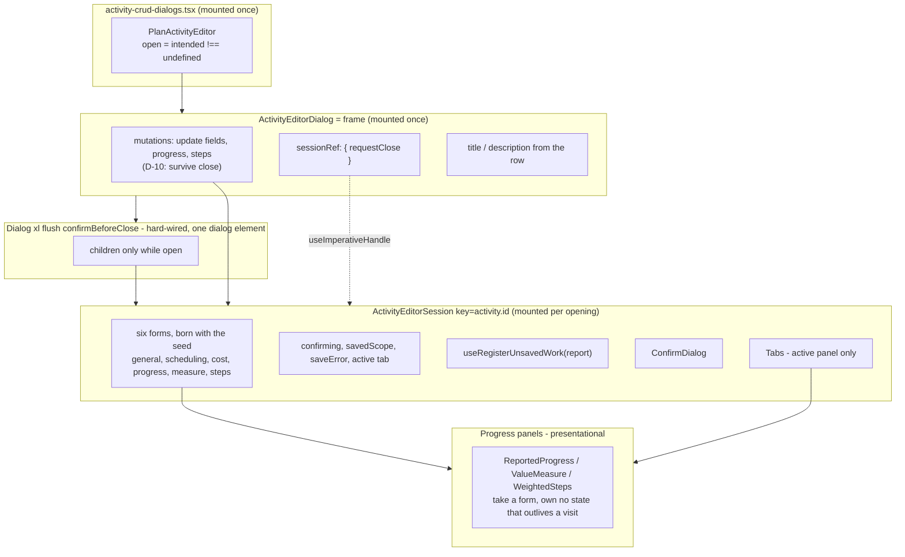
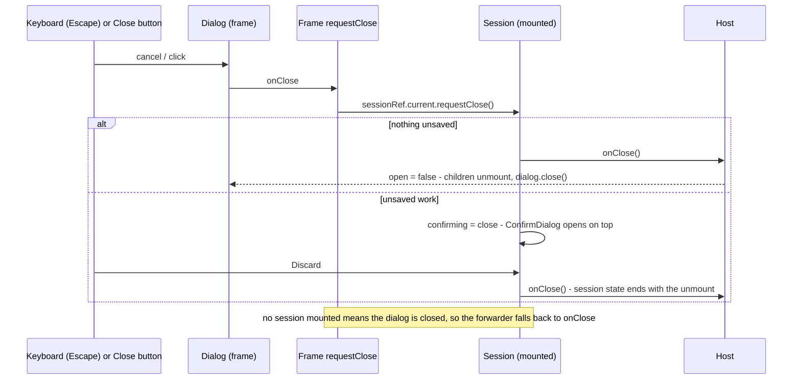
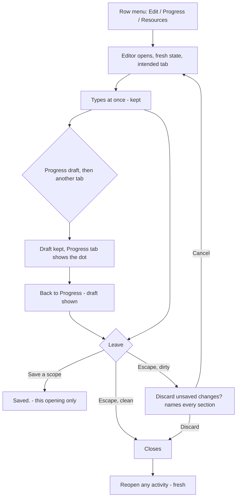

# Feature Spec: Activity editor seeding — the editor's working state lives for one opening

- **Status:** Approved — by the product owner, 2026-10-01 (ADR-0169 filed `Proposed` in M1, plan T1.2;
  the spec closes as `Accepted — shipped (ADR-0169)` at M5).
- **Approval:** **approved to build by the product owner on 2026-10-01** (AskUserQuestion), with CQ-1 (b),
  CQ-2 (b), CQ-3 (a) and NQ-1 (b) as recorded in §1 "Open questions". To start after the logic-aware
  levelling work (`docs/specs/logic-aware-levelling`).
- **M0 correction (2026-10-01):** M0's stop gate fired — the typed-input window is red on the editor and
  New activity only, not on a Progress or Resources tab reveal ([`./m0-measurement.md`](./m0-measurement.md)).
  The product owner decided on **2026-10-01** (AskUserQuestion) to **continue the approved rebuild** with
  CQ-1 (b), CQ-2 (b), CQ-3 (a) and NQ-1 (b) unchanged, and this spec and its plan corrected to M0's
  findings. What changed is recorded in §0.4; every claim that rested on the withdrawn "same window on
  tab reveal" premise is corrected in place.
- **Author(s):** feature-analyst (for the product owner)
- **Date:** 2026-10-01 (first draft and revision)
- **Tracking issue / epic:** `docs/TECH_DEBT.md` #420, "Left, and why — not converted", items 1–3; plus
  the findings F1–F4 this spec added (§0.3).
- **Roadmap link:** none. A defect class, not a roadmap capability.
- **Related ADR(s):** **a new ADR is required — ADR-0169** (outline in §4.9; 0168 is reserved by
  `docs/specs/logic-aware-levelling`). It amends ADR-0060 §4 (who owns a scope's form) and ADR-0108 D2
  (the Progress panels report their dirtiness upward). Also: ADR-0061, ADR-0062, ADR-0101 (the editor is
  a dialog, not a drawer — ADR-0169 D5 completes its reversal by retiring the shell), ADR-0108 D5/D7, ADR-0135 (focus hand-back), ADR-0048 (undo), ADR-0088 D1 (no
  flag), ADR-0081 (entry point and journey), ADR-0105 (when a row needs a spec), ADR-0111 / CLAUDE.md
  §19.13 (keyboard and focus contracts reviewed before release).

**The product owner's answers (2026-10-01, recorded verbatim in intent):**

- **CQ-1 → (b)** rebuild the editor and **New activity** so their working state is created fresh on
  every opening, as PR #749 did for the eight sibling dialogs.
- **CQ-2 → (b)** fold the Progress-tab draft loss (F4) into this work.
- **CQ-3 → (a)** delete `ActivityResourcesPanel`'s redundant reset.
- **NQ-1 → (b)** remove the editor's `shell` hook-in and hard-wire the modal; rewrite the four test files
  that use the no-chrome version; remove the subject-change guard, which only a non-modal host could
  reach.

**ADR-0105: this is a spec-level change, and the trigger is named.** Three component contracts change,
which is ADR-0105's "a component's public contract" trigger:

1. **The editor's public surface** (`features/activities/index.ts:38-41`). `ActivityEditor`,
   `ActivityEditorShell` and `modalShell` are **removed from the feature's exports**; the editor is
   `ActivityEditorDialog`, a modal, and nothing else. Its props lose `tabRailAllowed` (only the drawer
   passed `false`) and `onSubjectHeld` (the subject guard's hook). And what `open` _means_ changes —
   today closing keeps every scope's draft, the confirmation state, "Saved." and the error alive for the
   next opening; after this, closing ends them. The close guard is reached through an internal handle
   (§4.5), because the state it reads no longer lives in the component that renders the `Dialog`.
2. **The three Progress panels** (`ActivityProgressPanels.tsx`): they stop owning their forms and their
   `open`/`onDirtyChange` props go; they receive the forms instead (§4.6). Two suites mount them
   directly (`ActivityProgressPanels.error-presentation.test.tsx`, `WeightedStepsPanel.test.tsx`) and
   **cannot pass unchanged** — that is the contract change, stated rather than discovered.
3. **`useScopeForm`**: it loses its `open` parameter, its open-reset and its subject-change re-seed —
   with the guard gone, a form's subject is fixed for its lifetime.

Four editor suites use the no-chrome shell today and are rewritten or retired (NQ-1 (b)):
`ActivityEditor.registers-unsaved-work.test.tsx` and `ActivityEditor.unsaved-scopes.test.tsx` move to
`ActivityEditorDialog` with every assertion kept; `ActivityEditor.drawer-chrome.test.tsx` is deleted with
the drawer-only `tabRailAllowed` it tests (any assertion about the rail at a viewport moves to an
`ActivityEditorDialog` suite); `ActivityEditor.subject-guard.test.tsx` is deleted with the guard and
replaced by one test of the new rule (§4.5, "A changed subject").

**Evidence convention (CLAUDE.md §19.11).** Decision-bearing claims name the file and line read.
Dependency internals cite only the six claims registered in `scripts/dependency-claims.json` (react-dom
19.3.0, react-hook-form 7.88.0, playwright-core 1.63.0). Claims marked **(read, not observed)** were
reproduced at M0 before anything is built on them; §0.4 records which held.

---

## 0. Verdict first

### 0.1 The mechanism, restated precisely

#420's description — "a `reset()` in a passive effect keyed on open … runs after the field is on
screen, so it can wipe what a fast typist has already entered" — is **not quite** what the code does.

1. **Typing before the effect is impossible.** `Dialog` calls `showModal()` in its own passive effect
   (`apps/web/src/components/ui/dialog.tsx:67-72`); until then the `<dialog>` is closed and not
   displayed. `Dialog` is a child of the component whose effect resets the form, and React runs passive
   mount effects child-before-parent, so `showModal()` and the `reset()` run back to back in one flush.
   For a click or key press (every entry point here), that flush is synchronous inside the click's own
   task: `react-dom-client.production.js:13204` flushes pending passive effects when the committed lanes
   include the sync lane.
2. **The real window opens _after_ the reset.** Without `keepFieldsRef`, react-hook-form's `reset()`
   empties its field registry (`_fields = {}`, `index.esm.mjs:3320-3327`) and leaves the DOM alone.
   Until the next render re-registers the fields, an `input` event finds no field and is ignored
   (`index.esm.mjs:2710-2717`); the re-render then writes the stored value into the input
   (`index.esm.mjs:2285-2297`), overwriting what was typed.
3. **That re-render is one task later.** Updates made inside a passive-effect flush get at most default
   priority (`react-dom-client.production.js:13238`), so it renders in the next scheduler task.
   **M0 narrowed this to one case** (`m0-measurement.md` "Why — a minimal reproduction"): it holds for
   an **already-mounted form whose `open` flips** — the editor and New activity — and does **not** hold
   for a form **mounted by** the click, whose effect's re-render was observed to complete inside the
   click's own microtask flush (logged `render, effect, render, typing`). That is observed, not traced to
   a registered react-dom line, and no design decision below depends on why.

A person cannot click into a field and type inside one task. **A driver can**: Playwright's `fill`
checks only visible, enabled and editable (`coreBundle.js:20396`) and types with an input-priority
task. That matches the csp trace in #420 — a hypothesis consistent with it, **not observed**. M0's
probe shows the window **exists** in jsdom for the editor and New activity; whether a real driver's
`fill` ever lands inside it is still unmeasured (`m0-measurement.md` "What this does not establish"),
so J1 stays a regression guard and the probe stays the proof.

Two consequences carried into the design: a value placed in the field in the **layout phase** (#749's
test shape) models a moment nobody can reach, so M0 builds a probe that types inside the real window;
and **resets in event handlers are safe** (sync lane, no gap), which is why the design below may reset
in a click handler but never in a passive effect or a network callback, except the steps form's
first-data seed, which uses `keepFieldsRef` so it opens no window (§4.6).

### 0.2 Per site

| #   | Site                                                                                        | Window reachable?                                                                                                                                                                                  | Under the answers                                                                               |
| --- | ------------------------------------------------------------------------------------------- | -------------------------------------------------------------------------------------------------------------------------------------------------------------------------------------------------- | ----------------------------------------------------------------------------------------------- |
| 1a  | `ActivityEditor` (`useScopeForm` × 3, `ActivityEditorDialog.tsx:321-328`)                   | Human: no. Driver: yes, every opening (`useScopeForm.ts:67-77`); the journeys type at once (`e2e-activity-editor/support.ts:106-116`). No flake recorded.                                          | **Gone by construction**: forms are born with the seed in a session mounted per opening (§4.5). |
| 1b  | `ActivityCreateDialog` (`useScopeForm` × 4, `:271-292`)                                     | Same; `addActivity` fills Name with no wait in suite after suite (`support.ts:91-103`). No flake recorded.                                                                                         | **Gone by construction** (#749's inner-form shape).                                             |
| 1c  | `ReportedProgressPanel`, `ValueMeasurePanel` (`ActivityProgressPanels.tsx:122-134`, `:283`) | **No — withdrawn by M0.** They mount per visit (`tabs.tsx:210`) and reset at mount, but a form mounted by the click re-renders inside the click's flush; the probe kept `55` and the dirty marker. | Their forms move into the session for **F4** (CQ-2 (b), §4.6) — not to close a window.          |
| 2   | `WeightedStepsPanel` (`:457-472`)                                                           | Not by a typist: the form is hidden while loading (`:571-572`) and the warm-cache first render has no rows (`:449-452`). Re-seed on `loadedSteps` is intended.                                     | Its form moves into the session (F4); the data re-seed stays, narrowed to a clean form (D-9).   |
| 3   | `ActivityResourcesPanel` (`ActivityResourcesPanel.tsx:216-228`)                             | **No — withdrawn by M0** (the probe kept `12`; same reason as 1c). The effect fires only at mount and resets to `useForm`'s own defaults (`:207-213` = `:218-224`). **Redundant.**                 | **Deleted** (CQ-3 (a)) as a **cleanup**. Zero behaviour change; fixes nothing a test can see.   |

#420's stated reasons for skipping sites 1 and 3 do not hold (recorded per CLAUDE.md §19.11): the
editor cannot be open without its subject (`activity-crud-dialogs.tsx:92-94`, `:184` — `open` is
`intended !== undefined`), the subject cannot change under a modal (ADR-0101, ADR-0108 D7), and the
Resources body is already dropped on every hide (`tabs.tsx:210`). The late-subject and subject-change
paths were **tested contracts** (`ActivityEditor.subject-guard.test.tsx`) reachable only through a
non-modal shell; NQ-1 (b) removes them with the shell (§4.5, ADR-0169 D5).

### 0.3 State that carries between openings — fixed by construction under (b)

**Observed at M0** (`m0-measurement.md` T0.3): all four reproduce as units (`it.fails`), and F1 and F4
also fail as intended in real Chromium (J2, J4 — see §0.4). Under (b) each becomes a regression test.

- **F1 — a discarded draft leaves a confirmation armed for the next opening.** Discard calls
  `setConfirming(null)` and `onClose()` (`ActivityEditorDialog.tsx:1006-1010`); the forms stay dirty
  (`useScopeForm.ts:69` resets only `if (open)`), so the render-phase subject guard (`:488-495`) runs
  **while closed** and sets `confirming = 'subject'`, invisibly, because the `ConfirmDialog` is inside
  children a closed `Dialog` does not render (`dialog.tsx:96`). Reopening the same activity shows it;
  child-first effects predict it opens **beneath** the editor. The discard journey
  (`activity-editor.spec.ts:180-212`) never reopens. **Removing the subject guard (NQ-1 (b)) removes
  F1's trigger on its own**, so M3a fixes F1 before M3b rebuilds anything; the per-opening session then
  makes it impossible by construction as well.
  **Corrected at M3a:** removing the guard was necessary but not sufficient. The editor's own `close`
  event, fired when the host closes the `<dialog>` after a Discard, re-entered `requestClose` with the
  forms still dirty and armed the `'close'` confirmation. M3a also makes `requestClose` a no-op while
  `open` is false (F1's unit stayed red until it did).
- **F2 — "Saved." and a scope's save error survive into the next opening** (`:255-257`; cleared only at
  `:513`, `:546`, `:556`, `:560`; printed by `scope-save-bar.tsx:92-97`).
- **F3 — New activity's hidden-field alert survives into the next opening** (`ActivityCreateDialog.tsx:454`,
  cleared only at `:476`).
- **F4 — Progress drafts die on a tab switch while the editor still claims them.** The panels mount
  only while their tab is active (`tabs.tsx:210`, `ActivityEditorDialog.tsx:905-950`); `useReportDirty`
  has no cleanup (`ActivityProgressPanels.tsx:83-87`), so the dot and the close confirmation go on
  naming work that no longer exists. The #63 test comment assumes the opposite
  (`ActivityEditor.unsaved-scopes.test.tsx:136-141`). **In scope by CQ-2 (b)** (§4.6).
- **F5 — a successful save's `reset(values)` wipes text typed while the save was in flight**
  (`ActivityEditorDialog.tsx:703`, `:774`, `:958`). A network-callback reset — the #83 shape. Still out
  of scope (D-4), and **unchanged** by (b): the reset runs on the form the save was made from.

### 0.4 What M0 established, and what it changed (2026-10-01)

Source: [`./m0-measurement.md`](./m0-measurement.md), recorded against `afaa017`.

| Premise                                                        | M0 result                                                                                                                                                                                                          | Consequence                                                                                                     |
| -------------------------------------------------------------- | ------------------------------------------------------------------------------------------------------------------------------------------------------------------------------------------------------------------ | --------------------------------------------------------------------------------------------------------------- |
| Window on opening — editor (1a)                                | **Red** in jsdom (flushSync and click-driven), positive control green                                                                                                                                              | Kept. M3b's per-opening session fixes it.                                                                       |
| Window on opening — New activity (1b)                          | **Red** in jsdom (flushSync and click-driven), positive control green                                                                                                                                              | Kept. M2 fixes it.                                                                                              |
| "Same window on **tab reveal**" — Progress (1c), Resources (3) | **Not red.** A form mounted by the click re-renders inside the click's flush; typed `55` and `12` were kept, Progress showed its dirty marker                                                                      | **Withdrawn.** M1 becomes a cleanup; M4 is justified by F4 alone. Their probes stay as plain green `it`s.       |
| F1–F4                                                          | All four reproduce as units                                                                                                                                                                                        | Kept, as specified.                                                                                             |
| F1 and F4 in a real browser                                    | J2 and J4 fail as intended in Chromium: `scripts/e2e-local.sh web:activity-editor`, run by the orchestrator in the M0 worktree, reported 13 passed with J2 and J4 as expected failures (reported, not re-run here) | Kept. J2 turns green in M3a, J4 in M4.                                                                          |
| A driver's `fill` reaches the editor/create window             | **Not measured** — jsdom types before any other task; Playwright arrives milliseconds later                                                                                                                        | Unchanged: the probe is the proof, J1 a regression guard. The fix is justified by construction, not by a flake. |

**Product owner's decision, 2026-10-01 (AskUserQuestion):** continue the approved rebuild with CQ-1 (b),
CQ-2 (b), CQ-3 (a) and NQ-1 (b) unchanged; correct the spec and plan to these findings. No answer was
reopened.

---

## 1. Business understanding

### Problem

Text typed into the activity editor or **New activity** must be kept, every opening must start clean,
and a Progress-tab draft must survive a tab switch. Today there is a one-task window after each opening
of those two dialogs in which typed input is discarded (§0.1; red in M0's probe — a tab reveal has no
such window, §0.4); state from one opening leaks into the next (F1–F3); and a Progress-tab draft is
destroyed by switching tabs while the editor claims it still exists (F4). The product owner chose the structural remedy: the editor's working state is created per
opening, as the eight siblings' already is (#749), and Progress drafts survive tab switches.

### Users

| Role                            | Touches                                         | Effect                                                      |
| ------------------------------- | ----------------------------------------------- | ----------------------------------------------------------- |
| **Planner** (with pen)          | Every editor scope, New activity, Resources tab | Typed text kept; each opening clean; Progress drafts kept   |
| **Contributor**                 | Progress tab (not pen-gated, ADR-0028 Q-C)      | Progress drafts kept across tab switches                    |
| **Viewer**, Planner without pen | Read-only editor (ADR-0083)                     | None — nothing to type; the pen-lost confirmation unchanged |
| **Org Admin**                   | As Planner                                      | As Planner                                                  |
| **External Guest**              | No editor (ADR-0051/0163)                       | None                                                        |

### Primary use cases

1. Open the editor or New activity and type at once.
2. Reveal Progress or Resources and type at once — already kept today (M0); must stay kept.
3. Type on Progress, visit General, come back — the draft is there, marked, and savable.
4. Discard or save, close, reopen — nothing from the last opening is shown.

### User journeys

Entry points unchanged: row menu **Actions for <activity> → Edit / Progress / Logic / Resources**,
canvas selection bar, toolbar **Update progress…**, **New activity**. User flow in §4.3.

### Expected outcomes

- No typed character is discarded by seeding when the editor or New activity opens (and none is on tab
  reveal, which M0 found already true and the rebuild must keep true).
- Progress, measure and steps drafts survive tab switches until saved, discarded or closed.
- Every opening starts with no confirmation, no "Saved.", no stale error or alert.
- Unchanged: per-scope save and version-at-submit (ADR-0060); the six-scope unsaved-work report and its
  navigation guard (ADR-0108); the pen-lost "unsavable" confirmation (ADR-0108 D5); the rail-or-strip
  choice by viewport (`ActivityEditorDialog.tsx:636-637`, now without the drawer's override); the
  intent's landing tab and Steps focus; undo recording of a save (ADR-0048) **even when the editor
  is closed mid-save** (§4.5, D-10); focus into the dialog on open and back on close.

### Success criteria

- M0's window probe — red on today's code for the editor and New activity (observed, §0.4) — is green
  after M3b and M2 respectively; the Progress and Resources probes, green at M0, **stay** green through
  M1 and M4 (a regression guard, not a fix).
- F1–F4 red at M0 (observed), green after; J2 and J4 expected-fail at M0 in Chromium (observed),
  J1–J5 green locally (`scripts/e2e-local.sh`) and in CI at the close-out.
- Every editor and create suite that does not mount a panel directly or use the no-chrome shell passes
  **unchanged**; the two panel suites are rewritten through a harness and the four shell suites are
  rewritten or retired as listed above — each rewrite reviewed as a contract change, with every
  assertion that still has a subject carried over.
- `pnpm prepush` green. accessibility-reviewer and component-reviewer have run before each release
  that changes the close path or the panels (CLAUDE.md §19.13).

### Open questions

**All answered by the product owner on 2026-10-01 (AskUserQuestion); the plan is approved to build.**

| Question                                                           | Answer                                                                                              |
| ------------------------------------------------------------------ | --------------------------------------------------------------------------------------------------- |
| CQ-1 — how to fix the editor and New activity                      | **(b)** rebuild so working state is created fresh on every opening (#749's pattern)                 |
| CQ-2 — Progress-tab drafts lost on a tab switch (F4)               | **(b)** fold into this work                                                                         |
| CQ-3 — the Resources panel's redundant reset                       | **(a)** delete it                                                                                   |
| NQ-1 — the `shell` hook-in built for the retired drawer (ADR-0101) | **(b)** remove it, hard-wire the modal, rewrite the four no-chrome suites, remove the subject guard |

The recommendations were CQ-1 (a), CQ-2 (a), CQ-3 (a) and NQ-1 (a); the design below follows the
answers, not the recommendations.

**After M0 (2026-10-01, AskUserQuestion):** the product owner chose to **continue** with all four answers
unchanged and the plan corrected to M0's findings (§0.4). CQ-3 (a) stands as a deletion of a redundant
effect — a cleanup, no longer framed as a fix; CQ-2 (b) stands on F4 alone.

**Defaults (proceeding unless told otherwise):**

- **D-1 — No flag** (ADR-0088 D1); the rollback is the commit boundary.
- **D-2 — Patch changeset for `@repo/web`** per milestone that changes behaviour.
- **D-3 — ADR-0169 is filed `Proposed` in M1 (plan T1.2), `Accepted` at the close-out.**
- **D-4 — F5 is filed as a register row**, not fixed (it changes what a post-save reset keeps).
- **D-5 — Docblocks corrected as each file is rebuilt**: `useScopeForm` trap 2; the stale "not
  represented here" comment (`ActivityEditorDialog.tsx:395-399`); the shell docblocks (`:79-95`,
  `:161-166`, `:1056-1090`) go with the shell; the `activity-crud-dialogs.tsx` docblocks that describe the
  drawer and `onSubjectHeld` (`:40-62`, `:186-198`) are rewritten.
- **D-11 — Retired exports are deleted, not deprecated.** `ActivityEditor`, `ActivityEditorShell` and
  `modalShell` have one production caller (`activity-crud-dialogs.tsx:64-78`) and the four suites; the
  compiler is the inventory.
- **D-6 — #420 closed with evidence** at the close-out; item 2's verdict recorded.
- **D-7 — M0 re-reads the pre-#740 `ProjectFormDialog`/`ClientFormDialog`** (`git show`).
- **D-8 — The steps list is fetched on the first visit to Progress in an opening**, not at open — as
  today (the query lives where the form lives; gated on "Progress visited").
- **D-9 — A steps refetch with changed data re-seeds only a clean steps form.** Today it wipes a draft;
  steps are pen-gated (ADR-0060 §5), so a change under a draft means the pen moved, and ADR-0108 D5
  says such work is reported as unsavable, not dropped. Recorded as a deliberate narrowing.
- **D-10 — Every mutation the editor's saves use lives in the always-mounted frame**, not the session,
  so a save that completes after the editor closed still records undo (`onSaved`, ADR-0048) and still
  announces. This avoids #749's "closing mid-save loses the per-call `onSuccess`" consequence for the one
  surface where it would lose data (the undo record).

## 2. Functional requirements

### User stories & acceptance criteria

> **US-1** — As a **Planner** or **Contributor**, I want what I type the instant the editor opens to be
> kept.
>
> - **Given** any entry point **when** input arrives before React's first scheduled re-render **then**
>   the field and the form hold it, and a save sends it.
> - **Given** a tab appears (Progress, Resources) **when** I type at once **then** it is kept — true
>   today (M0, §0.4) and kept true by the rebuild.

> **US-2** — As a **Planner**, I want what I type the instant **New activity** opens to be kept.

> **US-3** — As a **Planner**, I want every opening of the editor and of New activity to start clean.
>
> - **Given** I discarded a draft **when** I reopen the same activity **then** no confirmation is open,
>   and a later dirty Escape shows one I can see and operate.
> - **Given** I saved and closed **when** I open any activity **then** nothing says "Saved." and no
>   previous error is shown. **Given** a create failed on a hidden field **when** I reopen **then** no
>   alert.

> **US-4** — As a **Contributor** or **Planner**, I want my Progress-tab draft to survive visiting
> another tab.
>
> - **Given** I changed % complete, the value measure or a weighted step **when** I visit another tab
>   and return **then** the draft is shown as I left it, the Progress tab carries the unsaved dot while
>   away, and **Save** sends it.
> - **Given** a Progress draft **when** I close **then** the confirmation names the section
>   ("Reported progress", "How value is measured", "Weighted steps") — as today, but now truthfully.

> **US-5** — As a **Planner**, I want a save that finishes after I closed the editor to still be
> undoable.
>
> - **Given** I pressed Save and closed before it returned **when** it succeeds **then** Undo reverts it.

### Workflows

Unchanged except: closing ends the editor's working state; tab switches no longer end Progress drafts.

### Edge cases

| Case                                             | Expected                                                                                                                                                                      |
| ------------------------------------------------ | ----------------------------------------------------------------------------------------------------------------------------------------------------------------------------- |
| Calendar list lands after open                   | Duration and Remaining re-seed once if untouched (the `useDurationSeed` shape, now for both).                                                                                 |
| Intent lands on Progress or asks for Steps focus | Unchanged: landing tab from the intent; heading focused when `focusSteps`.                                                                                                    |
| 409 → **Refresh this section**                   | Unchanged: event-time reset, no window.                                                                                                                                       |
| The `activity` prop changes id while open        | Unreachable under a modal (ADR-0108 D7). If it ever happens, the session remounts on the new subject (keyed by id) — never one activity's draft under another's title (§4.5). |
| Closed mid-save                                  | Write completes; undo recorded; announcement made (D-10). Form state is gone, by design.                                                                                      |
| Reopened while that save is still in flight      | Save bars show pending until it lands (the mutation is the frame's) — prevents a stale-version second write.                                                                  |
| Pen lost with a Progress-side steps draft        | Reported unsavable (ADR-0108 D5); a steps refetch does not wipe it (D-9).                                                                                                     |
| Escape while the confirmation is open            | Unchanged: the confirmation is topmost and handles it.                                                                                                                        |
| Save in flight, then typing (F5)                 | Unchanged (D-4).                                                                                                                                                              |

### Permissions

No change. Gating stays `deriveActivityEditorGating` (ADR-0060 §6). No endpoint, guard, DTO or scope
check is touched; organisation scoping unchanged.

### Validation rules

No change. The scope schemas, `progressFormSchema`, `stepsFormSchema` and the ADR-0070 whole-days check
are untouched; they move with their forms.

### Error scenarios

| Scenario                                  | Detection      | User-facing result                 | Status     |
| ----------------------------------------- | -------------- | ---------------------------------- | ---------- |
| Stale version on save (409)               | API, unchanged | Scope-local error + Refresh        | unchanged  |
| A previous opening's error / confirmation | —              | Never shown (US-3)                 | fixed      |
| A Progress draft after a tab switch       | —              | Still present and savable (US-4)   | fixed (F4) |
| Steps load fails                          | query error    | "Couldn't load steps." + Try again | unchanged  |

## 3. Technical analysis

| Area           | Impact | Notes                                                                                                                                                                                                                                                                |
| -------------- | ------ | -------------------------------------------------------------------------------------------------------------------------------------------------------------------------------------------------------------------------------------------------------------------- |
| Frontend       | high   | Shell, `modalShell`, `ActivityEditor` export, `tabRailAllowed`, `onSubjectHeld` and the subject guard removed; `ActivityEditorDialog` → frame + session; `ActivityCreateDialog` → frame + form; Progress panels presentational; `useScopeForm` loses `open`.         |
| Backend        | none   | Same requests, same bodies.                                                                                                                                                                                                                                          |
| Database       | none   | No schema; database-architect not engaged because there is nothing to design.                                                                                                                                                                                        |
| API            | none   |                                                                                                                                                                                                                                                                      |
| Security       | none   | No authN/Z, scope, input or audit change; the pen gate is read, never written.                                                                                                                                                                                       |
| Performance    | low    | The session's hooks are created per opening. `Dialog` already mounts its children per opening (`dialog.tsx:96`), so the added cost is three-to-seven `useForm` instances, not a subtree. The steps query moves from panel mount to "Progress visited" — same timing. |
| Infrastructure | none   | Tests join an existing suite; no Playwright config or CI step.                                                                                                                                                                                                       |
| Observability  | none   |                                                                                                                                                                                                                                                                      |
| Testing        | high   | Window probe; F1–F4 red-first units; journeys J1–J4; ~16 editor/create suites must pass unchanged; two panel suites rewritten through a harness; four no-chrome suites rewritten (2) or retired (2).                                                                 |

**Scheduling engine.** No scheduling input changes — `computeSchedule` is byte-identical by
construction. **Pen.** No new write; structural writes (definition, steps, Logic, Resources) and the
non-structural progress write are unchanged.

### Dependencies

- react-hook-form 7.88.0's public `reset` option `keepFieldsRef` — used only for the steps form's
  first-data seed (§4.6), the one remaining reset outside an event handler; its behaviour is the
  registered `index.esm.mjs:3320-3327` claim.
- Nothing must land first. The eight converted dialogs are not touched.

## 4. Solution design

### 4.1 Architecture overview

**New activity** gets the same shape at smaller scale: `ActivityCreateDialog` (frame: `Dialog`, the
create mutation, the forwarder) and `ActivityCreateForm` (four forms, `hiddenProblem`, the confirmation,
the unsaved-work registration), mounted while open.

### 4.2 Data flow — closing, which is the seam

### 4.3 User flow

### 4.4 Database changes

None.

### 4.5 Component changes — the editor and New activity per opening

**Retiring the shell (NQ-1 (b)) — done first, on today's mounted-once editor (plan M3a).** The
`ActivityEditorShell` type, `modalShell`, the `shell` prop and the exported `ActivityEditor` are
deleted; `ActivityEditorDialog` renders the `Dialog` directly with exactly the props `modalShell`
passes today (`ActivityEditorDialog.tsx:1075-1084`: `open`, `onClose={requestClose}`,
`confirmBeforeClose`, `size="xl"`, `body="flush"`, title, description). `PlanActivityEditor`
(`activity-crud-dialogs.tsx:64-78`) becomes a plain use of `ActivityEditorDialog`. `tabRailAllowed`
(drawer-only) and `onSubjectHeld` (`activity-crud-dialogs.tsx:196-198`) are removed. The subject guard
(`seededId`, the render-phase adopt/hold at `ActivityEditorDialog.tsx:280-284` and `:488-495`, the
`'subject'` branch of `confirming` and of the confirmation's copy and labels at `:1003-1027`) is
removed; the editor edits the row it is given. This step changes no rendered output for any modal
opening — it is the chrome every production opening already gets — and on its own removes F1's trigger.

**Frame (`ActivityEditorDialog`, props as above).** Owns: `useUpdateActivityFields`, and — moved up
from the panels — `useUpdateActivityProgress` and `useReplaceActivitySteps` (D-10); a
`sessionRef = useRef<ActivityEditorSessionHandle>(null)`; the title and description from the row; and
the `Dialog`, with `onClose={() => (sessionRef.current?.requestClose ?? onClose)()}` and children
`open && activity ? <ActivityEditorSession key={activity.id} ref={sessionRef} … /> : null`. The footer
**Close** button and the header **Close dialog** button both reach the same forwarder (the header one
through `Dialog`'s own `onClose`, `dialog.tsx:125`).

- **Why the dialog element stays in the frame.** If the session rendered the `Dialog`, the `<dialog>`
  would be created and destroyed with each opening and removed from the document while modal, which
  bypasses `close()` and its focus return. Kept in the frame, the element, its `showModal()`/`close()`
  effect (`dialog.tsx:67-72`) and therefore focus on open and on close are **today's** — `Dialog`
  already unmounts its children before `close()` runs (`:96`), so the session unmounting changes
  nothing about where focus goes. This is the ADR-0135 question answered: no control is removed from
  under focus that is not removed today.
- **Why a ref and not lifted state.** A guard fed by a child reporting `isDirty` through an effect is
  one render late by construction (the ADR-0108 D2 reporting shape, which is how F4 hid). The handle
  is read at the moment of the click, from the component that owns the forms.
- **A changed subject.** With the guard gone, the session is keyed by `activity.id`. A modal cannot
  change its subject while open (ADR-0108 D7), so this is unreachable; if a future host ever does it,
  the session remounts on the new row — its drafts end, which is the honest outcome without a guard,
  and the title and the forms can never disagree about which activity they describe. One test pins
  this rule in place of `ActivityEditor.subject-guard.test.tsx`. **A non-modal host that needs a guard
  must bring one back with its own design** (ADR-0169 D5).

**Session (`ActivityEditorSession`, new, file-private to `features/activities`).** Today's body, moved:
the six forms (§4.6), `useDurationSeed` (and its twin for Remaining), `confirming` (`'close'` only),
`savedScope`, `saveError`, `seenIntent` + `active`, the unsaved-work report and
`useRegisterUnsavedWork(report)` (no `open ? … : null` — it is mounted only while open), the tab body,
the footer Close and the `ConfirmDialog`. `useImperativeHandle(ref, () => ({ requestClose }))`.

**`useScopeForm(schema, seed, activity, options)`** — no `open`, and **no effect at all**. `useForm`
takes `seed(activity)` as `defaultValues` at mount; a form's subject is fixed for its lifetime, so
there is nothing to re-seed. Trap 2 (a sibling save must not re-seed) is now true structurally: there
is no seed path for a refetch to trigger. The docblock is rewritten to say so.

**New activity.** `ActivityCreateDialog` (props unchanged) keeps `Dialog`, `useCreateActivity` (D-10's
reasoning: the announcement survives a close mid-save) and a `formRef`; `ActivityCreateForm` holds the
four forms, `hiddenProblem`, `confirmingClose`, the report and its registration, `focusFirstProblem`
and the submit. The `mutation.reset()` effect (`ActivityCreateDialog.tsx:337-340`) is deleted: the
mutation lives in the frame, so its error would otherwise outlive an opening, and the form instead shows
it only when `submittedThisOpening` — a `useState(false)` in the form, set by its own submit handler. No
effect, and no side effect during render (calling `mutation.reset()` while rendering would notify the
mutation's subscribers mid-render).

**`ActivityResourcesPanel`** — delete the `[enabled, activityId]` effect (CQ-3 (a)); the post-assign
reset (`:275-281`) is event-adjacent (mutation callback) and stays. This is a **cleanup with no
behaviour change**: M0's Resources probe is already green (§0.4), so the deletion removes a redundant
reset-to-its-own-defaults and the probe's job is to stay green.

### 4.6 Progress drafts across tab switches (CQ-2 (b))

**Chosen: the session owns the three Progress forms; the panels render them.** This is the same
ownership the General, Scheduling and Cost scopes already have, so a tab switch costs Progress exactly
what it costs General: nothing. **What this fixes is F4** (a draft lost on a tab switch, reproduced at
M0 in a unit and in J4) — not a typed-input window on tab reveal, which M0 found absent (§0.4). The
Progress probe is green before and must be green after: moving the form into the session must not
open a window the panel-owned form did not have (the session's forms are born with the seed, so it
cannot).

- `ReportedProgressPanel` and `ValueMeasurePanel` receive `form` (a `useScopeForm` result) instead of
  creating one; `open` and `onDirtyChange` are removed; `useReportDirty` is deleted. The session reads
  `isDirty` directly into the report and the tab marker, replacing `progressDirty` state — so the dot
  can no longer outlive the draft (F4's second half) because there is no copy of the flag to go stale.
- **Remaining** is seeded from `hoursPerDay`, which may not be known at open (it was seeded later
  today only because the panel mounted later). It gets the `useDurationSeed` treatment — once per
  opening, value-compared, never over typed text (`use-duration-seed.ts:64-82`) — by generalising that
  hook's seed function rather than copying it.
- `WeightedStepsPanel` receives the steps `form` and the `useFieldArray` API (`fields`, `append`,
  `remove`, `move`), both created in the session; its query (`useActivitySteps`) moves to the session,
  enabled once Progress has been visited in this opening (D-8). The seed: on the first arrival of data,
  `reset` with `keepFieldsRef`; on later data changes, only if the form is clean (D-9). The row-focus
  management (`pendingFocus`, `listRef`, `addButtonRef`, `:431-441`) and `autoFocusHeading` stay in the
  panel — they are about the DOM the panel renders, and they re-run correctly on each visit.
- **Mutations** (`useUpdateActivityProgress`, `useReplaceActivitySteps`) move to the frame (D-10).

**Considered and rejected:** keeping the panels mounted while hidden (`hidden` on an off-tab subtree).
It would make the Progress tab the one tab whose content lives outside `Tabs`'s single panel
(`tabs.tsx:203-210`), keep its queries and focus effects alive off-screen, and change the shared
`Tabs` primitive's usage contract for one consumer — a §19.13 primitive change to buy what ownership
buys without one. And: snapshotting draft values into the session on unmount and restoring them — it
needs `isDirty` computed against a seed the panel no longer holds, which is ownership with extra steps.

### 4.7 How it is proven

- **Window probe (M0).** Vitest, `createRoot`, `IS_REACT_ACT_ENVIRONMENT = false`: open
  inside `flushSync`, dispatch a native `input` event before yielding, yield one macrotask, assert DOM
  value and `getValues`. Hosts: the editor (Name) and New activity (Name) — **red at M0**, also red
  when opened by a click, turning green in M3b and M2; Progress via a tab click (% complete) and
  Resources via a tab click (Budgeted units) — **green at M0**, kept as plain `it` regression guards
  that must stay green through M1 and M4. Positive control: the same input after the yield passes on
  every host.
- **F1–F4 red-first units**, mounted through `ActivityEditorDialog` (today: `modalShell`) with a host
  that toggles `open` and clears its intent on close the way `activity-crud-dialogs.tsx` does — the
  current suites hold `onClose` as a mock, which is why none could see F1.
- **The four no-chrome suites** (listed under the ADR-0105 note): two rewritten against
  `ActivityEditorDialog`, every assertion kept; two retired with what they tested; one new test for
  the keyed-session rule. jsdom's `<dialog>` support is whatever the existing `ActivityEditorDialog.*`
  suites already rely on — no new setup.
- **Journeys** in `apps/web/e2e-activity-editor/activity-editor.spec.ts` (ADR-0081): **J1** open from
  the row menu and `fill` Name at once, save, assert the cell (a regression guard; the probe is the
  proof). **J2** dirty → Escape → Discard → reopen the same activity → no visible `alertdialog` → dirty
  → Escape → the confirmation is visible and **Discard** works (the real top layer; red at M0). **J3**
  save → close → open another → no "Saved.". **J4** Progress: type % complete → General → Progress →
  value present → Save progress → reopen → value persisted; and add a weighted step → switch away and
  back → the row is there → Save steps. Axe (`wcag2a`, `wcag2aa`) on the reopened editor and on the
  Progress tab with a draft. J2 and J4 were confirmed failing as intended in Chromium at M0 (§0.4).
- **Undo across close (US-5).** A unit with a deferred PATCH: Save, close, resolve — `onSaved` called
  once with the before/after rows.

### 4.8 API changes

None.

### 4.9 ADR-0169 outline — "An editor's working state lives for one opening"

- **Status:** Proposed on approval of this spec (D-3); Accepted at the close-out.
- **Context:** #420's sibling pass (#749) gave eight dialogs per-opening forms; the activity editor and
  New activity were left mounted-and-toggled because their close guard read form state outside the
  dialog's children. Reading found three consequences of that lifetime (F1–F3), and the Progress panels'
  self-owned forms produced a fourth (F4), which ADR-0108 D2's reporting shape concealed. M0 measured
  the typed-input window on the two mounted-and-toggled dialogs and **not** on a panel mounted by a tab
  click — so the window is a property of a form whose `open` flips, which is what D1 removes.
- **D1 — Working state is born per opening.** A dialog that edits records mounts its forms, transient
  flags and confirmations inside the dialog's children; closing ends them. No reset-on-open effect.
- **D2 — The frame keeps what must outlive an opening:** the `<dialog>` element (focus on open and
  close unchanged), the mutations (a save completing after close still records undo and announces),
  and the title.
- **D3 — The close guard is reached through a handle, not lifted state.** The frame forwards
  `requestClose` to the mounted session via `useImperativeHandle`; no session means closed.
- **D4 — A scope's form is owned by the editor session, never by the panel that renders it.** Amends
  ADR-0060 §4 (forms per scope — unchanged in number, changed in owner) and **supersedes ADR-0108 D2's
  reporting mechanism** (the dirtiness is read, not reported). Panels are presentational.
- **D5 — The shell and the subject guard are retired; the editor is a modal, hard-wired.** Completes
  ADR-0101's reversal of the Graphite M6 drawer: the `shell` render prop, `modalShell`,
  `tabRailAllowed` and `onSubjectHeld` existed for a non-modal host that no longer exists, and the
  subject guard was reachable only through one (ADR-0108 D7). The session is keyed by the activity id,
  so a subject change — unreachable — remounts rather than mixing two activities. A future non-modal
  editor host must design its own guard; this ADR does not pre-build it.
- **D6 — No flag** (ADR-0088 D1).
- **Consequences:** two panel suites rewritten through a harness; four no-chrome suites rewritten or
  retired; `ActivityEditor`, `ActivityEditorShell` and `modalShell` leave the feature's exports;
  `useScopeForm` loses `open` and every effect; future editor state is per-opening by default, and
  anything that must persist across openings has to be put in the frame on purpose.
- **Alternatives:** the hook-only fix (`keepFieldsRef` on the open reset) — closes the window, leaves
  F1–F4; keeping panels mounted while hidden (§4.6); keeping the shell and the guard (NQ-1 (a)) —
  smaller, preserves a tested path no production host can reach.

### 4.10 Out of scope

F5 (D-4); `WeightedStepsPanel`'s data-driven re-seed beyond D-9; the eight converted dialogs; the
original csp site beyond D-7's reading.

## 5. Links

- Implementation plan: [`./implementation-plan.md`](./implementation-plan.md)
- Register: `docs/TECH_DEBT.md` #420 (closed at the end); a new row for F5.
- Related docs updated by this change: `docs/adr/0169-…` (new), `CLAUDE.md` §16 (one line),
  `docs/TECH_DEBT.md`, `scripts/dependency-claims.json` (`citedBy` updated as code cites the claims).
