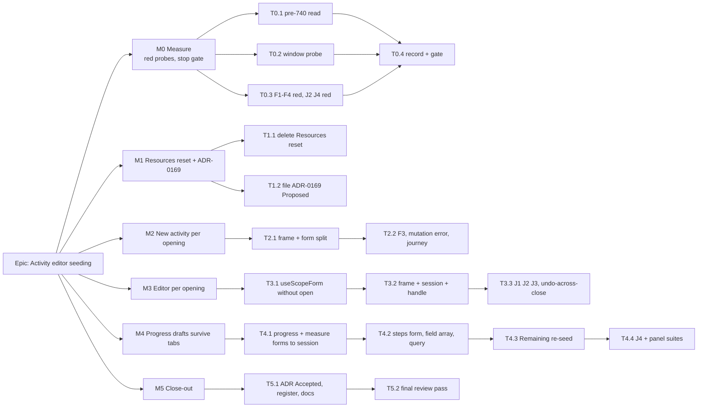

# Implementation Plan: Activity editor seeding — the editor's working state lives for one opening

- **Feature spec:** [`./feature-spec.md`](./feature-spec.md)
- **Status:** Draft — revised 2026-10-01 for CQ-1 (b), CQ-2 (b), CQ-3 (a); awaiting approval and NQ-1.
- **Owner:** web

This plan assumes NQ-1 (a): the `shell` hook-in is kept. §"If NQ-1 is (b)" says what changes.

## Breakdown

### Epic

**Activity editor seeding** — the activity editor and New activity create their working state per
opening; nothing typed is discarded by seeding or by a tab switch; every opening starts clean. Closes
`docs/TECH_DEBT.md` #420 and findings F1–F4. **Rough size: L** — six milestones, about eight to ten PRs,
most of the weight in M3 and M4.

---

### Milestone M0: Measure (no product change) — S

**Outcome:** the design's premises are observed or withdrawn before anything is built.
**Entry point:** `Ships dark: test files and m0-measurement.md only.`
**Journey:** J2 (F1) and J4 (F4) written **red** here and kept.

#### Feature: Reproduce, then decide

> **Complexity:** S · **Dependencies:** this revision approved.
> **Risks:** a probe that cannot discriminate → each must be red on `main`, with a positive control
> that passes, before it is kept.

##### Task T0.1 — Read the original site (D-7)

- `git show` the parent of #740's commit for `ProjectFormDialog.tsx` and `ClientFormDialog.tsx`; record
  each effect's dependencies and whether anything besides `open` could re-fire it. Complexity S.

##### Task T0.2 — The window probe (spec §4.7)

- **Description:** `createRoot`, `IS_REACT_ACT_ENVIRONMENT = false`, open inside `flushSync`, native
  `input` before yielding, one macrotask, assert DOM value and `getValues`. Hosts: editor (Name), New
  activity (Name), Progress tab click (% complete), Resources tab click (Budgeted units).
- **Complexity:** S. **Testing:** red ×4 on `main`, run three times each; positive control green.

##### Task T0.3 — F1–F4 red

- **Description:** units through `modalShell` with a host that toggles `open` and clears its intent on
  close (as `activity-crud-dialogs.tsx` does): F1 reopen-after-Discard, F2 "Saved." after reopen, F3
  hidden-field alert after reopen, F4 Progress draft after a tab switch. Journeys **J2** (F1, real top
  layer, screenshot) and **J4** (F4) in `apps/web/e2e-activity-editor/activity-editor.spec.ts`, run with
  `scripts/e2e-local.sh web:<suite>`.
- **Complexity:** S–M. **Risks:** jsdom has no top layer → the F1 unit asserts only that a confirmation
  is armed; J2 observes stacking.

##### Task T0.4 — Record and gate

- `docs/specs/activity-editor-seeding/m0-measurement.md`. **Stop gate:** if T0.2 is not red the spec
  returns to the product owner; any F-finding that does not reproduce is withdrawn from the spec and its
  tests are dropped, in the same commit.

---

### Milestone M1: Resources reset and the ADR — S

**Outcome:** typing the instant the Resources tab appears is kept.
**Entry point:** row menu **Actions for <activity> → Resources** (existing).
**Journey:** the Resources leg of J1 (open on Resources, `fill` Budgeted units at once, Assign, row
appears) — added in T1.1.
**Reviewers:** component-reviewer (a component's lifecycle behaviour); accessibility-reviewer is not
required here — no focus or keyboard path changes.

##### Task T1.1 — Delete `ActivityResourcesPanel`'s mount reset (CQ-3 (a))

- **Description:** remove the `[enabled, activityId]` effect (`ActivityResourcesPanel.tsx:216-228`); a
  one-line comment at `useForm` says why no seed effect exists (mounted per reveal; defaults are the
  seed). The post-assign reset stays.
- **Complexity:** S. **Testing:** T0.2's Resources probe green; `ActivityResourcesPanel*.test.tsx`
  unchanged; journey leg above.

##### Task T1.2 — File ADR-0169 `Proposed`

- From spec §4.9; one line in `CLAUDE.md` §16 (`check:adr-coverage`). Flip this spec and plan to
  `Approved` in the same commit — once an ADR cites the directory, `check:spec-status` S3 refuses `Draft`.
- **Complexity:** S.

---

### Milestone M2: New activity per opening — M

The smaller of the two rebuilds goes first: it proves the frame/inner/handle shape on one form host
before the editor uses it.

**Outcome:** typing the instant New activity opens is kept; no alert or error from a previous opening.
**Entry point:** **New activity** (activities panel) and Gantt row menu **Insert activity below**.
**Journey:** `addActivity` already fills at once in every suite; T2.2 adds **J5**: submit with an error
on a field the type hides → close (Discard) → reopen → no alert → create succeeds.
**Reviewers (mandatory before release, §19.13):** **component-reviewer** and **accessibility-reviewer**
— the Escape/backdrop/Cancel path now crosses a component boundary through a handle.

##### Task T2.1 — `ActivityCreateDialog` frame + `ActivityCreateForm`

- **Description:** frame keeps `Dialog`, `useCreateActivity`, `formRef` and the forwarder; the form
  holds the four forms (born with the seed, no `open`), `hiddenProblem`, `confirmingClose`, the report
  and its registration, `focusFirstProblem`, submit, and `submittedThisOpening`. Delete the
  `mutation.reset()` effect. Props unchanged.
- **Complexity:** M. **Dependencies:** M0.
- **Risks:** `useScopeForm` still has `open` until M3 → the form passes `open: true` constant for one
  milestone (documented), or T3.1 lands first; choose T3.1-first if M3 starts before M2 merges.
  `initialParentId` must seed at mount → covered by `ActivityCreateDialog.scope.test.tsx`.
- **Testing:** T0.2 create probe green; F3 green; all `ActivityCreateDialog.*` suites unchanged; a new
  test that a stale mutation error from the previous opening is not shown.

##### Task T2.2 — Journey J5 and axe on the reopened dialog

- **Complexity:** S. **Testing:** `scripts/e2e-local.sh web:<suite>` green three runs.

---

### Milestone M3: The editor per opening — L

**Outcome:** typing the instant the editor opens is kept; each opening starts clean; a save that
completes after close is still undoable.
**Entry point:** row menu **Actions for <activity> → Edit / Progress / Logic / Resources**, canvas
selection bar, toolbar **Update progress…** (existing).
**Journey:** **J1** (open → `fill` Name at once → Save general → cell), **J2** (red since M0 → green),
**J3** (save → close → open another → no "Saved."); axe on the reopened editor.
**Reviewers (mandatory before release, §19.13):** **accessibility-reviewer** (Escape, Close, the
confirmation's stacking and focus, focus on open/close unchanged) and **component-reviewer** (the
frame/session contract, the handle, `useScopeForm`'s signature); **ux-reviewer** (nothing a planner
relied on across openings is now cleared).

##### Task T3.1 — `useScopeForm` without `open`

- **Description:** seed at mount via `defaultValues`; the only effect re-seeds on a subject **change**
  (id differs from the seeded id), with `reset(…, { keepFieldsRef: true })`. Update `citedBy` in
  `scripts/dependency-claims.json` for `index.esm.mjs:3320-3327` to include `useScopeForm.ts`.
- **Complexity:** S. **Risks:** call sites still pass `open` → the type change makes each one a compile
  error, which is the inventory.
- **Testing:** `useScopeForm.test.ts` updated for the signature (the seed-on-open cases become
  seed-at-mount); a subject-change probe through the passthrough shell with an input dispatched in the
  window — green.

##### Task T3.2 — Frame + `ActivityEditorSession` + the close handle

- **Description:** spec §4.5. Frame: mutations (D-10), `sessionRef`, title/description from the
  incoming row, `shell({ requestClose: forward, … children: open ? <Session/> : null })`. Session: the
  rest of today's body, `useImperativeHandle(ref, () => ({ requestClose }))`, `useRegisterUnsavedWork`
  without the `open` ternary. Docblocks per D-5.
- **Complexity:** L. **Dependencies:** T3.1.
- **Risks:**
  - The undo record lost on close mid-save → mutations in the frame; unit with a deferred PATCH
    (US-5).
  - The subject-guard contract → `ActivityEditor.subject-guard.test.tsx` unchanged (it mounts with
    `open` true throughout and a passthrough shell).
  - A per-call callback calling a setter of an unmounted session → harmless no-op in React 19; asserted
    by the undo test running with the session gone.
  - Focus → the `<dialog>` stays in the frame; J2 and the axe pass check it; accessibility-reviewer
    drives it in a real browser.
- **Testing:** F1, F2 green; the editor probe green; every `ActivityEditorDialog.*` and `ActivityEditor.*`
  suite unchanged.

##### Task T3.3 — Journeys J1–J3, axe

- **Complexity:** S. **Testing:** local e2e three runs; CI read per CLAUDE.md §19.9.

---

### Milestone M4: Progress drafts survive tab switches — M–L

**Outcome:** a Progress, measure or steps draft survives visiting other tabs, is marked while away, and
saves; the editor never claims a draft that does not exist.
**Entry point:** row menu **Actions for <activity> → Progress**, toolbar **Update progress…**.
**Journey:** **J4** (red since M0 → green): % complete → General → Progress → value present → Save
progress → reopen → persisted; add a weighted step → away and back → row present → Save steps. Axe on
the Progress tab with a draft.
**Reviewers (mandatory before release, §19.13):** **accessibility-reviewer** (Steps heading focus,
row-move focus fall-through, `aria-live` roll-up, all now with a form owned elsewhere) and
**component-reviewer** (the panels' new presentational contract); **ux-reviewer**.

##### Task T4.1 — Progress and measure forms owned by the session

- **Description:** both panels take `form`; drop `open`, `onDirtyChange`, `useReportDirty` and the
  session's `progressDirty` state — the report and the tab marker read `isDirty` directly.
- **Complexity:** M. **Dependencies:** M3.
- **Testing:** F4 (progress/measure half) green; `ActivityEditor.unsaved-scopes.test.tsx` unchanged;
  `ActivityProgressPanels.error-presentation.test.tsx` rewritten through a small harness that supplies
  the form — reviewed as a contract change.

##### Task T4.2 — Steps form, field array and query in the session

- **Description:** spec §4.6: `useForm` + `useFieldArray` in the session; `useActivitySteps` enabled once
  Progress is visited (D-8); first data → `reset(…, { keepFieldsRef: true })`; later data only when
  clean (D-9). Panel keeps focus management and `autoFocusHeading`.
- **Complexity:** M. **Risks:** field-array keys survive the move → the existing move/remove focus
  tests in `WeightedStepsPanel.test.tsx`, rewritten through the harness, must keep every assertion.
- **Testing:** F4 (steps half) green; a D-9 test (refetch with changed data does not wipe a draft, does
  re-seed a clean form).

##### Task T4.3 — Remaining re-seed when the factor arrives

- **Description:** generalise `useDurationSeed`'s seed function so the same once-per-opening,
  value-compared hook seeds Remaining; Remaining is now seeded at open rather than at panel mount.
- **Complexity:** S. **Testing:** `use-duration-seed.test.ts` extended; a Remaining sub-day case.

##### Task T4.4 — Journey J4, axe

- **Complexity:** S.

---

### Milestone M5: Close-out — S

**Entry point:** `Ships dark: documentation only.`

##### Task T5.1 — ADR, register, docs, changesets

- ADR-0169 → `Accepted`; spec and plan → `Accepted — shipped (ADR-0169)`; close #420 with M0 evidence
  and per-site verdicts; file **F5**; patch changesets per behavioural milestone (D-2).

##### Task T5.2 — Final review pass and gates

- accessibility-reviewer and component-reviewer over the whole epic; `pnpm prepush`;
  `scripts/e2e-local.sh web:<activity-editor suite>`.

## Sequencing & slices

M0 → M1 → M2 → M3 → M4 → M5. Each milestone keeps `main` releasable and ships its own fix: M1 the
Resources window, M2 New activity, M3 the editor (F1, F2, the open window), M4 F4. **No flag**
(ADR-0088 D1); the rollback is the commit boundary. T3.1 may land before M2 to avoid the temporary
`open: true` in M2's form.

## If NQ-1 is (b) — retire the shell

M3 grows: `modalShell` is inlined, the four passthrough-shell suites are rewritten against the real
dialog, and the subject guard and its suite are removed with a written reason (no remaining path can
reach it). ADR-0169 gains a D7 recording the retirement. M3 → **XL**; consider splitting the retirement
into its own milestone after M4.

## Reviewers per milestone

| Milestone | Mandatory before release                                    | Also                         |
| --------- | ----------------------------------------------------------- | ---------------------------- |
| M0        | —                                                           | test-engineer (probe design) |
| M1        | component-reviewer                                          | —                            |
| M2        | **accessibility-reviewer**, **component-reviewer** (§19.13) | ux-reviewer                  |
| M3        | **accessibility-reviewer**, **component-reviewer** (§19.13) | ux-reviewer, test-engineer   |
| M4        | **accessibility-reviewer**, **component-reviewer** (§19.13) | ux-reviewer                  |
| M5        | accessibility-reviewer, component-reviewer (whole epic)     | —                            |

Not engaged: database-architect (no schema), security-reviewer and api-reviewer (no request, guard or
contract changes on the server), backend-performance-reviewer (no backend). performance-reviewer only
if M3's per-opening mount measures as a visible open delay.

## Definition of Done (per task)

The Feature Completion Criteria in [`docs/PROCESS.md`](../../PROCESS.md): code, tests **run**
(`pnpm prepush`; `scripts/e2e-local.sh web:<suite>` for journey changes), docs, security, performance,
accessibility, Docker build, CI read per CLAUDE.md §19.9, changeset, version impact (patch, `@repo/web`).

## Risks & assumptions (rollup)

| Risk / assumption                                                 | Likelihood | Impact | Mitigation                                                              |
| ----------------------------------------------------------------- | ---------- | ------ | ----------------------------------------------------------------------- |
| The window does not reproduce in the probe                        | low        | high   | M0 stop gate                                                            |
| An undo record is lost when the editor closes mid-save            | med        | high   | mutations in the frame (D-10); deferred-PATCH unit                      |
| Focus on open/close changes                                       | low        | high   | `<dialog>` stays in the frame; J2; accessibility-reviewer per milestone |
| ~20 editor/create suites need edits beyond the panel two          | med        | med    | props unchanged by design; any edit beyond the two is a review flag     |
| Steps field-array behaviour changes when moved                    | med        | med    | panel suite rewritten with every assertion kept                         |
| Remaining seeded at open shows whole days before the factor lands | med        | low    | T4.3 re-seed                                                            |
| D-9 narrows today's steps re-seed                                 | low        | low    | stated in ADR-0169; consistent with ADR-0108 D5                         |
| A react-dom or RHF bump breaks `check:claims`                     | med        | low    | intended — re-read, not re-pinned blind                                 |
