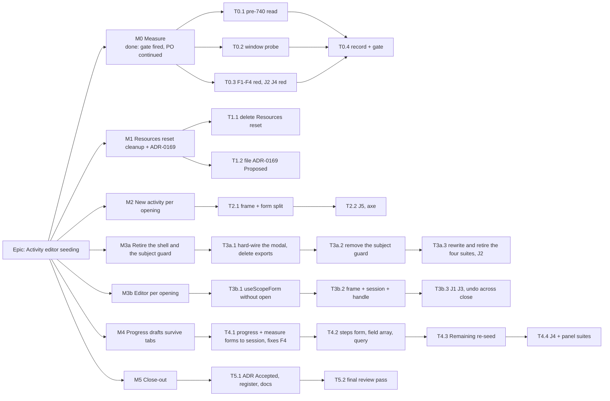

# Implementation Plan: Activity editor seeding — the editor's working state lives for one opening

- **Feature spec:** [`./feature-spec.md`](./feature-spec.md)
- **Status:** Approved — by the product owner, 2026-10-01 (flipped with ADR-0169's filing in M1, T1.2;
  `check:spec-status` S3).
- **Approval:** **approved to build by the product owner on 2026-10-01** (AskUserQuestion), with CQ-1 (b),
  CQ-2 (b), CQ-3 (a) and NQ-1 (b) (spec §1 "Open questions"). Starts **after the logic-aware levelling
  work** (`docs/specs/logic-aware-levelling`).
- **M0 correction (2026-10-01):** M0's stop gate fired (window red on the editor and New activity only;
  [`./m0-measurement.md`](./m0-measurement.md)). The product owner decided on **2026-10-01**
  (AskUserQuestion) to **continue** with the four answers unchanged and this plan corrected: M1 is a
  cleanup with no behaviour fix; M4 fixes F4, not a window; M2 and M3b keep the window fix for their
  hosts. Spec §0.4 is the record.
- **Owner:** web

## Breakdown

### Epic

**Activity editor seeding** — the activity editor is a hard-wired modal whose working state, like New
activity's, is created per opening; nothing typed is discarded by seeding or by a tab switch; every
opening starts clean. Closes `docs/TECH_DEBT.md` #420 and findings F1–F4. **Rough size: XL overall** —
seven milestones, about ten to twelve PRs; M3a, M3b and M4 carry the weight.

**Why M3 is split.** NQ-1 (b) adds a second, independent change to the editor — retiring the shell and
the subject guard — to the per-opening rebuild. Done together they are one XL diff in which a reviewer
cannot tell "deleted because the drawer is gone" from "moved because state is now per opening". Done in
order, M3a is a deletion on today's editor whose rendered output for every modal opening is unchanged
(and which removes F1's trigger by itself); M3b then moves state into a session in a component that no
longer has a shell or a guard to carry across the seam.

---

### Milestone M0: Measure (no product change) — S — **done, 2026-10-01**

**Outcome:** the design's premises are observed or withdrawn before anything is built.
**Result** ([`./m0-measurement.md`](./m0-measurement.md), spec §0.4): window **red** on the editor and New
activity, **not red** on the Progress and Resources tab reveal; F1–F4 reproduce in units; J2 and J4 fail
as intended in Chromium (`scripts/e2e-local.sh web:activity-editor`, run by the orchestrator in the M0
worktree: 13 passed, J2 and J4 expected failures). The stop gate fired; the product owner chose to
continue on 2026-10-01 with this plan corrected. The tab-reveal premise is withdrawn; nothing else is.
**Entry point:** `Ships dark: test files and m0-measurement.md only.`
**Journey:** J2 (F1) and J4 (F4) written **red** here and kept.
**Reviewers:** test-engineer (probe design).

> **Complexity:** S · **Dependencies:** logic-aware levelling done.
> **Risks:** a probe that cannot discriminate → each must be red on `main`, with a positive control
> that passes, before it is kept.

##### Task T0.1 — Read the original site (D-7)

- `git show` the parent of #740's commit for `ProjectFormDialog.tsx` and `ClientFormDialog.tsx`; record
  each effect's dependencies and whether anything besides `open` could re-fire it. Complexity S.

##### Task T0.2 — The window probe (spec §4.7)

- **Description:** `createRoot`, `IS_REACT_ACT_ENVIRONMENT = false`, open inside `flushSync`, native
  `input` before yielding, one macrotask, assert DOM value and `getValues`. Hosts: editor (Name), New
  activity (Name), Progress tab click (% complete), Resources tab click (Budgeted units).
- **Complexity:** S. **Testing:** red ×4 on `main`, three runs each; positive control green.

##### Task T0.3 — F1–F4 red

- **Description:** units with a host that toggles `open` and clears its intent on close (as
  `activity-crud-dialogs.tsx` does): F1 reopen-after-Discard, F2 "Saved." after reopen, F3 hidden-field
  alert after reopen, F4 Progress draft after a tab switch. Journeys **J2** (F1, real top layer,
  screenshot) and **J4** (F4) in `apps/web/e2e-activity-editor/activity-editor.spec.ts`, run with
  `scripts/e2e-local.sh web:<suite>`.
- **Complexity:** S–M. **Risks:** jsdom has no top layer → the F1 unit asserts only that a confirmation
  is armed; J2 observes stacking.

##### Task T0.4 — Record and gate

- `docs/specs/activity-editor-seeding/m0-measurement.md`. **Stop gate:** if T0.2 is not red the spec
  returns to the product owner; any F-finding that does not reproduce is withdrawn from the spec and its
  tests dropped, in the same commit.

---

### Milestone M1: Resources reset cleanup and the ADR — S

**Outcome:** `ActivityResourcesPanel` loses a redundant reset-to-its-own-defaults; **no behaviour
changes** — a cleanup, not a fix. M0 found typing the instant the Resources tab appears already kept
(the probe held `12`), so there is nothing for this milestone to turn green.
**Entry point:** `Ships dark: no user-visible change` (internal cleanup and an ADR). The panel's
existing entry point, row menu **Actions for <activity> → Resources**, is unchanged.
**Journey:** none new; the existing `activity-editor.spec.ts` journeys pass unchanged. (The "Resources
leg of J1" is dropped: it would guard a window M0 found absent; the plain-`it` probe already guards it.)
**Reviewers:** component-reviewer. accessibility-reviewer not required — no focus or keyboard path
changes.
**Changeset:** none for T1.1 (D-2 covers milestones that change behaviour; this one does not).

##### Task T1.1 — Delete `ActivityResourcesPanel`'s mount reset (CQ-3 (a))

- **Description:** remove the `[enabled, activityId]` effect (`ActivityResourcesPanel.tsx:216-228`); a
  one-line comment at `useForm` says why no seed effect exists. The post-assign reset stays.
- **Complexity:** S. **Testing:** M0's Resources probe (plain `it`, green at M0) **stays green** — the
  evidence that removing the reset changed nothing; `ActivityResourcesPanel*.test.tsx` unchanged.
- **Risks:** the effect turns out not to be redundant (some path changes `activityId` while mounted) →
  re-read `:207-213` against `:218-224` and both hosts' mount conditions before deleting; the unchanged
  suites are the check.

##### Task T1.2 — File ADR-0169 `Proposed`; flip spec and plan to `Approved`

- From spec §4.9 (including D5, the shell's retirement); one line in `CLAUDE.md` §16
  (`check:adr-coverage`). The status lines become `Approved — by the product owner, 2026-10-01 …` in the
  same commit, because an ADR citing this directory makes `check:spec-status` S3 refuse `Draft`.
- **Complexity:** S.

---

### Milestone M2: New activity per opening — M

The smaller rebuild goes first: it proves the frame / inner form / handle shape on one host.

**Outcome:** typing the instant New activity opens is kept; no alert or error from a previous opening.
**Entry point:** **New activity** (activities panel) and Gantt row menu **Insert activity below**.
**Journey:** `addActivity` already fills at once in every suite; **J5**: submit with an error on a field
the type hides → Cancel → Discard → reopen → no alert → create succeeds. Axe on the reopened dialog.
**Reviewers (mandatory before release, §19.13):** **accessibility-reviewer**, **component-reviewer**;
also ux-reviewer.

##### Task T2.1 — `ActivityCreateDialog` frame + `ActivityCreateForm`

- **Description:** frame keeps `Dialog`, `useCreateActivity`, `formRef` and the forwarder; the form
  holds the four forms (born with the seed), `hiddenProblem`, `confirmingClose`, the report and its
  registration, `focusFirstProblem`, submit, and `submittedThisOpening`. Delete the `mutation.reset()`
  effect. Props unchanged.
- **Complexity:** M.
- **Risks:** `useScopeForm` still takes `open` until M3b → land T3b.1 first if M3b's start allows;
  otherwise the form passes a constant `true` for one milestone, documented. `initialParentId` must seed
  at mount → `ActivityCreateDialog.scope.test.tsx`.
- **Testing:** T0.2 create probe (red at M0, `it.fails`, both the flushSync and click cases) flips to
  `it` and is green; F3 green; all `ActivityCreateDialog.*` suites unchanged; a test
  that a previous opening's mutation error is not shown.

##### Task T2.2 — Journey J5, axe

- **Complexity:** S. **Testing:** `scripts/e2e-local.sh web:<suite>` green three runs.

---

### Milestone M3a: Retire the shell and the subject guard — M–L

On today's mounted-once editor, before any state moves.

**Outcome:** the editor is a hard-wired modal; a Discard no longer arms a confirmation for the next
opening (F1). Nothing else a planner sees changes.
**Entry point:** row menu **Actions for <activity> → Edit / Progress / Logic / Resources**, canvas
selection bar, toolbar **Update progress…** (existing).
**Journey:** **J2** turns green (`test.fail()` since M0, confirmed failing in Chromium); the existing `activity-editor.spec.ts` journeys pass
unchanged; axe on the reopened editor.
**Reviewers (mandatory before release, §19.13):** **accessibility-reviewer** (the only chrome is now the
modal: Escape, both Close buttons, the confirmation's copy and labels, the rail-or-strip choice now by
viewport alone) and **component-reviewer** (exports removed, props removed, four suites rewritten or
retired); also ux-reviewer (the confirmation's "Keep editing" / "Switching to …" copy disappears).

##### Task T3a.1 — Hard-wire the modal; delete the shell and its exports

- **Description:** `ActivityEditorDialog` renders `Dialog` with `modalShell`'s exact props
  (`ActivityEditorDialog.tsx:1075-1084`); delete `ActivityEditorShell`, `modalShell`, the `shell` prop,
  `tabRailAllowed`, and the `ActivityEditor` export (`features/activities/index.ts:38-41`);
  `PlanActivityEditor` (`activity-crud-dialogs.tsx:64-78`) uses `ActivityEditorDialog`; docblocks per
  D-5.
- **Complexity:** M. **Risks:** a missed import → the compiler is the inventory (D-11).
- **Testing:** every `ActivityEditorDialog.*` suite unchanged.

##### Task T3a.2 — Remove the subject guard

- **Description:** delete `seededId` and the render-phase adopt/hold (`:280-284`, `:488-495`), the
  `'subject'` branch of `confirming` and of the confirmation (`:1003-1027`), and `onSubjectHeld` (prop
  and `activity-crud-dialogs.tsx:186-198`). The editor edits the row it is given.
- **Complexity:** S–M. **Risks:** a stale-row read now that `activity` is the prop directly → none: the
  prop is the live row today too (`activity-crud-dialogs.tsx:92-94`); version-at-submit is unchanged.
- **Testing:** F1 unit green.

##### Task T3a.3 — The four no-chrome suites

- **Description:** `ActivityEditor.registers-unsaved-work.test.tsx` and
  `ActivityEditor.unsaved-scopes.test.tsx` → mount `ActivityEditorDialog`, every assertion kept;
  `ActivityEditor.drawer-chrome.test.tsx` → deleted (any viewport-rail assertion moves to an
  `ActivityEditorDialog` suite); `ActivityEditor.subject-guard.test.tsx` → deleted. J2 green.
- **Complexity:** M. **Risks:** an assertion silently dropped in a rewrite → component-reviewer diffs
  the assertion lists before and after; the PR description lists every dropped assertion with its reason.

---

### Milestone M3b: The editor per opening — L

**Outcome:** typing the instant the editor opens is kept; each opening starts clean (F2); a save that
completes after close is still undoable.
**Entry point:** as M3a.
**Journey:** **J1** (open → `fill` Name at once → Save general → cell) and **J3** (save → close → open
another → no "Saved."); axe on the reopened editor.
**Reviewers (mandatory before release, §19.13):** **accessibility-reviewer** (focus on open and close
with the session mounting and unmounting; Escape through the handle) and **component-reviewer** (the
frame/session contract, the handle, `useScopeForm`'s signature); also ux-reviewer and test-engineer.

##### Task T3b.1 — `useScopeForm` without `open` and without effects

- **Description:** seed at mount via `defaultValues`; no effect (spec §4.5). Docblock rewritten (trap 2
  is now structural).
- **Complexity:** S. **Risks:** call sites still pass `open` → the type change makes each a compile error.
- **Testing:** `useScopeForm.test.ts` updated for the signature (seed-on-open cases become
  seed-at-mount).

##### Task T3b.2 — Frame + `ActivityEditorSession` + the close handle

- **Description:** spec §4.5. Frame: the three mutations (D-10), `sessionRef`, title from the row, the
  `Dialog` with the forwarder, children `open && activity ? <ActivityEditorSession key={activity.id} …/>
: null`. Session: the rest of the body, `useImperativeHandle(ref, () => ({ requestClose }))`,
  `useRegisterUnsavedWork` without the `open` ternary. One test pins the keyed-session rule.
- **Complexity:** L. **Dependencies:** M3a, T3b.1.
- **Risks:**
  - The undo record lost on close mid-save → mutations in the frame; unit with a deferred PATCH (US-5).
  - A per-call callback calling a setter of an unmounted session → harmless in React 19; asserted by
    the undo test with the session gone.
  - Focus → the `<dialog>` stays in the frame; J1–J3 and axe; accessibility-reviewer drives it in a
    real browser.
- **Testing:** F2 green; the editor probe (red at M0, flushSync and click cases) flips from `it.fails`
  to `it` and is green; every `ActivityEditorDialog.*` suite and the two
  rewritten in M3a unchanged.

##### Task T3b.3 — Journeys J1, J3; axe

- **Complexity:** S. **Testing:** local e2e three runs; CI read per CLAUDE.md §19.9.

---

### Milestone M4: Progress drafts survive tab switches — M–L

**Outcome:** a Progress, measure or steps draft survives visiting other tabs, is marked while away, and
saves; the editor never claims a draft that does not exist. **This fixes F4** (reproduced at M0 in a
unit and in J4). It does **not** close a typed-input window on tab reveal — M0 found none there; the
Progress probe is green before this milestone and must stay green after it.
**Entry point:** row menu **Actions for <activity> → Progress**, toolbar **Update progress…**.
**Journey:** **J4** (`test.fail()` since M0, confirmed failing in Chromium → green); axe on the Progress
tab with a draft.
**Reviewers (mandatory before release, §19.13):** **accessibility-reviewer** (Steps heading focus,
row-move focus fall-through, the `aria-live` roll-up, all with a form owned elsewhere) and
**component-reviewer** (the panels' presentational contract); also ux-reviewer.

##### Task T4.1 — Progress and measure forms owned by the session

- **Description:** both panels take `form`; drop `open`, `onDirtyChange`, `useReportDirty` and
  `progressDirty` — the report and the tab marker read `isDirty` directly.
- **Complexity:** M. **Dependencies:** M3b.
- **Testing:** F4 (progress/measure half) green; M0's Progress probe (plain `it`) still green — the
  moved form opens no window; `ActivityEditor.unsaved-scopes.test.tsx` (as rewritten
  in M3a) unchanged; `ActivityProgressPanels.error-presentation.test.tsx` rewritten through a harness.

##### Task T4.2 — Steps form, field array and query in the session

- **Description:** spec §4.6: `useForm` + `useFieldArray` in the session; `useActivitySteps` enabled once
  Progress is visited (D-8); first data → `reset(…, { keepFieldsRef: true })`; later data only when
  clean (D-9). The panel keeps focus management and `autoFocusHeading`. Add the session's file to
  `citedBy` for `index.esm.mjs:3320-3327` in `scripts/dependency-claims.json` if its comment cites it.
- **Complexity:** M. **Risks:** field-array keys after the move → `WeightedStepsPanel.test.tsx`,
  rewritten through the harness, keeps every assertion.
- **Testing:** F4 (steps half) green; a D-9 test.

##### Task T4.3 — Remaining re-seed when the factor arrives

- **Description:** generalise `useDurationSeed`'s seed function so the same hook seeds Remaining.
- **Complexity:** S. **Testing:** `use-duration-seed.test.ts` extended; a sub-day Remaining case.

##### Task T4.4 — Journey J4, axe

- **Complexity:** S.

---

### Milestone M5: Close-out — S

**Entry point:** `Ships dark: documentation only.`
**Reviewers:** accessibility-reviewer and component-reviewer over the whole epic.

##### Task T5.1 — ADR, register, docs, changesets

- ADR-0169 → `Accepted`; spec and plan → `Accepted — shipped (ADR-0169)`; close #420 with M0 evidence
  and per-site verdicts; file **F5**; patch changesets per behavioural milestone (D-2).

##### Task T5.2 — Final review pass and gates

- `pnpm prepush`; `scripts/e2e-local.sh web:<activity-editor suite>`.

## Sequencing & slices

After logic-aware levelling: M0 (done) → M1 → M2 → M3a → M3b → M4 → M5. Each milestone keeps `main`
releasable: M1 is a cleanup plus the ADR (no behaviour change), M2 fixes New activity's window and F3,
M3a F1 and the shell, M3b the editor's window and F2, M4 F4. **No flag** (ADR-0088 D1); the rollback is the commit boundary. T3b.1 may land
ahead of M2 to spare M2's temporary `open: true`.

## Reviewers per milestone

| Milestone | Mandatory before release (§19.13)                  | Also                         |
| --------- | -------------------------------------------------- | ---------------------------- |
| M0        | —                                                  | test-engineer (probe design) |
| M1        | component-reviewer                                 | —                            |
| M2        | **accessibility-reviewer**, **component-reviewer** | ux-reviewer                  |
| M3a       | **accessibility-reviewer**, **component-reviewer** | ux-reviewer                  |
| M3b       | **accessibility-reviewer**, **component-reviewer** | ux-reviewer, test-engineer   |
| M4        | **accessibility-reviewer**, **component-reviewer** | ux-reviewer                  |
| M5        | accessibility-reviewer, component-reviewer (epic)  | —                            |

Not engaged: database-architect (no schema), security-reviewer and api-reviewer (no server change),
backend-performance-reviewer (no backend). performance-reviewer only if M3b's per-opening mount
measures as a visible open delay.

## Definition of Done (per task)

The Feature Completion Criteria in [`docs/PROCESS.md`](../../PROCESS.md): code, tests **run**
(`pnpm prepush`; `scripts/e2e-local.sh web:<suite>` for journey changes), docs, security, performance,
accessibility, Docker build, CI read per CLAUDE.md §19.9, changeset, version impact (patch, `@repo/web`).

## Risks & assumptions (rollup)

| Risk / assumption                                                          | Likelihood | Impact | Mitigation                                                                               |
| -------------------------------------------------------------------------- | ---------- | ------ | ---------------------------------------------------------------------------------------- |
| The window does not reproduce in the probe                                 | occurred   | high   | M0 stop gate fired for the tab reveals only; premise withdrawn, PO continued (spec §0.4) |
| The editor/create window is real in jsdom but never reached by a driver    | unknown    | low    | the fix is justified by construction and by F1–F3; J1 is a guard, not the proof          |
| Moving Progress forms into the session opens a window M0 found absent      | low        | med    | M0's Progress probe kept as plain `it`; must stay green in M4                            |
| An undo record is lost when the editor closes mid-save                     | med        | high   | mutations in the frame (D-10); deferred-PATCH unit                                       |
| Focus on open/close changes                                                | low        | high   | `<dialog>` stays in the frame; J1–J3; accessibility-reviewer per milestone               |
| An assertion is silently dropped while rewriting the four no-chrome suites | med        | med    | before/after assertion lists diffed by component-reviewer; drops justified               |
| Removing the guard loses a draft if a future host changes the subject      | low        | med    | session keyed by id (no mixing); ADR-0169 D5 obliges such a host to design a guard       |
| A missed caller of a deleted export                                        | low        | low    | compile errors are the inventory (D-11)                                                  |
| Steps field-array behaviour changes when moved                             | med        | med    | panel suite rewritten with every assertion kept                                          |
| Remaining seeded at open shows whole days before the factor lands          | med        | low    | T4.3 re-seed                                                                             |
| D-9 narrows today's steps re-seed                                          | low        | low    | stated in ADR-0169; consistent with ADR-0108 D5                                          |
| A react-dom or RHF bump breaks `check:claims`                              | med        | low    | intended — re-read, not re-pinned blind                                                  |
