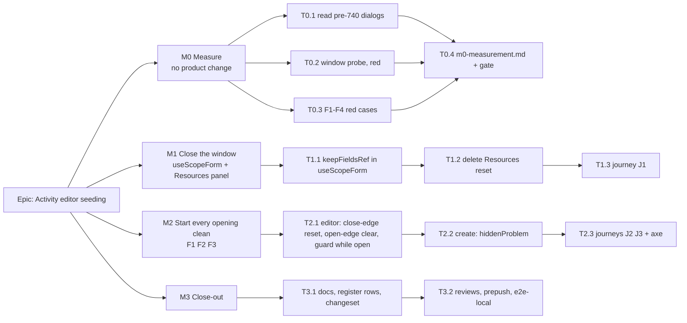

# Implementation Plan: Activity editor seeding — the last three #420 sites

- **Feature spec:** [`./feature-spec.md`](./feature-spec.md)
- **Status:** Draft — awaiting the product owner's answers to CQ-1 to CQ-3.
- **Owner:** web

This plan assumes the recommended answers: **CQ-1 (a)** fix the hook, then the carried-over state point by
point; **CQ-2 (a)** Progress-tab draft loss (F4) filed separately; **CQ-3 (a)** delete the Resources
panel's redundant reset. §"If the answers differ" says what changes.

## Breakdown

### Epic

**Activity editor seeding** — the activity editor, **New activity** and the editor's Progress and
Resources tabs never discard typed input, and every opening starts clean. Closes `docs/TECH_DEBT.md` #420.

---

### Milestone M0: Measure (no product change)

**Outcome:** the four claims the design rests on are reproduced or withdrawn before anything is built.
**Entry point:** `Ships dark: measurement only — test files and m0-measurement.md; nothing a user reaches changes.`
**Journey:** J2 is written here **red** (F1) and kept; it turns green in M2.

#### Feature: Reproduce, then decide

> **Description:** turn spec §0.1 and §0.3 from "read" into "observed", or withdraw them.
> **Complexity:** S
> **Dependencies:** spec approved.
> **Risks:** a probe that cannot discriminate (passes on today's code) → each is required to be red on
> `main` before it is kept, and the run that showed red is recorded.
> **Testing requirements:** the probes ARE the tests; they stay in the tree.

##### Task T0.1 — Read the original site's effect (D-7)

- **Description:** `git show` the parent of PR #740's commit for `ProjectFormDialog.tsx` and
  `ClientFormDialog.tsx`; record each `useEffect`'s dependency list and whether anything other than
  `open` could re-fire it while open.
- **Complexity:** S · **Dependencies:** none · **Risks:** none.
- **Testing:** none — a reading, recorded verbatim with the SHA.
- **Development steps:**
  1. `git log --oneline -- apps/web/src/features/projects/components/ProjectFormDialog.tsx`; find #740.
  2. `git show <sha>^:<path>` for both files; copy the effects into `m0-measurement.md`.
  3. State whether §0.1's window alone explains the csp trace, or a late trigger existed too.

##### Task T0.2 — The window probe (red on `main`)

- **Description:** spec §4.6. `apps/web/src/features/activities/components/useScopeForm.window.test.tsx`
  and a sibling for `ActivityResourcesPanel`: `createRoot`, `IS_REACT_ACT_ENVIRONMENT = false`, open
  inside `flushSync`, dispatch a native `input` event before yielding, yield one macrotask, assert DOM
  value **and** `getValues`.
- **Complexity:** S · **Dependencies:** none.
- **Risks:** jsdom's scheduler path differs from Chrome's (no input-priority reordering) → the probe
  does not need reordering: it dispatches the event deterministically inside the window, which is the
  point. Run it three times to show it is not timing-dependent.
- **Testing:** must be **red** on `useScopeForm` (minimal host), `ActivityCreateDialog` and
  `ActivityResourcesPanel` at mount; record the failure output.
- **Development steps:**
  1. Minimal host component around `useScopeForm` with a toggled `open`.
  2. The same probe against `ActivityCreateDialog` (Name) and `ActivityResourcesPanel` (Budgeted units).
  3. A positive control: the same probe with the input dispatched **after** the yield must pass today
     (proves the probe measures the window, not the field).

##### Task T0.3 — F1 to F4, red

- **Description:** one red test per finding, mounting through the real `modalShell` with a host that
  toggles `open` and clears its intent on close, the way `activity-crud-dialogs.tsx` does.
- **Complexity:** S–M · **Dependencies:** none.
- **Risks:** jsdom has no top layer, so F1's stacking is unobservable there → the unit test asserts
  only that `confirming` is armed on reopen (an `alertdialog` in the tree); J2 (journey) observes the
  real stacking.
- **Testing:**
  - F1 unit: dirty → Close → Discard → reopen same id → expect no `alertdialog`.
  - F1 journey **J2** in `apps/web/e2e-activity-editor/activity-editor.spec.ts`: dirty → Escape →
    Discard → `openEditor(… 'Edit')` → expect no visible `alertdialog` → edit Name → Escape → the
    confirmation is visible and **Discard** closes the editor. Run via `scripts/e2e-local.sh`; screenshot
    the reopened state into `m0-measurement.md`.
  - F2 unit: save General → close → open another activity → expect no "Saved.".
  - F3 unit: hidden-field submit failure → close → open → expect no alert.
  - F4 unit (record only, CQ-2 (a)): dirty `% complete` → switch to General → back to Progress → the
    typed value is gone while the tab carried a dot. Marked `it.fails` or kept out of the suite per the
    product owner's CQ-2 answer; it seeds the new register row.

##### Task T0.4 — Record and decide

- **Description:** `docs/specs/activity-editor-seeding/m0-measurement.md`: each claim, the command, red/
  green, verdict. **Gate:** any finding that does not reproduce is withdrawn from the spec in the same
  commit, and its M2 task is dropped. If T0.2 does not go red, M1 stops and the spec returns to the
  product owner — the design's premise would be wrong.
- **Complexity:** S · **Dependencies:** T0.1–T0.3.

---

### Milestone M1: Close the window

**Outcome:** text typed the instant the editor, **New activity**, the Progress tab or the Resources tab
appears is kept.
**Entry point:** the existing ones — row menu **Actions for <activity> → Edit / Progress / Resources**,
and **New activity**. No new control.
**Journey:** J1 in `apps/web/e2e-activity-editor/activity-editor.spec.ts`.

#### Feature: `keepFieldsRef` at the one shared seam

> **Description:** spec §4.5 items 1 (open edge) and 4.
> **Complexity:** S
> **Dependencies:** M0 gate passed.
> **Risks:** `keepFieldsRef` is a less-travelled RHF path → the edge-case tests below; the dependency
> claims are already registered (`scripts/dependency-claims.json`), so an RHF bump forces a re-read.
> **Testing requirements:** T0.2 probes green; every existing suite under
> `apps/web/src/features/activities/components/` and `apps/web/src/features/resources/components/`
> passes **unchanged**.

##### Task T1.1 — `useScopeForm` resets with `keepFieldsRef`

- **Description:** `reset(seed(activity), { keepFieldsRef: true })`; keys unchanged (trap 2). Rewrite
  the effect comment to say why the option is load-bearing, citing the registered claims.
- **Complexity:** S · **Dependencies:** T0.4.
- **Risks:** a tab never visited in the previous opening shows a stale value → test: open A, visit
  General only, close, open B, visit Scheduling and Cost → B's values. A 409 **Refresh this section**
  regression → existing test plus one on a tab revisited after refresh. Duration re-seed ordering
  (`use-duration-seed.ts` records its baseline after the reset in the same flush) → its existing suite.
- **Testing:** probe green; `useScopeForm.test.ts`; all `ActivityEditorDialog.*`, `ActivityEditor.*`,
  `ActivityCreateDialog.*` suites unchanged; the new unvisited-tab test.
- **Development steps:**
  1. Change the call; update the docblock and the effect comment.
  2. Add the unvisited-tab and refresh-then-revisit tests.
  3. Update `citedBy` in `scripts/dependency-claims.json` to include `useScopeForm.ts`.

##### Task T1.2 — Delete `ActivityResourcesPanel`'s mount reset (CQ-3 (a))

- **Description:** remove the `[enabled, activityId]` effect (`ActivityResourcesPanel.tsx:216-228`) and
  its now-unused bindings; say in a one-line comment at the `useForm` call why there is no seed effect
  (the panel mounts per reveal; defaults are the seed).
- **Complexity:** S · **Dependencies:** none (independent of T1.1).
- **Risks:** a host that mounts the panel with `enabled={false}` and flips it later would lose the
  reset → none exists (spec §0.2, both hosts); a structural test asserts the panel is only rendered
  where it is shown, or the docblock records the assumption.
- **Testing:** the T0.2 sibling probe green; `ActivityResourcesPanel*.test.tsx` unchanged.

##### Task T1.3 — Journey J1

- **Description:** open via the row menu and `fill` Name with no intervening wait; **Save general**;
  assert the table cell. Same for **New activity** is already `addActivity` in every suite — note that
  in the test's comment rather than duplicating it.
- **Complexity:** S · **Dependencies:** T1.1.
- **Risks:** read as proof → its comment says it is a regression guard; the probe is the proof.
- **Testing:** `scripts/e2e-local.sh web:<activity-editor suite>` green locally before push.

---

### Milestone M2: Start every opening clean

**Outcome:** after a **Discard**, a save or a failed create, the next opening shows no confirmation, no
"Saved.", no stale error, no stale alert.
**Entry point:** the same row menu **Edit** and **New activity**.
**Journey:** J2 (red since M0) and J3, in `apps/web/e2e-activity-editor/activity-editor.spec.ts`, plus an
axe pass on the reopened editor.

#### Feature: per-opening state is cleared at the opening

> **Description:** spec §4.5 items 1 (close edge), 2 and 3.
> **Complexity:** S–M
> **Dependencies:** M1.
> **Risks:** the subject-guard contract → `ActivityEditor.subject-guard.test.tsx` must pass unchanged
> (it mounts with `open` fixed true, so gating the guard on `open` is invisible to it); a render-phase
> state adjustment loop → the `seenIntent` precedent compares against a held previous value, so it
> settles in one extra render.
> **Testing requirements:** T0.3's F1–F3 tests green; J2 and J3 green; axe clean.

##### Task T2.1 — Editor: close-edge reset, open-edge clear, guard only while open

- **Description:** `useScopeForm` also resets on the close edge; `ActivityEditor` holds `seenOpen` and,
  on the false→true edge, clears `confirming`, `savedScope`, `saveError`; the subject guard runs only
  while `open` and adopts silently otherwise.
- **Complexity:** M · **Dependencies:** T1.1.
- **Risks:** clearing `confirming` on open could swallow a legitimate confirmation → none can exist at
  the open edge (a confirmation needs an open editor); the F1 unit test plus the existing
  `asks before discarding` tests cover both directions.
- **Testing:** F1 and F2 units green; every editor suite unchanged.

##### Task T2.2 — Create: clear `hiddenProblem` at the opening

- **Description:** same render-phase pattern in `ActivityCreateDialog`.
- **Complexity:** S · **Dependencies:** none.
- **Testing:** F3 unit green; `ActivityCreateDialog.*` unchanged.

##### Task T2.3 — Journeys J2, J3, axe

- **Description:** J2 (M0) turns green; add J3 (save → close → open another → no "Saved."); an axe
  `wcag2a/wcag2aa` pass on the reopened editor.
- **Complexity:** S · **Dependencies:** T2.1.
- **Testing:** `scripts/e2e-local.sh web:<activity-editor suite>` green, three consecutive local runs.

---

### Milestone M3: Close-out

**Outcome:** the register says what is true. **Entry point:** `Ships dark: documentation only.`
**Journey:** none new.

##### Task T3.1 — Docs, register, changeset

- **Description:** D-5 docblocks; close #420 with the M0 evidence and this spec's per-site verdicts
  (item 2 closed unchanged, item 3 deleted); new rows for **F4** (Progress drafts lost on tab switch,
  trigger: next change to `ActivityProgressPanels` or a report) and **F5** (post-save reset wipes text
  typed during the save); patch changeset for `@repo/web`; flip this spec and plan to
  `Accepted — shipped` only if an ADR is filed (none is planned — leave `Approved` per
  `check:spec-status`).
- **Complexity:** S · **Dependencies:** M1, M2.

##### Task T3.2 — Reviews and gates

- **Description:** run the reviewers below; fold blocking findings; `pnpm prepush`;
  `scripts/e2e-local.sh web:<activity-editor suite>`.
- **Complexity:** S · **Dependencies:** T3.1.

## Sequencing & slices

M0 → M1 → M2 → M3, each a separate PR (or a commit-per-task series) that keeps `main` releasable: M1
and M2 are each complete fixes on their own, and M2 does not depend on M1's journey. **No flag**
(ADR-0088 D1); the rollback is the commit boundary. T1.2 and T2.2 are independent and can land in
either order.

## If the answers differ

- **CQ-1 (b) — rebuild per opening.** M1 keeps T1.1 (the subject-change path still needs it) and T1.2;
  M2 becomes: T2.1 split `ActivityEditor` into frame + `ActivityEditorSession` with the
  `useImperativeHandle` close seam (spec §4.5); T2.2 `ActivityCreateDialog` to the #749 inner-form shape
  with the same seam; T2.3 unchanged. Complexity M2 → **L**. Add a `docs/DECISIONS.md` entry.
  **accessibility-reviewer and component-reviewer become mandatory before release** (CLAUDE.md §19.13):
  the close path's ownership moves across a component boundary.
- **CQ-1 (c) — close without change.** Only M0 and M3 run; M3 files F1–F3 as rows with M0's evidence.
- **CQ-2 (b) — fold in F4.** Add **M2b**: design pass (ui-architect) on keeping the three panels
  mounted-but-hidden vs lifting their forms to the editor, then build; complexity **M–L**; its own
  journey (dirty % → switch tab → back → value present → save).
- **CQ-2 (c) — stop claiming the lost work.** Add one task to M2: `useReportDirty` reports `false` on
  unmount; a test that the dot and the confirmation clear after a tab switch.
- **CQ-3 (b) — keep the Resources reset.** Drop T1.2; record the verdict in T3.1.

## Reviewers

| When     | Agent                                                              | Why                                                                                  |
| -------- | ------------------------------------------------------------------ | ------------------------------------------------------------------------------------ |
| M0       | **test-engineer**                                                  | the window probe's design and its positive control                                   |
| M1       | **component-reviewer**                                             | a shared hook's reset semantics change for four hosts                                |
| M2       | **accessibility-reviewer**                                         | F1 changes which dialog is open on reopen and where Escape lands; J2 is the evidence |
| M2       | **ux-reviewer**                                                    | "every opening starts clean" — confirm no state a planner relied on is now cleared   |
| (b) only | **component-reviewer** + **accessibility-reviewer** before release | §19.13 — the close path crosses a component boundary                                 |

Not engaged, and why: **database-architect** (no schema), **security-reviewer** / **api-reviewer** (no
request, guard or contract changes), **backend-performance-reviewer** (no backend), **performance-reviewer**
(no bundle or render-cost change of note).

## Definition of Done (per task)

Each task's PR satisfies the Feature Completion Criteria in [`docs/PROCESS.md`](../../PROCESS.md):
code, tests (run, not merely present — `pnpm prepush`, plus `scripts/e2e-local.sh web:<suite>` for the
journey cases), docs, security, performance, accessibility, Docker build, CI read per CLAUDE.md §19.9,
changeset, version impact (patch, `@repo/web`).

## Risks & assumptions (rollup)

| Risk / assumption                                            | Likelihood | Impact | Mitigation                                                                           |
| ------------------------------------------------------------ | ---------- | ------ | ------------------------------------------------------------------------------------ |
| §0.1's window does not reproduce in the probe                | low        | high   | M0 gate stops the plan and returns to the product owner                              |
| `keepFieldsRef` mis-seeds a field not mounted at reset time  | low        | med    | unvisited-tab test (T1.1); registered dependency claims force a re-read on RHF bumps |
| F1's stacking is not what reading predicts                   | med        | low    | J2 observes it; the fix (no stale confirmation) is right whichever way it stacks     |
| Gating the subject guard on `open` changes a tested contract | low        | med    | the guard's suite mounts with `open` true throughout; it must pass unchanged         |
| The journey J1 is read as proof of a race's absence          | med        | low    | its comment names the probe as the proof                                             |
| A react-dom or RHF bump breaks `check:claims`                | med        | low    | intended — the six registered claims are re-read, not re-pinned blind                |
| The original csp site had a different cause (D-7)            | med        | low    | recorded in M0; the editor's verdict does not depend on it                           |
