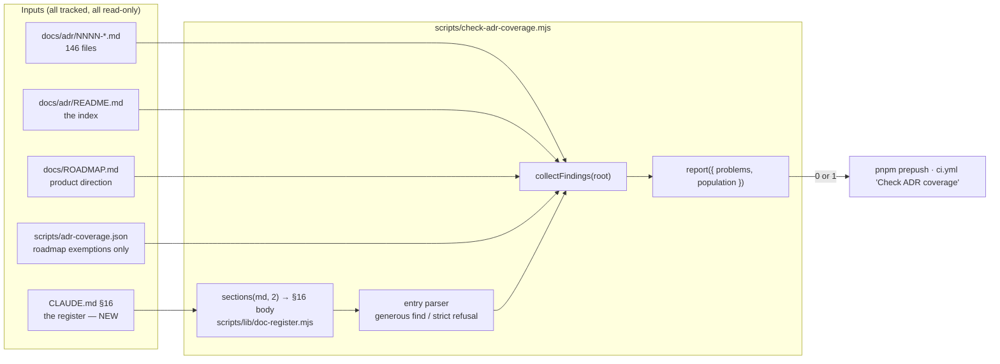
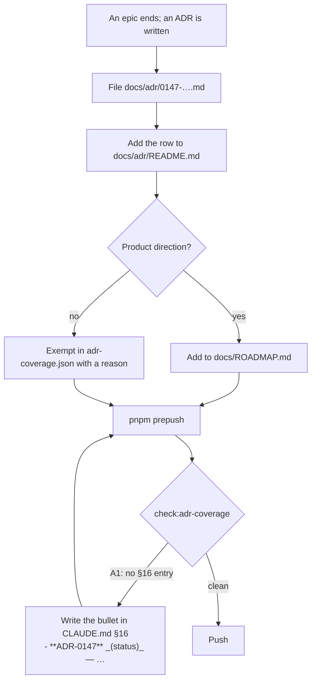

# Feature Spec: The ADR register in `CLAUDE.md` §16 is gated, not remembered

- **Status:** Accepted — shipped (ADR-0147)
- **Author(s):** feature-analyst (Product Owner / Solution Architect / Technical Lead hats)
- **Date:** 2026-09-19
- **Tracking issue / epic:** _(to be assigned)_
- **Roadmap link:** none — this is a process/tooling decision about how the repository works on
  itself, the class `scripts/adr-coverage.json` already exempts from `docs/ROADMAP.md` by written
  reason. See §4.7 CQ-2.
- **Related ADR(s):** proposes a short ADR **extending ADR-0110 D6** ("the ADR index is gated, not
  remembered") to the register in `CLAUDE.md` §16. Builds on ADR-0058 (measure before arming),
  ADR-0093 (a pinned positive case), ADR-0110 D5 (verified red against a named mutation), ADR-0120
  (exit convention; report-only → sweep → arm), ADR-0124 D1/D2 (finding is generous, refusing is
  strict; every generous reader owes a control measuring a different quantity), ADR-0131 (a gate
  with no journey, and the C0 fixture trap). Cites ADR-0105 (why this is a full spec).

---

## 1. Business understanding

### Problem

An ADR can be **Accepted, filed in `docs/adr/`, listed in `docs/adr/README.md` (gated) and cited by
`docs/ROADMAP.md` (gated) — and appear zero times in `CLAUDE.md` §16 — with `pnpm prepush` green.**
`scripts/check-adr-coverage.mjs` reads `docs/ROADMAP.md`, `docs/adr/README.md` and the `docs/adr`
directory. Its only mention of `CLAUDE.md` is a docblock paragraph explaining why it does not check
it (`scripts/check-adr-coverage.mjs:15-31`).

§16 is not one register among several. It is **the register every human and every agent is briefed
from** — the 4,900-line section a reader opens to learn what has been decided. An ADR absent from it
is invisible to the one audience that matters most, while three other documents say it exists.

`docs/TECH_DEBT.md` **#291** (`docs/TECH_DEBT.md:9029`) records **ten** instances of the class. Three
were found by a person doing the comparison by hand; none was ever found by a gate; every repair was
by hand; and the row predicted its own recurrence and was **proved right four times**, once within a
day of being written.

#### 1.1 Re-verification of the problem statement (CLAUDE.md §19: a plan's problem is a claim too)

The row was last verified 2026-09-16 and has had three instances recorded since. Re-derived today
rather than inherited. Method: `Glob` over `docs/adr/`, `Grep -o '^- \*\*ADR-(\d{4})\*\*'` over
`CLAUDE.md`, set comparison both ways.

| Quantity                                                         | Measured 2026-09-19                    |
| ---------------------------------------------------------------- | -------------------------------------- |
| Files in `docs/adr/` matching the gate's `^\d{4}-.*\.md$` filter | **146** (0001–0146)                    |
| Non-ADR files in `docs/adr/`                                     | 2 (`README.md`, `_template.md`)        |
| Canonical `- **ADR-NNNN**` bullets in `CLAUDE.md`                | **146**                                |
| Distinct ADR ids carried by those bullets                        | **146** (0001–0146, each exactly once) |
| ADR files with no §16 entry                                      | **0**                                  |
| §16 entries naming a file that does not exist                    | **0**                                  |
| Duplicate §16 entries                                            | **0**                                  |

**The estate is clean in both directions today, and the gate is still absent.** That is the fifth
consecutive "clean today" in this row's history, and the row's own lesson is that the assurance is
worth nothing: a person has now got this comparison wrong **twice** (reporting one missing when
three were, and two when four were), and the only reason it is right today is that somebody ran a
script by hand on 2026-09-13 and again in this session.

#### 1.2 Two measurements that decide the design

**(a) A naive presence check is worse than useless here: `ADR-NNNN` appears 698 times in
`CLAUDE.md` against 146 entries.** Entries cite each other constantly — ADR-0127's entry cites
ADR-0122, ADR-0132's cites ADR-0117/0088/0034 — so `claude.includes('ADR-0122')` is satisfied by a
sentence inside a _different_ ADR's entry. #291 records exactly that happening to **ADR-0049 and
ADR-0122**, which were present in the file only that way and were correctly counted as missing. A
gate written the obvious way would have passed over the two instances hardest for a person to find.

**(b) 43 of the 146 ADRs are exempt from the roadmap gate, and 17 of those exemptions justify
themselves by pointing at §16.** `scripts/adr-coverage.json` carries reasons of the form _"…
**CLAUDE.md §16 is the register for these**; docs/ARCHITECTURE.md describes the ones with a running
shape."_ (17 occurrences, e.g. `:5`). So for a substantial slice of the estate the §16 entry is the
**only** coverage claim the repository makes — and it is the one claim nothing verifies. The
roadmap gate's exemptions currently rest on an unchecked assertion about another document.

#### 1.3 An eleventh instance the row does not count

`docs/RECONCILE.md:287` records the 2026-07-31 reconciliation pass finding that **`CLAUDE.md` had no
ADR-0066 entry at all** — "five milestones with nothing in the operating manual" — found by grepping
for the ADR number rather than by reading. That predates #291's tally and is the same class. Recorded
here as an addition rather than written back over the row's count, which #291 itself annotates rather
than rewrites (`docs/TECH_DEBT.md:9065-9069`, `:9147-9157`).

#### 1.4 Two defects in the gate being widened, found while reading it

Both are in the existing code and are in scope because this change rewrites its verdict path.

1. **No empty-population guard.** `scripts/check-adr-coverage.mjs:109-123` prints
   `ADR coverage OK (0 of 0 ADRs cited…)` and exits 0 if `docs/adr` is empty or the filename filter
   breaks. Every loop in the gate is a `for … of adrs`, so all of them are satisfied perfectly by an
   empty roster. That is ADR-0093's shape — a green run that cannot tell "everything is covered"
   from "there is nothing to cover" — living inside the gate whose siblings all use `report()`'s
   population refusal (`scripts/lib/doc-register.mjs:304-310`).
2. **No test file exists.** `scripts/check-adr-coverage.mjs` has no `.test.mjs` sibling, alone among
   the register gates (`check-spec-status`, `check-ci-roster`, `check-e2e-roster`,
   `check-reconcile-due`, `check-licenses` and `check-bundle-size` all have one). So **none** of its
   three shipped assertions has ever been verified red against a named mutation (ADR-0110 D5).

#### 1.5 A stale claim in CI, one file behind its own correction

`.github/workflows/ci.yml:202-209` still reads _"Deliberately aimed at ROADMAP rather than
CLAUDE.md's register, which was complete on all three occasions: only the roadmap rots silently."_
ADR-0145's gate pass corrected that inference **in the script's docblock** and stopped there, by
design (widening a shared gate is an ADR-0105 trigger). The CI comment was not swept, so the
disproved sentence is still live in the file a reader opens to see what CI checks. Correcting it is
part of this change, not a drive-by.

### Users

| Reader                                           | What they need from §16                                                                                                                                |
| ------------------------------------------------ | ------------------------------------------------------------------------------------------------------------------------------------------------------ |
| Any engineer or agent briefed on this repository | The complete set of decisions. `CLAUDE.md` is the operating manual, and §16 is where an agent learns a capability exists before proposing to build it. |
| The ADR author, at filing time                   | A gate that tells them, before the push, that they filed in three places and not four.                                                                 |
| A reconciliation pass                            | To stop spending a step on a comparison a machine does in 40 ms, and to stop getting it wrong.                                                         |

No product user is involved. This is repository tooling: there are no roles, no organisation scope
and no RBAC surface — stated explicitly in §2.4 rather than left blank.

### Primary use cases

1. An ADR is filed at the end of an epic; the author adds it to `docs/adr/README.md` and
   `docs/ROADMAP.md`, forgets §16, and `pnpm prepush` refuses with the remedy named.
2. A §16 entry is written for an ADR number that was never filed (a renumbering, a draft that became
   ADR-0148 instead of ADR-0147); the gate says the entry points at nothing.
3. An entry is added twice — the commonest outcome of a hand repair, and invisible to a set
   comparison.

### User journeys

Filing an ADR → `pnpm prepush` → `check:adr-coverage` FAILs naming the ADR, the file and the form →
one bullet is written in §16 → green. See the flow diagram in §4.3.

### Expected outcomes

- The register a reader is briefed from is checked by the same mechanism as the index they rarely
  open and the roadmap they read for direction.
- `docs/TECH_DEBT.md` #291 closes, and its interim manual command
  (`docs/TECH_DEBT.md:9130-9132`) is **deleted** rather than left as a second answer — an obsolete
  manual instruction beside a gate is how a reader ends up doing the machine's work badly.
- The 43 roadmap exemptions stop resting on an unchecked claim.

### Success criteria

| #   | Criterion                                                                               | How it is judged                                                                          |
| --- | --------------------------------------------------------------------------------------- | ----------------------------------------------------------------------------------------- |
| S1  | An ADR file with no §16 entry fails `pnpm check:adr-coverage` with exit 1               | Verified red by mutation: delete ADR-0146's bullet from a fixture tree                    |
| S2  | An ADR present **only** inside another entry's prose still fails                        | Fixture reproducing the measured ADR-0049 / ADR-0122 shape                                |
| S3  | The gate cannot report success over an empty population                                 | Fixture with zero ADR files; the run must FAIL, not pass                                  |
| S4  | Every assertion — including the three already shipped — is red against a named mutation | `scripts/check-adr-coverage.test.mjs`, each case carrying its mutation in its own comment |
| S5  | The gate is green against the estate on the day it arms                                 | Measured: 146/146 today (§1.1)                                                            |
| S6  | No new `check:*` key, so `check:ci-roster` is unaffected                                | `pnpm check:ci-roster` green with no `ci-roster.json` edit                                |

### Open questions

The three below are the decisions #291 asked to be settled rather than decided by whoever edits the
script. Recommended answers are given; everything else in this spec is a stated default.

> **CQ-1 (critical) — Is §16 checked, or generated?**
> #291 §2 raises this as a genuine fork: "a derived section cannot drift at all, but it would lose
> the thing that makes §16 useful."
> **Recommendation: checked.** Four reasons, the last two decisive.
> (i) Several entries are the best account of a decision that exists anywhere — ADR-0099's runs to
> ~170 lines and is richer than parts of the ADR; there is no field in an ADR to generate them from.
> (ii) The measured defect is **absence**, not inaccuracy, and a presence gate closes it exactly.
> (iii) §16 is **deliberately not in numerical order** — ADR-0057's entry sits after ADR-0146's,
> ADR-0085/0086/0087 sit between ADR-0103 and ADR-0106 — so a generator must choose an order, and any
> choice reflows ~4,900 lines in one commit and destroys `git blame` for the register.
> (iv) `CLAUDE.md` is edited constantly by humans and agents; a generated block inside a hand-edited
> file invites a regeneration war with no gate able to say who is right.
>
> **CQ-2 (critical) — Does an ADR exempt from the roadmap still owe a §16 entry?**
> **Recommendation: yes, and there is no §16 exemption map at all.** The roadmap answers "where is
> the product going?", so a tooling decision legitimately has no entry; §16 answers "what did we
> decide?", and every ADR is a decision by definition. The measured argument is §1.2(b): 17 of the 43
> roadmap exemptions are _justified by_ §16 holding the entry, so an ADR exempt from both would be
> reachable from neither. The risk is that a later reader assumes `adr-coverage.json`'s existing
> `exempt` map covers both directions; the mitigation is a task (M2-T4) that says so in the JSON's
> own `_` field and in the gate's docblock, plus assertion **A7** (§2.2) which fails if a §16 finding
> is ever suppressed by a roadmap exemption.
>
> **CQ-3 — ADR, or a `docs/DECISIONS.md` entry?**
> **Recommendation: a short ADR, framed as extending ADR-0110 D6, not superseding it.** D6's own
> words are _"A rule repaired by hand and left ungated recurs at the next opportunity"_
> (`docs/adr/0110-a-gate-is-verified-against-the-defect-it-names.md:135-141`), which is this defect
> verbatim, one document along. It earns its own ADR rather than a log line because CQ-1 is an
> architectural fork about the document every agent is briefed from, and because this repository
> files ADRs for exactly this work (ADR-0120, ADR-0124, ADR-0131, ADR-0136). The pleasing consequence
> is that **the new ADR's own §16 entry is the gate's first real exercise.**

**Stated defaults, not questions.** Exit 1, blocking (§4.6). Extend the existing script rather than
add a gate (§4.5). No ordering assertion (§2.3). Presence only, never quality (§2.3). No report-only
milestone, because the estate is already clean — the red run is produced by mutation instead (§4.8).

---

## 2. Functional requirements

### 2.1 User stories & acceptance criteria

> **US-1** — As an ADR author, I want the pre-push gate to refuse an ADR that is missing from
> `CLAUDE.md` §16, so that the register a reader is briefed from cannot fall behind the three
> documents that are already gated.
>
> **Acceptance criteria**
>
> - **Given** `docs/adr/0147-a-thing.md` exists **and** `CLAUDE.md` §16 has no `- **ADR-0147**`
>   bullet, **when** `pnpm check:adr-coverage` runs, **then** it exits **1** and prints a finding
>   naming `ADR-0147`, the section, and the exact bullet form to write.
> - **Given** the same tree **but** ADR-0147 is named inside ADR-0140's entry prose, **then** the
>   finding is **unchanged** — a citation is not an entry.
> - **Given** ADR-0147 is exempt in `scripts/adr-coverage.json` from the roadmap, **then** the §16
>   finding still fires (CQ-2).

> **US-2** — As a reader of §16, I want an entry that names an ADR with no file to be reported, so
> that a renumbered or abandoned ADR does not leave a register row pointing at nothing.
>
> **Acceptance criteria**
>
> - **Given** a `- **ADR-0199**` bullet in §16 and no `docs/adr/0199-*.md`, **then** exit 1 with a
>   finding naming the bullet's line number.
> - **Given** two `- **ADR-0140**` bullets, **then** exit 1 naming both line numbers — a set
>   comparison is blind to this and a hand repair is where it comes from.

> **US-3** — As a maintainer of the gate, I want every assertion to have been made to fail by the
> defect it names, so that a green run means something.
>
> **Acceptance criteria**
>
> - **Given** `scripts/check-adr-coverage.test.mjs`, **then** every assertion (A1–A7 **and** the
>   three shipped roadmap/index assertions) has a case whose comment names the edit to
>   `check-adr-coverage.mjs` that turns it red.
> - **Given** a tree with zero ADR files, **then** the gate **FAILs** rather than reporting OK.
> - **Given** a tree where every ADR is covered, **then** the suite still holds a case proving the
>   §16 assertions _can_ fire (the pinned positive case, ADR-0093).

### 2.2 The assertions

Prefix `A`, following `check-spec-status.mjs`'s `S`/`C`/`P` and `check-ci-roster.mjs`'s `R`
convention: each finding string opens with its id so the suite can assert on it by id rather than by
prose.

| Id     | Assertion                                                                                                                                                   | Remedy                                                         | Named mutation that makes it red                                                       |
| ------ | ----------------------------------------------------------------------------------------------------------------------------------------------------------- | -------------------------------------------------------------- | -------------------------------------------------------------------------------------- |
| **A1** | Every `docs/adr/NNNN-*.md` has a canonical `- **ADR-NNNN**` bullet inside §16                                                                               | Write the entry                                                | Delete the A1 block                                                                    |
| **A2** | Every canonical §16 bullet names an ADR file that exists                                                                                                    | Fix or delete the entry                                        | Delete the A2 block                                                                    |
| **A3** | No ADR id carries two §16 bullets                                                                                                                           | Delete the duplicate                                           | Delete the A3 block; or change the id collector from a list to a `Set` before counting |
| **A4** | §16 is **located**: a `## ` section whose heading starts `16.` exists, with ≥ 1 bullet                                                                      | Refuse to judge; the heading was renamed or renumbered         | Point the locator at a heading that does not exist                                     |
| **A5** | **The control (ADR-0124 D2).** The set of canonical bullets found _inside_ §16 equals the set found by scanning the **whole document** without `sections()` | An entry has escaped §16, or the section bounds are wrong      | Bound the section at the same heading level only (re-introducing `#231`'s extent bug)  |
| **A6** | An ADR whose entry exists only in a **non-canonical** list form (`* **ADR-…`, indented, unbolded) is reported as a form finding, not as missing             | Rewrite in the canonical form                                  | Delete the generous-find pass, so a non-canonical entry reports as A1                  |
| **A7** | A roadmap exemption never suppresses an A1 finding                                                                                                          | None — this is a structural assertion that CQ-2 is implemented | Make the A1 loop `continue` on `exempt.has(id)`                                        |

Plus the three already shipped, which gain tests for the first time: **R1** every ADR is cited in
`docs/ROADMAP.md` or exempt with a reason; **R2** an exemption for a cited ADR is stale; **R3** the
`docs/adr/README.md` index in both directions; **R4** an exemption for a non-existent ADR.

### 2.3 What a §16 entry is — the definition, made explicit and testable

> **A §16 entry is a line inside the `## 16.` section, at column 0, matching
> `^- \*\*ADR-(\d{4})\*\*` — a top-level list item whose first bold token is the ADR's number.**

Measured basis: **146 of 146** entries take exactly this form; **zero** lines anywhere in
`CLAUDE.md` take the indented or `*`-marker variant. The status parenthetical is _not_ part of the
definition — 0001–0005 and many others carry none, while 0049 carries
`_(Proposed; `VITE_CANVAS_RESOURCE_VIEW` **default-on** 2026-07-20…)_` — so requiring one would fail
on day one against correct entries (ADR-0058).

**Finding is generous, refusing is strict** (ADR-0124 D1). Two passes:

- **Generous find** — `^\s*[-*]\s+\*{0,2}ADR-(\d{4})`: any list item that _begins_ with the ADR id.
  Measured: zero matches outside the canonical set, so this pass adds nothing spurious today and
  exists for the day somebody reformats.
- **Strict refusal** — the canonical form above. An id found generously but not canonically is
  **A6**, not A1, so a reformatted §16 produces one honest "write it in the canonical form" finding
  per entry rather than 146 "this ADR does not exist in the register" findings that are all false.

**What the definition deliberately does not do, stated in the gate's own docblock:**

1. **It cannot tell a real entry from a placeholder.** `- **ADR-0147** — TODO` passes. This is a
   presence gate. Quality is a human's job and pretending otherwise would make the green mean more
   than it does (`check-ci-roster.mjs:38-44` makes the same admission about CI steps).
2. **It says nothing about order.** Entries are in filing order, not numerical order, and asserting
   either would be a 4,900-line reflow (CQ-1 (iii)).
3. **It is blind to an entry written as a heading or a table row.** Deliberate: refusing is strict.
   A6 exists so that blindness is loud rather than silent for the list forms, and the residual —
   somebody rewriting §16 as a table — produces 146 A1 findings and a message naming that cause.
4. **It reads `CLAUDE.md` only.** `docs/DECISIONS.md`, `docs/ARCHITECTURE.md` §10 and the agent
   files are out of scope with reasons in §3.2.

### 2.4 Permissions

Not applicable, and said rather than left blank: this is a repository gate run by `node`. There is no
endpoint, no principal, no organisation scope and no RBAC surface (ADR-0012 is untouched). The only
"authorisation" question is whether the gate blocks a push, which is §4.6.

### 2.5 Validation rules

| Input                       | Rule                                                                                                                                           |
| --------------------------- | ---------------------------------------------------------------------------------------------------------------------------------------------- |
| ADR filename                | `^\d{4}-.*\.md$` — unchanged from the shipped gate. Excludes `README.md` and `_template.md`, both measured present in `docs/adr/` today.       |
| §16 location                | The first `## ` section whose heading text starts with `16.`; fences stripped first via `sections()` (`scripts/lib/doc-register.mjs:108-130`). |
| §16 entry                   | §2.3.                                                                                                                                          |
| `scripts/adr-coverage.json` | Unchanged shape. Its `exempt` map stays **roadmap-only**, restated in its `_` field and asserted by A7.                                        |

### 2.6 Edge cases

| Case                                                                 | Expected behaviour                                                                                      |
| -------------------------------------------------------------------- | ------------------------------------------------------------------------------------------------------- |
| `docs/adr/` empty or the filter broken                               | **FAIL** on the empty population, never OK (fixes §1.4(1))                                              |
| §16 heading renamed/renumbered                                       | **A4**: one finding saying the section could not be located, and no A1 flood                            |
| §16 located but truncated early (stray shallower heading)            | A1 fires loudly for the entries below the truncation — a **fail-loud** under-read; A5 catches the cause |
| A canonical bullet outside §16 (e.g. moved into §17)                 | **A5** — the whole-document scan finds it, the section scan does not                                    |
| A bullet inside a fenced block                                       | Not an entry. `stripFences` blanks fences and preserves line numbers                                    |
| Duplicate entry for one ADR                                          | **A3**                                                                                                  |
| Entry for ADR-0199 with no file                                      | **A2**                                                                                                  |
| An ADR mentioned 40 times in other entries' prose but never bulleted | **A1** — the measured ADR-0049 / ADR-0122 case                                                          |
| `_template.md` / `README.md`                                         | Never an ADR; never expected in §16                                                                     |

### 2.7 Error scenarios (gate findings)

| Scenario                                    | Detection                   | Output                                                                                      | Exit |
| ------------------------------------------- | --------------------------- | ------------------------------------------------------------------------------------------- | ---- |
| ADR filed, no §16 entry                     | A1                          | Names the ADR, the section, and the bullet to write                                         | 1    |
| §16 entry, no ADR file                      | A2                          | Names the entry's `CLAUDE.md:<line>`                                                        | 1    |
| Duplicate entry                             | A3                          | Names both lines                                                                            | 1    |
| §16 not locatable                           | A4                          | One finding; refuses to judge the rest                                                      | 1    |
| Section scan and document scan disagree     | A5                          | Names the ids and both counts                                                               | 1    |
| Entry in a non-canonical list form          | A6                          | Names the line and the canonical form                                                       | 1    |
| Roadmap exemption suppressing a §16 finding | A7                          | Structural; names the id                                                                    | 1    |
| Zero ADR files                              | `report()` population guard | "the population is empty, so this run checked nothing"                                      | 1    |
| All clean                                   | —                           | `ADR coverage OK (146 ADRs; 103 cited in docs/ROADMAP.md, 43 exempt; 146 register entries)` | 0    |

---

## 3. Technical analysis

| Area           | Impact         | Notes                                                                                                                                                                                                                                                                                  |
| -------------- | -------------- | -------------------------------------------------------------------------------------------------------------------------------------------------------------------------------------------------------------------------------------------------------------------------------------- |
| Frontend       | **none**       | No file under `apps/web/` is touched                                                                                                                                                                                                                                                   |
| Backend        | **none**       | No file under `apps/api/` is touched                                                                                                                                                                                                                                                   |
| Database       | **none**       | No model, column, index, constraint or migration. `database-architect` is therefore **not engaged because there is nothing to design** — not because a change was judged too small, which is the judgement CLAUDE.md §19.3 forbids making alone                                        |
| API            | **none**       |                                                                                                                                                                                                                                                                                        |
| Security       | **none**       | A `node` script reading three tracked documents                                                                                                                                                                                                                                        |
| Performance    | **negligible** | Three `readFileSync`s and one `readdirSync`; the gate reads ~5,900 additional lines. `check:*` gates total 10.4 s of a ~470 s pre-push (`docs/RECONCILE.md`, 2026-08-25 pass)                                                                                                          |
| Infrastructure | **low**        | One CI **comment** corrected; no new step, no new job, no new `check:*` key (§4.5)                                                                                                                                                                                                     |
| Observability  | **none**       |                                                                                                                                                                                                                                                                                        |
| Testing        | **med**        | A new `scripts/check-adr-coverage.test.mjs` covering A1–A7 **and** the three shipped assertions that have never had one (§1.4(2)), appended to the existing `check:doc-register` chain (`package.json:21`) rather than given a `check:*` key of its own. No browser, no journey (§4.9) |

### 3.1 Dependencies

- Node built-ins only. `scripts/lib/doc-register.mjs`'s `sections()`, `stripFences()` and `report()`
  are already in the tree and already tested (`scripts/lib/doc-register.test.mjs`).
- No package is added. `check:licenses` and `check:bundle-size` are unaffected.
- `check:claims` is unaffected: every citation in this spec is to a file `git ls-files` lists, which
  `ownBasenames()` excludes by construction (`scripts/check-claims.mjs:195-223`).

### 3.2 Scope: which other registers have the same hole?

#291 is about §16; the honest scope was checked rather than assumed.

| Document                   | Does it owe an entry per ADR? | Verdict                                                                                                                                                                                                           |
| -------------------------- | ----------------------------- | ----------------------------------------------------------------------------------------------------------------------------------------------------------------------------------------------------------------- |
| `docs/adr/README.md`       | Yes                           | **Already gated**, both directions, since ADR-0110 D6                                                                                                                                                             |
| `docs/ROADMAP.md`          | Yes, unless exempt            | **Already gated**, with 43 written exemptions                                                                                                                                                                     |
| `CLAUDE.md` §16            | Yes                           | **The gap.** In scope                                                                                                                                                                                             |
| `docs/DECISIONS.md`        | **No**                        | 39 ADR mentions, but it is explicitly "a lighter-weight running log of **smaller** decisions" (`CLAUDE.md:5248-5249`). There is no per-ADR obligation to gate, and inventing one would be a rule nobody agreed to |
| `docs/ARCHITECTURE.md` §10 | **No**                        | Holds only _wholly unbuilt_ ADRs — a deliberate subset, and ADR-0058's 2026-08-17 pass records why a partly-built ADR is structurally invisible to it                                                             |
| `.claude/agents/*`         | **No**                        | Briefing documents, not registers. Their drift is real (three consecutive passes found it) and is a different problem with a different shape                                                                      |

So the scope is **exactly §16** — neither wider nor narrower than the row claims. That is the answer
to the re-verification, not an assumption inherited from it.

### 3.3 ADR-0105 trigger

This is a **shared-gate change**: it modifies `scripts/check-adr-coverage.mjs`, which every push and
every CI run executes. CLAUDE.md §19.1 makes that an ADR-0105 trigger, so the full spec and plan are
mandatory whatever the size — which is why this document exists rather than the change being folded
into a reconciliation pass. #291 itself records the change being deferred **twice** for exactly this
reason (`docs/TECH_DEBT.md:9102-9105`, `:9199-9205`), both times correctly.

---

## 4. Solution design

### 4.1 Architecture overview



### 4.2 Data flow

```mermaid
sequenceDiagram
  participant Dev as Author / CI
  participant Gate as check-adr-coverage.mjs
  participant FS as docs/adr/
  participant Reg as CLAUDE.md
  participant Rep as report()

  Dev->>Gate: pnpm check:adr-coverage
  Gate->>FS: readdirSync, filter ^\d{4}-.*\.md$
  FS-->>Gate: 146 ids
  Gate->>Reg: readRepoDoc('CLAUDE.md')
  Gate->>Gate: stripFences + sections(md, 2) → §16
  Note over Gate: A4 — refuse if §16 is not locatable
  Gate->>Gate: canonical bullets in §16 → entries
  Gate->>Gate: canonical bullets in WHOLE doc → control
  Note over Gate: A5 — the two sets must be equal
  Gate->>Gate: A1 files∖entries · A2 entries∖files · A3 duplicates · A6 non-canonical · A7 exemption leak
  Gate->>Rep: { problems, population: 146, summary }
  alt problems
    Rep-->>Dev: findings, then FAIL → exit 1
  else clean
    Rep-->>Dev: OK (146 ADRs; 103 roadmap, 43 exempt; 146 entries) → exit 0
  end
```

### 4.3 Author flow



The loop is the point: today the **RE** branch is the dangerous one, because an exempt ADR passes the
whole gate while appearing in neither the roadmap nor the register (§1.2(b)).

### 4.4 Database changes

**None.** No model, column, index, constraint or migration — confirmed against the intended diff,
which touches `scripts/`, `.github/workflows/ci.yml` (one comment), `CLAUDE.md`, `docs/RECONCILE.md`,
`docs/TECH_DEBT.md` and `docs/adr/`.

### 4.5 API / component changes — and the CI roster

**None.** The one interface question worth answering rather than guessing (as the brief requires):

**`check:ci-roster` is unaffected, and the reason is structural.** This change **extends
`scripts/check-adr-coverage.mjs`**; it adds no `check:*` key to `package.json`. `check-ci-roster.mjs`
derives its roster from `Object.keys(pkg.scripts).filter(k => k.startsWith('check:'))` and compares
it against gate names found in a comment-stripped `ci.yml` (`scripts/check-ci-roster.mjs:69-70`,
`:136`, `:210-231`). Neither side changes: `check:adr-coverage` is already declared (`package.json:36`)
and already has a CI step (`.github/workflows/ci.yml:210-211`). The comment edit in §1.5 is invisible
to it **by construction**, because comments are stripped before anything is matched — and that is the
assertion R6 exists for.

A separate `check:claude-register` gate was considered and **rejected**: it would add a roster entry,
a CI step and a second place that reads `docs/adr/`, for assertions whose inputs are already loaded
by the gate next to them. One gate, one set of ADR ids, one summary line.

### 4.6 Exit convention — argued, not assumed

ADR-0120 D2 / ADR-0124 D4: **exit 1 when the remedy is an edit to the file that failed; exit 2 when
the remedy is somebody's judgement**, and advisory is a _declaration_ in `scripts/prepush.sh:92`,
asserted both ways by `check:advisory-agreement`.

**Exit 1.** Three reasons, the third decisive:

1. **The remedy is an edit to the file that failed** — one bullet in `CLAUDE.md`. Compare
   `check:reconcile-due`, the one advisory gate: its remedy is "run a whole reconciliation pass and
   think", unbounded and not an edit to anything in particular. Blocking _that_ invites `--no-verify`,
   and once bypassed it is bypassed always (`scripts/prepush.sh:39-59`).
2. **The material is in hand.** The author has just written the ADR; writing its register entry is
   minutes, not a chore deferred to a quiet week.
3. **`advisory` is per-GATE, not per-assertion** (`scripts/lib/doc-register.mjs:279-294`). Declaring
   `check:adr-coverage` advisory would downgrade the roadmap and index assertions — which have
   blocked since ADR-0110 D6 — to warnings. There is no design in which the §16 half warns and its
   siblings block, short of splitting the gate, which §4.5 rejects.

Consequences: `ADVISORY_GATES` is untouched, `check:advisory-agreement` is untouched, and the gate
must not push a `warnings` entry (which returns 2 unconditionally and would now block under the
inverted default — the trap `doc-register.mjs:259-277` records). Assertion in the suite: the gate's
source contains no `warnings.push`.

### 4.7 Roadmap link

This ADR will itself be a process/tooling decision, so it will need a `scripts/adr-coverage.json`
exemption with a written reason of the existing "Process or tooling decision about how this
repository works on itself" class — and, by CQ-2, a §16 entry regardless.

### 4.8 The arming sequence, adapted honestly

ADR-0120 D5 is _report-only → sweep → arm → watch it fail_, and D5's committed red run is "the only
record that the gate ever had anything to find."

**There is no red run to commit here, because the estate is clean** (§1.1: 146/146, both
directions). A report-only milestone would therefore report zero findings and prove nothing — it
would be a ceremony, and ADR-0058's rule is that a gate which cannot fail gets deleted rather than
fixed. So the sequence is adapted and the adaptation is stated:

- **The red run is produced by mutation, and committed as such** — `m0-measurement.md` records the
  gate run against a tree with ADR-0146's bullet removed, labelled a _mutation-produced_ red run, not
  a finding about the estate.
- **The measurement is committed anyway**, because "clean on 2026-09-19" is the baseline that makes
  a future failure interpretable, and because #291 records two hand comparisons that reported clean
  and were wrong.

### 4.9 Testing approach: no journey, and why that is not a gap

ADR-0081 requires a milestone claiming user-facing capability to name its entry point and land with a
journey driving the real product. **This gate has no browser, no route and no product user.**
ADR-0131 made exactly this argument for `check:spec-status` and the substitute it chose is the one
adopted here: _a wrong assertion reports green over the whole estate, so ADR-0110 D5 is the standard
the suite is held to_ — every case names the edit that turns it red
(`scripts/check-spec-status.test.mjs:1-18`).

Each milestone therefore names its **entry point** as the command a reader runs, and the journey slot
is filled by the mutation suite. The whole gate runs against a synthetic tree through the exported
`runGate(root)`, `report()` included — never against a private mirror of its rules, which is the
`stack-record.structural.test.ts` defect ADR-0121's gate pass recorded.

**The C0 trap is designed around explicitly** (ADR-0131: _"C0's fixture took two attempts, and the
first would have passed against its own mutation"_ — an empty spec directory also emptied the cited
set, so a different assertion fired and the run was red for the wrong reason). Here the analogue is
sharp: **a fixture with zero ADR files satisfies A1–A3, A6 and A7 vacuously and fires the population
guard** — so the population case must be built so the population guard is the _only_ thing that can
fire, and each A-case must assert on the finding's **id**, not merely on `code === 1`.

### 4.10 Implementation approach & alternatives

**Chosen.** Restructure `check-adr-coverage.mjs` into the shape its five sibling gates already use —
`collectFindings(root)` → `{ problems, population, summary }`, `runGate(root)` → `{ code, problems,
summary }`, CLI guarded so importing does not exit — then add the §16 pass. The restructure is a
**barrel-preserving move** in ADR-0078's sense: it changes no behaviour and its three existing
assertions keep their exact findings, with the new suite written against them **first** so it is the
before/after oracle.

| Alternative                                              | Why not                                                                                                                                                                |
| -------------------------------------------------------- | ---------------------------------------------------------------------------------------------------------------------------------------------------------------------- |
| **Generate §16 from the ADRs**                           | CQ-1: no field to generate from, destroys filing order and `git blame` over ~4,900 lines, and a generated block inside a hand-edited manual invites a regeneration war |
| **A naive `claude.includes('ADR-NNNN')`**                | Measured: 698 mentions against 146 entries. It passes over the two instances (#291's ADR-0049 / ADR-0122) that a person could not find either                          |
| **A separate `check:claude-register` gate**              | Adds a roster entry, a CI step and a second reader of `docs/adr/` for assertions whose inputs are already loaded next door (§4.5)                                      |
| **A numbered step in `docs/RECONCILE.md`**               | This is what exists. `check-adr-coverage.mjs:11-13` was written because _"a numbered step is still a human remembering"_ — and the step has now failed eleven times    |
| **A namespaced `exempt.register` map**                   | CQ-2: an exemption from §16 is an ADR the repository has decided not to record, which is a contradiction. A7 asserts no exemption leaks                                |
| **Assert entry quality (length, status token, em-dash)** | Fails on day one against correct entries (0001–0005 carry no status token). Presence is the measured defect                                                            |
| **Leave it and re-run the one-liner each pass**          | The row's own position, taken three times. A person has got this comparison wrong twice, and the estate has drifted within a day of two "clean" verdicts               |

---

## 5. Links

- Implementation plan: [`./implementation-plan.md`](./implementation-plan.md)
- Measurement (produced by M0): `./m0-measurement.md`
- Register row: `docs/TECH_DEBT.md` #291
- Documents this change updates: `scripts/check-adr-coverage.mjs`,
  `scripts/check-adr-coverage.test.mjs` (new), `scripts/adr-coverage.json` (`_` field only),
  `.github/workflows/ci.yml` (one comment), `docs/RECONCILE.md` (gate table),
  `docs/TECH_DEBT.md` (#291 closed, its manual command deleted), `CLAUDE.md` §16 (the new ADR's own
  entry), `docs/adr/` (the new ADR), `docs/adr/README.md`, `docs/ROADMAP.md` exemption.
