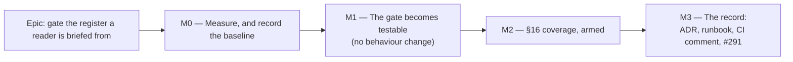

# Implementation Plan: The ADR register in `CLAUDE.md` §16 is gated, not remembered

- **Feature spec:** [`./feature-spec.md`](./feature-spec.md)
- **Status:** Draft — awaiting approval before implementation
- **Owner:** repo

## Breakdown

### Epic

**Gate the ADR register in `CLAUDE.md` §16** — close `docs/TECH_DEBT.md` #291 by extending
`check:adr-coverage` to the third document, and give the gate the test suite none of its three
shipped assertions has ever had.

**Why four milestones and not one PR.** M1 is a pure restructure whose whole value is that it changes
nothing, and its suite is the before/after oracle for M2. Landing them together removes the oracle:
if the suite and the new assertions arrive in one commit, nothing establishes that the roadmap and
index assertions still behave exactly as they did. That is ADR-0078's barrel-preserving argument, and
it is why M1 ships alone.

---

## Milestone M0 — Measure, and record the baseline (no code)

**Outcome:** the estate's true state on the day the work starts, written down, so a future failure is
interpretable and so no figure in the spec is inherited.
**Entry point:** `Ships dark: M0 produces a document, not a capability. The gate does not change.`
**Journey:** n/a — see spec §4.9. M0 has no assertions to verify red.

---

#### Feature: The baseline measurement

> **Description:** Re-derive every figure the spec rests on, plus the mutation-produced red run that
> ADR-0120 D5 would otherwise have got from a dirty estate.
> **Complexity:** S
> **Dependencies:** none
> **Risks:** _a measurement taken with a copy of an instrument measures the copy_ (ADR-0124's
> recorded failure — A9's limb was first measured with a reimplementation of `rowNumber` and
> reported the wrong number in the wrong direction) → M0-T1 scripts the comparison once and M0-T2
> derives its control by a different method.
> **Testing requirements:** none — this milestone's output is evidence.

##### Task M0-T1 — Re-derive the estate, both directions (≈ one PR with M0-T2/T3)

- **Description:** Count ADR files and canonical §16 bullets and compare the two **sets**, not the
  two counts. #291 records two hand comparisons that compared one direction and undercounted.
- **Complexity:** S
- **Dependencies:** none
- **Risks:** the `docs/adr/` filter silently including `README.md`/`_template.md` → assert the
  excluded names explicitly and record them.
- **Testing:** n/a
- **Development steps:**
  1. Enumerate `docs/adr/*.md`; apply `^\d{4}-.*\.md$`; record the count **and** the two files it
     excludes.
  2. Enumerate `^- \*\*ADR-(\d{4})\*\*` across `CLAUDE.md`; record the count and the id multiset.
  3. Report `files ∖ entries`, `entries ∖ files`, and any id appearing twice.
  4. Record the §16 line range and confirm every bullet falls inside it (this is A5's baseline).
  5. Write `m0-measurement.md` §1 with the command used, not only the answer (CLAUDE.md §19.11).

  _Expected, from this spec's own reading on 2026-09-19: 146 files, 146 entries, 0 / 0 / 0, §16 =
  `CLAUDE.md:351-5250`. **Re-derive rather than copy** — that figure is a claim like any other, and
  #291's own "133" was stale inside the commit that wrote it._

##### Task M0-T2 — Quantify the naive-check trap and the exemption dependency

- **Description:** Produce the two numbers §1.2 rests on, by a method independent of M0-T1.
- **Complexity:** S
- **Dependencies:** M0-T1
- **Risks:** reporting a mention count that includes `docs/` or agent files → scope the scan to
  `CLAUDE.md` and say so.
- **Testing:** n/a
- **Development steps:**
  1. Count all `ADR-\d{4}` occurrences in `CLAUDE.md` (expected ~698) against the 146 entries. This
     is the measured case against `includes()`.
  2. Count `scripts/adr-coverage.json`'s exemptions (expected 43) and, of those, how many carry the
     phrase "CLAUDE.md §16 is the register for these" (expected 17).
  3. Name the two ADRs #291 records as present only inside another entry's prose (0049, 0122) and
     confirm they now carry their own bullets.

##### Task M0-T3 — The mutation-produced red run

- **Description:** There is no natural red state (spec §4.8). Produce one and commit it, labelled.
- **Complexity:** S
- **Dependencies:** M2-T2 (this task runs _after_ the assertions exist; it is listed here because it
  belongs to the measurement record and is written into `m0-measurement.md`)
- **Risks:** a reader mistaking the mutation red run for a finding about the estate → the file's
  heading says `MUTATION-PRODUCED` and names the edit.
- **Testing:** n/a
- **Development steps:**
  1. In a scratch copy, delete ADR-0146's bullet from §16; run the gate; capture the output.
  2. Repeat for an entry naming a non-existent ADR, and for a duplicated entry.
  3. Append all three to `m0-measurement.md` under a heading stating they are mutations, not
     findings, and that the estate was clean.

---

## Milestone M1 — The gate becomes testable (no behaviour change)

**Outcome:** `check:adr-coverage` has the shape its five siblings have and a suite that pins its
three shipped assertions — the first time any of them has been verified red (spec §1.4(2)) — and it
can no longer report OK over an empty population (spec §1.4(1)).
**Entry point:** `pnpm check:adr-coverage` (unchanged output on a clean tree) and
`node scripts/check-adr-coverage.test.mjs`.
**Journey:** n/a — no browser, no route, no product user (spec §4.9). The mutation suite is the
substitute, and every case names its mutation.

---

#### Feature: Restructure to `collectFindings` / `runGate` / `report`

> **Description:** Adopt the `check-spec-status.mjs` / `check-ci-roster.mjs` shape so the suite can
> drive the real wiring, and inherit `report()`'s population refusal.
> **Complexity:** S
> **Dependencies:** M0
> **Risks:** (a) the restructure silently changes a finding's wording, so M2's suite pins the wrong
> thing → write the suite **first**, against today's behaviour, and require it to pass unedited
> through the restructure; (b) `report()` prints findings in a different order/format than today's
> `console.error` block, which is a real output change → accept it, and say so in the commit: the
> siblings all print this way and consistency beats preserving one gate's bespoke footer.
> **Testing requirements:** `scripts/check-adr-coverage.test.mjs`, every case red against a named
> mutation.

##### Task M1-T1 — The suite, written against today's gate

- **Description:** Create `scripts/check-adr-coverage.test.mjs` covering the three shipped
  assertions, before anything is restructured.
- **Complexity:** M
- **Dependencies:** M0-T1
- **Risks:** fixture leakage — ADR-0131 records C4 making "twelve unrelated fixtures fail" once a
  control landed → give the `tree()` helper sane defaults (an index row and a roadmap mention per
  ADR) so a fixture built for one assertion does not trip another, and have exactly one case opt out.
- **Testing:** this task **is** the tests.
- **Development steps:**
  1. Copy the fixture idiom from `scripts/check-spec-status.test.mjs:27-92` — `mkdtempSync` tree
     builder, silenced stdout, `ids(result)` returning each finding's leading id.
  2. **R1** — an ADR absent from `docs/ROADMAP.md` and unexempt FAILs. _Mutation: delete the
     `!cited && reason === undefined` branch._
  3. **R1-negative (pinned positive case, ADR-0093)** — the same ADR **passes** once exempt with a
     reason, and **still fails** when its reason is `""`. Without this, R1 passes equally against a
     gate that fails every ADR.
  4. **R2** — an exemption for an ADR that _is_ cited FAILs. _Mutation: delete the `cited && reason`
     branch._
  5. **R3a/R3b** — an ADR file with no index row FAILs; an index row with no file FAILs.
     _Mutations: delete each loop._
  6. **R4** — an exemption naming a non-existent ADR FAILs. _Mutation: delete the loop._
  7. **A clean tree passes**, and its summary names the counts — so a green run is distinguishable
     from a run that found nothing to check.
  8. Run each case against the **unmodified** gate first; any case that is green under its own
     mutation is a case that does not discriminate (ADR-0110 D5), and is rewritten, not kept.

##### Task M1-T2 — Restructure, and the population guard

- **Description:** `collectFindings(root)` → `{ problems, population, summary }`; `runGate(root)` →
  `{ code, problems, summary }` via `report()`; guarded CLI. Findings gain leading ids (`R1:` …).
- **Complexity:** M
- **Dependencies:** M1-T1
- **Risks:** `report()`'s `advisory` default is `false`, which is correct here (spec §4.6) — but the
  `warnings` channel returns **2 unconditionally** and would now block under `prepush.sh`'s inverted
  default (`scripts/lib/doc-register.mjs:259-277`) → this gate pushes no warnings, and M2-T3 asserts
  that structurally.
- **Testing:** M1-T1's suite must pass **unedited** except for prefixing expected ids.
- **Development steps:**
  1. Extract the body into `collectFindings(root)`, reading via a root-relative `read()` so fixtures
     work (`check-ci-roster.mjs:66`).
  2. Add leading ids to every finding; update the suite's `ids()` expectations in the same commit.
  3. Replace the bespoke `console.error` + `process.exit(1)` tail with `report({ name, problems,
population: adrs.length, summary })`.
  4. Export `runGate`; guard the CLI as `check-ci-roster.mjs:291-295` does.
  5. **Add the empty-population case to the suite** — zero ADR files must FAIL. Verify it red by
     temporarily passing `population: null`.
  6. Wire the suite the way the estate already does, rather than inventing a third convention:
     **append `node scripts/check-adr-coverage.test.mjs` to `check:doc-register`**
     (`package.json:21`), which chains the twelve script suites; `check:claims` chains its own
     pattern test separately (`:31`) because that one is a shared-module test its gate depends on.
     Adding a `check:*` key would change the CI roster — appending to an existing chain does not.
     _Observed while checking this: `check:doc-register` is a hand-written chain of twelve names
     with nothing asserting it covers every `scripts/**/*.test.mjs`. It is complete today (13 suites,
     12 chained here and `citation-patterns` chained into `check:claims`), so this is a note and not
     a finding — gating it is another shared-gate change and therefore another ADR-0105 trigger, not
     something to fold in here._
  7. Confirm `pnpm check:ci-roster` is green with no `ci-roster.json` edit (spec §4.5).

---

## Milestone M2 — §16 coverage, armed

**Outcome:** an ADR missing from `CLAUDE.md` §16 fails the push, naming the ADR and the bullet to
write. `docs/TECH_DEBT.md` #291's defect can no longer reach `main` unseen.
**Entry point:** `pnpm check:adr-coverage` — the finding is the surface, and its text is the UI.
**Journey:** n/a (spec §4.9). The substitute is A1–A7 each verified red against the named mutation in
§2.2 of the spec, plus the two pinned positive cases in M2-T2.

---

#### Feature: The §16 entry parser and its assertions

> **Description:** Locate §16, parse entries by the explicit definition (spec §2.3), and assert
> A1–A7.
> **Complexity:** M
> **Dependencies:** M1
> **Risks:** (a) **the naive `includes` trap** — measured 698 mentions against 146 entries → anchor
> on the bullet form and pin the ADR-0049/0122 shape as a case; (b) **a generous reader agreeing with
> itself** (ADR-0124 D2) → A5 derives the control by scanning the whole document _without_
> `sections()`; (c) **a fixture red for the wrong reason** (ADR-0131 C0) → every case asserts on the
> finding **id**, never on `code === 1` alone.
> **Testing requirements:** every assertion red against its named mutation; two pinned positive
> cases; a case proving `_template.md` and `README.md` are not ADRs.

##### Task M2-T1 — Locate §16 and parse entries

- **Description:** The reader, with its blind spots written into its own docblock.
- **Complexity:** M
- **Dependencies:** M1-T2
- **Risks:** the §16 heading is `## 16. Architectural decisions`; matching on the **title words**
  would break on a rename and matching on `## 16.` would break on a renumber. Choose the number
  prefix (stable through title edits, and a renumber is exactly the case A4 exists to report loudly)
  and record the choice.
- **Testing:** covered by M2-T2.
- **Development steps:**
  1. `readRepoDoc('CLAUDE.md')` → `sections(md, 2)` → the section whose heading starts `16.`
     (`scripts/lib/doc-register.mjs:108-130` strips fences and ends a section at the same level **or
     shallower**).
  2. **A4** — if no such section, or it holds zero bullets, push one finding and return. Do not emit
     146 A1 findings for one cause.
  3. **Generous find**: `^\s*[-*]\s+\*{0,2}ADR-(\d{4})` over the section body, with line numbers.
  4. **Strict refusal**: `^- \*\*ADR-(\d{4})\*\*` — the canonical set. Measured 146/146 today, so A6's
     population is empty on arming day and it cannot fail on day one (ADR-0058).
  5. Write the docblock: the definition verbatim, the four stated blind spots (placeholder entries,
     order, non-list forms, `CLAUDE.md` only), and the measured basis for each.

##### Task M2-T2 — A1, A2, A3, A6 and their fixtures

- **Description:** The coverage assertions in both directions, plus duplicates and the form finding.
- **Complexity:** M
- **Dependencies:** M2-T1
- **Risks:** A3 disappearing under a well-meaning refactor to a `Set` → its case's comment names that
  exact edit as the mutation.
- **Testing:** each case below names its mutation; run each against the unmodified gate first.
- **Development steps:**
  1. **A1** — `files ∖ canonicalEntries`. Finding names the id and prints the bullet to write.
     _Mutation: delete the A1 loop._
  2. **A1 pinned positive (the measured case)** — a fixture where ADR-0002 is named **only** inside
     ADR-0001's entry prose must **FAIL with A1**. _This is ADR-0049/ADR-0122 reproduced._ Verify it
     red against a gate that uses `body.includes('ADR-0002')`.
  3. **A2** — `canonicalEntries ∖ files`, finding carries `CLAUDE.md:<line>`.
     _Mutation: delete the A2 loop._
  4. **A3** — an id with two bullets, both lines named. _Mutation: collect ids into a `Set`._
  5. **A6** — `* **ADR-0003**` and an indented `- **ADR-0003**` each produce A6, **not** A1.
     _Mutation: delete the generous-find pass._
  6. **Exclusion case** — a tree containing `README.md` and `_template.md` in `docs/adr/` passes;
     neither is expected in §16.
  7. **Clean-tree case** — the summary names both counts, so green is distinguishable from empty.

##### Task M2-T3 — A5 (the control) and A7 (the exemption boundary)

- **Description:** The two assertions that exist because of a recorded failure elsewhere.
- **Complexity:** M
- **Dependencies:** M2-T2
- **Risks:** A5 written as "count entries twice with the same parser" would be ADR-0120's A9 exactly
  — it could only agree with itself → the control must **not** call `sections()`.
- **Testing:** both red against their named mutations.
- **Development steps:**
  1. **A5** — scan the **whole** `CLAUDE.md` for the canonical bullet form, independently of
     `sections()`; the set must equal the in-section set. Finding names the ids and both counts.
     _Mutations: (i) bound the section at the same heading level only, re-introducing `#231`'s extent
     bug; (ii) move a bullet into §17 in the fixture._
     Document in the docblock **what A5 is and is not**: it detects an entry escaping the section and
     a mis-bounded section; it does **not** detect the section being parsed generously, which is the
     suite's job (M2-T2 step 2).
  2. **A7** — assert no roadmap exemption suppresses an A1 finding, using a fixture where the missing
     ADR **is** exempt. _Mutation: add `if (exempt.has(id)) continue;` to the A1 loop._
  3. Assert structurally that the gate's source contains no `warnings.push` (spec §4.6) — that
     channel returns 2 unconditionally and would block under `prepush.sh`'s inverted default for a
     reason nobody could see.
  4. Amend `scripts/adr-coverage.json`'s `_` field: the `exempt` map is **roadmap-only**, and §16 has
     no exemptions by decision (CQ-2). A7 is what stops that sentence being an unchecked claim.

##### Task M2-T4 — Arm, and watch it fail

- **Description:** Run the armed gate against the real tree, then against a mutated tree, and record
  both.
- **Complexity:** S
- **Dependencies:** M2-T3, M0-T3
- **Risks:** arming against a tree that is clean for the wrong reason (e.g. the parser found zero
  entries and zero files) → the summary prints both counts, and the population guard refuses zero.
- **Testing:** `pnpm prepush` green; then a deliberately re-drafted `CLAUDE.md` produces **FAIL**,
  not `WARN` — the difference between registered and enforced (ADR-0131's arming step).
- **Development steps:**
  1. `pnpm check:adr-coverage` against the real tree — expect OK with 146/146.
  2. Delete a bullet; re-run under `scripts/prepush.sh`; confirm the line reads `FAIL`, not `WARN`,
     and that `ADVISORY_GATES` was not touched.
  3. Restore; run `pnpm prepush` in full; record the gate's wall-clock contribution in
     `m0-measurement.md`.
  4. Append M0-T3's three mutation outputs.

---

## Milestone M3 — The record

**Outcome:** the decision is filed where a reader will find it, the runbook stops asking a person to
do the machine's work, and #291 closes with its interim command deleted rather than left as a second
answer.
**Entry point:** `docs/adr/0147-…md`, `docs/RECONCILE.md` §"Gates", and the closed row.
**Journey:** n/a.

---

#### Feature: Documentation and closure

> **Description:** The ADR, the runbook row, the stale CI comment, the register entry for the new
> ADR, and #291's closure.
> **Complexity:** S
> **Dependencies:** M2
> **Risks:** the new ADR is filed, indexed, roadmap-exempted — and missed from §16, which is this
> epic's own subject landing on it. Mitigation: it cannot happen, because M2 is armed before M3
> starts. That ordering is deliberate, not incidental.
> **Testing requirements:** `pnpm check:adr-coverage`, `pnpm check:doc-links`, `pnpm check:counts`
> (the ADR count moves 146 → 147), `pnpm check:debt-status`, `pnpm check:spec-status` (this spec's
> status moves to `Accepted — shipped (ADR-NNNN)` once the ADR cites this directory).

##### Task M3-T1 — The ADR

- **Description:** A short ADR extending ADR-0110 D6 (CQ-3).
- **Complexity:** S
- **Dependencies:** M2-T4
- **Risks:** writing it as a new principle rather than an extension → it must say plainly that
  ADR-0110 D6 is **amended, not superseded**, and that its reasoning ("a rule repaired by hand and
  left ungated recurs at the next opportunity") is the argument, now with eleven data points.
- **Testing:** `check:adr-coverage`, `check:doc-links`, `check:counts`, `check:spec-status`.
- **Development steps:**
  1. Claim the next number by reading `docs/adr/` **at the moment of writing**, not from this plan —
     ADR-0079 records taking `0078` between plan and milestone, and ADR-0071 records the cost of
     routing around a collision instead of recording it.
  2. Record: the measured problem (146/146 clean, gate absent, 698 mentions vs 146 entries, 43
     exemptions of which 17 point at §16); D1 check-not-generate with CQ-1's four reasons; D2 no §16
     exemptions with A7 as its enforcement; D3 exit 1 with the per-gate-advisory argument; D4 the
     definition of an entry and its four blind spots; D5 the arming sequence adapted because the
     estate was clean, and the mutation-produced red run.
  3. Record the corrections this epic made to its own inputs (the eleventh instance in
     `docs/RECONCILE.md:287`; the two defects in §1.4; the stale CI comment) — they are the evidence,
     not decoration.
  4. Add the row to `docs/adr/README.md`; add the exemption to `scripts/adr-coverage.json` with a
     written reason of the existing process/tooling class.
  5. **Write its `CLAUDE.md` §16 entry** — and note in the ADR that the gate's first real exercise
     was its own filing.
  6. Add a changeset only if a published package changes. It does not: the diff is `scripts/`,
     `.github/` and `docs/`. State that rather than adding an empty one.

##### Task M3-T2 — The runbook, the CI comment, and #291

- **Description:** Sweep the three documents that still describe the old state.
- **Complexity:** S
- **Dependencies:** M3-T1
- **Risks:** closing #291 while leaving its one-liner in place, so a reader runs it and concludes the
  gate does not exist → the command is **deleted**, and the row's closure names the gate.
- **Testing:** `pnpm check:debt-status`, `pnpm check:doc-links`.
- **Development steps:**
  1. `docs/RECONCILE.md` — add a row to the gates table: _"`pnpm check:adr-coverage` — an ADR missing
     from `docs/ROADMAP.md`, from `docs/adr/README.md`, **or from `CLAUDE.md` §16**."_ Do **not** add
     a manual step; ADR-0058's rule is the opposite.
  2. `.github/workflows/ci.yml:202-209` — correct the disproved sentence ("only the roadmap rots
     silently"). §16 has now rotted eleven times against the roadmap's zero since the gate shipped.
     Confirm `pnpm check:ci-roster` stays green (comments are stripped before matching — R6).
  3. `scripts/check-adr-coverage.mjs:15-31` — rewrite the "why it is not CLAUDE.md" paragraph into
     "what it checks in `CLAUDE.md` and what it cannot see".
  4. `docs/TECH_DEBT.md` #291 — close it per the register's own convention (delete the row and
     ledger the number; `check:debt-status` has no `closed` status in its vocabulary, which ADR-0138
     records a plan getting wrong). Delete the interim `python3 -c …` command with it.
  5. Re-run `pnpm prepush` in full.

---

## Sequencing & slices

| Slice | Ships                                  | `main` releasable?        | Independently valuable                                                                                 |
| ----- | -------------------------------------- | ------------------------- | ------------------------------------------------------------------------------------------------------ |
| M0    | A measurement document                 | yes — no code             | The baseline, and the numbers #291 asks to be re-derived                                               |
| M1    | Restructure + suite + population guard | yes — no behaviour change | Closes spec §1.4's two defects; the gate's three shipped assertions become verified for the first time |
| M2    | A1–A7, armed                           | yes                       | **The epic's purpose.** #291's defect can no longer reach `main` unseen                                |
| M3    | ADR, runbook, CI comment, closure      | yes                       | The decision is findable; the row stops asking for hand work                                           |

**No feature flag.** ADR-0088 D1: a `VITE_` constant is inlined at build time and is not an operator
rollback — and this is a Node script with no bundle at all. The rollback is a commit boundary, and
M1's restructure is deliberately separable from M2's assertions so the coverage half can be reverted
without losing the suite.

## Definition of Done (per task)

Each task's PR must satisfy the Feature Completion Criteria in
[`docs/PROCESS.md`](../../PROCESS.md). For this epic, three are sharpened and one is waived with a
reason:

- **Tests** means the pre-push gate was **run** (`pnpm prepush`), and that every new assertion was
  observed **red** against the mutation named in its own comment, on the unmodified gate, before the
  fix (ADR-0110 D5). A case that is green under its own mutation is rewritten, not kept.
- **Docs** means the gate's docblock states what it cannot see, in the same commit as the code.
- **Accessibility / Docker build / performance** — no UI, no image, no measurable runtime cost; the
  `e2e` half of the pre-push gate does not apply (no `apps/api` change, no Playwright suite). Stated
  rather than silently skipped.
- **Version impact** — none. No published package changes, so no changeset (M3-T1 step 6).

## Risks & assumptions (rollup)

| Risk / assumption                                                                                       | Likelihood | Impact                                                                                   | Mitigation                                                                                                                                        |
| ------------------------------------------------------------------------------------------------------- | ---------- | ---------------------------------------------------------------------------------------- | ------------------------------------------------------------------------------------------------------------------------------------------------- |
| The gate is written the naive way (`includes`) and passes over the exact instances a person cannot find | med        | high — a green gate stops anyone looking, which is strictly worse than #291's status quo | The definition is explicit (spec §2.3), and M2-T2 step 2 pins the measured ADR-0049/0122 shape, verified red against an `includes` implementation |
| A fixture goes red for the wrong reason and proves nothing (ADR-0131 C0)                                | med        | med                                                                                      | Every case asserts on the finding **id**, never on `code === 1`; the population case is built so the guard is the only thing that can fire        |
| A5 is written as the same quantity twice and agrees with itself (ADR-0120 A9)                           | med        | med                                                                                      | A5's control scans the whole document **without** `sections()`; its mutation is re-introducing `#231`'s extent bug                                |
| The restructure silently changes a shipped finding                                                      | low        | med                                                                                      | M1-T1 writes the suite **first**, against today's behaviour; it must pass unedited through M1-T2 except for id prefixes                           |
| Somebody later assumes `adr-coverage.json`'s `exempt` covers §16                                        | med        | med                                                                                      | A7 fails if an exemption ever suppresses an A1 finding; the JSON's `_` field says so; the docblock repeats it                                     |
| A future §16 reformat produces 146 false "missing" findings                                             | low        | med                                                                                      | A6: an entry found generously but not canonically is a **form** finding; A4 reports an unlocatable section once rather than 146 times             |
| This epic files its own ADR and misses §16                                                              | low        | high (it would be the epic's subject landing on it)                                      | M2 arms before M3 begins; the ordering is the mitigation                                                                                          |
| The ADR number is taken between plan and merge                                                          | med        | low                                                                                      | M3-T1 step 1: read `docs/adr/` at the moment of writing, and record a collision rather than routing around it (ADR-0071)                          |
| CQ-1 is answered "generate" after approval                                                              | low        | high — M2 is wasted                                                                      | Flagged as the critical question; M0/M1 are valuable either way, so only M2 is at risk                                                            |
| A reader treats "clean on 2026-09-19" as a guarantee                                                    | med        | low                                                                                      | The measurement document states the two occasions a person reported clean and was wrong                                                           |
