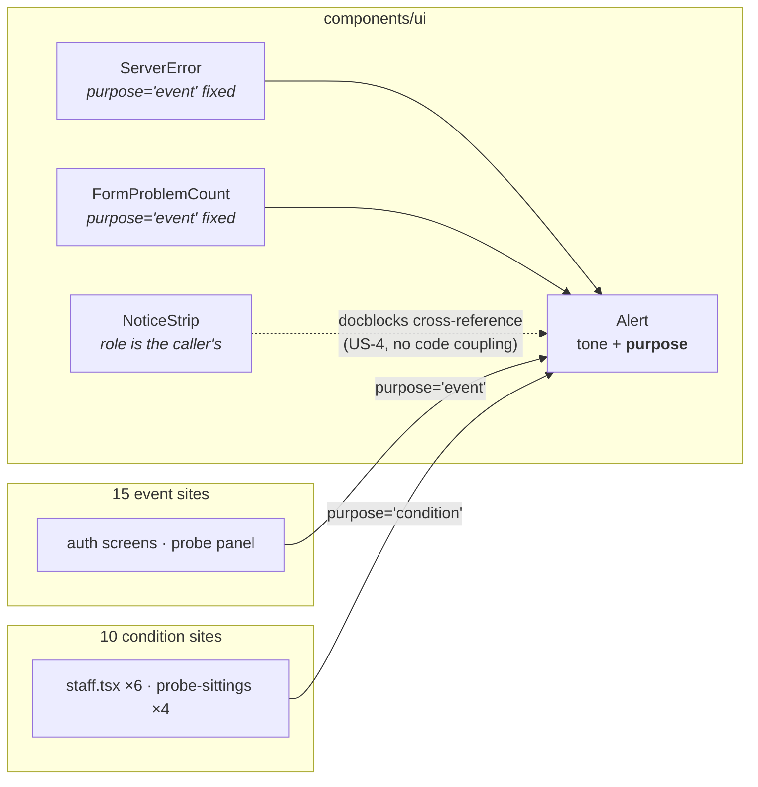
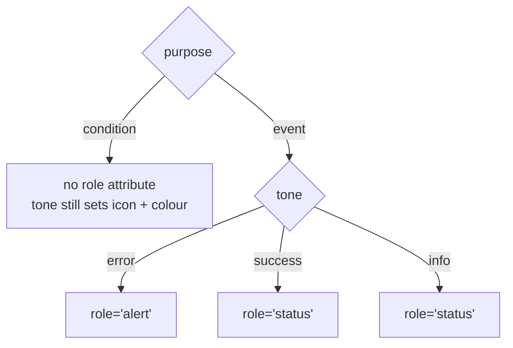

# Feature Spec: `Alert` says whether it is an event or a standing condition

- **Status:** Draft
- **Author(s):** feature-analyst (for the product owner)
- **Date:** 2026-09-09
- **Tracking issue / epic:** `docs/TECH_DEBT.md` #118, item 3
- **Roadmap link:** none — debt repair on a shared primitive
- **Related ADR(s):** ADR-0117 (the `purpose` precedent), ADR-0077 §9 (the `Alert` treatment),
  ADR-0082 (shade-vs-omit, and the SC-overstatement correction), ADR-0086 (the staff console),
  ADR-0105 (why this needs a spec at all). A new ADR is warranted — outline in §4.6.

---

## 0. Corrections to the brief

Per `docs/PROCESS.md` "the brief is not evidence", every claim inherited from the request was
re-derived. Four did not survive.

| Claim in the brief                                          | Established                                                                                                                                            | How                                                                     |
| ----------------------------------------------------------- | ------------------------------------------------------------------------------------------------------------------------------------------------------ | ----------------------------------------------------------------------- |
| "33 call sites, 19 info" (flagged as untrusted — correctly) | **25 production call sites, 17 `info`.** 33 counted the **8 `render()` calls inside `alert.test.tsx`**; 19 has no derivation I can reproduce.          | `rg '<Alert(\s\|>\|$)' apps/web/src` — full listing in §1.4             |
| "Four call sites on `staff.tsx` (92, 163, 316, 433)"        | **Six.** The brief's four are `tone="info"`. Two more are `tone="error"` → `role="alert"`, i.e. **assertive**: `:323` and `:344`.                      | Read `staff.tsx:313-347`                                                |
| _(not in the brief)_                                        | **`NoticeStrip` already answers the same question the opposite way**, in its own docblock, deliberately. The two primitives have already diverged.     | `notice-strip.tsx:63-71`                                                |
| _(not in the brief)_                                        | For the two retention notices the overlap is **literal duplication, not a risk**: `statusSentence()` already speaks both facts into the polite region. | `features/staff/model/retention-copy.ts:151-163` vs `staff.tsx:316,323` |

The last row is the strongest single piece of evidence in this spec and it changes the argument:
for two of the ten offending sites, removing the live role costs **nothing at all**, because the
fact is already announced once, correctly, through a region built for it.

---

## 1. Business understanding

### Problem

`components/ui/alert.tsx` derives its ARIA live-region role from `tone`
(`TONE_META`, `:52-56`): `error → role="alert"`, `success`/`info` → `role="status"`. `AlertProps`
`Omit`s `role` (`:60-63`) so a call site cannot override it, and the docblock (`:35-38`) argues for
that explicitly.

**That argument is correct and this spec does not overturn it.** The defect is one level up:
`tone` answers _how urgent_, and **nothing on the primitive answers _is this an event or a standing
condition_**. Because the only axis available also decides the live role, a call site with a
permanent fact to state has no way to say so — its only options are the wrong role or no `Alert`.

The consequence is visible on `/staff`. Ten call sites use `Alert` for **standing conditions of the
installation** — how things are, not what just happened. Each is conditional on asynchronously
loaded data, so the live region is **inserted into the DOM together with its content** at the
moment a query settles. That is the unreliable case for live regions: the region was not in the
accessibility tree when the content arrived, so whether anything is spoken is a function of the
browser/AT pair rather than of the markup. Three things follow, in increasing order of seriousness:

1. **Behaviour is undefined rather than chosen.** Today's markup does not express an intention; it
   expresses an accident of which axis was available.
2. **Two of the ten are assertive.** `staff.tsx:323` (sweeps failed) and `:344` (sweep overdue) are
   `tone="error"` → `role="alert"`. An assertive region inserted on data load is an interruption
   announcing a condition that has been true for hours.
3. **Two of the ten duplicate the panel's own status region.** `Panel` (`features/staff/ui/panel.tsx:39-41`)
   mounts an **empty** `<p aria-live="polite" class="sr-only">` and fills it when the query settles
   — the textbook-correct pattern, and the one that satisfies WCAG 4.1.3 for that panel. For
   Retention, `statusSentence()` already emits `"Retention: sweeping is disabled."` and
   `"Retention: the last N sweeps failed."` — **the same two facts** the two Alerts carry. So one
   settle event queues the fact twice, in two regions, in an order nothing defines.

There is a fourth, narrower issue that the same fix disposes of: `staff.tsx:316` and `:323` are
**also `aria-describedby` targets** for the retention `DataTable` (`staff.tsx:284-287`, wired at
`:359`). An element that is both a live region and a description is read on insertion _and_ again
when the table takes focus.

**Why now.** ADR-0105 — the change alters a shared component's public contract, so it needs a spec
before code. Beyond that: this is the point at which the two primitives have measurably diverged
(§1.5), and every further `Alert tone="info"` written for a standing fact deepens it.

### Users

Nobody's permissions change and no data moves. The people affected are readers:

| Who                                    | What they need                                                                                                                                                                                               |
| -------------------------------------- | ------------------------------------------------------------------------------------------------------------------------------------------------------------------------------------------------------------ |
| **Staff operator using AT** (ADR-0086) | To hear each panel settle **once**, with the fact that decides whether the installation is healthy — not the same sentence twice, nor an assertive interruption about a condition that predates their visit. |
| **Any AT user of the auth screens**    | Unchanged. Those Alerts are genuine outcomes and keep announcing.                                                                                                                                            |
| **Sighted readers**                    | Unchanged. Nothing about the visual treatment moves.                                                                                                                                                         |
| **The next author of an `Alert`**      | A primitive that makes them state which case they are in, so the defect is not reachable by omission.                                                                                                        |

Staff-ness is not an organisation role (ADR-0086: `StaffPrincipal` is structurally not a
`Principal`), so this maps to no RBAC permission — see §2.4.

### Primary use cases

1. A staff operator loads `/staff` with a screen reader and learns each panel's settled state once.
2. An author adds a new `Alert` and is required by the compiler to say whether it announces.
3. A reviewer reads a call site and can tell, from the call site alone, whether it is a live region.

### User journeys

**Today, `/staff`, retention sweeping disabled, NVDA/VoiceOver:** the reader arrives; panels are
pending; queries settle; the polite queue receives "Retention: sweeping is disabled." from the
`Panel` status region **and** "Retention sweeping is disabled. Nothing is being deleted…" from the
Alert, plus possibly the same sentence a third time on reaching the table it describes. Whether
each is spoken, and in what order, varies by AT.

**After:** the polite region speaks "Retention: sweeping is disabled. 2 already past its period."
once. The Alert is a styled block in reading order, still first in the panel body, still the
`aria-describedby` target for the table — read when the reader gets there, or when they reach the
table, and not before.

See §4.3 for the diagram.

### Expected outcomes

- On a settled `/staff`, the number of live regions per panel is **one** — the panel's own — instead
  of one plus however many standing conditions happen to be true.
- No assertive region is created by data arriving.
- The primitive can express the distinction, so the ten sites are a **fix** rather than a
  workaround, and the eleventh site cannot reintroduce it silently.
- Behaviour becomes **defined**: today the ten sites' announcement is AT-dependent; after, it is
  "silent, by declaration". Replacing unreliable behaviour with chosen behaviour is a benefit
  independent of which choice is made.

### Success criteria

| #   | Criterion                                                                                                                                     | How it is checked                                                           |
| --- | --------------------------------------------------------------------------------------------------------------------------------------------- | --------------------------------------------------------------------------- |
| S1  | With `/staff` settled and every caveat true, each `Panel` body contains exactly **one** element with a live role (its own `aria-live` `<p>`). | Component test, verified red against today's code (G3, §4.5)                |
| S2  | No `role="alert"` is rendered anywhere on a settled `/staff`.                                                                                 | Same test                                                                   |
| S3  | Every one of the 25 call sites declares a `purpose`.                                                                                          | **`tsc`** — a required prop, not a scan (§4.4)                              |
| S4  | `purpose="event"` renders exactly today's tone-derived role for all three tones.                                                              | Unit test (G1)                                                              |
| S5  | The two facts that today have **no** other announcement channel keep one (§2.3, M2).                                                          | Component test on `MailHealthPanel`'s status sentence                       |
| S6  | No journey regresses.                                                                                                                         | `scripts/e2e-local.sh web:staff`, `web:public` — see §3 for the two at risk |

**What none of these can check, stated plainly:** jsdom has no assistive technology. Every
assertion above is about a **rendered `role` attribute**. None of them proves what a screen reader
says, and none should be described as doing so.

### Open questions

Four, all with a recommended default. Only CQ-1 changes an observable outcome.

| ID       | Question                                                                                                                                  | Recommendation                                                                                                                                                                                                                                                                                                                                                                                 |
| -------- | ----------------------------------------------------------------------------------------------------------------------------------------- | ---------------------------------------------------------------------------------------------------------------------------------------------------------------------------------------------------------------------------------------------------------------------------------------------------------------------------------------------------------------------------------------------- |
| **CQ-1** | Is `sign-in.tsx:27` ("You have been signed out.") an event or a condition? It is present at **first paint**, from a URL param.            | **`event`.** The reader pressed Sign out; this is its outcome, and it is the only thing explaining why they are on this screen. Its delivery is unreliable for the first-paint reason, which is a known limitation rather than a reason to silence it. Keeping it `event` also keeps `e2e-public/public-screens.spec.ts:237,267` green — they assert `getByRole('status')` on this exact node. |
| **CQ-2** | Three of the ten conditions are `DataTable empty={…}` nodes, which overlaps the `EmptyState` consolidation (`#161(a)`). Do they move now? | **No.** Classify them `condition` here — that is cheap, correct and independent — and leave the _treatment_ question (`Alert` vs `EmptyState`) to that epic. Recorded in §4.7 so it is inherited rather than lost.                                                                                                                                                                             |
| **CQ-3** | Should `NoticeStrip` take `purpose` too, so the two primitives agree?                                                                     | **Not now.** Its three role outcomes include "neither", which `purpose` as specified cannot express, and its callers are canvas surfaces with their own announcer. Trigger for reopening in §4.7.                                                                                                                                                                                              |
| **CQ-4** | Does `purpose="condition"` render **no** `role`, or `role="note"`?                                                                        | **No role at all.** `role="note"` is not a live region either, so it buys nothing for this defect, has uneven AT support, and adds a stop to a reader's traversal. Rejected in §4.2.                                                                                                                                                                                                           |

---

### 1.4 The measured blast radius

`rg '<Alert(\s|>|$)' apps/web/src` returns **33 occurrences in 12 files**. Eight are `render()`
calls inside `components/ui/alert.test.tsx`, leaving **25 production call sites in 11 files**:
17 `info`, 6 `error`, 2 `success`.

Classified by whether the message reports something that just happened (**E**) or states how things
stand (**C**):

| File                                                    | Line | Tone      | Today       |     | Message                                                    |
| ------------------------------------------------------- | ---- | --------- | ----------- | --- | ---------------------------------------------------------- |
| `routes/staff.tsx`                                      | 92   | `info`    | `status`    | C   | This account is also an organisation member                |
| `routes/staff.tsx`                                      | 163  | `info`    | `status`    | C   | No mail transport is configured                            |
| `routes/staff.tsx`                                      | 316  | `info`    | `status`    | C   | Retention sweeping is disabled ← also `describedby` target |
| `routes/staff.tsx`                                      | 323  | `error`   | **`alert`** | C   | The last N sweeps failed ← also `describedby` target       |
| `routes/staff.tsx`                                      | 344  | `error`   | **`alert`** | C   | The sweep is overdue                                       |
| `routes/staff.tsx`                                      | 433  | `info`    | `status`    | C   | No violations recorded (table empty state)                 |
| `features/perf-probe/ui/probe-sittings.tsx`             | 96   | `info`    | `status`    | C   | No readings recorded yet (table empty state)               |
| `features/perf-probe/ui/probe-sittings.tsx`             | 220  | `info`    | `status`    | C   | These readings were taken N apart                          |
| `features/perf-probe/ui/probe-sittings.tsx`             | 235  | `info`    | `status`    | C   | This sitting has N of M readings                           |
| `features/perf-probe/ui/probe-sittings.tsx`             | 255  | `info`    | `status`    | C   | This sitting recorded no readings (table empty state)      |
| `routes/sign-in.tsx`                                    | 27   | `info`    | `status`    | E   | You have been signed out (CQ-1)                            |
| `routes/reset-password.tsx`                             | 82   | `success` | `status`    | E   | outcome, focused via `outcomeRef`                          |
| `routes/forgot-password.tsx`                            | 73   | `info`    | `status`    | E   | outcome, focused via `outcomeRef`                          |
| `components/ui/server-error.tsx`                        | 53   | `error`   | `alert`     | E   | **adapter** — a server failure                             |
| `components/ui/form.tsx`                                | 487  | `error`   | `alert`     | E   | **adapter** — `FormProblemCount`                           |
| `features/perf-probe/ui/performance-probe-panel.tsx`    | 668  | `error`   | `alert`     | E   | The measurement did not run                                |
| `features/perf-probe/ui/performance-probe-panel.tsx`    | 880  | `info`    | `status`    | E   | cancelled run                                              |
| `features/perf-probe/ui/performance-probe-panel.tsx`    | 884  | `info`    | `status`    | E   | refused run                                                |
| `features/perf-probe/ui/performance-probe-panel.tsx`    | 897  | `info`    | `status`    | E   | this run cannot be judged                                  |
| `features/perf-probe/ui/performance-probe-panel.tsx`    | 992  | `info`    | `status`    | E   | not taken                                                  |
| `features/perf-probe/ui/performance-probe-panel.tsx`    | 999  | `info`    | `status`    | E   | refused                                                    |
| `features/perf-probe/ui/performance-probe-panel.tsx`    | 1026 | `error`   | `alert`     | E   | measured but NOT recorded                                  |
| `features/auth/components/ChangePasswordForm.tsx`       | 77   | `success` | `status`    | E   | Password changed                                           |
| `features/auth/components/ResendVerificationButton.tsx` | 81   | `info`    | `status`    | E   | outcome, focused via `outcomeRef`                          |
| `features/auth/components/SignInForm.tsx`               | 44   | `info`    | `status`    | E   | unverified notice, focused via `unverifiedRef`             |

**10 conditions, 15 events.** All ten conditions are on two screens — the staff console and the
staff console's probe-sittings panel — which is what makes the classification tractable: the
distinction is not scattered, it is concentrated where the product reports on itself.

The perf-probe **panel** sites are all events (they render the outcome of a run the operator just
pressed); the perf-probe **sittings** sites are all conditions (they describe stored history). That
the two files split cleanly is a decent check on the discriminator being real rather than invented.

**Two of the 25 are adapters inside `components/ui`.** `ServerError` (`server-error.tsx:53`) and
`FormProblemCount` (`form.tsx:487`) wrap `Alert` and are used **19 further times across 9 files**
(`rg '<ServerError|<FormProblemCount' apps/web/src` → 26 occurrences, 7 of them in
`server-error.test.tsx`). Both are unambiguously events and can hardcode `purpose="event"`, so
**those 19 call sites are untouched.** This materially answers the affordability question in the
brief: a required prop costs **25 edits in 12 files**, not 44.

### 1.5 The primitives have already diverged

`notice-strip.tsx:63-71` says, in its own docblock:

> The **role is the caller's** — deliberately not derived from `tone`. […] A tone→role mapping
> would get that third case wrong by construction.

`alert.tsx:35-38` says the opposite, also deliberately, also with a reason. Both reasons are
locally sound; the two files have never been read side by side. That is the "two call sites answer
the same question differently" failure `Alert`'s own docblock warns about, occurring **between two
primitives** rather than between two call sites — which is exactly where nothing was watching.

This spec does not merge them (CQ-3). It does require that whichever lands makes the two docblocks
**cross-reference each other and state why the mechanisms differ**, so the next reader finds the
disagreement explained rather than has to discover it.

---

## 2. Functional requirements

### User stories & acceptance criteria

> **US-1** — As a **staff operator using a screen reader**, I want each panel of the staff console
> to announce its settled state **once**, so that I can tell what changed without hearing the same
> fact twice or being interrupted about a condition that predates my visit.
>
> **Acceptance criteria**
>
> - **Given** retention sweeping is disabled **when** the health query settles **then** the polite
>   announcement is the `Panel` status sentence only, and the Retention panel body contains no
>   element with `role="status"` or `role="alert"`.
> - **Given** the last N sweeps failed **when** the health query settles **then** no `role="alert"`
>   is rendered anywhere in the document.
> - **Given** any combination of the staff caveats is true **when** the console has settled **then**
>   each `Panel` contains exactly one element with a live role — its own `aria-live` paragraph.
> - **Given** the retention caveats are rendered **then** they remain reachable in reading order and
>   remain the `aria-describedby` targets of the retention table (`staff.tsx:359`).

> **US-2** — As an **author adding an `Alert`**, I want the compiler to make me say whether it
> announces, so that I cannot reach the wrong behaviour by not knowing the question existed.
>
> **Acceptance criteria**
>
> - **Given** a new `<Alert tone="info">…</Alert>` with no `purpose` **when** `pnpm typecheck` runs
>   **then** it fails, naming the missing prop.
> - **Given** `purpose="event"` **then** the rendered role is exactly today's: `alert` for `error`,
>   `status` for `success` and `info`.
> - **Given** `purpose="condition"` **then** the element carries **no** `role` attribute, and its
>   `tone` still selects the icon and the colour.
> - **Given** any `purpose` **then** a caller still cannot pass `role` — the `Omit` stands.

> **US-3** — As a **staff operator using a screen reader**, I want a fact that loses its only
> announcement channel to gain a reliable one, so that the change is not a net loss of information.
>
> **Acceptance criteria**
>
> - **Given** no mail transport is configured **when** the Mail panel settles **then** the polite
>   status sentence says so.
> - **Given** a transport is configured **then** the status sentence is unchanged from today.

> **US-4** — As a **reviewer**, I want the two message primitives' reasoning to agree on the record,
> so the next author does not have to discover the disagreement.
>
> **Acceptance criteria**
>
> - **Given** either docblock **then** it names the other primitive and states why the mechanisms
>   differ.
> - **Given** `docs/DESIGN_SYSTEM.md`'s Alerts bullet **then** it states the `purpose` axis and the
>   discriminator.

### Workflows

**Authoring.** Write an `Alert`. The compiler demands `purpose`. Ask the discriminator question:

> **Would this sentence read the same to somebody who arrived five minutes later and did nothing?**
> Yes → `condition`. No → `event`.

Phrased as a property of the message rather than of the code, because a caller can answer it about
copy they are writing and cannot reliably answer "will this element mount after its container was
already on screen".

**Rendering.** `purpose` decides whether a role is emitted; `tone` decides which one and what it
looks like. The two axes stay orthogonal — the `NoticeStrip` precedent for keeping `tone` and
`emphasis` apart (`notice-strip.tsx:15-18`).

### Edge cases

| Case                                                          | Expected behaviour                                                                                                                                                             |
| ------------------------------------------------------------- | ------------------------------------------------------------------------------------------------------------------------------------------------------------------------------ |
| `tone="error"` + `purpose="condition"`                        | **No role.** This is `staff.tsx:323`/`:344`. Legal and intended: a failing sweep is a standing condition rendered in the error treatment. The colour still says "this is bad". |
| `tone="info"` + `purpose="event"`                             | `role="status"`. Unchanged. Nine sites.                                                                                                                                        |
| A `condition` Alert that is also an `aria-describedby` target | Works, and works better: it stops being read on insertion and is read only when the describing element takes focus. `staff.tsx:316`/`:323`.                                    |
| A `condition` Alert whose content later changes               | Nothing is announced. Correct by construction — if the content changes in response to something, the site is an event and was misclassified.                                   |
| An `Alert` present at first paint but semantically an event   | `sign-in.tsx:27`. Declared `event`; delivery remains AT-dependent. Recorded as a limitation, not fixed here — the fix is a persistent region, which is a different change.     |
| Every staff caveat false                                      | Each panel renders one live region (its own). This is the common case and must not regress.                                                                                    |
| `Alert` with no `tone`                                        | `tone` keeps its `error` default (`alertVariants` `defaultVariants`, and `alert.test.tsx:22-25`). `purpose` has **no** default — the asymmetry is the point.                   |

### Permissions

**None.** No RBAC permission, no organisation scope, no data access changes. `/staff` is reached
through `StaffPrincipal`, which is structurally not a `Principal` (ADR-0086) and confers nothing
inside any organisation; the panels' authorisation is untouched. The auth screens are
pre-authentication and unchanged.

### Validation rules

None — no user input. The one constraint is a **compile-time** one: `purpose` is required and its
union is closed.

### Error scenarios

There is no runtime failure mode; the table below is therefore **regression** scenarios — what
"wrong" looks like and what catches it.

| Scenario                                                 | Detection                             | Result                                     |
| -------------------------------------------------------- | ------------------------------------- | ------------------------------------------ |
| A new `Alert` omits `purpose`                            | `tsc`                                 | Build fails                                |
| Someone re-adds a `role` prop to `AlertProps`            | G2 structural assertion (§4.5)        | Test fails                                 |
| `purpose="condition"` starts emitting a role             | G1 unit test                          | Test fails                                 |
| A standing condition on `/staff` regains a live role     | G3 component test                     | Test fails                                 |
| A standing condition **elsewhere** is written as `event` | **Nothing.** No gate can read intent. | Reviewer's half — §4.5 states this plainly |
| The change never reaches the shipped bundle              | `e2e-staff` assertion (M2)            | Journey fails                              |

---

## 3. Technical analysis

| Area           | Impact   | Notes                                                                                                                                                                                              |
| -------------- | -------- | -------------------------------------------------------------------------------------------------------------------------------------------------------------------------------------------------- |
| Frontend       | **med**  | One primitive's public contract; 25 call sites in 12 files; one status sentence (`MailHealthPanel`). No new component, no new route, no state, no forms.                                           |
| Backend        | **none** | Nothing in `apps/api` is touched.                                                                                                                                                                  |
| Database       | **none** | No model, column, index, constraint or migration — so `database-architect` is **not** engaged, because there is nothing to design, not because a change was judged too small (ADR-0121's wording). |
| API            | **none** | No endpoint, DTO or OpenAPI change.                                                                                                                                                                |
| Security       | **none** | No authN/Z, no scope, no input, no secret, no audit action. `/staff`'s existing `staff.panel_read` audit is untouched.                                                                             |
| Performance    | **none** | One fewer attribute on ten elements. No measurement is owed; asserting a cost here would be an unmeasured claim.                                                                                   |
| Infrastructure | **none** | No new service, env var, CI step or **Playwright config** — `e2e-staff` and `e2e-public` already exist.                                                                                            |
| Observability  | **none** | No log, metric, trace or health change.                                                                                                                                                            |
| Testing        | **med**  | Update `alert.test.tsx`; add G1–G3; add one `e2e-staff` assertion. Two existing `e2e-public` assertions are **at risk and stay green under CQ-1** — see below.                                     |

**The two journey assertions at risk.** `e2e-public/public-screens.spec.ts:237` and `:267` both
assert `page.getByRole('status')` contains `'You have been signed out.'` — that is `sign-in.tsx:27`.
CQ-1's recommendation (`event`) keeps them passing untouched. If CQ-1 is decided the other way,
both must be relocated to a text locator in the same PR, and the change must say so out loud rather
than letting a journey go red in CI. Established by reading the file, not inferred.

`e2e-staff/staff.spec.ts` locates nothing by `role="status"`/`role="alert"` (checked: its
`getByRole` calls are `button`, `heading`, `menu`, `menuitem`, `region`, `combobox`), so the staff
side has no journey to repair.

### Dependencies

- **Prerequisites:** none. This is self-contained inside `apps/web`.
- **Must land first:** nothing.
- **Interacts with:** the `EmptyState` consolidation (`#161(a)`) for three of the ten sites (CQ-2);
  `#118` items 1, 2 and 4, which are unrelated and stay open.
- **Third parties:** none.

---

## 4. Solution design

### 4.1 Architecture overview

Nothing moves. One prop is added to one primitive and read in one place.



### 4.2 Role derivation



`purpose` gates; `tone` selects. The `error → alert` mapping and its reasoning are untouched — the
docblock's argument survives verbatim, now scoped to the case it was actually about.

**`role="note"` rejected (CQ-4).** It is not a live region, so it fixes nothing this spec is about;
support is uneven; and it adds a stop to a reader's traversal in exchange for a hint the visual
treatment and the sentence already carry. "No role" is also the one outcome with no ambiguity about
what a browser will do with it.

### 4.3 Data flow — the announcement race, before and after

```mermaid
sequenceDiagram
  participant Q as useStaffHealth
  participant P as Panel status region<br/>(mounted empty at first paint)
  participant A as Alert (mounted on settle)
  participant AT as Screen reader

  Note over Q,AT: TODAY
  Q->>P: '' (empty, region is in the a11y tree)
  Q-->>P: 'Retention: sweeping is disabled.'
  P->>AT: polite announcement ✔ (reliable — region pre-existed)
  Q-->>A: mount <div role="status">Retention sweeping is disabled…</div>
  A->>AT: polite announcement ✚ (unreliable — region arrived with content)
  Note over AT: same fact, twice, order undefined

  Note over Q,AT: AFTER
  Q-->>P: 'Retention: sweeping is disabled.'
  P->>AT: polite announcement ✔
  Q-->>A: mount <div> (no role)
  Note over A,AT: silent by declaration;<br/>read in order, or when the table it describes takes focus
```

### 4.4 The chosen approach

**Add `purpose: 'event' | 'condition'` to `AlertProps`, required, with no default.**

- **Required, no default** — the ADR-0117 precedent applied literally. `useTooltip`'s `purpose`
  (`tooltip.tsx:44-55`) is required for the same reason in the same words: _"the caller states which
  case they are in, so the double-announcement failure cannot be reached by omission"_. A default of
  `'event'` would be behaviour-preserving and touch only ten files instead of twelve — and would
  leave the eleventh author reaching today's defect by not knowing the question existed, which is
  precisely how the ten arose. **The affordability question the brief asked is answered by §1.4: 25
  edits in 12 files, with the 19 `ServerError`/`FormProblemCount` call sites shielded.** That is
  smaller than `useTooltip`'s adoption and the compiler enumerates every site, so the migration
  cannot be partial.
- **`Omit<…, 'role'>` stays.** The documented decision the brief asked not to overturn casually is
  preserved exactly: a call site still cannot name a role. It gains a way to say what kind of
  message it is, and the primitive keeps deciding what that implies.
- **`tone` keeps its default.** `purpose` required beside `tone` optional is deliberate: `tone`'s
  default is a visual fallback with a sensible worst case; `purpose`'s would be an ARIA decision
  made by omission.

### 4.5 Gates

**No existing gate catches this, and that was checked rather than assumed:**

- `alert.test.tsx` asserts the tone→role mapping on the primitive; it constrains no call site.
- The only structural test in `apps/web/src` mentioning live regions is
  `components/layout/status/announcement-sources.structural.test.ts`, scoped by path to
  `src/components/layout/status` — it cannot see `Alert` or `staff.tsx`.
- axe has no rule for "a live region states a standing fact", and ADR-0090 M1 established that this
  repository's scans request `wcag2a`/`wcag2aa`, so even a `wcag22aa`-tagged rule would not run.
- `e2e-staff` locates none of these nodes by role.

Landing with the change:

| ID     | Kind                     | Assertion                                                                                                                                | Verified red against                                 |
| ------ | ------------------------ | ---------------------------------------------------------------------------------------------------------------------------------------- | ---------------------------------------------------- |
| **G1** | unit, `alert.test.tsx`   | `purpose="condition"` renders no `role` attribute for all three tones; `purpose="event"` renders `alert`/`status`/`status`.              | An implementation that emits a role regardless       |
| **G2** | structural, one `expect` | `alert.tsx`'s props still `Omit` `role`. Comments stripped first — this repository has five recorded scans that matched their own prose. | Deleting the `Omit`                                  |
| **G3** | component, staff panels  | With settled data and every caveat true, each `Panel` body has exactly one live-role element; the document has no `role="alert"`.        | **Today's code** — this is the characterisation test |
| **G4** | journey, `e2e-staff`     | On the real console, a settled panel exposes one live region.                                                                            | Reverting the classification                         |

**A deliberate non-gate.** No census with an allow-list of `condition` sites. `condition` is the
_safe_ value; the dangerous drift is a standing condition declared `event`, and **no gate can read
intent** — the empty-state gate's own docblock makes the same admission about "should this be an
empty state at all". Writing a gate that appears to cover it would be worse than none, because a
green gate stops anyone looking (ADR-0110 D5). The reviewer's prompt in `docs/DESIGN_SYSTEM.md` is
the honest instrument.

**And, once more, because it is easy to over-read the four rows above:** jsdom has no assistive
technology. G1–G3 assert a DOM attribute. G4 asserts a DOM attribute in a real browser, which is
strictly more than jsdom can say about whether the code shipped, and still not a claim about
announcement. What a screen reader does with the result is unverified by anything in this plan and
should not be described otherwise.

### 4.6 ADR outline

Architecturally significant by this repository's own precedent — ADR-0082 (a menu item's disabled
posture), ADR-0083 (a gated field's), ADR-0117 (a tooltip's `purpose`) are all this size and all got
one. Next free number is **0132** at the time of writing; take whatever is free at filing time and
record the collision rather than routing around it (ADR-0071).

> **ADR-0132 — A message says whether it is an event or a standing condition**
>
> - **Context.** `Alert` derives its live role from `tone`. `tone` answers urgency. Nothing answers
>   whether the message announces. Ten call sites — all on the two screens where the product reports
>   on itself — state standing conditions through a live region inserted with its content; two of
>   them assertively, and two duplicate a correct polite region verbatim
>   (`retention-copy.ts:151-163`).
> - **D1.** `purpose: 'event' | 'condition'`, **required, no default** — ADR-0117's shape, for
>   ADR-0117's reason. Costed: 25 sites, 12 files, 19 further sites shielded by two adapters.
> - **D2.** `Omit<…, 'role'>` **stands**. The 2026 docblock's argument is right and is narrowed, not
>   overturned: the primitive still decides what a role implies; the caller only says what kind of
>   message it is.
> - **D3.** `condition` renders **no role**. `role="note"` rejected — not a live region, so it fixes
>   nothing here.
> - **D4.** A fact that loses its only announcement channel gains a reliable one, in the same
>   change. Mail's "no transport configured" moves into the `Panel` status sentence, where the
>   region is mounted before the content arrives. Retention needs nothing — it was already there
>   twice.
> - **D5.** `NoticeStrip` is **not** unified now, and the two docblocks cross-reference each other so
>   the disagreement is explained rather than discovered. Trigger for reopening: a third primitive
>   deciding a live role, or a `NoticeStrip` caller needing `condition` semantics.
> - **D6.** No WCAG success criterion is failed. §4.8.
> - **Consequences.** `error` + `condition` is a legal, intended combination. Ten sites become
>   silent by declaration rather than unreliable by accident. No gate can check that a site chose
>   the right value, and the ADR says so instead of implying a census could.
> - **The CPM engine is not imported and no migration runs.**

### 4.7 Alternatives considered

| Option                                             | Verdict         | Reason                                                                                                                                                                                                                                                                                                                                                                                                                                                                                                                                                                                                                                                                     |
| -------------------------------------------------- | --------------- | -------------------------------------------------------------------------------------------------------------------------------------------------------------------------------------------------------------------------------------------------------------------------------------------------------------------------------------------------------------------------------------------------------------------------------------------------------------------------------------------------------------------------------------------------------------------------------------------------------------------------------------------------------------------------- |
| **`purpose` discriminator** _(recommended)_        | **Chosen**      | Expresses the missing axis; keeps the `Omit`; no default, so omission cannot reach the defect; precedent already set and shipped in this repo.                                                                                                                                                                                                                                                                                                                                                                                                                                                                                                                             |
| **`live={false}` boolean**                         | Rejected        | Two reasons, and the second is the one that matters. It **is** the `role` prop in a thinner disguise — a call site deciding ARIA directly — which is the documented decision the brief asked not to overturn casually. And a boolean records the _mechanism_ and not the _reason_: a reader six months later sees `live={false}` and cannot tell whether it means "this is a standing fact" or "this was noisy, so someone turned it off". `condition` says why.                                                                                                                                                                                                           |
| **Move the ten sites to `NoticeStrip`**            | Rejected        | Three independent grounds. **(a)** It is a different treatment — full border, no icon, no 4px accent bar — so converting is an unrequested visual regression on the ADR-0077 §9 shape. **(b)** It is a one-line strip: `messageFit` defaults to `truncate`, `density` to `compact`, and the message renders inside a single `<p>` — wrong for four sentences of prose containing `<strong>` and `<code>`, so every site would need three overrides. **(c)** Decisive: it leaves the **primitive** unable to express the distinction, so the eleventh site reproduces the defect. `#118` item 3's own words — _"The fix belongs in the primitive, not this screen"_ — hold. |
| **A new `Notice`/`Callout` primitive**             | Rejected        | Duplicates the treatment for a third time. `NoticeStrip` already exists and already drifted from `Alert` on exactly this question (§1.5); a third component is how a fourth arrives. The repository's own extraction threshold (`COMPONENT_LIBRARY.md`, cited in `notice-strip.tsx:13`) is about a treatment repeated by hand, which is not what is happening here — one treatment needs one more axis.                                                                                                                                                                                                                                                                    |
| **Unify `Alert` and `NoticeStrip` under one axis** | Deferred (CQ-3) | `NoticeStrip` has **three** role outcomes and `purpose` as specified expresses two. Doing it properly means a third member and re-deciding eighteen canvas call sites whose surfaces have their own announcer — a larger, differently-shaped change. Trigger recorded in D5.                                                                                                                                                                                                                                                                                                                                                                                               |
| **Do nothing** (the brief's fourth option)         | Rejected        | It is not harmless, on three counts established by reading rather than judged: two sites announce **the same sentence twice** (`retention-copy.ts:157-159`); two create an **assertive** interruption from a data load; and today's behaviour is **undefined** rather than chosen, so "harmless" cannot be asserted about it at all — it varies by AT. The cheapest of the three to dismiss is the duplication, and it is also the least arguable.                                                                                                                                                                                                                         |
| **Move only the two `error` conditions**           | Rejected        | Fixes the loudest symptom and leaves the primitive unable to say why, so the register row stays open and the next author repeats it. The blast radius of doing it properly is 25 edits (§1.4) — small enough that a partial fix is not worth its own decision.                                                                                                                                                                                                                                                                                                                                                                                                             |

**Carried forward, not solved here:** CQ-2 (three sites are empty states and belong to `#161(a)`'s
treatment question) and CQ-3 (unification). Both are recorded so the next epic inherits them rather
than rediscovering them.

### 4.8 Does WCAG apply?

**No success criterion is failed.** Stated flatly, because this register records overstating an SC
citation once and correcting it (ADR-0082 — raised as an accessibility blocker, independently
assessed as having no applicable criterion, and reframed as a design-system defect, which was reason
enough).

Each candidate, and why it does not hold:

- **4.1.3 Status Messages (AA)** — _engaged, and satisfied, by the `Panel` region._ The criterion
  **requires** status messages to be programmatically determinable without focus; it does **not**
  prohibit marking up something that is not a status message. A standing condition given a
  `role="status"` is a criterion **over-applied**, not failed. Worth being precise about, because
  4.1.3 is the criterion a reviewer reaches for and it points the other way.
- **2.2.4 Interruptions (AAA)** — the closest fit for the two assertive sites, and it is **AAA**.
  This repository targets WCAG 2.2 **AA** (CLAUDE.md §13), so it is not a merge requirement, and
  citing it as one would be the ADR-0082 mistake again.
- **1.3.1 Info and Relationships (A)** — no. The role is a valid role and the visual and
  programmatic structures agree.
- **4.1.2 Name, Role, Value (A)** — no. The role is programmatically determined and correct as a
  container role.

**What this actually is:** a defect against ARIA's own guidance that a live region should exist in
the accessibility tree before its content changes — a **robustness** concern, not a conformance
one — plus a usability defect against this product's own standards, plus a duplication defect
against `Panel`'s documented purpose. That is sufficient justification. It does not need a
criterion, and inventing one would make the argument weaker rather than stronger.

### 4.9 Component changes

| File                                                                                                                                                                     | Change                                                                                                                                                                                                                                           |
| ------------------------------------------------------------------------------------------------------------------------------------------------------------------------ | ------------------------------------------------------------------------------------------------------------------------------------------------------------------------------------------------------------------------------------------------ |
| `components/ui/alert.tsx`                                                                                                                                                | `purpose` added to `AlertProps` (required); `TONE_META`'s `role` consulted only when `purpose === 'event'`; docblock updated to state both axes, the discriminator question, and the `NoticeStrip` cross-reference. `Omit<…, 'role'>` unchanged. |
| `components/ui/notice-strip.tsx`                                                                                                                                         | Docblock only — cross-reference to `Alert` and why the mechanisms differ (US-4). No behaviour change.                                                                                                                                            |
| `components/ui/server-error.tsx`                                                                                                                                         | `purpose="event"` fixed. Its 7 call sites untouched.                                                                                                                                                                                             |
| `components/ui/form.tsx`                                                                                                                                                 | `purpose="event"` fixed in `FormProblemCount`. Its 12 call sites untouched.                                                                                                                                                                      |
| `routes/staff.tsx`                                                                                                                                                       | Six sites → `condition`.                                                                                                                                                                                                                         |
| `features/perf-probe/ui/probe-sittings.tsx`                                                                                                                              | Four sites → `condition`.                                                                                                                                                                                                                        |
| `features/perf-probe/ui/performance-probe-panel.tsx`                                                                                                                     | Seven sites → `event`.                                                                                                                                                                                                                           |
| `routes/sign-in.tsx`, `routes/reset-password.tsx`, `routes/forgot-password.tsx`, `features/auth/components/{ChangePasswordForm,ResendVerificationButton,SignInForm}.tsx` | One site each → `event`.                                                                                                                                                                                                                         |
| `routes/staff.tsx` (`MailHealthPanel`)                                                                                                                                   | **M2**: the status sentence gains the no-transport fact (US-3).                                                                                                                                                                                  |

No new component, no new file in `components/ui`, no styling change of any kind. Loading, empty and
error states of every affected screen are unchanged — the only difference is which of them carry a
role.

---

## 5. Links

- Implementation plan: [`./implementation-plan.md`](./implementation-plan.md)
- Docs updated by this change: `docs/DESIGN_SYSTEM.md` (the Alerts bullet, `:652-669`, whose
  "derived from the tone and is not a prop" sentence becomes wrong the moment this lands);
  `docs/TECH_DEBT.md` #118 item 3 (closed); `docs/adr/0132-*.md` (new); possibly
  `docs/UX_STANDARDS.md` if it restates the rule — to be checked in M1-T4, not assumed.
