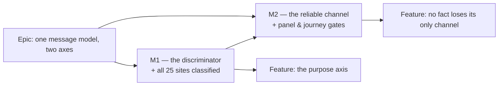

# Implementation Plan: `Alert` says whether it is an event or a standing condition

- **Feature spec:** [`./feature-spec.md`](./feature-spec.md)
- **Status:** Accepted — shipped (ADR-0132)
- **Owner:** unassigned — awaiting approval

## Breakdown

Two milestones. M1 is where the decision and the risk live; M2 is where the consequence is repaid
and pinned. Both keep `main` releasable, and M1 is releasable on its own — it is a strict
improvement even if M2 never lands, because only one of the ten conditions loses an announcement
that nothing else carries.

### Epic

**One message model, two axes** — give `Alert` a way to say whether it announces, so that a standing
condition stops being marked up as something that just happened. Closes `docs/TECH_DEBT.md` #118
item 3. Not a roadmap theme; debt repair on a shared primitive, specced because ADR-0105's
component-contract trigger fires.

---

## Milestone 1 — The discriminator lands and every site declares

**Outcome:** `Alert` can express the distinction; all 25 call sites state which case they are in;
the ten standing conditions stop being live regions. Observable immediately: on `/staff` with the
caveats true, the assertive interruptions and the duplicated retention sentence are gone.

**Entry point:** the existing **Staff console** (`/staff`, reached from the account menu →
`Staff console`; ADR-0086). No new surface, no new control — the change is to what an existing
screen exposes to assistive technology. The auth screens are unchanged by design.

**Journey:** ADR-0081 §2's rule is met by the milestone's own gate rather than by a new suite. The
first user-facing milestone must be driven by something that runs the real product, and G4 —
one added assertion in the existing `apps/web/e2e-staff/staff.spec.ts` — does that. **A new
Playwright config is deliberately not created**; `e2e-staff` already opens this exact screen, and
adding a config would be a second harness for one assertion (and would itself trip an ADR-0105
trigger for no benefit).

**Milestone-level note.** M1 lands the prop **and** the classification in one change, and that is
not laziness about slicing. A required prop cannot land without every site updated — `tsc` forbids
a partial migration — so the alternative would be to write `purpose="event"` on ten sites known to
be wrong and correct them in M2. That change would assert something false in its own diff, and a
reviewer reading it would have no way to tell a deliberate two-step from a misclassification. The
classification **is** the reviewable content; splitting it hides it.

---

#### Feature: the `purpose` axis

> **Description:** `purpose: 'event' | 'condition'` on `AlertProps`, required, no default.
> `condition` renders no `role`; `event` renders exactly today's tone-derived role.
> `Omit<…, 'role'>` is preserved.
> **Complexity:** M — the primitive is S; the 25-site classification is the work, and the judgement
> in it is the risk.
> **Dependencies:** none.
> **Risks:**
>
> - _A site is misclassified, silencing a genuine outcome._ → The classification table in spec §1.4
>   is per-line with its reason, and the `E`/`C` split falls cleanly along file boundaries (probe
>   **panel** = outcomes of a run just pressed, all events; probe **sittings** = stored history, all
>   conditions), which is a check on the discriminator being real rather than invented. Reviewer
>   reads the table against the diff.
> - _CQ-1 is decided against the recommendation and two journeys go red in CI._ → Named in spec §3
>   with file and line; the fix (relocate to a text locator) lands in the **same** PR, never as a
>   CI surprise.
> - _The `Omit` is "tidied away" later, since a `purpose` prop makes a `role` prop look harmless._ →
>   G2, verified red.
>
> **Testing requirements:** G1 (unit, both purposes × three tones), G2 (structural, the `Omit`), and
> the existing `alert.test.tsx` cases updated rather than deleted — they pin the ADR-0077 §9
> geometry and the token rule, which this change must not disturb.

##### Task M1-T1 — Add `purpose` to the primitive (≈ one PR with T2; see note)

- **Description:** Extend `AlertProps` with a required `purpose`; gate the role on it; rewrite the
  docblock's live-region paragraph to describe two axes and carry the discriminator question.
- **Complexity:** S
- **Dependencies:** none
- **Risks:** the docblock currently names the token family only indirectly, because
  `surface-seams.structural.test.ts` scans raw file text (`alert.tsx:25-28`). → Do not spell a
  family prefix while editing the prose; run the seam test locally.
- **Testing:** G1; G2.
- **Development steps:**
  1. `purpose: 'event' | 'condition'` on `AlertProps` — required, positioned above `tone` so the
     reader meets the ARIA-bearing prop first, and documented with `useTooltip`'s reasoning cited by
     file and line (`tooltip.tsx:44-55`).
  2. In the component, resolve `const { Icon, role } = TONE_META[tone]` and spread the role only
     when `purpose === 'event'`. `Icon` is unconditional — `tone` keeps owning the icon and colour.
  3. Docblock: replace the "derived from the tone, never passed in" paragraph with the two-axis
     statement; add the discriminator question verbatim from spec §2 ("would this sentence read the
     same to somebody who arrived five minutes later and did nothing?"); state that `Omit<…, 'role'>`
     stands and why; add the `NoticeStrip` cross-reference (US-4).
  4. G1 in `alert.test.tsx`: `purpose="condition"` renders **no** `role` attribute for `error`,
     `success` and `info`; `purpose="event"` renders `alert`, `status`, `status`. Assert the absent
     attribute directly (`expect(el).not.toHaveAttribute('role')`), not via a `queryByRole` miss —
     the two fail for different reasons and only the first names this one.
  5. G2: one structural assertion that `alert.tsx`'s props type still `Omit`s `role`, comments
     stripped first. **Verify red by deleting the `Omit`.** (Comment-stripping is not optional
     here: this repository has five recorded instances of a scan matching its own prose, and the
     docblock this task rewrites will contain the word.)
  6. Update the existing `alert.test.tsx` cases to pass a `purpose` — the geometry, icon, ref and
     colour-literal assertions are unrelated to this change and must keep passing unmodified in
     substance.

##### Task M1-T2 — Classify all 25 call sites

- **Description:** Add `purpose` at every call site per spec §1.4. Two adapters fix it; ten sites
  become `condition`; thirteen become `event`.
- **Complexity:** M — mechanical in the edit, judged in the review.
- **Dependencies:** M1-T1. **Must be the same PR**: a required prop makes the two inseparable.
- **Risks:**
  - _Reviewer fatigue over 25 near-identical hunks._ → The PR description carries the §1.4 table so
    each hunk can be checked against a stated classification rather than re-judged.
  - _`staff.tsx:344` looks like a mistake in review_ (`tone="error"` + `purpose="condition"`). → It
    is the intended combination; spec §2 "Edge cases" says so and the call site gets a one-line
    comment saying it too.
- **Testing:** `pnpm typecheck` is the completeness gate — S3. Existing suites must pass unchanged
  except where they assert a role on a now-`condition` node (expected: none on the staff side;
  checked).
- **Development steps:**
  1. `server-error.tsx:53` and `form.tsx:487` → `purpose="event"`, each with a one-line comment
     naming why the adapter can decide for its callers (a server failure and a submit-time problem
     count are outcomes by construction). Confirm their 19 downstream call sites are untouched.
  2. `staff.tsx` ×6 and `probe-sittings.tsx` ×4 → `purpose="condition"`.
  3. The remaining thirteen → `purpose="event"`.
  4. `sign-in.tsx:27` → `purpose="event"` per **CQ-1**, with a comment recording that its delivery
     is first-paint and therefore AT-dependent regardless, and that
     `e2e-public/public-screens.spec.ts:237,267` depend on the role. If CQ-1 is decided the other
     way, relocate both assertions **in this PR**.
  5. `pnpm typecheck` — confirm zero remaining sites. If it names a file not in the §1.4 table, the
     table was wrong and the spec is corrected before proceeding.
  6. `pnpm lint && pnpm test`.

##### Task M1-T3 — The characterisation gate (G3)

- **Description:** A component test that renders the staff panels settled, with every caveat true,
  and asserts the live-region census.
- **Complexity:** S
- **Dependencies:** may be **written before** M1-T1 and verified red against today's code — the
  cheapest way to be sure it discriminates.
- **Risks:** _the test passes vacuously because the panels rendered nothing_ (ADR-0120's own gate
  shipped this way). → A pinned positive: assert the caveat's **text** is present before asserting
  its role is absent, so "found nothing" and "there is nothing" stay distinguishable.
- **Testing:** this is the test.
- **Development steps:**
  1. Render `RetentionPanel` and `MailHealthPanel` with a settled query stub: sweeping disabled,
     `consecutiveFailures > 0`, table overdue, no transport configured.
  2. Assert the caveat sentences are in the document (the pinned positive).
  3. Assert each `Panel` body contains exactly **one** element with a live role — the
     `aria-live="polite"` paragraph (`panel.tsx:39-41`) — and that the document contains **no**
     `role="alert"`.
  4. Assert `staff.tsx:316`/`:323` are still the `aria-describedby` targets of the retention table,
     so the fix cannot be mistaken for permission to delete them.
  5. Run against `main` first and record that it fails; then against the branch.
  6. Docblock: state that jsdom has no assistive technology and this asserts rendered `role`
     attributes only. Say it in the file, not only in the spec — the file is what the next reader
     opens.

##### Task M1-T4 — Docs, ADR, changeset

- **Description:** Bring the written record in step with the code, in the same PR.
- **Complexity:** S
- **Dependencies:** M1-T1..T3
- **Risks:** _`DESIGN_SYSTEM.md:658-661` becomes actively wrong the moment T1 merges_ — it states
  "derived from the tone and is not a prop". → It is edited in this task, not left for a later pass.
- **Testing:** `pnpm check:doc-links`, `pnpm check:adr-coverage`, `pnpm check:spec-status`.
- **Development steps:**
  1. `docs/DESIGN_SYSTEM.md` Alerts bullet (`:652-669`): replace the "not a prop" sentence with the
     two-axis rule and the discriminator question. Keep the field-vs-form authoring rule, which is
     unaffected.
  2. **Check, do not assume**, whether `docs/UX_STANDARDS.md` restates the tone→role rule; edit it
     if so. (Spec §5 lists this as unverified — it is a lookup, not a claim.)
  3. `notice-strip.tsx` docblock: cross-reference `Alert`, state why one derives and one delegates
     (US-4). No behaviour change.
  4. File the ADR from the spec §4.6 outline. **Take the next free number at filing time** — 0132 is
     free today and numbers have been taken between plan and milestone before (ADR-0071, ADR-0079);
     record the collision rather than routing around it. Add it to `docs/adr/README.md` (ADR-0110 D6
     gates both directions).
  5. `docs/TECH_DEBT.md` #118 item 3 → closed, naming the ADR, and stating what was **not** closed:
     `sign-in.tsx:27`'s first-paint delivery (CQ-1), the three empty-state sites' treatment (CQ-2),
     and the `NoticeStrip` unification (CQ-3). Items 1, 2 and 4 of #118 are untouched.
  6. Set this spec's header to `Approved` on approval, and to `Accepted — shipped (ADR-NNNN)` when
     M2 lands — `check:spec-status` refuses a `Draft` spec that an ADR cites.
  7. Changeset: **patch**, `@repo/web`. The required prop is an internal compile-time contract in an
     application, not a published library API, so no consumer breaks; the user-visible change is a
     behaviour improvement on one screen. Flagged as a judgement rather than asserted — if the
     reviewer reads the ARIA change as user-visible-enough for a minor, take the minor.

---

## Milestone 2 — No fact loses its only channel

**Outcome:** the one standing condition whose announcement is not already carried elsewhere gains a
reliable one, and the milestone's claims are pinned by something that runs the real product.

**Entry point:** the same **Staff console** → **Mail** panel. Observable: with no transport
configured, the panel's settled announcement now says so.

**Journey:** `apps/web/e2e-staff/staff.spec.ts` gains G4 (below). This is the ADR-0081 §2 step for
the epic.

**Why this is a separate milestone.** M1 changes ten sites from "unreliably announced" to "silent by
declaration". For nine of them that is a strict improvement or a wash: eight are duplicated or
adjacent to a status sentence that already carries the fact, and the retention pair is **verbatim**
duplicated (`retention-copy.ts:157-159` against `staff.tsx:316,323`). One is not — Mail's
`statusSentence` is `Mail: N failures in the last 24 hours.` and says nothing about the transport,
while `MailHealthPanel`'s own docblock calls that fact "the part that matters most" and explains
that zero failures with no transport is not health. Repaying that in its own slice keeps M1's diff
honest about what it does and does not cost.

---

#### Feature: the fact moves to the region built for it

> **Description:** Fold "no mail transport is configured" into the Mail panel's `status` sentence,
> where the live region is mounted **before** the content arrives and is therefore reliable.
> **Complexity:** S
> **Dependencies:** M1.
> **Risks:**
>
> - _The status sentence and the Alert now say the same thing_, recreating the duplication this epic
>   removes. → They do not compete: the Alert is `condition` and silent, so the fact is spoken once.
>   The visible prose stays richer than the announcement, which is the normal relationship between a
>   panel body and its status line.
> - _The sentence grows unwieldy._ → It is a `status` string with an existing shape
>   (`retention-copy.ts` is the precedent for keeping this in a tested pure function); keep the
>   transport clause first, since it changes how every number after it should be read.
>
> **Testing requirements:** a unit test on the sentence in both transport states; G4.

##### Task M2-T1 — The Mail status sentence carries the transport fact

- **Description:** `MailHealthPanel`'s `status` states the transport condition when it is absent.
- **Complexity:** S
- **Dependencies:** M1
- **Risks:** the sentence is currently inline in `staff.tsx:141-147`. → Extract to a pure function
  beside `statusSentence`'s home (`features/staff/model/`) if it grows a branch, following that
  file's precedent; do not leave a two-branch ternary inline and untested.
- **Testing:** unit — transport configured (sentence unchanged, asserted against today's string) and
  not configured (sentence names it).
- **Development steps:**
  1. Read `retention-copy.ts:151-163` and follow its shape rather than inventing one.
  2. Add the clause; keep the failure counts.
  3. Unit test both branches; the "configured" branch asserts the **existing** string byte for byte,
     so the change cannot silently alter the healthy case.
  4. Confirm the Security panel needs nothing: its status already reads
     `Content-Security-Policy: 0 distinct violations recorded.` when empty, which carries the
     `staff.tsx:433` empty state's fact. Record the check rather than assuming it.

##### Task M2-T2 — G4, the journey assertion

- **Description:** One assertion in the existing staff journey that the shipped bundle exposes one
  live region per settled panel.
- **Complexity:** S
- **Dependencies:** M2-T1
- **Risks:** _the assertion is vacuous because the panel had not settled_ — the failure mode this
  repository keeps recording. → Await the panel's own settled text first, then count.
- **Testing:** `scripts/e2e-local.sh web:staff` locally **before** pushing (CLAUDE.md §19.8: CI is
  the second opinion, never the first).
- **Development steps:**
  1. In `e2e-staff/staff.spec.ts`, after the Retention panel is asserted visible and settled, assert
     the panel region contains exactly one element with a live role, and that the page has no
     `role="alert"`.
  2. Locate the panel by `getByRole('region', …)`/heading as the file already does — never by copy
     (`docs/TECH_DEBT.md` #133's rule).
  3. Verify red by reverting M1-T2's `staff.tsx` classification locally.
  4. Run `scripts/e2e-local.sh web:staff` **and** `web:public` — the latter because CQ-1 puts two of
     its assertions in this epic's blast radius.

##### Task M2-T3 — Close the record

- **Description:** Flip the spec and plan headers, confirm the register row, confirm nothing else
  drifted.
- **Complexity:** S
- **Dependencies:** M2-T1..T2
- **Testing:** `pnpm prepush` (one command — running its parts by hand is how a gate gets missed).
- **Development steps:**
  1. Spec + plan `**Status:**` → `Accepted — shipped (ADR-NNNN)`.
  2. Re-read `docs/DESIGN_SYSTEM.md` and the two docblocks against the shipped code — the epic's own
     subject is a document that stopped describing its component, so this is the one place it would
     be embarrassing to skip.
  3. Changeset for M2 (patch, `@repo/web`).

---

## Sequencing & slices

1. **M1-T3** may be written first and verified red — the cheapest proof the gate discriminates.
2. **M1-T1 + M1-T2 + M1-T3 + M1-T4** ship as **one PR**. The required prop makes T1 and T2
   inseparable; T3 and T4 are small and belong with the decision they pin and describe.
3. **M2-T1 + M2-T2 + M2-T3** ship as a second PR.

`main` is releasable after either.

**No feature flag.** ADR-0088 D1 established that a `VITE_*` constant is inlined at build time and
has never been an operator rollback — `apps/web/Dockerfile` declares one `VITE_` build arg and
`docker-publish.yml` passes none — so a flag here would buy nothing and would add a second JSX root
to a primitive (ADR-0088's Class A shape) for a change with no alternative layout. The rollback is a
commit boundary, which is what ADR-0061 and ADR-0077 used for structural refactors of this kind.

**Agents to involve.**

- **accessibility-reviewer** — required, before merge of M1, not at a later gate pass. CLAUDE.md
  §19.13: this changes a shared primitive's ARIA wiring, and twice in two days such a change passed
  every gate here and was wrong. This is squarely that class.
- **component-reviewer** — required for M1: two primitives now answer one question two ways, and
  whether the cross-reference (US-4) is sufficient rather than a fudge is exactly its remit.
- **ux-reviewer** — M2, on the copy of the Mail status sentence.
- **test-engineer** — optional; G1–G4 are specified concretely enough to write directly.
- **database-architect** — **not engaged, and that is a statement**: there is no model, column,
  index, constraint or migration in this epic. Recorded so "the agent was not run" cannot later read
  as an oversight (ADR-0121's wording).
- **security-reviewer**, **backend-performance-reviewer**, **api-reviewer**, **devops-reviewer** —
  not engaged; `apps/api` is untouched and no infrastructure changes.

## Definition of Done (per task)

Each PR satisfies the Feature Completion Criteria in [`docs/PROCESS.md`](../../PROCESS.md). Three
worth calling out for this epic specifically:

- **`pnpm prepush` is run, as one command**, before pushing.
- **`scripts/e2e-local.sh web:staff` and `web:public`** are run locally for any PR touching a
  classification. `apps/api` is untouched, so `scripts/e2e-local.sh api` is not required — stated so
  its absence is a decision rather than an omission.
- **Every new assertion is verified red first** against the specific defect it guards (ADR-0110 D5:
  a gate is not finished when it passes; it is finished when it has been made to fail by the defect
  it was written for). G2, G3 and G4 each name their mutation above.

## Risks & assumptions (rollup)

| Risk / assumption                                                                                       | Likelihood | Impact | Mitigation                                                                                                                                                                                                        |
| ------------------------------------------------------------------------------------------------------- | ---------- | ------ | ----------------------------------------------------------------------------------------------------------------------------------------------------------------------------------------------------------------- |
| A site is misclassified and a real outcome goes silent                                                  | low        | med    | Per-line table in spec §1.4 with reasons; the E/C split falls along file boundaries, which is a check on the discriminator; accessibility + component review before merge                                         |
| CQ-1 decided against the recommendation, breaking two `e2e-public` assertions                           | low        | low    | Named with file and line in spec §3; relocated in the same PR if so                                                                                                                                               |
| A future author writes a standing condition as `event`                                                  | med        | low    | **Unmitigated, and stated as such** — no gate can read intent. The `DESIGN_SYSTEM.md` rule and the discriminator question in the docblock are the only instruments                                                |
| The `Omit<…, 'role'>` is removed later as redundant-looking                                             | low        | high   | G2, verified red                                                                                                                                                                                                  |
| Someone reads G1–G4 as evidence about what a screen reader says                                         | med        | med    | Stated in spec §1 success criteria, §4.5, and in G3's own docblock — three places, because this is the claim most likely to be repeated without its qualifier                                                     |
| **Assumption:** `Panel`'s `aria-live` paragraph is announced reliably (mounted empty, filled on settle) | —          | high   | Read from `panel.tsx:22-41`, whose docblock states the mechanism and why. Not independently verified against real AT; if false, M2's repair channel is also unreliable and the epic's conclusion for Mail changes |
| **Assumption:** the ten `condition` sites are all reachable in reading order after the change           | —          | med    | True by construction — only the `role` attribute is removed; nothing is hidden, moved or unmounted. Confirmed by G3 asserting the sentences are present                                                           |
| **Assumption:** `retention-copy.ts:157-159` really does duplicate the two retention Alerts              | —          | med    | Read directly; the strings are quoted in spec §0. This is the evidence the "do nothing" option is rejected on, so it is the claim most worth re-checking at review                                                |
