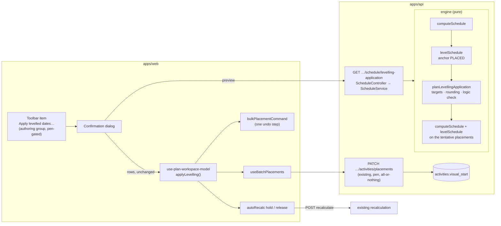
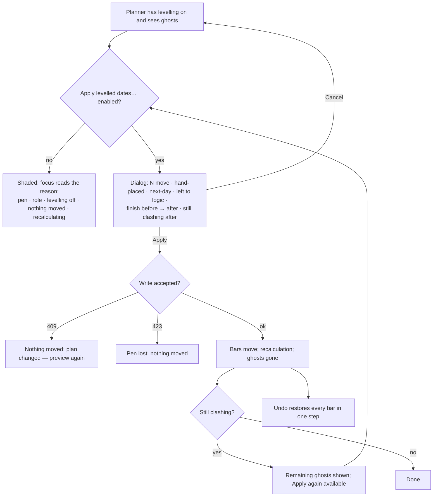

# Feature Spec: Apply levelled dates

- **Status:** Draft — awaiting approval before implementation.
- **Author(s):** feature-analyst (for the product owner)
- **Date:** 2026-09-30
- **Tracking issue / epic:** the "later" half of `docs/TECH_DEBT.md` #413 Q1 (c), recorded in
  `docs/HANDOFF.md:29`, `:40` and `:59`. No register row of its own; this spec is the record.
- **Roadmap link:** none. `docs/ROADMAP.md:465` names it as "a possible later step".
- **Related ADR(s):** a new ADR is required (outline in §4.9; the next free number, 0167 at the time of
  writing). It follows ADR-0148 D9 (levelled is a lens, never an authority), ADR-0166 (levelling anchors
  on the drawn span), ADR-0134 as amended by ADR-0148 (a date change writes what the equivalent drag
  writes), ADR-0048 (undo), ADR-0073 (audit tests), ADR-0028 (the pen), ADR-0093 and ADR-0133 (where a
  command lives), ADR-0088 D1 (no flag) and ADR-0081 (entry point and journey). **No ADR may cite this
  directory until the header above says `Approved`** (`check:spec-status` S3).

**Why a spec and not a register fix (ADR-0105).** Three triggers fire: a new user-facing entry point (a
toolbar command and its dialog), a new public API route (a read), and a component whose contract is new
(the confirmation dialog). The fourth, a schema change, does **not** fire under the recommended design
(§4.4); one of the alternatives in CQ-4 would fire it.

---

## 0. What was checked

Every row was **read** in the file and lines cited, except where it says "grep", which names the search
that was run. Nothing here was measured by running the product; M0 does that.

| #   | Claim the design depends on                                                                                        | What the code says                                                                                                                                                                                                                                                                                                                                                                                                                         | Effect on the design                                                                                                                                                                                                                                           |
| --- | ------------------------------------------------------------------------------------------------------------------ | ------------------------------------------------------------------------------------------------------------------------------------------------------------------------------------------------------------------------------------------------------------------------------------------------------------------------------------------------------------------------------------------------------------------------------------------ | -------------------------------------------------------------------------------------------------------------------------------------------------------------------------------------------------------------------------------------------------------------- |
| A1  | A drag, a typed Start and a bulk move all write `visualStart` and no constraint.                                   | ADR-0134's header records ADR-0148's amendment ("a typed start always hand-places", `0134-…md:11-13`). The bulk move sends `visualStart` through `PATCH …/activities/placements` (`use-plan-workspace-model.ts:868-904`); the create-by-drag writes `visualStart` and "no implicit constraint" (`:726-745`).                                                                                                                               | "Apply" writes what dragging each bar onto its ghost would write: `visualStart`. The stored constraint is round-tripped verbatim (CQ-1).                                                                                                                       |
| A2  | The placement column is a **date**, not an instant.                                                                | `visualStart DateTime? @map("visual_start") @db.Date` (`schema.prisma:1296`). Pass 2 places the bar at the first working minute on or after that date's midnight: `rollForwardToWorking(cal, instantToAbsMinutes(activity.visualStart))` (`compute.ts:351-356`).                                                                                                                                                                           | A placement can only say "start of this day".                                                                                                                                                                                                                  |
| A3  | **A levelled start can fall part-way through a day.**                                                              | The levelled start is the first instant a resource frees up: `earliestFeasibleStart(calA, esInst, d, perResource)` (`level.ts:274-279`), taken unchanged at `:300`. `leveledDate` then reports the day **containing** that working minute (`level.ts:539-554`). So a crane freed at 13:00 gives a levelled start date of that day, and copying the date into `visualStart` puts the bar at 08:00 on it: four hours of the clash come back. | The target date cannot be copied from `leveledStart`. It is derived from the levelled **instant**, rounded forward to the next day start when needed (§4.6, CQ-4). The instant exists only inside the engine, so the derivation is server-side.                |
| A4  | The browser cannot tell a part-day delay from a whole-day one.                                                     | `levelingDelayDays` is `Math.round(minutes / dayFactorMinutes)` (`activity-response.dto.ts:539-542`, `day-factor.ts:203-207`), and `leveledStart` is a date (`schema.prisma:1450`).                                                                                                                                                                                                                                                        | A client-only "copy the ghost" implementation would silently leave part-day clashes. Rejected in §4.8.                                                                                                                                                         |
| A5  | **Levelling does not push successors.**                                                                            | `levelSchedule`'s signature takes activities, the network output, assignments, resources and options, and **no edges** (`level.ts:85-91`). grep `successor\|predecessor\|incoming\|dependenc` in `level.ts`: **0 matches**. A delayed predecessor therefore leaves an unresourced successor's overlay untouched (the `A→C` fixture at `level.spec.ts:681` has `C` with no assignment, so no overlay).                                      | The ghost set can be logically impossible: a successor's ghost can start before its delayed predecessor's ghost finishes. Applying it blindly would plant conflicts. §4.6 step 4 handles it, using the engine as the oracle rather than re-implementing logic. |
| A6  | Pass 2 already carries a moved predecessor's push to unplaced successors, and flags a placed one it cannot honour. | `prop = placed !== null ? Math.max(placed, logicEarliest) : logicEarliest` (`compute.ts:358`) is what an activity passes on; the conflict flag is `placed !== null && placed < logicEarliest` (`compute.ts:373`).                                                                                                                                                                                                                          | After applying, unplaced followers move by logic with no extra write. A target the engine flags `EARLIER_THAN_LOGIC` passes on exactly what dropping it would (both pass `logicEarliest`), so dropping it changes nothing downstream (§4.6 step 4).            |
| A7  | The only activities levelling ever moves are not-started, non-mandatory, plain tasks.                              | `isPinned` covers mandatory, LOE, WBS summary, milestone and started (`level.ts:169-174`); a self-over-allocated activity is pinned too (`level.ts:233-236`). A pinned activity's overlay is its anchor, delay 0 (`level.ts:214-222`).                                                                                                                                                                                                     | The apply set never contains a summary (which the batch route refuses, `activities.service.ts:939-946`), a milestone (no finish-milestone date convention to handle), progress, or a mandatory pin.                                                            |
| A8  | An all-or-nothing, pen-gated, version-checked batch placement write exists.                                        | `PATCH …/plans/:planId/activities/placements` (`plan-activities.controller.ts:135-175`); the service asserts `activity:update`, the pen and scope, refuses duplicates and summaries, and rejects the whole batch on any stale version (`activities.service.ts:907-974`). ≤ 2,000 rows (`update-placements.dto.ts:119-127`). The UPDATE bumps `version` and sets `updated_by` (`activity.repository.ts:277-298`).                           | The write reuses this route unchanged. No new write path.                                                                                                                                                                                                      |
| A9  | A reversible bulk placement already exists on the undo stack.                                                      | `bulkPlacementCommand` restores `before` / re-applies `after` through the same batch route and threads versions (`commands.ts:978-1001`). `moveMany` shows the whole pattern: recalculation hold, `beginLayoutEdit`, `onWriteRejected` for a lost pen, 409 handling (`use-plan-workspace-model.ts:868-930`). Undo triggers a recalculation because `visualStart` is in the scheduling-input signature (`:675-688`).                        | Apply is one undo step, built from existing parts. Redo re-writes the same dates; it does not re-run levelling.                                                                                                                                                |
| A10 | Bulk placement is not audited, by decision.                                                                        | `'PATCH …/plans/:planId/activities/placements': REASONS.PLAN_CONTENT` (`audit-coverage.structural.spec.ts:276`), whose reason is "permanently excluded … scales with the number of interactions" (`:164-170`). Every route must be classified or that spec fails (`:196`).                                                                                                                                                                 | The write earns no audit row (default; §2 Permissions). The new read must be added to the census as `READ`.                                                                                                                                                    |
| A11 | Applying moves no network date, float or critical flag.                                                            | Pass 2 "never writes back, so `early*`/`late*`/float stay a pure function of the network" (`compute.ts:307-313`). The float a planner is shown is `remaining_float = total_float − visual_drift` (`schema.prisma:1371-1375`).                                                                                                                                                                                                              | The critical path stays about logic; "float left" falls on every applied bar and can go negative. Stated in the dialog and CQ-1.                                                                                                                               |
| A12 | P6 and MS Project exports do not carry placements.                                                                 | The export passes `visualStart` to the mapper only so it can count what the file drops; "no serialiser reads it" (`export.service.ts:219-223`, ADR-0148 D7). A SchedulePoint XER carries it in an inert field (ADR-0156).                                                                                                                                                                                                                  | After applying, a file sent to a P6 user shows the network dates. This is the main cost of CQ-1's recommended answer.                                                                                                                                          |
| A13 | A downstream plan reads the upstream **placed** span.                                                              | ADR-0148 D10: the cross-plan forward bound folds the predecessor's `visualEffectiveStart`/`Finish`, in both the programme and the single-plan recalculation.                                                                                                                                                                                                                                                                               | Applying in one plan moves its cross-plan successors on their next recalculation, exactly as a drag does. Nothing new is triggered.                                                                                                                            |
| A14 | The Analysis menu is for measuring, not changing.                                                                  | Its docblock: "three surfaces for **measuring** a plan against something" and `Schedule settings…` stays out because it "_changes_ how dates are computed" (`tsld-toolbar-items.tsx:1394-1409`). The nearest precedent for a plan-wide, pen-gated rearrangement is `auto-arrange` (`:2931-2947`: `penGated: true`, `scheduleRefusal`, tier 2).                                                                                             | The command does not go in Analysis. It sits in the authoring group beside Arrange (§4.7).                                                                                                                                                                     |
| A15 | Only Planner and Org Admin hold `activity:update`.                                                                 | It is in `HIERARCHY_WRITE` only (`org-permissions.ts:184-220`); Contributor holds `activity:update_progress` (`:228`).                                                                                                                                                                                                                                                                                                                     | The command is for Planner and Org Admin; everyone else sees it shaded with a reason.                                                                                                                                                                          |
| A16 | Engine-running reads carry a per-route throttle.                                                                   | `@Throttle(FLOAT_PATHS_THROTTLE)` and `@Throttle(CRITICAL_PATH_TEST_THROTTLE)` (`schedule.controller.ts:164`, `:291`), with the reason at `:48-52`.                                                                                                                                                                                                                                                                                        | The preview read gets one too.                                                                                                                                                                                                                                 |

**Two side findings, not fixed here** (filed as register rows in M0-T3, because each is a defect in shipped
behaviour whether or not this feature ships):

- **S1. A part-day levelling delay is counted and never drawn.** `leveledActivityCount` counts
  `levelingDelay > 0` minutes (`level.ts:358`); the ghost is withheld when `leveledStart ===
visualEffectiveStart` as **dates** (`lenses.ts:470`). An activity pushed from 08:00 to 13:00 on the same
  day is in the count and has no ghost. The lens docblock (`lenses.ts:447-451`) says the two "agree at day
  granularity", which is true and is exactly the case it does not cover.
- **S2. `leveledProjectFinish` can understate.** A non-participant counts at its own anchor finish
  (`level.ts:362-370`), and A5 means a follower of a delayed activity is never pushed in the overlay. So
  "Levelled finish" in the summary (`ScheduleSummaryStrip.tsx:143`) can be earlier than the finish the plan
  would actually have after levelling. The preview in this spec computes the real figure (§4.6 step 6),
  which is how a planner will first see the difference.

---

## 1. Business understanding

### Problem

Resource levelling shows, as a dashed "ghost", where each bar would have to go so that no resource is
over-booked. Since ADR-0166 it starts from where each bar is drawn. But the ghost is only a suggestion:
the bars stay where they are (ADR-0148 D9). A planner who agrees with the suggestion has to drag every
ghosted bar onto its ghost by hand, one at a time. On a plan with twenty clashing lifts that is twenty
drags, each of which may land a day off, and each of which changes the next ghost as the plan recalculates.

The product owner chose, on 2026-09-30, "the ghost now, and an Apply levelled dates command later, under
its own spec" (#413 Q1 (c), `docs/specs/placed-load-basis/feature-spec.md:3-6`). This is that spec.

### Users

- **Planner** and **Org Admin** (hold `activity:update` and the pen): run the command. This is who it is for.
- **Contributor** and **Viewer**: see the command shaded with the reason ("Your role cannot move
  activities"), and see the result after a Planner applies it. No new capability.
- **External Guest**: nothing new. Guests see the plan as placed (ADR-0163), so after a Planner applies
  levelling, a guest sees the moved bars. The guest view has no command surface.

### Primary use cases

1. A planner turns on levelling, looks at the ghosts, agrees, and accepts them all in one step.
2. The same planner changes their mind and undoes it in one step.
3. A planner applies, sees that two bars still clash (because moving the first ones pushed others), and
   applies again.

### User journeys

- Plan workspace → take the pen → authoring row → **Apply levelled dates…** → dialog lists what will move
  → **Apply to N activities** → the bars move, the ghosts disappear, one undo step is recorded.
- Alternate: the same, then **Undo**.
- Alternate: the command is shaded, and focusing it says why (levelling off, nothing to apply, schedule
  still recalculating, no pen, role).

See §4.3.

### Expected outcomes

Accepting levelling is one action rather than many, lands every bar exactly where the resource frees up
(not a day early), never plants a logic conflict the ghost did not already show, and can be undone as one
step.

### Success criteria

- **SC-1.** On `plan:capability-levelling`, pressing Apply then waiting for the recalculation leaves
  `leveledActivityCount` equal to the preview's `remainingAfterApply` (the engine is the oracle,
  ADR-0066). On that plan it is expected to be 0; M0 measures it.
- **SC-2.** A part-day fixture (a 4-hour crane lift before a 1-day one) applies with **no** residual
  clash, where copying the ghost's date would leave one (A3). Red against a date-copy implementation.
- **SC-3.** A fixture where levelling delays a predecessor more than its resourced successor produces
  **zero** `EARLIER_THAN_LOGIC` conflicts after applying (A5, A6). Red against applying every ghost.
- **SC-4.** Undo restores every `visualStart` to its prior value (including null) in one step, and the
  recalculation that follows restores the prior ghosts.
- **SC-5.** `computeSchedule`'s outputs and the levelling overlay are byte-identical for every input when
  the command is not used (§4.5, parity). `compute.spec.ts` and `level.parity.spec.ts` are not edited.
- **SC-6.** The preview read stays inside the recalculation's own latency envelope at 2,000 activities
  (it runs the engine twice with no write). M1 measures and records it; no number is claimed here.

### Open questions

Four are critical (CQ-1 to CQ-4) and five have defaults (D-1 to D-5). See §6.

---

## 2. Functional requirements

### User stories & acceptance criteria

> **US-1** — As a **Planner**, I want to accept every levelled position in one action, so that I do not
> drag each ghosted bar by hand.
>
> - **Given** levelling is on, the schedule is up to date, I hold the pen, and levelling moved at least one
>   bar, **when** I press **Apply levelled dates…**, **then** a dialog lists every activity that will move,
>   with its current and new start.
> - **When** I confirm, **then** every listed activity's `visualStart` is set to its target date in one
>   all-or-nothing write, its constraint is unchanged, the plan recalculates, and the listed bars' ghosts are
>   gone.
> - **Then** one undo step is recorded, labelled "Apply levelled dates (N activities)".
> - **Given** an activity levelling did not move, **then** it is not written, even if it takes part in
>   levelling. Writing it would turn an unplaced bar into a placed one and freeze it against later logic
>   changes, for no visible change.

> **US-2** — As a **Planner**, I want each bar to land where the resource actually frees up, so that
> applying levelling does not leave a clash behind.
>
> - **Given** the levelled start falls at the first working minute of a day, **then** the target is that
>   day.
> - **Given** it falls part-way through a day, **then** the target is the next day whose first working
>   minute is at or after it (CQ-4), and the dialog says how many bars this affects and why.
> - **Given** a bar lands a part-day later than its ghost this way, **then** the dialog's "still clashing
>   after this" figure (US-4) already accounts for it.

> **US-3** — As a **Planner**, I want applying never to put a bar earlier than its links allow.
>
> - **Given** levelling delayed a predecessor more than a resourced successor (A5), **when** the preview
>   solves the plan with the new positions, **then** any target the engine reports as earlier than logic is
>   **not written**. An unplaced successor is carried later by logic (A6); a hand-placed one keeps its own
>   placement, and the dialog names it as now conflicting.
> - **Then** the apply produces no `EARLIER_THAN_LOGIC` conflict that was not already on the plan, except
>   on hand-placed bars the dialog named.

> **US-4** — As a **Planner**, I want to see the consequence before I confirm.
>
> - The dialog states: how many activities move; how many of those were hand-placed (and will lose that
>   placement, recoverable by undo); how many land on the next day because the resource frees part-way
>   through a day; how many are left to logic instead; the plan finish before and after (the **placed**
>   finish, #404); and how many bars levelling would **still** move after this (`remainingAfterApply`).
> - **Given** `remainingAfterApply > 0`, **then** the dialog says "N activities will still clash. You can
>   apply again." (CQ-3).

> **US-5** — As a **Planner**, I want to undo it in one step.
>
> - **When** I press Undo, **then** every written `visualStart` returns to its previous value, including
>   null, through the same batch route, and the plan recalculates (A9).
> - **When** I press Redo, **then** the same target dates are written again. Redo does **not** re-run
>   levelling, so it reproduces exactly what was applied.

> **US-6** — As a **Contributor, Viewer or a Planner without the pen**, I want to know why I cannot apply.
>
> - The command is shaded (ADR-0082: focusable, with its reason) and says one of, in this order:
>   "Take the edit lock to change this plan." / "You don't have permission to change this plan." (the two
>   sentences `bulkOperations.gate` already uses, `use-plan-workspace-model.ts:825-832`) /
>   "Resource levelling is off for this plan" (the lens's existing reason, `tsld-toolbar-items.tsx:1065`) /
>   "Levelling moved nothing" / "Waiting for the schedule to recalculate".

### Workflows

1. **Preview (read).** The client calls `GET …/plans/:planId/schedule/levelling-application`. The server
   builds the engine graph, runs `computeSchedule` and `levelSchedule` (`anchor: 'PLACED'`), derives the
   targets (§4.6), solves a tentative copy, and returns the rows to write plus the consequences. No lock,
   no transaction, no write, no pen (the `floatPaths` shape, `schedule.service.ts:934-938`).
2. **Confirm.** The dialog renders the response. Nothing is written until the planner confirms.
3. **Write.** The client sends the response's rows unchanged to `PATCH …/activities/placements` (A8),
   holding the auto-recalculation across the write and marking the rows for layout (the `moveMany`
   pattern, A9), then records the undo step and releases the hold, which recalculates.
4. **Result.** An event announcement (ADR-0132): "Moved N activities to their levelled dates." The ghosts
   that remain are the ones the preview predicted.

### Edge cases

| Case                                                                         | Behaviour                                                                                                                                                                                                                                          |
| ---------------------------------------------------------------------------- | -------------------------------------------------------------------------------------------------------------------------------------------------------------------------------------------------------------------------------------------------- |
| Levelling moved nothing                                                      | Command shaded: "Levelling moved nothing". The preview is never called.                                                                                                                                                                            |
| Levelling off                                                                | Shaded with the lens's existing reason.                                                                                                                                                                                                            |
| Schedule stale (pending edits, `schedule-state.ts:59`)                       | Shaded: "Waiting for the schedule to recalculate". The preview reads current inputs, so it would otherwise list something other than the ghosts on screen.                                                                                         |
| The plan changes between preview and confirm (a row's version moved)         | The batch refuses the whole write with 409 (A8). The dialog shows the existing conflict sentence and offers to preview again. Nothing moves.                                                                                                       |
| The pen is lost between preview and confirm                                  | 423; `onWriteRejected` updates the pen state (A9). Nothing moves.                                                                                                                                                                                  |
| A delayed activity was hand-placed                                           | Its placement is overwritten (D-1). Counted and listed separately in the dialog. Undo restores it.                                                                                                                                                 |
| A delayed activity carries an `SNLT`/`FNLT` and the new position breaches it | Written. The engine flags `LATER_THAN_BOUND` (ADR-0148 D5), and the dialog counts these from the tentative solve.                                                                                                                                  |
| `levelWithinFloatOnly` left a residual clash (ADR-0041 §4)                   | Applied at the within-float cap, as levelling placed it. The residual is not flagged today and stays unflagged (the documented contract, `level.ts:69-76`).                                                                                        |
| `levelingWindowExceeded` (pushed past a resource's hire window)              | Applied; the flag stays on the bar.                                                                                                                                                                                                                |
| More than 2,000 activities to move                                           | The preview returns them all; the dialog refuses with "More than 2,000 activities would move; the limit for one step is 2,000." The batch cap is `@ArrayMaxSize(2000)` (A8). Splitting is not offered (D-4).                                       |
| An activity on its own calendar (ADR-0037)                                   | Target derived on the **activity's** calendar, the one Pass 2 places it on (`compute.ts:321`, `:356`). The levelled instant is read absolute, not via the plan-frame offset (§4.6 step 1).                                                         |
| An upstream plan in a programme                                              | Downstream plans move on their next recalculation (A13). No programme recalculation is triggered, as with a drag.                                                                                                                                  |
| A baseline is active                                                         | Placed-basis variance moves with the bars (ADR-0025 Amendment 3), as for a drag.                                                                                                                                                                   |
| Undo after a reload                                                          | Not available: the undo stack lives in the session (ADR-0048). Each bar can still be reverted with the existing "Clear placement" remedy (ADR-0094), which returns it to where logic puts it, not to a prior hand placement. Stated in the dialog. |
| Gantt view                                                                   | The command works in both views; its subject is the plan, not the diagram. The ghost lens is canvas-only, so the dialog's list is the Gantt user's view of what moves.                                                                             |

### Permissions

- **Preview:** `activity:update` in the caller's organisation, resolved from memberships (anti-IDOR). A
  foreign or deleted plan is 404. `activity:update` rather than `schedule:read` because the read exists to
  feed a write the caller must be able to make, and because it runs the engine twice: a Viewer should not
  be able to spend that. No pen (it writes nothing).
- **Write:** unchanged: `PATCH …/activities/placements` asserts `activity:update`, the pen and the org and
  plan scope (A8). **Structural**: yes, it feeds the engine, and it is pen-gated (ADR-0028).
- **Audit:** no row, by the existing classification of the batch route (A10, D-2). The census gains the
  preview as `READ`.
- **Roles:** Planner and Org Admin run it (A15). Contributor, Viewer: shaded. Guest: no surface.

### Validation rules

- The preview takes no body and no query parameters. It has nothing to validate beyond the path.
- The write validates as today (A8): every row complete, no duplicates, no summary, versions current.
- The client sends the preview's rows **unchanged**, including the round-tripped `constraintType` and
  `constraintDate`, so the batch cannot clear a constraint by a stale cache.

### Error scenarios

| Scenario                               | Detection                                            | User-facing result                                           | Status |
| -------------------------------------- | ---------------------------------------------------- | ------------------------------------------------------------ | ------ |
| Not a member / foreign plan            | scope resolve                                        | not found                                                    | 404    |
| Role lacks `activity:update`           | permission check                                     | command shaded; route returns forbidden                      | 403    |
| Plan has no start                      | as the recalculation (`schedule.service.ts:426-430`) | "Set the plan's start date…"                                 | 422    |
| Calendar horizon exceeded in the solve | `rejectIfWorkingTimeHorizonExceeded` (`:600-603`)    | the existing horizon message                                 | 422    |
| Preview called too often               | route throttle (A16)                                 | "Too many requests — try again in a moment"                  | 429    |
| Stale version at write                 | batch UPDATE count (A8)                              | "This plan changed since you opened it — nothing was moved." | 409    |
| Pen not held at write                  | `assertHoldsPen` (A8)                                | pen state refreshes; the pen's own sentence                  | 423    |
| More than 2,000 rows                   | client, before the write                             | the refusal in Edge cases                                    | —      |

### Regression tests (the design's proof)

Each case is written to fail against the plausible wrong implementation named beside it (ADR-0110).

**Engine (pure; `engine/apply-levelling.spec.ts`, new).**

- **P1, whole days.** Two 3-day tasks on a capacity-1 crane, no logic. Target = the levelled date. Wrong:
  none; this is the baseline case.
- **P2, part day (SC-2).** A 4-hour lift and a 1-day lift on one crane. The second's levelled start is
  13:00 on day 1; its target is day 2. After a tentative solve and re-level, delay is 0. **Red** against
  "target = `leveledStart`".
- **P3, a follower levelling delayed less (SC-3).** P (crane, 3 days) → S (pump, 2 days), plus Q
  (crane, 3 days, higher priority). Levelling delays P by 3 days and leaves S's overlay where Pass 2 had it.
  S is unplaced, so it is not written at all and logic carries it. Variant with S resourced and delayed by
  1 day: S's target is dropped, and the tentative solve shows no `EARLIER_THAN_LOGIC`. **Red** against
  "write every ghost".
- **P4, hand-placed follower.** As P3 with S hand-placed: S keeps its placement and is reported in
  `conflictingPlaced`.
- **P5, undelayed participant.** Not in the rows. **Red** against "write every participant".
- **P6, own-calendar activity.** An activity on a calendar whose day starts at 06:00 while the plan's
  starts at 08:00; target derived on its own calendar. **Red** against reconstructing the instant from
  `leveledStartOffset` on the plan calendar (the lossy path `level.ts:78-83` documents).
- **P7, idempotence.** Apply P1's rows, recompute and re-level: `leveledActivityCount` 0, and a second
  preview returns no rows.
- **Parity.** `compute.spec.ts` and `level.parity.spec.ts` unedited and green; the S10 conformance slice
  unedited and green.

**API e2e (`apps/api/test/apply-levelling.e2e-spec.ts`, new).**

- **A1, preview then write.** On `plan:capability-levelling` through the public API: preview, send the
  rows to the batch route, recalculate, and read `leveledActivityCount` equal to `remainingAfterApply`.
- **A2, the preview writes nothing.** Every activity's `version` and `visualStart` identical before and
  after a preview, read through Prisma.
- **A3, permissions.** Viewer and Contributor 403; another organisation's plan 404.
- **A4, round-trip.** An applied row carrying an `SNET` keeps it; one carrying none keeps none.
- **Census.** `audit-coverage.structural.spec.ts` lists the new route as `READ` (it fails otherwise).

**Web unit.** The item's five shaded reasons and their order; the dialog's counts and sentences for each
category; the apply wiring records exactly one command whose undo sends the `before` rows; the recalculation
hold is released on every path including a throw (the `moveMany` rule, `use-plan-workspace-model.ts:918-922`).

**Playwright (ADR-0081).** In the existing `e2e-workspace-chrome/placement-overlays.spec.ts` (no new
config): on a levelled seed plan, take the pen, open **Apply levelled dates…**, read the count, confirm,
wait for the recalculation, and assert the **Levelled placement** lens now reports nothing moved; then
**Undo** and assert the ghosts return. A shaded-state step without the pen. Axe check on the open dialog.

**Seed catalogue.** No new plan is needed for the happy path (`plan:capability-levelling`). M0 decides
whether a part-day plan is added (`plan:capability-levelling-part-day`), because P2's shape is not in the
catalogue (grep `levelling` in `apps/seed-cli/src/capabilities/`, checked in M0-T1).

---

## 3. Technical analysis

| Area           | Impact   | Notes                                                                                                                                                                                                                                                                                        |
| -------------- | -------- | -------------------------------------------------------------------------------------------------------------------------------------------------------------------------------------------------------------------------------------------------------------------------------------------- |
| Frontend       | med      | One toolbar registry item (authoring group, pen-gated, tier 3); one confirmation dialog (existing `Dialog` primitive, ADR-0101); the apply wiring in `use-plan-workspace-model.ts` beside `moveMany`; one query hook for the preview. No new primitive.                                      |
| Backend        | med      | Engine: one pure function `planLevellingApplication` and one shared placement-instant helper extracted from `compute.ts:351-356`; one in-memory field on the levelling overlay. Schedule module: one read route and service method. The activities module is not touched.                    |
| Database       | **none** | The write reuses `visual_start`. Nothing new is persisted: the targets, the instants and the consequences are computed per request. No migration, no index. If a task finds a reason to touch schema it stops and goes to **database-architect** (CLAUDE.md §19.3). CQ-4 (b) would need one. |
| API            | low      | One new `GET`. No change to any existing route or DTO. `@repo/types` gains the response type. OpenAPI and `docs/API.md` updated. `api` minor.                                                                                                                                                |
| Security       | low      | New read is org-scoped, `activity:update`, throttled. It returns only fields the caller can already read (activity ids, names, dates, versions, constraints); no cost field, so no `cost:read` variation. The write is an existing, reviewed route.                                          |
| Performance    | med      | The preview runs `computeSchedule` and `levelSchedule` **twice** (current, then tentative) with no lock and no write. At 2,000 activities that is about two recalculations of engine CPU per press. Measured in M1 (SC-6). Throttled. The write is one set-based UPDATE (A8).                |
| Infrastructure | none     | No env var, no service, **no flag** (ADR-0088 D1): the rollback is a commit boundary.                                                                                                                                                                                                        |
| Observability  | low      | One structured log line on the preview (counts, duration), beside the batch route's existing `'activity placements updated'` (`activities.service.ts:964-967`).                                                                                                                              |
| Testing        | med      | §2's cases; one journey extension; possibly one seed plan.                                                                                                                                                                                                                                   |

### Dependencies

- Exists and is reused unchanged: the batch placement route (A8), `bulkPlacementCommand` (A9), the
  auto-recalculation hold, `beginLayoutEdit`, `onWriteRejected`, the pen gate, the `Dialog` primitive, the
  levelled lens and its states.
- Builds on ADR-0166 (shipped, `api` 0.81.0): the levelling anchor and `placed*Offset` on `EngineResult`.
- Not blocked by S1 or S2. S2 is partly answered by this feature's preview.

---

## 4. Solution design

### 4.1 Architecture overview



### 4.2 Data flow

```mermaid
sequenceDiagram
  participant P as Planner
  participant W as Web
  participant S as ScheduleService
  participant E as Engine (pure)
  participant A as ActivitiesService
  participant DB as activities
  P->>W: Apply levelled dates…
  W->>S: GET …/schedule/levelling-application
  S->>DB: load graph (no lock, no tx)
  S->>E: computeSchedule → levelSchedule(PLACED)
  E-->>S: overlay with levelled instants
  S->>E: planLevellingApplication (targets, rounding)
  S->>E: computeSchedule + levelSchedule on tentative placements
  E-->>S: conflicts, placed finish, remaining clashes
  S-->>W: rows + consequences
  W-->>P: dialog
  P->>W: Apply to N activities
  W->>W: autoRecalc.hold, beginLayoutEdit(ids)
  W->>A: PATCH …/activities/placements (rows)
  A->>DB: one UPDATE keyed by id+version (pen asserted)
  A-->>W: rows with new versions
  W->>W: record bulkPlacementCommand; release hold
  W->>S: POST …/schedule/recalculate (coalesced)
```

### 4.3 User flow



### 4.4 Database changes

**None under the recommended design.** `visual_start` exists (`schema.prisma:1296`) and the batch write
already sets it (`activity.repository.ts:277-298`). The preview's instants and consequences are computed
per request and never persisted. **If CQ-4 is answered (b), a schema change is required** (a sub-day
placement), and it must be designed by **database-architect** before any other work; this spec
deliberately does not design it.

### 4.5 Parity (ADR-0034)

- **`computeSchedule` is byte-identical for every input.** The only engine change to an existing file is
  moving the placement-instant expression at `compute.ts:351-356` into a named helper that `compute.ts`
  then calls; `compute.spec.ts` is not edited and is the proof.
- **`levelSchedule`'s persisted outputs are byte-identical.** One in-memory field is added to a
  participant's overlay: the levelled start as an absolute instant, from the `leveledStartInst` that already
  exists at `level.ts:300-318`. It is never written (`writeResults` names its columns). The
  `level.parity.spec.ts` snapshots project named fields; M1-T1 re-checks that claim by reading the snapshot
  file rather than inheriting it from the #413 spec, and checks for any `toEqual` on a participant's whole
  result in `level.spec.ts`.
- **Gates A, B and C (ADR-0166 D5) are untouched**: the recalculation path does not call the new function.
- The only way the schedule changes is a planner pressing the command, which writes an input the planner
  could already write by dragging.

### 4.6 The derivation (the part that needs care)

`planLevellingApplication(activities, results, levelledResults, …)` is a pure engine function. Steps:

1. **Candidates.** Participants with `levelingDelay > 0` (working minutes, not the rounded days, A4). By
   A7 these are all not-started, non-mandatory plain tasks.
2. **Levelled instant.** Read from the overlay's new absolute field, not reconstructed from
   `leveledStartOffset` on the plan calendar, which is lossy for an activity on its own calendar
   (`level.ts:78-83`).
3. **Target date, rounded forward.** The smallest calendar date `D` such that the placement instant of `D`
   on the activity's own calendar is at or after the levelled instant. "The placement instant of `D`" is the
   shared helper extracted from `compute.ts:351-356`, so the apply and the engine cannot disagree about
   what a date means. A target equal to the current drawn start is not a candidate (nothing would move).
4. **Logic check, using the engine as the oracle.** Solve a copy of the plan with every candidate's
   `visualStart` set to its target (`computeSchedule`, in memory). Any candidate the result flags
   `EARLIER_THAN_LOGIC` is **removed from the rows**. This is safe in one pass: a conflicted placement passes
   on `logicEarliest` (`compute.ts:358`), exactly what removing it passes on, so no other activity's result
   changes. Removed candidates are reported as `leftToLogic` if unplaced and `conflictingPlaced` if they
   carry a placement of their own. No rule about links is written in this function.
5. **Remaining clashes.** Run `levelSchedule(anchor: 'PLACED')` on the tentative result.
   `remainingAfterApply` is its `leveledActivityCount`. If step 4 removed nothing, the tentative result is
   already the solve from step 4; if it removed some, the solve is repeated once without them.
6. **Consequences.** Placed project finish before and after (`placedProjectFinishOf`, as the recalculation
   uses at `schedule.service.ts:593`); counts of hand-placed, rounded, left-to-logic, `LATER_THAN_BOUND`
   introduced.
7. **Rows.** For each remaining candidate: `{ id, version, constraintType, constraintDate, visualStart:
target, laneIndex: null }` — the batch route's complete-row shape, with the constraint as read.

The service wraps it: resolve scope, assert `activity:update`, load the plan (404/422), build the graph as
the recalculation does, call the engine, attach names and the `before` placement for the dialog.

### 4.7 API and component changes

**API.** `GET /api/v1/organizations/:orgSlug/plans/:planId/schedule/levelling-application`, in
`ScheduleController` beside `health-check/critical-path-test`, with its own `@Throttle`. Response
`{ data: LevellingApplication }`:

```text
LevellingApplication {
  computedFrom: { scheduleComputedAt: string | null }   // so the client can refuse a stale preview
  rows: ActivityPlacementRow[]                           // exactly the batch route's row shape
  items: { id, name, code, beforeVisualStart, beforeDrawnStart, targetStart,
           wasPlaced: boolean, roundedToNextDay: boolean }[]
  leftToLogic: { id, name }[]
  conflictingPlaced: { id, name }[]
  laterThanBoundIntroduced: number
  projectFinishBefore: string | null                     // placed finish (#404)
  projectFinishAfter: string | null
  remainingAfterApply: number
}
```

Status codes per §2. `docs/API.md` gains the route; the batch route's entry gains one sentence naming this
as a caller. `api` **minor**.

**Components.**

- **Toolbar item `apply-levelling`** in `tsld-toolbar-items.tsx`, `group: 'tools'`, beside
  `auto-arrange`, `penGated: true` (ADR-0133 D5: the pen leads the row it unlocks), **tier 3** so it
  enters the overflow first and does not move the measured row widths (ADR-0090; the fit journey is re-run
  in M2). Label "Apply levelled dates…", icon from Lucide. Its subject is the plan, not the selection, so it
  belongs on the command surface and not the canvas dock (ADR-0093 D1); `selection-duplication.structural.
test.ts` stays green because nothing on the dock shares its name.
- **`ApplyLevellingDialog`** in `apps/web/src/features/schedule/components/` (the feature that owns the
  levelling read-outs), built on the existing `Dialog` and form-layout primitives (ADR-0061, ADR-0101), no
  one-off styling. States: loading (the preview), error (with retry), content, refusal (> 2,000). The list
  uses the long-table pattern (ADR-0165) when it is long. Primary button "Apply to N activities".
- **`applyLevelling`** in `use-plan-workspace-model.ts` beside `moveMany`, reusing its hold, layout, pen
  and 409 handling, recording one `bulkPlacementCommand` with label "Apply levelled dates (N activities)".
- **Announcement** through the existing polite status region: "Moved N activities to their levelled
  dates." (an event, ADR-0132).

`web` **minor**.

### 4.8 Implementation approach & alternatives

**Chosen:** a server-side preview that uses the engine as the oracle, then the existing batch placement
write, undo command and recalculation.

| Alternative                                                                                          | Why not                                                                                                                                                                                                                                                                         |
| ---------------------------------------------------------------------------------------------------- | ------------------------------------------------------------------------------------------------------------------------------------------------------------------------------------------------------------------------------------------------------------------------------- |
| **Client-only: copy each ghost's `leveledStart` into `visualStart`**                                 | Smallest change, and wrong twice: part-day starts put the clash back (A3, A4), and ghosts levelling did not reconcile with logic plant `EARLIER_THAN_LOGIC` conflicts (A5). Neither is visible until after the write.                                                           |
| **A server-side write route (`POST …/apply-levelling`) that computes and writes in one transaction** | Exact, but a second write path for `visual_start` beside the batch route, a new audit classification, and an undo that has to be rebuilt from the response. The preview-then-existing-write shape gets the same exactness, and the planner sees the list before anything moves. |
| **Write `SNET` constraints at the levelled dates** (ADR-0134 D2's old branch)                        | Would make the network critical path and exports show the levelled dates (CQ-1 (b)). But it overwrites any constraint the activity carries, which is the defect ADR-0148 was written to remove (`0148-…md:24-27`), and it turns levelling into logic. CQ-1.                     |
| **Levelling applies itself on every recalculation**                                                  | Rejected by the product owner (#413 Q1 (b)) and by ADR-0148 D9.                                                                                                                                                                                                                 |
| **Make levelling logic-aware first** (push successors inside `level.ts`)                             | The right long-term fix for A5 and S2, and a change to ADR-0041 §1 and ADR-0035 §28 with its own conformance consequences. Out of scope; this feature is correct without it because step 4 asks the engine.                                                                     |
| **Loop until nothing clashes**                                                                       | CQ-3. It can march bars much later than a planner would, and each round is another two engine passes.                                                                                                                                                                           |
| **A `VITE_` flag**                                                                                   | ADR-0088 D1: an operator cannot switch it off, so it would be a second product with no rollback value. The rollback is the commit.                                                                                                                                              |

### 4.9 ADR (outline): "Applying levelling is a placement the planner makes"

- **Context:** #413 Q1 (c); A3, A5; the ghost is a lens (ADR-0148 D9).
- **D1:** applying writes `visualStart` only, what a drag onto the ghost writes; constraints are
  round-tripped (CQ-1).
- **D2:** targets come from the levelled instant on the activity's own calendar, rounded forward to the next
  day start, through the same helper Pass 2 uses (CQ-4).
- **D3:** a target the engine reports earlier than logic is not written; the engine decides, the apply code
  holds no link rule (A5, A6).
- **D4:** one press is one step: preview, confirm, one batch write, one undo entry; what still clashes is
  shown, not chased (CQ-3).
- **D5:** no audit row, following the batch placement route's classification (D-2).
- **D6:** no flag (ADR-0088 D1); entry point and journey (ADR-0081).
- **Consequences:** exports do not carry applied dates (A12); float left falls and may go negative (A11);
  S1 and S2 filed.
- **Does not amend** ADR-0041, ADR-0166 or ADR-0148 D9: levelling still never writes anything by itself.
  ADR-0166's Alternatives line gains a pointer to this ADR.

---

## 5. Links

- Implementation plan: [`./implementation-plan.md`](./implementation-plan.md)
- Docs updated by this change: `docs/API.md` (new route; one sentence on the batch route), the new ADR,
  a pointer in ADR-0166's Alternatives, `docs/TEST_PLAYBOOK.md` (the levelling row gains "and applying it";
  a new row if M0 adds a part-day plan), `docs/TECH_DEBT.md` (S1, S2), `docs/HANDOFF.md` and
  `docs/ROADMAP.md:465`, CLAUDE.md §16 (one line) and the banner's ADR count (`pnpm check:counts`).

---

## 6. Questions

### Critical (the answer changes what gets built)

> **Answered by the product owner, 2026-09-30: CQ-1 (a), CQ-2 (a), CQ-3 (a), CQ-4 (a)** — every
> recommended answer. The defaults below stand. **Build approved 2026-09-30**, to start once the #420/#422/histogram PR is published.

**CQ-1. When a bar is moved to its levelled date, should it be moved like a drag, or pinned with a "start
no earlier than" date?**

- **(a) Moved like a drag (recommended).** The bar sits on its new date exactly as if you had dragged it
  there. Any date constraint it already had is left alone, undo puts it back, and the critical path keeps
  describing the logic. The cost: the moved dates live only in SchedulePoint. If you export to P6 or
  Microsoft Project, the other person sees the original dates, not the levelled ones. And the float shown
  on those bars drops.
- (b) Pinned with a "start no earlier than" date. The levelled dates travel into P6 and Microsoft Project
  exports and push the critical path. The cost: it replaces any date constraint the activity already had,
  which is the problem the "one planning surface" change removed in September.

**CQ-2. Apply to everything levelling moved at once, or let me choose which bars?**

- **(a) Everything at once (recommended).** One button applies every suggested move. You see the full
  list before confirming, and one Undo reverses all of it.
- (b) Also offer "apply to the selected bars" on the canvas. More control, but more to build and test; it
  can be added later without changing (a).

**CQ-3. Moving some bars can push later activities into new clashes. Should one press keep going until
nothing clashes?**

- **(a) One step, and show what is left (recommended).** You see exactly what will move, and the dialog
  tells you if a few will still clash afterwards. You can press Apply again.
- (b) Keep repeating automatically until nothing clashes. Fewer clicks, but bars can end up much later than
  you expected, and you only see the end result.

**CQ-4. Sometimes the resource frees up part-way through a day (for example, after a 4-hour lift). Bars
can only be placed on whole days. What should happen?**

- **(a) Move the bar to the start of the next working day (recommended).** No clash is left behind; the
  bar may start up to one day later than strictly needed. The dialog says how many bars this affects.
- (b) Store part-day start times for placed bars. Exact, but it is a database change to how every placed
  bar is stored, and a much larger piece of work.

### Defaults (no answer needed unless you disagree)

- **D-1.** A bar you had already placed by hand is moved too, if levelling moved it. The dialog lists these
  separately, and Undo puts them back.
- **D-2.** Applying levelling does not write an entry in the organisation's audit log, just as moving a
  group of bars does not. Each moved activity still records who changed it and when.
- **D-3.** The command sits with the editing tools (next to Arrange), needs the edit lock, and is shaded
  with a reason when it cannot be used.
- **D-4.** A plan where more than 2,000 activities would move is refused with a reason rather than split
  into several steps.
- **D-5.** Levelling stays switched on after applying. With nothing left to move it simply shows no
  ghosts.
