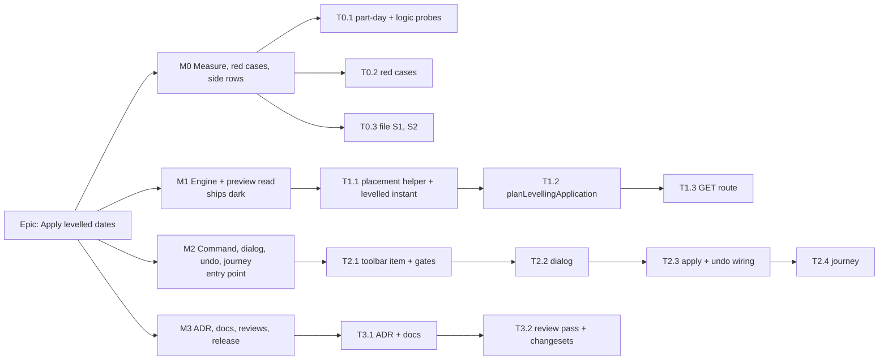

# Implementation Plan: Apply levelled dates

- **Feature spec:** [`./feature-spec.md`](./feature-spec.md)
- **Status:** Draft — awaiting approval before implementation.
- **Owner:** api (engine + schedule module), web (command, dialog, undo wiring)

This plan assumes the recommended answers to CQ-1 to CQ-4 (placement, all at once, one step, round to the
next day). §"If the answers differ" says what changes for each other answer.

## Breakdown

### Epic

**Apply levelled dates.** A Planner accepts every levelled position in one confirmed, undoable step. The
bars land where the resource actually frees up and never earlier than their links allow.

**Parity (ADR-0034):** `computeSchedule` byte-identical (one expression moved into a named helper,
`compute.spec.ts` unedited); the levelling overlay gains one in-memory field, nothing persisted; Gates A, B
and C untouched because the recalculation never calls the new function. **Pen:** the write is the existing
pen-gated batch route; the preview needs no pen. **Structural:** yes. **Flag:** none (ADR-0088 D1). **Schema:**
none. Any task that finds a reason to touch schema **stops** and goes to `database-architect`
(CLAUDE.md §19.3). **Agents:** builder (Sonnet) implements each task; Playwright and `scripts/e2e-local.sh`
are run by the orchestrator, not by agents (`docs/HANDOFF.md:85`).

---

### Milestone M0: measure, red cases, side rows (no behaviour change)

**Outcome:** the two premises the design rests on (A3 part-day levelled starts, A5 logic-unaware ghosts)
are reproduced on real fixtures, and every proving case exists and is red.
**Entry point:** `Ships dark: tests, a measurement record and two register rows; M2 surfaces the feature.`

#### Feature: premises and proof

> **Description:** reproduce A3 and A5 against today's engine; record the cases that M1 turns green.
> **Complexity:** S
> **Dependencies:** none
> **Risks:** a fixture that cannot show the defect (a crane freed at a day boundary, a successor on the same
> resource) passes against the wrong implementation. Each fixture is checked to differ between the right and
> the wrong answer before it is kept (ADR-0110).
> **Testing requirements:** engine unit cases only.

##### Task T0.1 — probe A3 and A5 (≈ one PR with T0.2)

- **Description:** In a scratch spec, build P2's fixture (4-hour lift then a 1-day lift on one crane) and
  confirm the second's levelled instant is mid-day while `leveledStart` is that day. Build P3's (a delayed
  predecessor with a resourced successor delayed less) and confirm the successor's levelled start is earlier
  than the predecessor's levelled finish. Grep `apps/seed-cli/src/capabilities/` for a part-day levelling
  plan and record whether one exists.
- **Complexity:** S
- **Dependencies:** none
- **Risks:** if either premise is **false**, the corresponding design step is unnecessary. Stop and report;
  do not build it.
- **Testing:** the probes, recorded in `docs/specs/apply-levelled-dates/m0-measurement.md`.
- **Development steps:**
  1. Write both probes against `levelSchedule` and `computeSchedule` directly.
  2. Record the instants, dates and the result of a date-copy apply for each.
  3. Decide whether a seed plan for part-day levelling is needed (M3-T3).

##### Task T0.2 — red cases

- **Description:** Add `engine/apply-levelling.spec.ts` with P1–P7 from spec §2 as `it.fails` against a
  stub `planLevellingApplication` that throws, and the API e2e file with A1–A4 skipped behind the missing
  route. The census gains nothing yet.
- **Complexity:** S
- **Dependencies:** T0.1
- **Risks:** a case red only because the function is missing proves nothing. For P2, P3 and P5, also run a
  deliberately wrong stub (date copy, write every ghost, write every participant) and confirm the case fails
  for the stated reason. Record in `m0-measurement.md`.
- **Testing:** the cases.
- **Development steps:**
  1. Write the cases.
  2. Run each against the wrong stubs; record.

##### Task T0.3 — file S1 and S2

- **Description:** Two `docs/TECH_DEBT.md` rows: S1 (part-day levelling delay counted, never drawn) and S2
  (`leveledProjectFinish` ignores the push to followers), each citing the lines in spec §0.
- **Complexity:** S
- **Dependencies:** none
- **Risks:** none.
- **Testing:** `pnpm check:*` gates that read the register.
- **Development steps:**
  1. Write the rows with evidence.

---

### Milestone M1: engine and preview read

**Outcome:** `GET …/schedule/levelling-application` returns the exact rows and consequences for any plan.
**Entry point:** `Ships dark: an API read with no web caller; M2 adds the command that calls it.`

#### Feature: the derivation

> **Description:** the pure function in spec §4.6 and the two small engine changes it needs.
> **Complexity:** M
> **Dependencies:** M0
> **Risks:** moving the placement expression changes a result (mitigated: `compute.spec.ts` and
> `compute.visual.spec.ts` unedited and green); the new overlay field breaks a whole-object assertion
> (mitigated: T1.1 step 2).
> **Testing requirements:** P1–P7 green; parity suites unedited; conformance S10 unedited.

##### Task T1.1 — shared placement instant and the levelled instant

- **Description:** Extract `compute.ts:351-356` (a date to its placement instant, finish-milestone branch
  included) into a named, exported helper that `compute.ts` calls. Add the absolute levelled start instant
  to a participant's overlay in `level.ts` (in memory only, from the `leveledStartInst` already at
  `:300-318`, and the anchor instant for pinned participants).
- **Complexity:** S
- **Dependencies:** T0.2
- **Risks:** `writeResults` persists by named column, so the field is never written; confirm by reading it.
- **Testing:** `compute.spec.ts`, `compute.visual.spec.ts`, `level.spec.ts`, `level.parity.spec.ts`,
  conformance, all unedited except added cases.
- **Development steps:**
  1. Extract the helper; run the compute suites.
  2. Read `__snapshots__/level.parity.spec.ts.snap` and grep `level.spec.ts` for whole-result `toEqual` on
     a participant; record what was found (do not inherit the #413 spec's statement).
  3. Add the field and its type; run every engine suite and `pnpm check:surface-contract`.

##### Task T1.2 — `planLevellingApplication`

- **Description:** Implement spec §4.6 steps 1–7 as a pure function in the engine folder. It calls
  `computeSchedule` and `levelSchedule`; it contains no rule about links.
- **Complexity:** M
- **Dependencies:** T1.1
- **Risks:** a second solve when step 4 removes candidates doubles cost on those plans. Accepted and
  measured in T1.3.
- **Testing:** P1–P7 flip to plain `it`.
- **Development steps:**
  1. Candidates by delay minutes; targets via the helper, rounded forward on the activity's calendar.
  2. Tentative solve; drop `EARLIER_THAN_LOGIC` candidates; re-solve once if any were dropped.
  3. Re-level the tentative result; compute the consequences; build the rows.

#### Feature: the read route

> **Description:** expose the derivation on `ScheduleController`.
> **Complexity:** M
> **Dependencies:** T1.2
> **Risks:** the route's cost (two engine runs). Throttled; measured.
> **Testing requirements:** A1–A4 and the census.

##### Task T1.3 — `GET …/schedule/levelling-application`

- **Description:** Service method (scope, `activity:update`, plan load with the recalculation's 404/422,
  graph build as `recalculateInLock` does but with no lock, no transaction and no pen), DTOs with OpenAPI,
  `@Throttle`, `@repo/types` response type, census entry `READ`, `docs/API.md`.
- **Complexity:** M
- **Dependencies:** T1.2
- **Risks:** building the graph outside a transaction can read a half-committed batch. Same exposure as
  `floatPaths` and the critical-path test, and the write's version check makes it harmless.
- **Testing:** A1–A4 (`apps/api/test/apply-levelling.e2e-spec.ts`); a timing at 2,000 activities using the
  existing scale builder, recorded in `m0-measurement.md` beside the recalculation's figure on the same run
  (SC-6). No number is asserted in CI.
- **Development steps:**
  1. Service + controller + DTOs + throttle.
  2. Census entry; run `audit-coverage.structural.spec.ts`.
  3. Types, OpenAPI, `docs/API.md`; `api` minor changeset.
  4. e2e and the timing.

---

### Milestone M2: the command

**Outcome:** a Planner holding the pen presses **Apply levelled dates…**, reviews the list, confirms, and
the bars move as one undoable step.
**Entry point:** plan workspace command surface, authoring group, button **"Apply levelled dates…"**
(tier 3: in the overflow menu at narrow widths).
**Journey:** `e2e-workspace-chrome/placement-overlays.spec.ts` gains the apply-then-undo step (T2.4), in
this milestone, not deferred.

#### Feature: command and dialog

> **Description:** the toolbar item, its gates, the dialog.
> **Complexity:** M
> **Dependencies:** M1
> **Risks:** the item moves measured row widths (mitigated: tier 3, and the toolbar-fit journey is re-run
> by the orchestrator); a shaded reason that disagrees with the pen gate (mitigated: reuse the
> `bulkOperations.gate` sentences).
> **Testing requirements:** unit (gates, dialog states); a11y (focus into and out of the dialog, shaded item
> reachable with its reason, ADR-0082); accessibility-reviewer before release (ADR-0111, because a dialog's
> focus contract is involved).

##### Task T2.1 — toolbar item and gates

- **Description:** `apply-levelling` in `tsld-toolbar-items.tsx` beside `auto-arrange`: `group: 'tools'`,
  `penGated: true`, tier 3, five reasons in spec US-6's order. Context gains `levelledMoveCount` (from the
  activities the lens already reads) and the schedule-state `stale` boolean.
- **Complexity:** S
- **Dependencies:** M1
- **Risks:** `selection-duplication.structural.test.ts` must stay green (no dock item of the same name).
- **Testing:** registry unit tests for each reason; the structural test.
- **Development steps:**
  1. Item and context fields.
  2. Tests for each shaded state and the enabled state.

##### Task T2.2 — `ApplyLevellingDialog`

- **Description:** In `features/schedule/components/`: fetch the preview on open; loading, error with retry,
  content, and > 2,000 refusal states; the counts and sentences of spec US-4; the list (long-table pattern
  if long); "Apply to N activities" and "Cancel". Refuse and re-fetch if the preview's
  `scheduleComputedAt` is older than the client's.
- **Complexity:** M
- **Dependencies:** T2.1
- **Risks:** copy that overstates ("no clashes left") when `remainingAfterApply > 0`. Each sentence is
  driven by one response field and unit-tested at 0, 1 and many.
- **Testing:** component tests per state; axe on the open dialog.
- **Development steps:**
  1. Query hook and dialog.
  2. Copy, with the product owner's plain-English style.
  3. Tests.

#### Feature: apply and undo

> **Description:** the write, the undo step, the recalculation, the announcement.
> **Complexity:** S
> **Dependencies:** T2.2
> **Risks:** a leaked recalculation hold stalls the session silently (ADR-0064). Released in `finally`, as
> `moveMany` does, and tested with a throwing write.
> **Testing requirements:** unit for the wiring; journey T2.4.

##### Task T2.3 — `applyLevelling` in the workspace model

- **Description:** Beside `moveMany`: hold, `beginLayoutEdit(ids)`, send the preview rows unchanged to
  `useBatchPlacements`, thread versions, record one `bulkPlacementCommand` labelled "Apply levelled dates (N
  activities)", release, announce. 423 → `onWriteRejected`; 409 → the existing conflict sentence and a
  re-preview offer.
- **Complexity:** S
- **Dependencies:** T2.2
- **Risks:** `before` must carry each row's prior `visualStart` including null; build it from the preview's
  `items`, not from the cache.
- **Testing:** unit: one command recorded; undo sends `before`; hold released on success, 409, 423 and
  throw.
- **Development steps:**
  1. Wiring.
  2. Tests.
  3. `web` minor changeset.

##### Task T2.4 — journey

- **Description:** Extend `placement-overlays.spec.ts` on the levelled seed plan: take the pen; open the
  command; read the count; confirm; wait for the recalculation; the lens reports nothing moved; Undo; the
  ghosts return. A shaded step without the pen. Axe on the dialog. No new Playwright config.
- **Complexity:** S
- **Dependencies:** T2.3
- **Risks:** a journey that passes on an empty plan. It first asserts the lens reports at least one moved
  activity.
- **Testing:** the journey, run by the orchestrator with `scripts/e2e-local.sh web:workspace-chrome`.
- **Development steps:**
  1. Write the steps.
  2. Hand to the orchestrator to run.

---

### Milestone M3: ADR, docs, reviews, release

**Outcome:** the decision is recorded and reviewed, and the feature ships in one release.
**Entry point:** as M2.

##### Task T3.1 — ADR and docs

- **Description:** The ADR from spec §4.9 (next free number); CLAUDE.md §16 line; ADR-0166 Alternatives
  pointer; `docs/API.md`; `docs/TEST_PLAYBOOK.md`; `docs/ROADMAP.md:465`; `docs/HANDOFF.md`. The spec and
  plan headers move to `Approved` **before** the ADR cites them (`check:spec-status`).
- **Complexity:** S
- **Dependencies:** M2
- **Risks:** banner counts (`pnpm check:counts`).
- **Testing:** `pnpm prepush`, then each `check:*` on its own (`docs/HANDOFF.md:78-79`).
- **Development steps:**
  1. ADR; register line; pointers; docs.
  2. Gates.

##### Task T3.2 — review pass

- **Description:** api-reviewer, security-reviewer and backend-performance-reviewer on M1; component-,
  accessibility- and ux-reviewer on M2; test-engineer on the case set. Fold blocking findings.
- **Complexity:** S
- **Dependencies:** T3.1
- **Risks:** none beyond the findings.
- **Testing:** as the findings require.
- **Development steps:**
  1. Run the reviewers; fold; re-run gates.

##### Task T3.3 — part-day seed plan (only if T0.1 found none)

- **Description:** `plan:capability-levelling-part-day` with P2's shape; a `TEST_PLAYBOOK.md` row saying
  what right and wrong look like after applying.
- **Complexity:** S
- **Dependencies:** T0.1
- **Risks:** `pnpm check:playbook`.
- **Testing:** the seed's own tests and the playbook gate.
- **Development steps:**
  1. Seed; row; gate.

## Sequencing & slices

M0 → M1 → M2 → M3. M1 can be released alone: the read has no caller. M2 is the first user-visible slice and
is released only after M1. No flag; each milestone keeps `main` releasable, and the rollback is the commit.
`api` and `web` each take one minor bump.

## If the answers differ

- **CQ-1 (b), write `SNET`:** T1.2's rows set `constraintType: 'START_NO_EARLIER_THAN'` and `constraintDate`
  instead of `visualStart`, and must refuse or ask for rows already carrying a constraint. The logic check in
  step 4 changes meaning (a constraint moves Pass 1), so it is re-specified. An amendment to ADR-0148 is
  needed. Adds about one task.
- **CQ-2 (b), also selected bars:** adds a dock item (ADR-0093) that passes a selection to the preview as a
  query parameter, and one journey step. Adds one task in M2.
- **CQ-3 (b), repeat until settled:** T1.2 loops steps 3–5 with a bound and reports rounds; the dialog
  shows the final state only. Adds a bound decision and a performance risk.
- **CQ-4 (b), part-day placements:** **stop.** `database-architect` designs a sub-day placement first,
  with its own spec, because it changes Pass 2, every placement writer and the export. This epic waits.

## Definition of Done (per task)

Each task's PR satisfies the Feature Completion Criteria in [`docs/PROCESS.md`](../../PROCESS.md): code,
tests, docs, security, performance, accessibility, Docker build, CI green (read the check runs for the
current head, CLAUDE.md §19.9), changeset, version impact. "Tests" means `pnpm prepush` was **run**, plus
`scripts/e2e-local.sh api` for M1 and `web:workspace-chrome` for M2, by the orchestrator.

## Risks & assumptions (rollup)

| Risk / assumption                                                     | Likelihood | Impact | Mitigation                                                                                         |
| --------------------------------------------------------------------- | ---------- | ------ | -------------------------------------------------------------------------------------------------- |
| A3 or A5 does not reproduce on a real fixture                         | low        | med    | T0.1 checks first; the step it justifies is dropped if false.                                      |
| The preview is slow at 2,000 activities (two engine runs)             | med        | med    | Measured in T1.3 against the recalculation on the same run; throttled; no claim made before then.  |
| Planners expect exports to carry applied dates                        | med        | med    | CQ-1 puts it to the product owner; the dialog and the ADR say it.                                  |
| One press leaves residual clashes and planners read that as broken    | med        | low    | The dialog states the residual before confirming; Apply again is available.                        |
| Rounding forward moves a bar a day later than strictly needed         | med        | low    | Counted in the dialog; CQ-4.                                                                       |
| The new overlay field breaks a whole-object engine assertion          | low        | low    | T1.1 step 2 reads the snapshots and specs first.                                                   |
| Undo is lost on reload                                                | certain    | low    | Stated in the dialog; per-bar "Clear placement" remains (ADR-0094).                                |
| S2 (levelled finish understated) confuses the dialog's "finish after" | med        | low    | The dialog's finish is the placed finish from a real solve; S2 is filed to fix the summary figure. |
