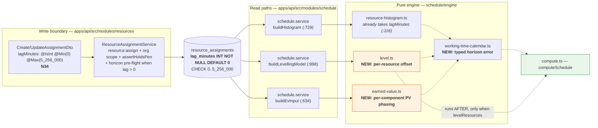
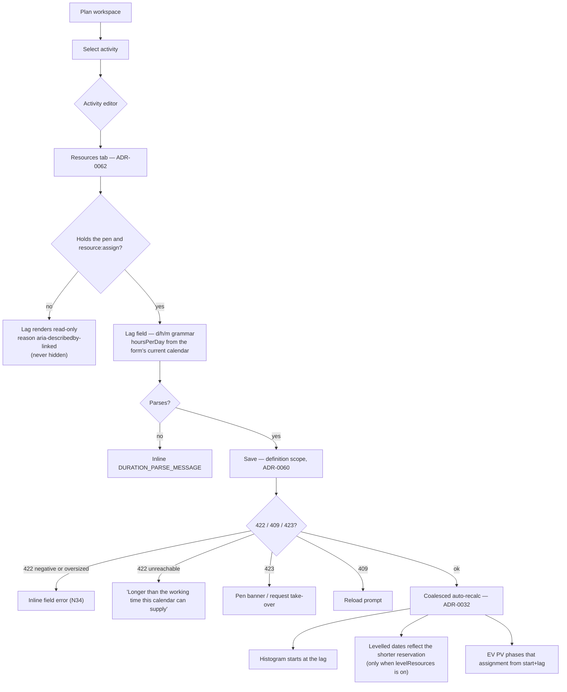

# Feature Spec: Per-assignment lag across all three resource surfaces

- **Status:** Draft — **awaiting approval before implementation**
- **Author(s):** feature-analyst (Product Owner / Solution Architect / Technical Lead hats)
- **Date:** 2026-08-02
- **Tracking issue / epic:** _(to be raised)_
- **Roadmap link:** engine↔planner surface reconciliation (`docs/specs/engine-surface-audit.md` **F6**)
- **Related ADR(s):** **ADR-0071 (draft, in this directory)**; amends **ADR-0041** (levelling parity),
  extends **ADR-0042/ADR-0044** (Earned Value / accrual); builds on ADR-0035 (**new §34** + **N34**),
  ADR-0036/0037 (working-minute axis, per-activity calendars), ADR-0039/0040 (resource model),
  ADR-0050/0053 (interchange), ADR-0066 (seed catalogue), ADR-0068/0070 (hours-per-day, `d/h/m` grammar),
  ADR-0028 (the pen), ADR-0012/0016 (RBAC + tenancy).

---

## 0. What was verified, and what was not

Per ADR-0058 — _verify the claim; do not trust the document._ Every load-bearing claim below was read out
of the code, not out of an ADR.

| Claim                                                             | Verified where                                                                                                                                             | Result                                                                                             |
| ----------------------------------------------------------------- | ---------------------------------------------------------------------------------------------------------------------------------------------------------- | -------------------------------------------------------------------------------------------------- |
| The histogram already accepts a per-assignment lag                | `apps/api/src/modules/schedule/engine/resource-histogram.ts:116-117` (field), `:222` (application), `:224` (span)                                          | **True.** Applied only when `> 0`; `effFinish` is the activity finish                              |
| It is scored against the fixture's 24 h case                      | `apps/api/src/modules/schedule/conformance/resource-histogram-conformance.spec.ts:156-168` (AS0027, `assignment_lag_h === 24`)                             | **True**                                                                                           |
| The production caller hardcodes `lagMinutes: 0`                   | `apps/api/src/modules/schedule/schedule.service.ts:737-740`                                                                                                | **True**, with a three-line comment that this change makes false                                   |
| There is no lag column on `ResourceAssignment`                    | `apps/api/prisma/schema.prisma:2065-2169`                                                                                                                  | **True** — no column, no DTO field, no `@repo/types` field                                         |
| Levelling occupies demand over the whole activity span            | `engine/level.ts:149` (pinned) and `:253` (placed); run length is `a.durationMinutes` at `:194`                                                            | **True**                                                                                           |
| `EngineAssignment` cannot carry a lag today                       | `engine/types.ts:162-167` — `{ activityId, resourceId, unitsPerHour }`                                                                                     | **True** — this is ADR-0041's current structural parity argument                                   |
| EV phases PV across the **activity** span, activity-level accrual | `engine/earned-value.ts:334-356` (`leafPlannedPercent`), `:411-417` (one `pvCost`, one percent)                                                            | **True**                                                                                           |
| `addWorkingTime` throws an untyped `Error` past the horizon       | `engine/working-time-calendar.ts:306-308` and `:326-328` (`HORIZON_DAYS = 366 * 200`)                                                                      | **True** — bare `new Error(...)`, no class                                                         |
| The histogram call site catches only the bucket error             | `schedule.service.ts:745-755`                                                                                                                              | **True** — anything else rethrows to a 500                                                         |
| The coverage exception exists and reads as a design decision      | `apps/seed-cli/src/capabilities/coverage.ts:46-49`                                                                                                         | **True**; echoed at `docs/TECH_DEBT.md:502`                                                        |
| `res_assignment_lag` has no row in the capability matrix          | `docs/specs/engine-conformance-framework/CAPABILITY_MATRIX.md` — the key appears **nowhere**; the lag is a clause inside the _curves_ row (`:143`)         | **True** — a row must be **added**, not edited                                                     |
| The assignment write path already asserts the pen                 | `apps/api/src/modules/resources/resource-assignment.service.ts:111-115`                                                                                    | **True** — `assertHoldsPen` on create (and on update)                                              |
| The P6 XER assignment-lag column name                             | `packages/engine-conformance/fixtures/p6_torture_test_v1.xer:378` — `%F taskrsrc_id task_id rsrc_id target_qty target_qty_per_hr driving_flag act_reg_qty` | **NOT VERIFIABLE HERE.** The repo's own XER carries **no lag column at all.** See §3 "Interchange" |
| MSPDI reads no assignment lag                                     | `packages/interchange/src/mspdi-adapter.ts:602-638`                                                                                                        | **True** — `Work`/`ActualWork`/`Units` only                                                        |

**Two things the previous pass got right and one it under-stated.** F6's "the expensive half is done" is
accurate **for the histogram only**. For levelling and Earned Value the expensive half is _not_ done: one is
an algorithmic change to the placement search, the other is a new cost-phasing model. This spec is written
against that reality.

---

## 1. Business understanding

### Problem

A resource does not always join an activity on day one. The welders arrive after the fit-up; the crane is
mobilised two days into the excavation; the commissioning engineer turns up in the last week of a six-week
install. Every serious CPM tool models this as an **assignment lag** — an offset from the activity's start
at which that particular resource's demand, load and cost begin.

SchedulePoint's **engine** already understands it. `computeResourceHistogram` takes a per-assignment
`lagMinutes`, shifts the effective span to `[start + lag, finish)` on the activity's own calendar, and is
scored against the P6-class fixture's own 24-hour case (`AS0027`). **Nothing in the product can store one.**
There is no column, no DTO field, no control, and the capability report excepts the key with a sentence —
_"an assignment has no lag field: work starts with its activity"_ — that reads as a design decision and is
actually an omission with a finished engine behind it.

Three concrete costs today:

1. **The histogram lies about mobilisation.** A crane assigned to a four-week activity loads from day one,
   so the plant histogram shows demand a fortnight before the crane is on site. A planner reading it to book
   plant books it two weeks early.
2. **Levelling over-reserves.** `level.ts` occupies the resource over the **whole** activity span
   (`:149`, `:253`). A resource that only joins late is nevertheless held for the full duration, so levelling
   pushes other work out for capacity that was never actually taken. Today's behaviour is **conservative** —
   safe, but pessimistic, and it produces a levelled programme longer than the resources require.
3. **The PV curve is wrong for late-joining cost.** EV phases the activity's whole planned value across the
   activity window (`earned-value.ts:334-356`). Cost that cannot be incurred until week five is shown
   accruing from week one, which is exactly the shape a QS reads a cash-flow curve for.

**Why now.** The engine↔planner surface audit (`docs/specs/engine-surface-audit.md`) found seven
findings; F6 is the one where the _engine_ supports what no storage can hold — the inverse of the others.
The product owner decided on 2026-08-02 to take it now, alongside the other surface fixes, and to scope
resource **roles** (`res_role`) separately. A `database-architect` pass has already designed the column.

### Users

| Role               | Need                                                                                                                       | This feature                                                                             |
| ------------------ | -------------------------------------------------------------------------------------------------------------------------- | ---------------------------------------------------------------------------------------- |
| **Planner**        | Say when each resource actually joins the work, and see the histogram, the levelled programme and the cash-flow reflect it | **Primary.** Authors the lag                                                             |
| **Org Admin**      | Everything a Planner can do, org-wide                                                                                      | Same capability                                                                          |
| **Contributor**    | Report progress; does **not** author resourcing                                                                            | Reads the lag; cannot set it                                                             |
| **Viewer**         | Read the plan and its histogram                                                                                            | Reads the lag                                                                            |
| **External Guest** | Read-only share of a plan's schedule                                                                                       | **Not exposed** — the `SCHEDULE_READ` share scope excludes resources entirely (ADR-0051) |

### Primary use cases

1. A Planner sets a lag on an assignment ("the welders join 3 days in") and the **resource histogram** shows
   the load starting three working days into the activity.
2. With `levelResources` on, the **levelling pass** stops reserving the resource for the days it is not
   there, so other work can use the capacity in that window.
3. The **Earned Value** planned-value curve phases that assignment's cost from the day the resource joins,
   not from the activity's start.
4. A Planner clears a lag back to zero and every one of the three surfaces returns to exactly its pre-lag
   output.

### User journeys

**Happy path.** Planner opens an activity → **Resources** tab (ADR-0062) → adds or edits an assignment →
enters a lag in the ADR-0070 `d/h/m` grammar (`3d`, `4h`, `1d 4h`; a bare number means days) → saves under
the pen (ADR-0028) → the coalesced auto-recalc (ADR-0032) runs → the histogram, the levelled dates and the
EV read all reflect the lag.

**Alternate — lag longer than the activity.** Accepted at the boundary (it is legal data: the resource never
joins), with an inline warning on the form and a **documented, deliberately asymmetric** treatment across
the three consumers — see §2 "Edge cases", which is the single most important table in this spec.

**Alternate — the lag cannot be resolved on the activity's calendar.** A large lag on a calendar with very
little working time can exceed the engine's ~200-year horizon. Refused at the write boundary with a 422 that
names the calendar, and mapped to a 422 (never a 500) at every read that walks it.

**Alternate — Contributor.** The lag field renders read-only with the reason stated and linked to the
control by `aria-describedby` (the ADR-0060 M6 finding — a reason beside a control is not a reason attached
to it). It is never hidden: hiding it would say the assignment has no lag.

### Expected outcomes

- The last "engine supports what nothing can store" finding on the register closes.
- `seed --coverage` moves from **115/117 reached, 2 excepted** to **116/117 reached, 1 excepted** — and the
  one that remains (`res_role`) is a genuine absence with an epic of its own.
- Plant and labour histograms become usable for booking.
- Levelling becomes less pessimistic **prospectively** (see §1 "Success criteria" for the honest limit).

### Success criteria

1. **The two parity gates hold** (the technical heart of this spec — §4 "The parity argument"):
   - **Gate A (structural, unchanged):** with `levelResources` off, `computeSchedule` is byte-identical.
     The lag is only ever assembled inside `if (plan.levelResources)` (`schedule.service.ts:970`).
   - **Gate B (data-conditional, new):** with `levelResources` **on** and every participating assignment at
     `lagMinutes === 0` — the constant DB default, therefore **every plan in the system on the day this
     ships** — levelling output is byte-identical to today.
2. `GET …/schedule/earned-value` returns numbers **identical to the minor unit** for every plan with no
   lagged assignment, proven against the existing EV conformance goldens.
3. `res_assignment_lag` is **reached** by a catalogue plan created through the public REST API, and the
   coverage exception is **deleted** in the same PR.
4. A lagged assignment's histogram first bucket carries no load; the unlagged twin's does (the
   ADR-0034 "flip-one-option-must-differ" differential, at the application, not just the engine).
5. Negative and oversized lags are refused at the **DTO** with a clean 422 (**N34**), never silently
   discarded.

### Open questions

Three are **CRITICAL** (they change design or scope). Everything else has a stated default and proceeds.
See §6.

---

## 2. Functional requirements

### User stories & acceptance criteria

> **US-1** — As a **Planner**, I want to set a lag on a resource assignment, so that the resource's demand
> starts when it actually joins the work.
>
> **Acceptance criteria**
>
> - **Given** an activity with an assignment **when** I set the lag to `3d` and save **then** the assignment
>   persists `lagMinutes = 3 × hoursPerDay × 60` for the activity's resolved calendar (ADR-0068), and the
>   response returns that `lagMinutes`.
> - **Given** I hold no pen on the plan **when** I save **then** the write is refused **423** by the existing
>   `assertHoldsPen` (`resource-assignment.service.ts:115`) — no new gate.
> - **Given** I am a Contributor **when** I open the assignment **then** the lag renders read-only with the
>   reason `aria-describedby`-linked to the control; the write is **403** on `resource:assign`.
> - **Given** I enter `-1d` **then** the write is refused **422** at the DTO (**N34**) with a message naming
>   the field; the value never reaches the read-model's `> 0` guard.
> - **Given** I enter a lag exceeding 5,256,000 minutes **then** the write is refused **422** at the DTO.
> - **Given** I omit the lag **then** it stores `0` and every consumer behaves exactly as it does today.

> **US-2** — As a **Planner**, I want the resource histogram to start a lagged assignment's load at the lag,
> so that plant and labour bookings match reality.
>
> **Acceptance criteria**
>
> - **Given** two otherwise-identical assignments differing only in lag **when** I read
>   `GET …/schedule/resource-histogram?granularity=DAY` **then** the lagged one's early buckets are 0 and the
>   unlagged one's are not.
> - **Given** any lag **then** **units are still conserved**: `Σ(a resource's buckets) === Σ(its assignments'
budgetedUnits)` exactly. This is the read-model's existing invariant and the lag must not weaken it.
> - **Given** every assignment has `lagMinutes = 0` **then** the histogram response is byte-identical to
>   today's.

> **US-3** — As a **Planner** using resource levelling, I want a lagged assignment to reserve capacity only
> from the day the resource joins, so that levelling does not push work out for capacity that was never taken.
>
> **Acceptance criteria**
>
> - **Given** `levelResources` is **off** **then** nothing about levelling or `computeSchedule` changes
>   (**Gate A**).
> - **Given** `levelResources` is **on** and every lag is `0` **then** every `leveledStart`, `leveledFinish`,
>   `levelingDelay`, `levelingWindowExceeded`, `selfOverAllocated`, `leveledActivityCount` and
>   `leveledProjectFinish` is byte-identical to today (**Gate B**).
> - **Given** a lagged assignment **then** it **occupies** its resource over `[start + lag, finish)` measured
>   on the activity's own calendar, and the placement search requires headroom only over that window — not
>   over the whole run.
> - **Given** a lag ≥ the activity's remaining span **then** the assignment occupies **nothing** on that
>   resource, and this is stated in the docs rather than left to be discovered (see the asymmetry table).

> **US-4** — As a **Planner or Org Admin reading cost**, I want the planned-value curve to start each
> assignment's cost when its resource joins, so that the cash-flow curve is honest about mobilisation.
>
> **Acceptance criteria**
>
> - **Given** every assignment has `lagMinutes = 0` **then** `GET …/schedule/earned-value` returns numbers
>   **identical to the minor unit** — by an explicit zero-lag fast path, not by numerical coincidence.
> - **Given** a lagged assignment on a `UNIFORM`-accrual activity **then** its share of PV phases linearly
>   across `[start + lag, finish)` while the activity's own **expense** still phases across
>   `[start, finish)`.
> - **Given** a lagged assignment on a `START`-accrual activity **then** its share of PV is recognised at
>   `start + lag`, not at `start`.
> - **Given** a lagged assignment on an `END`-accrual activity **then** nothing changes — `END` recognises at
>   the activity finish, which the lag does not move.
> - **Given** any lagged assignment **then** `EV`, `AC` and `BAC` are **unchanged**: only PV time-phasing
>   reads a window. (Stated so that nobody wires the lag into `performancePercent`.)

> **US-5** — As anyone reading a plan, I want a lag whose working time cannot be resolved to fail loudly and
> specifically, not to produce a 500 or a silently wrong schedule.
>
> **Acceptance criteria**
>
> - **Given** a lag the activity's calendar cannot supply within the engine horizon **when** it is written
>   **then** the write is refused **422 `ASSIGNMENT_LAG_UNREACHABLE`** naming the activity, the resource and
>   the calendar.
> - **Given** such a lag already stored (the calendar was narrowed afterwards) **when** the histogram, the
>   levelling pass or the EV read walks it **then** the response is a **422** naming the offending
>   assignment — never a **500**, and never a placement computed from a lag that could not be resolved.

### Workflows

**Author a lag.** Resources tab → row → Lag field (`d/h/m` text, ADR-0070) → Save (per-scope, ADR-0060 —
Resources shares the `definition` gate object with General, ADR-0062) → `PATCH …/assignments/:id` under the
pen → coalesced recalc → histogram / levelled dates / EV refresh.

**Clear a lag.** Same path, value `0` (or empty → 0). Every consumer returns to its zero-lag path, which is
the same code path the parity gates pin.

**Read a lag.** `GET …/activities/:id/assignments` returns `lagMinutes` to every member. It is **schedule
data, not cost** — the `curveType` / histogram-endpoint precedent (ADR-0044 Q5: "units are schedule data,
not cost") — so it is **not** gated on `cost:read`.

### Edge cases

**The asymmetry table.** The three consumers deliberately treat a degenerate lag differently, because their
contracts differ. Recording this is the single highest-value paragraph in the spec: two of the three are
already-shipped behaviour and the third is new, and a reader who assumes they agree will write a wrong test.

| Case                                  | Histogram                                                                                                                                                          | Levelling                                                                                                                                          | Earned Value                                                                                                                                  |
| ------------------------------------- | ------------------------------------------------------------------------------------------------------------------------------------------------------------------ | -------------------------------------------------------------------------------------------------------------------------------------------------- | --------------------------------------------------------------------------------------------------------------------------------------------- |
| `lag = 0`                             | Today's path exactly (`> 0` guard, `resource-histogram.ts:222`)                                                                                                    | Today's path exactly (**Gate B**)                                                                                                                  | Today's path exactly (zero-lag fast path)                                                                                                     |
| `0 < lag < span`                      | Load distributed over `[start+lag, finish)`, **units conserved**                                                                                                   | Occupies `[start+lag, finish)`; placement requires headroom only there                                                                             | That assignment's PV share phases over `[start+lag, finish)`                                                                                  |
| `lag ≥ span` (**degenerate**)         | **Whole budget lands in the single bucket containing the effective start** (`:290-293`) — units must be conserved or a resource's total stops equalling its budget | **Occupies nothing** (`occupy` returns early when `finish <= start`, `:123`) — reserving capacity for a window with no working time would be wrong | Its PV share is recognised **at the effective start** (the degenerate-span branch: `leafPlannedPercent` returns 100 past a zero span, `:353`) |
| Activity unschedulable (no CPM dates) | Excluded from the axis (`:221`)                                                                                                                                    | Not a participant                                                                                                                                  | PV falls to 0 (existing `dataDate`/anchor guard, `:345`)                                                                                      |
| Milestone (zero duration)             | Degenerate span → single bucket                                                                                                                                    | `d === 0` short-circuits the search (`level.ts:344`) — a milestone occupies nothing                                                                | Binary on start (`:341-343`) — the lag does not move a milestone                                                                              |
| WBS summary                           | Summaries carry no assignments (ADR-0038 — a summary carries no logic)                                                                                             | Never moved (`isPinned`, `:109-114`)                                                                                                               | Rolls up children; carries no cost of its own (`:431-448`)                                                                                    |
| Lag unresolvable within the horizon   | 422 (see US-5)                                                                                                                                                     | 422 (see §6 CQ-2)                                                                                                                                  | 422                                                                                                                                           |

Other edges:

- **Concurrent edit.** The assignment's optimistic `version` covers it; a stale write is **409** as today.
- **Archived resource.** Editing an _existing_ assignment of an archived resource stays allowed (ADR-0053 §4)
  — so a lag may be edited on one. Only _new_ assignments are refused.
- **`GROUP` resource.** Cannot be an assignment endpoint at all (422 `GROUP_NOT_ASSIGNABLE`), so it can never
  carry a lag. This is what keeps the parity argument structural for the group hierarchy.
- **Soft delete.** A deleted assignment contributes nothing to any of the three read paths (all filter on
  `deleted_at IS NULL`); a lag changes nothing about the cascade.
- **Baselines.** A baseline snapshot does **not** capture the lag (see §4 "Database changes" — deliberate,
  and it is what makes CQ-1 a real question).

### Permissions

Mapped to ADR-0012 (RBAC + resource scoping), deny-by-default.

| Action                      | Permission        | Roles                 | Scope                                                                        | Pen (ADR-0028)                                                                              |
| --------------------------- | ----------------- | --------------------- | ---------------------------------------------------------------------------- | ------------------------------------------------------------------------------------------- |
| Set / change / clear a lag  | `resource:assign` | Planner, Org Admin    | Assignment's organisation                                                    | **Yes — structural.** Already asserted at `resource-assignment.service.ts:115`; no new gate |
| Read a lag on an assignment | `resource:read`   | All four member roles | Assignment's organisation                                                    | n/a                                                                                         |
| Read the histogram          | `schedule:read`   | All four member roles | Plan's organisation                                                          | n/a                                                                                         |
| Read Earned Value           | `cost:read`       | Planner, Org Admin    | Plan's organisation                                                          | n/a                                                                                         |
| External Guest              | —                 | **Denied**            | Share scope is `SCHEDULE_READ`, which carries no resources at all (ADR-0051) | n/a                                                                                         |

**Is the new write structural?** **Yes.** With `levelResources` on it moves `leveled_start` /
`leveled_finish` / `leveling_delay_minutes` — engine-owned columns. It therefore needs the pen, and it
**already has it**: the assignment write path took `assertHoldsPen` when ADR-0040 made an assignment write
able to persist a derived duration. No change; stated because "is this structural" is a question the process
requires answering explicitly.

### Validation rules

| Field        | Rule                                                            | Where                                                                                                                                                                                                                                             |
| ------------ | --------------------------------------------------------------- | ------------------------------------------------------------------------------------------------------------------------------------------------------------------------------------------------------------------------------------------------- |
| `lagMinutes` | integer                                                         | `@IsInt()` (create + update DTO)                                                                                                                                                                                                                  |
| `lagMinutes` | `>= 0` — **unsigned**, no lead                                  | `@Min(0)` — **N34**. Must be at the DTO: the read-model applies the lag only when `> 0` (`resource-histogram.ts:222`), so a negative would be **silently discarded** and the assignment would behave as unlagged after the API accepted the value |
| `lagMinutes` | `<= 5_256_000` (≈ 10 years, mirrors the dependency lag bound)   | `@Max(5_256_000)` — **N34**                                                                                                                                                                                                                       |
| `lagMinutes` | backstop                                                        | `ck_resource_assignments_lag_minutes_range` CHECK `BETWEEN 0 AND 5256000` (raw SQL) — defence in depth, never the primary reject (a CHECK breach is a P2010, not a clean 422)                                                                     |
| `lagMinutes` | resolvable on the activity's calendar within the engine horizon | Service pre-flight when `lagMinutes > 0` → 422 `ASSIGNMENT_LAG_UNREACHABLE`. Calendar-dependent, so it is necessary-but-not-sufficient (a calendar can be narrowed later) — the runtime mapping is the backstop                                   |
| Client input | `d`/`h`/`m` grammar, **unsigned**                               | `parseDurationText` (not `parseSignedDurationText`) with the **required** `hoursPerDay` parameter from the activity's currently-selected calendar (ADR-0068/0070 — never defaulted; the compiler enforces it)                                     |

Shared client↔server: the numeric bounds are duplicated as constants in `@repo/types` and asserted equal by a
structural test, the `DECIMAL_18_4_MAX` / `MONEY_MINOR_UNITS_MAX` precedent.

### Error scenarios

| Scenario                                      | Detection                                                                                   | User-facing result                                                    | Status                           |
| --------------------------------------------- | ------------------------------------------------------------------------------------------- | --------------------------------------------------------------------- | -------------------------------- |
| Negative lag (**N34**)                        | DTO `@Min(0)`                                                                               | Inline field error: "Lag cannot be negative."                         | 422                              |
| Lag above the bound (**N34**)                 | DTO `@Max(5_256_000)`                                                                       | Inline field error naming the maximum                                 | 422                              |
| Non-integer / unparseable text                | `parseDurationText` client-side + DTO `@IsInt()`                                            | Inline error from `DURATION_PARSE_MESSAGE` (ADR-0070)                 | 422                              |
| Lag unresolvable on the calendar (write)      | Service pre-flight                                                                          | "This lag is longer than the working time '<calendar>' can supply."   | 422 `ASSIGNMENT_LAG_UNREACHABLE` |
| Lag unresolvable on the calendar (read)       | Typed `WorkingTimeHorizonExceededError` caught at the histogram / levelling / EV call sites | Same message, naming the activity and resource                        | 422 `ASSIGNMENT_LAG_UNREACHABLE` |
| Caller lacks `resource:assign`                | Permission check                                                                            | Friendly forbidden message; the field renders read-only with a reason | 403                              |
| Caller does not hold the pen                  | `assertHoldsPen`                                                                            | The existing pen banner / take-over flow                              | 423                              |
| Stale `version`                               | Optimistic lock                                                                             | "This assignment changed — reload."                                   | 409                              |
| Assignment / activity not in the caller's org | Org re-resolve (anti-IDOR)                                                                  | Uniform not-found                                                     | 404                              |

---

## 3. Technical analysis

| Area               | Impact     | Notes                                                                                                                                                                                                                                                                                                                                                      |
| ------------------ | ---------- | ---------------------------------------------------------------------------------------------------------------------------------------------------------------------------------------------------------------------------------------------------------------------------------------------------------------------------------------------------------- |
| **Frontend**       | **medium** | One field on the extracted `ActivityResourcesPanel.tsx` (reached from both the ADR-0062 tab and `ActivityResourcesDialog` — one change covers both, which is that ADR's point), one column on `AssignmentRow.tsx`. Reuses `TextField` + `parseDurationText`. Behind `VITE_ASSIGNMENT_LAG`, default off, with flag-off parity suites                        |
| **Backend**        | **high**   | `resources` module (DTOs, service pre-flight, repository); `schedule` module (histogram caller `:729-742`, levelling assembly `:998-1003`, EV assembly `:634-640`, error mapping `:745-755`); `schedule/engine` (`level.ts` placement search, `earned-value.ts` PV model, `working-time-calendar.ts` typed error)                                          |
| **Database**       | **low**    | One additive column + one CHECK on `resource_assignments`. Constant `DEFAULT 0` ⇒ **no data migration**, every existing row keeps today's behaviour. No index (see §4)                                                                                                                                                                                     |
| **API**            | **low**    | One additive request field on create/update assignment, one additive response field, one additive `costPhasingLaggedCount` on the EV response. No breaking change; one new 422 reason. OpenAPI + `docs/API.md`                                                                                                                                             |
| **Security**       | **low**    | No new permission, no new endpoint, no new trust boundary. The lag rides `resource:assign` + org scope + the existing pen. Not cost-gated (schedule data). Not exposed to guests. Input bounded at the DTO and backstopped by a CHECK                                                                                                                      |
| **Performance**    | **medium** | Levelling's placement search gains a per-resource offset — the cost model must stay `O(k log k)` over placed intervals, never a per-minute scan (the ADR-0041 §F boundedness invariant). The EV per-component sum is `O(assignments)`, which the leaf already iterates twice. The write-time pre-flight builds one calendar port on a `lag > 0` write only |
| **Infrastructure** | **none**   | No new service, env var, container or CI job. One new Playwright suite ⇒ one new CI step (the ADR-0063/0067/0070 pattern)                                                                                                                                                                                                                                  |
| **Observability**  | **low**    | The 422 reason is machine-readable in `details.reason`. `costPhasingLaggedCount` makes the new EV model observable from the response. No new metric                                                                                                                                                                                                        |
| **Testing**        | **high**   | Engine unit + parity property tests; conformance goldens + differentials (N34, §34); Supertest API e2e; a capability seed plan + playbook row + `check:playbook`; web unit + flag-off parity + a flag-on Playwright journey                                                                                                                                |

### Dependencies

**Prerequisites — all already landed:** ADR-0036 (working-minute axis), ADR-0037 (per-activity calendar
ports), ADR-0039/0040 (resource + assignment model), ADR-0041 (levelling), ADR-0042/0044 (EV, curves,
accrual), ADR-0053 (archive/GROUP invariants), ADR-0066 (seed catalogue + coverage report), ADR-0068
(hours-per-day), ADR-0070 (`d/h/m` grammar and its `formatDurationText`/`parseDurationText` pair).

**Affected features:** resource histogram; resource levelling; Earned Value; the capability catalogue and
its coverage gate; the capability matrix; the test playbook; the interchange mapping contract; the
engine-surface audit register (F6 closes).

**Must land first, within this epic:** M0 (storage + boundary) before any consumer. M2 (levelling) and M3
(EV) are independent of each other and both depend only on M0.

**Blocked externally:** M5 (interchange) **cannot start** until the P6 XER column name and units are
confirmed against a real export — see below.

### Interchange — stated plainly

**The P6 XER assignment-lag column name could not be verified from this repository.** The repo's own
P6-class export (`packages/engine-conformance/fixtures/p6_torture_test_v1.xer:378`) declares the
`TASKRSRC` table as:

```
%F	taskrsrc_id	task_id	rsrc_id	target_qty	target_qty_per_hr	driving_flag	act_reg_qty
```

There is **no lag column of any kind**, so this repository contains no evidence of the field's name, its
units (hours vs. minutes vs. days), its sign convention, or whether P6 emits it at all when the value is
zero. A commonly-cited candidate name exists in P6 documentation outside this repo; it is **not** treated as
verified here and **must not** be coded from memory. That is exactly the ADR-0058 failure mode.

**Therefore:**

- **The importer is not wired until a real P6 XER export from a project carrying an assignment lag has been
  inspected** and the column name + units recorded in the ADR-0050 mapping-contract table.
- Until then the canonical model gains `lagMinutes: number` (default `0`) so the _shape_ is ready and the
  parser is the only missing piece, and the mapping table records assignment lag as **not imported**, with a
  report finding on any file that appears to carry one.
- **Export is deferred to the same confirmation.** Emitting a column P6 may not read, under a name we
  guessed, is worse than omitting it — so in the interim the mapping table records assignment lag as a
  documented **drop on export** with a report finding, the ADR-0050 "best-effort fidelity is reported, never
  silent" rule.

**MSPDI: a drop.** `mspdi-adapter.ts:602-638` reads `Work` / `ActualWork` / `Units` only. Assignment lag is
recorded as a **drop in both directions** with a report finding. _Honest caveat, recorded rather than acted
on:_ MS Project's `<Assignment>` element does carry a `Delay` child whose semantics are close to an
assignment lag; it is read nowhere in this repo and has not been checked against a real MSPDI file, so it
goes in the **same "confirm against a real export"** bucket as the XER column rather than being wired on
assumption. Default: drop + report.

---

## 4. Solution design

### Architecture overview



`computeSchedule` (green) is **not modified and not imported by any of the three consumers**. The two orange
boxes are the genuinely new work.

### Data flow

```mermaid
sequenceDiagram
  autonumber
  actor P as Planner (pen holder)
  participant W as Web — ActivityResourcesPanel
  participant A as API — ResourceAssignmentService
  participant D as Postgres
  participant S as schedule.service
  participant EN as engine (pure)

  P->>W: types "3d" in Lag
  W->>W: parseDurationText("3d", hoursPerDay) → minutes
  W->>A: PATCH …/assignments/:id { lagMinutes, version }
  A->>A: resolveScope → resource:assign → assertHoldsPen (423) → version (409)
  alt lagMinutes > 0
    A->>A: resolve activity calendar → addWorkingTime(start, lag)
    A-->>W: 422 ASSIGNMENT_LAG_UNREACHABLE (horizon)
  end
  A->>D: UPDATE resource_assignments SET lag_minutes = …
  A-->>W: 200 { …, lagMinutes }

  W->>A: POST …/schedule/recalculate (coalesced, ADR-0032)
  A->>S: recalculate
  S->>EN: computeSchedule(activities, edges, options)
  Note over S,EN: lag NEVER enters this call — Gate A is structural
  EN-->>S: network results (byte-identical)
  opt plan.levelResources
    S->>D: loadResourceAssignments (now selects lag_minutes)
    S->>EN: levelSchedule(…, assignments[{…, lagMinutes}], resources, options)
    Note over EN: occupy [start+lag, finish); search with per-resource offset
    EN-->>S: leveled overlay
  end
  S->>D: engine-owned batched UPDATE

  P->>W: opens the histogram / EV panel
  W->>A: GET …/schedule/resource-histogram
  A->>EN: computeResourceHistogram(assignments[{…, lagMinutes}])
  W->>A: GET …/schedule/earned-value
  A->>EN: computeEarnedValue(… per-component PV …)
```

### User flow



### Database changes

Taken as given from the `database-architect` pass (F6 context). Restated so the spec is self-contained.

```prisma
model ResourceAssignment {
  // …
  /// The working-minute offset from the activity's start at which THIS resource joins
  /// (ADR-0071). UNSIGNED — mirrors dependencies.lag_minutes in type and bound but NOT in
  /// sign: a lead is meaningful on a logic edge and meaningless here (a resource cannot
  /// join before the work starts). Measured on the ACTIVITY's own calendar (ADR-0037) —
  /// deliberately NO lag_calendar sibling (see below). Constant NOT NULL DEFAULT 0 ⇒ every
  /// existing row keeps today's behaviour with no data migration, and 0 is the byte-parity
  /// fast path in all three consumers. ck_resource_assignments_lag_minutes_range
  /// (BETWEEN 0 AND 5256000, raw SQL) is the DB backstop behind the DTO @Min/@Max boundary
  /// reject (N34) — never the primary reject. NO index: read only on the plan-scoped
  /// histogram / levelling / EV assignment loads, never a query predicate (the curve_type
  /// precedent). MUST stay in lock-step with @repo/types.
  lagMinutes Int @default(0) @map("lag_minutes")
}
```

Migration: one `ALTER TABLE … ADD COLUMN … NOT NULL DEFAULT 0` plus one `ADD CONSTRAINT … CHECK`. Postgres
adds a constant-default column without a table rewrite, so it is safe on a live table.

**Three deliberate refusals, recorded so they are not re-litigated as omissions:**

1. **No `lag_calendar` sibling.** The dependency lag has one (`LagCalendarSource`) because an edge sits
   between two activities with potentially different calendars. An assignment lag has exactly one natural
   frame — the activity's own calendar — which is what `resource-histogram.ts:222` already uses. A sibling
   enum would create a seam with **three** consumers to keep in step, for a choice no fixture case asks for.
   If it is ever wanted it is additive.
2. **No index.** The column is read as part of the plan-scoped assignment loads that already run for the
   histogram, levelling and EV; it is never a `WHERE` or `ORDER BY` predicate. Adding one would cost writes
   and buy nothing (the `curve_type` precedent, and the ADR-0053 M4 measurement discipline).
3. **Not captured in the baseline snapshot.** `Baseline`/`BaselineActivity` (ADR-0025) snapshot activity
   dates and cost, not the assignment graph. Capturing the lag would be an ADR-0025 amendment and a schema
   change for a value the baseline's _consumer_ (variance + the PV curve) reads only indirectly. **This is
   precisely why CQ-1 is a real question** — see §6.

### API changes

All additive. No versioning impact; `web`/`api` bump **minor** (pre-1.0).

**`POST /api/v1/orgs/:slug/activities/:activityId/assignments`** and
**`PATCH /api/v1/orgs/:slug/assignments/:assignmentId`** gain:

```ts
@ApiPropertyOptional({
  minimum: 0, maximum: 5_256_000, default: 0,
  description:
    'Working-minute offset from the activity’s start at which this resource joins (ADR-0071). ' +
    'UNSIGNED — a lead is meaningless on an assignment. Measured on the activity’s own calendar. ' +
    'Omit for 0 (the resource joins with the activity) — the byte-identical default. Shifts the ' +
    'resource histogram, the levelling pass’s demand window (only when the plan’s levelResources ' +
    'is on) and the Earned-Value PV phasing of THIS assignment’s cost. A negative or oversized ' +
    'value is a clean 422 (N34); a lag longer than the calendar’s working-time horizon is a 422 ' +
    'ASSIGNMENT_LAG_UNREACHABLE.',
})
@IsOptional() @Type(() => Number) @IsInt() @Min(0) @Max(ASSIGNMENT_LAG_MINUTES_MAX)
lagMinutes?: number;
```

`ResourceAssignmentResponseDto` and `ResourceAssignmentSummary` (`packages/types/src/index.ts:1671`) gain
`lagMinutes: number` — **always present**, never cost-gated.

**`GET …/schedule/earned-value`** — response shape unchanged for every existing field. One additive
sibling of `costWarningCount` / `stepWeightZeroCount`:

```ts
/** Leaves whose PV used the per-component (lagged) phasing path rather than the single activity
 *  window (ADR-0071). 0 on every plan with no lagged assignment — the parity signal, and the way a
 *  reader can tell which numbers came from the new model. */
costPhasingLaggedCount: number;
```

**No new endpoint.** **One new machine-readable reason:** `SCHEDULE_ERROR.ASSIGNMENT_LAG_UNREACHABLE`
(reused verbatim by the assignment write pre-flight, so a client maps one code in one place).

`docs/API.md` + OpenAPI updated in the same PRs; the two 422s declared on the assignment create/update routes
(the ADR-0053 M6 finding — missing 422/409 declarations were a blocking api-review finding there).

### Component changes

| Component                                                                | Change                                                                                                                                                                                                                                                                                                                                                                                                                                                                                                          |
| ------------------------------------------------------------------------ | --------------------------------------------------------------------------------------------------------------------------------------------------------------------------------------------------------------------------------------------------------------------------------------------------------------------------------------------------------------------------------------------------------------------------------------------------------------------------------------------------------------- |
| `apps/web/src/features/resources/components/ActivityResourcesPanel.tsx`  | A **Lag** `TextField` in the existing `FieldGrid` (`:352`) beside Budgeted units. `d/h/m` text via `parseDurationText(text, hoursPerDay)`; `hoursPerDay` from the calendar the **form** currently selects (ADR-0070's rule — a planner can change calendar and duration in one edit and only the client knows the pending choice). Where it cannot be resolved, degrade to whole working days — **the same code path as flag-off**, so the rollback contract and the not-yet-loaded state cannot rot separately |
| `apps/web/src/features/resources/components/AssignmentRow.tsx`           | A **Lag** read-out. Prints the row's **own** value; the whole-day branch must not re-derive from minutes (the ADR-0070 M4 defect: a four-hour lag rounded up to `+1d`)                                                                                                                                                                                                                                                                                                                                          |
| `apps/web/src/features/resources/components/ActivityResourcesDialog.tsx` | **No change** — it renders the extracted panel (ADR-0062). Stated because "update both" is the instinct and would reintroduce the drift that ADR forbids                                                                                                                                                                                                                                                                                                                                                        |
| `ResourceHistogram.tsx`, `ResourceLoadingTable.tsx`                      | **No change** — they render the endpoint's response                                                                                                                                                                                                                                                                                                                                                                                                                                                             |
| Gating                                                                   | Reuses the `definition` gate object (Logic/Resources share it with General — ADR-0062 pins `gating.logic === gating.general` by identity test). Shaded-with-a-reason, **never hidden** (the ADR-0062 M6 finding)                                                                                                                                                                                                                                                                                                |
| Flag                                                                     | `VITE_ASSIGNMENT_LAG`, **default off**. Flag-off parity suites (`vi.mock` of `@/config/env`) pin every touched surface byte-for-byte — the rollback contract, kept rather than weakened (the ADR-0053 M6 rule)                                                                                                                                                                                                                                                                                                  |

States: loading (calendar not resolved → whole-day degrade), empty (`0` renders as `0d`, not blank —
a blank reads as "unknown"), error (inline, `aria-describedby`-linked), success (announced via `useAnnounce`,
the ADR-0064 finding that pointer paths were silent while the keyboard path announced).

---

### The parity argument — the technical heart of this spec

#### (a) Levelling — what the claim becomes

**Today's claim (ADR-0041 §7 + the `EngineAssignment` shape).** It is _structurally impossible_ for
levelling to see an assignment lag: `EngineAssignment` is `{ activityId, resourceId, unitsPerHour }`
(`engine/types.ts:162-167`) and there is no third field a lag could travel on.

**Tomorrow's claim — two gates, stated separately because they are proven differently.**

> **Gate A (structural, unchanged).** `computeSchedule` is byte-identical. The lag never reaches the pure
> network pass at all: the `EngineAssignment[]` array is only assembled inside `if (plan.levelResources)`
> (`schedule.service.ts:970-1006`), and `computeSchedule`'s signature does not take assignments. This gate is
> proven by construction and pinned by a **structural test** asserting `computeSchedule`'s parameter list is
> unchanged — the `EngineResource`-shape precedent from ADR-0053 M3.
>
> **Gate B (data-conditional, new).** With `levelResources` **on** and every participating assignment at
> `lagMinutes === 0`, `levelSchedule` returns output byte-identical to the pre-change implementation. Since
> `0` is the constant column default, **every plan in the system levels identically on the day the column
> lands.**

Gate B is weaker than "structurally impossible" and the ADR must say so in those words. It is proven by
three independent instruments, none of which is a substitute for the others:

1. **A property test** (`level.parity.spec.ts`): over a randomised corpus of networks × capacities ×
   priorities × `levelWithinFloatOnly`, `levelSchedule(…, all lags 0)` must equal a **golden snapshot
   captured from the current implementation before the change**. Capturing first is not optional — a
   snapshot taken after the refactor asserts the refactor against itself.
2. **The S10 conformance differential** and the `single-unit-resource-serialises-second` golden re-run
   unchanged.
3. **The ADR-0066 pairwise differential** over the levelling dimension — which builds the engine's input
   **from the `SeedSpec`, never from the persisted rows**, so it is the only instrument that can catch a
   lag that reaches the database and fails to reach the engine (exactly the class of defect ADR-0066 was
   written for).

#### (b) Levelling — the actual algorithmic change

Two halves, and they must be changed **together** or the pass contradicts itself.

**(i) Occupancy — straightforward.** `occupy(resourceId, start, finish, demand)` is called at `:149` (pinned
activities) and `:253` (placed activities) with the activity's whole span. It becomes, per assignment:

```
occupy(asg.resourceId, advanceWorking(calA, startInst, asg.lagMinutes), finishInst, asg.unitsPerHour)
```

`occupy` already returns early when `finish <= start` (`:123`), so a lag ≥ the span reserves nothing — see
the asymmetry table.

**(ii) Feasibility — the real work.** `earliestFeasibleStart` (`:336-407`) finds the earliest start at which
`[cand, cand + d)` has headroom on **every** touched resource, via a single blackout-gap sweep over merged
demand events. With per-assignment lag, resource _i_ is only needed over `[cand + lag_i, cand + d)` — so
there is no longer **one** run window, and the "does this run fit in this feasible region" test is no longer
uniform across resources.

The formulation that keeps the cost model and the determinism:

> For each touched resource _i_, compute its blackout regions as today. A blackout `[b0, b1)` on resource _i_
> forbids candidate starts `c` where `[c + lag_i, c + d)` intersects it — i.e.
> `c ∈ ( advanceWorking(cal, b0, −d), advanceWorking(cal, b1, −lag_i) )` in working-time terms. Union those
> forbidden candidate-start intervals **across all touched resources**, sort, and take the first point
> `≥ rollForwardToWorking(cal, esAbs)` not covered.

Properties this preserves, each of which is an ADR-0041 invariant and therefore a test:

- **Cost:** `O(k log k)` over the _k_ placed intervals (one sort of the forbidden intervals). Never a
  per-minute scan, never a retry loop (§F boundedness).
- **Termination is inherent:** every placed interval finishes, so the union of forbidden intervals is
  bounded above and the final open region always admits a placement.
- **Determinism:** fixed order, no data-dependent tie-breaking beyond the existing composite key
  (`levelingPriority → totalFloat → earlyStart → id`), which the lag does not touch.
- **Zero-lag identity:** with every `lag_i = 0` the forbidden interval reduces to
  `(advanceWorking(b0, −d), b1)`, which is exactly the complement of today's fit test — **this equivalence is
  the property test in (a)1**, and it must be asserted directly on `earliestFeasibleStart`, not only through
  `levelSchedule`.

**Alternative rejected: keep the uniform-window search and change only occupancy.** It is less code and it
is _wrong_: the pass would reserve `[start+lag, finish)` while refusing to place anything that needed
`[start, start+lag)`, so the two halves would disagree and the pass would be conservative in the search and
optimistic in the profile — the worst combination, and invisible except on plans where both matter.

#### (c) Levelling — what an existing plan experiences, honestly

**On the day the column lands: nothing.** Every lag is 0; Gate B says byte-identical.

**When a planner adds a lag:** today's behaviour over-reserves (the resource is held for days it is not
there), so the direct effect of a lag is a **strictly smaller demand footprint** for that assignment on that
resource. The obvious next sentence — "so levelled dates can only move earlier" — is **false, and the spec
must not say it.**

> **Non-monotonicity, stated deliberately.** `levelSchedule` is a **serial priority-list heuristic**
> (ADR-0041 §1). Freeing capacity earlier can let an _earlier-in-order_ activity be placed earlier; its
> occupancy therefore moves earlier; and that newly-occupied window can block a _later-in-order_ activity
> that previously fitted there. So **an individual activity can move later even though total contention
> fell.** This is a property of every serial priority-list heuristic, not a defect, and ADR-0041 already says
> the heuristic is not optimal. Consequently:
>
> - **No monotonicity test is written**, because it would be a false assertion that passes on the examples
>   someone thinks of and fails in CI on the one they did not.
> - **Release notes and UI copy must not promise that adding a lag can only pull dates in.** The honest
>   sentence is: _"the resource is no longer reserved for the days it is not on site; the levelled programme
>   is recomputed and individual dates may move in either direction."_

This is the one place where the "less pessimistic" framing needs qualifying, and it is better qualified here
than discovered by a planner.

#### (d) Earned Value — a new model, described as one

**Today** (`earned-value.ts:411-417`): one leaf, one PV cost (`baselineBudgetedCost ?? bac`), one window
(baseline dates when present, else early dates), one percentage from `leafPlannedPercent` branching on the
**activity-level** `accrualType`, one `Math.round`.

**The new model.** PV becomes a **cost-component-weighted sum of per-component percentages**:

```
PV = round( Σ_c  pvCost_c × plannedPercent_c / 100 )
```

with components:

| Component            | Window                        | Accrual                                   | Why                                                                                                               |
| -------------------- | ----------------------------- | ----------------------------------------- | ----------------------------------------------------------------------------------------------------------------- |
| Activity **expense** | `[start, finish)` (unchanged) | The activity's `accrualType`              | An expense is not attached to a resource and has no lag                                                           |
| Each **assignment**  | `[start + lag_a, finish)`     | **The same activity-level `accrualType`** | The accrual governs _shape_; the lag governs _when the window opens_. They compose cleanly and need no new column |

**`accrualType` stays activity-level — ADR-0044 §32 is extended, not overturned.** The composition:

- `START` on a lagged assignment recognises its whole share at `start + lag`.
- `UNIFORM` spreads its share linearly across `[start + lag, finish)`.
- `END` recognises at the **activity finish** — which the lag does not move, so a lagged `END` assignment is
  identical to an unlagged one. Worth stating, because it is the case a reader assumes changed.

**Splitting `pvCost` across components — the honest approximation.** PV's cost source today is
`baselineBudgetedCost ?? bac`, a **single activity-level number**: the ADR-0025 cost baseline snapshot does
not decompose by assignment. So per-component phasing needs a split, and there are three ways:

- **P-A (recommended, default):** allocate `pvCost` across components in proportion to their **live budget
  shares** — `share_c = liveCost_c / liveBAC`, where `liveCost_c` is `budgetedExpense` or the assignment's
  `budgetedCost ?? round(budgetedUnits × costPerUnit)` (the exact expressions `leafBudgetAndActual` already
  sums, `:284-292`). Exact whenever `pvCost === bac` (the live-budget fallback path). Guard `liveBAC === 0`
  → fall through to today's single-window path, never a divide-by-zero.
  **The approximation, stated:** when a cost baseline exists _and_ the assignment mix has changed since
  capture, the shares come from the **live** mix, so the split approximates a decomposition the snapshot
  never recorded. This goes in the ADR's consequences **and** in the endpoint's OpenAPI description — an
  approximation nobody wrote down is how an invisible defect starts.
- **P-B:** extend the baseline snapshot to carry per-assignment cost. Correct, but a schema change, an
  ADR-0025 amendment, and a change to what a _captured_ baseline means. Out of scope; recorded as the
  follow-on. **This is CQ-1.**
- **P-C:** leave PV on the activity window entirely. That is the narrower scope the product owner overruled.

**Byte-parity by an explicit fast path, not by numerical luck.** With every lag 0, all component
percentages are equal, so `Σ pvCost × share_c × p/100` equals `pvCost × p/100` **in exact arithmetic** — but
not provably in IEEE-754, because `Σ share_c` need not be exactly 1. Relying on `Math.round` to absorb that
is a coin flip on ±1 minor unit, on every existing plan, silently.

> **Requirement (hard).** `computeEarnedValue` takes the **existing single-window expression verbatim** when
> no participating assignment has `lagMinutes > 0`. The per-component sum is entered only when at least one
> does. This mirrors the histogram's own `lagMinutes > 0` guard (`resource-histogram.ts:222`) and
> `resolveCurveProfile`'s `null` fast path, and it makes EV parity **structural rather than numerical**.
>
> Proven by: (1) the existing EV conformance goldens — A4200 / A7100 / A8010 / A6100 / A3010 / A10300 and
> their two real WBS ancestors — **unchanged to the minor unit**; (2) a structural test asserting the fast
> path is taken when all lags are 0; (3) a differential proving the output **does** change when one lag is
> set (the ADR-0034 flip-one-option-must-differ rule).

**What does not change:** `EV = BAC × performance%`, `AC`, `BAC`, the WBS rollup, `deriveMetrics` and every
derived ratio. Only PV time-phasing reads a window.

**Endpoint contract:** every existing field keeps its meaning and its shape; `costPhasingLaggedCount` is
added; PV _values_ change only for plans that carry a lag.

#### (e) The engine's own guard — the 422 mapping

`WorkingTimeCalendar.addWorkingTime` throws a bare `new Error('addWorkingTime exceeded the working-time
horizon (no reachable minute).')` at `working-time-calendar.ts:306-308` and `:326-328`, once the
binary-search seed exceeds `HORIZON_DAYS = 366 * 200` (~200 years). The histogram calls it at `:222` with
`lagMinutes`; the call site (`schedule.service.ts:745-755`) catches **only** `HistogramTooManyBucketsError`
and rethrows everything else — a **500**.

**Is it reachable with legal data?** Yes. The CHECK caps the lag at 5,256,000 **working** minutes. On a
window-only calendar supplying very little working time (ADR-0036 §2 — a valid shape), that is tens of
thousands of working hours to walk, which can exceed a 200-year horizon. Today the branch is dead because
`lagMinutes` is the constant `0`; making it client-settable puts a user value on that path. **That is the
whole reason this is specified.**

Design:

1. **Type the engine's error.** `export class WorkingTimeHorizonExceededError extends Error` in
   `working-time-calendar.ts`, thrown at both sites in place of `new Error(...)`. Pure, no dependency change;
   it is the engine's own error, so `packages/engine-conformance` stays engine-free.
2. **Make the histogram attribute it.** `computeResourceHistogram` catches it around the `effStart`
   computation and rethrows `HistogramLagUnreachableError { activityId, resourceId }` — a sibling of
   `HistogramTooManyBucketsError`. A 422 that names _which_ assignment is actionable; one that says
   "somewhere in this plan" is not.
3. **Map at all three call sites** to `ValidationError` with a new
   `SCHEDULE_ERROR.ASSIGNMENT_LAG_UNREACHABLE` (422), message naming the activity, the resource and the
   calendar.
4. **Levelling must not swallow it.** `level.ts:221-228` already wraps the _resource window-coverage_ probe
   in `try { … } catch { coverage = 0 }` — documented and correct **there**. The new occupancy walk
   (`advanceWorking(calA, startInst, lag)`) must **not** be given the same treatment: a recalc that quietly
   places activities using a lag it could not resolve is worse than a failed recalc. It propagates. _(The
   alternative — ADR-0035's house "produce-and-flag" style — is **CQ-2**.)_
5. **Pre-flight at the write boundary,** when `lagMinutes > 0` only: resolve the activity's calendar, attempt
   the walk, and reject 422 with the same code. Necessary but **not** sufficient (a calendar can be narrowed
   after the lag is stored), which is why (3) is the backstop and both exist. Cost: one calendar build on the
   rare `lag > 0` write; the `lag = 0` path pays nothing.

**And the reason the DTO reject must be at the DTO, not the read-model:** the code applies the lag only when
`> 0`, so a negative would be **silently discarded** — the API would accept the value, store it (or trip the
CHECK as a P2010, which is not a clean 422), and the assignment would behave as unlagged with nothing saying
so. `@Min(0)` at the boundary is the fix; the CHECK is defence in depth; the `> 0` guard stays as the
**parity fast path** and is explicitly **not** a validation.

### Conformance, catalogue and documentation work

| Artefact                                               | Change                                                                                                                                                                                                                                                                                                                                                                                                                                                                               |
| ------------------------------------------------------ | ------------------------------------------------------------------------------------------------------------------------------------------------------------------------------------------------------------------------------------------------------------------------------------------------------------------------------------------------------------------------------------------------------------------------------------------------------------------------------------ |
| **ADR-0035 §34** (new)                                 | Assignment-lag semantics: unsigned; measured on the activity's own calendar; the degenerate-lag asymmetry across the three consumers; the `END`-accrual no-op; the P-A share approximation. Accepted per-milestone in the ledger (M1 histogram / M2 levelling / M3 EV)                                                                                                                                                                                                               |
| **N34** (new negative)                                 | Negative lag → 422 at the DTO; oversized lag (> 5,256,000) → 422 at the DTO; **plus** the unreachable-horizon case → 422 `ASSIGNMENT_LAG_UNREACHABLE`. Added to `packages/seed/src/negative/cases.ts` as one API attempt each (the tier's shape), and to ADR-0035's negative register                                                                                                                                                                                                |
| **`apps/seed-cli/src/capabilities/coverage.ts:46-49`** | **Delete** the `res_assignment_lag` exception — **in the same PR** as the plan that reaches it. Earlier and `seed --coverage` reports it as a `missing` key, which is a gap in the catalogue                                                                                                                                                                                                                                                                                         |
| **`apps/seed-cli/src/capabilities/resources.ts`**      | Add an `A_LAG` activity + a lagged assignment tagged `testTags: ['res_assignment_lag']`. Recommended shape: a twin of `A_BELL` differing **only** in the lag, so the histogram contrast is the sole variable — the file's own stated design principle                                                                                                                                                                                                                                |
| **`CAPABILITY_MATRIX.md`**                             | **Add a row** — `res_assignment_lag` appears nowhere in the matrix today; it is a clause inside the _curves_ row (`:143`). New row covering the three consumers and the two parity gates. **Also amend the levelling row (`:144`)**, which currently ends "the curve read-model does NOT feed this levelling pass (Q2)" — still true of curves, and it must gain "the assignment **lag** now does (ADR-0071)" or it becomes the next stale sentence                                  |
| **`docs/TEST_PLAYBOOK.md`**                            | A row in the Resources section (~`:93-95`). _Correct:_ the lagged twin's histogram is empty in the first buckets while the unlagged twin's is not, and both totals equal their budgeted units. _Wrong:_ the two histograms identical (the lag is not reaching the read-model); the levelled dates identical with and without the lag on the levelling plan (it is not reaching `level.ts`). `pnpm check:playbook` gates both directions, so the row and the plan land in the same PR |
| **`docs/specs/engine-surface-audit.md`**               | Mark **F6 resolved**, and correct the coverage block (`:214-217`) to 116/117 with one exception                                                                                                                                                                                                                                                                                                                                                                                      |
| **`docs/TECH_DEBT.md:502`**                            | Update the sentence repeating the exception text                                                                                                                                                                                                                                                                                                                                                                                                                                     |
| **ADR-0041**                                           | Amended (not superseded) by ADR-0071: §7's parity statement gains the Gate A / Gate B split; §2's demand definition gains the per-assignment window                                                                                                                                                                                                                                                                                                                                  |
| **ADR-0042 / ADR-0044**                                | Extended by ADR-0071 §PV: PV phasing becomes per-component; `accrualType` stays activity-level                                                                                                                                                                                                                                                                                                                                                                                       |
| **ADR-0050 mapping-contract table**                    | Assignment lag: **not imported / dropped on export** in both formats, with a report finding, pending confirmation against real exports                                                                                                                                                                                                                                                                                                                                               |
| **`CLAUDE.md`, `docs/API.md`, `docs/DATABASE.md`**     | Kept in lock-step in the PRs that change behaviour                                                                                                                                                                                                                                                                                                                                                                                                                                   |

### Implementation approach & alternatives

**Chosen:** an additive, constant-defaulted column consumed by three existing pure read/second-pass
functions, sliced so the cheap consumer lands first and each risky consumer is separately revertible, with
the recalc parity claim restated honestly rather than preserved by weakening the feature.

**Alternatives considered:**

- **Histogram only (the narrower first slice).** Recommended by the analyst, **overruled by the product
  owner on 2026-08-02**. Recorded, not re-litigated. Its merit was that the histogram is a pure read-model
  with a trivial parity story; its cost was three surfaces disagreeing about the same stored number, which
  is the F2/F3/F6 failure mode one layer along.
- **A `lag_calendar` sibling enum.** Rejected — §"Database changes" refusal 1.
- **A signed lag (allowing a lead).** Rejected: a resource joining before the work starts is meaningless,
  and the shipped read-model already discards a negative silently, which would turn a signed field into a
  trap.
- **Per-assignment `accrualType`.** Rejected for this epic: the lag already gives the window: an accrual per
  assignment is a second axis with no fixture case asking for it, and ADR-0044 §32 explicitly chose one
  activity-level value over a per-expense table for the same reason.
- **Extending the baseline to carry per-assignment cost (P-B).** Deferred — **CQ-1**.
- **Doing levelling by shifting the _activity_ rather than the _assignment window_.** Rejected: it would
  change the activity's dates, which is a scheduling change, not a demand change, and would break Gate A.

---

## 5. Links

- Implementation plan: [`./implementation-plan.md`](./implementation-plan.md)
- Draft ADR: [`./adr-0071-draft-per-assignment-lag.md`](./adr-0071-draft-per-assignment-lag.md)
  (lands as `docs/adr/0071-per-assignment-lag.md` on approval)
- Origin: [`docs/specs/engine-surface-audit.md`](../engine-surface-audit.md) **F6**
- Docs updated by this change: `CLAUDE.md`, `docs/API.md`, `docs/DATABASE.md`, `docs/TEST_PLAYBOOK.md`,
  `docs/TECH_DEBT.md`, `docs/specs/engine-conformance-framework/CAPABILITY_MATRIX.md`,
  `docs/adr/0035-schedulepoint-cpm-semantics.md` (new §34 + N34),
  `docs/adr/0050-schedule-interchange-canonical-model.md` (mapping table)

---

## 6. Critical questions

Only the three whose answers change design or scope. Everything else has a stated default above and proceeds
without asking.

> ### CQ-1 — How should PV split its cost across components when a **cost baseline** exists?
>
> **Why it is critical:** it decides whether this epic touches the baseline schema and ADR-0025.
>
> - **(A) — RECOMMENDED DEFAULT.** Allocate the baseline PV cost across components by their **live** budget
>   shares. No schema change, no ADR-0025 amendment, exact on the live-budget fallback path. **Cost:** when
>   the assignment mix has changed since baseline capture, the split approximates a decomposition the
>   snapshot never held — documented in the ADR and the OpenAPI description.
> - **(B)** Extend the baseline snapshot to carry per-assignment cost. Exact, and it makes a captured
>   baseline mean more. **Cost:** a schema change, an ADR-0025 amendment, a migration, and existing baselines
>   that cannot be back-filled — so the approximation still applies to every baseline captured before it.
> - **(C)** Leave PV on the activity window; the lag affects only the histogram and levelling. **Cost:** the
>   product owner's stated scope is not delivered.

> ### CQ-2 — What should a **stored lag that cannot be resolved** on its calendar do at recalculation time?
>
> **Why it is critical:** it is a genuine tool-divergence point, and ADR-0035's established house style
> (§7 mandatory constraints, §30 external dates, §31 curves) is **produce-and-flag**, which points the
> opposite way from the recommendation below.
>
> - **(A) — RECOMMENDED DEFAULT.** **Fail the read/recalc with a 422** naming the assignment, with the
>   write-time pre-flight as the primary defence so this is rare. Rationale: a placement computed from a lag
>   the engine could not resolve is a silently wrong schedule, and this repo's worst defects are the silent
>   ones. **Cost:** a plan whose calendar was narrowed after the fact cannot be recalculated until the lag is
>   fixed.
> - **(B)** **Produce-and-flag** — treat the unresolvable lag as 0, schedule, and count it
>   (`assignmentLagUnreachableCount`), matching ADR-0035's house style everywhere else. **Cost:** the plan
>   computes with a number the planner did not enter; the flag is the only thing standing between that and a
>   wrong booking.

> ### CQ-3 — Confirm the shipped semantic: a lag **eats into** the activity rather than extending it.
>
> **Why it is critical:** it is already shipped and already scored (`resource-histogram.ts:224` sets
> `effFinish = a.finish`; the AS0027 golden asserts it), so confirming costs nothing and overturning it
> changes an accepted conformance golden, the levelling occupancy window and the EV window all at once.
>
> - **(A) — RECOMMENDED DEFAULT, and current behaviour.** The resource joins late and finishes **with** the
>   activity — its effective span is shorter. Matches P6. No change to the shipped golden.
> - **(B)** The assignment runs its full length from the lagged start, **extending past** the activity
>   finish. Requires changing `resource-histogram.ts`, re-baselining AS0027, and answering what a resource
>   working past its activity's finish means for levelling capacity and for PV beyond the activity window.

---

**Everything else has a default and proceeds:** unsigned column (no lead); no `lag_calendar` sibling; no
index; not captured in baselines; `lagMinutes` only on the DTO with **no** `lagDays` sibling (there is no
legacy day-denominated contract to preserve, and ADR-0070's direction is minutes-first); not cost-gated;
not exposed to External Guests; `costPhasingLaggedCount` added to the EV response; flag
`VITE_ASSIGNMENT_LAG` default off with flag-off parity suites; interchange **drop + report** in both
formats until real exports are inspected; no monotonicity claim for levelling.
