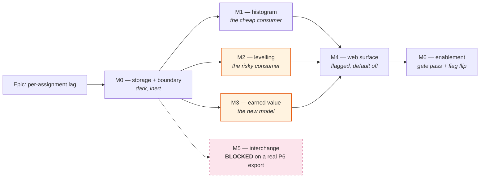

# Implementation Plan: Per-assignment lag across all three resource surfaces

- **Feature spec:** [`./feature-spec.md`](./feature-spec.md) — **not yet approved**
- **ADR:** [`../../adr/0071-per-assignment-lag.md`](../../adr/0071-per-assignment-lag.md)
- **Status:** Draft — awaiting approval
- **Owner:** _(to be assigned)_

## Breakdown

M1, M2 and M3 depend only on M0 and are **independent of each other** — they can land in any order, or in
parallel, and each is separately revertible (M2's revert is "pass 0 for every lag into the levelling input";
M3's is "always take the zero-lag fast path"). M1 is sequenced first because it is one line of production
code and it is the slice that closes the coverage exception and the audit finding.

### Epic

**Per-assignment lag across all three resource surfaces** — close `docs/specs/engine-surface-audit.md`
**F6**: give the already-implemented histogram lag a storage model, a write path and a control, and carry it
through to the levelling pass and the Earned-Value cost spread. Roadmap theme: engine↔planner surface
reconciliation.

---

## Milestone 0 — Storage and the write boundary (dark)

**Outcome:** the API accepts, stores and returns an assignment lag. **Nothing consumes it.** Behaviour is
provably unchanged; the slice is releasable and inert, which is what makes the three consumer slices
independently revertible.

---

#### Feature: The `lag_minutes` column and its boundary

> **Description:** an additive, constant-defaulted column on `resource_assignments`, its DTO fields, its
> **N34** rejects, its `@repo/types` contract, and the typed engine error + write-time pre-flight the later
> slices all depend on.
> **Complexity:** **M**
> **Dependencies:** none
> **Risks:** the column is trivial; the pre-flight introduces a calendar resolution into the assignment
> service, which is a new dependency direction → mitigate by gating it on `lagMinutes > 0` so the common
> write pays nothing, and by reusing the existing calendar-port resolution rather than writing a second one.
> **Testing requirements:** DTO validation unit tests (the `assignment-dto.validation.spec.ts` pattern);
> schema-drift check; service tests for the pre-flight and its 422; Supertest round-trip proving the stored
> minutes read back from the API (not from the DOM or a mock); a structural test that no read-model consumes
> the column yet.

##### Task 0.1 — Schema, migration and the CHECK

- **Description:** add `lagMinutes Int @default(0) @map("lag_minutes")` to `ResourceAssignment`
  (`apps/api/prisma/schema.prisma:2065-2169`) with the full docblock the model's siblings carry, plus
  `ck_resource_assignments_lag_minutes_range` `CHECK (lag_minutes BETWEEN 0 AND 5256000)` in raw SQL.
- **Complexity:** S
- **Dependencies:** —
- **Risks:** none material. A constant default means Postgres adds the column without a table rewrite →
  safe on a live table. No index (documented refusal in the spec) → no write-path cost.
- **Testing:** `pnpm check:schema-drift`; a migration-applies test; a DB-level test that a direct insert of
  `-1` and of `5_256_001` is refused by the CHECK (the backstop, distinct from the DTO reject).
- **Development steps:**
  1. Prisma model field + docblock (state: unsigned; activity's own calendar; no `lag_calendar` sibling; no
     index; the CHECK is a backstop, never the primary reject; keep in lock-step with `@repo/types`).
  2. `prisma migrate dev` — the `ADD COLUMN` and the `ADD CONSTRAINT`.
  3. Update `docs/DATABASE.md` if it enumerates the assignment's columns.

##### Task 0.2 — `@repo/types` + response DTO

- **Description:** `lagMinutes: number` on `ResourceAssignmentSummary`
  (`packages/types/src/index.ts:1671-1702`) and on `ResourceAssignmentResponseDto`
  (`apps/api/src/modules/resources/dto/assignment-response.dto.ts`), mapped in `.from()`. **Always present,
  never cost-gated** — it is schedule data, the `curveType` precedent.
- **Complexity:** S
- **Dependencies:** 0.1
- **Risks:** accidentally routing it through the `canReadCost` gate → mitigate with an explicit test that a
  Viewer receives a real `lagMinutes` while `budgetedCost`/`actualCost` are null.
- **Testing:** DTO mapping unit test; the cost-gating test above.
- **Development steps:** add the field + docblock in both places; export the shared bound constant
  `ASSIGNMENT_LAG_MINUTES_MAX = 5_256_000` from `@repo/types`; add a structural test asserting the DTO's
  `@Max` uses that constant (the shared-bound precedent).

##### Task 0.3 — Create/Update DTOs and the **N34** rejects

- **Description:** `lagMinutes?: number` with `@IsOptional() @Type(() => Number) @IsInt() @Min(0)
@Max(ASSIGNMENT_LAG_MINUTES_MAX)` on `create-assignment.dto.ts` and `update-assignment.dto.ts`, with the
  `@ApiPropertyOptional` description from the spec.
- **Complexity:** S
- **Dependencies:** 0.2
- **Risks:** **this is the task the spec exists to protect.** The read-model applies the lag only when
  `> 0`, so a negative slipping past the DTO is silently discarded → mitigate by testing the reject
  explicitly at the DTO, and by adding a comment at `resource-histogram.ts:222` recording that the `> 0`
  guard is a **parity fast path, not a validation**.
- **Testing:** `assignment-dto.validation.spec.ts` — `-1`, `-60`, `5_256_001`, `1.5`, `"3d"` (a string, which
  is a client bug) all 422; `0`, omitted, `1440`, `5_256_000` all accepted.
- **Development steps:** both DTOs; the validation spec rows; declare the 422 on the create/update routes in
  OpenAPI (the ADR-0053 M6 api-review finding — a missing 422 declaration was blocking there).

##### Task 0.4 — Typed engine horizon error

- **Description:** `export class WorkingTimeHorizonExceededError extends Error` in
  `apps/api/src/modules/schedule/engine/working-time-calendar.ts`, thrown at **both** bare-`Error` sites
  (`:306-308`, `:326-328`). Export it from `engine/index.ts`.
- **Complexity:** S
- **Dependencies:** —
- **Risks:** an existing `catch {}` elsewhere may be relying on the untyped throw → **verify** every
  `catch` around a calendar walk before changing it; `level.ts:221-228` is a known deliberate swallow of the
  _window-coverage probe_ and must keep behaving identically.
- **Testing:** a unit test building a window-only calendar with a tiny working week and asserting the typed
  error is thrown; a test asserting `level.ts`'s window-coverage probe still coerces to `coverage = 0`
  (behaviour unchanged).
- **Development steps:** the class; both throw sites; the export; grep every `catch` in `engine/` and in
  `schedule.service.ts` and confirm each still behaves as documented; **also verify whether
  `workingTimeBetween` can throw on the same input** rather than assuming it cannot — the spec deliberately
  does not assert that it cannot.

##### Task 0.5 — Write-boundary pre-flight + the shared 422 reason

- **Description:** `SCHEDULE_ERROR.ASSIGNMENT_LAG_UNREACHABLE` (`schedule.service.ts:76-93`), reused by a
  pre-flight in `ResourceAssignmentService.create`/`update`: when `lagMinutes > 0`, resolve the activity's
  calendar and attempt `addWorkingTime(start, lag)`; a `WorkingTimeHorizonExceededError` becomes a 422
  naming the activity, the resource and the calendar.
- **Complexity:** M
- **Dependencies:** 0.3, 0.4
- **Risks:** (a) a new dependency from `resources` → calendar resolution; mitigate by reusing the existing
  resolver rather than duplicating it, and by gating on `lag > 0`. (b) the pre-flight is
  necessary-but-not-sufficient (a calendar can be narrowed afterwards) → the runtime mapping in M1/M2/M3 is
  the backstop, and the ADR says so.
- **Testing:** service unit tests for the 422 and for the `lag = 0` path taking **no** calendar resolution
  (assert the resolver is not called — otherwise every assignment write silently gains a calendar build);
  Supertest e2e for the 422 shape and `details.reason`.
- **Development steps:** the reason constant; the pre-flight, placed **after** the 403/404/423 checks and
  before business rules (the file's established order, `resource-assignment.service.ts:107-120`); the
  OpenAPI declaration; the service specs.

##### Task 0.6 — Inertness proof + changeset

- **Description:** prove M0 changes no behaviour, and ship it.
- **Complexity:** S
- **Dependencies:** 0.1–0.5
- **Risks:** none — this task exists to make the risk of the later ones legible.
- **Testing:** a structural test asserting `lag_minutes` is selected by **no** read-model repository query
  yet; the full existing suite green unchanged; `scripts/e2e-local.sh api`.
- **Development steps:** the structural test; `pnpm lint && pnpm typecheck && pnpm test` **run, not written**
  (PROCESS.md DoD); `scripts/e2e-local.sh api` (this milestone touches `apps/api`); `pnpm changeset` —
  **minor** on `api` and `types`.

---

## Milestone 1 — The resource histogram (the cheap consumer)

**Outcome:** a lagged assignment's load starts at the lag. `res_assignment_lag` becomes a **reached**
capability, the coverage exception is deleted, and audit finding **F6** closes.

---

#### Feature: Wire the lag into the histogram, and close the catalogue gap

> **Description:** one field on the repository select, one line at the caller, one error mapping — plus the
> conformance, catalogue and documentation work that is the actual substance of this milestone.
> **Complexity:** **M** (the code is S; the catalogue work is M)
> **Dependencies:** M0
> **Risks:** deleting the coverage exception before a plan reaches the key would make `seed --coverage`
> report a **missing** key, which reads as a catalogue gap → the deletion and the plan land in the **same
> PR**. `pnpm check:playbook` gates the playbook row in both directions, so that must land with them too.
> **Testing requirements:** engine unit (already exists for the lag itself); a new **application-level**
> differential (lagged twin vs unlagged twin through the public REST API); conformance re-run; the
> capability plan; the playbook row; `pnpm check:playbook`; `seed --coverage` reporting 116/117.

##### Task 1.1 — Wire the histogram caller

- **Description:** select `lagMinutes` in the histogram assignment load, replace
  `schedule.service.ts:740`'s `lagMinutes: 0` with `lagMinutes: r.lagMinutes`, and **delete the three-line
  comment at `:737-739`**, which this change makes false.
- **Complexity:** S
- **Dependencies:** M0
- **Risks:** the false comment surviving the change is exactly the ADR-0066 M5.4 defect (an exporter kept
  wrong by a docblock describing behaviour that had been corrected) → make deleting it a review checklist
  item, not an afterthought.
- **Testing:** service test that a stored lag reaches `computeResourceHistogram`; a zero-lag byte-parity test
  on the endpoint response.
- **Development steps:** repository select; the caller; delete the comment; add a note at
  `resource-histogram.ts:222` that the `> 0` guard is the parity fast path and not a validation.

##### Task 1.2 — Map the horizon error to a 422 — **WITHDRAWN (premise measured false, 2026-08-02)**

This task was written on the belief that a legal lag on a starved calendar makes `addWorkingTime`
throw, so the histogram answers 500. **It does not.** Measured directly against the real port: a
calendar working **one minute per week** walks the full ceiling lag (5,256,000 working minutes) to
completion, returning `+102759-01T09:01`. The `HORIZON_DAYS` guard is an **iteration** cap and the
search window grows quadratically (`hi += weekSpan * (1 + guard)`), so it is never reached inside the
lag ceiling — the port only fails at ~100× the ceiling, and then with a `Date` overflow rather than
the horizon message.

So there is no 500 to convert. The error class, its mapping and its OpenAPI line were **written and
then reverted**, because an unreachable `catch` is dead code and a test that cannot make it fire is
worse than no test — it reads as proof that the case is handled.

What is true, and smaller than the drafted defect: an absurd lag on a starved calendar produces an
effective start tens of thousands of years out, which the **existing** `MAX_HISTOGRAM_BUCKETS` guard
already refuses as `HISTOGRAM_GRANULARITY_TOO_FINE`. That message is unhelpful for this cause but it
is not a wrong answer, and inventing a second guard to say it better is not worth a branch nobody can
reach. Recorded rather than fixed.

Method note: this is ADR-0058's rule applied to a plan rather than to prose. The plan is a document;
its claim that the walk throws was never verified, and the 25 lines it asked for would have shipped
as permanent dead code carrying a docblock asserting a defect that does not exist — the exact ADR-0066
M5.4 shape it warned about in its own risks line.

##### Task 1.3 — The capability plan, the coverage exception, the matrix and the playbook

- **Description:** the catalogue work, all in one PR so the gates never see an inconsistent state.
- **Complexity:** M
- **Dependencies:** 1.1
- **Risks:** ordering (above) → one PR. Also: a lagged twin that differs in more than the lag would make the
  histogram contrast ambiguous → the plan's own stated design principle is "differs in one thing only", and
  the reviewer should hold it to that.
- **Testing:** `seed --coverage` reports **116 reached, 1 excepted, 0 missing**; `pnpm check:playbook` green;
  the seeded plan created **through the public REST API** and its histogram asserted.
- **Development steps:**
  1. `apps/seed-cli/src/capabilities/resources.ts` — add `A_LAG` (a twin of `A_BELL`, identical but for the
     lag) and its lagged assignment, tagged `testTags: ['res_assignment_lag']`.
  2. **Delete** `res_assignment_lag` from `apps/seed-cli/src/capabilities/coverage.ts:46-49`.
  3. `docs/TEST_PLAYBOOK.md` — the Resources-section row (correct / wrong per the spec).
  4. `docs/specs/engine-conformance-framework/CAPABILITY_MATRIX.md` — **add** the `res_assignment_lag` row
     (the key appears nowhere today) **and** amend the levelling row (`:144`) so its "the curve read-model
     does NOT feed this levelling pass" sentence gains "the assignment **lag** now does (ADR-0071)".
  5. `docs/specs/engine-surface-audit.md` — F6 resolved; the coverage block at `:214-217` corrected.
  6. `docs/TECH_DEBT.md:502` — the repeated exception sentence updated.

##### Task 1.4 — **N34** negative cases — **RELOCATED (the tier does not accept them)**

The drafted home for these was `packages/seed/src/negative/cases.ts`. That tier is **pinned to the
conformance fixture's own case list** by `negative.spec.ts` — "covers every case in the fixture, with
no invented ones" — so adding `N34A`/`N34B` there fails the suite by design. The fixture has no
assignment-lag negative, and inventing one into a register whose whole point is that it mirrors the
benchmark would quietly make the tier something else.

So the N34 rejects live where they can actually run:

- **DTO boundary** — `assignment-dto.validation.spec.ts`: `-1`, `-60`, `ceiling + 1`, `1.5` and the
  string `'3d'` all rejected on **both** create and update; `0`, `1440`, the ceiling and an omitted
  field all accepted; plus a test pinning the DTO's `@Max` to the **shared** `@repo/types` constant
  rather than a copied literal.
- **API e2e** — `resources.e2e-spec.ts`: a negative lag refused **422** on create and on update
  against a real Postgres, alongside the round-trip and the not-cost-gated case.

The ADR-0035 §34 / N34 register entry still lands with M2, where the levelling semantics it also has
to describe are decided.

##### Task 1.5 — Ship M1

- **Complexity:** S · **Dependencies:** 1.1–1.4 · **Testing:** full pre-push gate **run**, plus
  `scripts/e2e-local.sh api`. · **Steps:** changeset (**minor**, `api`); `CLAUDE.md` + `docs/API.md` in
  lock-step.

---

## Milestone 2 — The levelling pass (the risky consumer)

**Outcome:** with `levelResources` on, a lagged assignment reserves capacity only from the day the resource
joins. **ADR-0041's parity argument changes from "structurally impossible" to "gated on `levelResources`,
data-conditional on all lags being zero" — and that restatement is the milestone's real deliverable.**

---

#### Feature: Per-assignment demand windows in `level.ts`

> **Description:** carry the lag on `EngineAssignment`, shift occupancy to `[start+lag, finish)`, and
> generalise the placement search to per-resource offsets — with the zero-lag identity proven directly on
> the search function, not only through the pass.
> **Complexity:** **L**
> **Dependencies:** M0
> **Risks:**
>
> - _The refactor silently moves an existing plan's levelled dates._ → **Capture golden snapshots of the
>   current implementation BEFORE touching it.** A snapshot taken after the refactor asserts the refactor
>   against itself. This is the single most important sequencing rule in the epic.
> - _The two halves disagree_ (occupancy shifted, search not) → they land in **one** task, with a test that
>   places an activity into a window a lagged assignment has vacated.
> - _The search loses its `O(k log k)` bound or its termination guarantee_ → an explicit complexity test
>   (call-count on the calendar port, the ADR-0054 counting-stub precedent) and a 2,000-activity perf assert
>   preserved from ADR-0041.
> - _Someone writes a monotonicity test_ ("adding a lag can only pull dates earlier") → the spec proves it
>   false; the reviewer must reject such a test.
>   **Testing requirements:** the pre-captured parity snapshot corpus; a direct zero-lag identity test on
>   `earliestFeasibleStart`; new lagged goldens; the S10 differential unchanged; the ADR-0066 pairwise
>   differential over the levelling dimension; the perf assert.

##### Task 2.1 — Capture the parity baseline (**do this first**)

- **Description:** a property/snapshot suite (`level.parity.spec.ts`) that runs the **current**
  `levelSchedule` over a randomised but seeded corpus — networks × capacities × `levelingPriority` ×
  `levelWithinFloatOnly` × mixed calendars — and stores the full result set as goldens.
- **Complexity:** M
- **Dependencies:** —
- **Risks:** an under-powered corpus proves nothing → require it to cover: pinned activities (mandatory /
  LOE / summary / milestone / progressed), `selfOverAllocated`, `levelingWindowExceeded`, negative float
  under `levelWithinFloatOnly`, and multi-resource contention. Those are ADR-0041's own named branches.
- **Testing:** the suite is the test. It must be **green on `main` before any change**, and green again after
  2.2/2.3 with all lags 0.
- **Development steps:** the corpus generator (seeded, deterministic); the snapshot capture; a comment in the
  file stating why the capture order matters.

##### Task 2.2 — Carry the lag to the engine

- **Description:** `lagMinutes: number` on `EngineAssignment` (`engine/types.ts:162-167`); the service
  populates it at `schedule.service.ts:998-1003`; the repository selects it.
- **Complexity:** S
- **Dependencies:** 2.1, M0
- **Risks:** **Gate A**. `EngineAssignment` is only assembled inside `if (plan.levelResources)`
  (`:970`) → add a **structural test** asserting `computeSchedule`'s signature is unchanged and that it
  takes no assignments, so the gate is pinned by a compiler-adjacent test rather than by a paragraph.
- **Testing:** the structural test; a service test that the lag reaches `levelSchedule`.
- **Development steps:** the type field + docblock; the service mapping; the repository select; the
  structural test.

##### Task 2.3 — Occupancy and the placement search

- **Description:** the algorithmic change. Occupancy at `level.ts:149` and `:253` becomes
  `[advanceWorking(calA, start, lag_i), finish)` per assignment; `earliestFeasibleStart` (`:336-407`) gains a
  per-resource offset and computes forbidden **candidate-start** intervals
  `( advanceWorking(b0, −d), advanceWorking(b1, −lag_i) )` per blackout, unions them across resources, and
  takes the first uncovered point ≥ the rolled-forward early start.
- **Complexity:** **L**
- **Dependencies:** 2.2
- **Risks:** the spec's §4(b) enumerates them; the mitigations are the tests below plus the
  "one task, both halves" rule.
- **Testing:**
  - **Zero-lag identity on `earliestFeasibleStart` directly** — for every corpus case, all-zero offsets
    return exactly what the pre-change function returned.
  - The 2.1 snapshot suite green with all lags 0 (**Gate B**).
  - New first-principles goldens: a single-capacity resource where a lagged assignment frees the first two
    days and a second activity is placed into that window; a lag ≥ span occupying nothing.
  - Termination/boundedness: no per-minute scan, no retry loop; a calendar-port call-count assert.
  - The ADR-0041 2,000-activity perf assert unchanged.
- **Development steps:** occupancy at both sites; the forbidden-interval formulation; delete or rewrite the
  `tryFit`/region machinery it replaces (no dead code); update the `levelSchedule` docblock — §2, §3 and the
  header's parity sentence all describe the old model and would otherwise become the next stale document.

##### Task 2.4 — The ADR-0041 amendment and the honest release note

- **Description:** ADR-0071 records the amendment; ADR-0041 is **not edited** (immutable), it is referenced.
  The Gate A / Gate B split, the non-monotonicity warning, and the release-note wording all land here.
- **Complexity:** S
- **Dependencies:** 2.3
- **Risks:** a release note promising "levelling only pulls dates in" → the spec's wording is mandatory.
- **Testing:** n/a (documentation), but `pnpm check:doc-links`.
- **Development steps:** the ADR sections; `CLAUDE.md`'s ADR-0041 summary line gains the amendment note; the
  changeset text uses the honest sentence.

##### Task 2.5 — Ship M2

- **Complexity:** S · **Dependencies:** 2.1–2.4 · **Testing:** full pre-push gate **run** +
  `scripts/e2e-local.sh api`; the ADR-0066 pairwise differential over the levelling dimension. · **Steps:**
  changeset (**minor**, `api`).

---

## Milestone 3 — Earned Value cost phasing (the new model)

**Outcome:** a lagged assignment's cost phases from the day its resource joins. Every plan with no lag
returns numbers identical to the minor unit — by an explicit fast path, not by rounding luck.

---

#### Feature: Per-component PV time-phasing

> **Description:** PV moves from one activity-level percentage to a cost-component-weighted sum, with the
> activity expense keeping the activity window and each assignment taking `[start+lag, finish)` under the
> **same** activity-level `accrualType`.
> **Complexity:** **L**
> **Dependencies:** M0; **CQ-1 answered** (it decides whether the baseline schema is touched)
> **Risks:**
>
> - _A silent ±1 minor unit on every existing plan_ from summing rounded components → the **zero-lag fast
>   path is a hard requirement**, tested structurally.
> - _`liveBAC === 0`_ → divide-by-zero on the share → fall through to the single-window path.
> - _Someone wires the lag into `performancePercent`_ → an explicit test that EV, AC and BAC are unchanged
>   for a lagged plan.
>   **Testing requirements:** the existing EV conformance goldens **unchanged to the minor unit**; a
>   structural test that the fast path is taken when all lags are 0; a flip-one-option differential proving
>   the output changes when a lag is set; unit tests for each accrual × lag combination including the
>   `END`-is-a-no-op case.

##### Task 3.1 — The component model in `earned-value.ts`

- **Description:** extend `EvAssignmentInput` with `lagMinutes: number`; replace the single
  `leafPlannedPercent` call at `:416` with a component sum **guarded by a zero-lag fast path** that takes
  today's expression verbatim. Components: the activity expense (activity window) and each assignment
  (`[start+lag, finish)`), each phased by the activity's `accrualType`. Split `pvCost` by live budget
  shares (**CQ-1 option A**), guarding `liveBAC === 0`.
- **Complexity:** **L**
- **Dependencies:** M0, CQ-1
- **Risks:** above.
- **Testing:**
  - Existing EV conformance goldens (A4200 / A7100 / A8010 / A6100 / A3010 / A10300 + the two WBS ancestors)
    **byte-unchanged**.
  - Structural: the fast path is taken iff no participating assignment has `lagMinutes > 0`.
  - Per-accrual units: `START` on a lagged assignment recognises at `start+lag`; `UNIFORM` spreads over the
    lagged window; **`END` is a no-op** (the case a reader assumes changed).
  - Degenerate: lag ≥ span → recognised at the effective start (the existing zero-span branch, `:353`).
  - `liveBAC === 0` → single-window path, no `NaN`.
  - EV/AC/BAC unchanged for a lagged plan.
- **Development steps:** the input field; the component split helper (reusing `leafBudgetAndActual`'s exact
  expressions so the components sum to today's `bac` by construction); `leafPlannedPercent` called per
  component with a window parameter; the fast path; the docblock rewrite (the current header says EV
  "schedules nothing … the parity gate is structurally trivial" — still true of the **recalc** gate and now
  needing the PV-contract sentence beside it).

##### Task 3.2 — `costPhasingLaggedCount` and the service assembly

- **Description:** the additive count on `PlanEarnedValueResult` and the response DTO (a sibling of
  `costWarningCount` / `stepWeightZeroCount`); the service populates `lagMinutes` at
  `schedule.service.ts:634-640` and selects it in the EV repository load; the horizon error maps to the same 422.
- **Complexity:** M
- **Dependencies:** 3.1, 0.4
- **Risks:** the EV endpoint is `cost:read`-gated — the count must not leak anything a non-reader could not
  already infer; it is a count of leaves, not a cost, so it is safe, but state it in review.
- **Testing:** the count is 0 on every existing plan (the parity signal); a Supertest e2e for the field and
  for the 422.
- **Development steps:** the result field + docblock; the DTO + `@repo/types`; the service mapping; the
  repository select; the OpenAPI description including **the CQ-1 approximation, written down where a
  consumer will read it**.

##### Task 3.3 — Conformance differential and the ADR-0042/0044 extension

- **Description:** an EV differential (lag set ⇒ PV differs; `resultsDiffer`, ADR-0034 §2); ADR-0035 §34
  gains the EV semantics; ADR-0071 records the extension of ADR-0042 §2 and ADR-0044 §32.
- **Complexity:** M
- **Dependencies:** 3.1, 3.2
- **Risks:** a differential that passes for the wrong reason (e.g. a rounding wobble) → assert a _material_
  PV difference at a stated date, not merely inequality.
- **Testing:** the differential; the matrix row updated to name EV as a lag consumer.
- **Development steps:** the adapter/spec additions in
  `apps/api/src/modules/schedule/conformance/`; the ADR sections; the matrix.

##### Task 3.4 — Ship M3

- **Complexity:** S · **Dependencies:** 3.1–3.3 · **Testing:** full pre-push gate **run** +
  `scripts/e2e-local.sh api`. · **Steps:** changeset (**minor**, `api`, `types`).

---

## Milestone 4 — The web surface (flagged, default off)

**Outcome:** a Planner can author a lag. `VITE_ASSIGNMENT_LAG` is **off**, so the shipped surface is
byte-for-byte the prior one.

---

#### Feature: The Lag field on the shared assignment panel

> **Description:** one `TextField` on `ActivityResourcesPanel.tsx` and one read-out on `AssignmentRow.tsx`,
> using the ADR-0070 `d/h/m` grammar with a **required** `hoursPerDay`.
> **Complexity:** **M**
> **Dependencies:** M0 (the API contract); M1/M2/M3 for the effect to be visible
> **Risks:**
>
> - _The calendar never reaches the control_ — exactly the ADR-0070 M6 defect on `CreateActivityButton`,
>   where the field rendered, looked right and quietly refused `4h` → the flag-on journey must assert the
>   **stored minutes read back from the API**, not the DOM.
> - _A re-seed overwrites a value typed before the calendar resolved_ — the ADR-0070 `useDurationSeed` defect
>   → do not ask a `dirtyFields` flag captured by an earlier render; read the field's current value inside
>   the effect.
> - _The read-out re-derives from minutes and rounds a 4 h lag to `+1d`_ — the ADR-0070 M4 defect → print
>   the row's own value on the whole-day branch.
> - _Editing both the panel and the dialog_ → the dialog renders the extracted panel (ADR-0062); changing
>   both would reintroduce the drift that ADR forbids.
>   **Testing requirements:** unit tests for parse/format/degrade; **flag-off parity suites** pinning both
>   touched surfaces; a11y (label association, error `aria-describedby`, announced save); a flag-on
>   Playwright journey with its own CI step.

##### Task 4.1 — The field, the read-out and the gate

- **Complexity:** M · **Dependencies:** M0
- **Risks:** as above; plus gating — reuse the `definition` gate object (Logic/Resources share it with
  General, ADR-0062), **shade with a reason, never hide** (the ADR-0062 M6 finding).
- **Testing:** unit tests for `3d` / `4h` / `1d 4h` / bare `3` / `-1d` (client-side reject) / unparseable;
  the not-yet-resolved-calendar degrade path; the read-only-with-reason path for a Contributor and for a
  non-pen-holder.
- **Development steps:** the `TextField` in the existing `FieldGrid` (`:352`); the `AssignmentRow` read-out;
  `parseDurationText`/`formatDurationText` with `hoursPerDay` from the **form's currently selected**
  calendar; the flag; the gate + reason wired by `aria-describedby`.

##### Task 4.2 — Flag-off parity suites

- **Complexity:** S · **Dependencies:** 4.1
- **Risks:** weakening them later → they are the rollback contract and are **kept and pinned**
  (`vi.mock` of `@/config/env`), the ADR-0053 M6 rule.
- **Testing:** the suites themselves.
- **Development steps:** parity suites for the panel and the row.

##### Task 4.3 — The flag-on journey

- **Description:** `apps/web/e2e-assignment-lag/` with its own CI step and a
  `pnpm --filter @repo/web test:e2e:assignment-lag` script.
- **Complexity:** M · **Dependencies:** 4.1
- **Risks:** a journey that asserts the DOM proves nothing about storage → it must read the assignment back
  **from the API** and assert `lagMinutes`, on an **eight-hour calendar** so a day↔minute error is visible
  (the ADR-0070 `e2e-sub-day` design, which found two real defects on its first run).
- **Testing:** the journey: author a lag under the pen; assert the stored minutes; assert the histogram's
  first bucket; assert a Contributor is refused.
- **Development steps:** the suite; the CI step; `scripts/e2e-local.sh web:assignment-lag` run locally
  **before** pushing (PROCESS.md DoD — the e2e half is not CI's job).

##### Task 4.4 — Ship M4

- **Complexity:** S · **Testing:** full pre-push gate **run** + `scripts/e2e-local.sh web:assignment-lag`. ·
  **Steps:** changeset (**minor**, `web`).

---

## Milestone 5 — Interchange (**blocked**)

**Outcome:** assignment lag round-trips through XER. **This milestone may not start** until the P6 column
name and units are confirmed against a real export.

> **Blocking condition, stated plainly.** The repository's own P6-class XER
> (`packages/engine-conformance/fixtures/p6_torture_test_v1.xer:378`) declares `TASKRSRC` as
> `taskrsrc_id task_id rsrc_id target_qty target_qty_per_hr driving_flag act_reg_qty` — **no lag column of
> any kind**. This repo therefore contains **no evidence** of the field's name, units or sign convention.
> Coding it from memory is the ADR-0058 failure mode. **Prerequisite: obtain a real P6 XER export from a
> project carrying an assignment lag, record the column name and units in the ADR-0050 mapping-contract
> table, and only then wire the parser.**

---

#### Feature: Canonical shape now, parser later

> **Complexity:** S now (shape + report), M later (parser + emitter)
> **Dependencies:** M0; **the blocking confirmation** for the parser half
> **Risks:** guessing the column name and shipping an importer that silently reads nothing (or, worse, reads
> the wrong column) → the shape/report half is deliberately separable so the epic is not held hostage.
> **Testing requirements:** mapping-contract assertions; a report-finding test for both formats.

##### Task 5.1 — Canonical field + mapping-contract rows (unblocked)

- **Description:** `lagMinutes: z.number().min(0).default(0)` on `canonicalAssignmentSchema`
  (`packages/interchange/src/canonical.ts:285-302`); the ADR-0050 mapping table records assignment lag as
  **not imported** and **dropped on export** in **both** formats, each with a report finding.
- **Complexity:** S · **Dependencies:** M0
- **Risks:** a default that quietly makes every imported assignment lag 0 is correct and must be _stated_ —
  it is a documented approximation, not silence.
- **Testing:** the mapper produces `lagMinutes: 0` for every imported assignment; export emits a `drop`
  finding for any assignment with a positive lag, in both XER and MSPDI.
- **Development steps:** the schema field; the mapper default; the two export findings; the ADR-0050 table
  rows; **MSPDI** recorded as a drop in both directions, with the honest note that `<Assignment><Delay>` is a
  plausible equivalent that is **unverified from this repo** and sits in the same confirm-first bucket.

##### Task 5.2 — XER import/export (**blocked**)

- **Description:** read and emit the confirmed column in `xer-adapter.ts` / `xer-emit.ts`; update the mapping
  table from "dropped" to the round-trip row.
- **Complexity:** M · **Dependencies:** 5.1 **and the confirmation**
- **Risks:** unit mismatch (hours vs minutes) silently scaling every imported lag by 60 → the round-trip test
  must assert an exact working-minute value, not merely "a lag exists".
- **Testing:** a round-trip test (export → import → identical `lagMinutes`), the `export-xer.spec.ts` LOE
  precedent — that suite exists because the exporter silently downgraded a type for months.
- **Development steps:** parser; emitter; the mapping-table row; the fixture updated only if a real export
  is available to update it from.

---

## Milestone 6 — Enablement (the gate pass)

**Outcome:** `VITE_ASSIGNMENT_LAG` flips **default-on**, after the deferred specialist reviews run over the
combined diff and every blocking finding is folded with a regression test.

---

#### Feature: The specialist gate pass and the flip

> **Description:** the repo's established enablement milestone (ADR-0053 M6, ADR-0060 M6, ADR-0062 M6,
> ADR-0063 M6, ADR-0064 §7, ADR-0067 M4). It is not ceremony: each of those found blocking defects in code
> that had already passed a human read, and the shape recurs — **one correct pattern applied to a control and
> not its neighbour.**
> **Complexity:** **M**
> **Dependencies:** M1–M4
> **Risks:** treating the flip as the deliverable and the review as paperwork → the milestone's acceptance is
> "every blocking finding folded **with a regression test verified to fail against the old code first**".
> **Testing requirements:** the five reviews; regression tests per finding; the flag-off parity suites kept.

##### Task 6.1 — Run the reviews

- **Complexity:** M · **Dependencies:** M1–M4
- **Agents:** **database-architect** (already ran on the column — re-confirm the migration and the CHECK),
  **security-reviewer** (the new 422's information content, the cost-gating decision, IDOR on the pre-flight's
  calendar resolution), **api-reviewer** (the additive fields, the 422 declarations, the EV response
  addition), **backend-performance-reviewer** (**the levelling search's cost model** — this is the one that
  matters most: the ADR-0053 M6 pass found an 830 ms → 13 ms defect in an advisory-lock loop), **ux-reviewer**
  - **accessibility-reviewer** + **component-reviewer** (the field, the read-only reason, the announcement,
    the read-out), **test-engineer** (the parity corpus's coverage of ADR-0041's named branches).
- **Testing:** each finding gets a test that fails against the pre-fix code.
- **Development steps:** run; triage blocking vs. suggested; fold the blocking ones; record the rest in
  `docs/TECH_DEBT.md` rather than rushing them (the ADR-0060/0062/0064 precedent).

##### Task 6.2 — Flip the flag and reconcile the documents

- **Complexity:** S · **Dependencies:** 6.1
- **Risks:** the flip happening before the journey has run against a real API → it must not.
- **Testing:** `scripts/e2e-local.sh web:assignment-lag` with the flag on; the flag-off parity suites **kept**.
- **Development steps:** default the flag on; `CLAUDE.md`'s ADR list gains ADR-0071 and its ADR-0041 line
  gains the amendment; `docs/DECISIONS.md` if any smaller call was made along the way; changeset
  (**minor**, `web`); confirm the reconciliation-pass trigger (ADR-0058 — this is an epic boundary).

---

## Sequencing & slices

| Slice  | Lands                                      | Releasable?              | Independently revertible?                           |
| ------ | ------------------------------------------ | ------------------------ | --------------------------------------------------- |
| **M0** | Column, DTOs, N34, typed error, pre-flight | Yes — provably inert     | Yes (drop the column)                               |
| **M1** | Histogram + the catalogue closure          | Yes                      | Yes (restore `lagMinutes: 0` at the caller)         |
| **M2** | Levelling                                  | Yes                      | Yes (pass 0 for every lag into the levelling input) |
| **M3** | Earned Value                               | Yes                      | Yes (always take the zero-lag fast path)            |
| **M4** | Web, flag **off**                          | Yes                      | Yes (the flag; the parity suites are the contract)  |
| **M5** | Interchange shape (5.1) / parser (5.2)     | 5.1 yes; 5.2 **blocked** | Yes                                                 |
| **M6** | Gate pass + flag **on**                    | Yes                      | Yes (flip the flag back)                            |

**Feature flag:** `VITE_ASSIGNMENT_LAG`, default **off** through M4–M5, flipped in M6. It is a client
build-time constant and therefore gates **only** the web surface — the API accepts a lag from M0 regardless,
which is the ADR-0060 M0 lesson (a `VITE_` constant cannot gate a server check).

**Order of first value:** M0 → M1 delivers the visible histogram fix and closes the audit finding in two
small PRs. M2 and M3 can then proceed in parallel or in either order.

## Definition of Done (per task)

Each task's PR must satisfy the Feature Completion Criteria in [`docs/PROCESS.md`](../../PROCESS.md) — code,
tests, docs, security, performance, accessibility, Docker build, CI, changelog, version impact — with the
repo's specific emphasis: **the pre-push gate is run, not written**
(`pnpm lint && pnpm typecheck && pnpm test`, plus `scripts/e2e-local.sh api` for every `apps/api` change and
`scripts/e2e-local.sh web:assignment-lag` for the journey, plus `pnpm check:playbook` for Task 1.3). CI is
the second opinion, never the first.

## Risks & assumptions (rollup)

| Risk / assumption                                                                          | Likelihood            | Impact   | Mitigation                                                                                                                                          |
| ------------------------------------------------------------------------------------------ | --------------------- | -------- | --------------------------------------------------------------------------------------------------------------------------------------------------- |
| The levelling search refactor silently moves existing levelled dates                       | med                   | **high** | Task 2.1 captures goldens from the **current** implementation **before** any change; zero-lag identity asserted directly on `earliestFeasibleStart` |
| The EV component sum shifts every existing plan's PV by a minor unit                       | **high** if unguarded | high     | The zero-lag fast path is a **hard requirement**, pinned by a structural test; the existing EV goldens must be byte-unchanged                       |
| A negative lag is accepted and silently discarded                                          | med                   | high     | `@Min(0)` at the DTO (**N34**) + CHECK backstop; the `> 0` guard documented as a parity fast path, not a validation                                 |
| A stored lag becomes unresolvable after a calendar is narrowed → 500                       | low                   | med      | Typed engine error + 422 mapping at all three read sites; write-time pre-flight as the first line (**CQ-2** decides the read-time policy)           |
| The coverage exception is deleted before a plan reaches the key                            | med                   | low      | Task 1.3 lands both in **one** PR; `seed --coverage` and `check:playbook` are the gates                                                             |
| The false comment at `schedule.service.ts:737-739` survives the change                     | med                   | med      | Explicit step in Task 1.1 and a review checklist item — the ADR-0066 M5.4 shape                                                                     |
| A monotonicity claim ("adding a lag only pulls dates in") reaches a release note or a test | med                   | med      | The spec proves it false; the wording is mandated in Task 2.4; the reviewer rejects such a test                                                     |
| The XER column name is coded from memory                                                   | med                   | **high** | M5.2 is **blocked** on a real export; M5.1 ships the shape and the honest "dropped" mapping row                                                     |
| The calendar never reaches the web control (the field looks right and refuses `4h`)        | med                   | med      | The flag-on journey asserts **stored minutes read back from the API**, on an eight-hour calendar                                                    |
| Levelling's cost model degrades (per-minute scan / retry loop)                             | low                   | high     | Call-count complexity assert + the ADR-0041 2,000-activity perf assert; backend-performance-reviewer in M6                                          |
| **Assumption:** the shipped "lag eats into the activity" semantic is intended              | —                     | high     | **CQ-3** — cheap to confirm, expensive to reverse after M2/M3 build on it                                                                           |
| **Assumption:** PV may be split by live budget shares when a baseline exists               | —                     | med      | **CQ-1** — decides whether ADR-0025 and the baseline schema are in scope                                                                            |
