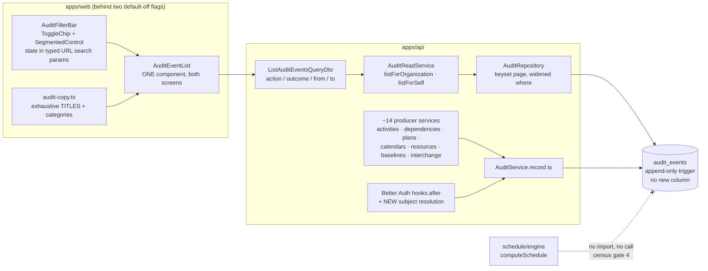
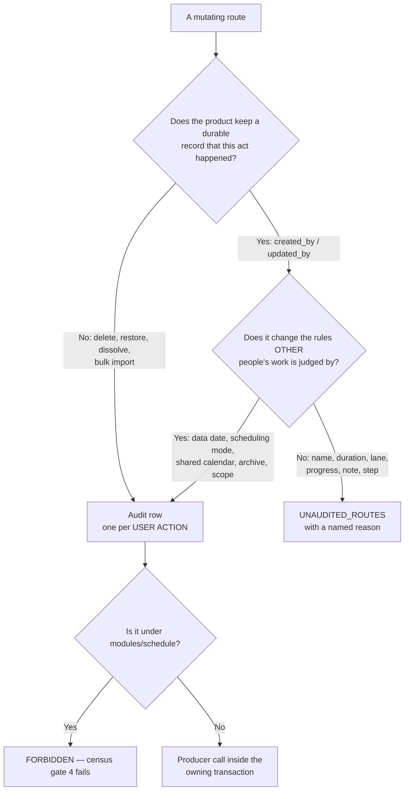
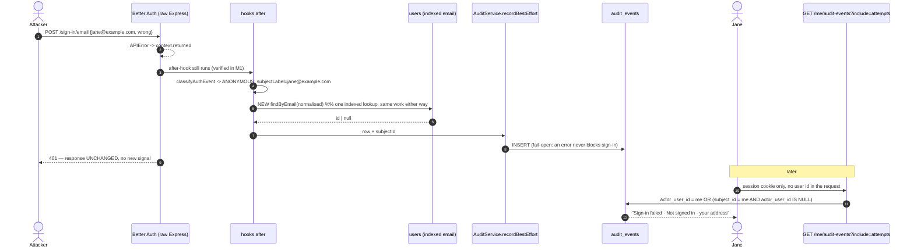

# Feature Spec: Audit-log coverage — readable failures, a filtered feed, and which mutations earn a row

- **Status:** Draft — **awaiting approval before implementation**
- **Author(s):** feature-analyst (Product Owner / Solution Architect / Technical Lead hats)
- **Date:** 2026-08-04
- **Tracking issue / epic:** _TBD_ — continuation of the ADR-0072 epic
- **Roadmap link:** the security/governance strand of [`docs/BACKLOG.md`](../../BACKLOG.md)
- **Related ADR(s):** **ADR-0072** (the accepted decision this completes) · ADR-0012 (RBAC +
  resource scoping) · ADR-0016 (tenancy/roles) · ADR-0028 (the pen) · ADR-0034 (recalc parity) ·
  ADR-0038 (WBS parent tree) · ADR-0046 (notes — non-pen-gated) · ADR-0048 (undo/redo) ·
  ADR-0050 (interchange) · ADR-0051 (share links) · ADR-0053 (measure before you index; library
  scoping) · ADR-0057 (`modules/clients` as the canonical shape) · ADR-0058 (verify the claim) ·
  ADR-0063 (dissolve) · ADR-0069 (lane packing on import). **A new ADR is required** — see §4
  "The ADR this needs".

---

## 0. Lineage — what this supersedes, and what it does not

This is the **third** spec directory of one epic. It does not rewrite the first two; those are the
record of what shipped.

| Original artifact                                                                                    | Status                                                                                                | This spec                                                                                                                                                                                                                            |
| ---------------------------------------------------------------------------------------------------- | ----------------------------------------------------------------------------------------------------- | ------------------------------------------------------------------------------------------------------------------------------------------------------------------------------------------------------------------------------------ |
| [`docs/specs/audit-log/feature-spec.md`](../audit-log/feature-spec.md) §1–§4 (M1)                    | **Shipped**, unchanged                                                                                | Input. Not restated except where the code and that document disagree (§0.1).                                                                                                                                                         |
| [`../audit-log/implementation-plan.md`](../audit-log/implementation-plan.md) M1, M2                  | **Shipped** (store, 3 families, 2 reads, 2 screens, gates, flag flipped default-on 2026-08-03)        | Input.                                                                                                                                                                                                                               |
| Original **Task 4.1** — share links                                                                  | **Shipped** in M3 (2026-08-03)                                                                        | Input. `share.created` / `share.revoked` are in the vocabulary and in the census's **positive** assertion.                                                                                                                           |
| Original **Task 4.2** — partitioning / retention decision                                            | **Answered** on measurement (1,000,005 rows, ~592 B/row, both reads sub-ms)                           | Input, not re-done. Its conclusion (**not warranted; revisit at ~10M rows; retention is `DETACH PARTITION`, never `DELETE`**) is a constraint on §4, not a task.                                                                     |
| Original **Task 4.3** — "mutation events (activity/dependency deletes, library writes, interchange)" | **Superseded** by Milestone **C3** below                                                              | The instruction "XL; slice per domain, one PR each" is kept verbatim. What changes is the **target**: not "the rest of the mutating surface" but a catalogue derived from a stated test (§2.1). Its dependency on 4.2 is discharged. |
| Original **Task 4.4** — "filters + the `action` composite index, **if the filter ships**"            | **Superseded** by Milestone **C1** (the filter) and a per-slice measurement inside **C3** (the index) | The conditional is removed, the two halves are separated, and the order is **inverted** — with reasons, in §4 "The reorder".                                                                                                         |
| Original **Milestone 4** — tamper-evidence escalation                                                | **Unchanged and out of scope**                                                                        | Still gated on the deployment-target decision (TECH_DEBT #5). Nothing here touches it.                                                                                                                                               |
| `docs/TECH_DEBT.md` **#91** — a failed sign-in is readable by nobody                                 | **Open**                                                                                              | Closed by Milestone **C2**. It is **new work**, not in the original plan; the original plan predates the debt row.                                                                                                                   |

**Milestone C4 (the enablement pass over the combined diff) is also new.** The original M3 had no
enablement milestone, which is out of step with how every user-visible epic since ADR-0063 has
shipped.

### 0.1 Two claims in the shipped artifacts that the code does not support

Recorded here rather than quietly worked around — ADR-0058's rule applied to this epic's own
documents, which is how the M1 route census came to say 116 instead of 67.

1. **Family C does not record the cascade counts.** The M1 spec's family-C table promises
   `changes = { deleteBatchId, counts: CascadeCounts }`. The shipped allow-list is
   `'client.deleted': ['name', 'deleteBatchId']` (`audit-redactor.ts`), and the producer
   (`hierarchy-audit.ts`) never passes counts at all. It could not have worked if it did:
   `normalise()` reduces any non-scalar to a **type marker** (`[object]`), by design, because the
   allow-list vets the top-level key and cannot vouch for a sub-tree. So a delete of 412 activities
   records the batch id and not the size. **Fix in C3.1** by flattening to scalar count fields; the
   same shape then serves family D. (The ADR's own consequence line — "the `CascadeCounts` a delete
   already computes stop being written to stdout and discarded" — is, today, half true: the
   `delete_batch_id` names them, nothing records them.)
2. **The attempted email is not in `changes`.** The M1 spec's CQ-4 shows
   `{ attempted: { email } }`. As built, the auth allow-list is deliberately **empty** and the
   attempted address lands in `subject_label`, a first-class text column, capped at 320 chars
   (`auth-audit.ts`). The as-built shape is the better one and **this spec builds on it** — §4's
   attribution design depends on the address being a column rather than a JSON leaf.

---

## 1. Business understanding

### Problem

The audit log shipped, was flipped default-on, and met a real reader within hours. Three gaps are
now visible, and each is the same underlying failure in a different place: **the log records
things nobody can find.**

1. **A failed sign-in is recorded and readable by nobody** (`docs/TECH_DEBT.md` #91). An
   `auth.sign_in_failed` row carries **no `organization_id`** (authentication happens before an
   organisation is known) and **no actor** (`actor_type = ANONYMOUS`, `actor_user_id = null` — the
   whole point of a failed attempt is that the claim was not proven). Both reads filter on exactly
   those columns: `listForOrganization` on `organization_id`, `listForSelf` on `actor_user_id`. So
   repeated attempts against one account — the single most useful thing an audit log has to say —
   are reachable only from `psql`. Neither read is wrong. The gap is **coverage**, and ADR-0072 is
   explicit that closing it "is a security decision about scope rather than a filter to widen".
2. **The feed has no filter of any kind.** Verified, not assumed: `PaginationQueryDto` is the
   entire query contract for both endpoints (`limit`, `cursor`, nothing else), and neither screen
   renders a filter control. The org log already interleaves seven distinct concerns — role
   changes, four invitation/membership events, share grants, and three levels of hierarchy
   deletion. "Who changed roles last month" is answerable only by paging.
3. **Plan content is not recorded at all.** Every activity, dependency, calendar, resource, note,
   baseline and step route sits in `UNAUDITED_ROUTES` under one of two reasons —
   `content-edit-deferred-to-m3` (86 routes) or `import-creates-plan` (2). The product owner
   created and deleted activities within hours of release, looked at the log, and found nothing.

Gaps 2 and 3 interact, and that interaction is the central planning decision here: **landing gap 3
before gap 2 would bury the events the log exists for.** Mutation traffic is two to three orders of
magnitude above what the log records today; poured into an undifferentiated reverse-chronological
stream, a month of permission changes becomes a needle in an afternoon of activity edits. That is
the same defect class as the copy bug found on first contact — a correct feature a reader cannot
use — arriving through the front door.

**Why now.** The product is in use (CLAUDE.md §17: the owner runs the Compose stack with the
Watchtower profile enabled, so anything default-on is live). The storage question that gated this
work is **answered**: ~592 B/row, 0.6 GB per million events, both reads sub-millisecond at 1M rows.
Performance is no longer the gate. Volume — as _readability_, not as cost — is.

### Users

| Persona                            | Org role  | What they need from this work                                                                                                                           |
| ---------------------------------- | --------- | ------------------------------------------------------------------------------------------------------------------------------------------------------- |
| **Security-responsible owner**     | Org Admin | To ask a question and get an answer: "who changed roles this month", "who deleted the Phase 2 activities", "did anyone try to get into Jane's account". |
| **Any signed-in member**           | any       | To see failed sign-in attempts against **their own** account, and to find their own sign-ins without paging past everything else.                       |
| **Planner investigating a change** | Planner   | To learn who removed a dependency or dissolved a WBS band. _(Partly served: they cannot read the org log — see §2.6.)_                                  |
| **Operator / incident responder**  | —         | Unchanged: `psql` remains the only route to cross-account authentication history, deliberately (ADR-0072).                                              |
| **Future engineer**                | —         | A written rule for "does this new endpoint audit?" that is not "ask someone".                                                                           |

### Primary use cases

1. Filter the organisation log to one kind of event (or a named group of them) and read the result.
2. See failed sign-in attempts against my own account, on the screen that already holds my sign-ins.
3. See who deleted an activity, removed a dependency, dissolved a WBS band, or imported a programme.
4. See who changed a plan's scheduling settings or a shared calendar's working time — the two
   classes of edit that silently re-date other people's work.
5. Add a new mutating endpoint and be told, by a failing test, to decide whether it audits — and be
   able to answer from a written rule rather than a judgement call.

### User journeys

**J1 — "did somebody try to get into my account?"** A member reads a password-reset email they did
not request, opens the account menu → **My activity**, and sees three `Sign-in failed` rows against
their address in the last hour, with the actor column reading **Not signed in**. They change their
password. _(Today: the rows exist and the screen shows nothing.)_

**J2 — "who deleted Phase 2?"** An Org Admin opens **Audit log**, selects the **Deletions** filter
group, and sees `Activity deleted — "Phase 2 fit-out" · 41 activities, 63 links` attributed to a
planner, with the timestamp. _(Today: nothing is recorded, and after a restore even `deleted_at` is
gone.)_

**J3 — "why did the whole programme move?"** A planner reports every date shifted overnight. The
Org Admin filters to **Settings & calendars** and finds
`Calendar working time changed — "Site 8-hour"` from yesterday evening. _(Today: `updated_by` on
the calendar names the last writer with no timestamp context and no before→after.)_

**J4 — the engineer's journey.** A new `POST …/plans/:planId/snapshots` route lands. CI fails:
`new routes must be added to AUDITED_ROUTES or UNAUDITED_ROUTES`. The engineer reads §2.1's test,
concludes "the created row carries `created_by`, so the act has a durable record", and adds one
line to `UNAUDITED_ROUTES` with `REASONS.DURABLY_ATTRIBUTED`.

### Expected outcomes

- The most security-relevant row in the table becomes visible **to the person who can act on it**,
  and to nobody else.
- The org log becomes a tool you interrogate rather than a stream you scroll.
- "Who deleted this / who changed the rules" is answerable in the product, for the acts where the
  product otherwise keeps no record.
- "Does this endpoint audit?" acquires a written, testable rule — so the census stops being a list
  of 116 individual judgements.

### Success criteria

- **Coverage:** a failed sign-in against a known address is visible to that account holder within
  one page load; it is visible on **no** organisation feed.
- **Findability:** on a 5,000-row org feed seeded to a realistic mix, an Org Admin reaches "every
  role change in the last 30 days" in **one interaction** and one request.
- **Volume, measured not asserted:** after C3, the audited rows a plan produces scale with the
  **size of the programme** (activities, links, imports), not with the **number of interactions** —
  demonstrated by driving the ADR-0066 seed catalogue and counting rows per plan (§2.4).
- **Performance:** the filtered org read stays **< 5 ms** at 1M rows (the M3 measurement's rig), and
  any index added is justified by a recorded `EXPLAIN (ANALYZE, BUFFERS)` in the migration comment
  (ADR-0053 M4). No index is added for a filter that does not exist.
- **Parity:** `computeSchedule` byte-identical (structural — the engine imports no Prisma client and
  gate 4 of the census forbids a call in `modules/schedule/**`); flag-off is byte-for-byte the
  prior screens, pinned by kept parity suites.
- **Accessibility:** the filter is keyboard-operable, its settled result count is announced
  (WCAG 4.1.3), and an empty filtered result says **why** it is empty.

### Open questions

Three are **CRITICAL** — their answers change the shipped surface. Every question carries a decided
default so nothing is blocked; the defaults are what §2–§4 specify.

- **CQ-A (CRITICAL) — Who may read an actor-less row?** ADR-0072 says this is a security decision
  about scope, so it is made here rather than deferred again.
  _Decision:_ **the targeted account holder, and nobody else.** A failed sign-in whose attempted
  address matches a real account is attributed at **write time** into `subject_id`, and
  `GET /me/audit-events?include=attempts` returns rows where the caller is the actor **or** the
  subject of an actor-less row. It is **not** added to any organisation feed, and there is no third
  read. An attempt against an address that matches no account stays operator-only. Reasoning and
  the rejected alternatives are in §4 "Attribution".
  _If overridden:_ the alternative on the table is "attempts against an email that is a member,
  shown on that organisation's feed" — one extra query at write time, a second scope, and the
  consequences in §4 "Why not the organisation feed".
- **CQ-B (CRITICAL) — Which mutations earn an event?** _Decision:_ the catalogue in §2.2, derived
  from **two stated tests** (§2.1). It adds **19 actions**. An ordinary activity field edit —
  rename, duration, dates, lane, progress, notes, steps, assignment units, drag position — earns
  **no row, ever**, and that is a permanent decision, not a deferral: it is a plan-revision
  feature, a different product with a different shape (§2.5).
  _If overridden:_ widening to creates costs one action per entity and roughly doubles the row rate
  (§2.4); narrowing by dropping the four archive actions costs nothing but leaves `archived_at`
  changes unattributed.
- **CQ-C (CRITICAL) — Filters before mutation events, or after?** _Decision:_ **before, and its
  flag flip is a hard precondition for the first mutation-event PR.** The full assessment —
  including where the original plan was and was not backwards — is §4 "The reorder". Note the
  consequence that makes it more than a preference: the producers are **server-side and cannot be
  flagged** (a `VITE_` constant is a client build-time value), so the day a mutation producer
  merges, every reader's feed changes whether or not any flag is on.
- **CQ-D — Does `activity.created` join the catalogue?** _Default:_ **no.** `created_by` /
  `created_at` on the row is a durable, permanent record of the act; the audit row would duplicate
  it. The honest cost is stated in §2.5: an ADR-0048 undo of a delete is a **re-create**, so the log
  shows a deletion with no matching restore. That is recorded as a new TECH_DEBT row pointing at
  ADR-0048 M4's id-stable restore, not patched by widening the catalogue.
- **CQ-E — Do the existing family-C rows gain flattened cascade counts?** _Default:_ **yes**, in
  C3.1, fixing §0.1(1) in the PR that introduces the same shape for activities. Old rows are not
  backfilled and cannot be: the trigger refuses `UPDATE`.
- **CQ-F — Retention / partitioning.** _Default:_ **unchanged.** Not warranted; revisit at ~10M
  rows; `DETACH PARTITION`, never `DELETE`. C3's row-rate estimate (§2.4) is the input that would
  move it, and this spec's answer is that it does not.

---

## 2. Functional requirements

### 2.1 The rule — when does a mutation earn an audit row?

Everything in §2.2 follows from **two tests**. A mutating route earns an event if it passes either.
This is written as a rule rather than a list because the list is 116 routes today and grows.

> **Test 1 — the durability test.** _Does the product otherwise keep a durable record that this act
> happened, and who did it?_ If not, it earns a row.
>
> - **Create** → `created_by` / `created_at` sit on the row, permanently, and survive soft delete.
>   **No row.**
> - **Update** → `updated_by` / `updated_at` record the last writer. Before→after is lost, but that
>   is a _content history_, not a record that the act happened. **No row** (unless Test 2 applies).
> - **Delete / restore** → the act is what disappears. `deleted_at` records it, and a **restore
>   erases even that** — ADR-0072's own opening argument, applied one level down the tree. **Row.**
> - **Bulk / imported** → hundreds of rows appear at once with no per-row story of where they came
>   from. **Row**, carrying counts, one per user action.
>
> **Test 2 — the blast-radius test.** _Does this change the rules by which **other people's** work
> is evaluated, beyond the object being edited?_ If so, it earns a row even though it is an update.
>
> - A plan's data date, scheduling mode, calendar, levelling switches → every activity re-dates.
>   **Row.**
> - A shared calendar's working time or hours-per-day → every plan on that calendar re-dates.
>   **Row.**
> - An activity's own duration, name, lane, progress → the object itself. **No row.**
> - A library object's availability to others — archive, unarchive, scope narrowing. **Row.**

Both tests are **negative by default**. A route that passes neither is declared in
`UNAUDITED_ROUTES` with one of the named reasons, and the census still fails CI if nobody decides.

Two reasons in the census are renamed by this work, because
`content-edit-deferred-to-m3` will be false the moment C3 lands and a stale reason is worse than a
blunt one:

| New reason                               | Meaning                                                                                      |
| ---------------------------------------- | -------------------------------------------------------------------------------------------- |
| `DURABLY_ATTRIBUTED`                     | A create or an ordinary update; `created_by`/`updated_by` is the record (Test 1). Permanent. |
| `PLAN_CONTENT`                           | Content of one object, changing nothing outside it (Test 2 fails). Permanent.                |
| `ENGINE_DERIVED`                         | Unchanged. A recalculation is **forbidden** from auditing (gate 4).                          |
| `EDIT_LOCK`                              | Unchanged. A self-expiring lease is not a durable authority change.                          |
| `READ` / `GUEST_READ` / `INFRASTRUCTURE` | Unchanged.                                                                                   |
| `AUDIT_READ`                             | Unchanged, and still an admission: reading the log is worth recording. Not in this epic.     |

### 2.2 The catalogue — 19 new actions

Naming follows the existing rule: `subject.past_tense_verb`, lower-case, dot-namespaced, ≤ 64 chars,
matching `ck_audit_events_action_format`.

**Family D — destructive and structural acts inside a plan** (org-scoped, in-transaction,
fail-closed, one row per **user action**).

| Action                | Route                                      | Subject      | `changes` (allow-listed, all scalars)                                                   | Test |
| --------------------- | ------------------------------------------ | ------------ | --------------------------------------------------------------------------------------- | ---- |
| `activity.deleted`    | `DELETE …/activities/:id`                  | `ACTIVITY`   | `before: { name, code, type, planName, deleteBatchId, activityCount, dependencyCount }` | 1    |
| `activity.restored`   | `POST …/activities/:id/restore`            | `ACTIVITY`   | `after: { name, code, deleteBatchId, activityCount }`                                   | 1    |
| `activity.dissolved`  | `POST …/activities/:id/dissolve`           | `ACTIVITY`   | `before: { name, promotedChildCount }`                                                  | 1    |
| `activity.reparented` | `PATCH …/plans/:planId/activities/parents` | `PLAN`       | `after: { movedCount, parentName }` (`parentName` null = moved to top level)            | 2    |
| `dependency.created`  | `POST …/plans/:planId/dependencies`        | `DEPENDENCY` | `after: { predecessorName, successorName, type, lagMinutes }`                           | 2    |
| `dependency.deleted`  | `DELETE …/dependencies/:id`                | `DEPENDENCY` | `before: { predecessorName, successorName, type, lagMinutes, deleteBatchId }`           | 1    |

**Family E — the rules other people's work is judged by** (org-scoped, in-transaction,
fail-closed).

| Action                          | Route                                                   | Subject    | `changes`                                                                                     | Test |
| ------------------------------- | ------------------------------------------------------- | ---------- | --------------------------------------------------------------------------------------------- | ---- |
| `plan.settings_changed`         | `PATCH …/plans/:planId`                                 | `PLAN`     | `before`/`after` over the **governance field set** only (below)                               | 2    |
| `calendar.working_time_changed` | `PATCH …/calendars/:id`, and the three exception routes | `CALENDAR` | `after: { name, changedWhat }` where `changedWhat` ∈ `shifts` \| `hoursPerDay` \| `exception` | 2    |
| `baseline.captured`             | `POST …/plans/:planId/baselines`                        | `BASELINE` | `after: { name, planName }`                                                                   | 2    |
| `baseline.activated`            | `POST …/baselines/:id/activate`                         | `BASELINE` | `before: { name }`, `after: { name }` (the one-active invariant, ADR-0025)                    | 2    |
| `baseline.deleted`              | `DELETE …/baselines/:id`                                | `BASELINE` | `before: { name, deleteBatchId }`                                                             | 1    |

The **governance field set** for `plan.settings_changed` — and nothing else on that DTO:
`plannedStart` (the data date), `schedulingMode`, `calendarId`, `status`, `progressRecalcMode`,
`criticalPathDefinition`, `criticalFloatThresholdMinutes`, `totalFloatMode`, `makeOpenEndsCritical`,
`useExpectedFinishDates`, `levelResources`, `levelWithinFloatOnly`, `ignoreExternalRelationships`,
`eacMethod`, `currencyCode`. `name` and `description` are **excluded** — a rename changes nothing
about how the plan computes, and `updated_by` records it. **The row is emitted only when at least
one governance field actually changed value**; a PATCH that touches only the name writes no row.
The set is a `const` array in one place, so the OpenAPI description, the producer and the test read
the same list.

**Family F — library governance** (ADR-0053).

| Action                   | Route                                        | Subject    | `changes`                                                              | Test |
| ------------------------ | -------------------------------------------- | ---------- | ---------------------------------------------------------------------- | ---- |
| `calendar.deleted`       | `DELETE …/calendars/:id`                     | `CALENDAR` | `before: { name, scope, deleteBatchId }`                               | 1    |
| `calendar.archived`      | `POST …/calendars/:id/archive`               | `CALENDAR` | `after: { name }`                                                      | 2    |
| `calendar.unarchived`    | `POST …/calendars/:id/unarchive`             | `CALENDAR` | `after: { name }`                                                      | 2    |
| `calendar.scope_changed` | `PATCH …/calendars/:id` (when `scope` moves) | `CALENDAR` | `before: { scope }`, `after: { scope }`                                | 2    |
| `resource.deleted`       | `DELETE …/resources/:id`                     | `RESOURCE` | `before: { name, kind, deleteBatchId, resourceCount }` (GROUP subtree) | 1    |
| `resource.archived`      | `POST …/resources/:id/archive`               | `RESOURCE` | `after: { name }`                                                      | 2    |
| `resource.unarchived`    | `POST …/resources/:id/unarchive`             | `RESOURCE` | `after: { name }`                                                      | 2    |

A single `PATCH …/calendars/:id` may emit **both** `calendar.working_time_changed` and
`calendar.scope_changed` — two facts, two rows, one `correlation_id`. That is the
`invitation.accepted` + `member.joined` precedent from M1.

**Family G — provenance.**

| Action                 | Route                                           | Subject | `changes`                                                                                                  | Test |
| ---------------------- | ----------------------------------------------- | ------- | ---------------------------------------------------------------------------------------------------------- | ---- |
| `interchange.imported` | `POST …/projects/:projectId/interchange/commit` | `PLAN`  | `after: { format, sourceFileName, planName, activityCount, dependencyCount, calendarCount, findingCount }` | 1    |

The dry-run writes nothing and therefore records nothing. `sourceFileName` is user-supplied text and
goes through the same 512-char cap as every other allow-listed string.

**Total: 19 actions**, taking the vocabulary from 20 to 39 and the audited route count from 14 to
**~32**.

### 2.3 What is deliberately excluded, and why — the declined list

This is the other half of the catalogue and is as much a decision as the table above. Each entry
stays in `UNAUDITED_ROUTES` with the named reason, so the census keeps it visible.

| Excluded                                                                                                             | Reason               | Why                                                                                                                                                                                                                            |
| -------------------------------------------------------------------------------------------------------------------- | -------------------- | ------------------------------------------------------------------------------------------------------------------------------------------------------------------------------------------------------------------------------ |
| `PATCH …/activities/:id` — name, duration, dates, lane, constraints, type                                            | `PLAN_CONTENT`       | **The excluded class.** It scales with interaction, not with the programme: one write per drag commit, resize, or field edit. This is the two-to-three-orders-of-magnitude traffic.                                            |
| `PATCH …/activities/:id/progress`                                                                                    | `PLAN_CONTENT`       | Progress is deliberately **not** pen-gated (ADR-0060 Q-C) and is reported repeatedly by design.                                                                                                                                |
| `PATCH …/plans/:planId/activities/positions`                                                                         | `PLAN_CONTENT`       | The canonical example. A single Auto-arrange rewrites every lane index; none of it changes a date.                                                                                                                             |
| `POST …/plans/:planId/activities`, `POST …/clients`, `…/projects`, `…/plans`, `POST …/calendars`, `POST …/resources` | `DURABLY_ATTRIBUTED` | Test 1. `created_by` + `created_at` is a permanent record of who and when. (See CQ-D for the one honest cost.)                                                                                                                 |
| `PATCH …/clients/:id`, `PATCH …/projects/:projectId`                                                                 | `DURABLY_ATTRIBUTED` | A rename. Test 2 fails: nothing outside the object changes.                                                                                                                                                                    |
| Notes — `POST`/`PATCH`/`DELETE …/notes`                                                                              | `PLAN_CONTENT`       | Non-scheduling, non-pen-gated, author-owned (ADR-0046). A deleted note keeps its row and its author.                                                                                                                           |
| Steps (`PUT`), assignments (`POST`/`PATCH`/`DELETE`)                                                                 | `PLAN_CONTENT`       | Content of one activity. An assignment delete removes loading, not authority.                                                                                                                                                  |
| Calendar **exception create/update/delete**                                                                          | — **included**       | Listed here only to be explicit: these three _are_ in family E, folded into `calendar.working_time_changed`, because an exception is working time.                                                                             |
| Cross-plan dependencies (`POST`/`DELETE`)                                                                            | `PLAN_CONTENT`       | Genuinely borderline — the blast radius crosses a plan (ADR-0045). Declined for **this** rung only, and named as the first candidate for the next, so the decision is on the record rather than forgotten.                     |
| The pen — 4 `edit-lock` routes                                                                                       | `EDIT_LOCK`          | A self-expiring lease. Every write it enables is separately gated, and a contested plan produces request→grace→take-over cycles that are noise. The Org-Admin **override** is the one arguable member; declined with the rest. |
| `POST …/schedule/recalculate`, `…/recalculate-programme`                                                             | `ENGINE_DERIVED`     | **Forbidden.** Gate 4 of the census fails if anyone adds a call under `modules/schedule/**`.                                                                                                                                   |
| `POST …/interchange/dry-run`                                                                                         | `PLAN_CONTENT`       | Writes nothing.                                                                                                                                                                                                                |
| `GET …/audit-events` (both)                                                                                          | `AUDIT_READ`         | Unchanged, and still an admission. Out of scope here.                                                                                                                                                                          |

**No `DENIED` rows for families D–G.** M1 writes a `DENIED` row when a permission change is refused,
because an _attempt_ to escalate is itself signal. A refused content mutation is not: a 423 from the
pen is an everyday concurrency outcome and a 409 is an optimistic-lock retry. Recording them would
add rows that mean "two people were working at once". This is stated so a future reader does not
"fix" the asymmetry — it is the same species of deliberate asymmetry as fail-closed/fail-open.

### 2.4 The volume answer

ADR-0072 gates this rung on an estimate nobody had made: _"every activity edit changes the arrival
rate by a factor nobody has estimated. That estimate, not the index plan, is what gates the rung."_

The estimate, in one sentence: **the included catalogue scales with the size of the programme; the
excluded catalogue scales with the number of interactions.** That is why the line is drawn where it
is, and it is checkable rather than a guess.

| Class                                                                                                     | Rows for a 2,000-activity programme, whole life                                                                                             |
| --------------------------------------------------------------------------------------------------------- | ------------------------------------------------------------------------------------------------------------------------------------------- |
| **Included** — deletes, dissolves, reparents, link create/delete, settings, calendars, baselines, imports | order **10³**: ~1 import row, ~2,500 link creates, a few hundred deletes, tens of settings/calendar/baseline rows. **≈ 1 MB** at 592 B/row. |
| **Excluded** — activity field edits, progress, positions                                                  | order **10⁵–10⁶**: one row per drag commit, per resize, per progress report, per Auto-arrange × per activity.                               |

The included figure is **verifiable before it ships**: C3.0 drives the ADR-0066 seed catalogue and
the flag-on journeys with the producers enabled and counts rows per plan. If the measured rate is
more than 5× this estimate, the catalogue narrows before the next slice lands. That is a task, not
an aspiration (C3.0).

The number this does **not** change: 0.6 GB per million events, both reads sub-millisecond, revisit
partitioning at 10M. On the estimate above, an active tenant reaches 10M rows in geological time.

### 2.5 What this deliberately does not build — and the one honest gap

"Who changed this activity's duration last Tuesday, and to what?" remains **unanswerable**. That is
not an oversight and it is not deferred coverage; it is a **different product feature** — a
per-entity change history with a timeline, a diff view and a restore-to, sitting beside the entity
rather than in a security feed. Building it as audit rows would give it neither the shape nor the
readership it needs, and would take the audit log with it. It belongs in `docs/BACKLOG.md` as
"plan revision history", and both screens' copy must keep saying so plainly. (The partial answers
that already exist: `updated_by`/`updated_at` for the last writer, ADR-0048 undo within a session,
baselines plus the ADR-0059 variance bar for what moved against the committed programme.)

**The honest gap in the chosen catalogue, stated rather than discovered:** ADR-0048's undo of a
delete is a **re-create with a new id** (M1–M2), not a restore. So a planner who deletes an activity
and immediately presses Undo leaves an `activity.deleted` row and **no** matching `activity.restored`
— the log will show a deletion that was reversed, and read as though it stands. Dependencies do not
have this problem (their undo re-creates, and `dependency.created` is in the catalogue, so the pair
reads correctly). Three options were weighed; the chosen one is **(c)**:

- (a) Add `activity.created` → fixes it, but opens the create class for one symptom.
- (b) Say nothing → the log is quietly wrong in the most common authoring sequence there is.
- (c) **Record it as a new `docs/TECH_DEBT.md` row pointing at ADR-0048 M4's id-stable restore
  endpoint**, which makes undo-of-delete a `restore` and closes the gap at its cause; and until
  then, keep the screens' "not a plan history" copy accurate. C3.1's PR adds the row.

### 2.6 No plan-scoped read

A Planner still cannot read any audit feed: `audit:read` stays **Org Admin only**, as its own const,
never folded into a bundle. Family D rows are about a plan, which invites "let the plan's editors
see them" — declined for this epic. It would be a **third** read surface with a new scope
(`plan → org` resolution), a new permission, and a new set of IDOR questions, for events an Org
Admin can already read. If it is wanted, it is its own spec.

### 2.7 User stories & acceptance criteria

> **US-1** — As **any signed-in member**, I want failed sign-in attempts against my own account to
> appear in **My activity**, so that I can tell somebody is trying to get in.
>
> **Acceptance criteria**
>
> - **Given** a failed sign-in for `jane@example.com`, **and** a user account exists with that
>   email, **when** the attempt is recorded **then** the row has `actor_type = ANONYMOUS`,
>   `actor_user_id = null`, `subject_type = 'USER'`, `subject_label = 'jane@example.com'` **and**
>   `subject_id = <Jane's user id>`.
> - **Given** the same, **when** Jane later reads `GET /api/v1/me/audit-events?include=attempts`
>   **then** the row is returned, with `actorLabel = null` so the screen renders **Not signed in**.
> - **Given** the same, **when** Jane reads `/me/audit-events` **without** `include=attempts`
>   **then** the response is **byte-identical to today's** — the parity property that lets the web
>   change sit behind a `VITE_` flag with no server flag.
> - **Given** a failed sign-in for an address matching **no** account **then** `subject_id` is
>   `null`, the row is still written with the attempted address in `subject_label`, and it is
>   returned by **no** endpoint.
> - **Given** any failed sign-in **then** it appears on **no** organisation feed, whatever the
>   attempted address, and whatever organisations the matched user belongs to.
> - **Given** the user-lookup or the insert throws **then** the sign-in response is **unchanged**
>   (fail-open, per ADR-0072) and an `error` line is logged.
> - **Given** the attempted address differs only in case or surrounding whitespace **then** it
>   still matches (the lookup normalises exactly as Better Auth's own does — verified against the
>   library, not assumed).

> **US-2** — As an **Org Admin**, I want to filter the audit log to a kind of event, so that one
> question takes one interaction.
>
> **Acceptance criteria**
>
> - **Given** the org log **when** I choose the **Access** group **then** only membership,
>   invitation, organisation and share events are listed, the URL carries the choice, and a reload
>   or a pasted link reproduces the view.
> - **Given** a filter that matches nothing **then** the empty state says **"No events match this
>   filter"** with a control to clear it — never "No events recorded yet", which asserts something
>   different and false.
> - **Given** the org screen **then** the **Sign-ins** group is **not offered**, because an
>   `auth.*` row can never carry an `organization_id` and offering a filter that always returns
>   nothing is the M1 copy defect in a new costume.
> - **Given** a filter change mid-pagination **then** the feed restarts from page 1 (the query key
>   includes the filter, so this is structural, not a handler).
> - **Given** `?action=` with a value not in `AUDIT_ACTIONS` **then** the API answers **422** with
>   the offending value named — not a silent empty page.
> - **Given** the filter row **then** every control is reachable and operable by keyboard, and the
>   settled result count is announced (WCAG 2.1.1, 4.1.3).

> **US-3** — As an **Org Admin**, I want deletions and structural changes inside a plan recorded,
> so that "who removed this" has an answer.
>
> **Acceptance criteria**
>
> - **Given** a planner deletes a WBS summary with 41 descendants and 63 dependencies **then**
>   **exactly one** row exists, `action = 'activity.deleted'`, carrying the `deleteBatchId` and
>   scalar counts — never one row per swept row.
> - **Given** the delete transaction rolls back **then** no row exists (in-transaction,
>   fail-closed).
> - **Given** the pen refuses the write (423) **then** **no** row is written — families D–G record
>   no `DENIED` (§2.3).
> - **Given** a recalculation runs afterwards **then** it writes no audit row, and
>   `modules/schedule/**` contains no `audit.record(` call (census gate 4).
> - **Given** an interchange commit importing 500 activities **then** exactly one
>   `interchange.imported` row exists carrying counts, and the phase-3 lane packing (ADR-0069)
>   emits nothing.

> **US-4** — As an **Org Admin**, I want to see when the rules changed — a plan's data date, a
> shared calendar's working time — so that "everything moved overnight" has an explanation.
>
> **Acceptance criteria**
>
> - **Given** a `PATCH` that changes only the plan's **name** **then** no row is written.
> - **Given** a `PATCH` that moves `plannedStart` **then** one `plan.settings_changed` row exists
>   with `before`/`after` for that field **and no other field**.
> - **Given** an edit to a calendar's shift pattern **then** one `calendar.working_time_changed`
>   row exists naming the calendar; the shift rows themselves are **not** in the payload (they are
>   not scalar, and the allow-list would reduce them to a type marker).

> **US-5** — As a **future engineer**, I want a written test for "does this audit?", so that the
> census is a rule rather than 116 opinions.
>
> **Acceptance criteria**
>
> - **Given** a new mutating route **then** CI fails until it is classified.
> - **Given** the classification `UNAUDITED_ROUTES` **then** its reason is one of the named
>   constants, each of whose docblock states the test it fails.
> - **Given** an attempt to move `activity.deleted` out of `AUDITED_ROUTES` **then** the census's
>   **positive** assertion fails — a new one, "audits every destructive act inside a plan", beside
>   the existing permission-change and hierarchy assertions.

### 2.8 Workflows

**W1 — a failed sign-in (write).** Better Auth `hooks.after` fires for `/sign-in/email` with
`context.returned` an `APIError` → `classifyAuthEvent` builds the row as today → **new:** if
`subjectLabel` is present, one indexed lookup resolves it to a user id and fills `subjectId` →
`recordBestEffort` inserts (fail-open). No behaviour of the sign-in response changes.

**W2 — a failed sign-in (read).** `/me/audit-events?include=attempts` → `listForSelf` widens its
`where` to `actorUserId = me OR (subjectId = me AND actorUserId = null)` → the list renders with the
actor column visible and the row's actor reading **Not signed in**.

**W3 — a filtered read.** The screen's filter state lives in typed URL search params
(`useUrlFilterState`, the ADR-0053 M6 pattern) → the query key includes it → the request carries
`action=` (repeated) / `outcome=` / `from=` / `to=` → the service passes them into the repository's
`where` → the same keyset pagination, unchanged.

**W4 — a mutation event.** Controller (`@RequestContext()`) → service resolves scope, asserts
permission, asserts the pen → inside the existing `$transaction`, after the domain write returns,
`audit.record(input, tx)`. Never inside `HierarchyLifecycleService` (it is shared by five callers
and knows neither the org slug nor which entity the **user** acted on) — the M1 family-C rule,
pinned by census gate 2.

### 2.9 Edge cases

| Case                                                                              | Expected behaviour                                                                                                                                                                                                                                                                                        |
| --------------------------------------------------------------------------------- | --------------------------------------------------------------------------------------------------------------------------------------------------------------------------------------------------------------------------------------------------------------------------------------------------------- |
| Failed sign-in against an address that is later **reassigned** to another account | The old rows keep the **old** `subject_id`. History is fixed at write time; a read-time email join would silently move rows between accounts as addresses change — the exact rewriting `actor_label`'s copy-at-the-time rule exists to prevent.                                                           |
| Failed sign-ins recorded **before** C2 ships                                      | Unattributed forever. The trigger refuses `UPDATE`, so there is **no backfill** — a forward-only fix with a documented discontinuity. Named in the ADR and in the migration comment.                                                                                                                      |
| An unauthenticated party floods a member's `/me` feed                             | Possible by design: anyone can generate failed attempts against a known address. Bounded by Better Auth's own rate limiter (**verify in C2.1 — do not trust this sentence**), and made survivable by C1's filter, which is why C1 lands first. No suppression or coalescing: the record must be complete. |
| Two governance fields change in one plan PATCH                                    | **One** row, `before`/`after` carrying both.                                                                                                                                                                                                                                                              |
| A plan PATCH changes a governance field to its **current value**                  | No row. The producer compares values, not presence.                                                                                                                                                                                                                                                       |
| A calendar PATCH changes both working time and scope                              | **Two** rows sharing one `correlation_id`.                                                                                                                                                                                                                                                                |
| A `GROUP` resource delete cascading a subtree                                     | One row with `resourceCount` for the whole subtree, one `deleteBatchId` (ADR-0053 M3).                                                                                                                                                                                                                    |
| Filter + cursor from a different filter                                           | The client never sends one (the query key includes the filter). If a hand-crafted request does, the cursor is just an id — the page is consistent with the new filter, merely offset. Documented in OpenAPI.                                                                                              |
| `from` later than `to`                                                            | **422**, both values named.                                                                                                                                                                                                                                                                               |
| More than 20 `action` values                                                      | **422**. The `IN` list is bounded so a request cannot build an arbitrarily large predicate.                                                                                                                                                                                                               |
| An action in `AUDIT_ACTIONS` with no copy entry                                   | Impossible — `TITLES` is exhaustively keyed; a missing entry is a **compile error**. The same holds for the redactor allow-list and the new category map.                                                                                                                                                 |
| Interchange commit fails after phase 2                                            | The whole transaction rolls back, including the audit row. Phase 3 (lane packing) is best-effort and outside it; it emits nothing either way (ADR-0069).                                                                                                                                                  |
| A truncated payload (`truncated: true`)                                           | Unchanged: the reader is told the record is partial. The new payloads are all ≤ 7 scalars, well inside the 7 KB budget.                                                                                                                                                                                   |

### 2.10 Permissions

**No new permission.** Mapped to RBAC + org scope (ADR-0012), deny-by-default:

| Capability                                   | Permission                    | Roles                                                                                                                                                                                                                        |
| -------------------------------------------- | ----------------------------- | ---------------------------------------------------------------------------------------------------------------------------------------------------------------------------------------------------------------------------- |
| Read the organisation feed (filtered or not) | `audit:read`                  | **Org Admin only** — unchanged, its own const, never folded into `HIERARCHY_READ`/`ADMIN`.                                                                                                                                   |
| Read my own feed, including attempts         | **none** — identity is scope  | Every signed-in user. The route takes **no** user id of any kind; anti-IDOR by construction (ADR-0051's `GuestPrincipal` pattern). `include=attempts` is a **projection** of the caller's own rows, never a scope parameter. |
| Produce a family D/E/F/G event               | the mutation's own permission | Unchanged: `activity:delete`, `activity:restore`, `dependency:create`/`delete`, `plan:update`, `calendar:manage_org`, `resource:*`, `baseline:*`, `interchange:import`. Auditing changes **who may do a thing** nowhere.     |
| Write to an actor-less row's subject         | none — the server resolves it | The failed-sign-in attribution is a server-side lookup, never a client input.                                                                                                                                                |

The pen (ADR-0028) is unchanged: family D writes are **structural plan writes** and already assert
`assertHoldsPen` before the transaction opens. The audit call sits **after** that assertion, so a
423 produces no row (§2.3).

### 2.11 Validation rules

| Field                         | Rule                                                                                                                    | Shared?                                        |
| ----------------------------- | ----------------------------------------------------------------------------------------------------------------------- | ---------------------------------------------- |
| `action` (query, repeatable)  | Each value `@IsIn(AUDIT_ACTIONS)`; max **20** values; duplicates collapsed                                              | `AUDIT_ACTIONS` is already in `@repo/types`    |
| `outcome` (query, repeatable) | `@IsIn(AUDIT_OUTCOMES)`; max 3                                                                                          | `AUDIT_OUTCOMES` in `@repo/types`              |
| `from` / `to` (query)         | ISO-8601 instant; `from <= to`; both optional                                                                           | client sends ISO from the same helper          |
| `include` (query, `/me` only) | `@IsIn(['attempts'])`; repeatable; **absent ⇒ today's response byte-for-byte**                                          | a `const` union in `@repo/types`               |
| `limit` / `cursor`            | Unchanged (`PaginationQueryDto`)                                                                                        | —                                              |
| `subject_id` on an auth row   | Written only by the server, only from an exact (normalised) email match; never echoed back to an unauthenticated caller | —                                              |
| Every new `changes` field     | Scalar only. Objects and arrays become type markers by design — so **counts are flattened**, never nested               | allow-list exhaustively keyed by `AuditAction` |

### 2.12 Error scenarios

| Scenario                                           | Detection                    | User-facing result                                                             | Status |
| -------------------------------------------------- | ---------------------------- | ------------------------------------------------------------------------------ | ------ |
| Non-member requests an org feed                    | `resolveScope`               | Not found (no existence oracle) — unchanged                                    | 404    |
| Member without `audit:read`                        | `principal.can`              | "You do not have permission to perform this action." — unchanged               | 403    |
| Unknown `action` value                             | DTO validation               | 422 naming the value; the screen never produces one                            | 422    |
| `from` after `to`                                  | DTO validation               | 422 naming both                                                                | 422    |
| More than 20 actions                               | DTO validation               | 422                                                                            | 422    |
| Unknown `include` value                            | DTO validation               | 422                                                                            | 422    |
| Audit insert fails during a mutation               | exception in `$transaction`  | The mutation fails; nothing is written. Fail-closed, per ADR-0072              | 500    |
| Audit insert or user lookup fails on the auth path | caught in `recordBestEffort` | **Sign-in unaffected**; `error` logged. Fail-open, per ADR-0072                | —      |
| A filter matches nothing                           | empty page                   | "No events match this filter" + a clear control — **never** "nothing recorded" | 200    |

---

## 3. Technical analysis

| Area           | Impact   | Notes                                                                                                                                                                                                                                                                                                                            |
| -------------- | -------- | -------------------------------------------------------------------------------------------------------------------------------------------------------------------------------------------------------------------------------------------------------------------------------------------------------------------------------- |
| Frontend       | **med**  | Filter row on both audit screens (new, behind `VITE_AUDIT_FILTERS`); the actor column and copy on `/me` (behind `VITE_AUDIT_SELF_SECURITY`); 19 new entries in the exhaustive copy map; a new category map. Reuses `ToggleChip` / `SegmentedControl` / `useUrlFilterState` / `DataTable` — **no new primitive**.                 |
| Backend        | **high** | ~14 producer services gain an `audit.record` call and, where absent, a `@RequestContext()` parameter; two query DTOs; one repository `where` change; one user-lookup on the auth adapter. No new module.                                                                                                                         |
| Database       | **low**  | **No new table, no new column.** Two candidate indexes, each added **only** on a recorded measurement. `subject_id` already exists and is unconstrained by `ck_audit_events_actor_shape` (verified in the migration).                                                                                                            |
| API            | **med**  | Two endpoints gain query parameters, all optional, all absent-⇒-identical. No new endpoint, no version bump. `docs/API.md` + OpenAPI updated.                                                                                                                                                                                    |
| Security       | **high** | This _is_ a security control. New: an unauthenticated request path performs a user lookup (§4 "Attribution" — timing, enumeration, flooding); a widened read; new payloads that must not leak (`sourceFileName`, calendar names, activity names).                                                                                |
| Performance    | **med**  | One extra indexed `SELECT` on the failed-sign-in path (fail-open, off the success path). One `INSERT` on ~14 more transactions, measured at **1.19 ms** including the FK trigger. Filtered read plans measured before any index lands.                                                                                           |
| Infrastructure | **none** | No new service, env var, container or CI service. Two new CI steps only if a new Playwright suite is added — it is not; `e2e-audit` is extended.                                                                                                                                                                                 |
| Observability  | **low**  | Existing `logger.info` lines stay (operational and audit logs are different records with different lifetimes). The auth path keeps its minted correlation id.                                                                                                                                                                    |
| Testing        | **high** | Unit (redactor allow-lists, copy map, categories, the governance-field diff, the email normaliser); API/Supertest per action against real Postgres (the execution proof the census cannot give); the four census gates plus a **new positive assertion**; extended `apps/web/e2e-audit/`; flag-off parity suites for both flags. |

### Dependencies

**Prerequisites (all met):** the M1 store, service, redactor, `@RequestContext()`, census and both
reads; M3's share-link producers; the 1M-row storage measurement.

**Must land in order:** C1's **flag flip** before C3's first producer — because the producers are
server-side and unflaggable, so the day one merges, every reader's feed changes (see §4 "The
reorder").

**Affected features:** the plan workspace and activity editor (no code change — their routes simply
start auditing); interchange (one call at commit); the ADR-0053 library screens (no change);
ADR-0048 undo (unchanged behaviour, one honest gap recorded, §2.5).

**Third parties:** `better-auth@1.6.25`'s hook seam (already in use) and its own rate limiter
(**to be verified in C2.1, not assumed**).

**Explicitly not depended on:** BullMQ, Redis, object storage, OpenTelemetry — all accepted and
unimplemented (CLAUDE.md §17). Nothing here needs a scheduler, and that is deliberate.

---

## 4. Solution design

### Architecture overview



### The decision rule, as a diagram



### Data flow — a failed sign-in, written and then read



### Attribution — the security decision CQ-A makes

**Who may read an actor-less row: the targeted account holder, and nobody else.**

The reasoning, in the order it was decided:

1. **The row names an account; it proves nothing about who made the attempt.** So "the actor" is
   not a person we can name. The only principal the row is _about_ is the account it targeted.
2. **That account holder is the only party who can act on it** — change a password, report it.
   SchedulePoint has no admin password reset, so an Org Admin learning of the attempt gains
   information and no remedy.
3. **Attribution happens at write time, into `subject_id`.** Verified as legal:
   `ck_audit_events_actor_shape` constrains `actor_user_id` by `actor_type` and says nothing about
   the subject columns, and `subject_id` is already a plain `String?` correlation id with no FK —
   the ADR-0072 shape chosen precisely so an event outlives its subject.
   - Write-time, **not** read-time, because an email can be reassigned. A read-time
     `users.email = subject_label` join would silently move historical rows between accounts as
     addresses change — the same rewriting-history failure `actor_label`'s copy-at-the-time rule
     exists to prevent, and this one would be invisible.
   - The consequence is that the fix is **forward-only**: the trigger refuses `UPDATE`, so rows
     already written can never be attributed. Stated in the ADR, the migration comment (if an index
     lands) and the debt row's closure note.
4. **The read widens by projection, not by scope.** `include=attempts` adds a disjunct on the
   caller's **own** identity; the endpoint still takes no user id of any kind. Absent, the response
   is byte-identical — which is what lets the web change sit behind a `VITE_` flag with no
   server-side flag, the parity idiom this repository uses everywhere (ADR-0043's absent-input rule,
   ADR-0065's optional-parameter rule).
5. **No oracle is created.** A reader only ever sees rows whose subject is themselves, so they learn
   only that their own account exists — which they knew. The sign-in **response** is unchanged, so
   nothing an unauthenticated caller observes changes. The lookup does the **same work whether or
   not the address matches** (one indexed unique lookup, one insert either way), and Better Auth's
   own sign-in path already has a far larger found/not-found timing delta because it only verifies a
   password hash when a user exists. To be checked, not assumed: **C2.1 verifies** that the lookup
   is not short-circuited on either branch.
6. **Flooding is the residual risk, and it is accepted with a named mitigation.** Anyone can
   generate failed attempts against a known address and thereby write rows into that member's feed.
   No suppression or coalescing is added — a security record that silently drops repetitions is
   worse than a noisy one, and repetition **is** the signal. The mitigations are Better Auth's
   rate limiter (verified in C2.1; if absent, C2 adds one and says so) and C1's filter, which is a
   second, independent reason C1 lands first.

**Why not the organisation feed.** TECH_DEBT #91 sketches "attempts against an email that _is_ a
member, exposed on the organisation feed". Declined, for four reasons:

- ADR-0072 already **rejected** fanning authentication events out per membership, and rejected
  computing the organisation at read time. A control whose rule changes per action is a control
  nobody can state.
- It would resolve an organisation **from a credential that did not authenticate** — the attacker
  chooses, by typing an address, which tenant's security screen receives rows.
- A member of two organisations would have an attack on their identity reported to **both** admins;
  identity in this product is org-independent, which is exactly why `/me` exists.
- The Org Admin has no remedy (point 2).

**Cross-account authentication history stays operator-only**, unchanged and deliberate.

### The reorder — assessed, and the conclusion

**Conclusion: the reordering is right, and the original plan was backwards for a reason worth
naming precisely.** It was not wrong about the _index_; it was wrong to treat the filter and its
index as one task.

The original Task 4.4 reads "**filters + the `action` composite index, if the filter ships**",
sequenced after 4.3, with the risk "_adding the index on instinct_ → re-measure at the
organisation's real row count". Read closely, that sentence is about the **index**, and for the
index it is correct: an index is justified by volume, volume arrives with 4.3, so measuring after
4.3 is right. But the same task also carries the **filter**, and a filter is justified by
**variety**, which already exists — seven distinct event kinds in one undifferentiated stream,
today, before a single mutation event lands. Bundling them made the filter inherit the index's
dependency.

Separating them dissolves the conflict rather than reversing a judgement:

- **C1 — the filter, first, with no index.** Justified by today's variety, measured at today's
  volume. The M1 spec already recorded the prior for the composite (43 MB, 0.297 ms vs 0.939 ms
  typical / 28.4 ms worst case at 200 k), so this is a decision, not a re-investigation.
- **C3 — the index, per slice, on a fresh measurement.** Each mutation slice re-runs the filtered
  read's `EXPLAIN (ANALYZE, BUFFERS)` at 1M rows and adds the composite **only** when it wins,
  recording the number in the migration comment. If it never wins, it is never added — which is
  precisely what the original risk line asks for.

Three further facts make the ordering a **hard gate** rather than a preference:

1. **The producers cannot be flagged.** `VITE_*` is a client build-time value and cannot gate a
   server-side record — the ADR-0060 M0 rule this epic already stated for M1's writes. So the day
   the first mutation producer merges, **every reader's feed changes**, flag or no flag. If the
   filter is still behind a default-off flag at that moment, the log is unusable for everyone with
   no rollback that helps.
2. **C3 has no web surface of its own to gate.** Its only client change is 19 entries in the
   exhaustive copy map — the rows render through the existing list either way. There is nothing to
   put behind a flag, which is the second reason the filter's flip has to precede it.
3. **The failure mode is the one this epic keeps meeting.** ADR-0072 records a screen that was
   correct and unreadable, found by the first person who opened it. Shipping 10³ activity rows into
   a stream with no filter is the same shape, in the same feature, with a bigger blast radius —
   and unlike the copy defect it cannot be fixed by editing a sentence, because the rows are
   already there.

**Therefore:** C1 ships and **flips** before C3.1 merges. This is written into C3.1's dependencies
and into the DoD, not left as an intention.

### Database changes

**No new table. No new column. No change to any constraint or trigger.** Two candidate indexes,
each gated on a recorded measurement (ADR-0053 M4; the ADR-0065 rule that the number lives where
the next reader will find it):

| Candidate                                                                                                                                         | Serves                                   | Gate                                                                                                                                                                                                                                                                                                                   |
| ------------------------------------------------------------------------------------------------------------------------------------------------- | ---------------------------------------- | ---------------------------------------------------------------------------------------------------------------------------------------------------------------------------------------------------------------------------------------------------------------------------------------------------------------------- |
| `idx_audit_events_target_occurred ON audit_events (subject_id, occurred_at DESC, id DESC) WHERE actor_user_id IS NULL AND subject_id IS NOT NULL` | the widened `/me` read's second disjunct | **C2.** Very narrow — only actor-less rows with a resolved subject, i.e. matched failed sign-ins. Measure the `OR` plan at 1M rows both with and without it. If Postgres will not produce a clean `BitmapOr` + top-N, the documented escalation is **two keyset queries merged in the repository**, not a wider index. |
| `idx_audit_events_org_action_occurred ON audit_events (organization_id, action, occurred_at DESC, id DESC) WHERE organization_id IS NOT NULL`     | the filtered org read                    | **C3, per slice, only if it wins.** Measure single-action and 5-action (`= ANY`) cases; an `= ANY` over a composite may not preserve the ordering cheaply, in which case the honest answer is no index. Prior: 43 MB / 0.297 ms vs 0.939 ms typical.                                                                   |

`outcome` and the date range get **no index and that is deliberate**: `outcome` has three values
(a heap filter after the index scan is the right plan), and `occurred_at` is already the second
column of both existing partial indexes, so a range is served by them.

The existing model docblock's list of absent house columns, the append-only trigger, the four
CHECKs and the `RESTRICT` FK are all untouched.

### API changes

```
GET /api/v1/organizations/:orgSlug/audit-events
  + action=<AuditAction>   (repeatable, max 20, 422 on unknown)
  + outcome=<AuditOutcome> (repeatable, max 3)
  + from=<ISO-8601>  to=<ISO-8601>   (422 if from > to)
  unchanged: limit, cursor, { data, meta } envelope, 403/404 behaviour

GET /api/v1/me/audit-events
  + the same four filters
  + include=attempts   (repeatable enum, one member today)
      absent  -> response byte-identical to today
      present -> also returns rows where actor_user_id IS NULL AND subject_id = <caller>
```

Both keep the `{ data, meta }` / `{ error }` envelopes, cursor pagination and the existing OpenAPI
tags. No new endpoint, no version bump, no breaking change (every parameter is optional and
absent-⇒-identical), so the changeset is a **minor** for `api` on the read side and a **minor** for
`web` on the surfaces.

The org endpoint's OpenAPI description gains one sentence, because a filter can lie by omission:
_"`auth.*` actions can never appear here — an authentication event carries no organisation. They are
on `/api/v1/me/audit-events`."_ The screen already says this; now the contract does too.

### Component changes

All in `apps/web/src/features/audit/`, reusing existing primitives — **no new design-system
component**:

| Component                                        | What it is                                                                                                                                                                                                                                                                                                           |
| ------------------------------------------------ | -------------------------------------------------------------------------------------------------------------------------------------------------------------------------------------------------------------------------------------------------------------------------------------------------------------------- |
| `components/AuditFilterBar.tsx` **(new)**        | A `<div role="group" aria-label="Filter events">` of `ToggleChip`s, one per **category**, plus a `SegmentedControl` for outcome and two date inputs. Controlled — value and setter come from the screen, so the component still renders in a unit test outside the router (the `useUrlFilterState` docblock's rule). |
| `model/audit-categories.ts` **(new)**            | `AUDIT_CATEGORIES: Record<AuditAction, AuditCategory>` — exhaustively keyed, so a new action without a category is a **compile error**, the fourth map with that discipline. Plus `categoriesForSurface(surface)`, which is why the org screen cannot offer **Sign-ins**.                                            |
| `model/audit-copy.ts`                            | 19 new `TITLES` entries and their `detailFor` branches. Exhaustive switch ⇒ a missing branch is a compile error.                                                                                                                                                                                                     |
| `components/AuditEventList.tsx`                  | Unchanged except the empty state, which becomes a **prop pair** — "nothing recorded" vs "nothing matches this filter" — because those are different statements and the screen knows which applies.                                                                                                                   |
| `routes/audit-log.tsx`, `routes/my-activity.tsx` | Filter bar wired to `useUrlFilterState`; copy updated (the org screen stops saying "not recorded yet" about plan edits once C3 lands — a copy change **in the same PR** as each slice, never after). `/me` shows the actor column when attempts are included.                                                        |

Categories (five, chosen so a reader picks a **question**, not an action):

| Category                 | Actions                                                                                                                                            | Offered on     |
| ------------------------ | -------------------------------------------------------------------------------------------------------------------------------------------------- | -------------- |
| **Access**               | `member.*`, `invitation.*`, `organization.created`, `share.*`                                                                                      | org, `/me`     |
| **Deletions**            | `client.*`, `project.*`, `plan.deleted`/`restored`, `activity.*`, `dependency.deleted`, `baseline.deleted`, `calendar.deleted`, `resource.deleted` | org, `/me`     |
| **Plan structure**       | `dependency.created`, `activity.reparented`, `activity.dissolved`, `interchange.imported`                                                          | org, `/me`     |
| **Settings & calendars** | `plan.settings_changed`, `calendar.*`, `resource.archived`/`unarchived`, `baseline.captured`/`activated`                                           | org, `/me`     |
| **Sign-ins**             | `auth.*`                                                                                                                                           | **`/me` only** |

States: loading (`DataTable`'s), error (unchanged), empty-unfiltered, **empty-filtered** (new), and
the settled-count live region (kept — WCAG 4.1.3).

### Feature flags and the rollback contract

Two, both `flagDefaultOff` at birth — which also restores that helper's consumer, absent since
`AUDIT_LOG_ENABLED` moved on 2026-08-03 (its docblock says so, and says the absence is healthy).

| Flag                       | Gates                                                                   | Flipped                                      |
| -------------------------- | ----------------------------------------------------------------------- | -------------------------------------------- |
| `VITE_AUDIT_FILTERS`       | The filter bar on both screens; the client sending any filter parameter | End of **C1** — a hard precondition for C3.1 |
| `VITE_AUDIT_SELF_SECURITY` | `/me` sending `include=attempts`, the actor column, the new copy        | End of **C2**                                |

Flag-off is byte-for-byte the current screens, pinned by **kept** parity suites (`vi.mock` of
`@/config/env`) — the rollback contract, never weakened (the ADR-0053 M6 rule). The server-side
producers and the read widening are **not** flagged, and cannot be; the widening's parity is
structural instead (absent `include` ⇒ identical response), which is what makes a flag-off rollback
of the web half meaningful.

### The engine argument — restated, and still structural

1. `computeSchedule` is pure over an input graph and imports **no Prisma client** (the property
   ADR-0034's engine-free conformance package is built on). A table it cannot query cannot enter its
   input.
2. **No migration alters an existing table.** At most this epic creates two indexes on
   `audit_events`. No column, default or heap the engine reads changes, so every golden and
   conformance case recalculates byte-identically — trivially satisfied, in the sense ADR-0046 and
   ADR-0051 use the phrase.
3. Census **gate 4** — `modules/schedule/**` contains no `audit.record(` — is unchanged and now
   guards a much larger producer set. Family D's producers (activities, dependencies) sit _beside_
   the recalc in the call sequence, never inside it: the audit call is in the domain service's own
   transaction, and the recalculation that follows is a separate, engine-owned batched write.
4. The forward rule stands: **a recalculation is not an auditable user action.** The auditable act
   is the input change, which is now recorded.

### The ADR this needs

**Yes — a new ADR (next free number, expected ADR-0073).** Two decisions here are architectural and
are ones ADR-0072 explicitly deferred rather than made ("a security decision about scope"; "that
estimate is what gates the rung"), and both establish standing rules future work must follow.
ADR-0072 is Accepted and is not edited; it gains a one-line pointer in its "Still outstanding"
section when this lands, in the same way its M1/M3 sections were appended.

> **ADR-0073 — Which mutations earn an audit event, and who may read an actor-less one**
>
> - **Context** — ADR-0072 shipped and met a reader. Three gaps: an unreadable failure family, no
>   filter, no plan-content coverage. The storage question is answered; the open question is
>   readability, not cost.
> - **Decision 1 — the two tests** (durability, blast radius), negative by default, with the
>   census reasons renamed to match. The catalogue is a **consequence** of the tests, so the next
>   route is decided by reading them rather than by asking.
> - **Decision 2 — an actor-less row is readable by its subject alone**, attributed at **write
>   time** into `subject_id`, surfaced by an **opt-in projection** (`include=attempts`) whose
>   absence is byte-identical. Not the organisation feed; not a third read; not a read-time email
>   join. Forward-only, because the trigger refuses `UPDATE`.
> - **Decision 3 — an ordinary content edit is never an audit event**, permanently. Plan revision
>   history is a different feature; naming it is part of the decision.
> - **Decision 4 — the filter precedes the coverage**, and its flag flip gates the first producer,
>   because a server-side producer cannot be flagged.
> - **Alternatives:** fan-out per membership (rejected again, with the new reason: the attacker
>   would choose the tenant); read-time email matching (rejected: rewrites history invisibly); an
>   `activity.created` event (rejected; the undo gap is recorded instead); a plan-scoped third read
>   (deferred, needs its own spec); auditing everything that writes (rejected — the volume is
>   affordable and the **readability** is not).
> - **Consequences:** the vocabulary nearly doubles and four exhaustive maps must be kept in
>   lock-step (each a compile error, by design); pre-C2 failed sign-ins are unattributable forever;
>   a member's own feed is writable by an unauthenticated party; "who changed this duration"
>   remains unanswerable and is now _documented_ as unanswerable; ~14 more transactions carry a
>   1.19 ms insert.

### Implementation approach & alternatives

**Chosen:** three thin slices in the order **filter → attribution → coverage**, each landing behind
its own gates, with the catalogue derived from a written rule and every index gated on a recorded
measurement.

| Alternative                                                        | Why not                                                                                                                                                                                                                                        |
| ------------------------------------------------------------------ | ---------------------------------------------------------------------------------------------------------------------------------------------------------------------------------------------------------------------------------------------- |
| Keep the original order (coverage, then filter "if it ships")      | §4 "The reorder". The producers cannot be flagged, so the unfiltered window is not recoverable.                                                                                                                                                |
| Audit everything that writes                                       | Affordable in bytes, unreadable in practice, and it would put a write on the drag path. It also makes the census a formality: if everything audits, "should this?" stops being a question anybody answers.                                     |
| A Prisma `$extends` write-level seam to catch mutations "for free" | Rejected in ADR-0072 and **more** wrong at this scale: it sees ADR-0022's batched recalc `UPDATE` and every cascade sweep, producing a log whose dominant content is the engine talking to itself. It would also be the app's first such seam. |
| A `plan_id` column so family D rows can be filtered by plan        | A schema change to serve a filter nobody has asked for. `subject_id` + `subject_label` already name the object; if a plan filter is wanted later it is a decision with its own measurement.                                                    |
| Read-time email matching for failed sign-ins                       | Rewrites history as addresses change, needs an index on attacker-supplied text, and does the match on every `/me` read.                                                                                                                        |
| Coalescing repeated failed sign-ins into one row with a count      | The repetition **is** the signal, and a count row cannot be updated (the trigger). It would also make the table's completeness vary by traffic.                                                                                                |

---

## 5. Links

- Implementation plan: [`./implementation-plan.md`](./implementation-plan.md)
- The epic's original artifacts: [`../audit-log/feature-spec.md`](../audit-log/feature-spec.md) ·
  [`../audit-log/implementation-plan.md`](../audit-log/implementation-plan.md)
- ADR: [`../../adr/0072-append-only-audit-log.md`](../../adr/0072-append-only-audit-log.md) — and a
  new ADR-0073, outlined in §4
- Docs this change updates: `docs/SECURITY_STANDARDS.md` (what is now covered, and what is
  deliberately not), `docs/API.md` + OpenAPI, `docs/DATABASE.md` (only if an index lands),
  `docs/TESTING.md` (the census's new positive assertion), `docs/TECH_DEBT.md` (#91 closed; a new
  row for the ADR-0048 undo gap), `docs/BACKLOG.md` (plan revision history), `CLAUDE.md` §16
