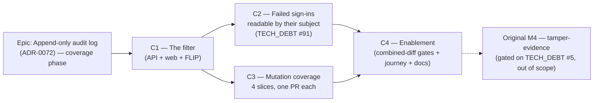

# Implementation Plan: Audit-log coverage

- **Feature spec:** [`./feature-spec.md`](./feature-spec.md)
- **ADR:** [`../../adr/0072-append-only-audit-log.md`](../../adr/0072-append-only-audit-log.md)
  (accepted) + a **new ADR-0073**, outlined in the spec §4 and written in Task C1.0
- **Status:** Draft — **awaiting approval; no application code is written until this is approved**
  (CLAUDE.md §21)
- **Owner:** _TBD_

> **Lineage.** This plan continues the ADR-0072 epic. It **supersedes** the original plan's
> **Task 4.3** (mutation events) and **Task 4.4** (filters + the `action` index); it **consumes**
> Task 4.1 (share links — shipped) and Task 4.2 (partitioning/retention — answered on measurement)
> as inputs; and it leaves the original **Milestone 4** (tamper-evidence, gated on TECH_DEBT #5)
> untouched. Milestones are lettered **C1–C4** so "M3" keeps meaning what it means in the original
> plan. Full mapping: spec §0.

## Breakdown

**The one hard ordering constraint:** C1's **flag flip** must merge before C3.1. The producers are
server-side and a `VITE_` constant cannot gate a server-side record, so the day the first mutation
producer lands, every reader's feed changes whether or not a flag is on (spec §4 "The reorder").
C2 is independent of C3 and may run in parallel with it once C1 has flipped.

### Epic

**Append-only audit log — coverage phase.** Make the shipped log _answer questions_: give the feed a
filter, make its most security-relevant row readable by the one person who can act on it, and extend
the catalogue to the mutations that leave no other durable record — under a written rule rather than
a list. Closes `docs/TECH_DEBT.md` **#91**. Roadmap theme: the security/governance strand of
`docs/BACKLOG.md`.

**Out of scope for the whole epic**, restated so it is not quietly absorbed: plan revision history
(a different feature — spec §2.5); a plan-scoped third read (spec §2.6); cross-plan dependency
events (declined for this rung, named as the first candidate for the next); auditing the audit read
(`AUDIT_READ` stays an admission); and the tamper-evidence escalation.

---

## Milestone C1 — The filter

**Outcome:** an Org Admin can narrow the feed to a named group of events in one interaction, from a
URL they can paste; the same control serves `/me`. `VITE_AUDIT_FILTERS` is **flipped default-on** at
the end of this milestone, which is what makes C3 safe to start.

**Flag:** `VITE_AUDIT_FILTERS`, `flagDefaultOff` at birth (restoring that helper's only consumer),
flipped in C1.5.

---

#### Feature: Filtering, end to end

> **Description:** an optional, validated query contract on both read endpoints; a category
> vocabulary shared by both screens; a keyboard-operable filter bar whose state lives in the URL;
> and no index until one is measured to be worth it.
> **Complexity:** **L**
> **Dependencies:** none — the M1/M3 store, reads and screens are all shipped.
> **Risks:**
>
> - _An index is added on instinct_ → **none is added in C1.** The spec records the prior
>   measurement (43 MB / 0.297 ms vs 0.939 ms typical, 28.4 ms worst case at 200 k) and C1.1 records
>   a fresh `EXPLAIN (ANALYZE, BUFFERS)` for the filtered read **without** an index at 1M rows. The
>   composite is C3's decision, per slice.
> - _A filter that can only ever return nothing is offered_ → `categoriesForSurface()` withholds
>   **Sign-ins** from the organisation screen, because an `auth.*` row carries no `organization_id`.
>   Offering it would be the M1 copy defect in a new costume, and a unit test asserts the org
>   surface's category list does not contain it.
> - _"No events match this filter" and "nothing recorded yet" collapse into one message_ → the list
>   takes **two** empty states and the screen chooses; a component test drives both.
> - _The category map drifts from the vocabulary_ → `Record<AuditAction, AuditCategory>`,
>   exhaustively keyed. A new action without a category is a compile error, the same discipline as
>   the redactor and the copy map.
>
> **Testing requirements:** unit (DTO validation, category map exhaustiveness, per-surface category
> lists, the filter bar's controlled behaviour); API/Supertest against real Postgres (each filter
> narrows correctly; unknown values 422; cursor + filter); component + a11y (keyboard operation,
> announced result count, both empty states); a **flag-off parity suite** for both screens.

##### Task C1.0 — ADR-0073, written before the code

- **Description:** the decision record the spec §4 outlines. Written **first** because C1's
  ordering, C2's scope and C3's catalogue all cite it, and an ADR written afterwards records what
  happened rather than what was decided.
- **Complexity:** **S**
- **Dependencies:** approval of this spec
- **Risks:** _it becomes a summary of the spec_ → it records the four **decisions** and the
  alternatives, and points at the spec for the detail. ADR-0072 is **not edited**; it gains a
  pointer line in its "Still outstanding" section in Task C4.3.
- **Testing:** `pnpm check:doc-links`.
- **Development steps:**
  1. Draft from the spec §4 outline; take the next free ADR number by `ls docs/adr | wc -l`, not
     from memory (ADR-0058).
  2. Record §0.1's two as-built divergences, so the correction has a home outside this spec.
  3. Cross-link from `CLAUDE.md` §16 and `docs/DECISIONS.md`.

##### Task C1.1 — The query contract (API)

- **Description:** `ListAuditEventsQueryDto extends PaginationQueryDto` adding `action` (repeatable,
  `@IsIn(AUDIT_ACTIONS)`, max 20), `outcome` (repeatable, max 3), `from`/`to` (ISO-8601,
  `from <= to`); threaded through `AuditReadService` into `AuditRepository.page`'s `where`. Both
  endpoints. **No index.**
- **Complexity:** **M**
- **Dependencies:** none
- **Risks:**
  - _An unknown action silently returns an empty page_ → **422** naming the value. A documented
    no-op is worse than an absent feature (the `PaginationQueryDto` docblock's own lesson,
    TECH_DEBT #19).
  - _The `IN` list is unbounded_ → capped at 20; a request cannot build an arbitrary predicate.
  - _The filter is applied after the query_ → it goes in the `where`, never a post-filter; an API
    test asserts the page size is honoured **with** a filter that excludes most rows.
- **Testing:** unit (DTO); API/Supertest (each parameter narrows; combinations; 422s; a filtered
  deep page); OpenAPI snapshot.
- **Development steps:**
  1. `dto/list-audit-events-query.dto.ts`, with `@Transform` normalising a single value to an array
     (the repeatable-param idiom).
  2. Thread into both controllers, `AuditReadService` and `AuditRepository` — the `where` is built
     in the repository, the permission check stays in the service.
  3. `docs/API.md` + the OpenAPI descriptions, **including** the sentence that `auth.*` can never
     appear on the organisation endpoint.
  4. Record `EXPLAIN (ANALYZE, BUFFERS)` for a single-action and a 5-action filtered read at 1M
     rows, **without** an index, in the PR body. This is the baseline C3 measures against.

##### Task C1.2 — Categories in `@repo/types` and the copy layer

- **Description:** `AUDIT_CATEGORIES: Record<AuditAction, AuditCategory>` plus the five category
  labels and `categoriesForSurface('organization' | 'self')`.
- **Complexity:** **S**
- **Dependencies:** C1.1
- **Risks:** _two category maps appear (one per screen)_ → one map, one function, both screens.
- **Testing:** unit — exhaustiveness (compile-time), every category has at least one action, the
  organisation surface excludes **Sign-ins**, and every action belongs to exactly one category.
- **Development steps:**
  1. The map lives in `@repo/types` beside `AUDIT_ACTIONS` so the API can use it later if a
     server-side category filter is ever wanted; the **API takes actions only** for now — one
     vocabulary on the wire.
  2. The web expands a chosen category into its action list before building the request.

##### Task C1.3 — `AuditFilterBar` + the two screens

- **Description:** the controlled filter component, wired to `useUrlFilterState`, on both screens
  behind `VITE_AUDIT_FILTERS`.
- **Complexity:** **M**
- **Dependencies:** C1.1, C1.2
- **Risks:**
  - _A new one-off control appears_ → `ToggleChip` for the independent category booleans,
    `SegmentedControl` for the mutually-exclusive outcome, `SearchField`'s clear-button pattern for
    "Clear filters". The semantic choice between chip and segmented control is the one
    `toggle-chip.tsx`'s docblock spells out; follow it.
  - _The component cannot be unit-tested outside the router_ → it is **controlled**; the screen owns
    `useUrlFilterState`. That is the hook's own documented rule.
  - _Filter state and pagination fight_ → the filter is part of the TanStack query key, so changing
    it starts a fresh infinite query. Structural, not a handler.
  - _"Load more" regresses_ → it is the ADR-0064 finding already fixed here (`aria-disabled`, never
    unmounted); the parity suite keeps it.
- **Testing:** component (each control updates the URL; a pasted URL reproduces the view; the two
  empty states); a11y (tab order includes every chip and the clear control — WCAG 2.1.1; the settled
  count is announced — 4.1.3); flag-off parity for both screens.
- **Development steps:**
  1. `features/audit/components/AuditFilterBar.tsx`.
  2. `AuditEventList` takes `emptyMessage` **and** `emptyFilteredMessage`; the screen picks.
  3. Both routes: `useUrlFilterState` with defaults omitted from the URL, `replace: true`.
  4. Copy: the org screen's persistent scope note stays; the filtered empty state names the filter.

##### Task C1.4 — Gates for C1

- **Description:** the specialist pass over C1's diff — not deferred to C4, because C1 flips a flag
  on its own.
- **Complexity:** **S**
- **Dependencies:** C1.1–C1.3
- **Testing:** every blocking finding is folded **with a regression test verified to fail against
  the pre-fix code first** (ADR-0064).
- **Development steps:** **api-reviewer** (query contract, 422s, OpenAPI) ·
  **backend-performance-reviewer** (the unindexed filtered plan; is the no-index decision honest at
  1M rows?) · **accessibility-reviewer** + **ux-reviewer** (the bar, the two empty states, the
  category names — do they read as questions a person asks?) · **component-reviewer** (primitive
  reuse, flag handling, the controlled/uncontrolled split).

##### Task C1.5 — The flip

- **Description:** `VITE_AUDIT_FILTERS` → `flagDefaultOn` with the dated docblock the file's
  convention requires.
- **Complexity:** **S**
- **Dependencies:** C1.4 green; the `e2e-audit` journey extended with a filter assertion (C4.2's
  first half may land here instead — it is cheap and it gates the flip).
- **Risks:** _the parity suites are weakened once the flag is on_ → they are **kept**; that is the
  rollback contract (ADR-0053 M6).
- **Development steps:** flip; run `scripts/e2e-local.sh web:audit` **locally** before pushing;
  changeset (`web`, minor).

---

## Milestone C2 — A failed sign-in is readable by its subject

**Outcome:** a member sees failed sign-in attempts against their own account on **My activity**, and
nobody else sees them anywhere. Closes `docs/TECH_DEBT.md` #91.

**Flag:** `VITE_AUDIT_SELF_SECURITY`, `flagDefaultOff`, flipped in C2.5. The **server** half is
unflagged (it cannot be) and its parity is structural: absent `include=attempts` ⇒ byte-identical
response.

---

#### Feature: Write-time attribution and an opt-in projection

> **Description:** resolve the attempted address to a user id at write time into the existing
> `subject_id` column; widen `/me` by an opt-in projection; show it honestly.
> **Complexity:** **M**
> **Dependencies:** C1 (for the filter that makes a flooded feed survivable). Not dependent on C3.
> **Risks:**
>
> - _The lookup becomes an account-existence oracle_ → the sign-in **response** is unchanged; the
>   same work happens on both branches; only the subject themselves can read the result. C2.1
>   verifies empirically that neither branch short-circuits.
> - _A read-time email join creeps in later "to fix the old rows"_ → it cannot fix them (the
>   trigger refuses `UPDATE`) and it would rewrite history as addresses change. Named in the ADR,
>   the code comment and the debt closure.
> - _An unauthenticated party floods a member's feed_ → accepted, with Better Auth's rate limiter as
>   the bound (**verified in C2.1, not assumed**) and C1's filter as the remedy. No coalescing: the
>   repetition is the signal.
> - _The `/me` screen shows anonymous rows with no explanation_ → the actor column appears when
>   attempts are included, and the copy says what a "Not signed in" row means.
> - _The widened read regresses the keyset plan_ → C2.2 measures the `OR` at 1M rows; the documented
>   escalation is two keyset queries merged in the repository, **not** a wider index.
>
> **Testing requirements:** unit (the email normaliser agrees with Better Auth's own — the shared
> `client-ip.ts` precedent of "two implementations of one rule is drift that stays invisible");
> API/Supertest against real Postgres (attributed vs unattributed; the org feed never returns one;
> `include` absent ⇒ identical bytes); e2e (a real failed sign-in, then a real read).

##### Task C2.1 — Spike: what does the sign-in failure path actually give us? (**no production code**)

- **Description:** three questions answered empirically before anything is written — the M1 Task 1.7
  discipline, which is the only reason two of the five auth events exist at all.
- **Complexity:** **S**
- **Dependencies:** none
- **Risks:** _the seam does not supply the body on a failure_ → then attribution must come from
  elsewhere and the design changes **before** it is written down. (`auth-audit.ts` already reads
  `facts.body`, so the expected answer is yes — verify it, do not trust this sentence.)
- **Testing:** a throwaway spec against the real handler.
- **Development steps:**
  1. Confirm the after-hook's `body.email` is present on a failed `/sign-in/email`, and what it
     looks like for a malformed body.
  2. Read `better-auth@1.6.25`'s own email normalisation (case, trimming) **from its source**, and
     record it. Our lookup must agree with it or the match silently fails for `Jane@…`.
  3. **Verify whether Better Auth's rate limiter is enabled in this app's configuration**, with what
     window and what store. Record the answer in the ADR either way — if it is off, C2.4 adds one
     and the flooding paragraph changes from "bounded" to "bounded by what we added".
  4. Record all three findings in ADR-0073, including anything the seam does not supply.

##### Task C2.2 — Attribution at write time

- **Description:** in the auth adapter, when `subjectLabel` is present on an `auth.sign_in_failed`
  row, resolve it to a user id and fill `subjectId`. One indexed lookup, on both branches, inside
  the existing fail-open guard.
- **Complexity:** **S**
- **Dependencies:** C2.1
- **Risks:** _the lookup throws and blocks a sign-in_ → it is inside `recordBestEffort`'s
  fail-open boundary, with the reason in the comment (a future reader who finds only the behaviour
  will "fix" it into the fail-closed shape its siblings use).
- **Testing:** API/Supertest — a failed sign-in for a known address writes a row with
  `subject_id` set and `actor_user_id` still `NULL` (the `ck_audit_events_actor_shape` CHECK is
  satisfied — verified in the migration, not assumed); an unknown address writes `subject_id NULL`;
  a thrown lookup leaves the 401 unchanged and logs at `error`.
- **Development steps:**
  1. A narrow read port (`findUserIdByEmail`) — not the whole users service — passed in as an
     option, mirroring how `recordAuthEvent` is threaded so `createAuth` stays a pure function of
     its options.
  2. Normalise exactly as C2.1 recorded; one shared helper, one unit test asserting agreement.
  3. Comment the **forward-only** consequence at the call site: rows written before this cannot be
     attributed, because the table refuses `UPDATE` by design.

##### Task C2.3 — The widened read, measured

- **Description:** `include=attempts` on `/me`; `listForSelf`'s `where` becomes
  `actorUserId = me OR (subjectId = me AND actorUserId = null)` **only when asked**.
- **Complexity:** **M**
- **Dependencies:** C2.2
- **Risks:** _the index is added before the plan is read_ → measure first; the candidate is the
  narrow partial `WHERE actor_user_id IS NULL AND subject_id IS NOT NULL`, and it lands **only** if
  the measurement warrants, with the number in the migration comment (ADR-0053 M4 / ADR-0065).
- **Testing:** API — with `include` absent the response is byte-identical to the pre-change one
  (assert against a recorded fixture, not by eye); with it present the attempt appears; another
  user's attempts never do; the org endpoint never returns one whatever the filter.
- **Development steps:**
  1. DTO `include` (repeatable enum, one member), OpenAPI description saying what it adds.
  2. Repository `where`, keeping the same keyset ordering.
  3. `EXPLAIN (ANALYZE, BUFFERS)` at 1M rows with a realistic count of attributed rows, both with
     and without the candidate index; record both in the PR and the migration comment if it lands.

##### Task C2.4 — The `/me` surface

- **Description:** behind `VITE_AUDIT_SELF_SECURITY`: send `include=attempts`, show the actor column
  (so an anonymous row reads **Not signed in** rather than looking like the reader's own action),
  and update the copy.
- **Complexity:** **S**
- **Dependencies:** C2.3
- **Risks:** _the screen implies these attempts are unique to this account_ → the copy says what the
  row means and what it does not prove ("someone tried to sign in with your email address; this does
  not mean they succeeded, and it does not identify them").
- **Testing:** component (an anonymous row renders with the actor column and the right sentence);
  a11y; flag-off parity for `/me`.

##### Task C2.5 — Gates and the flip

- **Complexity:** **S**
- **Dependencies:** C2.1–C2.4
- **Development steps:** **security-reviewer** (this task exists for it: the unauthenticated
  lookup, the oracle argument, the flood, the widened read, the fail-open boundary) ·
  **accessibility-reviewer** + **ux-reviewer** (the wording — this screen tells someone they may be
  under attack) · fold blocking findings with failing-first regression tests · flip
  `VITE_AUDIT_SELF_SECURITY`, keep the parity suite · close `docs/TECH_DEBT.md` #91 and add its
  number to the **Closed numbers** ledger.

---

## Milestone C3 — Mutation coverage

**Outcome:** the acts that leave no other durable record — deletions, structural changes, the rules
other people's work is judged by, and imports — appear in the log, under the rule in spec §2.1.
Supersedes the original **Task 4.3**.

**Gate:** C1.5 (the flag flip) **must** have merged. Stated as a dependency on C3.1, not as an
intention.

**No web flag.** C3's only client change is 19 entries in exhaustive maps; the rows render through
the existing list either way. That is the second reason C1 goes first.

---

#### Feature: The catalogue, four slices

> **Description:** 19 new actions across four PR-sized slices, each self-contained: vocabulary +
> allow-list + producer(s) + census move + copy + tests + docs.
> **Complexity:** **XL** overall; each slice **M**.
> **Dependencies:** C1.5 merged.
> **Risks:**
>
> - _Auditing the recalculation_ → **forbidden by ADR-0072**; census gate 4 fails if anyone adds a
>   call under `modules/schedule/**`. Re-verified per slice.
> - _A bulk operation emits one row per affected row_ → **one event per user action** with counts
>   and the batch id, exactly as family C does. An API test deletes a 41-descendant subtree and
>   asserts **exactly one** row.
> - _Counts arrive as a nested object and become `[object]`_ → the redactor's `normalise` reduces
>   any non-scalar to a type marker **by design** (it vets the top-level key and cannot vouch for a
>   sub-tree). All counts are **flattened scalars**. This is also the §0.1 fix for family C.
> - _The `before` is read outside the lock_ → the ADR-0063 `dissolve` defect and M1's most-likely
>   bug, now repeated across ~14 services. Every producer takes its `before` from the
>   **in-transaction, post-lock** read. A review checklist item and a concurrent-write API test.
> - _Volume exceeds the estimate_ → **C3.0 measures it before any producer ships**; if the measured
>   rate is more than 5× spec §2.4's estimate, the catalogue narrows before the next slice.
> - _A `DENIED` row creeps in for a refused content edit_ → §2.3 forbids it; a 423 is an everyday
>   concurrency outcome. An API test asserts a pen-refused delete writes **no** row.
> - _The screens keep saying "not recorded yet"_ → copy is updated **in the same PR** as each slice,
>   never after. The M1 lesson, which cost a reader their first impression.
>
> **Testing requirements:** per slice — unit (allow-list, copy, the governance-field diff);
> API/Supertest against real Postgres per action (the **execution** proof the census structurally
> cannot give); census set-equality plus the new positive assertion; a re-measured filtered read.

##### Task C3.0 — Measure the row rate before writing a producer

- **Description:** enable the family D–G producers on a branch, drive the ADR-0066 seed catalogue
  and the existing flag-on journeys, and **count rows per plan** by action.
- **Complexity:** **M**
- **Dependencies:** C1.5
- **Risks:** _the estimate is taken as fact because it is in a spec_ → this task exists because
  ADR-0072 says the estimate, not the index plan, gates the rung. Publish the table, including any
  action whose rate surprises.
- **Testing:** it **is** a measurement; its output is a table in the PR and in ADR-0073.
- **Development steps:**
  1. Seed the catalogue (`schedulepoint-seed`), run the journeys, `GROUP BY action` over the result.
  2. Compare against spec §2.4's per-class estimate; state the ratio.
  3. If any single action dominates, decide **then** whether it stays — narrowing before shipping is
     cheap and unshipping is not (the append-only table cannot be cleaned).

##### Task C3.1 — Slice 1: plan structure and destruction (family D)

- **Description:** `activity.deleted`, `activity.restored`, `activity.dissolved`,
  `activity.reparented`, `dependency.created`, `dependency.deleted`. Includes the §0.1 fix:
  **flattened cascade counts** for the existing family-C actions, in the same PR, because it is the
  same shape.
- **Complexity:** **M**
- **Dependencies:** C3.0, **C1.5 merged**
- **Risks:**
  - _The call goes into `HierarchyLifecycleService`_ → it is shared by five callers and knows
    neither the org slug nor which entity the **user** acted on. The call belongs in the caller,
    which already has all three; census gate 2 pins it there.
  - _`cascadeSoftDelete`'s counts are captured after the transaction_ → it returns them **inside**
    the transaction; the audit call takes that return value, so the numbers are the ones that
    actually happened.
  - _Undo of a delete produces no restore row_ → **known and recorded** (spec §2.5): ADR-0048's
    undo re-creates rather than restores. This PR adds the `docs/TECH_DEBT.md` row pointing at
    ADR-0048 M4, and does **not** paper over it by auditing creates.
- **Testing:** API — one row per delete with the batch id and flattened counts; a 41-descendant
  subtree writes exactly one; a pen-refused (423) delete writes none; a rolled-back delete writes
  none; `dependency.created` records the **direction** (predecessor → successor), which is the fact
  ADR-0064 found users most often get wrong.
- **Development steps:**
  1. `@repo/types`: six actions. Allow-lists: six entries (compile error if missed).
  2. Producers in `ActivitiesService` (`remove`, `restore`, `dissolveSummary`, the parents PATCH)
     and `DependenciesService` (`create`, `remove`) — each inside the existing `$transaction`,
     after `assertHoldsPen`.
  3. `@RequestContext()` on those controller handlers.
  4. Census: six routes move from `UNAUDITED_ROUTES` to `AUDITED_ROUTES`; add the **new positive
     assertion** "audits every destructive act inside a plan"; rename `CONTENT_EDIT` to the two
     reasons in spec §2.1 across the remaining entries.
  5. Copy: six `TITLES` + `detailFor` branches; **update both screens' "not recorded yet"
     sentences** to describe what is now recorded.
  6. Re-measure the filtered org read; add `idx_audit_events_org_action_occurred` **only** if it
     wins, with the number in the migration comment.

##### Task C3.2 — Slice 2: the rules other work is judged by (family E)

- **Description:** `plan.settings_changed` (field-selective over the governance set),
  `calendar.working_time_changed`, `baseline.captured` / `.activated` / `.deleted`.
- **Complexity:** **M**
- **Dependencies:** C3.1
- **Risks:**
  - _A rename writes a governance row_ → the producer diffs **values** over a `const` field set;
    a PATCH that changes only `name`/`description` writes nothing. A unit test drives both.
  - _The governance set drifts from the DTO_ → one exported `const`, read by the producer, the
    OpenAPI description and the test. A test asserts every member exists on `UpdatePlanDto`.
  - _Shift rows land in the payload_ → they are not scalar; the payload records **which kind** of
    working time changed, not its contents.
- **Testing:** API — a name-only PATCH writes nothing; a `plannedStart` move writes one row with
  that field only; a calendar shift edit and a scope change in one request write **two** rows
  sharing a `correlation_id`.

##### Task C3.3 — Slice 3: library governance (family F)

- **Description:** `calendar.deleted` / `.archived` / `.unarchived` / `.scope_changed`,
  `resource.deleted` / `.archived` / `.unarchived`.
- **Complexity:** **M**
- **Dependencies:** C3.2
- **Risks:** _a `GROUP` delete emits one row per descendant_ → one row, `resourceCount` for the
  whole subtree, one `deleteBatchId` (ADR-0053 M3); the batched `unnest` lock statement is
  untouched.
- **Testing:** API — archive/unarchive pairs; a scope narrowing that is **blocked** (409) writes no
  row; a `GROUP` delete over a 2,000-row subtree writes exactly one row and does not regress the
  measured ~13 ms.

##### Task C3.4 — Slice 4: provenance (family G)

- **Description:** `interchange.imported` at the commit, inside the commit transaction.
- **Complexity:** **S**
- **Dependencies:** C3.3
- **Risks:**
  - _The row is written in phase 3_ → phase 3 (lane packing, ADR-0069) is **best-effort and outside**
    the transaction; the audit row goes with phases 1–2, so a rolled-back import records nothing
    and a badly-arranged one still records the import.
  - _`sourceFileName` is user-supplied_ → allow-listed and capped like every other string; the
    dry-run records nothing.
- **Testing:** API — a 500-activity import writes **one** row with counts; a failed commit writes
  none; a dry-run writes none.

---

## Milestone C4 — Enablement

**Outcome:** the deferred specialist gates run over the **combined** diff, the journey proves the
whole thing against a real API, and the documents match the code.

This milestone exists because five of the last six enablement passes found defects that had already
passed a human read (ADR-0063 M6: four; ADR-0064 §7: five; ADR-0067 M4: ten). This epic touches
authentication, a read surface carrying other people's actions, and ~14 write paths.

---

##### Task C4.1 — Specialist reviews over the combined diff

- **Complexity:** **M**
- **Dependencies:** C1–C3
- **Risks:** _findings are recorded but deferred_ → a blocking finding blocks; a non-blocking one
  becomes a numbered `docs/TECH_DEBT.md` row named in the PR.
- **Development steps:**
  1. **security-reviewer** — the unauthenticated lookup, the widened read, every new payload
     (activity/calendar/plan names, `sourceFileName`), and whether any new allow-list entry could
     carry a secret. Not optional: this feature **is** a security control.
  2. **api-reviewer** — the query contracts, 422s, envelopes, OpenAPI.
  3. **backend-performance-reviewer** — the insert now on ~14 more transactions (measured 1.19 ms,
     0.70 ms of it the FK trigger); both index decisions; the filtered plan at 1M rows.
  4. **accessibility-reviewer**, **ux-reviewer** — the filter bar, the two empty states, the
     "someone tried to sign in" wording, the category names.
  5. **component-reviewer** — primitive reuse, the four exhaustive maps, flag handling.
  6. Fold every blocking finding **with a regression test verified to fail against the pre-fix code
     first**.

##### Task C4.2 — Extend `apps/web/e2e-audit/`

- **Description:** the existing flag-on journey grows three assertions. No new suite, no new CI
  step.
- **Complexity:** **M**
- **Risks:** _a unit suite is treated as sufficient_ → only a journey can prove a real failed
  sign-in reaches the right person's screen, that a filter chip's accessible name is what the test
  assumed, and that the optimistic-`version` path behaves — a mocked fetch accepts any version.
- **Testing:** it is the test. Run `scripts/e2e-local.sh web:audit` **locally before pushing** —
  omitting the local run cost the ADR-0063 journey five CI rounds.
- **Development steps:**
  1. Sign in with a **wrong** password, then correctly; open **My activity**; assert the
     `Sign-in failed` row appears with **Not signed in** as the actor — and that a second user's
     `/me` does not show it.
  2. Delete an activity with the pen held; assert one row on the org log with the right sentence.
  3. Apply the **Deletions** filter; assert the feed narrows, the URL carries it, a reload
     reproduces it, and the **Sign-ins** category is **not offered** on the organisation screen.

##### Task C4.3 — Documentation, debt, changeset

- **Complexity:** **S**
- **Dependencies:** C4.1, C4.2
- **Testing:** `pnpm check:doc-links`.
- **Development steps:**
  1. `docs/SECURITY_STANDARDS.md` — what the log now covers **and what it deliberately does not**
     (an ordinary content edit is not an audit event; plan revision history is a different feature).
     The honest-limit sentence about the trigger is untouched.
  2. `docs/API.md` + OpenAPI — final state of both query contracts.
  3. `docs/TESTING.md` — the census's new positive assertion and the two renamed reasons.
  4. `docs/DATABASE.md` — only if an index landed, with its measurement.
  5. `docs/TECH_DEBT.md` — close **#91** (and add it to **Closed numbers**); add the ADR-0048
     undo-of-delete row; add anything C4.1 found and did not fix.
  6. `docs/BACKLOG.md` — "plan revision history", with the reasoning from spec §2.5 so it is not
     re-litigated as audit coverage.
  7. ADR-0072 — a pointer line in "Still outstanding" saying where these three items were resolved.
     **ADR-0073** — fold in C2.1's spike findings and C3.0's measured row rate, including anything
     that did not match the estimate (ADR-0064's discipline: record what was measured **and** what
     could not be reproduced).
  8. `CLAUDE.md` §16 — ADR-0073.
  9. Changesets: `api` minor (additive query params, new recorded events), `web` minor (two
     surfaces).

---

## Sequencing & slices

1. **C1.0** (ADR) → **C1.1** (query contract, dark to the user) → **C1.2** (categories) →
   **C1.3** (the bar, flag off) → **C1.4** (gates) → **C1.5** (**flip**).
2. **C3.0** (measure) may start as soon as C1.5 merges. **C2** may run in parallel with C3 — it
   touches the auth adapter and `/me` only, and shares no file with the producers.
3. **C3.1 → C3.2 → C3.3 → C3.4**, one PR each, in that order: slice 1 establishes the flattened-count
   shape and the census's new positive assertion that the later slices reuse.
4. **C4** last.

Every task leaves `main` releasable: the query params are optional and absent-⇒-identical; each
producer only adds rows; the screens are behind default-off flags pinned by parity suites; the
census fails loudly rather than silently.

The genuinely uncertain tasks are **C2.1** (what the auth seam and the rate limiter actually
provide) and **C3.0** (the row rate). Both are placed **before** the work that depends on them, so a
surprise costs a re-plan of one slice rather than of the milestone — the M1 Task 1.7 placement,
which is the reason two of the five auth events exist.

## Definition of Done (per task)

Each task's PR must satisfy the Feature Completion Criteria in
[`docs/PROCESS.md`](../../PROCESS.md). Specifically for this epic:

- **The pre-push gate is run, not assumed** (CLAUDE.md §19.7): `pnpm lint && pnpm typecheck && pnpm
test`, **plus `scripts/e2e-local.sh api`** for every C1.1/C2/C3 task — all touch `apps/api`, and
  the atomicity, fail-open and one-row-per-action proofs exist only at that level — **plus
  `scripts/e2e-local.sh web:audit`** for C1.3, C1.5, C2.4 and C4.2.
- **`pnpm --filter @repo/api prisma:check-drift` is run and its clean result stated** in any PR that
  adds an index.
- **No index lands without a recorded `EXPLAIN (ANALYZE, BUFFERS)`** in the migration comment and
  the PR body (ADR-0053 M4, ADR-0065).
- **Every regression test is verified to fail against the pre-fix code first** (ADR-0064).
- **The census's four gates plus the new positive assertion are green**, and gate 4 (no
  `audit.record(` under `modules/schedule/**`) is re-checked in every C3 slice.
- **A security review** on C2.2/C2.3 (the unauthenticated lookup and the widened read) at the time,
  **not** deferred to C4 — C4 reviews the combined diff, which is a different job.

## Risks & assumptions (rollup)

| Risk / assumption                                                                                   | Likelihood | Impact   | Mitigation                                                                                                                                                                                     |
| --------------------------------------------------------------------------------------------------- | ---------- | -------- | ---------------------------------------------------------------------------------------------------------------------------------------------------------------------------------------------- |
| A mutation producer merges while the filter is still flag-off, burying the permission changes       | **med**    | **high** | C1.5 is a **hard dependency** of C3.1, stated in the task and the DoD. The producers cannot be flagged, so this is the only control there is.                                                  |
| The `before` is captured outside the lock (the ADR-0063 `dissolve` defect), now across ~14 services | **high**   | med      | Named per slice; a review checklist item; an API test with a concurrent write.                                                                                                                 |
| Counts arrive nested and silently become `[object]`                                                 | **med**    | med      | Flattened scalars by design; a unit test asserts each count is a number in the stored row. This is also the §0.1 fix for family C, which shipped without counts at all.                        |
| The measured row rate exceeds the estimate                                                          | **med**    | med      | **C3.0 measures before any producer ships.** >5× ⇒ the catalogue narrows. Narrowing before shipping is cheap; an append-only table cannot be cleaned afterwards.                               |
| The failed-sign-in lookup is read as an existence oracle                                            | low        | **high** | Same work on both branches, response unchanged, result readable only by the subject; verified in C2.1 and reviewed by security-reviewer in C2.5 **and** C4.1.                                  |
| An unauthenticated party floods a member's `/me` feed                                               | **med**    | low      | Accepted deliberately (repetition is the signal). Bounded by Better Auth's rate limiter — **verified in C2.1**; if absent, C2 adds one. C1's filter is the remedy.                             |
| Pre-C2 failed sign-ins can never be attributed                                                      | **high**   | low      | Inherent: the trigger refuses `UPDATE`. Forward-only, with the discontinuity stated in the ADR and at the call site.                                                                           |
| Undo-of-delete leaves a deletion with no matching restore                                           | **high**   | med      | Recorded as a TECH_DEBT row in C3.1 pointing at ADR-0048 M4's id-stable restore, **not** patched by auditing creates. Screen copy stays accurate meanwhile.                                    |
| The composite `action` index is added because it was in an old plan                                 | low        | low      | Added only if a fresh measurement at 1M rows shows it winning, per slice; C1.1 records the no-index baseline so the comparison is real. An `= ANY` over a composite may not preserve ordering. |
| The vocabulary nearly doubles and one of the four exhaustive maps is missed                         | low        | low      | Each is `Record<AuditAction, …>` — a missing entry is a **compile error**, not a runtime gap. That is why they are shaped that way.                                                            |
| **Assumption:** `ck_audit_events_actor_shape` permits `subject_id` on an ANONYMOUS row              | high       | **high** | **Verified in the migration** (`20260803170000_audit_events`): the CHECK constrains `actor_user_id` by `actor_type` and nothing else. If it had not, C2 would need a schema change.            |
| **Assumption:** Better Auth's after-hook supplies the request body on a failed sign-in              | high       | med      | `auth-audit.ts` already reads it — but **C2.1 verifies** rather than trusting the current code's shape for the normalisation question, which is the part it does not answer.                   |
| **Assumption:** no producer added here sits on the recalc path                                      | high       | **high** | Structural: the engine imports no Prisma client, and census gate 4 fails on any call under `modules/schedule/**`. Re-checked per slice.                                                        |
