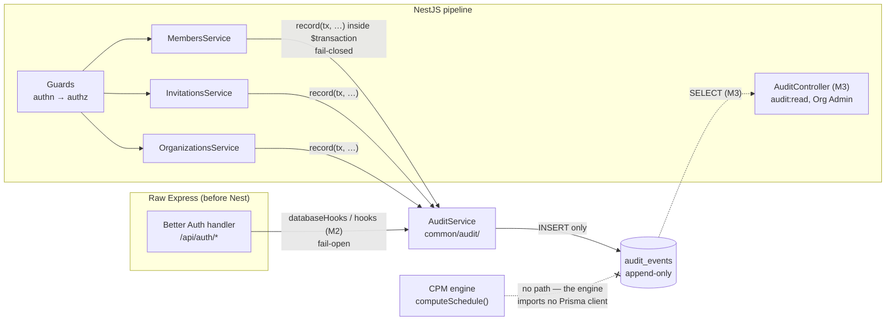
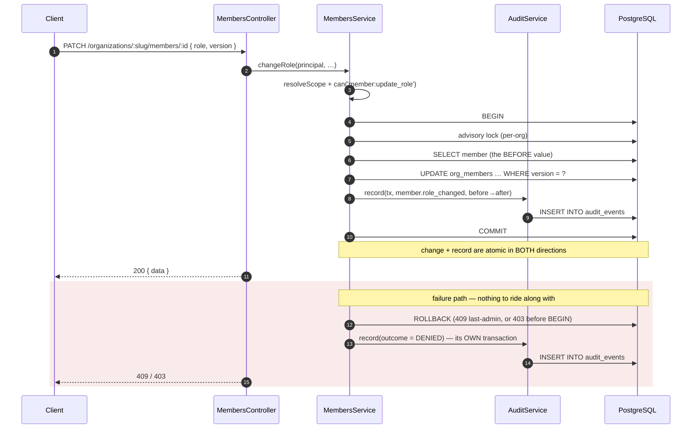
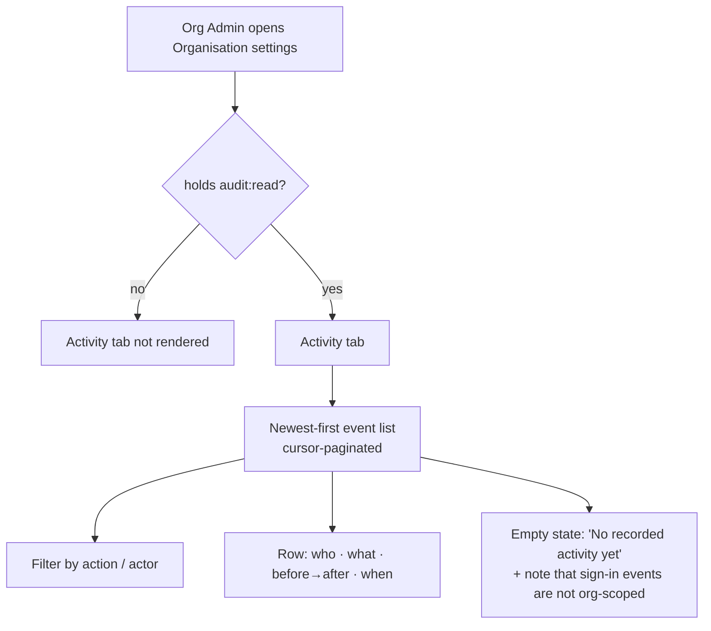
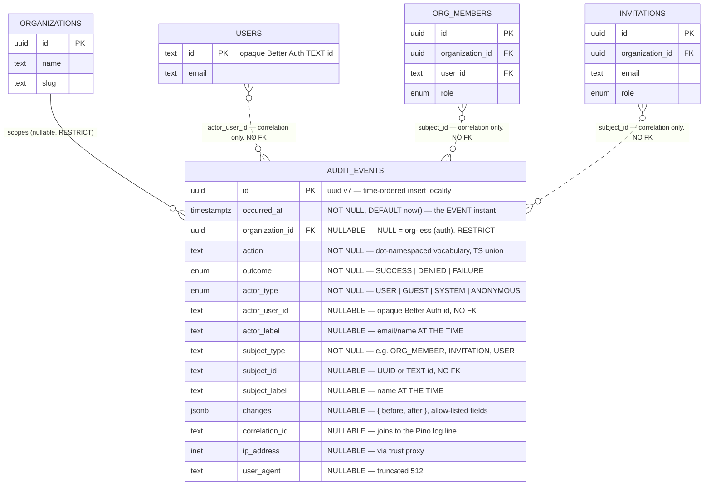

# Feature Spec: Append-only audit log

- **Status:** Draft (awaiting approval)
- **Author(s):** database-architect (Claude Code)
- **Date:** 2026-08-03
- **Tracking issue / epic:** _TBD_
- **Roadmap link:** `docs/BACKLOG.md` — "`M` **Append-only audit log** (TECH_DEBT #14)"
- **Related ADR(s):** **proposes a new ADR** (see §4 "Implementation approach"; the next
  free number is **0072** — 0071 is claimed by the unfiled draft at
  `docs/specs/assignment-lag/adr-0071-draft-per-assignment-lag.md`). Builds on ADR-0003
  (Better Auth), ADR-0012 (RBAC + resource scoping), ADR-0016 (tenancy/roles), ADR-0018
  (self-migrating image), ADR-0022 (engine-owned batched writes), ADR-0034 (recalc parity
  gate), ADR-0046 (polymorphic notes — the precedent this design **deliberately declines**,
  §4), ADR-0051 (`GuestPrincipal`), ADR-0058 (verify the claim).

> **Scope note.** `docs/TECH_DEBT.md` #14 bundles four sub-items. Only two are audit-log
> work and only they are in scope here:
>
> | Sub-item                                                | In scope? | Where it belongs                                                                                                                                                                                                                       |
> | ------------------------------------------------------- | --------- | -------------------------------------------------------------------------------------------------------------------------------------------------------------------------------------------------------------------------------------- |
> | **(a)** authentication events (sign-up / in / out)      | **Yes**   | this spec, Milestone 2                                                                                                                                                                                                                 |
> | **(a2)** membership role changes/removals + invitations | **Yes**   | this spec, Milestone 1                                                                                                                                                                                                                 |
> | **(b)** Better Auth's in-process rate-limit store       | **No**    | a Redis-backed store (ADR-0010), together with its sibling **TECH_DEBT #49** (Nest's `ThrottlerModule` storage). A scaling concern, not a record-keeping one — no audit row makes a per-replica bucket shared.                         |
> | **(c)** unencrypted `accounts` OAuth token columns      | **No**    | field-level encryption on the `accounts` table, owed **before** a social provider is enabled (only email+password is configured today, `better-auth.ts`). A key-custody and column-encryption change with no overlap with this design. |
>
> Both out-of-scope items should be split into their own TECH_DEBT rows when #14 is
> updated, so #14 can be closed by this work rather than left half-open forever.

---

## 1. Business understanding

### Problem

`docs/SECURITY_STANDARDS.md` commits the product to an "**append-only audit log** for
security- and sensitive events (authentication events, permission changes, sensitive
mutations, deletions/exports): who, what, when, and before→after where relevant" whose
"entries are **never mutated or deleted**". That section is titled _"not yet implemented"_
and has been since it was written; the gap was raised independently in the A1 and C1
security reviews and is `docs/TECH_DEBT.md` #14.

What exists instead, verified in the code rather than taken from the docs:

- **Row attribution.** Every domain table carries `created_by` / `updated_by` (opaque
  Better Auth TEXT ids) and `created_at` / `updated_at`. This records the **last** writer
  and nothing before them: a member promoted to Org Admin and demoted an hour later leaves
  a row identical to one that never changed, and `updated_by` names whoever touched it
  last, not who did the promoting.
- **Soft delete + `delete_batch_id`.** Deletions are recoverable and correlated, so the
  _rows_ survive — but the **act** of deleting leaves no record beyond `deleted_at`, and a
  restore erases even that.
- **Structured logs.** `MembersService.changeRole` emits
  `logger.info({ organizationId, memberId, role, userId }, 'member role changed')`
  (`members.service.ts:88`) and `InvitationsService` emits siblings. These are the closest
  thing to an audit trail today and they are **not one**: they carry the _new_ role and not
  the old one, they go to stdout, and stdout is rotated, mutable at the sink, and shipped
  nowhere by the running Docker Compose stack.
- **Authentication: nothing at all.** A sign-in, a failed sign-in, a sign-out and an email
  verification leave **no row anywhere**. `sessions` holds live sessions only and Better
  Auth deletes the row on sign-out. This is the largest hole: for every other event class
  there is at least a mutated row to reason from; for authentication there is nothing.

Two facts make this urgent rather than theoretical. First, **the product is in use** —
CLAUDE.md §17 records that the product owner runs the Compose stack with the ADR-0047
Watchtower profile enabled, so anything shipped default-on is live, and the questions an
audit log answers ("who removed that member?", "was that sign-in from an address we
recognise?") are now askable about real data. Second, the product is **multi-tenant with a
privileged role**: an Org Admin can change any member's role, remove any member, and invite
anyone. ADR-0012's RBAC decides whether an action is _allowed_; nothing records that it
_happened_.

### Users

| Role                               | Need                                                                                                                                             |
| ---------------------------------- | ------------------------------------------------------------------------------------------------------------------------------------------------ |
| **Org Admin**                      | Answer "who changed this, and when?" about their own organisation — role changes, removals, invitations. The only role that should read the log. |
| **Operator / on-call**             | Correlate a support report or a suspected compromise with a durable record, joined to the application logs by correlation id.                    |
| **Planner / Contributor / Viewer** | **No** need and **no** access. The log contains other members' actions and their IP addresses.                                                   |
| **External Guest**                 | None. A guest neither reads nor writes the audit log (ADR-0051).                                                                                 |

### Primary use cases

1. An Org Admin discovers a member's role is wrong and needs to know who changed it, from
   what, to what, and when.
2. A member says they were removed from an organisation; an Org Admin needs to confirm who
   removed them and when the invitation/membership history ran.
3. An operator investigating a suspicious report needs the authentication history for an
   account — successful and failed sign-ins, with source address and user agent.
4. An operator holding a `correlationId` from an application log line needs the durable
   record of what that request actually changed (and conversely: given an audit row, find
   the request's log lines).

### User journeys

**Happy path (Milestone 1, no UI).** An Org Admin changes a member's role. The role change
and its audit event commit in the **same** database transaction, so the record and the
change cannot disagree. The Org Admin sees no difference — this milestone is a
record-keeping change with no user-visible surface.

**Happy path (Milestone 3).** An Org Admin opens **Organisation settings → Activity**, sees
a newest-first, cursor-paginated list of the organisation's audit events, filters by action
or actor, and reads a row: _"Jane Planner changed Sam Contributor's role from Contributor to
Planner — 2 August 2026, 14:07."_

**Alternate — the read comes later, deliberately.** Between M1 and M3 the log is
**write-only**: it accumulates, nothing in the product reads it, and an operator retrieves
it with `psql`. §4 argues that this is a legitimate first rung and not an unfinished one.

### Expected outcomes

- The security standard the product already publishes becomes true rather than aspirational,
  and `docs/SECURITY_STANDARDS.md` loses its "_not yet implemented_" heading.
- Permission changes and authentication events acquire a durable, before→after record that
  survives log rotation and is refused by the database itself when something tries to edit
  or delete it.
- TECH_DEBT #14(a) and #14(a2) close; (b) and (c) split out as their own rows.

### Success criteria

- **Correctness:** every M1 event class writes exactly one row per occurrence, inside the
  transaction that made the change, proved by API-level (Supertest, real Postgres) tests.
- **Append-only, demonstrated:** an API-level test issues a direct `UPDATE`, `DELETE` and
  `TRUNCATE` against `audit_events` **as the application's own database role** and asserts
  all three are refused by the database.
- **No coverage regression by omission:** a structural test enumerates the event catalogue
  and fails if a service that must emit an event does not.
- **No engine impact:** the ADR-0034 recalc golden/conformance suites pass byte-identically
  (structurally guaranteed — §4 "The engine argument").
- **Performance:** the audit insert adds < 1 ms to the transactions it joins; a 50-row
  org-scoped page reads in < 5 ms at 200,000 events (**measured: 0.27 ms** — §4).

### Open questions

Every question below carries a stated default so work is not blocked. **Two are CRITICAL**
(the answer changes the design or the scope):

- **CQ-1 (CRITICAL) — Is a write-only M1 acceptable?** The design ships the store and the
  membership/invitation producers with **no read endpoint and no UI**, deferring reads to
  M3. _Default:_ **yes** — see §4 "Why write-only is a legitimate first rung". If the
  product owner wants a read on day one, M3 moves forward and M1 grows by roughly one
  controller, one DTO and a permission code; nothing in the store changes.
- **CQ-2 (CRITICAL) — Is "append-only enforced by a database trigger the application role
  can itself disable" the right honesty bar?** §4 measures three options and recommends the
  trigger, while stating plainly that it stops accident and ordinary application code and
  is **not** tamper-proof against a compromised application role. _Default:_ **ship the
  trigger and write the limitation into `docs/SECURITY_STANDARDS.md`** rather than claiming
  immutability. The stronger control (a restricted DB role, or an off-box sink) is a
  documented later rung gated on the deployment-target decision (TECH_DEBT #5).
- **CQ-3 — Should share-link create/revoke join M1?** They are two events, need no new
  machinery, and are the highest-value non-auth security events in the system (authorising
  data egress **outside** the tenant boundary — the whole reason ADR-0051 made `plan:share`
  Planner+Org-Admin). _Default:_ **yes, include them in M1** as a marked addition beyond
  #14's letter. Striking them costs one paragraph.
- **CQ-4 — Should a failed sign-in record the attempted email address?** It is the datum
  that makes credential-stuffing visible, and the audit log is internal (Org-Admin read at
  M3, and never for org-less auth rows). _Default:_ **yes, record the attempted address**;
  never the attempted password, and never a token.
- **CQ-5 — Retention.** The design ships **no retention and no purge** in v1 (measured
  volumes do not need one, §4). _Default:_ **none**; revisit when mutation events land or
  the table passes 5 GB, whichever first.
- **CQ-6 — Milestone order.** M1 is membership/invitation (in-transaction, service-level)
  and M2 is authentication (a Better Auth hook, a different seam and a different failure
  policy), even though #14 names auth first. _Default:_ **as ordered** — M1 exercises the
  harder transactional semantics against the simpler producer. The store is
  producer-agnostic, so swapping the two costs nothing but the order of two PRs.

---

## 2. Functional requirements

### User stories & acceptance criteria

> **US-1** — As an **operator**, I want every membership role change recorded with its
> before and after value, so that a privilege escalation is reconstructable after the fact.
>
> **Acceptance criteria**
>
> - **Given** an Org Admin changes a member's role from `CONTRIBUTOR` to `PLANNER`
>   **when** the change succeeds **then** exactly one `audit_events` row exists with
>   `action = 'member.role_changed'`, `outcome = 'SUCCESS'`, the acting principal as actor,
>   the affected `org_members.id` as subject, and
>   `changes = {"before":{"role":"CONTRIBUTOR"},"after":{"role":"PLANNER"}}`.
> - **Given** the role change fails the last-Org-Admin invariant (409) **when** the
>   transaction rolls back **then** **no** `SUCCESS` row exists (the audit write is inside
>   the same transaction) and one `outcome = 'DENIED'` row is written by the post-hoc path.
> - **Given** the role change is rejected by the permission check (403) **then** one
>   `outcome = 'DENIED'` row is written and the target member is unchanged.

> **US-2** — As an **operator**, I want membership removals and the full invitation
> lifecycle recorded, so that "how did this person get access?" has an answer.
>
> **Acceptance criteria**
>
> - `member.removed` records the removed member's user id, their role at the time, and the
>   remover.
> - `invitation.created` records the invited **email address** and role — and **never** the
>   invitation token or its hash.
> - `invitation.revoked` and `invitation.accepted` record the invitation id and the actor;
>   `member.joined` records the resulting membership.
> - **Given** an invitation accept, **then** `invitation.accepted` and `member.joined` are
>   **two** rows sharing one `correlation_id`, because they are two facts about one request.

> **US-3** — As an **operator**, I want the database itself to refuse edits and deletions of
> audit rows, so that "append-only" is a property of the store and not a convention.
>
> **Acceptance criteria**
>
> - **Given** the application's own database role **when** it issues
>   `UPDATE audit_events …` **then** the statement is refused with a raised exception.
> - The same for `DELETE` and for `TRUNCATE`.
> - `INSERT` is unaffected.
> - The trigger does **not** appear in `pnpm --filter @repo/api prisma:check-drift`
>   (verified — §4).

> **US-4** — As an **operator**, I want authentication events recorded (M2), so that
> sign-in activity is reconstructable.
>
> **Acceptance criteria**
>
> - A successful sign-in, a failed sign-in, a sign-up, a sign-out and an email verification
>   each write one row with `organization_id = NULL`, the source IP and the user agent.
> - A failed sign-in for an address with no account writes `actor_type = 'ANONYMOUS'`,
>   `actor_user_id = NULL`, and the attempted address in `changes`.
> - **Given** the audit insert itself fails **when** the event is an authentication event
>   **then** sign-in still succeeds and the failure is logged at `error` — the auth path
>   **fails open** (see §2 "Failure policy").

> **US-5** — As an **Org Admin** (M3), I want to read my organisation's audit events, so
> that I can answer a member's question without an operator.
>
> **Acceptance criteria**
>
> - `GET /api/v1/organizations/:orgSlug/audit-events` returns the org's events newest-first,
>   cursor-paginated, in the standard `{ data, meta }` envelope.
> - A Planner, Contributor or Viewer receives **403**; a non-member receives **404**
>   (`OrganizationsService.resolveScope`, the existing anti-IDOR path).
> - Org-less authentication events are **not** returned by this endpoint at any role — they
>   have no organisation to be scoped to, and the endpoint says so rather than implying the
>   list is complete.

### Workflows

**Recording an org-scoped event (M1).**

1. The service resolves org scope and asserts the permission (unchanged).
2. The service opens its `$transaction` (unchanged).
3. The service performs the write and captures **before** and **after** for the
   allow-listed fields.
4. The service calls `AuditService.record(tx, event)` — **inside** the same transaction.
5. Commit. The change and its record are atomic in both directions.

**Recording a denied or failed action (M1).** There is no successful transaction to join, so
the `DENIED` / `FAILURE` row is written in its **own** short transaction after the error is
raised, in the module's exception path. It carries the same `correlation_id`, so the pair is
joinable.

**Recording an authentication event (M2).** Better Auth is mounted as a raw Node handler on
the Express instance **before** the Nest application (`app-setup.ts:53`), so no Nest guard,
interceptor or filter observes these routes. The producer is therefore a Better Auth
`databaseHooks` / `hooks` adapter that calls the same `AuditService`, outside any domain
transaction.

### Failure policy (deliberate asymmetry)

| Path                        | If the audit insert fails                                                          | Why                                                                                                                                                                         |
| --------------------------- | ---------------------------------------------------------------------------------- | --------------------------------------------------------------------------------------------------------------------------------------------------------------------------- |
| **In-transaction (domain)** | **Fail closed** — the whole transaction rolls back and the user's action fails 500 | If the record cannot be written, the change must not happen. This is the point of putting it in the transaction; a "logged-except-when-it-wasn't" trail is worse than none. |
| **Better Auth hook (M2)**   | **Fail open** — the sign-in succeeds; the failure is logged at `error`             | A full audit table or a transient database error must not lock every user out of the product. Availability of authentication outranks completeness of its record.           |

This asymmetry is the design's one genuinely uncomfortable decision and is stated here
rather than buried, so a future reader does not "fix" one side into the other.

### Edge cases

| Case                                         | Expected behaviour                                                                                                                                             |
| -------------------------------------------- | -------------------------------------------------------------------------------------------------------------------------------------------------------------- |
| Authentication event with no organisation    | `organization_id IS NULL`. Not readable by any org-scoped endpoint, ever. Not fanned out per membership (§4).                                                  |
| The actor is later deleted / renamed         | The row is unaffected — `actor_user_id` has **no FK** and `actor_label` is the label **at the time** (the `baseline_activities.source_activity_id` precedent). |
| The subject row is later hard-purged         | Same: `subject_id` is a plain correlation id with **no FK**.                                                                                                   |
| Two concurrent role changes                  | Serialised by the existing per-org advisory lock and optimistic `version`; one succeeds (one `SUCCESS` row), the other 409s (one `DENIED` row).                |
| The organisation is soft-deleted             | Audit rows are untouched — they carry no `deleted_at` and take no part in any cascade. They are **not** swept by `delete_batch_id` and **not** restored.       |
| An event payload would exceed the size bound | `ck_audit_events_changes_size` rejects it; the service truncates and marks the payload truncated before it can happen. A bug is a 500, not a silent 2 MB row.  |
| A future event class needs a new action name | `action` is `text` constrained by a TypeScript union — no migration (§4 "Why `action` is text and not an enum").                                               |
| Retention pruning is eventually needed       | **Not by `DELETE`** — the trigger refuses it. By partition detach, which is DDL. This is the second reason partitioning is the escalation path (§4).           |

### Permissions

| Action                               | Permission             | Roles                   | Notes                                                                                                                                                                                           |
| ------------------------------------ | ---------------------- | ----------------------- | ----------------------------------------------------------------------------------------------------------------------------------------------------------------------------------------------- |
| **Write** an audit event             | _none_                 | —                       | Never a client-initiated action. There is no endpoint that writes an audit row; rows are a side effect of the audited action.                                                                   |
| **Read** an organisation's audit log | **`audit:read`** (new) | **Org Admin only** (M3) | Deliberately narrower than `HIERARCHY_READ` — the log carries other members' actions and their IP addresses. The `cost:read` / `plan:share` precedent for a grant narrower than "every member". |
| Read org-less authentication events  | _none_                 | **nobody, via the API** | Operator-only, via the database. An org-scoped endpoint cannot scope a row with no organisation without inventing a scope for it.                                                               |

`audit:read` is granted to `ORG_ADMIN` only and is **not** added to `HIERARCHY_READ`,
`ADMIN` or any other bundle, so widening it later is a deliberate one-line move.

### Validation rules

- `action` — a value from the `AuditAction` union in `@repo/types`; lower-case
  dot-namespaced (`member.role_changed`), ≤ 64 chars, `ck_audit_events_action_format`.
- `changes` — `jsonb`, a JSON **object** or `NULL` (`ck_audit_events_changes_object`),
  `pg_column_size` ≤ 8 KB (`ck_audit_events_changes_size`), containing **only**
  allow-listed field names per action. Enforced by a service-layer redactor with a unit
  test; the database enforces shape and size only.
- `actor_type` / `outcome` — Postgres enums (closed vocabularies, §4).
- `ip_address` — `inet`, resolved from the already-configured trusted-proxy chain
  (`app-setup.ts` sets Express `trust proxy` from `TRUSTED_PROXY_IPS`). Never taken from a
  raw header.
- `user_agent` — `text`, truncated at 512 chars by the service.
- `correlation_id` — the `x-correlation-id` the Pino `genReqId` hook already generates and
  echoes (`app.module.ts:65`). Reused, never regenerated.

### What is deliberately NOT stored

This list is normative and belongs in `docs/SECURITY_STANDARDS.md`:

- **No secrets of any kind.** No passwords, no password hashes, no session tokens, no
  invitation tokens, no share-link tokens — **and not their hashes either**. A hash in the
  audit log beside the same hash in `invitations.token_hash` / `plan_shares.token_hash` is a
  matching oracle, so storing "just the hash" is not the safe half-measure it looks like.
- **No request or response bodies.** The event names the fields that changed and their
  before/after values from an allow-list; it never carries the payload that produced them.
- **No user content.** A note edit records that a note was edited, never its prose. A plan
  rename records the names; an activity's description is not audited content.
- **No password-reset or verification URLs.**
- **No `deleted_at`, no `delete_batch_id`, no `version`, no `updated_at`, no `updated_by`.**
  Their absence is the point: a column that only makes sense on a mutable, restorable row
  would be a standing invitation to mutate this one.

### Error scenarios

| Scenario                                              | Detection                          | User-facing result                           | Status |
| ----------------------------------------------------- | ---------------------------------- | -------------------------------------------- | ------ |
| Non-Org-Admin requests the audit list (M3)            | `principal.can('audit:read', org)` | friendly forbidden message                   | 403    |
| Non-member requests the audit list (M3)               | `resolveScope` (anti-IDOR)         | not found (no existence oracle)              | 404    |
| Anything attempts `UPDATE`/`DELETE` on `audit_events` | database trigger                   | 500 + `error`-level log; never a client path | 500    |
| Audit insert fails during a domain write              | transaction rollback               | the user's action fails                      | 500    |
| Audit insert fails during authentication (M2)         | caught in the hook                 | **sign-in succeeds**; `error`-level log      | 200    |
| `changes` payload exceeds 8 KB                        | `ck_audit_events_changes_size`     | 500 (a bug — the service truncates first)    | 500    |

---

## 3. Technical analysis

| Area           | Impact                      | Notes                                                                                                                                                                                                       |
| -------------- | --------------------------- | ----------------------------------------------------------------------------------------------------------------------------------------------------------------------------------------------------------- |
| Frontend       | **none** (M1/M2) / low (M3) | No UI until M3, and then one read-only Org-Admin screen.                                                                                                                                                    |
| Backend        | **medium**                  | A new `common/audit/` seam (`AuditService`, the action vocabulary, the redactor); call sites in `MembersService`, `InvitationsService`, `OrganizationsService`; a Better Auth hook adapter at M2.           |
| Database       | **medium**                  | One new table, two new enums, three CHECKs, one partial index, and the schema's **first trigger**. Additive; no existing table is altered.                                                                  |
| API            | low                         | No endpoint until M3; then one `GET`, standard envelope + cursor pagination.                                                                                                                                |
| Security       | **high**                    | This _is_ a security control. New permission code; new read-egress surface at M3 carrying IP addresses. Needs a security review at M1 (the store + the redactor) and again at M3 (the read).                |
| Performance    | low                         | One extra `INSERT` per audited action. Measured 638 B/row and a 0.27 ms org page at 200 k rows (§4). Deliberately **not** on any hot path — no audit row is written by the recalc, the canvas, or any read. |
| Infrastructure | **none**                    | No new service, no new env var, no queue, no scheduler. Explicitly designed to need none, because ADR-0009's scheduler does not exist (CLAUDE.md §17).                                                      |
| Observability  | low                         | Reuses the existing Pino correlation id; the audit row stores it so the two records join.                                                                                                                   |
| Testing        | **medium**                  | Unit (redactor, event builders), API/Supertest against real Postgres (the append-only proof, the transactional-atomicity proof), and a structural catalogue test.                                           |

### Dependencies

- **Nothing must land first.** The store is additive and the producers are existing
  services.
- ADR-0018's self-migrating entrypoint constrains what the migration may do: it runs
  `prisma migrate deploy` as the single `DATABASE_URL` role on every boot, so the migration
  may only use privileges that role certainly holds. Creating a **role** is not one of them
  (verified: the local `app` role has `rolcreaterole = f`); creating a **trigger on a table
  it owns** is.
- The deployment target is undecided (TECH_DEBT #5), so nothing here may assume a managed
  Postgres, a KMS, or an object store.

---

## 4. Solution design

### Architecture overview

The dashed, crossed edge is load-bearing, not decoration: see "The engine argument" below.

### Data flow

### User flow (Milestone 3 only)

### Database changes

#### Why a single table with a loose polymorphic subject — and **not** the ADR-0046 shape

ADR-0046 is the closest precedent in the schema and the design **declines it deliberately**.
`notes` uses an `entity_type` discriminator plus **nullable typed parent FKs** plus a
fail-closed `CASE … ELSE false` CHECK. That works there because a note has a **small,
closed** set of parents (two now, four ever), all UUID-keyed, all FK-able, all soft-deleted
in tandem with the note.

None of those hold for an audit log:

1. **The subject set is open-ended, not closed.** An audit log's subject is eventually
   _every_ entity in the system, plus `users` (TEXT-keyed by Better Auth, not UUID), plus
   things that are not rows at all — a failed sign-in has no subject row. Typed FK columns
   would mean ~26 nullable FKs, a CHECK with ~26 branches, and — the disqualifying part — a
   **migration to the audit table every time a new model is added**. An audit log that
   couples to the shape of everything it observes is the one thing it must not be.
2. **An FK is actively wrong here.** An audit event must outlive its subject. `notes` wants
   `RESTRICT` because a note without its parent is meaningless; an audit event without its
   subject is _exactly_ the record you need after an erasure. The right precedent is
   therefore **`baseline_activities.source_activity_id`**: a plain correlation UUID with
   **no foreign key**, chosen so the snapshot "survives the source activity's hard purge and
   stays faithful even if the live activity is edited or deleted" (`docs/DATABASE.md`). The
   same sentence, one table along.
3. **Where the ADR-0046 discipline _does_ apply, it is kept.** The fail-closed
   `CASE … ELSE false` pattern is used for the one genuinely closed discriminator —
   `actor_type` → which actor columns must be set — so an unhandled future actor kind is
   rejected rather than admitted (`ck_audit_events_actor_shape`).

Per-domain tables (`auth_audit`, `membership_audit`, …) were also rejected: they make
"everything that happened in this organisation, newest first" a `UNION ALL` over N tables
that grows with every rung — the shape `recycle-bin.repository.ts` already demonstrates the
cost of (TECH_DEBT #57), and it would multiply the append-only trigger by N.

#### Why `action` is `text` and `actor_type` / `outcome` are enums

The house default is a Postgres enum, so the split needs stating:

- **`action` grows on every coverage rung.** ADR-0053 M3 records the cost: adding a label
  and using it is **two migrations**, because Postgres forbids both in one transaction. A
  vocabulary that gains members every time the audit surface widens would pay that toll
  forever, for no read benefit — no query filters on `action` in M1, and when M3's filter
  lands it is a btree equality either way. Worse, an audit vocabulary is **versioned data**:
  a row written under an old label must stay readable for the table's whole life, and a
  Postgres enum makes retiring a label impossible in practice. Closed-ness is bought instead
  where it is free — a `const` union in `@repo/types` with an exhaustive switch and a
  structural lock-step test, exactly the `LagCalendarSource` / `OrgPermission` /
  `seed-vocabulary.spec.ts` precedent — plus `ck_audit_events_action_format` as the DB
  backstop against a malformed value.
- **`actor_type` and `outcome` are genuinely closed and gate a CHECK.** `actor_type` mirrors
  the app's real principal kinds (`Principal`, `GuestPrincipal`, none) and `outcome` is
  three values that will not grow. A `CASE … ELSE false` CHECK is only meaningful over a
  closed type, so these earn the enum.

`GUEST` is included in `AuditActorType` from day one even though M1 emits none. The app
already **has** `GuestPrincipal` (ADR-0051), so it is not speculative, and reserving it now
costs one label and one CHECK branch versus two migrations later — the `ResourceKind`
reservation reasoning inverted.

#### `changes jsonb` — the schema's first JSON column, and why the ADR-0071 rejection does not apply

`docs/DATABASE.md` records a **rejection** of JSONB for `baseline_assignments`, on three
grounds: money must be `BIGINT` minor units because a JSON number is a double in most
drivers; the database could enforce neither `cost >= 0` nor the lag range; and it would be
"the schema's first `json` column, an ADR-level precedent rather than a convenience".

The first two grounds are about a **known, fixed, numerically-constrained** payload. This
payload is the opposite by construction: heterogeneous (`{role}` for one action,
`{email, role}` for another), **never** a query predicate, **never** arithmetic, and
**never** constrained beyond shape and size. Typed columns would mean a column per audited
field and a migration per event class — the coupling this design exists to avoid.

The third ground stands, and is met head-on: this **is** an ADR-level precedent, which is
part of why this work is ADR-worthy. The rule the ADR should record is narrow: **JSONB is
permitted only for an open-ended, never-queried, never-computed payload, with a
`jsonb_typeof = 'object'` CHECK and a size bound.** It is `jsonb` (not `json`) so storage is
canonical, and the alternative of a normalised `audit_event_changes(event_id, field, before,
after)` child table was rejected because it turns every read into a join and every write into
N inserts for data nothing filters on.

#### Columns the house template requires, and why this table omits them

This is the second table after `plan_locks` to depart from the standard row shape, and — as
that model's docblock puts it — "a future reader should not 'fix' these into the standard
shape":

| Omitted                               | Why                                                                                                                                                            |
| ------------------------------------- | -------------------------------------------------------------------------------------------------------------------------------------------------------------- |
| `updated_at`, `updated_by`, `version` | They describe a **mutable** row. This row cannot be updated — the trigger refuses it. Carrying them would be a standing invitation.                            |
| `deleted_at`, `delete_batch_id`       | They describe a **restorable** row. This row is never deleted and takes no part in any cascade.                                                                |
| `created_at`                          | Replaced by **`occurred_at`** — the event instant is the datum, not the row's insert time. They coincide today and would not if a queued producer ever landed. |
| `created_by`                          | It is **`actor_user_id`**, under its real name.                                                                                                                |

`organization_id` **keeps** its `RESTRICT` FK, unlike the subject and actor ids. It is the
tenant scope tag, orgs are never hard-deleted (so the constraint never fires), and a scope
tag on a security control should be guaranteed to name a real organisation. The consequence
— that a future compliance erasure path must deal with the audit log **explicitly** rather
than cascading through it — is the correct outcome, not a cost.

`organization_id` is **nullable**, which makes this the first table whose tenant scope is
legitimately absent. Fanning an authentication event out to one row per membership was
rejected: it duplicates one real-world event into N rows, the membership set changes over
time so the fan-out is only correct at write time, and it would let a member's
organisation infer facts about their activity elsewhere. Stamping the org only when the
user happens to have exactly one membership was rejected as worse — a rule that sometimes
applies produces a log whose completeness silently varies per user.

#### Constraints

| Constraint                       | Rule                                                                                                                                                                   |
| -------------------------------- | ---------------------------------------------------------------------------------------------------------------------------------------------------------------------- |
| `ck_audit_events_actor_shape`    | **Fail-closed** `CASE actor_type WHEN 'USER' THEN actor_user_id IS NOT NULL WHEN 'GUEST' … WHEN 'SYSTEM' … WHEN 'ANONYMOUS' THEN actor_user_id IS NULL ELSE false END` |
| `ck_audit_events_action_format`  | `action ~ '^[a-z][a-z0-9_]*(\.[a-z][a-z0-9_]*)+$'` and `length(action) <= 64`                                                                                          |
| `ck_audit_events_changes_object` | `changes IS NULL OR jsonb_typeof(changes) = 'object'`                                                                                                                  |
| `ck_audit_events_changes_size`   | `changes IS NULL OR pg_column_size(changes) <= 8192`                                                                                                                   |
| `trg_audit_events_append_only`   | `BEFORE UPDATE OR DELETE … FOR EACH ROW` + `BEFORE TRUNCATE … FOR EACH STATEMENT`, `ENABLE ALWAYS`, raising `0A000`                                                    |

All are raw SQL in the migration (Prisma expresses none of them), with a documenting
comment in the Prisma model and **no** `@@index` declaration for anything Prisma cannot
express — the TECH_DEBT #54 rule.

#### Indexes — measured, per the ADR-0053 M4 rule

Measured on **PostgreSQL 16.13**, the repository's own development database, 200,000 rows
across 20 organisations, `ANALYZE`d, on the exact column set above:

| Index                           | On                                                                                             | Kind        | Serves                                                                                     |
| ------------------------------- | ---------------------------------------------------------------------------------------------- | ----------- | ------------------------------------------------------------------------------------------ |
| `audit_events_pkey`             | `(id)`                                                                                         | full unique | the PK; UUID v7 gives time-ordered insert locality (12 MB at 200 k rows)                   |
| `idx_audit_events_org_occurred` | `(organization_id, occurred_at DESC, id DESC)` **partial** `WHERE organization_id IS NOT NULL` | partial     | the `organization_id` FK `RESTRICT` check **and** the M3 read's exact cursor order (31 MB) |

**Measurements.**

- Storage: **638 bytes/row** all-in (87 MB heap + 35 MB indexes at 200 k rows). The heap is
  dominated by `user_agent` (~110 chars) and the `changes` payload.
- Org-scoped newest-first page of 50: **0.271 ms**, 41 buffers, index scan on
  `idx_audit_events_org_occurred`. Two orders of magnitude inside the 200 ms p95 budget.
- The partial predicate is `organization_id IS NOT NULL`, not `deleted_at IS NULL` (there is
  no `deleted_at`). Postgres proves implication from an `organization_id = ?` equality, so
  the partial index still backs the FK check — the same reasoning `docs/DATABASE.md` gives
  for `idx_calendars_project_id` being predicated on `project_id IS NOT NULL`. It excludes
  the org-less authentication rows, which will be the **majority** of the table.

**A second index on `action` is measured and deferred, not forgotten.** A
`(organization_id, action, occurred_at DESC, id DESC)` composite serves M3's action filter
in **0.297 ms** (index-only scan) versus **0.939 ms** typical / **28.4 ms worst case** (no
matching row ⇒ a bitmap scan of the org's whole 9,895-row slice) on the single index alone.
It costs **43 MB at 200 k rows** — larger than the table's other two indexes combined. The
worst case is inside the p95 budget at ~10 k events/org but grows linearly with the org's
event count, so it would leave the budget somewhere near 70 k events/org. The decision:
**add it in M3 with the filter it serves, if the filter ships**, and record the measurement
in that migration's comment. Adding it in M1 would be 43 MB of write cost for a query no
endpoint can issue.

No index on `actor_user_id`, `subject_id` or `correlation_id` in M1: none is a predicate of
any shipped query. `correlation_id` specifically is stored to be **joined in a log tool**,
by the log tool's index, not this table's — so an index on it would be pure write cost.

### Append-only enforcement — three options, measured

The application connects as **one** role, and the question is what actually binds it. All
three claims below were **run** against the repository's own database rather than reasoned
about, because the widely-repeated versions of two of them are wrong.

**Environment note first, because it changes the answer.** The local development database
has `app` as a **non-superuser** that **owns** every table. The shipped Compose stack
creates `app` via `POSTGRES_USER`, which the official Postgres image makes a **superuser**.
So the connecting role's privilege level differs between the environment this is developed
in and the environment it runs in — silently.

**Option A — `REVOKE UPDATE, DELETE, TRUNCATE … FROM app`.** _Rejected._

> Verified: the `REVOKE` **does** deny the table's own owner — `ERROR: permission denied for
table t` on both `UPDATE` and `DELETE`. The common claim that "REVOKE is a no-op against
> the owner" is false, and worth recording.
>
> But the owner restores it with **one statement** (`GRANT UPDATE … TO app;` → the update
> then succeeds, verified), so it is a speed bump against accident, not a control. And on
> the shipped Compose stack the role is a **superuser**, which bypasses privilege checks
> entirely — so this option's strength varies by environment with nothing to signal which
> one you are in. An enforcement mechanism that is strong in development and absent in
> production is worse than none, because it is believed.

**Option B — a restricted second database role.** _Right answer, wrong decade._

> The textbook control: migrations run as the owner, the application writes as `app_rw`
> holding `INSERT` and `SELECT` on `audit_events` and nothing else. It genuinely resists a
> compromised application.
>
> It needs **two connection strings** and a role Prisma Migrate does not manage. ADR-0018's
> entrypoint runs `prisma migrate deploy` as the single `DATABASE_URL` role on every boot,
> and that role cannot create another (verified: `rolcreaterole = f` locally), so the role
> becomes a **manual provisioning step on every environment** — and the deployment target is
> still undecided (TECH_DEBT #5), so "every environment" is not yet a known set. It would
> also be the first thing in the repository that a fresh `docker compose up` does not
> produce.
>
> **Recorded as the escalation** for when the deployment target is chosen, at which point it
> composes with the trigger rather than replacing it.

**Option C — a `BEFORE UPDATE OR DELETE OR TRUNCATE` trigger that raises.** ✅ **Recommended.**

> Verified end to end: `UPDATE`, `DELETE` **and** `TRUNCATE` all raise
> `audit_log is append-only (attempted …)`; `INSERT` is unaffected. It binds the **table**,
> not the role, so it behaves identically whether the connecting role is a superuser or not
> — which is precisely the property Option A lacks.
>
> `ENABLE ALWAYS` closes the `session_replication_role = replica` bypass. (Verified: a
> non-superuser cannot set that GUC at all — `permission denied to set parameter` — but a
> superuser can, and the Compose stack's role is one. `ENABLE ALWAYS` also keeps the trigger
> firing under logical-replication apply.)
>
> **It does not trip the schema-drift check.** Verified by running
> `prisma migrate diff --from-url … --to-schema-datamodel …` before and after adding a
> trigger to `public.notes`: the output is byte-identical. Prisma models no triggers, so it
> cannot report one — no TECH_DEBT #54-class CI failure.
>
> **Honest limit, to be written into `docs/SECURITY_STANDARDS.md` rather than glossed:** the
> application role owns the table, so it can `ALTER TABLE … DISABLE TRIGGER` or `DROP TABLE`
> (both verified). This is append-only **against accident, against ordinary application
> code, and against a bug** — and tamper-_proof_ against nothing. Real immutability needs the
> record to leave the box.
>
> **It is not "business logic in a trigger."** `docs/DATABASE.md` permits triggers when
> justified and documented, and its concern is testability of _domain_ logic. This trigger
> encodes no domain rule; it is a constraint Postgres has no declarative syntax for — the
> same category as the `EXCLUDE` constraints and fail-closed CHECKs the schema already
> carries. That sentence belongs in the migration comment so the next reader does not
> "clean it up".

### Tamper-evidence: a hash chain is **not** justified at this stage

**Recommendation: no hash chain, and no reserved columns for one.**

A hash chain (each row carrying the hash of its predecessor) defends against an actor who
can write to the database but cannot recompute the chain. In this system that actor does
not exist:

- An **unkeyed** chain is recomputable by anyone with write access — which is exactly the
  actor it is supposed to catch. It would detect a naive `UPDATE`, which the trigger already
  refuses.
- A **keyed** (HMAC) chain moves the problem to key custody, and there is no key custody:
  the deployment is Docker Compose with environment variables, no KMS, no secret manager
  (CLAUDE.md §14 — config comes from environment). The key would sit in the same `.env` as
  the database password, held by the same process that owns the table.
- A chain **serialises inserts**: every row needs its predecessor's hash, so concurrent
  writes need a lock or a per-scope chain. That is a write bottleneck deliberately
  introduced into transactions that currently take a per-org advisory lock for a different
  reason — and it would get worse, not better, when plan/activity mutation events land.

The genuine tamper-evidence win is **getting a copy of the record off the box** — a
periodic export to append-only storage, or shipping to a log sink the application role
cannot reach. That is a real later rung and it needs the deployment target decided first.

Reserving nullable `prev_hash` / `hash` columns "just in case" is also rejected, and for a
specific reason rather than minimalism: a chain must be **continuous**, so it cannot be
retro-fitted over rows written before it started. Reserved columns would not shorten the
later work by a single line. If a chain is ever wanted it begins at a genesis row, with a
documented discontinuity — which is fine, and is what the ADR should record.

### Retention and growth

**Measured**, not estimated: **638 bytes/row** all-in.

A realistic busy organisation on the **M1 + M2** catalogue (auth + membership/invitation) is
dominated by sign-ins: 50 active users × ~4 sessions/day × 250 working days ≈ **50,000
events/org/year ≈ 32 MB/org/year**. Membership and invitation events are in the hundreds per
year and round to nothing. At 100 organisations that is ~3.2 GB/year — unremarkable for
Postgres and entirely served by the single 31 MB partial index.

So: **no partitioning and no retention in v1.** Both are documented later rungs, and the
trigger for them is when **plan/activity mutation events** land (deferred — see §7 below),
because a single planner editing a plan generates hundreds of writes a day and a bulk
operation on a 2,000-activity plan generates thousands in one request. That is two to three
orders of magnitude, not a percentage.

Two things make the deferral honest rather than lazy:

1. **Partitioning is deliberately not done on day one, and the reason is operational.** A
   native `PARTITION BY RANGE (occurred_at)` table needs the partition key in the primary
   key and needs **somebody to create next month's partition**. Postgres 17 does not
   auto-create them, and **this system has no scheduler** — ADR-0009's BullMQ is accepted and
   unimplemented (CLAUDE.md §17), and there is no cron in the image. A missing partition
   makes every `INSERT` fail, and because the domain path is **fail-closed**, that is not a
   degraded audit log — it is an outage of every audited action. Shipping a partitioned table
   into a system with nothing to maintain it is how you get a product that stops working on
   the first of a month.
2. **Partitioning is also the _only_ retention story compatible with the trigger**, which is
   the non-obvious part. The trigger refuses `DELETE`, so pruning by `DELETE FROM
audit_events WHERE occurred_at < …` cannot work — by design. `ALTER TABLE … DETACH
PARTITION` and `DROP TABLE` are **DDL**, and no row-level trigger fires on them. So when
   retention is genuinely needed, partitioning is not an optimisation that happens to help;
   it is the mechanism. Any interim purge would require dropping the trigger, which the
   design should refuse to normalise.

This interacts with the standing gap that **there is no hard-delete or data-export path
anywhere in the system** (`docs/TECH_DEBT.md`; `docs/SECURITY_STANDARDS.md` notes both are
needed before a subject-access or erasure request). The audit log does not make that worse
— it makes it **explicit**, which is the correct direction: an erasure request that reaches
the audit log must be a deliberate, documented act, not a cascade nobody reviewed.

### Where the write happens — and why it is an explicit call, not an interceptor

**Recommendation: an explicit `AuditService.record(tx, …)` call in each mutating service,
inside the owning transaction — plus a Better Auth hook adapter for the events the Nest
pipeline structurally cannot see.**

The instinct is that an interceptor "cannot be forgotten" and an explicit call can. Three
verified facts break that argument:

1. **An interceptor cannot see the authentication events at all.** Better Auth is mounted on
   the raw Express instance with `app.all(/^\/api\/auth(?:\/|$)/, toNodeHandler(auth))`
   **before** the Nest application (`app-setup.ts:53`, and the file's own comment says the
   handler "terminates the response, so the parsers below never see auth requests"). No Nest
   guard, interceptor, pipe or filter observes a sign-in. So for the **first** thing #14
   names, the coverage argument for an interceptor is not weaker — it is zero.
2. **An interceptor sees HTTP, not the domain change.** It cannot produce `before → after`
   without re-reading the row it just changed (a second query, racing the next writer); it
   does not know a created row's id until the response is already being serialised; and it
   runs **outside** the service's transaction, so "the change committed and the record did
   not" becomes a reachable state. Every one of those is a correctness loss traded for a
   coverage guarantee that fact 1 has already broken.
3. **A Prisma middleware / `$extends` client extension is worse still, in this codebase
   specifically.** It would be the app's **first** such seam — verified: `grep '\$extends\|\$use('`
   over `apps/api/src` returns nothing, so `docs/DATABASE.md`'s claim that "a Prisma
   extension/base repository enforces this centrally" for soft deletes is itself drift; each
   repository filters `deletedAt: null` by hand (`note.repository.ts:29`). More decisively, a
   write-level seam sees **every** write, including ADR-0022's engine-owned batched recalc
   `UPDATE` (thousands of rows per press, deliberately bypassing `version`/`updated_at`) and
   every `HierarchyLifecycleService` cascade sweep. It would produce an audit row per
   affected row — an audit log whose dominant content is the CPM engine talking to itself.
   It also cannot see the acting principal without an `AsyncLocalStorage` seam the app does
   not have.

**So: an explicit call, inside the transaction.** It is visible in review, which is the
house value (CLAUDE.md §2, "small, reviewable changes"; ADR-0057, "an explicit call is
visible"); it has the before and after in hand because the service just read one and wrote
the other; and it is atomic with the change in **both** directions.

**The coverage objection is answered by a test, not by runtime magic.** A structural test
enumerates the M1 event catalogue and asserts each action name is emitted by the service
that owns it — the `surface-seams.structural.test.ts` / `seed-vocabulary.spec.ts` /
`check:playbook` pattern this repository already uses for exactly this class of "someone
will forget" risk. A missing call is then a **CI failure at the point the catalogue is
extended**, which is strictly better than a runtime seam that silently covers the wrong
things.

**Transaction placement, stated precisely:**

- **`SUCCESS` events: inside** the owning `$transaction`, always. The record and the change
  commit or roll back together.
- **`DENIED` / `FAILURE` events: their own short transaction, after** the error is raised —
  because there is no successful transaction to join, and putting them inside one would
  guarantee they are rolled back with the very failure they describe. They carry the same
  `correlation_id`, so the pair joins.
- **Authentication events: no domain transaction exists**; the hook writes its own.

### Why write-only is a legitimate first rung (CQ-1)

The A1/C1 finding and `docs/SECURITY_STANDARDS.md` both ask for the **record to exist and be
append-only**. Neither asks for a screen. Three reasons the read is a separate rung rather
than an unfinished half:

1. **The value is in the record's existence.** An operator with `psql` can answer every
   question in §1 the day M1 ships. What cannot be recovered later is the events that were
   never written while a UI was being designed.
2. **The read is a new egress surface and deserves its own review.** It exposes other
   members' activity and their **IP addresses** to an Org Admin. That is a security and a
   privacy decision with its own permission code, its own pagination shape, and its own
   OpenAPI contract — the ADR-0051 `plan:share` reasoning applied to reads.
3. **An M1 read would misrepresent completeness.** M2's authentication events are org-less
   by design, so an org-scoped endpoint cannot return them. Shipping the read before there
   is a considered answer for that means shipping a screen that silently omits half the
   catalogue while looking complete — the exact failure ADR-0058 exists to prevent.

### The engine argument (what this must not touch)

The requirement is that the CPM engine, `computeSchedule`, and the ADR-0034 recalc parity
gate are unaffected. The argument is **structural**, not a promise:

1. **The engine cannot reach the table.** `computeSchedule` is a pure function over an input
   graph assembled by `modules/schedule` from plan, activity, dependency, calendar and
   resource rows. The engine imports **no Prisma client** — that is the property ADR-0034's
   engine-free conformance package is built on. A table it cannot query cannot enter its
   input. This is not policy; there is no code path.
2. **No M1/M2 event is emitted on a scheduling write path.** Membership, invitation and
   authentication events touch no plan, activity, dependency or calendar row. The services
   that emit them (`MembersService`, `InvitationsService`, `OrganizationsService`, the auth
   hook) are not in the recalc's call graph at all.
3. **The migration alters nothing the engine reads.** It creates one table, two enums, one
   index, four constraints and one trigger. It performs no `ALTER TABLE` on any existing
   table, adds no column, changes no default and rewrites no heap. Every golden and
   conformance case therefore recalculates byte-identically — the parity gate is satisfied
   trivially, in the sense ADR-0046 and ADR-0051 use the phrase.
4. **The trigger cannot fire on an engine write.** It is scoped
   `... ON audit_events`. ADR-0022's batched engine `UPDATE` touches `activities` and
   `dependencies` and nothing else.
5. **The forward rule, recorded now so a later rung cannot erode it:** when mutation events
   eventually land, an audit write is a **sibling `INSERT` in the same transaction** — never
   a column on a table the engine reads, and **never** attached to the ADR-0022 batched
   engine write. A recalculation is **not an auditable user action**: it is a derivation from
   inputs that were themselves audited, it produces thousands of row changes per press, and
   auditing it would put a write inside the engine's batched path. The auditable act is
   "Jane pressed Recalculate", one row, recorded at the controller seam — not the 2,000 rows
   the engine then rewrote.

### Implementation approach & alternatives — and the ADR

**This is ADR-worthy.** It introduces a store with a **different write discipline from every
other table in the schema** (no update, no delete, no soft delete, no version, no cascade),
the schema's **first trigger**, the schema's **first JSONB column** — which `docs/DATABASE.md`
explicitly calls "an ADR-level precedent" — a table whose tenant scope is legitimately
**nullable**, and a deliberate **divergence from the ADR-0046 polymorphic precedent**. Any
one of those is an architectural decision; together they are plainly one.

**Next free ADR number: 0072.** The highest **filed** ADR is `0070`; **0071 is claimed** by
an unfiled draft at `docs/specs/assignment-lag/adr-0071-draft-per-assignment-lag.md`, which
`docs/DATABASE.md`, `docs/TECH_DEBT.md`, three other ADRs and two shipped migrations already
cite by that number. Taking 0071 would collide. _(Reported, not created — the ADR file is the
product owner's to make.)_

#### Draft decision statement

> **We will record security-sensitive events in a single append-only `audit_events` table,
> written by explicit service calls inside the transaction that makes the change, and kept
> append-only by a database trigger rather than by convention or by role privileges.**
>
> The table is polymorphic over an **untyped** subject — a `subject_type` string plus a
> `subject_id` correlation id with **no foreign key** — deliberately declining ADR-0046's
> typed-parent-FK shape, because an audit event must outlive its subject and must not require
> a migration each time a new entity becomes auditable. It carries a **nullable**
> `organization_id` (authentication events belong to no organisation and are not fanned out
> per membership), an open **`action` vocabulary as `text`** closed by a TypeScript union
> rather than a Postgres enum (the vocabulary grows on every rung and enum labels cost two
> migrations each and can never be retired), and an open **`changes jsonb`** payload bounded
> by a `jsonb_typeof`/size CHECK and an allow-list redactor.
>
> It deliberately omits `updated_at`, `updated_by`, `version`, `deleted_at` and
> `delete_batch_id` — every column that presumes a mutable or restorable row — and keeps the
> fail-closed `CASE … ELSE false` discipline for the one genuinely closed discriminator
> (`actor_type`).
>
> Append-only is enforced by an `ENABLE ALWAYS BEFORE UPDATE OR DELETE OR TRUNCATE` trigger,
> chosen over `REVOKE` (measured: it denies even the owner, but the owner re-grants it in one
> statement, and the shipped Compose role is a superuser that bypasses privileges entirely)
> and over a restricted second database role (the right control, but it needs a role
> ADR-0018's self-migrating entrypoint cannot create, on a deployment target that is not yet
> chosen). We state plainly, in `docs/SECURITY_STANDARDS.md`, that this stops accident and
> ordinary application code and is **not** tamper-proof against a compromised application
> role; a **hash chain is rejected** for now because the actor it would catch is the same
> actor that would hold the key, and it serialises inserts for no gain the trigger does not
> already provide.
>
> Writes are **explicit service calls, not an interceptor or a Prisma extension**: an
> interceptor structurally cannot observe authentication (Better Auth is mounted on raw
> Express before Nest), cannot produce before→after, and cannot join the owning transaction;
> a Prisma-level seam would audit the CPM engine's own batched writes and every cascade
> sweep. Coverage is guaranteed by a structural catalogue test instead of by a runtime seam.
>
> The **CPM engine, `computeSchedule` and the ADR-0034 recalc parity gate are untouched by
> construction** — the engine imports no Prisma client, no audited event lies on a scheduling
> write path, and the migration alters no existing table. A recalculation is explicitly
> **not** an auditable action.

#### Options considered (for the ADR)

| #   | Option                                                      | Verdict                                                                                                                                                                                                                                       |
| --- | ----------------------------------------------------------- | --------------------------------------------------------------------------------------------------------------------------------------------------------------------------------------------------------------------------------------------- |
| 1   | **Single table, untyped polymorphic subject** (chosen)      | Decoupled from every model it observes; one query answers "everything in this org"; survives subject deletion.                                                                                                                                |
| 2   | Single table, ADR-0046 typed parent FKs + fail-closed CHECK | Rejected: ~26 nullable FKs, a migration per new auditable entity, and FKs that would block the erasure the log must survive.                                                                                                                  |
| 3   | Per-domain tables (`auth_audit`, `membership_audit`, …)     | Rejected: a growing `UNION ALL` for any cross-cutting read, and N copies of the append-only trigger.                                                                                                                                          |
| 4   | No table — ship structured logs to an external sink instead | Rejected for now: needs infrastructure that does not exist and a deployment target that is undecided; also loses before→after and transactional atomicity. Recorded as the tamper-evidence rung.                                              |
| 5   | Append-only by **convention** (documented, unenforced)      | Rejected: `docs/SECURITY_STANDARDS.md` already promises "never mutated or deleted"; a convention would make the document true only by assertion.                                                                                              |
| 6   | Append-only by **`REVOKE`**                                 | Rejected on measurement (see above).                                                                                                                                                                                                          |
| 7   | Append-only by a **restricted second role**                 | Deferred: the strongest control, blocked on ADR-0018's single-role entrypoint and the undecided deployment target.                                                                                                                            |
| 8   | Append-only by **trigger** (chosen)                         | Works regardless of role privilege; invisible to `prisma:check-drift`; honest about its limit.                                                                                                                                                |
| 9   | Writes via **NestJS interceptor**                           | Rejected: cannot see auth routes at all, cannot produce before→after, cannot join the transaction.                                                                                                                                            |
| 10  | Writes via **Prisma middleware / `$extends`**               | Rejected: would audit the engine's batched recalc and every cascade sweep; needs a principal seam that does not exist.                                                                                                                        |
| 11  | Writes via **explicit service calls** (chosen)              | Correct data, correct transaction, visible in review; coverage gated by a structural test.                                                                                                                                                    |
| 12  | **Hash chain** from day one                                 | Rejected: recomputable by the actor it targets, no key custody exists, serialises inserts. Cannot be retro-fitted, so nothing is reserved for it.                                                                                             |
| 13  | **Partition by month** from day one                         | Rejected: nothing exists to create the next partition (ADR-0009 unimplemented, no cron), and a missing partition would be a fail-closed outage. It is the documented escalation and the only retention mechanism compatible with the trigger. |

---

## 5. Links

- Implementation plan: [`./implementation-plan.md`](./implementation-plan.md)
- Docs this change must update in lock-step:
  - `docs/SECURITY_STANDARDS.md` — replace "Audit logging — _not yet implemented_" with what
    shipped, **including the trigger's honest limit** and the "not stored" list.
  - `docs/DATABASE.md` — an `AuditEvent` section (the `PlanLock`-style "departs from the
    template on purpose" docblock), the index table rows with their measurements, the JSONB
    house-rule amendment, and a correction to the soft-delete claim about a Prisma extension
    that does not exist.
  - `docs/OBSERVABILITY.md` — the audit log now exists; note the `correlation_id` join.
  - `docs/API.md` + OpenAPI — at M3 only.
  - `docs/TECH_DEBT.md` — close #14(a)/(a2); split (b) and (c) into their own rows.
  - `CLAUDE.md` §16 — the new ADR; §17 — the "no append-only audit log exists" limitation.
