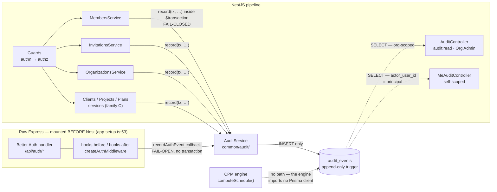
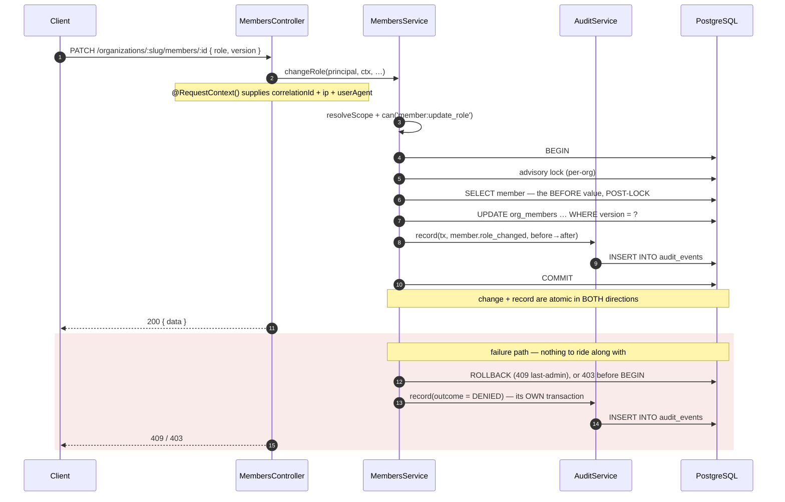
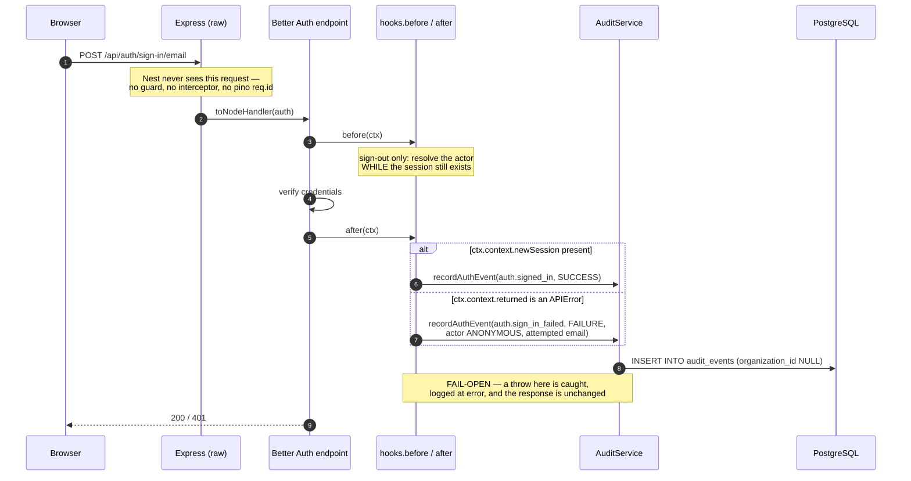
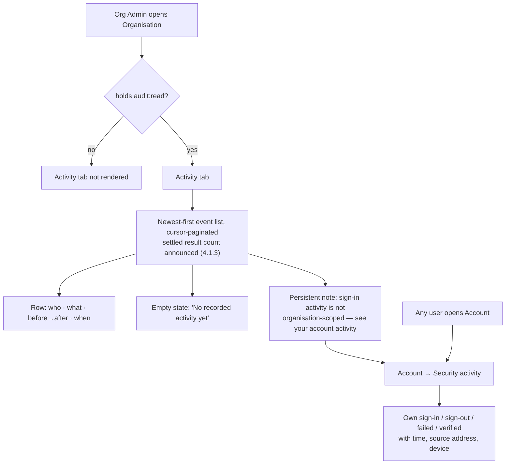
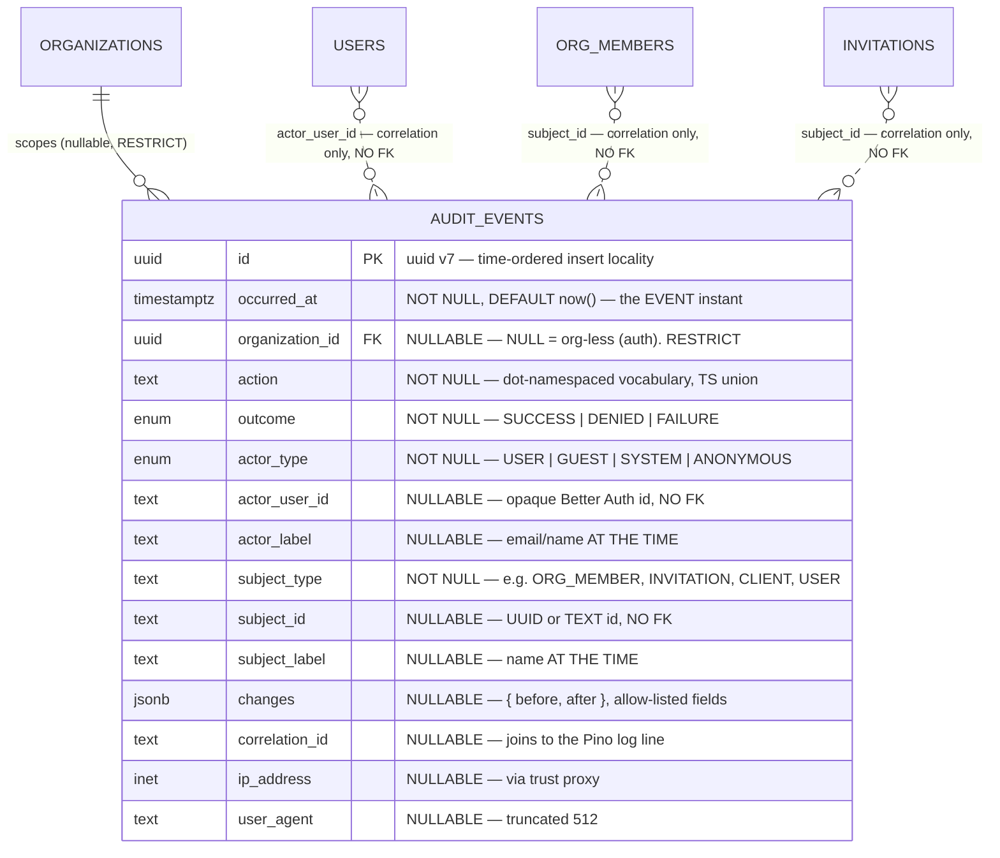

# Feature Spec: Append-only audit log

- **Status:** Draft (awaiting approval)
- **Author(s):** feature-analyst (Claude Code), building on a design pass by database-architect
- **Date:** 2026-08-03
- **Tracking issue / epic:** _TBD_
- **Roadmap link:** `docs/BACKLOG.md` — "`M` **Append-only audit log** (TECH_DEBT #14)"
- **Related ADR(s):** **proposes [ADR-0072](../../adr/0072-append-only-audit-log.md)** (drafted
  with this spec, Accepted). Builds on ADR-0003 (Better Auth), ADR-0012 (RBAC + resource
  scoping), ADR-0016 (tenancy/roles), ADR-0018 (self-migrating image), ADR-0022 (engine-owned
  batched writes), ADR-0034 (recalc parity gate), ADR-0046 (polymorphic notes — the precedent
  this design **deliberately declines**, §4), ADR-0051 (`GuestPrincipal`), ADR-0053 (measure
  before you index), ADR-0057 (`modules/clients` as the canonical module shape), ADR-0058
  (verify the claim), ADR-0063/0064/0067 (the enablement-milestone discipline).

> **Provenance.** The data model, the measured append-only analysis, the index measurements
> and the "why not ADR-0046's shape" argument in §4 come from a **database-architect** design
> pass that ran real Postgres experiments rather than reasoning about them. Those results are
> preserved verbatim in substance and are marked **[measured]** where they were run. What this
> revision changes is the **delivery shape**: the milestone structure, the read surface, the
> auth-capture seam, the coverage gate, and the event catalogue.

> **Scope note.** `docs/TECH_DEBT.md` #14 bundles four sub-items. Two are audit-log work; two
> are not, and should be split into their own rows so #14 can be **closed** by this epic rather
> than left half-open forever.
>
> | Sub-item                                                | In scope? | Where it belongs                                                                                                                                                                                               |
> | ------------------------------------------------------- | --------- | -------------------------------------------------------------------------------------------------------------------------------------------------------------------------------------------------------------- |
> | **(a)** authentication events (sign-up / in / out)      | **Yes**   | this spec, **Milestone 1** (family B)                                                                                                                                                                          |
> | **(a2)** membership role changes/removals + invitations | **Yes**   | this spec, **Milestone 1** (family A)                                                                                                                                                                          |
> | **(b)** Better Auth's in-process rate-limit store       | **No**    | a Redis-backed store (ADR-0010), together with its sibling **TECH_DEBT #49** (Nest's `ThrottlerModule` storage). A scaling concern, not a record-keeping one — no audit row makes a per-replica bucket shared. |
> | **(c)** unencrypted `accounts` OAuth token columns      | **No**    | field-level encryption on `accounts`, owed **before** a social provider is enabled (only email+password is configured today, `better-auth.ts`). A key-custody change with no overlap with this design.         |
>
> **Beyond #14's letter**, this epic also covers **client / project / plan soft deletes and
> their cascades** (family C) — a product-owner decision. `docs/SECURITY_STANDARDS.md` already
> names "deletions/exports" in the standard it publishes, so this closes the published claim
> rather than widening it.

---

## 1. Business understanding

### Problem

`docs/SECURITY_STANDARDS.md` §"Audit logging" commits the product to an "**append-only audit
log** for security- and sensitive events (authentication events, permission changes, sensitive
mutations, deletions/exports): who, what, when, and before→after where relevant" whose "entries
are **never mutated or deleted**". That section is titled _"not yet implemented"_ and has been
since it was written. The gap was raised independently in the A1 and C1 security reviews and is
`docs/TECH_DEBT.md` #14.

What exists instead — verified in the code, not taken from the docs (ADR-0058):

- **Row attribution.** Every domain table carries `created_by` / `updated_by` (opaque Better
  Auth TEXT ids) and `created_at` / `updated_at`. This records the **last** writer and nothing
  before them: a member promoted to Org Admin and demoted an hour later leaves a row identical
  to one that never changed, and `updated_by` names whoever touched it last, not who promoted.
- **Soft delete + `delete_batch_id`.** Deletions are recoverable and correlated, so the _rows_
  survive — but the **act** of deleting leaves no record beyond `deleted_at`, and a restore
  erases even that. `HierarchyLifecycleService.cascadeSoftDelete` returns a rich `CascadeCounts`
  today and it is written to **stdout** and then discarded.
- **Structured logs.** `MembersService.changeRole` emits `logger.info({ organizationId,
memberId, role, userId }, 'member role changed')` (`members.service.ts:88`) and
  `InvitationsService`/`ClientsService` emit siblings. These are the closest thing to an audit
  trail today and they are **not one**: they carry the _new_ role and not the old one, they go
  to stdout, and stdout is rotated, mutable at the sink, and shipped nowhere by the running
  Docker Compose stack.
- **Authentication: nothing at all.** A sign-in, a failed sign-in, a sign-out and an email
  verification leave **no row anywhere**. `sessions` holds live sessions only and Better Auth
  deletes the row on sign-out. This is the largest hole: for every other event class there is at
  least a mutated row to reason from; for authentication there is nothing.

Two facts make this urgent rather than theoretical. First, **the product is in use** — CLAUDE.md
§17 records that the product owner runs the Compose stack with the ADR-0047 Watchtower profile
enabled, so anything shipped default-on is live, and the questions an audit log answers ("who
removed that member?", "who deleted that project?", "was that sign-in from an address we
recognise?") are now askable about real data. Second, the product is **multi-tenant with a
privileged role**: an Org Admin can change any member's role, remove any member, invite anyone,
and cascade-delete a client with every project, plan and activity under it. ADR-0012's RBAC
decides whether an action is _allowed_; nothing records that it _happened_.

### Users

| Role                               | Need                                                                                                                                                                                     |
| ---------------------------------- | ---------------------------------------------------------------------------------------------------------------------------------------------------------------------------------------- |
| **Org Admin**                      | Answer "who changed this, and when?" about their own organisation — role changes, removals, invitations, and hierarchy deletions/restores. The only role that reads the org log.         |
| **Any authenticated user**         | See **their own** account security activity — sign-ins, failed sign-ins, sign-outs, verifications — the standard "recent activity on your account" a person expects to be able to check. |
| **Operator / on-call**             | Correlate a support report or a suspected compromise with a durable record, joined to the application logs by correlation id; and reach across accounts, which no API allows.            |
| **Planner / Contributor / Viewer** | **No** access to the organisation log. It contains other members' actions and their IP addresses.                                                                                        |
| **External Guest**                 | None. A guest neither reads nor writes the audit log (ADR-0051).                                                                                                                         |

### Primary use cases

1. An Org Admin discovers a member's role is wrong and needs to know who changed it, from what,
   to what, and when.
2. A member says they were removed from an organisation; an Org Admin needs to confirm who
   removed them, and how they had access in the first place (the invitation chain).
3. A planner reports that a project "disappeared". An Org Admin needs to see who deleted it,
   when, and **what went with it** (the cascade counts and the batch id that a restore would
   bring back).
4. A user is prompted by a security notice and wants to check their own recent sign-in activity,
   including failures they did not cause.
5. An operator investigating a suspicious report needs the authentication history **across**
   accounts — successful and failed sign-ins with source address and user agent.
6. An operator holding a `correlationId` from an application log line needs the durable record
   of what that request actually changed (and conversely).

### User journeys

**Happy path — the organisation log (Milestone 1).** An Org Admin opens **Organisation →
Activity**. They see a newest-first, cursor-paginated list of the organisation's recorded
events, each rendered as a sentence: _"Jane Planner changed Sam Contributor's role from
Contributor to Planner — 2 August 2026, 14:07."_ A deletion row reads _"Jane Planner deleted
client Acme Ltd — 3 projects, 7 plans, 412 activities"_. A persistent line above the list says
that **sign-in activity is not organisation-scoped and appears on your own account activity
page** — so the screen never implies a completeness it does not have.

**Happy path — my account activity (Milestone 1).** Any signed-in user opens **Account →
Security activity** and sees their own newest-first authentication history: signed in, signed
out, a failed sign-in, an email verification — each with time, source address and device
string.

**Alternate — a role change is refused.** A Planner attempts a role change and gets 403. One
`DENIED` row is written (its own short transaction, since there is no successful transaction to
join) and the target member is unchanged. The Org Admin later sees the attempt in the log.

**Alternate — the audit write fails.** On a domain path the transaction rolls back and the
user's action fails (**fail closed**). On the authentication path the sign-in **succeeds** and
the failure is logged at `error` (**fail open**). The asymmetry is deliberate and is stated in
§2 rather than buried.

**Alternate — the operator path.** An operator needs sign-in history for an account that is not
theirs. **No API returns that**, at any role. It is a `psql` read against `audit_events`, and
that is a deliberate boundary, not an omission (§4).

### Expected outcomes

- The security standard the product already publishes becomes **true rather than aspirational**,
  and `docs/SECURITY_STANDARDS.md` loses its "_not yet implemented_" heading — replaced with
  what shipped **including the honest limit of the enforcement mechanism** (§4).
- Permission changes, hierarchy deletions and authentication events acquire a durable,
  before→after record that survives log rotation and that the database itself refuses to edit or
  delete.
- Forgetting to audit a new mutating endpoint becomes a **CI failure** rather than a silent gap
  (§4 "The coverage gate").
- TECH_DEBT #14(a) and #14(a2) close; (b) and (c) split out as their own rows.

### Success criteria

- **Correctness:** every M1 event class writes exactly one row per occurrence, inside the
  transaction that made the change where one exists, proved by API-level (Supertest, real
  Postgres) tests.
- **Append-only, demonstrated:** an API-level test issues a direct `UPDATE`, `DELETE` and
  `TRUNCATE` against `audit_events` **as the application's own database role** and asserts all
  three are refused by the database.
- **No coverage regression by omission:** the structural gate fails when a declared seam's call
  is removed, and fails when a new mutating controller route is added without being classified
  (§4). Both directions verified to fail first (ADR-0064's rule).
- **No engine impact:** the ADR-0034 recalc golden/conformance suites pass byte-identically —
  **structurally guaranteed**, not asserted (§4 "The engine argument").
- **Performance:** the audit insert adds < 1 ms to the transactions it joins; a 50-row org page
  reads in < 5 ms at 200,000 events (**[measured] 0.271 ms** — §4).
- **Accessibility:** both screens meet WCAG 2.2 AA, including a settled-result-count status
  message (the ADR-0053 M6 finding, which this epic must not re-learn).

### Open questions

Every question carries a stated default so work is not blocked. **Two are CRITICAL** — their
answers change the shipped surface.

- **CQ-1 (CRITICAL) — Does the "my account activity" self-read ship in M1?** The organisation
  endpoint cannot return org-less authentication rows (§4 "The org-less problem"), so without a
  second, self-scoped read the auth family — the largest of the three, and the one #14 names
  first — lands **write-only** while the other two are readable. That would reproduce exactly
  the half-complete surface decision 1 exists to prevent.
  _Default:_ **yes — `GET /api/v1/me/audit-events` plus a small Account → Security activity
  screen ship in M1.** Cost: one endpoint, one screen, and **one new index** whose size is not
  yet measured (§4). Striking it removes Tasks 1.9/1.12 and the index; the auth family then
  exists but is readable only by an operator with `psql`.
- **CQ-2 (CRITICAL) — Is "append-only enforced by a trigger the application role can itself
  disable" the right honesty bar?** §4 measures three mechanisms and recommends the trigger,
  while stating plainly that it stops accident and ordinary application code and is **not**
  tamper-proof against a compromised application role.
  _Default (product owner has confirmed, decision 2):_ **ship the trigger and write the
  limitation into `docs/SECURITY_STANDARDS.md`** rather than claiming immutability. The
  restricted second DB role stays **recorded as the escalation**, gated on the deployment-target
  decision (TECH_DEBT #5).
- **CQ-3 — Do share-link create/revoke join M1?** They authorise data egress **outside** the
  tenant boundary, which is why ADR-0051 made `plan:share` a governance permission.
  _Default:_ **no — M3.** M1 is already three event families and two screens; the census gate
  (§4) means `share.create`/`share.revoke` land in `UNAUDITED_ROUTES` with a written reason
  pointing at M3, so they cannot be silently forgotten. Moving them into M1 costs one task.
- **CQ-4 — Does a failed sign-in record the attempted email address?** It is the datum that
  makes credential-stuffing visible.
  _Default:_ **yes.** Never the attempted password; never a token. The row is org-less and
  therefore returned by **no** organisation endpoint, and the self-read only ever matches a real
  `actor_user_id`, so a failed attempt against a non-existent address is visible to nobody but
  an operator.
- **CQ-5 — Does M1's organisation read ship any filters?** _Default:_ **no — pagination only.**
  A filter earns its index at real volume (ADR-0053 M4). §4 records the measurement for the
  `action` composite (43 MB / 0.297 ms vs 0.939 ms typical) so the follow-up is a decision, not
  a re-investigation.
- **CQ-6 — Retention.** _Default:_ **none in v1**; the [measured] volumes do not need one.
  Revisit when family-D mutation events land or the table passes 5 GB, whichever first — and
  note that **partitioning is the only retention mechanism compatible with the trigger** (§4).
- **CQ-7 — Do activity and dependency deletes join family C?** _Default:_ **no — M3.** A
  2,000-activity bulk delete and a WBS subtree cascade are a different volume class from a
  client delete, and M3 is gated on the growth measurement.

---

## 2. Functional requirements

### The M1 event catalogue

Three families, eighteen actions. `action` is a lower-case, dot-namespaced `text` value drawn
from a closed TypeScript union (§4).

**Family A — membership, invitation and organisation (org-scoped, in-transaction, fail-closed).**

| Action                 | Subject        | `changes` (allow-listed)                    |
| ---------------------- | -------------- | ------------------------------------------- |
| `member.role_changed`  | `ORG_MEMBER`   | `{ before: { role }, after: { role } }`     |
| `member.removed`       | `ORG_MEMBER`   | `{ before: { role } }`                      |
| `member.joined`        | `ORG_MEMBER`   | `{ after: { role } }`                       |
| `invitation.created`   | `INVITATION`   | `{ after: { email, role, expiresAt } }`     |
| `invitation.revoked`   | `INVITATION`   | `{ before: { status }, after: { status } }` |
| `invitation.accepted`  | `INVITATION`   | `{ before: { status }, after: { status } }` |
| `organization.created` | `ORGANIZATION` | `{ after: { name, slug } }`                 |

**Family B — authentication (org-less, outside any domain transaction, fail-open).**

| Action                | Subject | `changes` (allow-listed)   | Notes                                                  |
| --------------------- | ------- | -------------------------- | ------------------------------------------------------ |
| `auth.signed_up`      | `USER`  | —                          | one row, even though `autoSignIn` also mints a session |
| `auth.signed_in`      | `USER`  | —                          |                                                        |
| `auth.sign_in_failed` | `USER`  | `{ attempted: { email } }` | `actor_type = ANONYMOUS`, `actor_user_id NULL`         |
| `auth.signed_out`     | `USER`  | —                          |                                                        |
| `auth.email_verified` | `USER`  | —                          |                                                        |

**Family C — hierarchy soft delete and restore (org-scoped, in-transaction, fail-closed).**

| Action             | Subject   | `changes` (allow-listed)                   |
| ------------------ | --------- | ------------------------------------------ |
| `client.deleted`   | `CLIENT`  | `{ deleteBatchId, counts: CascadeCounts }` |
| `client.restored`  | `CLIENT`  | `{ deleteBatchId, counts: CascadeCounts }` |
| `project.deleted`  | `PROJECT` | `{ deleteBatchId, counts }`                |
| `project.restored` | `PROJECT` | `{ deleteBatchId, counts }`                |
| `plan.deleted`     | `PLAN`    | `{ deleteBatchId, counts }`                |
| `plan.restored`    | `PLAN`    | `{ deleteBatchId, counts }`                |

Recording the `deleteBatchId` is the load-bearing choice in family C: the audit row does not
duplicate the deleted rows, it **names the existing correlation id** that already identifies
exactly which rows went, and which a restore would bring back. One row per user action, not one
per swept row.

### User stories & acceptance criteria

> **US-1** — As an **Org Admin**, I want every membership role change recorded with its before
> and after value, so that a privilege escalation is reconstructable after the fact.
>
> **Acceptance criteria**
>
> - **Given** an Org Admin changes a member's role from `CONTRIBUTOR` to `PLANNER` **when** the
>   change succeeds **then** exactly one `audit_events` row exists with
>   `action = 'member.role_changed'`, `outcome = 'SUCCESS'`, the acting principal as actor, the
>   affected `org_members.id` as subject, and
>   `changes = {"before":{"role":"CONTRIBUTOR"},"after":{"role":"PLANNER"}}`.
> - **Given** the `before` value **then** it is read from the **post-lock, in-transaction** row
>   (`members.service.ts:70`), never from the pre-transaction existence check on line 63.
> - **Given** the role change fails the last-Org-Admin invariant (409) **when** the transaction
>   rolls back **then** **no** `SUCCESS` row exists and exactly one `outcome = 'DENIED'` row is
>   written by the post-hoc path.
> - **Given** the role change is rejected by the permission check (403) **then** exactly one
>   `DENIED` row is written and the target member is unchanged.

> **US-2** — As an **Org Admin**, I want the full membership and invitation lifecycle recorded,
> so that "how did this person get access?" has an answer.
>
> **Acceptance criteria**
>
> - `member.removed` records the removed member's user id, their **role at the time**, and the
>   remover.
> - `invitation.created` records the invited **email address** and role — and **never** the
>   invitation token or its hash (§2 "What is deliberately NOT stored").
> - `invitation.revoked` and `invitation.accepted` record the invitation id and the actor.
> - **Given** an invitation accept **then** `invitation.accepted` and `member.joined` are **two**
>   rows sharing one `correlation_id`, written inside the one existing `$transaction`
>   (`invitations.service.ts:189`), because they are two facts about one request.
> - **Given** `invitation.created` / `invitation.revoked`, which are **not transactional today**,
>   **then** the write and its audit row are wrapped in one `$transaction` by this change.

> **US-3** — As an **Org Admin**, I want deletions of a client, project or plan recorded with
> what they took with them, so that a "disappeared" project has an answer and a restore has a
> record.
>
> **Acceptance criteria**
>
> - **Given** a client delete **then** exactly one `client.deleted` row exists carrying the
>   `deleteBatchId` and the full `CascadeCounts`, written inside the same `$transaction` as
>   `cascadeSoftDelete` (`clients.service.ts:132`).
> - **Given** a restore **then** exactly one `*.restored` row exists carrying the same
>   `deleteBatchId`, so delete and restore join.
> - **Given** a cascade that sweeps 412 activities **then** exactly **one** row is written, not 412. The auditable act is the user's, not the sweep's.

> **US-4** — As an **operator**, I want the database itself to refuse edits and deletions of
> audit rows, so that "append-only" is a property of the store and not a convention.
>
> **Acceptance criteria**
>
> - **Given** the application's own database role **when** it issues `UPDATE audit_events …`
>   **then** the statement is refused with a raised exception. The same for `DELETE` and
>   `TRUNCATE`. `INSERT` is unaffected.
> - The trigger does **not** appear in `pnpm --filter @repo/api prisma:check-drift`
>   (**[measured]** — §4), and that clean result is stated in the PR.
> - `docs/SECURITY_STANDARDS.md` states, in the same paragraph as the claim, that the
>   application role owns the table and can disable the trigger — so the control is append-only
>   against accident and ordinary application code, and tamper-**proof** against nothing.

> **US-5** — As an **operator**, I want authentication events recorded, so that sign-in activity
> is reconstructable at all.
>
> **Acceptance criteria**
>
> - A successful sign-in, a failed sign-in, a sign-up, a sign-out and an email verification each
>   write **exactly one** row (asserted by count, not presence — Better Auth's own retry paths
>   must not double-record) with `organization_id IS NULL`, the resolved source IP and the user
>   agent.
> - A failed sign-in for an address with no account writes `actor_type = 'ANONYMOUS'`,
>   `actor_user_id = NULL`, and the attempted address in `changes`.
> - A sign-out records the **actor**, which means the acting user is resolved while the session
>   still exists (§4 "Capturing authentication").
> - **Given** the audit insert itself fails **when** the event is an authentication event **then**
>   sign-in still succeeds and the failure is logged at `error` — the auth path **fails open**.

> **US-6** — As an **Org Admin**, I want to read my organisation's audit events in the product,
> so that I can answer a member's question without an operator.
>
> **Acceptance criteria**
>
> - `GET /api/v1/organizations/:orgSlug/audit-events` returns the org's events newest-first,
>   cursor-paginated, in the standard `{ data, meta }` envelope.
> - A Planner, Contributor or Viewer receives **403**; a non-member receives **404**
>   (`OrganizationsService.resolveScope`, the existing anti-IDOR path).
> - Org-less authentication events are **never** returned by this endpoint at any role, and the
>   endpoint's OpenAPI description and the screen's own copy **say so** — the list must not imply
>   a completeness it does not have.
> - Each row renders as a sentence built from its allow-listed fields; an **unknown** action
>   (a row written by a newer build) degrades to actor + action + timestamp rather than dumping
>   the JSON payload.

> **US-7** _(CQ-1)_ — As **any signed-in user**, I want to see my own account security activity,
> so that I can check whether a sign-in was mine.
>
> **Acceptance criteria**
>
> - `GET /api/v1/me/audit-events` returns **only** rows where `actor_user_id` is the caller's own
>   id, newest-first, cursor-paginated. No permission code is required beyond authentication;
>   the scope **is** the identity.
> - The endpoint takes **no** user-id parameter of any kind. The subject is the principal, never
>   a request value — anti-IDOR by construction (the ADR-0051 `GuestPrincipal` pattern).
> - A failed sign-in against an address with no account is returned to **nobody** (its
>   `actor_user_id` is NULL).

### Workflows

**Recording an org-scoped event (families A and C).**

1. The service resolves org scope and asserts the permission (unchanged).
2. The service opens its `$transaction` (unchanged, except for the two invitation methods that
   gain one).
3. The service performs the write and captures **before** and **after** for the allow-listed
   fields, from the **in-transaction, post-lock** read.
4. The service calls `AuditService.record(tx, event)` — **inside** the same transaction.
5. Commit. The change and its record are atomic in both directions.

**Recording a denied or failed action.** There is no successful transaction to join, so the
`DENIED` / `FAILURE` row is written in its **own** short transaction after the error is raised.
It carries the same `correlation_id`, so the pair is joinable.

**Recording an authentication event (family B).** Better Auth is mounted as a raw Node handler
on the Express instance **before** the Nest application (`app-setup.ts:53`), so no Nest guard,
interceptor or filter observes these routes. The producer is a Better Auth `hooks.after`
middleware (with `hooks.before` for sign-out) that calls the same `AuditService` through a
callback threaded into `createAuth`'s options — see §4 "Capturing authentication".

### Failure policy (deliberate asymmetry)

| Path                        | If the audit insert fails                                                          | Why                                                                                                                                                                         |
| --------------------------- | ---------------------------------------------------------------------------------- | --------------------------------------------------------------------------------------------------------------------------------------------------------------------------- |
| **In-transaction (domain)** | **Fail closed** — the whole transaction rolls back and the user's action fails 500 | If the record cannot be written, the change must not happen. This is the point of putting it in the transaction; a "logged-except-when-it-wasn't" trail is worse than none. |
| **Better Auth hook**        | **Fail open** — the sign-in succeeds; the failure is logged at `error`             | A full audit table or a transient database error must not lock every user out of the product. Availability of authentication outranks completeness of its record.           |

This asymmetry is the design's one genuinely uncomfortable decision. It is stated here, in
ADR-0072, and in a code comment at both sites — **with the reason, not just the behaviour** — so
a future reader does not "fix" one side into the other.

### Edge cases

| Case                                                   | Expected behaviour                                                                                                                                             |
| ------------------------------------------------------ | -------------------------------------------------------------------------------------------------------------------------------------------------------------- |
| Authentication event with no organisation              | `organization_id IS NULL`. Never returned by an org-scoped endpoint. Never fanned out per membership (§4).                                                     |
| The actor is later deleted / renamed                   | The row is unaffected — `actor_user_id` has **no FK** and `actor_label` is the label **at the time** (the `baseline_activities.source_activity_id` precedent). |
| The subject row is later hard-purged                   | Same: `subject_id` is a plain correlation id with **no FK**.                                                                                                   |
| Two concurrent role changes                            | Serialised by the existing per-org advisory lock and optimistic `version`; one succeeds (one `SUCCESS` row), the other 409s (one `DENIED` row).                |
| The organisation is soft-deleted                       | Audit rows are untouched — they carry no `deleted_at`, take no part in any cascade, are not swept by `delete_batch_id` and are not restored.                   |
| A delete and its restore                               | Two rows sharing a `deleteBatchId`; the restore does **not** erase or amend the delete row.                                                                    |
| A cascade sweeping thousands of rows                   | One row, carrying `CascadeCounts` + `deleteBatchId`. Never one row per swept row.                                                                              |
| An event payload would exceed the size bound           | The service truncates and marks the payload truncated **before** the insert; `ck_audit_events_changes_size` is the backstop, and hitting it is a 500 bug.      |
| A future event class needs a new action name           | `action` is `text` constrained by a TypeScript union — **no migration** (§4).                                                                                  |
| A row written by a newer build reaches an older client | The screen degrades to actor + action + timestamp. An unknown action never renders raw JSON.                                                                   |
| Retention pruning is eventually needed                 | **Not by `DELETE`** — the trigger refuses it, by design. By partition detach, which is DDL (§4).                                                               |
| The sign-out session is already gone in the hook       | The actor is resolved in `hooks.before`, while the session still exists (§4).                                                                                  |

### Permissions

| Action                               | Permission             | Roles                        | Notes                                                                                                                                                                                           |
| ------------------------------------ | ---------------------- | ---------------------------- | ----------------------------------------------------------------------------------------------------------------------------------------------------------------------------------------------- |
| **Write** an audit event             | _none_                 | —                            | Never a client-initiated action. No endpoint writes an audit row; a row is a side effect of the audited action.                                                                                 |
| **Read** an organisation's audit log | **`audit:read`** (new) | **Org Admin only**           | Deliberately narrower than `HIERARCHY_READ` — the log carries other members' actions and their IP addresses. The `cost:read` / `plan:share` precedent for a grant narrower than "every member". |
| **Read my own account activity**     | _none_                 | **every authenticated user** | The scope is the identity. The endpoint accepts no user-id parameter at all.                                                                                                                    |
| Read another account's auth events   | _none_                 | **nobody, via the API**      | Operator-only, via the database. An org-scoped endpoint cannot scope a row with no organisation without inventing a scope for it (§4).                                                          |

`audit:read` is granted as its own `AUDIT_READ` const to `ORG_ADMIN` only and is **not** added to
`HIERARCHY_READ`, `ADMIN` or any other bundle, so widening it later is a deliberate one-line
move. A unit test asserts Planner/Contributor/Viewer do **not** hold it (the `org-permissions.spec.ts`
precedent).

### Validation rules

- `action` — a value from the `AuditAction` union in `@repo/types`; lower-case dot-namespaced
  (`member.role_changed`), ≤ 64 chars, `ck_audit_events_action_format`.
- `changes` — `jsonb`, a JSON **object** or `NULL` (`ck_audit_events_changes_object`),
  `pg_column_size` ≤ 8 KB (`ck_audit_events_changes_size`), containing **only** allow-listed
  field names per action. Enforced by a service-layer redactor with a unit test; the database
  enforces shape and size only.
- `actor_type` / `outcome` — Postgres enums (closed vocabularies, §4).
- `ip_address` — `inet`, resolved from the already-configured trusted-proxy chain. On the Nest
  side that is Express's `req.ip` (`app-setup.ts` sets `trust proxy` from `TRUSTED_PROXY_IPS`);
  on the Better Auth side it is the **same** helper over the same list. Never a raw header.
- `user_agent` — `text`, truncated at 512 chars by the service.
- `correlation_id` — the `x-correlation-id` the Pino `genReqId` hook already generates and echoes
  (`app.module.ts:65`). Reused, never regenerated — **except** on the auth path, where pino-http
  has not run (§4), and the adapter mints one and logs it alongside so the two still join.

### What is deliberately NOT stored

This list is normative and belongs verbatim in `docs/SECURITY_STANDARDS.md`:

- **No secrets of any kind.** No passwords, no password hashes, no session tokens, no invitation
  tokens, no share-link tokens — **and not their hashes either**. A hash in the audit log beside
  the same hash in `invitations.token_hash` / `plan_shares.token_hash` is a matching oracle, so
  storing "just the hash" is not the safe half-measure it looks like.
- **No request or response bodies.** The event names the fields that changed and their
  before/after values from an allow-list; it never carries the payload that produced them.
- **No user content.** A note edit records that a note was edited, never its prose. A plan rename
  records the names; an activity's description is not audited content.
- **No password-reset or verification URLs.**
- **No `deleted_at`, no `delete_batch_id` (as a column), no `version`, no `updated_at`, no
  `updated_by`.** Their absence is the point: a column that only makes sense on a mutable,
  restorable row would be a standing invitation to mutate this one. (Family C carries a
  `deleteBatchId` **inside `changes`**, as data about the audited act — not as a lifecycle
  column on the audit row itself.)

### Error scenarios

| Scenario                                              | Detection                          | User-facing result                           | Status |
| ----------------------------------------------------- | ---------------------------------- | -------------------------------------------- | ------ |
| Non-Org-Admin requests the org audit list             | `principal.can('audit:read', org)` | friendly forbidden message                   | 403    |
| Non-member requests the org audit list                | `resolveScope` (anti-IDOR)         | not found (no existence oracle)              | 404    |
| Unauthenticated request to `/me/audit-events`         | authentication guard               | sign-in required                             | 401    |
| Anything attempts `UPDATE`/`DELETE` on `audit_events` | database trigger                   | 500 + `error`-level log; never a client path | 500    |
| Audit insert fails during a domain write              | transaction rollback               | the user's action fails                      | 500    |
| Audit insert fails during authentication              | caught in the hook                 | **sign-in succeeds**; `error`-level log      | 200    |
| `changes` payload exceeds 8 KB                        | `ck_audit_events_changes_size`     | 500 (a bug — the service truncates first)    | 500    |
| Cursor is malformed                                   | DTO validation                     | inline error                                 | 400    |

---

## 3. Technical analysis

| Area           | Impact     | Notes                                                                                                                                                                                                                                                  |
| -------------- | ---------- | ------------------------------------------------------------------------------------------------------------------------------------------------------------------------------------------------------------------------------------------------------ |
| Frontend       | **medium** | Two new read-only screens (Organisation → Activity; Account → Security activity) behind `VITE_AUDIT_LOG`, default off. Reuses the existing table/pagination/`SearchField`-free list patterns; no new primitive.                                        |
| Backend        | **high**   | A new `common/audit/` seam (`AuditService`, the action vocabulary, the redactor, the request-context decorator); a new `modules/audit/` read module; call sites in **eight** services; a Better Auth hook adapter.                                     |
| Database       | **medium** | One new table, two new enums, four CHECKs, **three** indexes, and the schema's **first trigger**. Additive; no existing table is altered.                                                                                                              |
| API            | **medium** | Two new `GET` endpoints, standard envelope + cursor pagination, one new permission code, OpenAPI updated.                                                                                                                                              |
| Security       | **high**   | This _is_ a security control. New permission code; new read-egress surface carrying IP addresses. Needs a **security review** on the store + redactor and again on the two reads. Not optional.                                                        |
| Performance    | low        | One extra `INSERT` per audited action. **[measured]** 638 B/row and a 0.27 ms org page at 200 k rows. Deliberately **not** on any hot path — no audit row is written by the recalc, the canvas, or any read.                                           |
| Infrastructure | **none**   | No new service, no new env var, no queue, no scheduler. Explicitly designed to need none, because ADR-0009's scheduler does not exist (CLAUDE.md §17).                                                                                                 |
| Observability  | low        | Reuses the existing Pino correlation id; the audit row stores it so the two records join. The auth path mints its own and logs it (see §4).                                                                                                            |
| Testing        | **high**   | Unit (redactor, builders, vocabulary lock-step, the three structural gates), API/Supertest against real Postgres (append-only proof, transactional atomicity, per-action row counts, RBAC/IDOR), component + a11y, and one flag-on Playwright journey. |

### Dependencies

- **Nothing must land first.** The store is additive and the producers are existing services.
- ADR-0018's self-migrating entrypoint constrains the migration: it runs `prisma migrate deploy`
  as the single `DATABASE_URL` role on every boot, so the migration may only use privileges that
  role certainly holds. Creating a **role** is not one of them (**[measured]**: the local `app`
  role has `rolcreaterole = f`); creating a **trigger on a table it owns** is.
- The deployment target is undecided (TECH_DEBT #5), so nothing here may assume a managed
  Postgres, a KMS, or an object store.
- Better Auth **1.6.25** is the pinned version. The hook surface is documented but was **not**
  verifiable from this checkout (the package installs only `package.json`; `dist/` is absent), so
  Task 1.7 establishes it empirically before any producer is written — ADR-0058's rule applied to
  a third-party API rather than to our own docs.

---

## 4. Solution design

### Architecture overview



The dashed, crossed edge is load-bearing, not decoration: see "The engine argument" below.

### Data flow — an org-scoped write



### Data flow — an authentication event



### User flow



### Database changes



#### Why a single table with a loose polymorphic subject — and **not** the ADR-0046 shape

ADR-0046 is the closest precedent in the schema and this design **declines it deliberately**.
`notes` uses an `entity_type` discriminator plus **nullable typed parent FKs** plus a fail-closed
`CASE … ELSE false` CHECK. That works there because a note has a **small, closed** set of parents
(two now, four ever), all UUID-keyed, all FK-able, all soft-deleted in tandem with the note.

None of those hold for an audit log:

1. **The subject set is open-ended, not closed.** An audit log's subject is eventually _every_
   entity in the system, plus `users` (TEXT-keyed by Better Auth, not UUID), plus things that are
   not rows at all — a failed sign-in has no subject row. Typed FK columns would mean ~26
   nullable FKs, a CHECK with ~26 branches, and — the disqualifying part — a **migration to the
   audit table every time a new model is added**. An audit log that couples to the shape of
   everything it observes is the one thing it must not be.
2. **An FK is actively wrong here.** An audit event must outlive its subject. `notes` wants
   `RESTRICT` because a note without its parent is meaningless; an audit event without its
   subject is _exactly_ the record you need after an erasure. The right precedent is
   **`baseline_activities.source_activity_id`**: a plain correlation UUID with **no foreign key**,
   chosen so the snapshot "survives the source activity's hard purge and stays faithful even if
   the live activity is edited or deleted" (`docs/DATABASE.md`). The same sentence, one table
   along.
3. **Where the ADR-0046 discipline _does_ apply, it is kept.** The fail-closed `CASE … ELSE
false` pattern is used for the one genuinely closed discriminator — `actor_type` → which actor
   columns must be set — so an unhandled future actor kind is rejected rather than admitted
   (`ck_audit_events_actor_shape`).

Per-domain tables (`auth_audit`, `membership_audit`, …) were also rejected: they make "everything
that happened in this organisation, newest first" a `UNION ALL` over N tables that grows with
every rung — the shape `recycle-bin.repository.ts` already demonstrates the cost of (TECH_DEBT
#57) — and it would multiply the append-only trigger by N.

#### Why `action` is `text` and `actor_type` / `outcome` are enums

The house default is a Postgres enum, so the split needs stating:

- **`action` grows on every coverage rung.** ADR-0053 M3 records the cost: adding a label and
  using it is **two migrations**, because Postgres forbids both in one transaction. A vocabulary
  that gains members every time the audit surface widens would pay that toll forever, for no read
  benefit — and an audit vocabulary is **versioned data**: a row written under an old label must
  stay readable for the table's whole life, and a Postgres enum makes retiring a label impossible
  in practice. Closed-ness is bought instead where it is free — a `const` union in `@repo/types`
  with an exhaustively-keyed record and a structural lock-step test, the `LagCalendarSource` /
  `OrgPermission` / `seed-vocabulary.spec.ts` precedent — plus `ck_audit_events_action_format` as
  the DB backstop against a malformed value.
- **`actor_type` and `outcome` are genuinely closed and gate a CHECK.** `actor_type` mirrors the
  app's real principal kinds (`Principal`, `GuestPrincipal`, none) and `outcome` is three values
  that will not grow. A `CASE … ELSE false` CHECK is only meaningful over a closed type, so these
  earn the enum.

`GUEST` is included in `AuditActorType` from day one even though M1 emits none. The app already
**has** `GuestPrincipal` (ADR-0051), so it is not speculative, and reserving it now costs one
label and one CHECK branch versus two migrations later.

#### `changes jsonb` — the schema's first JSON column

`docs/DATABASE.md` records a **rejection** of JSONB for `baseline_assignments` on three grounds:
money must be `BIGINT` minor units because a JSON number is a double in most drivers; the
database could enforce neither `cost >= 0` nor the lag range; and it would be "the schema's first
`json` column, an ADR-level precedent rather than a convenience".

The first two grounds are about a **known, fixed, numerically-constrained** payload. This payload
is the opposite by construction: heterogeneous (`{role}` for one action, `{email, role}` for
another, `{counts}` for a third), **never** a query predicate, **never** arithmetic, and **never**
constrained beyond shape and size. Typed columns would mean a column per audited field and a
migration per event class — the coupling this design exists to avoid.

The third ground stands and is met head-on: this **is** an ADR-level precedent, which is part of
why ADR-0072 exists. The rule it records is narrow: **JSONB is permitted only for an open-ended,
never-queried, never-computed payload, with a `jsonb_typeof = 'object'` CHECK and a size bound.**
It is `jsonb` (not `json`) so storage is canonical. A normalised `audit_event_changes(event_id,
field, before, after)` child table was rejected: it turns every read into a join and every write
into N inserts, for data nothing filters on.

#### Columns the house template requires, and why this table omits them

This is the second table after `plan_locks` to depart from the standard row shape, and — as that
model's docblock puts it — "a future reader should not 'fix' these into the standard shape":

| Omitted                               | Why                                                                                                                                                            |
| ------------------------------------- | -------------------------------------------------------------------------------------------------------------------------------------------------------------- |
| `updated_at`, `updated_by`, `version` | They describe a **mutable** row. This row cannot be updated — the trigger refuses it. Carrying them would be a standing invitation.                            |
| `deleted_at`, `delete_batch_id`       | They describe a **restorable** row. This row is never deleted and takes no part in any cascade.                                                                |
| `created_at`                          | Replaced by **`occurred_at`** — the event instant is the datum, not the row's insert time. They coincide today and would not if a queued producer ever landed. |
| `created_by`                          | It is **`actor_user_id`**, under its real name.                                                                                                                |

`organization_id` **keeps** its `RESTRICT` FK, unlike the subject and actor ids. It is the tenant
scope tag, orgs are never hard-deleted (so the constraint never fires), and a scope tag on a
security control should be guaranteed to name a real organisation. The consequence — that a
future compliance-erasure path must deal with the audit log **explicitly** rather than cascading
through it — is the correct outcome, not a cost.

#### The org-less problem, and the two reads it produces

`organization_id` is **nullable**, which makes this the first table whose tenant scope is
legitimately absent. Two ways of removing that absence were considered and rejected:

- **Fan an authentication event out to one row per membership.** Rejected: it duplicates one
  real-world event into N rows; the membership set changes over time so the fan-out is only
  correct at write time; and it would let one organisation infer facts about a member's activity
  in **another** tenant, which is a cross-tenant leak dressed as a convenience.
- **Stamp the org when the user happens to have exactly one membership.** Rejected as worse — a
  rule that sometimes applies produces a log whose completeness silently varies per user.

So the org-scoped endpoint returns org-scoped rows and **says so on screen**. The remaining
question is whether the auth family is then readable in the product at all. The answer this
design takes (CQ-1) is a **second, self-scoped read**: `GET /api/v1/me/audit-events`, filtered on
`actor_user_id = principal.userId`, taking **no** user-id parameter of any kind. That is not a new
scoping concept — it is identity as scope, the same shape ADR-0051's `GuestPrincipal` uses to
make IDOR structurally impossible. It needs no permission code, exposes nobody else's data, and
turns "sign-in activity exists but you cannot see it" into an ordinary account-security screen.

Cross-account authentication history remains **operator-only, via the database**. That is a
deliberate boundary: there is no role in the product whose job is reading another person's
sign-in history, and inventing one to fill a gap in a read surface would be the wrong direction.

#### Constraints

| Constraint                       | Rule                                                                                                                                                                   |
| -------------------------------- | ---------------------------------------------------------------------------------------------------------------------------------------------------------------------- |
| `ck_audit_events_actor_shape`    | **Fail-closed** `CASE actor_type WHEN 'USER' THEN actor_user_id IS NOT NULL WHEN 'GUEST' … WHEN 'SYSTEM' … WHEN 'ANONYMOUS' THEN actor_user_id IS NULL ELSE false END` |
| `ck_audit_events_action_format`  | `action ~ '^[a-z][a-z0-9_]*(\.[a-z][a-z0-9_]*)+$'` and `length(action) <= 64`                                                                                          |
| `ck_audit_events_changes_object` | `changes IS NULL OR jsonb_typeof(changes) = 'object'`                                                                                                                  |
| `ck_audit_events_changes_size`   | `changes IS NULL OR pg_column_size(changes) <= 8192`                                                                                                                   |
| `trg_audit_events_append_only`   | `BEFORE UPDATE OR DELETE … FOR EACH ROW` + `BEFORE TRUNCATE … FOR EACH STATEMENT`, `ENABLE ALWAYS`, raising `0A000`                                                    |

All are raw SQL in the migration (Prisma expresses none of them), with a documenting comment in
the Prisma model and **no** `@@index` declaration for anything Prisma cannot express — the
TECH_DEBT #54 rule.

#### Indexes — measured, per the ADR-0053 M4 rule

**[measured]** on **PostgreSQL 16.13**, the repository's own development database, 200,000 rows
across 20 organisations, `ANALYZE`d, on the exact column set above:

| Index                             | On                                                                                             | Kind        | Serves                                                                                      |
| --------------------------------- | ---------------------------------------------------------------------------------------------- | ----------- | ------------------------------------------------------------------------------------------- |
| `audit_events_pkey`               | `(id)`                                                                                         | full unique | the PK; UUID v7 gives time-ordered insert locality (12 MB at 200 k rows)                    |
| `idx_audit_events_org_occurred`   | `(organization_id, occurred_at DESC, id DESC)` **partial** `WHERE organization_id IS NOT NULL` | partial     | the `organization_id` FK `RESTRICT` check **and** the org read's exact cursor order (31 MB) |
| `idx_audit_events_actor_occurred` | `(actor_user_id, occurred_at DESC, id DESC)` **partial** `WHERE actor_user_id IS NOT NULL`     | partial     | the **self-read** (CQ-1). **NOT YET MEASURED** — Task 1.9 must measure before landing.      |

**Measurements.**

- Storage: **638 bytes/row** all-in (87 MB heap + 35 MB indexes at 200 k rows). The heap is
  dominated by `user_agent` (~110 chars) and the `changes` payload.
- Org-scoped newest-first page of 50: **0.271 ms**, 41 buffers, index scan on
  `idx_audit_events_org_occurred`. Two orders of magnitude inside the 200 ms p95 budget.
- The partial predicate is `organization_id IS NOT NULL`, not `deleted_at IS NULL` (there is no
  `deleted_at`). Postgres proves implication from an `organization_id = ?` equality, so the
  partial index still backs the FK check — the same reasoning `docs/DATABASE.md` gives for
  `idx_calendars_project_id`. It excludes the org-less authentication rows, which will be the
  **majority** of the table.

**Honesty note on the third index.** `idx_audit_events_actor_occurred` is new to this revision
(it exists because CQ-1's self-read exists) and it was **not** in the measured set. It covers
_most_ of the table rather than the minority the org index covers, so it will be **larger** than
31 MB — plausibly 40–50 MB at 200 k rows. Task 1.9 measures it on the same rig and records the
number in the migration comment before it lands. Stating the estimate here is not the same as
having measured it, and this spec will not pretend otherwise (ADR-0058).

**A fourth index on `action` is measured and deferred, not forgotten.** A `(organization_id,
action, occurred_at DESC, id DESC)` composite serves an action filter in **0.297 ms** (index-only
scan) versus **0.939 ms** typical / **28.4 ms worst case** (no matching row ⇒ a bitmap scan of the
org's whole 9,895-row slice) on the single index alone. It costs **43 MB at 200 k rows** — larger
than the table's other two indexes combined. The decision (CQ-5): **M1 ships no action filter**,
so this index is not built; it is added with the filter, on a re-measurement at real volume.

No index on `subject_id` or `correlation_id`: neither is a predicate of any shipped query.
`correlation_id` specifically is stored to be **joined in a log tool**, by the log tool's index —
so an index on it here would be pure write cost.

### Append-only enforcement — three options, measured

The application connects as **one** role, and the question is what actually binds it. All three
claims below were **run** against the repository's own database rather than reasoned about,
because the widely-repeated versions of two of them are wrong.

**Environment note first, because it changes the answer.** The local development database has
`app` as a **non-superuser** that **owns** every table. The shipped Compose stack creates `app`
via `POSTGRES_USER`, which the official Postgres image makes a **superuser**. So the connecting
role's privilege level differs between the environment this is developed in and the environment
it runs in — silently.

**Option A — `REVOKE UPDATE, DELETE, TRUNCATE … FROM app`.** _Rejected._

> **[measured]** The `REVOKE` **does** deny the table's own owner — `ERROR: permission denied for
table t` on both `UPDATE` and `DELETE`. The common claim that "REVOKE is a no-op against the
> owner" is **false**, and worth recording.
>
> But the owner restores it with **one statement** (`GRANT UPDATE … TO app;` → the update then
> succeeds, **[measured]**), so it is a speed bump against accident, not a control. And on the
> shipped Compose stack the role is a **superuser**, which bypasses privilege checks entirely —
> so this option's strength varies by environment with nothing to signal which one you are in. An
> enforcement mechanism that is strong in development and absent in production is worse than
> none, because it is believed.

**Option B — a restricted second database role.** _Right answer, wrong decade._

> The textbook control: migrations run as the owner, the application writes as `app_rw` holding
> `INSERT` and `SELECT` on `audit_events` and nothing else. It genuinely resists a compromised
> application.
>
> It needs **two connection strings** and a role Prisma Migrate does not manage. ADR-0018's
> entrypoint runs `prisma migrate deploy` as the single `DATABASE_URL` role on every boot, and
> that role cannot create another (**[measured]**: `rolcreaterole = f` locally), so the role
> becomes a **manual provisioning step on every environment** — and the deployment target is
> still undecided (TECH_DEBT #5), so "every environment" is not yet a known set. It would also be
> the first thing in the repository that a fresh `docker compose up` does not produce.
>
> **Recorded as the escalation** for when the deployment target is chosen, at which point it
> **composes with** the trigger rather than replacing it.

**Option C — a `BEFORE UPDATE OR DELETE OR TRUNCATE` trigger that raises.** ✅ **Chosen.**

> **[measured]** end to end: `UPDATE`, `DELETE` **and** `TRUNCATE` all raise `audit_log is
append-only (attempted …)`; `INSERT` is unaffected. It binds the **table**, not the role, so it
> behaves identically whether the connecting role is a superuser or not — precisely the property
> Option A lacks.
>
> `ENABLE ALWAYS` closes the `session_replication_role = replica` bypass. (**[measured]**: a
> non-superuser cannot set that GUC at all — `permission denied to set parameter` — but a
> superuser can, and the Compose stack's role is one. `ENABLE ALWAYS` also keeps the trigger
> firing under logical-replication apply.)
>
> **It does not trip the schema-drift check. [measured]** by running `prisma migrate diff
--from-url … --to-schema-datamodel …` before and after adding a trigger to `public.notes`: the
> output is **byte-identical**. Prisma models no triggers, so it cannot report one — no TECH_DEBT
> #54-class CI failure.
>
> **Honest limit, written into `docs/SECURITY_STANDARDS.md` rather than glossed** (decision 2):
> the application role owns the table, so it can `ALTER TABLE … DISABLE TRIGGER` or `DROP TABLE`
> (both **[measured]**). This is append-only **against accident, against ordinary application
> code, and against a bug** — and tamper-**proof** against nothing. Real immutability needs the
> record to leave the box.
>
> **It is not "business logic in a trigger."** `docs/DATABASE.md` permits triggers when justified
> and documented, and its concern is testability of _domain_ logic. This trigger encodes no
> domain rule; it is a constraint Postgres has no declarative syntax for — the same category as
> the `EXCLUDE` constraints and fail-closed CHECKs the schema already carries. That sentence
> belongs in the migration comment so the next reader does not "clean it up".

### Tamper-evidence: a hash chain is **not** justified at this stage

**No hash chain, and no reserved columns for one.**

A hash chain (each row carrying the hash of its predecessor) defends against an actor who can
write to the database but cannot recompute the chain. In this system that actor does not exist:

- An **unkeyed** chain is recomputable by anyone with write access — exactly the actor it is
  supposed to catch. It would detect a naive `UPDATE`, which the trigger already refuses.
- A **keyed** (HMAC) chain moves the problem to key custody, and there is no key custody: the
  deployment is Docker Compose with environment variables, no KMS, no secret manager. The key
  would sit in the same `.env` as the database password, held by the same process that owns the
  table.
- A chain **serialises inserts**: every row needs its predecessor's hash, so concurrent writes
  need a lock or a per-scope chain. That is a write bottleneck deliberately introduced into
  transactions that already take a per-org advisory lock for a different reason.

The genuine tamper-evidence win is **getting a copy of the record off the box** — a periodic
export to append-only storage, or shipping to a sink the application role cannot reach. That is a
real later rung and it needs the deployment target decided first.

Reserving nullable `prev_hash` / `hash` columns "just in case" is also rejected, for a specific
reason rather than minimalism: a chain must be **continuous**, so it cannot be retro-fitted over
rows written before it started. Reserved columns would not shorten the later work by a line. If a
chain is ever wanted it begins at a genesis row, with a documented discontinuity.

### Retention and growth

**[measured]**, not estimated: **638 bytes/row** all-in.

A realistic busy organisation on the M1 catalogue is dominated by sign-ins: 50 active users × ~4
sessions/day × 250 working days ≈ **50,000 events/org/year ≈ 32 MB/org/year**. Membership,
invitation and hierarchy-delete events are in the hundreds per year and round to nothing. At 100
organisations that is ~3.2 GB/year — unremarkable for Postgres.

So: **no partitioning and no retention in v1.** Both are documented later rungs, triggered when
**plan/activity mutation events** land (M3), because a single planner editing a plan generates
hundreds of writes a day and a bulk operation on a 2,000-activity plan generates thousands in one
request. That is two to three orders of magnitude, not a percentage.

Two things make the deferral honest rather than lazy:

1. **Partitioning is deliberately not done on day one, and the reason is operational.** A native
   `PARTITION BY RANGE (occurred_at)` table needs the partition key in the primary key and needs
   **somebody to create next month's partition**. Postgres 17 does not auto-create them, and
   **this system has no scheduler** — ADR-0009's BullMQ is accepted and unimplemented (CLAUDE.md
   §17), and there is no cron in the image. A missing partition makes every `INSERT` fail, and
   because the domain path is **fail-closed**, that is not a degraded audit log — it is an outage
   of every audited action. Shipping a partitioned table into a system with nothing to maintain
   it is how you get a product that stops working on the first of a month.
2. **Partitioning is also the _only_ retention story compatible with the trigger.** The trigger
   refuses `DELETE`, so pruning by `DELETE FROM audit_events WHERE occurred_at < …` cannot work —
   by design. `ALTER TABLE … DETACH PARTITION` and `DROP TABLE` are **DDL**, and no row-level
   trigger fires on them. So when retention is genuinely needed, partitioning is not an
   optimisation that happens to help; it **is** the mechanism. Any interim purge would require
   dropping the trigger, which this design refuses to normalise.

This interacts with the standing gap that **there is no hard-delete or data-export path anywhere
in the system** (`docs/TECH_DEBT.md`; `docs/SECURITY_STANDARDS.md` notes both are needed before a
subject-access or erasure request). The audit log does not make that worse — it makes it
**explicit**, which is the correct direction: an erasure request that reaches the audit log must
be a deliberate, documented act, not a cascade nobody reviewed.

### Where the write happens — an explicit call, not an interceptor

**An explicit `AuditService.record(tx, …)` call in each mutating service, inside the owning
transaction** — plus a Better Auth hook adapter for the events the Nest pipeline structurally
cannot see. This is product-owner decision 4, and the evidence supports it.

The instinct is that an interceptor "cannot be forgotten" and an explicit call can. Three verified
facts break that argument:

1. **An interceptor cannot see the authentication events at all.** Better Auth is mounted on the
   raw Express instance with `app.all(/^\/api\/auth(?:\/|$)/, toNodeHandler(auth))` **before** the
   Nest application (`app-setup.ts:53`); the file's own comment says the handler "terminates the
   response, so the parsers below never see auth requests". No Nest guard, interceptor, pipe or
   filter observes a sign-in. So for the **first** thing #14 names, the coverage argument for an
   interceptor is not weaker — it is **zero**.
2. **An interceptor sees HTTP, not the domain change.** It cannot produce `before → after`
   without re-reading the row it just changed (a second query, racing the next writer); it does
   not know a created row's id until the response is being serialised; and it runs **outside**
   the service's transaction, so "the change committed and the record did not" becomes a
   reachable state. Every one of those is a correctness loss traded for a coverage guarantee that
   fact 1 has already broken.
3. **A Prisma middleware / `$extends` client extension is worse still, in this codebase
   specifically.** It would be the app's **first** such seam — **verified**: `grep '\$extends\|\$use('`
   over `apps/api/src` returns nothing, so `docs/DATABASE.md`'s claim that "a Prisma
   extension/base repository enforces this centrally" for soft deletes is **itself drift**; each
   repository filters `deletedAt: null` by hand (`note.repository.ts:29`). More decisively, a
   write-level seam sees **every** write, including ADR-0022's engine-owned batched recalc
   `UPDATE` (thousands of rows per press, deliberately bypassing `version`/`updated_at`) and every
   `HierarchyLifecycleService` cascade sweep. It would produce an audit row per affected row — an
   audit log whose dominant content is the CPM engine talking to itself. It also cannot see the
   acting principal without an `AsyncLocalStorage` seam the app does not have.

**So: an explicit call, inside the transaction.** It is visible in review, which is the house
value (CLAUDE.md §2; ADR-0057); it has the before and after in hand because the service just read
one and wrote the other; and it is atomic with the change in **both** directions.

**Transaction placement, stated precisely:**

- **`SUCCESS` events: inside** the owning `$transaction`, always. Two of M1's call sites do not
  have one today (`InvitationsService.create` and `.revoke`) and gain one in this change.
- **`DENIED` / `FAILURE` events: their own short transaction, after** the error is raised — there
  is no successful transaction to join, and putting them inside one would guarantee they are
  rolled back with the very failure they describe. They carry the same `correlation_id`.
- **Authentication events: no domain transaction exists**; the adapter writes its own.

**Request context.** `correlationId`, `ip` and `userAgent` reach the service through a new
`@RequestContext()` param decorator — a direct sibling of the existing
`common/decorators/current-user.decorator.ts` — so the service signature says what it needs and
no service reads `req` itself. This adds one parameter to each audited controller handler and is
the visible cost of not having an `AsyncLocalStorage` seam.

### Capturing authentication — the concrete seam

This is the hardest part of the epic and the one most likely to be designed against
documentation rather than against the library. Better Auth **1.6.25** is pinned; this checkout
installs only the package manifest (no `dist/`), so **Task 1.7 is a spike that establishes the
seam empirically before any producer is written** (ADR-0058's rule, applied to a dependency).

**The seam, as designed:**

- **`hooks.after`** — a **single** `createAuthMiddleware` function passed as
  `betterAuth({ hooks: { after } })`, branching on **`ctx.path`**. Better Auth takes one function
  per phase, not an array, so all five events live in one switch.
- **Success is `ctx.context.newSession`.** Present after `/sign-in/email` and `/sign-up/email` ⇒
  the act succeeded and the row carries `actor_user_id` from that session's user.
- **Failure is `ctx.context.returned`** being an `APIError` ⇒ `auth.sign_in_failed`,
  `actor_type = ANONYMOUS`, `actor_user_id = NULL`, attempted address from `ctx.body.email`
  (CQ-4).
- **Sign-out is the awkward one, and it is handled in `hooks.before`.** After the endpoint runs
  the session is gone, so an after-hook would record a sign-out with no actor — which is the one
  field that makes the row worth having. The actor is therefore resolved in `hooks.before` on the
  `/sign-out` path, while the session still exists. The accepted cost, stated rather than hidden:
  a sign-out that then fails leaves a row saying it happened. Sign-out failing is close to
  unreachable, and losing the actor on every sign-out is much worse than over-recording a case
  that essentially never occurs. **If the spike finds `ctx.context.session` populated in the
  after hook, the after hook wins and this paragraph is amended in the ADR.**
- **`/sign-up/email` emits ONE row.** `autoSignIn: true` also mints a session, but "signed up" and
  "signed in" here are one act with one user intention; two rows would make every sign-up look
  like two events forever.
- **`/verify-email` emits `auth.email_verified`.**
- **Better Auth's own 429 rate-limit rejections are not recorded.** They are traffic, not a
  domain act, and the limiter already logs.

**Three structural consequences worth naming, because each is a trap:**

1. **There is no pino correlation id on this path.** `LoggerModule`'s pino-http middleware is Nest
   middleware; the auth handler terminates the response before Nest sees the request. So `req.id`
   does not exist here. The adapter **mints a UUID**, stores it as `correlation_id`, and includes
   it in any `error` log it emits — so the audit row and the failure line still join, and the
   value is honestly "an id this adapter created" rather than "the request's id".
2. **The IP must be resolved by us, from the same trusted-proxy list.** Better Auth already
   resolves a client IP for its own rate limiter via `advanced.ipAddress.trustedProxies`, fed from
   `TRUSTED_PROXY_IPS` — but that resolution is internal. The adapter uses **one shared helper**
   (`common/audit/client-ip.ts`) over the same config value, with a unit test asserting it agrees
   with what Express's `trust proxy` produces for the same inputs. Two implementations of "which
   hop is the client" is exactly the kind of drift that is invisible until it matters.
3. **`createAuth` must not learn about Nest.** The audit writer is threaded in as a
   `recordAuthEvent` **callback** on `CreateAuthOptions`, beside the existing
   `sendVerificationEmail` — the same reason that one is a callback ("so this factory stays a pure
   function of its options and never learns about Nest DI or a transport"). `AuthModule`'s factory
   binds it to `AuditService`.

**Fail-open, implemented deterministically.** Every call is wrapped in `try/catch` that logs at
`error` and returns. It is **awaited**, not fired into `ctx.context.runInBackground()`, even
though that helper exists: a background write makes the API test racy, and a test that
occasionally passes is not a gate. The latency cost is one small `INSERT` on an auth request.

### The coverage gate — what the structural test actually asserts

Decision 4 asks for "a structural test enumerating the seams so a new mutating endpoint that
forgets one fails CI". "Did this service remember to call the auditor" is **not** trivially
checkable, so the gate is built from three things that **are**, plus a fourth that protects the
engine argument. The house precedent is `modules/calendars/calendar-seams.structural.spec.ts`,
which reads source files with `readFileSync` and asserts over them — the same technique.

**Gate 1 — vocabulary ⇒ declared seam (compile-time, free).**
`common/audit/audit-catalogue.ts` holds `AUDIT_SEAMS: Record<AuditAction, AuditSeam>`, where
`AuditSeam` declares the owning service file, the method name, the subject type and the
allow-listed `changes` fields. Because `AuditAction` is a closed union and the record is
exhaustively keyed, **adding an action without declaring its seam is a TypeScript error**. No test
run required.

**Gate 2 — declared seam ⇒ the call exists (source scan).**
For each `AUDIT_SEAMS` entry, the test reads the named service file, extracts the named method's
body by brace-matching from its signature, and asserts the body contains both `audit.record(` and
the action's symbol. This catches the two realistic regressions: someone deletes the call while
refactoring, and someone renames the method without updating the catalogue. **Verified to fail
first** (comment out one call; the test must go red) before it lands — ADR-0064's rule.

**Gate 3 — the mutating-route census (source scan). This is the one decision 4 is really asking
for.**
The test scans every `*.controller.ts` under `apps/api/src/modules`, collecting every handler
decorated `@Post` / `@Patch` / `@Put` / `@Delete` as a `ControllerClass#method` key. **[verified]**
there are **67** such routes across 26 controllers today. It then asserts:

```
census(controllers)  ===  keys(AUDITED_ROUTES) ∪ keys(UNAUDITED_ROUTES)
```

— as **set equality, both directions**. `AUDITED_ROUTES` maps a route to the action(s) it emits;
`UNAUDITED_ROUTES` maps a route to a **written reason string** (e.g. `'plan-lock heartbeat —
coordination, not a governance act; ~1/30s per editor'`). Consequences:

- A **new** mutating endpoint appears in the census and in neither list ⇒ **CI fails** with a
  message naming the route and both options. Forgetting is impossible; the author must make a
  decision and write it down.
- A **removed** endpoint leaves a stale key ⇒ CI fails, so the lists cannot rot into fiction.
- The 67 existing routes are classified **once**, in M1, as part of Task 1.6. That is real work
  and it is the honest price of the guarantee.

**Gate 4 — the engine's negative seam.**
`schedule.service.ts`, `modules/schedule/engine/**` and the recalc path contain **no**
`audit.record(` call, asserted directly. This makes ADR-0072's forward rule — _a recalculation is
not an auditable act_ — a test rather than a paragraph, so a later rung cannot erode it by
accident.

**What the gate deliberately does NOT claim**, stated in its own docblock so nobody over-trusts
it:

- It cannot prove the call **executes**. A call inside an unreachable branch passes gate 2. What
  proves execution is the per-action API-level Supertest assertion against real Postgres, which
  every audited action has.
- It cannot judge whether an `UNAUDITED_ROUTES` reason is a **good** one. It makes forgetting
  impossible; it cannot make dishonesty impossible. A reviewer reading a one-line reason is the
  control there, and that is the correct division of labour — the same honesty bar ADR-0058 sets
  for every other gate in this repository.

### The engine argument (what this must not touch)

The CPM engine, `computeSchedule`, and the ADR-0034 recalc parity gate are unaffected. The
argument is **structural**, not a promise:

1. **The engine cannot reach the table.** `computeSchedule` is a pure function over an input graph
   assembled by `modules/schedule` from plan, activity, dependency, calendar and resource rows.
   The engine imports **no Prisma client** — that is the property ADR-0034's engine-free
   conformance package is built on. A table it cannot query cannot enter its input. This is not
   policy; there is no code path.
2. **No M1 event is emitted on a scheduling write path.** Membership, invitation, organisation,
   authentication and client/project/plan delete-restore events touch no activity, dependency or
   calendar row. (A plan delete is the closest, and it audits the **act**, carrying the batch id —
   it does not touch a scheduling field.) None of the eight producer services is in the recalc's
   call graph.
3. **The migration alters nothing the engine reads.** It creates one table, two enums, three
   indexes, four constraints and one trigger. It performs **no `ALTER TABLE`** on any existing
   table, adds no column, changes no default and rewrites no heap. Every golden and conformance
   case therefore recalculates byte-identically — the parity gate is satisfied trivially, in the
   sense ADR-0046 and ADR-0051 use the phrase.
4. **The trigger cannot fire on an engine write.** It is scoped `… ON audit_events`. ADR-0022's
   batched engine `UPDATE` touches `activities` and `dependencies` and nothing else.
5. **`computeSchedule`'s signature and inputs are untouched.** No audit column is read by the
   input assembler, so the engine's input for any given plan is byte-identical before and after
   this epic.
6. **The forward rule is a test, not a paragraph** (gate 4 above). When mutation events eventually
   land, an audit write is a **sibling `INSERT` in the same transaction** — never a column on a
   table the engine reads, and **never** attached to the ADR-0022 batched engine write. A
   recalculation is **not an auditable user action**: it is a derivation from inputs that were
   themselves audited, it produces thousands of row changes per press, and auditing it would put a
   write inside the engine's batched path. The auditable act is "Jane pressed Recalculate" — one
   row at the controller seam, if we ever decide it is worth having — not the 2,000 rows the
   engine then rewrote.

### API changes

| Method | Path                                          | Permission               | Notes                                                                                                                                      |
| ------ | --------------------------------------------- | ------------------------ | ------------------------------------------------------------------------------------------------------------------------------------------ |
| `GET`  | `/api/v1/organizations/:orgSlug/audit-events` | `audit:read` (Org Admin) | Cursor-paginated, newest-first, `{ data, meta }`. 403 non-admin member, 404 non-member. OpenAPI description states the org-less exclusion. |
| `GET`  | `/api/v1/me/audit-events`                     | authenticated only       | Self-scoped by principal. **No user-id parameter of any kind.** Cursor-paginated.                                                          |

Response DTO fields: `id`, `occurredAt`, `action`, `outcome`, `actor { userId, label, type }`,
`subject { type, id, label }`, `changes`, `ipAddress`, `userAgent`, `correlationId`. `changes` is
passed through as an object; the client renders from the allow-list, never by dumping it.

The module is built to the `modules/clients` canonical shape (ADR-0057): thin controller →
service → repository, `resolveScope` first, standard envelope, cursor pagination.

### Component changes

Both screens are read-only lists and introduce **no new design-system primitive**.

| Component              | Where                                  | Notes                                                                                                                   |
| ---------------------- | -------------------------------------- | ----------------------------------------------------------------------------------------------------------------------- |
| `OrgActivityScreen`    | `apps/web/src/routes/org-activity.tsx` | Sibling of `members.tsx`; same page frame.                                                                              |
| `AuditEventTable`      | `features/audit/`                      | Reuses the library tables' load-more + settled-result-count announcement (WCAG 4.1.3 — the ADR-0053 M6 finding).        |
| `auditEventSentence()` | `features/audit/model/`                | One pure renderer per action, from the allow-listed fields. **Unknown action ⇒ actor + action + time**, never raw JSON. |
| `MyActivityScreen`     | `apps/web/src/routes/my-activity.tsx`  | The self-read; same table component, different query.                                                                   |
| Scope note             | above both lists                       | Persistent `<p>`, not only an empty state — the list must never imply completeness it lacks.                            |

States: loading skeleton, empty ("No recorded activity yet"), error with retry, and the settled
count. Flag: `VITE_AUDIT_LOG`, **default off**; flag-off registers neither route and renders no
Activity tab, byte-for-byte the prior surface, pinned by a flag-off parity suite (the rollback
contract).

### Implementation approach & alternatives — and the ADR

**This is ADR-worthy** and ADR-0072 is drafted alongside this spec. It introduces a store with a
**different write discipline from every other table in the schema** (no update, no delete, no soft
delete, no version, no cascade), the schema's **first trigger**, the schema's **first JSONB
column** — which `docs/DATABASE.md` explicitly calls "an ADR-level precedent" — a table whose
tenant scope is legitimately **nullable**, a deliberate **divergence from the ADR-0046
polymorphic precedent**, and the app's **first producer mounted outside the Nest DI container**.

**Next free ADR number: 0072. [verified]** The highest **filed** ADR is `0070` (`ls docs/adr | wc`);
**0071 is claimed** by an unfiled draft at
`docs/specs/assignment-lag/adr-0071-draft-per-assignment-lag.md`, which `docs/DATABASE.md`,
`docs/TECH_DEBT.md`, three other ADRs and two shipped migrations already cite by that number.
Taking 0071 would collide.

Options considered are enumerated in **[ADR-0072 §Alternatives](../../adr/0072-append-only-audit-log.md)**
rather than duplicated here.

---

## 5. Links

- Implementation plan: [`./implementation-plan.md`](./implementation-plan.md)
- ADR: [`../../adr/0072-append-only-audit-log.md`](../../adr/0072-append-only-audit-log.md)
- Docs this change must update in lock-step:
  - `docs/SECURITY_STANDARDS.md` — replace "Audit logging — _not yet implemented_" with what
    shipped, **including the trigger's honest limit** and the normative "not stored" list.
  - `docs/DATABASE.md` — an `AuditEvent` section (the `PlanLock`-style "departs from the template
    on purpose" docblock), the index table rows with their measurements, the JSONB house-rule
    amendment, and a **correction** to the soft-delete claim about a Prisma extension that does
    not exist.
  - `docs/API.md` + OpenAPI — the two new endpoints and the new permission code.
  - `docs/OBSERVABILITY.md` — the audit log now exists; the `correlation_id` join, and the auth
    path's minted id.
  - `docs/TESTING.md` — the structural coverage gate and what it does not claim.
  - `docs/TECH_DEBT.md` — close #14(a)/(a2); split (b) and (c) into their own rows.
  - `CLAUDE.md` §16 (ADR-0072) and §17 (the "no append-only audit log exists" limitation).
