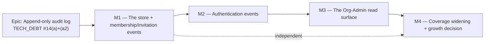

# Implementation Plan: Append-only audit log

- **Feature spec:** [`./feature-spec.md`](./feature-spec.md)
- **Status:** Draft (awaiting approval — no code is written until the spec is approved,
  CLAUDE.md §21)
- **Owner:** _TBD_

> **Reading note.** Milestones are ordered so the **hardest decision is exercised first**:
> M1 carries the transactional semantics (in-transaction success, out-of-transaction
> denial) against the simplest producer. The store is producer-agnostic, so if the product
> owner prefers authentication first (CQ-6), M1 and M2 swap with no rework beyond the order
> of two PRs.

## Breakdown

### Epic

**Append-only audit log** — make `docs/SECURITY_STANDARDS.md`'s published commitment true:
a durable, before→after, database-enforced append-only record of security-sensitive events,
closing `docs/TECH_DEBT.md` #14(a) and #14(a2). Roadmap theme: the security/governance
strand of `docs/BACKLOG.md`.

**Out of scope for the whole epic**, restated so it is not quietly absorbed: #14(b) (the
Better Auth in-process rate-limit store — belongs with TECH_DEBT #49 and ADR-0010) and
#14(c) (unencrypted `accounts` OAuth token columns — belongs with enabling a social
provider). Neither is audit-log work.

---

## Milestone 1 — The store, and membership/invitation events

**Outcome:** every membership role change, removal, invitation create/revoke/accept and
organisation creation writes a durable, before→after audit row in the **same transaction**
as the change; the database itself refuses to update, delete or truncate those rows. No
user-visible change. Ships behind no flag — a `VITE_` constant is a client build-time value
and cannot gate a server-side record (the ADR-0060 M0 reasoning), and there is no UI to
gate.

---

#### Feature: The `audit_events` store

> **Description:** the table, its constraints, the append-only trigger, and the
> `AuditService` seam every producer will use.
> **Complexity:** **L**
> **Dependencies:** none. Additive; no existing table is altered.
> **Risks:**
>
> - _The trigger trips `prisma:check-drift` (a TECH_DEBT #54 repeat)_ → **already measured
>   as false** (spec §4: `prisma migrate diff` output is byte-identical with and without a
>   trigger). Task 1 re-runs the check as its own acceptance step so the claim is pinned in
>   CI rather than in a paragraph.
> - _The trigger is disabled or dropped by a future migration without anyone noticing_ →
>   the API-level append-only test (Task 3) fails loudly, and it runs against a real
>   Postgres in CI.
> - _`ck_audit_events_actor_shape` blocks a legitimate future actor kind_ → that is the
>   `ELSE false` design working as intended (fail-closed, ADR-0046); the fix is a one-branch
>   CHECK amendment, which the migration comment names explicitly.
> - _The JSONB precedent is read as "JSON columns are fine now"_ → the ADR and the
>   `docs/DATABASE.md` amendment both state the narrow rule (open-ended, never queried,
>   never computed, shape + size CHECKed).
>
> **Testing requirements:** unit (the redactor, the event builders, the action-vocabulary
> lock-step test); API/Supertest against real Postgres (the append-only proof — the one test
> that cannot be written any other way).

##### Task 1.1 — Prisma model + migration (table, enums, constraints, index)

- **Description:** add the `AuditEvent` Prisma model (`@@map("audit_events")`) and the
  hand-written migration. Prisma-expressible parts are generated; the four CHECKs and the
  partial index are raw SQL appended to the same migration, with a documenting comment in
  the model and **no** `@@index` declaration for the partial (the TECH_DEBT #54 rule).
- **Complexity:** **M**
- **Dependencies:** none
- **Risks:** _a wrong `@db` type (e.g. `Timestamptz(3)` vs `(6)`) diverges from every
  sibling_ → copy `PlanShare`'s column annotations verbatim; the drift check catches the
  rest.
- **Testing:** `prisma validate`; `prisma migrate diff --exit-code` clean against a freshly
  migrated database; a migration-applies-cleanly step in the existing API e2e bootstrap.
- **Development steps:**
  1. Model `AuditEvent` per the spec's ERD: UUID v7 PK, `occurred_at timestamptz(3) NOT NULL
DEFAULT now()`, **nullable** `organization_id` (`RESTRICT` FK), `action text`,
     `outcome`/`actor_type` Postgres enums, `actor_user_id`/`actor_label`/`subject_type`/
     `subject_id`/`subject_label` text, `changes jsonb?`, `correlation_id text?`,
     `ip_address` (`@db.Inet`), `user_agent text?`.
  2. Write the model docblock in the `PlanLock` register — **which house columns are absent
     and why** (`updated_at`/`updated_by`/`version`/`deleted_at`/`delete_batch_id`), so a
     future reader does not "fix" it into the standard shape.
  3. Generate the migration; append the raw SQL: `ck_audit_events_actor_shape` (fail-closed
     `CASE … ELSE false`), `ck_audit_events_action_format`,
     `ck_audit_events_changes_object`, `ck_audit_events_changes_size`, and
     `CREATE INDEX idx_audit_events_org_occurred ON audit_events (organization_id,
occurred_at DESC, id DESC) WHERE organization_id IS NOT NULL`.
  4. Put the **measurements** in the migration comment (638 B/row; 0.271 ms for a 50-row org
     page at 200 k rows; the deferred `action` composite at 43 MB / 0.297 ms vs 0.939 ms
     typical / 28.4 ms worst case) — the ADR-0053 M4 rule that an index is added on a
     measurement, and the ADR-0065 rule that the measurement is recorded where the next
     reader will find it.
  5. Update `docs/DATABASE.md`: a new `AuditEvent` section, the two index rows, the JSONB
     house-rule amendment, and — separately flagged in the PR — the correction to the
     soft-delete paragraph that claims a Prisma extension enforces `deleted_at` centrally
     (verified: no `$extends`/`$use` exists anywhere in `apps/api/src`).

##### Task 1.2 — The append-only trigger

- **Description:** a `plpgsql` function raising `0A000` and two triggers on `audit_events`
  (`BEFORE UPDATE OR DELETE … FOR EACH ROW`, `BEFORE TRUNCATE … FOR EACH STATEMENT`), both
  set `ENABLE ALWAYS`. **Its own migration**, so a revert is a one-line, reviewable act
  rather than a table drop.
- **Complexity:** **S** (small diff, large consequence)
- **Dependencies:** Task 1.1
- **Risks:**
  - _`session_replication_role = replica` bypass_ → `ENABLE ALWAYS`. (Measured: a
    non-superuser cannot set that GUC; the shipped Compose role **is** a superuser, so the
    hardening is not theoretical.)
  - _A reviewer reads it as "business logic in a trigger", which `docs/DATABASE.md` warns
    against_ → the migration comment states the distinction: this encodes no domain rule, it
    is a constraint Postgres has no declarative syntax for — the `EXCLUDE`-constraint
    category, not the stored-procedure category.
- **Testing:** covered by Task 3's API-level proof; nothing meaningful can be unit-tested
  here.
- **Development steps:**
  1. `CREATE FUNCTION audit_events_append_only() RETURNS trigger` raising a message that
     names `TG_OP`, so a violation's log line says which operation was attempted.
  2. Create both triggers; `ALTER TABLE audit_events ENABLE ALWAYS TRIGGER …` for each.
  3. Comment the migration with the three measured facts from spec §4: `REVOKE` denies even
     the owner but is re-granted in one statement; the Compose role is a superuser and
     bypasses privileges; the trigger is invisible to `prisma migrate diff`.
  4. Run `pnpm --filter @repo/api prisma:check-drift` and record the clean result in the PR.

##### Task 1.3 — `common/audit/`: the service, the vocabulary, the redactor

- **Description:** `AuditService.record(client, event)` accepting either a
  `Prisma.TransactionClient` or the `PrismaService` (so an in-transaction and a standalone
  write are the same call), the `AuditAction` union in `@repo/types`, and the allow-list
  redactor that builds `changes`.
- **Complexity:** **M**
- **Dependencies:** Task 1.1
- **Risks:**
  - _A caller passes a raw entity and leaks a field_ → the redactor takes an **allow-list per
    action**, not a deny-list; an unknown field is dropped, and dropping is the default.
  - _The payload grows past the CHECK and 500s_ → the service truncates and marks the payload
    truncated **before** the insert; a unit test drives an oversized payload.
  - _`ip_address` is taken from a raw header and is spoofable_ → read it through Express's
    already-configured `trust proxy` (`app-setup.ts`, `TRUSTED_PROXY_IPS`), never
    `req.headers['x-forwarded-for']`. A unit test asserts the resolution path.
- **Testing:** unit — redactor allow-list (including "unknown field is dropped"),
  truncation, correlation-id pass-through, `actor_type` derivation from
  `Principal`/`GuestPrincipal`/absent; a lock-step test asserting the `AuditAction` union
  and the actions the services emit are the same set (the `seed-vocabulary.spec.ts` /
  `dependency-type.spec.ts` pattern).
- **Development steps:**
  1. `packages/types` — the `AuditAction` const union + `AuditOutcome`/`AuditActorType`
     unions structurally identical to Prisma's generated `$Enums` (the `OrganizationRole`
     precedent: a const object + union, not a TS `enum`).
  2. `common/audit/audit.service.ts` — one `record()`; no overloads that could diverge.
  3. `common/audit/redact.ts` — `ALLOWED_FIELDS: Record<AuditAction, readonly string[]>`,
     exhaustively keyed so a new action without an allow-list is a **compile error**.
  4. `common/audit/audit.module.ts` — `@Global()`, like `AuthModule`, so a producer needs no
     import wiring it could forget.
  5. Extract the request-context reader (correlation id, IP, user agent) into one helper so
     three producers cannot each resolve it slightly differently.

##### Task 1.4 — The structural coverage gate

- **Description:** the test that replaces the "an interceptor cannot be forgotten" argument.
  It enumerates the M1 catalogue and fails if an action in the vocabulary has no emitting
  service, or a service emits an action not in the vocabulary.
- **Complexity:** **S**
- **Dependencies:** Task 1.3
- **Risks:** _the test becomes a list nobody updates_ → it is derived from the exhaustively
  keyed `ALLOWED_FIELDS` record, so extending the vocabulary without an emitter is already a
  compile error and this test catches the reverse.
- **Testing:** it **is** the test. Verify it fails when an emitter is commented out.
- **Development steps:**
  1. `common/audit/audit-catalogue.structural.test.ts`, modelled on
     `common/contracts/seed-vocabulary.spec.ts`.
  2. Prove it fails against the pre-fix state before landing it (the ADR-0064 rule: every
     regression test is verified to fail first).

---

#### Feature: Membership, invitation and organisation events

> **Description:** the six (or eight, with CQ-3) M1 producers, each an explicit
> `AuditService.record(tx, …)` call inside the transaction it already opens.
> **Complexity:** **M**
> **Dependencies:** the store feature above.
> **Risks:**
>
> - _The `before` value is read outside the lock and is stale_ → each service already
>   re-reads the row **inside** its `$transaction` after taking the per-org advisory lock
>   (`members.service.ts:70`); the audit `before` must use **that** read, not the
>   pre-transaction existence check on line 63. This is the exact defect ADR-0063 M6 found in
>   `dissolve` (a snapshot taken before the lock that makes it safe) and it is the single
>   most likely bug in this milestone.
> - _A `DENIED` row is written inside the failing transaction and rolls back with it_ → the
>   denial path writes in its **own** transaction, by construction; an API test drives a 403
>   and a 409 and asserts a row exists.
> - _`invitation.created` leaks the token_ → the allow-list for that action contains `email`
>   and `role` and nothing else; a unit test asserts the token and its hash are absent from
>   the payload.
>
> **Testing requirements:** API/Supertest against real Postgres per event; the atomicity
> test (roll back the change ⇒ no `SUCCESS` row); the denial test (403/409 ⇒ exactly one
> `DENIED` row).

##### Task 2.1 — `MembersService`: `member.role_changed`, `member.removed`

- **Description:** record both, with the role **before** and after, taken from the
  in-transaction, post-lock read.
- **Complexity:** **S**
- **Dependencies:** Task 1.3
- **Risks:** see the stale-`before` risk above.
- **Testing:** API — a role change writes one row with the correct before→after; a
  last-Org-Admin 409 writes one `DENIED` row and no `SUCCESS` row; a Planner's 403 writes one
  `DENIED` row.
- **Development steps:**
  1. Capture `member.role` from the post-lock read (`members.service.ts:70`), not line 63.
  2. `record(tx, …)` after `updateRoleIfVersionMatches` succeeds and before the transaction
     closes.
  3. Same for `remove`, carrying the removed member's role at the time.
  4. Leave the existing `logger.info` lines in place — the operational log and the audit log
     are different records with different lifetimes (`docs/OBSERVABILITY.md`), and deleting
     one because the other landed would be a regression in incident response.

##### Task 2.2 — `InvitationsService`: `invitation.created` / `.revoked` / `.accepted`, `member.joined`

- **Description:** four events across three methods; accept emits **two** rows (the
  invitation transitioning and the membership being created) sharing one `correlation_id`.
- **Complexity:** **M**
- **Dependencies:** Task 2.1 (shares the pattern)
- **Risks:** _accept's two rows drift apart if the second is written outside the
  transaction_ → both go inside the existing `$transaction` (`invitations.service.ts:189`).
- **Testing:** API — create/revoke/accept each write their row; accept writes exactly two
  sharing a correlation id; the created row's payload contains no token.
- **Development steps:**
  1. `create` → `invitation.created` (`{email, role}`).
  2. `revoke` → `invitation.revoked`.
  3. `accept` → `invitation.accepted` **and** `member.joined`, both inside the transaction.
  4. Extend the existing service unit specs rather than adding parallel ones.

##### Task 2.3 — `OrganizationsService`: `organization.created`

- **Description:** the tenancy root's creation, and the founding Org-Admin membership.
- **Complexity:** **S**
- **Dependencies:** Task 1.3
- **Risks:** _scope creep beyond #14's letter_ → it is one call at a seam already being
  touched, and it is the origin of every other org-scoped event; flagged in the PR as a
  deliberate addition.
- **Testing:** API — creating an organisation writes `organization.created` and
  `member.joined`.

##### Task 2.4 _(CQ-3, default **include**)_ — `ShareService`: `share.link_created` / `.revoked`

- **Description:** two events on the ADR-0051 share-link management path.
- **Complexity:** **S**
- **Dependencies:** Task 1.3
- **Risks:** _the raw token or its hash reaches the payload_ → allow-list is `{planId,
label, expiresAt}`; a unit test asserts both token forms are absent. This is the same
  matching-oracle concern the spec's "not stored" list names.
- **Testing:** API — create and revoke each write one row; neither payload contains the
  token or `token_hash`.
- **Note:** beyond #14's letter, included because authorising data egress **outside the
  tenant boundary** is the highest-value non-authentication security event in the product —
  which is exactly why ADR-0051 made `plan:share` a governance permission. Strike this task
  if the product owner prefers strict #14 scope; nothing else changes.

##### Task 2.5 — Documentation + changeset

- **Description:** the docs half of the milestone, which is part of the change and not a
  follow-up (CLAUDE.md §6).
- **Complexity:** **S**
- **Dependencies:** Tasks 1.1–2.4
- **Testing:** `pnpm check:doc-links`.
- **Development steps:**
  1. `docs/SECURITY_STANDARDS.md` — replace the "_not yet implemented_" heading with what
     shipped, **including the trigger's honest limit** (append-only against accident and
     ordinary application code; not tamper-proof against a compromised application role) and
     the normative "not stored" list.
  2. `docs/OBSERVABILITY.md` — the audit log exists; note the `correlation_id` join.
  3. `docs/TECH_DEBT.md` — narrow #14 to (a) only for now; split (b) and (c) into their own
     rows so #14 can be closed rather than left half-open.
  4. `CLAUDE.md` §16 (the ADR) and §17 (the "no append-only audit log exists" limitation).
  5. A changeset — user-visible in the security sense even with no UI.

---

## Milestone 2 — Authentication events

**Outcome:** sign-up, sign-in, failed sign-in, sign-out and email verification are recorded
with source address and user agent, closing the half of #14 for which **no record exists
anywhere today**.

---

#### Feature: The Better Auth hook adapter

> **Description:** the producer for events the Nest pipeline structurally cannot see, and
> the **fail-open** failure policy that distinguishes it from every M1 producer.
> **Complexity:** **M**
> **Dependencies:** M1 (the store)
> **Risks:**
>
> - _An audit failure locks users out of the product_ → **fail open**, logged at `error`.
>   This is the deliberate asymmetry with M1's fail-closed domain path; both the ADR and the
>   code comment must say so, or a future reader will "fix" one into the other.
> - _The hook seam does not expose what is needed (the IP, the outcome, the attempted
>   address on failure)_ → **this is the milestone's real risk and it is a research task**;
>   Task 3.1 exists to establish the seam's actual surface before any producer is written,
>   rather than designing against the documentation (ADR-0058).
> - _A failed sign-in becomes an account-existence oracle_ → the log is internal and org-less
>   rows are unreadable via the API at every role; the HTTP response is unchanged. The
>   attempted address is recorded (CQ-4); the attempted password never is.
> - _Better Auth's own retry/rate-limit path emits duplicate events_ → the API-level test
>   asserts the row **count**, not merely presence.
>
> **Testing requirements:** API/Supertest driving the real `/api/auth/*` routes (the only
> way to test this — a mocked handler proves nothing about a raw-Express mount).

##### Task 3.1 — Establish the hook seam (research + spike, no production code)

- **Description:** determine empirically which of `databaseHooks` / `hooks` fires for each
  target event, what each receives, and whether the resolved client IP is reachable there.
- **Complexity:** **M**
- **Dependencies:** M1
- **Risks:** _the seam cannot supply an event we promised_ → the answer changes the M2
  catalogue **before** it is written down, which is the point of doing this first.
- **Testing:** a throwaway spec printing each hook's payload against the real handler.
- **Development steps:**
  1. Instrument `createAuth` in a scratch branch; drive sign-up / sign-in / bad-password /
     sign-out / verify.
  2. Record the findings **in the ADR**, including anything the seam cannot supply — the
     ADR-0064 discipline of recording what was measured and what could not be reproduced.

##### Task 3.2 — The adapter

- **Description:** wire `AuditService` into the auth factory through a **callback**, not a
  Nest dependency — matching how `sendVerificationEmail` is already threaded, so
  `createAuth` stays a pure function of its options and never learns about Nest DI.
- **Complexity:** **M**
- **Dependencies:** Task 3.1
- **Risks:** _the auth factory acquires a second concern and drifts from its docblock_ → one
  callback, mirroring the existing mail one exactly.
- **Testing:** API — each of the five events writes exactly one row with
  `organization_id IS NULL`, the correct `actor_type`, IP and user agent; a forced audit
  failure leaves sign-in **succeeding** and emits an `error` log.
- **Development steps:**
  1. Add `recordAuthEvent` to `CreateAuthOptions`, beside `sendVerificationEmail`.
  2. Bind it in `AuthModule`'s factory.
  3. Wrap every call in the fail-open guard, with the reason in the comment — not just the
     behaviour.

##### Task 3.3 — Docs

- **Complexity:** **S**
- **Development steps:** `docs/SECURITY_STANDARDS.md` (the auth catalogue and the fail-open
  asymmetry); `docs/TECH_DEBT.md` — **close #14** once (b) and (c) are their own rows.

---

## Milestone 3 — The Org-Admin read surface

**Outcome:** an Org Admin can read their organisation's audit events in the product.

---

#### Feature: `audit:read` + the read endpoint

> **Description:** a new permission code (Org Admin only), one cursor-paginated `GET`, and
> the `action` index the filter earns.
> **Complexity:** **M**
> **Dependencies:** M1
> **Risks:**
>
> - _The endpoint implies completeness while omitting org-less auth events_ → the empty and
>   populated states both say so in copy; the OpenAPI description says so. This is the
>   ADR-0058 failure mode named in the spec.
> - _`audit:read` gets folded into a bundle and silently widens_ → it is granted as its own
>   const to `ORG_ADMIN` only, never added to `HIERARCHY_READ`/`ADMIN`; a unit test asserts
>   Planner/Contributor/Viewer do **not** hold it.
> - _IP addresses become a casual read_ → they are in the response because they are the
>   point; the permission is the control, and the security review at this milestone is not
>   optional.
>
> **Testing requirements:** API — 403 for Planner/Contributor/Viewer, 404 for a non-member,
> 200 + correct ordering/cursor for Org Admin; a cross-org IDOR attempt returns 404.

##### Task 4.1 — Permission + endpoint

- **Complexity:** **M**
- **Dependencies:** M1
- **Testing:** as above, plus an OpenAPI snapshot.
- **Development steps:**
  1. `org-permissions.ts` — `'audit:read'` in a dedicated `AUDIT_READ` const granted to
     `ORG_ADMIN` alone, with the comment explaining why it is narrower than every read
     sibling (the `cost:read` precedent).
  2. `modules/audit/` built to the `modules/clients` canonical shape (ADR-0057): thin
     controller → service → repository, `{ data, meta }` envelope, cursor pagination,
     `resolveScope` first.
  3. Filters: `action`, `actorUserId`, `occurredAfter`/`Before` — **or fewer**; ship only
     what the screen uses.

##### Task 4.2 — The `action` index, if and only if the filter ships

- **Complexity:** **S**
- **Dependencies:** Task 4.1
- **Risks:** _adding it on instinct_ → the spec already measured both plans; re-measure at
  the organisation's real row count before adding, and record the number in the migration
  comment (`docs/PERFORMANCE.md`, ADR-0053 M4).
- **Testing:** an `EXPLAIN ANALYZE` recorded in the PR.

##### Task 4.3 — The web surface

- **Complexity:** **M**
- **Dependencies:** Task 4.1
- **Risks:** _a table that renders raw JSON_ → each action gets a rendered sentence built
  from its allow-listed fields; an unknown action degrades to action + actor + timestamp
  rather than dumping the payload.
- **Testing:** component + a11y (the table announces its settled result count — WCAG 4.1.3,
  the ADR-0053 M6 finding); a flag-on Playwright journey if the surface ships behind a flag.

---

## Milestone 4 — Coverage widening, and the growth decision

**Outcome:** the catalogue reaches the mutation surface, and the partitioning/retention
question is answered **on a measurement** rather than pre-emptively.

---

#### Feature: Mutation events (deferred from M1 by design)

> **Description:** hierarchy deletes/restores, library writes (calendar/resource), and
> interchange import/export.
> **Complexity:** **XL** — larger than M1–M3 combined, which is why it is deferred.
> **Dependencies:** M1
> **Risks:**
>
> - _Volume_ — two to three orders of magnitude above M1/M2. Gate this milestone on the
>   partitioning task below.
> - _Auditing the recalculation_ → **forbidden by the ADR.** A recalc is a derivation from
>   already-audited inputs; the auditable act is "Jane pressed Recalculate" (one row, at the
>   controller seam), never the 2,000 rows ADR-0022's batched engine `UPDATE` then rewrote.
>   A structural test should assert no audit write occurs on the recalc path.
> - _A cascade delete emits one row per swept row_ → one event per **user action**, carrying
>   the `CascadeCounts` and the `delete_batch_id` in `changes`. The batch id makes the event
>   joinable to exactly the rows affected — the existing mechanism doing the work an audit
>   payload would otherwise duplicate.

##### Task 5.1 — Partitioning / retention decision (**gates 5.2**)

- **Description:** measure the live table, then decide.
- **Complexity:** **M**
- **Risks:** _partitioning without a partition-creating mechanism_ → a missing partition
  makes every `INSERT` fail, and the domain path is fail-closed, so that is an **outage of
  every audited action**, not a degraded log. Do not ship partitioning until something
  creates partitions (ADR-0009's scheduler, or `pg_partman`, or a documented operator
  runbook — and the deployment target must be decided first, TECH_DEBT #5).
- **Development steps:**
  1. Measure the production table's row count and size.
  2. If conversion is warranted, note it is a **table rewrite** (the partition key must join
     the primary key) and plan it expand/contract.
  3. Record that retention is `DETACH PARTITION`, never `DELETE` — the trigger refuses
     `DELETE` **by design**, which makes partitioning the mechanism and not an optimisation.

##### Task 5.2 — Mutation producers

- **Complexity:** **XL**; slice per domain, one PR each.
- **Dependencies:** Task 5.1

---

## Sequencing & slices

1. **M1** — store + trigger + `AuditService` + membership/invitation producers + docs.
   Releasable on its own; closes #14(a2). No flag (nothing to gate).
2. **M2** — the auth hook adapter. Releasable on its own; closes #14(a) and, with (b)/(c)
   split out, **closes #14**.
3. **M3** — `audit:read` + endpoint + web surface. Behind `VITE_AUDIT_LOG` (default off)
   until its security and accessibility reviews land, per the house flag discipline.
4. **M4** — gated on Task 5.1's measurement.

M1 and M2 may be reordered (CQ-6) at no cost: the store does not know its producers. M3
requires M1 only. M4 requires M1 and the measurement.

## Definition of Done (per task)

Each task's PR must satisfy the Feature Completion Criteria in
[`docs/PROCESS.md`](../../PROCESS.md) — code, tests, docs, security review, performance,
accessibility, Docker build, CI, changeset, version impact. Specifically for this epic:

- **The pre-push gate is run, not assumed** (CLAUDE.md §19.7): `pnpm lint && pnpm typecheck
&& pnpm test`, **plus `scripts/e2e-local.sh api`** for every task in M1–M2 — all of them
  touch `apps/api`, and the append-only proof and the transactional-atomicity proof exist
  only at that level.
- **`pnpm --filter @repo/api prisma:check-drift` is run and its clean result stated** in
  every PR that touches the schema or a migration.
- **Every regression test is verified to fail against the pre-fix code first** (ADR-0064).
- **A security review** on M1 (the store, the redactor, the trigger) and again on M3 (the
  read egress). Not optional: this feature _is_ a security control.

## Risks & assumptions (rollup)

| Risk / assumption                                                                             | Likelihood | Impact   | Mitigation                                                                                                                                                                            |
| --------------------------------------------------------------------------------------------- | ---------- | -------- | ------------------------------------------------------------------------------------------------------------------------------------------------------------------------------------- |
| The trigger is read as absolute immutability and the honest limit is lost in a later doc edit | **med**    | **high** | The limit is a numbered sentence in `docs/SECURITY_STANDARDS.md` **and** in the ADR **and** in the migration comment. Three places, one claim.                                        |
| A future migration drops or disables the trigger                                              | low        | **high** | The API-level append-only test runs in CI against real Postgres and fails loudly.                                                                                                     |
| The `before` value is captured outside the lock (the ADR-0063 `dissolve` defect, repeated)    | **med**    | med      | Named explicitly in Task 2.1; a review checklist item; an API test asserting before→after under concurrent writes.                                                                    |
| The Better Auth hook seam cannot supply an event M2 promises                                  | **med**    | med      | Task 3.1 establishes the seam empirically **before** any producer is written; findings recorded in the ADR including what it cannot do.                                               |
| A secret reaches `changes`                                                                    | low        | **high** | Allow-list (never deny-list), exhaustively keyed so a new action without one is a compile error; unit tests asserting token absence on the two token-bearing actions.                 |
| M4's volume arrives before partitioning is considered                                         | med        | med      | Task 5.1 gates Task 5.2 explicitly.                                                                                                                                                   |
| Fail-closed on the domain path turns a full disk into a product-wide outage                   | low        | **high** | Accepted deliberately (a change that cannot be recorded must not happen), but it is the reason M4's growth question is gated rather than assumed away.                                |
| **Assumption:** the app's DB role owns `audit_events` in every environment                    | high       | med      | True for the Compose stack and the dev database (verified). If a managed Postgres separates owner from writer, that is the _better_ case — it enables the restricted-role escalation. |
| **Assumption:** orgs are never hard-deleted, so `organization_id`'s `RESTRICT` FK never fires | high       | low      | True today (no hard-delete path exists anywhere). When an erasure path lands it must address the audit log **explicitly** — which is the intended outcome, not a regression.          |
