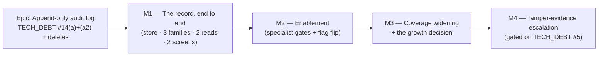

# Implementation Plan: Append-only audit log

- **Feature spec:** [`./feature-spec.md`](./feature-spec.md)
- **ADR:** [`../../adr/0072-append-only-audit-log.md`](../../adr/0072-append-only-audit-log.md)
- **Status:** Draft (awaiting approval — no code is written until the spec is approved,
  CLAUDE.md §21)
- **Owner:** _TBD_

> **Reading note — what changed from the first draft.** The earlier plan split this into a
> write-only M1, an auth-only M2 and a read-only M3. The product owner has since decided that
> **M1 is a full vertical slice**: the store, all three event families' writes, the paginated
> Org-Admin read, and a screen. That is what M1 is below. It is a large milestone, so its
> **tasks** are the releasable unit — every one of the twelve leaves `main` releasable on its
> own (the store is dark; a producer only adds rows; the endpoints are additive; the screens are
> behind a default-off flag).
>
> **M2 is the enablement milestone** — the specialist gates over the combined diff and the flag
> flip — because that is how this repository has shipped every user-visible epic since ADR-0063,
> and because five of the last six enablement passes found defects that had already passed a
> human read.

## Breakdown

### Epic

**Append-only audit log** — make `docs/SECURITY_STANDARDS.md`'s published commitment true: a
durable, before→after, database-enforced append-only record of security-sensitive events,
readable in the product by the people entitled to read it. Closes `docs/TECH_DEBT.md` #14(a) and
#14(a2). Roadmap theme: the security/governance strand of `docs/BACKLOG.md`.

**Out of scope for the whole epic**, restated so it is not quietly absorbed: #14(b) (the Better
Auth in-process rate-limit store — belongs with TECH_DEBT #49 and ADR-0010) and #14(c)
(unencrypted `accounts` OAuth token columns — belongs with enabling a social provider). Neither
is audit-log work; both get their own TECH_DEBT rows in Task 1.12 so #14 can be **closed**.

---

## Milestone 1 — The record, end to end

**Outcome:** every membership/invitation change, every authentication event, and every
client/project/plan delete or restore writes a durable, before→after audit row that the database
itself refuses to update, delete or truncate. An Org Admin can read their organisation's log and
any user can read their own account security activity — both behind `VITE_AUDIT_LOG`, default
off. Forgetting to audit a new mutating endpoint fails CI.

**Flag:** `VITE_AUDIT_LOG`, **default off**. Note the asymmetry, stated so nobody expects
otherwise: a `VITE_` constant is a client build-time value and **cannot gate a server-side
record** (the ADR-0060 M0 reasoning). The **writes go live with M1** and are not behind any flag;
only the two screens are gated. That is deliberate — the value of an audit log is the events it
captured while nobody was looking at it, and a gated writer would capture nothing.

---

#### Feature: The `audit_events` store and the write seam

> **Description:** the table, its constraints, the append-only trigger, the `AuditService`
> seam every producer uses, the request-context decorator, and the coverage gate.
> **Complexity:** **L**
> **Dependencies:** none. Additive; no existing table is altered.
> **Risks:**
>
> - _The trigger trips `prisma:check-drift` (a TECH_DEBT #54 repeat)_ → **already measured as
>   false** (spec §4: `prisma migrate diff` output is byte-identical with and without a trigger).
>   Task 1.2 re-runs the check as an explicit acceptance step so the claim is pinned in CI rather
>   than in a paragraph.
> - _The trigger is disabled or dropped by a future migration without anyone noticing_ → the
>   API-level append-only test (Task 1.2) runs against real Postgres in CI and fails loudly.
> - _`ck_audit_events_actor_shape` blocks a legitimate future actor kind_ → that is the
>   `ELSE false` design working as intended (fail-closed, ADR-0046); the fix is a one-branch CHECK
>   amendment, which the migration comment names explicitly.
> - _The JSONB precedent is read as "JSON columns are fine now"_ → ADR-0072 and the
>   `docs/DATABASE.md` amendment both state the narrow rule (open-ended, never queried, never
>   computed, shape + size CHECKed).
>
> **Testing requirements:** unit (redactor, event builders, vocabulary lock-step, IP resolution);
> API/Supertest against real Postgres (the append-only proof — the one test that cannot be written
> any other way); the four structural gates.

##### Task 1.1 — Prisma model + migration (table, enums, constraints, org index)

- **Description:** add the `AuditEvent` Prisma model (`@@map("audit_events")`) and the
  hand-written migration. Prisma-expressible parts are generated; the four CHECKs and the partial
  index are raw SQL appended to the same migration, with a documenting comment in the model and
  **no** `@@index` declaration for anything Prisma cannot express (the TECH_DEBT #54 rule).
- **Complexity:** **M**
- **Dependencies:** none
- **Risks:** _a wrong `@db` type (e.g. `Timestamptz(3)` vs `(6)`) diverges from every sibling_ →
  copy `PlanShare`'s column annotations verbatim; the drift check catches the rest.
- **Testing:** `prisma validate`; `prisma migrate diff --exit-code` clean against a freshly
  migrated database; a migration-applies-cleanly step in the existing API e2e bootstrap.
- **Development steps:**
  1. Model `AuditEvent` per the spec's ERD: UUID v7 PK, `occurred_at timestamptz(3) NOT NULL
DEFAULT now()`, **nullable** `organization_id` (`RESTRICT` FK), `action text`,
     `outcome`/`actor_type` Postgres enums, `actor_user_id` / `actor_label` / `subject_type` /
     `subject_id` / `subject_label` text, `changes jsonb?`, `correlation_id text?`, `ip_address`
     (`@db.Inet`), `user_agent text?`.
  2. Write the model docblock in the `PlanLock` register — **which house columns are absent and
     why** (`updated_at` / `updated_by` / `version` / `deleted_at` / `delete_batch_id`) — so a
     future reader does not "fix" it into the standard shape.
  3. Generate the migration; append the raw SQL: `ck_audit_events_actor_shape` (fail-closed
     `CASE … ELSE false`), `ck_audit_events_action_format`, `ck_audit_events_changes_object`,
     `ck_audit_events_changes_size`, and `CREATE INDEX idx_audit_events_org_occurred ON
audit_events (organization_id, occurred_at DESC, id DESC) WHERE organization_id IS NOT NULL`.
  4. Put the **measurements** in the migration comment (638 B/row; 0.271 ms for a 50-row org page
     at 200 k rows; the deferred `action` composite at 43 MB / 0.297 ms vs 0.939 ms typical /
     28.4 ms worst case) — the ADR-0053 M4 rule that an index is added on a measurement, and the
     ADR-0065 rule that the measurement is recorded where the next reader will find it.
  5. Update `docs/DATABASE.md`: a new `AuditEvent` section, the index rows, the JSONB house-rule
     amendment, and — **separately flagged in the PR** — the correction to the soft-delete
     paragraph that claims a Prisma extension enforces `deleted_at` centrally (verified: no
     `$extends`/`$use` exists anywhere in `apps/api/src`).

##### Task 1.2 — The append-only trigger, and the proof

- **Description:** a `plpgsql` function raising `0A000` and two triggers on `audit_events`
  (`BEFORE UPDATE OR DELETE … FOR EACH ROW`, `BEFORE TRUNCATE … FOR EACH STATEMENT`), both set
  `ENABLE ALWAYS`. **Its own migration**, so a revert is a one-line reviewable act rather than a
  table drop. Ships with the API-level test that proves it.
- **Complexity:** **S** (small diff, large consequence)
- **Dependencies:** Task 1.1
- **Risks:**
  - _`session_replication_role = replica` bypass_ → `ENABLE ALWAYS`. (Measured: a non-superuser
    cannot set that GUC; the shipped Compose role **is** a superuser, so the hardening is not
    theoretical.)
  - _A reviewer reads it as "business logic in a trigger", which `docs/DATABASE.md` warns
    against_ → the migration comment states the distinction: this encodes no domain rule, it is a
    constraint Postgres has no declarative syntax for — the `EXCLUDE`-constraint category, not the
    stored-procedure category.
- **Testing:** an API/Supertest spec that inserts a row, then issues raw `UPDATE`, `DELETE` and
  `TRUNCATE` **through the application's own `PrismaService`** (i.e. as the app's real DB role) and
  asserts all three raise; and that `INSERT` still succeeds.
- **Development steps:**
  1. `CREATE FUNCTION audit_events_append_only() RETURNS trigger` raising a message that names
     `TG_OP`, so a violation's log line says which operation was attempted.
  2. Create both triggers; `ALTER TABLE audit_events ENABLE ALWAYS TRIGGER …` for each.
  3. Comment the migration with the three measured facts from spec §4: `REVOKE` denies even the
     owner but is re-granted in one statement; the Compose role is a superuser and bypasses
     privileges; the trigger is invisible to `prisma migrate diff`.
  4. Run `pnpm --filter @repo/api prisma:check-drift` and **state the clean result in the PR**.

##### Task 1.3 — `common/audit/`: the service, the vocabulary, the redactor, the IP helper

- **Description:** `AuditService.record(client, event)` accepting either a
  `Prisma.TransactionClient` or the `PrismaService` (so an in-transaction and a standalone write
  are the same call), the `AuditAction` union in `@repo/types`, the allow-list redactor, and the
  shared client-IP resolver.
- **Complexity:** **M**
- **Dependencies:** Task 1.1
- **Risks:**
  - _A caller passes a raw entity and leaks a field_ → the redactor takes an **allow-list per
    action**, not a deny-list; an unknown field is dropped, and dropping is the default.
  - _The payload grows past the CHECK and 500s_ → the service truncates and marks the payload
    truncated **before** the insert; a unit test drives an oversized payload.
  - _`ip_address` is taken from a raw header and is spoofable_ → one shared resolver over
    `TRUSTED_PROXY_IPS`, never `req.headers['x-forwarded-for']` directly. A unit test asserts the
    resolver agrees with what Express's `trust proxy` produces for the same inputs — the two
    consumers (Nest and the Better Auth adapter) must not disagree about which hop is the client.
- **Testing:** unit — redactor allow-list (including "unknown field is dropped"), truncation,
  correlation-id pass-through, `actor_type` derivation from `Principal` / `GuestPrincipal` /
  absent, IP resolution; plus a lock-step test asserting the `AuditAction` union and the Prisma
  enums are in step (the `seed-vocabulary.spec.ts` / `dependency-type.spec.ts` pattern).
- **Development steps:**
  1. `packages/types` — the `AuditAction` const union + `AuditOutcome` / `AuditActorType` unions,
     structurally identical to Prisma's generated `$Enums` (the `OrganizationRole` precedent: a
     const object + union, not a TS `enum`).
  2. `common/audit/audit.service.ts` — **one** `record()`; no overloads that could diverge.
  3. `common/audit/redact.ts` — the allow-list, exhaustively keyed by `AuditAction` so a new
     action without one is a **compile error**.
  4. `common/audit/client-ip.ts` — the shared resolver.
  5. `common/audit/audit.module.ts` — `@Global()`, like `AuthModule`, so a producer needs no
     import wiring it could forget.

##### Task 1.4 — `@RequestContext()` and the controller thread-through

- **Description:** a param decorator supplying `{ correlationId, ip, userAgent }` from the
  request, a direct sibling of `common/decorators/current-user.decorator.ts`, plus the one extra
  parameter on each audited controller handler.
- **Complexity:** **S**
- **Dependencies:** Task 1.3
- **Risks:** _it is tempting to reach for `AsyncLocalStorage` instead and "avoid touching
  signatures"_ → that seam does not exist in this app, would be its first, and would hide the
  dependency the explicit parameter makes visible. The visible parameter **is** the cost of
  decision 4 and is accepted deliberately.
- **Testing:** unit — the decorator resolves the pino `req.id`, `req.ip` and the truncated user
  agent; a request without a correlation id degrades to `null` rather than throwing.
- **Development steps:**
  1. `common/decorators/request-context.decorator.ts` + its type in `common/audit/`.
  2. Thread it into the ~13 M1 controller handlers only; **do not** touch handlers that emit no
     event (they are classified in Task 1.6 instead).

##### Task 1.5 — The seam catalogue

- **Description:** `common/audit/audit-catalogue.ts` — `AUDIT_SEAMS: Record<AuditAction,
AuditSeam>`, declaring for each action its owning service file, method, subject type and
  allow-listed fields. This is the single source both the redactor and the coverage gate read.
- **Complexity:** **S**
- **Dependencies:** Task 1.3
- **Risks:** _two catalogues drift (one for the redactor, one for the test)_ → there is **one**
  record; the redactor derives its allow-list from it.
- **Testing:** compile-time exhaustiveness is the first gate; a unit test asserts every declared
  service file exists on disk (so a rename fails here rather than silently disabling gate 2).

##### Task 1.6 — The coverage gate (the structural test) — **the one decision 4 asks for**

- **Description:** `common/audit/audit-coverage.structural.spec.ts`, on the
  `modules/calendars/calendar-seams.structural.spec.ts` precedent (source scan with `readFileSync`
  - regex, no database). Four gates; see spec §4 for exactly what each asserts and what none of
    them claims.
- **Complexity:** **M** — the test is small; **classifying the 67 existing mutating routes is
  the work.**
- **Dependencies:** Task 1.5, and the producers in Tasks 2.1–2.4 (land it last in the feature so
  gate 2 has calls to find)
- **Risks:**
  - _It becomes a list nobody updates_ → set **equality** in both directions means a stale entry
    fails as loudly as a missing one.
  - _It is over-trusted as proof that auditing happens_ → its docblock states the three things it
    cannot check (execution, reachability, and whether an `UNAUDITED_ROUTES` reason is a good
    one), and names the per-action API test as the execution proof.
  - _`UNAUDITED_ROUTES` becomes a dumping ground_ → each entry is a sentence, reviewed like any
    other code; entries deferred to M3 say so by name.
- **Testing:** it **is** the test. Each of the four gates is **verified to fail first** —
  comment out a `record` call (gate 2), add a throwaway `@Post` handler (gate 3), add an
  `audit.record` to `schedule.service.ts` (gate 4) — before the PR lands. ADR-0064's rule.
- **Development steps:**
  1. Gate 1 is already free (Task 1.5's exhaustive record).
  2. Gate 2 — for each seam, brace-match the named method's body out of its file; assert
     `audit.record(` and the action symbol appear in it.
  3. Gate 3 — scan `apps/api/src/modules/**/*.controller.ts` for `@Post|@Patch|@Put|@Delete`
     handlers; assert the census equals `AUDITED_ROUTES ∪ UNAUDITED_ROUTES` exactly. **Classify
     all 67 existing routes**, with a written reason for each unaudited one.
  4. Gate 4 — assert `modules/schedule/**` contains no `audit.record(`.
  5. Add a `docs/TESTING.md` paragraph on what the gate does and does not prove.

---

#### Feature: Family A — membership, invitation and organisation events

> **Description:** seven org-scoped events, each an explicit `AuditService.record(tx, …)` call
> inside the transaction the service already opens — except the two invitation methods, which do
> not have one today and gain one here.
> **Complexity:** **M**
> **Dependencies:** the store feature above.
> **Risks:**
>
> - _The `before` value is read outside the lock and is stale_ → each service already re-reads the
>   row **inside** its `$transaction` after taking the per-org advisory lock
>   (`members.service.ts:70`); the audit `before` must use **that** read, not the pre-transaction
>   existence check on line 63. This is the exact defect ADR-0063 M6 found in `dissolve` — a
>   snapshot taken before the lock that makes it safe — and it is the single most likely bug in
>   this milestone.
> - _A `DENIED` row is written inside the failing transaction and rolls back with it_ → the denial
>   path writes in its **own** transaction, by construction; an API test drives a 403 and a 409 and
>   asserts a row exists.
> - _`invitation.created` leaks the token_ → the allow-list for that action is `email`, `role`,
>   `expiresAt` and nothing else; a unit test asserts the token **and its hash** are absent.
>
> **Testing requirements:** API/Supertest against real Postgres per event; the atomicity test
> (roll back the change ⇒ no `SUCCESS` row); the denial test (403/409 ⇒ exactly one `DENIED` row).

##### Task 2.1 — `MembersService`: `member.role_changed`, `member.removed`

- **Description:** record both, with the role **before** and after, taken from the
  in-transaction, post-lock read.
- **Complexity:** **S**
- **Dependencies:** Tasks 1.3, 1.4
- **Risks:** the stale-`before` risk above — named in the PR description, not just here.
- **Testing:** API — a role change writes one row with the correct before→after; a last-Org-Admin
  409 writes one `DENIED` row and **no** `SUCCESS` row; a Planner's 403 writes one `DENIED` row.
- **Development steps:**
  1. Capture `member.role` from the post-lock read (`members.service.ts:70`), not line 63.
  2. `record(tx, …)` after `updateRoleIfVersionMatches` succeeds, before the transaction closes.
  3. Same for `remove`, carrying the removed member's role at the time.
  4. **Leave the existing `logger.info` lines in place** — the operational log and the audit log
     are different records with different lifetimes (`docs/OBSERVABILITY.md`); deleting one
     because the other landed would be a regression in incident response.

##### Task 2.2 — `InvitationsService`: `invitation.created` / `.revoked` / `.accepted`, `member.joined`

- **Description:** four events across three methods. **Two of them gain a transaction** —
  `create` (`invitations.service.ts:81`) and `revoke` (`:143`) currently write outside one, so the
  write and its record are wrapped together here. `accept` emits **two** rows inside the existing
  transaction (`:189`), sharing one `correlation_id`.
- **Complexity:** **M**
- **Dependencies:** Task 2.1 (shares the pattern)
- **Risks:**
  - _Wrapping `create` in a transaction changes behaviour_ → the outbound invitation email is
    already sent **after** the row is committed and must stay outside the transaction (no external
    I/O inside one). The PR must show the email call unmoved.
  - _accept's two rows drift apart if the second is written outside the transaction_ → both go
    inside the existing `$transaction`.
- **Testing:** API — create/revoke/accept each write their row; accept writes exactly two sharing
  a correlation id; the created row's payload contains **neither** the token nor `token_hash`; a
  create whose audit insert fails leaves **no** invitation row (the fail-closed proof).
- **Development steps:**
  1. Wrap `create`'s `invitations.create(...)` and its audit row in one `$transaction`; leave the
     `mail.sendInvitation` call after it.
  2. Wrap `revoke`'s `setStatus` and its audit row likewise.
  3. `accept` → `invitation.accepted` **and** `member.joined`, both inside the existing
     transaction.
  4. Extend the existing service unit specs rather than adding parallel ones.

##### Task 2.3 — `OrganizationsService`: `organization.created` + the founding `member.joined`

- **Description:** the tenancy root's creation and its founding Org-Admin membership, both inside
  the existing `$transaction` (`organizations.service.ts:49`).
- **Complexity:** **S**
- **Dependencies:** Task 1.3
- **Risks:** _the slug-collision retry loop re-runs the transaction and could double-record_ →
  the audit write is inside the transaction that is retried, so a failed attempt rolls its row
  back with it. An API test forces a collision and asserts exactly one row.
- **Testing:** API — creating an organisation writes exactly one `organization.created` and one
  `member.joined`, even across a slug retry.

---

#### Feature: Family B — authentication events

> **Description:** the producer for the events the Nest pipeline structurally cannot see, and the
> **fail-open** policy that distinguishes it from every other producer.
> **Complexity:** **M** (with a genuinely uncertain spike in front of it)
> **Dependencies:** the store feature.
> **Risks:**
>
> - _An audit failure locks users out of the product_ → **fail open**, logged at `error`. Both
>   ADR-0072 and the code comment must state the **reason**, or a future reader will "fix" it into
>   the fail-closed shape its siblings use.
> - _The hook seam does not expose what is needed_ → **this is the milestone's real risk and it is
>   a research task.** Better Auth 1.6.25's `dist/` is not present in this checkout, so the seam is
>   known from documentation only. **Partly settled during planning review (2026-08-03):** the plan
>   asserted `better-auth`'s `dist/` was absent from this checkout — it is present, and
>   `require('better-auth/api').createAuthMiddleware` resolves to a `function`. Verified, not read.
>   Task 1.7 therefore narrows from "does this seam exist" to "what does it hand us". It still runs
>   empirically **before** any producer is
>   written, rather than designing against the docs (ADR-0058).
> - _A failed sign-in becomes an account-existence oracle_ → the log is internal, org-less rows are
>   returned by no organisation endpoint, and the self-read only matches a real `actor_user_id`.
>   The HTTP response is unchanged. The attempted address is recorded (CQ-4); the attempted
>   password never is.
> - _Better Auth's own retry / rate-limit path emits duplicate events_ → the API test asserts the
>   row **count**, not merely presence.
>
> **Testing requirements:** API/Supertest driving the **real** `/api/auth/*` routes — the only way
> to test this. A mocked handler proves nothing about a raw-Express mount.

##### Task 1.7 — Establish the hook seam (spike; **no production code**)

- **Description:** determine empirically which of `hooks.before` / `hooks.after` fires for each
  target path, what `ctx` actually carries at each, and whether the acting user is resolvable on
  `/sign-out` **after** the endpoint runs.
- **Complexity:** **M**
- **Dependencies:** Task 1.3
- **Risks:** _the seam cannot supply something the catalogue promises_ → then the catalogue
  changes **before** it is written down, which is the point of doing this first.
- **Testing:** a throwaway spec printing each hook's payload against the real handler for
  sign-up / sign-in / bad-password / sign-out / verify-email.
- **Development steps:**
  1. Instrument `createAuth` on a scratch branch; drive all five flows.
  2. Answer, in writing: does `hooks.after` fire when the endpoint threw? Is `ctx.context.returned`
     an `APIError` there? Is `ctx.context.session` populated on `/sign-out` in `after`? What are the
     exact `ctx.path` values?
  3. **Record the findings in ADR-0072**, including anything the seam cannot supply — the
     ADR-0064 discipline of recording what was measured **and what could not be reproduced**.

##### Task 1.8 — The auth adapter

- **Description:** wire `AuditService` into the auth factory through a **callback**, not a Nest
  dependency — matching how `sendVerificationEmail` is already threaded, so `createAuth` stays a
  pure function of its options and never learns about Nest DI.
- **Complexity:** **M**
- **Dependencies:** Task 1.7
- **Risks:**
  - _The auth factory acquires a second concern and drifts from its docblock_ → one callback,
    mirroring the existing mail one exactly.
  - _The sign-out actor is lost_ → resolved in `hooks.before` (spec §4), unless the spike proves
    the after hook still has the session.
  - _The correlation id is silently absent_ → it **is** absent (pino-http has not run); the adapter
    mints one and logs it, and the ADR says so rather than leaving a reader to discover an empty
    column.
- **Testing:** API — each of the five events writes **exactly one** row with `organization_id IS
NULL`, the correct `actor_type`, the resolved IP and the user agent; a failed sign-in records
  `ANONYMOUS` + the attempted address and **no** user id; a forced audit failure leaves sign-in
  **succeeding** and emits an `error` log.
- **Development steps:**
  1. Add `recordAuthEvent` to `CreateAuthOptions`, beside `sendVerificationEmail`.
  2. Add `hooks.after` (one `createAuthMiddleware`, branching on `ctx.path`) and `hooks.before`
     for `/sign-out`.
  3. Bind it in `AuthModule`'s factory to `AuditService`.
  4. Wrap every call in the fail-open guard, with **the reason** in the comment — not just the
     behaviour. Await it; do **not** use `runInBackground` (a racy test is not a gate).

---

#### Feature: Family C — hierarchy deletes and restores

> **Description:** six org-scoped events on the client / project / plan soft-delete and restore
> paths, each recording the **act** with its `deleteBatchId` and `CascadeCounts` — one row per user
> action, never one per swept row.
> **Complexity:** **S**
> **Dependencies:** the store feature.
> **Risks:**
>
> - _Someone audits inside `HierarchyLifecycleService` instead of at the calling service_ → that
>   service is shared by five callers and does not know the org slug, the permission that was
>   checked, or which entity the **user** acted on (a plan delete and a client delete both reach
>   it). The call belongs in the caller, which already has all three. Gate 2 pins it there.
> - _An activity or dependency delete gets added "while we are here"_ → out of scope by decision
>   (CQ-7); they land in `UNAUDITED_ROUTES` with `'deferred to M3 — volume class'` as the reason,
>   which is exactly the mechanism that stops it being forgotten.
>
> **Testing requirements:** API — one row per delete/restore carrying the batch id and counts; a
> cascade of hundreds of rows writes exactly one audit row.

##### Task 2.4 — `ClientsService`, `ProjectsService`, `PlansService`: delete + restore

- **Description:** six `record(tx, …)` calls inside the six existing `$transaction` wrappers
  (`clients.service.ts:132`/`:154` and the two siblings).
- **Complexity:** **S**
- **Dependencies:** Task 1.3
- **Risks:** _the counts are captured before the cascade completes_ → `cascadeSoftDelete` returns
  its result **inside** the transaction; the audit call takes that return value, so the numbers are
  the ones that actually happened.
- **Testing:** API — deleting a client with 3 projects / 7 plans / 412 activities writes **one**
  row whose `changes.counts` matches the response and whose `deleteBatchId` matches the batch a
  restore consumes; the matching restore writes one row carrying the same batch id.

---

#### Feature: The read surface

> **Description:** the new permission, the two endpoints, and the two screens.
> **Complexity:** **L**
> **Dependencies:** the store + at least one producer (so there is something to read).
> **Risks:**
>
> - _The org endpoint implies completeness while omitting org-less auth events_ → the OpenAPI
>   description says so, and the screen carries a **persistent** note, not only an empty state.
>   This is the ADR-0058 failure mode named in the spec.
> - _`audit:read` gets folded into a bundle and silently widens_ → granted as its own `AUDIT_READ`
>   const to `ORG_ADMIN` only, never added to `HIERARCHY_READ`/`ADMIN`; a unit test asserts
>   Planner/Contributor/Viewer do **not** hold it.
> - _The self-read grows a user-id parameter "for admins"_ → it takes none, and the test asserts a
>   request cannot influence whose rows come back. Anti-IDOR by construction, the ADR-0051 pattern.
> - _IP addresses become a casual read_ → they are in the response because they are the point; the
>   permission is the control, and the M2 security review is not optional.
>
> **Testing requirements:** API — 403 for Planner/Contributor/Viewer, 404 for a non-member, 200 +
> correct ordering/cursor for Org Admin, cross-org IDOR returns 404, and the self-read returns only
> the caller's rows for two concurrent users. Component + a11y for the screens.

##### Task 1.9 — `audit:read`, the org endpoint, and the self endpoint (incl. the second index)

- **Complexity:** **M**
- **Dependencies:** Task 1.3
- **Risks:** _the self-read's index is added on instinct rather than measurement_ → it is the one
  index in this design that has **not** been measured (spec §4 says so explicitly). Measure it on
  the same 200 k-row rig before it lands and record the number in the migration comment
  (`docs/PERFORMANCE.md`, ADR-0053 M4).
- **Testing:** as above, plus an OpenAPI snapshot and an `EXPLAIN ANALYZE` recorded in the PR.
- **Development steps:**
  1. `org-permissions.ts` — `'audit:read'` in a dedicated `AUDIT_READ` const granted to
     `ORG_ADMIN` alone, with the comment explaining why it is narrower than every read sibling
     (the `cost:read` precedent).
  2. `modules/audit/` built to the `modules/clients` canonical shape (ADR-0057): thin controller →
     service → repository, `{ data, meta }` envelope, cursor pagination, `resolveScope` first.
  3. The self-read controller, scoped from the principal, taking **no** id parameter.
  4. Migration: `CREATE INDEX idx_audit_events_actor_occurred … WHERE actor_user_id IS NOT NULL`,
     **after** measuring.
  5. **No filters** in this slice (CQ-5). The `action` composite stays deferred with its recorded
     measurement.
  6. `docs/API.md` + OpenAPI.

##### Task 1.10 — `VITE_AUDIT_LOG` + the organisation Activity screen

- **Complexity:** **M**
- **Dependencies:** Task 1.9
- **Risks:**
  - _A table that renders raw JSON_ → each action gets a rendered sentence built from its
    allow-listed fields; an **unknown** action degrades to actor + action + timestamp.
  - _The load-more control is unreachable by keyboard_ → the ADR-0053 M6 finding; reuse the library
    tables' pattern rather than writing a new one.
- **Testing:** component (the sentence renderer per action, including the unknown-action fallback);
  a11y (settled result count announced — WCAG 4.1.3); a **flag-off parity suite** pinning the
  Organisation surface byte-for-byte (the rollback contract).
- **Development steps:**
  1. `VITE_AUDIT_LOG` via `flagDefaultOff` in `config/env.ts`, with the docblock the file's
     convention requires.
  2. `features/audit/` — the table, the sentence renderer, the query hook.
  3. The route + the Activity tab, both absent when the flag is off.
  4. The persistent scope note above the list.

##### Task 1.11 — The Account → Security activity screen (CQ-1)

- **Complexity:** **S**
- **Dependencies:** Tasks 1.9, 1.10 (reuses the table)
- **Risks:** _it becomes a second implementation of the same table_ → it is the same component
  with a different query; a component test asserts both screens render through it.
- **Testing:** component + a11y; flag-off parity.

##### Task 1.12 — Documentation, TECH_DEBT split, changeset

- **Description:** the docs half of the milestone, which is part of the change and not a follow-up
  (CLAUDE.md §6).
- **Complexity:** **S**
- **Dependencies:** Tasks 1.1–1.11
- **Testing:** `pnpm check:doc-links`.
- **Development steps:**
  1. `docs/SECURITY_STANDARDS.md` — replace the "_not yet implemented_" heading with what shipped,
     **including the trigger's honest limit** (append-only against accident and ordinary
     application code; **not** tamper-proof against a compromised application role) and the
     normative "not stored" list. The limit is a numbered sentence, not a footnote.
  2. `docs/OBSERVABILITY.md` — the audit log exists; the `correlation_id` join, and the auth path's
     minted id.
  3. `docs/TESTING.md` — the coverage gate and what it does **not** prove.
  4. `docs/TECH_DEBT.md` — narrow #14 to (a)/(a2), which this milestone closes; **split (b) and (c)
     into their own rows** so #14 can be closed rather than left half-open.
  5. `CLAUDE.md` §16 (ADR-0072) and §17 (the "no append-only audit log exists" limitation, which
     becomes false).
  6. File `docs/adr/0072-append-only-audit-log.md` as **Accepted**, folding in Task 1.7's findings.
  7. A changeset — user-visible in the security sense, and now literally (two screens).

---

## Milestone 2 — Enablement

**Outcome:** `VITE_AUDIT_LOG` flips default-on, once the deferred specialist gates have run over
the **combined** M1 diff and every blocking finding is folded.

This milestone exists because the last six epics that skipped straight to a flip did not: ADR-0063
M6 found four defects that had passed a human read, ADR-0064 §7 found five, ADR-0067 M4 found ten.
This epic touches authentication, RBAC and a new read-egress surface carrying IP addresses. It is
the last epic that should be an exception.

---

#### Feature: The gate pass

> **Complexity:** **M**
> **Dependencies:** all of M1.
> **Risks:** _the reviews are run but their findings deferred_ → a blocking finding blocks the
> flip; a non-blocking one becomes a numbered `docs/TECH_DEBT.md` row, named in the PR.

##### Task 3.1 — Specialist reviews over the combined diff

- **Complexity:** **M**
- **Development steps:**
  1. **security-reviewer** — the store, the redactor, the trigger, the two reads, the auth adapter,
     the fail-open path. **Not optional**: this feature _is_ a security control.
  2. **api-reviewer** — envelopes, status codes, pagination, the OpenAPI declarations.
  3. **backend-performance-reviewer** — the insert on the hot membership/delete paths, both index
     plans, and whether the self-read index earns its size.
  4. **accessibility-reviewer** and **ux-reviewer** — the two screens, the scope note's wording,
     the unknown-action degradation.
  5. **component-reviewer** — the shared table, the sentence renderer, flag handling.
  6. Fold every blocking finding **with a regression test verified to fail against the pre-fix
     code first** (ADR-0064).

##### Task 3.2 — The flag-on Playwright journey

- **Description:** `apps/web/e2e-audit/`, its own CI step, driving a **real API with the pen and
  the permission model enforced**.
- **Complexity:** **M**
- **Risks:** _a unit suite is treated as sufficient_ → it is not. Only a journey can prove that an
  Org Admin sees the tab and a Planner does not, that the self-read shows the journey user's own
  sign-in and nobody else's, and that a locator/accessible name is what the tests assumed.
- **Testing:** it is the test. Run `scripts/e2e-local.sh web:audit` **locally before pushing** —
  omitting this cost the ADR-0063 journey five CI rounds.
- **Development steps:**
  1. Sign in (which itself writes `auth.signed_in`), change a member's role, delete a client, read
     both screens, assert the sentences.
  2. Assert a Planner gets no Activity tab and a direct navigation is refused.

##### Task 3.3 — The flip

- **Complexity:** **S**
- **Dependencies:** Tasks 3.1, 3.2 green
- **Development steps:** `flagDefaultOff` → `flagDefaultOn` with the dated docblock the file's
  convention requires; **keep the flag-off parity suites** rather than weakening them — that is the
  rollback contract (ADR-0053 M6).

---

## Milestone 3 — Coverage widening, and the growth decision

**Outcome:** the catalogue reaches the rest of the mutating surface, and the
partitioning/retention question is answered **on a measurement** rather than pre-emptively.

Every candidate here is already named in `UNAUDITED_ROUTES` with a reason, so this milestone is a
list that already exists rather than a rediscovery.

---

##### Task 4.1 — Share links (`share.created` / `share.revoked`) — CQ-3

- **Complexity:** **S**
- **Description:** the highest-value remaining security events: authorising data egress **outside**
  the tenant boundary (ADR-0051).
- **Risks:** _the raw token or its hash reaches the payload_ → allow-list is `{ planId, label,
expiresAt }`; a unit test asserts both token forms are absent. Same matching-oracle concern as
  `invitation.created`.

##### Task 4.2 — Partitioning / retention decision (**gates 4.3**)

- **Description:** measure the live table, then decide.
- **Complexity:** **M**
- **Risks:** _partitioning without a partition-creating mechanism_ → a missing partition makes
  every `INSERT` fail, and the domain path is fail-closed, so that is an **outage of every audited
  action**, not a degraded log. Do not ship partitioning until something creates partitions
  (ADR-0009's scheduler, `pg_partman`, or a documented operator runbook — and the deployment target
  must be decided first, TECH_DEBT #5).
- **Development steps:**
  1. Measure the production table's row count and size.
  2. If conversion is warranted, note it is a **table rewrite** (the partition key must join the
     primary key) and plan it expand/contract.
  3. Record that retention is `DETACH PARTITION`, **never** `DELETE` — the trigger refuses `DELETE`
     by design, which makes partitioning the mechanism and not an optimisation.

##### Task 4.3 — Mutation events (activity/dependency deletes, library writes, interchange)

- **Complexity:** **XL**; slice per domain, one PR each.
- **Dependencies:** Task 4.2
- **Risks:**
  - _Volume_ — two to three orders of magnitude above M1. Gated on 4.2 explicitly.
  - _Auditing the recalculation_ → **forbidden by ADR-0072**, and gate 4 of the coverage test fails
    if anyone tries.
  - _A bulk operation emits one row per affected row_ → one event per **user action**, carrying the
    counts and the batch id, exactly as family C does.

##### Task 4.4 — Filters + the `action` composite index, if the filter ships (CQ-5)

- **Complexity:** **S**
- **Risks:** _adding the index on instinct_ → re-measure at the organisation's real row count;
  record the number in the migration comment.

---

## Milestone 4 — Tamper-evidence escalation _(gated, not scheduled)_

**Outcome:** the record leaves the box, or the writer stops owning the table.

Blocked on the **deployment-target decision** (TECH_DEBT #5) and therefore deliberately unplanned.
Two rungs, in order of value: (1) a restricted second database role holding `INSERT` + `SELECT` on
`audit_events` and nothing else, composing **with** the trigger rather than replacing it; (2) a
periodic export to append-only storage or a log sink the application role cannot reach — which is
the only thing on this list that makes the record genuinely tamper-**evident**.

---

## Sequencing & slices

1. **M1**, in task order — 1.1 → 1.2 (store + trigger, dark) → 1.3 → 1.4 → 1.5 → 2.1 → 2.2 → 2.3 →
   1.7 (spike) → 1.8 → 2.4 → **1.6 (the gate, last in the feature so it has calls to find)** → 1.9
   → 1.10 → 1.11 → 1.12. Every task leaves `main` releasable: the store is inert until a producer
   writes to it, each producer only adds rows, the endpoints are additive, and the screens are
   behind a default-off flag pinned by a parity suite.
2. **M2** — the gates and the flip. One PR for the review fold, one for the journey, one for the
   flip.
3. **M3** — gated on Task 4.2's measurement, except 4.1 which is independent.
4. **M4** — gated on TECH_DEBT #5.

The auth spike (1.7) is the only genuinely uncertain task and it is deliberately placed **after**
the store and family A, so a surprise there costs a re-plan of one family rather than of the
milestone. If the spike finds the seam cannot supply an event, the catalogue shrinks and the ADR
records why — it does not block M1.

## Definition of Done (per task)

Each task's PR must satisfy the Feature Completion Criteria in
[`docs/PROCESS.md`](../../PROCESS.md) — code, tests, docs, security review, performance,
accessibility, Docker build, CI, changeset, version impact. Specifically for this epic:

- **The pre-push gate is run, not assumed** (CLAUDE.md §19.7): `pnpm lint && pnpm typecheck && pnpm
test`, **plus `scripts/e2e-local.sh api`** for every M1 task — all of them touch `apps/api`, and
  the append-only proof, the transactional-atomicity proof and the auth-hook proof exist only at
  that level — **plus `scripts/e2e-local.sh web:audit`** for Task 3.2.
- **`pnpm --filter @repo/api prisma:check-drift` is run and its clean result stated** in every PR
  that touches the schema or a migration.
- **Every regression test is verified to fail against the pre-fix code first** (ADR-0064). This
  applies with particular force to the four coverage gates, whose entire value is that they go red.
- **A security review** on the store + redactor + trigger (Task 1.3/1.2) and again on the read
  egress (Task 1.9). Not deferred to M2 — M2 reviews the combined diff, which is a different job.

## Risks & assumptions (rollup)

| Risk / assumption                                                                             | Likelihood | Impact   | Mitigation                                                                                                                                                                                    |
| --------------------------------------------------------------------------------------------- | ---------- | -------- | --------------------------------------------------------------------------------------------------------------------------------------------------------------------------------------------- |
| The trigger is read as absolute immutability and the honest limit is lost in a later doc edit | **med**    | **high** | The limit is a numbered sentence in `docs/SECURITY_STANDARDS.md` **and** in ADR-0072 **and** in the migration comment. Three places, one claim.                                               |
| A future migration drops or disables the trigger                                              | low        | **high** | The API-level append-only test runs in CI against real Postgres and fails loudly.                                                                                                             |
| The `before` value is captured outside the lock (the ADR-0063 `dissolve` defect, repeated)    | **med**    | med      | Named explicitly in Task 2.1; a review checklist item; an API test asserting before→after under a concurrent write.                                                                           |
| The Better Auth hook seam cannot supply an event the catalogue promises                       | **med**    | med      | Task 1.7 establishes the seam empirically **before** any producer is written; findings recorded in ADR-0072 including what it cannot do. The catalogue shrinks rather than the plan slipping. |
| Classifying 67 mutating routes is larger than it looks                                        | **high**   | low      | It is Task 1.6's stated bulk, sized **M** for that reason, and it is a one-time cost that never recurs — every later route is one line at the time it is written.                             |
| The self-read index is larger than the measured pair                                          | **med**    | low      | It is flagged as **unmeasured** in the spec; Task 1.9 measures before landing, on the same rig.                                                                                               |
| A secret reaches `changes`                                                                    | low        | **high** | Allow-list (never deny-list), exhaustively keyed so a new action without one is a compile error; unit tests asserting token **and hash** absence on the two token-bearing actions.            |
| Fail-closed on the domain path turns a full disk into a product-wide outage                   | low        | **high** | Accepted deliberately (a change that cannot be recorded must not happen); it is the reason M3's growth question is gated rather than assumed away.                                            |
| Fail-open on the auth path silently loses events under load                                   | med        | med      | The `error` log is the signal; M2's observability check confirms it is visible. Availability of sign-in outranks completeness of its record, and ADR-0072 says so.                            |
| **Assumption:** the app's DB role owns `audit_events` in every environment                    | high       | med      | True for the Compose stack and the dev database (measured). If a managed Postgres separates owner from writer, that is the _better_ case — it enables the M4 escalation.                      |
| **Assumption:** orgs are never hard-deleted, so `organization_id`'s `RESTRICT` FK never fires | high       | low      | True today (no hard-delete path exists anywhere). When an erasure path lands it must address the audit log **explicitly** — the intended outcome, not a regression.                           |
