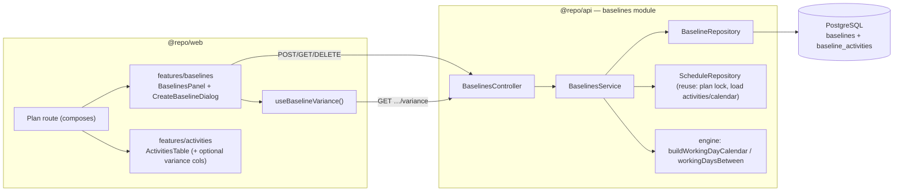
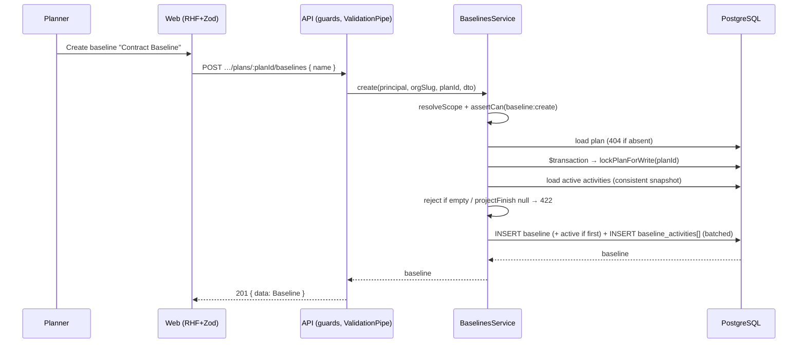
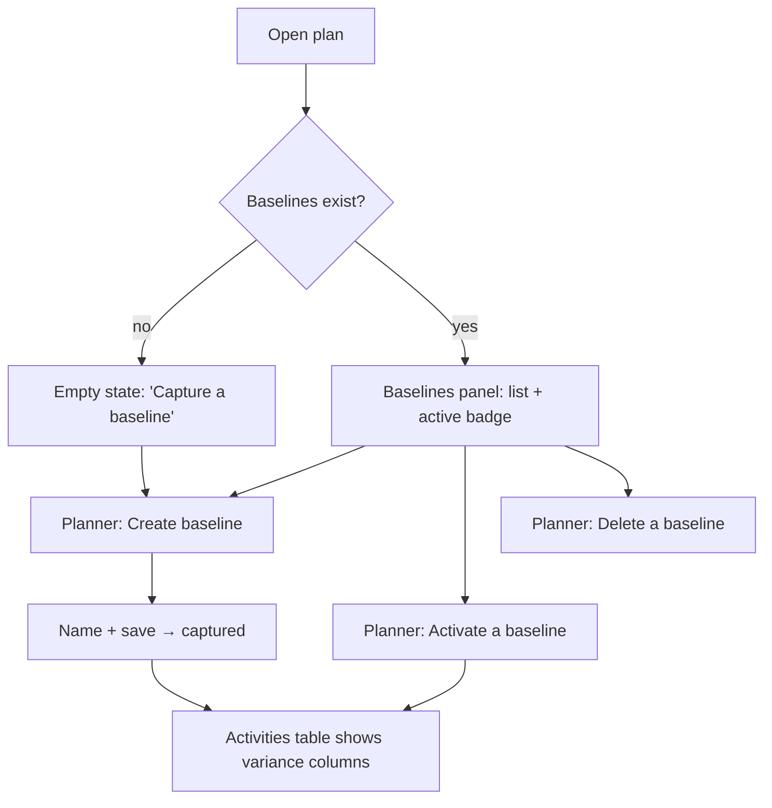

# Feature Spec: Baselines (M7)

- **Status:** Approved — implemented in M7 (A1–D2).
- **Author(s):** Feature Analyst / Claude
- **Date:** 2026-07-10
- **Tracking issue / epic:** _tbd_
- **Roadmap link:** Scheduling core — **M7 Baselines** (`docs/ROADMAP.md`)
- **Related ADR(s):** **ADR-0025 (proposed)** — Baselines: snapshot-copy model, one-active-per-plan invariant & server-side working-day variance. Builds on ADR-0012/0016 (RBAC + scope), ADR-0022 (CPM persistence), ADR-0023 (date convention), ADR-0024 (working-day calendars).

## 1. Business understanding

### Problem

A schedule is only useful against a plan of record. Today SchedulePoint computes a
live CPM schedule (M6) over real working-day calendars (M5), but there is **no
frozen reference** to compare the current schedule against. Construction planners
need to capture a **"Contract Baseline"** before mobilisation and then, months
later, answer the question their client and their own PM ask constantly: **are we
ahead or behind, and by how much?** Without baselines there is no variance, no
evidence of slip, and no defensible record of what was committed. Baselines are a
**Must-have** (PROJECT_BRIEF §8, §11) and the spine of **Journey 4** (§10).

### Users

Organisation members (roles per ADR-0012 / ADR-0016):

- **Planner / Org Admin** — capture a baseline, activate one as the comparison
  baseline, and delete obsolete ones (the "write" role, like all hierarchy edits).
- **Contributor / Viewer** — **read** baselines and see variance, but cannot
  capture, activate, or delete (browsing the record ≠ editing it). Same read-vs-write
  split as the calendar library and the CPM recalculate action.
- **External Guest** (share link) — out of scope for M7 (per-plan share is a later
  ADR); variance visibility for guests is deferred with the share feature.

### Primary use cases

1. **Capture** a named snapshot of the plan's current schedule (a baseline).
2. **List** a plan's baselines, seeing which one is active.
3. **Activate** exactly one baseline as the plan's comparison baseline.
4. **Delete** a baseline that is no longer needed.
5. **See variance** — for every activity, how its current start/finish/float
   compares to the active baseline, plus a plan-level roll-up (worst slip, count
   behind).

### User journeys

**Happy path (Journey 4).** A Planner opens a plan that has been scheduled (M6),
clicks **Create baseline**, names it "Contract Baseline", and saves. It is captured
from the plan's currently-persisted computed dates and — being the plan's first
baseline — becomes **active** automatically. Four months later, after progress and
recalculation, the Planner opens the plan's **activities table** and a **variance
column** shows critical-path activities finishing _N working days_ behind the
Contract Baseline; a **variance summary** shows the worst slip and how many
activities are behind. The Planner later captures a second baseline ("Revised
Baseline"), activates it, and variance now compares against the new plan of record.

**Alternates.** Capture on a never-calculated/empty plan → blocked with a friendly
422 (nothing meaningful to freeze). Deleting the active baseline → allowed; the plan
simply has no active baseline and variance is hidden until another is activated.
Activating baseline B while A is active → A is deactivated atomically so **at most
one** is ever active.

### Expected outcomes

- Planners can freeze a plan of record and prove slip/gain against it.
- Every activity gains start/finish/float variance vs the active baseline, in
  **working days** (consistent with float/lag, ADR-0023/0024).
- A permanent historical record (baselines **never auto-purge**, §13) that survives
  even the 90-day hard purge of the activities they were captured from.

### Success criteria

- A Planner captures a baseline in **< 5s** for a 2,000-activity plan (p95).
- Variance for a 2,000-activity plan is served in **< 300ms** (p95) — a bounded,
  plan-scoped read.
- Variance numbers are provably correct: `current − baseline` in working days on the
  plan's calendar, sign convention documented and unit-tested.
- Exactly one active baseline per plan is guaranteed by a DB constraint, not just
  code.

### Open questions

> Each has a **recommended default** so work is not blocked; only the human need
> override.

- **Q1 (CRITICAL) — snapshot-copy vs reference model.** Should `BaselineActivity`
  be a **self-contained copy** of each activity's identity + computed dates, or a
  **reference** to the live activity row? **Default: snapshot-copy** (self-contained;
  `source_activity_id` is a plain correlation UUID, **not** an FK). Baselines must
  survive the activities' 90-day hard purge (§13) and remain a faithful historical
  record even if the live activity is deleted or edited. This is the crux of
  **ADR-0025**.
- **Q2 (CRITICAL) — where is variance computed?** **Default: server-side, via a
  dedicated read endpoint** (`GET …/baselines/variance`) that diffs live activities
  against the active baseline using the engine's working-day arithmetic
  (`workingDaysBetween` on the plan's calendar). Rationale: variance in **working
  days** needs the plan calendar (a backend concern), keeps the activities-list
  endpoint unchanged, and is only meaningful when an active baseline exists.
  _Alternative considered:_ extend the activities response / schedule summary with
  variance fields — rejected (couples every activity read to baseline state and
  can't do working-day maths on the client).
- **Q3 (CRITICAL) — does capture require a fresh recalculation?** **Default: no —
  snapshot whatever is currently persisted**, but **reject an empty / never-calculated
  plan** (no active activities, or `projectFinish` is null) with `422
SCHEDULE_NOT_CALCULATED`, and surface `capturedAt` + a "recalculate first" hint in
  the UI so a stale capture is a conscious choice. (Per the M7 scope guidance:
  snapshot current, note if stale.)
- **Q4 (CRITICAL) — auto-activate on capture?** **Default: the plan's _first_
  baseline is activated automatically; later captures are inactive** until the
  Planner activates them. Matches Journey 4 (the Contract Baseline is immediately the
  comparison) without silently re-pointing variance when a Planner captures an
  interim snapshot.
- **Q5 (CRITICAL) — variance unit: working days or calendar days?** **Default:
  working days on the plan's calendar** (consistent with `total_float` and `lag_days`,
  ADR-0023/0024). _Alternative:_ calendar days (a trivial client-side date subtraction)
  — rejected as inconsistent with the rest of the schedule domain, though we also
  expose the raw dates so a consumer could derive calendar-day diffs.
- _Non-critical (defaults, no need to answer):_ baselines are **plan-scoped, not
  shareable across plans** (§20 default: no in v1); baselines **never auto-purge**
  (§13); **no baseline rename** in v1 (capture a new one) — the `version` column is
  present so rename is additive later; **no baseline-vs-baseline** compare in v1 (only
  live-vs-active-baseline); the TSLD/Gantt **visual overlays are out of scope** (canvas
  not built — M7 ships the data + table columns + management panel).

## 2. Functional requirements

### User stories & acceptance criteria

> **US-1** — As a **Planner**, I want to capture a named snapshot of the plan's
> current schedule, so that I have a frozen plan of record.
>
> - **Given** a plan with computed activities **when** I POST a baseline with a
>   unique name **then** it is created `201`, a `BaselineActivity` row is frozen for
>   every active activity (identity + computed dates), and — if it is the plan's
>   first baseline — it is `is_active = true`.
> - **Given** a plan that has never been calculated or has no active activities
>   **when** I capture **then** I get `422 SCHEDULE_NOT_CALCULATED` and nothing is
>   written.
> - **Given** a name already used by an active baseline in this plan **when** I
>   capture **then** I get `409 DUPLICATE_BASELINE`.
> - **Given** I am a Viewer or Contributor **when** I capture **then** `403`.

> **US-2** — As a member, I want to list a plan's baselines (newest first) showing
> which is active, with a designed empty state.
>
> - **Given** baselines exist **when** I GET the list **then** I receive them
>   newest-first (cursor-paginated) with `isActive`, `capturedAt`, `dataDate`,
>   `capturedProjectFinish`, and `activityCount`.
> - **Given** none exist **when** I GET the list **then** `data: []` and the UI
>   shows an empty state prompting capture.

> **US-3** — As a **Planner**, I want to activate one baseline, so variance compares
> against my chosen plan of record.
>
> - **Given** baseline B is inactive and A is active **when** I POST
>   `…/B/activate` **then** `200`, B becomes active and A becomes inactive **in one
>   transaction** — at most one active baseline per plan holds throughout.
> - **Given** B is already active **when** I activate it **then** `200` (idempotent).
> - **Given** I am a Viewer/Contributor **when** I activate **then** `403`.

> **US-4** — As a **Planner**, I want to delete an obsolete baseline.
>
> - **Given** a baseline **when** I DELETE it **then** `204`; it is soft-deleted
>   (with its snapshot rows, one `delete_batch_id`) and its name is free to reuse.
> - **Given** I delete the **active** baseline **then** it is removed and the plan
>   has **no** active baseline; variance is hidden until another is activated.
> - **Given** I am a Viewer/Contributor **when** I delete **then** `403`.

> **US-5** — As a member, I want to see each activity's variance against the active
> baseline and a plan-level roll-up.
>
> - **Given** an active baseline **when** I GET `…/baselines/variance` **then** I
>   receive, per live activity, its current vs baseline start/finish/float, the
>   **start/finish/float variance in working days** (signed: **positive = later than
>   / behind baseline**), and whether it existed in the baseline (`inBaseline`), plus
>   `meta` with the active baseline id/name, worst finish slip, and counts of
>   activities behind / added / removed.
> - **Given** an activity added after the baseline **when** I read variance **then**
>   `inBaseline = false` and its variance fields are null.
> - **Given** a baselined activity later deleted **when** I read variance **then** it
>   is reported as a **removed** row (counted in `meta`, current fields null).
> - **Given** no active baseline **when** I read variance **then** `data: []` and
>   `meta.baselineId = null` (the UI hides variance columns).

### Workflows

1. **Capture** — resolve org scope from caller memberships → `baseline:create` →
   load plan (404) → under the plan write-lock, read a consistent snapshot of active
   activities → reject if empty/never-calculated (422) → insert `Baseline` +
   `BaselineActivity[]` (batched) in one tx → if first baseline, set active.
2. **Activate** — resolve scope → `baseline:activate` → load baseline in plan (404)
   → under the plan write-lock: clear the current active (`is_active = false`) then
   set target active → commit.
3. **Delete** — resolve scope → `baseline:delete` → load (404) → soft-delete the
   baseline + its snapshot rows in one `delete_batch_id`.
4. **Variance** — resolve scope → `baseline:read` → find the active baseline (else
   empty) → load its snapshot rows + the plan's live activities → build the plan's
   working-day calendar (ADR-0024) → join on `source_activity_id`, compute
   working-day diffs → return rows + roll-up.

### Edge cases

- **Empty / never-calculated plan** → capture 422; variance returns empty.
- **Concurrent capture + recalculate** → capture reads under the same plan advisory
  lock as `ScheduleService.recalculate` (ADR-0022), so a snapshot is never taken
  mid-recalc.
- **Concurrent activate/activate** → the plan write-lock serialises them; the partial
  unique index is the backstop.
- **Duplicate active baseline** → impossible: partial unique
  `uq_baselines_plan_active` (`WHERE is_active = true AND deleted_at IS NULL`).
- **Activity added / removed after capture** → surfaced as `inBaseline = false` /
  removed rows respectively.
- **Max scale** — a 2,000-activity plan yields 2,000 snapshot rows per baseline;
  insert is one batched write, variance is one bounded plan-scoped read.
- **Plan/project/client cascade delete** → an existing hierarchy cascade
  soft-deletes contained baselines + snapshots in the same batch; restore brings them
  back (they are descendants of the plan).

### Permissions

| Action          | Permission          | Roles (deny-by-default)  |
| --------------- | ------------------- | ------------------------ |
| Read / variance | `baseline:read`     | every member (Viewer up) |
| Capture         | `baseline:create`   | Planner, Org Admin       |
| Activate        | `baseline:activate` | Planner, Org Admin       |
| Delete          | `baseline:delete`   | Planner, Org Admin       |

Always checked **in the baseline's (plan's) organisation**, re-resolved from the
caller's own memberships (anti-IDOR), exactly like `schedule:*` and `calendar:*`.
`baseline:read` joins `HIERARCHY_READ`; the three writes join `HIERARCHY_WRITE`.

### Validation rules

- `name` — 1–120 chars, trimmed, required. Unique per plan among **active** rows
  (shared Zod / class-validator).
- `sourceActivityId` (internal, never client input) — copied from the snapshotted
  activity.
- Variance sign convention — **positive = current later than baseline (behind)**;
  negative = ahead; documented on the DTO and unit-tested.
- All snapshot dates are `@db.Date` (`YYYY-MM-DD`), like the CPM columns (ADR-0023).

### Error scenarios

| Scenario                                 | Detection            | User-facing result               | Status |
| ---------------------------------------- | -------------------- | -------------------------------- | ------ |
| Not a member / wrong org                 | `resolveScope`       | not found (no existence leak)    | 404    |
| Viewer/Contributor attempts a write      | permission check     | friendly forbidden message       | 403    |
| Plan not found                           | scoped lookup        | not found                        | 404    |
| Baseline not found in plan               | scoped lookup        | not found                        | 404    |
| Duplicate active baseline name in plan   | partial unique P2002 | inline "name already used"       | 409    |
| Capture on empty / never-calculated plan | service guard        | "recalculate the schedule first" | 422    |
| Invalid payload (empty name)             | DTO validation       | field error                      | 422    |

## 3. Technical analysis

| Area           | Impact | Notes                                                                                                                                                                                              |
| -------------- | ------ | -------------------------------------------------------------------------------------------------------------------------------------------------------------------------------------------------- |
| Frontend       | med    | new `features/baselines` (panel, create dialog, variance hook); optional variance columns injected into the existing `ActivitiesTable` via a prop (no feature→feature import — the route composes) |
| Backend        | med    | new `baselines` module (controller → service → repository), copied from the reference template                                                                                                     |
| Database       | med    | two new tables (`baselines`, `baseline_activities`); partial unique for the one-active invariant; snapshot columns                                                                                 |
| API            | med    | `POST/GET` baselines, `POST …/activate`, `DELETE`, `GET …/variance` under the plan path                                                                                                            |
| Security       | med    | `baseline:*` permissions + org scope; deny-by-default; anti-IDOR; no client-supplied snapshot data                                                                                                 |
| Performance    | med    | batched snapshot insert; bounded plan-scoped variance read; reuse engine calendar math (O(1)/O(log H))                                                                                             |
| Infrastructure | none   | no new services, env, or containers                                                                                                                                                                |
| Observability  | low    | structured logs on capture/activate/delete (org, plan, baseline, counts, duration)                                                                                                                 |
| Testing        | med    | unit (service: scope/authz, first-active, one-active flip, variance maths) + API e2e (RBAC/IDOR/409/422; activate atomicity; variance) + web component/e2e/a11y                                    |

### Dependencies

- **M6 CPM engine** (`ScheduleService`, the plan advisory lock, the computed
  columns) — capture reads its output; variance reuses its working-day arithmetic.
- **M5 calendars** (`buildWorkingDayCalendar`, ADR-0024) — variance is in working
  days on the plan's calendar.
- **Hierarchy lifecycle** (`HierarchyLifecycleService`, cascade soft-delete) — a
  plan/project/client delete must cascade to contained baselines.
- The reference template, `org-permissions.ts`, `@repo/types`, `hierarchy-keys.ts`.

## 4. Solution design

### Architecture overview



### Data flow — capture



### Data flow — variance (read)

```mermaid
sequenceDiagram
  participant W as Web
  participant A as API
  participant S as BaselinesService
  participant DB as PostgreSQL
  W->>A: GET …/plans/:planId/baselines/variance
  A->>S: variance(principal, orgSlug, planId)
  S->>S: resolveScope + assertCan(baseline:read)
  S->>DB: find ACTIVE baseline (else return empty)
  S->>DB: load baseline_activities + live activities + plan calendar
  S->>S: build WorkingDayCalendar; join on source_activity_id; diff (working days)
  S-->>A: { rows, rollup }
  A-->>W: 200 { data: VarianceRow[], meta: rollup }
```

### User flow



### Database changes

Two new tables, both following every house standard (UUID v7 PK, snake_case via
`@map`, timestamptz UTC, soft delete + `delete_batch_id`, TEXT audit ids,
optimistic-locking `version`, scoped indexes) and the domain-hierarchy conventions
(denormalised `organization_id`; cascade soft-delete via `delete_batch_id`). Design
with **database-architect**.

**`Baseline`** (`@@map("baselines")`) — a named snapshot of a plan.

- `id`, `organizationId` (denormalised from plan, RESTRICT), `planId` (RESTRICT),
  `name`, `isActive Boolean @default(false)`.
- `capturedAt timestamptz` (the as-of instant of the freeze), `dataDate @db.Date`
  (the plan's `plannedStart` at capture) and `capturedProjectFinish @db.Date`
  (the max inclusive finish at capture) — small denormalisations so the panel renders
  without loading snapshot rows.
- Housekeeping: `version`, `createdAt`, `updatedAt`, `createdBy`, `updatedBy`,
  `deletedAt`, `deleteBatchId`.
- Indexes: `@@index([planId, createdAt, id])` (plan FK + newest-first list + cursor),
  `@@index([organizationId])` (FK + IDOR loads), partial `idx_baselines_delete_batch_id`.
- **Partial uniques (raw SQL in the migration):**
  - `uq_baselines_plan_active ON (plan_id) WHERE is_active = true AND deleted_at IS NULL`
    — **at most one active baseline per plan** (mirrors the calendars/dependency partial-unique pattern).
  - `uq_baselines_plan_name ON (plan_id, name) WHERE deleted_at IS NULL` — name unique
    per plan among live rows; backs `DUPLICATE_BASELINE` (409).

**`BaselineActivity`** (`@@map("baseline_activities")`) — the frozen per-activity snapshot.

- `id`, `organizationId` (denormalised from baseline), `baselineId` (RESTRICT,
  the true owner — CASCADE-style composition handled by service soft-delete).
- `sourceActivityId @db.Uuid` — a **plain correlation id, NOT a foreign key** (Q1 /
  ADR-0025): the snapshot must survive the source activity's 90-day hard purge (§13)
  and remain faithful even if it is edited/deleted.
- **Frozen identity:** `code`, `name`, `type`, `durationDays`.
- **Frozen schedule:** `baselineStart`/`baselineFinish` (the captured
  `earlyStart`/`earlyFinish`), `lateStart`/`lateFinish`, `totalFloat`, `isCritical`
  — all `@db.Date` / `Int?` mirroring the Activity CPM columns.
- Housekeeping incl. `deleteBatchId` (shares the parent baseline's batch).
- Indexes: `@@index([baselineId])` (FK + load-all-for-baseline), `@@index([organizationId])`,
  `@@index([baselineId, sourceActivityId])` (the variance join key), partial delete-batch index.

No `CHECK` beyond the house norms; `totalFloat` is deliberately unconstrained
(negative float is valid, per the Activity precedent).

### API changes

All under `Controller({ path: 'organizations/:orgSlug/plans/:planId/baselines', version: '1' })`,
standard envelopes and error taxonomy (docs/API.md).

| Method | Path                               | Permission          | Returns                                                   |
| ------ | ---------------------------------- | ------------------- | --------------------------------------------------------- |
| POST   | `…/baselines`                      | `baseline:create`   | `201 { data: Baseline }` (Location) / 409 / 422           |
| GET    | `…/baselines`                      | `baseline:read`     | `200 { data: BaselineSummary[], meta }` (cursor)          |
| GET    | `…/baselines/:baselineId`          | `baseline:read`     | `200 { data: BaselineDetail }` (with snapshot rows) / 404 |
| POST   | `…/baselines/:baselineId/activate` | `baseline:activate` | `200 { data: Baseline }` (action, not creation) / 404     |
| DELETE | `…/baselines/:baselineId`          | `baseline:delete`   | `204` / 404                                               |
| GET    | `…/baselines/variance`             | `baseline:read`     | `200 { data: VarianceRow[], meta: PlanVarianceSummary }`  |

New `@repo/types` contracts: `BaselineSummary`, `BaselineDetail`,
`BaselineActivitySnapshot`, `BaselineVarianceRow`, `PlanVarianceSummary`. New error
codes: `DUPLICATE_BASELINE` (409), `SCHEDULE_NOT_CALCULATED` (422).

`activate` returns `200` (a synchronous state action, mirroring
`schedule/recalculate`), not `201`. The `variance` path is bounded and plan-scoped
(like the plan dependency list) — it returns all rows for the plan without cursor
pagination; noted as an explicit exemption at the endpoint.

### Component changes

New `features/baselines` (design-system primitives only, no one-offs):

- **`BaselinesPanel`** — a table/list of baselines (name, active badge, `capturedAt`,
  `capturedProjectFinish`, activity count) with per-row **Activate** / **Delete**
  actions (gated on `baseline:*` via `useOrgRole` → Planner/Org Admin) and a
  **Create baseline** button; empty/loading/error states.
- **`CreateBaselineDialog`** — RHF + Zod name form; surfaces `DUPLICATE_BASELINE` and
  `SCHEDULE_NOT_CALCULATED` inline with a "recalculate first" hint.
- **`api/use-baselines.ts`** — `baselineKeys` (added to `lib/query/hierarchy-keys.ts`)
  - hooks: list, detail, create, activate, delete, and `useBaselineVariance`.
- **Variance columns** — the plan route (which already composes activities + schedule)
  fetches variance and passes an optional `varianceByActivityId` map **prop** into the
  activities feature's `ActivitiesTable`, which renders start/finish/float variance
  columns **only when the prop is present**. This keeps `features/activities`
  self-contained (an optional prop, no import of `features/baselines`) and honours the
  "features → shared, never sideways" rule.

Non-goals for M7 UI: the TSLD variance **overlay** and the Gantt variance **bar**
(canvas not built) — deferred with the canvas milestone.

### Implementation approach & alternatives

**Chosen:** a standard org-scoped CRUD-style module copied from the reference
template, with a **snapshot-copy** data model (Q1), an **atomic one-active** invariant
enforced by a DB partial unique + a plan advisory lock (reusing the M6 lock), and
**server-side working-day variance** computed by reusing the engine's calendar
arithmetic (Q2/Q5). This maximises reuse (auth/scope, lock, calendar math) and keeps
variance correct and consistent with float/lag.

**Alternatives considered:**

- _Reference model_ (BaselineActivity points at the live Activity row) — rejected:
  breaks on activity edit/hard-purge; a baseline would silently change or dangle.
- _Client-side calendar-day variance_ — rejected: can't do working-day maths on the
  client and diverges from the schedule domain's day unit.
- _Variance folded into the activities/schedule-summary response_ — rejected: couples
  every activity read to baseline state and complicates caching.

**ADR required.** The snapshot-copy model, the one-active-per-plan invariant, and the
server-side working-day variance location are cross-cutting/architecturally
significant → **ADR-0025 (proposed)**, drafted with the spec and finalised in Task A1.

## 5. Links

- Implementation plan: [`docs/plans/baselines.md`](../plans/baselines.md)
- Related docs updated by this change: `docs/DATABASE.md`, `docs/API.md`,
  `docs/adr/0025-baselines-snapshot-and-variance.md` (new), `docs/ROADMAP.md`,
  `CLAUDE.md` (§16 ADR list, §20/§21 if needed), `@repo/types`, OpenAPI.

```

```
