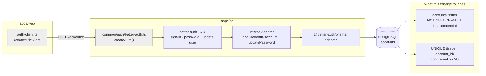
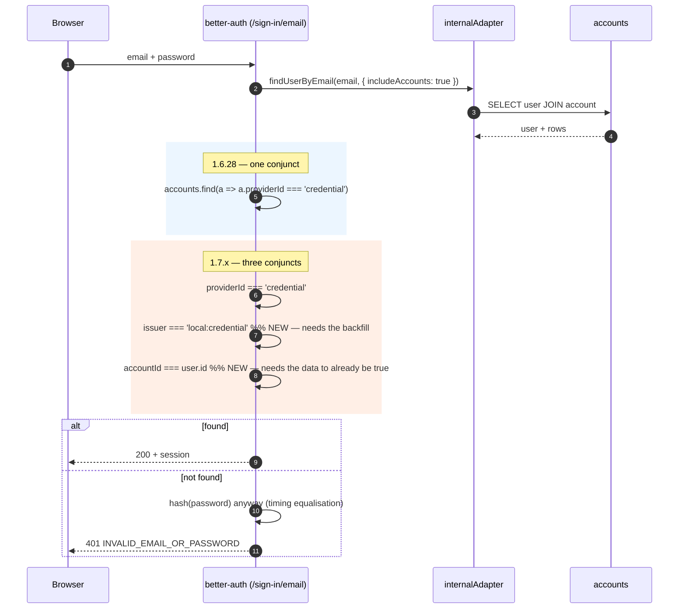
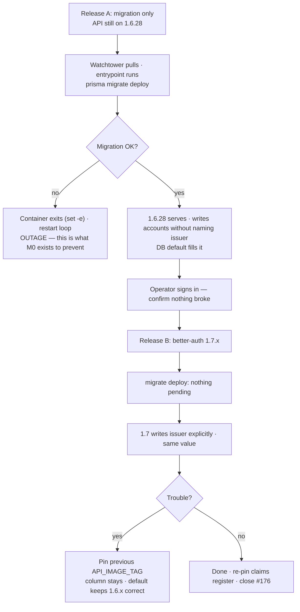
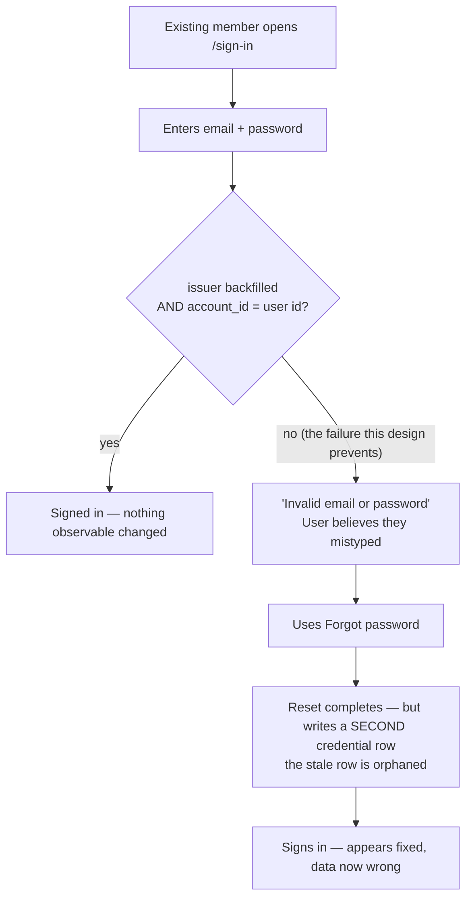

# Feature Spec: Better Auth 1.7 — account identity scoped by issuer

- **Status:** Draft — awaiting approval
- **Author(s):** feature-analyst (Product Owner / Solution Architect / Technical Lead hats)
- **Date:** 2026-08-23
- **Tracking issue / epic:** `docs/TECH_DEBT.md` #176
- **Roadmap link:** none — this is dependency maintenance with a schema consequence
- **Related ADR(s):** amends **ADR-0003** (authentication with Better Auth) and touches
  **ADR-0016** (identity & tenancy model). A new ADR is required — see §4 "Does this need an
  ADR?". Fires **ADR-0105**'s schema trigger and **CLAUDE.md §19.3** (`database-architect`,
  running in parallel with this spec).

---

## 0. A note on citation form, and what is inherited

**No `file.mjs:NNN` citations appear in this document, deliberately.** `pnpm check:claims`
(`scripts/check-claims.mjs`, the `CITATIONS` array) demands that any such citation be registered in
`scripts/dependency-claims.json`, pinned against the **installed** version — and the installed
version is `1.6.28` (`scripts/dependency-claims.json`, `verifiedAgainst`). A pinned line number
into a version the branch does not install is exactly the rot ADR-0076 exists to stop, which is the
reasoning `docs/TECH_DEBT.md` #176 already applied to itself. So library behaviour is cited by
**file and exported symbol**, and registering the line numbers is a task in the plan (M4-T2), to be
done at the version that actually lands.

**Everything asserted about 1.7 in §§1–4 below was read on disk in this working tree**, from
`node_modules/.pnpm/better-auth@1.7.1_…` and
`node_modules/.pnpm/@better-auth+core@1.7.1_…`, which are present as **orphan store directories**
left by the experiment #176 records. Two claims are _not_ re-derived here and are inherited from
#176 with that stated: the **522 of 559 API e2e failures** (no database is reachable from this
working tree, and `node_modules` is not linked into the workspaces), and the **36 re-verified
citations**. The brief for this work asserted "42 spec files"; the tree has **43**
(`apps/api/test/**/*.e2e-spec.ts`, counted 2026-08-23) — an immaterial drift, recorded because
PROCESS.md's rule is that a brief is checked like any other document.

---

## 1. Business understanding

### Problem

`better-auth` is pinned at `~1.6.28` in **both** workspaces (`apps/api/package.json:38`,
`apps/web/package.json:71`). The tilde is a deliberate deviation from this repository's `^`
convention: it exists solely so that 1.7 cannot arrive through an ordinary dependency update. That
pin is a **hold, not a decision**. While it stands:

- the application cannot take security or correctness fixes shipped on the 1.7 line;
- every future `pnpm update` re-raises the same question and gets the same deferral;
- the reason for the pin lives in one register row, and register rows go stale.

1.7 scopes account identity by a new `account.issuer` column, declared **required** in
`@better-auth/core`'s `accountSchema` (`dist/db/schema/account.mjs` — `issuer: z.string()`, with
no default and no `.nullish()`). Our Prisma `Account` model has no such column
(`apps/api/prisma/schema.prisma:62-80`), so at 1.7 `prisma.account.create()` throws
`Unknown argument 'issuer'` on **every sign-up**.

**Why now.** The hold is cheap only while nothing on the 1.7 line matters. Doing the work now, with
one organisation and a small user table, is materially cheaper than doing it later — and the whole
of the risk in this change is proportional to how much data is in `accounts`.

### Users

This change is **invisible to every product role** when it succeeds. It is nonetheless one of the
highest-blast-radius changes the repository can make, because everyone reaches the product through
it.

| Role                                                  | What they need from this change                                                                                                             |
| ----------------------------------------------------- | ------------------------------------------------------------------------------------------------------------------------------------------- |
| Org Admin / Planner / Contributor / Viewer (ADR-0016) | To sign in, change their password and complete a password reset, before and after, with no action required of them and no re-authentication |
| External Guest (ADR-0051)                             | Nothing — guest share links are session-less and never touch `accounts`                                                                     |
| Staff (ADR-0086)                                      | Nothing — `StaffPrincipal` is resolved from `STAFF_EMAILS`, not from an account row                                                         |
| Operator (the product owner, ADR-0047 host)           | A deploy that does not take the API down, and a rollback that is not "restore a database backup"                                            |
| Maintainer                                            | The pin lifted, the register re-verified at the landed version, and the reason for the next pin (if any) written down                       |

### Primary use cases

1. An existing user signs in with an email and password after the upgrade.
2. An existing user changes their password after the upgrade.
3. An existing user completes a password reset after the upgrade (ADR-0074).
4. A new user signs up after the upgrade and can then do 1–3.
5. The operator deploys the release, and — if it goes wrong — gets back to a working system.

### User journeys

The happy path is that **no user journey changes at all**. What changes is the row underneath it.
The journeys worth writing down are the failure ones, because they are what the design must make
impossible:

- **Locked out, told it is their fault.** If `issuer` is absent or wrong on an existing row, 1.7's
  sign-in predicate misses it and the endpoint answers `INVALID_EMAIL_OR_PASSWORD` — the same
  message a wrong password gets. Every existing user is told their password is wrong. This is the
  single worst outcome available here and it is silent from the server's side.
- **Rolled back into the same hole.** The operator pins the previous API image tag to recover, and
  sign-**up** now fails instead, because the older image's Prisma client does not write `issuer`
  into a `NOT NULL` column.
- **The API will not start.** ADR-0018's entrypoint runs `prisma migrate deploy` before
  `node dist/main.js` (`apps/api/docker-entrypoint.sh:8-9`) with `set -e`. A migration that fails —
  a unique-constraint violation on live data is the realistic way — takes the API **down and keeps
  it down**, unattended, on a host that auto-pulls (ADR-0047).

### Expected outcomes

- `better-auth` runs at 1.7.x in `apps/api`, with the tilde pin lifted and the reason recorded.
- `accounts.issuer` exists, is populated for every pre-existing row, and is written by the library
  for every new row.
- No user is signed out, locked out or asked to re-authenticate.
- The pre-push gate is green, including `scripts/e2e-local.sh api`.
- A rollback exists that is a redeploy, not a restore.

### Success criteria

| Criterion                                    | How it is measured                                                                                                                                                |
| -------------------------------------------- | ----------------------------------------------------------------------------------------------------------------------------------------------------------------- |
| The API e2e suite recovers completely        | `scripts/e2e-local.sh api` — **0 failures**, from the inherited 522/559 baseline at 1.7.1-without-the-column                                                      |
| Every pre-existing account row is reachable  | A dedicated populated-table migration test (§3 Testing) asserts a non-zero `issuer` on rows created before the migration                                          |
| Sign-in survives on real data                | The operator signs in on the deployed host after the release, before anything else is touched                                                                     |
| The migration is not a request-path outage   | Migration wall-clock measured against a copy of the deployed data (M0); target < 1 s, which the `ADD COLUMN … DEFAULT` shape makes structural rather than hopeful |
| Rollback works                               | A test proves an insert that omits `issuer` still succeeds (that _is_ the old image's behaviour)                                                                  |
| The register is honest at the landed version | `pnpm check:claims` green with `verifiedAgainst.better-auth` set to the landed version, and the orphan store directory removed first (§3 Infrastructure)          |

### Open questions

Marked **CRITICAL** where the answer changes the design. Defaults are stated for everything else so
no milestone is blocked.

> **CQ-1 (CRITICAL) — What does the deployed `accounts` table actually contain?**
> Three facts decide two design forks and cannot be established from this repository: the distinct
> `provider_id` values, whether any row has `account_id <> user_id`, and whether
> `(provider_id, account_id)` is already unique. See §4 D2/D3. **This is not a question for the
> product owner to answer from memory — it is M0, a measurement.** The default if the measurement
> cannot be run against the deployed host: derive it from a restored backup, and if there is no
> backup, treat the answer as unknown and take the conservative branch of both forks (constant
> backfill, no unique index in the first release).

> **CQ-2 (CRITICAL) — If M0 finds a row with `account_id <> user_id`, do we repair the data?**
> Such a user **cannot sign in at 1.7 and no `issuer` backfill helps them** (§3 Security, the
> three-conjunct predicate). The repair is a one-line `UPDATE` inside the same migration; the cost
> is that we would be editing rows the auth library owns. **Default: repair it, in the same
> migration, only for rows where `provider_id = 'credential'`, and only if M0 finds any.** Doing
> nothing here means shipping a known lockout.

> **CQ-3 — Do we take Better Auth's declared `UNIQUE (issuer, accountId)`?**
> The runtime does **not** need it: the Prisma adapter resolves `findOne` with Prisma's `findFirst`
> (`@better-auth/prisma-adapter`, `dist/index.mjs`, the `findOne` member), so nothing breaks
> without it. Taking it is a data-integrity choice with a deploy-failure risk on live data.
> **Default: take it, in the same migration, conditional on M0 reporting zero duplicates.** If M0
> reports any, defer the index to a follow-up and say so in the ADR.

> **CQ-4 — Does `apps/web` take the bump too?**
> Established below (§3 Frontend) that it does not _need_ to. **Default: bump both together**, so
> the estate does not carry one pinned and one unpinned copy of the same library — which is how 1.7
> arrives unattended in the workspace nobody was watching. Falsification condition stated in
> M5-T1: if the 1.7 client costs more than **5 kB gzip** on the initial bundle or fails a public
> journey, hold `apps/web` at `~1.6.28` and record the split in the ADR.

> **CQ-5 — One release or two?**
> **Default: two** — the schema lands alone (M2, still running 1.6.28), the library lands next
> (M4). This is `docs/DEPLOYMENT.md`'s expand/contract rule applied literally, and it is what makes
> the rollback in §4 D5 a redeploy rather than a restore. The cost is one extra release cycle.

---

## 2. Functional requirements

### User stories & acceptance criteria

> **US-1** — As an **existing member**, I want to sign in with my existing password after the
> upgrade, so that the upgrade is invisible to me.
>
> **Acceptance criteria**
>
> - **Given** a user whose credential account row was created before the migration, **when** they
>   POST `/api/auth/sign-in/email` with their correct password on 1.7, **then** they receive a
>   session and a 200.
> - **Given** the same user, **when** they present a _wrong_ password, **then** they receive
>   `INVALID_EMAIL_OR_PASSWORD` — i.e. the pre-existing behaviour, not a new one.
> - **Given** any user, **when** they sign in, **then** no `auth.sign_in_failed` audit row is
>   written that would not have been written at 1.6.28 (ADR-0072/0073 producers are unchanged).

> **US-2** — As an **existing member**, I want to change my password after the upgrade, so that
> account self-service keeps working (ADR-0074).
>
> **Acceptance criteria**
>
> - **Given** a pre-migration credential row, **when** the user POSTs `/api/auth/change-password`
>   with the correct current password, **then** it succeeds and the new password works on the next
>   sign-in.
> - **Given** a user whose credential row the four-field lookup cannot find, **when** they attempt
>   a change, **then** they get `CREDENTIAL_ACCOUNT_NOT_FOUND` (400) — a **loud** failure. This is
>   recorded as a requirement because it is the one failure mode in this change that is _not_
>   silent, and the test must pin that it stays loud.

> **US-3** — As an **existing member who has forgotten my password**, I want the reset flow to
> complete, so that the ADR-0074 recovery path still exists.
>
> **Acceptance criteria**
>
> - **Given** a pre-migration credential row and a valid reset token, **when** the user completes
>   `/api/auth/reset-password`, **then** the password is updated **on the existing row** and no
>   second credential row is created for that user.
> - **Given** the same, **then** `auth.password_reset_completed` is still recorded and every other
>   session is still revoked (`better-auth.ts:193-211`).

> **US-4** — As a **new user**, I want sign-up to work, so that the product is usable at all.
>
> **Acceptance criteria**
>
> - **Given** 1.7 and the migrated schema, **when** a user signs up, **then** an account row is
>   created with `issuer = 'local:credential'`, `provider_id = 'credential'` and
>   `account_id = <the new user id>`.
> - **Given** the whole API e2e suite, **when** it runs, **then** 0 tests fail.

> **US-5** — As the **operator**, I want to be able to go back, so that a bad release is a redeploy
> and not an incident.
>
> **Acceptance criteria**
>
> - **Given** the migrated schema, **when** an API image running 1.6.x inserts an account row
>   **without** an `issuer` value, **then** the insert succeeds and the row carries the default.
> - **Given** the migrated schema and a re-instated `~1.6.28` pin, **when** the pre-push gate runs,
>   **then** it is green.

> **US-6** — As a **maintainer**, I want the dependency register to describe the version that is
> actually installed, so that `check:claims` is evidence rather than decoration.
>
> **Acceptance criteria**
>
> - **Given** the landed version, **when** `pnpm check:claims` runs, **then** it reports that
>   version, all 36 `better-auth` claims resolve, and no claim is unregistered.
> - **Given** the pnpm store holding two `better-auth@…` directories, **when** the gate runs,
>   **then** the run is preceded by removing the orphan (`docs/TECH_DEBT.md` #178) and the reported
>   version is asserted, not skimmed.

### Workflows

**Deploy (the chosen two-release sequence).**

1. Release A ships the migration only. The API is still on 1.6.28. `migrate deploy` adds
   `issuer` with a database default and backfills; 1.6.28 continues to write account rows without
   naming the column, and the default fills it.
2. The operator confirms sign-in still works. Nothing about the application has changed.
3. Release B ships the library bump. `migrate deploy` finds nothing to apply. 1.7 starts writing
   `issuer` explicitly, with the same value the default supplies.

**Rollback.** From B → A: pin the previous `API_IMAGE_TAG`. The column stays (migrations are
forward-only, `docs/DEPLOYMENT.md` "Data & migrations"), and the default makes it inert for 1.6.28.
From A → pre-A: the column still stays; there is nothing to undo, because a defaulted additive
column is invisible to the old code.

### Edge cases

| Case                                                     | Expected behaviour                                                                                                                                                                                                                                                                                                                  |
| -------------------------------------------------------- | ----------------------------------------------------------------------------------------------------------------------------------------------------------------------------------------------------------------------------------------------------------------------------------------------------------------------------------- |
| `accounts` is empty (a fresh install, every CI database) | The migration is a no-op backfill. **This is why CI cannot prove the backfill** — see §3 Testing.                                                                                                                                                                                                                                   |
| A row with `provider_id` other than `'credential'`       | Cannot exist on this install (§3 Security), but the backfill must not _assume_ it: the expression is `provider_id`-derived rather than a blanket constant unless M0 proves the column is single-valued. Decided by CQ-1.                                                                                                            |
| A row with `account_id <> user_id`                       | The user is unreachable at 1.7 regardless of `issuer`. CQ-2.                                                                                                                                                                                                                                                                        |
| Two credential rows for one user                         | Would violate the new unique index and **fail the migration inside the entrypoint**, taking the API down. CQ-3 gates the index on M0.                                                                                                                                                                                               |
| Concurrent replicas boot together                        | `prisma migrate deploy` serialises on a Postgres advisory lock (`docker-entrypoint.sh:3-5`); unchanged by this work.                                                                                                                                                                                                                |
| The migration runs on a large table                      | The `ADD COLUMN … NOT NULL DEFAULT '…'` form is metadata-only on PostgreSQL 11+ and does not rewrite the table. The **index build** is the part that scans. Sizing is M0's job.                                                                                                                                                     |
| A user is signed in across the release                   | Sessions are rows in `sessions`, untouched. Nobody is signed out.                                                                                                                                                                                                                                                                   |
| Better Auth's own migrator is invoked                    | It is not, and never has been: we use Prisma. Its `UnsafeMigrationError` refusal to add a required column to a populated table (`dist/db/get-migration.mjs`, `getMigrations`) is therefore **informational** — but it is the library's authors saying the backfill is mandatory, which is the reason this is a spec and not a bump. |

### Permissions

**Unchanged. Nothing in this change is reachable by a request.** There is no new endpoint, no new
permission, no RBAC delta, no organisation-scope delta (ADR-0012/0016). `issuer` is written and
read exclusively by the auth library; the only new privileged action is the migration itself, which
runs as the single application role ADR-0072 already describes.

### Validation rules

| Field                   | Rule                                                        | Enforced by                                                                                            |
| ----------------------- | ----------------------------------------------------------- | ------------------------------------------------------------------------------------------------------ |
| `accounts.issuer`       | Non-null, non-empty text                                    | Database `NOT NULL`; the library's own `z.string()`                                                    |
| `accounts.issuer` value | `local:credential` for every credential row on this install | The library's `createLocalAccountIssuer('credential')`; the migration's backfill for pre-existing rows |
| `(issuer, account_id)`  | Unique                                                      | Database unique index, **conditional on CQ-3**                                                         |

No DTO, no `class-validator` rule, no Zod schema in this repository changes. That is worth stating
explicitly because it is unusual: this is a schema change with **zero** application-code
consequence in `apps/api/src` (§3 Backend).

### Error scenarios

| Scenario                                           | Detection                                                | User-facing result                                                          | Status |
| -------------------------------------------------- | -------------------------------------------------------- | --------------------------------------------------------------------------- | ------ |
| `issuer` missing/wrong on an existing row, at 1.7  | none — the predicate simply misses                       | `INVALID_EMAIL_OR_PASSWORD` — **the user is told their password is wrong**  | 401    |
| Same row, change-password                          | `findCredentialAccount` returns null                     | `CREDENTIAL_ACCOUNT_NOT_FOUND`                                              | 400    |
| Same row, reset-password completion                | `findCredentialAccount` returns null → the create branch | Succeeds, but writes a **second** credential row; the stale one is orphaned | 200    |
| Duplicate `(issuer, account_id)` at migration time | Postgres unique violation                                | **The API does not start.** `set -e` in the entrypoint                      | —      |
| Old image inserts without `issuer`, no default     | Postgres `NOT NULL` violation                            | Sign-up fails; the rollback is worse than the fault                         | 500    |
| `check:claims` resolves the orphan store directory | The gate names a version                                 | A confident, wrong pass or fail (`docs/TECH_DEBT.md` #178)                  | —      |

---

## 3. Technical analysis

| Area           | Impact                        | Notes                                                                                                                                                                                                                                                                                             |
| -------------- | ----------------------------- | ------------------------------------------------------------------------------------------------------------------------------------------------------------------------------------------------------------------------------------------------------------------------------------------------- |
| Frontend       | **low**                       | One dependency version. `apps/web` imports exactly one symbol from the library (`createAuthClient` from `better-auth/react`, `apps/web/src/lib/auth-client.ts:1-13`) and calls seven endpoint wrappers. No account shape crosses the boundary. Bundle delta must be measured (CQ-4).              |
| Backend        | **none in source**            | Verified: no file under `apps/api/src` references `prisma.account`, `accountId` or `providerId`. The only occurrence of `accountId` anywhere in `apps/` is `schema.prisma:64`. `createAuth` passes no `account` options (`better-auth.ts:142-357`), so every field name is Better Auth's default. |
| Database       | **high**                      | One new column with a backfill, plus (CQ-3) one new unique index, on a library-owned table. Designed by `database-architect` — see §4.                                                                                                                                                            |
| API            | **none**                      | No endpoint, DTO, envelope, status code or OpenAPI change. `docs/API.md` is untouched.                                                                                                                                                                                                            |
| Security       | **high**                      | The sign-in predicate gains two conjuncts (below). This is the whole risk of the change.                                                                                                                                                                                                          |
| Performance    | **low, but must be measured** | The DDL shape is metadata-only; the index build is O(table). Both are boot-time, and boot-time is request-path here because of ADR-0018.                                                                                                                                                          |
| Infrastructure | **medium**                    | ADR-0018 self-migration + ADR-0047 auto-pull means a failed migration is an unattended outage. `pnpm check:counts` re-derives the migration count and will fail four documents until they are updated. `check:claims` must be re-pinned.                                                          |
| Observability  | **none**                      | No new log, metric or trace. Deliberately **no audit event**: ADR-0073's durability and blast-radius tests both say no — a migration is not an act by an actor, and `audit_events` is exactly where an unerasable non-event does not belong.                                                      |
| Testing        | **high**                      | The API e2e suite is the primary gate, and it has one structural blind spot that needs a purpose-built test (below).                                                                                                                                                                              |

### The security analysis, in full — what `issuer` MEANS for us

This is the question the brief asked first, and the answer determines everything else.

**At 1.6.28**, a credential account was found by **one** predicate:
`accounts.find(a => a.providerId === 'credential')` — in `dist/api/routes/sign-in.mjs`, and via
`internalAdapter.findAccounts(userId)` elsewhere. `internalAdapter.updatePassword` matched on
`userId` + `providerId` only.

**At 1.7.1**, the same lookup is **three conjuncts**, in `dist/api/routes/sign-in.mjs`:

```
account.providerId === 'credential'
  && account.issuer === createLocalAccountIssuer('credential')   // 'local:credential'
  && account.accountId === userRecord.user.id
```

and the shared helper `internalAdapter.findCredentialAccount(userId)`
(`dist/db/internal-adapter.mjs`) is a **four**-field database predicate —
`userId`, `providerId`, `issuer`, `accountId` — now used by change-password, `validatePassword`,
`checkPassword`, `shouldRequirePassword` and the reset-password completion.
`internalAdapter.updatePassword` gained the same two extra fields.

Three consequences, each established by reading the 1.7.1 source rather than the upgrade guide:

1. **`issuer` is not internal bookkeeping for us. It is load-bearing on the sign-in path.** An
   absent or wrong value makes an existing account invisible to the library, and the visible
   symptom is "wrong password".
2. **The `accountId === user.id` conjunct is _also_ new**, and the brief did not carry it. It is
   satisfied by every row this application has ever written — 1.6.28's `dist/api/routes/sign-up.mjs`
   passes `accountId: createdUser.id` when it links the credential account, and its
   `dist/api/routes/password.mjs` does the same — but "every row this application has ever written"
   is a claim about **code**, and the rows are in a **database**. It must be measured (CQ-1), because
   if it is false for any row, no `issuer` backfill reaches that user.
3. **Nothing in `apps/api/src` rests on the old lookup shape**, because nothing in `apps/api/src`
   reads `accounts` at all. That is a genuinely reassuring finding and it is the reason the blast
   radius is confined to the data. No ADR rests on it either: ADR-0003 talks about a thin boundary
   around the provider, not about the account key; ADR-0016 models `User`/`OrgMember` and
   deliberately leaves the Better Auth tables to the library; ADR-0074's flows go through
   `sendResetPassword`/`onPasswordReset`/`afterEmailVerification`, all of which take a `user`, not
   an account.

**What `issuer` will be here.** `createLocalAccountIssuer(providerId)` returns
`` `local:${encodeURIComponent(providerId)}` `` (`@better-auth/core`, `dist/db/schema/account.mjs`),
and OAuth providers get the distinct `local:oauth:` namespace via `createOAuthAccountIssuer`. This
install configures `emailAndPassword` and **no `socialProviders` block** — verified by reading
`apps/api/src/common/auth/better-auth.ts` end to end (362 lines; the only providers configured are
email and password, at lines 164-212). So the only issuer this installation can produce is
**`local:credential`**, and the backfill is a constant _subject to CQ-1 confirming `provider_id` is
single-valued in the deployed data_.

**The `UNIQUE (issuer, accountId)` index.** `@better-auth/core`'s `dist/db/get-tables.mjs` declares
it on the `account` table (`indexes: mergeTableIndexes([{ fields: ["issuer","accountId"], unique:
true }], …)`); 1.6.28's equivalent declares **no indexes on account at all**. With `issuer` constant
and `accountId` equal to the user id, the constraint collapses to _"at most one credential account
per user"_ — an invariant the application has always relied on and **never enforced**: today's
`Account` model carries only `@@index([userId])` (`schema.prisma:78`). Nothing in the runtime needs
the index, because the Prisma adapter answers `findOne` with `findFirst`
(`@better-auth/prisma-adapter`, `dist/index.mjs`). Taking it therefore buys integrity and costs a
deploy-failure mode; hence CQ-3, gated on M0.

**Confirmed not affected.** Diffing the four owned tables' field sets between
`@better-auth/core@1.6.28` and `@1.7.1` (`dist/db/get-tables.mjs` in each) shows `issuer` is the
**only** new field across `user`, `session`, `account` and `verification`. Also unreachable here:
`revokeUnprovenAccountAccess` (magic-link / email-OTP plugins, neither configured) and the
`siwe` / `phone-number` / `admin` / `email-otp` issuer call sites (no plugins configured).

### The two failure modes of the deploy, and what they constrain

ADR-0018's entrypoint is `prisma migrate deploy` then `exec node dist/main.js`, under `set -e`
(`apps/api/docker-entrypoint.sh:6-12`), and ADR-0047's Watchtower profile is **enabled** on the
product owner's host, so the container is recreated unattended when `:latest` moves. Therefore:

- **A slow migration is downtime**, not a background task. It happens before the process that
  serves `/health` exists. This forbids any design that rewrites the table or builds an index
  synchronously on data of unknown size — which is what makes M0's sizing measurement a gate rather
  than diligence, and what makes the `ADD COLUMN … DEFAULT` shape (metadata-only on PostgreSQL 11+)
  the right one.
- **A failed migration is a persistent outage.** `set -e` means the container exits; the restart
  policy brings it back; it runs the same failing migration again. A unique-constraint violation on
  live data would loop forever. This is why the index is conditional on a measurement and not on
  optimism.
- **The checksum is immediate.** A migration is checksummed when it lands and applied to a real
  database; correcting it costs a second migration in every environment. This is CLAUDE.md §19.3's
  stated reason for the `database-architect` rule, and it is why the design fork (CQ-2, CQ-3) must
  be closed **before** the migration is written, not after.

### Rollback, precisely

"Back out" has three distinct meanings here and only two of them are available.

1. **Back out the library.** Available and cheap. Re-pin `~1.6.28`, redeploy the previous image
   tag. `docs/DEPLOYMENT.md` names image-tag pinning as the per-feature rollback and notes `web`
   and `api` version independently (ADR-0027).
2. **Back out the schema.** **Not available.** Migrations are forward-only (ADR-0018,
   `docs/DEPLOYMENT.md` "Data & migrations"); a checksummed migration cannot be edited, and undoing
   it means writing a _new_ migration that drops a column the library is using. The column stays.
3. **Back out the data.** Not meaningful — the backfill writes a constant that 1.7 would write
   anyway, so there is nothing to undo and nothing lost by leaving it.

**So the design requirement that falls out of (2) is: the schema must remain correct under a
rolled-back library.** That is exactly what a database default buys, and it is the reason to have
one even though Better Auth's own schema declares none. Without a default, rolling back to 1.6.x
turns a bad release into a **worse** one: 1.6's Prisma client will not name the column, and the
`NOT NULL` refuses the insert, so sign-up breaks on the version you rolled back _to_.

**Is the tilde pin re-instatable after the column exists?** **Yes**, and this is worth stating
because it is the cheapest safety net available. 1.6.28 never reads or writes `issuer`; with a
default in place, its inserts succeed and the column self-populates with the same value 1.7 would
have written. The only residual is that 1.6.28 does not know about the unique index — but its own
one-credential-account-per-user logic is what the index encodes, so it cannot violate it by any
path this application exposes. Re-pinning is therefore a supported state, not a broken one, and
that is what makes the two-release sequence (CQ-5) genuinely reversible at each step.

### Verification strategy — and the five things the API e2e suite cannot catch

The API e2e suite is the primary gate and an unusually good one: **522 failures → 0** is a signal
with no interpretation problem. It is also the only gate that caught the problem at all —
`pnpm lint`, `pnpm typecheck`, all 5,004 unit tests and all ten `check:*` gates passed at 1.7.1
(`docs/TECH_DEBT.md` #176), because the unit suites mock Better Auth.

It is not sufficient, for five reasons, each of which becomes a test or a measurement in the plan:

1. **It structurally cannot prove the backfill.** Every e2e run starts from a database whose
   `accounts` table is empty, and each suite creates its users by POSTing
   `/api/auth/sign-up/email` (e.g. `apps/api/test/projects.e2e-spec.ts:85-95` and 20 siblings). So
   `migrate deploy` adds the column to a **zero-row table** and every account the suite then reads
   was written by 1.7 with the column already present. **A completely broken backfill produces a
   fully green e2e run.** → M3-T1: a purpose-built test that seeds account rows at the
   pre-migration shape, applies the migration, and asserts the value.
2. **It cannot see the deployed data.** `account_id <> user_id`, duplicates, and unexpected
   `provider_id` values are properties of one specific database. → M0.
3. **It cannot time the migration on real data.** → M0.
4. **It cannot prove rollback-safety**, because it never runs an old client against a new schema.
   → M3-T2: assert that an insert omitting `issuer` succeeds and carries the default. This test is
   the executable form of the rollback argument, and it is the only thing that will notice if
   someone later "tidies up" the default.
5. **It never loads the browser client.** `better-auth/react` is not imported by `apps/api`. The
   web half needs the web unit suites plus `apps/web/e2e-public` and `apps/web/e2e-account`, which
   drive real sign-in, reset and change-password against a real API. Note also that
   `rateLimit.enabled: options.isProduction` (`better-auth.ts:270-274`) means **no e2e in this
   repository exercises the limiter**, so a 1.7 change to limiter behaviour is invisible to every
   suite; #176 records that the limiter's configured windows were re-verified at 1.7.1, and that
   verification is the only cover here.

Two further gates are mechanical consequences rather than tests:

- **`pnpm check:counts`** re-derives `migrations` from `apps/api/prisma/migrations`
  (`scripts/check-counts.mjs:50`) and compares it against four documents — `CLAUDE.md` (required),
  `README.md`, `docs/ARCHITECTURE.md`, `docs/DATABASE.md`. Adding the 58th migration fails all of
  them until they are updated. Not a risk; a checklist item.
- **`pnpm check:claims`** must move `verifiedAgainst.better-auth` to the landed version and
  re-verify 36 anchors. **And it must be run with the pnpm store cleaned first**: this working tree
  currently holds **both** `better-auth@1.6.28_…` and `better-auth@1.7.1_…` store directories, and
  `installed()` (`scripts/check-claims.mjs:61-70`) takes the **first** directory whose name matches
  the prefix. That is `docs/TECH_DEBT.md` #178, live, on this exact upgrade — and #178 says the
  dangerous direction is the quiet one: an orphan _newer_ directory makes the gate verify against a
  version the application does not load, and pass.

### Dependencies

- **Must land first:** the `database-architect` design for the column, the backfill and the index
  (running in parallel with this spec). Nothing in M2 onward can start without it.
- **Must land first:** M0's measurement, because it closes CQ-1/CQ-2/CQ-3 and those decide what the
  migration contains.
- **Third parties:** `better-auth` 1.7.x and its `@better-auth/*` peers, which pnpm resolves as a
  set. `@prisma/client` is unaffected.
- **Affected features:** ADR-0074 (recovery + verification) and ADR-0072/0073 (`auth.*` audit
  events) share the endpoints under test but need no change; ADR-0051 (guest share), ADR-0086
  (staff) and the entire scheduling domain are untouched.
- **Not a dependency:** the CPM engine. `computeSchedule` is not imported, no engine input changes,
  and the ADR-0034 recalculation parity gate is untouched **in its honest form — there is nothing
  here to hold parity for.**

---

## 4. Solution design

### Architecture overview



`apps/web/src/lib/auth-client.ts` and `apps/api/src/common/auth/better-auth.ts` are shaded because
**neither changes a line**. The entire delta is a dependency version and two database objects.

### Data flow — the sign-in lookup, before and after



The `else` branch is the design's whole problem: it is **indistinguishable from a wrong password**,
so a failed backfill produces a fleet-wide lockout that reports itself as user error.

### Deploy flow



### User flow



The right-hand path is worth drawing because it is **self-concealing**: the product appears to
recover, so a fleet-wide backfill failure could be experienced as "a few people had to reset their
passwords" and never diagnosed. It is the argument for M3-T1 being a real gate rather than a
formality.

### Database changes

> **Designed by the `database-architect` agent, running in parallel with this spec (CLAUDE.md
> §19.3). What follows is the set of REQUIREMENTS the design must satisfy, not the DDL.** Where
> this section states a shape, it is stating the constraint that forces it; the agent's output is
> authoritative on the SQL, the index build strategy, the ordering of statements and the migration's
> comment block (which by this repository's convention carries the reasoning —
> `20260809120000_mail_events/migration.sql` is the exemplar).

| #   | Requirement                                                                                 | Why it is a requirement and not a preference                                                                                                                                                                                              |
| --- | ------------------------------------------------------------------------------------------- | ----------------------------------------------------------------------------------------------------------------------------------------------------------------------------------------------------------------------------------------- |
| R1  | `accounts.issuer` is `TEXT NOT NULL`                                                        | `@better-auth/core`'s `accountSchema` declares `issuer: z.string()` — required, no default, not nullish                                                                                                                                   |
| R2  | It carries a **database default** of the credential issuer                                  | Rollback-safety (§3): a 1.6.x image's client does not name the column, and without a default its insert violates `NOT NULL`. This is the one place we deliberately diverge from Better Auth's declared schema, and the ADR must record it |
| R3  | Adding it must not rewrite the table                                                        | ADR-0018 runs it before the API serves; `ADD COLUMN … NOT NULL DEFAULT` is metadata-only on PostgreSQL 11+                                                                                                                                |
| R4  | Every pre-existing row gets a value                                                         | Otherwise the sign-in predicate misses. R2's default covers rows written after the DDL; the backfill's job is rows written before it — the agent decides whether R2 makes a separate `UPDATE` redundant, which it may                     |
| R5  | The backfill value is derived, not blanket-assumed                                          | CQ-1. If M0 proves `provider_id` is single-valued, a constant is honest; if not, it must be derived per row                                                                                                                               |
| R6  | `UNIQUE (issuer, account_id)` — conditional                                                 | CQ-3. It matches Better Auth's declared index; nothing in the runtime needs it; a violation on live data is an unattended outage                                                                                                          |
| R7  | If M0 finds `account_id <> user_id` on credential rows, repair them in the same migration   | CQ-2. Those users are otherwise locked out with no self-service route                                                                                                                                                                     |
| R8  | The Prisma model change is additive and passes `pnpm --filter @repo/api prisma:check-drift` | The repository's standing schema-drift gate                                                                                                                                                                                               |
| R9  | The migration comment states what was measured, with numbers                                | `docs/DATABASE.md` convention; ADR-0073 C1's precedent that an index decision carries its measurement                                                                                                                                     |

Prisma model delta, for orientation (the agent owns the final form):

```prisma
model Account {
  id         String @id
  issuer     String @default("local:credential")   // R1 + R2
  accountId  String @map("account_id")
  providerId String @map("provider_id")
  // … unchanged …

  @@unique([issuer, accountId])   // R6 — conditional on M0
  @@index([userId])
  @@map("accounts")
}
```

### API changes

**None.** No new or changed endpoint, DTO, status code, envelope, pagination or OpenAPI entry.
`docs/API.md` is not touched by this work.

### Component changes

**None.** `apps/web/src/lib/auth-client.ts` constructs the client with a `basePath` and nothing
else; the seven call sites in `features/auth` (`use-session.ts:163-426`) are endpoint wrappers.
No component, route, form, token or design-system primitive changes. There is no user-facing entry
point in this epic at all — every milestone in the plan declares itself dark, which is why
ADR-0081's "name your entry point" rule is satisfied by the second half of its own sentence.

### Implementation approach & alternatives

**Chosen: measure first, then two releases — schema alone, then the library.**

1. **M0 measures the deployed `accounts` table** and closes CQ-1/2/3 before any DDL is written.
   This is the repository's standing pattern (ADR-0090 M0, ADR-0099 M0, ADR-0100 M0) and it earns
   its keep here for a specific reason: this is a **checksummed, unattended, irreversible** change,
   so the usual "ship it and measure" loop is unavailable. It is also the only milestone whose
   output can _cancel_ a design decision.
2. **The column lands with a default**, which simultaneously makes the backfill trivial, the DDL
   non-rewriting, and the rollback a redeploy.
3. **Two releases**, so that "the schema changed" and "the library changed" are separately
   revertible and separately observable on the host.

**Alternatives considered.**

| Alternative                                                  | Why not                                                                                                                                                                                                                                                                                                                                                                                                                                                      |
| ------------------------------------------------------------ | ------------------------------------------------------------------------------------------------------------------------------------------------------------------------------------------------------------------------------------------------------------------------------------------------------------------------------------------------------------------------------------------------------------------------------------------------------------ |
| **One release** (schema + bump together)                     | Cheaper by one cycle, and it is what a dependency bump normally looks like. Rejected because it fuses the only irreversible part of the change with the only easily-reversible part: if sign-in misbehaves after it, the operator cannot tell whether the data or the library is at fault, and rolling the image back leaves the schema half-adopted with no default to protect it. The extra cycle is hours; the fused failure is an authentication outage. |
| **Nullable `issuer`**                                        | Would make the migration trivially safe. Rejected: the library's schema declares it required, so we would be running permanently off-contract, and a null reaches the sign-in predicate as a miss — i.e. it converts a loud migration failure into a silent lockout. Exactly the wrong trade.                                                                                                                                                                |
| **No database default** (match Better Auth's schema exactly) | Purer. Rejected on R2: it makes the image-tag rollback _create_ a new outage. The divergence is one `DEFAULT` clause on a value the library always supplies explicitly, so 1.7 never observes it.                                                                                                                                                                                                                                                            |
| **Take the unique index unconditionally**                    | Rejected: a violation fails the migration inside `set -e`, which is an unattended restart loop, and we do not yet know the data. Gated on M0 instead.                                                                                                                                                                                                                                                                                                        |
| **Decline the unique index permanently**                     | Tempting, since the runtime does not need it (`findFirst`). Rejected as a default because the invariant is real, has never been enforced, and `findAccountOwnerByKey` would otherwise be free to return an arbitrary row. Kept as the fallback if M0 finds duplicates.                                                                                                                                                                                       |
| **Use Better Auth's own migrator for this table**            | Rejected: it would be a second schema authority beside Prisma, and it refuses this exact change on a populated table anyway (`getMigrations` → `UnsafeMigrationError`).                                                                                                                                                                                                                                                                                      |
| **Stay on `~1.6.28` indefinitely**                           | The status quo, and it is a decision that has to be re-made every dependency pass. Rejected: the cost of this change is strictly increasing in the size of `accounts`.                                                                                                                                                                                                                                                                                       |
| **Hold `apps/web` at `~1.6.28`**                             | A live option (CQ-4) with a stated falsification condition, not a rejected one.                                                                                                                                                                                                                                                                                                                                                                              |

### Does this need an ADR?

**Yes — a short one, and it should be filed with the work rather than after it.** Three of the
decisions above are architecturally significant by this repository's own test:

- **Account identity's key changed shape**, from "the credential account of this user" to
  `(issuer, accountId)`. That is a statement about the identity model, which is ADR-0016's subject,
  and it changes what a future social-login or account-linking feature has to reason about.
- **We deliberately diverge from the library's declared schema** by adding a `DEFAULT` it does not
  declare. That is precisely the kind of divergence CLAUDE.md §19.2 says needs a documented reason,
  and the reason (rollback-safety under a forward-only migration regime) is not obvious from the
  code.
- **It sets the precedent for how this repository takes a Better Auth schema change** — measure the
  deployed table, land the schema in its own release with a default, then the library. There will
  be a next one, and the alternative to writing this down is deciding it again under time pressure.

It **amends ADR-0003** (which chose the library and put it behind a thin boundary; that boundary is
what makes the blast radius data-only, and this ADR is the first time that property has been tested)
and **references ADR-0016** rather than editing it. It should also state, in the honest form, that
the CPM engine is not imported and the ADR-0034 parity gate is untouched because there is nothing
here to hold parity for.

**Number:** the next free number at the time of writing is **0107** (`docs/adr/` holds 0001–0106).
**Claim the number at filing, not now** — ADR-0079 was filed as 0079 rather than the 0078 its own
plan named, because the number was taken between the plan and the milestone, and ADR-0071 records
what noticing that and stepping over it costs. Note also that `pnpm check:adr-coverage` runs inside
`pnpm prepush`; a new ADR must satisfy it, and the ADR index (`docs/adr/README.md`) must be updated
in the same commit — ADR-0078 found seven ADRs missing from that index.

---

## 5. Links

- Implementation plan: [./implementation-plan.md](./implementation-plan.md)
- Register row: `docs/TECH_DEBT.md` #176 (this epic), #178 (the store-resolution hazard that lands
  on this upgrade specifically)
- Docs this change updates: `CLAUDE.md` (migration count, ADR list), `README.md`,
  `docs/ARCHITECTURE.md`, `docs/DATABASE.md` (model/migration counts + the `Account` entry),
  `docs/adr/README.md`, `scripts/dependency-claims.json`, and a changeset
- Related decisions: ADR-0003, ADR-0016, ADR-0018, ADR-0027, ADR-0047, ADR-0072/0073, ADR-0074,
  ADR-0076, ADR-0081, ADR-0105
