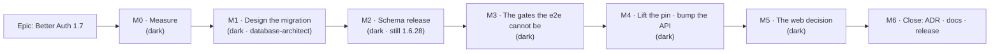

# Implementation Plan: Better Auth 1.7 — account identity scoped by issuer

- **Feature spec:** [./feature-spec.md](./feature-spec.md)
- **Status:** Draft — awaiting approval
- **Owner:** unassigned
- **Register row:** `docs/TECH_DEBT.md` #176

## Breakdown

### Epic

**Better Auth 1.7 — account identity scoped by issuer** — lift the deliberate `~1.6.28` hold by
adding the `accounts.issuer` column Better Auth 1.7 requires, backfilling it for every existing
row, and proving the three account paths (sign-in, change-password, reset) still work on data that
predates the column. Roadmap theme: **dependency and platform maintenance**; closes
`docs/TECH_DEBT.md` #176.

**Every milestone in this epic ships dark.** There is no user-facing entry point anywhere in it —
no route, no control, no flag — and the whole of the user-visible success criterion is that
**nothing changes**. ADR-0081 §1 requires one of "here is the entry point" or "this ships dark, and
why"; this epic takes the second branch throughout, and states it per milestone rather than once,
so a later reader cannot mistake the omission for an oversight. ADR-0081 §2's flag-on journey
obligation is met by the **existing** `apps/web/e2e-public` and `apps/web/e2e-account` journeys,
which already drive sign-in, reset and change-password against a real API; M5-T2 runs them rather
than writing new ones, and the reason is stated there.

**No feature flag.** ADR-0088 D1 established that a `VITE_` constant is inlined at build time and
is not an operator rollback; more directly, a client-side constant cannot gate a server-side
library version or a database column (the ADR-0060 M0 / ADR-0074 rule). The rollback here is
image-tag pinning plus the database default — see the spec, §3 "Rollback, precisely".

---

## Milestone 0 — Measure the account table (ships dark)

**Outcome:** three facts about the deployed `accounts` table, which close CQ-1, CQ-2 and CQ-3 and
therefore decide what the migration contains.
**Ships dark:** no code changes at all. This milestone produces numbers and a decision record.
**Journey:** none — nothing is reachable. The measurement _is_ the deliverable.

**Why it is first, and why it is a milestone rather than a step.** This is a checksummed,
unattended, forward-only change to the table every user reaches the product through. The usual
"ship it and measure" loop is unavailable: a mistake costs a second migration in every environment
(CLAUDE.md §19.3) and, if it fails inside the entrypoint, an unattended restart loop
(`apps/api/docker-entrypoint.sh:6-12` under `set -e`). Two of this milestone's possible answers
**cancel a design decision** that would otherwise already be written into an immutable file.

---

#### Feature: The deployed-data measurement

> **Description:** Establish the shape of the real `accounts` table before any DDL is designed.
> **Complexity:** S
> **Dependencies:** access to the deployed database, or a restored backup of it
> **Risks:** the measurement cannot be run (no access) → fall back to a restored backup; if there is
> no backup, take the conservative branch of every fork (constant backfill, **no** unique index in
> the first release) and record that the index was deferred for lack of evidence rather than for a
> reason
> **Testing requirements:** none — this milestone's output is evidence, not code

##### Task M0-T1 — Measure the deployed `accounts` table

- **Description:** Run four read-only queries against the deployed database (and the same four
  against a local development database, so the difference between the two is itself visible).
- **Complexity:** S
- **Dependencies:** none
- **Risks:** running them against the wrong database and drawing a confident wrong conclusion —
  ADR-0099 records three consecutive false diagnoses from exactly this cause. Mitigation: record
  the connection target and the row counts in the write-up, so a reader can tell which database was
  measured.
- **Testing:** n/a
- **Development steps:**
  1. `SELECT count(*) FROM accounts;` and `SELECT count(*) FROM users;` — the sizing input for R3
     and for the index build.
  2. `SELECT provider_id, count(*) FROM accounts GROUP BY 1;` — **closes CQ-1.** The spec's claim
     that this install is credential-only is established from _code_ (`better-auth.ts` configures
     `emailAndPassword` and no `socialProviders`); this establishes it from _data_. If it returns
     anything but a single `credential` row, the backfill must be derived per row (R5).
  3. `SELECT count(*) FROM accounts a JOIN users u ON u.id = a.user_id WHERE a.account_id <> u.id;`
     — **closes CQ-2.** A non-zero answer names users who cannot sign in at 1.7 regardless of the
     backfill, because 1.7's sign-in predicate requires `accountId === user.id`. This is the query
     the brief did not ask for and the one most likely to change the plan.
  4. `SELECT account_id, count(*) FROM accounts GROUP BY 1 HAVING count(*) > 1;` and the same for
     `(provider_id, account_id)` — **closes CQ-3.** Any duplicate means the unique index would fail
     the migration inside the entrypoint.
  5. Write the four answers, the connection target and the date into
     `docs/specs/better-auth-1-7-account-issuer/m0-measurement.md`, with each query quoted verbatim
     beside its result (ADR-0076: a decision-bearing claim carries what was run).

##### Task M0-T2 — Time the DDL against a copy of the data

- **Description:** On a restored copy sized like the deployed database — and again at a deliberately
  inflated size, so the answer is a curve and not a point — measure the `ADD COLUMN … NOT NULL
DEFAULT` and, separately, the unique index build.
- **Complexity:** S
- **Dependencies:** M0-T1 (the row count decides the inflated size)
- **Risks:** measuring on an empty table and reporting "instant", which is true and meaningless —
  the same shape as ADR-0099's probe that returned an identical number for a control that was never
  rendering. Mitigation: the write-up states the row count beside every timing.
- **Testing:** n/a
- **Development steps:**
  1. Restore a copy; confirm `accounts` row count matches M0-T1.
  2. `\timing on`; run the `ADD COLUMN` form; record. Confirm from `EXPLAIN`/`pg_total_relation_size`
     before and after that no table rewrite occurred (the PostgreSQL 11+ metadata-only path).
  3. Run the unique index build; record. Note whether `CONCURRENTLY` is even available to us —
     it cannot run inside a transaction, and `prisma migrate deploy` wraps a migration in one, so
     this is a real constraint for the `database-architect` rather than a free option.
  4. Repeat at 100× the row count.
  5. Append to `m0-measurement.md`, with the verdict against the < 1 s target and the falsification
     condition written as a sentence: **if the index build exceeds 1 s at the deployed size, it
     does not ship in the same release as the column.**

##### Task M0-T3 — Close CQ-1, CQ-2, CQ-3 in writing

- **Description:** Turn the measurements into three decisions and hand them to the
  `database-architect`.
- **Complexity:** S
- **Dependencies:** M0-T1, M0-T2
- **Risks:** deciding CQ-2 (data repair) unilaterally. If any row has `account_id <> user_id`,
  **stop and ask the product owner** — that is a decision to edit rows the auth library owns, and
  it is the one question in this epic that is theirs. Everything else proceeds.
- **Testing:** n/a
- **Development steps:**
  1. Record each decision with the number that produced it.
  2. Where a decision differs from the spec's stated default, say so explicitly and amend the spec
     in place (the spec is the record of what was agreed, and an unamended default that was
     overridden is drift).

---

## Milestone 1 — Design the migration (ships dark)

**Outcome:** an approved migration design — DDL, backfill, index decision, comment block.
**Ships dark:** design only; nothing is committed to `prisma/migrations` in this milestone.
**Journey:** none.

---

#### Feature: The `database-architect` design

> **Description:** The schema change, designed by the agent CLAUDE.md §19.3 makes mandatory.
> **Complexity:** M
> **Dependencies:** M0-T3
> **Risks:** the agent returns nothing, fails, or is slow → **re-run it.** An unavailable agent is a
> reason to wait, never a reason to proceed; ADR-0086 records `csp_reports` being hand-written for
> exactly that reason and the review that followed finding four defects, two of them fatal.
> **Testing requirements:** `pnpm --filter @repo/api prisma:check-drift` must be clean against the
> designed model; the design must state which of M3's tests proves each of R1–R9.

##### Task M1-T1 — Run the `database-architect` agent

- **Description:** Hand the agent the nine requirements (spec §4 "Database changes"), the three M0
  decisions, and the two constraints that make this unusual: the migration runs unattended inside
  the container entrypoint before the API serves, and it must remain correct under a **rolled-back**
  library.
- **Complexity:** M
- **Dependencies:** M0-T3
- **Risks:** the agent designs for correctness and not for the rollback case, because that
  constraint is unusual → state R2 and its reason explicitly in the brief to the agent, and check
  the returned design against it rather than assuming.
- **Testing:** n/a (design)
- **Development steps:**
  1. Brief the agent with R1–R9, the M0 numbers, and `docs/DATABASE.md`.
  2. Ask it explicitly for: the DDL statement order; whether the R2 default makes a separate
     backfill `UPDATE` redundant; whether the unique index can be built inside Prisma's
     transaction at the measured size; and whether `provider_id` should be part of the backfill
     expression given M0-T1's answer.
  3. Review the returned design against R1–R9 one by one, in writing.
  4. If any requirement is unmet, re-run rather than patching by hand.

##### Task M1-T2 — Record the design decision

- **Description:** Write the design into the spec directory as `m1-migration-design.md`, including
  the migration's comment block in full.
- **Complexity:** S
- **Dependencies:** M1-T1
- **Risks:** none
- **Testing:** n/a
- **Development steps:**
  1. Capture the DDL, the reasoning, and the M0 numbers it rests on.
  2. Draft the comment block to this repository's standard — `20260809120000_mail_events/migration.sql`
     is the exemplar: it states what the table is for, what shape was **rejected** and why, and what
     was measured.

---

## Milestone 2 — The schema release (ships dark)

**Outcome:** `accounts.issuer` exists and is populated on the deployed host, while the API is still
running 1.6.28.
**Ships dark:** no application behaviour changes. 1.6.28 neither reads nor writes the column; the
database default fills it.
**Journey:** none — but M2-T4 is an **operator verification step**, and it is the milestone's real
gate.

**Why the schema ships alone.** This is CQ-5's default and the spec's §4 chosen approach: it
separates the only irreversible part of the epic from the only easily-reversible part, so that if
sign-in misbehaves afterwards the cause is unambiguous. The cost is one extra release cycle.

---

#### Feature: The migration

> **Description:** The Prisma model change and its migration, released on its own.
> **Complexity:** M
> **Dependencies:** M1-T2
> **Risks:** a unique-constraint violation on live data fails the migration inside `set -e`, leaving
> the container in a restart loop → M0-T1 step 4 is the mitigation, and CQ-3 defers the index if it
> finds anything. **A slow migration is downtime**, because it runs before the process that serves
> `/health` exists → M0-T2 is the mitigation.
> **Testing requirements:** M3 in full; plus the standing `prisma:check-drift` and `check:counts`
> gates.

##### Task M2-T1 — Prisma model + migration

- **Description:** Apply the M1 design: edit `apps/api/prisma/schema.prisma`, generate the
  migration, write the comment block.
- **Complexity:** M
- **Dependencies:** M1-T2
- **Risks:** the generated SQL differs from the approved design (Prisma's generator has its own
  opinions about defaults and index naming) → diff the generated file against the design before
  committing, and hand-edit the file _before_ it is ever applied, since the checksum is taken on
  first apply.
- **Testing:** `pnpm --filter @repo/api prisma:check-drift`; the full unit suite (expected: no
  change — nothing in `apps/api/src` reads `accounts`).
- **Development steps:**
  1. Edit `schema.prisma` (`Account`, lines 62-80).
  2. `pnpm --filter @repo/api prisma:migrate` to generate; **verify the SQL is the approved shape**
     before it is applied anywhere shared.
  3. Replace the generated comment with the M1-T2 block.
  4. `prisma generate`; `pnpm typecheck`.

##### Task M2-T2 — Update the four count-bearing documents

- **Description:** `pnpm check:counts` re-derives the migration count from
  `apps/api/prisma/migrations` (`scripts/check-counts.mjs:50`) and compares it against `CLAUDE.md`
  (required), `README.md`, `docs/ARCHITECTURE.md` and `docs/DATABASE.md`. Adding the 58th migration
  fails all four until they are updated.
- **Complexity:** S
- **Dependencies:** M2-T1
- **Risks:** updating one and not the others — the gate checks **every occurrence** in each
  document, which is what makes this a checklist rather than a hazard.
- **Testing:** `pnpm check:counts`
- **Development steps:**
  1. Run the gate; it names each disagreement.
  2. Fix the documents, not the script.
  3. Add the `Account.issuer` column to `docs/DATABASE.md`'s model description, including **why it
     carries a default the library does not declare** — a bare column entry invites a later tidy-up
     that removes the rollback protection.

##### Task M2-T3 — Release A

- **Description:** Changeset, PR, merge, release.
- **Complexity:** S
- **Dependencies:** M2-T1, M2-T2, and **all of M3** (the tests must exist before the release, not
  after it)
- **Risks:** a `check_suite` event read as proof CI passed → CLAUDE.md §19.9: read the check runs
  for the PR's **current head** with `get_check_runs` and confirm every one is `completed` /
  `success`.
- **Testing:** the full pre-push gate — `pnpm prepush` (one command; running its parts by hand is
  how a gate gets missed) **plus `scripts/e2e-local.sh api`**, which is mandatory here because this
  touches `apps/api`.
- **Development steps:**
  1. `pnpm changeset` — a **patch** on `@repo/api`. Not user-visible; the SemVer note in the
     changeset should say so and say why the column exists.
  2. PR; squash-merge with a Conventional Commit title (`feat(db): add accounts.issuer …` — `feat`
     rather than `chore`, because a column with a backfill is a change to the product's data).
  3. After the squash-merge, **reset the branch from `main`** (CLAUDE.md §8) before doing anything
     else.
  4. Merge the Version Packages PR; confirm the image published.

##### Task M2-T4 — Operator verification on the host

- **Description:** After the image is pulled and the container recreated, confirm the migration
  applied and nothing regressed.
- **Complexity:** S
- **Dependencies:** M2-T3
- **Risks:** treating "the release published" as "the release is live and correct". ADR-0047's
  Watchtower profile is enabled on the product owner's host, so the pull **is** the deploy — which
  means this check has a real subject and is not a formality.
- **Testing:** manual, recorded
- **Development steps:**
  1. Confirm the entrypoint's migration line in the container log, and that the API started.
  2. `SELECT issuer, count(*) FROM accounts GROUP BY 1;` — expect one row, every account, no nulls.
     **This is the first and only proof that the backfill worked on real data**; every automated
     gate in this epic runs against a database that did not exist before the column did.
  3. Sign in as an existing user. Change a password. Complete a reset. All three still on 1.6.28 —
     this establishes the _baseline_, so that if any of them breaks in M4 the library is the only
     candidate.
  4. Record the outcome in `m0-measurement.md` beside the pre-migration numbers.

---

## Milestone 3 — The gates the e2e suite cannot be (ships dark)

**Outcome:** automated proof of the two things the API e2e suite structurally cannot prove.
**Ships dark:** tests only.
**Journey:** none.

**Why this exists.** The API e2e suite is an unusually crisp gate for this change — 522 failures →
0 — and it has one blind spot that is invisible from inside it: **every e2e database starts with an
empty `accounts` table**, and every account the suite reads was created by POSTing
`/api/auth/sign-up/email` during the run (`apps/api/test/projects.e2e-spec.ts:85-95` and twenty
siblings). So `migrate deploy` adds the column to a zero-row table, and **a completely broken
backfill produces a fully green run.** These two tests are the difference between "the new write
path works" and "the existing data survived".

---

#### Feature: Legacy-data and rollback proofs

> **Description:** Two tests, each pinning a property no other gate in the repository asserts.
> **Complexity:** M
> **Dependencies:** M2-T1
> **Risks:** writing a test that passes for the wrong reason — e.g. asserting `issuer IS NOT NULL`
> on a row the test itself created _after_ the migration, which is the same tautology the e2e suite
> already has. Mitigation: each test is **verified red first**, against the schema without the
> backfill.
> **Testing requirements:** both run inside `scripts/e2e-local.sh api` (real Postgres) and in CI.

##### Task M3-T1 — The populated-table backfill test

- **Description:** Seed account rows in the pre-migration shape, apply the migration, assert every
  row carries the credential issuer.
- **Complexity:** M
- **Dependencies:** M2-T1
- **Risks:** it is not obvious how to get "the pre-migration shape" into a database the migration
  has already fully migrated. Two viable approaches, and the choice should be made by trying the
  cheaper one first: **(a)** insert rows with raw SQL that omits `issuer` and then explicitly
  `UPDATE … SET issuer = NULL`-equivalent — unavailable under `NOT NULL`, so in practice **(b)**
  drive `prisma migrate deploy` to a checkpoint: apply migrations up to the one before this change,
  insert rows via raw SQL, then apply the remaining migration and assert. (b) is the honest test
  and is what a fresh e2e database makes possible, because the migration set is applied from
  scratch on every run.
- **Testing:** this task _is_ the test
- **Development steps:**
  1. Add `apps/api/test/account-issuer-backfill.e2e-spec.ts`.
  2. Apply migrations to the checkpoint before this change; insert two `accounts` rows via
     `$executeRawUnsafe` with `provider_id = 'credential'` and `account_id = <user id>`.
  3. Apply the remaining migration.
  4. Assert both rows now carry `local:credential`, and that a sign-in against one of those users
     succeeds through the real HTTP endpoint — **not** merely that a column is populated. The
     column is the mechanism; reaching the account is the requirement.
  5. **Verify red:** temporarily remove the backfill/default from the migration and confirm the
     test fails on the sign-in assertion, not just on the column read.

##### Task M3-T2 — The rollback-safety test

- **Description:** Assert that an insert into `accounts` which **omits** `issuer` succeeds and
  carries the default — because that is precisely what a rolled-back 1.6.x image does.
- **Complexity:** S
- **Dependencies:** M2-T1
- **Risks:** being read later as a redundant test of a database default and deleted. Mitigation:
  the test's docblock states what it is protecting (spec §3 "Rollback, precisely") and that
  removing the default converts an image-tag rollback into a sign-up outage.
- **Testing:** this task _is_ the test
- **Development steps:**
  1. In the same spec file, `INSERT INTO accounts (id, account_id, provider_id, user_id, …)` with
     no `issuer` column named.
  2. Assert the row reads back with the credential issuer, and that the user can sign in.
  3. **Verify red** against a schema without the default.

---

## Milestone 4 — Lift the pin, bump the API (ships dark)

**Outcome:** `apps/api` runs `better-auth` 1.7.x, with the tilde pin lifted.
**Ships dark:** no user-visible change is intended; the entire success criterion is that nothing
changes.
**Journey:** none new — M5-T2 runs the existing account journeys.

---

#### Feature: The API bump

> **Description:** Move `apps/api` from `~1.6.28` to the 1.7 line and prove it with the suite that
> found the problem.
> **Complexity:** M
> **Dependencies:** M2-T4 (the column must be live on the host **before** the library that requires
> it), M3
> **Risks:** a 1.7 change outside the account table that no gate here can see. Mitigation: #176
> records all 36 `better-auth` citations re-read at 1.7.1 with every cited behaviour intact — that
> work is inherited and **not** redone, but M4-T2 re-pins it at whatever version actually lands,
> which may not be 1.7.1.
> **Testing requirements:** `scripts/e2e-local.sh api` at 0 failures; `pnpm prepush` green;
> `pnpm check:claims` green at the landed version.

##### Task M4-T1 — Lift the pin and bump

- **Description:** `apps/api/package.json:38` `~1.6.28` → `^1.7.x`; install; run everything.
- **Complexity:** S
- **Dependencies:** M2-T4, M3
- **Risks:** the resolved version is not the one that was reasoned about — 1.7.1 is what was read on
  disk, and the 1.7 line will have moved. Mitigation: record the resolved version, and if it is not
  1.7.1, re-read the four account-path files named in the spec (`dist/api/routes/sign-in.mjs`,
  `dist/api/routes/password.mjs`, `dist/api/routes/update-user.mjs`,
  `dist/db/internal-adapter.mjs`) before trusting this plan's analysis of them. That is ADR-0076
  Class 2 applied to our own spec.
- **Testing:** `pnpm prepush` **plus `scripts/e2e-local.sh api`** — the second is not optional and
  is not CI's job; it is the only gate in the repository that caught this at all.
- **Development steps:**
  1. Edit the pin; `pnpm install`; record the resolved version from `pnpm-lock.yaml`.
  2. `pnpm typecheck` — the first place a 1.7 option-type change would surface.
  3. `pnpm test`.
  4. `scripts/e2e-local.sh api` — **expect 0 failures** against the inherited 522/559 baseline. If
     any remain, they are the finding; do not proceed past this step.
  5. Decide whether the pin stays `^` or returns to `~1.8`-blocking form, and **write the reason
     down either way** — an unexplained pin is what produced this epic.

##### Task M4-T2 — Re-pin the dependency-claims register

- **Description:** Move `verifiedAgainst.better-auth` to the landed version and re-verify all 36
  `better-auth` claims.
- **Complexity:** M
- **Dependencies:** M4-T1
- **Risks:** **`docs/TECH_DEBT.md` #178 lands on this upgrade specifically.** `installed()`
  (`scripts/check-claims.mjs:61-70`) resolves a package by taking the **first** `node_modules/.pnpm`
  directory whose name matches the prefix, and this working tree currently holds **both**
  `better-auth@1.6.28_…` and `better-auth@1.7.1_…` — the orphan from the earlier experiment. #178's
  own words: the dangerous direction is the quiet one, where the gate verifies against a version
  the application does not load and **passes on the wrong evidence**.
- **Testing:** `pnpm check:claims`
- **Development steps:**
  1. **Before running the gate**, `rm -rf` any orphan `better-auth@…` store directory and confirm
     exactly one remains.
  2. Run `pnpm check:claims` and **read the version it names**, rather than reading only its exit
     code.
  3. Update `verifiedAgainst.better-auth` (`scripts/dependency-claims.json:3`) and re-verify each
     claim's `lines` and `anchor`.
  4. Register the citations this spec deliberately left un-numbered (spec §0), so the account-path
     analysis becomes watched rather than prose.
  5. Note in the PR that #178 was worked around and not fixed — fixing it is a **shared-gate**
     change and fires ADR-0105's trigger, which is not something to smuggle into a dependency bump.

##### Task M4-T3 — Release B and verify on the host

- **Description:** Ship the bump; confirm on the deployed host.
- **Complexity:** S
- **Dependencies:** M4-T1, M4-T2
- **Risks:** as M2-T3
- **Testing:** as M2-T3, plus the M2-T4 manual sequence repeated **after** the bump
- **Development steps:**
  1. Changeset (**patch** on `@repo/api`), PR, `get_check_runs` on the current head, merge, release.
  2. On the host: sign in as an existing user, change a password, complete a reset. All three were
     proven at M2-T4 on 1.6.28, so a failure here has exactly one candidate.
  3. If any fails: pin the previous `API_IMAGE_TAG`. The column stays and the default keeps 1.6.x
     correct — that is the whole point of R2.

---

## Milestone 5 — The web decision (ships dark)

**Outcome:** `apps/web` either takes the bump or holds, with the reason recorded and measured.
**Ships dark:** no visible change either way.
**Journey:** the existing `apps/web/e2e-public` and `apps/web/e2e-account` suites.

---

#### Feature: The browser client

> **Description:** Decide CQ-4 on a measurement rather than on symmetry.
> **Complexity:** S
> **Dependencies:** M4-T3
> **Risks:** bumping "for tidiness" and silently growing the bundle on the coldest page in the
> product (`/sign-in` is the front door — every unauthenticated arrival is redirected there).
> **Testing requirements:** bundle measurement; both browser journeys.

##### Task M5-T1 — Measure the bundle, then decide

- **Description:** Establish whether the 1.7 client costs anything on the initial bundle.
- **Complexity:** S
- **Dependencies:** M4-T3
- **Risks:** deciding before measuring. This epic's register is full of width and cost expectations
  contradicted by their own measurements; the falsification condition is therefore written **first**:
  **> 5 kB gzip on the initial bundle, or any journey failure, and `apps/web` holds at `~1.6.28`.**
- **Testing:** a production build before and after
- **Development steps:**
  1. `pnpm --filter @repo/web build` at `~1.6.28`; record the initial-chunk gzip size.
  2. Bump; rebuild; record.
  3. Apply the condition; record the verdict and the two numbers.
  4. Note the established fact that the bump is **not required**: `apps/web` imports exactly one
     symbol (`createAuthClient`, `apps/web/src/lib/auth-client.ts:1-13`) and calls seven endpoint
     wrappers (`use-session.ts:163-426`); no account shape crosses the boundary. The argument for
     bumping is estate hygiene — one pinned and one unpinned copy of the same library is how 1.7
     arrives unattended in the workspace nobody is watching.

##### Task M5-T2 — Run the account journeys

- **Description:** Drive sign-in, reset and change-password in a real browser against a real API.
- **Complexity:** S
- **Dependencies:** M5-T1
- **Risks:** none new. Recorded here because it is the only place in this epic where a **browser**
  runs the auth client, and because `rateLimit.enabled: options.isProduction`
  (`better-auth.ts:270-274`) means no suite in this repository exercises the limiter — a 1.7 change
  to limiter behaviour would be invisible to every gate, and #176's re-verification of its windows
  is the only cover.
- **Testing:** `scripts/e2e-local.sh web:public` and `scripts/e2e-local.sh web:account`
- **Development steps:**
  1. Run both suites against the bumped API.
  2. **Also run the base journey** — CLAUDE.md §19.8 and ADR-0096's finding: `scripts/e2e-local.sh`
     maps `web:<suite>` to `test:e2e:<suite>`, and the base suite is `test:e2e` with no suffix, so
     the suite covering the shipped default is the one most easily skipped.
  3. If a journey fails, hold the web bump and record which.

---

## Milestone 6 — Close (the only milestone with a visible artefact)

**Outcome:** the ADR is filed, the register row is closed, and the documents describe the system.
**Ships dark:** yes — but the ADR is the deliverable a future reader meets, so it is the one thing
here with an audience.
**Journey:** none.

---

#### Feature: The record

> **Description:** File the ADR, update the docs, close #176.
> **Complexity:** S
> **Dependencies:** M5
> **Risks:** the ADR-0071 failure — writing a decision and not filing it, so a number cited by
> shipped code is absent from the register. Mitigation: `pnpm check:adr-coverage` runs inside
> `pnpm prepush`, and `docs/adr/README.md` is updated in the **same** commit.
> **Testing requirements:** `pnpm prepush` (which includes `check:doc-links`, `check:counts`,
> `check:claims` and `check:adr-coverage`).

##### Task M6-T1 — File the ADR

- **Description:** Write the decision record described in spec §4 "Does this need an ADR?".
- **Complexity:** S
- **Dependencies:** M5
- **Risks:** taking a number that was claimed between the plan and the milestone — ADR-0079 was
  filed as 0079 rather than the 0078 its own plan named. **Re-read `docs/adr/` and claim the next
  free number at filing time**; 0107 is free as of 2026-08-23 and that is not a reservation.
- **Testing:** `pnpm check:adr-coverage`, `pnpm check:doc-links`
- **Development steps:**
  1. Write it: the identity-key change; the deliberate `DEFAULT` divergence and its rollback reason;
     the unique-index decision as M0 resolved it; the measure-then-two-releases precedent for the
     next Better Auth schema change.
  2. State that it **amends ADR-0003** and **references ADR-0016**.
  3. State, in the honest form, that the CPM engine is not imported and the ADR-0034 parity gate is
     untouched **because there is nothing here to hold parity for**.
  4. Record what this epic found that its own brief did not carry — the `accountId === user.id`
     conjunct, and the silent-lockout symptom.
  5. Update `docs/adr/README.md` and `CLAUDE.md`'s ADR list in the same commit.

##### Task M6-T2 — Close the register rows

- **Description:** Close #176; leave #178 open with its worked-around status confirmed.
- **Complexity:** S
- **Dependencies:** M6-T1
- **Risks:** closing #178 because it was worked around. It was not fixed — the resolver still picks
  by directory-name prefix.
- **Testing:** `pnpm check:doc-links`
- **Development steps:**
  1. Close #176 with the landed version, the M0 numbers and a link to this spec directory.
  2. Add to #178 that it recurred, on the upgrade that produced it, and what was done.
  3. If M0 found `account_id <> user_id` rows and CQ-2 repaired them, add a new row recording that
     the repair happened and why — it is an edit to library-owned data and a future reader will
     want to know it was deliberate.

---

## Sequencing & slices

Each milestone leaves `main` releasable, and the two releases are separated on purpose.

| Slice   | Releasable?             | What it proves                                                                             |
| ------- | ----------------------- | ------------------------------------------------------------------------------------------ |
| M0      | n/a — no code           | Whether the design's two forks can be taken at all                                         |
| M1      | n/a — design            | The migration is designed by the agent, not by whoever is holding it                       |
| M2 + M3 | **Release A**           | The column exists and pre-existing rows survived, on real data, with the library unchanged |
| M4      | **Release B**           | The library that needs the column runs against it                                          |
| M5      | web release, or nothing | The estate does not carry a half-pinned dependency                                         |
| M6      | docs                    | The next person does not re-derive this                                                    |

**M3 must merge with or before M2-T3.** A schema release whose backfill has no test is exactly the
shape ADR-0081 was written about: the task list would read as done, and the one property that
matters would be unproven.

**Riskiest thing first.** The riskiest thing in this epic is not the library and not the code — it
is the content of one table on one host, and the fact that a mistake about it is unattended,
irreversible and self-concealing. M0 is therefore first, and its output can cancel M2's index.

## Definition of Done (per task)

Each task's PR satisfies the Feature Completion Criteria in [`docs/PROCESS.md`](../../PROCESS.md).
Three of them bind unusually hard here:

- **The pre-push gate was run, not just written.** `pnpm prepush` — one command, deriving ten
  checks — **plus `scripts/e2e-local.sh api`** on every task touching `apps/api`. #176 exists
  because that suite is the only gate that could see the problem.
- **CI is the second opinion, never the first**, and a `check_suite` event is not proof
  (CLAUDE.md §19.9).
- **Version impact assessed.** Every task here is a **patch** on `@repo/api` (and possibly
  `@repo/web`): no public contract changes, no user-visible behaviour changes. The changeset should
  say what the column is for, because the CHANGELOG is where an operator meets it.

## Risks & assumptions (rollup)

| Risk / assumption                                                                              | Likelihood                                                                  | Impact        | Mitigation                                                                                                                     |
| ---------------------------------------------------------------------------------------------- | --------------------------------------------------------------------------- | ------------- | ------------------------------------------------------------------------------------------------------------------------------ |
| A row has `account_id <> user_id`, so a user is locked out and no backfill helps               | low                                                                         | **high**      | M0-T1 step 3 measures it; CQ-2 repairs it in the same migration; product owner decides                                         |
| A duplicate `(issuer, account_id)` fails the migration inside `set -e`, looping the container  | low                                                                         | **high**      | M0-T1 step 4 measures it; CQ-3 defers the index if found                                                                       |
| The migration is slow enough to be an outage                                                   | low                                                                         | med           | M0-T2 times it at deployed and 100× size; the `ADD COLUMN … DEFAULT` form is metadata-only on PG 11+                           |
| The backfill silently fails and every user is told their password is wrong                     | low                                                                         | **high**      | M3-T1 (verified red), and M2-T4's direct `SELECT issuer, count(*)` on the host                                                 |
| Rolling back the image breaks sign-**up**, because 1.6.x omits a `NOT NULL` column             | med if R2 is dropped                                                        | **high**      | R2's database default; M3-T2 pins it with a docblock saying what it protects                                                   |
| `check:claims` verifies against the orphan 1.7.1 store directory and passes on wrong evidence  | **high** — both directories are present today                               | med           | M4-T2 step 1 removes the orphan **before** running the gate and asserts the reported version                                   |
| The landed version is not 1.7.1, and this spec's account-path reading is stale                 | med                                                                         | med           | M4-T1 records the resolved version and re-reads the four named files if it differs                                             |
| The e2e suite goes green while the backfill is broken                                          | **certain without M3**                                                      | **high**      | M3-T1 — this is a structural property of the suite, not a gap that better assertions close                                     |
| A 1.7 change outside the account table                                                         | low                                                                         | med           | Inherited from #176: all 36 citations re-read at 1.7.1, every cited behaviour intact. Re-pinned at the landed version by M4-T2 |
| The `database-architect` agent is slow or returns nothing, and the migration gets hand-written | med                                                                         | **high**      | Re-run it. Waiting is cheap; a checksummed migration is not (CLAUDE.md §19.3, and ADR-0086's `csp_reports` precedent)          |
| **Assumption:** this install is credential-only                                                | held from code; **unverified against data**                                 | high if false | M0-T1 step 2 — the backfill expression depends on it                                                                           |
| **Assumption:** nothing in `apps/api/src` reads `accounts`                                     | **verified** — the only `accountId` in `apps/` is `schema.prisma:64`        | —             | —                                                                                                                              |
| **Assumption:** the CPM engine is untouched                                                    | **verified** — nothing here imports it; there is nothing to hold parity for | —             | —                                                                                                                              |
