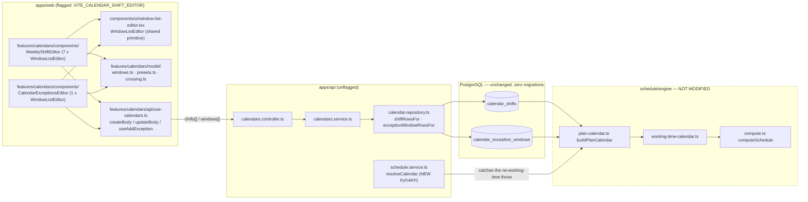
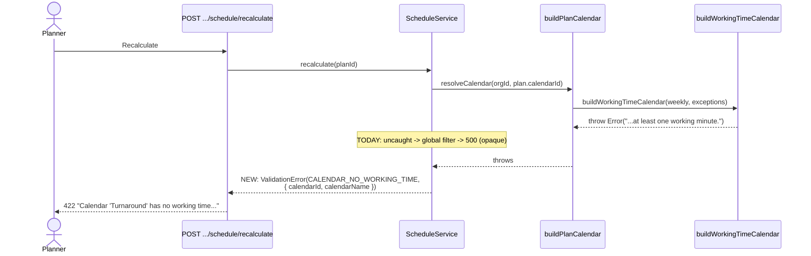
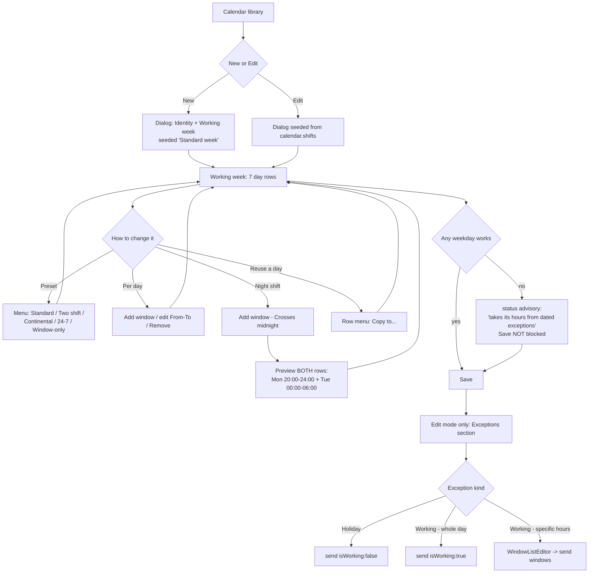

# Feature Spec: The calendar shift-pattern editor & the exception-window half of ADR-0036

- **Status:** Draft — awaiting approval
- **Author(s):** feature-analyst (with James Ewbank)
- **Date:** 2026-08-01
- **Tracking issue / epic:** _(to be raised)_
- **Roadmap link:** ADR-0036 follow-on — the authoring half of the hour/shift-granular rework
- **Related ADR(s):** **ADR-0067** (this epic, drafted beside this spec) · ADR-0036 (the rework being
  completed) · ADR-0024 (calendars) · ADR-0053 (calendar tiers/archive) · ADR-0034 (the recalc parity
  gate) · ADR-0061 (dialog layout) · ADR-0066 (the seed catalogue) · ADR-0058 (verify the claim)

---

## 0. What was verified before this spec was written

ADR-0058's rule is _verify the claim; do not trust the document_. It was applied to the brief for this
epic, and **the brief was wrong in one large way and several small ones**. Everything below is
file-and-line checked against the working tree on 2026-08-01. Where this section contradicts the
epic brief, this section is what the plan is built on.

### F1 (retracted) — "most of the approved M0 has already landed" was an artefact of reading a live working tree

> **Corrected after the fact, and kept rather than deleted, because the mistake is instructive.**
> This section originally reported that the brief was "wrong in one large way": that M0's four items
> were already present and the milestone should be rescoped to "finish and prove". They were present
> — because M0 was **being written at that moment, in the same working tree**, by the session that
> commissioned this spec. The analysis read uncommitted, in-flight edits and reported them as the
> repository's existing state.
>
> ADR-0058's rule is _verify the claim; do not trust the document_ — and the working tree is a
> document too. A `git status` would have shown every one of those files modified-not-committed. The
> table below is accurate about **what the code says**; it is wrong about **what that meant**, and
> the conclusion it drew ("M0 is not a milestone to build") was false when written.
>
> M0 landed as `248bd65` shortly afterwards, which is why the code and the table agree. The findings
> **F2–F6 below are unaffected** — they were verified against code that predates this session, and F3
> in particular turned out to be a live, shipped 500 that nothing else had caught.

The brief describes M0 as work to do: "wire `CalendarExceptionWindowDto` into the exception write
path, reuse `AreWindowsOrdered`, replace-as-set in the repository, expose `windows` AND `endDate` on
the read DTO". All four were present in the working tree when this spec was written — as
work-in-progress, not as prior art.

| Brief's M0 claim                                                                                         | Actual state                                                                                                                                                                                                              |
| -------------------------------------------------------------------------------------------------------- | ------------------------------------------------------------------------------------------------------------------------------------------------------------------------------------------------------------------------- |
| `CalendarExceptionWindowDto` "is imported by nothing — dead code"                                        | It is imported by `apps/api/src/modules/calendars/dto/create-calendar-exception.dto.ts:17` and `dto/calendar-response.dto.ts`. **No longer dead.**                                                                        |
| `calendar.repository.ts:613` writes `windows: input.isWorking ? [full-day] : []`                         | That line is now `softDeleteWithExceptions`. The create is at `calendar.repository.ts:642` and reads `windows: { create: exceptionWindowRowsFor(input.windows, input.isWorking) }` — the derivation is already replaced.  |
| `CreateCalendarExceptionDto` takes only a single `date`                                                  | It now carries an optional `windows: CalendarExceptionWindowDto[]`, `@ArrayNotEmpty`, `@AreWindowsOrdered()`, `@IsMutuallyExclusiveWith('isWorking')`.                                                                    |
| `CalendarExceptionResponseDto.from` returns only `startDate`; "the end date is silently dropped on read" | It now returns `date`, `endDate`, derived `isWorking` **and** `windows` (`dto/calendar-response.dto.ts:158–176`).                                                                                                         |
| _(not in the brief)_                                                                                     | `@repo/types` has also been extended: `CalendarWindow`, `CalendarShift`, `CalendarSummary.shifts`, and `CalendarExceptionSummary.endDate` / `.windows` / derived `.isWorking` all exist in `packages/types/src/index.ts`. |

So the remaining API work is **F3–F6 below** plus the tests that prove it. (The original wording
here — "M0 is not a milestone to build; it is a milestone to finish and prove" — followed from the
retracted premise above. M0 was built, in `248bd65`, with the e2e coverage that had been missing;
F3's 422 mapping and its two regression tests went with it, at **both** calendar seams.)

### F2 (correction) — "the end date is silently dropped on read" was true of the DTO, not of user data

No write path in the product can produce `endDate ≠ startDate`. `createException` writes
`startDate: input.date, endDate: input.date` (`calendar.repository.ts:637–638`), and the interchange
batch does the same (`calendar.repository.ts:281`, and `interchange.service.ts:392` says so
explicitly). So exposing `endDate` fixes a **contract-honesty** defect — the client could not be told
about a range that does not exist yet — not data loss. That distinction matters because it is the
whole reason multi-day authoring can stay out of scope without hiding anything.

### F3 (new, live defect) — a calendar with no working time at all is creatable today, and recalculating over it is a 500

`buildWorkingTimeCalendar` throws a **plain `Error`** when a calendar has an empty week and no
positive exception (`apps/api/src/modules/schedule/engine/working-time-calendar.ts:155`:
`'A working-time calendar must have at least one working minute.'`).
`ScheduleService.resolveCalendar` (`schedule.service.ts:977–986`) does **not** catch it, and neither
does `recalculate`. The global filter turns an unrecognised throw into an opaque **500**.

That path is reachable **now**, in shipped `api-v0.34.0`, with no feature flag in front of it:

- `MIN_WORKING_WEEKDAYS_MASK` is `0` (`packages/types/src/index.ts:853`), so `POST …/calendars`
  with `workingWeekdays: 0` succeeds; and
- `shifts: []` also succeeds — `@AreWindowsOrdered` returns `true` for an empty array (its
  `windows.some(...)` is vacuously false and its per-day loop never runs) and there is no
  `@ArrayMinSize` on `CreateCalendarDto.shifts`.

Point a plan's default calendar at either and press Recalculate: **500, with nothing telling the
planner which calendar or why.** The brief places the empty week in M3 ("becomes selectable with an
inline advisory"); the defect is already shipped, so mapping it belongs in **M0′**, ahead of any web
work that makes it easy to reach.

### F4 (new) — there is no way to edit an exception; only to create and delete one

`CalendarsController` exposes `POST :calendarId/exceptions` and
`DELETE :calendarId/exceptions/:exceptionId` and nothing else. `CalendarRepository` has
`createException`, `findActiveExceptionByIdInCalendar` and `softDeleteException` — no `update`.
`CalendarException.version` exists in the schema, is returned on read, and **is never used for an
optimistic write**.

The brief's M3 ("exceptions editor gains windows") therefore has no edit path. Correcting a mistyped
window would mean delete-then-recreate: two writes, not atomic, a new id, a lost `createdAt`, and a
window in which the calendar is briefly a full working day (because deleting a holiday restores the
weekly pattern). This is a **critical question** (Q1) and, if answered "add the PATCH", it is M0′
work.

### F5 (drift) — three documents and two code files still describe the pre-`api-v0.34.0` world

- `docs/TECH_DEBT.md` §78/§79/§80 still say `CreateCalendarDto` puts `@Min(1)` on
  `workingWeekdays`, that "there is no minutes field on any DTO", and that "no write path accepts
  shift windows". All three are false. The register's own preamble says to **rewrite a row to be
  about what is left** rather than annotate it — that has not been done.
- `packages/seed-http/src/runner.ts:86–104` still refuses a window-only calendar with a
  `WINDOW_ONLY_CALENDAR_UNSUPPORTED` finding whose text quotes the removed `@Min(1)`; it still sends
  `workingWeekdays: mask` (line 116) and `isWorking: exception.windows.length > 0` (line 129),
  flattening the very shift patterns the `SeedSpec` carries in full.
- `apps/seed-cli/src/capabilities/coverage.ts:32–63` still excepts six capability keys —
  `cal_split_shift`, `cal_night_crosses_midnight`, `cal_asymmetric_week`, `cal_forces_split`,
  `cal_window_only`, `cal_empty_base_week` — as unreachable, citing debt 79/80. **All six are now
  reachable through the public API.** The coverage report is therefore under-reporting the
  application's real coverage by six keys and over-reporting its debt.
- Stale OpenAPI: `CalendarResponseDto.workingWeekdays` still declares `minimum: 1`
  (`dto/calendar-response.dto.ts:32`) although the read can now legitimately return `0`, and
  `UpdateCalendarDto.workingWeekdays` still documents "(1–127)".

This is exactly the ADR-0058 failure mode the repository has written two ADRs about: the code moved
and the documents that describe it did not. It is folded into M0′ rather than left for a
reconciliation pass, because the seeder files are **executable** documentation — the coverage report
is a gate output people read.

### F6 (gap) — the API e2e proves shifts and never proves exception windows

`apps/api/test/calendars.e2e-spec.ts` has `describe('authorable shift patterns (TECH_DEBT #80)')`
and `describe('window-only calendars (TECH_DEBT #79)')`. It has **no** exception-window coverage at
all: the exception tests (line 316) still post `{ date }` and assert `isWorking`. Nothing anywhere
asserts that an authored half-day actually **schedules** as a half-day. Given F1, that is how a
feature landed in the working tree with no proof that the thing it exists for works end to end.

### F7 (risk) — the seed model indexes weekdays 0 = Sunday; the API indexes 0 = Monday

`packages/seed/src/spec.ts:159` — "`weekday` is 0 = Sunday … 6 = Saturday". `CalendarShiftDto` —
"0 = Monday … 6 = Sunday". The existing `toWeekdayMask` (`packages/seed-http/src/runner.ts:531–538`)
already converts with `1 << ((day.weekday + 6) % 7)` and its docblock says why it is named rather
than inlined: **"Getting this wrong shifts every working week by a day and nothing fails."** Wiring
`shifts` in M4 must reuse that conversion, not re-derive it.

### F8 (confirmed) — the storage layer needs no change whatsoever

`apps/api/prisma/migrations/20260715120100_calendar_shift_model/migration.sql:59–87` already gives
`calendar_exception_windows` a bounds CHECK (`0 ≤ start`, `end ≤ 1440`), an order CHECK
(`start < end`), a **GiST EXCLUDE** for non-overlap within one exception
(`ex_calendar_exception_windows_no_overlap`), the `(calendar_exception_id, start_minute)` index the
engine loads on, and `ON DELETE CASCADE`. `calendar_shifts` has the equivalents.
**This epic ships zero migrations.**

### F9 (confirmed) — the recalc parity claim holds, structurally

Traced rather than repeated. `computeSchedule` is not imported by the calendars module, the web
calendar feature, or anything this epic touches. The engine's calendar port is built by
`buildPlanCalendar` (`apps/api/src/modules/schedule/plan-calendar.ts:43`) from persisted rows, and it
has read `shifts[].{weekday,startMinute,endMinute}` and `exception.windows[]` **since ADR-0036 M1** —
this epic changes neither that function nor `buildWorkingTimeCalendar` nor `computeSchedule`. When
`shifts`/`windows` are absent from a request, `shiftRowsFor` and `exceptionWindowRowsFor` produce
exactly the rows the mask and `isWorking` produced before, so an untouched calendar yields
byte-identical engine input.

The **one** change in this epic that touches the recalculate path is F3's error mapping. It converts
an uncaught `Error` into a typed 422: it changes the HTTP status of a request that currently returns
500 and computes nothing differently. That is stated here rather than buried, because "the parity
gate is untouched" is the sentence this repository has learnt to distrust.

---

## 1. Business understanding

### Problem

ADR-0036 was called **the gating rework**. It moved the engine and storage from working-days to
working-**minutes** and gave calendars intraday shift patterns: split shifts, night shifts crossing
midnight, asymmetric weeks with a half-day Friday, and window-only base weeks whose only working time
comes from dated exceptions. The engine implements all of it; the tables hold it; the ADR-0034
goldens are green on it.

`api-v0.34.0` (PR #205) gave the **weekly pattern** an author. Nothing gave the **planner** one. The
calendar form in `apps/web/src/features/calendars/` is still seven weekday checkboxes, and its Zod
schema still refuses an empty week with a comment naming this epic as the thing that will lift it:

> `apps/web/src/features/calendars/schemas/calendar-schemas.ts:104–113` — "This form has no way to
> author the dated exception windows such a calendar needs… It lifts with the shift-pattern editor
> (TECH_DEBT #80, web slice)."

So today a planner on a two-shift site, a night-shift possession or a turnaround programme:

- cannot describe their working week at all, and gets a schedule that is silently a whole-day
  approximation of it;
- can, since `api-v0.34.0`, create a calendar with **no working time at all** and receive an opaque
  500 the next time anyone recalculates a plan on it (F3);
- and can now be handed a calendar with real shifts by an import or a colleague's API call, open it
  in the web form, save an unrelated rename, and **silently flatten every shift to a full day** —
  because `updateBody` sends `workingWeekdays`, and the repository replaces the whole week as a set.

That last one is new damage created by shipping the API half without the web half, and it is the
sharpest argument for doing this now.

### Users

| Role               | Need                                                                                                                                                                                                                 |
| ------------------ | -------------------------------------------------------------------------------------------------------------------------------------------------------------------------------------------------------------------- |
| **Planner**        | Author and correct the working week their contract actually specifies — shifts, split shifts, nights, half-days — and the dated exceptions around it (a half-day before Christmas, a shutdown window). Primary user. |
| **Org Admin**      | The same, plus the shared organisation library. Holds `calendar:manage_org`.                                                                                                                                         |
| **Contributor**    | Reads a calendar to understand why an activity's dates fall where they do. No writes.                                                                                                                                |
| **Viewer**         | Read-only, same as Contributor.                                                                                                                                                                                      |
| **External Guest** | **Out of scope.** ADR-0051's `SCHEDULE_READ` scope deliberately excludes the calendar library; nothing here changes that.                                                                                            |

Permissions are unchanged by this epic: `calendar:read` to read, `calendar:create` / `calendar:update`
/ `calendar:delete` to write, plus `calendar:manage_org` for an ORG-tier row (ADR-0053 §2). **No new
permission is introduced.**

### Primary use cases

1. **Author a two-shift week** — 06:00–14:00 and 14:00–22:00, Monday to Friday.
2. **Author a night shift that crosses midnight** — 20:00–06:00 Mon→Tue … Fri→Sat, stored as the two
   adjacent-day windows the model requires, with both visible before saving.
3. **Author an asymmetric week** — full days Monday–Thursday, a half-day Friday.
4. **Start from a preset** — Standard week / Two shift / Continental / 24-7 / Window-only — and then
   override one day.
5. **Author a dated exception with hours** — Christmas Eve works 08:00–12:00, not the full day.
6. **Author a window-only calendar** — an empty base week plus a shutdown exception carrying all the
   working time, and understand, in the form, that the two halves must add up.
7. **Read a shift calendar without destroying it** — open a calendar an import created, see its real
   hours, and save a rename without flattening it.

### User journeys

**Happy path (weekly pattern).** Planner opens the calendar library → New calendar → names it →
Working week section shows seven day rows, seeded from the **Standard week** preset → picks **Two
shift** from the preset menu → the rows redraw as 06:00–14:00 + 14:00–22:00, Mon–Fri, and the change
is announced → overrides Friday to a single 06:00–14:00 window → Create → the row lists "Two shift,
Mon–Fri" and the detail shows the exact windows.

**Night shift.** Same, but the planner uses **Add window ▸ Crosses midnight** on Monday, enters
20:00–06:00, and the editor shows — before save — that this will be stored as **Monday 20:00–24:00**
and **Tuesday 00:00–06:00**. Both rows appear in the list; there is no hidden pairing.

**Exception with hours.** Planner opens a calendar → Exceptions → picks 24 December → chooses
**Working, specific hours** → adds one 08:00–12:00 window → Add. The list shows "24 Dec 2026 —
Working 08:00–12:00 — Christmas Eve", not just a "Working day" badge.

**Window-only.** Planner clears every day (or picks the **Window-only** preset). The week group shows
an inline advisory: _"No weekday works — this calendar takes its hours from dated exceptions. Add at
least one working exception, or the schedule will refuse to calculate."_ It is a `status`, not an
error, and it does not block Create — the form genuinely cannot see the exception half. If they save
and never add one, the **next recalculate returns a 422 naming the calendar** (F3's fix), not a 500.

**Alternate — read-only.** A Contributor opening the same dialog sees the identical day rows and
exception hours, with no add/remove controls and no preset menu, and is told why
(`aria-describedby`-linked to the group, the ADR-0060 M6 lesson).

### Expected outcomes

- A planner can describe the working week their programme actually runs on, and the CPM dates stop
  being a whole-day approximation of it.
- Six ADR-0066 capability keys move from "the application cannot express this" to reached, and the
  coverage report starts telling the truth.
- The flatten-on-unrelated-save regression created by shipping the API half alone is closed.
- The last of ADR-0036's three write-path gaps (TECH_DEBT #78 durations — closed; #79 window-only —
  API closed, web open; #80 shift patterns — API closed, web open) is fully closed, and the register
  can lose three rows.

### Success criteria

| Criterion                                           | Measure                                                                                                                                                                                               |
| --------------------------------------------------- | ----------------------------------------------------------------------------------------------------------------------------------------------------------------------------------------------------- |
| A two-shift week is authorable end to end           | The flag-on Playwright journey `apps/web/e2e-calendar-shifts/` creates one against a real API and asserts the persisted windows                                                                       |
| An authored half-day **schedules** as a half-day    | An API e2e recalculates a plan over an authored 4-hour day and asserts the finish instant, not just the stored rows                                                                                   |
| No calendar can be saved and then 500 the scheduler | An API e2e creates an empty-week/no-exception calendar, recalculates, and asserts **422** with a machine-readable reason naming the calendar                                                          |
| Nothing flattens on an unrelated save               | A unit test renames a shift calendar through the web mutation and asserts the request body carries the unchanged `shifts`                                                                             |
| Coverage report is honest                           | `cal_split_shift`, `cal_night_crosses_midnight`, `cal_asymmetric_week`, `cal_forces_split`, `cal_window_only`, `cal_empty_base_week` all report **reached**, with their `UNREACHABLE` entries deleted |
| WCAG 2.2 AA                                         | accessibility-reviewer PASS on the combined diff; axe clean in the flag-on journey                                                                                                                    |
| Flag-off is a real rollback                         | Flag-off parity suites pin the seven-checkbox form, the `isWorking` exception form, and both request bodies                                                                                           |
| Recalc parity                                       | The ADR-0034 golden suite unchanged and green; `computeSchedule`, `buildWorkingTimeCalendar` and `buildPlanCalendar` untouched in the diff (a structural test asserts it)                             |

### Open questions

Only the ones whose answers change design or scope. Defaults are stated and will be proceeded on if
not overridden.

> **Q1 (CRITICAL) — does M0′ add `PATCH …/exceptions/:exceptionId`?**
> There is no exception edit path at all today (F4). Without it, correcting a window means
> delete-then-recreate: two writes, a new id, and a moment in which a holiday has become a normal
> working day.
> **Default if unanswered: yes, add it.** A version-gated `PATCH` taking `{ windows | isWorking,
label, version }`, replacing the window set atomically, activating the `version` column that
> already exists. It is ~1 controller method + 1 repository method + the existing service shape, and
> it removes an entire class of half-applied edit from M3.

> **Q2 (CRITICAL) — is `<input type="time">` acceptable, given it cannot express 24:00?**
> The storage contract's end value for a full day and for the first half of a night shift is
> `endMinute: 1440` = **24:00**. `<input type="time">` has a maximum of 23:59 and cannot represent
> it. The options are (a) a text field with an `HH:MM` pattern that accepts `24:00`, (b) `type="time"`
> plus a separate "ends at midnight" control, or (c) `type="time"` where `00:00` in an end field is
> read back as 1440 — which is precisely the read-time inference the storage-honesty rule forbids.
> **Default: (a).** A text input, `inputmode="numeric"`, strict `HH:MM` parse, `24:00` accepted on the
> end field only, format stated in an `aria-describedby` hint. (c) is rejected outright.

> **Q3 (CRITICAL) — does M0′ block M1, or may they run in parallel?**
> M0′ is unflagged API work; M1–M3 are flagged web work. They touch disjoint files except
> `@repo/types` (already updated).
> **Default: M0′ lands first as its own PR** — the 500 (F3) is live and default-on, and the doc/seeder
> drift (F5) should not sit behind a flagged web epic.

> **Q4 (non-blocking) — preset names.** "Standard week (Mon–Fri, 08:00–17:00)", "Two shift
> (06:00–14:00, 14:00–22:00)", "Continental (rotating 12-hour, Mon–Sun)", "24/7", "Window-only".
> **Default: those five, with their hours in the label**, because a preset whose hours are invisible
> is a guess. Exact Continental hours to be confirmed by the product owner during M2; the mechanism
> does not depend on them.

> **Q5 (non-blocking) — does the calendar library table summarise shifts?**
> `formatWorkingWeekdays` currently renders "Mon–Fri" and cannot say "Two shift".
> **Default: yes, minimally** — append the distinct window count when a calendar is not whole-day
> ("Mon–Fri · 2 shifts"), behind the flag, so the table does not claim a shift calendar is an
> ordinary one. No new column.

---

## 2. Functional requirements

### User stories & acceptance criteria

> **US-1** — As a **Planner**, I want to enter the exact hours each weekday works, so that the
> schedule reflects my shift pattern instead of a whole-day approximation.
>
> - **Given** the flag is on and I hold `calendar:create`, **when** I open New calendar, **then** the
>   Working week section shows seven day rows seeded from the Standard week preset, each listing its
>   windows as `From`/`To` times with a Remove control, plus an **Add window** control.
> - **Given** a day with one window, **when** I add a second that does not overlap it, **then** both
>   rows are shown in start order and the day's total hours are stated.
> - **Given** I enter a window that overlaps an existing one on the same day, **when** the field
>   blurs, **then** an inline error names **both** windows and Save is refused — with the error
>   linked to the offending control by `aria-describedby`, not merely placed beside it.
> - **Given** I enter `To` earlier than or equal to `From`, **then** an inline error says so and
>   names the row.
> - **Given** I save, **then** the request body carries `shifts: [{weekday, startMinute, endMinute}]`
>   in weekday-then-start order and **not** `workingWeekdays`.

> **US-2** — As a **Planner**, I want a night shift that crosses midnight to be entered once and
> stored honestly, so that I neither hand-compute two rows nor trust a hidden pairing.
>
> - **Given** the crosses-midnight affordance, **when** I enter `20:00`–`06:00`, **then** the editor
>   shows, **before** I save, that this becomes **Monday 20:00–24:00** and **Tuesday 00:00–06:00**,
>   and both rows appear in the day lists as ordinary, independently editable windows.
> - **Given** the two rows are saved, **when** I reopen the calendar, **then** I see **two rows**,
>   not a reconstructed `20:00–06:00` — there is **no read-time pairing heuristic**.
> - **Given** a crossing window whose second half would overlap an existing window on the next day,
>   **then** the split is refused with an error naming both, and nothing is written.

> **US-3** — As a **Planner**, I want presets, so that the common weeks take one click and only the
> unusual ones take typing.
>
> - **Given** the preset menu, **when** I choose one, **then** every day row is replaced, the change
>   is announced with a one-line summary, and the choice is **not** persisted as an attribute — the
>   preset writes windows and then has no further existence.
> - **Given** I have applied a preset, **when** I change one day, **then** only that day changes and
>   nothing re-derives the others.
> - **Given** a day row, **when** I use its **Copy to…** action, **then** I choose target weekdays
>   from the shared APG `Menu` primitive (never hover-only) and the copy replaces those days' windows.

> **US-4** — As a **Planner**, I want to give a dated exception real hours, so that a half-day before
> a holiday is a half-day and not a whole day.
>
> - **Given** the exception form, **when** I choose **Working — specific hours**, **then** a window
>   list appears (the same primitive as the weekly editor, without a weekday) and the request carries
>   `windows`, never `isWorking`.
> - **Given** I choose **Working — whole day** or **Holiday**, **then** the request carries
>   `isWorking: true` / `isWorking: false` and **no** `windows` key — the two spellings are never
>   sent together (the API refuses that pairing with a 422).
> - **Given** an exception with hours, **when** the list renders it, **then** it shows the hours
>   ("Working 08:00–12:00"), not only a "Working day" badge.
> - **Given** Q1 is answered "yes", **when** I edit an existing exception's windows, **then** it
>   PATCHes with the row's `version` and a stale version is a friendly 409.

> **US-5** — As a **Planner**, I want to build a window-only calendar, so that I can plan a turnaround
> whose only working time is the shutdown.
>
> - **Given** I clear every weekday (or pick the Window-only preset), **then** an inline advisory
>   (`role="status"`) says the calendar takes its hours from dated exceptions, and Save is **not**
>   blocked.
> - **Given** I save such a calendar and add no working exception, **when** anyone recalculates a plan
>   on it, **then** the API answers **422** with a message naming the calendar and a machine-readable
>   `reason`, **never a 500**.
> - **Given** the advisory, **then** it is a status and not an `alert`: it describes a state the form
>   cannot fully evaluate, not an error the planner has made.

> **US-6** — As a **Contributor or Viewer**, I want to read a calendar's real hours, so that I can
> see why an activity's dates fall where they do.
>
> - **Given** I open a calendar, **then** I see every day's windows and every exception's hours, with
>   no add/remove/preset controls.
> - **Given** the controls are absent, **then** the reason is stated and linked to the group by
>   `aria-describedby` — never an invented sentence, and never a control that looks operable and is
>   not.

> **US-7** — As a **Planner**, I want an unrelated edit to leave my shifts alone, so that renaming a
> calendar does not silently flatten it.
>
> - **Given** a calendar with a split shift, **when** I open it and change only the name, **then** the
>   PATCH carries the unchanged `shifts` array (or omits the pattern entirely) and **never**
>   `workingWeekdays`.
> - **Given** the flag is **off**, **then** the form behaves exactly as today (this is the known,
>   accepted rollback cost, stated in the flag docblock).

> **US-8** — As the **team**, I want the seed catalogue to prove the two-shift calendar end to end, so
> that "the engine is green" stops standing in for "the product works".
>
> - **Given** the ADR-0066 capability tier, **then** a `plan:capability-shift-calendars` plan exists,
>   created **through the public REST API**, whose activities finish on different dates because their
>   calendars have different hours.
> - **Given** `docs/TEST_PLAYBOOK.md`, **then** that plan has a row saying what correct and **wrong**
>   look like, and `pnpm check:playbook` resolves it in both directions.
> - **Given** the coverage report, **then** the six formerly-excepted `cal_*` keys report reached and
>   their `UNREACHABLE` entries are deleted.

### Workflows

**W1 — author a weekly pattern.** Open dialog → Working week group renders 7 `DayWindowList`s from
`calendar.shifts` (or the Standard preset for a create) → edits mutate a local
`ShiftWindow[]` keyed by weekday → client-side validation mirrors `AreWindowsOrdered` exactly →
submit sends `shifts` → server revalidates (DTO), replaces the week as a set inside the
version-gated transaction, and returns the detail → cache invalidated, dialog announces and closes.

**W2 — crosses-midnight split.** Affordance collects `{weekday, from, to}` with `to ≤ from` → the
pure helper `splitCrossingWindow` returns two windows on adjacent weekdays (Sunday wraps to Monday)
→ both are previewed → confirm inserts both into the working set → normal validation applies to each
independently. The helper lives in `features/calendars/model/` and is unit-tested for the Sunday
wrap and for the whole-day boundary (`to = 00:00` ⇒ a single `[from, 1440)` window, not a
zero-length second row).

**W3 — preset.** Menu item → pure `presetWindows(presetId)` returns a full `ShiftWindow[]` → replaces
the working set entirely → announce a one-line summary. No preset id is persisted anywhere; a
calendar is its windows.

**W4 — exception with hours.** Kind selector (Holiday / Working — whole day / Working — specific
hours) → the third reveals a `WindowListEditor` with no weekday → submit sends `date`, `label`, and
**exactly one** of `isWorking` or `windows`.

**W5 — recalculate over a calendar with no working time.** `ScheduleService.resolveCalendar` wraps
`buildPlanCalendar` in a try/catch, recognises the engine's no-working-time condition and rethrows a
`ValidationError` carrying `reason: 'CALENDAR_NO_WORKING_TIME'` and the calendar's id and name → 422
→ the web surfaces it as a sentence with a link back to the calendar.

### Edge cases

| Case                                                          | Expected behaviour                                                                                                                                               |
| ------------------------------------------------------------- | ---------------------------------------------------------------------------------------------------------------------------------------------------------------- |
| Empty week, no exceptions                                     | Saveable, advisory shown; recalculate is **422** with `CALENDAR_NO_WORKING_TIME` (never 500)                                                                     |
| Empty week, a working exception exists                        | Saveable and schedulable — this is the supported turnaround shape                                                                                                |
| `shifts: []` sent explicitly                                  | Accepted (it is the window-only week); same 422-at-recalculate contract                                                                                          |
| A day with 24 windows of 1 minute                             | Accepted; no arbitrary per-day cap — the DB EXCLUDE and the ordering rule are the only limits. The UI stays a list, so it degrades to scrolling, not to breakage |
| Window `00:00–24:00`                                          | The whole day; `24:00` must be **typeable** (Q2)                                                                                                                 |
| Window ending `24:00` plus a next-day window starting `00:00` | Two independent rows; **never** re-joined on read                                                                                                                |
| Crossing window on Sunday                                     | Second half lands on **Monday** (weekday 0), by `(w + 1) % 7`                                                                                                    |
| Crossing window with `to = 00:00`                             | One window `[from, 1440)`; the second half would be zero-length and is not created                                                                               |
| Unsorted array submitted                                      | Rejected by the client and by `AreWindowsOrdered` — **never silently sorted** (storage is order-sensitive and reordering hides which pair was wrong)             |
| Concurrent edit of the same calendar                          | Existing optimistic `version` → 409 "changed elsewhere"; unchanged by this epic                                                                                  |
| Concurrent exception edit (if Q1 = yes)                       | The exception's own `version` → 409                                                                                                                              |
| Exception date collides                                       | Existing GiST `ex_calendar_exceptions_no_overlap` → 409 `DUPLICATE_EXCEPTION`; unchanged                                                                         |
| Archived calendar                                             | Still editable (ADR-0053 §4 — archived is not deleted); the editor makes no archive-specific change                                                              |
| PROJECT-tier calendar                                         | Unchanged; the tier controls and the `calendar:manage_org` gate are orthogonal to this editor                                                                    |
| Flag off                                                      | Seven checkboxes, `isWorking` exception form, `workingWeekdays` bodies — byte-for-byte today                                                                     |
| Flag on, calendar has shifts the editor cannot render         | Cannot occur — every stored shape is a list of windows per weekday, which is exactly what the editor renders                                                     |

### Permissions

Mapped to RBAC + organisation scope (ADR-0012 / ADR-0016). **Nothing new.**

| Action                                           | Permission        | Extra                                                         |
| ------------------------------------------------ | ----------------- | ------------------------------------------------------------- |
| Read a calendar and its windows/exceptions       | `calendar:read`   | —                                                             |
| Create a calendar with `shifts`                  | `calendar:create` | `calendar:manage_org` if `scope: ORG`                         |
| Update a calendar's `shifts`                     | `calendar:update` | `calendar:manage_org` if the row **is** ORG-tier              |
| Add / edit / remove an exception (incl. windows) | `calendar:update` | — (matches today's exception rules)                           |
| Recalculate a plan                               | unchanged         | The new 422 is a validation outcome, not an authorisation one |

**Not pen-gated.** A calendar is org-scoped library data, not plan structure, so ADR-0028's
single-editor lease does not apply — exactly as it does not apply today. A calendar edit _changes
schedules_, but through the next recalculate, which is itself pen-gated. This is stated because
"structural write ⇒ needs the pen" is the obvious wrong inference here.

**External Guest:** no access. ADR-0051's `SCHEDULE_READ` scope does not include the calendar
library and this epic does not extend it.

### Validation rules

Shared client↔server. The client mirrors `AreWindowsOrdered` **exactly**; the server remains the
enforcing boundary.

| Field                                   | Rule                                                                          | Where                                                                          |
| --------------------------------------- | ----------------------------------------------------------------------------- | ------------------------------------------------------------------------------ |
| `startMinute` / `endMinute`             | integer, `0 ≤ v ≤ 1440`                                                       | Zod (web) + `@IsInt/@Min/@Max` (API) + DB CHECK                                |
| window                                  | `startMinute < endMinute`                                                     | Zod + `AreWindowsOrdered` + `ck_*_window_order`                                |
| windows within a weekday / an exception | sorted ascending by `startMinute`, non-overlapping, in the **caller's** order | Zod + `AreWindowsOrdered` + GiST EXCLUDE                                       |
| `weekday`                               | integer `0..6`, **0 = Monday**                                                | Zod + `@Min/@Max`                                                              |
| `shifts` vs `workingWeekdays`           | mutually exclusive; neither on create ⇒ 422                                   | `@IsMutuallyExclusiveWith` + `@ValidateIf`                                     |
| `windows` vs `isWorking`                | mutually exclusive; `windows` must be non-empty when present                  | `@IsMutuallyExclusiveWith` + `@ArrayNotEmpty`                                  |
| Whole calendar                          | "has working time within the horizon"                                         | **Engine only**, at recalculate — the form cannot see both halves, and says so |
| Time text entry                         | strict `HH:MM`; `24:00` accepted on an end field only                         | Zod (web)                                                                      |

### Error scenarios

| Scenario                                     | Detection                                          | User-facing result                                                                                                                                         | Status               |
| -------------------------------------------- | -------------------------------------------------- | ---------------------------------------------------------------------------------------------------------------------------------------------------------- | -------------------- |
| Overlapping / unsorted / inverted windows    | Zod, then `AreWindowsOrdered`                      | Inline error naming the offending pair, linked to the control                                                                                              | 422                  |
| Both `shifts` and `workingWeekdays`          | `@IsMutuallyExclusiveWith`                         | "Send the weekly pattern one way or the other"                                                                                                             | 422                  |
| Both `windows` and `isWorking`               | `@IsMutuallyExclusiveWith`                         | Same shape, for the exception                                                                                                                              | 422                  |
| Empty `windows: []` on an exception          | `@ArrayNotEmpty`                                   | "Omit the hours for a non-working day"                                                                                                                     | 422                  |
| Calendar has no working time, at recalculate | **New** catch in `ScheduleService.resolveCalendar` | "Plan X can't be scheduled: calendar 'Turnaround' has no working time. Add a working exception or a working weekday." + `reason: CALENDAR_NO_WORKING_TIME` | **422** (today: 500) |
| Stale calendar `version`                     | existing                                           | "This calendar was changed elsewhere. Refresh and try again."                                                                                              | 409                  |
| Stale exception `version` (Q1 = yes)         | new, same shape                                    | same sentence, for the exception                                                                                                                           | 409                  |
| Duplicate exception date                     | GiST EXCLUDE                                       | "An exception already exists for that date."                                                                                                               | 409                  |
| Not a member / wrong org                     | `resolveScope`                                     | 404, no existence oracle                                                                                                                                   | 404                  |
| Insufficient role                            | `assertCan`                                        | "You do not have permission…"                                                                                                                              | 403                  |

---

## 3. Technical analysis

| Area           | Impact   | Notes                                                                                                                                                                                                                                                                                                                           |
| -------------- | -------- | ------------------------------------------------------------------------------------------------------------------------------------------------------------------------------------------------------------------------------------------------------------------------------------------------------------------------------- |
| Frontend       | **high** | One new shared primitive (`WindowListEditor`); the calendar form's Working-week section rewritten; the exceptions editor gains a kind selector + window list; presets + copy-day; new flag; flag-off parity suites; a new Playwright suite + CI step                                                                            |
| Backend        | **low**  | The exception write path already takes `windows`. Remaining: the F3 error mapping in `ScheduleService`, and — subject to Q1 — one `PATCH` exception endpoint + repository method                                                                                                                                                |
| Database       | **none** | F8: every table, CHECK, EXCLUDE and index this needs already exists. **Zero migrations.**                                                                                                                                                                                                                                       |
| API            | **low**  | Subject to Q1, one new route. Otherwise: correcting two stale `@ApiProperty` declarations, and declaring the new 422 on the recalculate routes                                                                                                                                                                                  |
| Security       | **low**  | No new permission, no new endpoint shape beyond a version-gated PATCH under existing org scoping. Input is bounded integers with DB CHECKs behind them. Worth a security-reviewer pass on the PATCH's org/calendar scoping (an exception is reached via its calendar, which is org-scoped — the anti-IDOR path must not change) |
| Performance    | **low**  | A calendar has ≤ ~14 windows in a normal week; the reads already `include` shifts and windows and are backed by the two engine-load indexes. No new query, no N+1, no pagination change. The web editor holds one array in component state                                                                                      |
| Infrastructure | **low**  | One new `VITE_` flag, one new Playwright config + package script + CI step (the `e2e-library` precedent)                                                                                                                                                                                                                        |
| Observability  | **low**  | The new 422 should log at `warn` with `calendarId`/`planId` — a calendar with no working time is an operator-interesting condition, not a routine rejection                                                                                                                                                                     |
| Testing        | **high** | API e2e for exception windows **and** for the schedule outcome; the 422 path; unit tests for the split/preset/validation helpers; component + a11y tests for the primitive; flag-off parity suites; a flag-on journey; a seeded plan + playbook row + `check:playbook`                                                          |

### Dependencies

**Satisfied already:**

- ADR-0036 M1 — minute-granular engine, `calendar_shifts` / `calendar_exception_windows`,
  `buildPlanCalendar`. Hard prerequisite; landed 2026-07-15.
- `api-v0.34.0` — `shifts` on the calendar DTOs, `MIN_WORKING_WEEKDAYS_MASK = 0`.
- The working tree's exception-window API work (F1) — `windows` on the create DTO,
  `exceptionWindowRowsFor`, `endDate`/`windows` on the read DTO, `@repo/types` extended.
- ADR-0061 — `FormSection` / `FieldGrid` / `Dialog` sizes; the editor is a consumer, not a new layout.
- The shared APG `Menu` (`components/ui/menu.tsx`) for the preset and copy-day actions.
- `useAnnounce` (`components/ui/announcer.tsx`) for every state change.

**Must land first, inside this epic:**

- **M0′** — the F3 error mapping, before M3 makes the empty week easy to reach.
- **Q1's PATCH**, if approved, before M3's exception editor.
- `@repo/types` is already built with the new shapes; ADR-0019's build contract means the web must
  consume `@repo/types` **dist**, so a stale `packages/types/dist` will silently hide `shifts` from
  the web's type checker. Verify the build before starting M1.

**Deliberately out of scope:**

- **Multi-day exception ranges as input.** `endDate` is exposed on read (already); a shutdown-range
  editor is a separate decision. Nothing is hidden by deferring it (F2).
- **The week grid.** If it ever earns its place, it is a **read-only preview rendered from the same
  windows**, never a second editor (ADR-0067).
- **Interchange fidelity.** `ImportCalendarBatchInput` still carries only `workingWeekdays`, so an
  import still flattens shifts. Now that the DTOs can carry them, that is a real and newly-tractable
  gap — recorded as a TECH_DEBT row by this epic, not fixed by it.
- **Per-activity calendar authoring changes** (ADR-0037) — unaffected.

---

## 4. Solution design

### Architecture overview



The dashed box is the point: **this epic writes no code inside it.** The only new arrow touching the
engine is a `catch` around an existing call.

### Data flow — authoring a two-shift week

```mermaid
sequenceDiagram
  actor P as Planner
  participant F as CalendarFormDialog
  participant W as WindowListEditor
  participant M as model/windows.ts (pure)
  participant H as useUpdateCalendar
  participant A as PATCH /organizations/:slug/calendars/:id
  participant S as CalendarsService
  participant R as CalendarRepository
  participant D as Postgres

  P->>F: choose preset "Two shift"
  F->>M: presetWindows('two-shift')
  M-->>F: ShiftWindow[] (Mon-Fri x 2)
  F->>W: render 7 day lists
  P->>W: Friday - remove 2nd window
  W->>M: validateWindows(next)
  M-->>W: ok
  W-->>F: onChange(next)
  P->>F: Save changes
  F->>H: mutate({ name, shifts, version })
  H->>A: PATCH { shifts:[...], version }
  A->>S: UpdateCalendarDto (AreWindowsOrdered passed)
  S->>R: updateIfVersionMatches({ shifts })
  R->>D: BEGIN; UPDATE calendars (version+1);<br/>DELETE calendar_shifts; INSERT rows; COMMIT
  D-->>R: ok (GiST EXCLUDE + CHECKs are the backstop)
  R-->>S: 1
  S-->>A: CalendarDetailResponseDto (shifts echoed)
  A-->>F: 200
  F->>P: announce "Calendar 'Site' saved." + close
```

Note what is **not** in this diagram: no recalculate, no engine call, no pen. A calendar edit changes
future schedules; it does not compute one.

### Data flow — the new 422 (F3)



### User flow



### Database changes

**None.** See F8. Every constraint this feature relies on already exists and is exercised by the
engine's own load path. The absence of a migration is itself a claim worth testing: a
`prisma migrate diff` drift check already runs in CI and must stay clean.

### API changes

**Already present (verify, document, and test — do not rebuild):**

- `POST …/calendars/:calendarId/exceptions` accepts
  `{ date, label?, isWorking? | windows? }` — mutually exclusive, `windows` non-empty, ordered.
- `GET …/calendars/:calendarId` returns each exception as
  `{ id, date, endDate, isWorking, windows[], label, version, createdAt, updatedAt }`.
- `POST|PATCH …/calendars` accept `shifts` / `workingWeekdays`, mutually exclusive.

**New in M0′:**

1. **The recalculate 422.** `ScheduleService.resolveCalendar` catches the engine's no-working-time
   condition and throws `ValidationError` with
   `details: { reason: 'CALENDAR_NO_WORKING_TIME', calendarId, calendarName }`. Declared with
   `@ApiUnprocessableEntityResponse` on `…/schedule/recalculate`, the programme recalculate, and the
   baseline capture (`BaselinesService.resolveCalendar` has the identical uncaught shape). Add
   `CALENDAR_NO_WORKING_TIME` to `CALENDAR_ERROR` in `@repo/types` so client and server share the
   sentence, matching `CALENDAR_WRONG_SCOPE`'s precedent.

   > Detection must not be a string match on the engine's message if it can be avoided. Preferred:
   > give `working-time-calendar.ts` a named error class (`NoWorkingTimeError extends Error`) and
   > export it — a two-line change in the engine folder that adds no behaviour and no branch to
   > `computeSchedule`. **If the product owner prefers the engine folder be touched by literally
   > nothing, the fallback is a message match, recorded as debt.** Flagged because "the engine is
   > untouched" is a claim this epic should not quietly weaken.

2. **`PATCH …/calendars/:calendarId/exceptions/:exceptionId`** — _subject to Q1._
   Body `{ windows? | isWorking?, label?, version }`; 200 with the exception DTO; 409 on a stale
   `version`; 404 for an exception outside the caller's org-scoped calendar; 422 for the
   mutually-exclusive pairing. Replaces the window set inside one transaction and bumps **both** the
   exception's `version` and the calendar's (via the existing `touchVersion`, so a stale calendar
   edit still 409s — the rule the create and delete already follow).

**Corrections:** `CalendarResponseDto.workingWeekdays` `minimum: 1 → 0`;
`UpdateCalendarDto.workingWeekdays` description "(1–127)" → "(0–127; 0 = window-only)".

### Component changes

**New shared primitive — `apps/web/src/components/ui/window-list-editor.tsx`.**

It lands **with its first consumer** in M1, never ahead of it — the TECH_DEBT #57 precedent, whose
no-consumer deadline expired. It is in `components/ui/` rather than the calendars feature because it
has **two** consumers on day one (the weekly editor and the exception editor), which is the whole
argument for the substrate (ADR-0067 §2).

```
WindowListEditor
  props: {
    value: Window[]                    // { startMinute, endMinute }, no weekday
    onChange(next: Window[]): void
    label: string                      // "Monday" | "Working hours"
    labelId?: string                   // when an existing heading names the group
    readOnly?: boolean
    readOnlyReason?: string            // linked by aria-describedby; never invented
    error?: string
    allowCrossMidnight?: boolean       // weekly editor only
    onCrossMidnight?(from,to): void    // the split is the CONSUMER's decision (it owns the week)
  }
```

**A11y contract — stated explicitly, because this is where this class of work has failed here
before** (ADR-0060 M6, 0062 M6, 0063 M6, 0064 §7 each found _state_ defects, never a substrate one):

| Concern            | Contract                                                                                                                                                                                                                                                               |
| ------------------ | ---------------------------------------------------------------------------------------------------------------------------------------------------------------------------------------------------------------------------------------------------------------------- |
| Grouping           | `role="group"` + `aria-labelledby` pointing at the day's heading. **Not** `<fieldset>/<legend>` — ADR-0061 settled that a `<legend>` only captions as first child and a fieldset's `min-width: min-content` overflows a narrow dialog                                  |
| Row semantics      | An `<ul>` of `<li>` rows. **Not** a `<table>`: two time fields and a button are not tabular data, and a table of form controls costs every AT user a grid-navigation model for no information                                                                          |
| Column headers     | Rendered once, visually, as `aria-hidden` decoration. The programmatic name lives on each control                                                                                                                                                                      |
| Control naming     | `aria-label` beginning with the visible column word, then the row's identity: `"From — Monday, window 2"`. Beginning with the visible word keeps WCAG 2.5.3 Label in Name satisfied even though the header is decorative                                               |
| Time entry         | Text input, `inputmode="numeric"`, strict `HH:MM`, `24:00` accepted on `To` only (Q2). Format stated once per group in an `aria-describedby` hint — not repeated per field                                                                                             |
| Errors             | Rendered per row, **`aria-describedby`-linked to the offending control** (the ADR-0060 M6 finding: a sentence beside a control is not a sentence attached to it), and also collected into the existing `FormErrorSummary`                                              |
| Add / Remove       | Real `<button>`s. Remove's accessible name is `"Remove window 2 from Monday"`, never a bare "Remove"                                                                                                                                                                   |
| Focus after Remove | Moves to the next row's `From`, or to the group's stable region when the list empties — the `CalendarExceptionsEditor` `listRegionRef` precedent, so focus never falls to `<body>`                                                                                     |
| Announcements      | Every mutation announces via `useAnnounce`: add, remove, preset applied, copy-to, and the crossing split (**"Added Monday 20:00–24:00 and Tuesday 00:00–06:00"** — both rows named, because the split is the one place a user could believe something else was stored) |
| Result state       | The group announces its settled total: "Monday works 8 hours in 2 windows" (the ADR-0053 M6 "announce the settled result count" finding, WCAG 4.1.3)                                                                                                                   |
| Disabled controls  | **Never the native `disabled` attribute** on anything that toggles during a save — `aria-disabled` + a reason (the `ScopeSaveBar` lesson, re-learnt in ADR-0063 M6)                                                                                                    |
| Read-only          | Values rendered as text, controls absent, reason linked by `aria-describedby` — not shown-and-shaded, not silently missing                                                                                                                                             |
| Keyboard           | Everything in natural tab order. Row actions use the shared APG `Menu`; **never hover-only** (`docs/UX_STANDARDS.md` "Row / node actions")                                                                                                                             |
| Colour             | Nothing encoded in colour alone; the working/holiday distinction stays textual, as it already is                                                                                                                                                                       |

**Changed:**

- `features/calendars/components/CalendarFormDialog.tsx` — the "Working week" `FormSection` renders
  `WeeklyShiftEditor` when the flag is on and the seven `ToggleChip`s when it is off. Both branches
  live behind one boolean at the top of the section, so the flag-off path is the existing tree
  unmodified.
- `features/calendars/components/CalendarExceptionsEditor.tsx` — the two-option `Select` becomes a
  three-option kind selector; the third reveals a `WindowListEditor`; the list rows render hours.
  **Nit to fix while here:** the kind `<select>` currently uses a hardcoded `id="exception-kind"`
  (line 166) — a duplicate-id bug the moment two editors mount. Use `useId()`.
- `features/calendars/api/use-calendars.ts` — `createBody`/`updateBody` send `shifts` when the flag
  is on; `useAddException` sends `windows` when hours were chosen. Both keep the exact current shape
  flag-off (the `scopeBody` precedent: **omit the key entirely**, never send `undefined`).
- `features/calendars/schemas/calendar-schemas.ts` — the `mask >= 1` refinement lifts **only when the
  flag is on**; the comment there (which names this epic) is replaced with what is now true.
- `features/calendars/components/CalendarsTable.tsx` — `formatWorkingWeekdays` gains a shift-count
  suffix (Q5).

**New pure model files** (unit-testable without React, the argument for extracting them):
`features/calendars/model/windows.ts` (validate/format/parse `HH:MM` ↔ minutes),
`model/crossing.ts` (`splitCrossingWindow`), `model/presets.ts` (`presetWindows`).

### Implementation approach & alternatives

**Chosen: per-day time rows as the substrate, with presets and per-day override on top.** The full
reasoning is ADR-0067; in summary:

1. **Rows are in every version of this feature.** A grid still needs numeric entry for precision — a
   07:30 start comes from a contract, not from a pixel — so "a grid" is really grid **plus** rows,
   while "presets" is rows **plus** presets. The substrate is not the choice being made.
2. **Windows must be edited in two places** — a weekly pattern (with a weekday) and a dated exception
   (without one). A 7-column week grid structurally cannot serve the second, so choosing it commits
   the codebase to **two** window editors that must agree about overlap, ordering and midnight. One
   `WindowListEditor` serves both. This is ADR-0059's "the time axis is shared, not reimplemented"
   and ADR-0062's "extracted, not reimplemented".
3. **Every enablement gate in this repository has found _state_ defects** — inert controls, native
   `disabled`, unannounced changes, dropped fields — and never a substrate choice. A hand-rolled drag
   grid multiplies exactly that class against a WCAG 2.2 AA merge gate, with no APG pattern to
   follow.
4. **There is no premise for a heavy substrate.** ADR-0026 chose canvas because it had one —
   thousands of items at arbitrary 2-D positions with routed links. ADR-0059 declined canvas for the
   Gantt once virtualization removed that premise. A working week is ≤ ~14 windows whose **values**
   are the information, not their pixel positions.

**Night shifts: literal storage, assisted entry, no read-time inference.** A "crosses midnight"
affordance splits 20:00–06:00 into `{weekday: 0, 1200–1440}` + `{weekday: 1, 0–360}` and shows both
rows **before** save. Nothing pairs them on read. The alternative — infer a crossing when a day ends
at 1440 and the next starts at 0 — is wrong for a genuine 24-hour calendar, where every adjacent pair
matches that shape and none of them is a night shift.

**The empty week is selectable with an inline advisory**, not silently allowed and not blocked. The
engine checks both halves at recalculation; the form can only see one, so it says so rather than
guessing. Its honesty depends on F3's fix: an advisory that leads to a 500 is worse than no advisory.

**Alternatives considered and rejected:** the drag-and-drop week grid (§2 above; if it earns its place
later it is a **read-only preview from the same data**, never a second editor); a preset-only
dropdown with no free entry (cannot express a 07:30 start, which is most contracts); a raw JSON
textarea (expresses everything, teaches nothing, and fails 3.3 outright); inferring crossings on read
(above).

---

## 5. Links

- Implementation plan: [`./implementation-plan.md`](./implementation-plan.md)
- ADR: [`../../adr/0067-calendar-shift-editor-and-storage-honesty.md`](../../adr/0067-calendar-shift-editor-and-storage-honesty.md)
- Docs this change must update: `docs/TECH_DEBT.md` (rewrite #78/#79/#80 to what is left, or delete),
  `docs/API.md`, `docs/DESIGN_SYSTEM.md` (the `WindowListEditor` entry), `docs/COMPONENT_LIBRARY.md`,
  `docs/TEST_PLAYBOOK.md` (the new seeded plan), `docs/TESTING.md` (the new suite),
  `apps/seed-cli/src/capabilities/coverage.ts` (delete six exceptions), `CLAUDE.md` §16 (ADR-0067).
