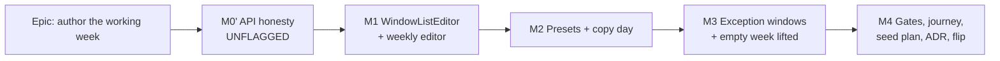

# Implementation Plan: The calendar shift-pattern editor & the exception-window half of ADR-0036

- **Feature spec:** [`./feature-spec.md`](./feature-spec.md) — read §0 first; the epic brief was
  materially out of date and the milestone shape below reflects the verified tree, not the brief.
- **Status:** Draft — awaiting approval
- **Owner:** _(unassigned)_
- **Flag:** `VITE_CALENDAR_SHIFT_EDITOR`, `flagDefaultOff`, flipped in M4 after the gate pass.

## Breakdown

### Epic

**Author the working week** — close the last of ADR-0036's three write-path gaps by giving the
planner an editor for intraday shift patterns and exception windows, and make the documents that
describe that gap true again. Roadmap theme: the hour/shift-granular rework's authoring half.

**Two invariants hold across every milestone and are asserted, not asserted-about:**

- **The CPM engine is not modified.** A structural test pins that the epic's diff touches no file
  under `apps/api/src/modules/schedule/engine/` except the single named-error export in M0′-T1 (if
  Q1b is approved), and the ADR-0034 golden suite is unchanged and green.
- **Flag-off is byte-for-byte today.** Parity suites `vi.mock` `@/config/env` with
  `CALENDAR_SHIFT_EDITOR_ENABLED: false` and pin both the rendered form and the **request bodies**
  (the ADR-0053 M6 rollback contract). They are kept, never weakened.

---

## Milestone M0′ — Close the API half honestly (unflagged)

**Outcome:** the exception-window write path that already exists is **proved** to work end to end; a
calendar can no longer be saved into a state that 500s the scheduler; and the three documents plus
two code files that still describe the pre-`api-v0.34.0` world are corrected.

**Why it is first:** the 500 (spec F3) is live, default-on and reachable with two lines of curl. The
seeder and coverage report are executable documentation people read. Neither should sit behind a
flagged web epic. See spec Q3.

---

#### Feature: M0′-F1 — The no-working-time 422

> **Description:** map the engine's "no working time within the horizon" condition to a typed 422
> naming the calendar, on every path that builds a calendar port.
> **Complexity:** S
> **Dependencies:** none
> **Risks:** detecting the condition by matching the engine's message string is brittle → prefer a
> named exported error class (a two-line, behaviour-free change in the engine folder). If the product
> owner rules the engine folder untouchable, fall back to the message match **and record it as
> TECH_DEBT**, rather than pretending the coupling is not there.
> **Testing requirements:** API e2e (create empty-week calendar → plan on it → recalculate → 422 with
> `reason`), plus a unit test for the mapping and one for the baseline path.

##### Task M0′-T1 — Name the engine's condition (≈ one PR with T2)

- **Description:** export `NoWorkingTimeError extends Error` from
  `apps/api/src/modules/schedule/engine/working-time-calendar.ts` and throw it where the plain
  `Error` is thrown at line 155. No branch, no behaviour, no signature change.
- **Complexity:** S
- **Dependencies:** product-owner answer to Q1b (may the engine folder be touched at all)
- **Risks:** none functionally; the risk is precedent — record in the ADR that this is an error
  **type**, not engine logic, and that `computeSchedule` is untouched.
- **Testing:** the existing `working-time-calendar.spec.ts` guard test switches from `/at least one
working minute/` to `toThrow(NoWorkingTimeError)` and keeps the message assertion.
- **Development steps:**
  1. Add and export the class; throw it; re-export from `engine/index.ts`.
  2. Update the two existing assertions (`working-time-calendar.spec.ts:287`,
     `conformance/negative.spec.ts:106`) to assert the type **and** the message.
  3. Confirm the ADR-0034 golden suite is unchanged.

##### Task M0′-T2 — Map it to 422 at both service seams

- **Description:** wrap `buildPlanCalendar` in `ScheduleService.resolveCalendar`
  (`schedule.service.ts:977–986`) and `BaselinesService.resolveCalendar`
  (`baselines.service.ts:315–324`) — both have the identical uncaught shape — and rethrow a
  `ValidationError` carrying `reason: 'CALENDAR_NO_WORKING_TIME'`, `calendarId` and `calendarName`.
  Add the shared sentence to `CALENDAR_ERROR` in `@repo/types` (the `CALENDAR_WRONG_SCOPE`
  precedent). Log at `warn` with `planId`/`calendarId`.
- **Complexity:** S
- **Dependencies:** M0′-T1
- **Risks:** the catch must not swallow anything else — catch the **named type only** and rethrow
  everything else untouched (CLAUDE.md §5 "never swallow").
- **Testing:** API e2e on `…/schedule/recalculate`, on `…/schedule/recalculate-programme`, and on
  baseline capture; a service unit test asserting an unrelated throw still propagates.
- **Development steps:**
  1. `CALENDAR_ERROR.CALENDAR_NO_WORKING_TIME` in `@repo/types` + rebuild dist (ADR-0019).
  2. Catch + rethrow at both seams; load the calendar name for the message (it is already in scope
     via the calendar row on the schedule path; on the baseline path fetch it only on the error path,
     as `duplicateCalendarError` does).
  3. `@ApiUnprocessableEntityResponse` on the three routes; update `docs/API.md`.
  4. Changeset (patch — a 500 becoming a 422 is a fix, and the 500 was never a contract).

---

#### Feature: M0′-F2 — Edit an exception (Q1)

> **Description:** `PATCH …/calendars/:calendarId/exceptions/:exceptionId`, version-gated, replacing
> the window set as a set. **Conditional on Q1.**
> **Complexity:** M
> **Dependencies:** none
> **Risks:** anti-IDOR — an exception must stay reachable only via its org-scoped calendar. The
> existing `findActiveExceptionByIdInCalendar(exceptionId, calendarId)` already enforces that shape;
> do not add an exception-id-first lookup. → security-reviewer pass required on this task.
> **Testing requirements:** API e2e for replace / stale version 409 / cross-org 404 / mutually
> exclusive 422 / calendar `version` bumped.

##### Task M0′-T3 — `UpdateCalendarExceptionDto` + repository + service + route

- **Description:** DTO mirroring the create's `isWorking`/`windows` exclusivity plus a required
  `version`; `updateExceptionIfVersionMatches` in the repository (delete + recreate windows inside
  the caller's transaction, exactly as `updateIfVersionMatches` does for shifts); service method
  reusing the existing org-resolve → `assertCan('calendar:update')` → load-calendar → load-exception
  shape, and calling `touchVersion` so a stale **calendar** edit still 409s.
- **Complexity:** M
- **Dependencies:** Q1 answered yes
- **Risks:** two versions in play (exception + calendar). Be explicit in the docblock: the PATCH is
  gated on the **exception's** version and additionally bumps the calendar's, matching what create
  and delete already do.
- **Testing:** the e2e list above, plus a service unit test that the window replacement and the
  version bump are in one transaction.
- **Development steps:**
  1. DTO; 2. repository method; 3. service method; 4. controller route with full `@Api*` responses;
  2. `docs/API.md`; 6. changeset (minor).

---

#### Feature: M0′-F3 — Prove the exception-window path

> **Description:** the API e2e that should have landed with the code (spec F6) — including the one
> assertion that matters: an authored half-day **schedules** as a half-day.
> **Complexity:** M
> **Dependencies:** M0′-F1 (so the 422 case can be asserted in the same describe)
> **Risks:** a test that only round-trips the DTO proves the write path and not the feature. The
> schedule assertion is the point, not an extra.
> **Testing requirements:** this task **is** the testing.

##### Task M0′-T4 — `describe('authorable exception windows')` in `calendars.e2e-spec.ts`

- **Description:** add cases for: authoring a half-day exception and reading the windows back
  exactly; `windows: []` refused (`@ArrayNotEmpty`); `isWorking` + `windows` together refused (422);
  overlapping/unsorted/inverted exception windows refused; `endDate` present and equal to `date`;
  a holiday reading back as `windows: []` and `isWorking: false`.
- **Complexity:** M
- **Dependencies:** none
- **Risks:** none
- **Testing:** self
- **Development steps:** mirror the existing `authorable shift patterns` describe's structure.

##### Task M0′-T5 — The scheduling assertion

- **Description:** in `apps/api/test/`, create a calendar whose Monday works `08:00–12:00` only,
  a plan on it with one 4-hour (240-minute) activity starting Monday, recalculate, and assert the
  activity finishes **Monday 12:00** — and that the same activity on a full-day calendar does not.
  Then the exception form: a full-day week with a `08:00–12:00` **exception** on the Tuesday, and an
  activity that must therefore spill to Wednesday.
- **Complexity:** M
- **Dependencies:** M0′-T4; TECH_DEBT #78's `durationMinutes` (already shipped) to express 4 hours
- **Risks:** the assertion must read the **computed instants**, not the day-rounded display fields,
  or a whole-day approximation would still pass. This is precisely the failure mode ADR-0066 exists
  to catch — write the test to fail against a full-day calendar first, and record that it did.
- **Testing:** self
- **Development steps:**
  1. Build both calendars through the public API.
  2. Recalculate; assert instants.
  3. Assert the contrast between the two calendars explicitly (the `plan:capability-calendars`
     playbook rule: two calendars agreeing means the calendar is not being read).

---

#### Feature: M0′-F4 — Reconcile the documents that describe the old world

> **Description:** spec F5 — `docs/TECH_DEBT.md` #78/#79/#80, `packages/seed-http/src/runner.ts`,
> `apps/seed-cli/src/capabilities/coverage.ts`, and two stale `@ApiProperty` declarations.
> **Complexity:** M
> **Dependencies:** none (independent of F1–F3; can be its own PR)
> **Risks:** deleting the six `UNREACHABLE` entries changes the coverage report's numbers; if the
> seeder is not wired to `shifts` in the same change, six keys become **missing** rather than
> reached, and `coverageReport().missing` being non-empty is a gap in the catalogue. → **the seeder
> wiring and the exception deletion must land in one PR.**
> **Testing requirements:** `pnpm check:playbook`; the seeder's own `runner.spec.ts`; a coverage
> assertion that `missing` is empty.

##### Task M0′-T6 — Wire the seeder to `shifts` and `windows`

- **Description:** in `packages/seed-http/src/runner.ts`, replace `workingWeekdays: mask` with a
  `shifts` array built from `calendar.days`, and `isWorking: …length > 0` with `windows`; delete the
  `WINDOW_ONLY_CALENDAR_UNSUPPORTED` finding and its `continue`. **Reuse the existing weekday
  conversion** — the spec model is 0 = Sunday and the API is 0 = Monday (spec F7); `toWeekdayMask`'s
  `(w + 6) % 7` already encodes it and its docblock says why getting it wrong fails silently.
- **Complexity:** M
- **Dependencies:** none
- **Risks:** **the off-by-one-day risk is the whole task.** A wrong conversion produces a valid
  calendar describing a different week and nothing fails. → mitigate with a unit test asserting a
  Sunday-only `SeedSpec` day produces `weekday: 6`, and a Monday-only produces `weekday: 0`.
- **Testing:** `runner.spec.ts` cases for the conversion, for a split-shift day, and for a
  window-only calendar now creating successfully.
- **Development steps:**
  1. Extract `toShiftRows(days)` beside `toWeekdayMask`, sharing the conversion.
  2. Send `shifts` on create; send `windows` on exceptions when the spec carries them.
  3. Delete the window-only bail-out and its finding code.
  4. Keep the exception first-wins de-duplication (the fixture relies on it).

##### Task M0′-T7 — Delete the six coverage exceptions and rewrite the debt rows

- **Description:** delete `cal_split_shift`, `cal_night_crosses_midnight`, `cal_asymmetric_week`,
  `cal_forces_split`, `cal_window_only`, `cal_empty_base_week` from `UNREACHABLE`. Rewrite
  `docs/TECH_DEBT.md` #78/#79/#80 **to what is left** — per the register's own preamble, not
  annotated "RESOLVED": #78 and #79 are fully closed and their rows are **deleted**; #80 is rewritten
  to be about the remaining halves (the web editor, until M4 flips the flag; and interchange, which
  still flattens shifts on import). Add a new row for interchange fidelity.
- **Complexity:** S
- **Dependencies:** M0′-T6 (must land together — see the feature-level risk)
- **Risks:** the register drifting again → the rewritten #80 names the flag and the file, so the next
  reader can check it in one command.
- **Testing:** `pnpm check:playbook`; assert `coverageReport().missing` is empty.
- **Development steps:** edit; run the coverage report; paste the before/after counts into the PR.

##### Task M0′-T8 — Correct the stale OpenAPI declarations

- **Description:** `CalendarResponseDto.workingWeekdays` `minimum: 1 → 0` with a sentence saying what
  0 means; `UpdateCalendarDto.workingWeekdays` "(1–127)" → "(0–127; 0 = window-only)".
- **Complexity:** S · **Dependencies:** none · **Risks:** none
- **Testing:** the existing OpenAPI snapshot/build; the window-only e2e already asserts a 0 read.

---

## Milestone M1 — `WindowListEditor` and the weekly shift editor (flagged)

**Outcome:** behind `VITE_CALENDAR_SHIFT_EDITOR`, a Planner can enter the exact hours each weekday
works, including a night shift that crosses midnight, and save them as `shifts`.

---

#### Feature: M1-F1 — The pure model

> **Description:** `features/calendars/model/` — `windows.ts` (parse/format `HH:MM` ↔ minutes,
> `validateWindows` mirroring `AreWindowsOrdered` exactly, `totalMinutes`, `formatDaySummary`) and
> `crossing.ts` (`splitCrossingWindow`).
> **Complexity:** S
> **Dependencies:** none
> **Risks:** the client validator drifting from `AreWindowsOrdered` → the unit suite uses the **same
> table of cases** as the API's DTO spec, and a comment in each names the other.
> **Testing requirements:** unit only; no React. Cases: 24:00 parse/format; `24:00` refused on a
> start field; Sunday crossing wraps to Monday; `to = 00:00` produces one window not two;
> unsorted input rejected rather than sorted.

##### Task M1-T1 — `model/windows.ts` + `model/crossing.ts` + tests

- **Complexity:** S · **Dependencies:** none
- **Risks:** `24:00` (Q2). Write the parser's tests before the parser.
- **Testing:** as above.
- **Development steps:** 1. types; 2. parse/format; 3. validate; 4. split; 5. tests.

---

#### Feature: M1-F2 — `WindowListEditor`

> **Description:** the shared primitive, to the a11y contract in the spec §4. Lands **with** its
> first consumer in the same PR — never ahead of it (TECH_DEBT #57's expired no-consumer deadline is
> the precedent).
> **Complexity:** L
> **Dependencies:** M1-F1
> **Risks:** the whole a11y-contract table is the risk register. Specifically: native `disabled` on a
> control that flips during save; an error placed beside rather than `aria-describedby`-linked;
> focus falling to `<body>` after Remove; a change with no announcement. Each has shipped here
> before, in that order. → each gets a named regression test written to fail first.
> **Testing requirements:** component tests for add/remove/edit/validate/read-only; explicit tests
> for accessible names, `aria-describedby` wiring, focus after remove, announcement text; axe in the
> M4 journey.

##### Task M1-T2 — `components/ui/window-list-editor.tsx` + `WeeklyShiftEditor`

- **Description:** the primitive plus `features/calendars/components/WeeklyShiftEditor.tsx` (seven
  instances + the crosses-midnight affordance + the empty-week advisory placeholder, inert until M3).
- **Complexity:** L
- **Dependencies:** M1-T1
- **Risks:** as above.
- **Testing:** as above.
- **Development steps:**
  1. Primitive with the group/row/label/error/focus/announce contract.
  2. `WeeklyShiftEditor` composing seven, seeded from `calendar.shifts`.
  3. Crosses-midnight affordance calling `splitCrossingWindow` and previewing **both** rows.
  4. Read-only branch with a linked reason.
  5. `docs/DESIGN_SYSTEM.md` + `docs/COMPONENT_LIBRARY.md` entries.

##### Task M1-T3 — Wire the form, the schema, the mutations and the flag

- **Description:** `CALENDAR_SHIFT_EDITOR_ENABLED` in `config/env.ts` via `flagDefaultOff`;
  `CalendarFormDialog`'s Working-week section branches on it; `calendarFormSchema` gains a `shifts`
  field validated by `validateWindows`; `createBody`/`updateBody` send `shifts` when on and
  `workingWeekdays` when off, by **omitting the other key entirely** (the `scopeBody` precedent).
- **Complexity:** M
- **Dependencies:** M1-T2
- **Risks:** **US-7's flatten-on-rename.** Flag-on, an edit that does not touch the pattern must
  still send the calendar's existing `shifts` (or omit the pattern) — never `workingWeekdays`. →
  a named regression test asserting the request body of a rename-only save.
- **Testing:** `CalendarFormDialog` flag-on tests; a **flag-off parity suite**
  (`calendar-shift-editor-flag-off.test.tsx`) pinning the seven `ToggleChip`s and both request
  bodies, modelled on `library-scoping-flag-off.test.tsx`.
- **Development steps:** 1. flag + docblock; 2. schema; 3. section branch; 4. bodies; 5. parity
  suite; 6. changeset.

---

## Milestone M2 — Presets and copy-day

**Outcome:** the common weeks take one click; the unusual ones still take typing.

---

#### Feature: M2-F1 — Presets

> **Description:** `model/presets.ts` returning a full `ShiftWindow[]` per preset, and an APG `Menu`
> in the Working-week section offering Standard week / Two shift / Continental days / 24-7 /
> Window-only, each labelled with its hours (Q4).
> **Complexity:** M
> **Dependencies:** M1
> **Risks:** a preset id leaking into storage. It must not: a calendar **is** its windows, and a
> stored preset id would immediately disagree with a hand-edited day. → a structural test asserts no
> preset identifier appears in any request body or DTO.
> **Testing requirements:** unit tests per preset (exact windows); a component test that applying a
> preset replaces every day and announces a summary; a test that editing one day afterwards changes
> only that day.

##### Task M2-T1 — `model/presets.ts` + the preset menu

- **Complexity:** M · **Dependencies:** M1-T2
- **Risks:** Continental's exact hours are unconfirmed (Q4) → the mechanism is preset-agnostic; only
  the constant changes. **Landed** as `Continental days — every day, 06:00–18:00`; see Q4 for why
  the name changed while building it (a rota is a multi-week cycle a weekly table cannot hold).
- **Testing:** as above.
- **Development steps:** 1. constants + tests; 2. `Menu` (never hover-only); 3. announcement; 4. seed a create dialog from `Standard week`.

##### Task M2-T2 — Copy-day row action

- **Description:** a row-level `Menu` on each day: "Copy <day> to…" → **three target groups** (the
  other weekdays / every other day / the weekend) → replaces those days' windows, announced.
  **Landed as groups rather than a multi-select:** a checkbox list inside a menu inside a dialog is
  three nested choice surfaces for what is in practice always one of these three answers, and each
  group is repeatable — so two announcements and two things to undo, not one opaque batch.
- **Complexity:** M · **Dependencies:** M2-T1
- **Risks:** a destructive action with no confirmation. Copy **replaces** a target day's windows →
  announce what was overwritten, and rely on the dialog's existing unsaved-changes discard
  confirmation (ADR-0060 M6) rather than adding a second modal inside a modal.
- **Testing:** component test for the copy, the announcement, and keyboard operability of the menu.
- **Development steps:** 1. menu; 2. target picker; 3. apply + announce; 4. tests.

---

## Milestone M3 — Exception windows, and the empty week lifted

**Outcome:** a dated exception can carry real hours, and a window-only calendar can be authored — with
an honest advisory, backed by M0′'s 422.

---

#### Feature: M3-F1 — Exception hours

> **Description:** `CalendarExceptionsEditor` gains a three-way kind selector; the third reveals a
> `WindowListEditor`; rows render hours; edit uses M0′-F2's PATCH (Q1).
> **Complexity:** L
> **Dependencies:** M1-F2; M0′-F2 if Q1 = yes
> **Risks:** sending `isWorking` and `windows` together (422). → the body builder takes a
> discriminated union of the three kinds, so the impossible pairing is a compile error rather than a
> runtime rejection.
> **Testing requirements:** component tests per kind, including the exact request body; a test that
> a holiday still sends `isWorking: false` and no `windows` key; flag-off parity pinning the current
> two-option `Select` and body.

##### Task M3-T1 — Kind selector + window list + row rendering

- **Complexity:** M · **Dependencies:** M1-T2
- **Risks:** as above. Also fix the hardcoded `id="exception-kind"` → `useId()` (spec §4).
- **Testing:** as above.
- **Development steps:** 1. discriminated `ExceptionFormValues`; 2. selector + conditional list; 3. body builder; 4. row rendering with hours; 5. tests + parity suite.

##### Task M3-T2 — Edit an existing exception (Q1)

- **Complexity:** M · **Dependencies:** M0′-T3, M3-T1
- **Risks:** the 409 path must refresh the cached row so a retry carries the current version — the
  `onSettled`-not-`onSuccess` rule every other calendar mutation already follows.
- **Testing:** component test for edit + stale-version 409 copy.
- **Development steps:** 1. `useUpdateException`; 2. per-row Edit; 3. tests.

---

#### Feature: M3-F2 — Lift the empty week

> **Description:** `calendarFormSchema`'s `mask >= 1` refinement lifts **when the flag is on**; the
> Working-week group renders the inline advisory (`role="status"`) when no weekday works; Save is not
> blocked.
> **Complexity:** S
> **Dependencies:** M0′-F1 (**hard** — without the 422 this feature routes planners to a 500)
> **Risks:** the advisory read as an error → it is a `status`, worded as a statement about the
> calendar, and linked to the group by `aria-describedby`.
> **Testing requirements:** component test for the advisory's presence/absence and role; a test that
> Save is enabled with an empty week; flag-off parity pinning "Select at least one working day."

##### Task M3-T3 — Advisory + schema lift + the 422 message surface

- **Complexity:** S · **Dependencies:** M0′-T2, M1-T3
- **Risks:** the recalculate 422 must render as a sentence naming the calendar, not a generic
  "couldn't recalculate" → extend the shared `lib/api/calendar-scope-errors` mapper (which already
  turns calendar 422/409s into actionable sentences) with `CALENDAR_NO_WORKING_TIME`.
- **Testing:** as above, plus a mapper unit test.
- **Development steps:** 1. schema branch; 2. advisory; 3. mapper case; 4. tests.

---

#### Feature: M3-F3 — The library table tells the truth (Q5)

> **Description:** `formatWorkingWeekdays` gains a shift-count suffix when a calendar is not
> whole-day ("Mon–Fri · 2 shifts"), behind the flag.
> **Complexity:** S · **Dependencies:** M1 · **Risks:** none
> **Testing requirements:** unit tests for whole-day, split, asymmetric and empty weeks; flag-off
> parity pinning today's string.

##### Task M3-T4 — Summary formatting

- **Complexity:** S · **Dependencies:** M1-T3 · **Risks:** none
- **Testing:** as above · **Development steps:** 1. formatter + tests; 2. table wiring.

---

## Milestone M4 — Gates, journey, seeded plan, ADR, flip

**Outcome:** the epic's own premise applied to itself. Five specialist reviews over the combined
diff, a flag-on journey, a seeded plan proving the feature against a real API, and the flag flipped.

**This milestone is not overhead.** ADR-0060 M6, ADR-0062 M6, ADR-0063 M6 and ADR-0064 §7 each found
between four and six defects in code that had already passed a human read, and every one was a
_state_ defect of the class this editor is full of. Budget it as real work.

---

#### Feature: M4-F1 — The specialist gate pass

> **Description:** **accessibility-reviewer** (WCAG 2.2 AA over the primitive and both consumers),
> **component-reviewer** (the primitive's API, token usage, no one-off styling, no duplicated save
> bar), **ux-reviewer** (copy, state coverage, the advisory's wording, the preset labels),
> **api-reviewer** (the PATCH and the new 422 declarations), **security-reviewer** (the PATCH's
> org/calendar scoping and anti-IDOR). Every blocking finding folded **with a regression test
> verified to fail against the old code first.**
> **Complexity:** L
> **Dependencies:** M0′–M3
> **Risks:** treating a review as a sign-off rather than a defect-finding pass → the PR must record
> what was found, not that reviews ran (ADR-0058's rule applied to this epic's own gate).
> **Testing requirements:** the regression tests are the deliverable.

##### Task M4-T1 — Run the five reviews and fold the findings

- **Complexity:** L · **Dependencies:** M3 complete
- **Risks:** as above · **Testing:** one regression test per blocking finding
- **Development steps:** 1. run each reviewer over the combined diff; 2. classify blocking vs.
  suggested; 3. fold blocking with tests; 4. record the rest in `docs/TECH_DEBT.md` with numbers.

---

#### Feature: M4-F2 — The flag-on journey

> **Description:** `apps/web/e2e-calendar-shifts/` + `playwright.calendar-shifts.config.ts` +
> `test:e2e:calendar-shifts` + its own CI step (the `e2e-library` / `e2e-wbs` precedent).
> **Complexity:** M
> **Dependencies:** M4-F1
> **Risks:** a journey that only asserts the UI renders. It must drive a **real API**: create a
> two-shift calendar, reopen it and see the same windows, rename it and prove the shifts survive
> (US-7), add an exception with hours, and run an axe check. The permission model and the
> optimistic-`version` trap are only testable here — a mocked fetch accepts any version.
> **Testing requirements:** this task is the testing. Run it locally via `scripts/e2e-local.sh` before
> pushing; CI is the second opinion, never the first (ADR-0063 M6 cost five CI rounds by inverting
> that).

##### Task M4-T2 — Author the journey and wire CI

- **Complexity:** M · **Dependencies:** M4-T1
- **Risks:** locator/accessible-name drift → run locally first, always.
- **Testing:** self · **Development steps:** 1. config + support; 2. spec; 3. package script; 4. CI step; 5. `docs/TESTING.md`.

---

#### Feature: M4-F3 — The seeded plan and the playbook row

> **Description:** a `plan:capability-shift-calendars` capability plan in the ADR-0066 catalogue,
> created **through the public REST API**, plus its `docs/TEST_PLAYBOOK.md` row, gated by
> `pnpm check:playbook`.
> **Complexity:** M
> **Dependencies:** M0′-T6 (the seeder must send `shifts` first)
> **Risks:** a plan whose activities all finish on the same day proves nothing. The
> `plan:capability-calendars` row already states the rule: **two calendars agreeing means the
> calendar is not being read.** → build it as identical-duration activities on a full-day, a
> two-shift and a half-day-Friday calendar, with a duration long enough to make the contrast visible
> (the existing row needed 7 days to expose exactly this).
> **Testing requirements:** `pnpm check:playbook` resolves in both directions; the coverage report
> shows the six `cal_*` keys reached and `missing` empty.

##### Task M4-T3 — Seed spec, playbook row, coverage assertion

- **Complexity:** M · **Dependencies:** M0′-T6/T7
- **Risks:** the weekday off-by-one (spec F7) surfacing here rather than in T6 → assert the seeded
  calendar's read-back `shifts` weekday indices explicitly.
- **Testing:** as above.
- **Development steps:** 1. `SeedSpec` for the plan; 2. its description carrying the expected outcome
  (the catalogue's claim-and-plan-are-one-string rule); 3. playbook row with a **wrong** column; 4. `check:playbook`.

---

#### Feature: M4-F4 — ADR-0067, docs, and the flip

> **Description:** accept ADR-0067; update `CLAUDE.md` §16; flip `VITE_CALENDAR_SHIFT_EDITOR` to
> `flagDefaultOn` with a docblock stating what shipped, what the gates were, and what rollback
> restores.
> **Complexity:** S
> **Dependencies:** M4-F1/F2/F3 all green
> **Risks:** flipping before the gates → the flip is its own commit in its own PR, so reverting it is
> one revert.
> **Testing requirements:** the flag-off parity suites stay green **after** the flip — they are the
> rollback contract, and are kept rather than deleted (ADR-0053 M6).

##### Task M4-T4 — Accept, document, flip

- **Complexity:** S · **Dependencies:** M4-T1..T3
- **Risks:** as above · **Testing:** full pre-push gate + both e2e halves
- **Development steps:** 1. ADR status → Accepted with the flip date; 2. `CLAUDE.md` §16 entry; 3. `flagDefaultOn`; 4. changeset (minor); 5. `docs/TECH_DEBT.md` final state.

---

## Sequencing & slices

| Order | Slice                  | Releasable on its own?               | Flag                             |
| ----- | ---------------------- | ------------------------------------ | -------------------------------- |
| 1     | M0′-F1 (the 422)       | Yes — fixes a live 500               | none                             |
| 2     | M0′-F4 (docs + seeder) | Yes — one PR, T6+T7 together         | none                             |
| 3     | M0′-F2 (the PATCH, Q1) | Yes — additive endpoint              | none                             |
| 4     | M0′-F3 (the e2e proof) | Yes                                  | none                             |
| 5     | M1                     | Yes — flag off, nothing user-visible | `VITE_CALENDAR_SHIFT_EDITOR` off |
| 6     | M2                     | Yes                                  | off                              |
| 7     | M3                     | Yes                                  | off                              |
| 8     | M4-F1..F3              | Yes                                  | off                              |
| 9     | M4-F4 (the flip)       | Yes — one revert to roll back        | **on**                           |

Every slice keeps `main` releasable. Slices 1–4 are unflagged because they fix or prove already-shipped
behaviour; 5–8 are inert to users; 9 is the decision.

**M0′-T6 and M0′-T7 must land in the same PR** — deleting the coverage exceptions without wiring the
seeder turns six excepted keys into six _missing_ ones, which is a catalogue gap.

## Definition of Done (per task)

Each task's PR must satisfy the Feature Completion Criteria in [`docs/PROCESS.md`](../../PROCESS.md).
Two clauses deserve naming for this epic:

- **The pre-push gate must be run, not written.** `pnpm lint && pnpm typecheck && pnpm test`, plus
  `scripts/e2e-local.sh api` for every M0′ task (they all touch `apps/api`), plus
  `scripts/e2e-local.sh web:calendar-shifts` for M4-T2, plus `pnpm check:playbook` for M4-T3.
- **Every folded review finding carries a regression test verified to fail against the old code
  first.** The ADR-0064 §7 standard.

## Risks & assumptions (rollup)

| Risk / assumption                                                                             | Likelihood                              | Impact                                                                | Mitigation                                                                                                                                           |
| --------------------------------------------------------------------------------------------- | --------------------------------------- | --------------------------------------------------------------------- | ---------------------------------------------------------------------------------------------------------------------------------------------------- |
| Analysis reads an in-flight working tree and reports work-in-progress as existing state       | **occurred**                            | high — it produced a false "M0 is already done" conclusion            | Retracted in spec §0 F1; `git status` distinguishes committed from in-flight, and any "this already exists" finding must check it                    |
| The live 500 (F3) is reached by a user before it is mapped                                    | medium                                  | high                                                                  | **Closed** in `248bd65` — a 422 at both calendar seams, with regression tests; the variance seam was only proven after its first test wrongly passed |
| Weekday off-by-one between the seed model (0 = Sunday) and the API (0 = Monday)               | medium                                  | high — a valid calendar describing a different week, failing silently | Reuse the existing named conversion; assert both endpoints of the mapping in `runner.spec.ts` and again in M4-T3                                     |
| `<input type="time">` cannot express 24:00 (Q2)                                               | **certain**                             | medium                                                                | Text `HH:MM` field; read-time inference explicitly rejected                                                                                          |
| No exception edit path (Q1) forces delete-and-recreate in M3                                  | high without Q1                         | medium                                                                | M0′-F2 adds the PATCH; default answer is yes                                                                                                         |
| A11y _state_ defects — inert controls, native `disabled`, unannounced change, unlinked errors | **high** (four for four in prior epics) | high — a WCAG 2.2 AA merge gate                                       | The a11y contract is specified in the spec, tested per item in M1-F2, and re-audited over the combined diff in M4-F1                                 |
| The client validator drifts from `AreWindowsOrdered`                                          | medium                                  | medium                                                                | Shared case table; each side's comment names the other; the API stays the enforcing boundary                                                         |
| Flatten-on-unrelated-save (US-7)                                                              | high without a test                     | high — silent data loss on real planner data                          | Named regression test on the request body of a rename-only save, flag-on                                                                             |
| Deleting coverage exceptions without wiring the seeder creates a catalogue gap                | medium                                  | medium                                                                | T6+T7 land together; assert `missing` is empty                                                                                                       |
| Touching `engine/` at all weakens the "engine untouched" claim                                | low                                     | medium                                                                | The only change is an exported error **type**; stated in the ADR; structural test pins the rest; fallback is a message match recorded as debt        |
| Interchange still flattens shifts on import                                                   | **certain**                             | medium                                                                | Explicitly out of scope; recorded as a new TECH_DEBT row in M0′-T7 rather than left unstated                                                         |
| Assumption: `packages/types/dist` is built with the new shapes                                | —                                       | high if false — the web's type checker would not see `shifts`         | Verify before M1 (ADR-0019 build contract)                                                                                                           |
