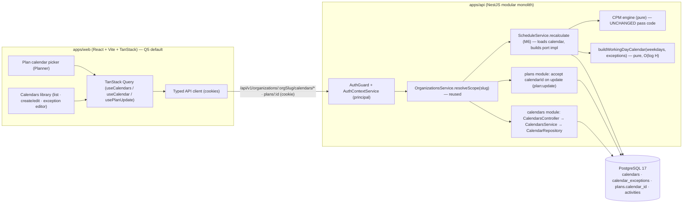
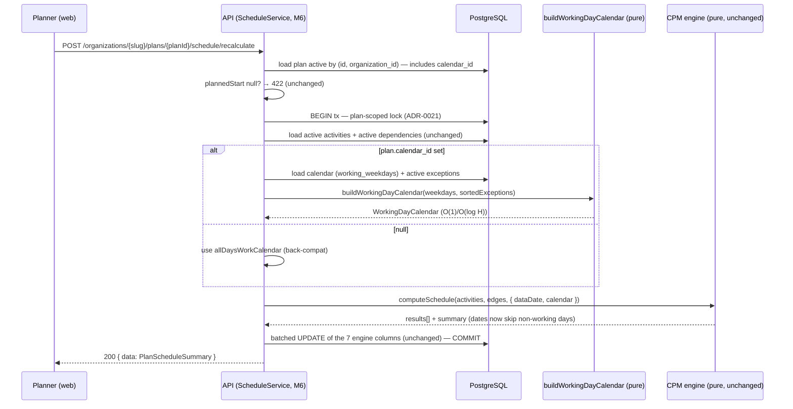
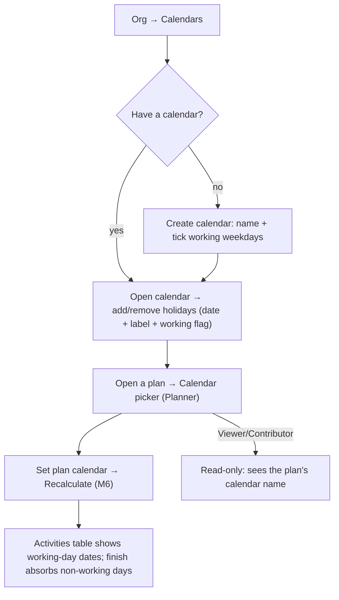

# Feature Spec: Working-day calendars

- **Status:** Draft — awaiting approval (five critical questions in §1, each with a recommended default)
- **Author(s):** Feature Analyst (Product Owner / Solution Architect / Technical Lead hats)
- **Date:** 2026-07-10
- **Tracking issue / epic:** _TBD_ — Epic "Scheduling core (CPM/GPM & the TSLD)"
- **Roadmap link:** **M5 — Calendars** — the working-day calendar layer of the
  scheduling core. It slots behind the CPM engine's `WorkingDayCalendar` port
  (M6, shipped as v0.5.0) so the engine computes **true working-day dates**
  (weekends and holidays skipped) rather than the current all-days-work
  approximation.
- **Related ADR(s):** existing — ADR-0008 (modular monolith), ADR-0012 (RBAC +
  resource scoping), ADR-0016 (identity & tenancy), **ADR-0023 (CPM scheduling
  date convention — §5 defines the calendar seam this feature fills)**, ADR-0022
  (CPM execution & persistence model — the recalculate path that consumes the
  calendar), ADR-0021 (DAG invariant). **One new ADR is proposed:**
  - **ADR-0024 — Working-day calendar model & engine integration** (the calendar
    content model; org-library + per-plan-default scoping; the back-compat rule
    for null calendars; the O(log H) calendar arithmetic; and the deliberate
    **deferral of per-activity calendars** with its correctness reasoning).
    Architecturally significant and cross-cutting.

> This is the **seventh vertical slice** of SchedulePoint. It introduces the
> **first real `WorkingDayCalendar` implementation** behind the seam ADR-0023
> deliberately built: a **plan-level working-day calendar** (which weekdays are
> worked, plus holiday/exception dates) that the CPM engine uses to skip
> non-working days when mapping schedule offsets to calendar dates. Crucially it
> lands **with no change to the pure engine's pass code** — the engine already
> delegates all calendar arithmetic to the port. It adds a new org-scoped domain
> entity (`Calendar` + its exceptions), a per-plan default calendar, a minimal
> web surface to manage the library and pick a plan's calendar, and a
> concrete, well-tested calendar implementation. **Per-activity calendar
> overrides are explicitly deferred** (see Q2/§4) — they require multi-calendar
> edge arithmetic that _is_ an engine change, not a port swap.

## 1. Business understanding

### Problem

The CPM engine (M6) computes a correct schedule but against an **all-days-work**
calendar — every calendar day, including weekends and public holidays, counts as
a working day. A 10-day task starting on a Friday finishes the following Sunday
week; a plan that spans Christmas ignores the shutdown. This is a placeholder,
not a schedule a construction planner can trust or hand to a site team.
PROJECT_BRIEF §2 lists **calendars** among "the CPM/GPM feature set construction
planners actually use," and P6-parity (§7, §17) is validated on schedules that
include calendars. Durations in the domain are already documented as **working
days** (the `duration_days` and `lag_days` comments say so, and ADR-0023 works in
working-day offsets); today that promise is unmet because the only calendar maps
working days 1:1 onto calendar days.

"Why now": M6 shipped the engine with the calendar seam (`WorkingDayCalendar`
port) built **specifically so this slice is additive** — ADR-0023 §5 states "M5
(Calendars) supplies a real calendar behind the same port with no change to the
engine." The seam exists, the reserved schema column exists, and the engine is
proven against a golden suite. Filling the seam now turns computed dates from an
approximation into real working-day dates, unblocks credible P6-parity
validation, and is a prerequisite for anything downstream that reads dates
(TSLD canvas M7, baselines, progress-aware forecasting).

### Users

Roles are per **organisation membership** (ADR-0012/0016). Managing the calendar
**library** and choosing a plan's calendar are **definition-level, Planner-owned**
acts (they change how every date in a plan is computed), the same class as
editing durations or logic. Everyone else reads the results.

| Role            | Needs in this slice                                                                                                                                       |
| --------------- | --------------------------------------------------------------------------------------------------------------------------------------------------------- |
| **Org Admin**   | Manage the org's calendar library (create/edit/delete calendars and their holidays); assign a plan's calendar; read everything.                           |
| **Planner**     | The primary user. Create/maintain calendars (working weekdays + holidays), set a plan's default calendar, then recalculate to see real working-day dates. |
| **Contributor** | **Read** calendars and which calendar a plan uses (context for progress). No calendar edits, no plan-calendar assignment.                                 |
| **Viewer**      | Read-only view of calendars and a plan's assigned calendar.                                                                                               |

### Primary use cases

1. **Manage the calendar library** — a Planner creates a reusable org-level
   calendar (e.g. "UK 5-day + bank holidays"), sets its working weekdays, and
   adds/removes holiday (and optional working-exception) dates.
2. **Assign a calendar to a plan** — a Planner sets a plan's default calendar
   from the org library.
3. **Compute a working-day schedule** — after assigning a calendar, a Planner
   recalculates (M6) and the engine skips weekends/holidays, so early/late dates
   fall only on working days and the project finish reflects real duration.
4. **Read a plan's calendar** — any member can see which calendar a plan uses
   and browse its working pattern and holidays.

### User journeys

- **Set up and use a calendar (happy path).** A Planner opens the org's
  **Calendars** area → creates "Standard + 2026 holidays", ticks Mon–Fri as
  working, adds the 2026 public holidays → opens a plan → sets its calendar to
  that calendar → clicks **Recalculate** (M6) → the activities table now shows
  dates that skip weekends and the holidays, and the project finish moves out to
  absorb the non-working days. See the user-flow diagram in §4.
- **Reader.** A Viewer opens a plan and sees, read-only, which calendar it uses
  and (in the Calendars area) that calendar's weekly pattern and holiday list.
- **Back-compat / no calendar.** A plan created before this slice (or with no
  calendar assigned) recalculates exactly as before — every day works — until a
  Planner assigns a calendar; nothing changes silently.
- **Delete guard.** A Planner tries to delete a calendar that a plan is using →
  blocked with a clear "in use by N plan(s)" message; they reassign or archive
  the plans first.

### Expected outcomes

- A plan computes **true working-day dates**: the engine skips the calendar's
  non-working weekdays and holiday dates when converting schedule offsets to
  calendar dates, with **no change to the pure engine's pass code** (the port
  contract holds — ADR-0023 §5).
- Each organisation has a **reusable calendar library** and a seeded **Standard
  (Mon–Fri)** calendar; new plans default to it, so realistic scheduling is the
  out-of-the-box behaviour without extra setup.
- Existing plans and the golden suite are **unaffected until they opt in** — the
  all-days-work behaviour remains the documented default for a null calendar, so
  the change is safe and predictable.
- The calendar arithmetic is proven correct and **fast at scale** (the inverse
  invariant `addWorkingDays(from, workingDaysBetween(from,to)) === to` and a perf
  smoke at 500/2,000 activities), so recalculation stays within the M6 NFR.

### Success criteria

- With a Mon–Fri calendar and a set of holidays assigned, a recalculated plan's
  early/late start & finish **never fall on a non-working day**, and the project
  finish equals the hand-worked working-day result (unit + e2e proven).
- Recalculation of a **500-activity** plan stays **< 500ms** and a **2,000-
  activity** plan **< 2s** (the M6 NFR) with a real calendar — the calendar math
  is O(1)/O(log H) per call, not O(span) (perf smoke).
- A plan with **no calendar** produces **identical** dates to today's all-days-
  work behaviour (regression-proven — the M6 golden suite still passes).
- **Zero cross-tenant leakage**: calendars are org-scoped; a plan can only be
  assigned a calendar from its own org; calendar CRUD is org-scoped (e2e IDOR).
- A calendar **in use by an active plan cannot be deleted** (409), so a plan can
  never dangle a missing calendar.

### Open questions

The **CRITICAL** questions (answers change the data model, engine integration,
or scope) are listed first, each with a **recommended default** so work is **not
blocked**. Non-critical questions follow with defaults already applied.

- **CRITICAL Q1 — Calendar content model: what exactly is a calendar?**
  _Recommended default:_ a calendar is **a set of working weekdays** (a 7-bit
  pattern, e.g. Mon–Fri) **plus a list of dated exceptions**. Each exception is a
  single date carrying an `isWorking` flag: `false` = a **holiday** (a non-working
  day that would otherwise be a working weekday — the common case), `true` = a
  **working exception** (a worked day that would otherwise be non-working, e.g. a
  catch-up Saturday). Storing the flag makes both directions authoritative and
  the working-Saturday case nearly free, so it is **in scope**. The engine treats
  an exception as overriding the weekday pattern for that date. Rejected
  alternatives: **weekday-pattern only** (no way to model public holidays —
  useless for construction); **holiday-only, no working exceptions** (blocks the
  common "we worked the bank holiday to catch up" — the extra flag is a boolean,
  not new machinery). **This sets the `Calendar`/`CalendarException` shape.**

- **CRITICAL Q2 — Assignment scope: org library + per-plan default, and is a
  per-activity override in this slice?**
  _Recommended default:_ **org-scoped shared calendars + a per-plan default**
  (`Plan.calendarId`) **in this slice; defer the per-activity override.** The
  brief wants all three (§5 "org-level library, per-plan default, per-activity
  override"), and the reserved `Activity.calendarId` column anticipates the
  override — but a per-activity override is **not** a free port swap. When a
  dependency's predecessor and successor use **different** calendars, the engine's
  continuous working-day **offset arithmetic breaks**: `EF_p + lag` is an offset
  in the predecessor's calendar and does not name the same calendar date as the
  same offset in the successor's calendar, so every relationship bound must round-
  trip through calendar **dates** at each edge — a **material change to the pure
  engine's pass**, contradicting "no engine change." Delivering the **single
  plan-level calendar** now honours ADR-0023 §5 exactly (zero engine change),
  ships the behaviour that matters to almost every plan, and keeps the reserved
  `Activity.calendarId` column **reserved** (still no FK). The override becomes a
  **documented follow-up** with its own ADR (multi-calendar edge arithmetic).
  Also seed a per-org **"Standard (Mon–Fri)"** calendar as the default for new
  plans. Rejected alternative: **include per-activity override now** — multiplies
  the engine's correctness surface (the named top risk, §17) before the plan-level
  calendar is even proven. **This sets the scope of the milestone.**

- **CRITICAL Q3 — Engine integration approach.**
  _Recommended default:_ **build a real `WorkingDayCalendar` from the plan's
  calendar in `ScheduleService.recalculate` and pass it to `computeSchedule`; the
  pure engine is unchanged.** A new pure factory
  `buildWorkingDayCalendar(workingWeekdays, exceptions)` (in the engine's
  `calendar.ts`, alongside `allDaysWorkCalendar`) returns an implementation whose
  `addWorkingDays`/`workingDaysBetween` are **O(1) week-arithmetic + O(log H)
  binary search** over the calendar's sorted exception dates — **not** a day-by-
  day loop. The service loads the plan's calendar (+ active exceptions) via the
  schedule repository, maps them to the factory input, and injects the result at
  the existing `ComputeOptions.calendar` seam. When `plan.calendarId` is null it
  passes `allDaysWorkCalendar` (back-compat). _Alternative:_ a **naive day-by-day
  loop** — correct and trivially simple, but O(span) per call: at 2,000 activities
  with multi-year spans this is ~tens of millions of iterations and risks the < 2s
  NFR; rejected in favour of the formula, guarded by the inverse-invariant
  property test + perf smoke. **This confirms the seam and the performance bar.**

- **CRITICAL Q4 — Migration & back-compat: what is the default for existing
  plans, and is changing computed dates acceptable?**
  _Recommended default:_ **`Plan.calendarId` is nullable; a null calendar means
  all-days-work** (today's behaviour), so existing plans and the M6 golden suite
  are **unchanged** until a Planner explicitly assigns a calendar and
  recalculates. **New** plans default to the org's seeded **Standard (Mon–Fri)**
  calendar, so realistic scheduling is the default going forward. Introducing a
  calendar **will** change a plan's computed dates on its next recalculate (the
  finish moves out to absorb weekends/holidays) — that is the **intended** effect,
  it is **opt-in per plan**, and recalculation is already an explicit user action
  (M6/ADR-0022), so nothing changes behind a planner's back. Schema: add
  `calendars` and `calendar_exceptions` tables and a nullable `plans.calendar_id`
  FK (RESTRICT); a data migration seeds one Standard calendar per existing org;
  **leave `activities.calendar_id` reserved** (no FK — the override is deferred).
  _Alternative:_ **null → org Standard** (retro-active 5-day for every plan) —
  rejected: it would silently change every existing plan's dates on next recalc,
  surprising planners; opt-in is safer. **This sets the migration and the
  behavioural contract.**

- **CRITICAL Q5 — Web surface: minimal, or richer?**
  _Recommended default:_ **minimal, like M6.** (1) An org-scoped **Calendars**
  library screen: list calendars, create/edit (name + working-weekday toggles),
  delete (guarded), and manage a calendar's holiday/exception dates
  (add/remove a date with an optional label and the working/non-working flag).
  (2) A **plan calendar picker** on the plan view (Planner-only) that sets
  `Plan.calendarId`. Read-only for everyone else. **No calendar visualisation on
  a timeline** (that belongs to the TSLD canvas, M7), no bulk holiday import, no
  calendar templates/sharing across orgs — all documented follow-ups. If the
  human prefers an **API-first** cut, the web feature can be dropped and calendars
  managed via HTTP (the plan is sequenced so this is a clean boundary). **This
  sets whether the web feature ships now.**

- _Non-critical (defaults stated, proceeding):_
  - **Weekday storage.** _Default:_ a single `working_weekdays` **smallint
    bitmask** (bit `i` = weekday `i`, `0 = Monday … 6 = Sunday`), with a CHECK
    `working_weekdays > 0` (at least one working weekday — this prevents a pattern
    with no working days, which would make `addWorkingDays` non-terminating).
    A tiny documented helper maps to/from the bitmask. Rejected: seven boolean
    columns (verbose) and a child `working_day` table (over-normalised for a
    fixed 7-element set).
  - **Exception uniqueness.** _Default:_ at most **one exception per (calendar,
    date)** among active rows (partial unique index), so a date is unambiguously
    working or non-working.
  - **Empty-calendar / no-working-day safety.** _Default:_ the `working_weekdays
    > 0`CHECK plus the finite exception list guarantee`addWorkingDays` always
    > terminates (a pattern always has ≥1 working weekday; holidays are finite, so
    > they cannot remove all working days from an unbounded span).
  - **Calendar deletion.** _Default:_ **soft-delete with an in-use guard** — a
    calendar referenced by an **active plan** cannot be deleted (**409
    `CALENDAR_IN_USE`**); its exceptions cascade-soft-delete with it
    (`delete_batch_id`, the house pattern). The seeded Standard calendar is a
    normal calendar (deletable once unused). Reassign/restore follow the
    `HierarchyLifecycleService` conventions.
  - **RBAC namespace.** _Default:_ a **new `calendar:*` namespace** —
    `calendar:read` (folded into `HIERARCHY_READ`, every member) and
    `calendar:create | calendar:update | calendar:delete` (folded into
    `HIERARCHY_WRITE`, Planner + Org Admin), mirroring the `dependency:*` /
    `schedule:*` precedent. **Assigning** a plan's calendar is a plan field, so it
    is governed by the existing **`plan:update`** permission, not a new code.
  - **Data date on a non-working day.** _Default:_ `Plan.plannedStart` (the data
    date, offset 0) is used **as given** even if it falls on a non-working day
    (e.g. a Sunday kickoff milestone). Offset 0 always maps to the data date; the
    first _working_ offset (1) is the next working day. This matches ADR-0023
    (offset 0 = data date) and avoids silently moving a planner's chosen start.
    A future "snap data date to a working day" toggle is a documented follow-up.
  - **Lag unit (working vs calendar days).** _Default:_ **out of scope** — the
    brief mentions a per-dependency `lag_unit` (§10/§17), but M6 treats all lag as
    **working days** and there is no `lag_unit` column yet. Adding calendar-day lag
    is an additive follow-up (new column + an engine branch); noted, not built.
  - **Per-org vs per-deployment shared calendars.** _Default:_ **per-org** only —
    calendars are org-scoped like Clients; a cross-org/shared "template library"
    is a documented follow-up.

## 2. Functional requirements

### User stories & acceptance criteria

> **US-1 — Manage the calendar library.** As a Planner, I want to create and edit
> org calendars with working weekdays and holidays, so plans can schedule on real
> working days.
>
> **Acceptance criteria**
>
> - **Given** I hold `calendar:create` in the org **when** I POST a calendar with
>   a name and a working-weekday pattern **then** it is created org-scoped and
>   returns **201** with the calendar.
> - **Given** a calendar **when** I add an exception `{ date, isWorking, label? }`
>   **then** it is stored and appears in the calendar's exception list.
> - **Given** a working-weekday pattern with **no** days set **then** validation
>   rejects it (**422**) — a calendar must have at least one working weekday.
> - **Given** a duplicate exception date on the same calendar **then** **409**
>   `DUPLICATE_EXCEPTION`.
> - **Given** I am a Viewer/Contributor **when** I create/edit a calendar **then**
>   **403**; I may still **read**.

> **US-2 — Assign a calendar to a plan.** As a Planner, I want to set a plan's
> default calendar, so its schedule uses that calendar.
>
> **Acceptance criteria**
>
> - **Given** I hold `plan:update` **when** I set the plan's `calendarId` to a
>   calendar **in the same org** **then** it is saved and the plan reports that
>   calendar.
> - **Given** a `calendarId` that is missing/soft-deleted/**in another org**
>   **then** **404/422** and nothing changes (anti-IDOR).
> - **Given** I clear the plan's calendar (`calendarId = null`) **then** the plan
>   reverts to all-days-work on the next recalculate.

> **US-3 — Compute a working-day schedule.** As a Planner, I want recalculation to
> skip non-working days, so dates are real working-day dates.
>
> **Acceptance criteria**
>
> - **Given** a plan with a Mon–Fri calendar and holidays **when** I recalculate
>   (M6) **then** no activity's early/late start or finish falls on a Saturday,
>   Sunday, or a holiday date, and the project finish absorbs the non-working days.
> - **Given** the same network with **no** calendar **then** the computed dates are
>   **identical** to the current all-days-work behaviour.
> - **Given** a constraint date on a non-working day **then** the engine clamps to
>   the correct working-day offset via the calendar (the M6 constraint tests still
>   hold under a real calendar).

> **US-4 — Read a plan's calendar and the library.** As any member, I want to see
> which calendar a plan uses and browse calendars, so I understand the schedule.
>
> **Acceptance criteria**
>
> - **Given** I hold `calendar:read` **when** I GET the org's calendars **then** I
>   get the paginated list; **when** I GET one **then** I see its weekly pattern
>   and exceptions.
> - **Given** I GET a plan **then** its response carries its `calendarId` (and, in
>   the web, the calendar's name).

> **US-5 — Delete a calendar safely.** As a Planner, I want to delete an unused
> calendar without breaking any plan.
>
> **Acceptance criteria**
>
> - **Given** a calendar used by **no active plan** **when** I delete it **then**
>   **204** (soft delete; exceptions cascade in the same batch).
> - **Given** a calendar used by ≥1 active plan **then** **409 `CALENDAR_IN_USE`**
>   with the count; nothing is deleted.

### Workflows

- **Create/edit calendar:** `resolveScope(principal, orgSlug)` (404 non-member) →
  `assertCan('calendar:create'|'calendar:update', orgId)` (403) → validate DTO
  (name; `workingWeekdays` bitmask 1–127) → persist org-scoped → return calendar.
- **Manage exceptions:** load calendar active & in-scope (404) → add/remove
  `{ date, isWorking, label? }` (409 on duplicate date) → return updated list.
- **Assign plan calendar:** the existing plan-update workflow, with a new optional
  `calendarId` validated to reference an **active, same-org** calendar (else
  422/404) before write.
- **Recalculate (M6, extended):** unchanged control flow (ADR-0022) except the
  service now **loads the plan's calendar + active exceptions** and builds the
  `WorkingDayCalendar` it passes to `computeSchedule` (null → `allDaysWorkCalendar`).
- **Delete calendar:** `assertCan('calendar:delete')` → count active plans
  referencing it → **409** if > 0, else soft-delete calendar + exceptions in one
  batch (`delete_batch_id`).

### Edge cases

- **No working weekday set** → rejected at validation (422) and by the DB CHECK.
- **All working weekdays set (7-day calendar)** → behaves like all-days-work
  minus any holidays.
- **Holiday on a non-working weekday** → no-op for scheduling (already non-working)
  but stored/allowed (harmless; keeps import idempotent).
- **Working exception on a working weekday** → no-op (already working); allowed.
- **Data date on a non-working day** → offset 0 maps to it as given (see Q non-
  critical default); offset 1 is the next working day.
- **Constraint / plan span crossing many holidays** → the O(log H) math counts
  exceptions in range without a per-day loop.
- **Very large plan (2,000 activities) with a real calendar** → within the M6 < 2s
  NFR (perf smoke); the calendar is built **once** per recalculate and reused.
- **Deleting a calendar in use** → 409, guarded.
- **Assigning a foreign/deleted calendar to a plan** → 404/422, anti-IDOR.
- **Plan with `calendarId` set but the calendar later soft-deleted** → prevented
  by the in-use guard (can't delete while referenced by an active plan); a
  restored plan re-referencing a deleted calendar is handled by the same guard on
  the delete side.

### Permissions

Deny-by-default (ADR-0012): every endpoint is authenticated; each pairs a
**permission check** with a **resource-scope check** (`resolveScope` → membership
in the org), and all calendar loads filter by the resolved `organization_id`.

**New permission codes** (added to `apps/api/src/common/auth/org-permissions.ts`):
`calendar:read | calendar:create | calendar:update | calendar:delete`. Assigning
a plan's calendar reuses **`plan:update`**.

**Role → permission matrix** (blank = deny):

| Capability                                           | Org Admin | Planner | Contributor | Viewer |
| ---------------------------------------------------- | :-------: | :-----: | :---------: | :----: |
| Read calendars & a plan's calendar (`calendar:read`) |     ✓     |    ✓    |      ✓      |   ✓    |
| Create / edit / delete calendars                     |     ✓     |    ✓    |      —      |   —    |
| Assign a plan's calendar (`plan:update`)             |     ✓     |    ✓    |      —      |   —    |

> Implementation note: add `calendar:read` to `HIERARCHY_READ` and
> `calendar:create|update|delete` to `HIERARCHY_WRITE` (Planner + Org Admin),
> matching the `schedule:*`/`dependency:*` precedent.

### Validation rules

Shared client↔server where possible (Zod on the web, `class-validator` DTOs on the
API), from a single `@repo/types` source for the shapes.

- **Calendar name:** non-empty, trimmed, ≤ 120 chars; **unique per org among
  active** (partial unique index; 409 `DUPLICATE_CALENDAR`).
- **`workingWeekdays`:** integer bitmask **1–127** (at least one working weekday;
  CHECK `> 0`). A helper maps `{ mon…sun: boolean }` ↔ bitmask.
- **Exception `date`:** strict `YYYY-MM-DD` calendar day (`calendar-date.ts`),
  `@db.Date`; **unique per calendar among active** (409 `DUPLICATE_EXCEPTION`).
- **Exception `isWorking`:** boolean, default `false` (holiday).
- **Exception `label`:** optional, trimmed, ≤ 120 chars.
- **`Plan.calendarId`:** optional UUID; must reference an **active, same-org**
  calendar (checked service-side inside the update tx; else 422/404).
- **Optimistic locking:** calendar and plan updates carry `version` (house
  standard); exception add/remove bumps the parent calendar's `version`.

### Error scenarios

| Scenario                                       | Detection            | User-facing result                       | Status  |
| ---------------------------------------------- | -------------------- | ---------------------------------------- | ------- |
| Not authenticated                              | auth guard           | redirect to sign-in                      | 401     |
| Not a member of the org in the URL             | `resolveScope`       | org treated as non-existent              | 404     |
| Member but insufficient role                   | permission check     | friendly forbidden message               | 403     |
| Calendar missing/deleted/foreign               | scoped active load   | "not found"                              | 404     |
| No working weekday set                         | DTO + DB CHECK       | inline "select at least one working day" | 422     |
| Duplicate calendar name (per org)              | partial unique index | inline error                             | 409     |
| Duplicate exception date (per calendar)        | partial unique index | inline error                             | 409     |
| Assign a foreign/deleted calendar to a plan    | service scope check  | "not found" / invalid                    | 404/422 |
| Delete a calendar still used by an active plan | in-use guard         | "in use by N plan(s)"                    | 409     |
| Optimistic-lock conflict (stale `version`)     | version check        | "reload and retry"                       | 409     |

## 3. Technical analysis

| Area           | Impact                  | Notes                                                                                                                                                                                                                                                                                                                                                                                                                  |
| -------------- | ----------------------- | ---------------------------------------------------------------------------------------------------------------------------------------------------------------------------------------------------------------------------------------------------------------------------------------------------------------------------------------------------------------------------------------------------------------------- |
| Frontend       | med (none if Q5 defers) | New org-scoped **Calendars** library screen (list/create/edit/delete + exception editor), and a **plan calendar picker** on the plan view. Reuses design-system DataTable/Form/Dialog primitives; no new design tokens. Rich timeline visualisation deferred to M7.                                                                                                                                                    |
| Backend        | high                    | New **`calendars` module** (controller → service → repository) copied from the reference template, following the Client/Plan hierarchy CRUD patterns; a plan-update change to accept `calendarId`; a pure **`buildWorkingDayCalendar` factory** in the engine's `calendar.ts`; `ScheduleService.recalculate` loads + injects the calendar.                                                                             |
| Database       | **med (migration)**     | New `calendars` + `calendar_exceptions` tables (house standards); a nullable `plans.calendar_id` FK (RESTRICT) + index; a data migration seeding a Standard calendar per org. `activities.calendar_id` stays reserved (no FK). See §4 + database-architect.                                                                                                                                                            |
| API            | med                     | New calendar CRUD + exception endpoints; `calendarId` added to the plan update DTO and plan response. OpenAPI + `API.md` updated. Recalculate/summary contracts (M6) unchanged.                                                                                                                                                                                                                                        |
| Security       | high                    | Deny-by-default; permission + org-scope on every route (anti-IDOR); a plan can only reference a same-org calendar; delete guard prevents dangling references. Audit on calendar create/update/delete and plan-calendar changes.                                                                                                                                                                                        |
| Performance    | med                     | Calendar built **once** per recalculate; `addWorkingDays`/`workingDaysBetween` are **O(1) week math + O(log H)** over sorted exceptions — must keep the M6 recalc NFR (< 500ms @ 500, < 2s @ 2,000). Calendar list is paginated + indexed. No N+1 (exceptions loaded in one query per recalc).                                                                                                                         |
| Infrastructure | none                    | No new services/env/secrets. Reuses Postgres, CI, containers. No Redis/queue.                                                                                                                                                                                                                                                                                                                                          |
| Observability  | low                     | Recalculate audit log (M6) gains the `calendarId` used (or "all-days-work"); calendar CRUD emits standard audit logs.                                                                                                                                                                                                                                                                                                  |
| Testing        | high                    | **Pure-function unit tests** for the calendar factory (weekend/holiday skipping; the inverse invariant; working exceptions; boundary/negative offsets). **Engine golden-suite** re-run under a real calendar. **API e2e** (calendar CRUD, RBAC, IDOR, delete guard, plan assignment; recalc produces working-day dates; null-calendar regression). **Perf smoke** at 500/2,000. Web component + Playwright + axe (Q5). |

### Dependencies

- **Prerequisites (on `main`):** the **M6 CPM engine** (the `WorkingDayCalendar`
  port + `computeSchedule` + `ScheduleService.recalculate` + the schedule repo),
  the **Plans** hierarchy CRUD (to add `calendarId`), and the shared
  `calendar-date.ts` / `HierarchyLifecycleService` / `org-permissions` seams.
- **Interacts with M6:** fills the ADR-0023 §5 seam with **no engine-pass change**;
  the M6 golden suite is re-used as a regression guard (null calendar = unchanged).
- **Blocks / enables:** **per-activity calendar override** (needs multi-calendar
  edge arithmetic — a follow-up ADR); **calendar-day lag unit**; **progress-aware
  forecasting** (remaining-duration math is calendar-aware); **M7 TSLD canvas**
  (draws real working-day dates and can shade non-working periods).
- **Third parties:** none. No holiday-data provider — holidays are entered/managed
  by planners (a bulk import / provider integration is a documented follow-up).
- **Reference template:** the `calendars` module's controller/service/repository
  shell is copied from `apps/api/examples/reference-feature/` (ADR-0014/0015); the
  calendar **arithmetic** is a pure function in the engine library.

## 4. Solution design

### Architecture overview

Standard modular-monolith layering. A new org-scoped **`calendars`** module owns
the library CRUD (mirroring the Client/Plan hierarchy modules). The **calendar
arithmetic** is a pure factory added to the existing engine `calendar.ts`, so the
engine stays dependency-free and the pass code is untouched. `ScheduleService`
gains one responsibility: **load the plan's calendar and inject it** at the
existing `ComputeOptions.calendar` seam.

### Data flow — recalculate with a calendar

### User flow (Q5 default)

### Database changes

Design with the **database-architect**. All follow docs/DATABASE.md (UUID v7 PKs,
snake_case via `@map`, timestamptz UTC, soft delete + `delete_batch_id`, audit
columns, optimistic-lock `version`, scoped indexes, partial uniques as raw SQL).

- **`calendars`** (new, org-scoped top-level like `clients`):
  - `id uuid pk`, `organization_id uuid` (FK → organizations, RESTRICT),
    `name text`, `working_weekdays smallint` (bitmask, CHECK `> 0 AND <= 127`),
    `description text?`, plus `version`, audit, soft-delete, `delete_batch_id`.
  - Partial unique `uq_calendars_org_name (organization_id, name) WHERE deleted_at
IS NULL`. Index `(organization_id, created_at, id)` (FK + org-scoped active
    list + cursor sort).
- **`calendar_exceptions`** (new, child of `calendars`):
  - `id uuid pk`, `organization_id uuid` (denormalised, RESTRICT),
    `calendar_id uuid` (FK → calendars, RESTRICT), `date date`,
    `is_working boolean default false`, `label text?`, plus `version`, audit,
    soft-delete, `delete_batch_id`.
  - Partial unique `uq_calendar_exceptions_cal_date (calendar_id, date) WHERE
deleted_at IS NULL`. Index `(calendar_id, date)` (load a calendar's exceptions
    ordered) and `(organization_id)` (FK/IDOR).
- **`plans.calendar_id uuid?`** — new nullable FK → `calendars` (RESTRICT); index
  `(calendar_id)` (backs the delete-in-use guard + FK). Null = all-days-work.
- **`activities.calendar_id`** — **unchanged / still reserved** (no FK; the
  per-activity override is deferred).
- **Data migration:** for each existing organisation, insert one `Standard
(Mon–Fri)` calendar (`working_weekdays = 0b0011111 = 31`). Existing plans keep
  `calendar_id = null` (opt-in). Newly created plans default `calendar_id` to the
  org's Standard calendar (set in the plans service create, inside the tx).
- **Seed on org create:** extend `OrganizationsService.create` to seed the org's
  Standard calendar in the same transaction as the org/owner-membership.

### API changes

All under `/api/v1`, cookie-authenticated, standard `{data,meta}`/`{error}`
envelopes, CSRF on mutations. Org scope is `:orgSlug` (via `resolveScope`).
Pagination on the list (cursor, house standard).

| Method | Path                                                           | Permission        | Success | Notes                                                           |
| ------ | -------------------------------------------------------------- | ----------------- | ------- | --------------------------------------------------------------- |
| GET    | `/organizations/:orgSlug/calendars`                            | `calendar:read`   | 200     | Paginated list of the org's calendars.                          |
| POST   | `/organizations/:orgSlug/calendars`                            | `calendar:create` | 201     | `{ name, workingWeekdays, description? }`.                      |
| GET    | `/organizations/:orgSlug/calendars/:calendarId`                | `calendar:read`   | 200     | Calendar + its exceptions.                                      |
| PATCH  | `/organizations/:orgSlug/calendars/:calendarId`                | `calendar:update` | 200     | Name / weekdays / description; `version` for optimistic lock.   |
| DELETE | `/organizations/:orgSlug/calendars/:calendarId`                | `calendar:delete` | 204     | Guarded: 409 `CALENDAR_IN_USE` if referenced by an active plan. |
| POST   | `/organizations/:orgSlug/calendars/:calendarId/exceptions`     | `calendar:update` | 201     | `{ date, isWorking?, label? }`; 409 on duplicate date.          |
| DELETE | `/organizations/:orgSlug/calendars/:calendarId/exceptions/:id` | `calendar:update` | 204     | Soft-delete one exception.                                      |
| PATCH  | `/organizations/:orgSlug/plans/:planId` (existing)             | `plan:update`     | 200     | Now accepts optional `calendarId` (validated same-org active).  |

- **Shared types** added to `@repo/types`: `Calendar`, `CalendarException`,
  `CreateCalendar` / `UpdateCalendar` / `CreateCalendarException` DTO shapes, and a
  `WorkingWeekdays` helper (bitmask ↔ `{ mon…sun }`). `Plan` gains `calendarId`.
- **Exception editor** may alternatively be a single **PUT of the exception set**
  (replace-all) if the database-architect/api-reviewer prefer it over per-row
  add/delete — decided at build; per-row is the default (simpler diffs, smaller
  payloads).

### Component changes (Q5 default; drop with the web feature if deferred)

Web, feature-first (`FRONTEND_ARCHITECTURE.md`), design-system tokens/primitives
only — reuse DataTable, Form (RHF + Zod), Dialog, Badge, Button; no one-off
styling. Every view designs loading/empty/error/success states; mobile-first;
theme-aware; WCAG 2.2 AA.

- **`features/calendars`:** `useCalendars(orgSlug)`, `useCalendar(id)`,
  `useCreateCalendar` / `useUpdateCalendar` / `useDeleteCalendar`,
  `useAddException` / `useRemoveException` (a `calendarKeys` query-key factory); a
  `CalendarsTable`, a `CalendarForm` (name + a **weekday toggle group** bound to
  the bitmask), and a `CalendarExceptionsEditor` (add a dated holiday/working
  exception with a label; list with remove). Empty state: "No calendars yet".
- **Plan view:** a `PlanCalendarPicker` (a Select of the org's calendars, gated on
  `plan:update`; read-only label for others) that patches the plan's `calendarId`
  and invalidates the plan + schedule queries. Non-working "delete guarded" 409
  surfaces as a friendly inline message.

### Implementation approach & alternatives

**Chosen:** a new org-scoped **`calendars` CRUD module** (from the reference
template, following the Client/Plan patterns and `HierarchyLifecycleService`),
a nullable **`plans.calendar_id`** default, and a **pure `buildWorkingDayCalendar`
factory** injected by `ScheduleService` at the existing `WorkingDayCalendar` seam
— **no change to the engine's pass code**. Back-compat is preserved by treating a
null plan calendar as all-days-work; new plans default to a seeded per-org
**Standard (Mon–Fri)** calendar. The calendar arithmetic is **O(1) week math +
O(log H)** exception lookup so recalculation stays within the M6 NFR.

**Alternatives considered:**

- _Per-activity calendar override in this slice._ Rejected as the default (Q2):
  different calendars on the two ends of a dependency break the engine's
  continuous-offset arithmetic, forcing calendar-date round-trips at every edge —
  a real change to the pure pass and a large new correctness surface on the named
  top risk (§17). Deferred to a follow-up ADR; the reserved `activities.calendar_id`
  column keeps the door open with no schema churn.
- _Naive day-by-day calendar loop._ Rejected (Q3): correct but O(span) per call;
  at 2,000 activities over multi-year spans it risks the < 2s NFR. The formula
  (week arithmetic + binary search over sorted exceptions) is O(1)/O(log H) and is
  guarded by the inverse-invariant property test + a perf smoke.
- _Null calendar → org Standard (retro-active 5-day)._ Rejected (Q4): silently
  changes every existing plan's dates on next recalc. Opt-in (null = all-days-work)
  is safer and keeps the M6 golden suite valid as a regression guard.
- _Weekday storage as seven boolean columns or a child table._ Rejected: a single
  bitmask smallint is compact, indexable, and CHECK-guardable; the mapping is a
  one-line helper.
- _Calendar as a per-plan embedded blob (no library)._ Rejected: the brief wants a
  reusable **org library** (§5); embedding duplicates holiday lists across plans
  and blocks "one calendar, many plans".
- _Hard FK (RESTRICT) alone to prevent deletion._ Kept as defence in depth, but
  the real guard is a **service-layer in-use check** (soft delete never trips a
  DB FK), returning a friendly 409 rather than a raw constraint error.

**Is an ADR required?** **Yes — ADR-0024 (Working-day calendar model & engine
integration).** It is architecturally significant: it introduces a new domain
entity and the first real port implementation, defines the **back-compat rule**
(null = all-days-work) that the golden suite depends on, sets the **calendar
arithmetic performance contract**, and records the **deliberate deferral of
per-activity calendars** with the multi-calendar-edge reasoning — decisions M7,
baselines, and the future override must respect.

## 5. Links

- Implementation plan: [`docs/plans/calendars.md`](../plans/calendars.md)
- Docs to update with this change: `docs/adr/0024-*` (new), `docs/DATABASE.md`
(the two new tables + `plans.calendar_id`), `docs/API.md` (calendar endpoints +
the plan `calendarId` field), `docs/PERFORMANCE.md` (the calendar-math
complexity note within the recalc NFR), `CLAUDE.md` §16 (new ADR) and §1
(calendars exist), `docs/ROADMAP.md` (M5 progress), OpenAPI spec,
`packages/types` (`Calendar`/`CalendarException`/`Plan.calendarId`), a changeset.
</content>

</invoke>
