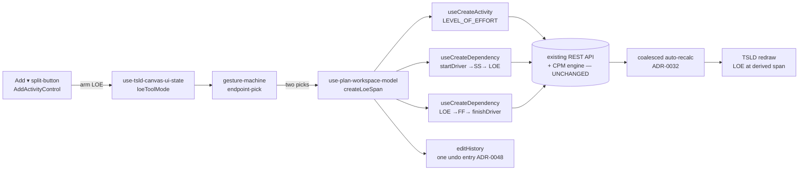
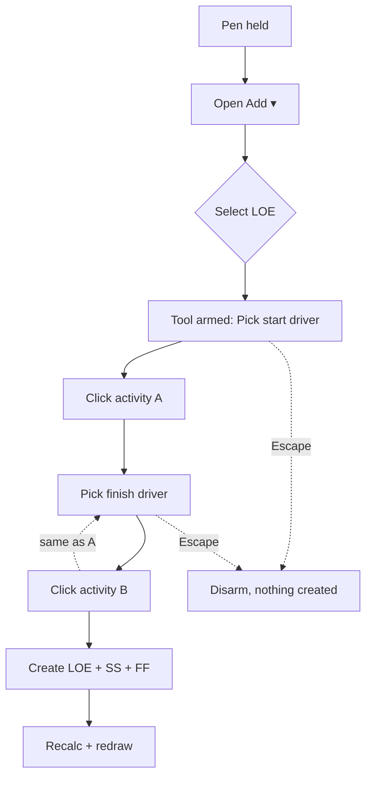

# Feature Spec: Stage D — On-canvas advanced activity types (LOE + Hammock)

- **Status:** Draft (awaiting approval)
- **Author(s):** feature-analyst
- **Date:** 2026-07-20
- **Tracking issue / epic:** _TBD_ — Toolbar/Canvas program, Stage D
- **Roadmap link:** TSLD plan workspace toolbar/canvas program — A (lenses ✅) → B (nav ✅) → C1 (export/print ✅) → **D (this)** → E (Resource view) → C2 (XER/MSP + share) → F (Share)
- **Related ADR(s):** ADR-0031 (toolbar registry), ADR-0032 (canvas-first authoring / Add split-button), ADR-0035 §21 (LOE span semantics), ADR-0038 (WBS hierarchy), ADR-0028 (edit-lock/pen), ADR-0048 (undo/redo), ADR-0026/0030 (canvas). **No new ADR required for the recommended (frontend-only) path.** An engine Hammock (rejected default, see Q1) _would_ require an ADR-0035 clause + ADR-0034 conformance treatment.

---

## 1. Business understanding

### Problem

The canvas-first Add split-button (ADR-0032) lets a planner draw **Task / Start-milestone /
Finish-milestone** directly on the TSLD. The two **derived-duration** advanced types —
**Level of Effort (LOE)** and **Hammock** — sit in the Add menu's "Span between activities"
section as **permanently disabled "Soon" placeholders** (`tsld-toolbar-items.tsx`,
`AddActivityControl`; see `docs/TOOLBAR_ROADMAP.md`). Yet the LOE type, its engine semantics,
its API, its conformance proof, and a **default-on** form Type picker have _already shipped_
(M5-epic F1–F4, ADR-0035 §21; flag `VITE_ADVANCED_ACTIVITY_TYPES`, ON). So today a planner can
create an LOE from the activity **form/table**, but not from the **canvas** — the primary
authoring surface — where the affordance reads "Soon". Stage D closes that gap and resolves the
Hammock placeholder honestly.

### Users

- **Planner** (org role `PLANNER`) — the primary user; drafts and edits plans on the canvas,
  holds the single-editor **pen** (ADR-0028). Wants to drop an LOE (a supervision/overhead
  span that hangs off two driver activities) without leaving the canvas for the form.
- **Contributor** (`CONTRIBUTOR`) — may edit within scope while holding the pen; same canvas Add
  affordance, same permission gate as today's Task/milestone add.
- **Viewer / External Guest** — read-only; never see an armed authoring tool (the whole
  authoring cluster shades when the pen isn't held, ADR-0031).

### Primary use cases

1. From the canvas Add split-button, arm **Level of Effort**, pick a **start-driver** activity
   and a **finish-driver** activity, and have SchedulePoint create an LOE spanning them
   (SS from the start driver, FF to the finish driver), then recalc + redraw.
2. Understand what **Hammock** means in SchedulePoint and either create the equivalent span or
   see an honest, non-misleading affordance for it (see Q1).

### User journeys

**Happy path (LOE on canvas):** Planner holds the pen → clicks **Add ▾** → the menu's "Span
between activities" section now shows a live **Level of effort** item → selects it → the toolbar
arms the **LOE endpoint-pick** tool-mode (label "Pick start driver"). Planner clicks the first
activity (start driver), then the second (finish driver). SchedulePoint creates the LOE +
SS + FF edges in sequence, the coalesced auto-recalc runs (ADR-0032), and the LOE bar draws at
its derived span. The action is a single **undo** (ADR-0048).

**Alternate — cancel:** Planner presses **Escape** (or picks "Stop adding" in the menu) mid-pick;
no activity is created; the tool disarms.

**Alternate — no-span LOE:** If the created LOE ends up missing a resolvable span (engine N12,
`loeNoSpan`), it is **produced and flagged** — placed at its fallback (SS end, else data date;
zero length) and surfaced through the existing conflict channels (the `next-conflict` cycler and
the activity's flag). Never rejected, never a crash.

**Alternate — Hammock:** Planner opens the Add menu and sees the Hammock affordance resolved per
Q1 (recommended: a labelled entry that arms the same LOE span flow, or the item removed pending a
product decision — _not_ a dangling "Soon").

### Expected outcomes

- LOE is creatable from the canvas, matching its already-shipped form parity; the canvas stops
  advertising a "Soon" feature that is in fact live everywhere else.
- The Hammock placeholder is resolved honestly, with a documented decision on whether SchedulePoint
  needs a distinct Hammock engine type at all (it very likely does not — Q1).
- Flag-off is **byte-for-byte** today's canvas + toolbar (the parity gate).

### Success criteria

- A planner creates an LOE end-to-end on the canvas in **< 15 s** without opening the form.
- The endpoint-pick tool is fully keyboard-operable and announced (WCAG 2.2 AA).
- With `VITE_CANVAS_ACTIVITY_TYPES` off, `git diff` of rendered toolbar/canvas behaviour vs. today
  is empty (the "Soon" items unchanged); no engine/`packages/types` diff at all on the recommended
  path.

### Open questions

See the consolidated **Critical questions** at the end of §4. In short: **(Q1)** does Hammock need
an engine addition or is it frontend-only over the existing LOE/summary semantics? **(Q2)** new
`VITE_CANVAS_ACTIVITY_TYPES` flag vs. reuse `VITE_ADVANCED_ACTIVITY_TYPES`? **(Q3)** LOE is already
default-on in the form — confirm D is therefore canvas-surfacing + Hammock-resolution only.

---

## 2. Functional requirements

### User stories & acceptance criteria

> **US-1** — As a **Planner** holding the pen, I want to arm "Level of effort" from the canvas Add
> menu, so that I can create an LOE without leaving the canvas.
>
> **Acceptance criteria**
>
> - **Given** the pen is held and `VITE_CANVAS_ACTIVITY_TYPES` is on, **when** I open **Add ▾**,
>   **then** the "Span between activities" section shows a **live** "Level of effort" item (not a
>   disabled "Soon" item).
> - **Given** the flag is **off**, **when** I open **Add ▾**, **then** the LOE (and Hammock) items
>   appear **exactly as today** (disabled, "Soon").
> - **Given** the pen is **not** held, **when** I view the Add split-button, **then** the whole
>   control is shaded/disabled with the existing "Start editing to add activities" reason (no
>   separate LOE path escapes the pen gate).

> **US-2** — As a Planner, I want to create the LOE by picking its two driver activities on the
> canvas, so that the span is derived from real logic ties.
>
> **Acceptance criteria**
>
> - **Given** the LOE tool is armed, **when** I click a first activity, **then** it is recorded as
>   the **start driver** and the tool prompts for the finish driver.
> - **Given** a start driver is picked, **when** I click a second activity, **then** SchedulePoint
>   creates a `LEVEL_OF_EFFORT` activity plus an **SS** edge (start driver → LOE) and an **FF** edge
>   (LOE → finish driver), triggers the coalesced auto-recalc, and disarms the tool.
> - **Given** the two picks would form an illegal edge (self-loop, cycle — ADR-0021, or a
>   dependency onto a summary — ADR-0038), **then** the API rejection is surfaced as a friendly,
>   non-destructive inline error and no partial LOE is left behind (see Edge cases).
> - **Given** I press **Escape** or pick "Stop adding" mid-flow, **then** nothing is created and the
>   tool disarms.

> **US-3** — As a Planner, I want the LOE-create action to be a single undo, so a mis-pick is cheap
> to reverse.
>
> **Acceptance criteria**
>
> - **Given** an LOE was just created via the tool and `VITE_UNDO_REDO` is on, **when** I press
>   Undo, **then** the LOE and both its edges are removed as **one** history entry and the schedule
>   redraws (ADR-0048).

> **US-4** — As any user, I want the Hammock affordance to be honest, so the menu doesn't advertise
> a capability SchedulePoint models differently.
>
> **Acceptance criteria** _(recommended Q1 default — adjust on decision)_
>
> - **Given** the flag is on, **when** I open the Add menu, **then** Hammock is presented per the
>   approved Q1 resolution (aliased to the LOE span flow with clarifying copy, **or** removed) —
>   never a live control that produces an unscheduled `HAMMOCK` activity.

### Workflows

**LOE endpoint-pick (canvas):**

1. Pen held → Add ▾ → "Level of effort".
2. Tool arms; toolbar label/prompt = "Pick start driver"; canvas enters LOE-pick mode (a sibling
   of the existing two-click **Link** tool-mode).
3. Click activity A → recorded as start driver; prompt → "Pick finish driver".
4. Click activity B → compose: `createActivity({type:'LEVEL_OF_EFFORT', durationDays:0, …})` →
   `createDependency(A → LOE, SS)` → `createDependency(LOE → B, FF)`.
5. Coalesced client auto-recalc (ADR-0032) → redraw. Tool disarms. One undo entry.

### Edge cases

- **Empty plan / < 2 activities:** the LOE tool needs two existing activities; with fewer than two
  present, the menu item is shaded with a "Add activities to span between them" reason (mirrors the
  Link tool's dependence on ≥ 2 nodes).
- **Same activity picked twice:** reject the second pick (an LOE cannot be its own driver); keep the
  tool armed, re-prompt.
- **No-span outcome (N12):** engine already handles it (`loeNoSpan` produce-and-flag) — surfaced,
  not errored.
- **Partial failure mid-compose:** if `createActivity` succeeds but an edge create fails
  (409/423/422), the sequence must **roll back** the just-created LOE (delete it) or the client must
  treat the whole gesture as failed and refetch — no orphan LOE with one edge. (See Error scenarios;
  reuses ADR-0048 abort-and-refetch semantics.)
- **Pen lost mid-flow (423):** an edit-lock loss between picks aborts the compose with the standard
  423 hand-off; tool disarms.
- **Concurrent edit (409):** optimistic conflict on any sub-mutation → abort-and-refetch + clear redo
  (ADR-0048), friendly toast.

### Permissions

- Same as today's canvas add/link: **deny-by-default**, requires the plan **pen** (ADR-0028
  `assertHoldsPen` → 423) **and** the existing activity/dependency write permissions with
  organisation + plan resource scope (ADR-0012). No new permission is introduced — LOE is an
  ActivityType, and its create path is the existing `activities:create` + `dependencies:create`.
- Viewer / External Guest: never hold the pen → tool never armable.

### Validation rules

- `type = 'LEVEL_OF_EFFORT'`, `durationDays = 0` (duration is **derived**, not entered — mirrors
  `isDurationDerivedType`). Shared client (Zod, `activity-schemas.ts`) ↔ server
  (`class-validator` DTO) rules are **already in place** for LOE; no new field.
- Edge legality (no self-loop, no cycle, no dependency onto a summary) is enforced **server-side**
  today (ADR-0021/0038); the client pre-checks the same-activity case for a fast reject.

### Error scenarios

| Scenario                          | Detection                   | User-facing result                                     | Status  |
| --------------------------------- | --------------------------- | ------------------------------------------------------ | ------- |
| Pen not held / lost mid-flow      | `assertHoldsPen`            | "You need the editing pen" + tool disarms              | 423     |
| Pick would create a cycle         | server DAG check (ADR-0021) | inline "That link would create a loop"; no partial LOE | 409/422 |
| Same activity picked twice        | client pre-check            | ignore + re-prompt (no request)                        | —       |
| Concurrent edit on a sub-mutation | optimistic version (409)    | abort-and-refetch, clear redo, toast                   | 409     |
| Partial compose failure           | client sequence guard       | roll back the LOE (or refetch); no orphan              | —       |
| Not a member / wrong scope        | authz                       | friendly forbidden                                     | 403     |

---

## 3. Technical analysis

| Area           | Impact                      | Notes                                                                                                                                                                                                                                                                                                                                                                                                   |
| -------------- | --------------------------- | ------------------------------------------------------------------------------------------------------------------------------------------------------------------------------------------------------------------------------------------------------------------------------------------------------------------------------------------------------------------------------------------------------- |
| Frontend       | **med**                     | New canvas **tool-mode** (LOE endpoint-pick) in `use-tsld-canvas-ui-state.ts`, a live Add-menu item in `AddActivityControl` (`tsld-toolbar-items.tsx`), gesture handling in `gesture-machine.ts` / the canvas interaction layer, compose logic + undo entry in `use-plan-workspace-model.ts`, a new `VITE_CANVAS_ACTIVITY_TYPES` flag in `config/env.ts`. Parallel focusable DOM a11y layer (ADR-0026). |
| Backend        | **none** (recommended path) | LOE engine/API/DTOs/conformance already shipped (M5-epic). Reuses `activities:create` + `dependencies:create`. **Only if Q1 = engine Hammock** does backend change (new engine span semantics).                                                                                                                                                                                                         |
| Database       | **none** (recommended)      | `LEVEL_OF_EFFORT` and `HAMMOCK` already exist in the Prisma `ActivityType` enum. No migration. (An engine Hammock adds no enum value either — `HAMMOCK` is already present but unwired.)                                                                                                                                                                                                                |
| API            | **none** (recommended)      | No new/changed endpoints; composes existing activity + dependency creates.                                                                                                                                                                                                                                                                                                                              |
| Security       | **low**                     | No new trust boundary; every sub-mutation rides the unchanged pen (423) + RBAC + org/plan scope (IDOR) + optimistic (409) gates. Client is not a trust boundary.                                                                                                                                                                                                                                        |
| Performance    | **low**                     | Three existing mutations + one coalesced recalc per LOE create; no new query. Canvas redraw already culled (ADR-0026).                                                                                                                                                                                                                                                                                  |
| Infrastructure | **none**                    | No new services/env/secrets.                                                                                                                                                                                                                                                                                                                                                                            |
| Observability  | **low**                     | Existing mutation logs + engine `loeNoSpanCount` summary already emitted.                                                                                                                                                                                                                                                                                                                               |
| Testing        | **med**                     | Unit (menu wiring, tool-mode state, compose sequence, undo), component/ux/a11y for the Add surface + endpoint-pick, e2e journey (arm → pick → pick → LOE drawn) with an a11y check. **No engine/conformance work on the recommended path.**                                                                                                                                                             |

### Dependencies

- **Prerequisite (shipped):** LOE engine + API + form picker (M5-epic F1–F4, ADR-0035 §21);
  canvas-first Add split-button + coalesced recalc (ADR-0032, `VITE_CANVAS_AUTHORING`); the
  two-click Link tool (the endpoint-pick precedent); undo/redo (ADR-0048, `VITE_UNDO_REDO`).
- **Blocks nothing** downstream; Stage E (Resource view) is independent.

---

## 4. Solution design

### Architecture overview

Stage D is a **frontend surfacing** layer over shipped engine/API. It adds one canvas tool-mode
(sibling to Link) and one live Add-menu entry; the compose reuses existing mutations.



### Data flow

```mermaid
sequenceDiagram
  participant P as Planner
  participant T as Toolbar (Add ▾)
  participant C as Canvas
  participant M as Workspace model
  participant A as API (unchanged)
  P->>T: Add ▾ → Level of effort
  T->>C: arm LOE endpoint-pick (pen-gated)
  P->>C: click start driver
  C-->>P: prompt "Pick finish driver"
  P->>C: click finish driver
  C->>M: createLoeSpan(startId, finishId)
  M->>A: POST activity {type: LEVEL_OF_EFFORT, durationDays: 0}
  A-->>M: LOE id
  M->>A: POST dependency startId →SS→ LOE
  M->>A: POST dependency LOE →FF→ finishId
  A-->>M: ok (or 409/423/422 → abort+refetch)
  M->>M: push single undo entry
  M->>A: coalesced recalculate
  A-->>C: schedule (LOE at derived span; loeNoSpan flagged if any)
```

### User flow



### Database changes

**None** on the recommended path. `LEVEL_OF_EFFORT` and `HAMMOCK` are already in the Prisma
`ActivityType` enum; no migration, no new column, no index.

### API changes

**None.** The feature composes the existing `POST /activities` and `POST /dependencies` endpoints.
No new DTO, status code, or OpenAPI change.

### Component changes

- `apps/web/src/features/tsld/toolbar/tsld-toolbar-items.tsx` — `AddActivityControl`: behind the
  new flag, replace the **disabled "Soon"** "Level of effort" `MenuItem` with a live item that arms
  the LOE tool-mode; resolve the Hammock item per Q1. **Flag-off keeps today's disabled items
  byte-for-byte.** Keep the existing APG `Menu` + roving-tabindex + single focusable stop.
- `apps/web/src/features/tsld/toolbar/use-tsld-canvas-ui-state.ts` — add LOE tool-mode state
  (armed / start-driver-picked), a sibling to the existing `isLinking`/`linkType` machinery.
- `apps/web/src/features/tsld/interaction/gesture-machine.ts` — endpoint-pick handling for the LOE
  mode (reusing the two-click Link precedent; no point-and-draw), plus the parallel DOM a11y layer
  affordance (keyboard pick + announcements).
- `apps/web/src/components/layout/workspace/use-plan-workspace-model.ts` — a `createLoeSpan`
  compose (create LOE → SS → FF), wrapped as **one** `editHistory` command (ADR-0048), with the
  partial-failure roll-back guard.
- `apps/web/src/config/env.ts` — new `CANVAS_ACTIVITY_TYPES_ENABLED` flag (default **off/dark**),
  documented like the Stage A/B/C1 canvas flags.
- **States:** loading (mutations in flight — disable re-pick), empty (< 2 activities → shaded item),
  error (inline/toast per §2), success (LOE drawn). No one-off styling; reuse `Menu`/`MenuItem`,
  `toolbarControlVariants`, and existing canvas selection cues.
- **Deferred (keep TECH_DEBT #37):** a dedicated LOE **span-bar** visual (a bracket over the driver
  span). The LOE renders as an ordinary bar at its derived dates — acceptable; the span-bar is an
  independent canvas-rendering nicety, not required to create/schedule an LOE.

### Implementation approach & alternatives

**Chosen: frontend-only surfacing.** Reuse the shipped LOE type/engine/API. Add a canvas
endpoint-pick tool-mode (modeled on the Link tool) and a live Add-menu entry, all behind a new
dark canvas flag, composing existing mutations into one undoable action. This is the smallest change
that fully solves the goal and keeps `main` releasable (flag-off = today).

**On Hammock (the pivotal decision — Q1):** SchedulePoint's **LOE already _is_ the "span-derived
hammock."** Evidence from the codebase:

- `apps/web/src/config/env.ts` describes LOE literally as _"a span-derived hammock: duration from
  its SS-predecessor start to its FF-successor finish, never driving or critical."_
- `apps/api/src/modules/schedule/engine/compute.ts` comments call the LOE _"a hammock that spans
  its neighbours"_ and implement start = earliest SS-predecessor start, finish = latest FF-successor
  finish (the classic hammock span).
- `apps/api/prisma/schema.prisma` states plainly: _"HAMMOCK is the same derived-duration idea and
  is still deferred (its engine wiring does not exist yet)."_
- `apps/api/src/modules/schedule/conformance/type-map.ts` maps `LEVEL_OF_EFFORT` and `WBS_SUMMARY`
  as supported; **`HAMMOCK` is not mapped** (unsupported → the engine would treat it as a plain
  `TASK`, producing a _wrong_, unscheduled "hammock").
- `apps/web/src/features/activities/schemas/activity-schemas.ts` deliberately excludes `HAMMOCK`
  from the offered advanced types: _"`HAMMOCK` is intentionally NOT offered (no engine behaviour
  yet)."_

So a distinct `HAMMOCK` engine type would **duplicate LOE's span semantics**, and the
containment-rollup flavour of a "hammock" is already covered by **`WBS_SUMMARY`** (branch roll-up
from earliest-start/latest-finish). **Recommended default: do NOT build a distinct Hammock engine
type.** Resolve the Add-menu Hammock item by either (a) aliasing it to the LOE span flow with
clarifying copy ("Hammock — a level-of-effort span"), or (b) removing the separate item and relying
on LOE. Either keeps Stage D **frontend-only** and honest.

**Alternative (rejected as the default): engine Hammock addition.** Only justified if the product
owner wants a _behaviourally distinct_ hammock — e.g. a span over an arbitrary **selection / WBS
branch** that is _not_ driven by explicit SS/FF ties (closer to a logic-participating summary bar).
That is a full **engine milestone**, not frontend surfacing: an ADR-0035 clause defining its
forward/backward span semantics, engine forward/backward wiring, conformance goldens +
negative cases (ADR-0034), the recalc **parity gate**, and a _separate_ dark → conformance →
flagged-web lifecycle. If chosen, it should be its **own sub-stage** (call it "D-engine"), sequenced
after the frontend LOE surfacing — see the contingency milestone in the implementation plan.

**Alternative (rejected): wire LOE straight into point-and-draw.** LOE is derived from two
endpoints, not a drawn rectangle; forcing it into the draw gesture would misrepresent it and can't
express the two drivers. The endpoint-pick tool (Link-tool sibling) is the correct model — and it is
exactly how `docs/TOOLBAR_ROADMAP.md` already anticipates these items ("they arm an endpoint-pick
flow rather than a draw mode").

### Critical questions (recommended defaults)

- **Q1 — Does Hammock need an engine addition, or is it frontend-only over existing LOE/summary
  semantics?** **Recommended default: frontend-only.** The engine's LOE _is_ the span-derived
  hammock and `WBS_SUMMARY` covers the containment-rollup variant; a distinct `HAMMOCK` engine type
  would duplicate LOE. Resolve the menu item as an LOE alias (or remove it). Build a distinct engine
  Hammock **only** if the product owner confirms a genuinely different behaviour, and then as its own
  engine sub-stage (dark → conformance → flagged), **not** part of this frontend slice.
- **Q2 — New `VITE_CANVAS_ACTIVITY_TYPES` flag, or reuse `VITE_ADVANCED_ACTIVITY_TYPES`?**
  **Recommended default: a NEW `VITE_CANVAS_ACTIVITY_TYPES` flag, dark by default.** The existing
  `VITE_ADVANCED_ACTIVITY_TYPES` is already **on** and governs the _form_ Type picker; the canvas
  endpoint-pick is a new, unshipped interaction that needs its own dark → specialist-review → flip
  lifecycle and independent rollback, mirroring Stages A/B/C1 (`VITE_CANVAS_LENSES`,
  `VITE_CANVAS_NAV`, `VITE_EXPORT_PRINT`). Reusing the on-by-default flag would ship the new
  interaction un-reviewed. Flag-off ⇒ today's canvas exactly.
- **Q3 — Is LOE already default-on (so D is Hammock-centric)?** **Finding: yes, in the _form_.**
  `VITE_ADVANCED_ACTIVITY_TYPES` is on, so the _form/table_ LOE picker already ships. Stage D is
  therefore **canvas surfacing of the already-shipped LOE** + the Hammock resolution — no new engine,
  no new type, no migration on the recommended path.

## 5. Links

- Implementation plan: `docs/specs/canvas-activity-types/implementation-plan.md`
- Related docs to update on build: `docs/TOOLBAR_ROADMAP.md` (retire the LOE/Hammock Add rows),
  `apps/web/src/config/env.ts` (flag doc), `docs/DECISIONS.md` (Q1 resolution + flag), and — only on
  the engine-Hammock contingency — a new ADR-0035 clause + `docs/specs/engine-conformance-framework/`.
