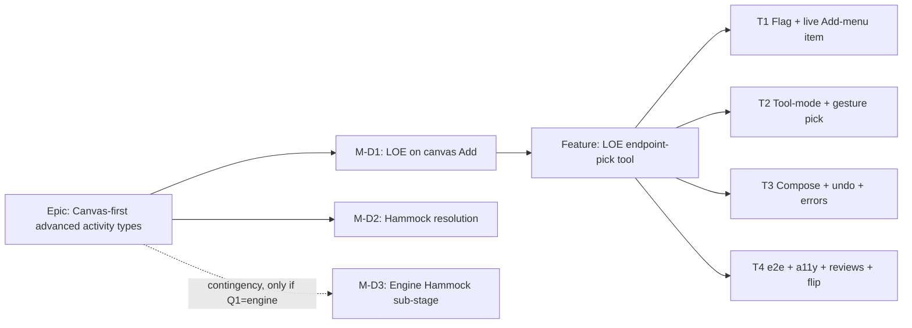

# Implementation Plan: Stage D — On-canvas advanced activity types (LOE + Hammock)

- **Feature spec:** `docs/specs/canvas-activity-types/feature-spec.md`
- **Status:** Draft (awaiting approval)
- **Owner:** _TBD_

## Breakdown

### Epic

**Canvas-first advanced activity types** — Stage D of the TSLD toolbar/canvas program: surface the
already-shipped **Level of Effort** type on the canvas Add flow and resolve the **Hammock**
placeholder honestly, without new engine work (recommended path).

---

### Milestone: M-D1 — LOE on the canvas Add flow (shippable slice)

**Outcome:** a Planner holding the pen can arm "Level of effort" from the canvas Add split-button,
pick two driver activities, and have SchedulePoint create the LOE (+ SS/FF edges) and redraw — all
behind `VITE_CANVAS_ACTIVITY_TYPES` (dark until reviewed). Flag-off = today's canvas byte-for-byte.

---

#### Feature: LOE endpoint-pick tool

> **Description:** a canvas tool-mode (sibling of the two-click Link tool) that arms from the Add
> menu, picks a start driver + finish driver, and composes an LOE span from existing mutations.
> **Complexity:** M
> **Dependencies:** shipped LOE engine/API (M5-epic, ADR-0035 §21); canvas Add split-button +
> coalesced recalc (ADR-0032); Link tool (endpoint-pick precedent); undo/redo (ADR-0048).
> **Risks:** partial-compose orphan (LOE with one edge) → strict roll-back/refetch guard; pen loss
> mid-flow → standard 423 abort; a11y of a multi-step canvas pick → parallel DOM layer + announcements.
> **Testing requirements:** unit (menu wiring, tool-mode, compose, undo, roll-back); component/ux/a11y
> for the Add surface + pick flow; one e2e journey with an a11y assertion.

##### Task 1 — Flag + live Add-menu item (≈ one PR)

- **Description:** add `CANVAS_ACTIVITY_TYPES_ENABLED` (default off) to `config/env.ts`; in
  `AddActivityControl`, when the flag is on, render a **live** "Level of effort" `MenuItem` that
  arms the LOE tool-mode; when off, keep today's disabled "Soon" item **unchanged** (parity).
- **Complexity:** S
- **Dependencies:** none
- **Risks:** accidentally changing the flag-off render → snapshot/parity test pins today's menu.
- **Testing:** unit — flag-on shows live item + arms; flag-off shows disabled "Soon" item identically.
- **Development steps:**
  1. Add and document the flag in `config/env.ts` (mirror Stage A/B/C1 flag docs).
  2. Branch the LOE `MenuItem` in `AddActivityControl` on the flag; keep APG `Menu` + roving-tabindex
     - single focusable stop intact.
  3. Add a flag-off parity test and a flag-on "arms LOE mode" test.

##### Task 2 — Tool-mode state + canvas endpoint-pick gesture

- **Description:** add LOE tool-mode state to `use-tsld-canvas-ui-state.ts` (armed / start-picked),
  and endpoint-pick handling in `gesture-machine.ts` (pick start driver → prompt → pick finish
  driver), reusing the Link two-click precedent; wire the parallel DOM a11y layer (keyboard pick +
  live-region prompts) and Escape/"Stop adding" cancel.
- **Complexity:** M
- **Dependencies:** Task 1
- **Risks:** mode-collision with Link/Add draw modes → mutually-exclusive tool-mode invariant + tests;
  same-activity double-pick → client pre-check re-prompts.
- **Testing:** unit — arm/disarm, pick sequence, same-activity reject, Escape cancel, keyboard path.
- **Development steps:**
  1. Extend the tool-mode union (sibling to `isLinking`) with LOE-pick + picked-start.
  2. Handle picks in the gesture machine; emit `(startId, finishId)` on the second pick.
  3. Add the parallel-DOM keyboard affordance + `aria-live` prompt copy.

##### Task 3 — Compose (LOE + SS + FF), single undo, error/roll-back

- **Description:** add `createLoeSpan(startId, finishId)` to `use-plan-workspace-model.ts`:
  `createActivity(LEVEL_OF_EFFORT, durationDays:0)` → `createDependency(start→SS→LOE)` →
  `createDependency(LOE→FF→finish)`, wrapped as **one** `editHistory` command (ADR-0048); on any
  sub-mutation failure (409/423/422) abort-and-refetch + clear redo, and roll back a just-created LOE
  so no orphan remains; trigger the coalesced recalc.
- **Complexity:** M
- **Dependencies:** Task 2
- **Risks:** non-atomic multi-mutation → roll-back guard + abort-and-refetch; undo of a composite →
  compose the inverse (delete LOE removes its edges by cascade) and test it.
- **Testing:** unit — happy compose, partial-failure roll-back, 423/409 abort, single-undo removes
  LOE+edges; no-span (N12) create still succeeds and is flagged.
- **Development steps:**
  1. Implement `createLoeSpan` + the one-entry undo command (create ⇄ delete inverse).
  2. Add the partial-failure roll-back + abort-and-refetch guard.
  3. Fire the coalesced auto-recalc; assert LOE draws at derived span.

##### Task 4 — e2e journey, specialist reviews, docs, flag flip

- **Description:** a Playwright journey (arm → pick → pick → LOE drawn) with an a11y check; run the
  specialist reviews; fold in blockers; update docs; flip `VITE_CANVAS_ACTIVITY_TYPES` on once green.
- **Complexity:** S
- **Dependencies:** Tasks 1–3
- **Risks:** review blockers on the multi-step pick a11y → budget a fold-in pass before the flip.
- **Testing:** e2e + a11y; regression tests for any blocker fixed.
- **Development steps:**
  1. Write the e2e journey + a11y assertion.
  2. Run **component-reviewer**, **ux-reviewer**, **accessibility-reviewer**, **performance-reviewer**,
     **test-engineer**; fold in blocking findings.
  3. Update `docs/TOOLBAR_ROADMAP.md` (retire the LOE Add row), `config/env.ts`, `docs/DECISIONS.md`;
     add a changeset; flip the flag default to on.

---

### Milestone: M-D2 — Hammock resolution (frontend-only; gated on Q1)

**Outcome:** the Add-menu **Hammock** item is honest — resolved per the approved Q1 decision.

#### Feature: Resolve the Hammock placeholder

> **Description:** on the recommended Q1 default, either (a) alias "Hammock" to the LOE span flow
> with clarifying copy, or (b) remove the separate item — never a live control that yields an
> unscheduled `HAMMOCK` activity. Update `activity-schemas.ts`/labels and the roadmap accordingly.
> **Complexity:** S
> **Dependencies:** M-D1; Q1 decision.
> **Risks:** shipping a live `HAMMOCK` create (engine treats it as TASK → wrong schedule) →
> **guard: never expose a raw `HAMMOCK` create anywhere**; keep the label for legacy/imported display
> honesty only.
> **Testing:** unit — the resolved affordance never creates a `HAMMOCK`; label still renders for an
> imported one.

##### Task 1 — Apply the approved Hammock resolution

- **Description:** implement the Q1-approved copy/behaviour; update `docs/TOOLBAR_ROADMAP.md` and
  `docs/DECISIONS.md`.
- **Complexity:** S
- **Dependencies:** M-D1
- **Risks:** as above.
- **Testing:** unit + a quick ux/copy review.
- **Development steps:**
  1. Alias-or-remove the Hammock `MenuItem`; ensure no `HAMMOCK` create path exists.
  2. Update roadmap + decisions log.

---

### Milestone (CONTINGENCY): M-D3 — Engine Hammock sub-stage — **only if Q1 = engine-add**

> **Do not build unless the product owner confirms a behaviourally-distinct hammock.** This is a full
> engine milestone, **not** frontend surfacing, and must follow the ADR-0034/0035 conformance
> discipline and the recalc **parity gate** (`git diff --stat apps/api packages/types` empty when the
> feature is inert / no hammock present).

#### Feature: Distinct `HAMMOCK` engine semantics

> **Description:** define and implement forward/backward span semantics for `HAMMOCK` distinct from
> LOE (e.g. group/selection span rather than SS/FF-driven), with conformance goldens + negative cases.
> **Complexity:** L–XL
> **Dependencies:** an accepted ADR-0035 clause defining the semantics.
> **Risks:** duplicating LOE / parity-gate regressions → strict "absent hammock ⇒ byte-identical"
> gate; conformance scope creep → scope one fixture scenario.
> **Testing:** engine unit + differential + golden snapshots; negative reject/repair/report; parity gate.
> **Reviews:** **database-architect** (only if any schema/index change — the `HAMMOCK` enum value
> already exists, so likely none), **api-reviewer**, **security-reviewer**,
> **backend-performance-reviewer**, **test-engineer**, then the frontend surfacing reviewers as M-D1.

##### Task 1 — ADR-0035 clause + semantics decision (no code)

- **Description:** document the hammock forward/backward span contract + negative cases.
- **Complexity:** M · **Dependencies:** Q1=engine · **Testing:** n/a (decision).

##### Task 2 — Engine wiring + conformance (dark)

- **Description:** implement the span pass; add goldens/negatives; prove the parity gate.
- **Complexity:** L · **Dependencies:** Task 1 · **Testing:** engine + conformance tiers.

##### Task 3 — Flagged web surface

- **Description:** surface the distinct Hammock in the canvas Add flow behind its own flag; reviews; flip.
- **Complexity:** M · **Dependencies:** Task 2 · **Testing:** component/ux/a11y/e2e.

---

## Sequencing & slices

1. **M-D1** ships first behind dark `VITE_CANVAS_ACTIVITY_TYPES` (Tasks 1→4). Each task keeps `main`
   releasable; the flag flips only after Task 4's reviews are green.
2. **M-D2** follows immediately (tiny), applying the Q1 Hammock resolution.
3. **M-D3** is a **contingency** — built only if Q1 selects a distinct engine hammock, as its own
   dark → conformance → flagged sub-stage after M-D1.

**Feature flags:** new `VITE_CANVAS_ACTIVITY_TYPES` (dark by default; recommended over reusing the
already-on `VITE_ADVANCED_ACTIVITY_TYPES` — see spec Q2). Flag-off ⇒ today's canvas + toolbar
byte-for-byte; on the recommended path there is **no** `apps/api`/`packages/types` diff, so the CPM
recalc parity gate is structurally trivial.

## Definition of Done (per task)

Each task's PR satisfies the Feature Completion Criteria in `docs/PROCESS.md` (code, tests, docs,
security, performance, accessibility, Docker build, CI, changelog, version impact).

## Specialist reviews to run

- **Frontend surfacing (M-D1/M-D2):** component-reviewer (Add-menu item, tool-mode, no one-off
  styling), ux-reviewer (multi-step pick affordance, copy, states, Hammock honesty),
  accessibility-reviewer (WCAG 2.2 AA on the menu + parallel-DOM endpoint-pick + announcements),
  performance-reviewer (canvas redraw/interaction), test-engineer (unit + e2e/a11y).
- **Engine contingency (M-D3 only):** api-reviewer, security-reviewer, backend-performance-reviewer,
  test-engineer, and database-architect **iff** a schema/index change is introduced (unlikely — the
  `HAMMOCK` enum value already exists).

## Risks & assumptions (rollup)

| Risk / assumption                              | Likelihood | Impact | Mitigation                                                                                       |
| ---------------------------------------------- | ---------- | ------ | ------------------------------------------------------------------------------------------------ |
| Q1 turns out to want a distinct engine hammock | low        | high   | Contingency M-D3 scoped as a separate engine sub-stage; frontend LOE (M-D1) ships regardless.    |
| Partial-compose orphan LOE (one edge)          | med        | med    | Strict roll-back + abort-and-refetch guard; unit-tested.                                         |
| Multi-step canvas pick a11y blockers           | med        | med    | Parallel-DOM layer + live-region prompts; budget a fold-in pass before flip.                     |
| Accidentally exposing a raw `HAMMOCK` create   | low        | high   | Never wire a `HAMMOCK` create path; keep the label for display-only honesty.                     |
| Flag-off parity regression                     | low        | high   | Snapshot/parity test pins today's menu; no `apps/api`/`packages/types` diff on recommended path. |
| LOE renders as plain bar (no span-bar)         | high       | low    | Accepted; span-bar stays TECH_DEBT #37, independent of create/schedule.                          |
