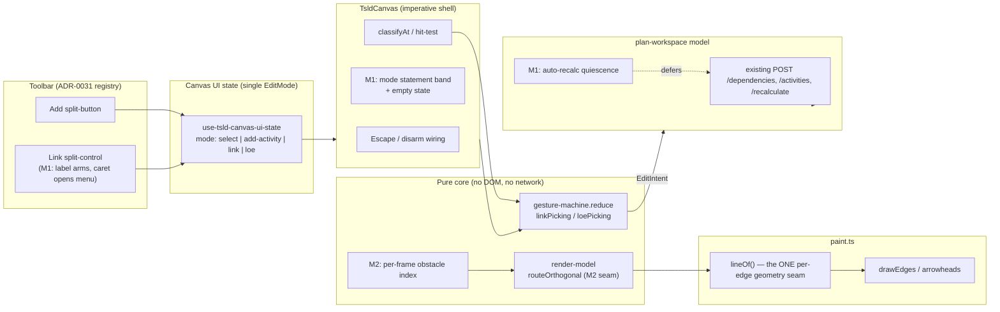
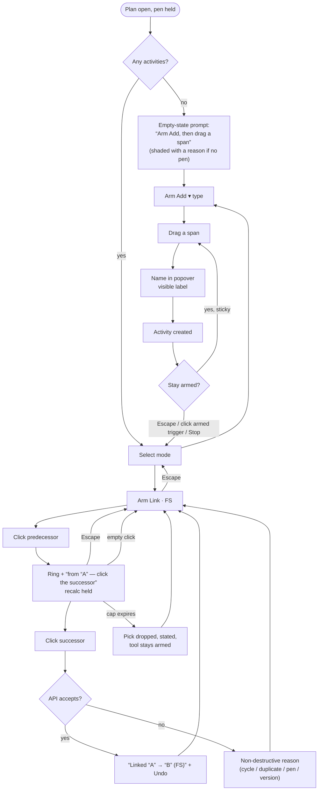

# Feature Spec: TSLD canvas authoring flow & link routing quality

- **Status:** Draft — awaiting approval
- **Author(s):** feature-analyst (Product Owner / Solution Architect / Technical Lead hats)
- **Date:** 2026-07-30
- **Tracking issue / epic:** _tbc_
- **Roadmap link:** TSLD canvas quality (`docs/ROADMAP.md` — canvas-first authoring)
- **Related ADR(s):** builds on ADR-0021, ADR-0026, ADR-0031, ADR-0032, ADR-0033,
  ADR-0048, ADR-0052, ADR-0054, ADR-0055, ADR-0056, ADR-0063. Proposes **two new
  ADRs** (§4.9): a canvas **tool-mode & recalc-quiescence** decision and a **link
  routing** decision. Numbers allocated at authoring time — provisionally
  **ADR-0064** and **ADR-0065** (0063 is the highest accepted today).

> **Provenance and confidence.** This spec is written from a driving session against
> a running local build (web 0.61.0 / api 0.32.0, 2026-07-30, Chromium 1600×1000,
> Month zoom) plus a read of the implementation. Every claim below is tagged:
>
> - **[VERIFIED]** — confirmed against the database or by reading the code, with the
>   file/line named.
> - **[OBSERVED]** — seen once, in one session, on one screen size. Treated as a
>   symptom to reproduce, **never** as an established mechanism.
> - **[CORRECTED]** — the session's stated mechanism did not survive a read of the
>   code. Recorded because ADR-0058's rule is _verify the claim; do not trust the
>   document_, and that applies to the brief that started this spec as much as to
>   anything already in `docs/`.

---

## 1. Business understanding

### Problem

**A planner cannot reliably build a network on the canvas — the one act the product
exists to make easy.** SchedulePoint's premise (`docs/PROJECT_BRIEF.md`, ADR-0026)
is that a planner draws activities on a time-scaled diagram and connects them with
logic, instead of typing into a Gantt grid. Drawing works. **Connecting does not.**

In one driving session: 3 activities drawn, **4 link attempts, 0 rows in
`dependencies`**. A second, controlled attempt: 2 activities, 0 dependencies.
**[VERIFIED]** Reading the code explains most of it — the Link control is a _type
menu_ whose trigger does not arm the tool, while the Add tool stays armed with no
visible way out, so a click meant for a link endpoint lands as a new activity
instead.

The second half of the problem is that even when logic _does_ exist, the diagram
does not communicate it. Link routing emits exactly two shapes and has **no
obstacle awareness at all** **[VERIFIED]**
(`apps/web/src/features/tsld/render/render-model.ts` `routeOrthogonal`, ~line 581):
a link's vertical run never tests whether it passes straight through another bar.
On a dense plan the logic reads as a thicket, and at Month zoom the session could
not tell which way an arrow pointed.

**Why now.** Three reasons.

1. The canvas is **live**. `VITE_CANVAS_AUTHORING`, `VITE_CANVAS_DIRECT_MANIPULATION`,
   `VITE_CANVAS_LIVE_FEEDBACK`, `VITE_CANVAS_VISUAL_LANGUAGE`, `VITE_CANVAS_TIME_AXIS`
   and `VITE_WBS_IMPROVEMENTS` are all default-on, and CLAUDE.md §17 was corrected on
   2026-07-30: releases _are_ pulled and reviewed by a person. Anything default-on is
   in use. These are not latent defects behind a flag.
2. The last two epics (ADR-0059 Gantt, ADR-0063 WBS band) added ways to **read** a
   plan. They assume the plan has logic in it. Reading surfaces are ahead of the
   authoring surface that feeds them.
3. Six consecutive epics have shipped their real defects in the **deferred review
   pass** (ADR-0059 M6, ADR-0060 M6, ADR-0062 M6, ADR-0063 M6 each caught defects a
   human read had passed). This epic's Part A is exactly that class of defect,
   caught by driving the product instead of reading it — which is the cheapest
   evidence we have and the least used.

### Users

| Role               | Need                                                                                                            | In scope                                                      |
| ------------------ | --------------------------------------------------------------------------------------------------------------- | ------------------------------------------------------------- |
| **Planner**        | Draw activities and connect them with logic, on the canvas, without losing work to a tool that will not let go. | **Primary.** Holds the pen (ADR-0028).                        |
| **Org Admin**      | Same as Planner, plus immediate pen override.                                                                   | Same capabilities.                                            |
| **Contributor**    | Reports progress; does **not** author structure (no pen — ADR-0060 Q-C).                                        | Read-only for M1; benefits from M2 legibility.                |
| **Viewer**         | Reads the diagram.                                                                                              | Benefits from M2 only.                                        |
| **External Guest** | Reads a shared plan (ADR-0051, `SCHEDULE_READ`).                                                                | Benefits from M2 only — the guest view paints the same links. |

No permission changes anywhere in this epic. Authoring stays pen-gated + `PLANNER`/
`ORG_ADMIN`; routing is paint, so it reaches every reader including the session-less
guest surface.

### Primary use cases

1. **Draw a run of activities** on the canvas and know, at every moment, that the
   Add tool is armed — and be able to leave it.
2. **Link two activities** in two clicks, seeing which endpoint has been picked and
   being told what was created, in which direction.
3. **Read a dense network** — follow a link from predecessor to successor without it
   disappearing behind a bar, and tell its direction at Month zoom.
4. **Start from an empty plan** and know what to do first.

### User journeys

**Happy path (target state).** Planner takes the pen → clicks **Add ▾ → Task** → the
build row reads `Adding Task` and the canvas cursor is a crosshair → drags a span →
names it in the popover → repeats → presses **Escape**, and the tool disarms back to
Select → clicks **Link ▾ → FS**; the Add tool (if it were armed) is gone and the
canvas states `Linking FS — click the predecessor` → clicks the first bar; it takes a
pick ring and the statement becomes `Linking FS from "Set out" — click the successor`;
**the diagram does not move while the pick is open** → clicks the second bar → an
arrow is drawn and a confirmation states `Linked "Set out" → "Reinforce" (FS)` with
Undo → Escape disarms.

**Alternate — wrong endpoint.** After the first pick, Escape drops the pick and keeps
the tool armed (today's behaviour, **[VERIFIED]** `TsldCanvas.tsx` ~line 1330). A
second Escape disarms the tool.

**Alternate — illegal link.** A cycle/duplicate is refused client-side where the
loaded graph already proves it (`link-legality.ts`), otherwise by the API (409/422),
and reported non-destructively. Unchanged.

**Alternate — keyboard.** Today the keyboard path to logic is Enter on the focused
activity → the Logic tab (ADR-0062) **[VERIFIED]** `TsldPanel.tsx` ~line 908 — so the
canvas link tool introduces no pointer-only capability (WCAG 2.1.1 holds via an
equivalent path). The LOE tool, by contrast, _does_ have a keyboard two-pick. We
propose bringing the link tool to LOE's parity (§2 US-8).

### Expected outcomes

- A planner can create a dependency on the canvas and knows they did. Today's
  measured success rate on that act is **0 of 6 attempts across two sessions**.
- A plan of realistic size can be read: no link vanishes behind a bar in the common
  case, and direction is legible at Month zoom.
- The canvas stops being a surface where a click can mean something you did not
  intend, which is the specific failure that makes people stop trusting a tool.

### Success criteria

| #   | Criterion                                      | Measure                                                                                                                                                                                                                                                    |
| --- | ---------------------------------------------- | ---------------------------------------------------------------------------------------------------------------------------------------------------------------------------------------------------------------------------------------------------------- |
| S1  | A dependency can be created on the canvas      | A flag-on Playwright journey creates one against a **real API** and asserts the row's `predecessorId`/`successorId` are the two clicked activities, in that order.                                                                                         |
| S2  | No mode can be armed without a stated way out  | Unit + journey: after any create, and after any link, the armed control names its state; Escape returns to Select; the canvas cursor reverts.                                                                                                              |
| S3  | The picked endpoint is stated, not just ringed | Journey asserts the accessible statement text after pick 1 and the confirmation after pick 2.                                                                                                                                                              |
| S4  | The diagram is stable during a pick            | Unit: a recalc requested while a pick is open does not fire until the pick resolves (or the cap expires).                                                                                                                                                  |
| S5  | Routing avoids obstacles                       | Unit: for a corpus of generated layouts, **0** emitted vertical segments intersect a non-endpoint bar rect where a free corridor exists; ≥ 95% of edges route without the 5-point fallback at 200 activities.                                              |
| S6  | The draw budget's **shape** is unchanged       | A counting-stub budget gate in the `paint.*-budget.test.ts` family: per-frame path/stroke counts do not grow with plan size beyond the existing O(visible) shape. Plus one browser-measured run at 2,000 activities (see the honesty note under S6 in §3). |
| S7  | Direction is legible                           | Arrowhead size and link weight pass a computed contrast check in all three themes (the ADR-0055 matrix), and a human confirms direction at Month zoom in the review pass.                                                                                  |

### Open questions

**All four were answered by the product owner on 2026-07-30, each taking the
recommended default. They are kept below with their reasoning — a decision whose
argument is deleted is a decision that gets relitigated.** The answers are binding on
the implementation plan; where a question notes "if you choose otherwise, X changes",
X does not change.

| Question                         | Decision                                                                                                                                                                             |
| -------------------------------- | ------------------------------------------------------------------------------------------------------------------------------------------------------------------------------------ |
| CQ-1 — gate M1 on diagnosing A2? | **Yes.** T1 is an instrumented reproduction; the rest of M1 does not merge without an answer. If T1 cannot reproduce it, A2 closes as **unreproduced, in writing** — never as fixed. |
| CQ-2 — sticky or one-shot Add?   | **Sticky**, with a loud armed state and a real exit. US-1/US-2 acceptance criteria stand as drafted.                                                                                 |
| CQ-3 — does M1 ship flagged?     | **Split.** Defect fixes unflagged with regression tests; additive surface behind `VITE_CANVAS_AUTHORING_FLOW`, default-off, with a flag-off parity suite.                            |
| CQ-4 — is Part C in this epic?   | **No.** Deferred to its own spike + ADR; scoped as M4 and not built here.                                                                                                            |

Only the questions whose answers change the design or the scope are listed. Everything
else has a stated default in-line and does not block.

> **CQ-1 (critical) — Do we gate M1 on diagnosing A2's root cause first?**
> The session recorded `Reinforce → Set out` in the database after clicking _Set out_
> then _Reinforce_ with FS. **[OBSERVED]**, n=1. Reading the code, first click ⇒
> `predecessorId` all the way to the POST, with no inversion anywhere
> **[VERIFIED]**: `gesture-machine.ts` line 682 → line 674 → `TsldPanel.tsx` line 1315
> → `use-plan-workspace-model.ts` line 936. So an inverted _mapping_ is not supported
> by the code, and the remaining candidates are (i) the first click never registered
> as a pick and a later click did, or (ii) the diagram re-laid out between the two
> clicks and each click hit the other bar. We cannot distinguish these from one
> sample, and the fix differs.
> **Default (recommended): yes — M1 Task 1 is an instrumented reproduction, and the
> rest of M1 does not merge until it has an answer.** The guardrails we propose (a
> stated pick, a stated confirmation, quiescence during a pick) are correct under
> _either_ cause, so they can be built in parallel; what must not happen is closing
> the defect on the assumption that the guardrails fixed it.

> **CQ-2 (critical) — Is the Add tool sticky (draw many) or one-shot (draw one, then
> Select)?**
> Today it is sticky with no exit **[VERIFIED]** — after a successful create the
> trigger still reads `Adding Task`, and Escape does not clear it. There are two
> honest fixes and they are different products.
> **Default (recommended): stay sticky, but make the armed state loud and the exit
> real.** Planners draw runs of activities; one-shot would cost a trip to the toolbar
> per bar. The defect is not the stickiness, it is that the stickiness is silent and
> inescapable. If you would rather have one-shot, say so now — it changes US-1/US-2's
> acceptance criteria and the journey.

> **CQ-3 (critical) — Does M1 ship behind a flag?**
> Convention says a user-visible surface lands behind a default-off `VITE_*` flag with
> parity suites pinning the prior surface. **For the defect half of M1 that would mean
> writing suites that pin the bug** — and keeping two copies of the mode logic in one
> file, which ADR-0061 explicitly rejected for the dialog refactor.
> **Default (recommended): split it.** The **defect fixes** (Link arms the tool,
> Escape disarms, the popover gets a visible label, the create/Add accessible-name
> collision) ship **unflagged** as fixes, each with a regression test — they restore
> the behaviour the code's own docblocks already claim. The **additive surface** (the
> mode statement band, the link confirmation with Undo, the empty state, recalc
> quiescence) ships behind **`VITE_CANVAS_AUTHORING_FLOW`**, default-off, with a
> flag-off parity suite, and flips in its own milestone. If you want the whole of M1
> flagged, say so — it is more code, not less risk.

> **CQ-4 (critical) — Is Part C (lane-order optimisation) in this epic?**
> **Default (recommended): no.** It is scoped here as M4 and **deferred** to a spike
> plus its own ADR. The insight is real and worth recording (§4.8): in a TSLD, x is
> pinned by dates, so the only free variable is lane assignment, which collapses
> crossing-minimisation to one-dimensional vertex ordering — the Sugiyama layered-
> drawing problem, whose barycentre/median heuristic is cheap and well understood.
> But it changes **persisted `laneIndex` values** for every activity in a plan, which
> makes it an undoable bulk write (ADR-0048) with a confirm flow, not a paint change —
> a different risk class from M2 entirely. Routing first: good routing on a bad lane
> order still looks tangled, and a good lane order with obstacle-blind routing still
> draws through bars.

**Non-critical, defaults taken (no answer needed to proceed):**

- **SF on the canvas.** The Link menu offers FS/SS/FF and not SF, deliberately and
  documented **[VERIFIED, not a defect]** (`tsld-toolbar-items.tsx` ~line 390: "SF is
  dialog-only, the rare inverse, ADR-0026 D5"). `docs/PROJECT_BRIEF.md` §8 lists four
  dependency types as a Must-have — **that Must-have is met**: all four are creatable
  and editable through the Logic tab, which is the canonical surface for logic
  (ADR-0062). **Default: keep SF dialog-only**, and record it in §2 Edge cases as a
  known, intentional limitation, with the menu gaining a one-line pointer to where SF
  lives. Adding a fourth menu item is cheap; adding a fourth _tool mode_ people pick
  by accident is not.
- **Non-working hatch dominance at Month zoom [OBSERVED].** Default: fold into M2 as a
  legibility task — introduce a level-of-detail rule (below the day-resolvable
  threshold the hatch pattern degrades to the flat wash, which is already the coded
  fallback path in `paint.ts` `nonWorkingHatchTile`, so the mechanism exists).
- **Ruler month labels colliding at the left edge (`JuAug`) [OBSERVED → VERIFIED
  mechanism].** Reading `render/time-scale.ts` `rulerTicks` (~line 190) explains it
  exactly: the first visible column always emits a "sticky" month label at its own x,
  **and** a month boundary within the first few pixels emits the next one — two labels
  a few px apart. Default: fold into M2; fix by pinning the sticky label to x=0 and
  suppressing it when the next boundary is within its measured width.
- **The floating selection-actions bar overlapping a bar [OBSERVED].** Already
  recorded as `docs/TECH_DEBT.md` #31(a) ("a future lane-aware / side placement is the
  fast-follow"). Default: reference it, do not re-litigate it here.
- **TECH_DEBT #59.** ADR-0026 §16's ≤4 ms p95 @ 2,000 draw budget has never been
  measured on the hardware envelope it names. This epic does not close that; it must
  not silently make it worse (see S6 and §3 Performance).

---

## 2. Functional requirements

### User stories & acceptance criteria

> **US-1** — As a **Planner**, I want the armed drawing tool to be obvious and
> leaveable, so that a click never means something I did not intend.
>
> **Acceptance criteria**
>
> - **Given** the Add tool is armed **when** I look at the toolbar **then** the trigger
>   reads `Adding <type>` and renders in its active state (today's behaviour, kept).
> - **Given** the Add tool is armed **when** I press **Escape** with no create popover
>   open and no gesture in flight **then** the mode returns to `select`, the trigger
>   reads `Add`, and the canvas cursor returns from crosshair to grab.
>   _(Today: **[VERIFIED]** Escape does nothing here — `TsldCanvas.tsx` ~line 1335
>   requires `editing && mode is a tool && !pending`, and the branch exists, so the
>   regression is either in `exitAddModeRef` wiring or in the `pending` guard. Task 1
>   determines which; the criterion is the same either way.)_
> - **Given** the Add tool is armed **when** I click the armed trigger itself **then**
>   the tool disarms (the trigger is a toggle, not only a menu opener).
> - **Given** a create has just committed **when** I read the toolbar **then** the tool
>   is still armed **and** an unobtrusive statement says so with a `Stop` affordance
>   (per CQ-2's default; if CQ-2 chooses one-shot, this criterion inverts).

> **US-2** — As a **Planner**, I want arming the Link tool to disarm every other tool,
> so that the next canvas click can only mean "pick an endpoint".
>
> **Acceptance criteria**
>
> - **Given** the Add tool is armed **when** I arm the Link tool **then** `mode` is
>   `link`, the Add trigger reads `Add`, and the next canvas click picks an endpoint —
>   it does **not** open the create popover.
> - **Given** the Link tool is armed **when** I arm Add **then** the Link trigger reads
>   `Link` and no pick is pending.
> - **Given** any tool is armed **when** the pen is lost (ADR-0028 hand-off / take-over)
>   **then** every tool disarms and any pending pick is dropped.
>
> **[CORRECTED] — the mechanism in the brief is not what the code does.** The brief
> records "two tool modes can be armed simultaneously". They cannot: `EditMode` is a
> single value (`gesture-machine.ts` line 38: "A single `EditMode` value makes the four
> tools **mutually exclusive**"), held once in `use-tsld-canvas-ui-state.ts` line 132.
> The real mechanism is that **clicking `Link` does not arm anything** — the trigger's
> only action is `toggle()` on its menu (`tsld-toolbar-items.tsx` ~line 433), and the
> mode changes only when a _type_ is picked from that menu (line 453–457). So Add stays
> armed, the user believes Link is armed, and the canvas obeys Add. The observable
> defect is exactly as reported; the state model is sound and does not need replacing.
> This distinction matters: it is a one-control fix, not a state-machine rewrite.

> **US-3** — As a **Planner**, I want the Link control to say whether it is armed, so
> that I am not guessing.
>
> **Acceptance criteria**
>
> - **Given** the Link tool is disarmed **when** I click its trigger **then** it arms
>   with the current type **and** opens no dialog I must dismiss. _(Design: the trigger
>   becomes a **split control** — the label region toggles arming, the caret region
>   opens the FS/SS/FF menu — matching the Add split-button's shape and ADR-0031's
>   registry. `aria-pressed` reflects armed state; today it is `null`
>   **[VERIFIED]**.)_
> - **Given** the tool is armed **when** I read the trigger **then** it reads
>   `Linking · FS` and is in its active state (today's behaviour once armed, kept).

> **US-4** — As a **Planner**, I want to see which endpoint I picked and be told what
> was created, so that link direction is never a guess.
>
> **Acceptance criteria**
>
> - **Given** the Link tool is armed and no pick is open **when** I look at the canvas
>   **then** a statement reads `Linking FS — click the predecessor`.
> - **Given** I click a bar **then** it keeps today's pick ring **[VERIFIED]**
>   (`TsldCanvas.tsx` ~line 463) **and** the statement becomes
>   `Linking FS from "<name>" — click the successor`.
> - **Given** I click a second, different bar **then** a confirmation states
>   `Linked "<pred>" → "<succ>" (FS)` and offers **Undo**, which removes the edge
>   through the existing ADR-0048 inverse (already recorded — `dependencyAddCommand`,
>   `use-plan-workspace-model.ts` ~line 953).
> - **Given** the link is created **then** the existing polite announcement is not
>   duplicated: today's `Linked "X" to "Y".` **[VERIFIED]** (`TsldPanel.tsx` ~line 1346)
>   becomes the single source of the announced text, reworded to carry direction.

> **US-5** — As a **Planner**, I want the diagram to hold still while I am mid-pick, so
> that my second click lands on the bar I aimed at.
>
> **Acceptance criteria**
>
> - **Given** a link (or LOE) pick is open **when** a structural edit would request an
>   auto-recalculation **then** the recalculation is **deferred** until the pick
>   resolves — committed, cancelled, or the quiescence cap expires.
> - **Given** the cap (default **10 s**) expires with a pick still open **then** the
>   pick is **dropped**, the tool stays armed, and the user is told the diagram
>   refreshed — never silently re-targeted.
> - **Given** no pick is open **then** the recalc cadence is **byte-for-byte today's**
>   (500 ms trailing debounce + single flight — `use-plan-auto-recalc.ts`).
> - **Given** the flag is off **then** no deferral exists at all.

> **US-6** — As a **Planner** using a screen reader or a keyboard, I want naming a new
> activity to be as clear as any other form field.
>
> **Acceptance criteria**
>
> - **Given** the create popover is open **then** the name field has a **visible**
>   label, not only a placeholder (WCAG 3.3.2), and the placeholder is either dropped
>   or reduced to an example.
> - **Given** the popover's submit button **then** its accessible name distinguishes it
>   from the toolbar's Add control.
>
> **[CORRECTED] — partially.** The field is **not** unlabelled: it carries
> `aria-label="New activity name"` **[VERIFIED]**
> (`CreateActivityPopover.tsx` line 68), which is why the session's
> `getByLabel('Activity name')` found nothing while `getByPlaceholder` worked. So there
> is an accessible name and 4.1.2 holds; what is missing is a **visible** label, which
> is 3.3.2 and is a real finding. The "two Add buttons in the tree" collision is
> narrower than reported too: while the popover is open the toolbar trigger reads
> `Adding Task`, not `Add` — the collision needs a specific state to occur. Both are
> worth fixing; neither is the severity first recorded. A third finding the session did
> not raise **[VERIFIED]**: the submit `Button` uses the **native `disabled`
> attribute** (line 84), the pattern ADR-0060 M6 and ADR-0063 M6 both had to fix
> elsewhere because a control that flips `disabled` blurs to `<body>`.

> **US-7** — As a **Planner** opening a brand-new plan, I want to be told how to start.
>
> **Acceptance criteria**
>
> - **Given** a plan with no activities and the pen held **then** the canvas shows a
>   short prompt naming the gesture (arm **Add**, then drag a span), with a control that
>   arms Add directly.
> - **Given** the same plan **without** the pen (or as a Viewer/Contributor) **then** the
>   prompt states that the plan is empty and that editing needs the pen — it never
>   offers an action the role cannot take (the "shade, don't hide" rule; ADR-0062 M6).
> - **Given** any activity exists **then** no prompt is drawn and the paint is
>   byte-for-byte today's.

> **US-8** — As a **keyboard-only Planner**, I want the canvas link tool to be operable
> the way the LOE tool already is.
>
> **Acceptance criteria**
>
> - **Given** the Link tool is armed and an activity has focus in the parallel DOM
>   listbox (ADR-0026 D7) **when** I press **Enter** **then** it is picked as the
>   predecessor and announced — mirroring the LOE tool's keyboard pick **[VERIFIED]**
>   (`TsldPanel.tsx` ~line 888).
> - **Given** a pick is open **when** I press Enter on a different activity **then** the
>   link commits with the tool's type.
> - **Given** the Link tool is **not** armed **then** Enter still opens the Logic tab,
>   unchanged.

> **US-9** — As **any reader of a plan**, I want links to route around bars rather than
> through them, so I can follow the logic.
>
> **Acceptance criteria**
>
> - **Given** a link whose default elbow corridor would cross a non-endpoint bar
>   **when** an alternative free corridor exists between the endpoints **then** the
>   elbow is placed there instead.
> - **Given** no single free corridor exists **then** the link routes as a 5-point
>   (VHV-equivalent) path using two corridors, never a diagonal.
> - **Given** the flag is off **then** every emitted polyline is **identical**, point for
>   point, to today's (the flag-off parity gate, asserted on a fixture corpus).

> **US-10** — As **any reader**, I want to tell which way a link points at Month zoom.
>
> **Acceptance criteria**
>
> - Arrowheads scale from today's `ARROWHEAD_PX = 5` **[VERIFIED]** to a size legible at
>   Month zoom, without colliding with the ADR-0052 fan-out spread (`FAN_OUT_MAX_PX = 6`)
>   or the ADR-0054 lag anchor handles.
> - Link stroke weight and colour pass the ADR-0055 computed contrast matrix in all three
>   themes × the relevant surface scopes.
> - The driving/non-driving weight+dash distinction (ADR-0052) survives — direction is a
>   **new** channel, not a replacement for an existing one.

### Workflows

**W1 — Draw an activity (target).** Arm Add ▾ (type) → cursor is crosshair, trigger
reads `Adding Task`, statement band names the armed tool → press-drag a span → release
→ popover opens at the ghost with a visible **Name** label → Enter → activity persists
→ recalc is requested (coalesced) → tool stays armed → Escape disarms.

**W2 — Link two activities (target).** Arm Link (trigger toggles) → statement:
`Linking FS — click the predecessor` → click bar A → ring on A, statement:
`Linking FS from "A" — click the successor`, **recalc deferred** → click bar B →
POST → arrow drawn → confirmation `Linked "A" → "B" (FS)` + Undo → deferred recalc
released → Escape disarms.

**W3 — Read a dense plan (target).** Links route around intervening bars; where a
corridor is unavailable the path takes two corridors; arrowheads are legible; parallel
runs out of a hub do not stack into a single indistinguishable line (M3).

### Edge cases

| Case                                                    | Expected behaviour                                                                                                                                                                                     |
| ------------------------------------------------------- | ------------------------------------------------------------------------------------------------------------------------------------------------------------------------------------------------------ |
| Pick 1 then click empty space                           | Pick drops, tool stays armed, statement returns to `click the predecessor`. _(Today's reducer behaviour — kept.)_                                                                                      |
| Pick 1 then click the same bar                          | Pick drops (no self-link). Statement explains. _(Today's behaviour — kept; the LOE tool re-prompts instead. Deliberate divergence retained: a self-link is meaningless, a self-span is a mis-click.)_  |
| Pick 1, then the predecessor is deleted elsewhere       | Pick drops on the next scene update with a stated reason; never commits against a missing id.                                                                                                          |
| Pick open when the pen is lost                          | Pick drops, all tools disarm, stated.                                                                                                                                                                  |
| Pick open when quiescence cap expires                   | Pick drops, tools stay armed, stated.                                                                                                                                                                  |
| Link would create a cycle or duplicate                  | Unchanged: client pre-check where the loaded graph proves it (`link-legality.ts`), else 409/422, surfaced non-destructively, nothing created.                                                          |
| Empty plan, no pen                                      | Empty-state prompt states the plan is empty and that editing needs the pen; the Add affordance is **shown disabled with a reason**, not hidden.                                                        |
| Plan with a single activity                             | Link tool arms; the first pick works; the statement says there is nothing to link to yet **only if** fewer than two activities exist (mirrors the LOE tool's `LOE_TOO_FEW_REASON` precedent).          |
| Routing: endpoints in the same lane (`from.y === to.y`) | Today emits a straight 2-point line. Unchanged — there is no obstacle question on a same-lane horizontal run between adjacent bar edges.                                                               |
| Routing: zero free corridor and 5-point also blocked    | Fall back to today's shape (draw through) rather than an unbounded search — bounded work per edge is the budget contract. Record as a known limit.                                                     |
| Routing: 2,000 activities, ~4,000 edges                 | Per-frame cost shape must stay O(visible edges) with an O(1) amortised corridor test; asserted by a counting-stub gate.                                                                                |
| SF dependency                                           | Not creatable on the canvas (deliberate, ADR-0026 D5). Routing still draws SF edges created via the Logic tab; the SF branch of `routeOrthogonal` (midpoint elbow) participates in corridor selection. |

### Permissions

No change. Mapped to ADR-0012 RBAC + organisation scope:

| Capability                       | Permission                          | Scope                    | Extra gate                                                |
| -------------------------------- | ----------------------------------- | ------------------------ | --------------------------------------------------------- |
| Draw an activity                 | `activity:create`                   | plan → project → org     | **Pen** (ADR-0028)                                        |
| Create a dependency              | `dependency:create`                 | plan → project → org     | **Pen**                                                   |
| Undo a link                      | the same `dependency:delete` write  | plan → org               | **Pen** — the ADR-0048 inverse rides the unchanged guards |
| Recalculate                      | `schedule:recalculate`              | plan → org               | **Pen**                                                   |
| Read the diagram (incl. routing) | `plan:read` / guest `SCHEDULE_READ` | plan → org / share token | none                                                      |

The API is the sole trust boundary and is untouched: every client change here composes
**existing** mutations. A client that mis-states a mode cannot escalate.

### Validation rules

- Activity name: unchanged (existing DTO rules; the popover only gains a visible label).
- Dependency type: `FS | SS | FF` from the canvas tool; `SF` from the Logic tab only.
- Quiescence cap: a client constant, default **10 000 ms**, exported and unit-tested —
  not configurable.
- Routing corridor search: a hard bound of **N candidate corridors per edge** (design
  default **4**, §4.6), a compile-time constant with a test pinning it, because an
  unbounded search is how a paint path becomes a frame-rate defect.

### Error scenarios

| Scenario                              | Detection                        | User-facing result                                                            | Status  |
| ------------------------------------- | -------------------------------- | ----------------------------------------------------------------------------- | ------- |
| Link POST rejected: cycle / duplicate | API `422` / `409` (ADR-0021)     | Non-destructive banner with the reason; nothing created; pick already cleared | 409/422 |
| Link POST rejected: pen not held      | API `423 LockedError` (ADR-0028) | Existing pen-rejection path; tools disarm                                     | 423     |
| Link POST rejected: stale version     | API `409`                        | Existing non-destructive conflict path; never re-sent                         | 409     |
| Deferred recalc fails when released   | Existing `onMessage` path        | Existing message; dates stay stale until the next recalc                      | —       |
| Undo of a link fails                  | ADR-0048 conflict contract       | Abort-and-refetch + clear redo (unchanged)                                    | —       |
| Corridor search finds nothing         | Client-only                      | Falls back to today's shape; no user-visible error                            | —       |

---

## 3. Technical analysis

| Area               | Impact                             | Notes                                                                                                                                                                                                                                                                                                                                                                                                                                                                                                                                                                                                                                                                                                                                                                                               |
| ------------------ | ---------------------------------- | --------------------------------------------------------------------------------------------------------------------------------------------------------------------------------------------------------------------------------------------------------------------------------------------------------------------------------------------------------------------------------------------------------------------------------------------------------------------------------------------------------------------------------------------------------------------------------------------------------------------------------------------------------------------------------------------------------------------------------------------------------------------------------------------------- |
| **Frontend**       | **High**                           | `features/tsld/toolbar/tsld-toolbar-items.tsx` (Link split control), `use-tsld-toolbar-context.tsx` + `use-tsld-canvas-ui-state.ts` (arm/disarm contract), `components/TsldCanvas.tsx` (Escape wiring, statement band, empty state), `components/TsldPanel.tsx` (keyboard pick parity, confirmation), `components/CreateActivityPopover.tsx` (visible label, non-native disable), `render/render-model.ts` (routing), `render/paint.ts` (link weight/arrowheads, hatch LOD), `render/time-scale.ts` (sticky month label), `features/schedule/api/use-plan-auto-recalc.ts` (quiescence).                                                                                                                                                                                                             |
| **Backend**        | **None**                           | No module, service or endpoint changes. Every write composes existing mutations.                                                                                                                                                                                                                                                                                                                                                                                                                                                                                                                                                                                                                                                                                                                    |
| **Database**       | **None**                           | No models, migrations, indexes or constraints.                                                                                                                                                                                                                                                                                                                                                                                                                                                                                                                                                                                                                                                                                                                                                      |
| **API**            | **None**                           | No new endpoints, no contract change, no OpenAPI delta.                                                                                                                                                                                                                                                                                                                                                                                                                                                                                                                                                                                                                                                                                                                                             |
| **Security**       | **None**                           | No new endpoint, no new permission, no change to pen gating or org scoping. The client cannot widen what the API allows. A `security-reviewer` pass is **not required** by the change surface; we say so rather than book a ritual review that would find nothing.                                                                                                                                                                                                                                                                                                                                                                                                                                                                                                                                  |
| **Performance**    | **Medium — the load-bearing risk** | Routing adds per-edge work inside `paintScene`'s edge pass (`paint.ts` `lineOf`/`drawEdges`, ~line 1024–1090), which today is O(edges with a visible endpoint) with an O(1) route. The design must keep the route O(1) amortised behind a prepared per-lane interval index built once per frame in O(visible activities). ADR-0026 §16's ≤4 ms p95 @ 2,000 budget applies. **Honest limit:** `docs/TECH_DEBT.md` #59 records that this budget has **never been measured on the hardware envelope it names**, and a CI runner cannot stand in for it — so the CI gate is a counting-stub _shape_ assertion (the repo's convention, `paint.grid-budget.test.ts` and siblings), and the absolute check is one browser-measured run at 2,000 activities reported in the PR, exactly as ADR-0055 S4 did. |
| **Infrastructure** | **Low**                            | One new Playwright project + config + `test:e2e:authoring-flow` script + its own CI step, matching the 17 existing flag-scoped suites.                                                                                                                                                                                                                                                                                                                                                                                                                                                                                                                                                                                                                                                              |
| **Observability**  | **None**                           | No new logs/metrics/traces. Client-side only.                                                                                                                                                                                                                                                                                                                                                                                                                                                                                                                                                                                                                                                                                                                                                       |
| **Testing**        | **High**                           | Unit (gesture machine, toolbar context, routing geometry, quiescence hook, ruler ticks), component (toolbar, popover, panel statements, empty state), budget gates (counting stubs), flag-off parity suites, and a **flag-on Playwright journey against a real API with the pen enforced** — the only place the optimistic-`version` trap and a real `dependencies` row can be asserted (ADR-0060 M6's lesson). `scripts/e2e-local.sh web:<suite>` **must be run locally before pushing** (`docs/TESTING.md` "Before you push"; CLAUDE.md §19.7 — omitting it cost five CI rounds on the ADR-0063 journey).                                                                                                                                                                                         |

### The recalc parity gate

**It holds structurally, and this spec must say why rather than assert it.**
`computeSchedule` is not imported by any file this epic touches; no scheduling **input**
is added, removed or altered; no engine-owned column is written. M1 changes only _when_
the client asks the existing `POST …/schedule/recalculate` endpoint to run — the same
endpoint, the same request, the same ADR-0022 engine-owned batched write. M2/M3 are
paint. Therefore `computeSchedule` is byte-identical by construction, and the ADR-0034
golden suites are untouched. The one thing to watch: a **deferred** recalc must still
eventually run, or dates go stale — which is why US-5 caps the deferral and why the
cap is a tested constant rather than a comment.

### Dependencies

- **Prerequisite (none blocking).** Everything this epic builds on is landed and
  default-on: `VITE_CANVAS_AUTHORING`, `VITE_CANVAS_DIRECT_MANIPULATION`,
  `VITE_CANVAS_LIVE_FEEDBACK`, `VITE_CANVAS_VISUAL_LANGUAGE`, `VITE_CANVAS_TIME_AXIS`,
  `VITE_WBS_IMPROVEMENTS`, `VITE_TSLD_EDITING`, `VITE_PLAN_EDIT_LOCK`.
- **Affected features.** The Gantt (ADR-0059) shares `render/time-scale.ts` — the ruler
  fix must not diverge the two views' idea of where a month starts. The export image
  and printed programme (ADR-0059 M4, ADR-0063 M5) share the painter, so routing changes
  appear there too, deliberately. The guest share view (ADR-0051) paints the same links.
- **Nothing must land first.** M1 and M2 are independent; M2's flag-off parity gate makes
  it safe to develop in parallel.

---

## 4. Solution design

### 4.1 Architecture overview

Nothing new is introduced. The change lives at three existing seams: the **toolbar
registry** (ADR-0031), the **pure gesture machine / UI-state** pair, and the **one
per-edge geometry seam** in the painter.



### 4.2 Data flow — the two-click link, with quiescence

```mermaid
sequenceDiagram
  actor P as Planner
  participant T as Link control
  participant S as EditMode state
  participant C as TsldCanvas
  participant G as gesture-machine (pure)
  participant W as plan-workspace model
  participant Q as auto-recalc coalescer
  participant A as API

  P->>T: click label region
  T->>S: setMode('link')  %% M1: arming, not just a menu
  S-->>C: mode = link (Add disarmed by construction)
  C-->>P: statement "Linking FS — click the predecessor"

  P->>C: click bar A
  C->>G: click(hit=body A)
  G-->>C: state = linkPicking(predecessorId=A)
  C->>Q: holdRecalc(pickToken)      %% M1 US-5
  C-->>P: ring on A + "…from “A” — click the successor"

  Note over Q,A: a structural edit elsewhere calls notify();<br/>the fire is deferred while the hold is open (cap 10 s)

  P->>C: click bar B
  C->>G: click(hit=body B)
  G-->>C: intent link(A→B, FS)
  C->>W: onIntent(link)
  W->>A: POST /dependencies {predecessorId:A, successorId:B, FS}
  A-->>W: 201 created
  W->>W: editHistory.record(dependencyAddCommand)  %% ADR-0048, existing
  W-->>P: "Linked “A” → “B” (FS)" + Undo
  C->>Q: releaseRecalc(pickToken)
  Q->>A: POST /schedule/recalculate (coalesced)
```

### 4.3 User flow



### 4.4 Database changes

**None.** No models, columns, indexes or constraints. The `database-architect` agent is
not needed for this epic — stated explicitly so that its absence is a decision rather
than an omission.

### 4.5 API changes

**None.** No new endpoints, no changed DTOs, no status-code changes, no OpenAPI delta.
Every write in this epic is an existing mutation: `POST …/activities`,
`POST …/dependencies`, `DELETE …/dependencies/:id` (the undo inverse) and
`POST …/schedule/recalculate`.

### 4.6 The routing design (Part B)

**What exists today [VERIFIED]** — `render-model.ts` `routeOrthogonal` (~line 581):

- Exactly **two** shapes: `[from, to]` when `from.y === to.y`; otherwise a 4-point
  **HVH**.
- Elbow x = anchor ± `gap`, `gap = min(12, max(4, pxPerDay))`, side chosen by dependency
  type (FS right of the predecessor finish, SS left of both starts, FF right of both
  finishes, SF the midpoint), plus `elbowShift` to fan crowded parallel edges.
- **No obstacle awareness whatsoever** — the vertical run is never tested against any bar.
- `ARROWHEAD_PX = 5`.
- The single call site that matters is `paint.ts` `lineOf` (~line 1024), which already
  composes `routeOrthogonal` with the ADR-0052 fanned anchors. **One seam.**

**The decision: adopt the property, not the taxonomy.** Net Point's ten shapes (V, H,
VH, HV, VHV, HVH, VDV, HDH, HDV, VDH) are the _output_ of a router that avoids clashes.
The thing worth having is the clash avoidance. Porting the taxonomy would give us ten
code paths, ten sets of geometry tests and ten ways for the picture to be inconsistent —
without, by itself, avoiding a single obstacle. So: **keep HVH as the primary shape and
make the elbow's _placement_ obstacle-aware.**

**Why diagonals are rejected — and this belongs in the ADR as a rejected option.**

1. **x is time.** In a time-scaled logic diagram the horizontal axis is a calendar. A
   diagonal segment crosses time columns at a rate that means nothing: it implies a
   relationship progressing through dates that the relationship does not have. An
   orthogonal path makes the same claim honestly — a vertical run happens "at" one date,
   a horizontal run spans dates.
2. **The diagonal channel is already spoken for.** ADR-0056 gives non-working columns a
   **diagonal hatch**; ADR-0054 gives float and drift tails a **diagonal hatch** on the
   same `TAIL_HATCH_STEP` rhythm, deliberately so the canvas "speaks one hatch language,
   not two". A diagonal link line would read as one of those. This is not a taste
   argument; it is a collision in an established visual vocabulary.
3. **Cost.** Diagonal variants multiply the hit-testing and lag-anchor geometry
   (ADR-0052's time-true anchors assume orthogonal runs) for no legibility gain.

**Horizontal legs are not free either.** A long horizontal run along a lane reads as a
bar or a float tail — the same collision argument, one axis over. So the cost function
prefers shapes that minimise **horizontal travel**, which is also what keeps HVH primary.

**M-routing-1 — obstacle-aware elbow placement.**

Per frame, build a **per-lane interval index**: for each visible lane, the sorted list of
`[x0, x1]` spans occupied by bars in that lane, derived from the geometry the painter has
already computed for culling. Cost: one pass over visible activities, O(V log V) at worst
for the sort, amortised to nothing against the existing per-frame work.

For each edge, generate a **bounded candidate list** (default **4**, a pinned constant):

1. today's elbow (`anchor ± gap`) — so the common case is unchanged and the parity gate
   is trivially satisfiable when nothing is in the way;
2. the **gutter** — the widest x-interval between the two endpoints' lanes that is free in
   every lane the vertical run crosses;
3. the **midpoint** between the two anchors;
4. `target ∓ gap` (the mirror of 1, hugging the successor).

Pick the **first** candidate whose vertical segment, over the y-range it actually spans,
intersects no bar interval in any crossed lane. Test cost: for each crossed lane, a binary
search in that lane's interval list — O(L log B) where L is the lanes crossed (small: the
vast majority of edges cross a handful) and B is bars per lane. Bounded by construction:
4 candidates × crossed lanes.

Determinism is a requirement, not a nicety: the same scene must produce the same picture,
or a repaint makes links twitch. Candidate order is fixed; ties never arise because we
take the first success.

**M-routing-2 — the 5-point fallback.** When no single candidate is free, emit a 5-point
path (VHV-equivalent): out of the predecessor to a free corridor, along a free horizontal
band between the two lanes, then into the successor. The horizontal band is chosen in the
**inter-lane gutter** (lanes are 28 px with 18 px bars — **[VERIFIED]** `LANE_HEIGHT = 28`,
`BAR_HEIGHT = 18` — so there is a 10 px band between bars that is, by construction, never
occupied by a bar). This is the one place where a horizontal leg is justified: it is short
and it runs where no bar can be.

**M-routing-3 — bundling co-linear runs.** A hub with 8 successors currently draws 8
near-identical verticals (mitigated only by ADR-0052's ±6 px fan-out). Merge runs that
share a corridor into one trunk with per-target branches. **Sequenced after M2 and after
measurement** — it is the piece most likely to interact badly with the fan-out and with
the lag anchors, and the least likely to be the biggest legibility win.

**Link visibility.** Heavier stroke weight, a larger arrowhead, and a token checked
against the ADR-0055 contrast matrix in all three themes. Constraint: the ADR-0052
driving/non-driving weight+dash cue must survive — direction is a **new** channel added
beside it, never a replacement (WCAG 1.4.1: never encode meaning in one channel alone).

**Alternatives considered and rejected**

| Option                                         | Why not                                                                                                                                                          |
| ---------------------------------------------- | ---------------------------------------------------------------------------------------------------------------------------------------------------------------- |
| Port the ten-shape taxonomy                    | Ten code paths and ten test suites for a property (clash avoidance) that is one predicate. The shapes are the router's output, not its mechanism.                |
| Diagonal variants (VDV/HDH/HDV/VDH)            | x is time; the diagonal channel is already the non-working hatch (ADR-0056) and the float/drift tails (ADR-0054). See above.                                     |
| Full orthogonal visibility graph + A* per edge | Correct and unbounded. Per-frame A* over thousands of edges cannot be reconciled with ADR-0026 §16, and path instability under pan/zoom would make links twitch. |
| Route once, cache, invalidate on change        | Tempting, but every pan/zoom changes screen geometry; the cache key is the viewport, so it caches nothing useful. Revisit only if measurement demands it.        |
| Server-side routing                            | Screen geometry is a client concept. It would put pixels in the API and break the guest read path.                                                               |
| Do nothing; rely on the ADR-0052 fan-out       | The fan-out separates edges **at the bar edge**; it does nothing about a run crossing a bar 400 px away. It is not the same problem.                             |

### 4.7 Component changes

| Component                                        | Change                                                                                                                                                                                                                                  | States                                           |
| ------------------------------------------------ | --------------------------------------------------------------------------------------------------------------------------------------------------------------------------------------------------------------------------------------- | ------------------------------------------------ |
| `toolbar/tsld-toolbar-items.tsx` — `LinkControl` | Becomes a **split control**: label region toggles arming (`aria-pressed`), caret opens the FS/SS/FF menu. Mirrors `AddActivityControl`'s shape and stays one roving-tabindex stop (ADR-0031).                                           | armed / disarmed / disabled-with-reason (no pen) |
| `components/TsldCanvas.tsx`                      | Escape → disarm wiring repaired; **mode statement band** (a small, non-modal, token-styled strip, not a new primitive); **empty state**.                                                                                                | armed / picking / empty / empty-no-pen           |
| `components/CreateActivityPopover.tsx`           | Visible **Name** label via the existing form-layout vocabulary (ADR-0061); submit renamed to distinguish it from the toolbar; native `disabled` replaced with the `aria-disabled` + reason pattern the ScopeSaveBar lesson established. | idle / saving / error                            |
| `components/TsldPanel.tsx`                       | Keyboard pick parity for the Link tool (mirrors the LOE branch); the single link announcement reworded to carry direction; link confirmation + Undo.                                                                                    | —                                                |
| `render/render-model.ts`                         | `routeOrthogonal` gains an optional obstacle parameter; a new pure `laneIntervalIndex` + `chooseCorridor`. **Absent obstacle input ⇒ today's output, point for point.**                                                                 | —                                                |
| `render/paint.ts`                                | `lineOf` passes the frame's index; arrowhead size + link weight; non-working hatch LOD.                                                                                                                                                 | —                                                |
| `render/time-scale.ts`                           | Sticky month label pinned and de-duplicated. Shared with the Gantt — one implementation, per ADR-0059.                                                                                                                                  | —                                                |
| `features/schedule/api/use-plan-auto-recalc.ts`  | `hold(token)` / `release(token)` with a capped deferral. No hold ⇒ byte-for-byte today's cadence.                                                                                                                                       | —                                                |

No new design-system primitives. The statement band and the empty state are compositions
of existing tokens and components — a one-off style here would be exactly what
`docs/DESIGN_SYSTEM.md` and the ADR-0055 lint rule forbid.

### 4.8 Layout optimisation (Part C) — recorded, deferred

The insight is worth writing down even though we are not building it: **in a TSLD, x is
pinned by dates, so the only free variable is lane assignment.** Crossing minimisation
therefore reduces to a one-dimensional vertex-ordering problem — which is precisely what
layered graph drawing (Sugiyama) addresses, and the barycentre/median heuristic is cheap,
deterministic and well understood. The existing `render/auto-pack.ts` already re-flows
lanes greedily to remove **overlap** **[VERIFIED]**; ordering those lanes by **logic** is
a strictly larger objective on the same input and the same write path
(`POST …/activities/positions`).

Why it is deferred rather than folded in: it writes `laneIndex` for potentially every
activity in a plan, so it needs a confirm flow, an undo story (ADR-0048 — likely a
non-undoable boundary, like `dissolve`), and its own ADR. That is a different risk class
from a paint change, and mixing them would make M2 un-shippable while M4 is argued about.
Sequenced after routing for the reason the brief gives: good routing on a bad lane order
still looks tangled, so routing is the prerequisite, not the consolation.

### 4.9 ADR outlines

**ADR-A (provisionally ADR-0064) — Canvas tool-mode arming and recalc quiescence.**

- **Problem.** The canvas has four mutually exclusive tool modes and no shared contract
  for _arming_, _disarming_ or _stating_ them. The Link control arms only as a side effect
  of picking a type; the Add tool has no working exit; Escape's semantics differ per tool;
  and ADR-0032 M3's coalesced auto-recalc can re-lay out the diagram between the two
  clicks of a two-click tool.
- **Options.** (a) Fix each control individually, no shared contract — cheapest, and the
  next tool repeats the bug. (b) A shared `armTool(mode)` / `disarmTool()` contract with a
  stated armed state and uniform Escape semantics, plus quiescence scoped to an open pick.
  (c) Replace the single `EditMode` with a richer tool state machine — rejected: the single
  value is correct and its mutual exclusion is the one part that already works.
- **Choice.** (b). Amends ADR-0031 (the registry's control shapes: arming is a control
  _state_, not a menu side effect) and ADR-0032 (M3's recalc cadence gains a bounded,
  pick-scoped hold; M5's two-click link gains a stated pick and a stated result).
- **Trade-offs.** A capped deferral can leave dates stale for up to the cap; we accept it
  because the alternative — a bar moving under a click in flight — silently writes the
  wrong relationship, and a silently wrong network is worse than a briefly stale one.
- **Consequences.** One place to add the next tool. A new client constant to test. The
  quiescence hold is the only new concept in an otherwise defect-shaped milestone, which
  is why it (and not the fixes) sits behind the flag.

**ADR-B (provisionally ADR-0065) — Obstacle-aware link routing on the TSLD canvas.**

- **Problem.** `routeOrthogonal` emits two shapes with no obstacle awareness; on a dense
  plan links pass through bars and direction is not legible at Month zoom.
- **Options.** (a) Status quo. (b) Port the ten-shape taxonomy. (c) **Obstacle-aware elbow
  placement over a bounded candidate list, HVH primary, 5-point fallback.** (d) Full
  visibility graph + A* per edge. (e) Server-side routing.
- **Choice.** (c). With: **diagonals rejected** (x is time; the diagonal channel is spent
  on ADR-0056 hatching and ADR-0054 tails), **horizontal travel minimised** (a long
  horizontal run reads as a bar or a tail), a **bounded** candidate count, and a
  **deterministic** selection order.
- **Trade-offs.** Not optimal — a pathological layout can still route through a bar, and we
  fall back to today's shape rather than searching further. Bounded work per edge is the
  contract; optimality is not.
- **Consequences.** ADR-0026 §16's budget must be defended by a counting-stub gate of the
  same family as `paint.grid-budget.test.ts`, plus one browser-measured run — and
  `docs/TECH_DEBT.md` #59 stays open, because this epic does not measure the envelope the
  budget names. The routing seam becomes the natural home for M3 bundling and for anything
  Part C later needs.

### 4.10 Implementation approach & alternatives

**Chosen:** two independent, independently shippable milestones — a defect-shaped M1 that
restores authoring, and a flag-gated M2 that improves legibility — with M3 (bundling)
conditional on M2's measurements and M4 (lane ordering) deferred to a spike.

**Alternatives considered:**

- _One big "canvas quality" epic behind one flag._ Rejected: it would hold the authoring
  fixes hostage to routing work, and a defect fix behind a default-off flag is a defect
  that is still shipping.
- _Fix A1 only and stop._ Rejected: A1's fix makes links creatable, which immediately makes
  the routing problem more visible, not less.
- _Start with routing._ Rejected: routing improves the picture of logic that users cannot
  currently create.

---

## 5. Links

- Implementation plan: [`./implementation-plan.md`](./implementation-plan.md)
- Docs this change will update: `docs/adr/` (two new ADRs), `CLAUDE.md` §16 (ADR list),
  `docs/DECISIONS.md` (the non-architectural fixes), `docs/TECH_DEBT.md` (any finding
  recorded rather than rushed; #31a and #59 referenced, not re-litigated),
  `docs/TESTING.md` (the new suite), `apps/web/src/config/env.ts` (flag comments),
  `.github/workflows/` (the new e2e step).
- Key code referenced: `apps/web/src/features/tsld/render/render-model.ts`,
  `apps/web/src/features/tsld/render/paint.ts`,
  `apps/web/src/features/tsld/interaction/gesture-machine.ts`,
  `apps/web/src/features/tsld/toolbar/tsld-toolbar-items.tsx`,
  `apps/web/src/features/tsld/toolbar/use-tsld-canvas-ui-state.ts`,
  `apps/web/src/features/tsld/components/TsldCanvas.tsx`,
  `apps/web/src/features/tsld/components/CreateActivityPopover.tsx`,
  `apps/web/src/features/schedule/api/use-plan-auto-recalc.ts`,
  `apps/web/src/features/tsld/render/time-scale.ts`.
