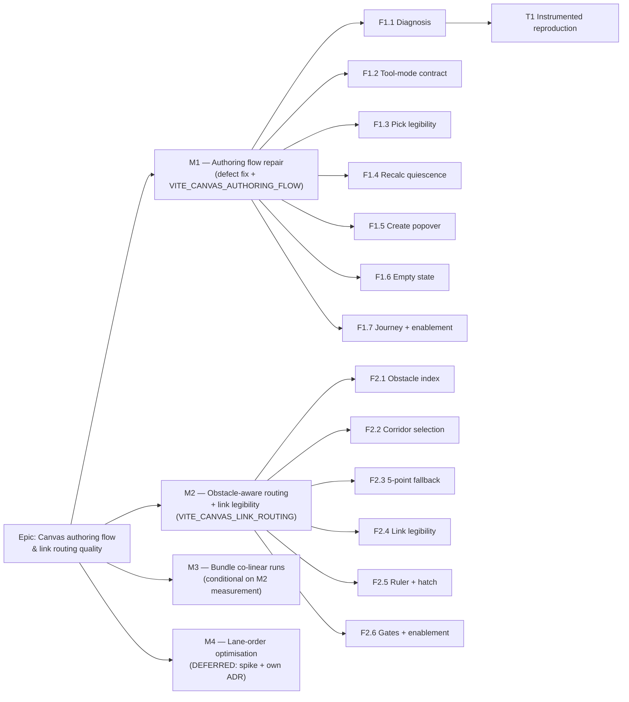

# Implementation Plan: TSLD canvas authoring flow & link routing quality

- **Feature spec:** [`./feature-spec.md`](./feature-spec.md)
- **Status:** Draft — awaiting approval
- **Owner:** _tbc_

> **Decisions taken 2026-07-30** (product owner, all four critical questions answered —
> see the spec's _Open questions_ table). CQ-1 **yes**: Task 1 gates the milestone and A2
> closes as _unreproduced_ rather than _fixed_ if it cannot be reproduced. CQ-2 **sticky**,
> with a loud armed state and a real exit. CQ-3 **split**: defect fixes unflagged, additive
> surface flagged. CQ-4 **deferred**: M4 is a spike + ADR, not built here.
> **Approval to begin implementation is still outstanding.**

## Breakdown

### Epic

**Canvas authoring flow & link routing quality** — make the TSLD canvas's primary act
(create logic) reliable, and make the logic it creates readable. Maps to the TSLD
canvas-quality roadmap theme; no roadmap Must-have is opened or closed by it, but it is a
prerequisite for the brief's authoring premise being true in practice.

**Epic-wide invariants** (every task must hold these; state it in the PR):

- **The CPM engine is not imported.** No file this epic touches imports
  `computeSchedule`. No scheduling input is added, removed or changed. The ADR-0034 recalc
  parity gate is untouched **by construction**, not by test.
- **No API, DB or permission change.** Every write composes an existing mutation; the API
  remains the sole trust boundary.
- **Flag-off is byte-for-byte** for everything behind a flag, pinned by parity suites.
- **The pre-push gate is run, not written** — `pnpm lint && pnpm typecheck && pnpm test`,
  plus `scripts/e2e-local.sh web:<suite>` for any task touching a flag-on journey
  (`docs/TESTING.md` "Before you push"). No `apps/api` change, so `e2e-local.sh api` is
  not required — say that in the PR rather than leaving it ambiguous.

---

## Milestone 1 — Authoring flow repair

**Outcome:** a Planner can draw a run of activities, leave the tool, arm the Link tool,
see which endpoint they picked, create a dependency, and be told what was created — with
the diagram holding still while they do it.

**Flag policy (CQ-3, DECIDED 2026-07-30 — split):** the **defect fixes** (T2, T3, T8) ship **unflagged** with
regression tests — flag-gating them would mean writing parity suites that pin a bug. The
**additive surface** (T4, T5, T6, T7, T9, T10) ships behind **`VITE_CANVAS_AUTHORING_FLOW`**,
default-off, with a flag-off parity suite, and flips in T13.

---

#### Feature F1.1 — Diagnose A2 before fixing it

> **Description:** Determine, with evidence, why a link recorded `Reinforce → Set out`
> after clicking _Set out_ then _Reinforce_. The code path maps first click → predecessor
> with no inversion [VERIFIED], so the cause is elsewhere; the fix depends on which.
> **Complexity:** M
> **Dependencies:** none — this is the first thing that happens.
> **Risks:** the defect does not reproduce → we ship guardrails and close it as
> _unreproduced_, explicitly, rather than as _fixed_. Recording "fixed" for a defect we
> never explained is the failure ADR-0058 exists to name.
> **Testing requirements:** whatever reproduces it becomes a permanent test.

##### Task 1 — Instrumented reproduction of the link-direction defect

- **Description:** Build a deterministic harness that drives the two-click link against a
  real API with the pen held, with the auto-recalc cadence observable, and record which of
  the two candidate mechanisms fires: (i) the first click never became a pick (so a later
  click did), or (ii) the scene re-laid out between clicks and each click hit the other bar.
- **Complexity:** M
- **Dependencies:** none
- **Risks:** non-deterministic; mitigate by parameterising the inter-click delay across
  the 500 ms `AUTO_RECALC_DEBOUNCE_MS` boundary and running each case repeatedly.
- **Testing:** the harness itself becomes the first spec in the new
  `apps/web/e2e-authoring-flow/` suite. Whichever mechanism is found also gets a **unit**
  regression at the lowest layer that can express it.
- **Development steps:**
  1. Seed a plan with two activities whose bars are known to move under recalc (one with an
     SNET pin, one without) and two whose bars are known not to.
  2. Drive click → wait(t) → click for `t ∈ {0, 250, 600, 1500} ms`; assert the created row's
     `predecessorId`/`successorId` against the click order.
  3. Instrument: log the gesture state after each click and the scene's rects at each click
     time; assert the hit-tested id equals the intended id.
  4. Record the finding in the PR **and** in `docs/DECISIONS.md` — including "not
     reproduced" if that is the answer.
  5. If mechanism (i): trace where the first click was swallowed (candidates: the `pending`
     create-popover guard at `TsldCanvas.tsx` ~line 1483, a `wasDrag` misclassification at
     ~line 1674, or a stale `mode` in the pointer-up closure) and add the unit regression there.
  6. If mechanism (ii): T7's quiescence is the fix, and this test becomes its proof.

---

#### Feature F1.2 — One arm/disarm contract for canvas tool modes

> **Description:** Make arming a tool an explicit, stated, reversible act, shared by all
> four modes. **Unflagged** — these restore behaviour the code's own docblocks claim.
> **Complexity:** M
> **Dependencies:** none (T1 runs in parallel; it does not gate these).
> **Risks:** the Link control's shape change could break the ADR-0031 roving-tabindex
> contract → keep it **one** focusable stop, exactly like `AddActivityControl`;
> the toolbar suites already assert this.
> **Testing requirements:** unit (toolbar context), component (both controls, armed/
> disarmed/disabled), regression tests named for the defect.

##### Task 2 — Link becomes a split control that actually arms

- **Description:** `LinkControl`'s label region toggles `mode` between `link` and `select`
  and reflects `aria-pressed`; the caret region opens the FS/SS/FF menu. Picking a type
  from the menu still arms (today's behaviour, kept). One focusable stop.
- **Complexity:** M
- **Dependencies:** none
- **Risks:** a split-look control that is one button must not become two tab stops →
  mirror `AddActivityControl` exactly (`toolbarSplitCaretVariants`).
- **Testing:** component tests — trigger click arms and `aria-pressed=true`; caret opens
  the menu without arming twice; **the named regression:** with Add armed, arming Link
  leaves Add disarmed and the next canvas click picks an endpoint rather than opening the
  create popover.
- **Development steps:**
  1. Split the trigger's click target; route the label region to `ctx.toggleLinkMode()`.
  2. Add `aria-pressed={ctx.isLinking}`; keep `aria-haspopup`/`aria-expanded` on the caret.
  3. Update `tsld-toolbar-authoring.test.tsx` and add the regression.
  4. Update the ADR-0031 registry docs where the control shape is described.

##### Task 3 — Escape and explicit exit disarm every tool

- **Description:** Repair the Escape → disarm path for `add-activity` (T1 will say whether
  the break is the `pending` guard, the `exitAddModeRef` wiring, or the listener ordering)
  and make the armed trigger itself a disarm. Uniform semantics: **first** Escape drops an
  open pick; **second** Escape disarms the tool; both announce.
- **Complexity:** M
- **Dependencies:** T1 (for the precise cause), T2 (shared control shape)
- **Risks:** a window-level `keydown` listener competing with dialog Escape handling →
  keep the existing "a create popover owns its own Esc" precedence and test it.
- **Testing:** unit on the reducer's escape semantics; component tests for each of the four
  modes: armed → Escape → `select`, trigger reads its idle label, cursor class reverts. The
  named regression: `Escape` after a successful create disarms Add.
- **Development steps:**
  1. Reproduce in a component test first (the test must fail before the fix).
  2. Fix the identified cause; do not "fix" all three candidates blind.
  3. Add disarm-on-armed-trigger for Add and Link.
  4. Announce the mode change via the existing live region (WCAG 4.1.3).

---

#### Feature F1.3 — The pick, and the result, are stated

> **Description:** The armed tool and the open pick are stated on screen and to assistive
> technology; the created link is confirmed with its direction and an Undo.
> **Complexity:** M
> **Dependencies:** F1.2
> **Risks:** a new band competing with the ADR-0054 cursor chip, the ADR-0056 Today pill
> and the ADR-0031 floating selection bar (`TECH_DEBT` #31a) → place it in the reserved
> chrome, not floating over the scene, and prove non-collision in the journey.
> **Testing requirements:** component + journey; announcement assertions.

##### Task 4 — Mode statement band (flagged)

- **Description:** A compact, non-modal strip stating the armed tool and the next expected
  action: `Adding Task — drag a span (Esc to stop)` / `Linking FS — click the predecessor`
  / `Linking FS from "A" — click the successor`. Composed from existing tokens; no new
  primitive; no one-off styling.
- **Complexity:** M
- **Dependencies:** T2, T3
- **Risks:** it must not consume canvas height when nothing is armed → render nothing in
  `select` mode, and assert the scene's paint is byte-for-byte identical then.
- **Testing:** component (each mode's copy); parity test (nothing armed ⇒ identical DOM +
  identical canvas call counts); axe.
- **Development steps:** copy review with the ux lens (sentence case, no jargon) → render →
  parity test → flag-off suite entry.

##### Task 5 — Link confirmation with direction and Undo (flagged)

- **Description:** After a successful link, confirm `Linked "A" → "B" (FS)` with an Undo
  that calls the **existing** ADR-0048 inverse. Reword the single existing announcement
  (`TsldPanel.tsx` ~line 1346) to carry direction — one source of the text, never two.
- **Complexity:** M
- **Dependencies:** T4
- **Risks:** double-speaking (a `role="alert"` banner plus a polite announcement) → one
  live region, asserted.
- **Testing:** component (confirmation text and Undo wiring); unit (the announcement string
  is generated once); journey (Undo removes the row from the API).

##### Task 6 — Keyboard pick parity for the Link tool (flagged)

- **Description:** In `link` mode, Enter on the focused activity in the parallel DOM
  listbox picks the predecessor, then commits on a different activity — mirroring the LOE
  tool's existing branch. Enter outside `link` mode still opens the Logic tab.
- **Complexity:** S
- **Dependencies:** T4
- **Risks:** stealing Enter from the Logic-tab path → the branch is gated on
  `mode === 'link'` and tested both ways.
- **Testing:** component tests for both branches; the journey drives the whole link by
  keyboard, including the announcements (WCAG 2.1.1).

---

#### Feature F1.4 — Recalc quiescence during a pick

> **Description:** Defer the coalesced auto-recalculation while a two-click pick is open,
> with a hard cap. This is the epic's only new _concept_ and the reason M1 has an ADR.
> **Complexity:** M
> **Dependencies:** F1.3 (the drop must be stateable)
> **Risks:** an indefinite hold leaves dates stale → capped and tested; a hold leaked by a
> crashed pick would stall recalcs for the session → the hold is token-based and released
> in a `finally`, with a test that asserts release on every exit path.
> **Testing requirements:** unit on the hook (fake timers), component on the drop path.

##### Task 7 — `hold`/`release` on the auto-recalc coalescer (flagged)

- **Description:** Add `hold(token)` / `release(token)` to `usePlanAutoRecalc`. While any
  hold is open, a `notify()` records the request but does not fire; on the last release —
  or at the cap (default **10 000 ms**, exported constant) — it fires. At the cap the open
  pick is **dropped** and stated. No hold ⇒ today's cadence byte-for-byte.
- **Complexity:** M
- **Dependencies:** T4, T5
- **Risks:** interaction with the existing single-flight + unmount flush → extend the
  existing tests rather than writing a parallel set; assert the unmount path still
  best-effort flushes.
- **Testing:** unit with fake timers — hold ⇒ no fire; release ⇒ fire once (coalesced);
  cap ⇒ fire + pick dropped + statement; no hold ⇒ every existing test unchanged.
  Component: a pick open across a structural edit does not move a bar.
- **Development steps:**
  1. Token set in a ref; `notify` checks it before scheduling.
  2. Cap timer armed on the first hold, cleared on the last release.
  3. Wire `hold` on entering `linkPicking`/`loePicking`, `release` on every exit
     (commit / cancel / Escape / disarm / pen loss / unmount).
  4. Assert release on every exit path in one table-driven test.

---

#### Feature F1.5 — The create popover is a proper form field

> **Description:** Give the name field a visible label, distinguish the submit's accessible
> name, and drop the native `disabled` on a control that flips.
> **Complexity:** S
> **Dependencies:** none
> **Risks:** low. Changing the submit's accessible name will break locators in existing
> suites → update them in the same PR (they are the contract).
> **Testing requirements:** component + axe; the existing `CreateActivityPopover.test.tsx`
> extended, not replaced.

##### Task 8 — Visible label, distinct submit, non-native disable (unflagged)

- **Description:** Add a visible **Name** label using the ADR-0061 form-layout vocabulary;
  keep or drop the placeholder as an example only. Rename the submit so it does not collide
  with the toolbar's Add. Replace `disabled` with `aria-disabled` + a reason, per the
  ScopeSaveBar lesson (ADR-0060 M6, ADR-0063 M6).
- **Complexity:** S
- **Dependencies:** none
- **Risks:** none material.
- **Testing:** `getByLabel('Name')` resolves; axe clean; a test asserting focus is not lost
  when the submit's enabled state flips; the accessible name differs from the toolbar's.

---

#### Feature F1.6 — Empty-plan state

> **Description:** Tell a planner opening an empty plan what the first gesture is.
> **Complexity:** S
> **Dependencies:** F1.2 (the affordance arms the real tool)
> **Risks:** offering an action a role cannot take → shade with a reason, never hide
> (ADR-0062 M6's finding, twice).
> **Testing requirements:** component (three states), axe, parity.

##### Task 9 — Canvas empty state (flagged)

- **Description:** With zero activities: a short prompt naming the gesture and a control
  that arms Add. Without the pen, or as Viewer/Contributor: the prompt states the plan is
  empty and the action is shaded with the reason. Any activity ⇒ nothing drawn, paint
  byte-for-byte today's.
- **Complexity:** S
- **Dependencies:** T2
- **Risks:** interacting with `TECH_DEBT` #31(d) (empty/uncalculated plans hide frame/lens
  commands rather than shading them) → this task is the natural moment to reconcile that
  spec↔code divergence; do it or explicitly record why not.
- **Testing:** component × 3 states; axe; parity test for the non-empty case.

---

#### Feature F1.7 — Journey, gates and enablement

> **Description:** The flag-on Playwright journey, the deferred specialist review pass, and
> the flag flip.
> **Complexity:** M
> **Dependencies:** all of M1
> **Risks:** the ADR-0063 lesson — five CI rounds spent on a journey whose every failure was
> visible in the first local run. Mitigation: `scripts/e2e-local.sh web:authoring-flow`
> before the first push, no exceptions.
> **Testing requirements:** the journey is the test.

##### Task 10 — `apps/web/e2e-authoring-flow/` suite + CI step

- **Description:** A new flag-scoped Playwright project (config, `test:e2e:authoring-flow`
  script, its own CI step) proving, against a real API with the pen enforced: draw two
  activities → disarm with Escape → arm Link → pick → **assert the stated pick** → pick →
  **assert the created row's direction** → Undo removes it → keyboard path does the same.
- **Complexity:** M
- **Dependencies:** T1–T9
- **Risks:** flakiness from the recalc cadence → the journey asserts the quiescence
  behaviour explicitly rather than sleeping around it.
- **Testing:** it is the test. Must be run locally before pushing.

##### Task 11 — ADR-A + docs

- **Description:** Write the tool-mode & recalc-quiescence ADR (§4.9 of the spec); record
  the unflagged defect fixes and T1's finding in `docs/DECISIONS.md`; update `CLAUDE.md`
  §16's ADR list and the flag comment in `apps/web/src/config/env.ts`; update
  `docs/TESTING.md` with the new suite.
- **Complexity:** S
- **Dependencies:** T1 (its finding belongs in the ADR's context)
- **Risks:** the ADR list in `CLAUDE.md` has drifted before, while an ADR about drift was
  being written — verify the count, do not trust it.
- **Testing:** `pnpm check:doc-links`.

##### Task 12 — Deferred specialist review pass over the combined M1 diff

- **Description:** Run **ux-reviewer**, **accessibility-reviewer**, **component-reviewer**
  and **test-engineer** over the whole M1 diff; fold every blocking finding with a
  regression test; record the rest in `docs/TECH_DEBT.md` rather than rushing them.
- **Complexity:** M
- **Dependencies:** T1–T11
- **Risks:** none — this step has caught real defects in every one of the last four epics,
  which is why it is a task and not a hope.
- **Testing:** each folded finding gets a regression test.

##### Task 13 — Flip `VITE_CANVAS_AUTHORING_FLOW` default-on

- **Description:** Flip the flag once T12's findings are folded and the journey is green
  locally and in CI. Keep the flag-off parity suites — they are the rollback contract.
- **Complexity:** S
- **Dependencies:** T12
- **Risks:** none beyond the flip itself; the parity suites make rollback a one-line change.
- **Testing:** full gate + both journeys.

---

## Milestone 2 — Obstacle-aware routing & link legibility

**Outcome:** links route around bars, direction is legible at Month zoom, the ruler stops
overprinting its month labels, and non-working hatching stops dominating at coarse zoom.

**Flag:** `VITE_CANVAS_LINK_ROUTING`, default-off, with a **flag-off parity gate asserting
every emitted polyline is identical point-for-point to today's** over a fixture corpus.

---

#### Feature F2.1 — The per-frame obstacle index

> **Description:** A pure, per-frame per-lane interval index of occupied x-spans, built
> from geometry the painter already computes.
> **Complexity:** M
> **Dependencies:** none
> **Risks:** building it per frame could itself blow the budget → build from the existing
> cull pass's output, one pass, and pin the call count in a budget gate.
> **Testing requirements:** unit (pure), budget gate.

##### Task 14 — `laneIntervalIndex` in `render-model.ts`

- **Description:** Pure function: visible activities → `Map<laneIndex, sorted [x0,x1][]>`,
  with a binary-search `isFree(lane, x)` companion. No canvas, no DOM.
- **Complexity:** M
- **Dependencies:** none
- **Risks:** milestones and WBS summaries have different geometry → derive spans from
  `activityRect`, the one existing source, never re-derived.
- **Testing:** unit — empty lanes, single bar, adjacent bars, overlapping bars (the
  lane-overlap conflict case already modelled in `lane-overlap.ts`), milestones, summaries.

---

#### Feature F2.2 — Corridor selection

> **Description:** `routeOrthogonal` chooses its elbow from a bounded candidate list,
> preferring the first free corridor. Absent an index ⇒ today's output exactly.
> **Complexity:** L
> **Dependencies:** F2.1
> **Risks:** (a) non-determinism → fixed candidate order, first-success, tested;
> (b) interaction with ADR-0052's `elbowShift` fan-out → the shift is applied **after**
> corridor choice and stays clamped inside the gap, tested;
> (c) interaction with ADR-0054's lag anchors and their drag inverse → the lag anchor and
> its run are computed from the **anchors**, not the elbow, so they are unaffected; pin
> that with a test rather than an argument.
> **Testing requirements:** unit (geometry corpus), parity gate, budget gate.

##### Task 15 — Bounded candidate corridors + the free-corridor predicate

- **Description:** Implement candidates (today's elbow → gutter → midpoint → target∓gap),
  the crossed-lane free test, and the selection. Constant `MAX_CORRIDOR_CANDIDATES = 4`,
  pinned by a test.
- **Complexity:** L
- **Dependencies:** T14
- **Risks:** as above.
- **Testing:** unit corpus of generated layouts asserting **0** emitted verticals cross a
  non-endpoint bar where a free corridor exists; determinism (same input ⇒ identical
  output, twice); **parity** (no index ⇒ byte-identical polylines for a fixture corpus).
- **Development steps:**
  1. Add the optional obstacle parameter with a default that reproduces today exactly.
  2. Implement candidates + predicate as pure functions.
  3. Parity corpus first (it must pass before the new path is wired).
  4. Wire through `paint.ts` `lineOf` — the one seam.

##### Task 16 — 5-point (VHV-equivalent) fallback

- **Description:** When no candidate is free, route via two corridors and a short horizontal
  leg in the **inter-lane gutter** (the 10 px band between 18 px bars in a 28 px lane, where
  a bar can never be). If that is also blocked, fall back to today's shape — bounded work is
  the contract.
- **Complexity:** M
- **Dependencies:** T15
- **Risks:** arrowhead direction on a 5-point path → `arrowhead()` already scans back for
  the last non-degenerate segment; test it on the new shape.
- **Testing:** unit — a layout with no free single corridor produces 5 points; the fallback
  of the fallback produces today's 4.

---

#### Feature F2.3 — Link legibility

> **Description:** Direction and weight legible at Month zoom, without displacing the
> existing driving/non-driving cue.
> **Complexity:** M
> **Dependencies:** F2.2 (paths settle first)
> **Risks:** a heavier link on a dense plan can read as noise → tune against a realistic
> fixture, not a three-bar toy; contrast-check in all three themes.
> **Testing requirements:** the ADR-0055 computed contrast matrix; component; human check.

##### Task 17 — Arrowhead size, stroke weight, token

- **Description:** Raise `ARROWHEAD_PX` from 5 to a Month-legible size; adjust link weight;
  select/confirm a token that passes contrast on both canvas grounds (plain and month-band)
  in light/dark/system.
- **Complexity:** M
- **Dependencies:** T15, T16
- **Risks:** collision with `FAN_OUT_MAX_PX = 6` and the ADR-0054 lag handles → assert the
  head never overlaps a fanned sibling's anchor at maximum fan.
- **Testing:** contrast matrix; unit on head geometry at the new size; budget gate
  (head count per frame unchanged); a browser screenshot in the PR at Month zoom.

##### Task 18 — Ruler sticky month label; non-working hatch level-of-detail

- **Description:** (a) The sticky first-column month label is pinned to x=0 and suppressed
  when the next boundary falls within its measured width — the `JuAug` overprint, whose
  mechanism is `rulerTicks` emitting both the sticky label and the boundary label a few px
  apart. (b) Below the day-resolvable threshold, the non-working hatch degrades to the flat
  wash — the fallback path already exists in `nonWorkingHatchTile`.
- **Complexity:** M
- **Dependencies:** none (can land early)
- **Risks:** `time-scale.ts` is **shared with the Gantt** (ADR-0059) → one implementation;
  run the Gantt journey too.
- **Testing:** unit on `rulerTicks` (the exact overlap case); the existing grid/band budget
  gates; both the canvas and Gantt journeys.

---

#### Feature F2.4 — Gates, review and enablement

##### Task 19 — Routing budget gate

- **Description:** A `paint.routing-budget.test.ts` in the counting-stub family: per-frame
  path/stroke/`beginPath` counts do not grow beyond the existing O(visible edges) shape;
  index construction is one pass; corridor tests per edge are bounded by the constant.
- **Complexity:** M
- **Dependencies:** T15, T16
- **Risks:** a shape gate cannot catch a constant-factor regression → pair it with the
  browser-measured run in T21 and say plainly in the PR that CI cannot measure ADR-0026
  §16's envelope (`TECH_DEBT` #59 stays open).
- **Testing:** it is the test.

##### Task 20 — ADR-B + docs

- **Description:** Write the routing ADR (§4.9), **including the rejected diagonals with
  their reasons** (x is time; the diagonal channel is ADR-0056's hatch and ADR-0054's
  tails) and the rejected ten-shape taxonomy. Update `CLAUDE.md` §16, the flag comment, and
  `docs/DECISIONS.md` for the ruler/hatch fixes.
- **Complexity:** S
- **Dependencies:** T15–T18
- **Risks:** none.
- **Testing:** `pnpm check:doc-links`.

##### Task 21 — Review pass, measurement, flag flip

- **Description:** Run **performance-reviewer**, **accessibility-reviewer**,
  **component-reviewer** and **ux-reviewer** over the combined M2 diff; take one
  browser-measured draw timing at 2,000 activities and report it beside the pre-change
  baseline (ADR-0055 S4's precedent: report the run-to-run spread, not a single number);
  extend the flag-on journey with a dense-plan routing assertion; flip
  `VITE_CANVAS_LINK_ROUTING` default-on.
- **Complexity:** M
- **Dependencies:** T14–T20
- **Risks:** the measurement comes back bad → M2 does not flip; M3 bundling is then the
  remedy, not an enhancement. Say this before measuring, not after.
- **Testing:** full gate + journeys, run locally first.

---

## Milestone 3 — Bundle co-linear parallel runs (conditional)

**Outcome:** a hub with many successors draws one trunk with branches instead of N
near-identical verticals.

**Gate:** only start if T21's measurement and the ux review say the remaining legibility
problem is _parallel-run density_ rather than something else. If M2 measures badly, M3
becomes the remedy for the cost, not for the look.

> **Resolved 2026-07-31 — built, and the gate's second clause did not survive contact.**
> T21 measured badly (see ADR-0065 and `docs/TECH_DEBT.md` #75), which by the sentence above
> would make M3 the remedy for the cost. **It is not**: the painter batches every edge into
> one path, so bundled verticals cost exactly what separate ones did, and re-measuring after
> T22 landed found no change in either direction. M3 shipped on the legibility outcome alone.
> The gate's other input — a ux review of what the remaining problem actually is — was **not
> run**; that is a gap in the evidence, recorded rather than papered over.

##### Task 22 — Trunk/branch merging behind the same flag

- **Description:** Group edges sharing a corridor within a tolerance; emit one trunk and
  per-target branches; preserve per-edge arrowheads, the driving cue, and the ADR-0052 lag
  anchors (each edge keeps its own anchor and its own drag inverse).
- **Complexity:** L
- **Dependencies:** M2 complete and flipped
- **Risks:** highest in the epic — bundling changes which pixels belong to which edge, and
  the lag-anchor **drag** reads geometry from the same seam. Mitigation: bundle the **line**
  only; anchors and handles keep today's per-edge geometry, pinned by a test.
- **Testing:** unit (grouping determinism, tolerance boundaries); hit-test regression (a lag
  handle on a bundled edge still grabs its own edge); budget gate; journey.

---

## Milestone 4 — Lane-order optimisation (DEFERRED)

**Not built in this epic** (CQ-4, DECIDED 2026-07-30 — deferred). Recorded so the reasoning is not lost.

##### Task 23 — Spike + ADR only

- **Description:** Prototype a barycentre/median lane ordering over the existing
  `auto-pack.ts` input, offline, on real plan shapes; measure crossing reduction and the
  size of the resulting `laneIndex` write; draft the ADR (options: barycentre/median,
  median-only, simulated annealing, do nothing; the undo story — likely a non-undoable
  boundary like `dissolve`, ADR-0063; the confirm flow).
- **Complexity:** L
- **Dependencies:** M2 complete (routing first — good routing on a bad lane order still
  looks tangled; a good order with obstacle-blind routing still draws through bars)
- **Risks:** it rewrites `laneIndex` for a whole plan — a bulk write with a confirm flow and
  an ADR, not a paint change. Building it inside this epic would make M2 un-shippable while
  M4 is argued about.
- **Testing:** spike only; no production code.

---

## Sequencing & slices

```mermaid
gantt
  dateFormat X
  axisFormat %s
  section M1 (unflagged fixes + VITE_CANVAS_AUTHORING_FLOW)
  T1 diagnose            :a1, 0, 2
  T2 link arms           :a2, 0, 2
  T3 escape disarms      :a3, after a1, 2
  T8 popover             :a8, 0, 1
  T4 statement band      :a4, after a3, 2
  T5 confirmation+undo   :a5, after a4, 2
  T6 keyboard parity     :a6, after a4, 1
  T7 quiescence          :a7, after a5, 2
  T9 empty state         :a9, after a2, 1
  T10 journey            :a10, after a7, 2
  T11 ADR+docs           :a11, after a10, 1
  T12 review pass        :a12, after a11, 2
  T13 flip               :a13, after a12, 1
  section M2 (VITE_CANVAS_LINK_ROUTING)
  T18 ruler+hatch        :b18, 0, 2
  T14 obstacle index     :b14, after a13, 2
  T15 corridors          :b15, after b14, 3
  T16 5-point fallback   :b16, after b15, 2
  T17 legibility         :b17, after b16, 2
  T19 budget gate        :b19, after b16, 1
  T20 ADR+docs           :b20, after b17, 1
  T21 review+measure+flip:b21, after b20, 2
  section M3 / M4
  T22 bundling (cond.)   :c22, after b21, 3
  T23 lane-order spike   :c23, after b21, 3
```

Each task is one PR. `main` stays releasable throughout: the unflagged M1 fixes are
strictly corrective and carry regression tests; everything additive sits behind a
default-off flag with a parity suite until its enablement task.

> **Delivered 2026-07-31, released in `web-v0.62.0`.** M1–M3 landed and **both flags are
> default-on**; the "default-off" wording throughout this plan records each flag's state at
> **introduction**, before its own enablement task flipped it (T13, T21). ADR-0064 and ADR-0065 are
> the current statement of behaviour. M4 remains deferred by CQ-4.

**Flags introduced:** `VITE_CANVAS_AUTHORING_FLOW` (M1), `VITE_CANVAS_LINK_ROUTING`
(M2/M3). Both default-off on introduction, flipped in their own task, with the flag-off
parity suites **kept** afterwards as the rollback contract (the ADR-0053 M6 precedent).

**Version impact:** web-only, user-visible → a changeset per user-visible PR; **minor**
bumps pre-1.0. No API package change, so no `api-vX.Y.Z` release from this epic.

## Definition of Done (per task)

Each task's PR must satisfy the Feature Completion Criteria in
[`docs/PROCESS.md`](../../PROCESS.md) — code, tests, docs, security, performance,
accessibility, Docker build, CI, changelog, version impact — with these epic-specific
readings:

- **Security review:** the change surface adds no endpoint, permission or scope. State
  that in the PR instead of booking a review that would find nothing; if any task grows an
  API change, that statement stops being true and the review is mandatory.
- **Performance:** any task touching `paint.ts`/`render-model.ts` carries or extends a
  counting-stub budget gate. `TECH_DEBT` #59 remains open — CI cannot measure ADR-0026
  §16's envelope, and no PR may imply otherwise.
- **Accessibility:** every stated surface (band, confirmation, empty state, popover) is
  axe-clean, keyboard-operable, and announced once — not twice.
- **Pre-push gate run, not written:** `pnpm lint && pnpm typecheck && pnpm test`, plus
  `scripts/e2e-local.sh web:authoring-flow` (and `web:gantt` for T18, which touches shared
  time-scale code).

## Risks & assumptions (rollup)

| Risk / assumption                                                                                   | Likelihood  | Impact | Mitigation                                                                                                                                                                                                             |
| --------------------------------------------------------------------------------------------------- | ----------- | ------ | ---------------------------------------------------------------------------------------------------------------------------------------------------------------------------------------------------------------------- |
| **A2's root cause is never reproduced**                                                             | med         | med    | T1 is time-boxed; if unreproduced we ship the guardrails and close it **as unreproduced**, in writing. The guardrails are correct under either candidate mechanism.                                                    |
| **A2 is a third mechanism we have not thought of**                                                  | low         | high   | T1 instruments the gesture state and the hit-tested id at each click, so it captures the actual divergence rather than testing our two hypotheses.                                                                     |
| Escape's break is in a place T1 does not look                                                       | low         | med    | T3 requires a failing component test **before** the fix; three candidate causes are named in the task.                                                                                                                 |
| Quiescence hold leaks and stalls recalcs                                                            | low         | high   | Token-based, released on every exit path in a table-driven test; hard cap; no hold ⇒ today's cadence.                                                                                                                  |
| Routing regresses the draw budget                                                                   | med         | high   | Parity gate (flag-off byte-identical), counting-stub shape gate, bounded candidates, index built from the existing cull pass, plus a browser-measured run before the flip. **If it measures badly, M2 does not flip.** |
| Routing interacts with ADR-0052 fan-out / lag-anchor drag                                           | med         | high   | Shift applied after corridor choice and clamped; anchors and handles keep per-edge geometry; both pinned by tests, not by argument.                                                                                    |
| Bundling (M3) breaks per-edge hit-testing                                                           | med         | high   | Bundle the drawn line only; handles stay per-edge; gated behind a measurement decision, and skippable.                                                                                                                 |
| Ruler fix diverges canvas and Gantt                                                                 | low         | high   | One shared implementation in `time-scale.ts`; both journeys run.                                                                                                                                                       |
| **The e2e half of the gate gets skipped again**                                                     | med         | med    | It is a named step in T10/T13/T18/T21, not a footnote. The ADR-0063 journey cost five CI rounds for exactly this.                                                                                                      |
| ADR-0026 §16's budget has never been measured on its stated hardware                                | **certain** | med    | Out of scope to close (`TECH_DEBT` #59). This epic must not make it worse and must not claim to have measured it.                                                                                                      |
| Observed items (hatch dominance, ruler collision, bar overlap) do not generalise beyond one session | med         | low    | Each is cheap, independently revertible, and the ruler one now has a **read** mechanism rather than only a screenshot.                                                                                                 |
