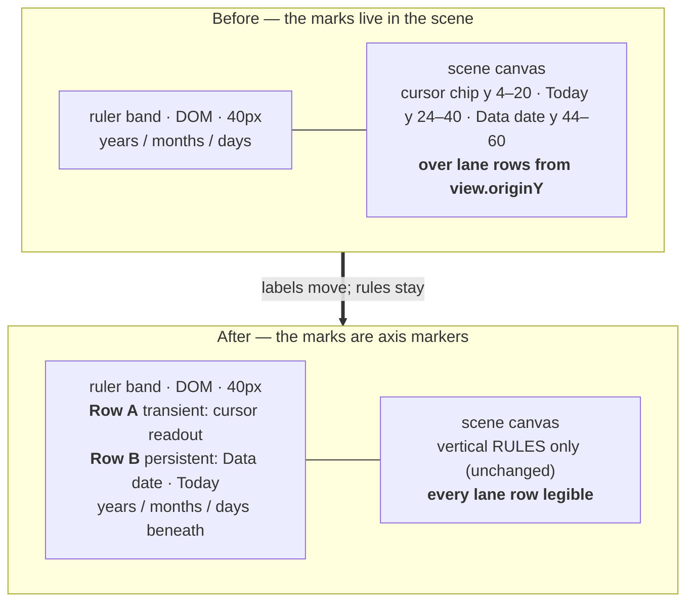
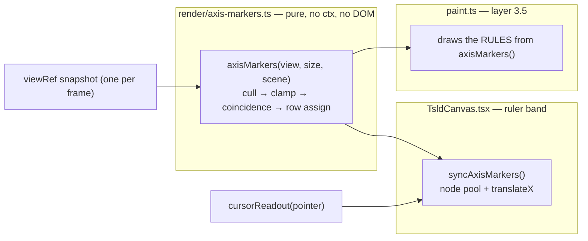

# Feature Spec: Canvas axis markers — the date pills leave the scene

- **Status:** Draft (approved for planning by the product owner; see §1 "Approval state")
- **Author(s):** feature-analyst, from a `ui-architect` pass over `docs/TECH_DEBT.md` #148
- **Date:** 2026-08-22
- **Tracking issue / epic:** `docs/TECH_DEBT.md` #148
- **Roadmap link:** none — a defect in the primary surface, not a roadmap theme
- **Related ADR(s):** amends ADR-0026 (canvas layer model), ADR-0054 §2 (cursor readout),
  ADR-0056 (time axis, marker channels), ADR-0078 (layer painters + the golden oracle),
  ADR-0099 (the diagram's vertical budget). A **new ADR is required** — outline in §4.7.

---

## 0. Why this spec exists at all

`docs/TECH_DEBT.md` #148 is a register row, and `docs/PROCESS.md` "What a tech-debt row does and
does not substitute for" lets a row stand in for stages 1–2 **while the change adds no new surface**.
A `ui-architect` pass established that this change fires **two** ADR-0105 triggers, so the full spec
is mandatory and the row covers nothing:

1. **A component's public contract.** `render/paint.ts` exports `CURSOR_CHIP_TOP` (`:1786`),
   `CURSOR_CHIP_H` (`:1784`), `TODAY_CHIP_TOP` (`:1797`), `TODAY_CHIP_H` (`:1789`) and
   `DATA_DATE_CHIP_TOP` (`:1807`); `docs/DESIGN_SYSTEM.md:712-738` documents the marker-channel
   table and the coincidence rule as **"the constraint the next canvas mark must obey"**. Revising
   that table is stage-4 work.
2. **A shared gate.** `render/paint.golden.test.ts` is the ADR-0078 S1 characterisation oracle for
   the whole painter, and this is its **first real re-baseline**. Two collision guards in
   `render/paint.test.ts` (`:539`, `:683`) have their subject deleted, and
   `render/paint.data-date-budget.test.ts:174` carries an equality (`fillText` delta `=== 1`) that
   must move.

**The trigger fires for every variant that changes what the painter emits**, so there is no version
of this work that avoids the spec.

### Approval state

The product owner has pre-approved the plan. Two genuine product trade-offs remain and are marked
**CRITICAL** in §1 "Open questions"; both carry a stated default so no milestone is blocked, and
both are settled by the M0 measurement rather than by argument.

---

## 1. Business understanding

### Problem

The TSLD paints three date pills at fixed screen y at the top of the **scene** canvas, with x derived
from a day offset:

| Mark             | Occupies (scene y) | Painted by                                    |
| ---------------- | ------------------ | --------------------------------------------- |
| Cursor date chip | 4 – 20             | `paintInteractionLayer`, `paint.ts:1863-1876` |
| Today pill       | 24 – 40            | `paintScene` layer 3.5, `paint.ts:1366-1381`  |
| Data date pill   | 44 – 60            | `paintScene` layer 3.5, `paint.ts:1389-1404`  |

A bar occupies `screenYOfLane(lane, view) + (LANE_HEIGHT 28 − BAR_HEIGHT 18) / 2`, i.e. 18 px of
every 28 px lane row, starting at `view.originY`. **Measured at 1646 on the flagship plan: the
`Data date` pill prints across the start of `A1000 Site set…`.** The pills obscure the one thing on
the diagram that is not inferable from anything else — an activity's name and the position of its
own bar edges.

**What makes it interesting rather than merely untidy** is what the existing code is careful about.
`TODAY_CHIP_TOP` is derived from `CURSOR_CHIP_TOP + CURSOR_CHIP_H + 4` and `DATA_DATE_CHIP_TOP`
from the row above it, each with a docblock explaining that a literal offset would let a future edit
"silently reintroduce the collision" — and `paint.test.ts:537-541` and `:679-684` assert exactly
that. **Both guards ask whether the pills collide with each other. Nothing ever asked what was
underneath them.**

### Three claims in #148's own text are wrong or incomplete

Checked rather than inherited (ADR-0076; the brief is not evidence — `docs/PROCESS.md` "Decision-
bearing claims carry their evidence").

- **#148's table describes ONE pan position, and its title is wrong.** The row is headed _"painted
  on top of the first two lanes"_ and its table asserts `screenYOfLane(0, view) = view.originY = 0`.
  `view.originY` is **not** 0 on arrival: `fitToContent` pins `originY = paddingPx` with
  `paddingPx = 32` (`render/viewport.ts:180`, `:196`) and `DEFAULT_VIEWPORT` is `originY: 40`
  (`viewport.ts:124`). At `originY = 32` lane 0's bar is y **37–55**, so on first paint it is
  **Today and Data date** that strike it, not the cursor chip. And `pan()` applies `dy` with **no
  clamp at all** (`viewport.ts:82-84`), so _whichever_ lane the planner has panned to the top is the
  one under the pills. **Any acceptance criterion must hold for an arbitrary `originY`**, and a fix
  verified at one pan position has verified one pan position.
- **The pills are already chrome, by behaviour if not by placement.** None of the three consults
  `view.originY`; they do not pan with the scene. Their y is a screen constant. They are painted on
  the scene canvas by accident of history rather than by design — which is what makes moving them a
  correction rather than a relocation.
- **The export does NOT carry this defect.** The brief that opened this work claimed it did.
  Established by reading both call sites: `export/render-export-image.ts:127` calls `paint(...)`,
  then `:153` `drawTitleBand` fills `palette.ground` **opaquely** over `(0, 0, width, topBand)` with
  `EXPORT_TOP_BAND = 96` (`export/export-image.ts:42`), and the pills sit at y 24–60. **The Today
  and Data date pills have never appeared in any exported PNG or PDF.** The export names both marks
  in its legend instead (`render-export-image.ts:100-104`). This is a separate finding, recorded in
  §1 "Recorded, not folded in", and it also gives this work a strong parity claim (§2, US-4).

### Users

Everyone who can see a plan. The defect is on a **read** surface, so it is not scoped by write
permission and the fix changes no permission:

| Role                      | Sees the defect | Notes                                                                                         |
| ------------------------- | --------------- | --------------------------------------------------------------------------------------------- |
| Org Admin, Planner        | yes             | Also the only roles that can hold the ADR-0028 pen and therefore see the **cursor** chip.     |
| Contributor               | yes             | Reports progress; reads the diagram constantly.                                               |
| Viewer                    | yes             | Never sees the cursor chip (below), so a fix verified with the pen has verified two of three. |
| External Guest (ADR-0051) | yes             | `GuestPlanView` renders `TsldPanel` read-only. The one screen an outsider sees.               |

**The cursor chip is not reachable without the pen, and the reason recorded in the code is stale.**
`TsldCanvas.tsx:2021` writes `cursorPointRef` only under `CANVAS_LIVE_FEEDBACK_ENABLED && editing`,
so a Viewer and the guest view never get a cursor chip. The comment above it (`:2016-2020`) explains
this by asserting _"the interaction canvas only exists while editing (`ictx` is null otherwise)"_ —
which stopped being true at `:836`, where ADR-0080 made it
`interactionLayerMounted = editing || CANVAS_MULTI_SELECT_ENABLED` so a Viewer could see a marquee
sweep. The **effect** is unchanged and correct; the **reason** in the docblock is false. Recorded
here rather than stepped over (the ADR-0071 lesson), and repaired in M3.

### Primary use cases

1. Read an activity's name and bar position anywhere on the diagram, including in the topmost
   visible lane, at any pan position.
2. See where **today** is and where the **data date** is, and tell them apart, without either
   statement costing a bar.
3. While dragging or drawing, see the date the gesture will commit, without that readout landing on
   the bars being reasoned about.

### User journeys

**Happy path.** A planner opens a plan. The diagram frames itself (`fitToContent`). Along the ruler
band, adjacent to the vertical rules they name, sit `Data date` and — where it is separately
visible — `Today`. Every bar in every lane is legible, including the topmost. The planner pans
vertically; the markers stay put (they are chrome, and always were) and no bar is ever covered.

**Alternate — a gesture.** The planner arms a tool and drags. A cursor date readout appears in its
own row of the ruler band, above the persistent row, and tracks the pointer. The persistent row does
not move while it does. On release the transient row empties.

**Alternate — coincidence.** Data date and today fall on the same day. Exactly one vertical rule
draws (the data-date treatment) with one merged `Data date · today` marker — unchanged from today's
behaviour, ADR-0056/`DESIGN_SYSTEM.md:733-738`.

**Alternate — near-coincidence.** They fall a few days apart, close enough that two markers would
overprint. See the CRITICAL open question below.

### Expected outcomes

- No activity bar is ever obscured by a date marker, at any pan position, on any surface that
  renders the diagram.
- The diagram gains **zero** chrome: `sceneTopOffset` is unchanged, `RULER_HEIGHT` stays 40, and
  `aboveCanvas` stays at its measured 135 px (ADR-0099 M5).
- Date markers sit adjacent to the ruler tick they name, which is where a reader of a time-scaled
  diagram looks for a date.

### Success criteria

| #   | Criterion                                                                                                                                                 | How it is measured                                                                              |
| --- | --------------------------------------------------------------------------------------------------------------------------------------------------------- | ----------------------------------------------------------------------------------------------- |
| S1  | No marker element's bounding rect intersects the scene canvas's bounding rect.                                                                            | Browser assertion in the flag-on journey, at ≥ 2 pan positions and ≥ 2 zoom presets.            |
| S2  | `aboveCanvas` is **135 px before and after** — a zero-delta equality, not a bound.                                                                        | The ADR-0091 vertical-stack harness, before/after in one run.                                   |
| S3  | The painter emits **fewer** calls per frame, never more.                                                                                                  | `paint.data-date-budget.test.ts` deltas; `paint.dates-budget.test.ts` unchanged.                |
| S4  | The exported PNG is **byte-identical** before and after.                                                                                                  | `apps/web/e2e-export/` decodes the real download (the pills were painted under an opaque band). |
| S5  | Before/after screenshots of `plan-workspace`, `plan-workspace-readonly`, `export-diagram` show bars legible in the top lane and the ruler still readable. | `apps/web/scripts/shoot.mjs` (all three shots already exist: `:340`, `:345`, `:424`).           |
| S6  | The marker labels clear WCAG 1.4.11 / 1.4.3 against the ruler ground they now sit on.                                                                     | `styles/token-contrast.test.ts`, canvas scope — see §3 "the pair nobody has asserted".          |

### Open questions

> **CQ-1 (CRITICAL) — what happens when Data date and Today are near but not coincident?**
>
> The architect pass proposed: the persistent pair share **one** row; coincident ⇒ today's merged
> `Data date · today` marker, unchanged; overlapping-but-not-coincident ⇒ **Data date keeps the row
> and Today's label is withheld**, its dashed rule being a documented unmistakable channel
> (`DESIGN_SYSTEM.md:722`) that is also in both legends (`TsldLegend.tsx:83`,
> `render-export-image.ts:100-104`).
>
> **Why this is a real trade-off and not a detail.** On a live programme the data date is usually
> _near_ today by definition — that is what a data date is. Two markers ~100 px wide overlap
> whenever the two days are closer than ~100 px apart, i.e. within ~8 days at the Day preset and
> within **months** at Quarter/Year. So "withhold Today" may mean withholding it almost always, on
> exactly the plans people are running.
>
> **Options.** (a) Withhold Today's label (architect's proposal). (b) Merge into one marker carrying
> the offset — `Data date · today +3d` — keeping both facts at the cost of a third label state and a
> wider marker. (c) Abbreviate on overlap — rejected outright, jargon on the one label a stranger
> reads. (d) Promote Today to the transient row when idle — rejected outright, it breaks the calm-
> band invariant (§4.2) and makes a persistent label move when the mouse moves.
>
> **Default, so nothing is blocked:** (a), **with a measured escalation trigger**. M0-T2 measures the
> day-separation at which the two collide, per zoom preset, at 1646. If the overlap holds at the
> **Week preset or finer** on the flagship plan — i.e. if the common case is permanent withholding —
> escalate to (b) and record the decision in the ADR. The measurement decides; the argument does not.

> **CQ-2 (CRITICAL) — may a marker occlude the ruler's sticky month/year label?**
>
> `rulerTicks` pins the month and year labels for the month/year _in view_ at **x = 0**
> (`render/time-scale.ts:213`, `:216`) — they name what you are looking at, not a boundary. A marker
> clamped to the left edge lands on them every time, and unlike a day number they are **not**
> inferable from a neighbour: the ruler shows exactly one of each.
>
> **Default:** resolve it with **geometry first** — M0-T3 photographs ruler occupancy at
> Day/Week/Month/Quarter/Year and the exact y of the two marker rows is chosen from that, not from
> arithmetic. If geometry cannot separate them, apply the precedent that already exists in the same
> file for the same class of problem: `dropOverprintedSticky` (`time-scale.ts:242-246`) suppresses a
> sticky label the next real boundary would overprint; extend it to suppress a sticky label a
> **marker** would overprint. That keeps one rule for "two labels that cannot both be read", which
> the file's own docblock argues is a property of the model rather than a drawing detail.

Non-critical, defaults stated, no answer needed:

- **No feature flag.** ADR-0088 D1: a `VITE_` constant is inlined at build time, `docker-publish.yml`
  passes none, so a flag is not an operator rollback — and this **replaces** a surface rather than
  adding one, so a flag would mean two marker implementations maintained in parallel (ADR-0088's
  Class A shape). Rollback is a commit boundary; each milestone is independently revertible. This is
  the same call ADR-0098/0099/0100/0103 made.
- **The vertical rules stay on the canvas.** Only the labels move. A full-height rule _is_ a scene
  mark — it spans the diagram and means something at every lane. The pills never did.
- **The `sr-only` data-date sentence is unchanged** (`TsldPanel.tsx:2756-2763`). See §2, US-5.
- **`SceneLayers` is unchanged** (`render/scene-layers.ts:37`, `:49`): `dataDateLine` still gates the
  _line_, which stays in the painter. Verified by reading the file, not assumed.

### Recorded, not folded in

Two findings surfaced while checking #148. Neither is fixed here; each is written to the register so
it is not re-discovered.

- **#148's own table is one pan position** (evidence above). The row is amended to say so rather
  than deleted, because the wrong version is the more instructive artefact.
- **The export erases the pills.** `drawTitleBand` covers y 0–96 opaquely, so two of the three
  marks named in the marker-channel table have never reached a deliverable as marks — only as
  legend entries. That belongs with the ADR-0103 family (`docs/TECH_DEBT.md` #164/#166/#167: the
  export composition, the whole-plan weekend cull, and the export being the default picture rather
  than the planner's), and it is a **question about what the export should carry**, not about where
  a pill goes. Filed there.

---

## 2. Functional requirements

### User stories & acceptance criteria

> **US-1** — As **any reader of a plan**, I want the date markers off the bars, so that I can read
> every activity's name and bar edges wherever it sits.
>
> **Acceptance criteria**
>
> - **Given** any plan with at least one activity **when** the diagram is rendered **then** no
>   marker element's bounding rect intersects the scene canvas's bounding rect.
> - **Given** the planner has panned vertically by an arbitrary amount (including `originY < 0`,
>   which `pan()` permits — `viewport.ts:82-84`) **then** the above still holds.
> - **Given** the WBS band is on (so `sceneTopOffset` is `RULER_HEIGHT + wbsBandHeightPx`,
>   `TsldCanvas.tsx:181`) **then** the above still holds and the markers have not moved.
> - **Given** the flagship plan at 1646 **then** the first activity's name is fully legible.

> **US-2** — As **any reader**, I want the data date and today named on the axis, so that I can
> locate both without reading a legend.
>
> **Acceptance criteria**
>
> - **Given** the data-date rule is on screen **then** a `Data date` marker is drawn adjacent to it
>   in the persistent marker row, in the `dataDate`/`dataDateInk` pair.
> - **Given** the Today rule is on screen and separately visible **then** a `Today` marker is drawn
>   in the same row, in the `today`/`todayInk` pair.
> - **Given** the two rules round to the same screen pixel **then** exactly **one** rule draws (the
>   data-date treatment) with one merged `Data date · today` marker — byte-for-byte today's rule
>   (`paint.ts:1355`, `:1395`).
> - **Given** either rule is off screen **then** its marker is absent (cull) — and the cull is
>   applied **before** any clamp (§4.5, trap T3).
> - **Given** a marker's clamped position would leave the surface **then** it clamps inside the band
>   at either edge, exactly as the pills clamp today (`paint.ts:1374`, `:1397`).

> **US-3** — As a **Planner or Org Admin holding the pen**, I want the cursor date readout off the
> bars, so that the date I am about to commit does not cover the work I am placing it against.
>
> **Acceptance criteria**
>
> - **Given** a pointer over the diagram with the pen held **then** the cursor readout renders in the
>   **transient** marker row, above the persistent row.
> - **Given** the pointer leaves the surface **then** the transient row empties
>   (`TsldCanvas.tsx:2200-2203` already clears `cursorPointRef`).
> - **Given** a Viewer or the guest share view **then** no transient row content is ever produced
>   (`TsldCanvas.tsx:2021`), and the persistent row is unaffected.
> - **Given** the pointer moves **then** nothing in the persistent row changes position or content
>   (§4.2, the calm-band invariant).

> **US-4** — As a **maintainer**, I want the deliverable and the gates to prove nothing else moved.
>
> **Acceptance criteria**
>
> - **Given** the same plan and viewport **then** the exported PNG is **byte-identical** to the
>   pre-change export. (The pills were painted at y 24–60 and covered opaquely by
>   `drawTitleBand` over y 0–96, so removing them removes no visible pixel.)
> - **Given** the counting-stub budget suites **then** `paint.data-date-budget.test.ts`'s `fillText`
>   delta is **0** and its `measureText` delta is **0**; the painter's per-frame cost falls.
> - **Given** `paint.golden.test.ts` **then** its structural layer-ordering and per-method-total
>   assertions are **re-read and re-argued**, never re-baselined with `-u` (§4.6).

> **US-5** — As a **screen-reader user**, I want no new noise and no lost fact.
>
> **Acceptance criteria**
>
> - **Given** the ruler band **then** it remains `aria-hidden="true"` (`TsldCanvas.tsx:1868`) and
>   markers inside it inherit that hiding.
> - **Given** the diagram **then** the data date is stated exactly **once**, by the existing
>   `sr-only` paragraph (`TsldPanel.tsx:2756-2763`), unchanged in wording and still linked by
>   `aria-describedby` rather than by reading order.
> - **Given** the change **then** no second, differently-worded announcement of the same fact exists
>   anywhere. A marker layer rendered as a **sibling** of the ruler rather than inside it would not
>   inherit `aria-hidden` and would become exactly that — an explicit non-goal.

### Workflows

**Per frame (the rAF loop, `TsldCanvas.tsx:1423-…`).**

1. `paintScene` draws the scene, including the data-date and Today **rules**.
2. `syncRuler()` re-tiles the ruler rows when the viewport moved.
3. **New:** `syncAxisMarkers()` re-positions the persistent and transient marker rows, on its **own**
   dirty rule (§4.5, trap T6 — `syncRuler`'s early-return compares only
   `pxPerDay`/`originX`/`width` and would starve a marker whose _content_ changed).
4. `paintInteractionLayer` draws the cursor **guideline** (the chip has gone).

### Edge cases

| Case                                               | Expected behaviour                                                                                                                                                                                                                                                                                            |
| -------------------------------------------------- | ------------------------------------------------------------------------------------------------------------------------------------------------------------------------------------------------------------------------------------------------------------------------------------------------------------- |
| Empty plan (no activities)                         | Data date marker still renders; there is a timeline anchor (ADR-0032). No bar to obscure, so nothing regresses.                                                                                                                                                                                               |
| `todayOffset` null (today not placeable)           | No Today rule, no Today marker. Today is **named only when it differs** in the `sr-only` sentence — unchanged.                                                                                                                                                                                                |
| Both rules off screen                              | Persistent row is empty and takes no height (it is a fixed-height row inside the ruler; empty means no nodes shown, per the `syncRulerRow` pool idiom, `TsldCanvas.tsx:636`).                                                                                                                                 |
| Very narrow viewport                               | Both markers clamp to the same edge. **Clamp before testing overlap** (trap T2) — two rules 400 px apart both clamp to x 0 at a narrow width, and testing overlap on the unclamped x would draw them on top of each other. This is what the derived-row docblocks (`paint.ts:1799-1806`) were actually about. |
| `pxPerDay < DAY_ROW_MIN_PX_PER_DAY` (18)           | The ruler's day row empties (`time-scale.ts:189`). **Marker row y must not change** (trap T4) — a marker that moves vertically as you zoom is a new defect.                                                                                                                                                   |
| WBS band on                                        | Markers stay in the ruler; `sceneTopOffset` unchanged.                                                                                                                                                                                                                                                        |
| Resource strip on                                  | Unaffected — it sits below the scene.                                                                                                                                                                                                                                                                         |
| Guest share view                                   | Renders `TsldPanel` inside `CanvasSurfaceProvider` (`GuestPlanView.tsx:191-195`, added by ADR-0102 M3) and inside `<Surface tone="canvas">` (`TsldPanel.tsx:2650`), so DOM markers resolve the **diagram's** token family with no extra work.                                                                 |
| A pointer move with a never-before-seen date label | One `offsetWidth` read, memoised by label string (trap T5). Never in the pointer handler.                                                                                                                                                                                                                     |

### Permissions

**No permission changes.** This is a read surface. Mapped to ADR-0012 for completeness:

| Capability                      | Permission                                                          | Scope                                                                            |
| ------------------------------- | ------------------------------------------------------------------- | -------------------------------------------------------------------------------- |
| See the persistent markers      | none beyond `plan:read`                                             | Organisation-scoped; also reachable by a `SCHEDULE_READ` share token (ADR-0051). |
| See the transient cursor marker | inherits the ADR-0028 pen gate at `TsldCanvas.tsx:2021` (`editing`) | unchanged                                                                        |

No new endpoint, no new DTO field, no server-side condition, so nothing here is branchable on a
`VITE_` constant and nothing needs to be (ADR-0074's rule; there is no server-side gate to mirror).

### Validation rules

None — no user input. The only derived values are geometric: day offset → screen x (`screenXOfDay`,
shared, never re-derived), and label → width (memoised, §4.5 T5).

### Error scenarios

| Scenario                                        | Detection                                                                      | User-facing result                                                                                                                                              | Status |
| ----------------------------------------------- | ------------------------------------------------------------------------------ | --------------------------------------------------------------------------------------------------------------------------------------------------------------- | ------ |
| Marker row refs not yet mounted                 | null check in `syncAxisMarkers`, mirroring `syncRuler` (`TsldCanvas.tsx:1408`) | markers absent for that frame; the rules still draw                                                                                                             | n/a    |
| `offsetWidth` returns 0 (jsdom, `display:none`) | width memo returns 0                                                           | marker clamps to the raw x; no throw. jsdom has no layout, so unit tests must **not** assert pixel-exact clamping — that assertion belongs in the browser gate. | n/a    |
| Label string absent                             | impossible by types — `AxisMark.label` is non-optional                         | —                                                                                                                                                               | n/a    |

---

## 3. Technical analysis

| Area           | Impact     | Notes                                                                                                                                                                                                                                                                                 |
| -------------- | ---------- | ------------------------------------------------------------------------------------------------------------------------------------------------------------------------------------------------------------------------------------------------------------------------------------- |
| Frontend       | **high**   | `render/paint.ts` (two layers), a new `render/axis-markers.ts`, `components/TsldCanvas.tsx` (ruler band + rAF sync), `docs/DESIGN_SYSTEM.md`.                                                                                                                                         |
| Backend        | **none**   | No module, service or endpoint is touched.                                                                                                                                                                                                                                            |
| Database       | **none**   | No model, column, index, constraint or migration. `database-architect` is therefore **not engaged** — because there is nothing to design, not because a change was judged too small (§5).                                                                                             |
| API            | **none**   | No contract, no OpenAPI change.                                                                                                                                                                                                                                                       |
| Security       | **none**   | No auth boundary, no input, no data crossing a trust boundary. The guest share view is affected only in what it paints.                                                                                                                                                               |
| Performance    | **medium** | Removes one `measureText` + one `fillRect` + one `fillText` per frame from `paintScene` and one of each from `paintInteractionLayer`; adds ≤ 3 DOM `transform`/`textContent` writes per frame and ≤ 1 memoised layout read per novel label. Must be measured, not asserted (§4.5 T5). |
| Infrastructure | **low**    | One new Playwright config + one CI step for the measurement harness; the browser gate can join an existing suite (§5).                                                                                                                                                                |
| Observability  | **none**   | No logs, metrics or traces.                                                                                                                                                                                                                                                           |
| Testing        | **high**   | The golden oracle re-baselines; two collision guards are replaced; one budget equality moves; a whole `describe` block of pill assertions migrates. This is the risk in the work.                                                                                                     |

**The CPM engine is not imported and no migration runs**, so the ADR-0034 recalculation parity gate
is untouched by construction. Established by reading: `render/paint.ts`,
`render/axis-markers.ts` (new) and `components/TsldCanvas.tsx` import nothing from
`apps/api/src/modules/schedule/engine/`, and the change alters only what is painted and what is in
the DOM.

### The pair nobody has asserted

`styles/token-contrast.test.ts` sweeps the `canvas` scope for: the three criticality **inks** against
`--background` at ≥ 3:1 (`:250-257`), the PLOT pack against `PLOT_GROUNDS` = `--canvas` and
`--canvas-band` (`:288-293`, `:369-386`), the minimap frame (`:306-321`), and every `INK_PAIRS`
entry — which includes `['--destructive', '--destructive-foreground']` (`:89`), i.e. the Today
marker's own ink-on-fill.

**What is not asserted is the marker _fill_ against the ruler ground it will now sit on.**
`palette.today` is `--destructive` (`render/palette.ts:103`) and `palette.dataDate` is `--foreground`
(`:112`); the ruler band is `bg-canvas` (`TsldCanvas.tsx:1870`), i.e. `--canvas`, which is **not**
the `--background` the `:250` sweep uses. The architect pass declined to claim this pair was covered,
and it is not. **The pair lands in the matrix before the markers move**, verified red first — this is
the ADR-0100 M2-T1 / `--canvas-grid-month` precedent: writing the value first is how a 2.08:1 rule
shipped behind a green suite and a paragraph saying it could not.

The ink pairs need no new entry (they are already swept per scope), but the _reason_ must be checked
rather than assumed: `dataDateInk` is `--background` (`palette.ts:113`) and the `INK_PAIRS` entry is
`['--background', '--foreground']` — the same two tokens in the other order, which `ratio()` treats
symmetrically. Confirmed by reading `:73`.

### Dependencies

- **ADR-0078 S0** landed: `render/paint-frame.ts` exists and defines `PaintFrame` as the per-frame
  context a layer painter takes. `render/axis-markers.ts` is exactly the shape that ADR describes,
  and its existence is what makes the pill/line split possible without two derivations.
- **`render/geometry-is-a-leaf.structural.test.ts`** pins that no extracted module imports the
  barrel (`:43`). `axis-markers.ts` must import `screenXOfDay` from `./geometry`, never from
  `./render-model`.
- **`measure.ts`'s `createMeasureCache`** is the memo precedent for label widths (keyed by string,
  correct only while the font is constant).
- **`syncRulerRow`** (`TsldCanvas.tsx:614-637`) is the node-pool + `translateX` idiom to reuse.
- Nothing must land first. Every milestone is independently revertible.

---

## 4. Solution design

### 4.1 Architecture overview

**Move all three marks into the ruler band as a two-row axis-marker layer.** `RULER_HEIGHT` stays
40 px, `sceneTopOffset` is untouched, the diagram gains zero chrome and loses none.





### 4.2 The two rows, and the invariant that keeps the band calm

The ruler is three DOM rows summing to exactly 40 px, verified by reading
`TsldCanvas.tsx:1875-1883`: years `top-0 h-3` (y 0–12), months `top-3 h-3.5` (y 12–26), days
`bottom-0 h-3.5` (y 26–40).

- **Row B — the persistent row.** `Data date` and `Today`, adjacent to the vertical rules they name.
  It locally occludes ruler content beneath it. That is acceptable **for the day numbers**, which are
  a repeating scale inferable from either neighbour — unlike an activity's name, which is inferable
  from nothing. It is **not** obviously acceptable for the sticky month/year labels: see **CQ-2**,
  which is why the exact y of both rows is an M0 output rather than a spec constant.
- **Row A — the transient row.** The cursor readout, above Row B.

> **The invariant.** The **persistent row is a function of `(viewport, plan)` only; the transient row
> is a function of the pointer only.** The input sets are disjoint, so "a label jumped when I moved
> the mouse" is impossible by construction rather than by care.

**The compiler is the enforcement**, following ADR-0089 D1: `axisMarkers()` takes **no pointer
argument** and `cursorReadout()` takes **no persistent-mark argument**, so a future edit cannot make
one depend on the other without changing a signature that a reviewer will see. A structural test
pins both signatures.

This is why **promoting Today to Row A when Row A is idle is rejected** (CQ-1 option (d)): it makes a
persistent label's position a function of the pointer, which is the one thing the invariant forbids.

### 4.3 Mechanism: DOM in the ruler, not a fourth canvas

|                  | DOM in the ruler (chosen)                                                                                                                                                                                                                | A fourth canvas layer                                                                                                                                           |
| ---------------- | ---------------------------------------------------------------------------------------------------------------------------------------------------------------------------------------------------------------------------------------- | --------------------------------------------------------------------------------------------------------------------------------------------------------------- |
| Infrastructure   | The ruler is **already** DOM, synced imperatively from the rAF loop via a node pool (`TsldCanvas.tsx:614-637`, `:1404-1421`). Reuse.                                                                                                     | A new canvas, sizing, DPR handling, dirty rule, clear.                                                                                                          |
| Coordinates      | x needs no conversion — the ruler is in container coordinates and `translateX` takes it directly.                                                                                                                                        | Another surface whose y origin has to be kept in step (the `sceneTopOffset` class of defect, ADR-0063 §5).                                                      |
| Tokens           | The ruler is inside `<Surface tone="canvas">` (`TsldPanel.tsx:2650`), so a marker's colours resolve the **diagram's** family with no work — including on the guest view, whose provider ADR-0102 M3 added (`GuestPlanView.tsx:191-195`). | The painter's palette resolver, which is fine — but a _fourth_ canvas is more surface for the ADR-0102 "the scope never reached the painter" defect to hide in. |
| Text measurement | One `offsetWidth` per novel label, memoised (trap T5).                                                                                                                                                                                   | `measureText`, free — but this is the only column where canvas wins.                                                                                            |
| a11y             | Inherits the ruler's `aria-hidden` (`:1868`) — which is what we want (US-5).                                                                                                                                                             | Would need its own `aria-hidden`; a sibling overlay would need it too and is the trap US-5 names.                                                               |

### 4.4 `render/axis-markers.ts` — one pure module

**Why it must exist**, and it is not tidiness. `todayMerged` is currently computed inside the Today
**line** branch (`paint.ts:1355`) and read by the Data date **pill** block (`:1395`). If the pills
leave the painter and the lines stay, that one decision has two homes — and two implementations of
"do these coincide?" drift **invisibly**, because each looks right alone and only a reader comparing
the rule count against the label text would ever see it. That is the ADR-0065 `routeOrthogonal`
argument, verbatim.

So one module owns, in this order:

```
cull(view, size)  →  clamp(width)  →  coincidence  →  overlap  →  row assignment
```

returning **lines** (what the painter strokes) and **marks** (what the DOM renders). The painter
draws the lines from it. The ruler layer draws the marks from it. There is exactly one answer to
"do these coincide?", and exactly one to "do these overlap?".

**Ordering is load-bearing and both orderings are traps** (§4.5 T2, T3): cull first (an off-screen
rule has no marker at all), then clamp (both may land on the same edge), and only then test overlap
— on the **clamped** positions, which is what the existing derived-row docblocks
(`paint.ts:1799-1806`) were actually reasoning about without saying so.

### 4.5 The traps

Each of these is a way this change ships looking correct. They are here so they can become
acceptance criteria rather than review comments.

| #   | Trap                                                                                                                                                                                                                                                                                                   | Handling                                                                                                                                                                                                                                                                                                                                                             |
| --- | ------------------------------------------------------------------------------------------------------------------------------------------------------------------------------------------------------------------------------------------------------------------------------------------------------ | -------------------------------------------------------------------------------------------------------------------------------------------------------------------------------------------------------------------------------------------------------------------------------------------------------------------------------------------------------------------- |
| T1  | **The cursor chip is pen-gated, so a fix verified while holding the pen has verified one of three audiences.** `TsldCanvas.tsx:2021` writes `cursorPointRef` only under `editing`.                                                                                                                     | The browser gate runs at ≥ 2 pan positions **as a Viewer as well as with the pen**. Also repair the stale comment at `:2016-2020`, which explains the gate by a claim `:836` falsified.                                                                                                                                                                              |
| T2  | **Clamp before testing overlap.** Two rules 400 px apart both clamp to the same edge at a narrow viewport.                                                                                                                                                                                             | Order fixed inside `axisMarkers()`; a unit case at a width narrow enough to force both to one edge.                                                                                                                                                                                                                                                                  |
| T3  | **Cull before clamp.** An off-screen rule clamped to an edge becomes a marker pointing at nothing.                                                                                                                                                                                                     | Same module, same order; a unit case with `originX = -500` (the existing `paint.test.ts:649-665` shape).                                                                                                                                                                                                                                                             |
| T4  | **Row y must not depend on which ruler rows are present.** Below `DAY_ROW_MIN_PX_PER_DAY = 18` the day row empties (`time-scale.ts:189`). A marker that slides up when you zoom out is a new defect.                                                                                                   | Row y is a module constant, never derived from tick presence; a unit case asserting identical y at `pxPerDay` 24 and 4.                                                                                                                                                                                                                                              |
| T5  | **DOM width is a layout read.** Taking it in a pointer handler is a forced synchronous layout per move — exactly what ADR-0026 D3 avoids.                                                                                                                                                              | Memoise by label string (`createMeasureCache` precedent). Read **only** inside the rAF frame, never in a handler. Measure the cost (M0-T7). Alternative rejected: reuse the canvas `measureText` — the ruler's `text-xs` (12 px) and the painter's `LABEL_FONT` (11 px, `geometry.ts:254`) are deliberately different, so a canvas metric would be the wrong number. |
| T6  | **`syncRuler`'s early-return would starve the markers.** It compares `pxPerDay`/`originX`/`width` only (`TsldCanvas.tsx:1413-1414`) — correct for ticks, wrong for markers, whose _content_ changes on a `useNow` tick (ADR-0056's `todayFraction`) and on every pointer move with the viewport still. | `syncAxisMarkers` gets its **own** dirty rule. Its inputs are named explicitly rather than inherited.                                                                                                                                                                                                                                                                |
| T7  | **One `viewRef` snapshot per frame, shared with the painter.** Two reads a few statements apart during a pan give two viewports and the marker drifts from its own rule by a pixel.                                                                                                                    | `syncAxisMarkers` takes the snapshot the painter used, the way `syncRuler` already does (`:1409`).                                                                                                                                                                                                                                                                   |
| T8  | **The ruler is `aria-hidden`; a sibling overlay would not be.**                                                                                                                                                                                                                                        | Markers render **inside** the ruler element. Structural test asserting the marker container is a descendant of `[data-testid="tsld-ruler"]`.                                                                                                                                                                                                                         |
| T9  | **Arbitrary `originY`.** `pan()` is unclamped (`viewport.ts:82-84`) and `fitToContent` starts at 32, not 0.                                                                                                                                                                                            | S1's browser assertion runs at ≥ 2 pan positions, one of them not the arrival position.                                                                                                                                                                                                                                                                              |
| T10 | **The golden oracle is easy to re-baseline thoughtlessly.** Its own docblock names `-u` as the precise failure ADR-0034 warns about (`paint.golden.test.ts:30-34`).                                                                                                                                    | §4.6.                                                                                                                                                                                                                                                                                                                                                                |
| T11 | **A migrated test case claimed as "already covered" and not.** The ADR-0089 M6 finding.                                                                                                                                                                                                                | Every assertion moved out of `paint.test.ts` is verified **red** against a stub in its new home before the old one is deleted.                                                                                                                                                                                                                                       |
| T12 | **The export must not change.**                                                                                                                                                                                                                                                                        | S4: `e2e-export` decodes the real download. The unit export suites run in jsdom and take the resolver's fallbacks (ADR-0103), so they can never reach the branch that ships.                                                                                                                                                                                         |
| T13 | **`node.style.display = 'none'`** is how `syncRulerRow` retires a pooled node (`:636`). A hidden node still has a bounding rect of zeros at (0,0) in some engines.                                                                                                                                     | S1's browser assertion filters to **visible** markers, and does so by a property the harness can see — the same 0-width hole ADR-0090 M0 records the first draft of a gate falling into.                                                                                                                                                                             |
| T14 | **Two markers, one row, and a `flex` line's free space.** If Row B is laid out rather than absolutely positioned, an `ml-auto` splits free space equally between auto margins (the ADR-0091 M7 S10 finding).                                                                                           | Markers are absolutely positioned with `translateX`, exactly as ticks are — no flex line, no auto margins.                                                                                                                                                                                                                                                           |

### 4.6 The gates: what is re-baselined, and how

**`render/paint.golden.test.ts` — deliberately, never `-u`.** The inline snapshot changes: three
recorded operations (`measureText`, `fillRect`, `fillText`) leave layer 3.5, and one (`measureText`,
`fillRect`, `strokeRect`, `fillText`) leaves the interaction layer. The procedure:

1. Read the diff and account for **every** removed line against §4.4's list. A removed line that is
   not on that list is a defect, not a re-baseline.
2. Re-read the **structural** assertions — layer ordering by signature call, and per-method totals —
   and re-argue them. `:33-34` warns that these are the part a careless `-u` still trips over; that
   only holds if a human re-reads them. Note `paint.golden.test.ts`'s own recorded correction: the
   edge layer writes `palette.selection` too (ADR-0078 S1), so first-occurrence does not identify a
   layer. The same care applies here.
3. Verify red first: with the new snapshot committed, re-add one pill draw and confirm the suite
   fails.

**`render/paint.test.ts:537-541` and `:679-684` — the two collision guards.** Their subject is
deleted, so they cannot be "updated". **Their reason must be re-expressed, not merely removed.**
Note the shape of the original failure: both guards ask _"do the pills collide with each other?"_,
carefully and correctly, and **nothing asked what was underneath**. The replacement pair:

- **(a) unit** — each marker row lies **wholly inside `RULER_HEIGHT`**:
  `rowTop >= 0 && rowTop + rowHeight <= RULER_HEIGHT`, for both rows, derived from the module's own
  constants so a future edit to either cannot escape the band.
- **(b) browser** — **no marker element's bounding rect intersects the scene canvas's bounding
  rect.** This is the question #148 exists because nobody asked, and it is the only one of the two
  that a unit suite structurally cannot answer.

Both verified red first: (a) against a row pushed to `RULER_HEIGHT - 4`, (b) against the pre-change
build.

**`render/paint.data-date-budget.test.ts`.** `:174`'s `expect(on.fillText - off.fillText).toBe(1)`
becomes `.toBe(0)`; `:173`'s `measureText` bound likewise; `:157-168`'s constant-delta assertions
keep their shape with a smaller constant. The suite's **purpose** is unchanged and is worth keeping
in the docblock: the layer's cost is constant in the plan size.

**The migrating `describe` block.** `paint.test.ts:505-535` and `:548-685` are largely pill
assertions. Each moves to `axis-markers.test.ts` (for the model) or the browser gate (for geometry),
under trap T11's rule. What stays in `paint.test.ts` is everything about the **rules** — the
`lineWidth 2` / solid / `palette.dataDate` treatment, the dash channel, the two coincidence
directions asserted on `stroke` counts, and the cull.

**`token-contrast.test.ts`** gains the marker-fill-on-ruler-ground pair **before** the markers move
(§3), verified red.

### 4.7 Database changes

**None.** No model, column, index, constraint or migration. `database-architect` is not engaged
because there is nothing to design — not because a change was judged too small to need it, which is
the judgement CLAUDE.md §19.3 says not to make.

### 4.8 API changes

**None.**

### 4.9 Component changes

| Component                                 | Change                                                                                                                                                                                                                                                             |
| ----------------------------------------- | ------------------------------------------------------------------------------------------------------------------------------------------------------------------------------------------------------------------------------------------------------------------ |
| `features/tsld/render/axis-markers.ts`    | **New.** Pure: cull → clamp → coincidence → overlap → row assignment. Returns `{ lines, marks }`. Imports `screenXOfDay` from `./geometry` (never the barrel — `geometry-is-a-leaf.structural.test.ts:43`).                                                        |
| `features/tsld/render/paint.ts`           | Layer 3.5 draws **lines only**, from `axisMarkers()`. The three pill constants and `todayMerged` are deleted from this module. `paintInteractionLayer` draws the cursor **guideline** only.                                                                        |
| `features/tsld/components/TsldCanvas.tsx` | Two new rows inside the existing ruler element; `syncAxisMarkers()` in the rAF loop with its own dirty rule; the node-pool + `translateX` idiom reused from `syncRulerRow`. Repair the stale comment at `:2016-2020`.                                              |
| `docs/DESIGN_SYSTEM.md:712-738`           | The marker-channel table gains a **placement** column and the coincidence-rule paragraph is rewritten: the derived-row constants it documents no longer exist, and "the constraint the next canvas mark must obey" becomes a statement about the axis-marker band. |

**No new design-system primitive.** A marker is a positioned span inside an existing band, styled
from existing tokens. Adding a `<Marker>` component for two call sites inside one file would be a
wider API for no second consumer (the ADR-0099 M10 `MenuItem.itemId` reasoning).

### 4.10 Implementation approach & alternatives

**Chosen: move the labels into the ruler band; leave the rules on the canvas; own the decision in
one pure module.** Zero added chrome, no `sceneTopOffset` change, no fourth canvas, and the one
shared decision (`todayMerged`) keeps one home.

**Rejected, with reasons:**

- **A scene gutter** — reserve 60 px at the top of the scene so content starts below the pill stack.
  Costs 60 px of diagram on every plan forever: at 1646 the canvas is 681 px (ADR-0099 M5), so this
  is **8.8 %**, giving back more than half of what that epic bought. Cheap and wrong for this
  product.
- **An `originY`-only gutter** — clamp `originY` so lane 0 starts below the pills. **Not a fix**:
  `pan()` is unclamped (`viewport.ts:82-84`) so a planner pans straight past it, and `fitToContent`
  already starts at `originY = 32`, i.e. _below_ the pill stack, and lane 0 is struck anyway.
- **Share a row but stay in the scene** — collapse the three pills onto one 20 px row. Mitigation
  only: 20 px still lands on an 18 px bar.
- **A scrim or backing behind the pills** — makes the obscured bar _look_ deliberate. The bar is
  still unreadable.
- **Reversed paint order (draw the pills first, bars over them)** — this is what the export already
  does (`render-export-image.ts:153` over `:127`), and the result is a mark nobody can see. A
  measured argument against, not a hypothetical one.
- **A fourth ruler row** — makes the ruler 52+ px, which is a scene gutter wearing different clothes.
- **A canvas layer for the markers** — §4.3.

### 4.11 ADR outline (required)

This is architecturally significant: it amends a documented design-system standard, deletes five
exported constants that standard names, changes the canvas layer model, and re-baselines a shared
oracle. Draft outline — **claim the number at filing time, not now** (ADR-0071 was cited by shipped
code while absent from the register; ADR-0079 found its planned number taken between plan and
milestone):

> **ADR-01xx — A mark that does not pan is chrome, not scene.**
>
> - **Context.** Three date pills were painted on the scene canvas at fixed screen y with x derived
>   from a day offset. None consults `view.originY`; they never panned. They were scene-resident by
>   accident of history, and they covered the topmost visible lane at every pan position. The two
>   tests guarding them both asked whether they collided **with each other**.
> - **Decision.** A canvas mark whose y is a screen constant belongs in the **ruler band**, which is
>   already reserved chrome. The labels move; the full-height rules — which do mean something at
>   every lane — stay. Two rows, with the calm-band invariant (§4.2) enforced by the signatures.
> - **Decision.** Cull → clamp → coincidence → overlap → row assignment lives in **one** pure
>   module, because `todayMerged` is one decision read by two surfaces and two copies drift
>   invisibly (ADR-0065).
> - **Decision.** The `DESIGN_SYSTEM.md` marker-channel table gains **placement** as a fourth
>   property beside shape, weight and hue.
> - **Consequences.** Five exported constants are deleted. The ADR-0078 S1 golden oracle is
>   re-baselined for the first time, deliberately. Two collision guards are replaced by a pair whose
>   second half asks the question that was never asked. The export is byte-identical, because the
>   pills were already being erased by an opaque title band — a finding recorded, not fixed.
> - **The CPM engine is not imported and no migration runs.**

---

## 5. Specialist agents

**Engage, with the reason:**

| Agent                             | Why                                                                                                                                                                                                                     |
| --------------------------------- | ----------------------------------------------------------------------------------------------------------------------------------------------------------------------------------------------------------------------- |
| `test-engineer`                   | The highest-risk part of the work is the golden re-baseline, the two replaced guards and the migrating `describe` block. Trap T11 is a recorded failure of exactly this shape (ADR-0089 M6).                            |
| `component-reviewer`              | Five exported constants are deleted; a documented design-system standard is revised; a new module's API is introduced. This is the agent for "one-off styling" and for a primitive introduced for one caller.           |
| `accessibility-reviewer`          | `aria-hidden` inheritance (US-5), the no-second-announcement rule, WCAG 1.4.11 on the new marker-fill-on-ruler-ground pair, and 1.4.1 (the marker must not become the sole channel for a fact the dashed rule carries). |
| `ux-reviewer`                     | Owns CQ-1 and CQ-2 — withholding a label, and occluding the sticky month/year label. Both are legibility trade-offs on the product's primary surface.                                                                   |
| `performance-reviewer` (frontend) | The layout read (T5), the per-frame DOM sync (T6/T7), and the claim that the painter's per-frame cost **falls**.                                                                                                        |
| `devops-reviewer`                 | One new Playwright config + one CI step for the measurement harness. Small, and it is a CI step, which is an ADR-0105 trigger in its own right.                                                                         |

**Do not engage, with the reason:**

| Agent                          | Why not                                                                                                                                                                                                                                                                         |
| ------------------------------ | ------------------------------------------------------------------------------------------------------------------------------------------------------------------------------------------------------------------------------------------------------------------------------- |
| `database-architect`           | There is **no schema change to design** — no model, column, index, constraint or migration. This is the ADR-0091 phrasing deliberately: not "too small to need it". If any milestone acquires a schema change, it stops and engages the agent (CLAUDE.md §19.3, unconditional). |
| `security-reviewer`            | No auth boundary, no permission, no endpoint, no input, no secret, no data crossing a trust boundary. The guest share view is touched only in what it paints, and its scope is unchanged.                                                                                       |
| `api-reviewer`                 | No endpoint, no DTO, no envelope, no status code.                                                                                                                                                                                                                               |
| `backend-performance-reviewer` | No query, no transaction, no index.                                                                                                                                                                                                                                             |
| `ui-architect`                 | **Already run** — this spec is downstream of that pass. Re-engage **only if** M0 falsifies the two-row shape (i.e. the band cannot hold two legible rows in 40 px), which is a design question and not an implementation one.                                                   |

---

## 6. Links

- Implementation plan: [`./implementation-plan.md`](./implementation-plan.md)
- `docs/TECH_DEBT.md` #148 (amended by this work: its table is one pan position)
- `docs/TECH_DEBT.md` #164/#166/#167 — where the export finding is filed
- Docs updated by this change: `docs/DESIGN_SYSTEM.md` §"TSLD marker channels", `docs/TECH_DEBT.md`,
  a new ADR, `CLAUDE.md` §16 (the ADR register entry)
