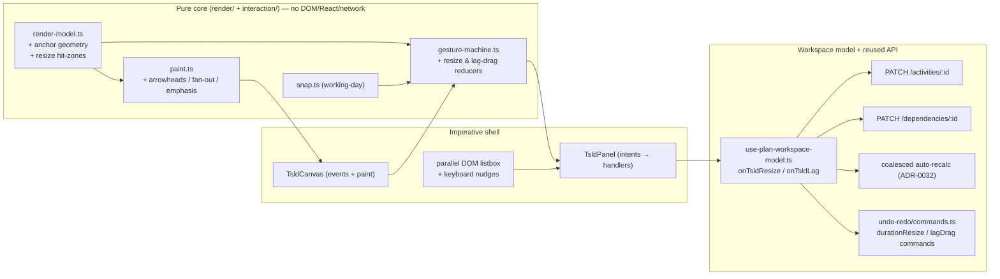
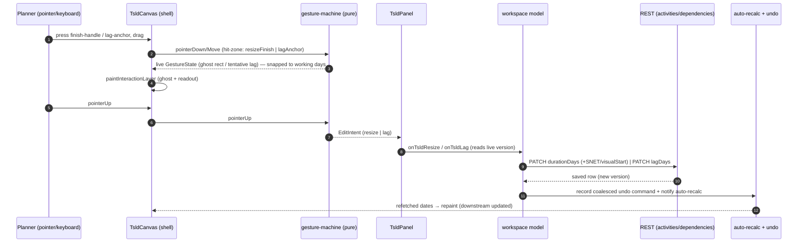
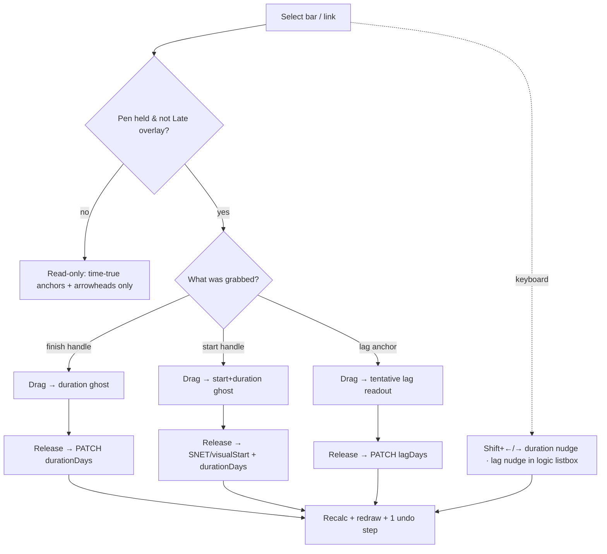

# Feature Spec: TSLD Canvas Direct-Manipulation Upgrade

- **Status:** Draft
- **Author(s):** feature-analyst (Product Owner / Solution Architect / Technical Lead hats)
- **Date:** 2026-07-22
- **Tracking issue / epic:** TBD
- **Roadmap link:** TSLD editing surface (canvas-first authoring; follows ADR-0032 authoring, ADR-0033 scheduling modes)
- **Related ADR(s):** **New ADR-0052 (proposed)** — Canvas direct-manipulation: time-true link anchoring + edge-drag duration resize + lag-point drag; **amends** ADR-0026 (render model / hit-zones / a11y layer), ADR-0032 (interaction model — repurposes edge handles), ADR-0033 (start-edge resize semantics per scheduling mode). Builds on ADR-0021/0022/0023/0024/0028/0031/0036/0048.

---

## 1. Business understanding

### Problem

SchedulePoint's differentiator is the **Time-Scaled Logic Diagram (TSLD)** — planners draw and reason about the schedule directly on a timeline rather than in a Gantt grid (CLAUDE.md §1). Today the canvas supports create-by-drag, reposition-in-time, two-click linking, lane moves and Visual placement (ADR-0026/0032/0033), but two core direct-manipulation gestures that GPM/TSLD planners expect from tools like **NetPoint** are missing, and the logic-link drawing is functional-but-plain:

1. **You cannot change an activity's duration on the canvas.** Duration is edited only in the activity dialog — a modal round-trip that breaks the "draw the plan" flow. A planner sizing work wants to grab a bar end and stretch it.
2. **You cannot see or change a relationship's lag on the canvas.** Lag/lead is edited only in the dependency dialog, and the drawn link gives no sense of _how much_ lag there is or _where in time_ it bites.
3. **Links anchor at the bar's extreme ends, not at the date they actually constrain.** An `SS+3d` tie visually springs from the predecessor's _start_, when the constraint it imposes lands 3 working days _into_ the bar. The diagram is therefore not fully "time-true" — a stated goal of a TSLD.
4. **The canvas looks plain — both the activity bars and the logic links.** _(Scope confirmed by the product owner: item (4) covers the whole diagram aesthetic, not just links.)_
   - **Bars:** flat rectangles with a single fill + a solid/dashed criticality outline; no refined shape/rounding, no progress fill, thin selection ring, no dedicated drag/hover treatment, and only basic glyphs for milestones (diamond) with LOE/WBS-summary/hammock treatments underdeveloped.
   - **Links:** simple 1–2px orthogonal polylines with no arrowheads, no crowding/overlap management, and only weight/dash to distinguish driving edges.
     The product owner explicitly wants to **beat NetPoint's TSLD aesthetic** for the whole canvas, while staying inside the Canvas-2D layered/culled architecture (ADR-0026) and the ≤ 4 ms p95 @ 2,000 activities draw gate, and staying theme-aware and consistent with the existing lens / colour-mode system.

**Why now:** the canvas-first workspace (ADR-0030/0031), authoring (ADR-0032), scheduling modes (ADR-0033) and undo/redo (ADR-0048) have landed, so the interaction, recalc, pen-gating and reversibility scaffolding this feature composes on top of all exist. This is the next increment that makes the canvas a _primary editing surface_, not just a viewer with a few gestures.

### Users

Maps to the org role set (ADR-0016) and the existing canvas edit-gates (ADR-0028 pen + ADR-0033 Late-overlay suppression):

- **Planner / Org Admin (primary).** Author schedules. They need to size durations and tune lag/lead directly on the diagram, at the speed of thought, without opening dialogs.
- **Contributor.** Reports progress; not an authoring role for logic/duration — unaffected (no pen for structural edits).
- **Viewer / External Guest.** Read-only. They benefit only from the _rendering_ improvements (time-true anchors, better links); no manipulation is offered to them.

### Primary use cases

1. **Resize a task's duration** by dragging its finish (right) edge — the common case (change duration, keep start).
2. **Resize from the start** by dragging the start (left) edge — keep the finish fixed, move the start and change the duration (mode-aware).
3. **Read a relationship's lag at a glance** — the link anchors at the time-true point along each bar it constrains, so lag/lead is visible as horizontal offset.
4. **Change a relationship's lag/lead** by dragging its anchor point along the bar, snapping to whole working days.
5. **Read the diagram more easily and enjoy how it looks** — a full canvas visual refresh of **activity bars** (shape/rounding, fill/stroke, progress fill, criticality emphasis, milestone/LOE/WBS-summary/hammock glyphs, selection/hover/drag states, label typography/placement/collision, constraint pins + conflict/flag badges) **and logic links** (routing/elbows, crowding, lag/lead depiction, criticality emphasis, hover/selection) — theme-aware and consistent with the lens/colour-mode system, beating NetPoint's aesthetic.

### User journeys

**Happy path — resize duration (finish edge).** Planner holds the pen, selects a task; its ends show grab handles. They press the finish handle and drag right two day-columns; a live ghost shows the bar growing and its label updates (`· 5d → · 7d`). On release the bar commits `durationDays = 7` via `PATCH /activities/:id`; the coalesced auto-recalc (ADR-0032) redraws downstream dates. The gesture is one undo step.

**Happy path — change lag (anchor drag).** Planner selects a dependency (or hovers its anchor); the anchor point on the predecessor/successor bar is draggable. They drag it right one working day; a live readout shows `SS+3d → SS+4d`. On release it commits `PATCH /dependencies/:id { lagDays: 4 }`; recalc redraws. One undo step.

**Alternate — read-only viewer.** A Viewer opens the plan: links now anchor time-true and render with arrowheads and criticality emphasis. No handles appear; no gesture is armed.

**Alternate — pen not held / Late overlay on.** Handles and anchor drags are suppressed (read-only), exactly as reposition is today; the parallel listbox / dialogs remain the keyboard path.

**Keyboard equivalents (WCAG 2.1.1 / 2.5.7).** From the parallel focusable DOM layer: a selected bar takes `Shift+←/→` to nudge duration by one working day (coalesced, like the `Alt`+arrow lane nudge); a selected dependency (reachable via the logic listbox / dependency editor) takes a lag nudge, or the existing dependency dialog sets an exact lag. No capability is pointer-only.

### Expected outcomes

- Planners size durations and tune lag directly on the canvas — fewer dialog round-trips, faster authoring.
- The diagram becomes genuinely time-true (lag visible as offset), improving schedule-reasoning quality.
- The logic network is materially more legible and more attractive than NetPoint's.
- Zero change to the CPM engine, the API, or the recalc parity gate — all composed from existing REST mutations + the existing coalesced recalc.

### Success criteria

- A Planner can change a task's duration on the canvas in **< 3 s** with no dialog.
- A Planner can change a link's lag on the canvas in **< 3 s** with no dialog.
- Lag/lead is readable from the diagram without opening any editor (anchor offset matches the working-day lag).
- The refreshed canvas is judged to **beat NetPoint's aesthetic** (design/UX review sign-off), is correct in **both light and dark** themes, and stays consistent with the colour-mode lenses + legend.
- Canvas draw stays within the ADR-0026 budget (**draw ≤ 4 ms p95 @ 2,000 activities**); neither the new anchor/arrow geometry **nor the bar/link visual refresh** regresses it (benchmark-gated).
- Every pointer gesture has a keyboard equivalent; axe + Playwright a11y journeys pass (WCAG 2.2 AA incl. 2.5.7 dragging-movements alternative and 2.5.8 target size / equivalent).
- Feature ships behind `VITE_CANVAS_DIRECT_MANIPULATION` (default off); flag-off is byte-for-byte the current canvas.

### Open questions

Only the few whose answers change design or scope are raised as **CRITICAL**; each carries a recommended default so work isn't blocked. Everything else is decided inline with a stated default.

- **CRITICAL Q1 — Edge-handle gesture ownership.** The bar-end grab-zones currently arm a _link_ rubber-band (ADR-0026 D5). Repurpose them for **duration resize** in `select` mode (link creation stays the two-click `link` tool, ADR-0032 M5)? _Recommended: **yes** — resize on the ends matches NetPoint/MS-Project muscle memory; the two-click tool already owns linking. Documented in ADR-0052._
- **CRITICAL Q2 — Start-edge resize semantics.** A start-edge drag means "move start + change duration, keep finish." Confirm the mode-aware expression: EARLY → SNET-at-new-start + new `durationDays`; VISUAL → `visualStart` + new `durationDays`; suppressed under the Late overlay. _Recommended: **yes**, as stated. Alternative (disallow start-edge resize) is rejected — it's a core GPM gesture._
- **CRITICAL Q3 — Lag-anchor time base.** Time-true anchor offset + lag snapping are measured on the relationship's **lag calendar** (plan working-day for `PROJECT_DEFAULT/PREDECESSOR/SUCCESSOR` today; elapsed for `TWENTY_FOUR_HOUR`), matching ADR-0036 §6. Confirm no separate "always working-day" display simplification. _Recommended: **use the lag calendar** so the picture matches the engine's meaning._
- **CRITICAL Q4 — Visual-refresh acceptance bar.** "Beat NetPoint" is subjective. Confirm the acceptance gate is **design/UX-reviewer + product-owner sign-off** on the refreshed look (light + dark, with lenses), plus the objective gates (draw ≤ 4 ms p95 @ 2,000; contrast; a11y-cue preservation). _Recommended: **yes** — pair subjective sign-off with the objective gates; iterate glyphs behind the flag._
- **Non-critical (defaults taken):** links stay **orthogonal with rounded elbows + arrowheads** for v1 (curves evaluated behind the flag in M5); progress fill is a **single in-bar fill to the schedule `percentComplete`** (not a striped/gradient treatment) for v1; elevation is **stroke/inset-approximated** (no Canvas shadow/blur) to protect the budget; the refresh ships behind the same `VITE_CANVAS_DIRECT_MANIPULATION` flag (not a separate visual flag) so flag-off stays a single byte-for-byte parity gate.

---

## 2. Functional requirements

### User stories & acceptance criteria

> **US-1 — Resize duration from the finish edge.**
> As a **Planner**, I want to drag a task's **finish** edge to change its duration, so I can size work directly on the timeline.
>
> **Acceptance criteria**
>
> - **Given** I hold the pen and a task bar is selected, **when** I press its finish grab-handle and drag past the reposition pixel threshold, **then** a live ghost shows the bar resizing by whole day-columns and its duration label updates.
> - **Given** I drag the finish edge to a new day-column, **when** I release, **then** the activity commits the new `durationDays` (≥ 1) via `PATCH /activities/:id` and the auto-recalc redraws downstream dates.
> - **Given** I drag the finish edge left of the start, **when** I would produce a duration < 1 working day, **then** the resize clamps at the minimum (1 working day) and never inverts the bar.
> - **Given** the resize committed, **when** I press Undo, **then** the whole resize gesture reverts as **one** step (coalesced), and Redo re-applies it.
> - **Given** the activity is a **milestone / LOE / WBS summary** (duration-derived), **when** I select it, **then** no resize handles are offered (its duration is engine/definition-derived).

> **US-2 — Resize from the start edge (mode-aware).**
> As a **Planner**, I want to drag a task's **start** edge to move its start and change its duration while keeping the finish fixed.
>
> **Acceptance criteria**
>
> - **Given** the plan is in **EARLY** mode and I drag the start edge, **when** I release, **then** the write imposes an **SNET at the new start** _and_ a new `durationDays` in one PATCH so the finish stays put, then recalcs.
> - **Given** the plan is in **VISUAL** mode and I drag the start edge, **when** I release, **then** the write sets `visualStart` at the new start _and_ the new `durationDays`, then runs the effective-Visual recalc (ADR-0033).
> - **Given** the **Late overlay** is on, **when** I attempt any resize, **then** it is suppressed (read-only), matching reposition today.
> - **Given** a start-edge resize, **when** it commits, **then** it is **one** coalesced undo step.

> **US-3 — Time-true link anchoring (render).**
> As any **viewer**, I want each dependency link to anchor at the point along the bar it actually constrains, so lag/lead is visible as a horizontal offset.
>
> **Acceptance criteria**
>
> - **Given** an `FS+2d` tie, **when** the diagram renders, **then** the link leaves the predecessor's **finish** and its downstream anchor sits **2 working days** to the right (the constrained successor-start point), proportional along the time axis.
> - **Given** an `SS+3d` tie, **when** rendered, **then** the predecessor anchor sits **3 working days** into the predecessor bar (from its start), time-proportional.
> - **Given** a **lead** (negative lag, e.g. `FS-1d`), **when** rendered, **then** the anchor sits to the left of the constrained edge (earlier), consistent with a lead.
> - **Given** any lag with a non-plan lag calendar (`TWENTY_FOUR_HOUR`), **when** rendered, **then** the anchor uses that lag's day mapping so the offset matches the engine's meaning (elapsed vs working).
> - **Given** the plan is not yet recalculated (no dates), **when** rendered, **then** the link falls back to the current extreme-end routing (no crash, no anchor math).

> **US-4 — Drag a link's lag/lead.**
> As a **Planner**, I want to drag a link's anchor point along the bar to change its lag/lead.
>
> **Acceptance criteria**
>
> - **Given** I hold the pen and a dependency's anchor is grabbable, **when** I drag it along the time axis, **then** a live readout shows the tentative lag (e.g. `SS+3d → SS+5d`) snapped to whole working days on the relevant lag calendar.
> - **Given** I drag the anchor left of the constrained edge, **when** I release, **then** the committed `lagDays` is **negative** (a lead).
> - **Given** I release, **then** the dependency commits the new `lagDays` via `PATCH /dependencies/:id` (echoing `type`, `lagCalendar`, `version`) and the auto-recalc redraws.
> - **Given** the lag change committed, **when** I press Undo, **then** the whole drag reverts as **one** coalesced step; Redo re-applies it.
> - **Given** a concurrent edit moved the row, **when** my write returns 409, **then** the conflict banner explains it and nothing is silently applied (ADR-0048 contract).

> **US-5 — Improved logic-link rendering.**
> As any **viewer**, I want the logic links to be clearer and more attractive.
>
> **Acceptance criteria**
>
> - **Given** any tie, **when** rendered, **then** it carries a directional **arrowhead** at its successor end.
> - **Given** a **critical/driving** tie, **when** rendered, **then** it is emphasised (weight + colour + solid), and criticality is never encoded by colour alone (WCAG 1.4.1) — the existing driving weight/dash cue is retained.
> - **Given** a bar with **many** incident links, **when** rendered, **then** anchors/elbows are laid out to reduce overlap/crowding (deterministic fan-out), staying within the draw budget.
> - **Given** I hover or select a link (or its endpoint activity), **when** rendered, **then** the incident links highlight (hover on the canvas; persistent for selection), with a keyboard-reachable equivalent via the logic listbox.
> - **Given** the lag/lead is non-zero, **when** rendered, **then** it is depicted clearly (the time-true anchor offset of US-3, optionally a subtle lag segment/annotation), so the tie's timing reads at a glance.

> **US-6 — Activity-bar visual refresh.**
> As any **viewer**, I want the activity bars themselves to look refined and read clearly, consistent with the app's design tokens and colour-mode system.
>
> **Acceptance criteria**
>
> - **Given** any bar, **when** rendered, **then** it uses the refreshed shape treatment (refined height/rounding, fill + subtle stroke) resolved **only** from the semantic design tokens (`docs/DESIGN_SYSTEM.md`) via the existing `TsldPalette` seam, so it is correct in **both light and dark** themes with no hard-coded colour.
> - **Given** an activity with **progress** (`percentComplete > 0`), **when** rendered, **then** the completed portion is shown as a distinct **progress fill** within the bar (never colour-only — also a boundary/shape cue), matching the value the row/AT reports.
> - **Given** a **critical / near-critical** activity, **when** rendered, **then** its emphasis (fill + outline dash) reads more strongly than today while retaining the non-colour cue (WCAG 1.4.1) and staying distinct from the progress fill and the badges.
> - **Given** a **milestone / LOE (hammock) / WBS-summary** activity, **when** rendered, **then** each uses a **distinct, refined glyph** treatment (diamond / bracketed span / summary bracket) that is visually unambiguous and consistent across themes.
> - **Given** a bar is **selected, hovered, or being dragged/resized**, **when** rendered, **then** each state has a distinct, accessible treatment (ring / elevation / ghost) that does not rely on colour alone and does not obscure the label or badges.
> - **Given** a bar carries a **constraint pin, conflict badge, lane-overlap badge, or over-allocation badge**, **when** rendered alongside the refreshed bar/label, **then** all cues remain legible, non-overlapping, and shape-distinct (the existing badge system is preserved and restyled, not removed).
> - **Given** any bar **label**, **when** rendered, **then** typography, inside/beside placement and collision handling are refined (still LOD-gated + truncated), and inside-label ink still clears 4.5:1 on its fill in both themes and under every colour-mode lens (WCAG 1.4.3).
> - **Given** a **Colour-by lens** or **Baseline overlay** is active, **when** rendered, **then** the refresh is consistent with the lens/colour-mode system (`buildColourMap` / `buildColourInkMap` / `buildColourLegend` / `lensLegendVarPalette`) and the legend still matches the canvas.
> - **Given** the refresh is applied, **when** drawing 2,000 activities, **then** the draw stays within the ADR-0026 budget (**≤ 4 ms p95**) — measured, not assumed.

### Workflows

1. **Finish-edge resize:** select → press finish handle → drag (ghost + label) → release → `PATCH durationDays` → recalc → redraw → record undo.
2. **Start-edge resize:** select → press start handle → drag → release → EARLY: `PATCH {constraintType: SNET, constraintDate, durationDays}`; VISUAL: `PATCH {visualStart, durationDays}` → recalc → redraw → record undo.
3. **Lag drag:** hover/select link anchor → drag along axis (snapped readout) → release → `PATCH /dependencies/:id {lagDays}` → recalc → redraw → record undo.
4. **Render (all viewers):** map schedule → resolve the refreshed **theme-aware palette** (bar/progress/glyph/state tokens) once per theme bump → draw refreshed **bars** (shape, progress fill, criticality emphasis, glyphs, badges, labels) → compute **time-true link anchors** from lag + working-day walk → route **links** (arrowheads, fan-out, emphasis) → selection/hover states → paint. All layers stay culled to the visible set (ADR-0026).

### Edge cases

- **Duration < 1:** clamp to 1 working day; never invert.
- **Milestone / LOE / WBS summary:** no resize handles (duration-derived). Milestones already have no width; LOE/summary spans are engine-derived.
- **Zero-lag tie:** anchor sits exactly on the constrained edge (offset 0) — identical to today's endpoint, so no visible change for the common `FS+0`.
- **Very short bars at low zoom:** the anchor offset can be sub-pixel; render still places it correctly, and the grab-zone is capped so it never swallows the body/edge zones (mirroring `EDGE_HANDLE_PX` capping).
- **Anchor beyond the bar (large lag/lead):** the anchor may fall past the bar's own extent; clamp the _drawn_ anchor to the bar/relationship span but keep the link legible (a small stub + arrowhead). Dragging is bounded by the reachable working-day range.
- **Concurrent edit (409):** non-destructive abort + conflict banner (existing ADR-0048/0032 contract).
- **Pen lost mid-drag (423):** the in-flight write is refused; the shared pen contract shows the lost-control banner; the gesture resets. History belongs to the pen session.
- **Recalc refusal after a landed write:** the write stays; the stale-dates message surfaces via the banner (existing behaviour).
- **Non-working-day snapping:** lag and duration are whole **working** days; snapping uses the relevant calendar's working-day predicate (lag calendar for lag; activity/plan calendar for duration).
- **Handle vs link-source collision:** the edge handles currently arm a _link_ rubber-band on pointer-down (ADR-0026 D5). This feature **repurposes** the edge-handle drag in `select` mode to **resize**; link creation remains the two-click `link` tool-mode (ADR-0032 M5). See Critical Q1.
- **Progress fill vs criticality vs colour-mode lens:** a bar can be simultaneously critical, part-complete, and recoloured by a Colour-by lens. The refresh layers these deterministically (lens/criticality fill → progress overlay bounded by a shape edge → outline → badges → label), and the inside-label ink stays 4.5:1 via the existing `barInk` override path. No cue is colour-only.
- **Refreshed glyphs at low zoom / LOD:** milestone/LOE/summary glyphs and progress fills must degrade gracefully as bars shrink (progress fill and glyph detail cull below a legibility threshold, like labels), never producing sub-pixel smears that cost draw time.
- **Theme switch mid-view:** the palette re-resolves on the shared theme bump (`use-theme-version.ts`); no stale colour persists across a light/dark toggle.

### Permissions

- Resize / lag-drag are **structural authoring edits**: require the pen (ADR-0028 `assertHoldsPen` → 423 gate) plus the existing edit RBAC (`canEdit` = Planner/Org Admin) and org resource-scope (ADR-0012). No new permission is introduced — the underlying `PATCH /activities/:id` and `PATCH /dependencies/:id` endpoints already enforce their permissions and scope.
- Rendering improvements (US-3, US-5) are read-only and apply to every role including Viewer/External Guest (the guest share view reuses the same render model).
- Late overlay on ⇒ all gestures suppressed (ADR-0033 M4), unchanged.

### Validation rules

Shared client ↔ server (client pre-checks; the API is the trust boundary):

- **Duration:** integer ≥ 1 working day (milestone/derived = 0 and not resizable). Server DTO already validates `durationDays`.
- **Lag:** signed integer working days (lead = negative); bounded to a sane range client-side; the server DTO validates.
- **Optimistic `version`:** every write echoes the row's current `version` (409 on stale) — read live, as the existing seams do.
- **Snapping:** dropped day/lag snaps to whole working days via the relevant calendar predicate before the write (so the preview matches what saves).

### Error scenarios

| Scenario                               | Detection                       | User-facing result                                             | Status          |
| -------------------------------------- | ------------------------------- | -------------------------------------------------------------- | --------------- |
| Not a member / lacks edit permission   | authz check on the reused PATCH | handles never render (client) / friendly forbidden             | 403             |
| Pen not held (someone else editing)    | `assertHoldsPen`                | resize/lag refused; lost-control / request-pen banner          | 423             |
| Stale version (concurrent edit)        | optimistic lock                 | conflict banner "changed since you opened it"; nothing applied | 409             |
| Duration would be < 1                  | client clamp + server DTO       | clamps at 1; no invalid write                                  | 422 (defensive) |
| Cycle/duplicate (n/a for lag/duration) | —                               | not applicable (endpoints/type unchanged)                      | —               |
| Recalc refused after landed write      | recalc mutation                 | non-fatal; stale-dates banner                                  | —               |

---

## 3. Technical analysis

| Area           | Impact       | Notes                                                                                                                                                                                                                                                                                                                                                                                                                                                                                                       |
| -------------- | ------------ | ----------------------------------------------------------------------------------------------------------------------------------------------------------------------------------------------------------------------------------------------------------------------------------------------------------------------------------------------------------------------------------------------------------------------------------------------------------------------------------------------------------- |
| Frontend       | **high**     | New hit-zones + gesture-machine branches (resize, lag-drag), time-true anchor geometry in the pure render model, improved link painter, keyboard nudges, undo commands, a flag. All in `apps/web/src/features/tsld/*` + `undo-redo/commands.ts` + the workspace model.                                                                                                                                                                                                                                      |
| Backend        | **none**     | No new/changed modules or services. Reuses `PATCH /activities/:id` and `PATCH /dependencies/:id`.                                                                                                                                                                                                                                                                                                                                                                                                           |
| Database       | **none**     | No schema change. Duration/lag/constraint/visualStart columns already exist.                                                                                                                                                                                                                                                                                                                                                                                                                                |
| API            | **none**     | No new endpoints or contract change. Existing DTOs already accept `durationDays`, `constraintType/Date`, `visualStart`, `lagDays`. Confirm they need no widening (they don't).                                                                                                                                                                                                                                                                                                                              |
| Security       | **low**      | Deny-by-default preserved: reuses pen-gate + RBAC + scope + optimistic lock on the existing endpoints. No new trust surface.                                                                                                                                                                                                                                                                                                                                                                                |
| Performance    | **med–high** | New per-edge anchor math + arrowheads + fan-out **and** the richer per-bar treatment (progress fill, gradients/strokes, glyphs) must stay within the ADR-0026 draw budget (≤ 4 ms p95 @ 2,000 activities). Mitigate with the same cull-by-visible pass, memoised working-day walks + label widths, palette resolved once per theme bump (not per bar), O(visible) routing, cheap primitives (avoid per-bar shadow/blur — approximate elevation with a stroke), and a benchmark gate per render-polish task. |
| Infrastructure | **none**     | No new services/env/secrets.                                                                                                                                                                                                                                                                                                                                                                                                                                                                                |
| Observability  | **none**     | No new logs/metrics (client-only interactions on existing endpoints).                                                                                                                                                                                                                                                                                                                                                                                                                                       |
| Testing        | **high**     | Pure-unit tests for anchor geometry + resize/lag reducers + snap + commands; component tests for the gestures + a11y; Playwright journeys (resize, lag-drag, keyboard equivalents, axe).                                                                                                                                                                                                                                                                                                                    |

### Dependencies

- **Prerequisite (in place):** ADR-0026 render model / gesture machine / a11y layer; ADR-0028 pen; ADR-0032 auto-recalc + two-click link; ADR-0033 scheduling modes + Late overlay; ADR-0048 undo/redo command stack; ADR-0036 minute-based durations + per-edge lag calendar; the working-day predicate (`makeWorkingDayPredicate` in `render/time-scale.ts`) and `snapToWorkingDay` (`render/snap.ts`).
- **Reused mutations:** `useUpdateActivity`, `useSetActivityVisualStart`, `useUpdateDependency` (`apps/web/src/features/dependencies/api/use-dependencies.ts`), `useRepositionLane`.
- **Must land first within this feature:** M1 (time-true anchor geometry) underpins M3 (lag-drag reads/writes against the same anchor mapping).
- **Blocks nothing else.** Additive, flag-gated.

---

## 4. Solution design

### Architecture overview

The feature preserves the ADR-0026 **pure core / imperative shell** split. All new logic lands in the pure, exhaustively-testable core (`render/` + `interaction/`); the shell (`TsldCanvas`) only feeds events and paints; the workspace model composes the reused REST mutations + recalc + undo. **No canvas mutation, no engine, no API change.**

### Data flow

### User flow

### Database changes

**None.** No models, columns, indexes or constraints change. Duration (minutes internally, `durationDays` at the web edit boundary — ADR-0036), constraint (`SNET`), `visualStart` (ADR-0033), and `lagDays` + `lagCalendar` (ADR-0036 §6) all already persist.

### API changes

**None.** Reuses:

- `PATCH /organizations/:org/activities/:id` — resize sends the full definition body with a changed `durationDays` (and, for a start-edge resize, `constraintType: SNET` + `constraintDate`, or `visualStart` in VISUAL mode) + `version`. This is exactly the body `useUpdateActivity` / `useSetActivityVisualStart` already build; a canvas resize is a definition edit, so it round-trips every other field like the existing reposition path does.
- `PATCH /organizations/:org/dependencies/:id` — lag drag sends `{ type, lagDays, lagCalendar, version }` (unchanged `type`/`lagCalendar`), exactly `useUpdateDependency`'s input.

If, during build, the activity update DTO turns out **not** to accept a combined `{constraintType, constraintDate, durationDays}` in one PATCH (it should — the reposition path already sends SNET + full definition), that is the **only** place a backend touch could be needed; flag it loudly and raise an ADR before adding surface. Expectation: no change.

### Component changes

All within `apps/web/src/features/tsld/` (reuse the design system; no one-off styling — canvas colours resolve from semantic tokens via the existing `TsldPalette`):

- **`render/render-model.ts`** — new pure geometry:
  - `HitZoneKind` gains `resizeStart` / `resizeFinish` (repurposing the current `startHandle`/`finishHandle` in `select` mode) and `lagAnchor` (carrying `dependencyId`).
  - `lagAnchorPoint(pred, succ, edge, type, lagDays, view, dataDate, workingDayWalk)` — the time-true anchor for a relationship end: walk `lagDays` working days from the constrained edge's day, convert to screen-x. Pure; the working-day walk is injected (same predicate the non-working wash uses), so the render model still does **no CPM** — only day-offset geometry.
  - `classifyHit` extended: in `select` mode, bar-end zones classify as resize; a small zone around each drawn lag anchor classifies as `lagAnchor`.
- **`render/paint.ts` — canvas visual refresh (bars + links), theme-aware, lens-consistent:**
  - **Bars (US-6):** refined bar layer (height/rounding, fill + subtle stroke), a **progress fill** sub-layer (completed portion, shape-bounded not colour-only), stronger critical/near-critical emphasis (retaining the weight/dash non-colour cue), **distinct refined glyphs** for milestone / LOE (hammock) / WBS-summary, and restyled **selection / hover / drag** states. The existing **badge system is preserved and restyled** (constraint pin, conflict triangle, lane-overlap stacked-squares, over-allocation mini-histogram) so every shape cue (WCAG 1.4.1) and its legend/AT text stays intact. Label layer typography + inside/beside placement + collision refined (still LOD-gated + truncated; inside ink still 4.5:1 in both themes and under lenses).
  - **Links (US-5):** improved `dependencyPolyline` consumer — anchor at the time-true points, add **arrowheads**, deterministic **fan-out** for many incident edges, criticality/driving **emphasis**, lag/lead depiction, and hover/selection **highlight** of incident links.
  - **Palette/tokens:** extend `TsldPalette` with the new bar/progress/glyph/state entries, **all resolved from semantic tokens** (`docs/DESIGN_SYSTEM.md`, `apps/web/src/styles/globals.css`) and re-resolved on the shared theme bump (`use-theme-version.ts`) — **no one-off colour**. Stay consistent with the colour-mode/lens system: the refreshed defaults must compose with `barFill`/`barInk` overrides (`buildColourMap`/`buildColourInkMap`) and the legend (`buildColourLegend`/`lensLegendVarPalette`) so the canvas and legend never disagree.
  - New `paintInteractionLayer` overlays: a resize ghost (bar + new duration label) and a lag readout chip.
- **`interaction/gesture-machine.ts`** — new reducer branches: `resizing` (finish/start) and `lagDragging` states; new `EditIntent` variants `resize` and `lag`. Mirrors the existing `repositioning` pixel-threshold + whole-cell snapping model.
- **`interaction/use-coalesced-*`** — a coalesced **duration nudge** (`Shift+←/→`) and **lag nudge**, mirroring `use-coalesced-nudge.ts` (absolute target, debounce, serialize, unmount-flush).
- **`components/TsldPanel.tsx` / `TsldCanvas.tsx`** — wire the new intents to new handlers `onResize` / `onLag`; extend the parallel DOM a11y layer + `render/a11y.ts` describe-strings (speak the tentative duration/lag; announce the committed value).
- **`components/layout/workspace/use-plan-workspace-model.ts`** — `onTsldResize` (EARLY: SNET+duration; VISUAL: visualStart+duration; clamp ≥1) and `onTsldLag` (dependency PATCH), each recording a coalesced undo command and notifying the auto-recalc — mirroring `onTsldReposition`.
- **`undo-redo/commands.ts`** — `durationResizeCommand` (a `definitionSnapshotCommand` specialisation, coalesce key `resize:{id}`) and `lagDragCommand` (dependency PATCH before/after `lagDays`, coalesce key `lag:{depId}`). Both reversible via existing mutations; recompute-don't-restore for outputs.
- **Flag:** `VITE_CANVAS_DIRECT_MANIPULATION` (default off). Flag-off ⇒ no new hit-zones, no handles, links render exactly as today (byte-for-byte parity gate). _Note:_ the time-true anchoring + arrowheads (US-3/US-5) are a **rendering** change visible to all roles; they ship behind the same flag so flag-off remains identical, and turn on for everyone (including read-only) when the flag is enabled.

### Implementation approach & alternatives

**Chosen:** extend the pure render model + gesture machine with new hit-zones and reducers, compose new intents onto the existing workspace-model write+recalc+undo pipeline, and enrich the painter — **no engine/API/DB change**. This is the smallest change that fully solves the request and keeps the recalc parity gate structurally untrivial-to-break (the engine is never touched).

_Interaction-model decision (Critical Q1):_ the pointer-down on a bar end currently arms a **link** rubber-band (ADR-0026 D5). ADR-0032 M5 already moved link creation to a **two-click `link` tool-mode**. We therefore **repurpose the edge-handle drag in `select` mode to duration resize**, and keep link creation on the two-click tool. This removes the ambiguity cleanly and matches NetPoint/MS-Project muscle memory (bar ends = resize). Documented in ADR-0052 (amends ADR-0032).

_Start-edge semantics (Critical Q2):_ a start-edge drag is inherently "move start + change duration, keep finish." In EARLY mode the start is computed, so we express it as **SNET-at-new-start + new duration** (the finish is thereby pinned by start+duration). In VISUAL mode we use **visualStart + new duration**. We do **not** disallow start-edge resize — it is a first-class GPM gesture — but we make its meaning explicit and mode-aware.

_Time-true anchor math (Critical Q3):_ the anchor offset is `lagDays` measured on the relationship's **lag calendar**, walked from the constrained edge's day. For `PROJECT_DEFAULT`/`PREDECESSOR`/`SUCCESSOR` this is the plan working-day calendar today (ADR-0036 §6); for `TWENTY_FOUR_HOUR` it is elapsed (calendar days). The render model injects the walk function so it stays CPM-free.

**Alternatives considered:**

- **Add a backend "resize"/"set-lag" endpoint.** Rejected: no need — the existing PATCH endpoints already accept the fields; a new endpoint would add surface, duplicate validation, and risk the recalc parity gate. Reserved only if the combined-field PATCH proves impossible (it isn't).
- **Keep edge-handle = link, add a separate resize handle (e.g. a corner grip).** Rejected: clutters short bars, worsens target-size crowding, and fights muscle memory; the two-click link tool already frees the bar ends.
- **Move anchor/lag math into the engine (server computes anchor screen positions).** Rejected: anchor placement is pure client geometry; server round-trips would kill interactivity and violate the ADR-0026 client-render model.
- **Curved/bezier links instead of orthogonal.** Deferred as an option within the link-polish milestone; start from cleaner orthogonal routing with rounded elbows + arrowheads (predictable, cheap, testable), evaluate curves behind the same flag.
- **Bar visual refresh via DOM/SVG or per-bar shadows/blur.** Rejected: the canvas is Canvas-2D layered/culled (ADR-0026); per-bar shadow/blur and DOM re-layout would blow the ≤ 4 ms budget. Approximate elevation with a stroke/inset, keep primitives rectangle/line/text, resolve the palette once per theme bump.
- **Hard-coded refreshed colours for a quick win.** Rejected outright — violates the design-system rule (no one-off styling) and would break dark mode + the colour-mode lenses. All colour flows through the token-resolved `TsldPalette` and composes with `barFill`/`barInk`.
- **Redesign the badge system as part of the refresh.** Rejected: the constraint pin / conflict / lane-overlap / over-allocation badges are load-bearing accessibility (shape) cues with legend + AT text (ADR-0033/0041). The refresh **restyles** them for consistency but preserves their shape semantics and legend mapping.

**ADR:** Yes — **ADR-0052 (proposed)**. Outline:

- _Problem:_ canvas lacks duration resize + lag manipulation; links aren't time-true and look plain; the edge-handle gesture is overloaded; and the whole diagram aesthetic (bars + links) trails NetPoint.
- _Options:_ (a) repurpose edge handles for resize + two-click link (chosen); (b) separate resize grips; (c) new backend endpoints; (d) server-computed anchors; (e) DOM/SVG or per-bar shadow refresh vs. token-resolved Canvas-2D refresh (chosen: the latter).
- _Decision:_ pure-core geometry + gesture extensions + reused PATCH mutations; edge handles → resize in select mode; time-true anchors via injected working-day walk; a token-resolved, theme-aware, lens-consistent **canvas visual refresh** of bars + links within Canvas-2D layered/culled primitives; flag `VITE_CANVAS_DIRECT_MANIPULATION`.
- _Trade-offs:_ more client geometry/painter complexity + a tighter draw budget vs. zero engine/API/DB risk; edge-handle repurposing is a learned-gesture change (mitigated by the two-click link tool already existing + persistent handle affordance); the refresh must preserve every accessibility shape-cue and legend mapping.
- _Consequences:_ amends ADR-0026 (hit-zones/anchor geometry/a11y strings **and** the visual/paint treatment + draw budget), ADR-0032 (interaction model), ADR-0033 (start-edge resize semantics). No parity-gate risk (engine/API untouched). Follow-ups: curved-link option, multi-select resize, further glyph iteration.

## 5. Links

- Implementation plan: `docs/specs/canvas-direct-manipulation/implementation-plan.md`
- Related docs to update on build: ADR-0052 (new), `docs/adr/` index in `CLAUDE.md §16`, `docs/FRONTEND_ARCHITECTURE.md` (canvas interaction), `docs/DESIGN_SYSTEM.md` (link/arrow tokens if any), `docs/UX_STANDARDS.md` (row/node actions — resize handle affordance), `apps/web` feature-flag docs.
