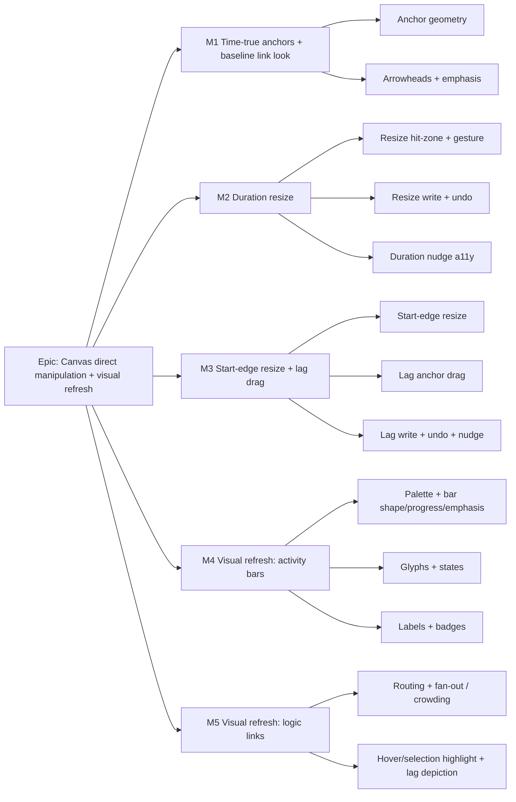

# Implementation Plan: TSLD Canvas Direct-Manipulation Upgrade

- **Feature spec:** `docs/specs/canvas-direct-manipulation/feature-spec.md`
- **Status:** Draft
- **Owner:** TBD

## Breakdown

### Epic

**Canvas direct manipulation + visual refresh** — make activities and logic on the TSLD directly manipulable (duration resize, time-true lag anchoring + lag drag) **and** deliver a full canvas visual refresh of **both activity bars and logic links** that beats NetPoint's aesthetic, all as **frontend-only** changes composed on existing REST mutations + the ADR-0032 recalc, inside the Canvas-2D layered/culled architecture and the ≤ 4 ms p95 @ 2,000 activities draw gate, behind `VITE_CANVAS_DIRECT_MANIPULATION`. Maps to the roadmap's canvas-first authoring theme. **New ADR-0052** carries the architecture.

---

### Milestone 1: Time-true anchors + baseline link look (shippable slice)

**Outcome:** every viewer (including read-only Viewer / External Guest) sees dependency links anchored at the time-true point they constrain, with directional arrowheads and retained criticality/driving emphasis. **Render-only — no new gestures, no writes.** Flag-off is byte-for-byte today's canvas.

---

#### Feature: Time-true anchor geometry

> **Description:** Pure render-model functions that place each relationship end at `lagDays` working days from its constrained edge (FS/SS/FF/SF aware; lead = left), using an injected working-day walk (no CPM in the render model).
> **Complexity:** L
> **Dependencies:** working-day predicate (`render/time-scale.ts`), `daysBetween`/`screenXOfDay`.
> **Risks:** working-day walk cost per edge → keep O(visible), memoise the predicate + a bounded walk (cap like `SNAP_HORIZON_DAYS`); `TWENTY_FOUR_HOUR` lag uses elapsed days not working days → branch on `lagCalendar`.
> **Testing requirements:** exhaustive unit tests for all four types × {+lag, 0, −lead} × {plan calendar, 24h}; null-dates fallback; snapshot of anchor x for known fixtures.

##### Task 1 — Anchor point + edge-mapping helpers

- **Description:** Add `lagAnchorPoint(...)` and extend `dependencyPolyline` to route between the two time-true anchors (still orthogonal). Keep the extreme-end routing as the fallback when dates are absent.
- **Complexity:** M
- **Dependencies:** none
- **Risks:** SF/negative-lag geometry corner cases → cover in unit tests.
- **Testing:** unit (render-model.test.ts additions).
- **Development steps:**
  1. Add the injected `workingDayWalk(dayOffset, nWorkingDays) → dayOffset` helper (reuse the plan predicate; branch to calendar-days for `TWENTY_FOUR_HOUR`).
  2. Implement `lagAnchorPoint` for pred/succ ends per type.
  3. Re-route `dependencyPolyline` through the anchors; retain the fallback.
  4. Update tests + `render/a11y.ts` (speak lag: "SS + 3 working days").

##### Task 2 — Painter uses anchors (flag-gated)

- **Description:** Wire the anchor geometry into `paintScene`'s edge layer behind the flag; flag-off keeps today's paint.
- **Complexity:** S
- **Dependencies:** Task 1
- **Risks:** parity regression → add a flag-off byte-parity paint test.
- **Testing:** paint.test.ts (flag on/off), draw-budget micro-benchmark unchanged.
- **Development steps:** thread a `timeTrueAnchors` scene flag; branch in the edge layer; parity test.

#### Feature: Arrowheads + criticality/driving emphasis

> **Description:** Directional arrowhead at each tie's successor end; emphasise critical/driving ties (weight + colour) while retaining the non-colour weight/dash cue (WCAG 1.4.1).
> **Complexity:** M
> **Dependencies:** anchor geometry (Task 1).
> **Risks:** arrowhead draw cost per visible edge → precompute direction from the last polyline segment; keep within budget.
> **Testing:** unit (arrowhead vertices), paint tests, a11y contrast note (non-text 1.4.11 for the arrow stroke).
> **Development steps:** add `arrowhead(points)` pure helper; draw in a batched pass; extend palette use (no new one-off colours).

---

### Milestone 2: Duration resize (shippable slice)

**Outcome:** a Planner (pen held, not Late overlay) can resize a task's **finish** edge on the canvas to change its duration, with a live ghost + label, one-step undo, and a keyboard equivalent. Milestones/LOE/summaries offer no handles.

---

#### Feature: Resize hit-zone + gesture

> **Description:** Repurpose the bar-end grab-zones in `select` mode to **resize** (link stays the two-click tool); add a `resizing` state + `resize` intent to the gesture machine.
> **Complexity:** L
> **Dependencies:** M1 not required; ADR-0052 accepted (edge-handle repurpose).
> **Risks:** gesture ambiguity with existing link edge-drag → gate the old edge-drag-link off under the flag; short-bar target-size crowding → cap zones like `EDGE_HANDLE_PX`; ensure body-reposition still reachable.
> **Testing:** exhaustive gesture-machine unit tests (threshold, whole-cell snap, clamp ≥1, milestone no-op); classifyHit tests.

##### Task 1 — `classifyHit` + gesture states

- **Description:** Add `resizeStart`/`resizeFinish` zones; add `resizing` state (finish first) with pixel-threshold + day-column snapping mirroring `repositioning`; emit `resize` intent (activityId, edge, newDurationDays / newStartDay).
- **Complexity:** M · **Dependencies:** none · **Risks:** clamp/invert → unit tests · **Testing:** gesture-machine.test.ts.
- **Development steps:** extend `HitZoneKind`; add reducer branches; clamp; suppress for duration-derived types; tests.

##### Task 2 — Ghost + label overlay

- **Description:** `paintInteractionLayer` draws the resize ghost with the live duration label.
- **Complexity:** S · **Dependencies:** Task 1 · **Risks:** none · **Testing:** paint.test.ts.

#### Feature: Resize write + undo

> **Description:** `onTsldResize` in the workspace model: finish-edge → `PATCH durationDays` (full definition round-trip, like `onTsldReposition`); record a coalesced `durationResizeCommand`; notify auto-recalc.
> **Complexity:** M
> **Dependencies:** Resize gesture (above); `useUpdateActivity`; `undo-redo/commands.ts`.
> **Risks:** must round-trip every definition field (durationType, EV, accrual, constraints) or silently clear them → reuse `activityDefinitionInput`; 409/423 handling → reuse existing pen/conflict contract.
> **Testing:** workspace-model unit tests (409, 423, recalc-refusal, coalescing); commands.test.ts (undo/redo reverses duration).

##### Task 1 — `durationResizeCommand` + handler

- **Complexity:** M · **Dependencies:** none · **Risks:** version threading → mirror `repositionCommand` · **Testing:** commands + model tests.
- **Development steps:** add `durationResizeCommand` (coalesce key `resize:{id}`); implement `onTsldResize`; wire `TsldPanel.onResize`; conflict/pen paths; changeset.

#### Feature: Duration keyboard nudge (a11y)

> **Description:** `Shift+←/→` on a selected bar nudges duration by one working day, coalesced (mirroring `use-coalesced-nudge.ts`); announced via the polite live region.
> **Complexity:** M · **Dependencies:** resize write · **Risks:** key collision with existing shortcuts → check `TsldShortcutsHelp`; **Testing:** hook unit tests + Playwright a11y (keyboard resize + axe).

---

### Milestone 3: Start-edge resize + lag-point drag (shippable slice)

**Outcome:** a Planner can resize from the **start** edge (mode-aware) and can drag a link's **lag anchor** along the bar to change lag/lead (snapped to working days), each one-step-undoable with keyboard equivalents.

---

#### Feature: Start-edge resize (mode-aware)

> **Description:** Start-edge drag = move start + change duration, keep finish. EARLY → `PATCH {constraintType: SNET, constraintDate, durationDays}`; VISUAL → `PATCH {visualStart, durationDays}`.
> **Complexity:** M
> **Dependencies:** M2 (finish resize) landed; ADR-0033 mode plumbing (`isVisualMode`, `barDateSource`).
> **Risks:** combined-field PATCH must be accepted by the DTO (expected yes — reposition already sends SNET+definition) → verify early, flag loudly if not; VISUAL effective-Visual recalc path → reuse `setVisualStart`.
> **Testing:** model unit tests for both modes; gesture tests for start-edge clamp; commands reverse.

##### Task 1 — Start-edge gesture + write

- **Complexity:** M · **Dependencies:** none · **Risks:** finish-pinning math → unit tests · **Testing:** gesture + model.
- **Development steps:** start-edge branch emitting `{newStartDay, newDurationDays}`; `onTsldResize` mode-switch; extend `durationResizeCommand` (or add `startResizeCommand`) for the SNET/visualStart+duration inverse; changeset.

#### Feature: Lag anchor drag

> **Description:** A grab-zone around each drawn lag anchor (`lagAnchor` hit-zone carrying `dependencyId`); a `lagDragging` gesture with a tentative lag readout snapped to whole working days on the relationship's lag calendar; `lag` intent.
> **Complexity:** L
> **Dependencies:** M1 anchor geometry (the drag reads/writes against the same mapping).
> **Risks:** inverse day→lag mapping must exactly invert the forward anchor walk → shared pure helper + property tests; overlapping anchors on a crowded bar → pick topmost, cap zone; lead (negative) handling → tests.
> **Testing:** unit tests for forward/inverse round-trip; gesture tests (snap, negative, clamp); classifyHit priority.

##### Task 1 — Lag hit-zone + gesture + readout

- **Complexity:** M · **Dependencies:** none · **Risks:** as above · **Testing:** gesture + render-model tests.
- **Development steps:** add `lagAnchor` to `classifyHit`; `lagDragging` state; readout chip in `paintInteractionLayer`; a11y string.

##### Task 2 — Lag write + undo + nudge

- **Description:** `onTsldLag` → `useUpdateDependency` (`{type, lagDays, lagCalendar, version}`); coalesced `lagDragCommand`; notify recalc; keyboard lag nudge from the logic listbox / dependency editor.
- **Complexity:** M · **Dependencies:** Task 1 · **Risks:** 409/423 via existing contract; invalidation via `invalidateAll` (existing) · **Testing:** commands.test.ts (reverse lag), model tests, Playwright (lag drag + keyboard + axe).
- **Development steps:** `lagDragCommand` (coalesce key `lag:{depId}`); `onTsldLag`; wire `TsldPanel.onLag`; nudge hook; changeset.

---

### Milestone 4: Visual refresh — activity bars (shippable slice)

**Outcome:** the activity bars beat NetPoint's look — refined shape/rounding, token-resolved theme-aware fill/stroke, in-bar progress fill, stronger criticality emphasis, distinct milestone/LOE/WBS-summary glyphs, refined selection/hover/drag states, refined labels, and restyled-but-preserved badges. Read-only (applies to all roles). Consistent with the lens/colour-mode system + legend. Benchmark-gated.

---

#### Feature: Refreshed palette + bar shape / progress / emphasis

> **Description:** Extend `TsldPalette` with the new bar/progress/glyph/state entries, all resolved from semantic tokens (`docs/DESIGN_SYSTEM.md`, `globals.css`) and re-resolved on the theme bump (`use-theme-version.ts`); redraw the bar layer with refined shape + a shape-bounded **progress fill** (`percentComplete`) + stronger critical/near-critical emphasis (retaining the weight/dash non-colour cue). Must compose with `barFill`/`barInk` (colour-mode lenses).
> **Complexity:** L
> **Dependencies:** none (independent of M1–M3; may land in parallel).
> **Risks:** draw-budget regression (progress overlay + strokes per bar) → keep primitives to rect/line, cull progress detail at low zoom, palette resolved once per frame; dark-mode/lens contrast → reuse `barInk` for label ink, add contrast tests; **no one-off colour** → all via tokens.
> **Testing:** unit (progress-fill geometry, emphasis selection), paint tests (light/dark palette, lens composition, flag-off byte parity), draw-budget benchmark, axe/contrast.
> **Development steps:**

1. Add token-resolved palette entries + theme-bump re-resolve.
2. Refined bar shape + stroke; progress-fill sub-layer (bounded, non-colour-only).
3. Stronger criticality emphasis; verify `barFill`/`barInk` lens composition + legend match.
4. Flag-off parity test; benchmark; contrast tests; changeset; ADR-0052 + DESIGN_SYSTEM note.

#### Feature: Glyphs + interaction states

> **Description:** Distinct refined glyphs for milestone (diamond) / LOE hammock (bracketed span) / WBS-summary (summary bracket); refined **selection / hover / drag-ghost** treatments (ring / elevation-by-stroke / ghost), none colour-only, none obscuring labels/badges.
> **Complexity:** M
> **Dependencies:** palette feature.
> **Risks:** elevation without shadow/blur (budget) → approximate with inset/stroke; glyph ambiguity → design/UX review + snapshot tests.
> **Testing:** unit (glyph vertices), component (state rendering), visual snapshot, axe.

#### Feature: Label typography + badge restyle

> **Description:** Refine label font/placement/collision (still LOD-gated + truncated; inside ink 4.5:1 in both themes + under lenses); restyle the four badges (constraint pin, conflict triangle, lane-overlap squares, over-allocation histogram) for visual consistency while **preserving their shape semantics + legend + AT text**.
> **Complexity:** M
> **Dependencies:** palette feature.
> **Risks:** removing/altering a shape cue would break a11y → preserve semantics, only restyle; label collision with refreshed badges → keep the existing lift/stacking logic, extend tests.
> **Testing:** unit (label placement/collision, badge stacking), paint tests, axe, a11y string parity (`render/a11y.ts` unchanged).

---

### Milestone 5: Visual refresh — logic links (shippable slice)

**Outcome:** the logic network beats NetPoint's look — improved routing/rounded elbows, deterministic fan-out/de-crowding for bars with many incident links, clear lag/lead depiction (ties into M1 anchors), criticality emphasis, and hover/selection highlight of incident links (with a keyboard-reachable equivalent). Benchmark-gated.

---

#### Feature: Routing + fan-out / crowding management

> **Description:** Rounded elbows + improved orthogonal routing; when a bar has many incident edges, distribute anchors/elbows deterministically to reduce overlap; optional curved-link evaluation behind the flag; refined lag/lead depiction building on the M1 time-true anchors.
> **Complexity:** L
> **Dependencies:** M1 anchors.
> **Risks:** must stay within the draw budget at 2,000 activities → O(visible) layout, precompute per-bar incident counts once per frame; determinism (no jitter across frames) → stable ordering by edge id.
> **Testing:** unit (layout determinism, elbow geometry), draw-budget benchmark, visual snapshot.

#### Feature: Hover / selection link highlight

> **Description:** Hovering a bar/link (or selecting) highlights incident links; persistent for selection. Keyboard equivalent via the logic listbox (selecting an activity highlights its ties).
> **Complexity:** M
> **Dependencies:** routing/fan-out feature.
> **Risks:** hover is pointer-only → the selection-driven highlight is the keyboard/AT equivalent (WCAG 2.1.1); contrast of the highlight (1.4.11).
> **Testing:** component tests (hover + selection), axe, Playwright.

---

## Sequencing & slices

Deliver in **M1 → M2 → M3 → M4 → M5** order; each keeps `main` releasable and is independently valuable. M4 (bar refresh) and M5 (link refresh) are the two **render-polish** milestones covering the whole diagram; M4 is independent of M1–M3 and could be pulled earlier or run in parallel, while M5 depends on M1's anchor geometry:

- **M1** ships a purely visual win (time-true anchors + arrowheads) with **no** new interaction risk — safe to enable early for all roles.
- **M2** adds the highest-value gesture (finish-edge duration resize) — the common case.
- **M3** completes manipulation (start-edge resize + lag drag), reusing M1's anchor mapping and M2's resize scaffolding.
- **M4** refreshes the **activity bars** (biggest visual surface) — token-resolved, theme-aware, lens-consistent, benchmark-gated.
- **M5** refreshes the **logic links** (routing/crowding/hover/selection), building on M1's anchors — the final polish.

All milestones sit behind **`VITE_CANVAS_DIRECT_MANIPULATION`** (default off). Flag-off ⇒ byte-for-byte the current canvas (parity tests per feature). The flag may be enabled milestone-by-milestone in internal builds. Rendering changes (M1/M4/M5) turn on for read-only roles too when the flag is on; gestures (M2/M3) stay pen + `canEdit` + non-Late-overlay gated.

## Definition of Done (per task)

Each task's PR must satisfy the Feature Completion Criteria in `docs/PROCESS.md`: code to the approved design, tests (unit + component + e2e/a11y as relevant; ≥ 80% on changed code; parity test for flag-off), docs updated (ADR-0052, `CLAUDE.md §16`, `docs/FRONTEND_ARCHITECTURE.md`), security reviewed (pen/RBAC/scope/optimistic unchanged), performance considered (draw budget benchmark green), accessibility considered (keyboard equivalents, 2.5.7/2.5.8, axe), Docker build + CI green, changeset added, SemVer impact assessed (pre-1.0 additive → minor).

## Risks & assumptions (rollup)

| Risk / assumption                                                                                      | Likelihood | Impact | Mitigation                                                                                                                                                                                                                                                                                     |
| ------------------------------------------------------------------------------------------------------ | ---------- | ------ | ---------------------------------------------------------------------------------------------------------------------------------------------------------------------------------------------------------------------------------------------------------------------------------------------- |
| Combined `{SNET, constraintDate, durationDays}` PATCH not accepted by the DTO                          | low        | med    | Verify in M3 spike; the reposition path already sends SNET + full definition. Flag loudly + ADR if a backend touch is truly needed (out of this feature's frontend-only intent).                                                                                                               |
| Edge-handle repurpose (link→resize) confuses users who learned edge-drag-link                          | med        | low    | Two-click link tool already exists (ADR-0032 M5); persistent handle affordance + selection cue; documented in ADR-0052.                                                                                                                                                                        |
| New anchor/arrow/fan-out geometry **and the bar/link visual refresh** regress the ADR-0026 draw budget | med        | high   | O(visible) passes, memoised working-day walk + label widths, palette resolved once per theme bump, cheap primitives only (no per-bar shadow/blur — approximate elevation with a stroke), cull progress/glyph detail at low zoom; keep the 2,000-activity benchmark as a per-task gate (M4/M5). |
| Visual refresh introduces one-off colour / breaks dark mode or colour-mode lenses                      | med        | med    | All colour via token-resolved `TsldPalette`; compose with `barFill`/`barInk` + `buildColourLegend`/`lensLegendVarPalette`; light+dark + lens paint tests; design/UX review sign-off.                                                                                                           |
| Refresh alters a badge/label shape cue and breaks accessibility                                        | low        | high   | Badges restyled but shape semantics + legend + `render/a11y.ts` strings preserved; a11y-string parity tests + axe.                                                                                                                                                                             |
| Inverse lag mapping doesn't exactly invert the forward anchor walk                                     | med        | med    | Single shared pure helper + round-trip property tests.                                                                                                                                                                                                                                         |
| Working-day/24h calendar mismatch between anchor render and engine meaning                             | low        | med    | Branch on `lagCalendar`; unit tests per calendar source; the engine remains the source of truth (anchors are display only).                                                                                                                                                                    |
| Recalc parity gate accidentally touched                                                                | low        | high   | No engine/API/DB change by design; parity test per milestone; engine untouched.                                                                                                                                                                                                                |
| Assumption: undo/redo (ADR-0048) covers all new mutations                                              | —          | med    | New coalesced commands added for resize + lag; anything not covered is documented out of scope explicitly.                                                                                                                                                                                     |
