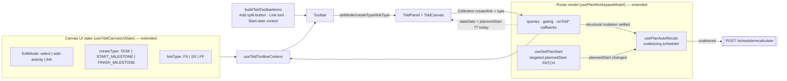
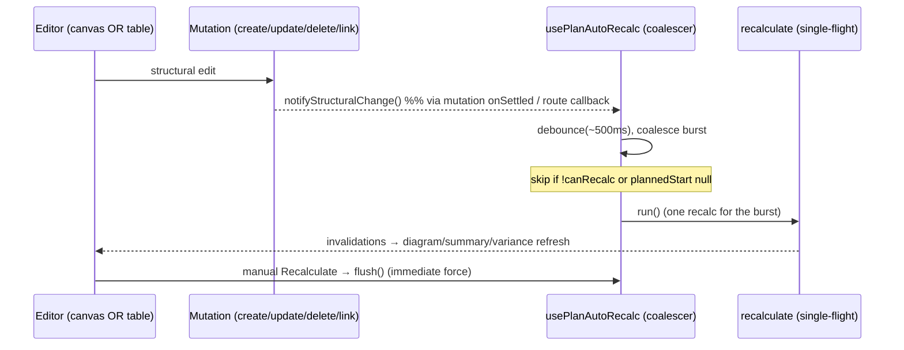
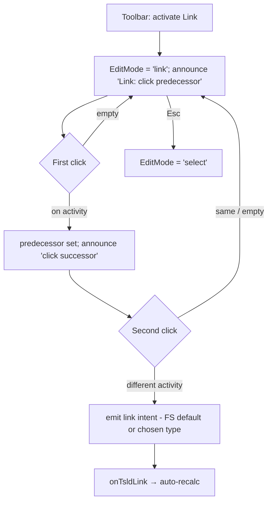
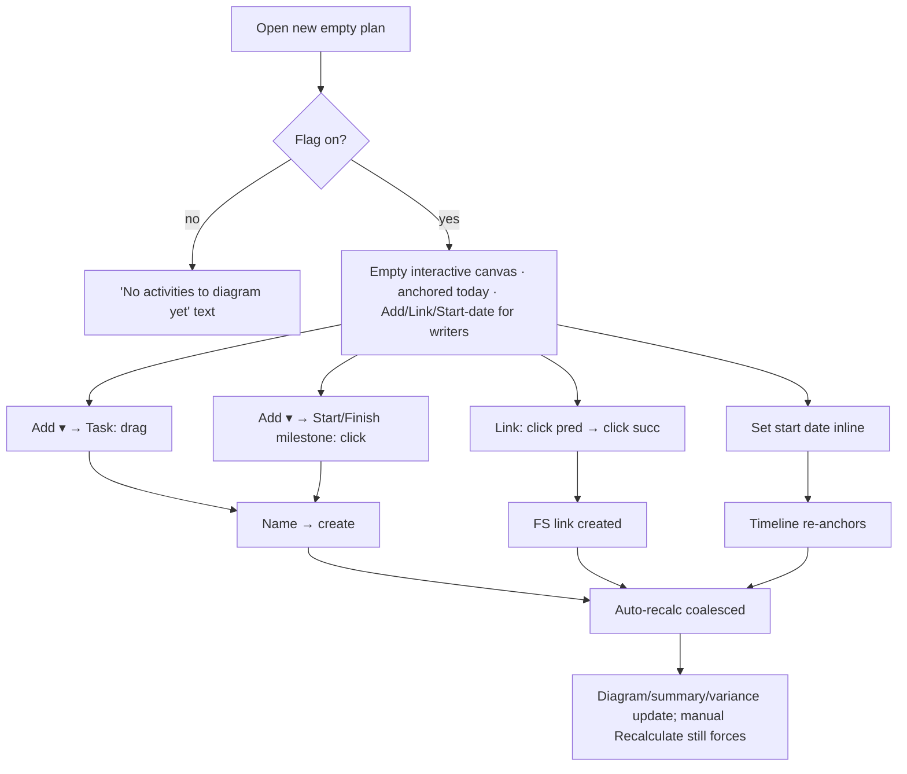

# Feature Spec: Canvas-first plan authoring

- **Status:** Draft (awaiting approval)
- **Author(s):** Feature Analyst (Claude Code)
- **Date:** 2026-07-13
- **Tracking issue / epic:** #TBD
- **Roadmap link:** TSLD / plan workspace authoring (follows ADR-0030 canvas-first
  workspace and ADR-0031 toolbar architecture)
- **Related ADR(s):** **NEW ADR-0032 required** (canvas-first authoring — see §4). Amends
  ADR-0026 (TSLD canvas: `showDiagram` render gate + edge-handle link gesture + parallel
  a11y layer), ADR-0022 (CPM synchronous recalculate — explicit-action model), ADR-0023
  (data-date / `plannedStart` as timeline origin), ADR-0031 (toolbar registry & taxonomy:
  the Add split-button + the reserved Link tool-mode slot). Respects ADR-0028 (plan
  edit-lock "pen"), ADR-0021 (DAG invariant), ADR-0004 (frontend state).

> Scope note: primarily a **frontend UX + frontend-architecture** change on the plan
> workspace. **No new backend module, database table, migration, or endpoint.** It reuses the
> existing `POST /activities`, `PATCH /activities/:id`, `PATCH /plans/:id` (targeted
> `plannedStart`), `POST /dependencies`, and `POST …/schedule/recalculate` seams and re-shapes
> how the canvas invokes them. One new `VITE_CANVAS_AUTHORING` flag (default-off during build,
> per the `VITE_TSLD_EDITING`/`VITE_CANVAS_WORKSPACE`/`VITE_CANVAS_TOOLBAR` rollout norm).
> Every change is verified against the live code (anchors cited inline).

---

## 1. Business understanding

### Problem

The TSLD canvas is the product's flagship authoring surface (ADR-0026), and the workspace is
now canvas-first (ADR-0030/0031). But **you cannot actually start a plan on the canvas.** Five
concrete friction points block the canvas-first promise the moment a planner opens a new plan:

1. **The blank canvas never mounts.** `TsldPanel` early-returns plain text while
   `activities.length === 0` (`TsldPanel.tsx:575-588`), and the interactive `TsldCanvas` only
   renders under `showDiagram = isCalculated && dataDate !== null`, where
   `isCalculated = activities.some(a => a.earlyStart !== null)` (`TsldPanel.tsx:236-237`). So on
   a brand-new plan there is nothing to draw on — the **only** way to add the first activity is
   the activities table. The canvas cannot host the first activity, cannot render before a
   recalc, and cannot render without a planned-start date.
2. **Table edits don't plot.** A table create (`useCreateActivity`, `use-activities.ts:105-116`)
   only invalidates queries — it does **not** recalculate — so the new row has `earlyStart: null`
   and the canvas won't plot it until the planner clicks **Recalculate** manually. (Canvas
   create/link/reposition already recalc inline in `use-plan-workspace-model.ts`, so the two
   surfaces behave inconsistently.)
3. **The canvas can only make Tasks.** The Add-activity toolbar item hardcodes a Task:
   `toggleAddActivity()` → `setMode('add-activity')`, and the route's `onTsldCreate` hardcodes
   `type: 'TASK'` (`use-plan-workspace-model.ts:112-135`). Making a milestone means creating a
   Task then converting it in the edit dialog — illogical. Planners should place **Start / Finish
   milestones** directly on the canvas.
4. **The start date is buried.** The timeline origin is the plan's `plannedStart`
   (`plan-workspace-toolbar.tsx:113`), editable only in the Edit-plan dialog
   (`PlanFormDialog.tsx:123-128`). There is no inline control near the canvas to set/adjust the
   start date and re-anchor the timeline.
5. **Linking is clunky.** Logic is drawn by hovering a bar's **edge handle** and rubber-banding
   to a target (`gesture-machine.ts:176-188, 239-251, 283-298`; modifiers pick FS/SS/FF at
   `:55-59`). It's fiddly, discoverability is poor, and there is no on-canvas Link affordance.

**Why now.** The canvas-first workspace and the registry-driven toolbar have both shipped
default-on; the scaffolding to host authoring commands exists. These five gaps are the last
thing standing between "canvas-first layout" and "canvas-first authoring" — a planner should be
able to make a whole plan without ever touching the table.

### Users

Organisation members on the plan surface (roles per ADR-0012/0016), gating unchanged
(`derivePlanGating` = role + pen, ADR-0028):

- **Planner / Org Admin** (holds the pen) — the primary author. Wants to open a new plan, set a
  start date inline, draw tasks and milestones, link them, and see the schedule update — all on
  the canvas, without the table detour or manual recalculation.
- **Contributor** — reports progress; reads the diagram. No new authoring power.
- **Viewer / External Guest** — read-only. Sees a legible diagram; no authoring affordances. A
  blank read-only plan shows an empty time-grid with a "nothing scheduled yet" state, not a
  broken/absent canvas.

**No role gains or loses a permission.** This is an authoring-ergonomics change; every write
stays gated exactly as today (role + pen; the API is the trust boundary).

### Primary use cases

1. **Start a plan on the canvas** — open a new (empty) plan; the interactive, time-scaled canvas
   is there, anchored to today; draw the first activity directly.
2. **Set / adjust the timeline start** — pick the plan's start date from an inline control by the
   canvas; the timeline re-anchors.
3. **Draw the right object type** — choose Task (drag for duration) or Start/Finish milestone
   (single click → zero-duration diamond) from the Add control.
4. **See edits reflected automatically** — after any structural edit from any surface, the
   schedule recalculates itself (coalesced), with a manual force still available.
5. **Link two activities explicitly** — pick the Link tool, click predecessor, click successor;
   the link is created (FS by default, with a type choice).

### User journeys

**Happy path (Planner, holds pen, new plan).** Planner creates a plan (no activities, no start) →
opens it → the workspace shows the slim header + toolbar + an **empty interactive canvas anchored
to today**, with an inline **Start date** control reading "today". Planner (optionally) sets the
start date → the timeline re-anchors → clicks **Add ▾ → Start milestone**, clicks the canvas to
drop a "Project start" diamond → picks **Add ▾ → Task**, drags out a bar, names it → the schedule
**auto-recalculates** and both plot → clicks **Link**, clicks the milestone then the task → an FS
link is drawn and the schedule updates. Never touched the table. See §4 user-flow.

**Alternates.** (a) Planner adds a row from the **activities table** → it **auto-recalculates**
and appears on the canvas without a manual click. (b) Planner changes the **start date** on a plan
that already has SNET-constrained activities → the timeline re-anchors and the schedule
recalculates. (c) **Viewer** opens an empty plan → the empty time-grid renders read-only with a
"nothing scheduled yet" note; no Add/Link/Start-date controls. (d) A **link click on empty space
or the predecessor itself** cancels that pick with an announcement; **Esc** exits Link mode.
(e) **Keyboard** author: creates via the table dialog or the canvas `n` popover, links via the
parallel listbox **Enter → logic editor** (`TsldPanel.tsx:299-306`) — both preserved.

### Expected outcomes

- A planner can build a plan end-to-end on the canvas: place → type → link → auto-schedule.
- The canvas is live from the first moment of a plan's life, anchored to today by default.
- Table and canvas edits behave identically w.r.t. recalculation (no "why didn't it move?").
- Milestones are first-class canvas objects; the "make-a-task-then-convert" workaround is gone.
- The clumsy edge-drag link gesture is replaced by a predictable two-click tool.
- `main` stays releasable throughout behind `VITE_CANVAS_AUTHORING`; flag-off is today's
  behaviour byte-for-byte.

### Success criteria

- On a **new empty plan** (flag on), the interactive canvas mounts with a visible time-grid and
  an Add control, with **zero** activities and **no** prior recalc; a writer can draw the first
  activity without opening the table (asserted in an e2e journey).
- After a **table create** (flag on), the activity appears on the canvas within one coalesced
  recalc cycle with **no** manual Recalculate click.
- The Add control can place a **Start milestone** and a **Finish milestone** as zero-duration
  objects directly on the canvas.
- The inline **Start date** control sets/updates `plannedStart` and re-anchors the timeline in a
  single interaction; the change is announced.
- The **Link** tool creates a dependency in exactly two clicks (predecessor → successor), FS by
  default; the edge-drag gesture is removed; the keyboard link path (listbox Enter → logic
  editor) still works.
- Auto-recalc **coalesces** rapid edits into a single recalculation (no per-keystroke storm) and
  never fires for a user who cannot recalc; p95 draw stays within the ADR-0026 budget.
- WCAG 2.2 AA: every new control is keyboard-operable and announced; axe passes with no new
  violations; no regression in existing plan e2e/a11y journeys.

### Open questions

The **critical** ones (design/scope-changing; each carries a recommended default to confirm at
approval) are listed at the end of §4. Everything else has an inline stated default and does not
block.

---

## 2. Functional requirements

### User stories & acceptance criteria

> **US-1 (blank interactive canvas)** — As a planner, I want a new plan to open with an
> interactive, time-scaled canvas so I can draw the first activity without the table.
>
> - **Given** the flag is on **when** I open a plan with **no activities** **then** the
>   interactive `TsldCanvas` renders (ruler + time-grid), anchored to `plannedStart ?? today`,
>   with the Add control available to writers — not the current "No activities to diagram yet"
>   text block.
> - **Given** an empty plan with **no `plannedStart`** **then** the timeline is anchored to
>   **today** and the inline Start-date control reflects "today (not set)".
> - **Given** I am a **Viewer** (read-only) on an empty plan **then** the empty grid renders with
>   a "nothing scheduled yet" note and **no** Add/Link/Start-date affordances.
> - **Given** the flag is **off** **then** the current empty-state text and `showDiagram` gate are
>   unchanged, byte-for-byte.

> **US-2 (draw the first activity on the canvas)** — As a planner, I want to draw the first
> activity on the blank canvas, so no table detour is needed.
>
> - **Given** the empty canvas and I hold the pen **when** I use Add (Task) and drag out a bar
>   **then** an activity is created and plotted; **if `plannedStart` was null** it is first set to
>   the current anchor (today) so the placement is coherent (see US-6 and Critical Q1).
> - **Given** the create fails validation **then** the inline `CreateActivityPopover` keeps its
>   error and nothing is persisted (unchanged behaviour).

> **US-3 (auto-recalculate after structural edits)** — As any editor, I want the schedule to
> recalculate automatically after a structural edit from any surface, so I never chase a stale
> diagram — while keeping a manual force.
>
> - **Given** I create / update / delete an activity or create a dependency from **the canvas or
>   the table** **then** a recalculation is triggered automatically without my clicking
>   Recalculate, and the diagram/summary/variance update.
> - **Given** I make several structural edits in quick succession **then** they are **coalesced**
>   into a single recalculation (trailing debounce), not one per edit.
> - **Given** a manual **Recalculate** action **then** it force-runs immediately (flushing any
>   pending coalesced recalc) — the button is retained.
> - **Given** I cannot recalc (role/pen, or `plannedStart` unset) **then** auto-recalc does not
>   fire; the existing `NO_START_HINT` / disabled states are unchanged.
> - **Given** a recalc is refused (423 pen / 422 no-start) **then** it degrades to today's
>   non-destructive conflict/hint (the edit is kept; no retry storm).

> **US-4 (choose the object type on the canvas)** — As a planner, I want the Add control to let me
> place a Task or a milestone directly, so I don't create-then-convert.
>
> - **Given** the Add split-button **when** I open its menu **then** I can pick **Task** (drag for
>   duration), **Start milestone**, or **Finish milestone**.
> - **Given** I pick a **milestone** type **when** I single-click the canvas **then** a
>   zero-duration diamond of that type is created at the clicked day/lane (no drag needed).
> - **Given** I pick **Task** **when** I drag **then** a task spanning the drag is created
>   (today's behaviour).
> - **Given** Hammock / Level-of-effort **then** they remain available only in the edit dialog
>   (explicit non-goal; the menu notes them as "in the activity dialog").

> **US-5 (inline timeline start-date control)** — As a planner, I want to set/adjust the plan's
> start date next to the canvas, so I can anchor the timeline without the Edit-plan dialog.
>
> - **Given** the inline Start-date control **when** I choose a date **then** the plan's
>   `plannedStart` is updated (targeted PATCH with the live `version`) and the timeline re-anchors
>   (canvas re-fits), announced ("Timeline start set to <date>").
> - **Given** the plan already has activities **when** I change the start date **then** the
>   schedule recalculates (via auto-recalc) and the bars re-plot against the new origin.
> - **Given** I am read-only **then** the control is shown disabled (or as static text) — no write.

> **US-6 (two-click Link tool replaces edge-drag)** — As a planner, I want an explicit Link tool,
> so linking is predictable and discoverable.
>
> - **Given** the toolbar **when** I activate **Link** **then** the canvas enters link mode; a
>   first click selects the **predecessor**, a second click on a different activity creates the
>   dependency (FS by default), announced.
> - **Given** link mode **when** I choose a link **type** (FS/SS/FF) in the Link affordance
>   **then** the next created link uses that type; FS is the default.
> - **Given** I click empty space, the predecessor again, or press **Esc** **then** the pick is
>   cancelled / link mode exits, announced; nothing is created.
> - **Given** the edge-drag gesture **then** it is **removed** (no rubber-band from edge handles).
> - **Given** a keyboard user **then** the parallel-listbox **Enter → logic (dependency) editor**
>   path is retained as the accessible equivalent (WCAG 2.1.1), unchanged.
> - **Given** an illegal link (self/duplicate/cycle) **then** the existing client pre-check +
>   server 409/422 non-destructive conflict is surfaced (ADR-0021), unchanged.

> **US-7 (flag-gated, no regression)** — As the team, I want the change behind a new flag so
> `main` stays releasable.
>
> - **Given** `VITE_CANVAS_AUTHORING=false` **then** the workspace behaves exactly as ADR-0031
>   today (empty-state text, table-create-without-recalc, Task-only Add, edit-dialog start date,
>   edge-drag link).
> - **Given** the flag on **then** all of US-1…US-6 hold and route behaviour is still sourced from
>   `usePlanWorkspaceModel`.

### Workflows

1. **Open empty plan:** route model loads → `hasDiagram` false but flag on → canvas renders with
   `dataDate = plannedStart ?? todayIso`, zero activities → writers see Add/Link/Start-date.
2. **Draw first Task:** Add(Task) → drag → `CreateActivityPopover` → commit → (if start null,
   set `plannedStart = anchor` first) → create → **auto-recalc** → plot.
3. **Place milestone:** Add(Start/Finish milestone) → single click → `CreateActivityPopover` →
   commit `type=…_MILESTONE, durationDays=0` → auto-recalc → diamond plots.
4. **Set start date:** inline control → `useSetPlanStart` PATCH → re-anchor (dataDate change →
   fitSignal) → auto-recalc if activities exist.
5. **Auto-recalc:** any structural mutation notifies the coalescing scheduler → trailing debounce
   → single `recalculate` (single-flight) → invalidations refresh the diagram/summary/variance.
6. **Link:** Link tool → click predecessor (announce) → click successor → `onTsldLink` → auto-
   recalc. Esc/empty/self cancels.

### Edge cases

- **Empty plan, no start:** anchor = today; first structural write sets `plannedStart` (Q1
  default) so SNET dates are coherent; the Start-date control shows "today (not set)".
- **Milestone drag instead of click:** in a milestone mode, a drag is treated as a click at the
  press point (zero-duration); no accidental span.
- **Rapid edits (paste-like bursts, held nudge):** coalesced into one recalc; the coalesced
  keyboard nudge (`use-coalesced-nudge`) still funnels through the same scheduler.
- **Start-date change mid-recalc / stale version:** targeted PATCH uses the live `version`; a 409
  is the existing non-destructive plan conflict (refetch reconciles); auto-recalc runs after the
  PATCH settles.
- **Link second-click on the predecessor / empty / off-canvas:** cancel the pick, keep link mode,
  announce; **Esc** exits the mode entirely.
- **Auto-recalc while another editor holds the pen (peer):** guarded by `canRecalc`; a refusal
  (423) is the existing non-fatal conflict, edit kept.
- **Large plan (≈2,000 activities):** the coalescing scheduler prevents a recalc-per-edit storm;
  draw stays within ADR-0026 budget; the empty-grid render is trivial.
- **Deep-link / refresh on an empty plan:** identical canvas-first empty state (selection = URL,
  ADR-0029).
- **Flag off:** none of the above; legacy paths.

### Permissions

No new permissions. All writes stay behind `derivePlanGating` (ADR-0028):

- Draw / milestone / link / start-date write require `canEditSchedule` (`PLANNER`/`ORG_ADMIN`
  **and** the pen when the pen layer is on). `plannedStart` write is schedule authoring (pen-gated
  here, though plan metadata is role-only elsewhere — see Critical Q on gating). Deny-by-default.
- Auto-recalc requires `canRecalc`; it never runs for a user who couldn't have made the edit.
- Reads (empty grid) are member-level, org-scoped by URL. The API remains the trust boundary; the
  client gating is affordance-only.

### Validation rules

- **Milestone create:** `type ∈ {START_MILESTONE, FINISH_MILESTONE}` ⇒ `durationDays = 0` (the
  API rejects non-zero; mirrored client-side via `isMilestoneType`, `activity-schemas.ts:32-36`).
- **Start date:** native `<input type="date">` ⇒ wire value `YYYY-MM-DD` (matches
  `plan-schemas` `plannedStart`); empty clears to null (all-days behaviour unchanged).
- **Link:** `predecessorId ≠ successorId`; type ∈ {FS, SS, FF} for the quick picker (SF stays in
  the logic editor — non-goal); cycle/duplicate enforced by the client pre-check + server
  (ADR-0021). Shared with the server via the existing DTOs/Zod; no new schema.
- **Auto-recalc:** no user input; the coalescing window is a client constant (default ~500 ms
  trailing; confirm in Q2).

### Error scenarios

| Scenario                                   | Detection                         | User-facing result                                          | Status  |
| ------------------------------------------ | --------------------------------- | ----------------------------------------------------------- | ------- |
| Draw/link/start-date without pen (race)    | `canEditSchedule`/`canRecalc`     | affordance disabled; a slipped-through write → 423 conflict | 423     |
| First draw sets start, PATCH stale version | plan `version` 409                | existing non-destructive plan conflict; refetch reconciles  | 409     |
| Auto-recalc with no `plannedStart`         | 422 `PLAN_START_REQUIRED`         | existing `NO_START_HINT`; edit kept, not retried            | 422     |
| Auto-recalc generic failure                | recalc mutation error             | existing `RECALC_FAILED_MESSAGE` (announced/inline)         | —       |
| Illegal link (self/duplicate/cycle)        | client pre-check + server 409/422 | existing non-destructive `EditConflictBanner` (ADR-0021)    | 409/422 |
| Milestone create with non-zero duration    | client `isMilestoneType` + API    | forced to 0 client-side; API rejects otherwise              | 422     |

---

## 3. Technical analysis

| Area           | Impact   | Notes                                                                                                                                                                                                                                                                                                                                                            |
| -------------- | -------- | ---------------------------------------------------------------------------------------------------------------------------------------------------------------------------------------------------------------------------------------------------------------------------------------------------------------------------------------------------------------- |
| Frontend       | **high** | New empty-canvas render path (relax `TsldPanel` gate); extend `EditMode` + gesture machine (milestone single-click, `link` two-click; remove edge-drag); `EditIntent.create.type`; Add split-button registry item; inline Start-date toolbar control; a plan-scoped **coalescing auto-recalc** controller; Link type picker. All behind `VITE_CANVAS_AUTHORING`. |
| Backend        | none     | No modules/services/endpoints. Reuses `POST /activities`, `PATCH /activities/:id`, `PATCH /plans/:id`, `POST /dependencies`, `POST …/schedule/recalculate`.                                                                                                                                                                                                      |
| Database       | none     | No models/migrations/indexes/constraints.                                                                                                                                                                                                                                                                                                                        |
| API            | none     | No new/changed endpoints or DTOs. `plannedStart` PATCH already exists (`useUpdatePlan`/`useSetPlanCalendar` pattern). Milestone create uses the existing `type`/`durationDays` fields.                                                                                                                                                                           |
| Security       | low      | No new authZ surface; affordances reflect existing gating (deny-by-default). No new inputs beyond a date already accepted server-side. IDOR unchanged (org-scoped endpoints).                                                                                                                                                                                    |
| Performance    | **med**  | Auto-recalc must coalesce (no recalc-per-edit) and single-flight to protect the synchronous recalc endpoint (ADR-0022) on large plans; empty-grid render is cheap; canvas viewport-on-resize behaviour unchanged (ADR-0030 amendment already in place).                                                                                                          |
| Infrastructure | low      | One new `VITE_CANVAS_AUTHORING` flag in `apps/web/src/config/env.ts` + `.env.example`; a flag-on e2e project (mirror `test:e2e:toolbar`).                                                                                                                                                                                                                        |
| Observability  | low      | No new server logs/metrics. Existing recalc logs cover auto-recalc (same endpoint). Optional client telemetry out of scope.                                                                                                                                                                                                                                      |
| Testing        | **high** | Unit (gesture machine: milestone click + link two-click + edge-drag removal; coalescing scheduler; start-date hook; create-type mapping). Component (Add split-button, Start-date control, Link mode a11y). e2e/a11y (flag-on journey: build a plan on the canvas; table-create auto-plots; axe).                                                                |

### Dependencies

- **Prerequisite (met):** ADR-0030 workspace + ADR-0031 toolbar (`buildTsldToolbarItems`,
  `TsldToolbarContext`, `useTsldToolbarContext`, `useTsldCanvasUiState`, the `Toolbar`/`Menu`
  primitives), the pen (`usePlanPen`/`derivePlanGating`), the recalc command
  (`useRecalculateCommand`), the canvas core/shell split (`gesture-machine`, `render-model`,
  `TsldCanvas`), `CreateActivityPopover`, `DependencyEditor`, `useSetPlanCalendar` (the pattern
  for a targeted `useSetPlanStart`).
- **Reuse, don't reinvent:** the create/link/reposition route callbacks in
  `use-plan-workspace-model.ts` (extend, not rewrite); the coalesced-nudge scheduler shape
  (`use-coalesced-nudge`) as a model for the auto-recalc coalescer; the existing invalidation
  fan-out in `useRecalculate`.
- **Must land in order (within this work):** the auto-recalc controller and the create-`type`
  plumbing are used by later slices — see the plan's sequencing.
- **ADR required** (architecturally significant): the render-gate relaxation, the auto-recalc
  behaviour model, and the interaction changes — **ADR-0032** (outline in §4). **ui-architect**
  should co-author the interaction/registry parts before build.

---

## 4. Solution design

### Architecture overview

The plan workspace, canvas UI-state, toolbar registry, and route model are unchanged in shape;
this feature threads five capabilities through those existing seams behind one flag.

### Empty-canvas render (point 1) — the load-bearing gate change

- Today: `TsldPanel` returns text when `activities.length === 0` (`:575-588`) and gates the canvas
  behind `showDiagram = isCalculated && dataDate !== null` (`:236-237`). `TsldCanvas` already
  falls back to `DEFAULT_VIEWPORT` when no activity has dates (`TsldCanvas.tsx:448-452`), so it can
  paint a bare ruler/grid — it is only prevented from mounting.
- Change (flag on): render the interactive `TsldCanvas` whenever **`dataDate !== null`**,
  independent of `isCalculated` and of `activities.length`. `dataDate` is
  **`plannedStart ?? todayIso`** (the model already computes `todayIso`), so an empty, start-less
  plan still has a timeline origin. The zero-activity path shows the ruler/grid + the parallel
  (empty) listbox + the Add affordance for writers; a "nothing scheduled yet" hint replaces the
  old text only in the read-only/empty case.
- This **amends ADR-0026's `showDiagram` gate** and touches ADR-0023 (a today-anchor when
  `plannedStart` is null — a _display_ origin; the first write pins the real `plannedStart`).

### Auto-recalc coalescing (point 2) — amends ADR-0022

- Introduce **`usePlanAutoRecalc(orgSlug, planId, { canRecalc })`** — a plan-scoped controller that
  exposes `notify()` (schedule a trailing-debounced recalc, coalescing a burst) and `flush()`
  (run now). It wraps `useRecalculateCommand` (already single-flight: `run()` no-ops while
  pending) and reuses its failure taxonomy (`NO_START_HINT` / `RECALC_FAILED_MESSAGE`). The
  coalescing shape mirrors `use-coalesced-nudge`.
- **Wiring:** every **structural** mutation notifies the controller. The cleanest unification
  (recommended, Q2): the canvas callbacks (`onTsldCreate`/`onTsldLink`/`onTsldReposition`) stop
  awaiting their **own** inline recalc and instead `notify()`; the table create/delete and the
  logic-editor link do the same. One recalc path for all surfaces. The optimistic ghost/preview
  keeps the just-drawn object visible during the debounce so nothing feels laggy.
- **Manual Recalculate is kept** and becomes the `flush()` force. Progress-only edits do not
  notify (progress doesn't move CPM dates in the same way — confirm scope; default: structural
  only = create/update-definition/delete/link/start-date).
- **Guards:** never notify when `!canRecalc` or `plannedStart === null`; a 423/422 refusal is the
  existing non-fatal conflict. This bounds load on the synchronous recalc endpoint (ADR-0022) and
  respects the pen (ADR-0028).

### Add split-button + on-canvas milestones (point 3) — within ADR-0026/0031

- **Canvas UI state** gains `createType: ActivityType` (default `TASK`, constrained to
  `TASK | START_MILESTONE | FINISH_MILESTONE`).
- **Gesture machine** (`gesture-machine.ts`): `EditMode` already `'select' | 'add-activity'`.
  In `add-activity`, a **milestone** `createType` commits on **single click** (a press with no
  drag) as a zero-span create at the click's day/lane; a **Task** commits on **drag** (today's
  path). `EditIntent.create` gains a **`type`** field; the milestone case emits
  `startDay === endDay` with `type` set. Pure and unit-testable.
- **Route** (`onTsldCreate`, `:112-135`): use `input.type`; for milestones send
  `durationDays: 0` and a `START…`/`FINISH…` type (SNET placement as today for Task; milestones
  get the constraint too so they pin where dropped — mirror the Task path).
- **Toolbar registry** (`tsld-toolbar-items.tsx` `add-activity` item, `:171-182`): render a
  **split-button** — primary activates the current `createType` (drag/click), the dropdown (shared
  `Menu`) picks Task / Start milestone / Finish milestone. Reuses `toggleAddActivity` +
  `setCreateType`. Hammock/LOE listed as "in the activity dialog" (non-goal). Pen-gated as a set
  (unchanged).

### Inline timeline start-date control (point 4)

- New **`useSetPlanStart(orgSlug)`** — a targeted `PATCH /plans/:id` of `{ plannedStart, version }`
  (a near-exact clone of `useSetPlanCalendar`, `use-plans.ts:86-100`): writes the returned plan to
  the detail cache (fresh `version`) and invalidates the schedule summary. Changing `plannedStart`
  changes `dataDate` → the canvas re-fits (`TsldCanvas` `fitSignal`/`dataDate` effect,
  `:299-302`), and (if activities exist) auto-recalc runs.
- **Placement:** a small date control in the **toolbar Frame group** (the timeline-anchor home),
  rendered via a registry `render` item; reads `plan.plannedStart`, writes via the model. Writer
  only; read-only shows the date as static text. Announced on change.

### Link tool-mode replacing edge-drag (point 5) — amends ADR-0026 + ADR-0031

- **`EditMode`** gains `'link'`. In link mode the gesture machine tracks a `pendingPredecessorId`
  (first click) and, on a second click over a **different** activity, emits the existing
  `EditIntent.link` (`predecessorId`, `successorId`, `type = linkType`). First-click-on-empty,
  second-click-on-self/empty, and `escape` reset without emitting.
- **Remove** the edge-handle rubber-band: the `linking` gesture state and the
  `startHandle`/`finishHandle` link branches (`gesture-machine.ts:176-188, 239-251, 283-298`) and
  the modifier→type chording (`:55-59`) are deleted; `TsldCanvas` stops hit-testing edge handles
  for linking (they may remain purely visual or be dropped — decide in build).
- **`linkType: 'FS' | 'SS' | 'FF'`** in canvas UI state (default FS); the toolbar Link control
  carries a small type choice next to it. **SF** stays in the logic editor (non-goal; the picker
  makes it trivial to add later).
- **Keyboard parity preserved:** the parallel-listbox **Enter → `onOpenLogic` → `DependencyEditor`**
  path (`TsldPanel.tsx:299-306`, `plan-dialogs.tsx`) is the accessible link-creation equivalent
  (WCAG 2.1.1) and is untouched. Link mode announces each step for pointer users.
- The client legality pre-check + server 409/422 handling in `onTsldLink` (`TsldPanel.tsx:517-554`,
  `use-plan-workspace-model.ts:211-237`) are reused verbatim.

### Data flow

No new data flow. Route callbacks continue to compose queries + mutations and pass read-models to
`TsldPanel`/`ActivitiesTable`. The two new client-only pieces are the coalescing recalc scheduler
(fires the existing recalc endpoint) and the targeted `plannedStart` PATCH.

### User flow

### Database changes

None.

### API changes

None. Endpoints reused: `POST …/activities` (type + duration for milestones),
`PATCH /activities/:id`, `PATCH /plans/:id` (targeted `plannedStart`), `POST …/dependencies`,
`POST …/schedule/recalculate`.

### Component changes (all under `apps/web/src`, design-system tokens only — no one-off styling)

**New:**

- `features/plans/api/use-plans.ts` → **`useSetPlanStart`** (targeted `plannedStart` PATCH; clone
  of `useSetPlanCalendar`).
- `components/layout/workspace/use-plan-auto-recalc.ts` → **`usePlanAutoRecalc`** (coalescing
  scheduler: `notify()` / `flush()` over `useRecalculateCommand`).
- A **Start-date** toolbar control (Frame group `render` item) + an **Add split-button** render for
  the `add-activity` item + a **Link** tool item with a FS/SS/FF type choice — all in
  `features/tsld/toolbar/tsld-toolbar-items.tsx`, driven by new `TsldToolbarContext` fields.

**Changed:**

- `features/tsld/interaction/gesture-machine.ts` — `EditMode` += `'link'`; `EditIntent.create` +=
  `type`; milestone single-click create; two-click link mode; **remove** edge-drag link states.
- `features/tsld/toolbar/use-tsld-canvas-ui-state.ts` — add `createType`/`setCreateType`,
  `linkType`/`setLinkType`; `mode` now includes `'link'`.
- `features/tsld/toolbar/tsld-toolbar-context.ts` + `use-tsld-toolbar-context.tsx` — expose the new
  state/callbacks and the start-date read/write + `hasDiagram`-independent "can author on empty".
- `features/tsld/components/TsldPanel.tsx` — relax the `activities.length === 0` early-return and
  the `showDiagram` gate to render the canvas when `dataDate !== null` (flag on); wire
  `createType`/link mode into `TsldCanvas`; keep the empty read-only note.
- `features/tsld/components/TsldCanvas.tsx` — accept `createType`/link mode; drop edge-handle link
  hit-testing; render the empty grid (uses existing `DEFAULT_VIEWPORT` fallback).
- `components/layout/workspace/use-plan-workspace-model.ts` — `onTsldCreate` honours `type`;
  first-draw-sets-start when null (Q1); structural callbacks `notify()` the auto-recalc controller
  instead of awaiting inline recalc; expose the controller + `useSetPlanStart`.
- `features/activities/api/use-activities.ts` — table create/delete notify the auto-recalc
  controller (via a shared model callback), so table edits auto-plot.
- `config/env.ts` + `.env.example` — `VITE_CANVAS_AUTHORING` (default-off during build).

**Reused unchanged:** `CreateActivityPopover`, `DependencyEditor`, `EditConflictBanner`, the
`Menu`/`Toolbar`/`ToolbarPopover` primitives, `useRecalculateCommand`, `useAnnounce`,
`derivePlanGating`/`usePlanPen`, the invalidation fan-out in `useRecalculate`.

**States to cover:** empty (interactive grid, writer vs read-only), not-calculated (grid + Add),
loading, error (existing not-found), success (as designed), disabled (no pen / read-only),
in-flight (recalc pending — existing busy state).

### Implementation approach & alternatives

**Chosen:** thread all five capabilities through the **existing** ADR-0030/0031 seams
(gesture machine, canvas UI-state, toolbar registry, route model), behind one new flag,
default-off during build and flipped on when a11y/perf/e2e gates are green — exactly how
`VITE_TSLD_EDITING` / `VITE_CANVAS_WORKSPACE` / `VITE_CANVAS_TOOLBAR` rolled out. Reuse the
recalc command, the create popover, the logic editor, and the calendar-PATCH pattern; add only a
coalescing scheduler and a targeted start PATCH.

**Alternatives considered:**

- _Keep the canvas gated on `isCalculated`; teach the empty state a separate "add first activity"
  button that opens the table dialog._ Rejected — doesn't deliver "draw on the canvas from the
  start"; keeps the table detour.
- _Auto-recalc as a backend "recalc-on-write" behaviour (server recalculates after each mutation)._
  Rejected for this feature — it changes ADR-0022's synchronous, explicit, engine-owned model
  server-side, has broader blast radius (every write path, transactions, batching), and isn't
  needed to satisfy the UX. Client-side coalescing over the existing endpoint is the smaller,
  reversible change. (Flagged as a possible future ADR if server-side proves better at scale.)
- _Recalc after every edit (no coalescing)._ Rejected — a recalc-per-edit storm on the synchronous
  endpoint; poor on large plans.
- _Milestones via a separate "convert" action._ Rejected — that's today's illogical workaround the
  product owner explicitly wants gone.
- _Keep edge-drag and add Link as an alternative._ Rejected — the product owner's decision is to
  **replace** the gesture (two link surfaces would confuse and double the a11y/interaction cost).
- _Start-date as a full plan-form field only._ Rejected — the ask is an inline control by the
  canvas; reuse the targeted-PATCH pattern.

**This is architecturally significant → propose ADR-0032** (co-author: ui-architect).
_"ADR-0032: Canvas-first plan authoring."_

- _Context:_ the canvas can't host a plan's first activity, table edits don't recalc, milestones
  need a convert-workaround, the start date is buried, and linking is an obscure edge-drag —
  blocking the canvas-first authoring promise (ADR-0030/0031).
- _Decision:_ (a) render the interactive canvas whenever a timeline anchor exists
  (`plannedStart ?? today`), independent of `isCalculated`/activity count — amending ADR-0026's
  `showDiagram` gate and ADR-0023's origin (today as a display anchor; first write pins
  `plannedStart`); (b) coalesced client-side auto-recalc after structural edits from any surface,
  keeping the manual force — amending ADR-0022's explicit-action model (client-side only, endpoint
  unchanged); (c) `EditMode` gains milestone single-click create and a two-click `link` mode, the
  edge-drag link gesture is removed, and the Add control becomes a type split-button — amending
  ADR-0026's interaction model and ADR-0031's toolbar (the reserved Link tool-mode + Add
  split-button slots); (d) an inline timeline start-date control via a targeted `plannedStart`
  PATCH.
- _Options:_ server-side recalc-on-write; keep-and-add link; convert-workaround for milestones
  (as above).
- _Consequences:_ one client coalescing layer + a today-anchor concept; the canvas is live from a
  plan's first moment; one recalc path for both surfaces; the edge-drag gesture and its
  modifier-chording retire; a11y (empty grid, Link mode, Start-date, Add menu) becomes a merge
  gate; no backend/schema impact; `VITE_CANVAS_AUTHORING` gates rollout.

### Critical open questions (confirm at approval)

- **CRITICAL Q1 — First-draw when `plannedStart` is null.** When a writer draws the first activity
  on a start-less plan, do we (a) **auto-set `plannedStart` to the current anchor (today)**
  transparently as part of the first create, or (b) **require** the user to set a start via the
  inline control before the first draw is allowed? **Recommended default: (a) auto-set to today**,
  reflected immediately in the Start-date control (lowest friction; keeps SNET dates coherent; the
  user can change the start afterwards). Changes the create flow and the data-coherence story.
- **CRITICAL Q2 — Auto-recalc unification & window.** Do the canvas callbacks **drop their inline
  recalc and unify** onto the coalescing scheduler (one path; a ~500 ms trailing debounce means the
  just-drawn bar plots a beat later, covered by the optimistic ghost), or does auto-recalc **layer
  on** (table edits get it; canvas keeps its immediate inline recalc — two behaviours)? And is
  ~500 ms trailing the right coalescing window? **Recommended default: unify, ~500 ms trailing,
  single-flight, manual = flush.** This is the ADR-0022-amending decision and drives perceived
  latency vs. server load.
- **CRITICAL Q3 — Start-date write gating.** Is setting `plannedStart` inline **pen-gated schedule
  authoring** (`canEditSchedule` — matches "it re-anchors the schedule"), or **role-only plan
  metadata** (`canWrite` — matches where `plannedStart` lives today, the Edit-plan dialog)?
  **Recommended default: pen-gated (`canEditSchedule`)**, since inline it is a schedule-authoring
  act on the canvas and should follow the same pen as drawing; the Edit-plan dialog keeps its
  role-only path. Affects who can use the inline control and the permissions matrix.

_(Non-critical, defaults stated:)_ Link type picker set — **default FS/SS/FF; SF via the logic
editor** (non-goal). Which edits count as "structural" for auto-recalc — **default:
create/update-definition/delete/link/start-date; progress excluded.** Milestone drag — **default:
treat as a click (zero-duration).** Add split-button default type — **default: Task, remembered
per session.** Edge handles after link-drag removal — **default: keep them visual-only, no link
hit-test** (decide in build).

## 5. Links

- Implementation plan: `docs/plans/canvas-first-authoring.md`
- ADR to write: `docs/adr/0032-canvas-first-plan-authoring.md` (co-author: ui-architect)
- Related docs to update on build: `docs/FRONTEND_ARCHITECTURE.md` (auto-recalc pattern),
  `docs/UX_STANDARDS.md` (Add split-button + Link tool-mode + inline date control),
  `docs/DESIGN_SYSTEM.md` / `docs/COMPONENT_LIBRARY.md` (new toolbar controls), ADR-0022 (note the
  auto-recalc amendment), ADR-0023 (today-anchor note), ADR-0026 (render-gate + link-gesture
  removal), ADR-0031 (Link tool-mode + Add split-button), `apps/web/src/config/env.ts` +
  `.env.example` (new flag), `CLAUDE.md` §16 (ADR-0032).
