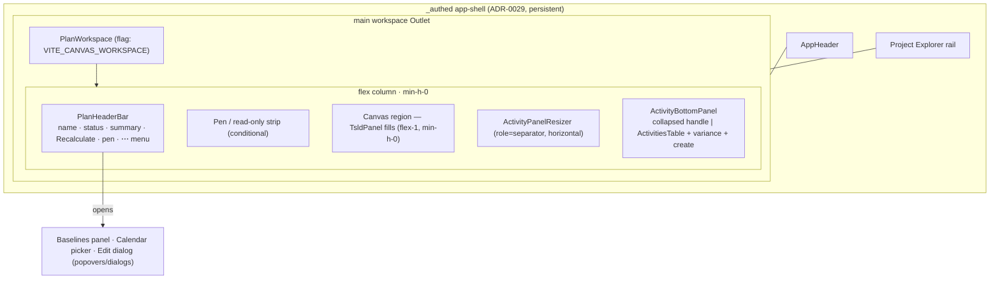
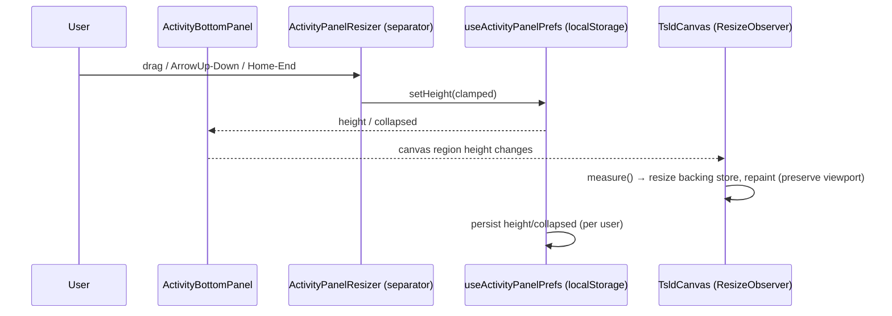
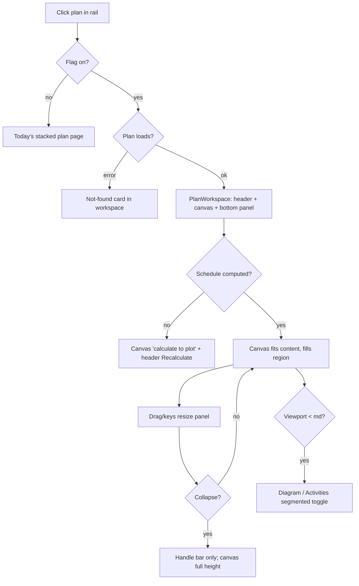

# Feature Spec: Canvas-first plan workspace

- **Status:** Draft
- **Author(s):** Feature Analyst (with Claude Code)
- **Date:** 2026-07-13
- **Tracking issue / epic:** #
- **Roadmap link:** TSLD editing surface / plan workspace (docs/ROADMAP.md)
- **Related ADR(s):** ADR-0029 (persistent app-shell & navigator — amended by a new
  **ADR-0030** proposed here), ADR-0026 (TSLD canvas), ADR-0028 (plan edit-lock/pen),
  ADR-0004 (state split), ADR-0005 (routing), ADR-0006 (tokens), ADR-0012/0016 (RBAC).

> Frontend-only feature. **No backend, database, API, or schema change.** It
> re-shapes how the existing plan surface is laid out inside the app-shell; every
> existing capability is preserved and stays reachable/accessible.

---

## 1. Business understanding

### Problem

Today a plan opens as a **single, long-scrolling detail page**
(`PlanDetailScreen`, route `/orgs/$orgSlug/plans/$planId`) rendered into the
app-shell workspace region (ADR-0029). It stacks, vertically, a metadata block, a
Schedule heading + Recalculate, the edit-lock banner, a calendar picker, a
schedule-summary strip, a Baselines panel, the **TSLD canvas** (the product's
flagship editing surface, ADR-0026), and then the **Activities table**. The
canvas — the reason the product exists (a planner draws activities on a timeline
and pulls logic between them) — is boxed to a fixed `480px` region in the _middle_
of a page the planner must scroll. This is the opposite of the intended
"canvas-first" model: the diagram should be the primary surface that fills the
workspace, with the activity table available _on demand_ as a resizable bottom
panel, and the plan's chrome (summary, recalculate, baselines, calendar, pen)
condensed into a slim header rather than consuming vertical space above the fold.

Now is the right time: the app-shell (ADR-0029), the canvas (ADR-0026), and the
edit-lock pen (ADR-0028) have all landed and are on by default. The scaffolding to
host a canvas-first workspace exists; only the layout of the plan surface is wrong.

### Users

Organisation members (roles per ADR-0012/0016), viewing the active org's hierarchy:

- **Planner / Org Admin** — build and edit the schedule on the canvas; need the
  diagram to fill the screen while still reaching Recalculate, baselines, the
  calendar, and the pen, and to pull the activity table up to check/edit rows.
- **Contributor** — report progress; needs the activity table reachable and the
  canvas readable, without edit affordances they lack.
- **Viewer / External Guest** — read-only; needs a full-height, legible diagram and
  the table on demand; no write controls.

No role gains or loses any permission — this is a **layout** change. Editing gating
is unchanged (role + pen, `derivePlanGating`).

### Primary use cases

1. **Open a plan into the canvas-first workspace** — click a plan in the Project
   Explorer; the diagram fills the workspace next to the rail (no long scroll).
2. **Give the canvas full height** — collapse/hide the bottom activity panel so the
   diagram uses the whole workspace height.
3. **Pull up the activity table** — drag the bottom panel up (or expand it) to see
   and edit rows; drag it back down or collapse it.
4. **Reach plan chrome from a slim header** — Recalculate, schedule summary, pen
   status, calendar, baselines, and Edit plan without scrolling a page.
5. **Resize by keyboard** — collapse/expand/resize the panel and the rail entirely
   from the keyboard (WCAG 2.2 AA).

### User journeys

**Happy path.** Planner signs in → app-shell up with the Project Explorer rail →
clicks a plan → the workspace shows a slim plan header (name, status, summary,
Recalculate, pen) with the **TSLD canvas filling the region beneath it** and a
**collapsed activity panel handle** at the bottom → planner drags on the canvas to
add/link activities → pulls the activity panel up to verify durations and progress
→ drags it back down → collapses it to review the critical path full-height. See
the user-flow diagram in §4.

**Alternates.** (a) Viewer opens a plan → identical layout, no edit affordances,
table read-only. (b) Deep-link / refresh on a plan URL → the same plan opens
canvas-first (selection = URL). (c) Narrow screen (< `md`) → the workspace presents
**Diagram / Activities** as a segmented single-pane toggle rather than a split. (d)
Schedule not yet calculated → canvas shows the "calculate to plot" state; header
Recalculate is the CTA; the panel still lets a writer add activities.

### Expected outcomes

- The diagram is the primary, full-height surface; the plan is no longer a scroll.
- The activity table is a first-class, resizable/collapsible companion, not a
  section far below the fold.
- All existing plan capabilities (recalculate, baselines, calendar, pen, edit,
  progress, variance) remain present and accessible from a compact header + menus.
- `main` stays releasable throughout via a `VITE_CANVAS_WORKSPACE` flag; flag-off is
  today's stacked page byte-for-byte.

### Success criteria

- On a plan with a computed schedule, the canvas occupies the full workspace height
  minus the slim header and the collapsed panel handle (≥ ~70% of workspace height
  at default; up to full height when the panel is collapsed), at `lg`+.
- Resizing the bottom panel keeps a **canvas that never drops below a minimum
  legible height** and repaints within the ADR-0026 budget (≤ 16 ms/frame draw; no
  viewport "jump" during a drag).
- Every plan capability reachable in ≤ 1 interaction from the workspace header.
- All resize/collapse controls are fully keyboard-operable and pass axe with no new
  violations; no regression in existing plan e2e journeys.
- Zero backend/API/schema change; zero new RBAC surface.

### Open questions

See the **Critical questions** at the end of this spec. Non-critical items carry a
stated default and do not block.

---

## 2. Functional requirements

### User stories & acceptance criteria

> **US-1** — As a member, I want a plan to open with the TSLD canvas filling the
> workspace, so the diagram is the primary surface (no long scroll).
>
> - **Given** the canvas-workspace flag is on **when** I open a plan with a computed
>   schedule **then** the workspace shows a slim plan header, the canvas filling the
>   region beneath it, and the activity panel docked at the bottom — with no
>   page-level vertical scroll of the workspace.
> - **Given** the flag is **off when** I open a plan **then** I see today's stacked
>   detail page, byte-for-byte.
> - **Given** a plan whose schedule is not yet calculated **then** the canvas region
>   shows the existing "calculate to plot" message and the header offers Recalculate.

> **US-2** — As a member, I want the activity table in a bottom panel I can drag up
> and down and collapse, so I control how much room the canvas and table each get.
>
> - **Given** the workspace **when** I drag the panel's top handle up **then** the
>   panel grows and the canvas shrinks, both clamped so the canvas keeps at least its
>   minimum height and the panel keeps at least its minimum open height.
> - **Given** the panel is open **when** I click Collapse (or drag it to the bottom)
>   **then** only a peek/handle bar remains and the canvas takes the freed height.
> - **Given** the panel is collapsed **when** I expand it **then** it returns to its
>   last persisted height.
> - **Given** I reload or switch plans and back **then** the panel's height and
>   collapsed state are restored (persisted per user in `localStorage`).

> **US-3** — As a keyboard user, I want to resize and collapse the panel entirely
> from the keyboard, so the workspace is fully operable without a pointer (WCAG 2.2).
>
> - **Given** focus is on the panel's resize handle **when** I press ArrowUp/ArrowDown
>   **then** the panel height changes by a fixed step; Home/End jump to min/max; the
>   separator exposes `role="separator"`, `aria-orientation="horizontal"`, and
>   `aria-valuenow/min/max/text`, and changes are announced politely.
> - **Given** the panel handle **when** I activate the collapse/expand control
>   **then** the state toggles and is announced ("Activities panel collapsed/expanded").

> **US-4** — As a member, I want the plan's summary, Recalculate, pen, calendar,
> baselines, and Edit in a compact header, so nothing is lost when the page stops
> being a long scroll.
>
> - **Given** the workspace header **then** it shows the plan name + status, a compact
>   schedule-summary, a Recalculate action, and the edit-lock (pen) status; and an
>   overflow menu exposes Edit plan, Calendar, Baselines, and Plan details.
> - **Given** I lack a capability (role/pen) **then** the corresponding control is
>   hidden or disabled exactly as it is today (no new gating).
> - **Given** the pen is held by a peer / I am read-only **then** a single pen note is
>   shown (consolidated — not repeated above both canvas and table as it is today).

> **US-5** — As a member on a narrow screen, I want the workspace to stay usable, so
> the canvas-first model is mobile-first.
>
> - **Given** a viewport below `md` **when** I open a plan **then** the workspace shows
>   the plan header plus a **Diagram / Activities** segmented toggle that fills the
>   region (one pane at a time), instead of a split with a resizer.
> - **Given** `md`+ **then** the split canvas + resizable bottom panel is shown.

### Workflows

1. **Open plan:** rail activate node → URL → `PlanWorkspace` mounts in the workspace
   `Outlet` → header + canvas (fit-to-content) + bottom panel at persisted height.
2. **Resize panel:** pointer-drag or keyboard on the horizontal separator → clamp
   (canvas ≥ min, panel within [min, max]) → persist height → canvas ResizeObserver
   repaints, **preserving the current viewport** (no re-fit) — see §4 canvas sizing.
3. **Collapse/expand panel:** toggle → collapsed shows handle bar only → expand
   restores last height → announced.
4. **Reach chrome:** header actions/menus open Recalculate, Baselines panel, Calendar
   picker, Edit dialog (existing components, re-homed).

### Edge cases

- **Empty plan (no activities):** canvas shows its existing empty-state; the bottom
  panel shows the table empty-state; header Recalculate/Add still available to writers.
- **Very small workspace height** (short viewport, rail drawer open): clamps enforce
  canvas-min first; if the workspace is shorter than canvas-min + panel-min, the panel
  auto-collapses to the handle (canvas wins), and `< md` falls back to the tabbed model.
- **Panel expanded to max then viewport shrinks:** on container resize, re-clamp the
  persisted height down to the new max (canvas-min preserved); persist the clamped value
  lazily so the user's preferred height returns when space allows.
- **Concurrent edits / stale data:** unchanged — the pen (ADR-0028) and optimistic
  409/423 handling live in the existing TsldPanel/table/route seams.
- **Rapid drag of the divider:** repaint stays within budget; the canvas must not
  re-fit (zoom/pan reset) on each resize tick (load-bearing — see §4).
- **Plan not found / no access:** the workspace region shows the existing not-found
  card (not a blank split).
- **Corrupt/stale persisted panel prefs:** ignored, reset to defaults (mirrors
  `use-rail-prefs`).

### Permissions

No new permissions. Layout is presentation-only. Editing affordances stay gated by
`derivePlanGating` (role + pen, ADR-0028): `canEditSchedule`, `canRecalc`,
`canProgress`, `penReadOnly`. Reads are member-level and org-scoped by the URL
(ADR-0029); the API remains the trust boundary. Collapse/resize are **view state**
available to every role (including Viewer/Guest).

### Validation rules

Client-only view-state validation (no server contract):

- Panel height clamped to `[PANEL_MIN_OPEN, workspaceHeight − HEADER − CANVAS_MIN]`;
  collapsed height = handle bar only.
- Persisted values are clamped/rounded on read; non-finite → default. Shared nothing
  with the server; lives beside `use-rail-prefs` conventions.

### Error scenarios

| Scenario                      | Detection         | User-facing result                           | Status  |
| ----------------------------- | ----------------- | -------------------------------------------- | ------- |
| Plan not found / no access    | plan query error  | existing "Plan not found" card in workspace  | 404\*   |
| Schedule not yet calculated   | `earlyStart` null | canvas "calculate to plot" + header CTA      | n/a     |
| Corrupt persisted panel prefs | JSON/parse guard  | silently reset to defaults                   | n/a     |
| Workspace too short for split | measured clamp    | panel auto-collapses; `< md` → tabbed model  | n/a     |
| Write refused (pen/version)   | existing 423/409  | existing non-destructive banners (unchanged) | 423/409 |

\* Surfaced by the existing route error branch; no new endpoint.

---

## 3. Technical analysis

| Area           | Impact | Notes                                                                                                                                                                                                                                                |
| -------------- | ------ | ---------------------------------------------------------------------------------------------------------------------------------------------------------------------------------------------------------------------------------------------------- |
| Frontend       | high   | New `PlanWorkspace` layout + `PlanHeaderBar` + resizable `ActivityBottomPanel` + panel-prefs hook + separator; re-home existing sections; make `TsldPanel`/`TsldCanvas` fill height and preserve viewport on resize. Behind `VITE_CANVAS_WORKSPACE`. |
| Backend        | none   | No modules, services, or endpoints change.                                                                                                                                                                                                           |
| Database       | none   | No models/migrations/indexes.                                                                                                                                                                                                                        |
| API            | none   | No endpoints or DTOs; reuses existing queries/mutations.                                                                                                                                                                                             |
| Security       | none   | No new RBAC/scope surface; editing gating unchanged; API stays trust boundary.                                                                                                                                                                       |
| Performance    | med    | Canvas must re-fit to available height and repaint on resize within ADR-0026 budget; must **not** re-fit (reset viewport) on every resize tick; ResizeObserver + DPR handling already exist and are reused.                                          |
| Infrastructure | low    | One new `VITE_` flag (`VITE_CANVAS_WORKSPACE`) + `.env.example` documentation.                                                                                                                                                                       |
| Observability  | none   | No new logs/metrics/traces.                                                                                                                                                                                                                          |
| Testing        | med    | Unit (prefs clamp, separator keyboard), component (workspace states, collapse/expand/resize), a11y (axe + keyboard), e2e (flag-on Playwright journey), perf (repaint/no-jump on resize).                                                             |

### Dependencies

- **ADR-0029 app-shell** (the workspace `Outlet` this feature fills) — landed, on by default.
- **ADR-0026 TSLD canvas** — landed; `TsldCanvas` already uses a `ResizeObserver` +
  re-fit and a DPR-aware backing store. This feature relies on and slightly amends
  that resize behaviour (preserve viewport on pure resize).
- **ADR-0028 pen** — landed; pen controls/gating re-homed into the header, unchanged.
- Reuses existing components/hooks unchanged in behaviour: `TsldPanel`,
  `ActivitiesTable`, `RecalculateButton`, `ScheduleSummaryStrip`, `EditLockBanner`,
  `PenReadOnlyNote`, `PlanCalendarPicker`, `BaselinesPanel`, `BaselineVarianceSummary`,
  `PlanFormDialog`, `DependencyEditor`, `useRailPrefs` (as the pattern to mirror),
  `RailResizer` (pattern to mirror), `useAnnounce`, the `Menu` primitive
  (`components/ui/menu.tsx`, per UX_STANDARDS row/node actions).
- **New ADR-0030** (proposed) to amend ADR-0029's "single workspace region" with the
  canvas-first internal workspace layout (header + canvas + resizable bottom panel).

---

## 4. Solution design

### Architecture overview

`PlanDetailScreen` becomes a thin switch: flag-off renders today's stacked page;
flag-on renders a new **`PlanWorkspace`** that lays out the workspace `Outlet` as a
full-height flex column — a slim **`PlanHeaderBar`**, an optional pen strip, the
**canvas region** (flex-1, fills), a horizontal **`ActivityPanelResizer`**, and the
**`ActivityBottomPanel`** hosting the existing `ActivitiesTable`. No route changes;
the plan URL and selection model (ADR-0029) are unchanged.

Section re-homing (every current section preserved):

| Today's section (stacked)           | Canvas-first home                                                       |
| ----------------------------------- | ----------------------------------------------------------------------- |
| Breadcrumbs                         | Dropped (rail is the hierarchy context, ADR-0029); plan name in header. |
| Plan name + Edit button             | `PlanHeaderBar` (name + status); **Edit plan** → overflow menu.         |
| Metadata dl (status, planned start) | Header (status inline) + **Plan details** popover for the rest.         |
| Description                         | Plan details popover / edit dialog.                                     |
| Schedule heading + Recalculate      | `PlanHeaderBar` primary action (Recalculate).                           |
| EditLockBanner (pen)                | Pen status in header + a single conditional pen strip.                  |
| PlanCalendarPicker                  | Header overflow menu → **Calendar** popover.                            |
| ScheduleSummaryStrip                | Compact summary in `PlanHeaderBar`.                                     |
| Baselines heading + BaselinesPanel  | Header overflow menu → **Baselines** popover/panel.                     |
| Logic diagram (TsldPanel/canvas)    | **Primary surface — fills the canvas region.**                          |
| Activities heading + CreateActivity | `ActivityBottomPanel` header (title + Add).                             |
| BaselineVarianceSummary             | `ActivityBottomPanel` header (it describes the table's columns).        |
| PenReadOnlyNote (×2)                | Consolidated to one pen strip.                                          |
| DependencyEditor / PlanFormDialog   | Unchanged modals, invoked from canvas/table/header.                     |

### Data flow

No new data flow. The route continues to compose queries + mutation callbacks and
pass read-models into `TsldPanel`/`ActivitiesTable` (ADR-0026 D8). Panel size/collapse
is local persisted view state only:

### User flow

### Canvas sizing (load-bearing technical detail)

- The canvas region is `flex-1 min-h-0`; `TsldPanel` drops its fixed `h-[480px]`
  wrapper and fills the region (`h-full`). `TsldCanvas` already: (a) observes its
  container with `ResizeObserver`, (b) re-provisions the backing store to
  `cssSize × DPR` (DPR capped at 2), and (c) repaints via the rAF loop — so filling
  height reuses existing machinery.
- **Amendment required:** `measure()` currently sets `fittedRef.current = false` on
  _any_ size change, so the canvas **re-fits (resets pan/zoom) on every resize tick**.
  During a bottom-panel drag this causes a continuous viewport "jump". The fix:
  **preserve the committed viewport on resize** (do not force a re-fit); keep the
  explicit **Fit** control (`fitSignal`) and the initial fit-on-mount. Only the
  backing store and cull set change on resize; the user's zoom/pan is retained. This
  is the primary risk and is validated by a perf/interaction test.
- Repaint stays within the ADR-0026 budget (draw p95 ≈ 4 ms at the 2,000-activity
  ceiling); culling bounds work by the _visible_ set, so a taller/shorter viewport
  only changes how many bars are drawn, not per-bar cost. DPR-change re-provisioning
  is unchanged and out of scope.

### Database changes

None.

### API changes

None. Reuses existing endpoints via existing feature hooks.

### Component changes (all under `apps/web/src`)

New (design-system tokens + CVA only; no one-off styling):

- `routes/plan-detail` → keep `PlanDetailScreen` as the flag switch; extract the
  canvas-first tree into `components/layout/workspace/` (shell-tier furniture, like
  the navigator) or `features/plans` composition — **recommended:**
  `components/layout/workspace/plan-workspace.tsx` alongside the navigator, since it is
  app-shell layout composing multiple features (mirrors ADR-0029 §8 placement and the
  no `feature → feature` rule).
- `PlanWorkspace` — the flex-column layout + orchestration (owns the route-composed
  callbacks currently in `PlanDetailScreen`).
- `PlanHeaderBar` — slim header: name/status, compact `ScheduleSummaryStrip`,
  `RecalculateButton`, pen status, and a `Menu` (`components/ui/menu.tsx`) overflow with
  Edit / Calendar / Baselines / Plan details.
- `ActivityBottomPanel` — collapsed/open container hosting `ActivitiesTable` +
  `BaselineVarianceSummary` + `CreateActivityButton`; collapse/expand toggle; announces.
- `ActivityPanelResizer` — horizontal `role="separator"` mirroring `RailResizer`
  (pointer + ArrowUp/Down + Home/End; `aria-orientation="horizontal"`; ≥24px hit area).
- `useActivityPanelPrefs` — `{ height, collapsed, setHeight, collapse, expand }`
  persisted in `localStorage`, clamped, mirroring `use-rail-prefs.ts`.

Changed:

- `TsldPanel` — accept a fill mode (drop fixed `h-[480px]`; region provides height);
  no behaviour change with the flag off.
- `TsldCanvas` — preserve viewport on resize (viewport amendment above).
- `PlanDetailScreen` — branch on `VITE_CANVAS_WORKSPACE`.

Reused unchanged: `ActivitiesTable`, `RecalculateButton`, `ScheduleSummaryStrip`,
`EditLockBanner`, `PenReadOnlyNote`, `PlanCalendarPicker`, `BaselinesPanel`,
`BaselineVarianceSummary`, `PlanFormDialog`, `DependencyEditor`, `Menu`, `useAnnounce`.

States: loading (workspace skeleton — header skeleton + canvas spinner + panel
skeleton), error (existing not-found card), empty (canvas + table empty-states),
not-computed (canvas "calculate to plot" + header CTA), success (as designed).

### Implementation approach & alternatives

**Chosen:** keep the plan **route unchanged** (selection = URL projection,
deep-linkable — ADR-0029) and switch `PlanDetailScreen` between today's stacked page
and the new `PlanWorkspace` behind `VITE_CANVAS_WORKSPACE` (default-off during
rollout, flipped on when a11y/perf gates are green — mirrors `VITE_NAV_TREE`/
`VITE_TSLD_EDITING`). Mirror the proven rail resize/persist/a11y pattern
(`RailResizer` + `use-rail-prefs`) for the bottom panel. Reuse every existing section
component, re-homed. Preserve the canvas viewport on resize.

**Alternatives considered:**

- _New route for the canvas view_ (e.g. `…/plans/:id/canvas`). Rejected — ADR-0029
  fixes the plan URL as the addressable target; a second route fragments deep-links and
  duplicates gating. The layout is a projection of the same route.
- _Keep the stacked page and just make the canvas taller._ Rejected — does not deliver
  the canvas-first goal (still a scroll; table not a companion).
- _Right-side (aside) activity panel instead of bottom._ Rejected as the default — the
  time-scaled diagram is horizontally wide; a bottom panel preserves canvas width and
  matches the "pull up the table" mental model. (A future view option is not precluded.)
- _Global store (Zustand) for panel state._ Rejected — panel size/collapse is local
  persisted view state (ADR-0004); `localStorage` + a small hook suffices, exactly as
  the rail already does.
- _Overlay/floating activity table._ Rejected — obscures the canvas and complicates
  focus management; a docked, resizable panel is the accessible, predictable model.

**This is architecturally significant** (it amends ADR-0029's "single workspace
region" into a structured internal workspace layout and amends ADR-0026's resize
behaviour). **Propose ADR-0030** — outline:

- _Context:_ ADR-0029 left the workspace region as a single outlet; the plan surface
  is a long scroll; product wants canvas-first with a resizable bottom activity panel.
- _Decision:_ define the plan workspace as a fixed internal layout — slim header +
  full-height canvas + collapsible/resizable bottom panel — as view state (local,
  persisted), selection still URL-derived; amend the canvas to preserve viewport on
  resize; ship behind `VITE_CANVAS_WORKSPACE`.
- _Alternatives:_ new route; aside panel; overlay; global store (as above).
- _Consequences:_ the workspace region gains a documented sub-layout other view modes
  slot into; one new local-persisted view-state key; a canvas resize-semantics change;
  no backend impact; a11y (horizontal splitter) becomes a merge gate.

## 5. Links

- Implementation plan: `docs/plans/canvas-first-plan-workspace.md`
- Docs to update on build: ADR-0030 (new), ADR-0026 (viewport-on-resize note),
  ADR-0029 (workspace sub-layout note), `docs/FRONTEND_ARCHITECTURE.md` (responsive
  workspace), `docs/DESIGN_SYSTEM.md` / `docs/UX_STANDARDS.md` (bottom-panel + splitter
  pattern), `.env.example` (new flag), CLAUDE.md §16 (ADR list).
