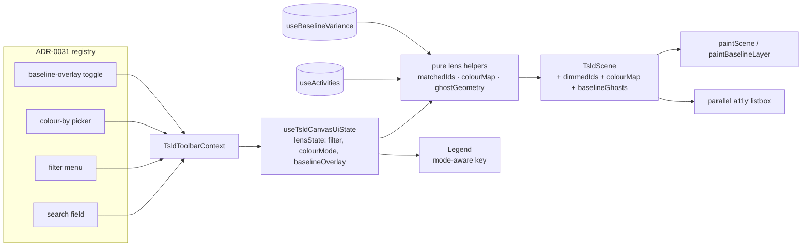
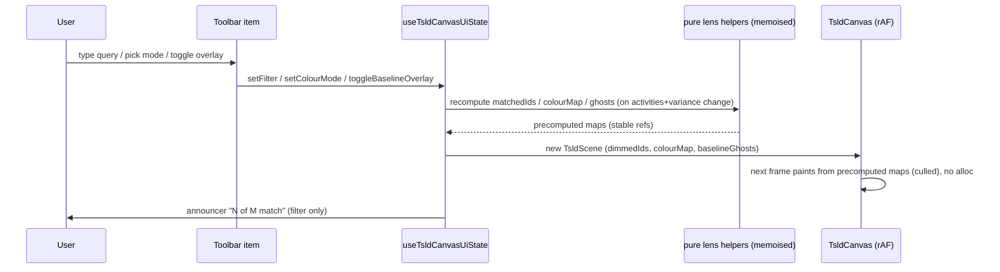
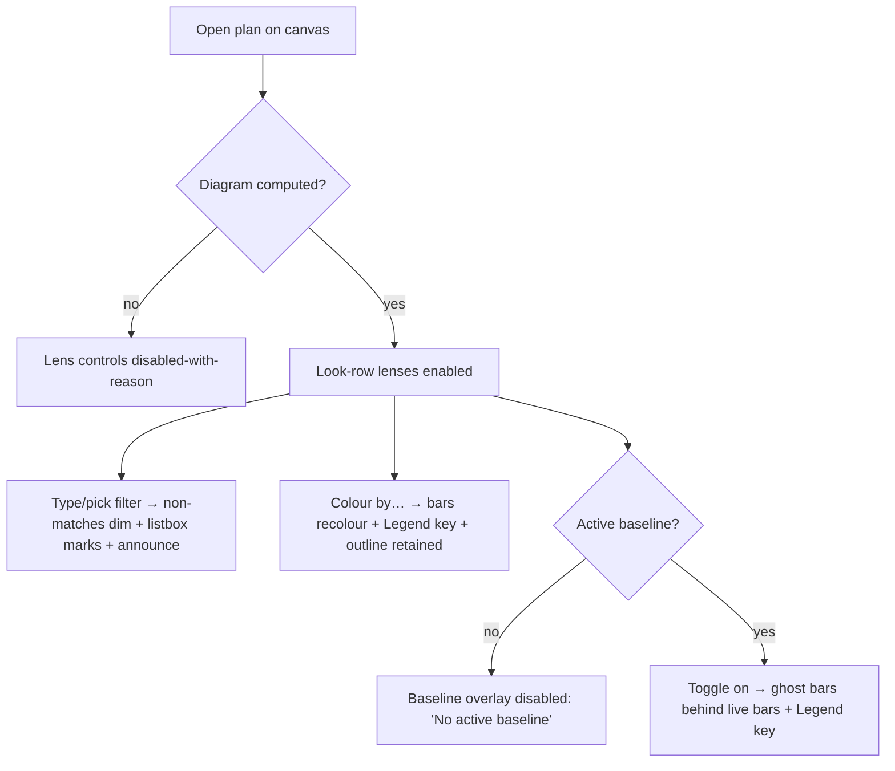

# Feature Spec: TSLD canvas insight lenses

- **Status:** Draft (awaiting approval)
- **Author(s):** feature-analyst (Product Owner / Solution Architect / Technical Lead hats)
- **Date:** 2026-07-19
- **Tracking issue / epic:** _TBD_ — Stage A of the TSLD toolbar-placeholder burn-down
- **Roadmap link:** TSLD toolbar burn-down (`docs/ROADMAP.md`, `docs/TOOLBAR_ROADMAP.md`)
- **Related ADR(s):** none new (layers on ADR-0026 canvas, ADR-0031 toolbar registry,
  ADR-0025 baselines, ADR-0033 scheduling modes, ADR-0038 WBS, ADR-0039 resources).
  A `docs/DECISIONS.md` entry is proposed for the Colour-by mode taxonomy + the
  `TsldScene` lens-layer contract (see §4). **No new architectural boundary — no ADR.**

---

## 1. Business understanding

### Problem

The just-shipped two-row TSLD toolbar (ADR-0031) advertises a full command set, but
three high-value **read lenses** in the Look row are still `placeholderItem()` /
disabled "Coming soon" stubs:

- **Filter / Search activities** (`search` field + `filter` icon) — a planner cannot
  find or isolate activities on a large diagram; they scroll and hunt.
- **Colour by…** (`colour-by`) — bars only ever encode critical/near-critical, so
  float distribution, WBS grouping and resource ownership are invisible on the canvas.
- **Baseline overlay** (`baseline-overlay`) — slip against the active baseline is only
  legible in the activities **table** (variance columns); the canvas, which is the
  primary editing surface, shows nothing.

All the data these lenses need **already ships** (computed server-side, consumed by the
table): `ActivitySummary` carries criticality, float, WBS `parentId` and engine flags;
`useBaselineVariance` returns per-activity baseline dates + variance. This is a pure
**frontend wiring** job — turn three shaded placeholders into real client-side lenses —
with **no** API, schema, `@repo/types`, CPM-engine, or migration change. The recalc
parity gate (`apps/api/src/modules/schedule/engine/`) is not touched.

### Users

Mapped to the organisation role set (ADR-0016). All three lenses are **read-only view
state** — no mutation, no pen — so they are offered to **every** role, viewers included.

- **Planner / Org Admin** — read the plan while authoring: filter to the critical
  chain, recolour by float to spot slack, ghost the baseline to see drift.
- **Contributor** — locate their activities and check progress against baseline.
- **Viewer / External Guest** — inspect a shared plan without a table round-trip.

### Primary use cases

1. Type in the search field to **dim** every non-matching bar (and its listbox row),
   keeping the diagram geometry stable, then clear to restore.
2. Filter by a canvas **attribute** (critical, has-constraint, has-conflict) from the
   Filter menu, combined with the text query.
3. Pick a **Colour by** mode (Criticality (default) / Total-float bucket / WBS group)
   and read the recoloured bars against the mode-aware Legend.
4. Toggle the **Baseline overlay** to draw the active baseline's bars as ghost/outline
   bars behind the live bars, making slip visible in place.

### User journeys

**Happy path (filter):** planner opens a plan → types "concrete" in the search field →
matching bars stay solid, the rest dim to a muted wash (never removed, so lanes/edges
don't reflow); the parallel listbox marks non-matches as filtered out; a live-region
message announces "3 of 214 activities match" → planner clears the field → full opacity
restored.

**Happy path (colour-by):** planner opens Colour by… → picks **Total float** → bars
recolour into float buckets (critical/0, 1–5d, 6–20d, >20d) with the non-colour
critical outline retained; the Legend swaps to the float-bucket key → planner switches
back to **Criticality** → today's colouring returns byte-for-byte.

**Happy path (baseline overlay):** a plan with an active baseline → planner toggles
**Baseline overlay** on → each live bar gains a thin ghost outline bar at the baseline
start/finish behind it; a bar that slipped shows its ghost to the left → the Legend
gains a "Baseline (as captured)" key → toggle off to hide.

**Alternate — no baseline:** the Baseline-overlay control is **disabled with a reason**
("No active baseline") rather than hidden (ADR-0031 shade-don't-hide).

**Alternate — no diagram yet:** all three controls are disabled-with-reason
("Add an activity first") on the empty/uncomputed canvas, matching the zoom cluster.

### Expected outcomes

Three canvas lenses become real, closing three of the ADR-0031 placeholder ids
(`search`+`filter`, `colour-by`, `baseline-overlay`). Planners answer "where is X?",
"where is the slack?" and "are we behind baseline?" **on the canvas**, without leaving
for the table. The toolbar's advertised design gets materially closer to complete.

### Success criteria

- All three lenses operate by **keyboard alone** and are announced (WCAG 2.2 AA); no
  meaning is conveyed by colour alone (WCAG 1.4.1) — legend text + retained shape cues.
- Draw stays within the ADR-0026 budget: **p95 draw ≤ 16 ms @ 2,000 activities** with
  any lens active (measured, not asserted).
- **Flag-off (`VITE_CANVAS_LENSES=false`) is byte-for-byte today's toolbar + canvas** —
  the three ids resolve to their existing placeholder stubs.
- No change to any API response, `@repo/types`, DB, or the engine parity golden suite.

### Open questions

**CRITICAL (answers change scope/design):**

- **CQ-1 — Colour-by v1 attribute set (specifically driving-resource).** Criticality,
  Total-float bucket and WBS group all read fields already on `ActivitySummary`.
  **Driving-resource does NOT** — `ActivitySummary` carries no resource/assignment
  field, so colouring by it needs the separate assignments query (gated behind
  `VITE_RESOURCES`) plus a stable resource→colour mapping. **Assumed default:** v1 ships
  **Criticality (default) + Total-float bucket + WBS group**; **driving-resource is
  deferred** to a fast-follow (added only when `RESOURCES_ENABLED`, reusing this
  machinery). Confirm, or pull driving-resource into v1.
- **CQ-2 — Filter: dim vs hide non-matches.** **Assumed default: DIM** (shade-don't-
  remove) — it keeps the diagram geometry, lanes and edges stable (the brief's ask and
  ADR-0031's shade-don't-hide ethos). Hiding would reflow/cull and destabilise the
  picture. Confirm dim.

**RESOLVED by reconnaissance (stated defaults; not blocking):**

- **CQ-3 — Baseline overlay date source.** `BaselineVarianceRow` (returned by
  `useBaselineVariance`, already consumed by the table) carries `baselineStart` /
  `baselineFinish` as absolute inclusive `YYYY-MM-DD` dates. **The overlay reuses these
  directly** — no baseline-snapshot fetch, no new endpoint. Ghost geometry uses the same
  `activityRect` day-math as live bars.
- **CQ-4 — Ghost lane + removed-in-baseline rows.** Variance rows key by `activityId`
  and carry **no** `laneIndex`. **Default:** each ghost joins the **live** activity's
  current lane (by id), so the ghost sits directly behind its bar — exactly what makes
  slip legible. Rows flagged `removed` (in baseline, no longer live) have no lane and are
  **omitted** from the overlay (the table already lists them).
- **CQ-5 — Near-critical stays a distinct Colour-by "Criticality" band** (today's
  behaviour), i.e. the default mode is byte-identical to current painting.

## 2. Functional requirements

### User stories & acceptance criteria

> **US-1 — Filter / search.** As any role, I want to type a query and/or pick an
> attribute to emphasise matching activities, so that I can find and isolate work on a
> large diagram.
>
> - **Given** a computed diagram **when** I type text in the search field **then**
>   activities whose `{code} {name}` contains the query (case-insensitive) stay at full
>   emphasis and all others **dim** to a muted wash; lanes, edges and positions do not
>   move.
> - **Given** a query **when** I also toggle an attribute in the Filter menu (Critical /
>   Has constraint / Has conflict) **then** the match set is the **intersection** (text
>   AND attributes).
> - **Given** an active filter **then** the parallel listbox marks non-matching options
>   (`aria-disabled` + a "(filtered out)" suffix on the spoken line) and a live-region
>   message states "N of M activities match".
> - **Given** a filter that matches nothing **then** all bars dim and the message reads
>   "No activities match"; the diagram is not blanked.
> - **Given** I clear the field and attributes **then** full emphasis is restored and the
>   message clears.
> - **Given** no diagram (empty/uncomputed canvas) **then** the field + Filter button are
>   disabled with reason "Add an activity first".

> **US-2 — Colour by.** As any role, I want to recolour bars by a chosen attribute, so
> that I can read float, WBS grouping or criticality at a glance.
>
> - **Given** a computed diagram **when** I open Colour by… and pick a mode **then** bars
>   recolour by that mode and the on-canvas Legend swaps to the matching key; the picker
>   reflects the active mode (pressed state).
> - **Given** **Criticality** (default) **then** painting is **byte-for-byte today's**
>   (critical/near-critical fill + solid/dashed outline).
> - **Given** **Total float** **then** bars colour into fixed buckets (critical/≤0,
>   1–5d, 6–20d, >20d; `totalFloat === null` → the neutral "uncomputed" colour).
> - **Given** **WBS group** **then** bars colour by `parentId` via a deterministic,
>   stable palette assignment; ungrouped (null parent) uses the neutral colour.
> - **Given** any non-Criticality mode **then** the critical/near-critical **outline**
>   (shape cue) and the driving-edge weight are **retained** — colour never sole carrier
>   (WCAG 1.4.1); the Legend spells out each band in text.
> - **Given** no diagram **then** the Colour-by control is disabled with reason.

> **US-3 — Baseline overlay.** As any role, I want to ghost the active baseline behind
> the live bars, so that I can see slip on the canvas.
>
> - **Given** a plan **with an active baseline** **when** I toggle Baseline overlay on
>   **then** each live activity that exists in the baseline gets a thin outline "ghost"
>   bar drawn behind it at its `baselineStart`/`baselineFinish`, in its live lane.
> - **Given** the overlay is on **then** the Legend gains a "Baseline (as captured)" key
>   and the toggle shows a pressed state.
> - **Given** a plan with **no active baseline** **then** the control is disabled with
>   reason "No active baseline" (not hidden).
> - **Given** the overlay is on and an activity slipped **then** its ghost sits visibly
>   offset from the live bar; a same-position activity shows the ghost coincident/behind.
> - **Given** the overlay is on **then** the parallel listbox is unchanged (the ghost is
>   a purely visual comparator; variance is already spoken in the table).

> **US-4 — Flag fallback.** As an operator, I want a single kill switch, so that I can
> roll the lenses back instantly.
>
> - **Given** `VITE_CANVAS_LENSES=false` **then** `search`/`filter`/`colour-by`/
>   `baseline-overlay` render as their existing "Coming soon" placeholders and the canvas
>   paints exactly as today.

### Workflows

- **Filter:** field/menu input → update client `lensState.filter` → recompute the
  matched-id set (pure) → scene carries `dimmedIds` → canvas repaints bar emphasis,
  listbox marks non-matches, announcer reports the count.
- **Colour-by:** picker → `lensState.colourMode` → recompute per-activity colour map
  (pure, memoised) → scene carries colour map + mode → canvas paints from precomputed
  fills → Legend re-renders the key.
- **Baseline overlay:** toggle → `lensState.baselineOverlay` → if an active baseline
  exists, join variance rows to live lanes (pure) → scene carries ghost geometry → canvas
  draws the ghost layer beneath bars → Legend gains the key.

### Edge cases

- **Empty / uncomputed canvas** — all three disabled-with-reason (stable toolbar shape).
- **Filter matches all / none** — all solid / all dim; never blank the canvas.
- **Colour-by with `totalFloat === null`** (never recalculated) — neutral bucket.
- **WBS with hundreds of parents** — palette cycles deterministically; the legend caps
  displayed groups and notes "+N more" rather than an unbounded key.
- **Baseline removed rows** (in baseline, no live activity) — omitted from the overlay.
- **Baseline overlay + Late/Visual view source** — the ghost is always the baseline's
  captured dates; the live bar follows the active view source (ADR-0033). Both draw; the
  comparison is baseline-vs-current-view (documented in the Legend copy).
- **Concurrent recalc / activity edits** — lens state is client-only and re-derives from
  the latest `activities`/variance query on every change; no stale coupling.
- **2,000 activities** — precomputed maps + culled ghost layer keep draw within budget.

### Permissions

No new permission. All three are client view state over already-authorised reads
(`useActivities`, `useBaselineVariance`) scoped to the current org/plan (ADR-0012 is
enforced by those existing endpoints). No write, no pen, no role gate beyond "can view
the plan". No IDOR surface is added (no new fetch by id).

### Validation rules

- Search query: trimmed string, case-insensitive substring match on `{code} {name}`;
  empty → no text constraint. No server validation (client-only).
- Colour mode: a closed client enum (`'criticality' | 'totalFloat' | 'wbs'`, plus
  `'resource'` iff CQ-1 pulls it in); default `'criticality'`.
- Float buckets: fixed thresholds, defined once as a pure constant, unit-tested.

### Error scenarios

| Scenario                              | Detection                     | User-facing result                                              | Status |
| ------------------------------------- | ----------------------------- | --------------------------------------------------------------- | ------ |
| Baseline variance query still loading | query `isPending`             | overlay toggle disabled, reason "Loading baseline…"             | n/a    |
| Baseline variance query errors        | query `isError`               | overlay disabled, reason "Baseline unavailable"; no ghost layer | n/a    |
| No active baseline                    | `summary.baselineId === null` | overlay disabled, reason "No active baseline"                   | n/a    |
| No computed diagram                   | `!hasDiagram`                 | all three disabled, reason "Add an activity first"              | n/a    |

No new network calls ⇒ no new HTTP error surface.

## 3. Technical analysis

| Area           | Impact                      | Notes                                                                                                                                                                                                                         |
| -------------- | --------------------------- | ----------------------------------------------------------------------------------------------------------------------------------------------------------------------------------------------------------------------------- |
| Frontend       | **med**                     | New client lens state in `useTsldCanvasUiState`; extend `TsldScene` + `paint.ts`; three real toolbar items; pure filter/colour/geometry helpers; Legend modes.                                                                |
| Backend        | none                        | No module/service/endpoint change.                                                                                                                                                                                            |
| Database       | none                        | No model/migration/index.                                                                                                                                                                                                     |
| API            | none                        | No endpoint/contract/OpenAPI change; reuses `useActivities`, `useBaselineVariance`.                                                                                                                                           |
| Security       | none                        | No new authz surface; no new fetch-by-id; client-only view state.                                                                                                                                                             |
| Performance    | **high (first-class risk)** | Per-bar colour/emphasis + an extra ghost layer each frame — must stay within ADR-0026 draw budget via precomputed maps, culling, zero per-frame allocation; re-verify draw p95 @ 2,000.                                       |
| Infrastructure | **low**                     | One new `VITE_CANVAS_LENSES` flag in `config/env.ts`.                                                                                                                                                                         |
| Observability  | none                        | No new logs/metrics/traces.                                                                                                                                                                                                   |
| Testing        | **med**                     | Unit: filter-match / colour-bucket / baseline-geometry pure fns + toolbar-item predicates + scene mapping. e2e: fold into the flag-on toolbar journey (or a small lenses spec). a11y: keyboard + announce + colour-not-alone. |

### Dependencies

- **Prerequisite (already shipped):** `useActivities` (ADR-0021 activity reads),
  `useBaselineVariance` (ADR-0025), the ADR-0031 toolbar registry + `TsldToolbarContext`,
  the ADR-0026 canvas (`paint.ts`, `render-model.ts`, `TsldScene`), `useTsldCanvasUiState`.
- **Must land first:** nothing new — this is additive wiring.
- **Interacts with:** ADR-0033 view source (`barDateSourceFor`) — the overlay compares
  baseline vs the active-view live dates; the colour map is computed on `ActivitySummary`
  (source-independent inputs like float/critical/parent).
- **Deferred / gated:** driving-resource colouring depends on `VITE_RESOURCES` +
  the assignments query (CQ-1).

## 4. Solution design

### Architecture overview

Three lenses are **client render state** threaded through the existing seam the toolbar
already uses (context → canvas UI state → scene → painter). No component owns new server
state; nothing crosses the API boundary.

### Data flow

### User flow

### Database changes

None.

### API changes

None. Reuses `GET …/plans/:id/activities` and `GET …/plans/:id/baselines/variance`.

### Component changes

All under `apps/web/src/features/tsld/` (+ one flag in `config/env.ts`), reusing design
tokens and the toolbar/menu primitives — no one-off styling.

- **`config/env.ts`** — add `CANVAS_LENSES_ENABLED = flagDefaultOff(import.meta.env.VITE_CANVAS_LENSES)`
  (default OFF during build; flipped to `flagDefaultOn` at M4 enablement).
- **`toolbar/use-tsld-canvas-ui-state.ts`** — add `lensState`
  (`{ filterQuery: string; filterAttrs: Set<attr>; colourMode: ColourMode; baselineOverlay: boolean }`)
  - setters, memoised alongside `viewToggles`. This is **client view state**, exactly like
    the existing view toggles — never server state.
- **`toolbar/tsld-toolbar-context.ts`** — extend `TsldToolbarContext` with the lens
  reads/commands (filter query + setter, filter-attr toggles, colour mode + setter,
  overlay toggle + `hasActiveBaseline`), mirroring how the quick-wins fields were threaded.
- **`toolbar/use-tsld-toolbar-context.tsx`** — populate the new context fields from
  `canvasUi.lensState` + the variance query (`hasActiveBaseline` from
  `useBaselineVariance(...).data?.summary.baselineId != null`).
- **`toolbar/tsld-toolbar-items.tsx`** — behind `CANVAS_LENSES_ENABLED`: replace the
  disabled `SearchFieldControl` with a live search `<Input>`; swap the `filter`,
  `colour-by`, `baseline-overlay` placeholders for real items (a Filter `Menu`, a
  Colour-by `Menu`/segmented picker, a toggle). Each carries `isEnabled`/`disabledReason`
  (diagram / active-baseline gates). Flag-off keeps the shared-shape `placeholderItem()`
  stubs (the undo-redo / quick-wins pattern) so the bar is byte-for-byte unchanged.
- **`render/lenses.ts` (new, pure)** — the unit-tested logic:
  `matchesActivityFilter(activity, query, attrs) → boolean`; `colourKeyFor(activity, mode)`
  - `FLOAT_BUCKETS` thresholds + `buildColourMap(activities, mode) → Map<id, fill>`;
    `buildBaselineGhosts(varianceRows, activitiesById) → GhostBar[]`. No canvas/React.
- **`render/render-model.ts` / `render/paint.ts`** — extend `TsldScene` with optional
  `dimmedIds?: Set<string>`, `barFill?: Map<string,string>` (colour-by override), and
  `baselineGhosts?: readonly GhostBar[]`. `paintScene` reads `barFill` in `barColour`
  (falling back to today's `barColour`), applies a reduced global alpha / muted fill for
  `dimmedIds` members, and draws a **new ghost layer** (outline rects, culled like bars)
  beneath Layer 3. Defaults absent ⇒ **identical output to today**.
- **`components/TsldCanvas.tsx`** — thread the three new scene fields into both
  `sceneRef` build sites (initial + effect) and add ghost drawing to the paint call.
- **`components/TsldPanel.tsx`** — build the dimmed-id set + colour map + ghosts from the
  lens state and the queries; mark filtered-out listbox `<li>`s (`aria-disabled` +
  suffix); announce the match count.
- **Legend (`legend` panel, ADR-0031)** — render a mode-aware key: Colour-by bands and,
  when the overlay is on, the "Baseline (as captured)" entry. Text labels for every band
  (colour-not-alone).

States: **loading** (variance pending → overlay disabled-with-reason); **empty** (no
diagram → all disabled; no baseline → overlay disabled); **active** (lens applied);
**error** (variance error → overlay disabled, no ghost). No new success/toast surface.

### Implementation approach & alternatives

**Chosen — precomputed maps threaded through the existing scene seam.** Keep all new
logic pure and memoised at the mapping/panel layer (`render/lenses.ts` + `TsldPanel`),
hand the painter **precomputed** per-activity fills, a dimmed-id set, and ghost geometry
via `TsldScene`, and let the culled rAF loop draw from them with **no per-frame
allocation**. This preserves the ADR-0026 layered/culled model and the parity of the
default path (absent lens fields ⇒ today's output), and keeps the toolbar registry a thin
reader (ADR-0031). Lens inputs live in `useTsldCanvasUiState` beside `viewToggles`, so
they share the canvas view-state lifecycle and never touch server state.

**Alternatives considered:**

- _Compute colour/dim inside `paint.ts` per frame_ — rejected: per-bar branching + string
  work every frame risks the draw budget at 2,000 activities; precompute-once is cheaper
  and testable.
- _Persist lens choices server-side (per-user plan prefs)_ — rejected for v1: these are
  ephemeral view lenses; a persisted preference is a separate, later concern (note in
  `docs/DECISIONS.md`), and would add an API/schema surface this slice explicitly avoids.
- _Filter by hiding/culling non-matches_ — rejected (CQ-2): reflows the diagram and
  breaks spatial memory; dimming keeps it stable (ADR-0031 shade-don't-hide ethos).
- _Fetch the baseline snapshot for ghost geometry_ — unnecessary: the variance read
  already carries `baselineStart`/`baselineFinish` (CQ-3).

**Architectural significance / ADR:** **None.** This is client render state layered on
existing boundaries (ADR-0026 canvas, ADR-0031 toolbar) with no new module, endpoint,
data contract, or cross-cutting pattern. The two decisions worth recording — the
**Colour-by mode taxonomy** (`criticality | totalFloat | wbs`, buckets + palette rule)
and the **`TsldScene` lens-layer contract** (`dimmedIds` / `barFill` / `baselineGhosts`,
default-absent ⇒ parity) — go in **`docs/DECISIONS.md`**, not a full ADR. If CQ-1 later
pulls driving-resource in, that remains within the same taxonomy (no ADR).

## 5. Links

- Implementation plan: `docs/specs/canvas-lenses/implementation-plan.md`
- Related docs updated by this change: `docs/TOOLBAR_ROADMAP.md` (close 3 placeholder
  ids), `docs/ROADMAP.md`, `docs/DECISIONS.md` (taxonomy + scene contract),
  `apps/web/src/config/env.ts` doc-comment, and the ADR-0031 registry placeholder
  enumeration doc-comment in `tsld-toolbar-items.tsx`.
