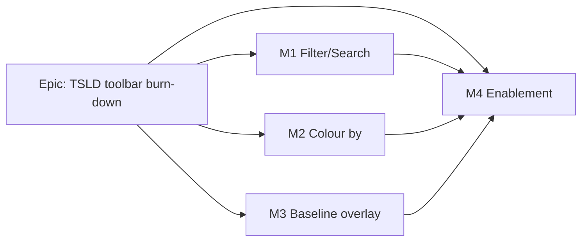

# Implementation Plan: TSLD canvas insight lenses

- **Feature spec:** `docs/specs/canvas-lenses/feature-spec.md`
- **Status:** Approved (2026-07-19). Decisions: **CQ-1** — Colour-by v1 ships Criticality + Total-float
  bucket + WBS group; driving-resource deferred to a fast-follow (needs `VITE_RESOURCES`). **CQ-2** —
  Filter **dims** non-matches (shade-don't-remove). Single flip at M4, one release.
- **Owner:** _TBD_

## Breakdown

### Epic

**TSLD toolbar-placeholder burn-down — Stage A: insight lenses.** Turn three shaded
Look-row placeholders (`search`+`filter`, `colour-by`, `baseline-overlay`) into real
client-side read lenses over already-shipped data. Frontend-only; no API/schema/engine
change; one shared flag `VITE_CANVAS_LENSES`.

**Grouping rationale.** One milestone per lens (M1–M3) plus an enablement milestone (M4),
because the three lenses are independent surfaces sharing only the scene seam and the
flag — they can be built, reviewed and unit-tested in any order without coupling. A
foundational "scene-seam + flag + lens-state" slice is **not** split out: it is thin
enough to ride inside M1 (Task 1), which is the first lens to need it, and M2/M3 then
extend the same `TsldScene`/`lensState` additively. Every milestone merges to `main`
**with the flag off**, so `main` stays releasable throughout; the single flag flips
default-on only at M4 once all three are review-clean. Each milestone is independently
**reviewable/testable** behind `VITE_CANVAS_LENSES=true` in dev/e2e even before the flip.

### Milestone: M1 — Filter / Search (shippable slice, flag-gated)

**Outcome:** with the flag on, a planner types text and/or picks attributes and non-
matching bars dim while the diagram stays stable; the listbox and an announcement reflect
the match set. Establishes the shared seam the later lenses reuse.

---

#### Feature: Client filter over the canvas + a11y layer

> **Description:** the search field + Filter menu, the pure matcher, the `dimmedIds`
> scene field + paint dimming, and the listbox/announce reflection.
> **Complexity:** M
> **Dependencies:** none (additive on shipped seams).
> **Risks:** per-frame dim cost → precompute the dimmed-id set, apply as a cheap alpha/
> fill branch, no allocation; filter/announce chatter → debounce the announcement, not the
> paint.
> **Testing requirements:** unit (matcher, scene mapping, toolbar predicates); e2e/a11y
> folded into the flag-on toolbar journey (keyboard type → dim + announce).

##### Task 1 — Seam + flag + lens state (≈ one PR)

- **Description:** add `CANVAS_LENSES_ENABLED` (`flagDefaultOff`) to `config/env.ts`; add
  `lensState` + setters to `useTsldCanvasUiState`; extend `TsldToolbarContext` and
  `useTsldToolbarContext` with the filter reads/commands; extend `TsldScene` with optional
  `dimmedIds` and thread it through both `TsldCanvas` `sceneRef` sites (default absent ⇒
  no change).
- **Complexity:** M
- **Dependencies:** none
- **Risks:** context memo churn → key the memo on the new values only (follow existing
  comment); scene field must default absent so flag-off paint is byte-identical.
- **Testing:** unit — canvas-ui-state reducer; context assembly; `paintScene` with no
  `dimmedIds` equals baseline snapshot (extend `paint.test.ts`).
- **Development steps:**
  1. Add the flag + doc-comment (mirror `TOOLBAR_QUICK_WINS`/`UNDO_REDO` shape).
  2. Add `lensState`/setters to `useTsldCanvasUiState` (memoised beside `viewToggles`).
  3. Extend the context type + builder (filter query/setter, attr toggles).
  4. Add `dimmedIds?: Set<string>` to `TsldScene`; thread through `TsldCanvas`.
  5. Update `docs/DECISIONS.md` (scene lens-layer contract) + changeset stub.

##### Task 2 — Pure matcher + toolbar controls

- **Description:** create `render/lenses.ts` with `matchesActivityFilter(activity, query,
attrs)`; behind the flag, replace `SearchFieldControl` (disabled) with a live search
  `<Input>` and swap the `filter` placeholder for a real Filter `Menu` (Critical / Has
  constraint / Has conflict). Flag-off keeps the shared-shape placeholder stubs.
- **Complexity:** M
- **Dependencies:** Task 1
- **Risks:** attribute set drift from engine flags → source predicates from
  `ActivitySummary` fields (`isCritical`, `constraintViolated`/`constraintType`,
  `visualConflict`); disabled-with-reason on no diagram (stable shape).
- **Testing:** unit — matcher truth table (text, each attr, intersection, empty); toolbar
  `isEnabled`/`disabledReason` predicates; flag-off renders placeholders.
- **Development steps:**
  1. `render/lenses.ts` matcher + tests (mirror `render-model.test.ts` style).
  2. Live search input + Filter menu items behind `CANVAS_LENSES_ENABLED`.
  3. Wire setters to `lensState`; disabled-with-reason gates.

##### Task 3 — Dim in paint + listbox + announce

- **Description:** compute `dimmedIds` in `TsldPanel` from `lensState` + `activities`;
  `paintScene` renders dimmed bars muted (retaining outlines so criticality shape survives
  the dim); mark filtered-out listbox `<li>`s (`aria-disabled` + "(filtered out)") and
  announce "N of M activities match" (debounced).
- **Complexity:** M
- **Dependencies:** Tasks 1–2
- **Risks:** WCAG — dimmed bars must stay perceivable and the a11y layer must mirror the
  filter (not colour-only) → verify contrast of the dim wash and the listbox marking with
  accessibility-reviewer; announcement must not spam → debounce.
- **Testing:** unit — `TsldPanel` dimmed-set derivation; a11y unit (listbox marking);
  paint dimming snapshot. e2e — type in field → non-matches dim + count announced.
- **Development steps:**
  1. Derive `dimmedIds` (memoised) + pass into the scene.
  2. Paint dim branch (muted fill / reduced alpha, keep outline).
  3. Listbox marking + debounced announce.
  4. Perf spot-check (draw p95 with a filter active).

### Milestone: M2 — Colour by… (shippable slice, flag-gated)

**Outcome:** with the flag on, a planner recolours bars by Criticality (default) /
Total-float bucket / WBS group, with a mode-aware Legend and retained non-colour cues.

---

#### Feature: Colour-by modes + mode-aware Legend

> **Description:** the Colour-by picker, the pure colour-key/bucket/palette logic, the
> `barFill` scene override, and the Legend key per mode.
> **Complexity:** M
> **Dependencies:** M1 Task 1 (scene seam + lens state) — extends the same `TsldScene`.
> **Risks:** colour-only regression (WCAG 1.4.1) → retain the critical/near-critical
> outline + driving-edge weight in every mode and give every band a text legend entry;
> per-frame colour cost → precompute `Map<id, fill>` once, memoised.
> **Testing requirements:** unit (colour-key, bucket thresholds, deterministic WBS
> palette, default-mode parity); component (Legend per mode); e2e (pick mode → recolour +
> Legend swap) folded into the flag-on journey.

##### Task 1 — Pure colour logic

- **Description:** in `render/lenses.ts`: `ColourMode` enum, `FLOAT_BUCKETS`,
  `colourKeyFor(activity, mode)`, `buildColourMap(activities, mode, palette)`; Criticality
  mode returns exactly today's fills (parity).
- **Complexity:** S
- **Dependencies:** M1 T1
- **Risks:** bucket boundaries ambiguous → define once as a documented constant, unit
  fixtures on each boundary; null float → neutral bucket.
- **Testing:** unit — key per mode, each bucket boundary, WBS palette determinism/stability
  across renders, Criticality == baseline fill.
- **Development steps:**
  1. Add enum + buckets + functions + tests.
  2. Resolve palette entries from tokens (extend `palette.ts` with float/WBS band colours).

##### Task 2 — Picker + `barFill` scene + Legend

- **Description:** behind the flag, swap the `colour-by` placeholder for a Colour-by
  `Menu`/segmented picker; add `barFill?: Map<string,string>` to `TsldScene` (paint reads
  it in `barColour`, falls back to today); make `TsldPanel` build the map from
  `lensState.colourMode`; update the Legend to render the active mode's key.
- **Complexity:** M
- **Dependencies:** Task 1, M1 T1
- **Risks:** default path parity → `barFill` absent (Criticality) ⇒ identical paint;
  Legend must stay keyboard-reachable and text-labelled.
- **Testing:** unit — `barColour` honours `barFill` and falls back; component — Legend per
  mode; e2e — pick Total-float → bars recolour + Legend shows buckets.
- **Development steps:**
  1. `barFill` scene field + paint read + thread through `TsldCanvas`.
  2. Colour-by picker item (pressed state = active mode) + placeholder fallback.
  3. Legend mode key + text bands.
  4. Perf spot-check.

### Milestone: M3 — Baseline overlay (shippable slice, flag-gated)

**Outcome:** with the flag on and an active baseline, ghost outline bars draw behind the
live bars at the baseline dates, with a Legend key; disabled-with-reason otherwise.

---

#### Feature: Baseline ghost layer

> **Description:** the overlay toggle, the pure ghost-geometry builder (reusing variance
> `baselineStart`/`baselineFinish` + live lanes), the culled ghost paint layer, and the
> Legend key.
> **Complexity:** M
> **Dependencies:** M1 T1 (scene seam); `useBaselineVariance` (shipped).
> **Risks:** extra draw layer at 2,000 activities → cull the ghost layer exactly like bars
> and precompute geometry; overlay-vs-view-source confusion → Legend copy states "baseline
> as captured vs current"; removed-in-baseline rows have no lane → omit them.
> **Testing requirements:** unit (ghost geometry, lane join, removed-row omission, empty
> baseline); component (Legend key, disabled-with-reason); e2e (toggle → ghost bars) —
> new-or-folded flag-on spec.

##### Task 1 — Pure ghost geometry + gating

- **Description:** in `render/lenses.ts`: `buildBaselineGhosts(varianceRows,
activitiesById)` → `GhostBar[]` (start/finish days + laneIndex from the live activity),
  omitting `removed` rows and rows without live geometry; expose `hasActiveBaseline` on the
  context (from the variance summary).
- **Complexity:** S
- **Dependencies:** M1 T1
- **Risks:** date convention mismatch → reuse the `activityRect` inclusive-finish `+1`
  convention; null baseline dates → skip row.
- **Testing:** unit — ghost list from a variance fixture (slipped, on-time, removed,
  no-active-baseline); `hasActiveBaseline` derivation.
- **Development steps:**
  1. `GhostBar` type + builder + tests.
  2. `hasActiveBaseline` in the context builder from `useBaselineVariance` summary.

##### Task 2 — Toggle + ghost paint layer + Legend

- **Description:** behind the flag, swap the `baseline-overlay` placeholder for a toggle
  (pressed state = on; disabled-with-reason when no active baseline / no diagram / variance
  loading/errored); add `baselineGhosts?` to `TsldScene`; `paintScene` draws a culled
  outline-bar layer beneath Layer 3; Legend gains the "Baseline (as captured)" key.
- **Complexity:** M
- **Dependencies:** Task 1, M1 T1
- **Risks:** ghost must sit behind and read as distinct (outline, muted) without being
  mistaken for a live bar → thin dashed/outline style + legend; draw budget → culled layer,
  no alloc.
- **Testing:** unit — paint ghost layer present only when provided; component — toggle
  gating + Legend key; e2e — toggle on → ghosts appear, off → gone.
- **Development steps:**
  1. `baselineGhosts` scene field + culled outline paint layer + thread through `TsldCanvas`.
  2. Overlay toggle item + gating + placeholder fallback.
  3. Build ghosts in `TsldPanel` from lens state + variance; Legend key.
  4. Perf spot-check (draw p95 with overlay on).

### Milestone: M4 — Enablement (flip + docs)

**Outcome:** after all specialist reviews are green and blockers folded in, the shared flag
defaults on and the three placeholder ids are closed in the docs.

---

#### Feature: Reviews, flip, docs, changeset

> **Description:** run the specialist reviews against all three lenses, fold blockers, flip
> `VITE_CANVAS_LENSES` to `flagDefaultOn`, and land the docs + changeset.
> **Complexity:** S
> **Dependencies:** M1–M3.
> **Risks:** a review blocker forces a design tweak late → keep the flag off until green
> (main stays releasable regardless).
> **Testing requirements:** full flag-on unit + e2e/a11y green; perf re-verified.

##### Task 1 — Specialist reviews + fold blockers

- **Description:** accessibility-reviewer (keyboard, announce, colour-not-alone, dimmed-bar
  perceivability, listbox mirroring), ux-reviewer (state coverage, disabled reasons, Legend
  copy), component-reviewer (toolbar item/menu API, token usage, no one-off styling, shared
  placeholder shapes), performance-reviewer (draw p95 @ 2,000 with each lens + combined).
- **Complexity:** S–M (depends on findings)
- **Dependencies:** M1–M3
- **Testing:** re-run suites after folding blockers.

##### Task 2 — Flip flag + docs + changeset

- **Description:** change `CANVAS_LENSES_ENABLED` to `flagDefaultOn` with the "ON by
  default" rationale doc-comment (mirror the quick-wins/undo-redo comments); update
  `docs/TOOLBAR_ROADMAP.md` (mark the 3 ids done + note driving-resource fast-follow),
  `docs/ROADMAP.md`, `docs/DECISIONS.md` (final taxonomy + scene contract), and the
  ADR-0031 placeholder enumeration doc-comment in `tsld-toolbar-items.tsx`; add a
  **`@repo/web` minor changeset**.
- **Complexity:** S
- **Dependencies:** Task 1
- **Testing:** CI green (lint, typecheck, unit, e2e); Docker/web build.

## Sequencing & slices

1. **M1** (seam + flag + filter) — first, because it lands the shared scene seam +
   `lensState` the others reuse. Merges with flag off.
2. **M2** (colour-by) and **M3** (baseline overlay) — either order; both extend the M1
   seam additively and are independent. Merge with flag off.
3. **M4** — flip + docs once all three are review-clean.

Each of M1–M3 keeps `main` releasable (flag off ⇒ byte-for-byte today). A single flag
means no partial flip: the flip is atomic at M4. Reviewers/e2e exercise each milestone via
`VITE_CANVAS_LENSES=true` before the flip.

**Flag-off fallback (explicit):** with `VITE_CANVAS_LENSES=false` — `search` renders the
disabled `SearchFieldControl`; `filter`, `colour-by`, `baseline-overlay` render their
`placeholderItem()` "Coming soon" stubs; `TsldScene` carries no `dimmedIds`/`barFill`/
`baselineGhosts` (absent) so `paintScene` output is byte-for-byte today's; the listbox is
unmarked and the Legend shows today's key. Nothing else in the toolbar or canvas differs.

## Definition of Done (per task)

Each task's PR satisfies the Feature Completion Criteria in `docs/PROCESS.md` §21: code,
tests (≥80% on changed code; unit for pure lens logic + toolbar predicates + scene mapping;
e2e/a11y for the flag-on journey), docs (TOOLBAR_ROADMAP/ROADMAP/DECISIONS + env + registry
doc-comment), security review (n/a — no new authz surface; confirm with security-reviewer
that no new fetch-by-id/IDOR is added), performance re-verified (draw p95 ≤ 16 ms @ 2,000),
accessibility (WCAG 2.2 AA), Docker build, CI green, `@repo/web` **minor** changeset,
version impact assessed. **No new ADR** (client render state on ADR-0026/0031); the
taxonomy + scene contract are recorded in `docs/DECISIONS.md`.

## Risks & assumptions (rollup)

| Risk / assumption                                                                                                      | Likelihood | Impact | Mitigation                                                                                                                                 |
| ---------------------------------------------------------------------------------------------------------------------- | ---------- | ------ | ------------------------------------------------------------------------------------------------------------------------------------------ |
| Extra per-bar colour/emphasis + ghost layer blows the ADR-0026 draw budget                                             | med        | high   | Precompute colour/dim/ghost maps (memoised); cull the ghost layer; zero per-frame allocation; re-verify draw p95 @ 2,000 as a review gate. |
| Colour-only regression (WCAG 1.4.1)                                                                                    | med        | high   | Retain critical outline + driving-edge weight in every mode; text legend for every band; accessibility-reviewer sign-off.                  |
| Dimmed bars / listbox marking not perceivable enough                                                                   | med        | med    | Contrast-checked dim wash; listbox `aria-disabled` + suffix; announce match count; a11y review.                                            |
| CQ-1 (driving-resource) pulled into v1 late                                                                            | low        | med    | Default defers it; the colour machinery is mode-generic so adding a `resource` mode (gated on `VITE_RESOURCES`) is additive.               |
| WBS palette unbounded / unstable across renders                                                                        | low        | med    | Deterministic id→palette assignment; capped legend with "+N more".                                                                         |
| Baseline overlay confuses baseline-vs-view-source (ADR-0033)                                                           | low        | low    | Legend copy states "as captured vs current"; ghost always uses captured dates.                                                             |
| Single flag ⇒ no partial rollout                                                                                       | low        | low    | Intentional (undo-redo/quick-wins precedent); reviewers use `=true` per milestone; flip atomic at M4.                                      |
| **Assumption:** `BaselineVarianceRow.baselineStart/baselineFinish` are absolute inclusive dates on the live convention | —          | —      | Verified in `packages/types` (CQ-3); if a removed row lacks a lane it is omitted (CQ-4).                                                   |
