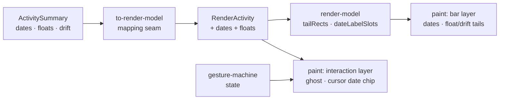

# Feature Spec: Canvas live feedback & GPM float/drift visualisation

- **Status:** Approved
- **Date:** 2026-07-26
- **Related ADR(s):** ADR-0054 (this feature), ADR-0026 (canvas rendering, amended),
  ADR-0052 (direct manipulation, amended), ADR-0033 (scheduling modes — drift datum)

## 1. Business understanding

### Problem

A time-scaled logic diagram exists to answer two questions graphically: **when** does this
happen, and **how much room** does it have. SchedulePoint's canvas currently answers neither
without leaving the diagram.

While manipulating, a planner gets no date — the ghost tracks the pointer but the date being
chosen is not shown anywhere, so placing an activity on a specific day means dropping it,
reading the table, and dragging again. At rest, bars carry a name and a duration but no dates,
and float and drift — both already computed by the engine — are invisible, so slack can only
be read one activity at a time from a panel.

The manipulation also _feels_ less live than it is: the gesture machine tracks every drag
frame-by-frame, but the source bar stays fully painted beneath its ghost, so the eye reads two
shapes instead of one moving one.

### Users

**Planner** (and Org Admin) — the only roles that manipulate the canvas; the pen (ADR-0028)
already gates authoring. **Contributor / Viewer / External Guest** get the read-only half:
dates on bars and float/drift tails are display, not authoring, so they are available wherever
the canvas renders.

### Primary use cases

1. Drag an activity to a specific date and _see that date_ before releasing.
2. Resize a bar and see the tentative finish date, not only the duration.
3. Read a plan's start and finish dates off the diagram without opening the table.
4. See at a glance which activities have slack and how much, across the whole diagram.
5. Ask "why is this activity waiting?" and read the gap on its own logic lines.

### Success criteria

- The date being committed is visible before the pointer is released, for every gesture.
- Start and finish dates are readable on the diagram at day and week zoom.
- Float is comparable between two activities by eye, without selecting either.
- Draw time stays inside the ADR-0026 budget (≤4 ms p95 at 2,000 activities) with every new
  layer enabled — measured, not assumed.

## 2. Functional requirements

| #   | Requirement                                                                                    | Milestone |
| --- | ---------------------------------------------------------------------------------------------- | --------- |
| F1  | While a gesture is in flight, the source bar is dimmed and the ghost carries the bar treatment | M1        |
| F2  | A date chip tracks the cursor during every gesture and on idle hover in an edit mode           | M2        |
| F3  | A vertical guideline joins the cursor to the ruler; the hovered day's tick is emphasised       | M2        |
| F4  | The chip states the datum being chosen (finish on a finish-resize, start on a reposition, …)   | M2        |
| F5  | Start/finish dates draw flanking each bar behind a **Dates** toggle, LOD-culled                | M3        |
| F6  | Total float draws as a hollow tail right of the bar, behind a lens toggle                      | M4        |
| F7  | Drift draws as a hollow tail left of the bar, from engine-owned `visualDriftDays`              | M4        |
| F8  | Tails carry legend entries and a non-colour cue                                                | M4        |
| F9  | Relationship slack annotates the **selected** activity's links only                            | M5        |
| F10 | Flag-off paints byte-for-byte the ADR-0052 surface                                             | all       |

### Out of scope

- Live downstream ripple during a drag (ADR-0054 §1, rejected — needs a second CPM engine).
- Slack annotation on unselected links (ADR-0054 §5, rejected — unreadable at scale).
- Any change to float/drift _computation_; the engine already owns both.

## 3. Technical analysis

Everything needed is already on the wire:

| Datum                   | Source                                       |
| ----------------------- | -------------------------------------------- |
| Start / finish dates    | `ActivitySummary.earlyStart` / `earlyFinish` |
| Total float, free float | `ActivitySummary.totalFloat` / `freeFloat`   |
| Drift                   | `ActivitySummary.visualDriftDays` (ADR-0033) |
| Day ↔ date mapping      | `render-model.dayColumnAt`, `time-scale`     |

`RenderActivity` (the render model's minimal shape) does **not** yet carry float or the raw
dates — it carries a pre-built `label` and the drawn `earlyStart`/`earlyFinish`. M3/M4 extend
it at the existing mapping seam (`to-render-model.ts`); no API call changes.

The pure/shell split holds: geometry and culling decisions are pure functions in
`render/`, the painter consumes them, and the gesture machine is untouched except for M2
reading its existing state to label the chip.

## 4. Solution design

The four additions land on two existing layers. The **bar layer** gains two optional passes
(flanking dates, tails) that run only when their toggle is on and are culled before any text
measurement. The **interaction layer** gains the cursor chip and guideline, and its existing
ghost is restyled to full bar fidelity.

## 5. Risks

| Risk                                          | Mitigation                                                       |
| --------------------------------------------- | ---------------------------------------------------------------- |
| Date labels blow the 4 ms p95 draw budget     | LOD threshold set from a measurement at 2,000 activities (M3/M6) |
| Two more toggles crowd the toolbar            | Both live in the existing View group; overflow handles the rest  |
| Tails read as duration                        | Hollow + hatched, never filled; legend entry                     |
| Drift confusing in Early mode (always absent) | Documented in ADR-0054 §4; legend copy says "Visual mode"        |
