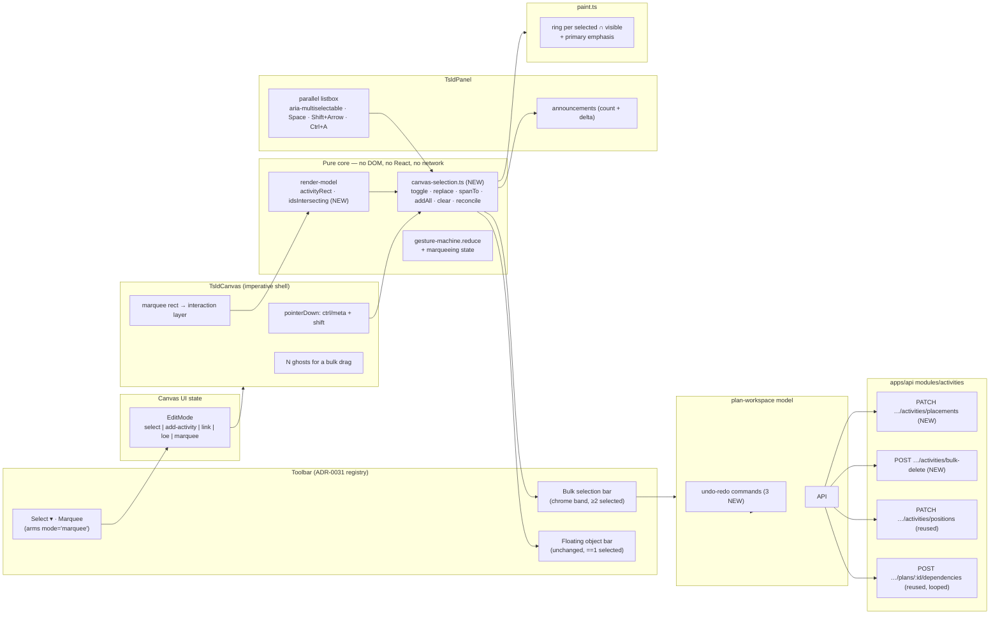
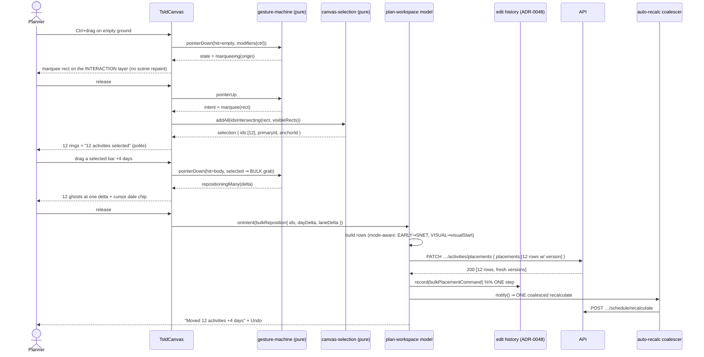
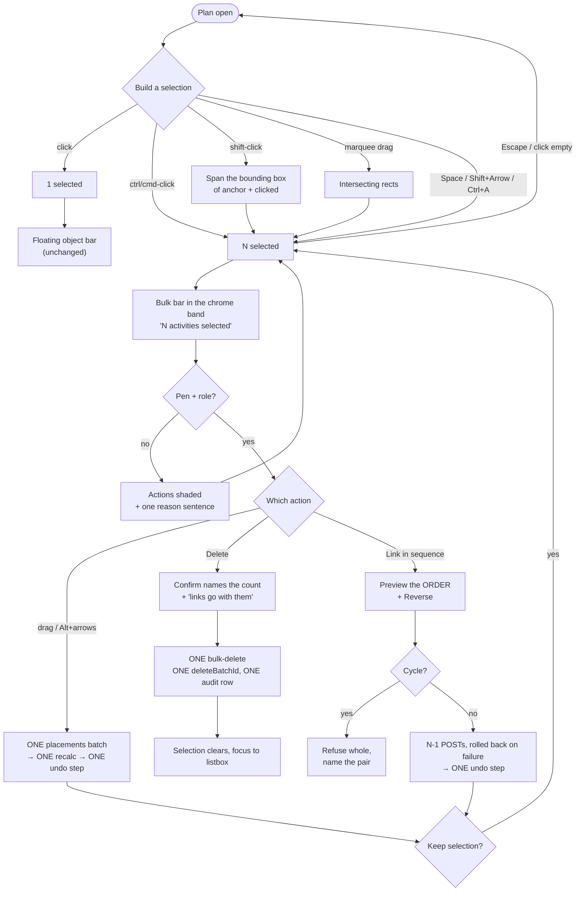

# Feature Spec: Canvas multi-select & bulk operations

- **Status:** Draft — **awaiting approval before implementation**
- **Author(s):** feature-analyst (Product Owner / Solution Architect / Technical Lead hats)
- **Date:** 2026-08-07
- **Tracking issue / epic:** _(to be opened)_
- **Roadmap link:** TSLD canvas capability — planner throughput
- **Related ADR(s):** draft **ADR-0078** (outline in §4.10); builds on ADR-0021, ADR-0022,
  ADR-0026, ADR-0028, ADR-0031, ADR-0032, ADR-0033, ADR-0038, ADR-0048, ADR-0052, ADR-0053,
  ADR-0054, ADR-0055, ADR-0056, ADR-0063, ADR-0064, ADR-0065, ADR-0072, ADR-0073

---

## 0. What was verified before writing this

Per `CLAUDE.md` §19.9 / ADR-0076: the brief is not evidence. The load-bearing claims below were
established by reading the code, not by inheriting them.

| Claim                                                           | Established by                                                                                                                                                                                          |
| --------------------------------------------------------------- | ------------------------------------------------------------------------------------------------------------------------------------------------------------------------------------------------------- |
| Canvas selection is structurally singular                       | `gesture-machine.ts:337` (`select?: string`), `TsldPanel.tsx:430` (`useState<string \| null>`), `paint.ts:240` (`selectedId?: string \| null`), `TsldCanvas.tsx:1772` (`onSelect(hitTest(…))` — one id) |
| No ctrl/cmd-click, no marquee, no range select exists           | `rg 'ctrlKey\|metaKey\|marquee\|lasso\|multiSelect'` over `apps/web/src/features/tsld` returns **zero** functional matches (only "rubber-band" prose about the link drag)                               |
| Only `shift`/`alt` are read as pointer modifiers                | `TsldCanvas.tsx:1468` — `modifiersOf` builds `{ shift, alt }` only; `Modifiers` (`gesture-machine.ts:73-76`) has no ctrl/meta member                                                                    |
| Empty-ground drag is **pan** today                              | `TsldCanvas.tsx:1710-1717` (`pan(viewRef.current, dx, dy)`), and a stationary release falls to `hitTest` select at `:1772`                                                                              |
| Two all-or-nothing batch writes already exist                   | `PATCH …/plans/:planId/activities/positions` (`plan-activities.controller.ts:94`) and `…/parents` (`:126`); DTOs cap at `ArrayMaxSize(2000)`                                                            |
| No batch **date/placement** write and no batch **delete** exist | `activities.controller.ts` exposes only `GET/PATCH/PATCH progress/DELETE/POST dissolve/POST restore` per **single** `:activityId`                                                                       |
| A bulk gesture can be one undo step today                       | `commands.ts:742` `autoArrangeCommand` — one batch, one `Command`, versions threaded from each batch response                                                                                           |
| The table already multi-selects, and excludes summaries         | `ActivitiesTable.tsx:246` (`selectedIds: ReadonlySet<string>`), `:294-300` (`selectableIds` excludes `WBS_SUMMARY`), `:303-312` (selection **derived**, never pruned by an effect)                      |
| "Selecting is a read" is an existing, written rule              | `WbsBulkAssignBar.tsx:30-32` — the bar renders for a reader who cannot write, shaded with a reason; hiding it "would make the checkboxes a dead end"                                                    |
| `Space` in the canvas listbox is already bound                  | `TsldPanel.tsx:1151-1156` — `Space` announces the Tier-2 logic summary (`summarizeLogic`)                                                                                                               |
| An export carries **no** selection ring today                   | `use-tsld-toolbar-context.tsx:435-441` builds the export scene with no `selectedId` field at all                                                                                                        |
| Lane batch + single-activity PATCH are deliberately unaudited   | `audit-coverage.structural.spec.ts:212,218` — both classified `PLAN_CONTENT` (permanently excluded)                                                                                                     |
| A destructive act **is** audited, one row per user action       | `audit-coverage.structural.spec.ts:67`; `activities.service.ts:1101-1122` — one row for a whole cascade, counts in the payload                                                                          |
| The painter is already over ADR-0026's ≤ 4 ms budget            | ADR-0065 measured 16.7–23.1 ms p95 at 2,000 activities; `docs/TECH_DEBT.md` **#75** is the reopened budget                                                                                              |

**What could _not_ be verified:** the brief attributes this gap to "a verified multi-agent canvas
review (2026-08-06)". No such document exists in `docs/` (`rg '2026-08-06'` returns only
ADR-0077-era files). The _gap_ is verified above from the code; the _review_ is taken on the
brief's word and is not cited as evidence anywhere in this spec.

---

## 1. Business understanding

### Problem

**A planner can act on exactly one activity at a time on the surface the product exists to be.**

The TSLD canvas is SchedulePoint's primary editing surface (ADR-0026/0030). Its selection is a
single id — one string, one ring, one floating actions bar. Every daily bulk task therefore
decomposes into N repetitions of a single-activity gesture:

- **Shifting a fragnet in time.** A late material delivery moves twelve activities by four days.
  Today: twelve drags, twelve `PATCH`es, twelve optimistic-version races, twelve chances to drop
  one and leave the fragnet internally inconsistent — and, because a drag in EARLY mode writes a
  `START_NO_EARLIER_THAN` constraint (ADR-0023/0052 §3), twelve chances to mis-pin a date.
- **Deleting scrapped scope.** A variation removes a whole work package. Today: N confirm dialogs,
  N cascades, N `deleteBatchId`s, N audit rows for what was one decision — and N undo steps.
- **Relinking a chain.** Re-sequencing eight activities means seven trips through the Link tool,
  each a two-click pick with its own chance of a reversed direction (the failure ADR-0064 opened on).

The precedent makes the omission sharper rather than softer: **the activities _table_ got
multi-select and a bulk-assign bar in ADR-0063 M4b** — a selection column, an all-or-nothing
version-carrying batch, and the "selecting is a read" rule. The secondary surface can do this; the
primary one cannot. A planner who wants to move twelve bars has to leave the diagram, and the table
cannot express a time shift at all.

**Why now.** Everything this needs has landed and is default-on: the pen (ADR-0028), the toolbar
registry and floating selection bar (ADR-0031), the tool-mode arm/disarm contract (ADR-0064), the
undo command stack (ADR-0048), two all-or-nothing batch endpoints, and the WBS band that already
removes summaries from the scene (ADR-0063). There is no prerequisite left to build.

### Users

| Role                    | Need                                                                                                                                                                                                       |
| ----------------------- | ---------------------------------------------------------------------------------------------------------------------------------------------------------------------------------------------------------- |
| **Planner** (primary)   | Shift a fragnet, scrap a package, chain a sequence — at fragnet scale, on the canvas, in one action that is one undo step.                                                                                 |
| **Org Admin**           | Everything a Planner can do (same permission set), plus the pen override.                                                                                                                                  |
| **Contributor**         | May report progress, not restructure. **Can select** (selecting is a read) and sees the bulk bar shaded with a reason, so the surface is not a dead end.                                                   |
| **Viewer**              | Read-only. Selecting is a read, so multi-select works; every write action is shaded with its reason.                                                                                                       |
| **External Guest**      | **Out of scope.** The share scope is `SCHEDULE_READ` with no actions (ADR-0051); a selection that can do nothing adds nothing. Flag-off parity still covers the share view because it renders `TsldPanel`. |
| **Keyboard / AT users** | Full parity through ADR-0026 D7's parallel listbox: toggle, extend, select-all, clear, and a spoken count on every transition. WCAG 2.2 AA is a merge requirement.                                         |

### Primary use cases

1. **Shift a fragnet in time** — select 5–30 activities, drag (or `Alt+←/→`) once, all move together
   by the same working-day delta; one recalculation; one undo step.
2. **Move a set between lanes** — same selection, vertical drag; layout-only, no recalculation.
3. **Delete scrapped scope** — select, delete once, one confirm naming the count, one undo step.
4. **Link the selection in sequence** — chain the selected activities predecessor→successor in a
   stated, previewable order, cycle-checked before anything is written.
5. **Select by area** — marquee-drag a rectangle over a region of the diagram to pick up everything
   in a phase without clicking each bar.
6. **Refine a selection** — ctrl/cmd-click to add or remove one; shift-click to span; `Ctrl/Cmd+A`
   for the whole plan; `Escape` to clear.

### User journeys

**Happy path (the fragnet shift).** A planner holding the pen arms **Marquee** (or holds Ctrl/Cmd)
and drags a rectangle over the piling sequence. The band above the scene states
_"12 activities selected"_; twelve rings appear, one heavier (the primary). They drag any selected
bar four days right; twelve ghosts move together with the cursor date chip. On release, one
`PATCH …/activities/placements` writes twelve rows all-or-nothing; the coalesced recalculation
redraws; the band says _"Moved 12 activities +4 days"_ with an **Undo**. One `Cmd+Z` puts all twelve
back.

**Alternate — no pen.** The same planner without the lock can select freely (it is a read). The
bulk bar renders with every action shaded and one sentence: _"Start editing to change these
activities."_ Not hidden — the bar is the only place the reason can live (the ADR-0063 M4b rule).

**Alternate — stale version.** Between selection and drop, a colleague's write bumps a row's
version. The batch is refused whole: _"This plan changed since you opened it — nothing moved.
Refresh and try again."_ Nothing is half-moved. **Refresh** refetches, the selection survives (it is
derived against the live list), the planner re-drops.

**Alternate — chain would close a cycle.** Link-in-sequence previews the order
(_"Excavate → Blind → Pour → Excavate"_). The client cycle pre-check runs over the **resulting**
graph — the persisted edges plus every edge the chain would add — and refuses the whole chain,
naming the offending pair. Nothing is written; no partial chain is left behind.

**Alternate — keyboard only.** `Tab` into the listbox, arrow to a row, `Space` to toggle it into the
selection, `Shift+↓` to extend, `Ctrl/Cmd+A` for all. Each transition announces the count. The bulk
bar is the next Tab stop.

### Expected outcomes

- A fragnet shift becomes **one gesture, one write, one undo step** instead of N of each.
- A bulk delete becomes **one confirm, one `deleteBatchId`, one audit row** — matching ADR-0073's
  "one row per user action, never per swept row" rule instead of violating it N times.
- The canvas reaches parity with its own table on selection, and exceeds it on the operations the
  table structurally cannot express (time, lanes, logic).

### Success criteria

| Criterion                                                                        | How it is measured                                                            |
| -------------------------------------------------------------------------------- | ----------------------------------------------------------------------------- |
| A 12-activity time shift completes in **one** user action and **one** HTTP write | Playwright journey asserts exactly one `PATCH …/placements` on the network    |
| That shift is **one** undo step                                                  | Journey: one `Cmd+Z` restores all twelve; asserted against API reads, not DOM |
| A bulk delete of N writes **one** audit row                                      | API e2e asserts `audit_events` row count = 1 with `activityCount: N`          |
| Every gesture has a keyboard equivalent                                          | Component tests per gesture + the flag-on journey driving keyboard only       |
| No new WCAG 2.2 AA failure                                                       | `accessibility-reviewer` pass + axe in the journey + the existing axe suite   |
| The painter's per-frame cost does not grow super-linearly with selection size    | Counting-stub budget test at 2,000 activities, all selected (§4.9)            |
| Flag-off is byte-for-byte the current surface                                    | Flag-off parity suites, kept as the rollback contract                         |
| `computeSchedule` is byte-identical                                              | Structural: no engine import, no new scheduling input (§3, "the parity gate") |

### Open questions

The four **critical** ones are in §6 with proposed defaults. Everything else is decided in this
spec and stated as a default rather than asked.

---

## 2. Functional requirements

### User stories & acceptance criteria

> **US-1 — Toggle one activity in or out of the selection**
> As a Planner, I want ctrl/cmd-click to add or remove one bar, so that I can build an exact set.
>
> **Acceptance criteria**
>
> - **Given** one activity selected **when** I ctrl/cmd-click a second **then** both are selected,
>   both are ringed, and the second becomes the **primary** (it carries the heavier ring + the edge
>   handles).
> - **Given** three selected **when** I ctrl/cmd-click one of them **then** it leaves the selection
>   and the primary falls back to the most recently added survivor.
> - **Given** three selected **when** I plain-click one bar **then** the selection collapses to that
>   one (replace, not extend) — today's behaviour, unchanged.
> - **Given** three selected **when** I plain-click empty ground **then** the selection clears.
> - **Given** the flag is off **when** I ctrl/cmd-click **then** it behaves exactly as a plain click.
> - **Given** a `WBS_SUMMARY` **when** I ctrl/cmd-click it **then** it does not join a plural
>   selection (summaries are not bulk-selectable — §Edge cases), and the reason is announced once.

> **US-2 — Select an area**
> As a Planner, I want to drag a rectangle over the diagram, so that I can pick up a phase without
> clicking each bar.
>
> **Acceptance criteria**
>
> - **Given** the **Marquee** tool is armed **when** I drag on empty ground **then** a rectangle is
>   drawn on the interaction layer and every activity whose bar rectangle **intersects** it is
>   selected on release.
> - **Given** `select` mode **when** I hold Ctrl/Cmd and drag on empty ground **then** the same
>   marquee runs transiently; releasing the modifier and dragging pans as it does today.
> - **Given** a marquee release **when** Ctrl/Cmd is held **then** the result is **added** to the
>   existing selection; **when** it is not **then** it **replaces** it.
> - **Given** a marquee that intersects nothing **then** the selection is cleared and _"No
>   activities in that area"_ is announced.
> - **Given** the Marquee tool is armed **when** I press `Escape` **then** the tool disarms to
>   `select` (the ADR-0064 contract), and the selection is untouched.
> - **Given** the Marquee tool is armed **when** I arm Add / Link / LOE **then** Marquee disarms —
>   one `EditMode`, mutually exclusive by construction.
> - **Given** a bar wider than the marquee (a six-month LOE) **when** the marquee crosses any part of
>   it **then** it is selected (intersect, not contain).

> **US-3 — Span a selection between two bars**
> As a Planner, I want shift-click to select everything between two bars, so that I can take a block
> without a marquee.
>
> **Acceptance criteria**
>
> - **Given** one activity selected **when** I shift-click another **then** every activity whose
>   rectangle intersects the **bounding box of the two** is selected. _(The spatial reading: see
>   §4.4 and CQ-2 — a 2-D time-scaled surface has no list order a planner can predict.)_
> - **Given** nothing selected **when** I shift-click **then** it behaves as a plain click (the
>   clicked bar becomes the anchor).
> - **Given** a shift-click **then** the anchor stays the anchor, so a second shift-click **re-spans**
>   from the same anchor rather than growing monotonically.

> **US-4 — Keyboard parity**
> As a keyboard or screen-reader user, I want every selection gesture from the parallel listbox, so
> that no capability is pointer-only (WCAG 2.1.1).
>
> **Acceptance criteria**
>
> - **Given** the flag is on **then** the listbox carries `aria-multiselectable="true"`; **given**
>   it is off **then** the attribute is absent (a listbox must not advertise a capability it lacks).
> - **When** I press `Space` on a row **then** it toggles in/out of the selection and
>   `aria-selected` reflects the set. _(This rebinds today's `Space` → Tier-2 summary, which moves to
>   `i`. See CQ-1.)_
> - **When** I press `Shift+↓`/`Shift+↑` **then** the selection extends by one row in the listbox's
>   own order, and the count is announced.
> - **When** I press `Ctrl/Cmd+A` **then** every bulk-selectable activity in the plan is selected and
>   the count announced; a second press clears.
> - **When** I press `Escape` in plain `select` mode with ≥ 2 selected **then** the selection clears.
>   With a tool armed or a pick open, `Escape` does what ADR-0064 says it does — the tool wins.
> - **Every** selection transition announces through the existing polite region: the count, and the
>   name of the activity that changed.
> - **When** the selection includes activities outside the viewport **then** the announcement and the
>   visible bar both say so (_"12 selected, 4 off screen"_).

> **US-5 — Shift the selection in time**
> As a Planner, I want to drag any selected bar and move the whole set, so that a fragnet shift is
> one action.
>
> **Acceptance criteria**
>
> - **Given** ≥ 2 selected and the pen held **when** I drag one of them **then** every selected bar
>   shows a ghost at the same day/lane delta.
> - **When** I release **then** exactly **one** `PATCH …/activities/placements` is sent with one row
>   per moved activity, each carrying its own `version`.
> - **Given** EARLY scheduling mode **then** each row writes `START_NO_EARLIER_THAN` at its new
>   start; **given** VISUAL mode **then** each row writes `visualStart` — the same mode-aware rule
>   the single drag follows (ADR-0033/0052 §3).
> - **Given** EARLY mode and ≥ 2 selected **then** the bar states, before the drag,
>   _"Moving in Early mode pins a start-no-earlier-than date on each"_ — because at 12× the
>   single-move side effect this stops being a detail and becomes a plan-shaping decision.
> - **Given** any row's version is stale **then** the whole batch is refused (409), **nothing** moves,
>   and the message says so with a **Refresh**.
> - **When** the batch lands **then** exactly one coalesced recalculation follows, and exactly one
>   `Command` is recorded on the undo stack labelled _"Move 12 activities"_.
> - **Given** a pure lane change (no day delta) **then** the existing `PATCH …/positions` is used
>   instead and **no** recalculation is triggered.
> - **Given** `Alt+←/→/↑/↓` with ≥ 2 selected **then** the same batch runs — keyboard parity, with
>   the existing coalescing so a held key is one net write.

> **US-6 — Delete the selection**
> As a Planner, I want to delete everything selected in one action, so that scrapping a package is
> one decision.
>
> **Acceptance criteria**
>
> - **Given** ≥ 2 selected and the pen held **when** I choose Delete **then** one confirm names the
>   count and the fact that incident links go with them.
> - **When** confirmed **then** one `POST …/activities/bulk-delete` soft-deletes every row under
>   **one** `deleteBatchId`, in one transaction, writing **one** audit row carrying `activityCount`
>   and the cascade counts.
> - **Given** any row's version is stale or any id is not in the plan **then** the whole batch is
>   refused and nothing is deleted.
> - **When** it lands **then** the selection clears, focus returns to the listbox, and **one**
>   `Command` is recorded labelled _"Delete 12 activities"_.
> - **Given** the flag is off **then** Delete is the single-activity action, unchanged.

> **US-7 — Link the selection in sequence**
> As a Planner, I want to chain the selected activities, so that re-sequencing a run is one action.
>
> **Acceptance criteria**
>
> - **Given** ≥ 2 selected and the pen held **then** the bar shows the proposed chain in order
>   (_"Excavate → Blind → Pour"_) with a **Reverse** control, **before** anything is written.
> - **Given** the selection was built by clicking **then** the order is the **pick order**; **given**
>   it came from a marquee or select-all **then** it is early start, tie-broken by lane, then id.
> - **When** I confirm **then** N−1 `POST …/dependencies` are issued in order with the toolbar's
>   armed link type (default FS, lag 0).
> - **Given** the chain would close a cycle **then** it is refused **whole**, before any write, with
>   the offending pair named — checked against the **resulting** graph (persisted edges **plus** the
>   chain's own), not edge-by-edge against the current one.
> - **Given** an edge fails mid-loop **then** every edge this action already created is removed
>   (the `createLoeSpanCommand` roll-back precedent — no orphan), and the failing pair is named.
> - **Given** a selection larger than the cap (default 50) **then** the action is shaded with the
>   reason rather than hidden.
> - **When** it lands **then** it is **one** undo step (undo removes every edge it created).

> **US-8 — See and understand the selection**
> As any user, I want the selection and what it can do to be visible and explained, so that a shut
> action is never a dead end.
>
> **Acceptance criteria**
>
> - **Given** exactly 1 selected **then** the floating object bar renders exactly as today
>   (byte-for-byte — the parity suite pins it).
> - **Given** ≥ 2 selected **then** the floating bar is replaced by a **bulk bar in the chrome band
>   above the scene**, stating the count and offering Move / Delete / Link in sequence / Clear.
> - **Given** the viewer cannot write **then** every write action is shaded with a reason; nothing is
>   hidden.
> - **Given** ≥ 2 selected **then** per-object actions (Edit, Report progress, Steps, Resources,
>   Logic, Dissolve) are **absent**, not shaded — they act on one activity's data and have no
>   plural meaning. The bar says which activity is primary, so the single-object route is one click
>   away.
> - **Given** a selected row is deleted or filtered away underneath the selection **then** the count
>   updates — the selection is **derived** against the live list, never pruned by an effect
>   (`ActivitiesTable.tsx:303-312`, the same rule).

### Workflows

**Build a selection** → click (replace) · ctrl/cmd-click (toggle) · shift-click (span) · marquee
(replace, or add with Ctrl/Cmd) · `Space` (toggle) · `Shift+Arrow` (extend) · `Ctrl/Cmd+A` (all).
Every path funnels through one pure reducer (`features/tsld/model/canvas-selection.ts`), so no two
paths can disagree about what "selected" means.

**Act on a selection** → the bulk bar resolves one of three write paths (§4.5), each pen-gated,
each all-or-nothing at its own granularity, each one undo step.

**Leave a selection** → `Escape` · plain-click empty ground · plan switch · pen loss (the selection
survives pen loss — it is a read — but the actions shade).

### Edge cases

| Case                                                           | Behaviour                                                                                                                                                                                                                               |
| -------------------------------------------------------------- | --------------------------------------------------------------------------------------------------------------------------------------------------------------------------------------------------------------------------------------- |
| **Empty selection**                                            | No bar, no rings — today's state exactly.                                                                                                                                                                                               |
| **Selection of one**                                           | Byte-for-byte today: floating object bar, one ring, edge handles.                                                                                                                                                                       |
| **Select all on a 2,000-activity plan**                        | Allowed. Move and Delete are batch-capped at 2,000 (the existing DTO ceiling); Link-in-sequence is capped at 50 and shades above it with the reason.                                                                                    |
| **`WBS_SUMMARY` in a selection**                               | **Not bulk-selectable.** Its dates are an engine rollup (nothing to move), and its delete is the ADR-0038 subtree cascade with its own confirm. Mirrors the table's `selectableIds` exclusion. Single-select of a summary is unchanged. |
| **Summaries while the WBS band is on**                         | Summaries leave the scene (ADR-0063), so a marquee cannot reach them. The band stays **select-only, single** — a band click replaces the selection with that summary.                                                                   |
| **A selected activity is deleted elsewhere**                   | Derived reconciliation drops it silently; the count updates; no stale id ever reaches a batch.                                                                                                                                          |
| **A selected activity is dimmed by a lens / isolate / filter** | Stays selected (dim-not-hide, ADR-0026). The bulk bar states how many of the selection are currently dimmed, so a planner is not acting on invisible rows blind.                                                                        |
| **Marquee that starts on a bar**                               | Not a marquee — a bar press is a reposition grab (or, with ≥ 2 selected, a bulk reposition grab). The marquee only starts on empty ground.                                                                                              |
| **Marquee with zero area (a click)**                           | Treated as a click on empty ground: clears the selection.                                                                                                                                                                               |
| **Pen lost mid-selection**                                     | Selection survives; every write action shades with the pen reason. The bar is where that reason lives.                                                                                                                                  |
| **Plan switch**                                                | Selection clears (it is per-plan, like the undo stack).                                                                                                                                                                                 |
| **A bulk move where every row's delta is zero**                | No write at all; announced as _"Nothing moved"_.                                                                                                                                                                                        |
| **Link-in-sequence over a selection of one**                   | Action absent (there is no chain), not shaded.                                                                                                                                                                                          |
| **A duplicate edge already exists between two chain links**    | The API rejects it (ADR-0021 duplicate rule); the roll-back removes this action's earlier edges and names the pair.                                                                                                                     |
| **Export / print with a plural selection**                     | Unaffected **by construction** — the export scene sets no `selectedId` at all (`use-tsld-toolbar-context.tsx:435-441`), and the plural selection rides the same scene field. A test pins it.                                            |
| **Guest share view**                                           | Flag has no effect there (out of scope); the flag-off parity suite covers it because it renders `TsldPanel`.                                                                                                                            |

### Permissions

Deny-by-default, RBAC + organisation scope (ADR-0012). **No new permission is introduced.**

| Capability                     | Permission                              | Roles                | Pen (ADR-0028)       |
| ------------------------------ | --------------------------------------- | -------------------- | -------------------- |
| Select / marquee / select-all  | `activity:read` (implicit in plan read) | All members + Viewer | **No** — a read      |
| Bulk placement (time + lane)   | `activity:update`                       | Planner, Org Admin   | **Yes** — structural |
| Bulk lane-only (`…/positions`) | `activity:update`                       | Planner, Org Admin   | **Yes** (existing)   |
| Bulk delete                    | `activity:delete`                       | Planner, Org Admin   | **Yes** — structural |
| Link in sequence               | `dependency:create`                     | Planner, Org Admin   | **Yes** (existing)   |

Permission names verified at `apps/api/src/common/auth/org-permissions.ts:47-59,197-204`.

**"Selecting is a read" is the load-bearing rule** (ADR-0063 M4b): the gesture is never gated on the
write right, because the bulk bar is the only surface that can say why a write is shut. Gating the
selection would reproduce exactly the dead end the WBS epic removed.

### Validation rules

| Rule                                                 | Where                                                                                                                            |
| ---------------------------------------------------- | -------------------------------------------------------------------------------------------------------------------------------- |
| Batch size 1…2,000                                   | `class-validator` `@ArrayMinSize(1) @ArrayMaxSize(2000)` — the existing pair                                                     |
| Every row carries `id` (uuid) + `version` (int ≥ 1)  | DTO, mirroring `ActivityPositionDto`                                                                                             |
| An activity id may appear **at most once** per batch | Service, 422 `DUPLICATE_PLACEMENT_ID` — the `DUPLICATE_POSITION_ID` shape                                                        |
| Every id belongs to this plan + org and is active    | Service; a foreign/deleted id is **404**, never an existence oracle                                                              |
| `laneIndex` 0…10,000                                 | DTO, as `ActivityPositionDto`                                                                                                    |
| A placement row states its fields **completely**     | Nullable-but-required, the `ActivityParentDto` rule — an omitted field is a validation error, never a silent destructive default |
| No `WBS_SUMMARY` in a bulk-delete or placement batch | Service 422 `SUMMARY_NOT_BULK_ELIGIBLE`; client never offers it                                                                  |
| Link chain ≤ 50 edges                                | Client (the write is N single POSTs, each already validated server-side)                                                         |
| Chain is acyclic against the **resulting** graph     | Client pre-check + the server's existing per-edge ADR-0021 check                                                                 |

### Error scenarios

| Scenario                                 | Detection                        | User-facing result                                                                  | Status  |
| ---------------------------------------- | -------------------------------- | ----------------------------------------------------------------------------------- | ------- |
| Not a member / wrong org                 | `resolveScope`                   | Plan not found                                                                      | 404     |
| Role lacks `activity:update` / `:delete` | `assertCan`                      | Friendly forbidden; the bar shades with the reason before the call is ever made     | 403     |
| Pen not held                             | `assertHoldsPen`                 | "Start editing to change these activities"; bar shaded                              | 423     |
| Any row's version stale                  | Set-based UPDATE count shortfall | "This plan changed since you opened it — **nothing** moved. Refresh and try again"  | 409     |
| An id not in this plan                   | Cold-path membership query       | "Activity not found in this plan."                                                  | 404     |
| Duplicate id in the batch                | Service pre-check                | "Each activity may appear at most once."                                            | 422     |
| A summary in a bulk batch                | Service pre-check                | "A WBS summary cannot be moved or deleted in bulk."                                 | 422     |
| Chain would close a cycle                | Client pre-check (+ server)      | "Linking these in this order would create a loop: Pour → Excavate." Nothing written | — / 409 |
| Chain edge fails mid-loop                | Client, per POST                 | Roll back this action's edges; "Couldn't link Blind → Pour; nothing was changed"    | varies  |
| Batch over 2,000                         | DTO                              | Validation error (unreachable from the UI — it caps first)                          | 422     |

---

## 3. Technical analysis

| Area               | Impact                 | Notes                                                                                                                                                                                                                                                                                                                                                                                                                                                                                                                                                                                                                                                                                                                                                  |
| ------------------ | ---------------------- | ------------------------------------------------------------------------------------------------------------------------------------------------------------------------------------------------------------------------------------------------------------------------------------------------------------------------------------------------------------------------------------------------------------------------------------------------------------------------------------------------------------------------------------------------------------------------------------------------------------------------------------------------------------------------------------------------------------------------------------------------------ |
| **Frontend**       | **High**               | New pure model `features/tsld/model/canvas-selection.ts`; `interaction/gesture-machine.ts` (marquee state + modifier plumbing); `components/TsldCanvas.tsx` (ctrl/meta modifiers, marquee branch, multi-ghost); `components/TsldPanel.tsx` (selection state → set, listbox keymap, announcements); `render/paint.ts` (ring loop, primary distinction, marquee rect); `toolbar/selection-actions.tsx` (two faces); new `toolbar/bulk-selection-bar.tsx`; `toolbar/use-tsld-canvas-ui-state.ts` (`marquee` mode); `features/undo-redo/commands.ts` (3 commands); `components/layout/workspace/use-plan-workspace-model.ts` (bulk handlers); `config/env.ts` (the flag).                                                                                  |
| **Backend**        | **Medium**             | `modules/activities`: one new batch placement route + one bulk-delete route on `PlanActivitiesController`, two DTOs, two service methods, repository set-based updates. Reuses `HierarchyLifecycleService.cascadeSoftDelete` and the plan advisory lock. No new module.                                                                                                                                                                                                                                                                                                                                                                                                                                                                                |
| **Database**       | **None**               | No models, migrations, indexes or constraints. Every column written already exists (`constraint_type`, `constraint_date`, `visual_start`, `lane_index`, `deleted_at`, `delete_batch_id`, `version`).                                                                                                                                                                                                                                                                                                                                                                                                                                                                                                                                                   |
| **API**            | **Medium**             | Two new endpoints under the existing plan-scoped controller, standard `{data,meta}` envelopes, full OpenAPI (`@ApiOkResponse` / `409` / `422` / `404` / `ApiLockedResponse`). No versioning change, no breaking change.                                                                                                                                                                                                                                                                                                                                                                                                                                                                                                                                |
| **Security**       | **Low — but reviewed** | New write endpoints ⇒ **`security-reviewer` is required**. Same deny-by-default shape as the two existing batches: `resolveScope` → `assertCan` → `loadActivePlan` (404 for foreign) → `assertHoldsPen` → set-based UPDATE re-asserting `organizationId + planId + deletedAt: null` (anti-IDOR by construction). No new permission, no new principal, no unauthenticated surface.                                                                                                                                                                                                                                                                                                                                                                      |
| **Performance**    | **Medium**             | **Server:** one set-based statement per batch replaces N round trips — strictly cheaper than what the client does today (the GROUP-delete `unnest` lesson, ADR-0053 M6, applies: never a per-row loop under a lock). **Client:** the ring loop is O(visible ∩ selected); the marquee predicate is O(visible) once per release, not per frame; the per-frame obstacle-free draw is unchanged. **Honest limit:** the painter already runs 16.7–23.1 ms p95 at 2,000 (ADR-0065) against ADR-0026 §16's ≤ 4 ms — `docs/TECH_DEBT.md` **#75** owns that. This epic must not make it worse and cannot fix it; the counting-stub gate asserts the shape, and one browser-measured run at 2,000 activities with all selected is reported in the enablement PR. |
| **Infrastructure** | **Low**                | One new Playwright project (`playwright.multi-select.config.ts`, `apps/web/e2e-multi-select/`, `test:e2e:multi-select`) plus its CI step — the 26th flag-scoped suite.                                                                                                                                                                                                                                                                                                                                                                                                                                                                                                                                                                                 |
| **Observability**  | **Low**                | Two `logger.info` lines mirroring `updatePositions`/`updateParents` (org, plan, user, count). **Audit:** bulk delete is **audited** (family D, one row, `activityCount` + cascade counts); the placement batch is **unaudited** as `PLAN_CONTENT`, consistent with its two siblings (`audit-coverage.structural.spec.ts:212,218`). Both routes must be added to the census or the structural spec fails — which is the gate working.                                                                                                                                                                                                                                                                                                                   |
| **Testing**        | **High**               | Unit (selection reducer, marquee geometry, gesture machine, chain order + cycle pre-check, three undo commands); component (bulk bar faces, listbox keymap, announcements, shaded reasons); budget counting stub; API e2e (Supertest: happy, 403, 423, 409 all-or-nothing, 404 cross-plan, 422 duplicate/summary, audit row count); flag-off parity suites; one flag-on Playwright journey against a real API **with the pen enforced** — the only place the optimistic-`version` trap is testable at all (ADR-0060 M6's lesson).                                                                                                                                                                                                                      |

### The recalc parity gate

**It holds structurally, and here is why rather than an assertion.**

1. **No engine import.** No file this epic touches imports `computeSchedule`; the two new service
   methods do not call the engine, exactly as `updatePositions`/`updateParents` do not.
2. **No new scheduling input.** The placement batch writes `constraint_type`, `constraint_date`,
   `visual_start` and `lane_index` — four columns the engine already reads (or, for `lane_index`,
   has never read: it is presentation, ADR-0069). It adds no column, no enum value, no flag.
3. **A new door onto an existing write.** A bulk placement writes the same field values the existing
   single `PATCH /activities/:activityId` writes when a bar is dragged. Given identical persisted
   inputs, `computeSchedule` produces identical output because it is the same function over the same
   arguments.
4. **Bulk delete is soft delete.** Deleted rows are already excluded from the engine's input set.
5. **Everything else is paint and client state.**

Therefore the ADR-0034 golden suites are untouched and the parity gate is trivially satisfied. The
one thing worth watching, and it is a correctness rather than a parity concern: a bulk placement
leaves the plan's computed dates **stale until the next recalculation**, exactly like
`updateParents` — so the client's coalesced recalc must fire after the batch, and the API doc says
so in the same words the `parents` route uses.

### Dependencies

- **Prerequisites — all landed and default-on.** `VITE_TSLD_EDITING`, `VITE_PLAN_EDIT_LOCK`,
  `VITE_CANVAS_WORKSPACE`, `VITE_CANVAS_TOOLBAR`, `VITE_CANVAS_AUTHORING`,
  `VITE_CANVAS_DIRECT_MANIPULATION`, `VITE_CANVAS_AUTHORING_FLOW`, `VITE_UNDO_REDO`,
  `VITE_WBS_IMPROVEMENTS`, `VITE_CANVAS_LIVE_FEEDBACK`. Nothing must land first.
- **Affected features.** The floating selection bar (ADR-0031) gains a sibling; the tool-mode
  contract (ADR-0064) gains a fifth mode; the undo stack (ADR-0048) gains three commands; the audit
  census (ADR-0073) gains two routes; the WBS band (ADR-0063) stays single-select and says so.
- **Deliberately out of scope.** The Gantt view (ADR-0059 is read-only by design; its M5 editing
  slice is where multi-select belongs there, if ever). The guest share view. Pre-existing debt rows
  **#28** (canvas ring/stroke colour treatment), **#31** (the floating bar covers the lane above),
  **#48** (export/print fast-follows), **#51** (`classifyHit` iterates all activities per call),
  **#56** (pure gesture helpers living in `TsldCanvas.tsx`) and **#75** (the draw budget) are known
  and **not** addressed here. #51 and #56 are the two this epic touches nearest; each is called out
  in the plan's risk table with the reason it is not being folded in.

---

## 4. Solution design

### 4.1 Architecture overview

Nothing architecturally new is introduced on the client: the change lives at four existing seams —
the **pure selection model** (new, but a sibling of the existing pure `render-model` /
`gesture-machine` core), the **gesture machine**, the **painter's scene**, and the **toolbar
registry**. On the server it is two more members of an existing family of two.



**The load-bearing structural choice:** every path that changes the selection — pointer, marquee,
keyboard, band, `Next conflict` signal, delete reconciliation — calls **one pure reducer**. Two
selection implementations would drift, and the drift would be invisible: each looks right alone and
only a planner who built the same set two ways would ever see one is wrong. This is the ADR-0065
`routeOrthogonal` rule and the ADR-0063 `wbs-groups` rule applied to selection.

### 4.2 The selection model

```ts
/** The canvas selection. Pure data; no React, no DOM. */
export interface CanvasSelection {
  /** Selected activity ids in the order they were added (pick order). Never contains duplicates. */
  readonly ids: readonly string[];
  /**
   * The activity single-select consumers act on: the last id added, or the sole id.
   * `null` iff `ids` is empty. It is a DERIVED-but-stored field, not a re-derivation, because
   * removing the primary must fall back to a *stable* survivor, and "last added" is only knowable
   * from the transition, not from the resulting set.
   */
  readonly primaryId: string | null;
  /** The anchor a shift-click spans from — the last id set by a plain click or a toggle. */
  readonly anchorId: string | null;
}
```

Reducers (all pure, all exhaustively unit-testable):
`replace(id)` · `toggle(id)` · `spanTo(id, rects)` · `addAll(ids)` · `clear()` ·
`reconcile(selection, liveIds)`.

**`reconcile` is derived at read time, never an effect** — the `ActivitiesTable.tsx:303-312` rule:
"a row deleted underneath the selection cannot leave the bar counting an activity that is no longer
there — a count that would then disagree with the batch actually sent."

**How each single-select consumer degrades**, stated per consumer because "it reads the primary" is
too glib for three of them:

| Consumer                                                         | With ≥ 2 selected                                                                                                                                                                                                                      |
| ---------------------------------------------------------------- | -------------------------------------------------------------------------------------------------------------------------------------------------------------------------------------------------------------------------------------- |
| Floating object-actions bar (ADR-0031)                           | **Replaced** by the bulk bar. Not extended — see §4.7.                                                                                                                                                                                 |
| `onSelectionChange` → workspace (progress / note / clear-visual) | Receives the **primary**, unchanged signature. Its four consumers are per-activity by nature; repurposing the callback would silently change what they do. A **second** callback `onSelectionSetChange(ids)` feeds the bulk consumers. |
| Isolate logic path (`computeLogicPath(selectedId,…)`)            | **Primary only**, and the mode band says whose path is isolated. A union of N paths dims almost nothing on a dense plan, which reads as the lens being broken.                                                                         |
| Float-paths emphasis                                             | **Primary only**, same reason. Its own panel selection is unaffected.                                                                                                                                                                  |
| Link-slack chips (`toggles.linkSlack && selectedId`)             | **Primary only** — N × chips on every incident tie is a wall of numbers, not a reading.                                                                                                                                                |
| Incident-link highlight                                          | **Whole set** — it is a per-bar decoration and it composes.                                                                                                                                                                            |
| Edge handles (`showEdgeHandles`)                                 | **Primary only** — a handle is a single-bar affordance that starts a single-bar gesture.                                                                                                                                               |
| Selection ring                                                   | **Whole set**; the primary gets a heavier ring **and** the handles, so "which one Edit would act on" is not colour-only (WCAG 1.4.1).                                                                                                  |
| Canvas reveal-on-select (pan to show)                            | **Primary only**; a marquee never pans (the planner is looking at the area they just dragged).                                                                                                                                         |
| WBS band selection                                               | **Single**, unchanged. A band click replaces the selection.                                                                                                                                                                            |

### 4.3 Data flow — the fragnet shift



### 4.4 User flow



### 4.5 Gesture decisions, and why

**Ctrl/Cmd-click toggles.** Accept `e.ctrlKey || e.metaKey` (both, unconditionally — the app already
treats the pair as one in its undo keybinding). Verified free: `modifiersOf` reads only shift/alt.

**Shift-click spans a rectangle, not a list range.** On a time-scaled 2-D diagram, x is time and y is
lane; there is no total order a planner can predict. A list-order range would use the `activities`
array order, which is the API's list order — so shift-clicking two visibly adjacent bars could
select forty the planner cannot see are included. That is worse than having no shift-click. The
rectangle between the two bars is the only reading both axes support, **and it shares one predicate
with the marquee** (`idsIntersecting`), so the two can never disagree.

_Shift is not free._ In the flag-off legacy edge-drag link path, Shift means SS
(`modifiersToLinkType`). Under `VITE_CANVAS_DIRECT_MANIPULATION` (default-on) that path is dead —
handles downgrade to `body` at `TsldCanvas.tsx:1571-1574` — so the two never coexist in the shipped
configuration. To make that structural rather than incidental, **the new flag is `AND`-ed with
`CANVAS_DIRECT_MANIPULATION_ENABLED`** (the ADR-0062/0065 derived-flag precedent).

**Marquee is both a tool mode and a modifier drag, and they are one implementation.**

| Option                                            | Verdict                                                                                                                                                                                                                                                                                                         |
| ------------------------------------------------- | --------------------------------------------------------------------------------------------------------------------------------------------------------------------------------------------------------------------------------------------------------------------------------------------------------------- |
| Marquee on plain empty-ground drag; pan moves off | **Rejected.** Pan is the most-used gesture on the canvas; taking it away to add a rarer one is a bad trade, and every alternative pan trigger (space-drag, middle-drag) collides with the listbox keymap or with laptop trackpads.                                                                              |
| Ctrl/Cmd + empty-ground drag only                 | **Rejected alone** — undiscoverable. ADR-0064's finding was a Link trigger that armed nothing; a capability nobody can find is the same defect wearing different clothes.                                                                                                                                       |
| A `marquee` tool mode only                        | **Rejected alone** — a mode change for the commonest bulk gesture.                                                                                                                                                                                                                                              |
| **Both, one code path**                           | **Chosen.** The `Select` toolbar item becomes a split-button offering **Marquee select**; Ctrl/Cmd+drag runs the same marquee transiently in `select` mode. The mode participates fully in ADR-0064: arming disarms Add/Link/LOE, `Escape` returns to `select`, the band states it, every transition announces. |

**Intersect, not contain.** A six-month LOE bar is wider than any practical marquee; "fully
contained" would make exactly the longest, most-worth-selecting bars unselectable.

**Rects come from `activityRect`** — the same function the bar layer draws from, so a bar the planner
can see inside the rectangle is a bar that gets selected. A second geometry opinion would disagree
precisely when it mattered (ADR-0065's rule).

### 4.6 Keyboard & AT design

The parallel listbox (ADR-0026 D7) becomes an APG **multi-select** listbox when the flag is on, and
stays single-select when it is off. `aria-multiselectable` is flag-gated because an attribute that
advertises a capability the widget lacks is worse than a missing feature.

| Key                                               | Flag on                                       | Flag off (unchanged) |
| ------------------------------------------------- | --------------------------------------------- | -------------------- |
| `↑` / `↓` / `Home` / `End`                        | Move active option, **replace** selection     | Same                 |
| `Space`                                           | **Toggle** the active option (APG)            | Tier-2 logic summary |
| `i`                                               | **Tier-2 logic summary** (moved here)         | _(unbound)_          |
| `Shift+↑` / `Shift+↓`                             | Extend the selection by one row               | _(unbound)_          |
| `Ctrl/Cmd+A`                                      | Select all bulk-selectable; again ⇒ clear     | _(browser default)_  |
| `Escape`                                          | ADR-0064 ladder, **then** clear the selection | ADR-0064 ladder      |
| `Enter`, `[`, `]`, `n`, `Alt+arrows`, `Shift+←/→` | Unchanged (act on the **primary**)            | Unchanged            |

**The `Space` rebinding is the one real cost, and it is deliberate.** APG's multi-select convention
is `Space` toggles; a screen-reader user who tries what their reader documents must get the
documented result. Keeping `Space` as the summary and putting toggle on `Ctrl+Space` would break
that; making `Space` mean different things depending on how many rows are selected is the ADR-0060
"one gate that cannot say which is missing" failure in miniature. So `Space` toggles and the summary
moves to `i`, the shortcuts help is updated, and **the flag-off parity suite pins `Space` = summary**
as the rollback contract. This is CQ-1.

**Announcements** ride the existing single polite region (`useAnnounce`) — never a second one
(`CanvasModeBand`'s docblock names the double-speak risk). Every transition says the count and what
changed; a selection with members outside the viewport says how many.

### 4.7 The selection bar's evolution — two faces, not a superset

ADR-0031's floating bar exists for **one object**. With ≥ 2 selected:

- **It does not float.** A plural selection has no single bar to sit over; a bounding-box anchor can
  leave the viewport entirely, and ADR-0064's "the canvas already carries three overlays and a
  fourth eventually lands on the bar you meant to click" applies with more force to a bar that
  covers a whole region. The bulk bar renders in the **reserved chrome band above the scene**, beside
  `CanvasModeBand`. It is also the one place with room for a chain-order preview.
- **Its actions are not a plural superset of the object actions.** Edit, Report progress, Steps,
  Resources, Logic and Dissolve act on one activity's data and have no plural meaning — a
  "report progress for 12" is a different feature (per-activity data entry), not a bulk button. They
  are **absent**, not shaded, and the bar names the primary so the single-object route is one click
  away. Shading them would promise something that does not exist; hiding them without naming the
  primary would be the dead end.
- **What it does offer:** the count (and how many are off screen / dimmed), **Move** (stated, not a
  button — the gesture is the drag; the bar carries the EARLY-mode SNET caveat), **Delete**,
  **Link in sequence** (with the order preview + Reverse), **Clear selection**.
- **It renders for readers who cannot write**, shaded with the reason — the `WbsBulkAssignBar`
  rule verbatim.
- **`aria-disabled`, never the native attribute** — the `ScopeSaveBar` / `WbsBulkAssignBar` lesson
  (`WbsBulkAssignBar.tsx:121-127`): a natively disabled button blurs to `<body>` the moment it flips,
  and these flip twice per action.
- **One status line**, `aria-describedby`-linked to the action it explains — not merely adjacent
  (`WbsBulkAssignBar.tsx:156-160`: "proximity is not association").

### 4.8 API changes

Both routes go on the existing `PlanActivitiesController`
(`/api/v1/organizations/:orgSlug/plans/:planId/activities`), built to `docs/REFERENCE_FEATURE.md`
starting from `updatePositions` / `updateParents` as the exemplars.

#### `PATCH …/activities/placements`

Batch **placement** write: a complete row per activity stating where it goes in time and lane.

```jsonc
{
  "placements": [
    {
      "id": "uuid",
      "version": 7,
      // Mode-aware, and complete rows (the ActivityParentDto rule): each field is
      // REQUIRED-BUT-NULLABLE, never @IsOptional — an omitted field must be a validation
      // error, not a silent destructive default.
      "constraintType": "START_NO_EARLIER_THAN", // or null to clear
      "constraintDate": "2026-04-13", // or null
      "visualStart": null, // or "YYYY-MM-DD" in VISUAL mode
      "laneIndex": 4, // optional: omit ⇒ lane unchanged
    },
  ],
}
```

- **Responses.** `200` → the moved rows with fresh `version`s (so the client reconciles optimistic
  state and the undo command can thread versions — the `updatePositions` contract).
  `403` role · `404` foreign/unknown plan or id · `409` any stale version (**whole batch refused**)
  · `422` duplicate id / summary in batch / field validation · `423` no pen.
- **Semantics.** All-or-nothing, one set-based `UPDATE` keyed by `id + version` re-asserting
  `organizationId + planId + deletedAt IS NULL`; count shortfall rolls the transaction back and the
  cold path spends one query to distinguish 404 from 409 (the `updatePositions` pattern verbatim).
- **Structural**, like `parents`: it leaves the plan's computed dates stale until the next
  recalculation, and the OpenAPI description says so in those words.
- **Not a definition PATCH.** It carries placement fields and nothing else — a bulk move must not be
  able to rename forty activities.
- **Audit:** unaudited, `PLAN_CONTENT` — the same class as its two siblings
  (`audit-coverage.structural.spec.ts:212,218`). Recorded in the census with that reason.

**Why a complete-row batch and not a server-computed `POST …/shift { deltaDays }`.** The delta verb
is attractive (one number, calendar arithmetic where the calendars live), but the client already does
this arithmetic for the single drag (the gesture machine yields `startDay`; `TsldPanel` maps it),
and the repo has two complete-row batch precedents and no verb precedent. Consistency with a family
of two beats novelty. Recorded as CQ-3 in case the product owner wants the delta shape.

#### `POST …/activities/bulk-delete`

```jsonc
{ "ids": ["uuid", "…"], "versions": [7, 3] } // parallel arrays rejected — see below
```

Actual shape, matching the family: `{ "activities": [{ "id": "uuid", "version": 7 }, …] }`.

- **Responses.** `204` (or `200` with the batch id — see below) · `403` · `404` · `409` stale ·
  `422` duplicate id / a `WBS_SUMMARY` in the batch · `423` no pen.
- **Semantics.** One transaction; `cascadeSoftDelete` per row **sharing one `deleteBatchId`**, so the
  whole action restores as one cohesive batch. **One** audit row — `activity.deleted`, subject =
  the **PLAN** with `activityCount` + cascade counts — following the `activity.reparented` precedent
  where a batch's subject is the plan because there is no single activity it happened to
  (`activities.service.ts:846-888`). Deliberately **not** one row per swept activity: ADR-0073 C3.1's
  rule is "one row per user action, never per swept row".
- **Summaries are refused** (422), so a bulk delete is always leaf-only and therefore always
  cascade-shallow. That is what makes the undo story clean (§4.9).
- Returns the `deleteBatchId` so the client can offer a batch restore if CQ-4 is answered "build it".

#### Optionally (CQ-4): `POST …/plans/:planId/activities/restore-batch/:batchId`

Restores every activity soft-deleted under one batch id, **id-stable, links intact** — which is what
makes undoing a bulk delete actually correct. This is ADR-0048's deferred M4 ("id-stable /
cascade-clean restore… reusing soft-delete / `deleteBatchId`, no schema change"), and a bulk delete
is the first operation that makes it worth its cost. Scoped as an optional task, not assumed.

### 4.9 Client changes

**New files**

| Path                                           | What                                                      |
| ---------------------------------------------- | --------------------------------------------------------- |
| `features/tsld/model/canvas-selection.ts`      | The pure selection model + reducers (§4.2)                |
| `features/tsld/model/chain-order.ts`           | Pure chain ordering + the resulting-graph cycle pre-check |
| `features/tsld/toolbar/bulk-selection-bar.tsx` | The plural face (§4.7)                                    |
| `apps/web/e2e-multi-select/`                   | The flag-on journey + its config + script + CI step       |

**Changed files** (each a stated seam, not a sprawl): `interaction/gesture-machine.ts` (a
`marqueeing` state + a `repositioningMany` state, both pure), `render/render-model.ts`
(`idsIntersecting(rect, rects)` — one exported predicate), `render/paint.ts` (`selectedIds` on the
scene beside the retained `selectedId`; ring loop; primary emphasis; marquee rect on the interaction
layer), `components/TsldCanvas.tsx` (modifier plumbing, marquee branch, N ghosts),
`components/TsldPanel.tsx` (selection state, listbox keymap, announcements, bar switch),
`toolbar/use-tsld-canvas-ui-state.ts` (`'marquee'` mode), `toolbar/selection-actions.tsx` (unchanged
behaviour for 1; the panel chooses which bar), `features/undo-redo/commands.ts` (three commands),
`components/layout/workspace/use-plan-workspace-model.ts` (bulk handlers + `onSelectionSetChange`),
`config/env.ts` (the flag).

**Undo/redo — three commands, all discrete, none coalescing.**

| Command                | Shape                                                                                                                 | Modelled on                                 |
| ---------------------- | --------------------------------------------------------------------------------------------------------------------- | ------------------------------------------- |
| `bulkPlacementCommand` | before/after row snapshots; undo and redo each issue **one** `placements` batch; versions threaded from each response | `autoArrangeCommand` (`commands.ts:742`)    |
| `bulkDeleteCommand`    | undo re-creates every row (or, with CQ-4, restores the batch id-stably); redo re-deletes                              | `deleteActivityCommand` + `existenceToggle` |
| `linkChainCommand`     | undo deletes every edge this action created; redo re-creates them in order                                            | `createLoeSpanCommand` (`commands.ts:506`)  |

**None of the three carries a `coalescing` descriptor.** A bulk drag commits **once** on release (the
ghosts are client-side), so there are no intermediate writes to fold; and coalescing two actions over
different id-sets would produce an undo that restores a set nobody ever selected.

**Paint budget.** A new counting-stub gate in the `paint.dates-budget.test.ts` family, asserting the
**shape** of the cost, not a millisecond count (a CI runner's absolute timings are noise):

- rings drawn == |selected ∩ visible|, and **zero** when the selection is empty;
- selecting 2,000 activities multiplies **no other layer's** call count;
- the marquee rect costs the scene layer nothing (it is drawn on the interaction layer).

Plus **one browser-measured run** at 2,000 activities with all selected, reported in the enablement
PR — the ADR-0055 S4 / ADR-0065 convention. The measurement is reported against the **current**
baseline (16.7–23.1 ms p95, ADR-0065), not against ADR-0026 §16's ≤ 4 ms, which `docs/TECH_DEBT.md`
#75 has reopened. This epic's obligation is "no worse", and it says so rather than implying it fixes
a budget it does not touch.

### 4.10 Draft ADR outline — **ADR-0078: Canvas multi-select, and what a plural selection means**

_(Next free number verified: `docs/adr/` runs to 0077.)_

**Status:** Proposed

**Context / problem.** The canvas's selection is one id. Every fragnet-scale act — shift, scrap,
relink — is N repetitions of a single-activity gesture, N optimistic-version races, N undo steps and
(for delete) N audit rows. The activities table already multi-selects (ADR-0063 M4b); the primary
surface does not. Nothing is missing to build it.

**Forces.**
Pan owns empty-ground drag and must keep it · `Shift` and `Space` are already bound · a plural
selection has no single bar to float over · the ADR-0064 arm/disarm contract must not gain an
exception · one user action must be one undo step (ADR-0048) · one user action must be one audit row
(ADR-0073 C3.1) · a partial time shift is worse than no shift · the painter is already over its
budget (#75) · WCAG 2.2 AA is a merge requirement · the recalc parity gate (ADR-0034).

**Decisions, each with its rejected alternative.**

| #   | Decision                                                                                                                                                | Rejected                                                                                                                                                               |
| --- | ------------------------------------------------------------------------------------------------------------------------------------------------------- | ---------------------------------------------------------------------------------------------------------------------------------------------------------------------- |
| 1   | Selection is `{ ids, primaryId, anchorId }` behind **one pure reducer** every path calls                                                                | A `Set<string>` in component state — two paths would drift invisibly (ADR-0065's rule)                                                                                 |
| 2   | Single-select consumers read the **primary**, and each is enumerated with its degradation                                                               | "They just read the first one" — three of them (isolate, float paths, link slack) need a stated reason, not a shrug                                                    |
| 3   | Shift-click spans the **bounding rectangle**, sharing one predicate with the marquee                                                                    | List-order range — a 2-D time-scaled surface has no order a planner can predict; it would select bars they cannot see                                                  |
| 4   | Marquee is **both** a tool mode and Ctrl/Cmd+drag, one implementation; **pan keeps plain drag**                                                         | Marquee on plain drag (takes the primary navigation gesture); modifier-only (undiscoverable, ADR-0064's own finding)                                                   |
| 5   | Marquee selects on **intersect**, from `activityRect`                                                                                                   | Contain (makes long bars unselectable); a second geometry (disagrees exactly when it matters)                                                                          |
| 6   | `Space` toggles per APG; the Tier-2 summary moves to `i`                                                                                                | `Ctrl+Space` (non-standard; AT users get the wrong answer trying the documented convention); size-dependent meaning                                                    |
| 7   | The plural bar sits **in the chrome band**, and its actions are **not** a plural superset                                                               | Floating over a bounding box (leaves the viewport; a fourth overlay); shading per-object actions (promises a feature)                                                  |
| 8   | Bulk placement is a **new all-or-nothing complete-row batch**, the third member of an existing family                                                   | N PATCHes (partial fragnet = wrong logic that looks deliberate); a server `shift` verb (no precedent; client already does the arithmetic)                              |
| 9   | Bulk delete is **one transaction, one `deleteBatchId`, one audit row** with counts; summaries are refused (422)                                         | N deletes (N audit rows for one act — violates ADR-0073 C3.1 N times); allowing summaries (drags the ADR-0038 cascade into a bulk gesture)                             |
| 10  | Link-in-sequence is a **client loop over existing POSTs** with a resulting-graph cycle pre-check, an order **preview**, roll-back on failure, and a cap | A batch endpoint (a partial chain is incomplete, not wrong; each edge is individually meaningful); no preview (ADR-0064 opened on a link recorded the wrong way round) |
| 11  | **Selecting is a read** — never gated on the write right                                                                                                | Gating selection (reproduces the dead end ADR-0063 M4b removed)                                                                                                        |
| 12  | The flag is `AND`-ed with `CANVAS_DIRECT_MANIPULATION_ENABLED`                                                                                          | A standalone flag — the legacy edge-drag's Shift = SS chord could then coexist with shift-click span                                                                   |

**Trade-offs (accepted, named).**
`Space` changes meaning for existing keyboard users — mitigated by the shortcuts help, an
announcement on first use, and a flag-off rollback that restores it exactly. Ctrl/Cmd+drag is a
hidden gesture — mitigated by the discoverable tool mode that does the same thing. A plural selection
loses the floating bar's proximity — accepted: there is nothing for it to be proximate to. Two write
endpoints are new API surface — accepted: the alternative is N-round-trip partial failure on the
operation most damaging to get half-right.

**Consequences.**
_Positive:_ fragnet-scale work becomes one action, one write, one undo, one audit row; the canvas
reaches parity with its own table; ADR-0048's deferred id-stable restore gains its first real
justification. _Negative:_ a fifth `EditMode`; one more surface that must state a pen reason; the
painter gains a per-selected-bar cost inside an already-overspent budget (#75). _Follow-ups:_ CQ-4's
restore-batch endpoint if deferred; bulk operations in the Gantt if ADR-0059 M5 ever lands; #31's
lane-aware floating-bar placement becomes more valuable, not less.

**The recalc parity gate:** structurally untouched — §3 states why in four numbered points rather
than asserting it.

### 4.11 Implementation approach & alternatives

**Chosen:** a pure selection core + one new gesture state + two new batch endpoints modelled on the
two that exist, sliced dark-foundation → API → gestures → keyboard → bulk ops → gates/flip, behind
`VITE_CANVAS_MULTI_SELECT` (default-off) with flag-off parity suites as the rollback contract.

**Alternatives considered and rejected:**

1. **Client-only, N sequential writes.** No API work, ships faster. Rejected: a partially-applied
   fragnet shift is a schedule that is wrong in a way that looks deliberate, and it would put N audit
   rows behind one delete decision — a documented rule violated N times per action.
2. **Extend the existing table selection to the canvas via shared state.** Rejected: the table's
   selection answers "which rows do I file under this summary"; the canvas's must answer "which bars
   do I move in time". Fusing them would give one surface's constraints to the other (the table
   excludes summaries for a WBS-picker reason; the canvas excludes them for a rollup reason — the
   same exclusion, two different arguments, which is exactly how a shared abstraction goes wrong).
3. **A generic "bulk edit" dialog** (pick activities from a list, choose a field, apply). Rejected:
   it is the table's idiom, it cannot express a spatial selection or a time delta, and it takes the
   planner off the diagram — which is the problem.
4. **Ship gestures without bulk operations** ("select now, act later"). Rejected: a selection that
   can do nothing is a lit-but-inert control, the exact defect ADR-0064 and ADR-0062 each caught in
   their own gate passes.

---

## 5. Links

- Implementation plan: [`./implementation-plan.md`](./implementation-plan.md)
- Docs this change updates: `docs/adr/0078-…` (new), `CLAUDE.md` §16 (ADR register) + the stage
  banner counts (`pnpm check:counts`), `docs/API.md`, the OpenAPI spec,
  `docs/UX_STANDARDS.md` (selection & bulk-action pattern), `docs/TESTING.md` (the new suite),
  `apps/web/src/config/env.ts` (flag docblock), `docs/DECISIONS.md` (the `Space` rebinding).

---

## 6. Critical questions (answers change design or scope)

> Everything not listed here is decided above with a stated default. These four are the ones whose
> answers change what gets built.

**CQ-1 — Rebind `Space`?**
`Space` currently announces the Tier-2 logic summary (`TsldPanel.tsx:1151-1156`). APG's multi-select
convention is that `Space` toggles selection.
_Proposed default:_ **`Space` toggles; the summary moves to `i`**; shortcuts help updated; flag-off
parity pins the old binding. _Alternatives:_ keep `Space` and put toggle on `Ctrl+Space`
(non-standard — an AT user following their reader's documentation gets the wrong result); make
`Space`'s meaning depend on selection size (a key whose meaning depends on hidden state).

**CQ-2 — Shift-click semantics on a 2-D time-scaled surface.**
_Proposed default:_ **the bounding rectangle** between the anchor bar and the clicked bar, sharing
one predicate with the marquee. _Alternatives:_ list-order range over the listbox's order (predictable
to a keyboard user, unpredictable to a pointer user — it selects bars they cannot see are included);
no shift-click at all (fewer gestures, but then `Shift+Arrow` in the listbox has no pointer twin,
which is a parity gap in the opposite direction).

**CQ-3 — Bulk time shift: complete-row batch, or a server-computed delta verb?**
_Proposed default:_ **`PATCH …/activities/placements`, a complete-row all-or-nothing batch** — the
third member of the `positions` / `parents` family. _Alternative:_ `POST …/activities/shift
{ ids, versions, deltaMinutes, mode }`, where the server does the working-time arithmetic on each
activity's own calendar. The verb is smaller on the wire and moves calendar arithmetic to where the
calendars live; it is also a shape this repo has no precedent for, and it makes "move these to
_here_" (a marquee-then-drop onto an absolute date) inexpressible without a second endpoint.

**CQ-4 — Bulk-delete undo: re-create, or an id-stable batch restore?**
_Proposed default:_ **re-create** (ADR-0048 M2's conservative rule) — consistent with today's single
leaf delete, no new endpoint, but the deleted activities' **incident dependencies are lost** (they
were cascaded away and a re-create gets new ids). _Alternative:_ build
`POST …/activities/restore-batch/:batchId` in the API milestone — id-stable, links intact, which is
what a planner means by "undo that delete". It is ADR-0048's already-designed, already-deferred M4
and needs no schema change; a bulk delete is the first operation that makes it worth its cost.

### Stated defaults (decided, not asked)

- **Marquee ownership:** both a `marquee` tool mode and Ctrl/Cmd+drag, one implementation; pan keeps
  plain empty-ground drag.
- **Marquee hit rule:** intersect, from `activityRect`.
- **Chain order:** pick order when clicked; early-start → lane → id when from a marquee or
  select-all; always previewed with a Reverse control; capped at 50.
- **Summaries:** not bulk-selectable, either surface.
- **The plural bar:** in the chrome band; per-object actions absent, not shaded.
- **Guest share view and Gantt:** out of scope.
- **Flag:** `VITE_CANVAS_MULTI_SELECT`, default-off, `AND`-ed with
  `CANVAS_DIRECT_MANIPULATION_ENABLED`.
- **Debt rows #28 / #31 / #48 / #51 / #56 / #75:** out of scope; #51 and #56 are named in the plan's
  risk table with the reason they are not folded in.
