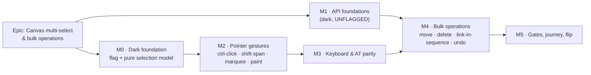

# Implementation Plan: Canvas multi-select & bulk operations

- **Feature spec:** [`./feature-spec.md`](./feature-spec.md) — **not yet approved**
- **Status:** Draft — awaiting approval before implementation
- **Owner:** _(to be assigned)_
- **Flag:** `VITE_CANVAS_MULTI_SELECT` (`flagDefaultOff`, `AND`-ed with
  `CANVAS_DIRECT_MANIPULATION_ENABLED`)
- **Draft ADR:** number assigned at filing time from the register (outline in the spec §4.10) —
  the reserved `ADR-0078` was taken while this plan awaited approval; see the spec header

## Breakdown

### Epic

**Canvas multi-select & bulk operations** — make the TSLD canvas act on a set of activities instead
of one, so a fragnet shift, a scrapped package and a re-sequenced chain are each one action, one
write, one undo step. Roadmap theme: TSLD canvas capability / planner throughput.

**Sequencing note.** M0 and M1 are independent and can run in parallel — M1 is server-side and
unflagged (a `VITE_` constant is a client build-time value and cannot gate a server route: the
ADR-0060 M0 / ADR-0074 rule), M0 is client-side and inert. M4 is the first task that needs both.

---

## Milestone 0 — Dark foundation (flag + the pure selection model)

**Outcome:** nothing a user can see changes. The selection is a set internally, every consumer reads
the primary, and a structural test proves the set can never exceed one element with the flag off.

---

#### Feature: The flag and the pure selection model

> **Description:** `VITE_CANVAS_MULTI_SELECT` plus `features/tsld/model/canvas-selection.ts` — the
> one pure reducer every selection path will call.
> **Complexity:** M
> **Dependencies:** none
> **Risks:** the refactor of `TsldPanel`'s `selectedId` touches ~40 read sites → mitigate by keeping
> `selectedId` as a derived `selection.primaryId` alias so no consumer changes in this milestone.
> **Testing requirements:** unit (every reducer + `reconcile`), a structural flag-off test, and the
> full existing `TsldPanel` suite passing **unchanged** — which is the proof the refactor is inert.

##### Task M0-T1 — Add the flag (≈ one PR)

- **Description:** `CANVAS_MULTI_SELECT_ENABLED = CANVAS_DIRECT_MANIPULATION_ENABLED &&
flagDefaultOff(import.meta.env.VITE_CANVAS_MULTI_SELECT)` in `apps/web/src/config/env.ts`, with a
  docblock stating the derivation reason (the legacy edge-drag's `Shift` = SS chord must never
  coexist with shift-click span) and the pre-flip gate list.
- **Complexity:** S · **Dependencies:** none
- **Risks:** a standalone flag would let the two Shift meanings coexist → the `&&` is the mitigation
  and is asserted by a test.
- **Testing:** `env.test.ts` case (including the `"TRUE"`-reads-as-off case the helper documents) and
  an assertion that the flag is false whenever `VITE_CANVAS_DIRECT_MANIPULATION=false`.
- **Steps:** 1) add the constant + docblock; 2) add the env test; 3) `.env.example`.

##### Task M0-T2 — `features/tsld/model/canvas-selection.ts`

- **Description:** the pure model and its reducers: `replace`, `toggle`, `spanTo`, `addAll`, `clear`,
  `reconcile`. No React, no DOM, no network — a sibling of `render-model` / `gesture-machine`.
- **Complexity:** M · **Dependencies:** M0-T1
- **Risks:** getting `primaryId` fallback wrong (removing the primary must land on a _stable_
  survivor) → the "last added survivor" rule is a named test case; `reconcile` must be **derived**,
  never an effect (`ActivitiesTable.tsx:303-312`) → asserted by a test that deletes a selected id
  from the live list and reads the count.
- **Testing:** exhaustive unit — empty/one/many, toggle in and out, primary fallback, anchor
  stability across two shift-clicks, `reconcile` dropping vanished ids, no duplicates ever.
- **Steps:** 1) the interface + reducers; 2) tests; 3) export from `features/tsld/index.ts`.

##### Task M0-T3 — Thread the model through `TsldPanel` (inert)

- **Description:** replace `useState<string | null>` with `useState<CanvasSelection>`; derive
  `const selectedId = selection.primaryId` and leave **every** existing read site untouched. Only
  `replace` and `clear` are wired, so `ids.length <= 1` always.
- **Complexity:** M · **Dependencies:** M0-T2
- **Risks:** an accidental behaviour change in a 2,000-line component → the mitigation is that the
  entire existing `TsldPanel.*.test.tsx` suite (16 files) must pass **unchanged**; any edit to one of
  them is a signal the refactor is not inert and must be justified in the PR.
- **Testing:** existing suites unchanged + one new structural test: with the flag off, no reducer
  other than `replace`/`clear` is reachable and `ids.length <= 1` holds after any sequence of
  simulated events.
- **Steps:** 1) state swap + alias; 2) route the existing `select()` through `replace`; 3) structural
  test; 4) run the whole web suite and report it green.

---

## Milestone 1 — API foundations (dark, **unflagged**)

**Outcome:** the server can move and delete a set of activities all-or-nothing. Nothing in the
product calls it yet. Shipped unflagged and early so it soaks before the UI needs it.

---

#### Feature: Batch placement write

> **Description:** `PATCH /api/v1/organizations/:orgSlug/plans/:planId/activities/placements` — a
> complete-row, all-or-nothing batch of time + lane placements.
> **Complexity:** L
> **Dependencies:** none
> **Risks:** (a) a partial write leaving a fragnet inconsistent → all-or-nothing via the set-based
> UPDATE + count check, the `updatePositions` pattern verbatim; (b) an IDOR through a foreign id →
> the UPDATE re-asserts `organizationId + planId + deletedAt IS NULL`, so a foreign id simply does
> not match; (c) a per-row loop under the plan lock → forbidden, one statement (the ADR-0053 M6
> `unnest` lesson: 830 ms → 13 ms for 2,000 rows).
> **Testing requirements:** service unit + Supertest e2e against real Postgres — happy path, 403,
> 423, 409 (stale ⇒ **nothing** moved, asserted by re-reading every row), 404 cross-plan, 422
> duplicate id, 422 summary, 2,000-row boundary, and a **parity assertion** that a recalculation
> after a batch equals a recalculation after the equivalent N single PATCHes.

##### Task M1-T1 — DTO + validation

- **Description:** `UpdatePlacementsDto` / `ActivityPlacementDto` modelled on
  `ActivityPositionDto` + `ActivityParentDto`. Every placement field **required-but-nullable**, never
  `@IsOptional()` — the `ActivityParentDto` rule (an omitted field must be a validation error, not a
  silent destructive default). `@ArrayMinSize(1) @ArrayMaxSize(2000)`.
- **Complexity:** S · **Dependencies:** none
- **Risks:** copying `@IsOptional()` from the wrong sibling → the docblock states the rule and a
  validation spec asserts an omitted field is rejected.
- **Testing:** `dto.validation.spec.ts` covering each field's presence, type, range and the array
  bounds.
- **Steps:** 1) DTOs + `@ApiProperty` docs; 2) validation spec; 3) shared types in `packages/types`
  if the web client needs the shape.

##### Task M1-T2 — Service + repository

- **Description:** `ActivitiesService.updatePlacements` following `updatePositions` line for line:
  `resolveScope` → `assertCan('activity:update')` → `loadActivePlan` (404 for foreign) →
  `assertHoldsPen` → duplicate-id 422 → summary 422 → transaction → one set-based UPDATE keyed by
  `id + version` → count shortfall rolls back and the cold path distinguishes 404 from 409 → return
  the rows with fresh versions.
- **Complexity:** M · **Dependencies:** M1-T1
- **Risks:** forgetting the `WBS_SUMMARY` refusal → an explicit pre-check with its own test; writing
  a definition field by accident → the repository method takes only placement fields, pinned by a
  structural test on its signature.
- **Testing:** service unit (each guard in order — pen asserted _before_ the business rule, the
  `dissolveSummary` "gate first" ordering) + the e2e set above.
- **Steps:** 1) repository `updatePlacements`; 2) service method; 3) unit specs; 4) e2e spec.

##### Task M1-T3 — Controller + OpenAPI

- **Description:** the route on `PlanActivitiesController` with the full decorator set — `200`,
  `403`, `404`, `409`, `422`, `ApiLockedResponse` — and a description that states, in the same words
  the `parents` route uses, that this is **structural**: computed dates are stale until the next
  recalculation.
- **Complexity:** S · **Dependencies:** M1-T2
- **Risks:** an undeclared status code (the ADR-0053 M6 api-review finding) → the api-reviewer pass
  in M5 checks every reachable code is declared.
- **Testing:** e2e asserts the envelope shape; OpenAPI snapshot updated.
- **Steps:** 1) controller method; 2) decorators; 3) `docs/API.md`.

##### Task M1-T4 — Audit census entry

- **Description:** add the route to `UNAUDITED_ROUTES` as `REASONS.PLAN_CONTENT`, matching its two
  siblings (`audit-coverage.structural.spec.ts:212,218`).
- **Complexity:** S · **Dependencies:** M1-T3
- **Risks:** none — the census fails the build if a new route is unclassified, which is the gate
  working. Note the honest limit recorded in ADR-0072: the census forces classification, it does not
  forbid auditing.
- **Testing:** the structural spec passes.
- **Steps:** 1) census entry with the reason; 2) run the spec.

---

#### Feature: Bulk delete

> **Description:** `POST …/plans/:planId/activities/bulk-delete` — one transaction, one
> `deleteBatchId`, one audit row.
> **Complexity:** L
> **Dependencies:** none (parallel with the placement feature)
> **Risks:** (a) N audit rows for one act — the exact rule ADR-0073 C3.1 exists to hold → one row,
> subject = the **PLAN**, `activityCount` + cascade counts, following `activity.reparented`; (b) a
> summary in the batch dragging the ADR-0038 subtree cascade into a bulk gesture → 422, so a bulk
> delete is always leaf-only; (c) the audit payload's non-scalar trap (the C3.1 finding: a nested
> `CascadeCounts` is reduced to a type marker by the redactor **by design**) → scalar counts only,
> and the redactor allow-list is updated in the same commit.
> **Testing requirements:** e2e asserting exactly **one** `audit_events` row with the right scalars;
> one shared `delete_batch_id` across every swept row; 409 leaves every row alive; 422 on a summary.

##### Task M1-T5 — DTO, service, controller

- **Description:** `BulkDeleteActivitiesDto` (`{ activities: [{ id, version }] }`); service
  `bulkDelete` gating in the `remove` order, then one transaction calling `cascadeSoftDelete` per row
  **sharing one batch id**, then one audit row; controller with full OpenAPI. Returns the
  `deleteBatchId`.
- **Complexity:** L · **Dependencies:** M1-T1 (shares the row shape convention)
- **Risks:** `cascadeSoftDelete` currently mints its own batch id per call → confirm the seam accepts
  an injected id, and if it does not, extend it deliberately rather than looping N batch ids. **This
  is the first thing to check when the task starts**, because it decides whether the task is S or L.
- **Testing:** service unit + e2e (above) + a test that a batch containing a summary changes nothing.
- **Steps:** 1) read `HierarchyLifecycleService.cascadeSoftDelete` and record whether the batch id is
  injectable; 2) DTO; 3) service; 4) controller + OpenAPI; 5) redactor allow-list; 6) specs.

##### Task M1-T6 — Audit census + action vocabulary

- **Description:** add the route to `AUDITED_ROUTES` mapping to `activity.deleted`; extend the
  redactor's allow-list for that action with `activityCount`.
- **Complexity:** S · **Dependencies:** M1-T5
- **Risks:** the ADR-0073 C4 finding — the action-filter cap is derived from `AUDIT_ACTIONS`, so
  adding to the vocabulary must not break it → no new action is added here (we reuse
  `activity.deleted`), which is precisely why reuse was chosen; if review prefers a distinct
  `activity.bulk_deleted`, the cap derivation must be re-checked in the same PR.
- **Testing:** structural spec + an e2e reading the recorded payload back.
- **Steps:** 1) census; 2) redactor; 3) specs.

##### Task M1-T7 _(optional, gated on **CQ-4**)_ — `POST …/activities/restore-batch/:batchId`

- **Description:** restore every activity soft-deleted under one batch id — id-stable, links intact.
  ADR-0048's already-designed, already-deferred M4; no schema change.
- **Complexity:** M · **Dependencies:** M1-T5
- **Risks:** restoring into a plan that has since changed (a restored activity's calendar archived, a
  parent dissolved) → reuse the existing single-restore guards per row; refuse the whole batch rather
  than restoring a subset.
- **Testing:** e2e — delete 12, restore the batch, assert 12 rows **and** their incident dependencies
  are live again with their original ids.
- **Steps:** 1) route + service; 2) census entry (`activity.restored`); 3) e2e; 4) update ADR-0048's
  M4 status.

---

## Milestone 2 — Pointer gestures

**Outcome:** a planner can build a plural selection with ctrl/cmd-click, shift-click and a marquee,
and see it. Nothing can be _done_ with it yet — which is why M4 must follow before the flag flips
(a selection that can do nothing is the lit-but-inert defect ADR-0062/0064 each caught).

---

#### Feature: Modifier clicks

> **Complexity:** M · **Dependencies:** M0
> **Risks:** `Shift` collides with the legacy edge-drag SS chord → structurally impossible under the
> derived flag (M0-T1), asserted by a test.
> **Testing:** gesture-machine unit + `TsldCanvas` component tests for each modifier, plus a flag-off
> parity test that ctrl/cmd-click behaves as a plain click.

##### Task M2-T1 — Modifier plumbing

- **Description:** extend `Modifiers` with `ctrl` (set from `e.ctrlKey || e.metaKey`); pass modifiers
  through `pointerDown` on the plain-click path (today they are only read on the linking path).
- **Complexity:** S · **Dependencies:** M0-T3 · **Testing:** gesture-machine unit + a test that
  `metaKey` and `ctrlKey` are equivalent.

##### Task M2-T2 — Toggle + span

- **Description:** wire `toggle` and `spanTo` in `TsldPanel`'s select handler; `idsIntersecting(rect,
rects)` exported from `render-model.ts` as the **one** predicate shared by span and marquee.
- **Complexity:** M · **Dependencies:** M2-T1
- **Risks:** two intersection implementations → one exported function, pinned by a structural test
  that no other module computes rect overlap.
- **Testing:** unit over `idsIntersecting` (touching edges, zero-width milestone diamonds, bars wider
  than the rect); component tests for both click paths; announcement assertions.

---

#### Feature: Marquee

> **Complexity:** L · **Dependencies:** M2-T1
> **Risks:** (a) breaking pan — the single most-used canvas gesture → plain empty-ground drag is
> untouched and a regression test pins it; (b) the ADR-0064 arm/disarm contract gaining an exception
> → the mode is added to the same contract tests every other mode has; (c) `classifyHit` iterating
> all activities per call (debt **#51**) — the marquee predicate runs over the **culled visible** set
> once per release, not per frame, so it does not widen #51, and it is **not** folded in here because
> #51 is a per-pointer-move hover cost with its own measurement owed.
> **Testing:** gesture-machine unit for `marqueeing`; component tests for tool-armed and modifier
> paths; ADR-0064 contract tests (Escape, mutual exclusion, announcement); a paint test that the rect
> is drawn on the interaction layer only.

##### Task M2-T3 — `marqueeing` gesture state

- **Description:** a new pure state in `gesture-machine.ts`: armed on `pointerDown` with `hit.kind
=== 'empty'` when `mode === 'marquee'` **or** ctrl/meta is held; tracks the rect; commits a
  `marquee` intent on release carrying the rect and whether the modifier was held (add vs replace).
- **Complexity:** M · **Dependencies:** M2-T1 · **Testing:** unit — zero-area release is a clear;
  out-of-bounds release cancels (the existing `escape` path); the ghost never mutates the scene.

##### Task M2-T4 — The `marquee` tool mode

- **Description:** add `'marquee'` to `EditMode`; the `Select` toolbar item becomes a split-button
  whose menu offers **Marquee select** (primary region arms it — the ADR-0064 rule that a
  split-button arms from the primary region, and restores focus to the **trigger**, not the
  `tabIndex={-1}` caret, which was an ADR-0064 §7 defect).
- **Complexity:** M · **Dependencies:** M2-T3
- **Risks:** arming a mode nobody can leave → Escape, mode-band statement and announcement are the
  same three the other four modes have, and the same tests cover it.
- **Testing:** toolbar registry unit; the shared arm/disarm contract suite extended to five modes.

##### Task M2-T5 — Paint: rings, primary emphasis, marquee rect

- **Description:** `TsldScene` gains `selectedIds?: readonly string[]` **beside** the retained
  `selectedId` (so flag-off and every non-canvas caller — including the export at
  `use-tsld-toolbar-context.tsx:435-441` — is byte-identical). Ring loop over `selectedIds ∩
visibleIds`; the primary gets a heavier ring **and** keeps the edge handles, so "which one Edit acts
  on" is not colour-only (WCAG 1.4.1). Marquee rect on the interaction layer.
- **Complexity:** M · **Dependencies:** M2-T3
- **Risks:** cost growth inside an already-overspent budget (**#75**) → the counting-stub gate below;
  colour-only primary distinction → weight + handles, asserted by a paint test.
- **Testing:** `paint.multi-select-budget.test.ts` (rings == |selected ∩ visible|, zero when empty,
  no other layer's call count multiplies at 2,000 selected); `paint.test.ts` additions for the
  primary emphasis and the export-scene parity (no ring in an export).

---

## Milestone 3 — Keyboard & AT parity

**Outcome:** every gesture from M2 is reachable from the parallel listbox, announced, and WCAG 2.2 AA
clean. This is a merge requirement, not a follow-up.

---

#### Feature: Multi-select listbox

> **Complexity:** L · **Dependencies:** M2
> **Risks:** (a) rebinding `Space` breaks an existing habit (**CQ-1**) → shortcuts help updated, a
> one-time announcement, and a flag-off parity test pinning the old binding as the rollback contract;
> (b) `aria-multiselectable` advertising a capability that is off → the attribute is flag-gated;
> (c) `Ctrl/Cmd+A` swallowing the browser's select-all in a text context → only handled when the
> listbox itself has focus.
> **Testing:** component tests per key; axe over both flag states; the existing `TsldPanel.a11y` and
> `.axe` suites extended; announcement assertions for every transition including the off-screen count.

##### Task M3-T1 — `aria-multiselectable`, `Space`, `i`

- **Complexity:** M · **Dependencies:** M2-T2
- **Risks:** the summary becoming unreachable if `i` collides → verified against the current keymap
  (`TsldPanel.tsx:1054-1227`: `Enter`, `?`, `[`, `]`, `Space`, `n`, `Alt+*`, `Shift+←/→`, arrows,
  Home/End — `i` is free).
- **Testing:** both bindings under both flag states; `aria-selected` reflects the set, not the active
  option.
- **Steps:** 1) keymap; 2) attribute gating; 3) shortcuts-help entry; 4) tests; 5) `docs/DECISIONS.md`
  entry recording the rebinding.

##### Task M3-T2 — `Shift+Arrow`, `Ctrl/Cmd+A`, `Escape` rung

- **Complexity:** M · **Dependencies:** M3-T1
- **Risks:** the `Escape` rung stealing the ADR-0064 disarm → the ladder is explicit and ordered
  (tool/pick first, selection last) with a test per rung.
- **Testing:** each key; the ladder in all three states (tool armed / pick open / plain select).

##### Task M3-T3 — Announcements

- **Description:** count + delta on every transition, through the **one** existing polite region
  (never a second — `CanvasModeBand`'s docblock names the double-speak risk); the off-screen count
  when the selection extends beyond the viewport.
- **Complexity:** S · **Dependencies:** M3-T2
- **Risks:** announcing on every marquee frame → announce on **commit** only.
- **Testing:** one assertion per transition kind; a test that a marquee drag announces once.

---

## Milestone 4 — Bulk operations

**Outcome:** the selection can do the three things it exists for. `main` stays releasable throughout
because everything is behind the flag.

---

#### Feature: Bulk move (time + lane)

> **Complexity:** L · **Dependencies:** M1 (placements), M3
> **Risks:** (a) an EARLY-mode bulk move silently pinning N `SNET` constraints → the bar states it
> **before** the drag, because at 12× the single-move side effect it becomes a plan-shaping decision;
> (b) N intermediate writes during a drag → there are none (the ghosts are client-side, one write on
> release) and a test asserts exactly one request; (c) a mode mix-up between EARLY and VISUAL → the
> row builder is one function, mode-aware, unit-tested both ways.
> **Testing:** unit (row builder, both modes, lane-only shortcut); component (ghosts, caveat copy,
> shaded reasons); the undo command; journey (M5).

##### Task M4-T1 — `repositioningMany` + N ghosts

- **Complexity:** M · **Dependencies:** M2-T3 · **Testing:** gesture unit; a paint test that N ghosts
  cost N ghost draws and nothing else.

##### Task M4-T2 — The write path

- **Description:** mode-aware row builder → `PATCH …/placements` for a day delta; the existing
  `PATCH …/positions` for a **lane-only** move (no recalculation, matching the single-move rule);
  `Alt+arrow` keyboard parity through the existing coalesced nudge.
- **Complexity:** M · **Dependencies:** M4-T1, M1-T3
- **Risks:** triggering a recalculation on a lane-only move → the branch is explicit and tested.
- **Testing:** unit + component; a test that a zero-delta drop sends nothing.

##### Task M4-T3 — `bulkPlacementCommand`

- **Description:** modelled on `autoArrangeCommand` (`commands.ts:742`) — before/after snapshots,
  versions threaded from each batch response, **no** coalescing descriptor (stated in the docblock
  with the reason: there are no intermediate writes, and merging two different id-sets would produce
  an undo that restores a set nobody selected).
- **Complexity:** M · **Dependencies:** M4-T2
- **Testing:** unit — undo restores every row, redo re-applies, versions thread, a 409 on the inverse
  leaves the stacks intact and clears redo (the ADR-0048 M3 conflict contract).

---

#### Feature: Bulk delete

> **Complexity:** M · **Dependencies:** M1 (bulk-delete), M3
> **Risks:** a confirm that undersells what goes → the copy names the count **and** that incident
> links go with them, the `activity-crud-dialogs` cascade-copy precedent.
> **Testing:** component (confirm copy, focus return, shaded reason); the undo command; journey.

##### Task M4-T4 — Confirm + write + `bulkDeleteCommand`

- **Complexity:** M · **Dependencies:** M1-T5, M4-T3
- **Risks:** the undo losing incident links (**CQ-4**) → if CQ-4 is answered "re-create", the confirm
  copy says so plainly; if "restore-batch", the command calls M1-T7 instead. **The copy differs
  between the two answers**, which is why CQ-4 is a critical question and not a detail.
- **Testing:** unit + component; e2e asserts one audit row (M1) and the journey asserts one undo step.
- **Steps:** 1) confirm dialog reusing the existing host-owned pattern; 2) mutation; 3) command; 4) selection clear + focus return to the listbox; 5) tests.

---

#### Feature: Link in sequence

> **Complexity:** L · **Dependencies:** M3
> **Risks:** (a) a chain recorded in the wrong direction — **the exact report ADR-0064 opened on** →
> the order is **previewed with names and arrows** before anything is written, with a Reverse control;
> (b) a chain legal edge-by-edge but cyclic as a whole → the pre-check runs over the **resulting**
> graph, the `updateParents` "validated against the RESULTING tree" rule; (c) a partial chain on
> failure → roll back this action's edges (the `createLoeSpanCommand` precedent, "rolled back, no
> orphan"); (d) N round trips at select-all scale → capped at 50, shaded with the reason above it.
> **Testing:** unit (`chain-order.ts` ordering + cycle pre-check, including the resulting-graph case
> that edge-by-edge checking would miss); component (preview, Reverse, cap, shaded reasons); the undo
> command; journey against a real API with the pen enforced.

##### Task M4-T5 — `chain-order.ts` (pure)

- **Complexity:** M · **Dependencies:** M0-T2
- **Testing:** pick order vs spatial order; ties; the resulting-graph cycle case; the cap.

##### Task M4-T6 — Preview UI + the write loop + `linkChainCommand`

- **Complexity:** L · **Dependencies:** M4-T5
- **Risks:** the loop firing a recalculation per edge → the coalescer already handles it; assert one
  recalculation for the whole chain.
- **Testing:** component + unit + the command; a test that a mid-loop failure leaves **zero** edges.

---

#### Feature: The bulk selection bar

> **Complexity:** M · **Dependencies:** M4-T2, M4-T4, M4-T6
> **Risks:** (a) `disabled` on a control that flips twice per action — the `ScopeSaveBar` /
> `WbsBulkAssignBar` / ADR-0063 M6 lesson, re-learnt three times → `aria-disabled` +
> `pointer-events-none` + a click guard, asserted by a test; (b) a shut action with nothing to say
> for itself → one status line, `aria-describedby`-**linked** to the action, not merely adjacent;
> (c) per-object actions shaded rather than absent → absent, and the bar names the primary.
> **Testing:** component tests for all four gate states (writable / no pen / no role / nothing to do),
> the two faces at 1 vs ≥ 2 selected, focus behaviour, axe.

##### Task M4-T7 — `bulk-selection-bar.tsx`

- **Complexity:** M · **Dependencies:** the three write features
- **Steps:** 1) the component in the chrome band beside `CanvasModeBand`; 2) the four gate states; 3) the one status line; 4) the face switch in `TsldPanel`; 5) tests; 6) a **flag-off parity test**
  that at 1 selected the floating object bar renders byte-for-byte as today.

---

## Milestone 5 — Gates, journey, and the flip

**Outcome:** the flag flips default-on with every specialist gate green and a browser-proven journey.
This milestone is not paperwork — four consecutive epics (ADR-0063 M6, ADR-0064 §7, ADR-0067 M4,
ADR-0073 C4) each found defects here that had already passed a human read.

---

#### Feature: Specialist review pass over the combined diff

> **Complexity:** L · **Dependencies:** M4
> **Risks:** treating this as a formality → every finding gets a regression test **verified to fail
> against the old code first**, the house rule.
> **Testing:** the findings' own regression tests.

##### Task M5-T1 — Reviews

- **Description:** run, over the combined M0–M4 diff: **security-reviewer** (required — two new write
  endpoints), **api-reviewer** (status codes, envelopes, the undeclared-code trap),
  **backend-performance-reviewer** (the set-based statements; no per-row loop under a lock),
  **component-reviewer**, **ux-reviewer**, **accessibility-reviewer**. Also
  **database-architect** for a read of the batch write's locking and index behaviour, even though no
  migration runs — the `parents` route takes the plan advisory lock and this one's need for it must
  be a decision, not an omission.
- **Complexity:** L · **Dependencies:** M4
- **Testing:** one regression test per blocking finding, each verified red first.

##### Task M5-T2 — The flag-on Playwright journey

- **Description:** `apps/web/e2e-multi-select/` + `playwright.multi-select.config.ts` +
  `test:e2e:multi-select` + its own CI step. Drives a **real API with the pen enforced** — the only
  place the optimistic-`version` trap is testable at all, since a mocked fetch accepts any version
  (ADR-0060 M6). Asserts: a marquee selects the expected set (probed via the parallel listbox, not
  canvas pixels — the ADR-0064 harness technique); one `PATCH …/placements` on the network for a
  12-bar shift; the **stored** dates read back from the API, not the DOM under test (the ADR-0070 M6
  lesson); one `Cmd+Z` restores all twelve; a bulk delete writes one audit row; a chain's direction
  is what the preview said; and the keyboard-only path reaches every gesture.
- **Complexity:** L · **Dependencies:** M4
- **Risks:** the journey costing CI rounds for locator bugs → **`scripts/e2e-local.sh
web:multi-select` must be run locally before pushing** (`CLAUDE.md` §19.7 — omitting it cost five
  CI rounds on the ADR-0063 journey, every failure visible in the first local run).

##### Task M5-T3 — Browser-measured paint

- **Description:** one measured run at 2,000 activities with **all** selected, in Chromium, reported
  in the PR against the **current** ADR-0065 baseline (16.7–23.1 ms p95) — not against ADR-0026 §16's
  ≤ 4 ms, which `docs/TECH_DEBT.md` #75 has reopened. The obligation is "no worse", stated honestly.
- **Complexity:** M · **Dependencies:** M2-T5
- **Risks:** a regression discovered at the flip rather than at M2 → the counting-stub gate lands with
  M2-T5, so this run confirms rather than discovers.

##### Task M5-T4 — Documentation, ADR, flip

- **Description:** write the epic's ADR from the spec §4.10 outline (Accepted), **taking its number
  from `docs/adr/README.md` at the moment of filing**; update `CLAUDE.md` §16
  and the stage banner (`pnpm check:counts` re-derives it — ADR-0076); `docs/API.md`;
  `docs/UX_STANDARDS.md` (the selection + bulk-action pattern); `docs/TESTING.md`;
  `docs/DECISIONS.md` (the `Space` rebinding); the flag docblock's move from `flagDefaultOff` to
  `flagDefaultOn` with the date and the gate list; a changeset (minor, pre-1.0).
- **Complexity:** M · **Dependencies:** M5-T1, M5-T2, M5-T3
- **Risks:** flipping before the gates → the flip is the **last** step of the last task, and the
  docblock records which gates were green on which date.
- **Steps:** 1) ADR; 2) docs; 3) flag flip; 4) changeset; 5) keep the flag-off parity suites — they
  are the rollback contract and are never weakened (the ADR-0053 M6 rule).

---

## Sequencing & slices

| Order | Slice | Releasable? | Why it is a slice                                                                           |
| ----- | ----- | ----------- | ------------------------------------------------------------------------------------------- |
| 1     | M0    | Yes         | Inert refactor behind a default-off flag; the existing suite passing unchanged is the proof |
| 1′    | M1    | Yes         | Server-side, unflagged, no caller; soaks before the UI needs it. **Parallel with M0.**      |
| 2     | M2    | Yes         | Gestures visible only with the flag on; flag-off parity suites pin the prior surface        |
| 3     | M3    | Yes         | Keyboard parity lands **with** the gestures, never after — it is a merge requirement        |
| 4     | M4    | Yes         | The operations. Flag still off; nothing user-visible changes on `main`                      |
| 5     | M5    | Yes         | Gates, journey, measurement, ADR, flip                                                      |

**Feature flag:** `VITE_CANVAS_MULTI_SELECT`, `flagDefaultOff`, `AND`-ed with
`CANVAS_DIRECT_MANIPULATION_ENABLED`. **Flag-off parity suites are the rollback contract** and are
added in the same PRs as the features they pin — `vi.mock` of `@/config/env` with
`CANVAS_MULTI_SELECT_ENABLED: false`, the ADR-0053 M6 pattern.

**Deliberately not in this epic:** debt rows **#28** (ring/stroke colour treatment), **#31** (the
floating bar covers the lane above — it becomes _more_ valuable once a plural selection exists, and
is noted as a follow-up in this epic's ADR), **#48**, **#51** (`classifyHit` iterating all activities per
pointer-move — the marquee predicate runs over the culled set once per release, so it does not widen
this), **#56** (the pure gesture helpers living in `TsldCanvas.tsx` — the new marquee helpers go in
`render/` from the start rather than joining the pile, which is the smallest honest thing to do
without doing #56's one-pass migration inside an unrelated epic), **#75** (the draw budget).

## Definition of Done (per task)

Each task's PR must satisfy the Feature Completion Criteria in
[`docs/PROCESS.md`](../../PROCESS.md): code, tests, docs, security, performance, accessibility,
Docker build, CI, changelog, version impact — with the pre-push gate **run, not just written**
(`pnpm lint && pnpm typecheck && pnpm test`, plus `scripts/e2e-local.sh api` for every M1 task and
`scripts/e2e-local.sh web:multi-select` for M5-T2). CI is the second opinion, never the first.

## Risks & assumptions (rollup)

| Risk / assumption                                                                        | Likelihood | Impact | Mitigation                                                                                                                        |
| ---------------------------------------------------------------------------------------- | ---------- | ------ | --------------------------------------------------------------------------------------------------------------------------------- |
| The `TsldPanel` selection refactor changes behaviour somewhere in a 2,000-line component | med        | high   | M0-T3 requires the **entire existing suite to pass unchanged**; any test edit must be justified in the PR                         |
| `cascadeSoftDelete` will not accept an injected `deleteBatchId`                          | med        | med    | **Checked first** in M1-T5, before any other work in that task; it decides whether the task is S or L                             |
| The `Space` rebinding annoys existing keyboard users (**CQ-1**)                          | med        | low    | Shortcuts help, a one-time announcement, and a flag-off rollback that restores it exactly                                         |
| Ctrl/Cmd+drag is undiscoverable                                                          | high       | low    | It is the _second_ route; the discoverable one is the toolbar tool mode, which does the same thing                                |
| The painter grows cost inside an already-overspent budget (#75)                          | med        | med    | Counting-stub gate at M2-T5 + one browser-measured run at M5-T3, reported against the ADR-0065 baseline, not the stale §16 figure |
| A bulk EARLY-mode move silently pins N SNET constraints                                  | high       | high   | Stated in the bar **before** the drag; named in the epic ADR's consequences; asserted by a copy test                              |
| An undo of a bulk delete loses incident links (**CQ-4**)                                 | high       | med    | Either the confirm copy says so plainly, or M1-T7 ships the id-stable batch restore. The answer changes the copy, so it is a CQ   |
| A chain is created in the wrong direction (the ADR-0064 report)                          | med        | high   | The order is previewed with names and arrows, with Reverse, before any write; the journey asserts the stored direction            |
| Two intersection implementations drift (span vs marquee)                                 | low        | med    | One exported `idsIntersecting`, pinned by a structural test                                                                       |
| The audit action-filter cap breaks if a new action is added (ADR-0073 C4)                | low        | med    | We **reuse** `activity.deleted` rather than adding an action; if review prefers a distinct one, the cap derivation is re-checked  |
| The gate pass finds defects late                                                         | **high**   | med    | It has on four consecutive epics. M5 is budgeted as a full milestone, not a checklist, and every finding carries a red-first test |
| "The multi-agent canvas review" cannot be located                                        | —          | low    | The **gap** is verified from the code (spec §0); the review is not cited as evidence anywhere                                     |
