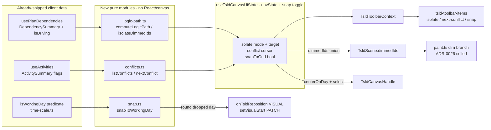
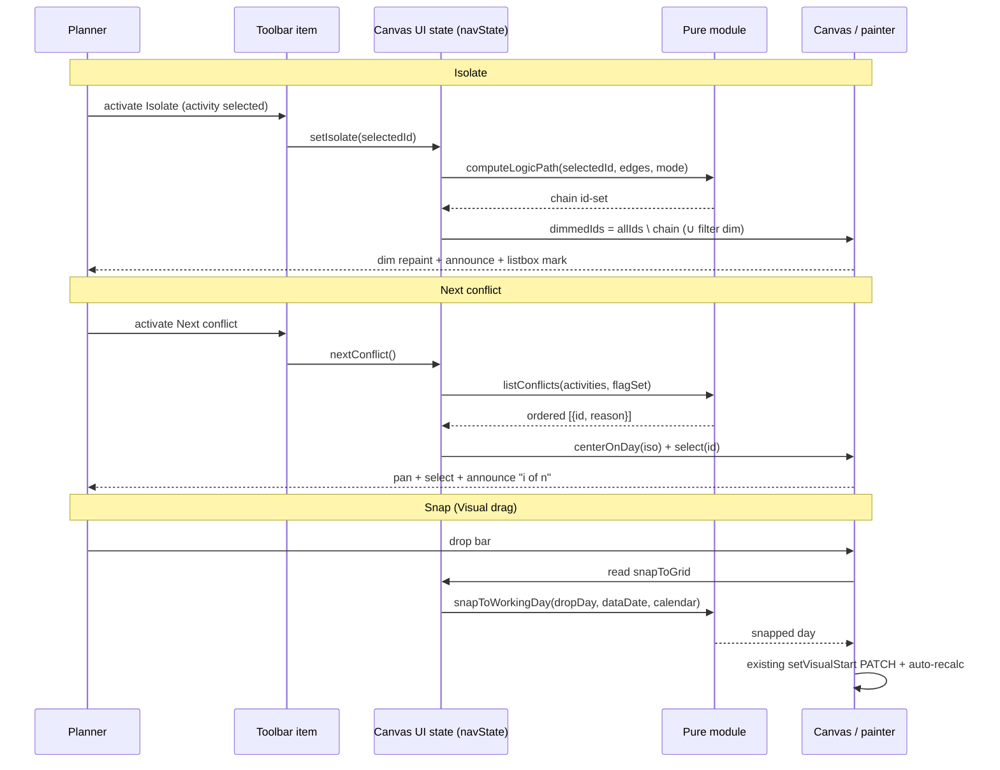

# Feature Spec: TSLD canvas navigation & authoring aids

- **Status:** Draft (awaiting approval)
- **Author(s):** feature-analyst (Product Owner / Solution Architect / Technical Lead hats)
- **Date:** 2026-07-20
- **Tracking issue / epic:** TBD (toolbar-placeholder burn-down — Stage B)
- **Roadmap link:** TSLD canvas workspace / toolbar burn-down (`docs/TOOLBAR_ROADMAP.md`, `docs/ROADMAP.md`)
- **Related ADR(s):** ADR-0026 (canvas), ADR-0028 (edit-lock/pen), ADR-0031 (toolbar registry), ADR-0033 (scheduling modes / Visual). **No new ADR** — see §4 "ADR assessment".

## 1. Business understanding

### Problem

Three intended TSLD toolbar controls ship today as inert **"Coming soon" placeholders**
(`placeholderItem()` stubs in `tsld-toolbar-items.tsx`) — `isolate-logic`,
`next-conflict`, `snap-to-grid`. The toolbar _reads_ as fully designed (ADR-0031's
stable-shape rule), but three high-value planner affordances are unavailable:

- Planners cannot **trace an activity's logic chain** on a busy diagram — on a plan of
  hundreds of activities, following predecessors/successors by eye is error-prone and
  slow. The engine already knows the driving edges (`DependencySummary.isDriving`) and
  the full network is already in the client (`usePlanDependencies`); nothing surfaces it.
- Planners cannot **jump to the plan's problems**. The engine already flags each
  activity (`constraintViolated`, `visualConflict`, `externalDriven`,
  `levelingWindowExceeded`, negative float, …) and paints a badge, but on a large plan
  those flagged bars are off-screen and there is no "take me to the next one" command.
- In **Visual planning mode** (ADR-0033), hand-dragging a bar drops it on whatever day
  the pointer lands on; there is no way to **snap a placement to a clean working-day
  boundary**, so hand-built plans acquire ragged, sub-intent start dates.

All three are pure client-side reads over **already-shipped** engine output and
**freshly-shipped seams** (Stage A insight-lenses `dimmedIds` dim seam; the toolbar
quick-wins selection lift + `goToDate` viewport seam). This is the next slice of the
placeholder burn-down: wire the stubs to data that already exists, behind one flag.

### Users

Maps to ADR-0016 organisation roles. All three are **client render/navigation state** —
no mutation for Isolate/Next-conflict; Snap only changes a value the _existing_ pen-gated
Visual drag already writes.

| Role                    | Isolate logic path | Next conflict | Snap to grid                                          |
| ----------------------- | ------------------ | ------------- | ----------------------------------------------------- |
| Org Admin / Planner     | ✓ (view)           | ✓ (view)      | ✓ (authoring; pen + Visual mode)                      |
| Contributor             | ✓ (view)           | ✓ (view)      | ✓ only if they hold the pen and can edit the schedule |
| Viewer / External Guest | ✓ (view)           | ✓ (view)      | ✗ (shaded, "Start editing…")                          |

Isolate and Next-conflict **navigate/read only** and are offered to every role,
read-only viewers included (mirrors Go-to-date / the insight lenses). Snap is an
**authoring aid** — pen-gated and Visual-mode-only, exactly like Clear-visual-placement.

### Primary use cases

1. **Trace logic** — select an activity, press _Isolate logic path_; its logic chain
   stays emphasised while everything else dims. Press again to clear.
2. **Walk the problems** — press _Next conflict_ repeatedly to cycle through the plan's
   flagged activities, each centred and selected in turn, with the reason announced.
3. **Place cleanly** — in Visual mode, turn on _Snap to grid_; dragging a bar rounds its
   dropped `visualStart` to a working-day boundary before it saves.

### User journeys

- **Happy path (Isolate):** planner clicks a bar → toolbar's _Isolate logic path_
  enables → clicks it → the canvas dims all activities **not** on the selected
  activity's logic chain (predecessors + successors, transitive) and the a11y listbox
  marks the dimmed rows; an announcement states "Isolating N activities on the logic
  path for <name>." Clicking it again (or changing selection, or clearing selection)
  exits isolate.
- **Happy path (Next conflict):** planner presses _Next conflict_ → the canvas pans to
  centre the first flagged activity, selects it, and announces "Conflict 1 of 5: <name>
  — has constraint conflict." Pressing again advances to 2 of 5, wrapping after the last.
- **Happy path (Snap):** planner in Visual mode toggles _Snap to grid_ on (pressed) →
  drags a bar → on drop, the day is rounded to the nearest working day → the existing
  `setVisualStart` PATCH + auto-recalc runs with the snapped day.
- **Alternates:** no selection ⇒ Isolate disabled-with-reason "Select an activity first";
  no flagged activities ⇒ Next-conflict disabled-with-reason "No conflicts to review";
  not in Visual mode / no pen ⇒ Snap shaded with the matching reason.

### Expected outcomes

Three placeholders become live commands; the toolbar's silhouette is byte-for-byte
unchanged when `VITE_CANVAS_NAV` is off. Planners gain logic tracing, problem
navigation, and tidy Visual placement without any backend, schema, or engine change.

### Success criteria

- With the flag **off**: the toolbar, canvas paint, and a11y tree are byte-for-byte
  identical to today (the three ids resolve to their `placeholderItem()` stubs).
- Isolate dims exactly the complement of the selected activity's logic chain; the path
  computation is O(V+E), memoised (rebuilt only on selection/edges change), and adds
  **zero** per-frame draw cost (it reuses the culled dim branch).
- Next-conflict visits every flagged activity once per cycle in a stable order and wraps.
- Snap rounds a Visual drop to a working day using the existing client calendar predicate
  (`isWorkingDay`), O(1) per drop; with Snap off, the drag path is byte-for-byte today's.
- All three meet WCAG 2.2 AA: never colour/dim alone, live-region announcements, pressed
  APG controls, disabled-with-reason.

### Open questions

**Critical (answers change design/scope) — defaults stated, please confirm:**

- **CQ-1 — Isolate: full logic chain vs driving-only chain vs a toggle.** _Default:_
  ship the **full logic chain** (all transitive predecessors + successors) for v1, since
  the client already has every edge and it needs no float-paths read. Offer a
  **driving-only** sub-mode as a fast-follow (the client edges already carry `isDriving`,
  so it is a filter, not new data). If a toggle is wanted in v1, it is a small menu on the
  control (mirrors Colour-by), at modest extra cost.
- **CQ-2 — Next-conflict v1 flag set + ordering.** _Default (v1 flag set):_
  `constraintViolated`, `visualConflict`, `externalDriven`, `levelingWindowExceeded`, and
  **negative total float** (`totalFloat < 0`). _Deferred to a fast-follow (opt-in):_
  `loeNoSpan`, `resourceDriverMissing`, `selfOverAllocated`, and **near-critical**
  (`isNearCritical`) — near-critical is a lens/insight, not a "conflict", so it is
  excluded by default. _Ordering:_ by `earlyStart` ascending, then `laneIndex`, then id
  (a stable left-to-right, top-to-bottom walk). Confirm the set and that near-critical is
  out.
- **CQ-3 — Snap: session-local vs persisted, and granularity.** _Default:_ a
  **session-local client view toggle** (like the Stage A lens state / view toggles — not
  persisted, not per-plan, resets on plan switch/reload), and granularity =
  **nearest working day** (round the dropped day to the nearest working day via the
  existing `isWorkingDay` predicate; ties round down/earlier). Note: the drag already
  commits whole **calendar** days, so the toggle's real value is the working-day rounding
  (skipping weekends/holidays). Confirm session-local + working-day.

**Non-critical (defaults applied, not blocking):**

- Isolate ↔ Filter (Stage A) interaction when both could dim: _default_ the scene's
  `dimmedIds` is the **union** of the filter-dimmed set and the isolate-dimmed set (a bar
  dimmed by either recedes); the two are independent toggles. Precedence is not needed
  because dimming composes.
- Next-conflict centring: _default_ add a small pure `centerOnDay(iso)` variant to the
  canvas handle (mirrors `goToDate`'s viewport math but centres rather than left-insets),
  because "jump to the problem" reads better centred; if that is unwanted, reuse
  `goToDate` (left-inset) with no handle change.
- Isolate exit triggers: _default_ exit on re-press, on selection change to a different
  activity, on selection clear, and on plan switch.
- Icons/labels: keep the existing placeholder `id`/`icon`/`label` shapes
  (`isolate-logic`/Route, `next-conflict`/TriangleAlert, `snap-to-grid`/Grid3x3), spread
  into both the real and stub items so they can't drift (the shared-shape pattern).

## 2. Functional requirements

### User stories & acceptance criteria

> **US-1 — Isolate logic path.** As a planner, I want to highlight a selected activity's
> logic chain and dim the rest, so that I can read its dependencies on a dense diagram.
>
> **Acceptance criteria**
>
> - **Given** an activity is selected **when** I activate _Isolate logic path_ **then**
>   every activity not on its logic chain paints dimmed (reused Stage A dim branch) and
>   the a11y listbox marks those rows dimmed, and a live region announces "Isolating N
>   activities on the logic path for <name>."
> - **Given** isolate is active **when** I activate it again, clear the selection, or
>   select a different activity **then** isolate exits (or recomputes for the new
>   selection) and the dim clears/updates.
> - **Given** nothing is selected **then** the control is disabled with reason "Select an
>   activity first."
> - **Given** the plan has no computed diagram **then** the control is disabled with
>   reason "Add an activity first" (mirrors the lens cluster).
> - **Given** `VITE_CANVAS_NAV` is off **then** the item is the byte-for-byte "Coming
>   soon" placeholder.

> **US-2 — Next conflict.** As a planner, I want to cycle through the plan's flagged
> activities, each centred and selected, so that I can review and fix problems in order.
>
> **Acceptance criteria**
>
> - **Given** the plan has ≥ 1 flagged activity **when** I activate _Next conflict_
>   **then** the canvas centres and selects the next flagged activity in order and
>   announces "Conflict <i> of <n>: <name> — <reason>."
> - **Given** I am on the last conflict **when** I activate it again **then** it wraps to
>   the first.
> - **Given** the flagged set changes (a recalc clears/adds flags) **then** the next
>   activation re-derives the ordered set and resumes sensibly (see Edge cases).
> - **Given** there are no flagged activities **then** the control is disabled with reason
>   "No conflicts to review."
> - **Given** `VITE_CANVAS_NAV` is off **then** the item is the byte-for-byte placeholder.

> **US-3 — Snap to grid.** As a planner in Visual mode, I want dropped placements to snap
> to a working-day boundary, so that hand-built plans have clean start dates.
>
> **Acceptance criteria**
>
> - **Given** I hold the pen and the plan is in Visual mode **when** I toggle _Snap to
>   grid_ on **then** the control shows pressed and subsequent Visual drags round the
>   dropped day to the nearest working day before the `setVisualStart` PATCH.
> - **Given** Snap is off **then** the Visual drag path is byte-for-byte today's (no
>   rounding beyond the existing whole-day commit).
> - **Given** I am not in Visual mode, or I don't hold the pen / can't edit the schedule,
>   or the Late-start overlay is on **then** the control is shaded with the matching
>   reason (precedence: mode → pen/role → overlay), mirroring Clear-visual-placement.
> - **Given** `VITE_CANVAS_NAV` is off **then** the item is the byte-for-byte placeholder.

### Workflows

1. **Isolate:** select → activate → `computeLogicPath(selectedId, edges, mode)` returns
   the chain id-set → `isolateDimmedIds = allIds \ chain` → fed into the scene's
   `dimmedIds` (unioned with any active filter dim) → painter dims via the existing
   branch → announce + mark listbox. Re-press/selection-change updates or clears.
2. **Next conflict:** activate → `listConflicts(activities, flagSet)` (ordered) →
   advance a session-held cycle index → `centerOnDay(activity.earlyStart-derived iso)` +
   lift selection to that activity → announce "<i> of <n>: <name> — <reason>."
3. **Snap:** toggle stored in canvas UI state → the Visual branch of the reposition path
   reads it and applies `snapToWorkingDay(dayOffset, dataDate, calendar)` to the dropped
   day before building the `setVisualStart` input.

### Edge cases

- **Isolate, isolated node has no edges:** the chain is just the node itself; everything
  else dims. Allowed (it truthfully shows "this activity connects to nothing").
- **Isolate, milestone / WBS-summary selected:** chain follows the same edge closure;
  a WBS summary carries no logic (ADR-0038) so its chain is itself only.
- **Isolate + Filter both active:** union of dim sets (default; non-critical Q).
- **Next-conflict, flagged set shrinks between presses** (a recalc fixed one): re-derive
  the ordered set each activation; keep a cursor by **activity id**, and advance to the
  next id after the last-visited that is still flagged; if the last-visited id is gone,
  resume from the start of the current order. Never throw.
- **Next-conflict, selected activity is already a conflict:** the first press advances to
  the _next_ one after it (so repeated presses always move), not re-announce the current.
- **Next-conflict, single conflict:** each press re-centres/re-announces the same one
  ("1 of 1").
- **Snap, drop lands on a non-working day with no nearby working day** (a very long
  holiday exception): round to the nearest working day scanning outward with a bounded
  horizon; if none within the horizon, fall back to the raw dropped day (never hang).
- **Snap toggled on mid-drag:** takes effect on the next drop (state read at commit).
- **Empty / uncomputed plan:** Isolate + Next-conflict shaded ("Add an activity first" /
  "No conflicts to review"); Snap shaded by the mode/pen ladder.

### Permissions

RBAC + resource scope per ADR-0012/0016. **No new permission.** Isolate and
Next-conflict are pure client view/navigation — available to every role that can view the
plan (including External Guest), no server call. Snap gates on the **existing**
`canEditSchedule` (Planner+ **and** the pen) + Visual mode + not-Late-overlay; it triggers
only the _already-authorised_ `setVisualStart` PATCH, so it adds no new authorisation
surface.

### Validation rules

No new DTOs or persisted fields. Client-only invariants:

- Logic-path set ⊆ the plan's activity ids; the dim set is its complement within the
  plan; both derived, never sent to the server.
- Snapped day is an integer working-day offset from the data date; the resulting
  `visualStart` ISO date is produced by the existing `addCalendarDays` and validated by
  the existing `setVisualStart` mutation/DTO (unchanged).

### Error scenarios

| Scenario                                          | Detection                           | User-facing result                                              | Status           |
| ------------------------------------------------- | ----------------------------------- | --------------------------------------------------------------- | ---------------- |
| Isolate with no selection                         | client (`selectedActivity == null`) | disabled-with-reason "Select an activity first"                 | n/a (no request) |
| Next-conflict with no flagged activities          | client (empty ordered set)          | disabled-with-reason "No conflicts to review"                   | n/a              |
| Snap active but drag rejected (stale version 409) | existing reposition path            | existing non-destructive no-op + "…move wasn't applied" message | 409 (unchanged)  |
| Snap while not Visual / no pen                    | client capability ladder            | shaded with matching reason                                     | n/a              |

## 3. Technical analysis

| Area           | Impact   | Notes                                                                                                                                                                                                                              |
| -------------- | -------- | ---------------------------------------------------------------------------------------------------------------------------------------------------------------------------------------------------------------------------------- |
| Frontend       | **med**  | 3 pure modules (path-set, conflict-ordering, snap-round), new context fields + canvas UI state, 3 real toolbar items swapping their stubs, optional `centerOnDay` canvas-handle variant, a11y announcements + listbox dim marking. |
| Backend        | **none** | No module/service/endpoint change.                                                                                                                                                                                                 |
| Database       | **none** | No models, migrations, indexes.                                                                                                                                                                                                    |
| API            | **none** | No new/changed endpoints or DTOs. The existing `GET …/schedule/float-paths` is **not** consumed (client edges carry `isDriving`); see Dependencies.                                                                                |
| Security       | **none** | No new permission/scope; Snap reuses the authorised `setVisualStart`. Isolate/Next-conflict are view-only.                                                                                                                         |
| Performance    | **low**  | Path set O(V+E) memoised (per selection/edges); conflict list O(activities) per activation; snap O(1) per drop. Draw budget unaffected — same culled dim branch (ADR-0026).                                                        |
| Infrastructure | **low**  | One env flag `VITE_CANVAS_NAV` (+ `.env.example`, vite-env typing).                                                                                                                                                                |
| Observability  | **none** | Client-only; no new logs/metrics/traces.                                                                                                                                                                                           |
| Testing        | **med**  | Unit for the 3 pure modules + toolbar predicates (flag on/off, pen/role/mode gating); fold one journey into an existing flag-on e2e; axe/a11y assertions on announcements + pressed state.                                         |

### Dependencies

- **Shipped seams (prerequisites, already merged):** Stage A insight-lenses dim seam
  (`TsldScene.dimmedIds` + paint dim branch + a11y listbox dim marking); toolbar
  quick-wins selection lift (`selectedActivity`/`selectedActivityId`) + `goToDate`
  viewport seam + `TsldCanvasHandle`; the Visual reposition path (`onTsldReposition`
  VISUAL branch → `useSetActivityVisualStart`); the pure `isWorkingDay` calendar
  predicate (`render/time-scale.ts`).
- **Client data already present:** `usePlanDependencies` (every `DependencySummary` with
  `predecessor.id`, `successor.id`, `isDriving`, `type`); `useActivities` /
  `ActivitySummary` engine flags; `useScheduleSummary`.
- **Optional / NOT taken:** the `GET /organizations/:org/plans/:plan/schedule/float-paths`
  endpoint (`PlanFloatPathsDto`, ADR-0035 §19) exists server-side but has **no client
  hook**. It is **not required** for v1 — the driving chain is derivable from the client
  edges' `isDriving`. If a future "float-path" isolate mode (ranked contiguous paths) is
  wanted, add a **read-only query hook against the existing endpoint** (no new endpoint,
  no schema); flagged here as a possible fast-follow dependency, explicitly out of scope
  for this spec.

## 4. Solution design

### Architecture overview

All three commands are **client render/navigation state** layered on shipped seams; the
CPM engine, API, schema and `@repo/types` are untouched (the recalc parity gate is
structurally unaffected).



### Data flow



### User flow

```mermaid
flowchart TD
  A[Plan open on TSLD canvas] --> B{VITE_CANVAS_NAV on?}
  B -- no --> Z[Three "Coming soon" placeholders — unchanged]
  B -- yes --> C[Real Isolate / Next-conflict / Snap items]
  C --> D{Select an activity?}
  D -- yes --> E[Isolate enabled → dim complement of logic chain]
  D -- no --> E2[Isolate shaded: "Select an activity first"]
  C --> F{Any flagged activities?}
  F -- yes --> G[Next conflict → centre+select+announce, cycles]
  F -- no --> G2[Next conflict shaded: "No conflicts to review"]
  C --> H{Pen + Visual mode?}
  H -- yes --> I[Snap toggle → round Visual drops to working day]
  H -- no --> I2[Snap shaded: mode/pen/overlay reason]
```

### Database changes

None.

### API changes

None. (The existing `float-paths` read endpoint is intentionally not consumed — see §3
Dependencies.)

### Component changes

Feature-first, in `apps/web/src/features/tsld/`. Reuse the design system + toolbar
registry primitives; **no one-off styling**.

- **New pure modules (mirror `render/lenses.ts` — no canvas/DOM/React/fetch):**
  - `render/logic-path.ts` — `computeLogicPath(selectedId, edges, { mode: 'all' | 'driving' })`
    → `Set<string>` (transitive predecessor+successor closure; driving mode filters edges
    by `isDriving`); `isolateDimmedIds(allIds, chain)` → complement set. Exhaustively
    unit-tested.
  - `render/conflicts.ts` — `CONFLICT_FLAGS` (the v1 flag set + human reason label, single
    source, per CQ-2); `listConflicts(activities, flags)` → ordered `{ id, reason }[]`;
    `nextConflictId(orderedIds, lastVisitedId)` → the next id (wrapping, id-stable per Edge
    cases).
  - `render/snap.ts` (or extend `time-scale.ts`) — `snapToWorkingDay(dayOffset, dataDate,
calendar, horizon)` → nearest working-day offset. Pure, bounded scan.
- **State:** extend `useTsldCanvasUiState` with `navState` (isolate mode + target id +
  chain-mode, conflict cursor id) and a `snapToGrid` boolean, beside `viewToggles` /
  `lensState`; setters memoised like the existing ones. Flag-off defaults (isolate off,
  no cursor, snap off) ⇒ no dim / no snap ⇒ byte-for-byte parity.
- **Context:** extend `TsldToolbarContext` with `isolateActive`, `isolateTargetId`,
  `toggleIsolate()`, `conflictCount`, `nextConflict()`, `snapToGrid`, `toggleSnapToGrid()`;
  built in `useTsldToolbarContext` from the model + canvas UI state (no rule re-derived).
- **Scene wiring:** `TsldPanel` unions the isolate dim set into `TsldScene.dimmedIds`
  (memoised on selection/edges/filter) and marks the a11y listbox rows; the painter is
  unchanged (same `dimmedIds` branch).
- **Canvas handle (optional, non-critical Q):** add `centerOnDay(iso)` to
  `TsldCanvasHandle` — a pure viewport pan that centres the day (mirrors `goToDate`'s math).
- **Toolbar items:** replace the three `placeholderItem()` stubs with real items behind
  `CANVAS_NAV_ENABLED`, each using a shared item-shape spread into both the real and stub
  branches (component-review shared-shape pattern). Isolate/Next-conflict on Row 1 · Look
  (group `find`), no pen; Snap on Row 2 · Do (group `tools`), pen-gated + Visual-mode.
- **States:** enabled/pressed/disabled-with-reason for each; live-region announcements via
  the existing `useAnnounce`.

### Implementation approach & alternatives

**Chosen:** compute all three entirely client-side from data already in the cache, reuse
the Stage A `dimmedIds` seam for Isolate, the quick-wins selection + a small centred
viewport variant for Next-conflict, and a pure rounding function on the existing Visual
drag path for Snap. Keep the logic in pure, unit-testable modules (the `lenses.ts` /
`render-model.ts` idiom). Ship behind one flag; flag-off = byte-for-byte today's toolbar,
paint, and a11y tree.

**Alternatives considered:**

- _Consume the `float-paths` endpoint for Isolate_ — rejected for v1: the client already
  has every edge with `isDriving`, so the chain (and a driving sub-mode) needs no fetch;
  adding a hook is avoidable coupling. Kept as a documented fast-follow only if ranked
  contiguous float-paths are wanted.
- _Persist Snap as a per-plan setting_ — rejected as default: it is a view/authoring
  preference like the view toggles and lens state, so session-local is consistent and
  needs no schema/API. (Confirm via CQ-3.)
- _A new "emphasis" scene field distinct from `dimmedIds`_ — rejected: dimming the
  complement reuses the shipped, culled branch with zero new paint code and composes
  naturally with the filter dim.
- _Reuse `goToDate` (left-inset) for Next-conflict instead of a centred variant_ —
  viable and cheaper, but centring the flagged bar reads better; the centred variant is a
  tiny pure addition. (Non-critical Q.)

**ADR assessment — no new ADR required.** These are client render/navigation state on the
existing canvas (ADR-0026) and toolbar registry (ADR-0031), reusing the shipped Stage A
dim seam and engine-owned flags; no architectural boundary, data contract, or
cross-cutting standard changes. Record the decision in `docs/DECISIONS.md` and update the
ADR-0031 registry doc-comment's placeholder enumeration (removing the three now-wired ids)
and `docs/TOOLBAR_ROADMAP.md`.

## 5. Links

- Implementation plan: `docs/specs/canvas-nav/implementation-plan.md`
- Docs to update by this change: `docs/TOOLBAR_ROADMAP.md`, `docs/ROADMAP.md`,
  `docs/DECISIONS.md`, the ADR-0031 registry doc-comment in `tsld-toolbar-items.tsx`,
  `apps/web/.env.example` + `vite-env.d.ts`, `apps/web/CHANGELOG.md` (changeset).
