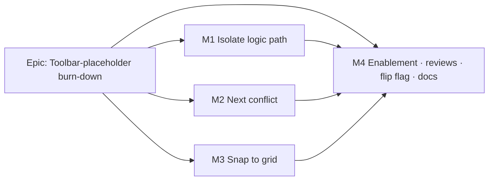

# Implementation Plan: TSLD canvas navigation & authoring aids

- **Feature spec:** `docs/specs/canvas-nav/feature-spec.md`
- **Status:** Approved (2026-07-19). Decisions: **CQ-1** Isolate ships a **full/driving toggle** (both modes in v1, from `isDriving`); **CQ-2** Next-conflict cycles the **5-flag set** (constraintViolated, visualConflict, externalDriven, levelingWindowExceeded, negative total-float; ordered earlyStart→lane→id); **CQ-3** Snap is **session-local, nearest-working-day**. Single flip at M4.
- **Owner:** TBD

## Breakdown

### Epic

**Toolbar-placeholder burn-down — Stage B (canvas navigation & authoring aids)** — wire the
`isolate-logic`, `next-conflict`, and `snap-to-grid` toolbar placeholders to already-shipped
engine output and freshly-shipped seams, frontend-only, behind one flag. Maps to the TSLD
canvas-workspace roadmap theme.

**Shared flag:** `VITE_CANVAS_NAV` (`CANVAS_NAV_ENABLED` in `apps/web/src/config/env.ts`),
**`flagDefaultOff` during build**, flipped to `flagDefaultOn` in M4 after specialist review
(the pattern every prior slice used). **Flag-off = byte-for-byte today's toolbar, canvas
paint, and a11y tree** (the three ids resolve to their `placeholderItem()` stubs). M1–M3 are
each independently mergeable behind the shared flag (all inert until M4 flips it); M0 lands
the flag + shared shapes first.

**Global invariants (every task):** no API/schema/`@repo/types`/CPM-engine change; the
`apps/api/src/modules/schedule/engine/` recalc parity gate stays byte-identical; pure logic
lives in unit-tested modules mirroring `render/lenses.ts`; no one-off styling.

---

### Milestone 0: Flag & shared shapes (enabling slice)

**Outcome:** the flag exists and the three placeholder items carry shared shapes, so M1–M3
can each swap their stub without churn. Nothing visible changes (flag off).

#### Feature: `VITE_CANVAS_NAV` scaffolding

> **Description:** add the flag, its `.env.example` + `vite-env.d.ts` typing, and hoist the
> three items' `id/group/row/tier/order/label/icon` into shared shapes spread into both the
> real (future) and stub branches.
> **Complexity:** S
> **Dependencies:** none.
> **Risks:** accidental default-on → mitigate: `flagDefaultOff`, and a flag-off snapshot test
> asserting the three ids still resolve to `placeholderItem()`.
> **Testing requirements:** unit — flag-off registry snapshot unchanged; env flag parsing.

##### Task 0.1 — Add flag + shared item shapes

- **Description:** `CANVAS_NAV_ENABLED = flagDefaultOff(import.meta.env.VITE_CANVAS_NAV)`;
  `.env.example`, `vite-env.d.ts`; extract `isolateShape`/`nextConflictShape`/`snapShape` in
  `tsld-toolbar-items.tsx` and spread into the existing `placeholderItem()` calls.
- **Complexity:** S
- **Dependencies:** none
- **Risks:** none material.
- **Testing:** extend `tsld-toolbar.test.tsx` — flag-off, the three ids are placeholders.
- **Development steps:**
  1. Add the flag + typing + `.env.example`.
  2. Extract the three shared shapes; spread into stubs.
  3. Update docs stub note; changeset deferred to M4.

---

### Milestone 1: Isolate logic path (shippable slice)

**Outcome:** a planner can select an activity and dim everything not on its logic chain.

#### Feature: Isolate logic path

> **Description:** a pure logic-path/complement computation feeding the shipped `dimmedIds`
> dim seam, a view-only toolbar command (every role), announcement + a11y listbox marking.
> **Complexity:** M
> **Dependencies:** M0; Stage A dim seam (`dimmedIds`, paint branch, listbox marking);
> `usePlanDependencies`; quick-wins selection lift.
> **Risks:** (a) large-plan traversal cost → mitigate: O(V+E), memoised on selection/edges
> only, never per frame; (b) filter-dim interaction → mitigate: union composition, unit-tested;
> (c) colour/dim-only cue → mitigate: announcement + listbox mark (WCAG 1.4.1).
> **Testing requirements:** unit (path-set closure, driving filter, complement, union with
> filter dim); toolbar predicate (enabled only with selection + diagram; view-only, no pen);
> a11y (announcement text, listbox dim marks); optional e2e fold-in (M4).

##### Task 1.1 — Pure `render/logic-path.ts`

- **Description:** `computeLogicPath(selectedId, edges, { mode })` (transitive pred+succ
  closure; `driving` mode filters `isDriving`) and `isolateDimmedIds(allIds, chain)`.
- **Complexity:** M
- **Dependencies:** M0
- **Risks:** cycles/dupes in edges → mitigate: visited-set BFS, defensive against ADR-0021
  DAG (still guard self-loops).
- **Testing:** `logic-path.test.ts` — linear chain, fan-in/out, disconnected node, milestone,
  driving-only subset, big-graph perf sanity.
- **Development steps:**
  1. Build adjacency maps from `DependencySummary[]` (pred→succ, succ→pred).
  2. BFS both directions from the target; union with the target.
  3. `isolateDimmedIds` = plan ids minus chain.
  4. Unit tests covering CQ-1's full-chain default (+ driving filter).

##### Task 1.2 — Wire state, context, scene dim + a11y

- **Description:** add `navState` isolate fields + `toggleIsolate` to `useTsldCanvasUiState`;
  expose `isolateActive`/`isolateTargetId`/`toggleIsolate` on the context; `TsldPanel` memoises
  the isolate dim set into `dimmedIds` (unioned with the filter dim) and marks the listbox;
  announce "Isolating N activities on the logic path for <name>."
- **Complexity:** M
- **Dependencies:** Task 1.1
- **Risks:** memo churn → mitigate: memo keyed on selection id + edges + mode + filter set.
- **Testing:** `TsldPanel` dim test (isolate + filter union); announcement test.
- **Development steps:**
  1. Extend canvas UI state + memoised setters; exit on selection change/clear/plan switch.
  2. Extend `TsldToolbarContext` + builder wiring.
  3. Union isolate dim into the scene `dimmedIds`; listbox marking; announce.

##### Task 1.3 — Real `isolate-logic` toolbar item

- **Description:** swap the stub for the real item behind `CANVAS_NAV_ENABLED`
  (shared shape); enabled with a selection + a computed diagram; view-only (no pen); pressed
  when active; disabled-with-reason ("Select an activity first" / "Add an activity first").
- **Complexity:** S
- **Dependencies:** Task 1.2
- **Risks:** precedence of disabled reasons → mitigate: diagram gate before selection gate.
- **Testing:** toolbar predicate tests (flag on/off, selection, diagram, pressed, viewer role).
- **Development steps:**
  1. Build the item; spread shared shape; wire `isActive`/`isEnabled`/`disabledReason`/`onActivate`.
  2. Predicate + flag-off placeholder tests.

---

### Milestone 2: Next conflict (shippable slice)

**Outcome:** a planner can cycle through the plan's flagged activities, each centred + selected.

#### Feature: Next conflict

> **Description:** pure conflict-ordering over engine flags, a view-only cycling command that
> centres + selects each flagged activity and announces "<i> of <n>: <name> — <reason>".
> **Complexity:** M
> **Dependencies:** M0; quick-wins selection lift + `goToDate`; `useActivities`/`ActivitySummary`
> flags; optional `centerOnDay` handle variant.
> **Risks:** (a) flagged set changes between presses → mitigate: id-stable cursor, re-derive each
> activation; (b) centring vs left-inset → mitigate: small pure `centerOnDay` (non-critical Q, default add).
> **Testing requirements:** unit (ordering, wrap, id-stable cursor, empty set, single); handle
> (`centerOnDay` viewport math); a11y (announcement "<i> of <n>: <name> — <reason>", focus/selection move).

##### Task 2.1 — Pure `render/conflicts.ts`

- **Description:** `CONFLICT_FLAGS` (v1 set + reason label, per CQ-2); `listConflicts(activities,
flags)` ordered by earlyStart→laneIndex→id; `nextConflictId(orderedIds, lastVisitedId)` (wrapping).
- **Complexity:** M
- **Dependencies:** M0
- **Risks:** flag-set scope creep → mitigate: single `CONFLICT_FLAGS` source, CQ-2 default
  (near-critical excluded).
- **Testing:** `conflicts.test.ts` — each flag maps to a reason, multi-flag activity, ordering
  stability, wrap, missing cursor, empty, single.
- **Development steps:**
  1. Define `CONFLICT_FLAGS` (constraintViolated, visualConflict, externalDriven,
     levelingWindowExceeded, negative-float) with labels.
  2. `listConflicts` (a matches-any predicate) + stable sort.
  3. `nextConflictId` id-stable wrap per Edge cases.

##### Task 2.2 — Optional `centerOnDay` canvas-handle variant

- **Description:** add `centerOnDay(iso)` to `TsldCanvasHandle` — a pure viewport pan centring
  the day (mirrors `goToDate`). If CQ/non-critical decision is to reuse `goToDate`, skip this task.
- **Complexity:** S
- **Dependencies:** none (parallel to 2.1)
- **Risks:** viewport math drift → mitigate: derive from `screenXOfDay`, unit-test at the centre.
- **Testing:** render-model/handle test — centred day lands at surface centre.
- **Development steps:**
  1. Add the pure centring transform beside `goToDate`.
  2. Expose on the handle + context.

##### Task 2.3 — Real `next-conflict` toolbar item + wiring

- **Description:** canvas UI state cursor + `nextConflict()`/`conflictCount` on the context;
  the item advances the cursor, centres + selects the activity, announces; view-only;
  disabled-with-reason "No conflicts to review".
- **Complexity:** M
- **Dependencies:** Task 2.1 (2.2 if centring)
- **Risks:** selection lift race → mitigate: reuse the shipped selection lift path.
- **Testing:** toolbar predicate + integration (press → centre+select+announce; wrap; empty).
- **Development steps:**
  1. Add cursor to canvas UI state; `nextConflict()` derives order, advances, centres, selects, announces.
  2. Extend context + builder.
  3. Swap the stub behind the flag (shared shape); predicate + flag-off tests.

---

### Milestone 3: Snap to grid (shippable slice)

**Outcome:** in Visual mode, a pen-holder can snap dropped placements to working-day boundaries.

#### Feature: Snap to grid

> **Description:** a pen-gated, Visual-mode session toggle that rounds a dropped `visualStart`
> to the nearest working day (via the existing `isWorkingDay`) before the existing PATCH.
> **Complexity:** S–M
> **Dependencies:** M0; the Visual reposition path (`onTsldReposition` VISUAL branch); the
> `isWorkingDay` predicate; the Clear-visual-placement pen/mode gating precedent.
> **Risks:** (a) whole-day drag already commits calendar days → mitigate: the toggle's value is
> the working-day rounding, documented; (b) no working day within horizon → mitigate: bounded
> scan + raw-day fallback (never hang); (c) parity when off → mitigate: snap only when toggle on,
> unit-test off = identity.
> **Testing requirements:** unit (round to nearest working day; ties; holiday-exception edge;
> off = identity); toolbar predicate (pressed; mode→pen/role→overlay ladder); Visual drag path
> test (snapped day reaches `setVisualStart`).

##### Task 3.1 — Pure `snapToWorkingDay`

- **Description:** `snapToWorkingDay(dayOffset, dataDate, calendar, horizon)` — nearest working
  day (outward bounded scan; tie → earlier); identity when the day is already working.
- **Complexity:** S
- **Dependencies:** M0
- **Risks:** unbounded scan → mitigate: `horizon` cap + fallback.
- **Testing:** `snap.test.ts` — weekday no-op, weekend→Friday/Monday tie rule, holiday, horizon fallback.
- **Development steps:**
  1. Reuse/extend `time-scale.ts`'s `isWorkingDay`.
  2. Bounded bidirectional scan; documented tie rule.

##### Task 3.2 — Snap toggle state + Visual-drag application

- **Description:** add `snapToGrid` boolean + `toggleSnapToGrid` to canvas UI state + context;
  the Visual reposition commit reads it and applies `snapToWorkingDay` to the dropped day
  before building the `setVisualStart` input.
- **Complexity:** M
- **Dependencies:** Task 3.1
- **Risks:** applying in the wrong branch (EARLY) → mitigate: gate on `isVisualMode`; unit-test
  EARLY path untouched.
- **Testing:** reposition VISUAL branch test (snap on → snapped day; off → today's day).
- **Development steps:**
  1. Add the toggle to `useTsldCanvasUiState` (session-local default off, per CQ-3).
  2. Apply the snap in the Visual commit (TsldPanel drag / `onTsldReposition` VISUAL branch).
  3. Confirm EARLY + flag-off byte-parity in tests.

##### Task 3.3 — Real `snap-to-grid` toolbar item

- **Description:** swap the stub for a pressed-state, pen-gated, Visual-mode item behind the
  flag (shared shape); disabled-reason ladder mode → pen/role → Late-overlay (mirror
  Clear-visual-placement).
- **Complexity:** S
- **Dependencies:** Task 3.2
- **Risks:** reason precedence → mitigate: mirror the Clear-visual-placement ladder exactly.
- **Testing:** toolbar predicate tests (pressed; each disabled reason; flag-off placeholder).
- **Development steps:**
  1. Build the item; spread shared shape; wire pressed/pen-gated/Visible-in-Visual.
  2. Predicate + flag-off tests.

---

### Milestone 4: Enablement (reviews → flip flag → docs)

**Outcome:** the three commands are on by default, reviewed, documented, and released.

#### Feature: Reviews, flag flip, docs & changeset

> **Description:** run the specialist reviews, fold one journey into an existing flag-on e2e,
> flip `VITE_CANVAS_NAV` to `flagDefaultOn`, and complete the Feature Completion Criteria.
> **Complexity:** S–M
> **Dependencies:** M1–M3.
> **Risks:** flipping default-on regresses a flag-off assumption → mitigate: keep the flag-off
> parity tests green; flip is a one-line change with its own PR.
> **Testing requirements:** e2e (Isolate dims / Next-conflict centres / Snap rounds in a flag-on
> journey); accessibility-reviewer + component-reviewer + ux-reviewer sign-off; a11y axe pass.

##### Task 4.1 — Specialist reviews

- **Description:** accessibility-reviewer (announcements, pressed controls, listbox marking,
  disabled-with-reason, keyboard operability); component-reviewer (item API, shared-shape spread,
  token/variant usage, no one-off styling, tests); ux-reviewer (state coverage, copy, precedence,
  responsive/overflow); performance-reviewer (memoisation, draw budget, no per-frame traversal).
- **Complexity:** S
- **Dependencies:** M1–M3
- **Risks:** review findings → mitigate: address before the flip.
- **Testing:** address review findings with tests.
- **Development steps:** 1. Run reviews. 2. Fix blocking findings.

##### Task 4.2 — Flip flag + docs + changeset

- **Description:** flip to `flagDefaultOn`; update `docs/TOOLBAR_ROADMAP.md`, `docs/ROADMAP.md`,
  `docs/DECISIONS.md`, and the ADR-0031 registry doc-comment placeholder enumeration in
  `tsld-toolbar-items.tsx` (remove the three now-wired ids); add a **minor** `@repo/web` changeset.
- **Complexity:** S
- **Dependencies:** Task 4.1
- **Risks:** stale doc-comment enumeration → mitigate: grep the enumeration list in the review.
- **Testing:** CI green (lint/typecheck/test); flag-on e2e journey.
- **Development steps:**
  1. Flip the flag default.
  2. Update the four docs + the doc-comment enumeration.
  3. Add the changeset; assess SemVer (pre-1.0 minor).

## Sequencing & slices

`main` stays releasable throughout: **M0** lands the flag (default off) + shared shapes;
**M1**, **M2**, **M3** each merge independently behind the shared flag (inert until flipped);
**M4** reviews, flips default-on, and ships docs + changeset. Each of M1–M3 is a thin vertical
slice (pure module → state/context/scene wiring → real toolbar item) that is testable in
isolation. Flag-off is the parity gate at every step: byte-for-byte today's toolbar, paint, and
a11y tree.

## Definition of Done (per task)

Each task's PR satisfies the Feature Completion Criteria in `docs/PROCESS.md` (code, tests
≥ 80% on changed code, docs, security, performance, accessibility, Docker build, CI green,
changelog/changeset at M4, version impact). No API/schema/engine change; recalc parity gate
untouched.

## Risks & assumptions (rollup)

| Risk / assumption                                                        | Likelihood | Impact | Mitigation                                                                                         |
| ------------------------------------------------------------------------ | ---------- | ------ | -------------------------------------------------------------------------------------------------- |
| Isolate traversal too slow on large plans                                | low        | med    | O(V+E), memoised on selection/edges, never per frame; reuse culled dim branch (ADR-0026).          |
| CQ-2 conflict flag set wrong for planners                                | med        | med    | Single `CONFLICT_FLAGS` source; confirm CQ-2 before M2 merge; additive to add flags later.         |
| Snap toggle perceived as no-op (whole-day drag already)                  | med        | low    | Snap rounds to **working** day (skips non-working); document the value; unit-test weekend/holiday. |
| Filter ↔ Isolate dim interaction confusing                               | low        | low    | Union composition, unit-tested; announcement clarifies isolate.                                    |
| Flipping default-on regresses a flag-off assumption                      | low        | med    | Keep flag-off parity tests green; flip is an isolated one-line PR.                                 |
| Assumption: session-local Snap + full-chain Isolate accepted (CQ-1/CQ-3) | med        | low    | Defaults stated; confirm before M1/M3 merge — both are cheap to change if rejected.                |
