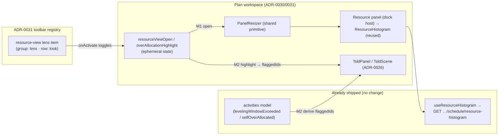
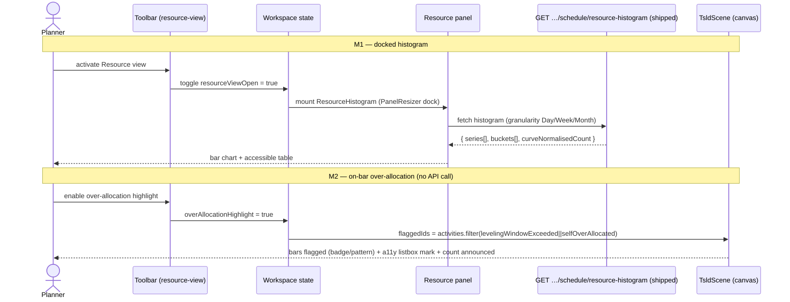
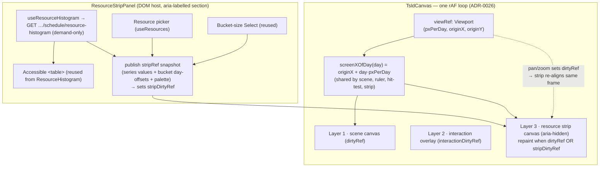

# Feature Spec: Stage E — Resource view on the canvas

- **Status:** Draft (awaiting approval)
- **Author(s):** feature-analyst (Claude Code)
- **Date:** 2026-07-20
- **Tracking issue / epic:** _TBD_ — Canvas toolbar/workspace programme, Stage E
- **Roadmap link:** TSLD toolbar roadmap (`docs/TOOLBAR_ROADMAP.md`) — `resource-view` lens item
- **Related ADR(s):** **ADR-0049** (canvas-axis-aligned resource strip — the render layer + coordinate seam, amends ADR-0026), ADR-0031 (toolbar item registry / lens group), ADR-0030 (resizable-panel primitive), ADR-0026 (canvas coordinate/viewport model + draw budget), ADR-0039/0041/0044 (resource model, levelling, loading curves)

---

## 1. Business understanding

### Problem

A planner working on the TSLD canvas can see logic, dates, criticality and (Stage A/B)
filter/colour/isolate/next-conflict lenses — but **resource loading and over-allocation
are invisible from the canvas.** The data already exists and already ships a UI: the
**resource histogram** (per-resource, curve-shaped units over time) and per-activity
**levelling over-allocation flags**. Today the histogram is reachable only as a
**modal dialog** ("Resource histogram") buried in the plan actions / toolbar overflow
menu (`plan-chrome-dialogs.tsx`), disconnected from the diagram the planner is reading.
The `resource-view` toolbar item is still a disabled **"Coming soon"** placeholder
(ADR-0031 `lens` group, Look row — `tsld-toolbar-items.tsx` line ~1465).

Stage E closes that gap: wire the `resource-view` lens so a planner can see **who is
loaded, how much, and where they are over-allocated** without leaving the canvas — the
"second lens" the roadmap promised, and the seed of the eventual TSLD / Gantt / Resource
`view-mode` switch (`docs/TOOLBAR_ROADMAP.md` Notes).

**Why now:** the resource epic (M7) shipped its data, endpoints and components
(`VITE_RESOURCES`, `VITE_RESOURCE_CURVES`, `VITE_RESOURCE_LEVELLING` are all **on by
default** as of 2026-07-18). This is a **frontend surfacing stage over shipped data** —
the cheapest, highest-leverage way to make that investment visible where planners
actually work. It follows the same proven pattern as Stages A–D (a fresh canvas flag,
dark → specialist reviews → flip; frontend-only; recalc parity gate untouched).

### Users

Mapped to the ADR-0016 organisation roles:

- **Planner** (primary) — needs to spot resource over-commitment while shaping the plan,
  and to read a resource's load profile against the timeline they are editing.
- **Contributor** — reads the resource view to understand loading on activities they
  progress; no write capability is added by this feature.
- **Org Admin** — same read view (plus everything a Planner sees).
- **Viewer** — read-only; the resource view is **view-only** for every role, so Viewers
  get it too. Nothing here writes.
- **External Guest** — out of scope (guest share is Stage F; the resource view rides the
  authenticated plan workspace).

### Primary use cases

1. **Open the resource view on the canvas.** From the `resource-view` toolbar lens,
   reveal a **docked resource-loading panel** (histogram + accessible table) below the
   TSLD canvas, and dismiss it again — without leaving the diagram.
2. **Read a resource's loading profile over time** at Day / Week / Month granularity,
   as a bar chart _and_ an equivalent keyboard-navigable data table (WCAG 2.2 AA).
3. **See which activities are over-allocated** directly on the diagram — an on-bar
   highlight lens over the already-shipped per-activity levelling flags
   (`levelingWindowExceeded`, `selfOverAllocated`), reusing the Stage-A/B canvas lens seam.

### User journeys

**Happy path (M1 — docked histogram panel):**
A Planner opens a plan with resources assigned. The canvas shows the diagram. They
activate **Resource view** on the Look row → a resizable panel docks below the canvas
showing each resource's loading histogram + the accessible data table, with a Day/Week/
Month bucket control. They read the load, resize the panel, then toggle Resource view off
to reclaim canvas height. (See the user-flow diagram in §4.)

**Over-allocation journey (M2 — on-bar highlight lens):**
With levelling on (`levelResources`), the Planner turns on the **over-allocation
highlight** (a mode inside the Resource view). Bars whose activity carries
`levelingWindowExceeded` / `selfOverAllocated` are visually flagged on the canvas (never
colour-only — a badge/pattern + the parallel a11y listbox marking + a count announcement),
and the existing Stage-B **Next conflict** already cycles the same `levelingWindowExceeded`
set. They fix assignments in the activity Resources dialog and recalculate; the highlight
clears.

**Alternate — no resource data:** a plan with no resources/assignments shows the panel's
existing empty state ("No resource loading to show yet — assign resources with budgeted
units and recalculate the schedule"). If the resource surface is entirely off
(`VITE_RESOURCES`/`VITE_RESOURCE_CURVES` disabled by an operator), the `resource-view`
item **stays its "Coming soon" placeholder** — there is no data to show.

### Expected outcomes

- Resource loading and over-allocation become a **first-class, in-context canvas lens**,
  not a buried modal.
- The `resource-view` roadmap placeholder becomes real; the toolbar reads as delivered.
- Zero risk to the scheduling engine: **frontend-only**, recalc parity gate byte-identical
  (`git diff --stat apps/api packages/types` empty for the recommended M1+M2 scope).

### Success criteria

- A Planner reveals the resource view from the toolbar and reads a resource's load in
  **< 10s**, without opening a modal.
- The docked panel adds **no measurable canvas draw-budget regression** (ADR-0026: draw
  ≤ 4ms p95 @ 2,000 activities) — the histogram is DOM/SVG below the canvas, and the M2
  on-bar highlight reuses the existing single-pass paint (no extra full repaint).
- The panel and its table pass **WCAG 2.2 AA** (the shipped `ResourceHistogram` already
  ships an `aria-hidden` chart + a real `<table>` equivalent; Stage E must preserve that
  through the dock).
- `VITE_CANVAS_RESOURCE_VIEW=false` restores the toolbar, canvas paint and a11y tree
  **byte-for-byte** (the placeholder returns) — the parity gate at every step.

### Open questions

See the **Critical questions** rollup at the end of §4 (Q1–Q4) with recommended defaults.

---

## 2. Functional requirements

### User stories & acceptance criteria

> **US-1 (M1)** — As a **Planner**, I want to reveal a **resource-loading panel on the
> canvas** from the toolbar, so I can read resource load against the plan I'm editing
> without opening a modal.
>
> **Acceptance criteria**
>
> - **Given** a plan with resources assigned and `VITE_CANVAS_RESOURCE_VIEW` on, **when**
>   I activate the `resource-view` lens, **then** a docked panel appears below the canvas
>   showing the shipped `ResourceHistogram` (per-resource bars + accessible table + bucket
>   control), and the toolbar item reflects the pressed/active state.
> - **Given** the panel is open, **when** I activate `resource-view` again, **then** the
>   panel collapses/hides and the canvas reclaims the height.
> - **Given** the panel is open, **when** I drag its resize handle, **then** it resizes
>   within the same clamp rules the activities bottom panel uses (canvas keeps
>   `CANVAS_MIN_HEIGHT`), and the height persists across the session.
> - **Given** no resources are assigned, **when** I open the panel, **then** I see the
>   existing empty state, not an error.

> **US-2 (M1)** — As **any role** (view-only), I want the resource view to be reachable
> and operable by keyboard and screen reader, so it meets WCAG 2.2 AA.
>
> **Acceptance criteria**
>
> - **Given** keyboard-only navigation, **when** I reach the `resource-view` toolbar item,
>   **then** it is a single roving-tabindex stop with a correct pressed/disabled name, and
>   activating it moves focus into the revealed panel (mirrors the activities-panel expand
>   focus move).
> - **Given** a screen reader, **when** the panel is open, **then** the load is available
>   as the shipped real `<table>` (the bar chart stays `aria-hidden`), and the panel is a
>   labelled region distinct from the "Activities" panel landmark.

> **US-3 (M2)** — As a **Planner**, I want over-allocated activities highlighted on the
> canvas, so I can find and fix resource conflicts visually.
>
> **Acceptance criteria**
>
> - **Given** levelling has run (`levelResources` on) and one or more activities carry
>   `levelingWindowExceeded` / `selfOverAllocated`, **when** I enable the over-allocation
>   highlight (a mode within Resource view), **then** those bars are flagged on the canvas
>   with a non-colour-only affordance (badge/pattern), the parallel a11y listbox marks
>   them, and a count is announced (reusing the Stage-A/B dim/mark/announce seam).
> - **Given** no activity is over-allocated (or the plan does not level), **when** I try
>   to enable the highlight, **then** it is disabled-with-reason ("No over-allocation to
>   show") — shade-don't-hide, matching Stage B's Next-conflict empty state.
> - **Given** the highlight is on, **when** I recalculate after fixing assignments,
>   **then** the highlight updates from the fresh engine flags (no client re-derivation of
>   over-allocation).

### Workflows

1. **Reveal / dismiss (M1):** toolbar `resource-view` toggles a workspace-owned
   `resourceViewOpen` state → the workspace mounts a `PanelResizer` + resource panel below
   the canvas (the same layout seam the `ActivityBottomPanel` uses in
   `plan-workspace.tsx` / `plan-workspace-toolbar.tsx`).
2. **Read load (M1):** the panel renders `<ResourceHistogram orgSlug planId />`
   unchanged — it owns its own Day/Week/Month `granularity` state and its
   `GET …/schedule/resource-histogram` query.
3. **Highlight over-allocation (M2):** the toolbar/panel sets an
   `overAllocationHighlight` mode → the `TsldScene` receives a `flaggedIds` set derived
   from `activities` where `levelingWindowExceeded || selfOverAllocated` → the existing
   paint marks them (reusing the Stage-A/B lens contribution), the a11y listbox marks
   them, and the count is announced.

### Edge cases

- **No resources / no assignments:** existing empty state (US-1 AC).
- **Resource surface off (`VITE_RESOURCES`/`VITE_RESOURCE_CURVES` operator-disabled):**
  no data source → `resource-view` stays the "Coming soon" placeholder (gated, see §4).
- **Plan not levelled (`levelResources` off):** all levelling counts are 0 → the M2
  highlight is disabled-with-reason; M1 histogram (demand) is unaffected (it does not
  need levelling).
- **Below `md` (mobile):** the workspace already switches to a single-pane Diagram/
  Activities toggle. The resource view must slot into that responsive model — either as a
  third pane in the toggle or as a full-width sheet — rather than a side-by-side dock (see
  Q2 note / component §4).
- **Very wide plan / many resources:** the histogram read is already paged (`meta.total`
  / `hasMore`); M1 reuses that as-is (no new perf surface). The panel scrolls internally.
- **Concurrent edit / recalc in flight:** the histogram query invalidates on the existing
  `scheduleKeys.resourceHistogram` sweep (assignment writes + recalc already do this);
  no new invalidation logic.

### Permissions

- **View-only for every role** (ADR-0012). The resource view **reads** the already-
  authorised `GET …/schedule/resource-histogram` (org-scoped, plan-scoped) and the
  already-loaded `activities` list. It writes nothing and is **not pen-gated** (mirrors
  the other Look-row lenses). No new permission is introduced.
- The M2 over-allocation highlight reads engine-owned `ActivitySummary` flags already in
  the loaded model — no additional scope check.

### Validation rules

None new — no user input is persisted. The only user-set state (panel open, panel height,
bucket granularity, highlight mode) is **ephemeral client state** (session-scoped),
consistent with the other canvas lenses. The bucket granularity is already validated
server-side by the shipped `HISTOGRAM_GRANULARITIES` enum on the read endpoint.

### Error scenarios

| Scenario                                   | Detection                           | User-facing result                                                            | Status    |
| ------------------------------------------ | ----------------------------------- | ----------------------------------------------------------------------------- | --------- |
| Histogram read fails                       | TanStack Query error (existing)     | The shipped panel's inline "Couldn't load the resource histogram" + Try again | (network) |
| Not a plan member / wrong org              | existing authz on the read endpoint | friendly forbidden; the panel query surfaces the error state                  | 403       |
| Resource surface flag off (no data source) | build-time flag gate                | `resource-view` stays "Coming soon" placeholder                               | —         |
| No over-allocation to highlight (M2)       | derived `flaggedIds.size === 0`     | highlight disabled-with-reason                                                | —         |

---

## 3. Technical analysis

| Area               | Impact                       | Notes                                                                                                                                                                                                                                                                                                                                                                                    |
| ------------------ | ---------------------------- | ---------------------------------------------------------------------------------------------------------------------------------------------------------------------------------------------------------------------------------------------------------------------------------------------------------------------------------------------------------------------------------------- |
| **Frontend**       | **med**                      | New `VITE_CANVAS_RESOURCE_VIEW` flag + config; wire `resource-view` from placeholder to a real `ToolbarItem`; new workspace state (`resourceViewOpen`, M2 `overAllocationHighlight`); a **new dock host** for the existing `ResourceHistogram`; a `TsldScene` `flaggedIds` contribution (M2). Reuses `PanelResizer`, `ResourceHistogram`, `TsldToolbarContext`, the Stage-A/B lens seam. |
| **Backend**        | **none (recommended scope)** | No new/changed module, service or endpoint for M1+M2. (An optional **demand-vs-capacity** overlay would need a read-model touch — explicitly deferred, see Dependencies / Q4.)                                                                                                                                                                                                           |
| **Database**       | **none**                     | No schema/migration/index change.                                                                                                                                                                                                                                                                                                                                                        |
| **API**            | **none (recommended scope)** | Reuses `GET /organizations/:orgSlug/plans/:planId/schedule/resource-histogram`. `git diff --stat apps/api packages/types` must be empty when the feature is inert.                                                                                                                                                                                                                       |
| **Security**       | **low**                      | View-only, reuses already-scoped read + already-loaded model; no new surface. Include security-reviewer only if the deferred capacity endpoint is pulled in.                                                                                                                                                                                                                             |
| **Performance**    | **low**                      | Histogram is DOM/SVG below the canvas (no canvas-draw cost). M2 highlight reuses the single-pass paint (a set membership check per bar). ADR-0026 budget unaffected; verify with the existing perf harness.                                                                                                                                                                              |
| **Infrastructure** | **none**                     | No new services/env/secrets/containers. One new `VITE_` flag.                                                                                                                                                                                                                                                                                                                            |
| **Observability**  | **none**                     | No new logs/metrics/traces.                                                                                                                                                                                                                                                                                                                                                              |
| **Testing**        | **med**                      | Unit (toolbar item states, dock open/close/resize, `flaggedIds` derivation), component (panel a11y region + focus move), e2e (flag-on reveal + read + highlight journey), a11y (WCAG 2.2 AA of the docked panel + on-bar highlight non-colour-only).                                                                                                                                     |

### Dependencies

- **Prerequisite (shipped):** `ResourceHistogram` component + `useResourceHistogram` +
  `GET …/schedule/resource-histogram` (M7-F6/rung 5, ADR-0044). All present, `VITE_RESOURCE_CURVES` on by default.
- **Prerequisite (shipped):** per-activity `levelingWindowExceeded` / `selfOverAllocated`
  on `ActivitySummary`, and `levelingWindowExceededCount` / `selfOverAllocatedCount` on
  the schedule summary (ADR-0041). Needed for M2.
- **Prerequisite (shipped):** ADR-0030 `PanelResizer` + workspace panel machinery; ADR-0031
  toolbar registry + `TsldToolbarContext`; the Stage-A/B `TsldScene` lens-contribution seam.
- **Deferred (explicit, NOT in recommended scope):** a **demand-vs-capacity** histogram
  (a capacity line per bucket / per-bucket over-allocation) — the histogram read-model is
  **demand-only** (`ResourceHistogramSeries.values` = curve-shaped budgeted units; there
  is **no capacity** in the series or meta). True in-histogram over-allocation would need
  an API change (add capacity to the read-model). Recommended to **defer** because
  per-activity levelling flags already give the over-allocation signal (M2) with **no API
  change**. If pulled in, it becomes an explicit API sub-task with api/security/backend-
  performance reviews (Q4).

---

## 4. Solution design

### Chosen approach (smallest correct surfacing)

**Reuse, don't rebuild.** The histogram component and its read-model already ship. Stage E
is a **thin frontend surfacing** layer:

- **M1 — dock the shipped histogram.** Wire `resource-view` to toggle a workspace-owned
  resource panel that mounts the **existing** `<ResourceHistogram>` via the **existing**
  `PanelResizer` seam. No new chart, no new read, no API change.
- **M2 — on-bar over-allocation highlight.** A `TsldScene` `flaggedIds` contribution
  derived client-side from the **already-loaded** per-activity levelling flags, painted
  via the **existing** Stage-A/B lens seam (mark + a11y listbox + announce; never
  colour-only).
- **Deferred — demand-vs-capacity in the histogram** (needs a read-model touch): **out of
  the recommended scope**, tracked as a follow-up (Q4).

This mirrors how Stage A (lenses), B (nav), C1 (export/print) and D (activity types) each
took a **fresh dark canvas flag** over already-shipped data and stayed frontend-only with
the parity gate byte-identical. **No ADR is required** — no cross-cutting standard changes;
the toolbar slot, the panel primitive and the lens seam all already exist (ADR-0031 says
turning a placeholder on needs no taxonomy/primitive change).

### Architecture overview



### Data flow



### User flow

```mermaid
flowchart TD
  A[Canvas open] --> B{Resource surface on?\n(VITE_RESOURCE_CURVES)}
  B -- no --> P["resource-view = 'Coming soon' placeholder"]
  B -- yes --> C[resource-view lens enabled]
  C --> D[Activate Resource view]
  D --> E[Resource panel docks below canvas\n+ focus moves into panel]
  E --> F[Read histogram / switch Day·Week·Month / resize]
  E --> G{Levelling run &\nany over-allocated?}
  G -- yes --> H[Enable over-allocation highlight\n→ bars flagged + count announced]
  G -- no --> I["Highlight disabled-with-reason\n'No over-allocation to show'"]
  F --> J[Deactivate → panel hides, canvas reclaims height]
```

### Database changes

**None.**

### API changes

**None for the recommended scope.** The feature reuses:

```
GET /api/v1/organizations/:orgSlug/plans/:planId/schedule/resource-histogram?granularity=DAY|WEEK|MONTH
→ { data: ResourceHistogramSeries[], meta: { buckets, granularity, total, hasMore, curveNormalisedCount } }
```

Deferred (only if the demand-vs-capacity overlay is approved, Q4): add a per-bucket
**capacity** dimension to the histogram read-model (new field on series/meta), designed
with database-architect (none — capacity is on the `Resource`, computed on a resource
calendar) and reviewed by api/security/backend-performance. **Not in the recommended
plan.**

### Component changes

- **Config:** `apps/web/src/config/env.ts` — new `CANVAS_RESOURCE_VIEW_ENABLED =
flagDefaultOff(import.meta.env.VITE_CANVAS_RESOURCE_VIEW) && RESOURCE_CURVES_ENABLED`
  (gated on the data source, mirroring how `CANVAS_AUTHORING_ENABLED` gates on its host
  flags). Add `VITE_CANVAS_RESOURCE_VIEW` to `vite-env.d.ts`.
- **Toolbar item:** `tsld-toolbar-items.tsx` — replace the `resource-view`
  `placeholderItem` with a flag-branched real `ToolbarItem` (shared shape spread into both
  branches, per the established C1/quick-wins pattern) whose `onActivate` toggles
  `ctx.toggleResourceView()` and whose active/disabled states mirror the shipped lenses
  (`isEnabled` gated on a computed diagram; disabled-with-reason otherwise). M2 adds the
  over-allocation highlight either as a second item or a split-button mode on the same
  item (Q2).
- **Toolbar context:** `tsld-toolbar-context.tsx` — add `resourceViewOpen` /
  `toggleResourceView` (and M2 `overAllocationHighlight` / `toggleOverAllocation`), wired
  from the workspace model, mirroring the existing lens context fields.
- **Dock host:** a new `ResourceViewPanel` under
  `apps/web/src/components/layout/workspace/` that renders `<ResourceHistogram>` inside a
  labelled `<section>` (distinct landmark name from "Activities panel"), plus the
  workspace wiring in `plan-workspace-toolbar.tsx` (and the ADR-0030 fallback) to mount it
  with a `PanelResizer` and a persisted height (extend/parallel `useActivityPanelPrefs`).
  Responsive: slot into the below-`md` single-pane toggle (Q2).
- **Canvas (M2 only):** extend the `TsldScene` `flaggedIds`/lens contribution
  (`render/lenses.ts` + paint) to mark over-allocated bars — reusing the Stage-A/B
  mark/announce/listbox machinery; **no new full repaint**.
- **States:** loading / empty / error are already handled inside `ResourceHistogram`;
  the dock adds open/collapsed/resizing states (reuse the activities-panel patterns) and
  the M2 highlight adds a disabled-with-reason state.
- **No one-off styling** — semantic tokens + existing primitives throughout.

### Implementation approach & alternatives

**Chosen:** reuse the shipped histogram + read-model, dock it via the shared panel
primitive, add an on-bar highlight over shipped levelling flags; new dark flag
`VITE_CANVAS_RESOURCE_VIEW`; frontend-only; parity gate byte-identical.

**Alternatives considered:**

- **(A) Build a brand-new canvas-native resource strip that shares the TSLD time axis
  (buckets pinned to the canvas x-scale, scroll-synced).** Rejected for v1: much larger,
  higher risk (couples to the ADR-0026 viewport/coordinate model and draw budget),
  and duplicates a shipped component. A genuine **time-axis-aligned** strip is a strong
  future slice but not the smallest correct surfacing. (Recorded as a follow-up / Q-note:
  the reused histogram keeps its **own** Day/Week/Month axis, independent of canvas
  zoom/scroll — an honest reuse boundary.)
- **(B) Reuse `VITE_RESOURCES` / `VITE_RESOURCE_CURVES` instead of a new flag.** Rejected:
  those govern the _domain data surface_ (library, assignment editor, the modal
  histogram). Stage E is a distinct _canvas capability_ with its own review gates (a11y of
  the dock + the on-bar highlight), matching how every prior canvas stage took a fresh
  dark flag then flipped after specialist review. We **do** gate the new flag on
  `RESOURCE_CURVES_ENABLED` (no data → placeholder).
- **(C) Add demand-vs-capacity to the histogram now (API change).** Rejected for the
  recommended scope: the per-activity levelling flags already deliver the over-allocation
  signal frontend-only; adding capacity to the read-model breaks the frontend-only /
  parity-gate discipline this stage is designed around. Deferred to a follow-up (Q4).
- **(D) Keep it a modal (status quo).** Rejected: the whole point of the `resource-view`
  lens is in-context reading against the diagram; a modal already exists and is the thing
  we're improving on.

### Critical questions — RESOLVED at approval (2026-07-20, product sign-off)

- **Q1 — Reuse the shipped histogram vs build a new canvas-axis-aligned resource strip?**
  **RESOLVED: BUILD THE CANVAS-AXIS-ALIGNED STRIP.** The product owner chose the
  higher-fidelity path over the reuse default: M1 is a resource strip whose **time axis is
  pixel-aligned to the TSLD canvas's zoom/scroll** (demand bars aligned under the diagram
  columns), not the modal `ResourceHistogram` with its own independent axis. This is
  **new render work** within the ADR-0026 draw budget and needs a **ui-architect design
  pass** first (render-layer choice — Canvas layer vs viewport-synced DOM/SVG — the shared
  coordinate/viewport model, culling, and the parallel a11y table). It still reuses the
  shipped **demand read-model** (`useResourceHistogram` / `GET …/schedule/resource-histogram`)
  as the data source and stays **frontend-only** (no API/schema/`@repo/types`/CPM-engine
  change; parity gate byte-identical). The shipped modal `ResourceHistogram`'s a11y table +
  bucket-size control are reused/mirrored where possible.
- **Q2 — Histogram strip vs on-bar over-allocation overlay vs both?**
  **RESOLVED: BOTH, sliced** — M1 the canvas-axis-aligned demand strip, M2 the on-bar
  over-allocation highlight over the shipped per-activity levelling flags (frontend-only).
  Responsive/below-`md` placement and dock-height contention (activities dock + resource
  strip) resolved during design with ux/component review.
- **Q3 — New `VITE_CANVAS_RESOURCE_VIEW` flag vs reuse `VITE_RESOURCES`?**
  **Recommended default: NEW flag** (`flagDefaultOff` → specialist reviews → flip),
  **gated on `RESOURCE_CURVES_ENABLED`** so it can't show with no data. Mirrors Stage
  A/B/C1/D precedent.
- **Q4 — Is a read endpoint missing (frontend-only vs needs an API sub-task)?**
  **Recommended default: NO endpoint is missing for the recommended scope.** Demand
  (histogram) and over-allocation (per-activity levelling flags) both ship. The **only**
  gap is a true **demand-vs-capacity** line in the histogram read-model (it is demand-only)
  — **defer** it; if approved later, it is an explicit API sub-task with api/security/
  backend-performance reviews.

---

## 4.6 Design pass — the canvas-axis-aligned resource strip (ui-architect, 2026-07-20)

Following the Q1 resolution (**build the axis-aligned strip, not the modal**), this pass fixes
the render layer, the coordinate seam, and the layout. The significant render-layer choice is
recorded as **ADR-0049** (amends ADR-0026). M1's shape below supersedes the earlier "dock the
shipped modal" M1 in the implementation plan.

### Recommendation in one line

Draw the strip's demand bars on a **Canvas 2D sibling layer painted by the existing
`TsldCanvas` render loop from the same `viewRef`** — the third layer in the ADR-0026 stack
(scene · interaction overlay · **resource strip**) — with all strip _chrome_ (resource picker,
bucket `Select`, the reused accessible `<table>`) in a DOM host. This guarantees frame-perfect
alignment by construction and reuses the cull / dirty-flag / theme-re-resolve machinery.

### Q1 — Render layer: Canvas sibling layer (recommended) vs viewport-synced DOM/SVG

**Canvas sibling layer.** The whole product ask is that the bars co-move with the diagram at
every pan/zoom frame. `TsldCanvas` already runs one `rAF` loop over one authoritative
`viewRef: Viewport` and repaints dirty frames; the date-ruler and hit-testing already read the
same `screenXOfDay(day) = originX + day·pxPerDay` mapping so they can never disagree. Painting
the strip in that same loop from that same `viewRef` inherits frame-perfect alignment with
**zero desync surface**, stays within the ADR-0026 draw budget (O(visible buckets), far below
the 2,000-activity envelope), and reuses culling + the theme re-resolve. The a11y gap a canvas
opens is already solved by the shipped `ResourceHistogram` pattern (aria-hidden chart + real
`<table>`), which we reuse. A viewport-synced **DOM/SVG** strip was rejected: to stay aligned
during pan it needs its own rAF reading a shared viewport ref (a one-frame desync risk against
the very canvas it must track), a container `scaleX` distorts bar borders and over-allocation
badges, and its "native a11y" upside is illusory (positioned `<div>` bars tell a screen reader
nothing — we'd render the parallel table regardless). See ADR-0049 for the full weighing.

### Q2 — The exact coordinate-sharing seam

The strip **shares** the viewport; it must never own one.

- **Reserve height, share the x-axis.** A dedicated `aria-hidden` sibling `<canvas>` is pinned
  as a fixed-height band at the **bottom of the `TsldCanvas` container**. When active,
  `measure()` subtracts the strip band height from the _scene_ canvas's drawable height exactly
  as `RULER_HEIGHT` is already subtracted from the top; when inactive it reserves nothing, so
  the scene stays byte-for-byte today's (parity gate).
- **Two dirty flags, decoupled (ADR-0026 model).** Add `stripDirtyRef` (set by _data_ changes:
  selected resource, granularity, series refetch, theme re-resolve) alongside the existing
  `dirtyRef` (set by _viewport_ changes: pan/zoom/resize). The strip repaints when **either**
  is set. A viewport move already sets `dirtyRef` (the scene repaints that frame anyway), so the
  strip **re-aligns for free** on the same frame; a granularity/resource switch sets only
  `stripDirtyRef`, repainting the strip **without** repainting the main scene — the same
  separation the interaction overlay already uses (`interactionDirtyRef`). **No main-scene
  repaint is triggered by strip-only changes.**
- **Data in through a ref (no per-frame React).** The DOM host `ResourceStripPanel` owns the
  `useResourceHistogram` / `useResources` queries and publishes an immutable `stripRef` snapshot
  — the selected series `values`, the bucket axis pre-projected to day offsets
  (`daysBetween(dataDate, bucket.start|end)`), and the resolved strip palette — into
  `TsldCanvas`; writing the ref sets `stripDirtyRef`. This mirrors the existing `pendingRef` /
  `selectionAnchorRef` seams (ADR-0026 D3). Bucket `i` draws at
  `x1 = screenXOfDay(dayOffset(start_i))` … `x2 = screenXOfDay(dayOffset(end_i))`, so a WEEK
  bucket spans exactly 7 day-columns and a MONTH bucket ~30 — alignment is definitional. The
  strip culls buckets whose `[x1, x2)` falls outside the surface, like the scene.
- **Note on granularity vs zoom.** Bucket granularity (Day/Week/Month) is a _separate_ control
  from canvas zoom: the planner can read Month buckets while zoomed to day columns; the month
  bar simply spans its ~30 columns. This is honest and desired, not a bug.

### Q3 — Vertical layout / height contention (resolved)

**The strip is not a second workspace bottom dock.** It is a fixed-height band at the bottom of
the **canvas region itself** (inside `TsldPanel`/`TsldCanvas`), above the activities bottom
dock. It therefore rides the canvas's own height budget and shares the canvas x-axis — which is
exactly what "axis-aligned" requires — and the activities dock keeps its existing
`CANVAS_MIN_HEIGHT` clamp untouched. This dissolves the feature-analyst's "two bottom docks
contend for height" risk: the two never compete, because the strip lives _within_ the canvas
pane, not beside the activity pane. The strip band has a small fixed default height with an
optional in-canvas resize (its own clamp, independent of the activities `PanelResizer`).
**Below `md`** the workspace is already a single-pane Diagram/Activities toggle; the strip rides
the **Diagram** pane (it is part of the canvas surface), so no third pane is introduced.

### Q4 — Resource selection

The read-model is per-resource; a thin strip shows **one** resource at a time. The
`ResourceStripPanel` header carries a **resource picker** (a `Select`/combobox populated from
`useResources`, reusing the modal's `nameById` name resolution) and the reused **bucket-size
`Select`**. Default selection: the first (or most-loaded) series. States reuse the modal's exact
copy — loading ("Loading histogram…"), error ("Couldn't load the resource histogram." + Try
again), and empty ("No resource loading to show yet — assign resources with budgeted units and
recalculate the schedule."). When nothing is selectable, the canvas strip layer draws nothing
and the DOM band shows the empty state. (A small multi-resource stack is a possible fast-follow;
v1 is single-resource to fit the band.)

### Q5 — Accessibility

The strip canvas is `aria-hidden`; the `ResourceStripPanel` renders the shipped
`ResourceHistogram`'s real, keyboard-navigable `<table>` (scope-ed headers + caption) as the
accessible equivalent, inside a `<section aria-label="Resource loading">` (a landmark name
distinct from "Activities panel"). The parallel table is reachable by keyboard (default: shown
in the band, or one disclosure control away if the band is height-constrained — the
accessibility-reviewer confirms whether it must be always-rendered vs disclosure-gated). The
strip palette re-resolves from design tokens on the shared `useThemeVersion` bump (Canvas 2D
`fillStyle` can't take a `var()`), like the main painter, so it is theme-aware. M2/M3
over-allocation cues are never colour-only (pattern/glyph + table marking + announced count).

### Q6 — Vertical scale

Bar height auto-fits the selected resource's **whole-series** peak (`max` over _all_ buckets,
not just the visible ones) so bars **do not rescale while panning** (a viewport-derived scale
would be disorienting). A single labelled max tick sits at the top of the band; exact per-bucket
values live in the parallel table. **No capacity** is available yet (the read-model is
demand-only), so a capacity reference line is **deferred to M3** (needs an API touch, Q4).

### Data + coordinate flow



---

## 5. Links

- Render-layer decision: `docs/adr/0049-canvas-axis-aligned-resource-strip.md` (amends ADR-0026)
- Design pass (this doc): §4.6 — the canvas-axis-aligned strip, render layer + coordinate seam
- Implementation plan: `docs/specs/canvas-resource-view/implementation-plan.md`
- Toolbar roadmap entry: `docs/TOOLBAR_ROADMAP.md` (`resource-view`)
- Reused component: `apps/web/src/features/resources/components/ResourceHistogram.tsx`
- Reused read: `apps/web/src/features/resources/api/use-resources.ts` (`useResourceHistogram`)
- Reused seams: `apps/web/src/components/ui/panel-resizer.tsx` (ADR-0030),
  `apps/web/src/features/tsld/toolbar/*` (ADR-0031),
  `apps/web/src/features/tsld/render/lenses.ts` (Stage A/B seam)
- Related docs to update on build: `docs/TOOLBAR_ROADMAP.md`, `CLAUDE.md` (§12 flag list), `docs/DECISIONS.md`
